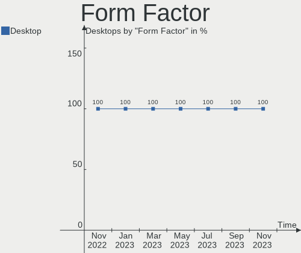
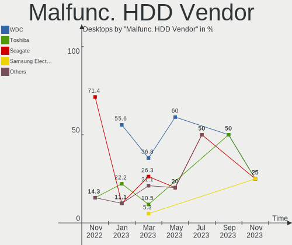
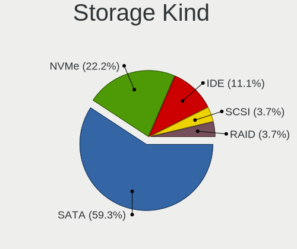
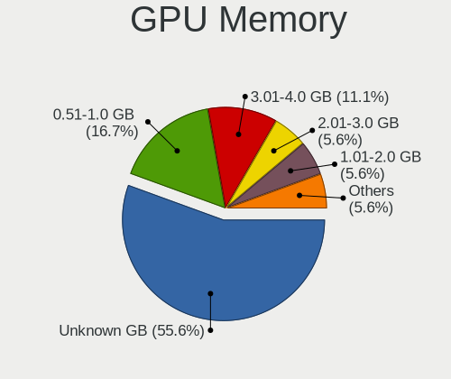
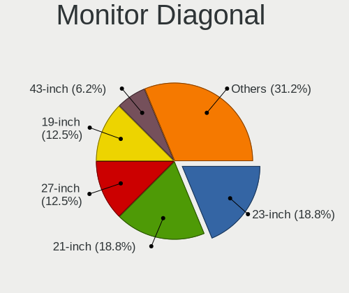
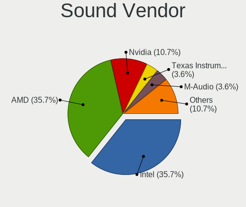

helloSystem - Hardware Trends (Desktops)
----------------------------------------

A project to identify most popular hardware characteristics and track their change
over time based on data collected by BSD users at https://BSD-Hardware.info.

Anyone can contribute to this report by the [hw-probe](https://github.com/linuxhw/hw-probe/blob/master/INSTALL.BSD.md) tool:

    hw-probe -all -upload

This report is for one last month. Overall report since the beginning of time: [TestCoverage](https://github.com/bsdhw/TestCoverage)

Period: Jun, 2022.

Contents
--------

* [ System ](#system)
  - [ OS                       ](#os)
  - [ OS Family                ](#os-family)
  - [ Arch                     ](#arch)
  - [ DE                       ](#de)
  - [ Display Server           ](#display-server)
  - [ Display Manager          ](#display-manager)
  - [ OS Lang                  ](#os-lang)
  - [ Boot Mode                ](#boot-mode)
  - [ Filesystem               ](#filesystem)
  - [ Part. scheme             ](#part-scheme)

* [ Board ](#board)
  - [ Vendor                   ](#vendor)
  - [ Model                    ](#model)
  - [ Model Family             ](#model-family)
  - [ MFG Year                 ](#mfg-year)
  - [ Form Factor              ](#form-factor)
  - [ Coreboot                 ](#coreboot)
  - [ RAM Size                 ](#ram-size)
  - [ RAM Used                 ](#ram-used)
  - [ Total Drives             ](#total-drives)
  - [ Has CD-ROM               ](#has-cd-rom)
  - [ Has Ethernet             ](#has-ethernet)
  - [ Has WiFi                 ](#has-wifi)
  - [ Has Bluetooth            ](#has-bluetooth)

* [ Location ](#location)
  - [ Country                  ](#country)
  - [ City                     ](#city)

* [ Drives ](#drives)
  - [ Drive Vendor             ](#drive-vendor)
  - [ Drive Model              ](#drive-model)
  - [ HDD Vendor               ](#hdd-vendor)
  - [ SSD Vendor               ](#ssd-vendor)
  - [ Drive Kind               ](#drive-kind)
  - [ Drive Connector          ](#drive-connector)
  - [ Drive Size               ](#drive-size)
  - [ Space Total              ](#space-total)
  - [ Space Used               ](#space-used)
  - [ Malfunc. Drives          ](#malfunc-drives)
  - [ Malfunc. Drive Vendor    ](#malfunc-drive-vendor)
  - [ Malfunc. HDD Vendor      ](#malfunc-hdd-vendor)
  - [ Malfunc. Drive Kind      ](#malfunc-drive-kind)
  - [ Failed Drives            ](#failed-drives)
  - [ Failed Drive Vendor      ](#failed-drive-vendor)
  - [ Drive Status             ](#drive-status)

* [ Storage controller ](#storage-controller)
  - [ Storage Vendor           ](#storage-vendor)
  - [ Storage Model            ](#storage-model)
  - [ Storage Kind             ](#storage-kind)

* [ Processor ](#processor)
  - [ CPU Vendor               ](#cpu-vendor)
  - [ CPU Model                ](#cpu-model)
  - [ CPU Model Family         ](#cpu-model-family)
  - [ CPU Cores                ](#cpu-cores)
  - [ CPU Sockets              ](#cpu-sockets)
  - [ CPU Threads              ](#cpu-threads)
  - [ CPU Microarch            ](#cpu-microarch)

* [ Graphics ](#graphics)
  - [ GPU Vendor               ](#gpu-vendor)
  - [ GPU Model                ](#gpu-model)
  - [ GPU Combo                ](#gpu-combo)
  - [ GPU Driver               ](#gpu-driver)
  - [ GPU Memory               ](#gpu-memory)

* [ Monitor ](#monitor)
  - [ Monitor Vendor           ](#monitor-vendor)
  - [ Monitor Model            ](#monitor-model)
  - [ Monitor Resolution       ](#monitor-resolution)
  - [ Monitor Diagonal         ](#monitor-diagonal)
  - [ Monitor Width            ](#monitor-width)
  - [ Aspect Ratio             ](#aspect-ratio)
  - [ Monitor Area             ](#monitor-area)
  - [ Pixel Density            ](#pixel-density)
  - [ Multiple Monitors        ](#multiple-monitors)

* [ Network ](#network)
  - [ Net Controller Vendor    ](#net-controller-vendor)
  - [ Net Controller Model     ](#net-controller-model)
  - [ Wireless Vendor          ](#wireless-vendor)
  - [ Wireless Model           ](#wireless-model)
  - [ Ethernet Vendor          ](#ethernet-vendor)
  - [ Ethernet Model           ](#ethernet-model)
  - [ Net Controller Kind      ](#net-controller-kind)
  - [ Used Controller          ](#used-controller)
  - [ NICs                     ](#nics)
  - [ IPv6                     ](#ipv6)

* [ Bluetooth ](#bluetooth)
  - [ Bluetooth Vendor         ](#bluetooth-vendor)
  - [ Bluetooth Model          ](#bluetooth-model)

* [ Sound ](#sound)
  - [ Sound Vendor             ](#sound-vendor)
  - [ Sound Model              ](#sound-model)

* [ Memory ](#memory)
  - [ Memory Vendor            ](#memory-vendor)
  - [ Memory Model             ](#memory-model)
  - [ Memory Kind              ](#memory-kind)
  - [ Memory Form Factor       ](#memory-form-factor)
  - [ Memory Size              ](#memory-size)
  - [ Memory Speed             ](#memory-speed)

* [ Printers & scanners ](#printers--scanners)
  - [ Printer Vendor           ](#printer-vendor)
  - [ Printer Model            ](#printer-model)
  - [ Scanner Vendor           ](#scanner-vendor)
  - [ Scanner Model            ](#scanner-model)

* [ Camera ](#camera)
  - [ Camera Vendor            ](#camera-vendor)
  - [ Camera Model             ](#camera-model)

* [ Security ](#security)
  - [ Fingerprint Vendor       ](#fingerprint-vendor)
  - [ Fingerprint Model        ](#fingerprint-model)
  - [ Chipcard Vendor          ](#chipcard-vendor)
  - [ Chipcard Model           ](#chipcard-model)

* [ Unsupported ](#unsupported)
  - [ Unsupported Devices      ](#unsupported-devices)
  - [ Unsupported Device Types ](#unsupported-device-types)

System
------

OS
--

Installed operating systems

| Name              | Desktops | Percent |
|-------------------|----------|---------|
| helloSystem 0.7.0 | 7        | 87.5%   |
| helloSystem 0.5.0 | 1        | 12.5%   |

OS Family
---------

OS without a version

| Name        | Desktops | Percent |
|-------------|----------|---------|
| helloSystem | 8        | 100%    |

Arch
----

OS architecture (x86_64, i586, etc.)

| Name  | Desktops | Percent |
|-------|----------|---------|
| amd64 | 8        | 100%    |

DE
--

Desktop Environment

| Name         | Desktops | Percent |
|--------------|----------|---------|
| helloDesktop | 8        | 100%    |

Display Server
--------------

X11 or Wayland

| Name | Desktops | Percent |
|------|----------|---------|
| X11  | 8        | 100%    |

Display Manager
---------------

SDDM, LightDM, etc.

| Name | Desktops | Percent |
|------|----------|---------|
| SLiM | 8        | 100%    |

OS Lang
-------

Language

| Lang  | Desktops | Percent |
|-------|----------|---------|
| en_US | 8        | 100%    |

Boot Mode
---------

EFI or BIOS

| Mode | Desktops | Percent |
|------|----------|---------|
| EFI  | 8        | 100%    |

Filesystem
----------

Type of filesystem

| Type   | Desktops | Percent |
|--------|----------|---------|
| Zfs    | 6        | 75%     |
| Cd9660 | 2        | 25%     |

Part. scheme
------------

Scheme of partitioning

| Type | Desktops | Percent |
|------|----------|---------|
| GPT  | 8        | 100%    |

Board
-----

Vendor
------

Motherboard manufacturer

| Name                | Desktops | Percent |
|---------------------|----------|---------|
| ASUSTek Computer    | 3        | 37.5%   |
| Lenovo              | 1        | 12.5%   |
| Hewlett-Packard     | 1        | 12.5%   |
| Gigabyte Technology | 1        | 12.5%   |
| ALLEGIANCE GAMING   | 1        | 12.5%   |
| Acer                | 1        | 12.5%   |

Model
-----

Motherboard model

| Name                                              | Desktops | Percent |
|---------------------------------------------------|----------|---------|
| Lenovo ThinkCentre XXXX Y                         | 1        | 12.5%   |
| HP Compaq 8100 Elite CMT PC                       | 1        | 12.5%   |
| Gigabyte GA-970A-UD3                              | 1        | 12.5%   |
| ASUS TUF B360M-E GAMING                           | 1        | 12.5%   |
| ASUS ROG STRIX Z390-F GAMING                      | 1        | 12.5%   |
| ASUS P8B75-M LX PLUS                              | 1        | 12.5%   |
| ALLEGIANCE GAMING Intel Core i7/Xeon E5 Processor | 1        | 12.5%   |
| Acer Aspire T180                                  | 1        | 12.5%   |

Model Family
------------

Motherboard model prefix

| Name                    | Desktops | Percent |
|-------------------------|----------|---------|
| Lenovo ThinkCentre      | 1        | 12.5%   |
| HP Compaq               | 1        | 12.5%   |
| Gigabyte GA-970A-UD3    | 1        | 12.5%   |
| ASUS TUF                | 1        | 12.5%   |
| ASUS ROG                | 1        | 12.5%   |
| ASUS P8B75-M            | 1        | 12.5%   |
| ALLEGIANCE GAMING Intel | 1        | 12.5%   |
| Acer Aspire             | 1        | 12.5%   |

MFG Year
--------

Motherboard manufacture year

| Year | Desktops | Percent |
|------|----------|---------|
| 2019 | 2        | 25%     |
| 2012 | 2        | 25%     |
| 2021 | 1        | 12.5%   |
| 2014 | 1        | 12.5%   |
| 2009 | 1        | 12.5%   |
| 2007 | 1        | 12.5%   |

Form Factor
-----------

Physical design of the computer

| Name    | Desktops | Percent |
|---------|----------|---------|
| Desktop | 8        | 100%    |

Coreboot
--------

Have coreboot on board

| Used | Desktops | Percent |
|------|----------|---------|
| No   | 8        | 100%    |

RAM Size
--------

Total RAM memory

| Size in GB | Desktops | Percent |
|------------|----------|---------|
| 4.01-8.0   | 2        | 25%     |
| 32.01-64.0 | 2        | 25%     |
| 16.01-24.0 | 2        | 25%     |
| 8.01-16.0  | 2        | 25%     |

RAM Used
--------

Used RAM memory

| Used GB  | Desktops | Percent |
|----------|----------|---------|
| 1.01-2.0 | 3        | 37.5%   |
| 0.01-0.5 | 3        | 37.5%   |
| 0.51-1.0 | 2        | 25%     |

Total Drives
------------

Number of drives on board

| Drives | Desktops | Percent |
|--------|----------|---------|
| 3      | 3        | 37.5%   |
| 1      | 3        | 37.5%   |
| 4      | 1        | 12.5%   |
| 2      | 1        | 12.5%   |

Has CD-ROM
----------

Has CD-ROM on board

| Presented | Desktops | Percent |
|-----------|----------|---------|
| Yes       | 4        | 50%     |
| No        | 4        | 50%     |

Has Ethernet
------------

Has Ethernet on board

| Presented | Desktops | Percent |
|-----------|----------|---------|
| Yes       | 8        | 100%    |

Has WiFi
--------

Has WiFi module

| Presented | Desktops | Percent |
|-----------|----------|---------|
| No        | 6        | 75%     |
| Yes       | 2        | 25%     |

Has Bluetooth
-------------

Has Bluetooth module

| Presented | Desktops | Percent |
|-----------|----------|---------|
| No        | 7        | 87.5%   |
| Yes       | 1        | 12.5%   |

Location
--------

Country
-------

Geographic location (country)

| Country   | Desktops | Percent |
|-----------|----------|---------|
| USA       | 1        | 12.5%   |
| Romania   | 1        | 12.5%   |
| Poland    | 1        | 12.5%   |
| Italy     | 1        | 12.5%   |
| Germany   | 1        | 12.5%   |
| Canada    | 1        | 12.5%   |
| Brazil    | 1        | 12.5%   |
| Australia | 1        | 12.5%   |

City
----

Geographic location (city)

| City                | Desktops | Percent |
|---------------------|----------|---------|
| Sao Paulo           | 1        | 12.5%   |
| Perth               | 1        | 12.5%   |
| Monteleone di Fermo | 1        | 12.5%   |
| Kalisz              | 1        | 12.5%   |
| Flagstaff           | 1        | 12.5%   |
| Dragasani           | 1        | 12.5%   |
| Calgary             | 1        | 12.5%   |
| Bonn                | 1        | 12.5%   |

Drives
------

Drive Vendor
------------

Hard drive vendors

| Vendor              | Desktops | Drives | Percent |
|---------------------|----------|--------|---------|
| Seagate             | 5        | 5      | 27.78%  |
| WDC                 | 3        | 3      | 16.67%  |
| Crucial             | 3        | 3      | 16.67%  |
| Toshiba             | 1        | 1      | 5.56%   |
| Team                | 1        | 1      | 5.56%   |
| Samsung Electronics | 1        | 1      | 5.56%   |
| Phison              | 1        | 1      | 5.56%   |
| OCZ                 | 1        | 1      | 5.56%   |
| KingSpec            | 1        | 1      | 5.56%   |
| Intel               | 1        | 1      | 5.56%   |

Drive Model
-----------

Hard drive models

| Model                           | Desktops | Percent |
|---------------------------------|----------|---------|
| WDC WD3200BPVT-22ZEST0 320GB    | 1        | 5.56%   |
| WDC WD3000BLFS-01YBU0 304GB     | 1        | 5.56%   |
| WDC WD20EURS-63S48Y0 2TB        | 1        | 5.56%   |
| Toshiba MQ01ABD100 1TB          | 1        | 5.56%   |
| Team T2535T240G 240GB           | 1        | 5.56%   |
| Seagate ST8000DM004-2CX188 8TB  | 1        | 5.56%   |
| Seagate ST500DM002-1SB10A 500GB | 1        | 5.56%   |
| Seagate ST3160812AS 160GB       | 1        | 5.56%   |
| Seagate ST31000528AS 1TB        | 1        | 5.56%   |
| Seagate ST1000DM010-2EP102 1TB  | 1        | 5.56%   |
| Samsung HM321HI 320GB           | 1        | 5.56%   |
| Phison ASE8NVME512 512GB        | 1        | 5.56%   |
| OCZ VERTEX2 120GB               | 1        | 5.56%   |
| KingSpec P3-128 128GB           | 1        | 5.56%   |
| Intel SSDSC2CT080A4 80GB        | 1        | 5.56%   |
| Crucial CT500P2SSD8 500GB       | 1        | 5.56%   |
| Crucial CT275MX300SSD1 275GB    | 1        | 5.56%   |
| Crucial CT1000P1SSD8 1TB        | 1        | 5.56%   |

HDD Vendor
----------

Hard disk drive vendors

| Vendor              | Desktops | Drives | Percent |
|---------------------|----------|--------|---------|
| Seagate             | 5        | 5      | 50%     |
| WDC                 | 3        | 3      | 30%     |
| Toshiba             | 1        | 1      | 10%     |
| Samsung Electronics | 1        | 1      | 10%     |

SSD Vendor
----------

Solid state drive vendors

| Vendor   | Desktops | Drives | Percent |
|----------|----------|--------|---------|
| Team     | 1        | 1      | 20%     |
| OCZ      | 1        | 1      | 20%     |
| KingSpec | 1        | 1      | 20%     |
| Intel    | 1        | 1      | 20%     |
| Crucial  | 1        | 1      | 20%     |

Drive Kind
----------

HDD or SSD

| Kind | Desktops | Drives | Percent |
|------|----------|--------|---------|
| HDD  | 6        | 10     | 50%     |
| SSD  | 4        | 5      | 33.33%  |
| NVMe | 2        | 3      | 16.67%  |

Drive Connector
---------------

SATA, SAS, NVMe, etc.

| Type | Desktops | Drives | Percent |
|------|----------|--------|---------|
| SATA | 8        | 15     | 80%     |
| NVMe | 2        | 3      | 20%     |

Drive Size
----------

Size of hard drive

| Size in TB | Desktops | Drives | Percent |
|------------|----------|--------|---------|
| 0.01-0.5   | 7        | 10     | 63.64%  |
| 0.51-1.0   | 2        | 3      | 18.18%  |
| 1.01-2.0   | 1        | 1      | 9.09%   |
| 4.01-10.0  | 1        | 1      | 9.09%   |

Space Total
-----------

Amount of disk space available on the file system

| Size in GB | Desktops | Percent |
|------------|----------|---------|
| 101-250    | 3        | 37.5%   |
| 1-20       | 3        | 37.5%   |
| 251-500    | 2        | 25%     |

Space Used
----------

Amount of used disk space

| Used GB | Desktops | Percent |
|---------|----------|---------|
| 1-20    | 8        | 100%    |

Malfunc. Drives
---------------

Drive models with a malfunction

| Model                    | Desktops | Drives | Percent |
|--------------------------|----------|--------|---------|
| WDC WD20EURS-63S48Y0 2TB | 1        | 1      | 33.33%  |
| KingSpec P3-128 128GB    | 1        | 1      | 33.33%  |
| Intel SSDSC2CT080A4 80GB | 1        | 1      | 33.33%  |

Malfunc. Drive Vendor
---------------------

Vendors of faulty drives

| Vendor   | Desktops | Drives | Percent |
|----------|----------|--------|---------|
| WDC      | 1        | 1      | 33.33%  |
| KingSpec | 1        | 1      | 33.33%  |
| Intel    | 1        | 1      | 33.33%  |

Malfunc. HDD Vendor
-------------------

Vendors of faulty HDD drives

| Vendor | Desktops | Drives | Percent |
|--------|----------|--------|---------|
| WDC    | 1        | 1      | 100%    |

Malfunc. Drive Kind
-------------------

Kinds of faulty drives

| Kind | Desktops | Drives | Percent |
|------|----------|--------|---------|
| SSD  | 2        | 2      | 66.67%  |
| HDD  | 1        | 1      | 33.33%  |

Failed Drives
-------------

Failed drive models

Zero info for selected period =(

Failed Drive Vendor
-------------------

Failed drive vendors

Zero info for selected period =(

Drive Status
------------

Number of failed and malfunc. drives

| Status  | Desktops | Drives | Percent |
|---------|----------|--------|---------|
| Works   | 6        | 15     | 66.67%  |
| Malfunc | 3        | 3      | 33.33%  |

Storage controller
------------------

Storage Vendor
--------------

Storage controller vendors

| Vendor                    | Desktops | Percent |
|---------------------------|----------|---------|
| Intel                     | 6        | 54.55%  |
| Micron/Crucial Technology | 2        | 18.18%  |
| Phison Electronics        | 1        | 9.09%   |
| Nvidia                    | 1        | 9.09%   |
| AMD                       | 1        | 9.09%   |

Storage Model
-------------

Storage controller models

| Model                                                                        | Desktops | Percent |
|------------------------------------------------------------------------------|----------|---------|
| Phison NVMe Storage Controller                                               | 1        | 7.14%   |
| Nvidia MCP61 SATA Controller                                                 | 1        | 7.14%   |
| Nvidia MCP61 IDE                                                             | 1        | 7.14%   |
| Micron/Crucial P2 NVMe PCIe SSD                                              | 1        | 7.14%   |
| Micron/Crucial P1 NVMe PCIe SSD                                              | 1        | 7.14%   |
| Intel SATA Controller [RAID mode]                                            | 1        | 7.14%   |
| Intel Cannon Lake PCH SATA AHCI Controller                                   | 1        | 7.14%   |
| Intel C600/X79 series chipset 6-Port SATA AHCI Controller                    | 1        | 7.14%   |
| Intel 82801JD/DO (ICH10 Family) 4-port SATA IDE Controller                   | 1        | 7.14%   |
| Intel 82801JD/DO (ICH10 Family) 2-port SATA IDE Controller                   | 1        | 7.14%   |
| Intel 7 Series/C210 Series Chipset Family 6-port SATA Controller [AHCI mode] | 1        | 7.14%   |
| Intel 5 Series/3400 Series Chipset 6 port SATA AHCI Controller               | 1        | 7.14%   |
| Intel 4 Series Chipset PT IDER Controller                                    | 1        | 7.14%   |
| AMD SB7x0/SB8x0/SB9x0 SATA Controller [AHCI mode]                            | 1        | 7.14%   |

Storage Kind
------------

Kind of storage controller (IDE, SATA, NVMe, SAS, ...)

| Kind | Desktops | Percent |
|------|----------|---------|
| SATA | 5        | 50%     |
| NVMe | 2        | 20%     |
| IDE  | 2        | 20%     |
| RAID | 1        | 10%     |

Processor
---------

CPU Vendor
----------

Processor vendors

| Vendor | Desktops | Percent |
|--------|----------|---------|
| Intel  | 6        | 75%     |
| AMD    | 2        | 25%     |

CPU Model
---------

Processor models

| Model                                      | Desktops | Percent |
|--------------------------------------------|----------|---------|
| Intel Core i7-9700K CPU @ 3.60GHz          | 2        | 25%     |
| Intel Xeon CPU X3470 @ 2.93GHz             | 1        | 12.5%   |
| Intel Xeon CPU E5-2630L 0 @ 2.00GHz        | 1        | 12.5%   |
| Intel Core i3-3220 CPU @ 3.30GHz           | 1        | 12.5%   |
| Intel Core 2 Quad CPU Q9400 @ 2.66GHz      | 1        | 12.5%   |
| AMD Phenom II X4 965 Processor             | 1        | 12.5%   |
| AMD Athlon 64 X2 Dual Core Processor 3600+ | 1        | 12.5%   |

CPU Model Family
----------------

Processor model prefix

| Model             | Desktops | Percent |
|-------------------|----------|---------|
| Intel Xeon        | 2        | 25%     |
| Intel Core i7     | 2        | 25%     |
| Intel Core i3     | 1        | 12.5%   |
| Intel Core 2 Quad | 1        | 12.5%   |
| AMD Phenom II X4  | 1        | 12.5%   |
| AMD Athlon 64 X2  | 1        | 12.5%   |

CPU Cores
---------

Number of processor cores

| Number | Desktops | Percent |
|--------|----------|---------|
| 4      | 3        | 37.5%   |
| 8      | 2        | 25%     |
| 2      | 2        | 25%     |
| 6      | 1        | 12.5%   |

CPU Sockets
-----------

Number of sockets

| Number | Desktops | Percent |
|--------|----------|---------|
| 1      | 8        | 100%    |

CPU Threads
-----------

Threads per core (Hyper-Threading)

| Number | Desktops | Percent |
|--------|----------|---------|
| 1      | 5        | 62.5%   |
| 2      | 3        | 37.5%   |

CPU Microarch
-------------

Microarchitecture

| Name        | Desktops | Percent |
|-------------|----------|---------|
| KabyLake    | 2        | 25%     |
| SandyBridge | 1        | 12.5%   |
| Penryn      | 1        | 12.5%   |
| Nehalem     | 1        | 12.5%   |
| K8 Hammer   | 1        | 12.5%   |
| K10         | 1        | 12.5%   |
| IvyBridge   | 1        | 12.5%   |

Graphics
--------

GPU Vendor
----------

Vendors of graphics cards

| Vendor | Desktops | Percent |
|--------|----------|---------|
| Nvidia | 5        | 55.56%  |
| Intel  | 2        | 22.22%  |
| AMD    | 2        | 22.22%  |

GPU Model
---------

Graphics card models

| Model                                                 | Desktops | Percent |
|-------------------------------------------------------|----------|---------|
| Nvidia TU102 [GeForce RTX 2080 Ti Rev. A]             | 1        | 11.11%  |
| Nvidia GP107 [GeForce GTX 1050 Ti]                    | 1        | 11.11%  |
| Nvidia GP106 [GeForce GTX 1060 6GB]                   | 1        | 11.11%  |
| Nvidia GP104 [GeForce GTX 1070]                       | 1        | 11.11%  |
| Nvidia GF108 [GeForce GT 430]                         | 1        | 11.11%  |
| Intel CoffeeLake-S GT2 [UHD Graphics 630]             | 1        | 11.11%  |
| Intel 4 Series Chipset Integrated Graphics Controller | 1        | 11.11%  |
| AMD Juniper XT [Radeon HD 5770]                       | 1        | 11.11%  |
| AMD Curacao PRO [Radeon R7 370 / R9 270/370 OEM]      | 1        | 11.11%  |

GPU Combo
---------

Combinations of graphics cards

| Name           | Desktops | Percent |
|----------------|----------|---------|
| 1 x Nvidia     | 4        | 50%     |
| 1 x AMD        | 2        | 25%     |
| 2 x Intel      | 1        | 12.5%   |
| Intel + Nvidia | 1        | 12.5%   |

GPU Driver
----------

Free vs proprietary

| Driver      | Desktops | Percent |
|-------------|----------|---------|
| Proprietary | 4        | 50%     |
| Free        | 4        | 50%     |

GPU Memory
----------

Total video memory

| Size in GB | Desktops | Percent |
|------------|----------|---------|
| 0.51-1.0   | 2        | 25%     |
| Unknown    | 2        | 25%     |
| 7.01-8.0   | 1        | 12.5%   |
| 5.01-6.0   | 1        | 12.5%   |
| 3.01-4.0   | 1        | 12.5%   |
| 1.01-2.0   | 1        | 12.5%   |

Monitor
-------

Monitor Vendor
--------------

Monitor vendors

| Vendor               | Desktops | Percent |
|----------------------|----------|---------|
| Samsung Electronics  | 3        | 27.27%  |
| Philips              | 2        | 18.18%  |
| NEC Computers        | 1        | 9.09%   |
| HannStar             | 1        | 9.09%   |
| Dell                 | 1        | 9.09%   |
| ASUSTek Computer     | 1        | 9.09%   |
| AOC                  | 1        | 9.09%   |
| Ancor Communications | 1        | 9.09%   |

Monitor Model
-------------

Monitor models

| Model                                                                | Desktops | Percent |
|----------------------------------------------------------------------|----------|---------|
| Samsung Electronics SyncMaster SAM02FA 1440x900 410x260mm 19.1-inch  | 1        | 9.09%   |
| Samsung Electronics SA300/SA350 SAM078C 1600x900 440x250mm 19.9-inch | 1        | 9.09%   |
| Samsung Electronics S22D390 SAM0B63 1920x1080 480x270mm 21.7-inch    | 1        | 9.09%   |
| Philips LCD Monitor PHLC01A 1680x1050 470x300mm 22.0-inch            | 1        | 9.09%   |
| Philips 22PFL3404D PHLD05D 1920x1080 640x360mm 28.9-inch             | 1        | 9.09%   |
| NEC Computers EA223WM NEC6891 1680x1050 470x300mm 22.0-inch          | 1        | 9.09%   |
| HannStar HL198DPB HSD629C 1440x900 410x260mm 19.1-inch               | 1        | 9.09%   |
| Dell 2001FP DELA008 1600x1200 410x310mm 20.2-inch                    | 1        | 9.09%   |
| ASUSTek Computer ROG XG279Q AUS278D 2560x1440 600x340mm 27.2-inch    | 1        | 9.09%   |
| AOC 24G1WG4 AOC2401 1920x1080 520x290mm 23.4-inch                    | 1        | 9.09%   |
| Ancor Communications VG248 ACI24A5 1920x1080 530x300mm 24.0-inch     | 1        | 9.09%   |

Monitor Resolution
------------------

Monitor screen resolution

| Resolution         | Desktops | Percent |
|--------------------|----------|---------|
| 1920x1080 (FHD)    | 3        | 33.33%  |
| 1440x900 (WXGA+)   | 2        | 22.22%  |
| 2560x1440 (QHD)    | 1        | 11.11%  |
| 1680x1050 (WSXGA+) | 1        | 11.11%  |
| 1600x900 (HD+)     | 1        | 11.11%  |
| 1600x1200          | 1        | 11.11%  |

Monitor Diagonal
----------------

Diagonal size in inches

| Inches | Desktops | Percent |
|--------|----------|---------|
| 19     | 3        | 30%     |
| 24     | 2        | 20%     |
| 28     | 1        | 10%     |
| 27     | 1        | 10%     |
| 22     | 1        | 10%     |
| 21     | 1        | 10%     |
| 20     | 1        | 10%     |

Monitor Width
-------------

Physical width

| Width in mm | Desktops | Percent |
|-------------|----------|---------|
| 401-500     | 5        | 55.56%  |
| 501-600     | 3        | 33.33%  |
| 601-700     | 1        | 11.11%  |

Aspect Ratio
------------

Proportional relationship between the width and the height

| Ratio | Desktops | Percent |
|-------|----------|---------|
| 16/9  | 5        | 55.56%  |
| 16/10 | 3        | 33.33%  |
| 4/3   | 1        | 11.11%  |

Monitor Area
------------

Area in inch²

| Area in inch² | Desktops | Percent |
|----------------|----------|---------|
| 151-200        | 4        | 44.44%  |
| 201-250        | 3        | 33.33%  |
| 351-500        | 1        | 11.11%  |
| 301-350        | 1        | 11.11%  |

Pixel Density
-------------

Pixels per inch

| Density | Desktops | Percent |
|---------|----------|---------|
| 51-100  | 7        | 77.78%  |
| 101-120 | 2        | 22.22%  |

Multiple Monitors
-----------------

Total monitors connected

| Total | Desktops | Percent |
|-------|----------|---------|
| 1     | 6        | 75%     |
| 3     | 1        | 12.5%   |
| 2     | 1        | 12.5%   |

Network
-------

Net Controller Vendor
---------------------

Controller vendors

| Vendor                   | Desktops | Percent |
|--------------------------|----------|---------|
| Realtek Semiconductor    | 4        | 40%     |
| Intel                    | 4        | 40%     |
| Xiaomi                   | 1        | 10%     |
| Marvell Technology Group | 1        | 10%     |

Net Controller Model
--------------------

Controller models

| Model                                                             | Desktops | Percent |
|-------------------------------------------------------------------|----------|---------|
| Realtek RTL8111/8168/8411 PCI Express Gigabit Ethernet Controller | 3        | 27.27%  |
| Intel Ethernet Connection (7) I219-V                              | 2        | 18.18%  |
| Xiaomi Mi/Redmi series (RNDIS)                                    | 1        | 9.09%   |
| Realtek RTL88x2bu [AC1200 Techkey]                                | 1        | 9.09%   |
| Realtek RTL8188EE Wireless Network Adapter                        | 1        | 9.09%   |
| Marvell Group 88E8056 PCI-E Gigabit Ethernet Controller           | 1        | 9.09%   |
| Intel 82578DM Gigabit Network Connection                          | 1        | 9.09%   |
| Intel 82567LM-3 Gigabit Network Connection                        | 1        | 9.09%   |

Wireless Vendor
---------------

Wireless vendors

| Vendor                | Desktops | Percent |
|-----------------------|----------|---------|
| Realtek Semiconductor | 2        | 100%    |

Wireless Model
--------------

Wireless models

| Model                                      | Desktops | Percent |
|--------------------------------------------|----------|---------|
| Realtek RTL88x2bu [AC1200 Techkey]         | 1        | 50%     |
| Realtek RTL8188EE Wireless Network Adapter | 1        | 50%     |

Ethernet Vendor
---------------

Ethernet vendors

| Vendor                   | Desktops | Percent |
|--------------------------|----------|---------|
| Intel                    | 4        | 44.44%  |
| Realtek Semiconductor    | 3        | 33.33%  |
| Xiaomi                   | 1        | 11.11%  |
| Marvell Technology Group | 1        | 11.11%  |

Ethernet Model
--------------

Ethernet models

| Model                                                             | Desktops | Percent |
|-------------------------------------------------------------------|----------|---------|
| Realtek RTL8111/8168/8411 PCI Express Gigabit Ethernet Controller | 3        | 33.33%  |
| Intel Ethernet Connection (7) I219-V                              | 2        | 22.22%  |
| Xiaomi Mi/Redmi series (RNDIS)                                    | 1        | 11.11%  |
| Marvell Group 88E8056 PCI-E Gigabit Ethernet Controller           | 1        | 11.11%  |
| Intel 82578DM Gigabit Network Connection                          | 1        | 11.11%  |
| Intel 82567LM-3 Gigabit Network Connection                        | 1        | 11.11%  |

Net Controller Kind
-------------------

Ethernet, WiFi or modem

| Kind     | Desktops | Percent |
|----------|----------|---------|
| Ethernet | 8        | 80%     |
| WiFi     | 2        | 20%     |

Used Controller
---------------

Currently used network controller

| Kind     | Desktops | Percent |
|----------|----------|---------|
| Ethernet | 7        | 100%    |

NICs
----

Total network controllers on board

| Total | Desktops | Percent |
|-------|----------|---------|
| 1     | 7        | 87.5%   |
| 2     | 1        | 12.5%   |

IPv6
----

IPv6 vs IPv4

| Used | Desktops | Percent |
|------|----------|---------|
| No   | 8        | 100%    |

Bluetooth
---------

Bluetooth Vendor
----------------

Controller vendors

| Vendor                  | Desktops | Percent |
|-------------------------|----------|---------|
| Cambridge Silicon Radio | 1        | 100%    |

Bluetooth Model
---------------

Controller models

| Model                                               | Desktops | Percent |
|-----------------------------------------------------|----------|---------|
| Cambridge Silicon Radio Bluetooth Dongle (HCI mode) | 1        | 100%    |

Sound
-----

Sound Vendor
------------

Sound card vendors

| Vendor             | Desktops | Percent |
|--------------------|----------|---------|
| Intel              | 6        | 40%     |
| Nvidia             | 5        | 33.33%  |
| AMD                | 2        | 13.33%  |
| Texas Instruments  | 1        | 6.67%   |
| Focusrite-Novation | 1        | 6.67%   |

Sound Model
-----------

Sound card models

| Model                                                                   | Desktops | Percent |
|-------------------------------------------------------------------------|----------|---------|
| Intel Cannon Lake PCH cAVS                                              | 2        | 11.76%  |
| Texas Instruments PCM2904 Audio Codec                                   | 1        | 5.88%   |
| Nvidia TU102 High Definition Audio Controller                           | 1        | 5.88%   |
| Nvidia MCP61 High Definition Audio                                      | 1        | 5.88%   |
| Nvidia GP107GL High Definition Audio Controller                         | 1        | 5.88%   |
| Nvidia GP106 High Definition Audio Controller                           | 1        | 5.88%   |
| Nvidia GP104 High Definition Audio Controller                           | 1        | 5.88%   |
| Nvidia GF108 High Definition Audio Controller                           | 1        | 5.88%   |
| Intel C600/X79 series chipset High Definition Audio Controller          | 1        | 5.88%   |
| Intel 82801JD/DO (ICH10 Family) HD Audio Controller                     | 1        | 5.88%   |
| Intel 7 Series/C216 Chipset Family High Definition Audio Controller     | 1        | 5.88%   |
| Intel 5 Series/3400 Series Chipset High Definition Audio                | 1        | 5.88%   |
| Focusrite-Novation Scarlett Solo USB                                    | 1        | 5.88%   |
| AMD SBx00 Azalia (Intel HDA)                                            | 1        | 5.88%   |
| AMD Oland/Hainan/Cape Verde/Pitcairn HDMI Audio [Radeon HD 7000 Series] | 1        | 5.88%   |
| AMD Juniper HDMI Audio [Radeon HD 5700 Series]                          | 1        | 5.88%   |

Memory
------

Memory Vendor
-------------

Memory module vendors

| Vendor              | Desktops | Percent |
|---------------------|----------|---------|
| Unknown             | 4        | 44.44%  |
| Kingston            | 2        | 22.22%  |
| Samsung Electronics | 1        | 11.11%  |
| Hyundai lnc         | 1        | 11.11%  |
| Crucial             | 1        | 11.11%  |

Memory Model
------------

Memory module models

| Model                                                   | Desktops | Percent |
|---------------------------------------------------------|----------|---------|
| Unknown                                                 | 4        | 40%     |
| Samsung RAM M378B5173QH0-CK0 4GB DIMM DDR3 1600MT/s     | 1        | 10%     |
| Kingston RAM Module 4GB DIMM DDR3 1333MT/s              | 1        | 10%     |
| Kingston RAM 99U5471-054.A00LF 8GB DIMM DDR3 1600MT/s   | 1        | 10%     |
| Kingston RAM 9905402-560.A00G 4GB DIMM DDR3 1333MT/s    | 1        | 10%     |
| Hyundai lnc RAM HMA41GU6AFR8N-TF 8GB DIMM DDR4 2400MT/s | 1        | 10%     |
| Crucial RAM BL16G36C16U4W.M8FB1 16GB DIMM DDR4 3600MT/s | 1        | 10%     |

Memory Kind
-----------

Memory module kinds

| Kind    | Desktops | Percent |
|---------|----------|---------|
| DDR3    | 3        | 37.5%   |
| DDR4    | 2        | 25%     |
| Unknown | 2        | 25%     |
| DDR2    | 1        | 12.5%   |

Memory Form Factor
------------------

Physical design of the memory module

| Name | Desktops | Percent |
|------|----------|---------|
| DIMM | 8        | 100%    |

Memory Size
-----------

Memory module size

| Size  | Desktops | Percent |
|-------|----------|---------|
| 4096  | 3        | 33.33%  |
| 16384 | 2        | 22.22%  |
| 8192  | 2        | 22.22%  |
| 2048  | 1        | 11.11%  |
| 1024  | 1        | 11.11%  |

Memory Speed
------------

Memory module speed

| Speed   | Desktops | Percent |
|---------|----------|---------|
| 1333    | 3        | 33.33%  |
| 1600    | 2        | 22.22%  |
| 3600    | 1        | 11.11%  |
| 2400    | 1        | 11.11%  |
| 1067    | 1        | 11.11%  |
| Unknown | 1        | 11.11%  |

Printers & scanners
-------------------

Printer Vendor
--------------

Printer device vendors

Zero info for selected period =(

Printer Model
-------------

Printer device models

Zero info for selected period =(

Scanner Vendor
--------------

Scanner device vendors

Zero info for selected period =(

Scanner Model
-------------

Scanner device models

Zero info for selected period =(

Camera
------

Camera Vendor
-------------

Camera device vendors

Zero info for selected period =(

Camera Model
------------

Camera device models

Zero info for selected period =(

Security
--------

Fingerprint Vendor
------------------

Fingerprint sensor vendors

Zero info for selected period =(

Fingerprint Model
-----------------

Fingerprint sensor models

Zero info for selected period =(

Chipcard Vendor
---------------

Chipcard module vendors

Zero info for selected period =(

Chipcard Model
--------------

Chipcard module models

Zero info for selected period =(

Unsupported
-----------

Unsupported Devices
-------------------

Total unsupported devices on board

| Total | Desktops | Percent |
|-------|----------|---------|
| 1     | 5        | 62.5%   |
| 0     | 2        | 25%     |
| 2     | 1        | 12.5%   |

Unsupported Device Types
------------------------

Types of unsupported devices

| Type                     | Desktops | Percent |
|--------------------------|----------|---------|
| Communication controller | 5        | 71.43%  |
| Sound                    | 1        | 14.29%  |
| Net/wireless             | 1        | 14.29%  |

