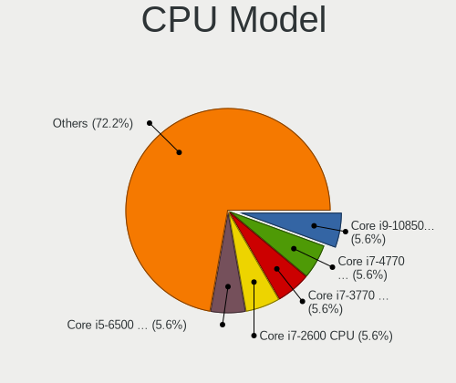
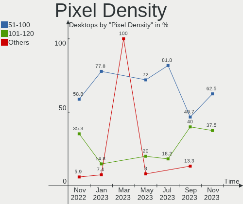
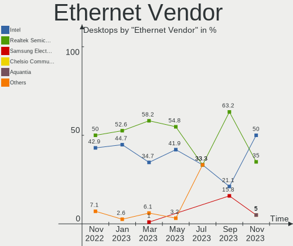
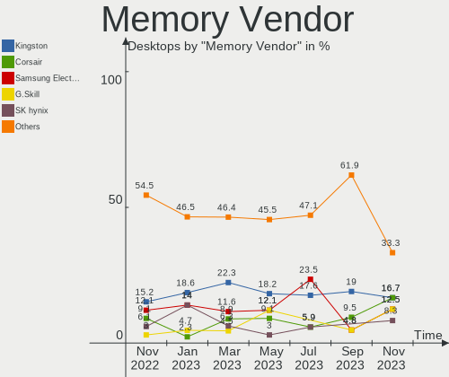
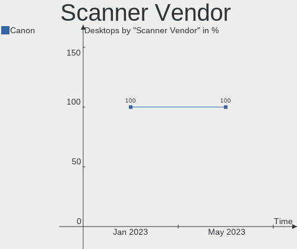

helloSystem - Hardware Trends (Desktops)
----------------------------------------

A project to identify most popular hardware characteristics and track their change
over time based on data collected by BSD users at https://BSD-Hardware.info.

Anyone can contribute to this report by the [hw-probe](https://github.com/linuxhw/hw-probe/blob/master/INSTALL.BSD.md) tool:

    hw-probe -all -upload

This report is for one last month. Overall report since the beginning of time: [TestDays](https://github.com/bsdhw/TestDays)

Period: May, 2023.

Contents
--------

* [ System ](#system)
  - [ OS                       ](#os)
  - [ OS Family                ](#os-family)
  - [ Arch                     ](#arch)
  - [ DE                       ](#de)
  - [ Display Server           ](#display-server)
  - [ Display Manager          ](#display-manager)
  - [ OS Lang                  ](#os-lang)
  - [ Boot Mode                ](#boot-mode)
  - [ Filesystem               ](#filesystem)
  - [ Part. scheme             ](#part-scheme)

* [ Board ](#board)
  - [ Vendor                   ](#vendor)
  - [ Model                    ](#model)
  - [ Model Family             ](#model-family)
  - [ MFG Year                 ](#mfg-year)
  - [ Form Factor              ](#form-factor)
  - [ Coreboot                 ](#coreboot)
  - [ RAM Size                 ](#ram-size)
  - [ RAM Used                 ](#ram-used)
  - [ Total Drives             ](#total-drives)
  - [ Has CD-ROM               ](#has-cd-rom)
  - [ Has Ethernet             ](#has-ethernet)
  - [ Has WiFi                 ](#has-wifi)
  - [ Has Bluetooth            ](#has-bluetooth)

* [ Location ](#location)
  - [ Country                  ](#country)
  - [ City                     ](#city)

* [ Drives ](#drives)
  - [ Drive Vendor             ](#drive-vendor)
  - [ Drive Model              ](#drive-model)
  - [ HDD Vendor               ](#hdd-vendor)
  - [ SSD Vendor               ](#ssd-vendor)
  - [ Drive Kind               ](#drive-kind)
  - [ Drive Connector          ](#drive-connector)
  - [ Drive Size               ](#drive-size)
  - [ Space Total              ](#space-total)
  - [ Space Used               ](#space-used)
  - [ Malfunc. Drives          ](#malfunc-drives)
  - [ Malfunc. Drive Vendor    ](#malfunc-drive-vendor)
  - [ Malfunc. HDD Vendor      ](#malfunc-hdd-vendor)
  - [ Malfunc. Drive Kind      ](#malfunc-drive-kind)
  - [ Failed Drives            ](#failed-drives)
  - [ Failed Drive Vendor      ](#failed-drive-vendor)
  - [ Drive Status             ](#drive-status)

* [ Storage controller ](#storage-controller)
  - [ Storage Vendor           ](#storage-vendor)
  - [ Storage Model            ](#storage-model)
  - [ Storage Kind             ](#storage-kind)

* [ Processor ](#processor)
  - [ CPU Vendor               ](#cpu-vendor)
  - [ CPU Model                ](#cpu-model)
  - [ CPU Model Family         ](#cpu-model-family)
  - [ CPU Cores                ](#cpu-cores)
  - [ CPU Sockets              ](#cpu-sockets)
  - [ CPU Threads              ](#cpu-threads)
  - [ CPU Microarch            ](#cpu-microarch)

* [ Graphics ](#graphics)
  - [ GPU Vendor               ](#gpu-vendor)
  - [ GPU Model                ](#gpu-model)
  - [ GPU Combo                ](#gpu-combo)
  - [ GPU Driver               ](#gpu-driver)
  - [ GPU Memory               ](#gpu-memory)

* [ Monitor ](#monitor)
  - [ Monitor Vendor           ](#monitor-vendor)
  - [ Monitor Model            ](#monitor-model)
  - [ Monitor Resolution       ](#monitor-resolution)
  - [ Monitor Diagonal         ](#monitor-diagonal)
  - [ Monitor Width            ](#monitor-width)
  - [ Aspect Ratio             ](#aspect-ratio)
  - [ Monitor Area             ](#monitor-area)
  - [ Pixel Density            ](#pixel-density)
  - [ Multiple Monitors        ](#multiple-monitors)

* [ Network ](#network)
  - [ Net Controller Vendor    ](#net-controller-vendor)
  - [ Net Controller Model     ](#net-controller-model)
  - [ Wireless Vendor          ](#wireless-vendor)
  - [ Wireless Model           ](#wireless-model)
  - [ Ethernet Vendor          ](#ethernet-vendor)
  - [ Ethernet Model           ](#ethernet-model)
  - [ Net Controller Kind      ](#net-controller-kind)
  - [ Used Controller          ](#used-controller)
  - [ NICs                     ](#nics)
  - [ IPv6                     ](#ipv6)

* [ Bluetooth ](#bluetooth)
  - [ Bluetooth Vendor         ](#bluetooth-vendor)
  - [ Bluetooth Model          ](#bluetooth-model)

* [ Sound ](#sound)
  - [ Sound Vendor             ](#sound-vendor)
  - [ Sound Model              ](#sound-model)

* [ Memory ](#memory)
  - [ Memory Vendor            ](#memory-vendor)
  - [ Memory Model             ](#memory-model)
  - [ Memory Kind              ](#memory-kind)
  - [ Memory Form Factor       ](#memory-form-factor)
  - [ Memory Size              ](#memory-size)
  - [ Memory Speed             ](#memory-speed)

* [ Printers & scanners ](#printers--scanners)
  - [ Printer Vendor           ](#printer-vendor)
  - [ Printer Model            ](#printer-model)
  - [ Scanner Vendor           ](#scanner-vendor)
  - [ Scanner Model            ](#scanner-model)

* [ Camera ](#camera)
  - [ Camera Vendor            ](#camera-vendor)
  - [ Camera Model             ](#camera-model)

* [ Security ](#security)
  - [ Fingerprint Vendor       ](#fingerprint-vendor)
  - [ Fingerprint Model        ](#fingerprint-model)
  - [ Chipcard Vendor          ](#chipcard-vendor)
  - [ Chipcard Model           ](#chipcard-model)

* [ Unsupported ](#unsupported)
  - [ Unsupported Devices      ](#unsupported-devices)
  - [ Unsupported Device Types ](#unsupported-device-types)

System
------

OS
--

Installed operating systems

| Name              | Desktops | Percent |
|-------------------|----------|---------|
| helloSystem 0.8.1 | 20       | 68.97%  |
| helloSystem 0.8.2 | 6        | 20.69%  |
| helloSystem 0.8.0 | 2        | 6.9%    |
| helloSystem 0.6.0 | 1        | 3.45%   |

OS Family
---------

OS without a version

| Name        | Desktops | Percent |
|-------------|----------|---------|
| helloSystem | 29       | 100%    |

Arch
----

OS architecture (x86_64, i586, etc.)

| Name  | Desktops | Percent |
|-------|----------|---------|
| amd64 | 29       | 100%    |

DE
--

Desktop Environment

| Name         | Desktops | Percent |
|--------------|----------|---------|
| helloDesktop | 29       | 100%    |

Display Server
--------------

X11 or Wayland

| Name | Desktops | Percent |
|------|----------|---------|
| X11  | 29       | 100%    |

Display Manager
---------------

SDDM, LightDM, etc.

| Name | Desktops | Percent |
|------|----------|---------|
| SLiM | 29       | 100%    |

OS Lang
-------

Language

| Lang  | Desktops | Percent |
|-------|----------|---------|
| en_US | 18       | 62.07%  |
| fr_FR | 4        | 13.79%  |
| ru_RU | 2        | 6.9%    |
| de_DE | 2        | 6.9%    |
| pt_BR | 1        | 3.45%   |
| fr    | 1        | 3.45%   |
| en    | 1        | 3.45%   |

Boot Mode
---------

EFI or BIOS

| Mode | Desktops | Percent |
|------|----------|---------|
| EFI  | 27       | 93.1%   |
| BIOS | 2        | 6.9%    |

Filesystem
----------

Type of filesystem

| Type   | Desktops | Percent |
|--------|----------|---------|
| Cd9660 | 15       | 51.72%  |
| Zfs    | 14       | 48.28%  |

Part. scheme
------------

Scheme of partitioning

| Type | Desktops | Percent |
|------|----------|---------|
| GPT  | 27       | 93.1%   |
| MBR  | 2        | 6.9%    |

Board
-----

Vendor
------

Motherboard manufacturer

| Name                | Desktops | Percent |
|---------------------|----------|---------|
| ASUSTek Computer    | 7        | 24.14%  |
| Gigabyte Technology | 6        | 20.69%  |
| Dell                | 5        | 17.24%  |
| ASRock              | 4        | 13.79%  |
| Intel               | 3        | 10.34%  |
| Hewlett-Packard     | 2        | 6.9%    |
| AZW                 | 1        | 3.45%   |
| Unknown             | 1        | 3.45%   |

Model
-----

Motherboard model

| Name                         | Desktops | Percent |
|------------------------------|----------|---------|
| ASUS ROG STRIX B550-F GAMING | 2        | 6.9%    |
| Intel H81                    | 1        | 3.45%   |
| Intel DH87RL AAG74240-400    | 1        | 3.45%   |
| Intel 945GCT-M               | 1        | 3.45%   |
| HP ProDesk 600 G3 SFF        | 1        | 3.45%   |
| HP ProDesk 600 G1 DM         | 1        | 3.45%   |
| Gigabyte Z490 VISION G       | 1        | 3.45%   |
| Gigabyte X58A-UD3R           | 1        | 3.45%   |
| Gigabyte GA-MA790X-UD4       | 1        | 3.45%   |
| Gigabyte GA-78LMT-USB3       | 1        | 3.45%   |
| Gigabyte B360M-D2V           | 1        | 3.45%   |
| Gigabyte A520M S2H           | 1        | 3.45%   |
| Dell Precision T5610         | 1        | 3.45%   |
| Dell OptiPlex 9020           | 1        | 3.45%   |
| Dell OptiPlex 5040           | 1        | 3.45%   |
| Dell Inspiron 3910           | 1        | 3.45%   |
| Dell Inspiron 3268           | 1        | 3.45%   |
| AZW GK55                     | 1        | 3.45%   |
| ASUS PRIME H510M-K           | 1        | 3.45%   |
| ASUS PRIME B450M-K II        | 1        | 3.45%   |
| ASUS PRIME A520M-K           | 1        | 3.45%   |
| ASUS All Series              | 1        | 3.45%   |
| ASUS A0000001                | 1        | 3.45%   |
| ASRock Z68 Pro3 Gen3         | 1        | 3.45%   |
| ASRock Q1900M                | 1        | 3.45%   |
| ASRock J4125-ITX             | 1        | 3.45%   |
| ASRock H410M/ac              | 1        | 3.45%   |
| Unknown                      | 1        | 3.45%   |

Model Family
------------

Motherboard model prefix

| Name                   | Desktops | Percent |
|------------------------|----------|---------|
| ASUS PRIME             | 3        | 10.34%  |
| HP ProDesk             | 2        | 6.9%    |
| Dell OptiPlex          | 2        | 6.9%    |
| Dell Inspiron          | 2        | 6.9%    |
| ASUS ROG               | 2        | 6.9%    |
| Intel H81              | 1        | 3.45%   |
| Intel DH87RL           | 1        | 3.45%   |
| Intel 945GCT-M         | 1        | 3.45%   |
| Gigabyte Z490          | 1        | 3.45%   |
| Gigabyte X58A-UD3R     | 1        | 3.45%   |
| Gigabyte GA-MA790X-UD4 | 1        | 3.45%   |
| Gigabyte GA-78LMT-USB3 | 1        | 3.45%   |
| Gigabyte B360M-D2V     | 1        | 3.45%   |
| Gigabyte A520M         | 1        | 3.45%   |
| Dell Precision         | 1        | 3.45%   |
| AZW GK55               | 1        | 3.45%   |
| ASUS All               | 1        | 3.45%   |
| ASUS A0000001          | 1        | 3.45%   |
| ASRock Z68             | 1        | 3.45%   |
| ASRock Q1900M          | 1        | 3.45%   |
| ASRock J4125-ITX       | 1        | 3.45%   |
| ASRock H410M           | 1        | 3.45%   |
| Unknown                | 1        | 3.45%   |

MFG Year
--------

Motherboard manufacture year

| Year | Desktops | Percent |
|------|----------|---------|
| 2020 | 8        | 27.59%  |
| 2021 | 4        | 13.79%  |
| 2022 | 2        | 6.9%    |
| 2019 | 2        | 6.9%    |
| 2018 | 2        | 6.9%    |
| 2017 | 2        | 6.9%    |
| 2014 | 2        | 6.9%    |
| 2013 | 2        | 6.9%    |
| 2010 | 2        | 6.9%    |
| 2023 | 1        | 3.45%   |
| 2012 | 1        | 3.45%   |
| 2008 | 1        | 3.45%   |

Form Factor
-----------

Physical design of the computer

| Name    | Desktops | Percent |
|---------|----------|---------|
| Desktop | 29       | 100%    |

Coreboot
--------

Have coreboot on board

| Used | Desktops | Percent |
|------|----------|---------|
| No   | 29       | 100%    |

RAM Size
--------

Total RAM memory

| Size in GB  | Desktops | Percent |
|-------------|----------|---------|
| 16.01-24.0  | 12       | 41.38%  |
| 8.01-16.0   | 12       | 41.38%  |
| 4.01-8.0    | 3        | 10.34%  |
| 32.01-64.0  | 1        | 3.45%   |
| 64.01-256.0 | 1        | 3.45%   |

RAM Used
--------

Used RAM memory

| Used GB  | Desktops | Percent |
|----------|----------|---------|
| 0.01-0.5 | 12       | 41.38%  |
| 0.51-1.0 | 10       | 34.48%  |
| 2.01-3.0 | 3        | 10.34%  |
| 1.01-2.0 | 3        | 10.34%  |
| 3.01-4.0 | 1        | 3.45%   |

Total Drives
------------

Number of drives on board

| Drives | Desktops | Percent |
|--------|----------|---------|
| 1      | 17       | 58.62%  |
| 2      | 7        | 24.14%  |
| 3      | 5        | 17.24%  |

Has CD-ROM
----------

Has CD-ROM on board

| Presented | Desktops | Percent |
|-----------|----------|---------|
| No        | 17       | 58.62%  |
| Yes       | 12       | 41.38%  |

Has Ethernet
------------

Has Ethernet on board

| Presented | Desktops | Percent |
|-----------|----------|---------|
| Yes       | 29       | 100%    |

Has WiFi
--------

Has WiFi module

| Presented | Desktops | Percent |
|-----------|----------|---------|
| No        | 19       | 65.52%  |
| Yes       | 10       | 34.48%  |

Has Bluetooth
-------------

Has Bluetooth module

| Presented | Desktops | Percent |
|-----------|----------|---------|
| No        | 19       | 65.52%  |
| Yes       | 10       | 34.48%  |

Location
--------

Country
-------

Geographic location (country)

| Country     | Desktops | Percent |
|-------------|----------|---------|
| USA         | 6        | 20.69%  |
| Russia      | 4        | 13.79%  |
| UK          | 2        | 6.9%    |
| Germany     | 2        | 6.9%    |
| Belgium     | 2        | 6.9%    |
| Turkey      | 1        | 3.45%   |
| Switzerland | 1        | 3.45%   |
| Sweden      | 1        | 3.45%   |
| South Korea | 1        | 3.45%   |
| Slovenia    | 1        | 3.45%   |
| Romania     | 1        | 3.45%   |
| Poland      | 1        | 3.45%   |
| Kazakhstan  | 1        | 3.45%   |
| Italy       | 1        | 3.45%   |
| Croatia     | 1        | 3.45%   |
| Brazil      | 1        | 3.45%   |
| Australia   | 1        | 3.45%   |
| Argentina   | 1        | 3.45%   |

City
----

Geographic location (city)

| City                  | Desktops | Percent |
|-----------------------|----------|---------|
| Moscow                | 2        | 6.9%    |
| Zurich                | 1        | 3.45%   |
| Zagreb                | 1        | 3.45%   |
| Tucson                | 1        | 3.45%   |
| Tolmin                | 1        | 3.45%   |
| Sydney                | 1        | 3.45%   |
| Stevenage             | 1        | 3.45%   |
| Spartanburg           | 1        | 3.45%   |
| Siheung-si            | 1        | 3.45%   |
| Saratov               | 1        | 3.45%   |
| Sao Jose do Rio Preto | 1        | 3.45%   |
| Rosario               | 1        | 3.45%   |
| Rhinelander           | 1        | 3.45%   |
| Petropavl             | 1        | 3.45%   |
| Nampa                 | 1        | 3.45%   |
| Karlskrona            | 1        | 3.45%   |
| Jefferson City        | 1        | 3.45%   |
| Herten                | 1        | 3.45%   |
| Gmina Sierakowice     | 1        | 3.45%   |
| Genoa                 | 1        | 3.45%   |
| Dundee                | 1        | 3.45%   |
| Chelyabinsk           | 1        | 3.45%   |
| Brooklyn              | 1        | 3.45%   |
| Bornheim              | 1        | 3.45%   |
| Ath                   | 1        | 3.45%   |
| Antwerp               | 1        | 3.45%   |
| Ankara                | 1        | 3.45%   |
| Alexandria            | 1        | 3.45%   |

Drives
------

Drive Vendor
------------

Hard drive vendors

| Vendor              | Desktops | Drives | Percent |
|---------------------|----------|--------|---------|
| WDC                 | 8        | 8      | 18.6%   |
| Samsung Electronics | 6        | 10     | 13.95%  |
| Toshiba             | 5        | 5      | 11.63%  |
| Seagate             | 5        | 5      | 11.63%  |
| Crucial             | 3        | 3      | 6.98%   |
| SanDisk             | 2        | 2      | 4.65%   |
| Kingston            | 2        | 2      | 4.65%   |
| China               | 2        | 2      | 4.65%   |
| Vaseky              | 1        | 1      | 2.33%   |
| Philips             | 1        | 1      | 2.33%   |
| Patriot             | 1        | 1      | 2.33%   |
| Netac               | 1        | 1      | 2.33%   |
| MSI                 | 1        | 1      | 2.33%   |
| Micron Technology   | 1        | 1      | 2.33%   |
| LITEONIT            | 1        | 1      | 2.33%   |
| Intel               | 1        | 1      | 2.33%   |
| HGST                | 1        | 1      | 2.33%   |
| A-DATA Technology   | 1        | 1      | 2.33%   |

Drive Model
-----------

Hard drive models

| Model                             | Desktops | Percent |
|-----------------------------------|----------|---------|
| Toshiba HDWD110 1TB               | 2        | 4.26%   |
| WDC WDS100T1R0A-68A4W0 1TB        | 1        | 2.13%   |
| WDC WD5000AAKX-00U6AA0 500GB      | 1        | 2.13%   |
| WDC WD5000AAKX-00ERMA0 500GB      | 1        | 2.13%   |
| WDC WD5000AAKS-00UU3A0 500GB      | 1        | 2.13%   |
| WDC WD2500AAJS-00VTA0 250GB       | 1        | 2.13%   |
| WDC WD1600YS-01SHB1 164GB         | 1        | 2.13%   |
| WDC WD10EZRZ-00HTKB0 1TB          | 1        | 2.13%   |
| WDC WD10EZEX-00WN4A0 1TB          | 1        | 2.13%   |
| Vaseky V800-350G                  | 1        | 2.13%   |
| Toshiba Q300 Pro 256GB            | 1        | 2.13%   |
| Toshiba MQ01ABD050 500GB          | 1        | 2.13%   |
| Toshiba DT01ACA100 1TB            | 1        | 2.13%   |
| Seagate ST500LM021-1KJ152 500GB   | 1        | 2.13%   |
| Seagate ST500DM009-2F110A 500GB   | 1        | 2.13%   |
| Seagate ST500DM002-1BD142 500GB   | 1        | 2.13%   |
| Seagate ST3250310AS 250GB         | 1        | 2.13%   |
| Seagate ST1000LM010-9YH146 1TB    | 1        | 2.13%   |
| SanDisk X400 M.2 2280 128GB       | 1        | 2.13%   |
| SanDisk SSD PLUS 480GB            | 1        | 2.13%   |
| Samsung SSD 980 PRO 1TB           | 1        | 2.13%   |
| Samsung SSD 970 EVO Plus 2TB      | 1        | 2.13%   |
| Samsung SSD 870 EVO 500GB         | 1        | 2.13%   |
| Samsung SSD 860 EVO 500GB         | 1        | 2.13%   |
| Samsung SSD 860 EVO 1TB           | 1        | 2.13%   |
| Samsung SSD 850 EVO 250GB         | 1        | 2.13%   |
| Samsung MZMPC032HBCD-00000 32GB   | 1        | 2.13%   |
| Samsung MZ7PD128HAFV-000H7 128GB  | 1        | 2.13%   |
| Samsung HD251HJ 250GB             | 1        | 2.13%   |
| Samsung HD080HJ 80GB              | 1        | 2.13%   |
| Philips SATA SSD 480GB            | 1        | 2.13%   |
| Patriot Burst Elite 120GB         | 1        | 2.13%   |
| Netac NVMe SSD 256GB              | 1        | 2.13%   |
| MSI S270 240GB                    | 1        | 2.13%   |
| Micron 2450 NVMe 256GB            | 1        | 2.13%   |
| LITEONIT LCS-256M6S 2.5 7mm 256GB | 1        | 2.13%   |
| Kingston SA400S37240G 240GB       | 1        | 2.13%   |
| Kingston SA400M8240G 240GB        | 1        | 2.13%   |
| Intel SSDSC2CT180A4 180GB         | 1        | 2.13%   |
| HGST HTS545050A7E680 500GB        | 1        | 2.13%   |

HDD Vendor
----------

Hard disk drive vendors

| Vendor              | Desktops | Drives | Percent |
|---------------------|----------|--------|---------|
| WDC                 | 7        | 7      | 38.89%  |
| Seagate             | 5        | 5      | 27.78%  |
| Toshiba             | 4        | 4      | 22.22%  |
| Samsung Electronics | 1        | 2      | 5.56%   |
| HGST                | 1        | 1      | 5.56%   |

SSD Vendor
----------

Solid state drive vendors

| Vendor              | Desktops | Drives | Percent |
|---------------------|----------|--------|---------|
| Samsung Electronics | 5        | 6      | 23.81%  |
| SanDisk             | 2        | 2      | 9.52%   |
| Kingston            | 2        | 2      | 9.52%   |
| Crucial             | 2        | 2      | 9.52%   |
| China               | 2        | 2      | 9.52%   |
| WDC                 | 1        | 1      | 4.76%   |
| Vaseky              | 1        | 1      | 4.76%   |
| Toshiba             | 1        | 1      | 4.76%   |
| Philips             | 1        | 1      | 4.76%   |
| Patriot             | 1        | 1      | 4.76%   |
| MSI                 | 1        | 1      | 4.76%   |
| LITEONIT            | 1        | 1      | 4.76%   |
| Intel               | 1        | 1      | 4.76%   |

Drive Kind
----------

HDD or SSD

| Kind | Desktops | Drives | Percent |
|------|----------|--------|---------|
| SSD  | 17       | 22     | 44.74%  |
| HDD  | 15       | 19     | 39.47%  |
| NVMe | 6        | 6      | 15.79%  |

Drive Connector
---------------

SATA, SAS, NVMe, etc.

| Type | Desktops | Drives | Percent |
|------|----------|--------|---------|
| SATA | 28       | 41     | 82.35%  |
| NVMe | 6        | 6      | 17.65%  |

Drive Size
----------

Size of hard drive

| Size in TB | Desktops | Drives | Percent |
|------------|----------|--------|---------|
| 0.01-0.5   | 23       | 33     | 74.19%  |
| 0.51-1.0   | 8        | 8      | 25.81%  |

Space Total
-----------

Amount of disk space available on the file system

| Size in GB | Desktops | Percent |
|------------|----------|---------|
| 1-20       | 15       | 51.72%  |
| 101-250    | 5        | 17.24%  |
| 251-500    | 4        | 13.79%  |
| 501-1000   | 2        | 6.9%    |
| 51-100     | 2        | 6.9%    |
| 21-50      | 1        | 3.45%   |

Space Used
----------

Amount of used disk space

| Used GB | Desktops | Percent |
|---------|----------|---------|
| 1-20    | 29       | 100%    |

Malfunc. Drives
---------------

Drive models with a malfunction

| Model                          | Desktops | Drives | Percent |
|--------------------------------|----------|--------|---------|
| WDC WD5000AAKX-00ERMA0 500GB   | 1        | 1      | 20%     |
| WDC WD1600YS-01SHB1 164GB      | 1        | 1      | 20%     |
| WDC WD10EZRZ-00HTKB0 1TB       | 1        | 1      | 20%     |
| Seagate ST1000LM010-9YH146 1TB | 1        | 1      | 20%     |
| HGST HTS545050A7E680 500GB     | 1        | 1      | 20%     |

Malfunc. Drive Vendor
---------------------

Vendors of faulty drives

| Vendor  | Desktops | Drives | Percent |
|---------|----------|--------|---------|
| WDC     | 3        | 3      | 60%     |
| Seagate | 1        | 1      | 20%     |
| HGST    | 1        | 1      | 20%     |

Malfunc. HDD Vendor
-------------------

Vendors of faulty HDD drives

| Vendor  | Desktops | Drives | Percent |
|---------|----------|--------|---------|
| WDC     | 3        | 3      | 60%     |
| Seagate | 1        | 1      | 20%     |
| HGST    | 1        | 1      | 20%     |

Malfunc. Drive Kind
-------------------

Kinds of faulty drives

| Kind | Desktops | Drives | Percent |
|------|----------|--------|---------|
| HDD  | 5        | 5      | 100%    |

Failed Drives
-------------

Failed drive models

Zero info for selected period =(

Failed Drive Vendor
-------------------

Failed drive vendors

Zero info for selected period =(

Drive Status
------------

Number of failed and malfunc. drives

| Status   | Desktops | Drives | Percent |
|----------|----------|--------|---------|
| Works    | 22       | 36     | 70.97%  |
| Malfunc  | 5        | 5      | 16.13%  |
| Detected | 4        | 6      | 12.9%   |

Storage controller
------------------

Storage Vendor
--------------

Storage controller vendors

| Vendor                    | Desktops | Percent |
|---------------------------|----------|---------|
| Intel                     | 21       | 52.5%   |
| AMD                       | 8        | 20%     |
| Samsung Electronics       | 2        | 5%      |
| Silicon Motion            | 1        | 2.5%    |
| SanDisk                   | 1        | 2.5%    |
| OCZ Technology Group      | 1        | 2.5%    |
| Micron/Crucial Technology | 1        | 2.5%    |
| Micron Technology         | 1        | 2.5%    |
| Marvell Technology Group  | 1        | 2.5%    |
| JMicron Technology        | 1        | 2.5%    |
| ASMedia Technology        | 1        | 2.5%    |
| ADATA Technology          | 1        | 2.5%    |

Storage Model
-------------

Storage controller models

| Model                                                                          | Desktops | Percent |
|--------------------------------------------------------------------------------|----------|---------|
| Intel 8 Series/C220 Series Chipset Family 6-port SATA Controller 1 [AHCI mode] | 4        | 8.7%    |
| AMD 500 Series Chipset SATA Controller                                         | 4        | 8.7%    |
| Intel SATA Controller [RAID mode]                                              | 2        | 4.35%   |
| Intel Celeron/Pentium Silver Processor SATA Controller                         | 2        | 4.35%   |
| AMD SB7x0/SB8x0/SB9x0 SATA Controller [IDE mode]                               | 2        | 4.35%   |
| AMD SB7x0/SB8x0/SB9x0 IDE Controller                                           | 2        | 4.35%   |
| AMD FCH SATA Controller [AHCI mode]                                            | 2        | 4.35%   |
| Silicon Motion SM2263EN/SM2263XT SSD Controller                                | 1        | 2.17%   |
| SanDisk WD Black SN750 / PC SN730 NVMe SSD                                     | 1        | 2.17%   |
| Samsung NVMe SSD Controller SM981/PM981/PM983                                  | 1        | 2.17%   |
| Samsung NVMe SSD Controller PM9A1/PM9A3/980PRO                                 | 1        | 2.17%   |
| OCZ Group RevoDrive 3 X2 PCI-Express SSD 240 GB (Marvell Controller)           | 1        | 2.17%   |
| Micron/Crucial P1 NVMe PCIe SSD                                                | 1        | 2.17%   |
| Micron NVMe Storage Controller                                                 | 1        | 2.17%   |
| Marvell Group 88SE9128 PCIe SATA 6 Gb/s RAID controller                        | 1        | 2.17%   |
| JMicron JMB363 SATA/IDE Controller                                             | 1        | 2.17%   |
| Intel Volume Management Device NVMe RAID Controller                            | 1        | 2.17%   |
| Intel Q170/Q150/B150/H170/H110/Z170/CM236 Chipset SATA Controller [AHCI Mode]  | 1        | 2.17%   |
| Intel NM10/ICH7 Family SATA Controller [IDE mode]                              | 1        | 2.17%   |
| Intel Comet Lake SATA AHCI Controller                                          | 1        | 2.17%   |
| Intel Celeron N3350/Pentium N4200/Atom E3900 Series SATA AHCI Controller       | 1        | 2.17%   |
| Intel Cannon Lake PCH SATA AHCI Controller                                     | 1        | 2.17%   |
| Intel C600/X79 series chipset 6-Port SATA AHCI Controller                      | 1        | 2.17%   |
| Intel Atom Processor E3800 Series SATA AHCI Controller                         | 1        | 2.17%   |
| Intel Alder Lake-S PCH SATA Controller [AHCI Mode]                             | 1        | 2.17%   |
| Intel 82801JI (ICH10 Family) SATA AHCI Controller                              | 1        | 2.17%   |
| Intel 82801G (ICH7 Family) IDE Controller                                      | 1        | 2.17%   |
| Intel 6 Series/C200 Series Chipset Family 6 port Desktop SATA AHCI Controller  | 1        | 2.17%   |
| Intel 500 Series Chipset Family SATA AHCI Controller                           | 1        | 2.17%   |
| Intel 400 Series Chipset Family SATA AHCI Controller                           | 1        | 2.17%   |
| Intel 200 Series PCH SATA controller [AHCI mode]                               | 1        | 2.17%   |
| ASMedia ASM1062 Serial ATA Controller                                          | 1        | 2.17%   |
| AMD FCH SATA Controller D                                                      | 1        | 2.17%   |
| AMD 400 Series Chipset SATA Controller                                         | 1        | 2.17%   |
| Unknown                                                                        | 1        | 2.17%   |

Storage Kind
------------

Kind of storage controller (IDE, SATA, NVMe, SAS, ...)

| Kind | Desktops | Percent |
|------|----------|---------|
| SATA | 24       | 63.16%  |
| NVMe | 7        | 18.42%  |
| RAID | 3        | 7.89%   |
| IDE  | 3        | 7.89%   |
| SCSI | 1        | 2.63%   |

Processor
---------

CPU Vendor
----------

Processor vendors

| Vendor | Desktops | Percent |
|--------|----------|---------|
| Intel  | 21       | 72.41%  |
| AMD    | 8        | 27.59%  |

CPU Model
---------

Processor models

| Model                                       | Desktops | Percent |
|---------------------------------------------|----------|---------|
| Intel Celeron J4125 CPU @ 2.00GHz           | 2        | 6.9%    |
| Intel Xeon CPU E5-2650 v2 @ 2.60GHz         | 1        | 3.45%   |
| Intel Xeon CPU E3-1241 v3 @ 3.50GHz         | 1        | 3.45%   |
| Intel Pentium CPU G3240T @ 2.70GHz          | 1        | 3.45%   |
| Intel Core i7-7700 CPU @ 3.60GHz            | 1        | 3.45%   |
| Intel Core i7-4770 CPU @ 3.40GHz            | 1        | 3.45%   |
| Intel Core i7 CPU                           | 1        | 3.45%   |
| Intel Core i5-9400F CPU @ 2.90GHz           | 1        | 3.45%   |
| Intel Core i5-7400 CPU @ 3.00GHz            | 1        | 3.45%   |
| Intel Core i5-6500 CPU @ 3.20GHz            | 1        | 3.45%   |
| Intel Core i5-4670K CPU @ 3.40GHz           | 1        | 3.45%   |
| Intel Core i5-4670 CPU @ 3.40GHz            | 1        | 3.45%   |
| Intel Core i5-10600 CPU @ 3.30GHz           | 1        | 3.45%   |
| Intel Core i5-10500 CPU @ 3.10GHz           | 1        | 3.45%   |
| Intel Core i3-2100 CPU @ 3.10GHz            | 1        | 3.45%   |
| Intel Core i3-10100 CPU @ 3.60GHz           | 1        | 3.45%   |
| Intel Core 2 Duo CPU E7200 @ 2.53GHz        | 1        | 3.45%   |
| Intel Celeron CPU J3455 @ 1.50GHz           | 1        | 3.45%   |
| Intel Celeron CPU J1900 @ 1.99GHz           | 1        | 3.45%   |
| Intel 12th Gen Core i5-12400                | 1        | 3.45%   |
| AMD Ryzen 7 5800X 8-Core Processor          | 1        | 3.45%   |
| AMD Ryzen 7 5700G with Radeon Graphics      | 1        | 3.45%   |
| AMD Ryzen 5 5600G with Radeon Graphics      | 1        | 3.45%   |
| AMD Ryzen 5 3400G with Radeon Vega Graphics | 1        | 3.45%   |
| AMD Ryzen 3 4300GE with Radeon Graphics     | 1        | 3.45%   |
| AMD Ryzen 3 3200G with Radeon Vega Graphics | 1        | 3.45%   |
| AMD Phenom II X4 955 Processor              | 1        | 3.45%   |
| AMD FX-8300 Eight-Core Processor            | 1        | 3.45%   |

CPU Model Family
----------------

Processor model prefix

| Model            | Desktops | Percent |
|------------------|----------|---------|
| Intel Core i5    | 7        | 24.14%  |
| Intel Celeron    | 4        | 13.79%  |
| Intel Core i7    | 3        | 10.34%  |
| Intel Xeon       | 2        | 6.9%    |
| Intel Core i3    | 2        | 6.9%    |
| AMD Ryzen 7      | 2        | 6.9%    |
| AMD Ryzen 5      | 2        | 6.9%    |
| AMD Ryzen 3      | 2        | 6.9%    |
| Other            | 1        | 3.45%   |
| Intel Pentium    | 1        | 3.45%   |
| Intel Core 2 Duo | 1        | 3.45%   |
| AMD Phenom II X4 | 1        | 3.45%   |
| AMD FX           | 1        | 3.45%   |

CPU Cores
---------

Number of processor cores

| Number | Desktops | Percent |
|--------|----------|---------|
| 4      | 15       | 51.72%  |
| 6      | 4        | 13.79%  |
| 16     | 3        | 10.34%  |
| 8      | 3        | 10.34%  |
| 2      | 3        | 10.34%  |
| 12     | 1        | 3.45%   |

CPU Sockets
-----------

Number of sockets

| Number | Desktops | Percent |
|--------|----------|---------|
| 1      | 28       | 96.55%  |
| 2      | 1        | 3.45%   |

CPU Threads
-----------

Threads per core (Hyper-Threading)

| Number | Desktops | Percent |
|--------|----------|---------|
| 1      | 19       | 65.52%  |
| 2      | 10       | 34.48%  |

CPU Microarch
-------------

Microarchitecture

| Name          | Desktops | Percent |
|---------------|----------|---------|
| Haswell       | 5        | 17.24%  |
| Zen 3         | 3        | 10.34%  |
| KabyLake      | 3        | 10.34%  |
| CometLake     | 3        | 10.34%  |
| Zen+          | 2        | 6.9%    |
| Goldmont plus | 2        | 6.9%    |
| Zen 2         | 1        | 3.45%   |
| Skylake       | 1        | 3.45%   |
| Silvermont    | 1        | 3.45%   |
| SandyBridge   | 1        | 3.45%   |
| Piledriver    | 1        | 3.45%   |
| Penryn        | 1        | 3.45%   |
| Nehalem       | 1        | 3.45%   |
| K10           | 1        | 3.45%   |
| IvyBridge     | 1        | 3.45%   |
| Goldmont      | 1        | 3.45%   |
| Unknown       | 1        | 3.45%   |

Graphics
--------

GPU Vendor
----------

Vendors of graphics cards

| Vendor | Desktops | Percent |
|--------|----------|---------|
| Nvidia | 12       | 37.5%   |
| Intel  | 12       | 37.5%   |
| AMD    | 8        | 25%     |

GPU Model
---------

Graphics card models

| Model                                                                       | Desktops | Percent |
|-----------------------------------------------------------------------------|----------|---------|
| Intel Xeon E3-1200 v3/4th Gen Core Processor Integrated Graphics Controller | 3        | 9.09%   |
| AMD Lexa PRO [Radeon 540/540X/550/550X / RX 540X/550/550X]                  | 3        | 9.09%   |
| Intel HD Graphics 630                                                       | 2        | 6.06%   |
| Intel GeminiLake [UHD Graphics 600]                                         | 2        | 6.06%   |
| AMD Picasso/Raven 2 [Radeon Vega Series / Radeon Vega Mobile Series]        | 2        | 6.06%   |
| AMD Cezanne [Radeon Vega Series / Radeon Vega Mobile Series]                | 2        | 6.06%   |
| Nvidia TU116 [GeForce GTX 1660]                                             | 1        | 3.03%   |
| Nvidia TU116 [GeForce GTX 1650 SUPER]                                       | 1        | 3.03%   |
| Nvidia GT200 [GeForce GTX 260]                                              | 1        | 3.03%   |
| Nvidia GP108 [GeForce GT 1030]                                              | 1        | 3.03%   |
| Nvidia GP107 [GeForce GTX 1050 Ti]                                          | 1        | 3.03%   |
| Nvidia GK208B [GeForce GT 730]                                              | 1        | 3.03%   |
| Nvidia GK107 [GeForce GTX 650]                                              | 1        | 3.03%   |
| Nvidia GK107 [GeForce GT 640]                                               | 1        | 3.03%   |
| Nvidia GF119 [GeForce GT 610]                                               | 1        | 3.03%   |
| Nvidia GF119 [GeForce GT 520]                                               | 1        | 3.03%   |
| Nvidia GF110 [GeForce GTX 580]                                              | 1        | 3.03%   |
| Nvidia G73 [GeForce 7600 GT]                                                | 1        | 3.03%   |
| Intel HD Graphics 530                                                       | 1        | 3.03%   |
| Intel HD Graphics 500                                                       | 1        | 3.03%   |
| Intel Alder Lake-S GT1 [UHD Graphics 730]                                   | 1        | 3.03%   |
| Intel 82945G/GZ Integrated Graphics Controller                              | 1        | 3.03%   |
| Intel 2nd Generation Core Processor Family Integrated Graphics Controller   | 1        | 3.03%   |
| AMD Renoir                                                                  | 1        | 3.03%   |
| AMD Ellesmere [Radeon RX 470/480/570/570X/580/580X/590]                     | 1        | 3.03%   |

GPU Combo
---------

Combinations of graphics cards

| Name           | Desktops | Percent |
|----------------|----------|---------|
| 1 x Nvidia     | 10       | 34.48%  |
| 1 x Intel      | 9        | 31.03%  |
| 1 x AMD        | 6        | 20.69%  |
| Intel + Nvidia | 2        | 6.9%    |
| 2 x AMD        | 1        | 3.45%   |
| Intel + AMD    | 1        | 3.45%   |

GPU Driver
----------

Free vs proprietary

| Driver      | Desktops | Percent |
|-------------|----------|---------|
| Free        | 20       | 68.97%  |
| Proprietary | 9        | 31.03%  |

GPU Memory
----------

Total video memory

| Size in GB | Desktops | Percent |
|------------|----------|---------|
| Unknown    | 16       | 55.17%  |
| 1.01-2.0   | 5        | 17.24%  |
| 3.01-4.0   | 4        | 13.79%  |
| 0.01-0.5   | 2        | 6.9%    |
| 5.01-6.0   | 1        | 3.45%   |
| 0.51-1.0   | 1        | 3.45%   |

Monitor
-------

Monitor Vendor
--------------

Monitor vendors

| Vendor               | Desktops | Percent |
|----------------------|----------|---------|
| Samsung Electronics  | 4        | 16%     |
| Philips              | 4        | 16%     |
| Hewlett-Packard      | 4        | 16%     |
| BenQ                 | 3        | 12%     |
| Acer                 | 3        | 12%     |
| Dell                 | 2        | 8%      |
| Ancor Communications | 2        | 8%      |
| Semp Toshiba         | 1        | 4%      |
| Lenovo               | 1        | 4%      |
| ASUSTek Computer     | 1        | 4%      |

Monitor Model
-------------

Monitor models

| Model                                                                 | Desktops | Percent |
|-----------------------------------------------------------------------|----------|---------|
| Semp Toshiba MLE1951 STI1951 1366x768 410x230mm 18.5-inch             | 1        | 4%      |
| Samsung Electronics SyncMaster SAM050B 1920x1080 480x270mm 21.7-inch  | 1        | 4%      |
| Samsung Electronics S27F350 SAM0D22 1920x1080 600x340mm 27.2-inch     | 1        | 4%      |
| Samsung Electronics S24C350 SAM0A3A 1920x1080 530x300mm 24.0-inch     | 1        | 4%      |
| Samsung Electronics S20B300 SAM08A7 1600x900 440x250mm 19.9-inch      | 1        | 4%      |
| Philips PHL 243V5 PHLC0D1 1920x1080 520x290mm 23.4-inch               | 1        | 4%      |
| Philips PHL 223V7 PHLC154 1920x1080 480x270mm 21.7-inch               | 1        | 4%      |
| Philips PHL 221S8L PHL091C 1920x1080 480x270mm 21.7-inch              | 1        | 4%      |
| Philips 150S PHL0820 1024x768 300x230mm 14.9-inch                     | 1        | 4%      |
| Lenovo L24e-30 LEN66BC 1920x1080 530x300mm 24.0-inch                  | 1        | 4%      |
| Hewlett-Packard ZR2740w HWP2957 2560x1440 600x340mm 27.2-inch         | 1        | 4%      |
| Hewlett-Packard Z24nq HWP3239 2560x1440 530x300mm 24.0-inch           | 1        | 4%      |
| Hewlett-Packard L1955 HWP262C 1280x1024 380x300mm 19.1-inch           | 1        | 4%      |
| Hewlett-Packard 27w HPN3494 1920x1080 600x340mm 27.2-inch             | 1        | 4%      |
| Dell P2317H DEL40F3 1920x1080 510x290mm 23.1-inch                     | 1        | 4%      |
| Dell LCD Monitor SE2416H 1920x1080                                    | 1        | 4%      |
| BenQ GW2250H BNQ78BD 1920x1080 480x270mm 21.7-inch                    | 1        | 4%      |
| BenQ G925HD BNQ7844 1366x768 410x230mm 18.5-inch                      | 1        | 4%      |
| BenQ G900W BNQ7805 1440x900 410x260mm 19.1-inch                       | 1        | 4%      |
| ASUSTek Computer VP247 AUS24DA 1920x1080 520x290mm 23.4-inch          | 1        | 4%      |
| Ancor Communications ASUS VS197 ACI19F2 1366x768 410x230mm 18.5-inch  | 1        | 4%      |
| Ancor Communications ASUS VC239 ACI23C4 1920x1080 510x290mm 23.1-inch | 1        | 4%      |
| Acer X183H ACR006A 1366x768 410x230mm 18.5-inch                       | 1        | 4%      |
| Acer QG241Y ACR079C 1920x1080 520x320mm 24.0-inch                     | 1        | 4%      |
| Acer G276HL ACR0300 1920x1080 600x340mm 27.2-inch                     | 1        | 4%      |

Monitor Resolution
------------------

Monitor screen resolution

| Resolution       | Desktops | Percent |
|------------------|----------|---------|
| 1920x1080 (FHD)  | 15       | 60%     |
| 1366x768 (WXGA)  | 4        | 16%     |
| 2560x1440 (QHD)  | 2        | 8%      |
| 1600x900 (HD+)   | 1        | 4%      |
| 1440x900 (WXGA+) | 1        | 4%      |
| 1280x1024 (SXGA) | 1        | 4%      |
| 1024x768 (XGA)   | 1        | 4%      |

Monitor Diagonal
----------------

Diagonal size in inches

| Inches  | Desktops | Percent |
|---------|----------|---------|
| 27      | 4        | 16%     |
| 24      | 4        | 16%     |
| 23      | 4        | 16%     |
| 21      | 4        | 16%     |
| 18      | 4        | 16%     |
| 19      | 3        | 12%     |
| 14      | 1        | 4%      |
| Unknown | 1        | 4%      |

Monitor Width
-------------

Physical width

| Width in mm | Desktops | Percent |
|-------------|----------|---------|
| 501-600     | 12       | 48%     |
| 401-500     | 10       | 40%     |
| 351-400     | 1        | 4%      |
| 201-300     | 1        | 4%      |
| Unknown     | 1        | 4%      |

Aspect Ratio
------------

Proportional relationship between the width and the height

| Ratio   | Desktops | Percent |
|---------|----------|---------|
| 16/9    | 20       | 80%     |
| 16/10   | 2        | 8%      |
| 5/4     | 1        | 4%      |
| 4/3     | 1        | 4%      |
| Unknown | 1        | 4%      |

Monitor Area
------------

Area in inch²

| Area in inch² | Desktops | Percent |
|----------------|----------|---------|
| 201-250        | 11       | 44%     |
| 301-350        | 4        | 16%     |
| 141-150        | 4        | 16%     |
| 151-200        | 3        | 12%     |
| 251-300        | 1        | 4%      |
| 101-110        | 1        | 4%      |
| Unknown        | 1        | 4%      |

Pixel Density
-------------

Pixels per inch

| Density | Desktops | Percent |
|---------|----------|---------|
| 51-100  | 18       | 72%     |
| 101-120 | 5        | 20%     |
| 121-160 | 1        | 4%      |
| Unknown | 1        | 4%      |

Multiple Monitors
-----------------

Total monitors connected

| Total | Desktops | Percent |
|-------|----------|---------|
| 1     | 26       | 89.66%  |
| 0     | 3        | 10.34%  |

Network
-------

Net Controller Vendor
---------------------

Controller vendors

| Vendor                | Desktops | Percent |
|-----------------------|----------|---------|
| Realtek Semiconductor | 18       | 45%     |
| Intel                 | 15       | 37.5%   |
| TP-Link               | 2        | 5%      |
| Qualcomm Atheros      | 2        | 5%      |
| Ralink Technology     | 1        | 2.5%    |
| Huawei Technologies   | 1        | 2.5%    |
| Edimax Technology     | 1        | 2.5%    |

Net Controller Model
--------------------

Controller models

| Model                                                             | Desktops | Percent |
|-------------------------------------------------------------------|----------|---------|
| Realtek RTL8111/8168/8411 PCI Express Gigabit Ethernet Controller | 15       | 34.09%  |
| Intel Ethernet Controller I225-V                                  | 4        | 9.09%   |
| Realtek RTL810xE PCI Express Fast Ethernet controller             | 2        | 4.55%   |
| Intel Ethernet Connection I217-LM                                 | 2        | 4.55%   |
| TP-Link TL-WN722N v2/v3 [Realtek RTL8188EUS]                      | 1        | 2.27%   |
| TP-Link Archer T2U PLUS [RTL8821AU]                               | 1        | 2.27%   |
| Realtek RTL8821CE 802.11ac PCIe Wireless Network Adapter          | 1        | 2.27%   |
| Realtek RTL8192EE PCIe Wireless Network Adapter                   | 1        | 2.27%   |
| Ralink RT2870/RT3070 Wireless Adapter                             | 1        | 2.27%   |
| Qualcomm Atheros QCA9565 / AR9565 Wireless Network Adapter        | 1        | 2.27%   |
| Qualcomm Atheros AR93xx Wireless Network Adapter                  | 1        | 2.27%   |
| Intel Wireless 8265 / 8275                                        | 1        | 2.27%   |
| Intel Wireless 8260                                               | 1        | 2.27%   |
| Intel Wireless 3165                                               | 1        | 2.27%   |
| Intel Ethernet Connection I217-V                                  | 1        | 2.27%   |
| Intel Ethernet Connection (5) I219-LM                             | 1        | 2.27%   |
| Intel Ethernet Connection (2) I219-V                              | 1        | 2.27%   |
| Intel Ethernet Connection (14) I219-V                             | 1        | 2.27%   |
| Intel Ethernet Connection (12) I219-V                             | 1        | 2.27%   |
| Intel Dual Band Wireless-AC 3168NGW [Stone Peak]                  | 1        | 2.27%   |
| Intel Alder Lake-S PCH CNVi WiFi                                  | 1        | 2.27%   |
| Intel 82579LM Gigabit Network Connection (Lewisville)             | 1        | 2.27%   |
| Intel 82574L Gigabit Network Connection                           | 1        | 2.27%   |
| Huawei USB Device                                                 | 1        | 2.27%   |
| Edimax EW-7711UTn nLite Wireless Adapter [Ralink RT3070]          | 1        | 2.27%   |

Wireless Vendor
---------------

Wireless vendors

| Vendor                | Desktops | Percent |
|-----------------------|----------|---------|
| Intel                 | 5        | 38.46%  |
| TP-Link               | 2        | 15.38%  |
| Realtek Semiconductor | 2        | 15.38%  |
| Qualcomm Atheros      | 2        | 15.38%  |
| Ralink Technology     | 1        | 7.69%   |
| Edimax Technology     | 1        | 7.69%   |

Wireless Model
--------------

Wireless models

| Model                                                      | Desktops | Percent |
|------------------------------------------------------------|----------|---------|
| TP-Link TL-WN722N v2/v3 [Realtek RTL8188EUS]               | 1        | 7.69%   |
| TP-Link Archer T2U PLUS [RTL8821AU]                        | 1        | 7.69%   |
| Realtek RTL8821CE 802.11ac PCIe Wireless Network Adapter   | 1        | 7.69%   |
| Realtek RTL8192EE PCIe Wireless Network Adapter            | 1        | 7.69%   |
| Ralink RT2870/RT3070 Wireless Adapter                      | 1        | 7.69%   |
| Qualcomm Atheros QCA9565 / AR9565 Wireless Network Adapter | 1        | 7.69%   |
| Qualcomm Atheros AR93xx Wireless Network Adapter           | 1        | 7.69%   |
| Intel Wireless 8265 / 8275                                 | 1        | 7.69%   |
| Intel Wireless 8260                                        | 1        | 7.69%   |
| Intel Wireless 3165                                        | 1        | 7.69%   |
| Intel Dual Band Wireless-AC 3168NGW [Stone Peak]           | 1        | 7.69%   |
| Intel Alder Lake-S PCH CNVi WiFi                           | 1        | 7.69%   |
| Edimax EW-7711UTn nLite Wireless Adapter [Ralink RT3070]   | 1        | 7.69%   |

Ethernet Vendor
---------------

Ethernet vendors

| Vendor                | Desktops | Percent |
|-----------------------|----------|---------|
| Realtek Semiconductor | 17       | 54.84%  |
| Intel                 | 13       | 41.94%  |
| Huawei Technologies   | 1        | 3.23%   |

Ethernet Model
--------------

Ethernet models

| Model                                                             | Desktops | Percent |
|-------------------------------------------------------------------|----------|---------|
| Realtek RTL8111/8168/8411 PCI Express Gigabit Ethernet Controller | 15       | 48.39%  |
| Intel Ethernet Controller I225-V                                  | 4        | 12.9%   |
| Realtek RTL810xE PCI Express Fast Ethernet controller             | 2        | 6.45%   |
| Intel Ethernet Connection I217-LM                                 | 2        | 6.45%   |
| Intel Ethernet Connection I217-V                                  | 1        | 3.23%   |
| Intel Ethernet Connection (5) I219-LM                             | 1        | 3.23%   |
| Intel Ethernet Connection (2) I219-V                              | 1        | 3.23%   |
| Intel Ethernet Connection (14) I219-V                             | 1        | 3.23%   |
| Intel Ethernet Connection (12) I219-V                             | 1        | 3.23%   |
| Intel 82579LM Gigabit Network Connection (Lewisville)             | 1        | 3.23%   |
| Intel 82574L Gigabit Network Connection                           | 1        | 3.23%   |
| Huawei USB Device                                                 | 1        | 3.23%   |

Net Controller Kind
-------------------

Ethernet, WiFi or modem

| Kind     | Desktops | Percent |
|----------|----------|---------|
| Ethernet | 29       | 74.36%  |
| WiFi     | 10       | 25.64%  |

Used Controller
---------------

Currently used network controller

| Kind     | Desktops | Percent |
|----------|----------|---------|
| Ethernet | 24       | 96%     |
| WiFi     | 1        | 4%      |

NICs
----

Total network controllers on board

| Total | Desktops | Percent |
|-------|----------|---------|
| 1     | 19       | 65.52%  |
| 2     | 9        | 31.03%  |
| 3     | 1        | 3.45%   |

IPv6
----

IPv6 vs IPv4

| Used | Desktops | Percent |
|------|----------|---------|
| No   | 27       | 93.1%   |
| Yes  | 2        | 6.9%    |

Bluetooth
---------

Bluetooth Vendor
----------------

Controller vendors

| Vendor                          | Desktops | Percent |
|---------------------------------|----------|---------|
| Intel                           | 5        | 45.45%  |
| Cambridge Silicon Radio         | 3        | 27.27%  |
| Realtek Semiconductor           | 1        | 9.09%   |
| Qualcomm Atheros Communications | 1        | 9.09%   |
| ASUSTek Computer                | 1        | 9.09%   |

Bluetooth Model
---------------

Controller models

| Model                                                       | Desktops | Percent |
|-------------------------------------------------------------|----------|---------|
| Intel Bluetooth wireless interface                          | 3        | 27.27%  |
| Cambridge Silicon Radio Bluetooth Dongle (HCI mode)         | 3        | 27.27%  |
| Realtek Bluetooth Adapter                                   | 1        | 9.09%   |
| Qualcomm Atheros Dell Wireless 1707 Bluetooth 4.0 LE Device | 1        | 9.09%   |
| Intel Wireless-AC 3168 Bluetooth                            | 1        | 9.09%   |
| Intel AX201 Bluetooth                                       | 1        | 9.09%   |
| ASUS USB-BT500                                              | 1        | 9.09%   |

Sound
-----

Sound Vendor
------------

Sound card vendors

| Vendor                | Desktops | Percent |
|-----------------------|----------|---------|
| Intel                 | 20       | 40.82%  |
| Nvidia                | 10       | 20.41%  |
| AMD                   | 10       | 20.41%  |
| C-Media Electronics   | 4        | 8.16%   |
| Texas Instruments     | 1        | 2.04%   |
| Realtek Semiconductor | 1        | 2.04%   |
| Razer USA             | 1        | 2.04%   |
| AudioQuest            | 1        | 2.04%   |
| Unknown               | 1        | 2.04%   |

Sound Model
-----------

Sound card models

| Model                                                                      | Desktops | Percent |
|----------------------------------------------------------------------------|----------|---------|
| Intel 8 Series/C220 Series Chipset High Definition Audio Controller        | 5        | 8.47%   |
| AMD Family 17h/19h HD Audio Controller                                     | 5        | 8.47%   |
| Intel Xeon E3-1200 v3/4th Gen Core Processor HD Audio Controller           | 3        | 5.08%   |
| AMD Renoir Radeon High Definition Audio Controller                         | 3        | 5.08%   |
| AMD Baffin HDMI/DP Audio [Radeon RX 550 640SP / RX 560/560X]               | 3        | 5.08%   |
| Nvidia TU116 High Definition Audio Controller                              | 2        | 3.39%   |
| Nvidia GK107 HDMI Audio Controller                                         | 2        | 3.39%   |
| Nvidia GF119 HDMI Audio Controller                                         | 2        | 3.39%   |
| Intel Celeron/Pentium Silver Processor High Definition Audio               | 2        | 3.39%   |
| Intel 100 Series/C230 Series Chipset Family HD Audio Controller            | 2        | 3.39%   |
| C-Media Electronics Audio Adapter (Unitek Y-247A)                          | 2        | 3.39%   |
| AMD SBx00 Azalia (Intel HDA)                                               | 2        | 3.39%   |
| AMD Raven/Raven2/Fenghuang HDMI/DP Audio Controller                        | 2        | 3.39%   |
| Texas Instruments PCM2902 Audio Codec                                      | 1        | 1.69%   |
| Realtek Semiconductor Realtek USB2.0 Audio                                 | 1        | 1.69%   |
| Razer USA Razer Seiren Mini                                                | 1        | 1.69%   |
| Nvidia GP108 High Definition Audio Controller                              | 1        | 1.69%   |
| Nvidia GP107GL High Definition Audio Controller                            | 1        | 1.69%   |
| Nvidia GK208 HDMI/DP Audio Controller                                      | 1        | 1.69%   |
| Nvidia GF110 High Definition Audio Controller                              | 1        | 1.69%   |
| Intel Smart Sound Technology (SST) Audio Controller                        | 1        | 1.69%   |
| Intel NM10/ICH7 Family High Definition Audio Controller                    | 1        | 1.69%   |
| Intel Comet Lake PCH-V cAVS                                                | 1        | 1.69%   |
| Intel Comet Lake PCH cAVS                                                  | 1        | 1.69%   |
| Intel Celeron N3350/Pentium N4200/Atom E3900 Series Audio Cluster          | 1        | 1.69%   |
| Intel Cannon Lake PCH cAVS                                                 | 1        | 1.69%   |
| Intel Atom Processor Z36xxx/Z37xxx Series High Definition Audio Controller | 1        | 1.69%   |
| Intel Alder Lake-S HD Audio Controller                                     | 1        | 1.69%   |
| Intel 82801JI (ICH10 Family) HD Audio Controller                           | 1        | 1.69%   |
| Intel 6 Series/C200 Series Chipset Family High Definition Audio Controller | 1        | 1.69%   |
| Intel 200 Series PCH HD Audio                                              | 1        | 1.69%   |
| C-Media Electronics CMI8788 [Oxygen HD Audio]                              | 1        | 1.69%   |
| C-Media Electronics CM108 Audio Controller                                 | 1        | 1.69%   |
| AudioQuest DragonFly                                                       | 1        | 1.69%   |
| AMD Starship/Matisse HD Audio Controller                                   | 1        | 1.69%   |
| AMD Ellesmere HDMI Audio [Radeon RX 470/480 / 570/580/590]                 | 1        | 1.69%   |
| Unknown                                                                    | 1        | 1.69%   |

Memory
------

Memory Vendor
-------------

Memory module vendors

| Vendor              | Desktops | Percent |
|---------------------|----------|---------|
| Kingston            | 6        | 18.18%  |
| Unknown             | 4        | 12.12%  |
| Samsung Electronics | 4        | 12.12%  |
| G.Skill             | 4        | 12.12%  |
| Crucial             | 4        | 12.12%  |
| Corsair             | 3        | 9.09%   |
| Unknown (ABCD)      | 2        | 6.06%   |
| SK hynix            | 1        | 3.03%   |
| Ramaxel Technology  | 1        | 3.03%   |
| Patriot             | 1        | 3.03%   |
| Micron Technology   | 1        | 3.03%   |
| Lexar               | 1        | 3.03%   |
| GOODRAM             | 1        | 3.03%   |

Memory Model
------------

Memory module models

| Model                                                          | Desktops | Percent |
|----------------------------------------------------------------|----------|---------|
| Unknown (ABCD) RAM 123456789012345678 2GB DIMM LPDDR4 2400MT/s | 2        | 6.06%   |
| Unknown RAM Module 4GB DIMM 1600MT/s                           | 1        | 3.03%   |
| Unknown RAM Module 2GB DIMM SDRAM                              | 1        | 3.03%   |
| Unknown RAM Module 2GB DIMM 667MT/s                            | 1        | 3.03%   |
| Unknown RAM Module 2GB DIMM 400MT/s                            | 1        | 3.03%   |
| SK hynix RAM HMT451U6BFR8A-PB 4GB DIMM DDR3 1600MT/s           | 1        | 3.03%   |
| Samsung RAM Module 4GB DIMM DDR4 2400MT/s                      | 1        | 3.03%   |
| Samsung RAM M471B5173QH0-YK0 4GB SODIMM DDR3 1600MT/s          | 1        | 3.03%   |
| Samsung RAM M393B2G70BH0-YK0 16GB DIMM DDR3 1600MT/s           | 1        | 3.03%   |
| Samsung RAM M378A5244CB0-CWE 4GB DIMM DDR4 3200MT/s            | 1        | 3.03%   |
| Ramaxel RAM RMUA5110MB78HAF2400 8GB DIMM DDR4 2400MT/s         | 1        | 3.03%   |
| Patriot RAM PSD48G266681 8GB DIMM DDR4 3200MT/s                | 1        | 3.03%   |
| Micron RAM 8ATF1G64AZ-2G3H1 8GB DIMM DDR4 2400MT/s             | 1        | 3.03%   |
| Lexar RAM LD4AU008G-H3200GST 8GB DIMM DDR4 3200MT/s            | 1        | 3.03%   |
| Kingston RAM Module 8GB DIMM DDR4 2400MT/s                     | 1        | 3.03%   |
| Kingston RAM KHX1600C9D3/8GX 8GB DIMM DDR3 1600MT/s            | 1        | 3.03%   |
| Kingston RAM KHX1600C10D3/8G 8GB DIMM DDR3 1600MT/s            | 1        | 3.03%   |
| Kingston RAM K9CXF2-MIF 8GB DIMM DDR4 3200MT/s                 | 1        | 3.03%   |
| Kingston RAM K531R8-HYA 4GB DIMM DDR3 1600MT/s                 | 1        | 3.03%   |
| Kingston RAM 9905702-422.A00G 8GB DIMM DDR4 2667MT/s           | 1        | 3.03%   |
| GOODRAM RAM GR2400D464L17S/8G 8GB DIMM DDR4 2400MT/s           | 1        | 3.03%   |
| G.Skill RAM F4-4400C19-8GTZSW 8GB DIMM DDR4 4400MT/s           | 1        | 3.03%   |
| G.Skill RAM F4-4000C18-16GTRS 16GB DIMM DDR4 2866MT/s          | 1        | 3.03%   |
| G.Skill RAM F4-3000C15-8GRBB 8GB DIMM DDR4 2133MT/s            | 1        | 3.03%   |
| G.Skill RAM F3-10666CL7-4GBRH 4GB DIMM DDR3 1333MT/s           | 1        | 3.03%   |
| Crucial RAM CT8G4DFRA32A.M4FF 8GB DIMM DDR4 3200MT/s           | 1        | 3.03%   |
| Crucial RAM BLS4G4S240FSD.M8FA 4GB SODIMM DDR4 2400MT/s        | 1        | 3.03%   |
| Crucial RAM BL8G32C16U4B.8FE 8GB DIMM DDR4 3200MT/s            | 1        | 3.03%   |
| Crucial RAM BL8G30C15U4B.M8FE1 8GB DIMM DDR4 2666MT/s          | 1        | 3.03%   |
| Corsair RAM CMZ8GX3M2A1600C9 4GB DIMM DDR3 1600MT/s            | 1        | 3.03%   |
| Corsair RAM CMZ8GX3M1A1600C10 8GB DIMM DDR3 1600MT/s           | 1        | 3.03%   |
| Corsair RAM CMZ16GX3M4A1600C9 4GB DIMM DDR3 1600MT/s           | 1        | 3.03%   |

Memory Kind
-----------

Memory module kinds

| Kind    | Desktops | Percent |
|---------|----------|---------|
| DDR4    | 14       | 48.28%  |
| DDR3    | 9        | 31.03%  |
| Unknown | 3        | 10.34%  |
| LPDDR4  | 2        | 6.9%    |
| SDRAM   | 1        | 3.45%   |

Memory Form Factor
------------------

Physical design of the memory module

| Name   | Desktops | Percent |
|--------|----------|---------|
| DIMM   | 27       | 93.1%   |
| SODIMM | 2        | 6.9%    |

Memory Size
-----------

Memory module size

| Size  | Desktops | Percent |
|-------|----------|---------|
| 8192  | 14       | 45.16%  |
| 4096  | 10       | 32.26%  |
| 16384 | 4        | 12.9%   |
| 2048  | 3        | 9.68%   |

Memory Speed
------------

Memory module speed

| Speed   | Desktops | Percent |
|---------|----------|---------|
| 1600    | 9        | 31.03%  |
| 2400    | 6        | 20.69%  |
| 3200    | 5        | 17.24%  |
| 4400    | 1        | 3.45%   |
| 2866    | 1        | 3.45%   |
| 2667    | 1        | 3.45%   |
| 2666    | 1        | 3.45%   |
| 2133    | 1        | 3.45%   |
| 1333    | 1        | 3.45%   |
| 667     | 1        | 3.45%   |
| 400     | 1        | 3.45%   |
| Unknown | 1        | 3.45%   |

Printers & scanners
-------------------

Printer Vendor
--------------

Printer device vendors

| Vendor          | Desktops | Percent |
|-----------------|----------|---------|
| Hewlett-Packard | 1        | 100%    |

Printer Model
-------------

Printer device models

| Model            | Desktops | Percent |
|------------------|----------|---------|
| HP LaserJet 3390 | 1        | 100%    |

Scanner Vendor
--------------

Scanner device vendors

| Vendor | Desktops | Percent |
|--------|----------|---------|
| Canon  | 1        | 100%    |

Scanner Model
-------------

Scanner device models

| Model                    | Desktops | Percent |
|--------------------------|----------|---------|
| Canon CanoScan LiDE 700F | 1        | 100%    |

Camera
------

Camera Vendor
-------------

Camera device vendors

| Vendor                   | Desktops | Percent |
|--------------------------|----------|---------|
| SHENZHEN AONI ELECTRONIC | 1        | 100%    |

Camera Model
------------

Camera device models

| Model                                          | Desktops | Percent |
|------------------------------------------------|----------|---------|
| SHENZHEN AONI ELECTRONIC NexiGo N990 4K Camera | 1        | 100%    |

Security
--------

Fingerprint Vendor
------------------

Fingerprint sensor vendors

Zero info for selected period =(

Fingerprint Model
-----------------

Fingerprint sensor models

Zero info for selected period =(

Chipcard Vendor
---------------

Chipcard module vendors

Zero info for selected period =(

Chipcard Model
--------------

Chipcard module models

Zero info for selected period =(

Unsupported
-----------

Unsupported Devices
-------------------

Total unsupported devices on board

| Total | Desktops | Percent |
|-------|----------|---------|
| 1     | 13       | 44.83%  |
| 0     | 10       | 34.48%  |
| 2     | 5        | 17.24%  |
| 4     | 1        | 3.45%   |

Unsupported Device Types
------------------------

Types of unsupported devices

| Type                     | Desktops | Percent |
|--------------------------|----------|---------|
| Communication controller | 18       | 75%     |
| Net/wireless             | 2        | 8.33%   |
| Card reader              | 2        | 8.33%   |
| Sound                    | 1        | 4.17%   |
| Bluetooth                | 1        | 4.17%   |

