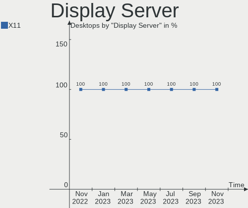
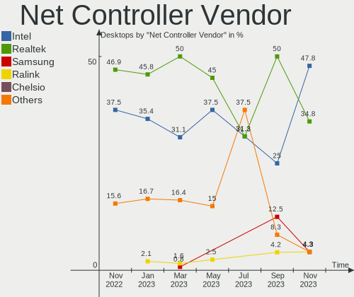
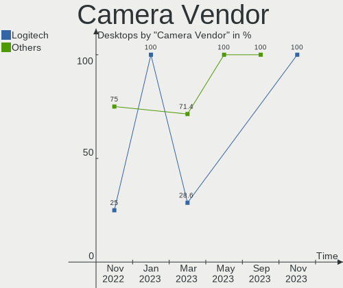

helloSystem - Hardware Trends (Desktops)
----------------------------------------

A project to identify most popular hardware characteristics and track their change
over time based on data collected by BSD users at https://BSD-Hardware.info.

Anyone can contribute to this report by the [hw-probe](https://github.com/linuxhw/hw-probe/blob/master/INSTALL.BSD.md) tool:

    hw-probe -all -upload

This report is for one last month. Overall report since the beginning of time: [TestCoverage](https://github.com/bsdhw/TestCoverage)

Period: Sep, 2022.

Contents
--------

* [ System ](#system)
  - [ OS                       ](#os)
  - [ OS Family                ](#os-family)
  - [ Arch                     ](#arch)
  - [ DE                       ](#de)
  - [ Display Server           ](#display-server)
  - [ Display Manager          ](#display-manager)
  - [ OS Lang                  ](#os-lang)
  - [ Boot Mode                ](#boot-mode)
  - [ Filesystem               ](#filesystem)
  - [ Part. scheme             ](#part-scheme)

* [ Board ](#board)
  - [ Vendor                   ](#vendor)
  - [ Model                    ](#model)
  - [ Model Family             ](#model-family)
  - [ MFG Year                 ](#mfg-year)
  - [ Form Factor              ](#form-factor)
  - [ Coreboot                 ](#coreboot)
  - [ RAM Size                 ](#ram-size)
  - [ RAM Used                 ](#ram-used)
  - [ Total Drives             ](#total-drives)
  - [ Has CD-ROM               ](#has-cd-rom)
  - [ Has Ethernet             ](#has-ethernet)
  - [ Has WiFi                 ](#has-wifi)
  - [ Has Bluetooth            ](#has-bluetooth)

* [ Location ](#location)
  - [ Country                  ](#country)
  - [ City                     ](#city)

* [ Drives ](#drives)
  - [ Drive Vendor             ](#drive-vendor)
  - [ Drive Model              ](#drive-model)
  - [ HDD Vendor               ](#hdd-vendor)
  - [ SSD Vendor               ](#ssd-vendor)
  - [ Drive Kind               ](#drive-kind)
  - [ Drive Connector          ](#drive-connector)
  - [ Drive Size               ](#drive-size)
  - [ Space Total              ](#space-total)
  - [ Space Used               ](#space-used)
  - [ Malfunc. Drives          ](#malfunc-drives)
  - [ Malfunc. Drive Vendor    ](#malfunc-drive-vendor)
  - [ Malfunc. HDD Vendor      ](#malfunc-hdd-vendor)
  - [ Malfunc. Drive Kind      ](#malfunc-drive-kind)
  - [ Failed Drives            ](#failed-drives)
  - [ Failed Drive Vendor      ](#failed-drive-vendor)
  - [ Drive Status             ](#drive-status)

* [ Storage controller ](#storage-controller)
  - [ Storage Vendor           ](#storage-vendor)
  - [ Storage Model            ](#storage-model)
  - [ Storage Kind             ](#storage-kind)

* [ Processor ](#processor)
  - [ CPU Vendor               ](#cpu-vendor)
  - [ CPU Model                ](#cpu-model)
  - [ CPU Model Family         ](#cpu-model-family)
  - [ CPU Cores                ](#cpu-cores)
  - [ CPU Sockets              ](#cpu-sockets)
  - [ CPU Threads              ](#cpu-threads)
  - [ CPU Microarch            ](#cpu-microarch)

* [ Graphics ](#graphics)
  - [ GPU Vendor               ](#gpu-vendor)
  - [ GPU Model                ](#gpu-model)
  - [ GPU Combo                ](#gpu-combo)
  - [ GPU Driver               ](#gpu-driver)
  - [ GPU Memory               ](#gpu-memory)

* [ Monitor ](#monitor)
  - [ Monitor Vendor           ](#monitor-vendor)
  - [ Monitor Model            ](#monitor-model)
  - [ Monitor Resolution       ](#monitor-resolution)
  - [ Monitor Diagonal         ](#monitor-diagonal)
  - [ Monitor Width            ](#monitor-width)
  - [ Aspect Ratio             ](#aspect-ratio)
  - [ Monitor Area             ](#monitor-area)
  - [ Pixel Density            ](#pixel-density)
  - [ Multiple Monitors        ](#multiple-monitors)

* [ Network ](#network)
  - [ Net Controller Vendor    ](#net-controller-vendor)
  - [ Net Controller Model     ](#net-controller-model)
  - [ Wireless Vendor          ](#wireless-vendor)
  - [ Wireless Model           ](#wireless-model)
  - [ Ethernet Vendor          ](#ethernet-vendor)
  - [ Ethernet Model           ](#ethernet-model)
  - [ Net Controller Kind      ](#net-controller-kind)
  - [ Used Controller          ](#used-controller)
  - [ NICs                     ](#nics)
  - [ IPv6                     ](#ipv6)

* [ Bluetooth ](#bluetooth)
  - [ Bluetooth Vendor         ](#bluetooth-vendor)
  - [ Bluetooth Model          ](#bluetooth-model)

* [ Sound ](#sound)
  - [ Sound Vendor             ](#sound-vendor)
  - [ Sound Model              ](#sound-model)

* [ Memory ](#memory)
  - [ Memory Vendor            ](#memory-vendor)
  - [ Memory Model             ](#memory-model)
  - [ Memory Kind              ](#memory-kind)
  - [ Memory Form Factor       ](#memory-form-factor)
  - [ Memory Size              ](#memory-size)
  - [ Memory Speed             ](#memory-speed)

* [ Printers & scanners ](#printers--scanners)
  - [ Printer Vendor           ](#printer-vendor)
  - [ Printer Model            ](#printer-model)
  - [ Scanner Vendor           ](#scanner-vendor)
  - [ Scanner Model            ](#scanner-model)

* [ Camera ](#camera)
  - [ Camera Vendor            ](#camera-vendor)
  - [ Camera Model             ](#camera-model)

* [ Security ](#security)
  - [ Fingerprint Vendor       ](#fingerprint-vendor)
  - [ Fingerprint Model        ](#fingerprint-model)
  - [ Chipcard Vendor          ](#chipcard-vendor)
  - [ Chipcard Model           ](#chipcard-model)

* [ Unsupported ](#unsupported)
  - [ Unsupported Devices      ](#unsupported-devices)
  - [ Unsupported Device Types ](#unsupported-device-types)

System
------

OS
--

Installed operating systems

| Name                | Desktops | Percent |
|---------------------|----------|---------|
| helloSystem 0.7.0   | 5        | 55.56%  |
| helloSystem 0.8.0   | 2        | 22.22%  |
| helloSystem 13.1-p2 | 1        | 11.11%  |
| helloSystem 13.1    | 1        | 11.11%  |

OS Family
---------

OS without a version

| Name        | Desktops | Percent |
|-------------|----------|---------|
| helloSystem | 9        | 100%    |

Arch
----

OS architecture (x86_64, i586, etc.)

| Name  | Desktops | Percent |
|-------|----------|---------|
| amd64 | 9        | 100%    |

DE
--

Desktop Environment

| Name         | Desktops | Percent |
|--------------|----------|---------|
| helloDesktop | 9        | 100%    |

Display Server
--------------

X11 or Wayland

| Name | Desktops | Percent |
|------|----------|---------|
| X11  | 9        | 100%    |

Display Manager
---------------

SDDM, LightDM, etc.

| Name    | Desktops | Percent |
|---------|----------|---------|
| SLiM    | 7        | 77.78%  |
| Console | 2        | 22.22%  |

OS Lang
-------

Language

| Lang  | Desktops | Percent |
|-------|----------|---------|
| en_US | 7        | 77.78%  |
| C     | 2        | 22.22%  |

Boot Mode
---------

EFI or BIOS

| Mode | Desktops | Percent |
|------|----------|---------|
| EFI  | 9        | 100%    |

Filesystem
----------

Type of filesystem

| Type   | Desktops | Percent |
|--------|----------|---------|
| Cd9660 | 6        | 66.67%  |
| Zfs    | 3        | 33.33%  |

Part. scheme
------------

Scheme of partitioning

| Type | Desktops | Percent |
|------|----------|---------|
| GPT  | 9        | 100%    |

Board
-----

Vendor
------

Motherboard manufacturer

| Name             | Desktops | Percent |
|------------------|----------|---------|
| Dell             | 2        | 22.22%  |
| ASUSTek Computer | 2        | 22.22%  |
| ASRock           | 2        | 22.22%  |
| Pegatron         | 1        | 11.11%  |
| Hewlett-Packard  | 1        | 11.11%  |
| Apple            | 1        | 11.11%  |

Model
-----

Motherboard model

| Name                                   | Desktops | Percent |
|----------------------------------------|----------|---------|
| Pegatron IPM41-D3                      | 1        | 11.11%  |
| HP ProDesk 400 G7 Small Form Factor PC | 1        | 11.11%  |
| Dell OptiPlex 7040                     | 1        | 11.11%  |
| Dell OptiPlex 3010                     | 1        | 11.11%  |
| ASUS TUF B450M-PRO GAMING              | 1        | 11.11%  |
| ASUS All Series                        | 1        | 11.11%  |
| ASRock ConRoeXFire-eSATA2              | 1        | 11.11%  |
| ASRock A320M-HD                        | 1        | 11.11%  |
| Apple MacPro5,1                        | 1        | 11.11%  |

Model Family
------------

Motherboard model prefix

| Name                      | Desktops | Percent |
|---------------------------|----------|---------|
| Dell OptiPlex             | 2        | 22.22%  |
| Pegatron IPM41-D3         | 1        | 11.11%  |
| HP ProDesk                | 1        | 11.11%  |
| ASUS TUF                  | 1        | 11.11%  |
| ASUS All                  | 1        | 11.11%  |
| ASRock ConRoeXFire-eSATA2 | 1        | 11.11%  |
| ASRock A320M-HD           | 1        | 11.11%  |
| Apple MacPro5             | 1        | 11.11%  |

MFG Year
--------

Motherboard manufacture year

| Year | Desktops | Percent |
|------|----------|---------|
| 2013 | 2        | 22.22%  |
| 2010 | 2        | 22.22%  |
| 2022 | 1        | 11.11%  |
| 2020 | 1        | 11.11%  |
| 2019 | 1        | 11.11%  |
| 2018 | 1        | 11.11%  |
| 2016 | 1        | 11.11%  |

Form Factor
-----------

Physical design of the computer

| Name    | Desktops | Percent |
|---------|----------|---------|
| Desktop | 9        | 100%    |

Coreboot
--------

Have coreboot on board

| Used | Desktops | Percent |
|------|----------|---------|
| No   | 9        | 100%    |

RAM Size
--------

Total RAM memory

| Size in GB  | Desktops | Percent |
|-------------|----------|---------|
| 4.01-8.0    | 4        | 44.44%  |
| 16.01-24.0  | 2        | 22.22%  |
| 32.01-64.0  | 1        | 11.11%  |
| 64.01-256.0 | 1        | 11.11%  |
| 8.01-16.0   | 1        | 11.11%  |

RAM Used
--------

Used RAM memory

| Used GB  | Desktops | Percent |
|----------|----------|---------|
| 0.01-0.5 | 3        | 33.33%  |
| 1.01-2.0 | 2        | 22.22%  |
| 0.51-1.0 | 2        | 22.22%  |
| 3.01-4.0 | 1        | 11.11%  |
| 2.01-3.0 | 1        | 11.11%  |

Total Drives
------------

Number of drives on board

| Drives | Desktops | Percent |
|--------|----------|---------|
| 1      | 4        | 44.44%  |
| 4      | 2        | 22.22%  |
| 2      | 2        | 22.22%  |
| 3      | 1        | 11.11%  |

Has CD-ROM
----------

Has CD-ROM on board

| Presented | Desktops | Percent |
|-----------|----------|---------|
| No        | 7        | 77.78%  |
| Yes       | 2        | 22.22%  |

Has Ethernet
------------

Has Ethernet on board

| Presented | Desktops | Percent |
|-----------|----------|---------|
| Yes       | 9        | 100%    |

Has WiFi
--------

Has WiFi module

| Presented | Desktops | Percent |
|-----------|----------|---------|
| No        | 8        | 88.89%  |
| Yes       | 1        | 11.11%  |

Has Bluetooth
-------------

Has Bluetooth module

| Presented | Desktops | Percent |
|-----------|----------|---------|
| No        | 6        | 66.67%  |
| Yes       | 3        | 33.33%  |

Location
--------

Country
-------

Geographic location (country)

| Country     | Desktops | Percent |
|-------------|----------|---------|
| Russia      | 3        | 33.33%  |
| Brazil      | 2        | 22.22%  |
| UK          | 1        | 11.11%  |
| Switzerland | 1        | 11.11%  |
| Spain       | 1        | 11.11%  |
| France      | 1        | 11.11%  |

City
----

Geographic location (city)

| City         | Desktops | Percent |
|--------------|----------|---------|
| Krasnodar    | 2        | 22.22%  |
| Volgograd    | 1        | 11.11%  |
| Southminster | 1        | 11.11%  |
| Leganés     | 1        | 11.11%  |
| Irece        | 1        | 11.11%  |
| Curitiba     | 1        | 11.11%  |
| Bourges      | 1        | 11.11%  |
| Basel        | 1        | 11.11%  |

Drives
------

Drive Vendor
------------

Hard drive vendors

| Vendor              | Desktops | Drives | Percent |
|---------------------|----------|--------|---------|
| Hitachi             | 3        | 3      | 21.43%  |
| Toshiba             | 2        | 2      | 14.29%  |
| Seagate             | 2        | 3      | 14.29%  |
| Samsung Electronics | 2        | 4      | 14.29%  |
| XrayDisk            | 1        | 1      | 7.14%   |
| WDC                 | 1        | 1      | 7.14%   |
| Silicon Motion      | 1        | 1      | 7.14%   |
| KIOXIA              | 1        | 1      | 7.14%   |
| Kingston            | 1        | 3      | 7.14%   |

Drive Model
-----------

Hard drive models

| Model                           | Desktops | Percent |
|---------------------------------|----------|---------|
| XrayDisk SSD 240GB              | 1        | 5.56%   |
| WDC WD10EZEX-00WN4A0 1TB        | 1        | 5.56%   |
| Toshiba MQ01UBD100 1TB          | 1        | 5.56%   |
| Toshiba DT01ACA100 1TB          | 1        | 5.56%   |
| Silicon Motion NE-256 256GB     | 1        | 5.56%   |
| Seagate ST3250310AS 250GB       | 1        | 5.56%   |
| Seagate ST250LT003-9YG14C 250GB | 1        | 5.56%   |
| Seagate ST1000DM003-1ER162 1TB  | 1        | 5.56%   |
| Samsung SSD 980 1TB             | 1        | 5.56%   |
| Samsung SSD 970 EVO Plus 500GB  | 1        | 5.56%   |
| Samsung SSD 850 EVO 500GB       | 1        | 5.56%   |
| Samsung SP0812C 80GB            | 1        | 5.56%   |
| KIOXIA KBG40ZNV512G 512GB       | 1        | 5.56%   |
| Kingston SUV400S37240G 240GB    | 1        | 5.56%   |
| Kingston SA400S37240G 240GB     | 1        | 5.56%   |
| Hitachi HTS541680J9SA00 80GB    | 1        | 5.56%   |
| Hitachi HDT721032SLA360 320GB   | 1        | 5.56%   |
| Hitachi HDS721050CLA662 500GB   | 1        | 5.56%   |

HDD Vendor
----------

Hard disk drive vendors

| Vendor              | Desktops | Drives | Percent |
|---------------------|----------|--------|---------|
| Hitachi             | 3        | 3      | 33.33%  |
| Toshiba             | 2        | 2      | 22.22%  |
| Seagate             | 2        | 3      | 22.22%  |
| WDC                 | 1        | 1      | 11.11%  |
| Samsung Electronics | 1        | 1      | 11.11%  |

SSD Vendor
----------

Solid state drive vendors

| Vendor              | Desktops | Drives | Percent |
|---------------------|----------|--------|---------|
| XrayDisk            | 1        | 1      | 33.33%  |
| Samsung Electronics | 1        | 1      | 33.33%  |
| Kingston            | 1        | 3      | 33.33%  |

Drive Kind
----------

HDD or SSD

| Kind | Desktops | Drives | Percent |
|------|----------|--------|---------|
| HDD  | 7        | 10     | 53.85%  |
| NVMe | 3        | 4      | 23.08%  |
| SSD  | 3        | 5      | 23.08%  |

Drive Connector
---------------

SATA, SAS, NVMe, etc.

| Type | Desktops | Drives | Percent |
|------|----------|--------|---------|
| SATA | 8        | 15     | 72.73%  |
| NVMe | 3        | 4      | 27.27%  |

Drive Size
----------

Size of hard drive

| Size in TB | Desktops | Drives | Percent |
|------------|----------|--------|---------|
| 0.01-0.5   | 6        | 11     | 60%     |
| 0.51-1.0   | 4        | 4      | 40%     |

Space Total
-----------

Amount of disk space available on the file system

| Size in GB | Desktops | Percent |
|------------|----------|---------|
| 1-20       | 6        | 66.67%  |
| 251-500    | 2        | 22.22%  |
| 21-50      | 1        | 11.11%  |

Space Used
----------

Amount of used disk space

| Used GB | Desktops | Percent |
|---------|----------|---------|
| 1-20    | 9        | 100%    |

Malfunc. Drives
---------------

Drive models with a malfunction

| Model                        | Desktops | Drives | Percent |
|------------------------------|----------|--------|---------|
| XrayDisk SSD 240GB           | 1        | 1      | 33.33%  |
| Toshiba MQ01UBD100 1TB       | 1        | 1      | 33.33%  |
| Hitachi HTS541680J9SA00 80GB | 1        | 1      | 33.33%  |

Malfunc. Drive Vendor
---------------------

Vendors of faulty drives

| Vendor   | Desktops | Drives | Percent |
|----------|----------|--------|---------|
| XrayDisk | 1        | 1      | 33.33%  |
| Toshiba  | 1        | 1      | 33.33%  |
| Hitachi  | 1        | 1      | 33.33%  |

Malfunc. HDD Vendor
-------------------

Vendors of faulty HDD drives

| Vendor  | Desktops | Drives | Percent |
|---------|----------|--------|---------|
| Toshiba | 1        | 1      | 50%     |
| Hitachi | 1        | 1      | 50%     |

Malfunc. Drive Kind
-------------------

Kinds of faulty drives

| Kind | Desktops | Drives | Percent |
|------|----------|--------|---------|
| HDD  | 2        | 2      | 66.67%  |
| SSD  | 1        | 1      | 33.33%  |

Failed Drives
-------------

Failed drive models

Zero info for selected period =(

Failed Drive Vendor
-------------------

Failed drive vendors

Zero info for selected period =(

Drive Status
------------

Number of failed and malfunc. drives

| Status   | Desktops | Drives | Percent |
|----------|----------|--------|---------|
| Works    | 7        | 12     | 63.64%  |
| Malfunc  | 3        | 3      | 27.27%  |
| Detected | 1        | 4      | 9.09%   |

Storage controller
------------------

Storage Vendor
--------------

Storage controller vendors

| Vendor              | Desktops | Percent |
|---------------------|----------|---------|
| Intel               | 7        | 58.33%  |
| AMD                 | 2        | 16.67%  |
| Silicon Motion      | 1        | 8.33%   |
| Samsung Electronics | 1        | 8.33%   |
| KIOXIA              | 1        | 8.33%   |

Storage Model
-------------

Storage controller models

| Model                                                                          | Desktops | Percent |
|--------------------------------------------------------------------------------|----------|---------|
| AMD FCH SATA Controller [AHCI mode]                                            | 2        | 12.5%   |
| Silicon Motion SM2263EN/SM2263XT SSD Controller                                | 1        | 6.25%   |
| Samsung NVMe SSD Controller SM981/PM981/PM983                                  | 1        | 6.25%   |
| Samsung NVMe SSD Controller 980                                                | 1        | 6.25%   |
| KIOXIA NVMe SSD Controller BG4                                                 | 1        | 6.25%   |
| Intel Q170/Q150/B150/H170/H110/Z170/CM236 Chipset SATA Controller [AHCI Mode]  | 1        | 6.25%   |
| Intel NM10/ICH7 Family SATA Controller [IDE mode]                              | 1        | 6.25%   |
| Intel NM10/ICH7 Family SATA Controller [AHCI mode]                             | 1        | 6.25%   |
| Intel Comet Lake SATA AHCI Controller                                          | 1        | 6.25%   |
| Intel 82801JI (ICH10 Family) SATA AHCI Controller                              | 1        | 6.25%   |
| Intel 82801G (ICH7 Family) IDE Controller                                      | 1        | 6.25%   |
| Intel 8 Series/C220 Series Chipset Family 6-port SATA Controller 1 [AHCI mode] | 1        | 6.25%   |
| Intel 6 Series/C200 Series Chipset Family 6 port Desktop SATA AHCI Controller  | 1        | 6.25%   |
| AMD FCH SATA Controller D                                                      | 1        | 6.25%   |
| AMD 400 Series Chipset SATA Controller                                         | 1        | 6.25%   |

Storage Kind
------------

Kind of storage controller (IDE, SATA, NVMe, SAS, ...)

| Kind | Desktops | Percent |
|------|----------|---------|
| SATA | 8        | 61.54%  |
| NVMe | 3        | 23.08%  |
| IDE  | 2        | 15.38%  |

Processor
---------

CPU Vendor
----------

Processor vendors

| Vendor | Desktops | Percent |
|--------|----------|---------|
| Intel  | 7        | 77.78%  |
| AMD    | 2        | 22.22%  |

CPU Model
---------

Processor models

| Model                                       | Desktops | Percent |
|---------------------------------------------|----------|---------|
| Intel Xeon CPU X5550 @ 2.67GHz              | 1        | 11.11%  |
| Intel Pentium Dual-Core CPU E6700 @ 3.20GHz | 1        | 11.11%  |
| Intel Pentium Dual-Core CPU E5200 @ 2.50GHz | 1        | 11.11%  |
| Intel Core i7-6700 CPU @ 3.40GHz            | 1        | 11.11%  |
| Intel Core i5-4440 CPU @ 3.10GHz            | 1        | 11.11%  |
| Intel Core i5-10500 CPU @ 3.10GHz           | 1        | 11.11%  |
| Intel Core i3-3220 CPU @ 3.30GHz            | 1        | 11.11%  |
| AMD Ryzen 7 2700X Eight-Core Processor      | 1        | 11.11%  |
| AMD Athlon 3000G with Radeon Vega Graphics  | 1        | 11.11%  |

CPU Model Family
----------------

Processor model prefix

| Model                   | Desktops | Percent |
|-------------------------|----------|---------|
| Intel Pentium Dual-Core | 2        | 22.22%  |
| Intel Core i5           | 2        | 22.22%  |
| Intel Xeon              | 1        | 11.11%  |
| Intel Core i7           | 1        | 11.11%  |
| Intel Core i3           | 1        | 11.11%  |
| AMD Ryzen 7             | 1        | 11.11%  |
| AMD Athlon              | 1        | 11.11%  |

CPU Cores
---------

Number of processor cores

| Number  | Desktops | Percent |
|---------|----------|---------|
| 4       | 3        | 33.33%  |
| 2       | 2        | 22.22%  |
| 16      | 1        | 11.11%  |
| 8       | 1        | 11.11%  |
| 6       | 1        | 11.11%  |
| Unknown | 1        | 11.11%  |

CPU Sockets
-----------

Number of sockets

| Number | Desktops | Percent |
|--------|----------|---------|
| 1      | 8        | 88.89%  |
| 2      | 1        | 11.11%  |

CPU Threads
-----------

Threads per core (Hyper-Threading)

| Number  | Desktops | Percent |
|---------|----------|---------|
| 2       | 4        | 44.44%  |
| 1       | 4        | 44.44%  |
| Unknown | 1        | 11.11%  |

CPU Microarch
-------------

Microarchitecture

| Name      | Desktops | Percent |
|-----------|----------|---------|
| Zen+      | 2        | 22.22%  |
| Penryn    | 2        | 22.22%  |
| Skylake   | 1        | 11.11%  |
| Nehalem   | 1        | 11.11%  |
| IvyBridge | 1        | 11.11%  |
| Haswell   | 1        | 11.11%  |
| CometLake | 1        | 11.11%  |

Graphics
--------

GPU Vendor
----------

Vendors of graphics cards

| Vendor | Desktops | Percent |
|--------|----------|---------|
| AMD    | 4        | 40%     |
| Nvidia | 3        | 30%     |
| Intel  | 3        | 30%     |

GPU Model
---------

Graphics card models

| Model                                                                | Desktops | Percent |
|----------------------------------------------------------------------|----------|---------|
| Nvidia TU116 [GeForce GTX 1660 SUPER]                                | 1        | 10%     |
| Nvidia GK107 [GeForce GT 640 OEM]                                    | 1        | 10%     |
| Nvidia G84 [GeForce 8600 GTS]                                        | 1        | 10%     |
| Intel Xeon E3-1200 v2/3rd Gen Core processor Graphics Controller     | 1        | 10%     |
| Intel HD Graphics 530                                                | 1        | 10%     |
| Intel CometLake-S GT2 [UHD Graphics 630]                             | 1        | 10%     |
| AMD Redwood XT [Radeon HD 5670/5690/5730]                            | 1        | 10%     |
| AMD Picasso/Raven 2 [Radeon Vega Series / Radeon Vega Mobile Series] | 1        | 10%     |
| AMD Oland XT [Radeon HD 8670 / R5 340X OEM / R7 250/350/350X OEM]    | 1        | 10%     |
| AMD Cedar [Radeon HD 5000/6000/7350/8350 Series]                     | 1        | 10%     |

GPU Combo
---------

Combinations of graphics cards

| Name        | Desktops | Percent |
|-------------|----------|---------|
| 1 x Nvidia  | 3        | 33.33%  |
| 1 x AMD     | 3        | 33.33%  |
| 1 x Intel   | 2        | 22.22%  |
| Intel + AMD | 1        | 11.11%  |

GPU Driver
----------

Free vs proprietary

| Driver      | Desktops | Percent |
|-------------|----------|---------|
| Free        | 6        | 66.67%  |
| Proprietary | 3        | 33.33%  |

GPU Memory
----------

Total video memory

| Size in GB | Desktops | Percent |
|------------|----------|---------|
| 3.01-4.0   | 2        | 22.22%  |
| 1.01-2.0   | 2        | 22.22%  |
| Unknown    | 2        | 22.22%  |
| 5.01-6.0   | 1        | 11.11%  |
| 0.51-1.0   | 1        | 11.11%  |
| 0.01-0.5   | 1        | 11.11%  |

Monitor
-------

Monitor Vendor
--------------

Monitor vendors

| Vendor              | Desktops | Percent |
|---------------------|----------|---------|
| Dell                | 2        | 22.22%  |
| Acer                | 2        | 22.22%  |
| Samsung Electronics | 1        | 11.11%  |
| Philips             | 1        | 11.11%  |
| Goldstar            | 1        | 11.11%  |
| Fujitsu Siemens     | 1        | 11.11%  |
| BenQ                | 1        | 11.11%  |

Monitor Model
-------------

Monitor models

| Model                                                       | Desktops | Percent |
|-------------------------------------------------------------|----------|---------|
| Samsung Electronics SyncMaster SAM0601 1600x900             | 1        | 10%     |
| Philips PHL 221V8 PHLC211 1920x1080 480x270mm 21.7-inch     | 1        | 10%     |
| Goldstar L1918S GSM4B31 1280x1024 380x300mm 19.1-inch       | 1        | 10%     |
| Fujitsu Siemens S19-1 FUS0517 1280x1024 380x300mm 19.1-inch | 1        | 10%     |
| Dell U2412M DELA07B 1920x1200 520x320mm 24.0-inch           | 1        | 10%     |
| Dell U2412M DELA07A 1920x1200 520x320mm 24.0-inch           | 1        | 10%     |
| Dell S2721QS DELA198 3840x2160 600x340mm 27.2-inch          | 1        | 10%     |
| BenQ GW2765 BNQ78D6 2560x1440 600x340mm 27.2-inch           | 1        | 10%     |
| Acer X223HQ ACR0098 1920x1080 470x270mm 21.3-inch           | 1        | 10%     |
| Acer GN246HL ACR02FA 1920x1080 530x300mm 24.0-inch          | 1        | 10%     |

Monitor Resolution
------------------

Monitor screen resolution

| Resolution        | Desktops | Percent |
|-------------------|----------|---------|
| 1920x1080 (FHD)   | 3        | 33.33%  |
| 1280x1024 (SXGA)  | 2        | 22.22%  |
| 3840x2160 (4K)    | 1        | 11.11%  |
| 2560x1440 (QHD)   | 1        | 11.11%  |
| 1920x1200 (WUXGA) | 1        | 11.11%  |
| 1600x900 (HD+)    | 1        | 11.11%  |

Monitor Diagonal
----------------

Diagonal size in inches

| Inches  | Desktops | Percent |
|---------|----------|---------|
| 27      | 2        | 22.22%  |
| 24      | 2        | 22.22%  |
| 21      | 2        | 22.22%  |
| 19      | 2        | 22.22%  |
| Unknown | 1        | 11.11%  |

Monitor Width
-------------

Physical width

| Width in mm | Desktops | Percent |
|-------------|----------|---------|
| 501-600     | 4        | 44.44%  |
| 401-500     | 2        | 22.22%  |
| 351-400     | 2        | 22.22%  |
| Unknown     | 1        | 11.11%  |

Aspect Ratio
------------

Proportional relationship between the width and the height

| Ratio | Desktops | Percent |
|-------|----------|---------|
| 16/9  | 6        | 66.67%  |
| 5/4   | 2        | 22.22%  |
| 16/10 | 1        | 11.11%  |

Monitor Area
------------

Area in inch²

| Area in inch² | Desktops | Percent |
|----------------|----------|---------|
| 151-200        | 3        | 33.33%  |
| 301-350        | 2        | 22.22%  |
| 201-250        | 2        | 22.22%  |
| 251-300        | 1        | 11.11%  |
| Unknown        | 1        | 11.11%  |

Pixel Density
-------------

Pixels per inch

| Density | Desktops | Percent |
|---------|----------|---------|
| 51-100  | 4        | 44.44%  |
| 101-120 | 3        | 33.33%  |
| 161-240 | 1        | 11.11%  |
| Unknown | 1        | 11.11%  |

Multiple Monitors
-----------------

Total monitors connected

| Total | Desktops | Percent |
|-------|----------|---------|
| 1     | 8        | 88.89%  |
| 2     | 1        | 11.11%  |

Network
-------

Net Controller Vendor
---------------------

Controller vendors

| Vendor                | Desktops | Percent |
|-----------------------|----------|---------|
| Realtek Semiconductor | 6        | 60%     |
| Intel                 | 3        | 30%     |
| Ralink Technology     | 1        | 10%     |

Net Controller Model
--------------------

Controller models

| Model                                                             | Desktops | Percent |
|-------------------------------------------------------------------|----------|---------|
| Realtek RTL8111/8168/8411 PCI Express Gigabit Ethernet Controller | 6        | 60%     |
| Ralink RT5370 Wireless Adapter                                    | 1        | 10%     |
| Intel Ethernet Connection (2) I219-LM                             | 1        | 10%     |
| Intel Ethernet Connection (11) I219-LM                            | 1        | 10%     |
| Intel 82574L Gigabit Network Connection                           | 1        | 10%     |

Wireless Vendor
---------------

Wireless vendors

| Vendor            | Desktops | Percent |
|-------------------|----------|---------|
| Ralink Technology | 1        | 100%    |

Wireless Model
--------------

Wireless models

| Model                          | Desktops | Percent |
|--------------------------------|----------|---------|
| Ralink RT5370 Wireless Adapter | 1        | 100%    |

Ethernet Vendor
---------------

Ethernet vendors

| Vendor                | Desktops | Percent |
|-----------------------|----------|---------|
| Realtek Semiconductor | 6        | 66.67%  |
| Intel                 | 3        | 33.33%  |

Ethernet Model
--------------

Ethernet models

| Model                                                             | Desktops | Percent |
|-------------------------------------------------------------------|----------|---------|
| Realtek RTL8111/8168/8411 PCI Express Gigabit Ethernet Controller | 6        | 66.67%  |
| Intel Ethernet Connection (2) I219-LM                             | 1        | 11.11%  |
| Intel Ethernet Connection (11) I219-LM                            | 1        | 11.11%  |
| Intel 82574L Gigabit Network Connection                           | 1        | 11.11%  |

Net Controller Kind
-------------------

Ethernet, WiFi or modem

| Kind     | Desktops | Percent |
|----------|----------|---------|
| Ethernet | 9        | 90%     |
| WiFi     | 1        | 10%     |

Used Controller
---------------

Currently used network controller

| Kind     | Desktops | Percent |
|----------|----------|---------|
| Ethernet | 8        | 100%    |

NICs
----

Total network controllers on board

| Total | Desktops | Percent |
|-------|----------|---------|
| 1     | 8        | 88.89%  |
| 2     | 1        | 11.11%  |

IPv6
----

IPv6 vs IPv4

| Used | Desktops | Percent |
|------|----------|---------|
| No   | 8        | 88.89%  |
| Yes  | 1        | 11.11%  |

Bluetooth
---------

Bluetooth Vendor
----------------

Controller vendors

| Vendor                | Desktops | Percent |
|-----------------------|----------|---------|
| Realtek Semiconductor | 1        | 33.33%  |
| Bluetooth Device      | 1        | 33.33%  |
| Apple                 | 1        | 33.33%  |

Bluetooth Model
---------------

Controller models

| Model                                                    | Desktops | Percent |
|----------------------------------------------------------|----------|---------|
| Realtek  Bluetooth Adapter                               | 1        | 33.33%  |
| Bluetooth Device Silicon Wave Bluetooth Wireless Adapter | 1        | 33.33%  |
| Apple Built-in Bluetooth 2.0+EDR HCI                     | 1        | 33.33%  |

Sound
-----

Sound Vendor
------------

Sound card vendors

| Vendor                  | Desktops | Percent |
|-------------------------|----------|---------|
| Intel                   | 7        | 46.67%  |
| AMD                     | 5        | 33.33%  |
| Nvidia                  | 2        | 13.33%  |
| BEHRINGER International | 1        | 6.67%   |

Sound Model
-----------

Sound card models

| Model                                                                      | Desktops | Percent |
|----------------------------------------------------------------------------|----------|---------|
| Intel NM10/ICH7 Family High Definition Audio Controller                    | 2        | 12.5%   |
| Nvidia TU116 High Definition Audio Controller                              | 1        | 6.25%   |
| Nvidia GK107 HDMI Audio Controller                                         | 1        | 6.25%   |
| Intel Comet Lake PCH cAVS                                                  | 1        | 6.25%   |
| Intel 82801JI (ICH10 Family) HD Audio Controller                           | 1        | 6.25%   |
| Intel 8 Series/C220 Series Chipset High Definition Audio Controller        | 1        | 6.25%   |
| Intel 6 Series/C200 Series Chipset Family High Definition Audio Controller | 1        | 6.25%   |
| Intel 100 Series/C230 Series Chipset Family HD Audio Controller            | 1        | 6.25%   |
| BEHRINGER International UMC202HD 192k                                      | 1        | 6.25%   |
| AMD Redwood HDMI Audio [Radeon HD 5000 Series]                             | 1        | 6.25%   |
| AMD Raven/Raven2/Fenghuang HDMI/DP Audio Controller                        | 1        | 6.25%   |
| AMD Oland/Hainan/Cape Verde/Pitcairn HDMI Audio [Radeon HD 7000 Series]    | 1        | 6.25%   |
| AMD Family 17h/19h HD Audio Controller                                     | 1        | 6.25%   |
| AMD Family 17h (Models 00h-0fh) HD Audio Controller                        | 1        | 6.25%   |
| AMD Cedar HDMI Audio [Radeon HD 5400/6300/7300 Series]                     | 1        | 6.25%   |

Memory
------

Memory Vendor
-------------

Memory module vendors

| Vendor              | Desktops | Percent |
|---------------------|----------|---------|
| Unknown             | 2        | 22.22%  |
| Kingston            | 2        | 22.22%  |
| Unknown             | 2        | 22.22%  |
| SK hynix            | 1        | 11.11%  |
| Samsung Electronics | 1        | 11.11%  |
| Micron Technology   | 1        | 11.11%  |

Memory Model
------------

Memory module models

| Model                                                 | Desktops | Percent |
|-------------------------------------------------------|----------|---------|
| Unknown                                               | 2        | 20%     |
| Unknown RAM Module 2GB DIMM SDRAM                     | 1        | 10%     |
| Unknown RAM Module 2GB DIMM DDR2                      | 1        | 10%     |
| Unknown RAM Module 1GB DIMM SDRAM                     | 1        | 10%     |
| SK hynix RAM HMT451U6AFR8C-PB 4GB DIMM DDR3 1600MT/s  | 1        | 10%     |
| Samsung RAM Module 16GB DIMM DDR3 1066MT/s            | 1        | 10%     |
| Micron RAM Module 16GB DIMM DDR4 3200MT/s             | 1        | 10%     |
| Kingston RAM KHX3200C16D4/8GX 8GB DIMM DDR4 3200MT/s  | 1        | 10%     |
| Kingston RAM 99U5402-052.A00LF 4GB DIMM DDR3 1600MT/s | 1        | 10%     |

Memory Kind
-----------

Memory module kinds

| Kind  | Desktops | Percent |
|-------|----------|---------|
| DDR4  | 3        | 37.5%   |
| DDR3  | 3        | 37.5%   |
| SDRAM | 1        | 12.5%   |
| DDR2  | 1        | 12.5%   |

Memory Form Factor
------------------

Physical design of the memory module

| Name | Desktops | Percent |
|------|----------|---------|
| DIMM | 8        | 100%    |

Memory Size
-----------

Memory module size

| Size  | Desktops | Percent |
|-------|----------|---------|
| 4096  | 4        | 40%     |
| 16384 | 2        | 20%     |
| 2048  | 2        | 20%     |
| 8192  | 1        | 10%     |
| 1024  | 1        | 10%     |

Memory Speed
------------

Memory module speed

| Speed   | Desktops | Percent |
|---------|----------|---------|
| 3200    | 2        | 25%     |
| 1600    | 2        | 25%     |
| Unknown | 2        | 25%     |
| 2667    | 1        | 12.5%   |
| 1066    | 1        | 12.5%   |

Printers & scanners
-------------------

Printer Vendor
--------------

Printer device vendors

Zero info for selected period =(

Printer Model
-------------

Printer device models

Zero info for selected period =(

Scanner Vendor
--------------

Scanner device vendors

Zero info for selected period =(

Scanner Model
-------------

Scanner device models

Zero info for selected period =(

Camera
------

Camera Vendor
-------------

Camera device vendors

| Vendor                  | Desktops | Percent |
|-------------------------|----------|---------|
| Z-Star Microelectronics | 1        | 50%     |
| Arkmicro Technologies   | 1        | 50%     |

Camera Model
------------

Camera device models

| Model                      | Desktops | Percent |
|----------------------------|----------|---------|
| Z-Star Venus USB2.0 Camera | 1        | 50%     |
| Arkmicro Webcam Carrefour  | 1        | 50%     |

Security
--------

Fingerprint Vendor
------------------

Fingerprint sensor vendors

Zero info for selected period =(

Fingerprint Model
-----------------

Fingerprint sensor models

Zero info for selected period =(

Chipcard Vendor
---------------

Chipcard module vendors

Zero info for selected period =(

Chipcard Model
--------------

Chipcard module models

Zero info for selected period =(

Unsupported
-----------

Unsupported Devices
-------------------

Total unsupported devices on board

| Total | Desktops | Percent |
|-------|----------|---------|
| 0     | 5        | 55.56%  |
| 2     | 2        | 22.22%  |
| 1     | 2        | 22.22%  |

Unsupported Device Types
------------------------

Types of unsupported devices

| Type                     | Desktops | Percent |
|--------------------------|----------|---------|
| Communication controller | 4        | 80%     |
| Sound                    | 1        | 20%     |

