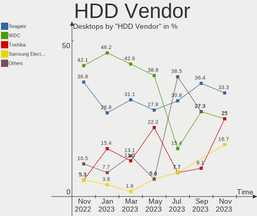
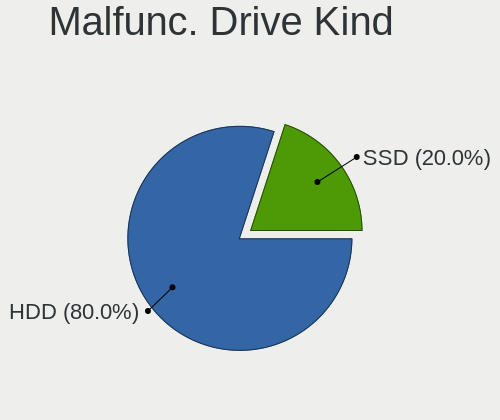
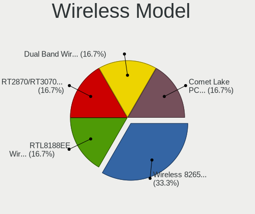

helloSystem Hardware Trends (Desktop)
-------------------------------------

A project to identify most popular hardware characteristics and track their change
over time based on data collected by helloSystem users at https://BSD-Hardware.info.

Anyone can contribute to the study by uploading probes of their computers by
the [hw-probe](https://github.com/linuxhw/hw-probe/blob/master/INSTALL.BSD.md) tool:

    hw-probe -all -upload

Full-feature report is available here: https://bsd-hardware.info/?view=trends&formfactor=desktop

Period: Mar, 2021.

Contents
--------

- [ OS                       ](#os)
- [ OS Family                ](#os-family)
- [ Arch                     ](#arch)
- [ DE                       ](#de)
- [ Display Server           ](#display-server)
- [ Display Manager          ](#display-manager)
- [ OS Lang                  ](#os-lang)
- [ Boot Mode                ](#boot-mode)
- [ Filesystem               ](#filesystem)
- [ Part. scheme             ](#part-scheme)
- [ Country                  ](#country)
- [ City                     ](#city)
- [ Vendor                   ](#vendor)
- [ Model                    ](#model)
- [ Model Family             ](#model-family)
- [ MFG Year                 ](#mfg-year)
- [ Form Factor              ](#form-factor)
- [ Coreboot                 ](#coreboot)
- [ RAM Size                 ](#ram-size)
- [ RAM Used                 ](#ram-used)
- [ Has CD-ROM               ](#has-cd-rom)
- [ Total Drives             ](#total-drives)
- [ Has Ethernet             ](#has-ethernet)
- [ Has WiFi                 ](#has-wifi)
- [ Has Bluetooth            ](#has-bluetooth)
- [ Drive Vendor             ](#drive-vendor)
- [ Drive Model              ](#drive-model)
- [ HDD Vendor               ](#hdd-vendor)
- [ SSD Vendor               ](#ssd-vendor)
- [ Drive Kind               ](#drive-kind)
- [ Drive Connector          ](#drive-connector)
- [ Drive Size               ](#drive-size)
- [ Space Total              ](#space-total)
- [ Space Used               ](#space-used)
- [ Malfunc. Drives          ](#malfunc-drives)
- [ Malfunc. Drive Vendor    ](#malfunc-drive-vendor)
- [ Malfunc. HDD Vendor      ](#malfunc-hdd-vendor)
- [ Malfunc. Drive Kind      ](#malfunc-drive-kind)
- [ Failed Drives            ](#failed-drives)
- [ Failed Drive Vendor      ](#failed-drive-vendor)
- [ Drive Status             ](#drive-status)
- [ Storage Vendor           ](#storage-vendor)
- [ Storage Model            ](#storage-model)
- [ Storage Kind             ](#storage-kind)
- [ CPU Vendor               ](#cpu-vendor)
- [ CPU Model                ](#cpu-model)
- [ CPU Model Family         ](#cpu-model-family)
- [ CPU Cores                ](#cpu-cores)
- [ CPU Sockets              ](#cpu-sockets)
- [ CPU Threads              ](#cpu-threads)
- [ CPU Microarch            ](#cpu-microarch)
- [ GPU Vendor               ](#gpu-vendor)
- [ GPU Model                ](#gpu-model)
- [ GPU Combo                ](#gpu-combo)
- [ GPU Driver               ](#gpu-driver)
- [ GPU Memory               ](#gpu-memory)
- [ Monitor Vendor           ](#monitor-vendor)
- [ Monitor Model            ](#monitor-model)
- [ Monitor Resolution       ](#monitor-resolution)
- [ Monitor Diagonal         ](#monitor-diagonal)
- [ Monitor Width            ](#monitor-width)
- [ Aspect Ratio             ](#aspect-ratio)
- [ Monitor Area             ](#monitor-area)
- [ Pixel Density            ](#pixel-density)
- [ Multiple Monitors        ](#multiple-monitors)
- [ Net Controller Vendor    ](#net-controller-vendor)
- [ Net Controller Model     ](#net-controller-model)
- [ Wireless Vendor          ](#wireless-vendor)
- [ Wireless Model           ](#wireless-model)
- [ Ethernet Vendor          ](#ethernet-vendor)
- [ Ethernet Model           ](#ethernet-model)
- [ Net Controller Kind      ](#net-controller-kind)
- [ Used Controller          ](#used-controller)
- [ NICs                     ](#nics)
- [ IPv6                     ](#ipv6)
- [ Memory Vendor            ](#memory-vendor)
- [ Memory Model             ](#memory-model)
- [ Memory Kind              ](#memory-kind)
- [ Memory Form Factor       ](#memory-form-factor)
- [ Memory Size              ](#memory-size)
- [ Memory Speed             ](#memory-speed)
- [ Sound Vendor             ](#sound-vendor)
- [ Sound Model              ](#sound-model)
- [ Camera Vendor            ](#camera-vendor)
- [ Camera Model             ](#camera-model)
- [ Fingerprint Vendor       ](#fingerprint-vendor)
- [ Fingerprint Model        ](#fingerprint-model)
- [ Chipcard Vendor          ](#chipcard-vendor)
- [ Chipcard Model           ](#chipcard-model)
- [ Printer Vendor           ](#printer-vendor)
- [ Printer Model            ](#printer-model)
- [ Scanner Vendor           ](#scanner-vendor)
- [ Scanner Model            ](#scanner-model)
- [ Bluetooth Vendor         ](#bluetooth-vendor)
- [ Bluetooth Model          ](#bluetooth-model)
- [ Unsupported Devices      ](#unsupported-devices)
- [ Unsupported Device Types ](#unsupported-device-types)

OS
--

Installed operating systems

| Name              | Desktops | Percent |
|-------------------|----------|---------|
| helloSystem 0.4.0 | 16       | 50%     |
| helloSystem 0.5.0 | 15       | 46.88%  |
| helloSystem 0.3.0 | 1        | 3.13%   |

OS Family
---------

OS without a version

| Name        | Desktops | Percent |
|-------------|----------|---------|
| helloSystem | 32       | 100%    |

Arch
----

OS architecture (x86_64, i586, etc.)

| Name  | Desktops | Percent |
|-------|----------|---------|
| amd64 | 32       | 100%    |

DE
--

Desktop Environment

| Name         | Desktops | Percent |
|--------------|----------|---------|
| helloDesktop | 32       | 100%    |

Display Server
--------------

X11 or Wayland

| Name | Desktops | Percent |
|------|----------|---------|
| X11  | 32       | 100%    |

Display Manager
---------------

SDDM, LightDM, etc.

| Name | Desktops | Percent |
|------|----------|---------|
| SLiM | 32       | 100%    |

OS Lang
-------

Language

| Lang  | Desktops | Percent |
|-------|----------|---------|
| en_US | 31       | 96.88%  |
| it_IT | 1        | 3.13%   |

Boot Mode
---------

EFI or BIOS

| Mode | Desktops | Percent |
|------|----------|---------|
| EFI  | 28       | 87.5%   |
| BIOS | 4        | 12.5%   |

Filesystem
----------

Type of filesystem

| Type | Desktops | Percent |
|------|----------|---------|
| Zfs  | 32       | 100%    |

Part. scheme
------------

Scheme of partitioning

| Type | Desktops | Percent |
|------|----------|---------|
| GPT  | 32       | 100%    |

Country
-------

Geographic location (country)

| Country | Desktops | Percent |
|---------|----------|---------|
| Germany | 5        | 15.63%  |
| Italy   | 4        | 12.5%   |
| USA     | 3        | 9.38%   |
| UK      | 3        | 9.38%   |
| Brazil  | 3        | 9.38%   |
| Spain   | 2        | 6.25%   |
| France  | 2        | 6.25%   |
| Canada  | 2        | 6.25%   |
| Ukraine | 1        | 3.13%   |
| Turkey  | 1        | 3.13%   |
| Taiwan  | 1        | 3.13%   |
| Russia  | 1        | 3.13%   |
| Mexico  | 1        | 3.13%   |
| Greece  | 1        | 3.13%   |
| Egypt   | 1        | 3.13%   |
| China   | 1        | 3.13%   |

City
----

Geographic location (city)

| City                 | Desktops | Percent |
|----------------------|----------|---------|
| Paris                | 2        | 6.25%   |
| Calgary              | 2        | 6.25%   |
| Zhongshan            | 1        | 3.13%   |
| Zaragoza             | 1        | 3.13%   |
| Wesley Chapel        | 1        | 3.13%   |
| Ware                 | 1        | 3.13%   |
| Treviso              | 1        | 3.13%   |
| Taoyuan District     | 1        | 3.13%   |
| Sheffield            | 1        | 3.13%   |
| Sevastopol           | 1        | 3.13%   |
| Roding               | 1        | 3.13%   |
| Ortona               | 1        | 3.13%   |
| Munich               | 1        | 3.13%   |
| Mestrino             | 1        | 3.13%   |
| Lübeck              | 1        | 3.13%   |
| Langwedel            | 1        | 3.13%   |
| Krasnoyarsk          | 1        | 3.13%   |
| Knoxville            | 1        | 3.13%   |
| Juazeiro             | 1        | 3.13%   |
| Izmir                | 1        | 3.13%   |
| Guarulhos            | 1        | 3.13%   |
| Guadalajara          | 1        | 3.13%   |
| Fuente Carreteros    | 1        | 3.13%   |
| Curitiba             | 1        | 3.13%   |
| Carmignano di Brenta | 1        | 3.13%   |
| Berlin               | 1        | 3.13%   |
| Athens               | 1        | 3.13%   |
| Anacortes            | 1        | 3.13%   |
| Al Mansurah          | 1        | 3.13%   |
| Aberdeen             | 1        | 3.13%   |

Vendor
------

Motherboard manufacturer

| Name                | Desktops | Percent |
|---------------------|----------|---------|
| ASUSTek Computer    | 9        | 28.13%  |
| Gigabyte Technology | 5        | 15.63%  |
| Hewlett-Packard     | 4        | 12.5%   |
| Dell                | 4        | 12.5%   |
| ASRock              | 3        | 9.38%   |
| Lenovo              | 2        | 6.25%   |
| VeryPC              | 1        | 3.13%   |
| Pegatron            | 1        | 3.13%   |
| MSI                 | 1        | 3.13%   |
| Medion              | 1        | 3.13%   |
| Foxconn             | 1        | 3.13%   |

Model
-----

Motherboard model

| Name                              | Desktops | Percent |
|-----------------------------------|----------|---------|
| VeryPC S400-K7-N-O                | 1        | 3.13%   |
| Pegatron IPM41-D3                 | 1        | 3.13%   |
| MSI MS-7982                       | 1        | 3.13%   |
| Medion H61H2-LM3                  | 1        | 3.13%   |
| Lenovo ThinkCentre M83 10AHS35Q00 | 1        | 3.13%   |
| Lenovo ThinkCentre M82 2756B94    | 1        | 3.13%   |
| HP ProDesk 600 G1 TWR             | 1        | 3.13%   |
| HP ProDesk 600 G1 SFF             | 1        | 3.13%   |
| HP EliteDesk 800 G1 DM            | 1        | 3.13%   |
| HP Compaq Pro 6300 SFF            | 1        | 3.13%   |
| Gigabyte Z77X-UD5H                | 1        | 3.13%   |
| Gigabyte Z77M-D3H                 | 1        | 3.13%   |
| Gigabyte X570 AORUS ELITE         | 1        | 3.13%   |
| Gigabyte B450 AORUS ELITE         | 1        | 3.13%   |
| Gigabyte 970A-DS3P                | 1        | 3.13%   |
| Foxconn p6-2305elm                | 1        | 3.13%   |
| Dell Precision WorkStation T5500  | 1        | 3.13%   |
| Dell OptiPlex 7050                | 1        | 3.13%   |
| Dell OptiPlex 380                 | 1        | 3.13%   |
| Dell OptiPlex 3050                | 1        | 3.13%   |
| ASUS PRIME Z390M-PLUS             | 1        | 3.13%   |
| ASUS PRIME H310M-E R2.0           | 1        | 3.13%   |
| ASUS PRIME B350M-A                | 1        | 3.13%   |
| ASUS P8Z77-V                      | 1        | 3.13%   |
| ASUS M5A99X EVO R2.0              | 1        | 3.13%   |
| ASUS M4A88TD-V EVO/USB3           | 1        | 3.13%   |
| ASUS M4A78                        | 1        | 3.13%   |
| ASUS H110M-PLUS                   | 1        | 3.13%   |
| ASUS BM6AD_BM1AD_BP1AD            | 1        | 3.13%   |
| ASRock H71M-DGS                   | 1        | 3.13%   |
| ASRock B450M Pro4                 | 1        | 3.13%   |
| ASRock 970A-G                     | 1        | 3.13%   |

Model Family
------------

Motherboard model prefix

| Name               | Desktops | Percent |
|--------------------|----------|---------|
| Dell OptiPlex      | 3        | 9.38%   |
| ASUS PRIME         | 3        | 9.38%   |
| Lenovo ThinkCentre | 2        | 6.25%   |
| HP ProDesk         | 2        | 6.25%   |
| VeryPC S400-K7-N-O | 1        | 3.13%   |
| Pegatron IPM41-D3  | 1        | 3.13%   |
| MSI MS-7982        | 1        | 3.13%   |
| Medion H61H2-LM3   | 1        | 3.13%   |
| HP EliteDesk       | 1        | 3.13%   |
| HP Compaq          | 1        | 3.13%   |
| Gigabyte Z77X-UD5H | 1        | 3.13%   |
| Gigabyte Z77M-D3H  | 1        | 3.13%   |
| Gigabyte X570      | 1        | 3.13%   |
| Gigabyte B450      | 1        | 3.13%   |
| Gigabyte 970A-DS3P | 1        | 3.13%   |
| Foxconn p6-2305elm | 1        | 3.13%   |
| Dell Precision     | 1        | 3.13%   |
| ASUS P8Z77-V       | 1        | 3.13%   |
| ASUS M5A99X        | 1        | 3.13%   |
| ASUS M4A88TD-V     | 1        | 3.13%   |
| ASUS M4A78         | 1        | 3.13%   |
| ASUS H110M-PLUS    | 1        | 3.13%   |
| ASUS BM6AD         | 1        | 3.13%   |
| ASRock H71M-DGS    | 1        | 3.13%   |
| ASRock B450M       | 1        | 3.13%   |
| ASRock 970A-G      | 1        | 3.13%   |

MFG Year
--------

Motherboard manufacture year

| Year | Desktops | Percent |
|------|----------|---------|
| 2019 | 5        | 15.63%  |
| 2012 | 5        | 15.63%  |
| 2016 | 4        | 12.5%   |
| 2020 | 3        | 9.38%   |
| 2018 | 3        | 9.38%   |
| 2014 | 3        | 9.38%   |
| 2013 | 3        | 9.38%   |
| 2017 | 2        | 6.25%   |
| 2010 | 2        | 6.25%   |
| 2015 | 1        | 3.13%   |
| 2009 | 1        | 3.13%   |

Form Factor
-----------

Physical design of the computer

| Name    | Desktops | Percent |
|---------|----------|---------|
| Desktop | 32       | 100%    |

Coreboot
--------

Have coreboot on board

| Used | Desktops | Percent |
|------|----------|---------|
| No   | 32       | 100%    |

RAM Size
--------

Total RAM memory

| Size in GB | Desktops | Percent |
|------------|----------|---------|
| 8.01-16.0  | 11       | 34.38%  |
| 4.01-8.0   | 10       | 31.25%  |
| 16.01-24.0 | 9        | 28.13%  |
| 32.01-64.0 | 2        | 6.25%   |

RAM Used
--------

Used RAM memory

| Used GB  | Desktops | Percent |
|----------|----------|---------|
| 0.01-0.5 | 21       | 65.63%  |
| 0.51-1.0 | 10       | 31.25%  |
| 1.01-2.0 | 1        | 3.13%   |

Has CD-ROM
----------

Has CD-ROM on board

| Presented | Desktops | Percent |
|-----------|----------|---------|
| No        | 23       | 71.88%  |
| Yes       | 9        | 28.13%  |

Total Drives
------------

Number of drives on board

| Drives | Desktops | Percent |
|--------|----------|---------|
| 1      | 18       | 56.25%  |
| 3      | 6        | 18.75%  |
| 4      | 3        | 9.38%   |
| 2      | 3        | 9.38%   |
| 8      | 1        | 3.13%   |
| 5      | 1        | 3.13%   |

Has Ethernet
------------

Has Ethernet on board

| Presented | Desktops | Percent |
|-----------|----------|---------|
| Yes       | 32       | 100%    |

Has WiFi
--------

Has WiFi module

| Presented | Desktops | Percent |
|-----------|----------|---------|
| No        | 20       | 62.5%   |
| Yes       | 12       | 37.5%   |

Has Bluetooth
-------------

Has Bluetooth module

| Presented | Desktops | Percent |
|-----------|----------|---------|
| No        | 26       | 81.25%  |
| Yes       | 6        | 18.75%  |

Drive Vendor
------------

Hard drive vendors

| Vendor              | Desktops | Drives | Percent |
|---------------------|----------|--------|---------|
| WDC                 | 11       | 12     | 20.75%  |
| Seagate             | 11       | 16     | 20.75%  |
| Samsung Electronics | 6        | 8      | 11.32%  |
| Toshiba             | 4        | 4      | 7.55%   |
| SanDisk             | 3        | 3      | 5.66%   |
| Kingston            | 3        | 3      | 5.66%   |
| Hitachi             | 3        | 3      | 5.66%   |
| PNY                 | 2        | 9      | 3.77%   |
| Crucial             | 2        | 2      | 3.77%   |
| A-DATA Technology   | 2        | 2      | 3.77%   |
| Micron Technology   | 1        | 1      | 1.89%   |
| Intel               | 1        | 1      | 1.89%   |
| Hoodisk             | 1        | 1      | 1.89%   |
| HGST                | 1        | 1      | 1.89%   |
| Hewlett-Packard     | 1        | 1      | 1.89%   |
| Gigabyte Technology | 1        | 2      | 1.89%   |

Drive Model
-----------

Hard drive models

| Model                               | Desktops | Percent |
|-------------------------------------|----------|---------|
| Seagate ST500DM002-1BD142 500GB     | 2        | 3.28%   |
| WDC WDS500G2B0A-00SM50 500GB        | 1        | 1.64%   |
| WDC WDS250G1B0A-00H9H0 250GB        | 1        | 1.64%   |
| WDC WD400BD-75LRA0 40GB             | 1        | 1.64%   |
| WDC WD3200AAKS-00L9A0 320GB         | 1        | 1.64%   |
| WDC WD3200AAJS-56M0A0 320GB         | 1        | 1.64%   |
| WDC WD2500BEVT-00A23T0 250GB        | 1        | 1.64%   |
| WDC WD2500BEVS-22UST0 250GB         | 1        | 1.64%   |
| WDC WD2500AAKX-75U6AA0 250GB        | 1        | 1.64%   |
| WDC WD1600AAJS-00WAA0 160GB         | 1        | 1.64%   |
| WDC WD10EZRX-00D8PB0 1TB            | 1        | 1.64%   |
| WDC WD10EZEX-08WN4A0 1TB            | 1        | 1.64%   |
| WDC WD10EZEX-00RKKA0 1TB            | 1        | 1.64%   |
| Toshiba THNSNK128GCS8 SATA 128GB    | 1        | 1.64%   |
| Toshiba Q300 240GB                  | 1        | 1.64%   |
| Toshiba DT01ACA300 3TB              | 1        | 1.64%   |
| Toshiba DT01ACA100 1TB              | 1        | 1.64%   |
| Seagate ST9160314AS 160GB           | 1        | 1.64%   |
| Seagate ST500LM012 HN-M500MBB 500GB | 1        | 1.64%   |
| Seagate ST500LM000-1EJ162 500GB     | 1        | 1.64%   |
| Seagate ST3500413AS 500GB           | 1        | 1.64%   |
| Seagate ST3500312CS 500GB           | 1        | 1.64%   |
| Seagate ST320LM001 HN-M320MBB 320GB | 1        | 1.64%   |
| Seagate ST3160815AS 160GB           | 1        | 1.64%   |
| Seagate ST31000333AS 1TB            | 1        | 1.64%   |
| Seagate ST3000DM001-9YN166 3TB      | 1        | 1.64%   |
| Seagate ST2000LM003 HN-M201RAD 2TB  | 1        | 1.64%   |
| Seagate ST1000DX001-1CM162 1TB      | 1        | 1.64%   |
| Seagate ST1000DM010-2EP102 1TB      | 1        | 1.64%   |
| SanDisk SDSSDP128G 128GB            | 1        | 1.64%   |
| SanDisk SDSSDA240G 240GB            | 1        | 1.64%   |
| SanDisk SD6SB1M-032G-1006 32GB      | 1        | 1.64%   |
| Samsung SSD 860 EVO 500GB           | 1        | 1.64%   |
| Samsung SSD 860 EVO 250GB           | 1        | 1.64%   |
| Samsung SSD 840 EVO 1TB             | 1        | 1.64%   |
| Samsung MZVPV128HDGM-00000 128GB    | 1        | 1.64%   |
| Samsung MZ7LN256HMJP-000L7 256GB    | 1        | 1.64%   |
| Samsung HD322HJ 320GB               | 1        | 1.64%   |
| Samsung HD103UJ 1TB                 | 1        | 1.64%   |
| Samsung HD103SI 1TB                 | 1        | 1.64%   |
| PNY SSD2SC120G1CS1754D117-551 120GB | 1        | 1.64%   |
| PNY CS900 240GB SSD                 | 1        | 1.64%   |
| PNY CS3030 500GB SSD                | 1        | 1.64%   |
| Micron 1100 SATA 256GB              | 1        | 1.64%   |
| Kingston SHFS37A240G 240GB          | 1        | 1.64%   |
| Kingston SA400S37120G 120GB         | 1        | 1.64%   |
| Kingston SA2000M8250G 250GB         | 1        | 1.64%   |
| Intel SSDSC2KW256G8 256GB           | 1        | 1.64%   |
| Hoodisk SSD 256GB                   | 1        | 1.64%   |
| Hitachi HTS543216L9A300 160GB       | 1        | 1.64%   |
| Hitachi HDS5C1050CLA382 500GB       | 1        | 1.64%   |
| Hitachi HCC543225A7A380 250GB       | 1        | 1.64%   |
| HGST HTS545032A7E380 320GB          | 1        | 1.64%   |
| HP SSD EX900 120GB                  | 1        | 1.64%   |
| Gigabyte GP-GSM2NE3128GNTD 128GB    | 1        | 1.64%   |
| Gigabyte GP-ASM2NE6100TTTD 1TB      | 1        | 1.64%   |
| Crucial CT525MX300SSD1 528GB        | 1        | 1.64%   |
| Crucial CT120M500SSD1 120GB         | 1        | 1.64%   |
| A-DATA SU650 240GB                  | 1        | 1.64%   |
| A-DATA SU650 120GB                  | 1        | 1.64%   |

HDD Vendor
----------

Hard disk drive vendors

| Vendor              | Desktops | Drives | Percent |
|---------------------|----------|--------|---------|
| Seagate             | 11       | 16     | 39.29%  |
| WDC                 | 9        | 10     | 32.14%  |
| Hitachi             | 3        | 3      | 10.71%  |
| Toshiba             | 2        | 2      | 7.14%   |
| Samsung Electronics | 2        | 3      | 7.14%   |
| HGST                | 1        | 1      | 3.57%   |

SSD Vendor
----------

Solid state drive vendors

| Vendor              | Desktops | Drives | Percent |
|---------------------|----------|--------|---------|
| Samsung Electronics | 4        | 4      | 18.18%  |
| SanDisk             | 3        | 3      | 13.64%  |
| WDC                 | 2        | 2      | 9.09%   |
| Toshiba             | 2        | 2      | 9.09%   |
| PNY                 | 2        | 7      | 9.09%   |
| Kingston            | 2        | 2      | 9.09%   |
| Crucial             | 2        | 2      | 9.09%   |
| A-DATA Technology   | 2        | 2      | 9.09%   |
| Micron Technology   | 1        | 1      | 4.55%   |
| Intel               | 1        | 1      | 4.55%   |
| Hoodisk             | 1        | 1      | 4.55%   |

Drive Kind
----------

HDD or SSD

| Kind | Desktops | Drives | Percent |
|------|----------|--------|---------|
| HDD  | 19       | 35     | 47.5%   |
| SSD  | 16       | 27     | 40%     |
| NVMe | 5        | 7      | 12.5%   |

Drive Connector
---------------

SATA, SAS, NVMe, etc.

| Type | Desktops | Drives | Percent |
|------|----------|--------|---------|
| SATA | 30       | 62     | 85.71%  |
| NVMe | 5        | 7      | 14.29%  |

Drive Size
----------

Size of hard drive

| Size in TB | Desktops | Drives | Percent |
|------------|----------|--------|---------|
| 0.01-0.5   | 26       | 47     | 70.27%  |
| 0.51-1.0   | 8        | 11     | 21.62%  |
| 2.01-3.0   | 2        | 3      | 5.41%   |
| 1.01-2.0   | 1        | 1      | 2.7%    |

Space Total
-----------

Amount of disk space available on the file system

| Size in GB | Desktops | Percent |
|------------|----------|---------|
| 1-20       | 25       | 78.13%  |
| 101-250    | 5        | 15.63%  |
| 251-500    | 1        | 3.13%   |
| 21-50      | 1        | 3.13%   |

Space Used
----------

Amount of used disk space

| Used GB | Desktops | Percent |
|---------|----------|---------|
| 1-20    | 32       | 100%    |

Malfunc. Drives
---------------

Drive models with a malfunction

| Model                               | Desktops | Drives | Percent |
|-------------------------------------|----------|--------|---------|
| WDC WD1600AAJS-00WAA0 160GB         | 1        | 1      | 8.33%   |
| WDC WD10EZEX-00RKKA0 1TB            | 1        | 1      | 8.33%   |
| Toshiba THNSNK128GCS8 SATA 128GB    | 1        | 1      | 8.33%   |
| Seagate ST9160314AS 160GB           | 1        | 1      | 8.33%   |
| Seagate ST500DM002-1BD142 500GB     | 1        | 1      | 8.33%   |
| Seagate ST320LM001 HN-M320MBB 320GB | 1        | 1      | 8.33%   |
| Seagate ST31000333AS 1TB            | 1        | 1      | 8.33%   |
| Seagate ST1000DX001-1CM162 1TB      | 1        | 1      | 8.33%   |
| Samsung Electronics HD103UJ 1TB     | 1        | 1      | 8.33%   |
| Hitachi HTS543216L9A300 160GB       | 1        | 1      | 8.33%   |
| HGST HTS545032A7E380 320GB          | 1        | 1      | 8.33%   |
| Crucial CT525MX300SSD1 528GB        | 1        | 1      | 8.33%   |

Malfunc. Drive Vendor
---------------------

Vendors of faulty drives

| Vendor              | Desktops | Drives | Percent |
|---------------------|----------|--------|---------|
| Seagate             | 5        | 5      | 41.67%  |
| WDC                 | 2        | 2      | 16.67%  |
| Toshiba             | 1        | 1      | 8.33%   |
| Samsung Electronics | 1        | 1      | 8.33%   |
| Hitachi             | 1        | 1      | 8.33%   |
| HGST                | 1        | 1      | 8.33%   |
| Crucial             | 1        | 1      | 8.33%   |

Malfunc. HDD Vendor
-------------------

Vendors of faulty HDD drives

| Vendor              | Desktops | Drives | Percent |
|---------------------|----------|--------|---------|
| Seagate             | 5        | 5      | 50%     |
| WDC                 | 2        | 2      | 20%     |
| Samsung Electronics | 1        | 1      | 10%     |
| Hitachi             | 1        | 1      | 10%     |
| HGST                | 1        | 1      | 10%     |

Malfunc. Drive Kind
-------------------

Kinds of faulty drives

| Kind | Desktops | Drives | Percent |
|------|----------|--------|---------|
| HDD  | 8        | 10     | 80%     |
| SSD  | 2        | 2      | 20%     |

Failed Drives
-------------

Failed drive models

Zero info for selected period =(

Failed Drive Vendor
-------------------

Failed drive vendors

Zero info for selected period =(

Drive Status
------------

Number of failed and malfunc. drives

| Status  | Desktops | Drives | Percent |
|---------|----------|--------|---------|
| Works   | 29       | 57     | 74.36%  |
| Malfunc | 10       | 12     | 25.64%  |

Storage Vendor
--------------

Storage controller vendors

| Vendor                      | Desktops | Percent |
|-----------------------------|----------|---------|
| Intel                       | 23       | 56.1%   |
| AMD                         | 9        | 21.95%  |
| Phison Electronics          | 2        | 4.88%   |
| VIA Technologies            | 1        | 2.44%   |
| Silicon Motion              | 1        | 2.44%   |
| Samsung Electronics         | 1        | 2.44%   |
| Kingston Technology Company | 1        | 2.44%   |
| Broadcom / LSI              | 1        | 2.44%   |
| ASMedia Technology          | 1        | 2.44%   |
| Adaptec                     | 1        | 2.44%   |

Storage Model
-------------

Storage controller models

| Model                                                                          | Desktops | Percent |
|--------------------------------------------------------------------------------|----------|---------|
| Intel 8 Series/C220 Series Chipset Family 6-port SATA Controller 1 [AHCI mode] | 5        | 10%     |
| Intel 7 Series/C210 Series Chipset Family 6-port SATA Controller [AHCI mode]   | 4        | 8%      |
| AMD FCH SATA Controller [AHCI mode]                                            | 4        | 8%      |
| Intel 6 Series/C200 Series Chipset Family 6 port Desktop SATA AHCI Controller  | 3        | 6%      |
| AMD SB7x0/SB8x0/SB9x0 SATA Controller [IDE mode]                               | 3        | 6%      |
| AMD SB7x0/SB8x0/SB9x0 IDE Controller                                           | 3        | 6%      |
| Intel Q170/Q150/B150/H170/H110/Z170/CM236 Chipset SATA Controller [AHCI Mode]  | 2        | 4%      |
| Intel NM10/ICH7 Family SATA Controller [IDE mode]                              | 2        | 4%      |
| Intel 200 Series PCH SATA controller [AHCI mode]                               | 2        | 4%      |
| AMD SB7x0/SB8x0/SB9x0 SATA Controller [AHCI mode]                              | 2        | 4%      |
| AMD 400 Series Chipset SATA Controller                                         | 2        | 4%      |
| VIA VT6415 PATA IDE Host Controller                                            | 1        | 2%      |
| Silicon Motion SM2263EN/SM2263XT SSD Controller                                | 1        | 2%      |
| Samsung NVMe SSD Controller SM951/PM951                                        | 1        | 2%      |
| Phison PS5013 E13 NVMe Controller                                              | 1        | 2%      |
| Phison E16 PCIe4 NVMe Controller                                               | 1        | 2%      |
| Phison E12 NVMe Controller                                                     | 1        | 2%      |
| Kingston Company A2000 NVMe SSD                                                | 1        | 2%      |
| Intel Sunrise Point-LP SATA Controller [AHCI mode]                             | 1        | 2%      |
| Intel SATA Controller [RAID mode]                                              | 1        | 2%      |
| Intel Cannon Lake PCH SATA AHCI Controller                                     | 1        | 2%      |
| Intel 82801JI (ICH10 Family) SATA AHCI Controller                              | 1        | 2%      |
| Intel 82801G (ICH7 Family) IDE Controller                                      | 1        | 2%      |
| Intel 7 Series/C210 Series Chipset Family 4-port SATA Controller [IDE mode]    | 1        | 2%      |
| Intel 7 Series/C210 Series Chipset Family 2-port SATA Controller [IDE mode]    | 1        | 2%      |
| Broadcom / LSI SAS2008 PCI-Express Fusion-MPT SAS-2 [Falcon]                   | 1        | 2%      |
| ASMedia ASM1062 Serial ATA Controller                                          | 1        | 2%      |
| AMD 300 Series Chipset SATA Controller                                         | 1        | 2%      |
| Adaptec AIC-7850T/7856T [AVA-2902/4/6 / AHA-2910]                              | 1        | 2%      |

Storage Kind
------------

Kind of storage controller (IDE, SATA, NVMe, SAS, ...)

| Kind | Desktops | Percent |
|------|----------|---------|
| SATA | 25       | 64.1%   |
| IDE  | 6        | 15.38%  |
| NVMe | 5        | 12.82%  |
| RAID | 2        | 5.13%   |
| SCSI | 1        | 2.56%   |

CPU Vendor
----------

Processor vendors

| Vendor | Desktops | Percent |
|--------|----------|---------|
| Intel  | 23       | 71.88%  |
| AMD    | 9        | 28.13%  |

CPU Model
---------

Processor models

| Model                                       | Desktops | Percent |
|---------------------------------------------|----------|---------|
| Intel Core i5-7500 CPU @ 3.40GHz            | 2        | 6.25%   |
| Intel Core i3-4360 CPU @ 3.70GHz            | 2        | 6.25%   |
| AMD Ryzen 3 1200 Quad-Core Processor        | 2        | 6.25%   |
| Intel Xeon CPU E3-1265L v3 @ 2.50GHz        | 1        | 3.13%   |
| Intel Xeon                                  | 1        | 3.13%   |
| Intel Pentium Dual-Core CPU E6700 @ 3.20GHz | 1        | 3.13%   |
| Intel Pentium CPU G620 @ 2.60GHz            | 1        | 3.13%   |
| Intel Core i7-7500U CPU @ 2.70GHz           | 1        | 3.13%   |
| Intel Core i7-3770K CPU @ 3.50GHz           | 1        | 3.13%   |
| Intel Core i7-3770 CPU @ 3.40GHz            | 1        | 3.13%   |
| Intel Core i7-2600K CPU @ 3.40GHz           | 1        | 3.13%   |
| Intel Core i5-9400 CPU @ 2.90GHz            | 1        | 3.13%   |
| Intel Core i5-7500T CPU @ 2.70GHz           | 1        | 3.13%   |
| Intel Core i5-3570K CPU @ 3.40GHz           | 1        | 3.13%   |
| Intel Core i5-2400S CPU @ 2.50GHz           | 1        | 3.13%   |
| Intel Core i3-9100F CPU @ 3.60GHz           | 1        | 3.13%   |
| Intel Core i3-6300 CPU @ 3.80GHz            | 1        | 3.13%   |
| Intel Core i3-4170 CPU @ 3.70GHz            | 1        | 3.13%   |
| Intel Core i3-3220 CPU @ 3.30GHz            | 1        | 3.13%   |
| Intel Core i3-2120 CPU @ 3.30GHz            | 1        | 3.13%   |
| Intel Core 2 Duo                            | 1        | 3.13%   |
| Intel Celeron CPU G1840 @ 2.80GHz           | 1        | 3.13%   |
| AMD Ryzen 7 3800X 8-Core Processor          | 1        | 3.13%   |
| AMD Ryzen 5 3400G with Radeon Vega Graphics | 1        | 3.13%   |
| AMD Phenom II X4 965 Processor              | 1        | 3.13%   |
| AMD Phenom II X4 945 Processor              | 1        | 3.13%   |
| AMD FX-8320E Eight-Core Processor           | 1        | 3.13%   |
| AMD FX-8320 Eight-Core Processor            | 1        | 3.13%   |
| AMD FX-6100 Six-Core Processor              | 1        | 3.13%   |

CPU Model Family
----------------

Processor model prefix

| Model                   | Desktops | Percent |
|-------------------------|----------|---------|
| Intel Core i3           | 7        | 21.88%  |
| Intel Core i5           | 6        | 18.75%  |
| Intel Core i7           | 4        | 12.5%   |
| AMD FX                  | 3        | 9.38%   |
| Intel Xeon              | 2        | 6.25%   |
| AMD Ryzen 3             | 2        | 6.25%   |
| AMD Phenom II X4        | 2        | 6.25%   |
| Intel Pentium Dual-Core | 1        | 3.13%   |
| Intel Pentium           | 1        | 3.13%   |
| Intel Core 2 Duo        | 1        | 3.13%   |
| Intel Celeron           | 1        | 3.13%   |
| AMD Ryzen 7             | 1        | 3.13%   |
| AMD Ryzen 5             | 1        | 3.13%   |

CPU Cores
---------

Number of processor cores

| Number | Desktops | Percent |
|--------|----------|---------|
| 4      | 16       | 50%     |
| 2      | 10       | 31.25%  |
| 8      | 3        | 9.38%   |
| 6      | 2        | 6.25%   |
| 16     | 1        | 3.13%   |

CPU Sockets
-----------

Number of sockets

| Number | Desktops | Percent |
|--------|----------|---------|
| 1      | 32       | 100%    |

CPU Threads
-----------

Threads per core (Hyper-Threading)

| Number | Desktops | Percent |
|--------|----------|---------|
| 1      | 21       | 65.63%  |
| 2      | 11       | 34.38%  |

CPU Microarch
-------------

Microarchitecture

| Name        | Desktops | Percent |
|-------------|----------|---------|
| KabyLake    | 6        | 18.75%  |
| Haswell     | 5        | 15.63%  |
| SandyBridge | 4        | 12.5%   |
| IvyBridge   | 4        | 12.5%   |
| Zen         | 2        | 6.25%   |
| Piledriver  | 2        | 6.25%   |
| K10         | 2        | 6.25%   |
| Zen+        | 1        | 3.13%   |
| Zen 2       | 1        | 3.13%   |
| Westmere    | 1        | 3.13%   |
| Skylake     | 1        | 3.13%   |
| Penryn      | 1        | 3.13%   |
| Core        | 1        | 3.13%   |
| Bulldozer   | 1        | 3.13%   |

GPU Vendor
----------

Vendors of graphics cards

| Vendor | Desktops | Percent |
|--------|----------|---------|
| Intel  | 13       | 38.24%  |
| Nvidia | 11       | 32.35%  |
| AMD    | 10       | 29.41%  |

GPU Model
---------

Graphics card models

| Model                                                                       | Desktops | Percent |
|-----------------------------------------------------------------------------|----------|---------|
| Intel Xeon E3-1200 v2/3rd Gen Core processor Graphics Controller            | 3        | 8.82%   |
| Nvidia GK208B [GeForce GT 710]                                              | 2        | 5.88%   |
| Intel Xeon E3-1200 v3/4th Gen Core Processor Integrated Graphics Controller | 2        | 5.88%   |
| Intel HD Graphics 630                                                       | 2        | 5.88%   |
| Intel 2nd Generation Core Processor Family Integrated Graphics Controller   | 2        | 5.88%   |
| AMD Ellesmere [Radeon RX 470/480/570/570X/580/580X/590]                     | 2        | 5.88%   |
| Nvidia TU116 [GeForce GTX 1660 SUPER]                                       | 1        | 2.94%   |
| Nvidia GP107 [GeForce GTX 1050 Ti]                                          | 1        | 2.94%   |
| Nvidia GP106 [GeForce GTX 1060 6GB]                                         | 1        | 2.94%   |
| Nvidia GP106 [GeForce GTX 1060 3GB]                                         | 1        | 2.94%   |
| Nvidia GK208B [GeForce GT 730]                                              | 1        | 2.94%   |
| Nvidia GK107 [GeForce GT 740]                                               | 1        | 2.94%   |
| Nvidia GK106 [GeForce GTX 660]                                              | 1        | 2.94%   |
| Nvidia GF119 [GeForce GT 610]                                               | 1        | 2.94%   |
| Nvidia G92 [GeForce 9800 GT]                                                | 1        | 2.94%   |
| Intel Xeon E3-1200 v3 Processor Integrated Graphics Controller              | 1        | 2.94%   |
| Intel HD Graphics 620                                                       | 1        | 2.94%   |
| Intel 4th Generation Core Processor Family Integrated Graphics Controller   | 1        | 2.94%   |
| Intel 4 Series Chipset Integrated Graphics Controller                       | 1        | 2.94%   |
| AMD Turks PRO [Radeon HD 6570/7570/8550 / R5 230]                           | 1        | 2.94%   |
| AMD RV730 XT [Radeon HD 4670]                                               | 1        | 2.94%   |
| AMD RV710 [Radeon HD 4350/4550]                                             | 1        | 2.94%   |
| AMD RV620 GL [FirePro 2260]                                                 | 1        | 2.94%   |
| AMD Navi 10 [Radeon RX 5600 OEM/5600 XT / 5700/5700 XT]                     | 1        | 2.94%   |
| AMD Cape Verde XT [Radeon HD 7770/8760 / R7 250X]                           | 1        | 2.94%   |
| AMD Baffin [Radeon RX 550 640SP / RX 560/560X]                              | 1        | 2.94%   |
| AMD Baffin [Radeon RX 460/560D / Pro 450/455/460/555/555X/560/560X]         | 1        | 2.94%   |

GPU Combo
---------

Combinations of graphics cards

| Name        | Desktops | Percent |
|-------------|----------|---------|
| 1 x Nvidia  | 11       | 34.38%  |
| 1 x Intel   | 10       | 31.25%  |
| 1 x AMD     | 8        | 25%     |
| Intel + AMD | 2        | 6.25%   |
| 2 x Intel   | 1        | 3.13%   |

GPU Driver
----------

Free vs proprietary

| Driver      | Desktops | Percent |
|-------------|----------|---------|
| Free        | 23       | 71.88%  |
| Proprietary | 8        | 25%     |
| Unknown     | 1        | 3.13%   |

GPU Memory
----------

Total video memory

| Size in GB | Desktops | Percent |
|------------|----------|---------|
| Unknown    | 16       | 50%     |
| 0.51-1.0   | 5        | 15.63%  |
| 3.01-4.0   | 4        | 12.5%   |
| 1.01-2.0   | 4        | 12.5%   |
| 5.01-6.0   | 1        | 3.13%   |
| 2.01-3.0   | 1        | 3.13%   |
| 0.01-0.5   | 1        | 3.13%   |

Monitor Vendor
--------------

Monitor vendors

| Vendor               | Desktops | Percent |
|----------------------|----------|---------|
| Samsung Electronics  | 5        | 20%     |
| Goldstar             | 4        | 16%     |
| Acer                 | 3        | 12%     |
| Hewlett-Packard      | 2        | 8%      |
| Dell                 | 2        | 8%      |
| BenQ                 | 2        | 8%      |
| Vestel Elektronik    | 1        | 4%      |
| RS                   | 1        | 4%      |
| PRI                  | 1        | 4%      |
| Packard Bell         | 1        | 4%      |
| Medion               | 1        | 4%      |
| AOC                  | 1        | 4%      |
| Ancor Communications | 1        | 4%      |

Monitor Model
-------------

Monitor models

| Model                                                                 | Desktops | Percent |
|-----------------------------------------------------------------------|----------|---------|
| Vestel Elektronik 22W_LCD_TV VES3700 1920x540                         | 1        | 3.85%   |
| Samsung Electronics SyncMaster SAM0600 1600x900 440x250mm 19.9-inch   | 1        | 3.85%   |
| Samsung Electronics SyncMaster SAM0364 1360x768 340x190mm 15.3-inch   | 1        | 3.85%   |
| Samsung Electronics LCD Monitor SAM4A75 1024x768 300x230mm 14.9-inch  | 1        | 3.85%   |
| Samsung Electronics LCD Monitor SAM07C0 1920x1080 480x270mm 21.7-inch | 1        | 3.85%   |
| Samsung Electronics C24F390 SAM0D2D 1920x1080 520x290mm 23.4-inch     | 1        | 3.85%   |
| RS LE2262 BTC2262 1680x1050 470x290mm 21.7-inch                       | 1        | 3.85%   |
| PRI LED-MONITOR PRI0828 3840x2160 1150x650mm 52.0-inch                | 1        | 3.85%   |
| Packard Bell Viseo 193 Ws PKB008C 1440x900 410x260mm 19.1-inch        | 1        | 3.85%   |
| Medion MD21281 MED3947 1366x768 410x230mm 18.5-inch                   | 1        | 3.85%   |
| Hewlett-Packard 27fh HPN354A 1920x1080 600x340mm 27.2-inch            | 1        | 3.85%   |
| Hewlett-Packard 27er HWP3325 1920x1080 600x340mm 27.2-inch            | 1        | 3.85%   |
| Hewlett-Packard 2310e HWP2909 1920x1080 510x290mm 23.1-inch           | 1        | 3.85%   |
| Goldstar LG Ultra HD GSM5B08 3840x2160 600x340mm 27.2-inch            | 1        | 3.85%   |
| Goldstar LG FULL HD GSM5ABA 1920x1080 480x270mm 21.7-inch             | 1        | 3.85%   |
| Goldstar L1953TR GSM4B44 1280x1024 340x270mm 17.1-inch                | 1        | 3.85%   |
| Goldstar E2340 GSM57C7 1920x1080 510x290mm 23.1-inch                  | 1        | 3.85%   |
| Dell P1917S DELD092 1280x1024 380x300mm 19.1-inch                     | 1        | 3.85%   |
| Dell G2410 DEL404A 1920x1080 530x300mm 24.0-inch                      | 1        | 3.85%   |
| BenQ GL2450 BNQ78A4 1920x1080 530x300mm 24.0-inch                     | 1        | 3.85%   |
| BenQ FP91G+ BNQ76A6 1280x1024 380x300mm 19.1-inch                     | 1        | 3.85%   |
| AOC 2770 AOC2770 1920x1080 600x340mm 27.2-inch                        | 1        | 3.85%   |
| Ancor Communications ASUS VW224 ACI22AA 1680x1050 470x300mm 22.0-inch | 1        | 3.85%   |
| Acer S221HQL ACR01A9 1920x1080 480x270mm 21.7-inch                    | 1        | 3.85%   |
| Acer G196HQL ACR0325 1366x768 410x230mm 18.5-inch                     | 1        | 3.85%   |
| Acer AL1916W ACRAD52 1440x900 410x260mm 19.1-inch                     | 1        | 3.85%   |

Monitor Resolution
------------------

Monitor screen resolution

| Resolution         | Desktops | Percent |
|--------------------|----------|---------|
| 1920x1080 (FHD)    | 10       | 40%     |
| 1280x1024 (SXGA)   | 3        | 12%     |
| 3840x2160 (4K)     | 2        | 8%      |
| 1680x1050 (WSXGA+) | 2        | 8%      |
| 1440x900 (WXGA+)   | 2        | 8%      |
| 1366x768 (WXGA)    | 2        | 8%      |
| 1920x540           | 1        | 4%      |
| 1600x900 (HD+)     | 1        | 4%      |
| 1360x768           | 1        | 4%      |
| 1024x768 (XGA)     | 1        | 4%      |

Monitor Diagonal
----------------

Diagonal size in inches

| Inches  | Desktops | Percent |
|---------|----------|---------|
| 19      | 5        | 20%     |
| 21      | 4        | 16%     |
| 27      | 3        | 12%     |
| 23      | 3        | 12%     |
| 24      | 2        | 8%      |
| 18      | 2        | 8%      |
| 52      | 1        | 4%      |
| 22      | 1        | 4%      |
| 17      | 1        | 4%      |
| 15      | 1        | 4%      |
| 14      | 1        | 4%      |
| Unknown | 1        | 4%      |

Monitor Width
-------------

Physical width

| Width in mm | Desktops | Percent |
|-------------|----------|---------|
| 401-500     | 10       | 40%     |
| 501-600     | 8        | 32%     |
| 351-400     | 2        | 8%      |
| 301-350     | 2        | 8%      |
| 201-300     | 1        | 4%      |
| 1001-1500   | 1        | 4%      |
| Unknown     | 1        | 4%      |

Aspect Ratio
------------

Proportional relationship between the width and the height

| Ratio | Desktops | Percent |
|-------|----------|---------|
| 16/9  | 16       | 64%     |
| 16/10 | 4        | 16%     |
| 5/4   | 3        | 12%     |
| 4/3   | 1        | 4%      |
| 32/9  | 1        | 4%      |

Monitor Area
------------

Area in inch²

| Area in inch² | Desktops | Percent |
|----------------|----------|---------|
| 201-250        | 9        | 37.5%   |
| 151-200        | 5        | 20.83%  |
| 301-350        | 3        | 12.5%   |
| 141-150        | 3        | 12.5%   |
| More than 1000 | 1        | 4.17%   |
| 101-110        | 1        | 4.17%   |
| 91-100         | 1        | 4.17%   |
| Unknown        | 1        | 4.17%   |

Pixel Density
-------------

Pixels per inch

| Density | Desktops | Percent |
|---------|----------|---------|
| 51-100  | 18       | 75%     |
| 101-120 | 4        | 16.67%  |
| 161-240 | 1        | 4.17%   |
| Unknown | 1        | 4.17%   |

Multiple Monitors
-----------------

Total monitors connected

| Total | Desktops | Percent |
|-------|----------|---------|
| 1     | 22       | 68.75%  |
| 0     | 8        | 25%     |
| 2     | 2        | 6.25%   |

Net Controller Vendor
---------------------

Controller vendors

| Vendor                          | Desktops | Percent |
|---------------------------------|----------|---------|
| Realtek Semiconductor           | 19       | 44.19%  |
| Intel                           | 14       | 32.56%  |
| Qualcomm Atheros                | 3        | 6.98%   |
| Ralink                          | 2        | 4.65%   |
| Broadcom Inc. and subsidiaries  | 2        | 4.65%   |
| Ralink Technology               | 1        | 2.33%   |
| Qualcomm Atheros Communications | 1        | 2.33%   |
| ASUSTek Computer                | 1        | 2.33%   |

Net Controller Model
--------------------

Controller models

| Model                                                                  | Desktops | Percent |
|------------------------------------------------------------------------|----------|---------|
| Realtek RTL8111/8168/8411 PCI Express Gigabit Ethernet Controller      | 15       | 31.91%  |
| Intel Ethernet Connection I217-LM                                      | 4        | 8.51%   |
| Intel Wireless 3165                                                    | 2        | 4.26%   |
| Intel 82579V Gigabit Network Connection                                | 2        | 4.26%   |
| Intel 82579LM Gigabit Network Connection (Lewisville)                  | 2        | 4.26%   |
| Realtek RTL8812AE 802.11ac PCIe Wireless Network Adapter               | 1        | 2.13%   |
| Realtek RTL8188EUS 802.11n Wireless Network Adapter                    | 1        | 2.13%   |
| Realtek RTL8188CUS 802.11n WLAN Adapter                                | 1        | 2.13%   |
| Realtek RTL8169 PCI Gigabit Ethernet Controller                        | 1        | 2.13%   |
| Realtek RTL-8100/8101L/8139 PCI Fast Ethernet Adapter                  | 1        | 2.13%   |
| Ralink MT7601U Wireless Adapter                                        | 1        | 2.13%   |
| Ralink RT5390R 802.11bgn PCIe Wireless Network Adapter                 | 1        | 2.13%   |
| Ralink RT3060 Wireless 802.11n 1T/1R                                   | 1        | 2.13%   |
| Qualcomm Atheros AR9271 802.11n                                        | 1        | 2.13%   |
| Qualcomm Atheros AR9485 Wireless Network Adapter                       | 1        | 2.13%   |
| Qualcomm Atheros AR9287 Wireless Network Adapter (PCI-Express)         | 1        | 2.13%   |
| Qualcomm Atheros AR8151 v2.0 Gigabit Ethernet                          | 1        | 2.13%   |
| Intel Wireless 7265                                                    | 1        | 2.13%   |
| Intel Wireless 7260                                                    | 1        | 2.13%   |
| Intel I211 Gigabit Network Connection                                  | 1        | 2.13%   |
| Intel Ethernet Connection I219-LM                                      | 1        | 2.13%   |
| Intel Ethernet Connection I217-V                                       | 1        | 2.13%   |
| Intel Ethernet Connection (7) I219-V                                   | 1        | 2.13%   |
| Intel Ethernet Connection (5) I219-LM                                  | 1        | 2.13%   |
| Broadcom Inc. and subsidiaries NetXtreme BCM5761 Gigabit Ethernet PCIe | 1        | 2.13%   |
| Broadcom Inc. and subsidiaries NetLink BCM57780 Gigabit Ethernet PCIe  | 1        | 2.13%   |
| ASUS N10 Nano 802.11n Network Adapter [Realtek RTL8192CU]              | 1        | 2.13%   |

Wireless Vendor
---------------

Wireless vendors

| Vendor                          | Desktops | Percent |
|---------------------------------|----------|---------|
| Intel                           | 4        | 28.57%  |
| Realtek Semiconductor           | 3        | 21.43%  |
| Ralink                          | 2        | 14.29%  |
| Qualcomm Atheros                | 2        | 14.29%  |
| Ralink Technology               | 1        | 7.14%   |
| Qualcomm Atheros Communications | 1        | 7.14%   |
| ASUSTek Computer                | 1        | 7.14%   |

Wireless Model
--------------

Wireless models

| Model                                                          | Desktops | Percent |
|----------------------------------------------------------------|----------|---------|
| Intel Wireless 3165                                            | 2        | 14.29%  |
| Realtek RTL8812AE 802.11ac PCIe Wireless Network Adapter       | 1        | 7.14%   |
| Realtek RTL8188EUS 802.11n Wireless Network Adapter            | 1        | 7.14%   |
| Realtek RTL8188CUS 802.11n WLAN Adapter                        | 1        | 7.14%   |
| Ralink MT7601U Wireless Adapter                                | 1        | 7.14%   |
| Ralink RT5390R 802.11bgn PCIe Wireless Network Adapter         | 1        | 7.14%   |
| Ralink RT3060 Wireless 802.11n 1T/1R                           | 1        | 7.14%   |
| Qualcomm Atheros AR9271 802.11n                                | 1        | 7.14%   |
| Qualcomm Atheros AR9485 Wireless Network Adapter               | 1        | 7.14%   |
| Qualcomm Atheros AR9287 Wireless Network Adapter (PCI-Express) | 1        | 7.14%   |
| Intel Wireless 7265                                            | 1        | 7.14%   |
| Intel Wireless 7260                                            | 1        | 7.14%   |
| ASUS N10 Nano 802.11n Network Adapter [Realtek RTL8192CU]      | 1        | 7.14%   |

Ethernet Vendor
---------------

Ethernet vendors

| Vendor                         | Desktops | Percent |
|--------------------------------|----------|---------|
| Realtek Semiconductor          | 17       | 51.52%  |
| Intel                          | 13       | 39.39%  |
| Broadcom Inc. and subsidiaries | 2        | 6.06%   |
| Qualcomm Atheros               | 1        | 3.03%   |

Ethernet Model
--------------

Ethernet models

| Model                                                                  | Desktops | Percent |
|------------------------------------------------------------------------|----------|---------|
| Realtek RTL8111/8168/8411 PCI Express Gigabit Ethernet Controller      | 15       | 45.45%  |
| Intel Ethernet Connection I217-LM                                      | 4        | 12.12%  |
| Intel 82579V Gigabit Network Connection                                | 2        | 6.06%   |
| Intel 82579LM Gigabit Network Connection (Lewisville)                  | 2        | 6.06%   |
| Realtek RTL8169 PCI Gigabit Ethernet Controller                        | 1        | 3.03%   |
| Realtek RTL-8100/8101L/8139 PCI Fast Ethernet Adapter                  | 1        | 3.03%   |
| Qualcomm Atheros AR8151 v2.0 Gigabit Ethernet                          | 1        | 3.03%   |
| Intel I211 Gigabit Network Connection                                  | 1        | 3.03%   |
| Intel Ethernet Connection I219-LM                                      | 1        | 3.03%   |
| Intel Ethernet Connection I217-V                                       | 1        | 3.03%   |
| Intel Ethernet Connection (7) I219-V                                   | 1        | 3.03%   |
| Intel Ethernet Connection (5) I219-LM                                  | 1        | 3.03%   |
| Broadcom Inc. and subsidiaries NetXtreme BCM5761 Gigabit Ethernet PCIe | 1        | 3.03%   |
| Broadcom Inc. and subsidiaries NetLink BCM57780 Gigabit Ethernet PCIe  | 1        | 3.03%   |

Net Controller Kind
-------------------

Ethernet, WiFi or modem

| Kind     | Desktops | Percent |
|----------|----------|---------|
| Ethernet | 32       | 72.73%  |
| WiFi     | 12       | 27.27%  |

Used Controller
---------------

Currently used network controller

| Kind     | Desktops | Percent |
|----------|----------|---------|
| Ethernet | 32       | 78.05%  |
| WiFi     | 9        | 21.95%  |

NICs
----

Total network controllers on board

| Total | Desktops | Percent |
|-------|----------|---------|
| 1     | 23       | 71.88%  |
| 2     | 9        | 28.13%  |

IPv6
----

IPv6 vs IPv4

| Used | Desktops | Percent |
|------|----------|---------|
| No   | 31       | 96.88%  |
| Yes  | 1        | 3.13%   |

Memory Vendor
-------------

Memory module vendors

| Vendor              | Desktops | Percent |
|---------------------|----------|---------|
| Kingston            | 8        | 22.86%  |
| Crucial             | 5        | 14.29%  |
| Unknown             | 4        | 11.43%  |
| G.Skill             | 4        | 11.43%  |
| Nanya Technology    | 3        | 8.57%   |
| SK Hynix            | 2        | 5.71%   |
| Samsung Electronics | 2        | 5.71%   |
| Corsair             | 2        | 5.71%   |
| Silicon Power       | 1        | 2.86%   |
| Ramaxel Technology  | 1        | 2.86%   |
| Micron Technology   | 1        | 2.86%   |
| Goldkey             | 1        | 2.86%   |
| A-DATA Technology   | 1        | 2.86%   |

Memory Model
------------

Memory module models

| Model                                                        | Desktops | Percent |
|--------------------------------------------------------------|----------|---------|
| Unknown RAM Module 4096MB DIMM DDR2                          | 1        | 2.56%   |
| Unknown RAM Module 4096MB DIMM 1333MT/s                      | 1        | 2.56%   |
| Unknown RAM Module 2048MB DIMM DDR3 1066MT/s                 | 1        | 2.56%   |
| Unknown RAM Module 2048MB DIMM DDR2 800MT/s                  | 1        | 2.56%   |
| Unknown RAM Module 2048MB DIMM DDR2                          | 1        | 2.56%   |
| SK Hynix RAM HMT451U6BFR8A-PB 4GB DIMM DDR3 1600MT/s         | 1        | 2.56%   |
| SK Hynix RAM HMA81GU6AFR8N-UH 8192MB DIMM DDR4 2400MT/s      | 1        | 2.56%   |
| Silicon Power RAM SP008GXLZU266BSA 8192MB DIMM DDR4 2666MT/s | 1        | 2.56%   |
| Samsung RAM M391B5273DH0-YH9 4096MB DIMM DDR3 1333MT/s       | 1        | 2.56%   |
| Samsung RAM M378B5173QH0-CK0 4GB DIMM DDR3 1600MT/s          | 1        | 2.56%   |
| Ramaxel RAM RMR5030MN68F9F1600 4GB DIMM DDR3 1600MT/s        | 1        | 2.56%   |
| Nanya RAM NT4GC64B8HG0NF-DI 4096MB DIMM DDR3 1600MT/s        | 1        | 2.56%   |
| Nanya RAM M2F4G64CB8HG5N-CG 4096MB DIMM DDR3 1333MT/s        | 1        | 2.56%   |
| Nanya RAM M2F2G64CB88G7N-CG 2048MB DIMM DDR3 1333MT/s        | 1        | 2.56%   |
| Nanya RAM 99P5471-039.A00LF 8192MB DIMM DDR3 1067MT/s        | 1        | 2.56%   |
| Micron RAM 4ATF51264HZ-2G3E1 4GB SODIMM DDR4 2400MT/s        | 1        | 2.56%   |
| Kingston RAM KHX3200C16D4/8GX 8192MB DIMM DDR4 3200MT/s      | 1        | 2.56%   |
| Kingston RAM KHX1866C10D3/4G 4096MB DIMM DDR3 1867MT/s       | 1        | 2.56%   |
| Kingston RAM CBD24D4S7S8MA-8 8192MB SODIMM DDR4 2400MT/s     | 1        | 2.56%   |
| Kingston RAM 99U5584-010.A00LF 4096MB DIMM DDR3 1866MT/s     | 1        | 2.56%   |
| Kingston RAM 99U5471-054.A00LF 8GB DIMM DDR3 1600MT/s        | 1        | 2.56%   |
| Kingston RAM 99U5471-002.A01LF 2048MB DIMM DDR3 1333MT/s     | 1        | 2.56%   |
| Kingston RAM 99U5471-002.A00LF 2048MB DIMM DDR3 1333MT/s     | 1        | 2.56%   |
| Kingston RAM 9905665-011.A00G 4096MB DIMM DDR4 2400MT/s      | 1        | 2.56%   |
| Kingston RAM 9905474-023.A00LF 2048MB DIMM DDR3 1333MT/s     | 1        | 2.56%   |
| Kingston RAM 9905471-001.A01LF 2048MB DIMM DDR3 1333MT/s     | 1        | 2.56%   |
| Goldkey RAM BKH400UD51208 4096MB DIMM DDR3 667MT/s           | 1        | 2.56%   |
| G.Skill RAM F4-3000C16-8GISB 8192MB DIMM DDR4 2933MT/s       | 1        | 2.56%   |
| G.Skill RAM F4-2666C19-8GNT 8192MB DIMM DDR4 2666MT/s        | 1        | 2.56%   |
| G.Skill RAM F3-2133C9-8GXH 8192MB DIMM DDR3 2133MT/s         | 1        | 2.56%   |
| G.Skill RAM F3-1600C9-4GAO 4096MB DIMM DDR3 1333MT/s         | 1        | 2.56%   |
| Crucial RAM M471B1G73DB0-YK0 8192MB SODIMM DDR3 1600MT/s     | 1        | 2.56%   |
| Crucial RAM CT8G4DFS8266.M8FD 8192MB DIMM DDR4 2667MT/s      | 1        | 2.56%   |
| Crucial RAM BLS8G3D18ADS3.16FE 8192MB DIMM DDR3 1800MT/s     | 1        | 2.56%   |
| Crucial RAM BLS4G4D240FSA.8FAR 4096MB DIMM DDR4 2133MT/s     | 1        | 2.56%   |
| Crucial RAM BLE8G3D21BCE1.16FN 8192MB DIMM DDR3 1866MT/s     | 1        | 2.56%   |
| Corsair RAM CMZ8GX3M2A1600C9 4GB DIMM DDR3 1600MT/s          | 1        | 2.56%   |
| Corsair RAM CMK16GX4M2A2400C16 8192MB DIMM DDR4 2400MT/s     | 1        | 2.56%   |
| A-DATA RAM Module 16384MB DIMM DDR4 2400MT/s                 | 1        | 2.56%   |

Memory Kind
-----------

Memory module kinds

| Kind    | Desktops | Percent |
|---------|----------|---------|
| DDR3    | 18       | 56.25%  |
| DDR4    | 11       | 34.38%  |
| DDR2    | 2        | 6.25%   |
| Unknown | 1        | 3.13%   |

Memory Form Factor
------------------

Physical design of the memory module

| Name   | Desktops | Percent |
|--------|----------|---------|
| DIMM   | 29       | 90.63%  |
| SODIMM | 3        | 9.38%   |

Memory Size
-----------

Memory module size

| Size  | Desktops | Percent |
|-------|----------|---------|
| 4096  | 16       | 43.24%  |
| 8192  | 14       | 37.84%  |
| 2048  | 6        | 16.22%  |
| 16384 | 1        | 2.7%    |

Memory Speed
------------

Memory module speed

| Speed   | Desktops | Percent |
|---------|----------|---------|
| 1600    | 7        | 21.21%  |
| 2400    | 6        | 18.18%  |
| 1333    | 5        | 15.15%  |
| 2666    | 2        | 6.06%   |
| 2133    | 2        | 6.06%   |
| 3200    | 1        | 3.03%   |
| 2933    | 1        | 3.03%   |
| 2667    | 1        | 3.03%   |
| 1867    | 1        | 3.03%   |
| 1866    | 1        | 3.03%   |
| 1800    | 1        | 3.03%   |
| 1067    | 1        | 3.03%   |
| 1066    | 1        | 3.03%   |
| 800     | 1        | 3.03%   |
| 667     | 1        | 3.03%   |
| Unknown | 1        | 3.03%   |

Sound Vendor
------------

Sound card vendors

| Vendor              | Desktops | Percent |
|---------------------|----------|---------|
| Intel               | 21       | 43.75%  |
| AMD                 | 13       | 27.08%  |
| Nvidia              | 10       | 20.83%  |
| Logitech            | 1        | 2.08%   |
| GN Netcom           | 1        | 2.08%   |
| Creative Technology | 1        | 2.08%   |
| C-Media Electronics | 1        | 2.08%   |

Sound Model
-----------

Sound card models

| Model                                                                      | Desktops | Percent |
|----------------------------------------------------------------------------|----------|---------|
| Intel 8 Series/C220 Series Chipset High Definition Audio Controller        | 5        | 8.77%   |
| AMD SBx00 Azalia (Intel HDA)                                               | 5        | 8.77%   |
| Intel Xeon E3-1200 v3/4th Gen Core Processor HD Audio Controller           | 4        | 7.02%   |
| Nvidia GK208 HDMI/DP Audio Controller                                      | 3        | 5.26%   |
| Intel 7 Series/C216 Chipset Family High Definition Audio Controller        | 3        | 5.26%   |
| Intel 6 Series/C200 Series Chipset Family High Definition Audio Controller | 3        | 5.26%   |
| Intel 200 Series PCH HD Audio                                              | 3        | 5.26%   |
| Nvidia GP106 High Definition Audio Controller                              | 2        | 3.51%   |
| Intel NM10/ICH7 Family High Definition Audio Controller                    | 2        | 3.51%   |
| Intel 100 Series/C230 Series Chipset Family HD Audio Controller            | 2        | 3.51%   |
| AMD RV710/730 HDMI Audio [Radeon HD 4000 series]                           | 2        | 3.51%   |
| AMD Family 17h (Models 00h-0fh) HD Audio Controller                        | 2        | 3.51%   |
| AMD Ellesmere HDMI Audio [Radeon RX 470/480 / 570/580/590]                 | 2        | 3.51%   |
| AMD Baffin HDMI/DP Audio [Radeon RX 550 640SP / RX 560/560X]               | 2        | 3.51%   |
| Nvidia TU116 High Definition Audio Controller                              | 1        | 1.75%   |
| Nvidia GP107GL High Definition Audio Controller                            | 1        | 1.75%   |
| Nvidia GK107 HDMI Audio Controller                                         | 1        | 1.75%   |
| Nvidia GK106 HDMI Audio Controller                                         | 1        | 1.75%   |
| Nvidia GF119 HDMI Audio Controller                                         | 1        | 1.75%   |
| Logitech HD Webcam C910                                                    | 1        | 1.75%   |
| Intel Sunrise Point-LP HD Audio                                            | 1        | 1.75%   |
| Intel Cannon Lake PCH cAVS                                                 | 1        | 1.75%   |
| Intel 82801JI (ICH10 Family) HD Audio Controller                           | 1        | 1.75%   |
| GN Netcom GN 8110 USB                                                      | 1        | 1.75%   |
| Creative Technology SoundBlaster Live! 24-bit External SB0490              | 1        | 1.75%   |
| C-Media Electronics CM108 Audio Controller                                 | 1        | 1.75%   |
| AMD Turks HDMI Audio [Radeon HD 6500/6600 / 6700M Series]                  | 1        | 1.75%   |
| AMD Starship/Matisse HD Audio Controller                                   | 1        | 1.75%   |
| AMD Oland/Hainan/Cape Verde/Pitcairn HDMI Audio [Radeon HD 7000 Series]    | 1        | 1.75%   |
| AMD Navi 10 HDMI Audio                                                     | 1        | 1.75%   |
| AMD Family 17h (Models 10h-1fh) HD Audio Controller                        | 1        | 1.75%   |

Camera Vendor
-------------

Camera device vendors

| Vendor           | Desktops | Percent |
|------------------|----------|---------|
| Microdia         | 1        | 50%     |
| Linux Foundation | 1        | 50%     |

Camera Model
------------

Camera device models

| Model                       | Desktops | Percent |
|-----------------------------|----------|---------|
| Microdia ASUS USB2.0 Webcam | 1        | 50%     |
| Linux Foundation HD Camera  | 1        | 50%     |

Fingerprint Vendor
------------------

Fingerprint sensor vendors

Zero info for selected period =(

Fingerprint Model
-----------------

Fingerprint sensor models

Zero info for selected period =(

Chipcard Vendor
---------------

Chipcard module vendors

Zero info for selected period =(

Chipcard Model
--------------

Chipcard module models

Zero info for selected period =(

Printer Vendor
--------------

Printer device vendors

| Vendor          | Desktops | Percent |
|-----------------|----------|---------|
| Hewlett-Packard | 3        | 100%    |

Printer Model
-------------

Printer device models

| Model                    | Desktops | Percent |
|--------------------------|----------|---------|
| HP LaserJet P3005        | 1        | 25%     |
| HP LaserJet 1200         | 1        | 25%     |
| HP DeskJet 5850c         | 1        | 25%     |
| HP Color LaserJet CP1215 | 1        | 25%     |

Scanner Vendor
--------------

Scanner device vendors

| Vendor | Desktops | Percent |
|--------|----------|---------|
| Canon  | 1        | 100%    |

Scanner Model
-------------

Scanner device models

| Model                   | Desktops | Percent |
|-------------------------|----------|---------|
| Canon CanoScan LiDE 110 | 1        | 100%    |

Bluetooth Vendor
----------------

Controller vendors

| Vendor                     | Desktops | Percent |
|----------------------------|----------|---------|
| Intel                      | 3        | 50%     |
| Integrated System Solution | 1        | 16.67%  |
| Cambridge Silicon Radio    | 1        | 16.67%  |
| ASUSTek Computer           | 1        | 16.67%  |

Bluetooth Model
---------------

Controller models

| Model                                               | Desktops | Percent |
|-----------------------------------------------------|----------|---------|
| Intel Bluetooth wireless interface                  | 3        | 50%     |
| Integrated System Solution Bluetooth Device         | 1        | 16.67%  |
| Cambridge Silicon Radio Bluetooth Dongle (HCI mode) | 1        | 16.67%  |
| ASUS Broadcom BCM20702A0 Bluetooth                  | 1        | 16.67%  |

Unsupported Devices
-------------------

Total unsupported devices on board

| Total | Desktops | Percent |
|-------|----------|---------|
| 1     | 18       | 56.25%  |
| 0     | 12       | 37.5%   |
| 3     | 1        | 3.13%   |
| 2     | 1        | 3.13%   |

Unsupported Device Types
------------------------

Types of unsupported devices

| Type                     | Desktops | Percent |
|--------------------------|----------|---------|
| Communication controller | 19       | 86.36%  |
| Net/wireless             | 2        | 9.09%   |
| Sound                    | 1        | 4.55%   |

