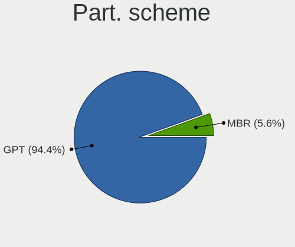
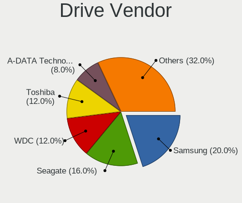
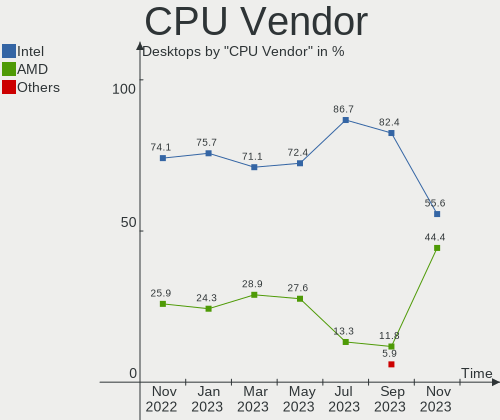
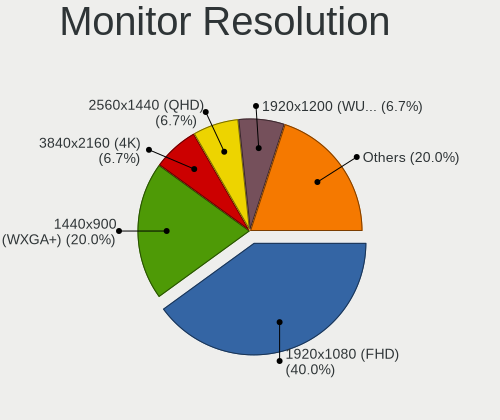

helloSystem - Hardware Trends (Desktops)
----------------------------------------

A project to identify most popular hardware characteristics and track their change
over time based on data collected by BSD users at https://BSD-Hardware.info.

Anyone can contribute to this report by the [hw-probe](https://github.com/linuxhw/hw-probe/blob/master/INSTALL.BSD.md) tool:

    hw-probe -all -upload

This report is for one last month. Overall report since the beginning of time: [TestDays](https://github.com/bsdhw/TestDays)

Period: Jun, 2023.

Contents
--------

* [ System ](#system)
  - [ OS                       ](#os)
  - [ OS Family                ](#os-family)
  - [ Arch                     ](#arch)
  - [ DE                       ](#de)
  - [ Display Server           ](#display-server)
  - [ Display Manager          ](#display-manager)
  - [ OS Lang                  ](#os-lang)
  - [ Boot Mode                ](#boot-mode)
  - [ Filesystem               ](#filesystem)
  - [ Part. scheme             ](#part-scheme)

* [ Board ](#board)
  - [ Vendor                   ](#vendor)
  - [ Model                    ](#model)
  - [ Model Family             ](#model-family)
  - [ MFG Year                 ](#mfg-year)
  - [ Form Factor              ](#form-factor)
  - [ Coreboot                 ](#coreboot)
  - [ RAM Size                 ](#ram-size)
  - [ RAM Used                 ](#ram-used)
  - [ Total Drives             ](#total-drives)
  - [ Has CD-ROM               ](#has-cd-rom)
  - [ Has Ethernet             ](#has-ethernet)
  - [ Has WiFi                 ](#has-wifi)
  - [ Has Bluetooth            ](#has-bluetooth)

* [ Location ](#location)
  - [ Country                  ](#country)
  - [ City                     ](#city)

* [ Drives ](#drives)
  - [ Drive Vendor             ](#drive-vendor)
  - [ Drive Model              ](#drive-model)
  - [ HDD Vendor               ](#hdd-vendor)
  - [ SSD Vendor               ](#ssd-vendor)
  - [ Drive Kind               ](#drive-kind)
  - [ Drive Connector          ](#drive-connector)
  - [ Drive Size               ](#drive-size)
  - [ Space Total              ](#space-total)
  - [ Space Used               ](#space-used)
  - [ Malfunc. Drives          ](#malfunc-drives)
  - [ Malfunc. Drive Vendor    ](#malfunc-drive-vendor)
  - [ Malfunc. HDD Vendor      ](#malfunc-hdd-vendor)
  - [ Malfunc. Drive Kind      ](#malfunc-drive-kind)
  - [ Failed Drives            ](#failed-drives)
  - [ Failed Drive Vendor      ](#failed-drive-vendor)
  - [ Drive Status             ](#drive-status)

* [ Storage controller ](#storage-controller)
  - [ Storage Vendor           ](#storage-vendor)
  - [ Storage Model            ](#storage-model)
  - [ Storage Kind             ](#storage-kind)

* [ Processor ](#processor)
  - [ CPU Vendor               ](#cpu-vendor)
  - [ CPU Model                ](#cpu-model)
  - [ CPU Model Family         ](#cpu-model-family)
  - [ CPU Cores                ](#cpu-cores)
  - [ CPU Sockets              ](#cpu-sockets)
  - [ CPU Threads              ](#cpu-threads)
  - [ CPU Microarch            ](#cpu-microarch)

* [ Graphics ](#graphics)
  - [ GPU Vendor               ](#gpu-vendor)
  - [ GPU Model                ](#gpu-model)
  - [ GPU Combo                ](#gpu-combo)
  - [ GPU Driver               ](#gpu-driver)
  - [ GPU Memory               ](#gpu-memory)

* [ Monitor ](#monitor)
  - [ Monitor Vendor           ](#monitor-vendor)
  - [ Monitor Model            ](#monitor-model)
  - [ Monitor Resolution       ](#monitor-resolution)
  - [ Monitor Diagonal         ](#monitor-diagonal)
  - [ Monitor Width            ](#monitor-width)
  - [ Aspect Ratio             ](#aspect-ratio)
  - [ Monitor Area             ](#monitor-area)
  - [ Pixel Density            ](#pixel-density)
  - [ Multiple Monitors        ](#multiple-monitors)

* [ Network ](#network)
  - [ Net Controller Vendor    ](#net-controller-vendor)
  - [ Net Controller Model     ](#net-controller-model)
  - [ Wireless Vendor          ](#wireless-vendor)
  - [ Wireless Model           ](#wireless-model)
  - [ Ethernet Vendor          ](#ethernet-vendor)
  - [ Ethernet Model           ](#ethernet-model)
  - [ Net Controller Kind      ](#net-controller-kind)
  - [ Used Controller          ](#used-controller)
  - [ NICs                     ](#nics)
  - [ IPv6                     ](#ipv6)

* [ Bluetooth ](#bluetooth)
  - [ Bluetooth Vendor         ](#bluetooth-vendor)
  - [ Bluetooth Model          ](#bluetooth-model)

* [ Sound ](#sound)
  - [ Sound Vendor             ](#sound-vendor)
  - [ Sound Model              ](#sound-model)

* [ Memory ](#memory)
  - [ Memory Vendor            ](#memory-vendor)
  - [ Memory Model             ](#memory-model)
  - [ Memory Kind              ](#memory-kind)
  - [ Memory Form Factor       ](#memory-form-factor)
  - [ Memory Size              ](#memory-size)
  - [ Memory Speed             ](#memory-speed)

* [ Printers & scanners ](#printers--scanners)
  - [ Printer Vendor           ](#printer-vendor)
  - [ Printer Model            ](#printer-model)
  - [ Scanner Vendor           ](#scanner-vendor)
  - [ Scanner Model            ](#scanner-model)

* [ Camera ](#camera)
  - [ Camera Vendor            ](#camera-vendor)
  - [ Camera Model             ](#camera-model)

* [ Security ](#security)
  - [ Fingerprint Vendor       ](#fingerprint-vendor)
  - [ Fingerprint Model        ](#fingerprint-model)
  - [ Chipcard Vendor          ](#chipcard-vendor)
  - [ Chipcard Model           ](#chipcard-model)

* [ Unsupported ](#unsupported)
  - [ Unsupported Devices      ](#unsupported-devices)
  - [ Unsupported Device Types ](#unsupported-device-types)

System
------

OS
--

Installed operating systems

| Name              | Desktops | Percent |
|-------------------|----------|---------|
| helloSystem 0.8.1 | 8        | 53.33%  |
| helloSystem 0.8.2 | 6        | 40%     |
| helloSystem 0.8.0 | 1        | 6.67%   |

OS Family
---------

OS without a version

| Name        | Desktops | Percent |
|-------------|----------|---------|
| helloSystem | 15       | 100%    |

Arch
----

OS architecture (x86_64, i586, etc.)

| Name  | Desktops | Percent |
|-------|----------|---------|
| amd64 | 15       | 100%    |

DE
--

Desktop Environment

| Name         | Desktops | Percent |
|--------------|----------|---------|
| helloDesktop | 15       | 100%    |

Display Server
--------------

X11 or Wayland

| Name | Desktops | Percent |
|------|----------|---------|
| X11  | 15       | 100%    |

Display Manager
---------------

SDDM, LightDM, etc.

| Name | Desktops | Percent |
|------|----------|---------|
| SLiM | 15       | 100%    |

OS Lang
-------

Language

| Lang  | Desktops | Percent |
|-------|----------|---------|
| en_US | 6        | 40%     |
| fr_FR | 4        | 26.67%  |
| ru_RU | 3        | 20%     |
| it_IT | 1        | 6.67%   |
| en    | 1        | 6.67%   |

Boot Mode
---------

EFI or BIOS

| Mode | Desktops | Percent |
|------|----------|---------|
| EFI  | 15       | 100%    |

Filesystem
----------

Type of filesystem

| Type   | Desktops | Percent |
|--------|----------|---------|
| Cd9660 | 8        | 53.33%  |
| Zfs    | 7        | 46.67%  |

Part. scheme
------------

Scheme of partitioning

| Type | Desktops | Percent |
|------|----------|---------|
| GPT  | 15       | 100%    |

Board
-----

Vendor
------

Motherboard manufacturer

| Name                | Desktops | Percent |
|---------------------|----------|---------|
| ASUSTek Computer    | 5        | 33.33%  |
| Lenovo              | 2        | 13.33%  |
| Hewlett-Packard     | 2        | 13.33%  |
| Dell                | 2        | 13.33%  |
| LG Electronics      | 1        | 6.67%   |
| Intel               | 1        | 6.67%   |
| Gigabyte Technology | 1        | 6.67%   |
| Fujitsu Siemens     | 1        | 6.67%   |

Model
-----

Motherboard model

| Name                              | Desktops | Percent |
|-----------------------------------|----------|---------|
| LG R590-K.AAA9BT                  | 1        | 6.67%   |
| Lenovo ThinkCentre M83 10AHA0X9LS | 1        | 6.67%   |
| Lenovo H515s 10126                | 1        | 6.67%   |
| Intel DG41TY AAE47335-300         | 1        | 6.67%   |
| HP EliteDesk 800 G2 DM 35W        | 1        | 6.67%   |
| HP Compaq Elite 8300 USDT         | 1        | 6.67%   |
| Gigabyte B450M S2H                | 1        | 6.67%   |
| Fujitsu Siemens ESPRIMO C5730     | 1        | 6.67%   |
| Dell Vostro 3681                  | 1        | 6.67%   |
| Dell OptiPlex 7010                | 1        | 6.67%   |
| ASUS ROG Maximus X HERO           | 1        | 6.67%   |
| ASUS PRIME X399-A                 | 1        | 6.67%   |
| ASUS PRIME B350M-A                | 1        | 6.67%   |
| ASUS P7P55D LE                    | 1        | 6.67%   |
| ASUS M2A-VM                       | 1        | 6.67%   |

Model Family
------------

Motherboard model prefix

| Name                    | Desktops | Percent |
|-------------------------|----------|---------|
| ASUS PRIME              | 2        | 13.33%  |
| LG R590-K.AAA9BT        | 1        | 6.67%   |
| Lenovo ThinkCentre      | 1        | 6.67%   |
| Lenovo H515s            | 1        | 6.67%   |
| Intel DG41TY            | 1        | 6.67%   |
| HP EliteDesk            | 1        | 6.67%   |
| HP Compaq               | 1        | 6.67%   |
| Gigabyte B450M          | 1        | 6.67%   |
| Fujitsu Siemens ESPRIMO | 1        | 6.67%   |
| Dell Vostro             | 1        | 6.67%   |
| Dell OptiPlex           | 1        | 6.67%   |
| ASUS ROG                | 1        | 6.67%   |
| ASUS P7P55D             | 1        | 6.67%   |
| ASUS M2A-VM             | 1        | 6.67%   |

MFG Year
--------

Motherboard manufacture year

| Year | Desktops | Percent |
|------|----------|---------|
| 2013 | 3        | 20%     |
| 2021 | 2        | 13.33%  |
| 2019 | 2        | 13.33%  |
| 2010 | 2        | 13.33%  |
| 2017 | 1        | 6.67%   |
| 2016 | 1        | 6.67%   |
| 2014 | 1        | 6.67%   |
| 2012 | 1        | 6.67%   |
| 2011 | 1        | 6.67%   |
| 2009 | 1        | 6.67%   |

Form Factor
-----------

Physical design of the computer

| Name    | Desktops | Percent |
|---------|----------|---------|
| Desktop | 15       | 100%    |

Coreboot
--------

Have coreboot on board

| Used | Desktops | Percent |
|------|----------|---------|
| No   | 15       | 100%    |

RAM Size
--------

Total RAM memory

| Size in GB  | Desktops | Percent |
|-------------|----------|---------|
| 8.01-16.0   | 6        | 40%     |
| 4.01-8.0    | 4        | 26.67%  |
| 16.01-24.0  | 3        | 20%     |
| 64.01-256.0 | 1        | 6.67%   |
| 0.51-1.0    | 1        | 6.67%   |

RAM Used
--------

Used RAM memory

| Used GB  | Desktops | Percent |
|----------|----------|---------|
| 0.01-0.5 | 8        | 53.33%  |
| 0.51-1.0 | 6        | 40%     |
| 1.01-2.0 | 1        | 6.67%   |

Total Drives
------------

Number of drives on board

| Drives | Desktops | Percent |
|--------|----------|---------|
| 1      | 6        | 40%     |
| 2      | 5        | 33.33%  |
| 0      | 2        | 13.33%  |
| 9      | 1        | 6.67%   |
| 5      | 1        | 6.67%   |

Has CD-ROM
----------

Has CD-ROM on board

| Presented | Desktops | Percent |
|-----------|----------|---------|
| No        | 9        | 60%     |
| Yes       | 6        | 40%     |

Has Ethernet
------------

Has Ethernet on board

| Presented | Desktops | Percent |
|-----------|----------|---------|
| Yes       | 14       | 93.33%  |
| No        | 1        | 6.67%   |

Has WiFi
--------

Has WiFi module

| Presented | Desktops | Percent |
|-----------|----------|---------|
| No        | 9        | 60%     |
| Yes       | 6        | 40%     |

Has Bluetooth
-------------

Has Bluetooth module

| Presented | Desktops | Percent |
|-----------|----------|---------|
| No        | 10       | 66.67%  |
| Yes       | 5        | 33.33%  |

Location
--------

Country
-------

Geographic location (country)

| Country | Desktops | Percent |
|---------|----------|---------|
| Russia  | 4        | 26.67%  |
| Mexico  | 2        | 13.33%  |
| USA     | 1        | 6.67%   |
| Ukraine | 1        | 6.67%   |
| Turkey  | 1        | 6.67%   |
| Peru    | 1        | 6.67%   |
| Norway  | 1        | 6.67%   |
| Italy   | 1        | 6.67%   |
| Iceland | 1        | 6.67%   |
| Germany | 1        | 6.67%   |
| France  | 1        | 6.67%   |

City
----

Geographic location (city)

| City        | Desktops | Percent |
|-------------|----------|---------|
| Volgodonsk  | 1        | 6.67%   |
| Trekhgornyy | 1        | 6.67%   |
| Plauen      | 1        | 6.67%   |
| Penza       | 1        | 6.67%   |
| Paris       | 1        | 6.67%   |
| Odesa       | 1        | 6.67%   |
| Medolago    | 1        | 6.67%   |
| Makhachkala | 1        | 6.67%   |
| Lima        | 1        | 6.67%   |
| Kopavogur   | 1        | 6.67%   |
| Istanbul    | 1        | 6.67%   |
| Hermosillo  | 1        | 6.67%   |
| Ecatepec    | 1        | 6.67%   |
| Drammen     | 1        | 6.67%   |
| Bristol     | 1        | 6.67%   |

Drives
------

Drive Vendor
------------

Hard drive vendors

| Vendor              | Desktops | Drives | Percent |
|---------------------|----------|--------|---------|
| WDC                 | 4        | 7      | 16%     |
| Seagate             | 4        | 5      | 16%     |
| Samsung Electronics | 3        | 3      | 12%     |
| Toshiba             | 2        | 2      | 8%      |
| Team                | 2        | 2      | 8%      |
| Hitachi             | 2        | 2      | 8%      |
| SETHRISE            | 1        | 1      | 4%      |
| Patriot             | 1        | 1      | 4%      |
| KIOXIA              | 1        | 1      | 4%      |
| Kingston            | 1        | 1      | 4%      |
| KingSpec            | 1        | 1      | 4%      |
| Intel               | 1        | 1      | 4%      |
| Crucial             | 1        | 2      | 4%      |
| China               | 1        | 1      | 4%      |

Drive Model
-----------

Hard drive models

| Model                             | Desktops | Percent |
|-----------------------------------|----------|---------|
| WDC WDS500G2B0A-00SM50 500GB      | 1        | 3.85%   |
| WDC WDS100T2B0C-00PXH0 1TB        | 1        | 3.85%   |
| WDC WD5000AAVS-00ZTB0 500GB       | 1        | 3.85%   |
| WDC WD10EZEX-75WN4A1 1TB          | 1        | 3.85%   |
| Toshiba MQ01ABF050 500GB          | 1        | 3.85%   |
| Toshiba HDWG480 8TB               | 1        | 3.85%   |
| Team TM8FP6256G 256GB             | 1        | 3.85%   |
| Team T253X2256G 256GB             | 1        | 3.85%   |
| SETHRISE SSD 480G                 | 1        | 3.85%   |
| Seagate ST500DM002-1BD142 500GB   | 1        | 3.85%   |
| Seagate ST3750528AS 752GB         | 1        | 3.85%   |
| Seagate ST3250318AS 250GB         | 1        | 3.85%   |
| Seagate ST16000NM001G-2KK103 16TB | 1        | 3.85%   |
| Seagate ST12000NM0008-2H3101 12TB | 1        | 3.85%   |
| Samsung SSD 970 EVO Plus 500GB    | 1        | 3.85%   |
| Samsung SSD 870 EVO 500GB         | 1        | 3.85%   |
| Samsung PM961 NVMe 256GB          | 1        | 3.85%   |
| Patriot Burst Elite 120GB         | 1        | 3.85%   |
| KIOXIA KBG40ZNS256G NVMe 256GB    | 1        | 3.85%   |
| Kingston SV100S232G 32GB          | 1        | 3.85%   |
| KingSpec P3-128 128GB             | 1        | 3.85%   |
| Intel SSDSC2CT060A3 64GB          | 1        | 3.85%   |
| Hitachi HTS545032B9A300 320GB     | 1        | 3.85%   |
| Hitachi HDS721010DLE630 1TB       | 1        | 3.85%   |
| Crucial CT2000P3SSD8 2TB          | 1        | 3.85%   |
| China SH00R120GB                  | 1        | 3.85%   |

HDD Vendor
----------

Hard disk drive vendors

| Vendor  | Desktops | Drives | Percent |
|---------|----------|--------|---------|
| Seagate | 4        | 5      | 40%     |
| WDC     | 2        | 2      | 20%     |
| Toshiba | 2        | 2      | 20%     |
| Hitachi | 2        | 2      | 20%     |

SSD Vendor
----------

Solid state drive vendors

| Vendor              | Desktops | Drives | Percent |
|---------------------|----------|--------|---------|
| WDC                 | 1        | 1      | 11.11%  |
| Team                | 1        | 1      | 11.11%  |
| SETHRISE            | 1        | 1      | 11.11%  |
| Samsung Electronics | 1        | 1      | 11.11%  |
| Patriot             | 1        | 1      | 11.11%  |
| Kingston            | 1        | 1      | 11.11%  |
| KingSpec            | 1        | 1      | 11.11%  |
| Intel               | 1        | 1      | 11.11%  |
| China               | 1        | 1      | 11.11%  |

Drive Kind
----------

HDD or SSD

| Kind | Desktops | Drives | Percent |
|------|----------|--------|---------|
| HDD  | 9        | 11     | 42.86%  |
| SSD  | 7        | 9      | 33.33%  |
| NVMe | 5        | 10     | 23.81%  |

Drive Connector
---------------

SATA, SAS, NVMe, etc.

| Type | Desktops | Drives | Percent |
|------|----------|--------|---------|
| SATA | 13       | 20     | 72.22%  |
| NVMe | 5        | 10     | 27.78%  |

Drive Size
----------

Size of hard drive

| Size in TB | Desktops | Drives | Percent |
|------------|----------|--------|---------|
| 0.01-0.5   | 10       | 14     | 66.67%  |
| 0.51-1.0   | 3        | 3      | 20%     |
| 10.01-20.0 | 1        | 2      | 6.67%   |
| 4.01-10.0  | 1        | 1      | 6.67%   |

Space Total
-----------

Amount of disk space available on the file system

| Size in GB     | Desktops | Percent |
|----------------|----------|---------|
| 1-20           | 5        | 33.33%  |
| 101-250        | 3        | 20%     |
| 51-100         | 3        | 20%     |
| 251-500        | 2        | 13.33%  |
| More than 3000 | 1        | 6.67%   |
| 21-50          | 1        | 6.67%   |

Space Used
----------

Amount of used disk space

| Used GB   | Desktops | Percent |
|-----------|----------|---------|
| 1-20      | 13       | 86.67%  |
| 1001-2000 | 1        | 6.67%   |
| 51-100    | 1        | 6.67%   |

Malfunc. Drives
---------------

Drive models with a malfunction

| Model                             | Desktops | Drives | Percent |
|-----------------------------------|----------|--------|---------|
| Seagate ST500DM002-1BD142 500GB   | 1        | 1      | 25%     |
| Seagate ST3750528AS 752GB         | 1        | 1      | 25%     |
| Seagate ST12000NM0008-2H3101 12TB | 1        | 1      | 25%     |
| China SH00R120GB                  | 1        | 1      | 25%     |

Malfunc. Drive Vendor
---------------------

Vendors of faulty drives

| Vendor  | Desktops | Drives | Percent |
|---------|----------|--------|---------|
| Seagate | 3        | 3      | 75%     |
| China   | 1        | 1      | 25%     |

Malfunc. HDD Vendor
-------------------

Vendors of faulty HDD drives

| Vendor  | Desktops | Drives | Percent |
|---------|----------|--------|---------|
| Seagate | 3        | 3      | 100%    |

Malfunc. Drive Kind
-------------------

Kinds of faulty drives

| Kind | Desktops | Drives | Percent |
|------|----------|--------|---------|
| HDD  | 3        | 3      | 75%     |
| SSD  | 1        | 1      | 25%     |

Failed Drives
-------------

Failed drive models

| Model                       | Desktops | Drives | Percent |
|-----------------------------|----------|--------|---------|
| Hitachi HDS721010DLE630 1TB | 1        | 1      | 100%    |

Failed Drive Vendor
-------------------

Failed drive vendors

| Vendor  | Desktops | Drives | Percent |
|---------|----------|--------|---------|
| Hitachi | 1        | 1      | 100%    |

Drive Status
------------

Number of failed and malfunc. drives

| Status  | Desktops | Drives | Percent |
|---------|----------|--------|---------|
| Works   | 10       | 25     | 66.67%  |
| Malfunc | 4        | 4      | 26.67%  |
| Failed  | 1        | 1      | 6.67%   |

Storage controller
------------------

Storage Vendor
--------------

Storage controller vendors

| Vendor                    | Desktops | Percent |
|---------------------------|----------|---------|
| Intel                     | 10       | 47.62%  |
| AMD                       | 4        | 19.05%  |
| Samsung Electronics       | 2        | 9.52%   |
| SanDisk                   | 1        | 4.76%   |
| Realtek Semiconductor     | 1        | 4.76%   |
| Micron/Crucial Technology | 1        | 4.76%   |
| KIOXIA                    | 1        | 4.76%   |
| JMicron Technology        | 1        | 4.76%   |

Storage Model
-------------

Storage controller models

| Model                                                                          | Desktops | Percent |
|--------------------------------------------------------------------------------|----------|---------|
| AMD FCH SATA Controller [AHCI mode]                                            | 3        | 11.11%  |
| Intel 7 Series/C210 Series Chipset Family 6-port SATA Controller [AHCI mode]   | 2        | 7.41%   |
| SanDisk WD Blue SN550 NVMe SSD                                                 | 1        | 3.7%    |
| Samsung NVMe SSD Controller SM981/PM981/PM983                                  | 1        | 3.7%    |
| Samsung NVMe SSD Controller SM961/PM961/SM963                                  | 1        | 3.7%    |
| Realtek NVMe Controller                                                        | 1        | 3.7%    |
| Micron/Crucial P2 NVMe PCIe SSD                                                | 1        | 3.7%    |
| KIOXIA NVMe SSD Controller BG4                                                 | 1        | 3.7%    |
| JMicron JMB361 AHCI/IDE                                                        | 1        | 3.7%    |
| Intel Q170/Q150/B150/H170/H110/Z170/CM236 Chipset SATA Controller [AHCI Mode]  | 1        | 3.7%    |
| Intel NM10/ICH7 Family SATA Controller [IDE mode]                              | 1        | 3.7%    |
| Intel 82801JD/DO (ICH10 Family) 4-port SATA IDE Controller                     | 1        | 3.7%    |
| Intel 82801JD/DO (ICH10 Family) 2-port SATA IDE Controller                     | 1        | 3.7%    |
| Intel 82801G (ICH7 Family) IDE Controller                                      | 1        | 3.7%    |
| Intel 8 Series/C220 Series Chipset Family 6-port SATA Controller 1 [AHCI mode] | 1        | 3.7%    |
| Intel 5 Series/3400 Series Chipset 6 port SATA AHCI Controller                 | 1        | 3.7%    |
| Intel 5 Series/3400 Series Chipset 4 port SATA AHCI Controller                 | 1        | 3.7%    |
| Intel 400 Series Chipset Family SATA AHCI Controller                           | 1        | 3.7%    |
| Intel 4 Series Chipset PT IDER Controller                                      | 1        | 3.7%    |
| Intel 200 Series PCH SATA controller [AHCI mode]                               | 1        | 3.7%    |
| AMD X399 Series Chipset SATA Controller                                        | 1        | 3.7%    |
| AMD FCH SATA Controller [IDE mode]                                             | 1        | 3.7%    |
| AMD 400 Series Chipset SATA Controller                                         | 1        | 3.7%    |
| AMD 300 Series Chipset SATA Controller                                         | 1        | 3.7%    |

Storage Kind
------------

Kind of storage controller (IDE, SATA, NVMe, SAS, ...)

| Kind | Desktops | Percent |
|------|----------|---------|
| SATA | 11       | 55%     |
| NVMe | 5        | 25%     |
| IDE  | 4        | 20%     |

Processor
---------

CPU Vendor
----------

Processor vendors

| Vendor | Desktops | Percent |
|--------|----------|---------|
| Intel  | 10       | 66.67%  |
| AMD    | 5        | 33.33%  |

CPU Model
---------

Processor models

| Model                                           | Desktops | Percent |
|-------------------------------------------------|----------|---------|
| Intel Pentium Dual-Core CPU E5300               | 1        | 6.67%   |
| Intel Core i7-8700K CPU @ 3.70GHz               | 1        | 6.67%   |
| Intel Core i7-4770 CPU @ 3.40GHz                | 1        | 6.67%   |
| Intel Core i5-6600T CPU @ 2.70GHz               | 1        | 6.67%   |
| Intel Core i5-3470 CPU @ 3.20GHz                | 1        | 6.67%   |
| Intel Core i5-10400 CPU @ 2.90GHz               | 1        | 6.67%   |
| Intel Core i5 CPU 750 @ 2.67GHz                 | 1        | 6.67%   |
| Intel Core i3-3220 CPU @ 3.30GHz                | 1        | 6.67%   |
| Intel Core i3 CPU M 330 @ 2.13GHz               | 1        | 6.67%   |
| Intel Core 2 Duo CPU E7500 @ 2.93GHz            | 1        | 6.67%   |
| AMD Ryzen Threadripper 2970WX 24-Core Processor | 1        | 6.67%   |
| AMD Ryzen 5 1600 Six-Core Processor             | 1        | 6.67%   |
| AMD Ryzen 3 1200 Quad-Core Processor            | 1        | 6.67%   |
| AMD Phenom II X4 945 Processor                  | 1        | 6.67%   |
| AMD E1-2500 APU with Radeon HD Graphics         | 1        | 6.67%   |

CPU Model Family
----------------

Processor model prefix

| Model                   | Desktops | Percent |
|-------------------------|----------|---------|
| Intel Core i5           | 4        | 26.67%  |
| Intel Core i7           | 2        | 13.33%  |
| Intel Core i3           | 2        | 13.33%  |
| Intel Pentium Dual-Core | 1        | 6.67%   |
| Intel Core 2 Duo        | 1        | 6.67%   |
| AMD Ryzen Threadripper  | 1        | 6.67%   |
| AMD Ryzen 5             | 1        | 6.67%   |
| AMD Ryzen 3             | 1        | 6.67%   |
| AMD Phenom II X4        | 1        | 6.67%   |
| AMD E1                  | 1        | 6.67%   |

CPU Cores
---------

Number of processor cores

| Number  | Desktops | Percent |
|---------|----------|---------|
| 4       | 6        | 40%     |
| 2       | 4        | 26.67%  |
| 6       | 2        | 13.33%  |
| 48      | 1        | 6.67%   |
| 12      | 1        | 6.67%   |
| Unknown | 1        | 6.67%   |

CPU Sockets
-----------

Number of sockets

| Number | Desktops | Percent |
|--------|----------|---------|
| 1      | 15       | 100%    |

CPU Threads
-----------

Threads per core (Hyper-Threading)

| Number  | Desktops | Percent |
|---------|----------|---------|
| 1       | 9        | 60%     |
| 2       | 5        | 33.33%  |
| Unknown | 1        | 6.67%   |

CPU Microarch
-------------

Microarchitecture

| Name      | Desktops | Percent |
|-----------|----------|---------|
| Zen+      | 2        | 13.33%  |
| Penryn    | 2        | 13.33%  |
| IvyBridge | 2        | 13.33%  |
| Zen       | 1        | 6.67%   |
| Westmere  | 1        | 6.67%   |
| Skylake   | 1        | 6.67%   |
| Nehalem   | 1        | 6.67%   |
| KabyLake  | 1        | 6.67%   |
| K10       | 1        | 6.67%   |
| Jaguar    | 1        | 6.67%   |
| Haswell   | 1        | 6.67%   |
| CometLake | 1        | 6.67%   |

Graphics
--------

GPU Vendor
----------

Vendors of graphics cards

| Vendor | Desktops | Percent |
|--------|----------|---------|
| Intel  | 7        | 46.67%  |
| Nvidia | 4        | 26.67%  |
| AMD    | 4        | 26.67%  |

GPU Model
---------

Graphics card models

| Model                                                                       | Desktops | Percent |
|-----------------------------------------------------------------------------|----------|---------|
| Intel Xeon E3-1200 v2/3rd Gen Core processor Graphics Controller            | 2        | 13.33%  |
| Intel 4 Series Chipset Integrated Graphics Controller                       | 2        | 13.33%  |
| AMD Ellesmere [Radeon RX 470/480/570/570X/580/580X/590]                     | 2        | 13.33%  |
| Nvidia TU117 [GeForce GTX 1650]                                             | 1        | 6.67%   |
| Nvidia GT218M [GeForce 310M]                                                | 1        | 6.67%   |
| Nvidia GF108 [GeForce GT 730]                                               | 1        | 6.67%   |
| Nvidia GA104 [GeForce RTX 3070 Ti]                                          | 1        | 6.67%   |
| Intel Xeon E3-1200 v3/4th Gen Core Processor Integrated Graphics Controller | 1        | 6.67%   |
| Intel HD Graphics 530                                                       | 1        | 6.67%   |
| Intel CometLake-S GT2 [UHD Graphics 630]                                    | 1        | 6.67%   |
| AMD Lexa PRO [Radeon 540/540X/550/550X / RX 540X/550/550X]                  | 1        | 6.67%   |
| AMD Kabini [Radeon HD 8240 / R3 Series]                                     | 1        | 6.67%   |

GPU Combo
---------

Combinations of graphics cards

| Name        | Desktops | Percent |
|-------------|----------|---------|
| 1 x Nvidia  | 4        | 26.67%  |
| 1 x Intel   | 4        | 26.67%  |
| 1 x AMD     | 3        | 20%     |
| 2 x Intel   | 2        | 13.33%  |
| Other       | 1        | 6.67%   |
| Intel + AMD | 1        | 6.67%   |

GPU Driver
----------

Free vs proprietary

| Driver      | Desktops | Percent |
|-------------|----------|---------|
| Free        | 11       | 73.33%  |
| Proprietary | 3        | 20%     |
| Unknown     | 1        | 6.67%   |

GPU Memory
----------

Total video memory

| Size in GB | Desktops | Percent |
|------------|----------|---------|
| Unknown    | 11       | 73.33%  |
| 3.01-4.0   | 2        | 13.33%  |
| 7.01-8.0   | 1        | 6.67%   |
| 0.01-0.5   | 1        | 6.67%   |

Monitor
-------

Monitor Vendor
--------------

Monitor vendors

| Vendor              | Desktops | Percent |
|---------------------|----------|---------|
| Goldstar            | 2        | 16.67%  |
| Dell                | 2        | 16.67%  |
| AOC                 | 2        | 16.67%  |
| Acer                | 2        | 16.67%  |
| Samsung Electronics | 1        | 8.33%   |
| NEC Computers       | 1        | 8.33%   |
| Lenovo              | 1        | 8.33%   |
| Hewlett-Packard     | 1        | 8.33%   |

Monitor Model
-------------

Monitor models

| Model                                                             | Desktops | Percent |
|-------------------------------------------------------------------|----------|---------|
| Samsung Electronics U28E850 SAM0CCB 3840x2160 610x350mm 27.7-inch | 1        | 8.33%   |
| NEC Computers AS221WM NEC67C2 1680x1050 470x300mm 22.0-inch       | 1        | 8.33%   |
| Lenovo LEN E2323swA LEN60B0 1920x1080 530x310mm 24.2-inch         | 1        | 8.33%   |
| Hewlett-Packard 27o HPN342C 1920x1080 600x340mm 27.2-inch         | 1        | 8.33%   |
| Goldstar LG IPS QHD GSM5BC4 2560x1440 530x300mm 24.0-inch         | 1        | 8.33%   |
| Goldstar 700E GSM4317 1280x1024 330x250mm 16.3-inch               | 1        | 8.33%   |
| Dell P2417H DELA0DB 1920x1080 530x300mm 24.0-inch                 | 1        | 8.33%   |
| Dell E2220H DELF119 1920x1080 480x270mm 21.7-inch                 | 1        | 8.33%   |
| AOC 27B2 AOC2702 1920x1080 600x340mm 27.2-inch                    | 1        | 8.33%   |
| AOC 2470W AOC2470 1920x1080 520x290mm 23.4-inch                   | 1        | 8.33%   |
| Acer X233H ACR009A 1920x1080 510x290mm 23.1-inch                  | 1        | 8.33%   |
| Acer G276HL ACR0300 1920x1080 600x340mm 27.2-inch                 | 1        | 8.33%   |

Monitor Resolution
------------------

Monitor screen resolution

| Resolution         | Desktops | Percent |
|--------------------|----------|---------|
| 1920x1080 (FHD)    | 8        | 66.67%  |
| 3840x2160 (4K)     | 1        | 8.33%   |
| 2560x1440 (QHD)    | 1        | 8.33%   |
| 1680x1050 (WSXGA+) | 1        | 8.33%   |
| 1280x1024 (SXGA)   | 1        | 8.33%   |

Monitor Diagonal
----------------

Diagonal size in inches

| Inches | Desktops | Percent |
|--------|----------|---------|
| 27     | 4        | 33.33%  |
| 24     | 3        | 25%     |
| 23     | 2        | 16.67%  |
| 22     | 1        | 8.33%   |
| 21     | 1        | 8.33%   |
| 16     | 1        | 8.33%   |

Monitor Width
-------------

Physical width

| Width in mm | Desktops | Percent |
|-------------|----------|---------|
| 501-600     | 8        | 66.67%  |
| 401-500     | 2        | 16.67%  |
| 601-700     | 1        | 8.33%   |
| 301-350     | 1        | 8.33%   |

Aspect Ratio
------------

Proportional relationship between the width and the height

| Ratio | Desktops | Percent |
|-------|----------|---------|
| 16/9  | 10       | 83.33%  |
| 4/3   | 1        | 8.33%   |
| 16/10 | 1        | 8.33%   |

Monitor Area
------------

Area in inch²

| Area in inch² | Desktops | Percent |
|----------------|----------|---------|
| 201-250        | 6        | 50%     |
| 301-350        | 4        | 33.33%  |
| 251-300        | 1        | 8.33%   |
| 121-130        | 1        | 8.33%   |

Pixel Density
-------------

Pixels per inch

| Density | Desktops | Percent |
|---------|----------|---------|
| 51-100  | 8        | 66.67%  |
| 121-160 | 2        | 16.67%  |
| 101-120 | 2        | 16.67%  |

Multiple Monitors
-----------------

Total monitors connected

| Total | Desktops | Percent |
|-------|----------|---------|
| 1     | 12       | 80%     |
| 0     | 3        | 20%     |

Network
-------

Net Controller Vendor
---------------------

Controller vendors

| Vendor                | Desktops | Percent |
|-----------------------|----------|---------|
| Intel                 | 8        | 40%     |
| Realtek Semiconductor | 7        | 35%     |
| Ralink Technology     | 1        | 5%      |
| Ralink                | 1        | 5%      |
| Qualcomm Atheros      | 1        | 5%      |
| Broadcom              | 1        | 5%      |
| AVM                   | 1        | 5%      |

Net Controller Model
--------------------

Controller models

| Model                                                             | Desktops | Percent |
|-------------------------------------------------------------------|----------|---------|
| Realtek RTL8111/8168/8411 PCI Express Gigabit Ethernet Controller | 5        | 22.73%  |
| Intel 82579LM Gigabit Network Connection (Lewisville)             | 2        | 9.09%   |
| Realtek RTL8191SEvB Wireless LAN Controller                       | 1        | 4.55%   |
| Realtek RTL8188EE Wireless Network Adapter                        | 1        | 4.55%   |
| Realtek RTL810xE PCI Express Fast Ethernet controller             | 1        | 4.55%   |
| Ralink MT7601U Wireless Adapter                                   | 1        | 4.55%   |
| Ralink RT2500 Wireless 802.11bg                                   | 1        | 4.55%   |
| Qualcomm Atheros AR8131 Gigabit Ethernet                          | 1        | 4.55%   |
| Intel Wireless 8260                                               | 1        | 4.55%   |
| Intel Wireless 3165                                               | 1        | 4.55%   |
| Intel I211 Gigabit Network Connection                             | 1        | 4.55%   |
| Intel Ethernet Connection I217-LM                                 | 1        | 4.55%   |
| Intel Ethernet Connection (2) I219-V                              | 1        | 4.55%   |
| Intel Ethernet Connection (2) I219-LM                             | 1        | 4.55%   |
| Intel 82567LF-3 Gigabit Network Connection                        | 1        | 4.55%   |
| Broadcom BCM4360 802.11ac Wireless Network Adapter                | 1        | 4.55%   |
| AVM Fritz!Card PCI v2.0 ISDN                                      | 1        | 4.55%   |

Wireless Vendor
---------------

Wireless vendors

| Vendor                | Desktops | Percent |
|-----------------------|----------|---------|
| Realtek Semiconductor | 2        | 28.57%  |
| Intel                 | 2        | 28.57%  |
| Ralink Technology     | 1        | 14.29%  |
| Ralink                | 1        | 14.29%  |
| Broadcom              | 1        | 14.29%  |

Wireless Model
--------------

Wireless models

| Model                                              | Desktops | Percent |
|----------------------------------------------------|----------|---------|
| Realtek RTL8191SEvB Wireless LAN Controller        | 1        | 14.29%  |
| Realtek RTL8188EE Wireless Network Adapter         | 1        | 14.29%  |
| Ralink MT7601U Wireless Adapter                    | 1        | 14.29%  |
| Ralink RT2500 Wireless 802.11bg                    | 1        | 14.29%  |
| Intel Wireless 8260                                | 1        | 14.29%  |
| Intel Wireless 3165                                | 1        | 14.29%  |
| Broadcom BCM4360 802.11ac Wireless Network Adapter | 1        | 14.29%  |

Ethernet Vendor
---------------

Ethernet vendors

| Vendor                | Desktops | Percent |
|-----------------------|----------|---------|
| Intel                 | 7        | 50%     |
| Realtek Semiconductor | 6        | 42.86%  |
| Qualcomm Atheros      | 1        | 7.14%   |

Ethernet Model
--------------

Ethernet models

| Model                                                             | Desktops | Percent |
|-------------------------------------------------------------------|----------|---------|
| Realtek RTL8111/8168/8411 PCI Express Gigabit Ethernet Controller | 5        | 35.71%  |
| Intel 82579LM Gigabit Network Connection (Lewisville)             | 2        | 14.29%  |
| Realtek RTL810xE PCI Express Fast Ethernet controller             | 1        | 7.14%   |
| Qualcomm Atheros AR8131 Gigabit Ethernet                          | 1        | 7.14%   |
| Intel I211 Gigabit Network Connection                             | 1        | 7.14%   |
| Intel Ethernet Connection I217-LM                                 | 1        | 7.14%   |
| Intel Ethernet Connection (2) I219-V                              | 1        | 7.14%   |
| Intel Ethernet Connection (2) I219-LM                             | 1        | 7.14%   |
| Intel 82567LF-3 Gigabit Network Connection                        | 1        | 7.14%   |

Net Controller Kind
-------------------

Ethernet, WiFi or modem

| Kind     | Desktops | Percent |
|----------|----------|---------|
| Ethernet | 14       | 66.67%  |
| WiFi     | 6        | 28.57%  |
| Unknown  | 1        | 4.76%   |

Used Controller
---------------

Currently used network controller

| Kind     | Desktops | Percent |
|----------|----------|---------|
| Ethernet | 12       | 85.71%  |
| WiFi     | 2        | 14.29%  |

NICs
----

Total network controllers on board

| Total | Desktops | Percent |
|-------|----------|---------|
| 2     | 7        | 46.67%  |
| 1     | 7        | 46.67%  |
| 0     | 1        | 6.67%   |

IPv6
----

IPv6 vs IPv4

| Used | Desktops | Percent |
|------|----------|---------|
| No   | 14       | 93.33%  |
| Yes  | 1        | 6.67%   |

Bluetooth
---------

Bluetooth Vendor
----------------

Controller vendors

| Vendor                  | Desktops | Percent |
|-------------------------|----------|---------|
| Intel                   | 2        | 28.57%  |
| ASUSTek Computer        | 2        | 28.57%  |
| Realtek Semiconductor   | 1        | 14.29%  |
| Cambridge Silicon Radio | 1        | 14.29%  |
| Apple                   | 1        | 14.29%  |

Bluetooth Model
---------------

Controller models

| Model                                               | Desktops | Percent |
|-----------------------------------------------------|----------|---------|
| Intel Bluetooth wireless interface                  | 2        | 28.57%  |
| Realtek Bluetooth Adapter                           | 1        | 14.29%  |
| Cambridge Silicon Radio Bluetooth Dongle (HCI mode) | 1        | 14.29%  |
| ASUS USB-BT500                                      | 1        | 14.29%  |
| ASUS Broadcom BCM20702A0 Bluetooth                  | 1        | 14.29%  |
| Apple Bluetooth Host Controller                     | 1        | 14.29%  |

Sound
-----

Sound Vendor
------------

Sound card vendors

| Vendor              | Desktops | Percent |
|---------------------|----------|---------|
| Intel               | 10       | 45.45%  |
| AMD                 | 6        | 27.27%  |
| Nvidia              | 4        | 18.18%  |
| C-Media Electronics | 2        | 9.09%   |

Sound Model
-----------

Sound card models

| Model                                                               | Desktops | Percent |
|---------------------------------------------------------------------|----------|---------|
| AMD Family 17h (Models 00h-0fh) HD Audio Controller                 | 3        | 12%     |
| Intel 7 Series/C216 Chipset Family High Definition Audio Controller | 2        | 8%      |
| Intel 5 Series/3400 Series Chipset High Definition Audio            | 2        | 8%      |
| AMD Ellesmere HDMI Audio [Radeon RX 470/480 / 570/580/590]          | 2        | 8%      |
| Nvidia TU107 GeForce GTX 1650 High Definition Audio Controller      | 1        | 4%      |
| Nvidia High Definition Audio Controller                             | 1        | 4%      |
| Nvidia GF108 High Definition Audio Controller                       | 1        | 4%      |
| Nvidia GA104 High Definition Audio Controller                       | 1        | 4%      |
| Intel Xeon E3-1200 v3/4th Gen Core Processor HD Audio Controller    | 1        | 4%      |
| Intel NM10/ICH7 Family High Definition Audio Controller             | 1        | 4%      |
| Intel Comet Lake PCH-V cAVS                                         | 1        | 4%      |
| Intel 82801JD/DO (ICH10 Family) HD Audio Controller                 | 1        | 4%      |
| Intel 8 Series/C220 Series Chipset High Definition Audio Controller | 1        | 4%      |
| Intel 200 Series PCH HD Audio                                       | 1        | 4%      |
| Intel 100 Series/C230 Series Chipset Family HD Audio Controller     | 1        | 4%      |
| C-Media Electronics Cmedia Audio                                    | 1        | 4%      |
| C-Media Electronics Audio Adapter (Unitek Y-247A)                   | 1        | 4%      |
| AMD Kabini HDMI/DP Audio                                            | 1        | 4%      |
| AMD FCH Azalia Controller                                           | 1        | 4%      |
| AMD Baffin HDMI/DP Audio [Radeon RX 550 640SP / RX 560/560X]        | 1        | 4%      |

Memory
------

Memory Vendor
-------------

Memory module vendors

| Vendor              | Desktops | Percent |
|---------------------|----------|---------|
| SK hynix            | 4        | 22.22%  |
| Samsung Electronics | 3        | 16.67%  |
| Unknown             | 2        | 11.11%  |
| PDPSystems          | 1        | 5.56%   |
| Patriot             | 1        | 5.56%   |
| Nanya Technology    | 1        | 5.56%   |
| Kingston            | 1        | 5.56%   |
| Elpida              | 1        | 5.56%   |
| Crucial             | 1        | 5.56%   |
| Corsair             | 1        | 5.56%   |
| A-DATA Technology   | 1        | 5.56%   |
| Unknown             | 1        | 5.56%   |

Memory Model
------------

Memory module models

| Model                                                                     | Desktops | Percent |
|---------------------------------------------------------------------------|----------|---------|
| Unknown RAM Module 2GB DIMM DDR2 800MT/s                                  | 1        | 5.26%   |
| Unknown RAM Module 1GB DIMM DDR2 667MT/s                                  | 1        | 5.26%   |
| SK hynix RAM HMT451U6BFR8C-PB 4GB DIMM DDR3 1600MT/s                      | 1        | 5.26%   |
| SK hynix RAM HMT351S6CFR8C-H9 4GB SODIMM DDR3 1333MT/s                    | 1        | 5.26%   |
| SK hynix RAM HMT125S6AFP8C-G7 2GB SODIMM DDR3 1067MT/s                    | 1        | 5.26%   |
| SK hynix RAM HMAA1GU6CJR6N-XN 8GB DIMM DDR4 3200MT/s                      | 1        | 5.26%   |
| Samsung RAM Module 8GB SODIMM DDR4 2133MT/s                               | 1        | 5.26%   |
| Samsung RAM M471B5673FH0-CF8 2GB SODIMM DDR3 1067MT/s                     | 1        | 5.26%   |
| Samsung RAM M378B5173QH0-CK0 4GB DIMM DDR3 1600MT/s                       | 1        | 5.26%   |
| PDPSystems RAM 504443323247363430304C4C4B0000000000 1GB DIMM DDR2 667MT/s | 1        | 5.26%   |
| Patriot RAM 2666 C16 Series 16GB DIMM DDR4 3000MT/s                       | 1        | 5.26%   |
| Nanya RAM M2X4G64CB88C7N-DG 4GB DIMM DDR3 1600MT/s                        | 1        | 5.26%   |
| Kingston RAM 32472D5544494D4D00000000000000000000 2GB DIMM DDR2 667MT/s   | 1        | 5.26%   |
| Elpida RAM EBJ40UG8BBU0-GN-F 4GB SODIMM DDR3 1600MT/s                     | 1        | 5.26%   |
| Crucial RAM CT8G4DFS824A.C8FDD1 8GB DIMM DDR4 2666MT/s                    | 1        | 5.26%   |
| Corsair RAM CMK16GX4M2A2666C16 8GB DIMM DDR4 2667MT/s                     | 1        | 5.26%   |
| Corsair RAM CMK16GX4M2A2400C16 8GB DIMM DDR4 2400MT/s                     | 1        | 5.26%   |
| A-DATA RAM AX4U36008G18I-DT50 8GB DIMM DDR4 3600MT/s                      | 1        | 5.26%   |
| Unknown                                                                   | 1        | 5.26%   |

Memory Kind
-----------

Memory module kinds

| Kind | Desktops | Percent |
|------|----------|---------|
| DDR4 | 6        | 40%     |
| DDR3 | 5        | 33.33%  |
| DDR2 | 3        | 20%     |
| DDR  | 1        | 6.67%   |

Memory Form Factor
------------------

Physical design of the memory module

| Name   | Desktops | Percent |
|--------|----------|---------|
| DIMM   | 12       | 80%     |
| SODIMM | 3        | 20%     |

Memory Size
-----------

Memory module size

| Size  | Desktops | Percent |
|-------|----------|---------|
| 8192  | 6        | 37.5%   |
| 4096  | 4        | 25%     |
| 2048  | 3        | 18.75%  |
| 1024  | 2        | 12.5%   |
| 16384 | 1        | 6.25%   |

Memory Speed
------------

Memory module speed

| Speed | Desktops | Percent |
|-------|----------|---------|
| 1600  | 4        | 23.53%  |
| 1333  | 2        | 11.76%  |
| 667   | 2        | 11.76%  |
| 3600  | 1        | 5.88%   |
| 3200  | 1        | 5.88%   |
| 3000  | 1        | 5.88%   |
| 2667  | 1        | 5.88%   |
| 2666  | 1        | 5.88%   |
| 2400  | 1        | 5.88%   |
| 2133  | 1        | 5.88%   |
| 1067  | 1        | 5.88%   |
| 800   | 1        | 5.88%   |

Printers & scanners
-------------------

Printer Vendor
--------------

Printer device vendors

Zero info for selected period =(

Printer Model
-------------

Printer device models

Zero info for selected period =(

Scanner Vendor
--------------

Scanner device vendors

Zero info for selected period =(

Scanner Model
-------------

Scanner device models

Zero info for selected period =(

Camera
------

Camera Vendor
-------------

Camera device vendors

| Vendor   | Desktops | Percent |
|----------|----------|---------|
| Logitech | 2        | 100%    |

Camera Model
------------

Camera device models

| Model                | Desktops | Percent |
|----------------------|----------|---------|
| Logitech Webcam C310 | 1        | 50%     |
| Logitech Webcam C270 | 1        | 50%     |

Security
--------

Fingerprint Vendor
------------------

Fingerprint sensor vendors

Zero info for selected period =(

Fingerprint Model
-----------------

Fingerprint sensor models

Zero info for selected period =(

Chipcard Vendor
---------------

Chipcard module vendors

Zero info for selected period =(

Chipcard Model
--------------

Chipcard module models

Zero info for selected period =(

Unsupported
-----------

Unsupported Devices
-------------------

Total unsupported devices on board

| Total | Desktops | Percent |
|-------|----------|---------|
| 1     | 6        | 40%     |
| 0     | 6        | 40%     |
| 2     | 3        | 20%     |

Unsupported Device Types
------------------------

Types of unsupported devices

| Type                     | Desktops | Percent |
|--------------------------|----------|---------|
| Communication controller | 7        | 58.33%  |
| Net/wireless             | 3        | 25%     |
| Network                  | 1        | 8.33%   |
| Card reader              | 1        | 8.33%   |

