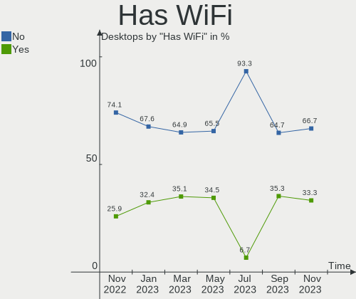
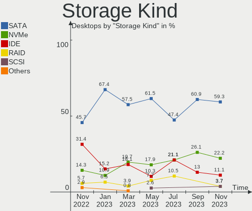

helloSystem Hardware Trends (Desktops)
--------------------------------------

A project to identify most popular hardware characteristics and track their change
over time based on data collected by helloSystem users at https://BSD-Hardware.info.

Anyone can contribute to this report by the [hw-probe](https://github.com/linuxhw/hw-probe/blob/master/INSTALL.BSD.md) tool:

    hw-probe -all -upload

Full-feature report is available here: https://bsd-hardware.info/?view=trends

Period: Dec, 2021.

Contents
--------

* [ System ](#system)
  - [ OS                       ](#os)
  - [ OS Family                ](#os-family)
  - [ Arch                     ](#arch)
  - [ DE                       ](#de)
  - [ Display Server           ](#display-server)
  - [ Display Manager          ](#display-manager)
  - [ OS Lang                  ](#os-lang)
  - [ Boot Mode                ](#boot-mode)
  - [ Filesystem               ](#filesystem)
  - [ Part. scheme             ](#part-scheme)

* [ Board ](#board)
  - [ Vendor                   ](#vendor)
  - [ Model                    ](#model)
  - [ Model Family             ](#model-family)
  - [ MFG Year                 ](#mfg-year)
  - [ Form Factor              ](#form-factor)
  - [ Coreboot                 ](#coreboot)
  - [ RAM Size                 ](#ram-size)
  - [ RAM Used                 ](#ram-used)
  - [ Total Drives             ](#total-drives)
  - [ Has CD-ROM               ](#has-cd-rom)
  - [ Has Ethernet             ](#has-ethernet)
  - [ Has WiFi                 ](#has-wifi)
  - [ Has Bluetooth            ](#has-bluetooth)

* [ Location ](#location)
  - [ Country                  ](#country)
  - [ City                     ](#city)

* [ Drives ](#drives)
  - [ Drive Vendor             ](#drive-vendor)
  - [ Drive Model              ](#drive-model)
  - [ HDD Vendor               ](#hdd-vendor)
  - [ SSD Vendor               ](#ssd-vendor)
  - [ Drive Kind               ](#drive-kind)
  - [ Drive Connector          ](#drive-connector)
  - [ Drive Size               ](#drive-size)
  - [ Space Total              ](#space-total)
  - [ Space Used               ](#space-used)
  - [ Malfunc. Drives          ](#malfunc-drives)
  - [ Malfunc. Drive Vendor    ](#malfunc-drive-vendor)
  - [ Malfunc. HDD Vendor      ](#malfunc-hdd-vendor)
  - [ Malfunc. Drive Kind      ](#malfunc-drive-kind)
  - [ Failed Drives            ](#failed-drives)
  - [ Failed Drive Vendor      ](#failed-drive-vendor)
  - [ Drive Status             ](#drive-status)

* [ Storage controller ](#storage-controller)
  - [ Storage Vendor           ](#storage-vendor)
  - [ Storage Model            ](#storage-model)
  - [ Storage Kind             ](#storage-kind)

* [ Processor ](#processor)
  - [ CPU Vendor               ](#cpu-vendor)
  - [ CPU Model                ](#cpu-model)
  - [ CPU Model Family         ](#cpu-model-family)
  - [ CPU Cores                ](#cpu-cores)
  - [ CPU Sockets              ](#cpu-sockets)
  - [ CPU Threads              ](#cpu-threads)
  - [ CPU Microarch            ](#cpu-microarch)

* [ Graphics ](#graphics)
  - [ GPU Vendor               ](#gpu-vendor)
  - [ GPU Model                ](#gpu-model)
  - [ GPU Combo                ](#gpu-combo)
  - [ GPU Driver               ](#gpu-driver)
  - [ GPU Memory               ](#gpu-memory)

* [ Monitor ](#monitor)
  - [ Monitor Vendor           ](#monitor-vendor)
  - [ Monitor Model            ](#monitor-model)
  - [ Monitor Resolution       ](#monitor-resolution)
  - [ Monitor Diagonal         ](#monitor-diagonal)
  - [ Monitor Width            ](#monitor-width)
  - [ Aspect Ratio             ](#aspect-ratio)
  - [ Monitor Area             ](#monitor-area)
  - [ Pixel Density            ](#pixel-density)
  - [ Multiple Monitors        ](#multiple-monitors)

* [ Network ](#network)
  - [ Net Controller Vendor    ](#net-controller-vendor)
  - [ Net Controller Model     ](#net-controller-model)
  - [ Wireless Vendor          ](#wireless-vendor)
  - [ Wireless Model           ](#wireless-model)
  - [ Ethernet Vendor          ](#ethernet-vendor)
  - [ Ethernet Model           ](#ethernet-model)
  - [ Net Controller Kind      ](#net-controller-kind)
  - [ Used Controller          ](#used-controller)
  - [ NICs                     ](#nics)
  - [ IPv6                     ](#ipv6)

* [ Bluetooth ](#bluetooth)
  - [ Bluetooth Vendor         ](#bluetooth-vendor)
  - [ Bluetooth Model          ](#bluetooth-model)

* [ Sound ](#sound)
  - [ Sound Vendor             ](#sound-vendor)
  - [ Sound Model              ](#sound-model)

* [ Memory ](#memory)
  - [ Memory Vendor            ](#memory-vendor)
  - [ Memory Model             ](#memory-model)
  - [ Memory Kind              ](#memory-kind)
  - [ Memory Form Factor       ](#memory-form-factor)
  - [ Memory Size              ](#memory-size)
  - [ Memory Speed             ](#memory-speed)

* [ Printers & scanners ](#printers--scanners)
  - [ Printer Vendor           ](#printer-vendor)
  - [ Printer Model            ](#printer-model)
  - [ Scanner Vendor           ](#scanner-vendor)
  - [ Scanner Model            ](#scanner-model)

* [ Camera ](#camera)
  - [ Camera Vendor            ](#camera-vendor)
  - [ Camera Model             ](#camera-model)

* [ Security ](#security)
  - [ Fingerprint Vendor       ](#fingerprint-vendor)
  - [ Fingerprint Model        ](#fingerprint-model)
  - [ Chipcard Vendor          ](#chipcard-vendor)
  - [ Chipcard Model           ](#chipcard-model)

* [ Unsupported ](#unsupported)
  - [ Unsupported Devices      ](#unsupported-devices)
  - [ Unsupported Device Types ](#unsupported-device-types)

System
------

OS
--

Installed operating systems

| Name              | Desktops | Percent |
|-------------------|----------|---------|
| helloSystem 0.7.0 | 28       | 82.35%  |
| helloSystem 0.6.0 | 5        | 14.71%  |
| helloSystem 0.5.0 | 1        | 2.94%   |

OS Family
---------

OS without a version

| Name        | Desktops | Percent |
|-------------|----------|---------|
| helloSystem | 34       | 100%    |

Arch
----

OS architecture (x86_64, i586, etc.)

| Name  | Desktops | Percent |
|-------|----------|---------|
| amd64 | 34       | 100%    |

DE
--

Desktop Environment

| Name         | Desktops | Percent |
|--------------|----------|---------|
| helloDesktop | 33       | 97.06%  |
| GNOME        | 1        | 2.94%   |

Display Server
--------------

X11 or Wayland

| Name | Desktops | Percent |
|------|----------|---------|
| X11  | 34       | 100%    |

Display Manager
---------------

SDDM, LightDM, etc.

| Name | Desktops | Percent |
|------|----------|---------|
| SLiM | 34       | 100%    |

OS Lang
-------

Language

| Lang  | Desktops | Percent |
|-------|----------|---------|
| en_US | 33       | 97.06%  |
| de_DE | 1        | 2.94%   |

Boot Mode
---------

EFI or BIOS

| Mode | Desktops | Percent |
|------|----------|---------|
| EFI  | 33       | 97.06%  |
| BIOS | 1        | 2.94%   |

Filesystem
----------

Type of filesystem

| Type   | Desktops | Percent |
|--------|----------|---------|
| Cd9660 | 21       | 61.76%  |
| Zfs    | 13       | 38.24%  |

Part. scheme
------------

Scheme of partitioning

| Type | Desktops | Percent |
|------|----------|---------|
| GPT  | 33       | 97.06%  |
| MBR  | 1        | 2.94%   |

Board
-----

Vendor
------

Motherboard manufacturer

| Name                | Desktops | Percent |
|---------------------|----------|---------|
| ASUSTek Computer    | 13       | 38.24%  |
| Gigabyte Technology | 7        | 20.59%  |
| Dell                | 4        | 11.76%  |
| MSI                 | 3        | 8.82%   |
| Hewlett-Packard     | 2        | 5.88%   |
| ASRock              | 2        | 5.88%   |
| Quanta              | 1        | 2.94%   |
| Pegatron            | 1        | 2.94%   |
| Acer                | 1        | 2.94%   |

Model
-----

Motherboard model

| Name                                | Desktops | Percent |
|-------------------------------------|----------|---------|
| Quanta 120-1135                     | 1        | 2.94%   |
| Pegatron IPM41-D3                   | 1        | 2.94%   |
| MSI MS-7C91                         | 1        | 2.94%   |
| MSI MS-7C02                         | 1        | 2.94%   |
| MSI MS-7A33                         | 1        | 2.94%   |
| HP Pavilion Gaming Desktop 690-00xx | 1        | 2.94%   |
| HP EliteDesk 800 G2 SFF             | 1        | 2.94%   |
| Gigabyte Z77X-UD3H                  | 1        | 2.94%   |
| Gigabyte X58A-UD5                   | 1        | 2.94%   |
| Gigabyte H270M-DS3H                 | 1        | 2.94%   |
| Gigabyte H170-D3HP                  | 1        | 2.94%   |
| Gigabyte E3000N                     | 1        | 2.94%   |
| Gigabyte B450 I AORUS PRO WIFI      | 1        | 2.94%   |
| Gigabyte 970A-DS3P                  | 1        | 2.94%   |
| Dell Vostro 3667                    | 1        | 2.94%   |
| Dell Precision T1700                | 1        | 2.94%   |
| Dell OptiPlex 780                   | 1        | 2.94%   |
| Dell Inspiron 3891                  | 1        | 2.94%   |
| ASUS Z170-P                         | 1        | 2.94%   |
| ASUS TUF GAMING X570-PLUS           | 1        | 2.94%   |
| ASUS ROG STRIX Z370-E GAMING        | 1        | 2.94%   |
| ASUS ROG STRIX X570-E GAMING        | 1        | 2.94%   |
| ASUS Q170M-C                        | 1        | 2.94%   |
| ASUS Pro WS X570-ACE                | 1        | 2.94%   |
| ASUS PRIME B450M-A                  | 1        | 2.94%   |
| ASUS PRIME B350M-A                  | 1        | 2.94%   |
| ASUS PRIME A320M-K                  | 1        | 2.94%   |
| ASUS P8Z77-V LX                     | 1        | 2.94%   |
| ASUS P5VD2-VM                       | 1        | 2.94%   |
| ASUS M5A78L/USB3                    | 1        | 2.94%   |
| ASUS H110M-K                        | 1        | 2.94%   |
| ASRock X570 Phantom Gaming 4        | 1        | 2.94%   |
| ASRock H110M-DGS                    | 1        | 2.94%   |
| Acer RevoOne RL85                   | 1        | 2.94%   |

Model Family
------------

Motherboard model prefix

| Name                | Desktops | Percent |
|---------------------|----------|---------|
| ASUS PRIME          | 3        | 8.82%   |
| ASUS ROG            | 2        | 5.88%   |
| Quanta 120-1135     | 1        | 2.94%   |
| Pegatron IPM41-D3   | 1        | 2.94%   |
| MSI MS-7C91         | 1        | 2.94%   |
| MSI MS-7C02         | 1        | 2.94%   |
| MSI MS-7A33         | 1        | 2.94%   |
| HP Pavilion         | 1        | 2.94%   |
| HP EliteDesk        | 1        | 2.94%   |
| Gigabyte Z77X-UD3H  | 1        | 2.94%   |
| Gigabyte X58A-UD5   | 1        | 2.94%   |
| Gigabyte H270M-DS3H | 1        | 2.94%   |
| Gigabyte H170-D3HP  | 1        | 2.94%   |
| Gigabyte E3000N     | 1        | 2.94%   |
| Gigabyte B450       | 1        | 2.94%   |
| Gigabyte 970A-DS3P  | 1        | 2.94%   |
| Dell Vostro         | 1        | 2.94%   |
| Dell Precision      | 1        | 2.94%   |
| Dell OptiPlex       | 1        | 2.94%   |
| Dell Inspiron       | 1        | 2.94%   |
| ASUS Z170-P         | 1        | 2.94%   |
| ASUS TUF            | 1        | 2.94%   |
| ASUS Q170M-C        | 1        | 2.94%   |
| ASUS Pro            | 1        | 2.94%   |
| ASUS P8Z77-V        | 1        | 2.94%   |
| ASUS P5VD2-VM       | 1        | 2.94%   |
| ASUS M5A78L         | 1        | 2.94%   |
| ASUS H110M-K        | 1        | 2.94%   |
| ASRock X570         | 1        | 2.94%   |
| ASRock H110M-DGS    | 1        | 2.94%   |
| Acer RevoOne        | 1        | 2.94%   |

MFG Year
--------

Motherboard manufacture year

| Year | Desktops | Percent |
|------|----------|---------|
| 2021 | 11       | 32.35%  |
| 2019 | 3        | 8.82%   |
| 2018 | 3        | 8.82%   |
| 2017 | 3        | 8.82%   |
| 2016 | 3        | 8.82%   |
| 2020 | 2        | 5.88%   |
| 2013 | 2        | 5.88%   |
| 2011 | 2        | 5.88%   |
| 2015 | 1        | 2.94%   |
| 2014 | 1        | 2.94%   |
| 2012 | 1        | 2.94%   |
| 2010 | 1        | 2.94%   |
| 2007 | 1        | 2.94%   |

Form Factor
-----------

Physical design of the computer

| Name    | Desktops | Percent |
|---------|----------|---------|
| Desktop | 34       | 100%    |

Coreboot
--------

Have coreboot on board

| Used | Desktops | Percent |
|------|----------|---------|
| No   | 34       | 100%    |

RAM Size
--------

Total RAM memory

| Size in GB  | Desktops | Percent |
|-------------|----------|---------|
| 16.01-24.0  | 11       | 32.35%  |
| 32.01-64.0  | 8        | 23.53%  |
| 8.01-16.0   | 7        | 20.59%  |
| 4.01-8.0    | 6        | 17.65%  |
| 24.01-32.0  | 1        | 2.94%   |
| 64.01-256.0 | 1        | 2.94%   |

RAM Used
--------

Used RAM memory

| Used GB   | Desktops | Percent |
|-----------|----------|---------|
| 0.51-1.0  | 13       | 38.24%  |
| 1.01-2.0  | 9        | 26.47%  |
| 0.01-0.5  | 8        | 23.53%  |
| 2.01-3.0  | 2        | 5.88%   |
| 3.01-4.0  | 1        | 2.94%   |
| 8.01-16.0 | 1        | 2.94%   |

Total Drives
------------

Number of drives on board

| Drives | Desktops | Percent |
|--------|----------|---------|
| 1      | 11       | 32.35%  |
| 2      | 7        | 20.59%  |
| 3      | 5        | 14.71%  |
| 4      | 4        | 11.76%  |
| 5      | 3        | 8.82%   |
| 0      | 3        | 8.82%   |
| 6      | 1        | 2.94%   |

Has CD-ROM
----------

Has CD-ROM on board

| Presented | Desktops | Percent |
|-----------|----------|---------|
| No        | 20       | 58.82%  |
| Yes       | 14       | 41.18%  |

Has Ethernet
------------

Has Ethernet on board

| Presented | Desktops | Percent |
|-----------|----------|---------|
| Yes       | 33       | 97.06%  |
| No        | 1        | 2.94%   |

Has WiFi
--------

Has WiFi module

| Presented | Desktops | Percent |
|-----------|----------|---------|
| No        | 21       | 61.76%  |
| Yes       | 13       | 38.24%  |

Has Bluetooth
-------------

Has Bluetooth module

| Presented | Desktops | Percent |
|-----------|----------|---------|
| No        | 21       | 61.76%  |
| Yes       | 13       | 38.24%  |

Location
--------

Country
-------

Geographic location (country)

| Country     | Desktops | Percent |
|-------------|----------|---------|
| USA         | 5        | 14.71%  |
| Russia      | 5        | 14.71%  |
| Canada      | 3        | 8.82%   |
| Romania     | 2        | 5.88%   |
| Poland      | 2        | 5.88%   |
| India       | 2        | 5.88%   |
| Hungary     | 2        | 5.88%   |
| Germany     | 2        | 5.88%   |
| Vietnam     | 1        | 2.94%   |
| Ukraine     | 1        | 2.94%   |
| Taiwan      | 1        | 2.94%   |
| Spain       | 1        | 2.94%   |
| Philippines | 1        | 2.94%   |
| Italy       | 1        | 2.94%   |
| France      | 1        | 2.94%   |
| Finland     | 1        | 2.94%   |
| China       | 1        | 2.94%   |
| Bulgaria    | 1        | 2.94%   |
| Brazil      | 1        | 2.94%   |

City
----

Geographic location (city)

| City              | Desktops | Percent |
|-------------------|----------|---------|
| Yunlin            | 1        | 2.94%   |
| Wolgast           | 1        | 2.94%   |
| Szeged            | 1        | 2.94%   |
| Sz?©kesfeh?©rv??r | 1        | 2.94%   |
| Surgut            | 1        | 2.94%   |
| Suceava           | 1        | 2.94%   |
| St Petersburg     | 1        | 2.94%   |
| Sofia             | 1        | 2.94%   |
| Smiths Falls      | 1        | 2.94%   |
| Santa Maria       | 1        | 2.94%   |
| Rzesz??w          | 1        | 2.94%   |
| Renfrew           | 1        | 2.94%   |
| Paso Robles       | 1        | 2.94%   |
| Ourense           | 1        | 2.94%   |
| Old Town          | 1        | 2.94%   |
| Novosibirsk       | 1        | 2.94%   |
| New Delhi         | 1        | 2.94%   |
| Myski             | 1        | 2.94%   |
| Montreal          | 1        | 2.94%   |
| Kottayam          | 1        | 2.94%   |
| Kirkkonummi       | 1        | 2.94%   |
| Katowice          | 1        | 2.94%   |
| Hanoi             | 1        | 2.94%   |
| Hangzhou          | 1        | 2.94%   |
| Front Royal       | 1        | 2.94%   |
| Follonica         | 1        | 2.94%   |
| Escondido         | 1        | 2.94%   |
| Dreieich          | 1        | 2.94%   |
| Curitiba          | 1        | 2.94%   |
| Collierville      | 1        | 2.94%   |
| Chelyabinsk       | 1        | 2.94%   |
| Chamb?©ry         | 1        | 2.94%   |
| Bucharest         | 1        | 2.94%   |
| Belogorodka       | 1        | 2.94%   |

Drives
------

Drive Vendor
------------

Hard drive vendors

| Vendor              | Desktops | Drives | Percent |
|---------------------|----------|--------|---------|
| Samsung Electronics | 16       | 20     | 25.4%   |
| Seagate             | 14       | 22     | 22.22%  |
| WDC                 | 11       | 12     | 17.46%  |
| Toshiba             | 4        | 4      | 6.35%   |
| SK Hynix            | 3        | 3      | 4.76%   |
| Kingston            | 3        | 4      | 4.76%   |
| Crucial             | 3        | 3      | 4.76%   |
| XPG                 | 2        | 2      | 3.17%   |
| Intel               | 2        | 2      | 3.17%   |
| Phison              | 1        | 1      | 1.59%   |
| OCZ                 | 1        | 1      | 1.59%   |
| Hitachi             | 1        | 1      | 1.59%   |
| GOODRAM             | 1        | 1      | 1.59%   |
| A-DATA Technology   | 1        | 1      | 1.59%   |

Drive Model
-----------

Hard drive models

| Model                                   | Desktops | Percent |
|-----------------------------------------|----------|---------|
| Seagate ST4000DM004-2CV104 4TB          | 3        | 4%      |
| Samsung SSD 850 EVO 250GB               | 3        | 4%      |
| XPG GAMMIX S11 Pro 1TB                  | 2        | 2.67%   |
| Toshiba HDWD110 1TB                     | 2        | 2.67%   |
| Seagate ST1000DM010-2EP102 1TB          | 2        | 2.67%   |
| Samsung SSD 860 EVO 500GB               | 2        | 2.67%   |
| Samsung SSD 860 EVO 250GB               | 2        | 2.67%   |
| Kingston SA400S37120G 120GB             | 2        | 2.67%   |
| WDC WDS500G2B0A-00SM50 500GB            | 1        | 1.33%   |
| WDC WDS250G1B0A-00H9H0 250GB            | 1        | 1.33%   |
| WDC WDS240G2G0A-00JH30 240GB            | 1        | 1.33%   |
| WDC WDS100T2B0A-00SM50 1TB              | 1        | 1.33%   |
| WDC WD5000LPVX-22V0TT0 500GB            | 1        | 1.33%   |
| WDC WD5000AAKX-08ERMA0 500GB            | 1        | 1.33%   |
| WDC WD5000AAKX-00ERMA0 500GB            | 1        | 1.33%   |
| WDC WD40EZRZ-00GXCB0 4TB                | 1        | 1.33%   |
| WDC WD3003FZEX-00Z4SA0 3TB              | 1        | 1.33%   |
| WDC WD20SMZW-11YFCS0 2TB                | 1        | 1.33%   |
| WDC WD10EZEX-00KUWA0 1TB                | 1        | 1.33%   |
| WDC WD10EADX-00TDHB0 1TB                | 1        | 1.33%   |
| Toshiba DT01ACA100 1TB                  | 1        | 1.33%   |
| Toshiba DT01ACA050 500GB                | 1        | 1.33%   |
| SK Hynix SHGS31-1000GS-2 1TB            | 1        | 1.33%   |
| SK Hynix BC711 NVMe 256GB               | 1        | 1.33%   |
| SK Hynix BC501 HFM128GDJTNG-8310A 128GB | 1        | 1.33%   |
| Seagate ST4000NC001-1FS168 4TB          | 1        | 1.33%   |
| Seagate ST4000NC000-1FR168 4TB          | 1        | 1.33%   |
| Seagate ST3500413AS 500GB               | 1        | 1.33%   |
| Seagate ST3400633AS 400GB               | 1        | 1.33%   |
| Seagate ST32000641AS 2TB                | 1        | 1.33%   |
| Seagate ST3000DM008-2DM166 3TB          | 1        | 1.33%   |
| Seagate ST3000DM001-1CH166 3TB          | 1        | 1.33%   |
| Seagate ST2000LX001-1RG174 2TB          | 1        | 1.33%   |
| Seagate ST2000DM008-2FR102 2TB          | 1        | 1.33%   |
| Seagate ST2000DM006-2DM164 2TB          | 1        | 1.33%   |
| Seagate ST2000DM005-2CW102 2TB          | 1        | 1.33%   |
| Seagate ST2000DM001-1ER164 2TB          | 1        | 1.33%   |
| Seagate ST2000DL003-9VT166 2TB          | 1        | 1.33%   |
| Seagate ST1000LM035-1RK172 1TB          | 1        | 1.33%   |
| Seagate ST1000DM003-1ER162 1TB          | 1        | 1.33%   |
| Samsung SSD 980 1TB                     | 1        | 1.33%   |
| Samsung SSD 970 EVO Plus 500GB          | 1        | 1.33%   |
| Samsung SSD 970 EVO 250GB               | 1        | 1.33%   |
| Samsung SSD 970 EVO 1TB                 | 1        | 1.33%   |
| Samsung SSD 960 PRO 2TB                 | 1        | 1.33%   |
| Samsung SSD 960 EVO 500GB               | 1        | 1.33%   |
| Samsung SSD 870 EVO 500GB               | 1        | 1.33%   |
| Samsung SSD 870 EVO 1TB                 | 1        | 1.33%   |
| Samsung SSD 860 EVO M.2 500GB           | 1        | 1.33%   |
| Samsung Portable SSD T5 500GB           | 1        | 1.33%   |
| Samsung PM961 NVMe 256GB                | 1        | 1.33%   |
| Samsung MZVLB256HAHQ-00000 256GB        | 1        | 1.33%   |
| Samsung HD103SI 1TB                     | 1        | 1.33%   |
| Phison Sabrent 1TB                      | 1        | 1.33%   |
| OCZ AGILITY3 128GB                      | 1        | 1.33%   |
| Kingston SV300S37A120G 120GB            | 1        | 1.33%   |
| Kingston SHFS37A120G 120GB              | 1        | 1.33%   |
| Intel SSDSC2CW120A3 120GB               | 1        | 1.33%   |
| Intel SSDSC2BP480G4 480GB               | 1        | 1.33%   |
| Hitachi HTS541680J9SA00 80GB            | 1        | 1.33%   |

HDD Vendor
----------

Hard disk drive vendors

| Vendor              | Desktops | Drives | Percent |
|---------------------|----------|--------|---------|
| Seagate             | 14       | 22     | 50%     |
| WDC                 | 8        | 8      | 28.57%  |
| Toshiba             | 4        | 4      | 14.29%  |
| Samsung Electronics | 1        | 1      | 3.57%   |
| Hitachi             | 1        | 1      | 3.57%   |

SSD Vendor
----------

Solid state drive vendors

| Vendor              | Desktops | Drives | Percent |
|---------------------|----------|--------|---------|
| Samsung Electronics | 11       | 11     | 42.31%  |
| WDC                 | 3        | 4      | 11.54%  |
| Kingston            | 3        | 4      | 11.54%  |
| Crucial             | 3        | 3      | 11.54%  |
| Intel               | 2        | 2      | 7.69%   |
| SK Hynix            | 1        | 1      | 3.85%   |
| OCZ                 | 1        | 1      | 3.85%   |
| GOODRAM             | 1        | 1      | 3.85%   |
| A-DATA Technology   | 1        | 1      | 3.85%   |

Drive Kind
----------

HDD or SSD

| Kind | Desktops | Drives | Percent |
|------|----------|--------|---------|
| HDD  | 22       | 36     | 40.74%  |
| SSD  | 21       | 28     | 38.89%  |
| NVMe | 11       | 13     | 20.37%  |

Drive Connector
---------------

SATA, SAS, NVMe, etc.

| Type | Desktops | Drives | Percent |
|------|----------|--------|---------|
| SATA | 30       | 64     | 73.17%  |
| NVMe | 11       | 13     | 26.83%  |

Drive Size
----------

Size of hard drive

| Size in TB | Desktops | Drives | Percent |
|------------|----------|--------|---------|
| 0.01-0.5   | 22       | 30     | 44.9%   |
| 0.51-1.0   | 11       | 13     | 22.45%  |
| 1.01-2.0   | 9        | 9      | 18.37%  |
| 3.01-4.0   | 4        | 8      | 8.16%   |
| 2.01-3.0   | 3        | 4      | 6.12%   |

Space Total
-----------

Amount of disk space available on the file system

| Size in GB | Desktops | Percent |
|------------|----------|---------|
| 1-20       | 24       | 70.59%  |
| 251-500    | 4        | 11.76%  |
| 101-250    | 4        | 11.76%  |
| 501-1000   | 1        | 2.94%   |
| 51-100     | 1        | 2.94%   |

Space Used
----------

Amount of used disk space

| Used GB | Desktops | Percent |
|---------|----------|---------|
| 1-20    | 34       | 100%    |

Malfunc. Drives
---------------

Drive models with a malfunction

| Model                               | Desktops | Drives | Percent |
|-------------------------------------|----------|--------|---------|
| WDC WD5000AAKX-08ERMA0 500GB        | 1        | 1      | 14.29%  |
| WDC WD5000AAKX-00ERMA0 500GB        | 1        | 1      | 14.29%  |
| Toshiba DT01ACA100 1TB              | 1        | 1      | 14.29%  |
| Seagate ST3500413AS 500GB           | 1        | 1      | 14.29%  |
| Samsung Electronics SSD 870 EVO 1TB | 1        | 1      | 14.29%  |
| Hitachi HTS541680J9SA00 80GB        | 1        | 1      | 14.29%  |
| Crucial CT240M500SSD1 240GB         | 1        | 1      | 14.29%  |

Malfunc. Drive Vendor
---------------------

Vendors of faulty drives

| Vendor              | Desktops | Drives | Percent |
|---------------------|----------|--------|---------|
| WDC                 | 2        | 2      | 28.57%  |
| Toshiba             | 1        | 1      | 14.29%  |
| Seagate             | 1        | 1      | 14.29%  |
| Samsung Electronics | 1        | 1      | 14.29%  |
| Hitachi             | 1        | 1      | 14.29%  |
| Crucial             | 1        | 1      | 14.29%  |

Malfunc. HDD Vendor
-------------------

Vendors of faulty HDD drives

| Vendor  | Desktops | Drives | Percent |
|---------|----------|--------|---------|
| WDC     | 2        | 2      | 40%     |
| Toshiba | 1        | 1      | 20%     |
| Seagate | 1        | 1      | 20%     |
| Hitachi | 1        | 1      | 20%     |

Malfunc. Drive Kind
-------------------

Kinds of faulty drives

| Kind | Desktops | Drives | Percent |
|------|----------|--------|---------|
| HDD  | 5        | 5      | 71.43%  |
| SSD  | 2        | 2      | 28.57%  |

Failed Drives
-------------

Failed drive models

Zero info for selected period =(

Failed Drive Vendor
-------------------

Failed drive vendors

Zero info for selected period =(

Drive Status
------------

Number of failed and malfunc. drives

| Status  | Desktops | Drives | Percent |
|---------|----------|--------|---------|
| Works   | 29       | 70     | 80.56%  |
| Malfunc | 7        | 7      | 19.44%  |

Storage controller
------------------

Storage Vendor
--------------

Storage controller vendors

| Vendor                   | Desktops | Percent |
|--------------------------|----------|---------|
| Intel                    | 18       | 37.5%   |
| AMD                      | 15       | 31.25%  |
| Samsung Electronics      | 6        | 12.5%   |
| SK Hynix                 | 2        | 4.17%   |
| Marvell Technology Group | 2        | 4.17%   |
| ADATA Technology         | 2        | 4.17%   |
| VIA Technologies         | 1        | 2.08%   |
| Phison Electronics       | 1        | 2.08%   |
| JMicron Technology       | 1        | 2.08%   |

Storage Model
-------------

Storage controller models

| Model                                                                          | Desktops | Percent |
|--------------------------------------------------------------------------------|----------|---------|
| AMD FCH SATA Controller [AHCI mode]                                            | 10       | 17.24%  |
| Intel Q170/Q150/B150/H170/H110/Z170/CM236 Chipset SATA Controller [AHCI Mode]  | 7        | 12.07%  |
| Samsung NVMe SSD Controller SM981/PM981/PM983                                  | 4        | 6.9%    |
| AMD 400 Series Chipset SATA Controller                                         | 3        | 5.17%   |
| Samsung NVMe SSD Controller SM961/PM961/SM963                                  | 2        | 3.45%   |
| Intel 7 Series/C210 Series Chipset Family 6-port SATA Controller [AHCI mode]   | 2        | 3.45%   |
| AMD SB7x0/SB8x0/SB9x0 SATA Controller [AHCI mode]                              | 2        | 3.45%   |
| ADATA XPG SX8200 Pro PCIe Gen3x4 M.2 2280 Solid State Drive                    | 2        | 3.45%   |
| VIA VT82C586A/B/VT82C686/A/B/VT823x/A/C PIPC Bus Master IDE                    | 1        | 1.72%   |
| VIA VT8237A SATA 2-Port Controller                                             | 1        | 1.72%   |
| SK Hynix Gold P31 SSD                                                          | 1        | 1.72%   |
| SK Hynix BC501 NVMe Solid State Drive                                          | 1        | 1.72%   |
| Samsung NVMe SSD Controller 980                                                | 1        | 1.72%   |
| Phison E12 NVMe Controller                                                     | 1        | 1.72%   |
| Marvell Group 88SE9172 SATA 6Gb/s Controller                                   | 1        | 1.72%   |
| Marvell Group 88SE9128 PCIe SATA 6 Gb/s RAID controller                        | 1        | 1.72%   |
| JMicron JMB363 SATA/IDE Controller                                             | 1        | 1.72%   |
| Intel SATA Controller [RAID mode]                                              | 1        | 1.72%   |
| Intel NM10/ICH7 Family SATA Controller [IDE mode]                              | 1        | 1.72%   |
| Intel Cannon Lake PCH SATA AHCI Controller                                     | 1        | 1.72%   |
| Intel 82801JI (ICH10 Family) SATA AHCI Controller                              | 1        | 1.72%   |
| Intel 82801JD/DO (ICH10 Family) 4-port SATA IDE Controller                     | 1        | 1.72%   |
| Intel 82801JD/DO (ICH10 Family) 2-port SATA IDE Controller                     | 1        | 1.72%   |
| Intel 82801 Mobile SATA Controller [RAID mode]                                 | 1        | 1.72%   |
| Intel 8 Series/C220 Series Chipset Family 6-port SATA Controller 1 [AHCI mode] | 1        | 1.72%   |
| Intel 500 Series Chipset Family SATA AHCI Controller                           | 1        | 1.72%   |
| Intel 4 Series Chipset PT IDER Controller                                      | 1        | 1.72%   |
| Intel 200 Series PCH SATA controller [AHCI mode]                               | 1        | 1.72%   |
| AMD X370 Series Chipset SATA Controller                                        | 1        | 1.72%   |
| AMD Starship/Matisse Chipset SATA Controller [AHCI mode]                       | 1        | 1.72%   |
| AMD SB7x0/SB8x0/SB9x0 SATA Controller [IDE mode]                               | 1        | 1.72%   |
| AMD SB7x0/SB8x0/SB9x0 IDE Controller                                           | 1        | 1.72%   |
| AMD FCH SATA Controller D                                                      | 1        | 1.72%   |
| AMD 300 Series Chipset SATA Controller                                         | 1        | 1.72%   |

Storage Kind
------------

Kind of storage controller (IDE, SATA, NVMe, SAS, ...)

| Kind | Desktops | Percent |
|------|----------|---------|
| SATA | 28       | 62.22%  |
| NVMe | 11       | 24.44%  |
| IDE  | 4        | 8.89%   |
| RAID | 2        | 4.44%   |

Processor
---------

CPU Vendor
----------

Processor vendors

| Vendor | Desktops | Percent |
|--------|----------|---------|
| Intel  | 19       | 55.88%  |
| AMD    | 15       | 44.12%  |

CPU Model
---------

Processor models

| Model                                       | Desktops | Percent |
|---------------------------------------------|----------|---------|
| Intel Core i7-7700 CPU @ 3.60GHz            | 2        | 5.88%   |
| Intel Core i5-6500 CPU @ 3.20GHz            | 2        | 5.88%   |
| AMD Ryzen 5 3600 6-Core Processor           | 2        | 5.88%   |
| Intel Xeon CPU E3-1230 V2 @ 3.30GHz         | 1        | 2.94%   |
| Intel Pentium Dual-Core CPU E6700 @ 3.20GHz | 1        | 2.94%   |
| Intel Core i7-8700K CPU @ 3.70GHz           | 1        | 2.94%   |
| Intel Core i7-6700 CPU @ 3.40GHz            | 1        | 2.94%   |
| Intel Core i7-4770 CPU @ 3.40GHz            | 1        | 2.94%   |
| Intel Core i7 CPU                           | 1        | 2.94%   |
| Intel Core i5-8400 CPU @ 2.80GHz            | 1        | 2.94%   |
| Intel Core i5-6400 CPU @ 2.70GHz            | 1        | 2.94%   |
| Intel Core i5-3475S CPU @ 2.90GHz           | 1        | 2.94%   |
| Intel Core i3-6320 CPU @ 3.90GHz            | 1        | 2.94%   |
| Intel Core i3-6300 CPU @ 3.80GHz            | 1        | 2.94%   |
| Intel Core i3-5010U CPU @ 2.10GHz           | 1        | 2.94%   |
| Intel Core 2 Duo                            | 1        | 2.94%   |
| Intel Core 2 CPU 4300 @ 1.80GHz             | 1        | 2.94%   |
| Intel 11th Gen Core i5-11400 @ 2.60GHz      | 1        | 2.94%   |
| AMD Ryzen 9 3900X 12-Core Processor         | 1        | 2.94%   |
| AMD Ryzen 7 5800X 8-Core Processor          | 1        | 2.94%   |
| AMD Ryzen 7 5700G with Radeon Graphics      | 1        | 2.94%   |
| AMD Ryzen 7 3700X 8-Core Processor          | 1        | 2.94%   |
| AMD Ryzen 7 1800X Eight-Core Processor      | 1        | 2.94%   |
| AMD Ryzen 5 3600X 6-Core Processor          | 1        | 2.94%   |
| AMD Ryzen 5 3400G with Radeon Vega Graphics | 1        | 2.94%   |
| AMD Ryzen 5 2400G with Radeon Vega Graphics | 1        | 2.94%   |
| AMD Ryzen 5 1600 Six-Core Processor         | 1        | 2.94%   |
| AMD Phenom II X4 965 Processor              | 1        | 2.94%   |
| AMD FX-6300 Six-Core Processor              | 1        | 2.94%   |
| AMD E2-3000 APU with Radeon HD Graphics     | 1        | 2.94%   |
| AMD E-450 APU with Radeon HD Graphics       | 1        | 2.94%   |

CPU Model Family
----------------

Processor model prefix

| Model                   | Desktops | Percent |
|-------------------------|----------|---------|
| Intel Core i7           | 6        | 17.65%  |
| AMD Ryzen 5             | 6        | 17.65%  |
| Intel Core i5           | 5        | 14.71%  |
| AMD Ryzen 7             | 4        | 11.76%  |
| Intel Core i3           | 3        | 8.82%   |
| Other                   | 1        | 2.94%   |
| Intel Xeon              | 1        | 2.94%   |
| Intel Pentium Dual-Core | 1        | 2.94%   |
| Intel Core 2 Duo        | 1        | 2.94%   |
| Intel Core 2            | 1        | 2.94%   |
| AMD Ryzen 9             | 1        | 2.94%   |
| AMD Phenom II X4        | 1        | 2.94%   |
| AMD FX                  | 1        | 2.94%   |
| AMD E2                  | 1        | 2.94%   |
| AMD E                   | 1        | 2.94%   |

CPU Cores
---------

Number of processor cores

| Number  | Desktops | Percent |
|---------|----------|---------|
| 4       | 11       | 32.35%  |
| 2       | 7        | 20.59%  |
| 12      | 4        | 11.76%  |
| 6       | 4        | 11.76%  |
| 16      | 3        | 8.82%   |
| 8       | 2        | 5.88%   |
| 24      | 1        | 2.94%   |
| 14      | 1        | 2.94%   |
| Unknown | 1        | 2.94%   |

CPU Sockets
-----------

Number of sockets

| Number | Desktops | Percent |
|--------|----------|---------|
| 1      | 34       | 100%    |

CPU Threads
-----------

Threads per core (Hyper-Threading)

| Number  | Desktops | Percent |
|---------|----------|---------|
| 1       | 22       | 64.71%  |
| 2       | 11       | 32.35%  |
| Unknown | 1        | 2.94%   |

CPU Microarch
-------------

Microarchitecture

| Name       | Desktops | Percent |
|------------|----------|---------|
| Skylake    | 6        | 17.65%  |
| Zen 2      | 5        | 14.71%  |
| KabyLake   | 4        | 11.76%  |
| Zen        | 3        | 8.82%   |
| Zen 3      | 2        | 5.88%   |
| Penryn     | 2        | 5.88%   |
| IvyBridge  | 2        | 5.88%   |
| Zen+       | 1        | 2.94%   |
| Piledriver | 1        | 2.94%   |
| Nehalem    | 1        | 2.94%   |
| K10        | 1        | 2.94%   |
| Jaguar     | 1        | 2.94%   |
| Haswell    | 1        | 2.94%   |
| Core       | 1        | 2.94%   |
| Broadwell  | 1        | 2.94%   |
| Bobcat     | 1        | 2.94%   |
| Unknown    | 1        | 2.94%   |

Graphics
--------

GPU Vendor
----------

Vendors of graphics cards

| Vendor | Desktops | Percent |
|--------|----------|---------|
| Nvidia | 14       | 40%     |
| Intel  | 11       | 31.43%  |
| AMD    | 10       | 28.57%  |

GPU Model
---------

Graphics card models

| Model                                                                       | Desktops | Percent |
|-----------------------------------------------------------------------------|----------|---------|
| Intel HD Graphics 530                                                       | 4        | 11.43%  |
| AMD Ellesmere [Radeon RX 470/480/570/570X/580/580X/590]                     | 3        | 8.57%   |
| Nvidia GP107 [GeForce GTX 1050 Ti]                                          | 2        | 5.71%   |
| Intel HD Graphics 630                                                       | 2        | 5.71%   |
| Nvidia GP107 [GeForce GTX 1050]                                             | 1        | 2.86%   |
| Nvidia GP106 [GeForce GTX 1060 6GB]                                         | 1        | 2.86%   |
| Nvidia GP106 [GeForce GTX 1060 3GB]                                         | 1        | 2.86%   |
| Nvidia GP104 [GeForce GTX 1070]                                             | 1        | 2.86%   |
| Nvidia GP104 [GeForce GTX 1070 Ti]                                          | 1        | 2.86%   |
| Nvidia GM206 [GeForce GTX 950]                                              | 1        | 2.86%   |
| Nvidia GM107 [GeForce GTX 750]                                              | 1        | 2.86%   |
| Nvidia GK104 [GeForce GTX 760]                                              | 1        | 2.86%   |
| Nvidia GF119 [GeForce GT 610]                                               | 1        | 2.86%   |
| Nvidia GA104 [GeForce RTX 3070 Lite Hash Rate]                              | 1        | 2.86%   |
| Nvidia G86 [GeForce 8500 GT]                                                | 1        | 2.86%   |
| Nvidia G72 [GeForce 7300 LE]                                                | 1        | 2.86%   |
| Intel Xeon E3-1200 v3/4th Gen Core Processor Integrated Graphics Controller | 1        | 2.86%   |
| Intel RocketLake-S GT1 [UHD Graphics 730]                                   | 1        | 2.86%   |
| Intel IvyBridge GT2 [HD Graphics 4000]                                      | 1        | 2.86%   |
| Intel HD Graphics 5500                                                      | 1        | 2.86%   |
| Intel 4 Series Chipset Integrated Graphics Controller                       | 1        | 2.86%   |
| AMD Wrestler [Radeon HD 6320]                                               | 1        | 2.86%   |
| AMD Redwood XT [Radeon HD 5670/5690/5730]                                   | 1        | 2.86%   |
| AMD Raven Ridge [Radeon Vega Series / Radeon Vega Mobile Series]            | 1        | 2.86%   |
| AMD Picasso/Raven 2 [Radeon Vega Series / Radeon Vega Mobile Series]        | 1        | 2.86%   |
| AMD Navi 10 [Radeon RX 5600 OEM/5600 XT / 5700/5700 XT]                     | 1        | 2.86%   |
| AMD Kabini [Radeon HD 8280 / R3 Series]                                     | 1        | 2.86%   |
| AMD Cezanne                                                                 | 1        | 2.86%   |

GPU Combo
---------

Combinations of graphics cards

| Name           | Desktops | Percent |
|----------------|----------|---------|
| 1 x Nvidia     | 13       | 38.24%  |
| 1 x Intel      | 10       | 29.41%  |
| 1 x AMD        | 10       | 29.41%  |
| Intel + Nvidia | 1        | 2.94%   |

GPU Driver
----------

Free vs proprietary

| Driver      | Desktops | Percent |
|-------------|----------|---------|
| Free        | 21       | 61.76%  |
| Proprietary | 11       | 32.35%  |
| Unknown     | 2        | 5.88%   |

GPU Memory
----------

Total video memory

| Size in GB | Desktops | Percent |
|------------|----------|---------|
| Unknown    | 15       | 44.12%  |
| 3.01-4.0   | 5        | 14.71%  |
| 1.01-2.0   | 5        | 14.71%  |
| 7.01-8.0   | 4        | 11.76%  |
| 0.01-0.5   | 3        | 8.82%   |
| 5.01-6.0   | 1        | 2.94%   |
| 0.51-1.0   | 1        | 2.94%   |

Monitor
-------

Monitor Vendor
--------------

Monitor vendors

| Vendor               | Desktops | Percent |
|----------------------|----------|---------|
| Hewlett-Packard      | 6        | 20%     |
| Samsung Electronics  | 4        | 13.33%  |
| Goldstar             | 4        | 13.33%  |
| Dell                 | 4        | 13.33%  |
| BenQ                 | 4        | 13.33%  |
| AOC                  | 3        | 10%     |
| Acer                 | 2        | 6.67%   |
| Philips              | 1        | 3.33%   |
| Iiyama               | 1        | 3.33%   |
| Ancor Communications | 1        | 3.33%   |

Monitor Model
-------------

Monitor models

| Model                                                                 | Desktops | Percent |
|-----------------------------------------------------------------------|----------|---------|
| Samsung Electronics T24E390 SAM0C20 1920x1080 520x290mm 23.4-inch     | 1        | 3.23%   |
| Samsung Electronics SyncMaster SAM05FF 1600x900 440x250mm 19.9-inch   | 1        | 3.23%   |
| Samsung Electronics SyncMaster SAM05C5 1920x1080                      | 1        | 3.23%   |
| Samsung Electronics SyncMaster SAM027D 1680x1050 430x270mm 20.0-inch  | 1        | 3.23%   |
| Samsung Electronics SMBX2250 SAM071B 1920x1080 480x270mm 21.7-inch    | 1        | 3.23%   |
| Philips PHL 278E1 PHLC217 3840x2160 600x340mm 27.2-inch               | 1        | 3.23%   |
| Iiyama PLE2407HDS IVM560D 1920x1080 520x300mm 23.6-inch               | 1        | 3.23%   |
| Hewlett-Packard ZR22w HWP2867 1920x1080 480x270mm 21.7-inch           | 1        | 3.23%   |
| Hewlett-Packard Z24n G2 HPN3485 1920x1200 520x320mm 24.0-inch         | 1        | 3.23%   |
| Hewlett-Packard LCD Monitor HWP4218 1600x900 440x250mm 19.9-inch      | 1        | 3.23%   |
| Hewlett-Packard LCD Monitor HPN3425 1920x1080 540x300mm 24.3-inch     | 1        | 3.23%   |
| Hewlett-Packard 24fw HPN3545 1920x1080 530x300mm 24.0-inch            | 1        | 3.23%   |
| Hewlett-Packard 19ka HWP3328 1366x768 410x230mm 18.5-inch             | 1        | 3.23%   |
| Goldstar M2280D GSM57B9 1920x1080 480x270mm 21.7-inch                 | 1        | 3.23%   |
| Goldstar LG HDR 4K GSM7706 3840x2160 600x340mm 27.2-inch              | 1        | 3.23%   |
| Goldstar LCD Monitor GSM5AB8 1920x1080 480x270mm 21.7-inch            | 1        | 3.23%   |
| Goldstar 19MB35 GSM4C23 1280x1024 380x300mm 19.1-inch                 | 1        | 3.23%   |
| Dell U3415W DELA0A6 3440x1440 800x330mm 34.1-inch                     | 1        | 3.23%   |
| Dell U2415 DELA0BA 1920x1200 520x320mm 24.0-inch                      | 1        | 3.23%   |
| Dell U2412M DELA07B 1920x1200 520x320mm 24.0-inch                     | 1        | 3.23%   |
| Dell P2311H DEL4067 1920x1080 510x290mm 23.1-inch                     | 1        | 3.23%   |
| BenQ GW2780 BNQ78E6 1920x1080 600x340mm 27.2-inch                     | 1        | 3.23%   |
| BenQ GW2260 BNQ78C4 1920x1080 480x270mm 21.7-inch                     | 1        | 3.23%   |
| BenQ GL2460 BNQ78CE 1920x1080 530x300mm 24.0-inch                     | 1        | 3.23%   |
| BenQ EW2440L BNQ7938 1920x1080 530x300mm 24.0-inch                    | 1        | 3.23%   |
| AOC 2778X AOC2778 2560x1440 600x340mm 27.2-inch                       | 1        | 3.23%   |
| AOC 24G2W1G4 AOC2402 1920x1080 530x300mm 24.0-inch                    | 1        | 3.23%   |
| AOC 2369M AOC2369 1920x1080 510x290mm 23.1-inch                       | 1        | 3.23%   |
| Ancor Communications ASUS VW198 ACI19AA 1680x1050 400x250mm 18.6-inch | 1        | 3.23%   |
| Acer K242HL ACR03E3 1920x1080 530x300mm 24.0-inch                     | 1        | 3.23%   |
| Acer G227HQL ACR03DE 1920x1080 480x270mm 21.7-inch                    | 1        | 3.23%   |

Monitor Resolution
------------------

Monitor screen resolution

| Resolution         | Desktops | Percent |
|--------------------|----------|---------|
| 1920x1080 (FHD)    | 17       | 56.67%  |
| 1920x1200 (WUXGA)  | 3        | 10%     |
| 3840x2160 (4K)     | 2        | 6.67%   |
| 1680x1050 (WSXGA+) | 2        | 6.67%   |
| 1600x900 (HD+)     | 2        | 6.67%   |
| 3440x1440          | 1        | 3.33%   |
| 2560x1440 (QHD)    | 1        | 3.33%   |
| 1366x768 (WXGA)    | 1        | 3.33%   |
| 1280x1024 (SXGA)   | 1        | 3.33%   |

Monitor Diagonal
----------------

Diagonal size in inches

| Inches  | Desktops | Percent |
|---------|----------|---------|
| 24      | 9        | 29.03%  |
| 21      | 6        | 19.35%  |
| 27      | 4        | 12.9%   |
| 23      | 4        | 12.9%   |
| 19      | 3        | 9.68%   |
| 18      | 2        | 6.45%   |
| 34      | 1        | 3.23%   |
| 20      | 1        | 3.23%   |
| Unknown | 1        | 3.23%   |

Monitor Width
-------------

Physical width

| Width in mm | Desktops | Percent |
|-------------|----------|---------|
| 501-600     | 15       | 53.57%  |
| 401-500     | 9        | 32.14%  |
| 351-400     | 2        | 7.14%   |
| 701-800     | 1        | 3.57%   |
| Unknown     | 1        | 3.57%   |

Aspect Ratio
------------

Proportional relationship between the width and the height

| Ratio | Desktops | Percent |
|-------|----------|---------|
| 16/9  | 21       | 75%     |
| 16/10 | 5        | 17.86%  |
| 5/4   | 1        | 3.57%   |
| 21/9  | 1        | 3.57%   |

Monitor Area
------------

Area in inch²

| Area in inch² | Desktops | Percent |
|----------------|----------|---------|
| 201-250        | 14       | 46.67%  |
| 151-200        | 5        | 16.67%  |
| 301-350        | 4        | 13.33%  |
| 251-300        | 4        | 13.33%  |
| 351-500        | 1        | 3.33%   |
| 141-150        | 1        | 3.33%   |
| Unknown        | 1        | 3.33%   |

Pixel Density
-------------

Pixels per inch

| Density | Desktops | Percent |
|---------|----------|---------|
| 51-100  | 19       | 61.29%  |
| 101-120 | 9        | 29.03%  |
| 161-240 | 2        | 6.45%   |
| Unknown | 1        | 3.23%   |

Multiple Monitors
-----------------

Total monitors connected

| Total | Desktops | Percent |
|-------|----------|---------|
| 1     | 26       | 76.47%  |
| 2     | 4        | 11.76%  |
| 0     | 4        | 11.76%  |

Network
-------

Net Controller Vendor
---------------------

Controller vendors

| Vendor                | Desktops | Percent |
|-----------------------|----------|---------|
| Realtek Semiconductor | 27       | 60%     |
| Intel                 | 13       | 28.89%  |
| Qualcomm Atheros      | 3        | 6.67%   |
| Broadcom              | 2        | 4.44%   |

Net Controller Model
--------------------

Controller models

| Model                                                                         | Desktops | Percent |
|-------------------------------------------------------------------------------|----------|---------|
| Realtek RTL8111/8168/8411 PCI Express Gigabit Ethernet Controller             | 21       | 41.18%  |
| Intel I211 Gigabit Network Connection                                         | 4        | 7.84%   |
| Intel Wi-Fi 6 AX200                                                           | 3        | 5.88%   |
| Realtek RTL8822BE 802.11a/b/g/n/ac WiFi adapter                               | 2        | 3.92%   |
| Intel Ethernet Connection (2) I219-V                                          | 2        | 3.92%   |
| Intel Ethernet Connection (2) I219-LM                                         | 2        | 3.92%   |
| Realtek RTL8821AE 802.11ac PCIe Wireless Network Adapter                      | 1        | 1.96%   |
| Realtek RTL8192CU 802.11n WLAN Adapter                                        | 1        | 1.96%   |
| Realtek RTL8188EUS 802.11n Wireless Network Adapter                           | 1        | 1.96%   |
| Realtek RTL8188CUS 802.11n WLAN Adapter                                       | 1        | 1.96%   |
| Realtek RTL8125 2.5GbE Controller                                             | 1        | 1.96%   |
| Realtek RTL810xE PCI Express Fast Ethernet controller                         | 1        | 1.96%   |
| Realtek RTL-8110SC/8169SC Gigabit Ethernet                                    | 1        | 1.96%   |
| Qualcomm Atheros QCA9565 / AR9565 Wireless Network Adapter                    | 1        | 1.96%   |
| Qualcomm Atheros AR93xx Wireless Network Adapter                              | 1        | 1.96%   |
| Qualcomm Atheros AR8161 Gigabit Ethernet                                      | 1        | 1.96%   |
| Intel Wireless-AC 9260                                                        | 1        | 1.96%   |
| Intel Wireless 7260                                                           | 1        | 1.96%   |
| Intel Ethernet Connection I217-LM                                             | 1        | 1.96%   |
| Intel 82571EB/82571GB Gigabit Ethernet Controller D0/D1 (copper applications) | 1        | 1.96%   |
| Intel 82567LM-3 Gigabit Network Connection                                    | 1        | 1.96%   |
| Broadcom NetXtreme BCM5761 Gigabit Ethernet PCIe                              | 1        | 1.96%   |
| Broadcom BCM4360 802.11ac Wireless Network Adapter                            | 1        | 1.96%   |

Wireless Vendor
---------------

Wireless vendors

| Vendor                | Desktops | Percent |
|-----------------------|----------|---------|
| Realtek Semiconductor | 6        | 42.86%  |
| Intel                 | 5        | 35.71%  |
| Qualcomm Atheros      | 2        | 14.29%  |
| Broadcom              | 1        | 7.14%   |

Wireless Model
--------------

Wireless models

| Model                                                      | Desktops | Percent |
|------------------------------------------------------------|----------|---------|
| Intel Wi-Fi 6 AX200                                        | 3        | 21.43%  |
| Realtek RTL8822BE 802.11a/b/g/n/ac WiFi adapter            | 2        | 14.29%  |
| Realtek RTL8821AE 802.11ac PCIe Wireless Network Adapter   | 1        | 7.14%   |
| Realtek RTL8192CU 802.11n WLAN Adapter                     | 1        | 7.14%   |
| Realtek RTL8188EUS 802.11n Wireless Network Adapter        | 1        | 7.14%   |
| Realtek RTL8188CUS 802.11n WLAN Adapter                    | 1        | 7.14%   |
| Qualcomm Atheros QCA9565 / AR9565 Wireless Network Adapter | 1        | 7.14%   |
| Qualcomm Atheros AR93xx Wireless Network Adapter           | 1        | 7.14%   |
| Intel Wireless-AC 9260                                     | 1        | 7.14%   |
| Intel Wireless 7260                                        | 1        | 7.14%   |
| Broadcom BCM4360 802.11ac Wireless Network Adapter         | 1        | 7.14%   |

Ethernet Vendor
---------------

Ethernet vendors

| Vendor                | Desktops | Percent |
|-----------------------|----------|---------|
| Realtek Semiconductor | 23       | 63.89%  |
| Intel                 | 11       | 30.56%  |
| Qualcomm Atheros      | 1        | 2.78%   |
| Broadcom              | 1        | 2.78%   |

Ethernet Model
--------------

Ethernet models

| Model                                                                         | Desktops | Percent |
|-------------------------------------------------------------------------------|----------|---------|
| Realtek RTL8111/8168/8411 PCI Express Gigabit Ethernet Controller             | 21       | 58.33%  |
| Intel I211 Gigabit Network Connection                                         | 4        | 11.11%  |
| Intel Ethernet Connection (2) I219-V                                          | 2        | 5.56%   |
| Intel Ethernet Connection (2) I219-LM                                         | 2        | 5.56%   |
| Realtek RTL810xE PCI Express Fast Ethernet controller                         | 1        | 2.78%   |
| Realtek RTL-8110SC/8169SC Gigabit Ethernet                                    | 1        | 2.78%   |
| Qualcomm Atheros AR8161 Gigabit Ethernet                                      | 1        | 2.78%   |
| Intel Ethernet Connection I217-LM                                             | 1        | 2.78%   |
| Intel 82571EB/82571GB Gigabit Ethernet Controller D0/D1 (copper applications) | 1        | 2.78%   |
| Intel 82567LM-3 Gigabit Network Connection                                    | 1        | 2.78%   |
| Broadcom NetXtreme BCM5761 Gigabit Ethernet PCIe                              | 1        | 2.78%   |

Net Controller Kind
-------------------

Ethernet, WiFi or modem

| Kind     | Desktops | Percent |
|----------|----------|---------|
| Ethernet | 33       | 70.21%  |
| WiFi     | 13       | 27.66%  |
| Unknown  | 1        | 2.13%   |

Used Controller
---------------

Currently used network controller

| Kind     | Desktops | Percent |
|----------|----------|---------|
| Ethernet | 33       | 82.5%   |
| WiFi     | 7        | 17.5%   |

NICs
----

Total network controllers on board

| Total | Desktops | Percent |
|-------|----------|---------|
| 1     | 22       | 64.71%  |
| 2     | 9        | 26.47%  |
| 3     | 2        | 5.88%   |
| 4     | 1        | 2.94%   |

IPv6
----

IPv6 vs IPv4

| Used | Desktops | Percent |
|------|----------|---------|
| No   | 32       | 94.12%  |
| Yes  | 2        | 5.88%   |

Bluetooth
---------

Bluetooth Vendor
----------------

Controller vendors

| Vendor                          | Desktops | Percent |
|---------------------------------|----------|---------|
| Intel                           | 5        | 38.46%  |
| Cambridge Silicon Radio         | 2        | 15.38%  |
| Realtek Semiconductor           | 1        | 7.69%   |
| Qualcomm Atheros Communications | 1        | 7.69%   |
| Integrated System Solution      | 1        | 7.69%   |
| IMC Networks                    | 1        | 7.69%   |
| ASUSTek Computer                | 1        | 7.69%   |
| Apple                           | 1        | 7.69%   |

Bluetooth Model
---------------

Controller models

| Model                                                       | Desktops | Percent |
|-------------------------------------------------------------|----------|---------|
| Intel AX200 Bluetooth                                       | 2        | 15.38%  |
| Cambridge Silicon Radio Bluetooth Dongle (HCI mode)         | 2        | 15.38%  |
| Realtek  Bluetooth 4.2 Adapter                              | 1        | 7.69%   |
| Qualcomm Atheros Dell Wireless 1707 Bluetooth 4.0 LE Device | 1        | 7.69%   |
| Intel Wireless-AC 9260 Bluetooth Adapter                    | 1        | 7.69%   |
| Intel Bluetooth wireless interface                          | 1        | 7.69%   |
| Intel AX201 Bluetooth                                       | 1        | 7.69%   |
| Integrated System Solution KY-BT100 Bluetooth Adapter       | 1        | 7.69%   |
| IMC Networks Realtek Bluetooth 4.0 Adapter                  | 1        | 7.69%   |
| ASUS Bluetooth Controller                                   | 1        | 7.69%   |
| Apple Apple Broadcom Built-in Bluetooth                     | 1        | 7.69%   |

Sound
-----

Sound Vendor
------------

Sound card vendors

| Vendor              | Desktops | Percent |
|---------------------|----------|---------|
| Intel               | 18       | 31.58%  |
| AMD                 | 16       | 28.07%  |
| Nvidia              | 12       | 21.05%  |
| C-Media Electronics | 4        | 7.02%   |
| Yamaha              | 1        | 1.75%   |
| VIA Technologies    | 1        | 1.75%   |
| Nektar              | 1        | 1.75%   |
| Logitech            | 1        | 1.75%   |
| Kingston Technology | 1        | 1.75%   |
| GN Netcom           | 1        | 1.75%   |
| Creative Labs       | 1        | 1.75%   |

Sound Model
-----------

Sound card models

| Model                                                               | Desktops | Percent |
|---------------------------------------------------------------------|----------|---------|
| Intel 100 Series/C230 Series Chipset Family HD Audio Controller     | 7        | 10.61%  |
| AMD Starship/Matisse HD Audio Controller                            | 5        | 7.58%   |
| Nvidia GP107GL High Definition Audio Controller                     | 3        | 4.55%   |
| AMD SBx00 Azalia (Intel HDA)                                        | 3        | 4.55%   |
| AMD Family 17h (Models 10h-1fh) HD Audio Controller                 | 3        | 4.55%   |
| AMD Ellesmere HDMI Audio [Radeon RX 470/480 / 570/580/590]          | 3        | 4.55%   |
| Nvidia GP106 High Definition Audio Controller                       | 2        | 3.03%   |
| Nvidia GP104 High Definition Audio Controller                       | 2        | 3.03%   |
| Intel 7 Series/C216 Chipset Family High Definition Audio Controller | 2        | 3.03%   |
| Intel 200 Series PCH HD Audio                                       | 2        | 3.03%   |
| AMD Raven/Raven2/Fenghuang HDMI/DP Audio Controller                 | 2        | 3.03%   |
| AMD Family 17h (Models 00h-0fh) HD Audio Controller                 | 2        | 3.03%   |
| Yamaha Steinberg UR12                                               | 1        | 1.52%   |
| VIA Technologies VX900/VT8xxx High Definition Audio Controller      | 1        | 1.52%   |
| Nvidia GM206 High Definition Audio Controller                       | 1        | 1.52%   |
| Nvidia GM107 High Definition Audio Controller [GeForce 940MX]       | 1        | 1.52%   |
| Nvidia GK104 HDMI Audio Controller                                  | 1        | 1.52%   |
| Nvidia GF119 HDMI Audio Controller                                  | 1        | 1.52%   |
| Nvidia GA104 High Definition Audio Controller                       | 1        | 1.52%   |
| Nektar Impact GX61                                                  | 1        | 1.52%   |
| Logitech HD Webcam C510                                             | 1        | 1.52%   |
| Kingston Technology HyperX 7.1 Audio                                | 1        | 1.52%   |
| Intel Xeon E3-1200 v3/4th Gen Core Processor HD Audio Controller    | 1        | 1.52%   |
| Intel Wildcat Point-LP High Definition Audio Controller             | 1        | 1.52%   |
| Intel Tiger Lake-H HD Audio Controller                              | 1        | 1.52%   |
| Intel NM10/ICH7 Family High Definition Audio Controller             | 1        | 1.52%   |
| Intel Cannon Lake PCH cAVS                                          | 1        | 1.52%   |
| Intel Broadwell-U Audio Controller                                  | 1        | 1.52%   |
| Intel 82801JI (ICH10 Family) HD Audio Controller                    | 1        | 1.52%   |
| Intel 82801JD/DO (ICH10 Family) HD Audio Controller                 | 1        | 1.52%   |
| Intel 8 Series/C220 Series Chipset High Definition Audio Controller | 1        | 1.52%   |
| GN Netcom Jabra SPEAK 510 USB                                       | 1        | 1.52%   |
| Creative Labs Sound Core3D [Sound Blaster Recon3D / Z-Series]       | 1        | 1.52%   |
| C-Media Electronics Digital Hifi Audio Digital Hifi Audio SPDIFs    | 1        | 1.52%   |
| C-Media Electronics CMI8788 [Oxygen HD Audio]                       | 1        | 1.52%   |
| C-Media Electronics Cmedia Audio                                    | 1        | 1.52%   |
| C-Media Electronics CM108 Audio Controller                          | 1        | 1.52%   |
| AMD Renoir Radeon High Definition Audio Controller                  | 1        | 1.52%   |
| AMD Redwood HDMI Audio [Radeon HD 5000 Series]                      | 1        | 1.52%   |
| AMD Navi 10 HDMI Audio                                              | 1        | 1.52%   |
| AMD Kabini HDMI/DP Audio                                            | 1        | 1.52%   |
| AMD FCH Azalia Controller                                           | 1        | 1.52%   |

Memory
------

Memory Vendor
-------------

Memory module vendors

| Vendor              | Desktops | Percent |
|---------------------|----------|---------|
| Kingston            | 7        | 18.42%  |
| Unknown             | 5        | 13.16%  |
| G.Skill             | 5        | 13.16%  |
| Crucial             | 4        | 10.53%  |
| Samsung Electronics | 3        | 7.89%   |
| Corsair             | 3        | 7.89%   |
| Team                | 2        | 5.26%   |
| SK Hynix            | 2        | 5.26%   |
| AMD                 | 2        | 5.26%   |
| Unifosa             | 1        | 2.63%   |
| Micron Technology   | 1        | 2.63%   |
| GOODRAM             | 1        | 2.63%   |
| Goldkey             | 1        | 2.63%   |
| Unknown             | 1        | 2.63%   |

Memory Model
------------

Memory module models

| Model                                                   | Desktops | Percent |
|---------------------------------------------------------|----------|---------|
| Unknown RAM Module 4GB DIMM DDR3 1333MT/s               | 1        | 2.56%   |
| Unknown RAM Module 4GB DIMM 1333MT/s                    | 1        | 2.56%   |
| Unknown RAM Module 2GB DIMM DDR2 667MT/s                | 1        | 2.56%   |
| Unknown RAM Module 2GB DIMM DDR2                        | 1        | 2.56%   |
| Unknown RAM Module 2GB DIMM 400MT/s                     | 1        | 2.56%   |
| Unifosa RAM GU512303EP0202 2GB DIMM DDR3 1333MT/s       | 1        | 2.56%   |
| Team RAM TEAMGROUP-UD4-3200 16GB DIMM DDR4 3200MT/s     | 1        | 2.56%   |
| Team RAM TEAMGROUP-UD4-2133 8GB DIMM DDR4 2133MT/s      | 1        | 2.56%   |
| SK Hynix RAM Module 4GB SODIMM DDR3 1600MT/s            | 1        | 2.56%   |
| SK Hynix RAM HMAA1GU6CJR6N-XN 8GB DIMM DDR4 3200MT/s    | 1        | 2.56%   |
| Samsung RAM Module 8GB DIMM DDR4 2133MT/s               | 1        | 2.56%   |
| Samsung RAM M471B5273DH0-CH9 4GB DIMM DDR3 1333MT/s     | 1        | 2.56%   |
| Samsung RAM M378A5244CB0-CRC 4GB DIMM DDR4 2666MT/s     | 1        | 2.56%   |
| Micron RAM 4ATF51264AZ-3G2J1 4GB DIMM DDR4 3200MT/s     | 1        | 2.56%   |
| Kingston RAM Module 8GB DIMM DDR4 2666MT/s              | 1        | 2.56%   |
| Kingston RAM KHX3200C16D4/16GX 16GB DIMM DDR4 3200MT/s  | 1        | 2.56%   |
| Kingston RAM KHX2666C16/16G 16GB DIMM DDR4 2666MT/s     | 1        | 2.56%   |
| Kingston RAM KHX2133C14D4/4G 4GB DIMM DDR4 2133MT/s     | 1        | 2.56%   |
| Kingston RAM KHX2133C14/8G 8GB DIMM DDR4 2133MT/s       | 1        | 2.56%   |
| Kingston RAM KHX1866C10D3/4G 4GB DIMM DDR3 1867MT/s     | 1        | 2.56%   |
| Kingston RAM CL16-18-18 D4-3000 8GB DIMM DDR4 3000MT/s  | 1        | 2.56%   |
| GOODRAM RAM GR2666D464L19S/8G 8GB DIMM DDR4 2400MT/s    | 1        | 2.56%   |
| Goldkey RAM GKH200UD12808-1333 2GB DIMM DDR3 1333MT/s   | 1        | 2.56%   |
| G.Skill RAM F4-3866C18-8GTZR 8GB DIMM DDR4 2133MT/s     | 1        | 2.56%   |
| G.Skill RAM F4-3200C16-8GFX 8GB DIMM DDR4 3200MT/s      | 1        | 2.56%   |
| G.Skill RAM F4-3200C14-8GFX 8GB DIMM DDR4 2400MT/s      | 1        | 2.56%   |
| G.Skill RAM F4-3000C16-8GVRB 8GB DIMM DDR4 2133MT/s     | 1        | 2.56%   |
| G.Skill RAM F4-3000C16-8GTZR 8GB DIMM DDR4 2133MT/s     | 1        | 2.56%   |
| G.Skill RAM F4-2133C15-16GIS 16GB DIMM DDR4 2133MT/s    | 1        | 2.56%   |
| Crucial RAM CT8G4DFD8213.C16FBD1 8GB DIMM DDR4 2133MT/s | 1        | 2.56%   |
| Crucial RAM CT8G4DFD8213.C16FAR1 8GB DIMM DDR4 2133MT/s | 1        | 2.56%   |
| Crucial RAM CT51264BA160B.C16F 4GB DIMM DDR3 1600MT/s   | 1        | 2.56%   |
| Crucial RAM BL8G30C15U4B.M8FE 8GB DIMM DDR4 2666MT/s    | 1        | 2.56%   |
| Corsair RAM CMZ16GX3M2A1600C10 8GB DIMM DDR3 1600MT/s   | 1        | 2.56%   |
| Corsair RAM CMK16GX4M2D3200C16 8GB DIMM DDR4 2133MT/s   | 1        | 2.56%   |
| Corsair RAM CMK16GX4M1A2400C14 16GB DIMM DDR4 2400MT/s  | 1        | 2.56%   |
| AMD RAM R9416G3206U2S 16GB DIMM DDR4 2400MT/s           | 1        | 2.56%   |
| AMD RAM R534G1601U1S 4GB DIMM DDR3 800MT/s              | 1        | 2.56%   |
| Unknown                                                 | 1        | 2.56%   |

Memory Kind
-----------

Memory module kinds

| Kind    | Desktops | Percent |
|---------|----------|---------|
| DDR4    | 22       | 66.67%  |
| DDR3    | 7        | 21.21%  |
| DDR2    | 2        | 6.06%   |
| Unknown | 2        | 6.06%   |

Memory Form Factor
------------------

Physical design of the memory module

| Name   | Desktops | Percent |
|--------|----------|---------|
| DIMM   | 32       | 96.97%  |
| SODIMM | 1        | 3.03%   |

Memory Size
-----------

Memory module size

| Size  | Desktops | Percent |
|-------|----------|---------|
| 8192  | 16       | 44.44%  |
| 4096  | 10       | 27.78%  |
| 16384 | 5        | 13.89%  |
| 2048  | 4        | 11.11%  |
| 32768 | 1        | 2.78%   |

Memory Speed
------------

Memory module speed

| Speed   | Desktops | Percent |
|---------|----------|---------|
| 2133    | 10       | 30.3%   |
| 3200    | 4        | 12.12%  |
| 2666    | 4        | 12.12%  |
| 2400    | 3        | 9.09%   |
| 1600    | 3        | 9.09%   |
| 1333    | 3        | 9.09%   |
| 3000    | 1        | 3.03%   |
| 1867    | 1        | 3.03%   |
| 800     | 1        | 3.03%   |
| 667     | 1        | 3.03%   |
| 400     | 1        | 3.03%   |
| Unknown | 1        | 3.03%   |

Printers & scanners
-------------------

Printer Vendor
--------------

Printer device vendors

| Vendor             | Desktops | Percent |
|--------------------|----------|---------|
| Brother Industries | 1        | 100%    |

Printer Model
-------------

Printer device models

| Model                    | Desktops | Percent |
|--------------------------|----------|---------|
| Brother HL-L2310D series | 1        | 100%    |

Scanner Vendor
--------------

Scanner device vendors

Zero info for selected period =(

Scanner Model
-------------

Scanner device models

Zero info for selected period =(

Camera
------

Camera Vendor
-------------

Camera device vendors

| Vendor              | Desktops | Percent |
|---------------------|----------|---------|
| Logitech            | 1        | 33.33%  |
| Hewlett-Packard     | 1        | 33.33%  |
| Chicony Electronics | 1        | 33.33%  |

Camera Model
------------

Camera device models

| Model                   | Desktops | Percent |
|-------------------------|----------|---------|
| Logitech Webcam C930e   | 1        | 33.33%  |
| HP Realtek PC Camera    | 1        | 33.33%  |
| Chicony HP 0.3MP Webcam | 1        | 33.33%  |

Security
--------

Fingerprint Vendor
------------------

Fingerprint sensor vendors

Zero info for selected period =(

Fingerprint Model
-----------------

Fingerprint sensor models

Zero info for selected period =(

Chipcard Vendor
---------------

Chipcard module vendors

Zero info for selected period =(

Chipcard Model
--------------

Chipcard module models

Zero info for selected period =(

Unsupported
-----------

Unsupported Devices
-------------------

Total unsupported devices on board

| Total | Desktops | Percent |
|-------|----------|---------|
| 0     | 13       | 38.24%  |
| 1     | 11       | 32.35%  |
| 2     | 8        | 23.53%  |
| 3     | 2        | 5.88%   |

Unsupported Device Types
------------------------

Types of unsupported devices

| Type                     | Desktops | Percent |
|--------------------------|----------|---------|
| Communication controller | 17       | 56.67%  |
| Net/wireless             | 8        | 26.67%  |
| Sound                    | 1        | 3.33%   |
| Network                  | 1        | 3.33%   |
| Net/ethernet             | 1        | 3.33%   |
| Card reader              | 1        | 3.33%   |
| Bluetooth                | 1        | 3.33%   |

