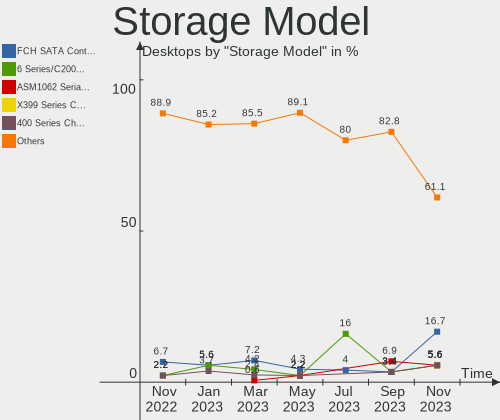
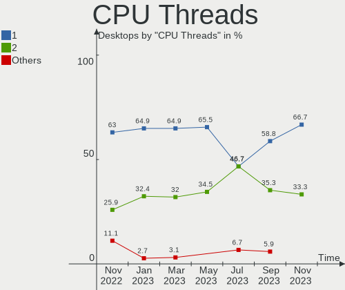
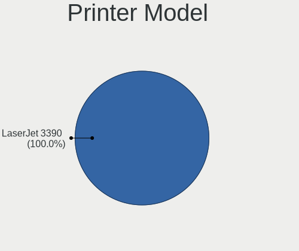

helloSystem - Hardware Trends (Desktops)
----------------------------------------

A project to identify most popular hardware characteristics and track their change
over time based on data collected by BSD users at https://BSD-Hardware.info.

Anyone can contribute to this report by the [hw-probe](https://github.com/linuxhw/hw-probe/blob/master/INSTALL.BSD.md) tool:

    hw-probe -all -upload

This report is for one last month. Overall report since the beginning of time: [TestDays](https://github.com/bsdhw/TestDays)

Period: Apr, 2023.

Contents
--------

* [ System ](#system)
  - [ OS                       ](#os)
  - [ OS Family                ](#os-family)
  - [ Arch                     ](#arch)
  - [ DE                       ](#de)
  - [ Display Server           ](#display-server)
  - [ Display Manager          ](#display-manager)
  - [ OS Lang                  ](#os-lang)
  - [ Boot Mode                ](#boot-mode)
  - [ Filesystem               ](#filesystem)
  - [ Part. scheme             ](#part-scheme)

* [ Board ](#board)
  - [ Vendor                   ](#vendor)
  - [ Model                    ](#model)
  - [ Model Family             ](#model-family)
  - [ MFG Year                 ](#mfg-year)
  - [ Form Factor              ](#form-factor)
  - [ Coreboot                 ](#coreboot)
  - [ RAM Size                 ](#ram-size)
  - [ RAM Used                 ](#ram-used)
  - [ Total Drives             ](#total-drives)
  - [ Has CD-ROM               ](#has-cd-rom)
  - [ Has Ethernet             ](#has-ethernet)
  - [ Has WiFi                 ](#has-wifi)
  - [ Has Bluetooth            ](#has-bluetooth)

* [ Location ](#location)
  - [ Country                  ](#country)
  - [ City                     ](#city)

* [ Drives ](#drives)
  - [ Drive Vendor             ](#drive-vendor)
  - [ Drive Model              ](#drive-model)
  - [ HDD Vendor               ](#hdd-vendor)
  - [ SSD Vendor               ](#ssd-vendor)
  - [ Drive Kind               ](#drive-kind)
  - [ Drive Connector          ](#drive-connector)
  - [ Drive Size               ](#drive-size)
  - [ Space Total              ](#space-total)
  - [ Space Used               ](#space-used)
  - [ Malfunc. Drives          ](#malfunc-drives)
  - [ Malfunc. Drive Vendor    ](#malfunc-drive-vendor)
  - [ Malfunc. HDD Vendor      ](#malfunc-hdd-vendor)
  - [ Malfunc. Drive Kind      ](#malfunc-drive-kind)
  - [ Failed Drives            ](#failed-drives)
  - [ Failed Drive Vendor      ](#failed-drive-vendor)
  - [ Drive Status             ](#drive-status)

* [ Storage controller ](#storage-controller)
  - [ Storage Vendor           ](#storage-vendor)
  - [ Storage Model            ](#storage-model)
  - [ Storage Kind             ](#storage-kind)

* [ Processor ](#processor)
  - [ CPU Vendor               ](#cpu-vendor)
  - [ CPU Model                ](#cpu-model)
  - [ CPU Model Family         ](#cpu-model-family)
  - [ CPU Cores                ](#cpu-cores)
  - [ CPU Sockets              ](#cpu-sockets)
  - [ CPU Threads              ](#cpu-threads)
  - [ CPU Microarch            ](#cpu-microarch)

* [ Graphics ](#graphics)
  - [ GPU Vendor               ](#gpu-vendor)
  - [ GPU Model                ](#gpu-model)
  - [ GPU Combo                ](#gpu-combo)
  - [ GPU Driver               ](#gpu-driver)
  - [ GPU Memory               ](#gpu-memory)

* [ Monitor ](#monitor)
  - [ Monitor Vendor           ](#monitor-vendor)
  - [ Monitor Model            ](#monitor-model)
  - [ Monitor Resolution       ](#monitor-resolution)
  - [ Monitor Diagonal         ](#monitor-diagonal)
  - [ Monitor Width            ](#monitor-width)
  - [ Aspect Ratio             ](#aspect-ratio)
  - [ Monitor Area             ](#monitor-area)
  - [ Pixel Density            ](#pixel-density)
  - [ Multiple Monitors        ](#multiple-monitors)

* [ Network ](#network)
  - [ Net Controller Vendor    ](#net-controller-vendor)
  - [ Net Controller Model     ](#net-controller-model)
  - [ Wireless Vendor          ](#wireless-vendor)
  - [ Wireless Model           ](#wireless-model)
  - [ Ethernet Vendor          ](#ethernet-vendor)
  - [ Ethernet Model           ](#ethernet-model)
  - [ Net Controller Kind      ](#net-controller-kind)
  - [ Used Controller          ](#used-controller)
  - [ NICs                     ](#nics)
  - [ IPv6                     ](#ipv6)

* [ Bluetooth ](#bluetooth)
  - [ Bluetooth Vendor         ](#bluetooth-vendor)
  - [ Bluetooth Model          ](#bluetooth-model)

* [ Sound ](#sound)
  - [ Sound Vendor             ](#sound-vendor)
  - [ Sound Model              ](#sound-model)

* [ Memory ](#memory)
  - [ Memory Vendor            ](#memory-vendor)
  - [ Memory Model             ](#memory-model)
  - [ Memory Kind              ](#memory-kind)
  - [ Memory Form Factor       ](#memory-form-factor)
  - [ Memory Size              ](#memory-size)
  - [ Memory Speed             ](#memory-speed)

* [ Printers & scanners ](#printers--scanners)
  - [ Printer Vendor           ](#printer-vendor)
  - [ Printer Model            ](#printer-model)
  - [ Scanner Vendor           ](#scanner-vendor)
  - [ Scanner Model            ](#scanner-model)

* [ Camera ](#camera)
  - [ Camera Vendor            ](#camera-vendor)
  - [ Camera Model             ](#camera-model)

* [ Security ](#security)
  - [ Fingerprint Vendor       ](#fingerprint-vendor)
  - [ Fingerprint Model        ](#fingerprint-model)
  - [ Chipcard Vendor          ](#chipcard-vendor)
  - [ Chipcard Model           ](#chipcard-model)

* [ Unsupported ](#unsupported)
  - [ Unsupported Devices      ](#unsupported-devices)
  - [ Unsupported Device Types ](#unsupported-device-types)

System
------

OS
--

Installed operating systems

| Name              | Desktops | Percent |
|-------------------|----------|---------|
| helloSystem 0.8.1 | 17       | 68%     |
| helloSystem 0.8.2 | 6        | 24%     |
| helloSystem 0.8.0 | 2        | 8%      |

OS Family
---------

OS without a version

| Name        | Desktops | Percent |
|-------------|----------|---------|
| helloSystem | 25       | 100%    |

Arch
----

OS architecture (x86_64, i586, etc.)

| Name  | Desktops | Percent |
|-------|----------|---------|
| amd64 | 25       | 100%    |

DE
--

Desktop Environment

| Name         | Desktops | Percent |
|--------------|----------|---------|
| helloDesktop | 24       | 96%     |
| GNOME        | 1        | 4%      |

Display Server
--------------

X11 or Wayland

| Name | Desktops | Percent |
|------|----------|---------|
| X11  | 25       | 100%    |

Display Manager
---------------

SDDM, LightDM, etc.

| Name | Desktops | Percent |
|------|----------|---------|
| SLiM | 25       | 100%    |

OS Lang
-------

Language

| Lang    | Desktops | Percent |
|---------|----------|---------|
| en_US   | 10       | 40%     |
| fr_FR   | 6        | 24%     |
| es_ES   | 3        | 12%     |
| en      | 2        | 8%      |
| Unknown | 2        | 8%      |
| ru_RU   | 1        | 4%      |
| it_IT   | 1        | 4%      |

Boot Mode
---------

EFI or BIOS

| Mode | Desktops | Percent |
|------|----------|---------|
| EFI  | 25       | 100%    |

Filesystem
----------

Type of filesystem

| Type   | Desktops | Percent |
|--------|----------|---------|
| Cd9660 | 15       | 60%     |
| Zfs    | 10       | 40%     |

Part. scheme
------------

Scheme of partitioning

| Type | Desktops | Percent |
|------|----------|---------|
| GPT  | 25       | 100%    |

Board
-----

Vendor
------

Motherboard manufacturer

| Name                | Desktops | Percent |
|---------------------|----------|---------|
| ASUSTek Computer    | 7        | 28%     |
| Gigabyte Technology | 6        | 24%     |
| Hewlett-Packard     | 3        | 12%     |
| Dell                | 2        | 8%      |
| ASRock              | 2        | 8%      |
| Acer                | 2        | 8%      |
| Pegatron            | 1        | 4%      |
| NCR                 | 1        | 4%      |
| Lenovo              | 1        | 4%      |

Model
-----

Motherboard model

| Name                              | Desktops | Percent |
|-----------------------------------|----------|---------|
| ASUS PRIME B250M-A                | 2        | 8%      |
| Pegatron Compaq dx2450 Microtower | 1        | 4%      |
| NCR 7703-1515-8801                | 1        | 4%      |
| Lenovo ThinkCentre M75e 5065A11   | 1        | 4%      |
| HP EliteDesk 800 G2 DM 65W        | 1        | 4%      |
| HP EliteDesk 800 G2 DM 35W        | 1        | 4%      |
| HP Compaq Elite 8300 SFF          | 1        | 4%      |
| Gigabyte M52L-S3P                 | 1        | 4%      |
| Gigabyte H81M-S2PH                | 1        | 4%      |
| Gigabyte H61M-S2PH                | 1        | 4%      |
| Gigabyte F2A85X-UP4               | 1        | 4%      |
| Gigabyte B450M DS3H V2            | 1        | 4%      |
| Gigabyte A520M DS3H AC            | 1        | 4%      |
| Dell Precision Tower 3420         | 1        | 4%      |
| Dell Inspiron 3910                | 1        | 4%      |
| ASUS ROG STRIX Z590-F GAMING WIFI | 1        | 4%      |
| ASUS ROG STRIX B550-F GAMING      | 1        | 4%      |
| ASUS ROG CROSSHAIR VIII HERO      | 1        | 4%      |
| ASUS PRIME B550M-A WIFI II        | 1        | 4%      |
| ASUS H61M-K                       | 1        | 4%      |
| ASRock X370 Pro4                  | 1        | 4%      |
| ASRock AB350M Pro4-F              | 1        | 4%      |
| Acer Veriton M6620G               | 1        | 4%      |
| Acer Aspire 5315                  | 1        | 4%      |

Model Family
------------

Motherboard model prefix

| Name                | Desktops | Percent |
|---------------------|----------|---------|
| ASUS ROG            | 3        | 12%     |
| ASUS PRIME          | 3        | 12%     |
| HP EliteDesk        | 2        | 8%      |
| Pegatron Compaq     | 1        | 4%      |
| NCR 7703-1515-8801  | 1        | 4%      |
| Lenovo ThinkCentre  | 1        | 4%      |
| HP Compaq           | 1        | 4%      |
| Gigabyte M52L-S3P   | 1        | 4%      |
| Gigabyte H81M-S2PH  | 1        | 4%      |
| Gigabyte H61M-S2PH  | 1        | 4%      |
| Gigabyte F2A85X-UP4 | 1        | 4%      |
| Gigabyte B450M      | 1        | 4%      |
| Gigabyte A520M      | 1        | 4%      |
| Dell Precision      | 1        | 4%      |
| Dell Inspiron       | 1        | 4%      |
| ASUS H61M-K         | 1        | 4%      |
| ASRock X370         | 1        | 4%      |
| ASRock AB350M       | 1        | 4%      |
| Acer Veriton        | 1        | 4%      |
| Acer Aspire         | 1        | 4%      |

MFG Year
--------

Motherboard manufacture year

| Year | Desktops | Percent |
|------|----------|---------|
| 2022 | 5        | 20%     |
| 2020 | 2        | 8%      |
| 2018 | 2        | 8%      |
| 2017 | 2        | 8%      |
| 2014 | 2        | 8%      |
| 2013 | 2        | 8%      |
| 2012 | 2        | 8%      |
| 2008 | 2        | 8%      |
| 2023 | 1        | 4%      |
| 2021 | 1        | 4%      |
| 2019 | 1        | 4%      |
| 2016 | 1        | 4%      |
| 2011 | 1        | 4%      |
| 2010 | 1        | 4%      |

Form Factor
-----------

Physical design of the computer

| Name    | Desktops | Percent |
|---------|----------|---------|
| Desktop | 25       | 100%    |

Coreboot
--------

Have coreboot on board

| Used | Desktops | Percent |
|------|----------|---------|
| No   | 25       | 100%    |

RAM Size
--------

Total RAM memory

| Size in GB  | Desktops | Percent |
|-------------|----------|---------|
| 8.01-16.0   | 8        | 32%     |
| 16.01-24.0  | 7        | 28%     |
| 32.01-64.0  | 4        | 16%     |
| 4.01-8.0    | 2        | 8%      |
| 2.01-3.0    | 2        | 8%      |
| 64.01-256.0 | 2        | 8%      |

RAM Used
--------

Used RAM memory

| Used GB  | Desktops | Percent |
|----------|----------|---------|
| 0.51-1.0 | 9        | 36%     |
| 0.01-0.5 | 8        | 32%     |
| 1.01-2.0 | 6        | 24%     |
| 3.01-4.0 | 1        | 4%      |
| 2.01-3.0 | 1        | 4%      |

Total Drives
------------

Number of drives on board

| Drives | Desktops | Percent |
|--------|----------|---------|
| 2      | 8        | 32%     |
| 1      | 8        | 32%     |
| 3      | 3        | 12%     |
| 4      | 2        | 8%      |
| 0      | 2        | 8%      |
| 10     | 1        | 4%      |
| 9      | 1        | 4%      |

Has CD-ROM
----------

Has CD-ROM on board

| Presented | Desktops | Percent |
|-----------|----------|---------|
| No        | 18       | 72%     |
| Yes       | 7        | 28%     |

Has Ethernet
------------

Has Ethernet on board

| Presented | Desktops | Percent |
|-----------|----------|---------|
| Yes       | 22       | 88%     |
| No        | 3        | 12%     |

Has WiFi
--------

Has WiFi module

| Presented | Desktops | Percent |
|-----------|----------|---------|
| No        | 16       | 64%     |
| Yes       | 9        | 36%     |

Has Bluetooth
-------------

Has Bluetooth module

| Presented | Desktops | Percent |
|-----------|----------|---------|
| No        | 15       | 60%     |
| Yes       | 10       | 40%     |

Location
--------

Country
-------

Geographic location (country)

| Country     | Desktops | Percent |
|-------------|----------|---------|
| USA         | 6        | 24%     |
| Canada      | 3        | 12%     |
| Spain       | 2        | 8%      |
| China       | 2        | 8%      |
| Vietnam     | 1        | 4%      |
| San Marino  | 1        | 4%      |
| Russia      | 1        | 4%      |
| Romania     | 1        | 4%      |
| Peru        | 1        | 4%      |
| Paraguay    | 1        | 4%      |
| Netherlands | 1        | 4%      |
| Hungary     | 1        | 4%      |
| Brazil      | 1        | 4%      |
| Belgium     | 1        | 4%      |
| Australia   | 1        | 4%      |
| Argentina   | 1        | 4%      |

City
----

Geographic location (city)

| City              | Desktops | Percent |
|-------------------|----------|---------|
| St. Jean Baptiste | 3        | 12%     |
| Zhengzhou         | 1        | 4%      |
| Union Grove       | 1        | 4%      |
| Tucson            | 1        | 4%      |
| Timișoara        | 1        | 4%      |
| Saratov           | 1        | 4%      |
| Río Cuarto       | 1        | 4%      |
| Ribeirao Preto    | 1        | 4%      |
| Portage           | 1        | 4%      |
| Melbourne         | 1        | 4%      |
| Mechelen          | 1        | 4%      |
| Marbella          | 1        | 4%      |
| Manchester        | 1        | 4%      |
| Huamachuco        | 1        | 4%      |
| Hanoi             | 1        | 4%      |
| Guangzhou         | 1        | 4%      |
| Glendale          | 1        | 4%      |
| Eindhoven         | 1        | 4%      |
| Domagnano         | 1        | 4%      |
| Columbus          | 1        | 4%      |
| Budapest          | 1        | 4%      |
| Asunción         | 1        | 4%      |
| Antequera         | 1        | 4%      |

Drives
------

Drive Vendor
------------

Hard drive vendors

| Vendor              | Desktops | Drives | Percent |
|---------------------|----------|--------|---------|
| Seagate             | 9        | 9      | 20.45%  |
| WDC                 | 7        | 8      | 15.91%  |
| Samsung Electronics | 6        | 14     | 13.64%  |
| Kingston            | 5        | 5      | 11.36%  |
| Toshiba             | 3        | 3      | 6.82%   |
| Hitachi             | 2        | 2      | 4.55%   |
| Transcend           | 1        | 1      | 2.27%   |
| SPCC                | 1        | 6      | 2.27%   |
| Silicon Motion      | 1        | 1      | 2.27%   |
| SanDisk             | 1        | 1      | 2.27%   |
| Patriot             | 1        | 1      | 2.27%   |
| Mushkin             | 1        | 4      | 2.27%   |
| Micron Technology   | 1        | 1      | 2.27%   |
| Maxtor              | 1        | 1      | 2.27%   |
| KIOXIA-EXCERIA      | 1        | 1      | 2.27%   |
| KIOXIA              | 1        | 1      | 2.27%   |
| Corsair             | 1        | 1      | 2.27%   |
| A-DATA Technology   | 1        | 1      | 2.27%   |

Drive Model
-----------

Hard drive models

| Model                                     | Desktops | Percent |
|-------------------------------------------|----------|---------|
| WDC WDBNCE5000PNC 500GB                   | 1        | 1.96%   |
| WDC WD60EZRX-00MVLB1 6TB                  | 1        | 1.96%   |
| WDC WD5000AAKX-08U6AA0 500GB              | 1        | 1.96%   |
| WDC WD40EZAZ-00ZGHB0 4TB                  | 1        | 1.96%   |
| WDC WD40EFRX-68WT0N0 4TB                  | 1        | 1.96%   |
| WDC WD3200AAJS-00L7A0 320GB               | 1        | 1.96%   |
| WDC WD1600BEVT-22ZCT0 160GB               | 1        | 1.96%   |
| WDC WD1600AAJS-60Z0A0 160GB               | 1        | 1.96%   |
| Transcend TS256GSSD340 256GB              | 1        | 1.96%   |
| Toshiba MQ01ACF050 500GB                  | 1        | 1.96%   |
| Toshiba DT01ACA100 1TB                    | 1        | 1.96%   |
| Toshiba DT01ACA050 500GB                  | 1        | 1.96%   |
| SPCC Solid State Disk 2TB                 | 1        | 1.96%   |
| Silicon Motion Asgard AN1TNVMe-M.2-80 1TB | 1        | 1.96%   |
| Seagate ST500DM002-1BD142 500GB           | 1        | 1.96%   |
| Seagate ST3500418AS 500GB                 | 1        | 1.96%   |
| Seagate ST3320620AS 320GB                 | 1        | 1.96%   |
| Seagate ST3160815AS 160GB                 | 1        | 1.96%   |
| Seagate ST2000DM008-2FR102 2TB            | 1        | 1.96%   |
| Seagate ST1000VM002-1SD102 1TB            | 1        | 1.96%   |
| Seagate ST1000LM024 HN-M101MBB 1TB        | 1        | 1.96%   |
| Seagate ST1000DM010-2EP102 1TB            | 1        | 1.96%   |
| Seagate ST1000DM003-1ER162 1TB            | 1        | 1.96%   |
| SanDisk SSD PLUS 120GB                    | 1        | 1.96%   |
| Samsung SSD 980 1TB                       | 1        | 1.96%   |
| Samsung SSD 970 PRO 512GB                 | 1        | 1.96%   |
| Samsung SSD 970 EVO Plus 2TB              | 1        | 1.96%   |
| Samsung SSD 970 EVO Plus 1TB              | 1        | 1.96%   |
| Samsung SSD 870 EVO 500GB                 | 1        | 1.96%   |
| Samsung SSD 870 EVO 2TB                   | 1        | 1.96%   |
| Samsung SSD 860 EVO 500GB                 | 1        | 1.96%   |
| Samsung SSD 860 EVO 1TB                   | 1        | 1.96%   |
| Samsung SSD 850 PRO 512GB                 | 1        | 1.96%   |
| Samsung SSD 850 PRO 1TB                   | 1        | 1.96%   |
| Samsung SSD 840 Series 500GB              | 1        | 1.96%   |
| Samsung HM320JI 320GB                     | 1        | 1.96%   |
| Patriot Burst 240GB                       | 1        | 1.96%   |
| Mushkin MKNSSDSR500GB                     | 1        | 1.96%   |
| Micron 2450 NVMe 256GB                    | 1        | 1.96%   |
| Maxtor STM3320820AS 320GB                 | 1        | 1.96%   |

HDD Vendor
----------

Hard disk drive vendors

| Vendor              | Desktops | Drives | Percent |
|---------------------|----------|--------|---------|
| Seagate             | 9        | 9      | 40.91%  |
| WDC                 | 6        | 7      | 27.27%  |
| Toshiba             | 3        | 3      | 13.64%  |
| Hitachi             | 2        | 2      | 9.09%   |
| Samsung Electronics | 1        | 1      | 4.55%   |
| Maxtor              | 1        | 1      | 4.55%   |

SSD Vendor
----------

Solid state drive vendors

| Vendor              | Desktops | Drives | Percent |
|---------------------|----------|--------|---------|
| Kingston            | 4        | 4      | 26.67%  |
| Samsung Electronics | 3        | 8      | 20%     |
| WDC                 | 1        | 1      | 6.67%   |
| Transcend           | 1        | 1      | 6.67%   |
| SPCC                | 1        | 6      | 6.67%   |
| SanDisk             | 1        | 1      | 6.67%   |
| Patriot             | 1        | 1      | 6.67%   |
| Mushkin             | 1        | 4      | 6.67%   |
| KIOXIA-EXCERIA      | 1        | 1      | 6.67%   |
| A-DATA Technology   | 1        | 1      | 6.67%   |

Drive Kind
----------

HDD or SSD

| Kind | Desktops | Drives | Percent |
|------|----------|--------|---------|
| HDD  | 18       | 23     | 48.65%  |
| SSD  | 12       | 28     | 32.43%  |
| NVMe | 7        | 10     | 18.92%  |

Drive Connector
---------------

SATA, SAS, NVMe, etc.

| Type | Desktops | Drives | Percent |
|------|----------|--------|---------|
| SATA | 23       | 51     | 76.67%  |
| NVMe | 7        | 10     | 23.33%  |

Drive Size
----------

Size of hard drive

| Size in TB | Desktops | Drives | Percent |
|------------|----------|--------|---------|
| 0.01-0.5   | 19       | 28     | 57.58%  |
| 0.51-1.0   | 7        | 9      | 21.21%  |
| 1.01-2.0   | 3        | 5      | 9.09%   |
| 3.01-4.0   | 2        | 2      | 6.06%   |
| 2.01-3.0   | 1        | 6      | 3.03%   |
| 4.01-10.0  | 1        | 1      | 3.03%   |

Space Total
-----------

Amount of disk space available on the file system

| Size in GB | Desktops | Percent |
|------------|----------|---------|
| 1-20       | 10       | 40%     |
| 251-500    | 5        | 20%     |
| 101-250    | 5        | 20%     |
| 1001-2000  | 2        | 8%      |
| 501-1000   | 2        | 8%      |
| 51-100     | 1        | 4%      |

Space Used
----------

Amount of used disk space

| Used GB | Desktops | Percent |
|---------|----------|---------|
| 1-20    | 22       | 88%     |
| 101-250 | 2        | 8%      |
| 21-50   | 1        | 4%      |

Malfunc. Drives
---------------

Drive models with a malfunction

| Model                                     | Desktops | Drives | Percent |
|-------------------------------------------|----------|--------|---------|
| WDC WD1600AAJS-60Z0A0 160GB               | 1        | 1      | 11.11%  |
| Toshiba MQ01ACF050 500GB                  | 1        | 1      | 11.11%  |
| Toshiba DT01ACA050 500GB                  | 1        | 1      | 11.11%  |
| Silicon Motion Asgard AN1TNVMe-M.2-80 1TB | 1        | 1      | 11.11%  |
| Seagate ST500DM002-1BD142 500GB           | 1        | 1      | 11.11%  |
| Seagate ST3500418AS 500GB                 | 1        | 1      | 11.11%  |
| Seagate ST3320620AS 320GB                 | 1        | 1      | 11.11%  |
| Samsung Electronics HM320JI 320GB         | 1        | 1      | 11.11%  |
| Hitachi HDS721616PLA380 160GB             | 1        | 1      | 11.11%  |

Malfunc. Drive Vendor
---------------------

Vendors of faulty drives

| Vendor              | Desktops | Drives | Percent |
|---------------------|----------|--------|---------|
| Seagate             | 3        | 3      | 33.33%  |
| Toshiba             | 2        | 2      | 22.22%  |
| WDC                 | 1        | 1      | 11.11%  |
| Silicon Motion      | 1        | 1      | 11.11%  |
| Samsung Electronics | 1        | 1      | 11.11%  |
| Hitachi             | 1        | 1      | 11.11%  |

Malfunc. HDD Vendor
-------------------

Vendors of faulty HDD drives

| Vendor              | Desktops | Drives | Percent |
|---------------------|----------|--------|---------|
| Seagate             | 3        | 3      | 37.5%   |
| Toshiba             | 2        | 2      | 25%     |
| WDC                 | 1        | 1      | 12.5%   |
| Samsung Electronics | 1        | 1      | 12.5%   |
| Hitachi             | 1        | 1      | 12.5%   |

Malfunc. Drive Kind
-------------------

Kinds of faulty drives

| Kind | Desktops | Drives | Percent |
|------|----------|--------|---------|
| HDD  | 6        | 8      | 85.71%  |
| NVMe | 1        | 1      | 14.29%  |

Failed Drives
-------------

Failed drive models

| Model                       | Desktops | Drives | Percent |
|-----------------------------|----------|--------|---------|
| WDC WD1600BEVT-22ZCT0 160GB | 1        | 1      | 100%    |

Failed Drive Vendor
-------------------

Failed drive vendors

| Vendor | Desktops | Drives | Percent |
|--------|----------|--------|---------|
| WDC    | 1        | 1      | 100%    |

Drive Status
------------

Number of failed and malfunc. drives

| Status  | Desktops | Drives | Percent |
|---------|----------|--------|---------|
| Works   | 20       | 51     | 71.43%  |
| Malfunc | 7        | 9      | 25%     |
| Failed  | 1        | 1      | 3.57%   |

Storage controller
------------------

Storage Vendor
--------------

Storage controller vendors

| Vendor                      | Desktops | Percent |
|-----------------------------|----------|---------|
| Intel                       | 14       | 37.84%  |
| AMD                         | 9        | 24.32%  |
| Samsung Electronics         | 3        | 8.11%   |
| ASMedia Technology          | 3        | 8.11%   |
| Sandisk                     | 2        | 5.41%   |
| Nvidia                      | 2        | 5.41%   |
| Phison Electronics          | 1        | 2.7%    |
| Micron Technology           | 1        | 2.7%    |
| KIOXIA                      | 1        | 2.7%    |
| Kingston Technology Company | 1        | 2.7%    |

Storage Model
-------------

Storage controller models

| Model                                                                                   | Desktops | Percent |
|-----------------------------------------------------------------------------------------|----------|---------|
| Intel Q170/Q150/B150/H170/H110/Z170/CM236 Chipset SATA Controller [AHCI Mode]           | 4        | 9.3%    |
| AMD FCH SATA Controller [AHCI mode]                                                     | 4        | 9.3%    |
| AMD 500 Series Chipset SATA Controller                                                  | 3        | 6.98%   |
| Samsung NVMe SSD Controller SM981/PM981/PM983                                           | 2        | 4.65%   |
| Nvidia MCP61 SATA Controller                                                            | 2        | 4.65%   |
| Intel 200 Series PCH SATA controller [AHCI mode]                                        | 2        | 4.65%   |
| SanDisk WD Blue SN570 NVMe SSD 1TB                                                      | 1        | 2.33%   |
| Sandisk WD Black SN770 NVMe SSD                                                         | 1        | 2.33%   |
| Samsung NVMe SSD Controller 980                                                         | 1        | 2.33%   |
| Nvidia MCP61 IDE                                                                        | 1        | 2.33%   |
| Micron NVMe Storage Controller                                                          | 1        | 2.33%   |
| KIOXIA NVMe SSD Controller BG4                                                          | 1        | 2.33%   |
| Kingston Company NVMe Controller                                                        | 1        | 2.33%   |
| Intel Volume Management Device NVMe RAID Controller                                     | 1        | 2.33%   |
| Intel SATA Controller [RAID mode]                                                       | 1        | 2.33%   |
| Intel Alder Lake-S PCH SATA Controller [AHCI Mode]                                      | 1        | 2.33%   |
| Intel 82801HM/HEM (ICH8M/ICH8M-E) SATA Controller [AHCI mode]                           | 1        | 2.33%   |
| Intel 82801HM/HEM (ICH8M/ICH8M-E) IDE Controller                                        | 1        | 2.33%   |
| Intel 8 Series/C220 Series Chipset Family 6-port SATA Controller 1 [AHCI mode]          | 1        | 2.33%   |
| Intel 7 Series/C210 Series Chipset Family 6-port SATA Controller [AHCI mode]            | 1        | 2.33%   |
| Intel 6 Series/C200 Series Chipset Family Desktop SATA Controller (IDE mode, ports 4-5) | 1        | 2.33%   |
| Intel 6 Series/C200 Series Chipset Family Desktop SATA Controller (IDE mode, ports 0-3) | 1        | 2.33%   |
| Intel 6 Series/C200 Series Chipset Family 6 port Desktop SATA AHCI Controller           | 1        | 2.33%   |
| Intel 500 Series Chipset Family SATA AHCI Controller                                    | 1        | 2.33%   |
| ASMedia ASM1166 Serial ATA Controller                                                   | 1        | 2.33%   |
| ASMedia ASM1062 Serial ATA Controller                                                   | 1        | 2.33%   |
| ASMedia 106x SATA/RAID Controller                                                       | 1        | 2.33%   |
| AMD X370 Series Chipset SATA Controller                                                 | 1        | 2.33%   |
| AMD SB7x0/SB8x0/SB9x0 SATA Controller [AHCI mode]                                       | 1        | 2.33%   |
| AMD 400 Series Chipset SATA Controller                                                  | 1        | 2.33%   |
| AMD 300 Series Chipset SATA Controller                                                  | 1        | 2.33%   |
| Unknown                                                                                 | 1        | 2.33%   |

Storage Kind
------------

Kind of storage controller (IDE, SATA, NVMe, SAS, ...)

| Kind | Desktops | Percent |
|------|----------|---------|
| SATA | 21       | 60%     |
| NVMe | 8        | 22.86%  |
| IDE  | 4        | 11.43%  |
| RAID | 2        | 5.71%   |

Processor
---------

CPU Vendor
----------

Processor vendors

| Vendor | Desktops | Percent |
|--------|----------|---------|
| Intel  | 14       | 56%     |
| AMD    | 11       | 44%     |

CPU Model
---------

Processor models

| Model                                       | Desktops | Percent |
|---------------------------------------------|----------|---------|
| Intel Core i5-7400 CPU @ 3.00GHz            | 2        | 8%      |
| Intel Xeon CPU E3-1270 v5 @ 3.60GHz         | 1        | 4%      |
| Intel Core i9-10900 CPU @ 2.80GHz           | 1        | 4%      |
| Intel Core i7-6700T CPU @ 2.80GHz           | 1        | 4%      |
| Intel Core i7-3770 CPU @ 3.40GHz            | 1        | 4%      |
| Intel Core i5-6500TE CPU @ 2.30GHz          | 1        | 4%      |
| Intel Core i5-6500 CPU @ 3.20GHz            | 1        | 4%      |
| Intel Core i5-3570 CPU @ 3.40GHz            | 1        | 4%      |
| Intel Core i5-3470S CPU @ 2.90GHz           | 1        | 4%      |
| Intel Core i5-3330 CPU @ 3.00GHz            | 1        | 4%      |
| Intel Core i3-4160 CPU @ 3.60GHz            | 1        | 4%      |
| Intel Celeron CPU 560 @ 2.13GHz             | 1        | 4%      |
| Intel 12th Gen Core i5-12400                | 1        | 4%      |
| AMD Ryzen 9 5950X 16-Core Processor         | 1        | 4%      |
| AMD Ryzen 9 5900X 12-Core Processor         | 1        | 4%      |
| AMD Ryzen 7 5700G with Radeon Graphics      | 1        | 4%      |
| AMD Ryzen 5 5600 6-Core Processor           | 1        | 4%      |
| AMD Ryzen 5 3400G with Radeon Vega Graphics | 1        | 4%      |
| AMD Ryzen 5 1600 Six-Core Processor         | 1        | 4%      |
| AMD Ryzen 3 3100 4-Core Processor           | 1        | 4%      |
| AMD Athlon X2 240 Processor                 | 1        | 4%      |
| AMD Athlon II X2 250 Processor              | 1        | 4%      |
| AMD Athlon II X2 215 Processor              | 1        | 4%      |
| AMD A10-6800K APU with Radeon HD Graphics   | 1        | 4%      |

CPU Model Family
----------------

Processor model prefix

| Model            | Desktops | Percent |
|------------------|----------|---------|
| Intel Core i5    | 7        | 28%     |
| AMD Ryzen 5      | 3        | 12%     |
| Intel Core i7    | 2        | 8%      |
| AMD Ryzen 9      | 2        | 8%      |
| AMD Athlon II X2 | 2        | 8%      |
| Other            | 1        | 4%      |
| Intel Xeon       | 1        | 4%      |
| Intel Core i9    | 1        | 4%      |
| Intel Core i3    | 1        | 4%      |
| Intel Celeron    | 1        | 4%      |
| AMD Ryzen 7      | 1        | 4%      |
| AMD Ryzen 3      | 1        | 4%      |
| AMD Athlon X2    | 1        | 4%      |
| AMD A10          | 1        | 4%      |

CPU Cores
---------

Number of processor cores

| Number | Desktops | Percent |
|--------|----------|---------|
| 4      | 11       | 44%     |
| 2      | 4        | 16%     |
| 12     | 2        | 8%      |
| 8      | 2        | 8%      |
| 32     | 1        | 4%      |
| 24     | 1        | 4%      |
| 16     | 1        | 4%      |
| 10     | 1        | 4%      |
| 6      | 1        | 4%      |
| 1      | 1        | 4%      |

CPU Sockets
-----------

Number of sockets

| Number | Desktops | Percent |
|--------|----------|---------|
| 1      | 25       | 100%    |

CPU Threads
-----------

Threads per core (Hyper-Threading)

| Number  | Desktops | Percent |
|---------|----------|---------|
| 1       | 18       | 72%     |
| 2       | 6        | 24%     |
| Unknown | 1        | 4%      |

CPU Microarch
-------------

Microarchitecture

| Name       | Desktops | Percent |
|------------|----------|---------|
| Zen 3      | 4        | 16%     |
| Skylake    | 4        | 16%     |
| IvyBridge  | 4        | 16%     |
| K10        | 3        | 12%     |
| KabyLake   | 2        | 8%      |
| Zen+       | 1        | 4%      |
| Zen 2      | 1        | 4%      |
| Zen        | 1        | 4%      |
| Piledriver | 1        | 4%      |
| Haswell    | 1        | 4%      |
| Core       | 1        | 4%      |
| CometLake  | 1        | 4%      |
| Unknown    | 1        | 4%      |

Graphics
--------

GPU Vendor
----------

Vendors of graphics cards

| Vendor | Desktops | Percent |
|--------|----------|---------|
| Intel  | 12       | 44.44%  |
| AMD    | 9        | 33.33%  |
| Nvidia | 6        | 22.22%  |

GPU Model
---------

Graphics card models

| Model                                                                     | Desktops | Percent |
|---------------------------------------------------------------------------|----------|---------|
| Intel HD Graphics 530                                                     | 3        | 10.71%  |
| Intel Xeon E3-1200 v2/3rd Gen Core processor Graphics Controller          | 2        | 7.14%   |
| Intel HD Graphics 630                                                     | 2        | 7.14%   |
| AMD Navi 23 [Radeon RX 6650 XT / 6700S / 6800S]                           | 2        | 7.14%   |
| Nvidia TU116 [GeForce GTX 1660 SUPER]                                     | 1        | 3.57%   |
| Nvidia GM107 [GeForce GTX 750 Ti]                                         | 1        | 3.57%   |
| Nvidia GK208B [GeForce GT 710]                                            | 1        | 3.57%   |
| Nvidia GK107 [GeForce GTX 650]                                            | 1        | 3.57%   |
| Nvidia G94 [GeForce 9600 GT]                                              | 1        | 3.57%   |
| Nvidia G72 [GeForce 7300 LE]                                              | 1        | 3.57%   |
| Intel Mobile GM965/GL960 Integrated Graphics Controller (secondary)       | 1        | 3.57%   |
| Intel Mobile GM965/GL960 Integrated Graphics Controller (primary)         | 1        | 3.57%   |
| Intel IvyBridge GT2 [HD Graphics 4000]                                    | 1        | 3.57%   |
| Intel DG2 [Arc A770]                                                      | 1        | 3.57%   |
| Intel Alder Lake-S GT1 [UHD Graphics 730]                                 | 1        | 3.57%   |
| Intel 4th Generation Core Processor Family Integrated Graphics Controller | 1        | 3.57%   |
| AMD Richland [Radeon HD 8670D]                                            | 1        | 3.57%   |
| AMD Picasso/Raven 2 [Radeon Vega Series / Radeon Vega Mobile Series]      | 1        | 3.57%   |
| AMD Oland [Radeon HD 8570 / R5 430 OEM / R7 240/340 / Radeon 520 OEM]     | 1        | 3.57%   |
| AMD Oland PRO [Radeon R7 240/340 / Radeon 520]                            | 1        | 3.57%   |
| AMD Ellesmere [Radeon RX 470/480/570/570X/580/580X/590]                   | 1        | 3.57%   |
| AMD Cape Verde GL [FirePro W4100]                                         | 1        | 3.57%   |
| AMD Baffin [Radeon RX 550 640SP / RX 560/560X]                            | 1        | 3.57%   |

GPU Combo
---------

Combinations of graphics cards

| Name        | Desktops | Percent |
|-------------|----------|---------|
| 1 x Intel   | 9        | 36%     |
| 1 x AMD     | 7        | 28%     |
| 1 x Nvidia  | 6        | 24%     |
| Intel + AMD | 2        | 8%      |
| 2 x Intel   | 1        | 4%      |

GPU Driver
----------

Free vs proprietary

| Driver      | Desktops | Percent |
|-------------|----------|---------|
| Free        | 20       | 80%     |
| Proprietary | 4        | 16%     |
| Unknown     | 1        | 4%      |

GPU Memory
----------

Total video memory

| Size in GB | Desktops | Percent |
|------------|----------|---------|
| Unknown    | 17       | 68%     |
| 3.01-4.0   | 2        | 8%      |
| 1.01-2.0   | 2        | 8%      |
| 7.01-8.0   | 1        | 4%      |
| 5.01-6.0   | 1        | 4%      |
| 0.51-1.0   | 1        | 4%      |
| 0.01-0.5   | 1        | 4%      |

Monitor
-------

Monitor Vendor
--------------

Monitor vendors

| Vendor         | Desktops | Percent |
|----------------|----------|---------|
| LG Electronics | 1        | 50%     |
| Unknown        | 1        | 50%     |

Monitor Model
-------------

Monitor models

| Model                                           | Desktops | Percent |
|-------------------------------------------------|----------|---------|
| LG Electronics LCD Monitor LG FULL HD 1920x1080 | 1        | 50%     |
| Unknown                                         | 1        | 50%     |

Monitor Resolution
------------------

Monitor screen resolution

| Resolution      | Desktops | Percent |
|-----------------|----------|---------|
| 1920x1080 (FHD) | 1        | 50%     |
| 1366x768 (WXGA) | 1        | 50%     |

Monitor Diagonal
----------------

Diagonal size in inches

| Inches  | Desktops | Percent |
|---------|----------|---------|
| Unknown | 2        | 100%    |

Monitor Width
-------------

Physical width

| Width in mm | Desktops | Percent |
|-------------|----------|---------|
| Unknown     | 2        | 100%    |

Aspect Ratio
------------

Proportional relationship between the width and the height

| Ratio   | Desktops | Percent |
|---------|----------|---------|
| Unknown | 2        | 100%    |

Monitor Area
------------

Area in inch²

| Area in inch² | Desktops | Percent |
|----------------|----------|---------|
| Unknown        | 2        | 100%    |

Pixel Density
-------------

Pixels per inch

| Density | Desktops | Percent |
|---------|----------|---------|
| Unknown | 2        | 100%    |

Multiple Monitors
-----------------

Total monitors connected

| Total | Desktops | Percent |
|-------|----------|---------|
| 1     | 17       | 68%     |
| 0     | 8        | 32%     |

Network
-------

Net Controller Vendor
---------------------

Controller vendors

| Vendor                   | Desktops | Percent |
|--------------------------|----------|---------|
| Realtek Semiconductor    | 13       | 44.83%  |
| Intel                    | 11       | 37.93%  |
| Ralink                   | 1        | 3.45%   |
| MediaTek                 | 1        | 3.45%   |
| Marvell Technology Group | 1        | 3.45%   |
| Broadcom                 | 1        | 3.45%   |
| Belkin Components        | 1        | 3.45%   |

Net Controller Model
--------------------

Controller models

| Model                                                              | Desktops | Percent |
|--------------------------------------------------------------------|----------|---------|
| Realtek RTL8111/8168/8411 PCI Express Gigabit Ethernet Controller  | 10       | 30.3%   |
| Intel Ethernet Connection (2) I219-LM                              | 4        | 12.12%  |
| Intel Ethernet Controller I225-V                                   | 2        | 6.06%   |
| Intel 82579LM Gigabit Network Connection (Lewisville)              | 2        | 6.06%   |
| Realtek RTL8188EUS 802.11n Wireless Network Adapter                | 1        | 3.03%   |
| Realtek RTL8125 2.5GbE Controller                                  | 1        | 3.03%   |
| Realtek RTL-8100/8101L/8139 PCI Fast Ethernet Adapter              | 1        | 3.03%   |
| Ralink RT3290 Wireless 802.11n 1T/1R PCIe                          | 1        | 3.03%   |
| MediaTek MT7921 802.11ax PCI Express Wireless Network Adapter      | 1        | 3.03%   |
| Marvell Group 88E8057 PCI-E Gigabit Ethernet Controller            | 1        | 3.03%   |
| Intel Wireless 7260                                                | 1        | 3.03%   |
| Intel Wi-Fi 6 AX210/AX211/AX411 160MHz                             | 1        | 3.03%   |
| Intel Wi-Fi 6 AX200                                                | 1        | 3.03%   |
| Intel I211 Gigabit Network Connection                              | 1        | 3.03%   |
| Intel Dual Band Wireless-AC 3168NGW [Stone Peak]                   | 1        | 3.03%   |
| Intel Alder Lake-S PCH CNVi WiFi                                   | 1        | 3.03%   |
| Broadcom NetLink BCM5906M Fast Ethernet PCI Express                | 1        | 3.03%   |
| Broadcom BCM4312 802.11b/g LP-PHY                                  | 1        | 3.03%   |
| Belkin Components F5D7050 Wireless G Adapter v4000 [Zydas ZD1211B] | 1        | 3.03%   |

Wireless Vendor
---------------

Wireless vendors

| Vendor                | Desktops | Percent |
|-----------------------|----------|---------|
| Intel                 | 5        | 50%     |
| Realtek Semiconductor | 1        | 10%     |
| Ralink                | 1        | 10%     |
| MediaTek              | 1        | 10%     |
| Broadcom              | 1        | 10%     |
| Belkin Components     | 1        | 10%     |

Wireless Model
--------------

Wireless models

| Model                                                              | Desktops | Percent |
|--------------------------------------------------------------------|----------|---------|
| Realtek RTL8188EUS 802.11n Wireless Network Adapter                | 1        | 10%     |
| Ralink RT3290 Wireless 802.11n 1T/1R PCIe                          | 1        | 10%     |
| MediaTek MT7921 802.11ax PCI Express Wireless Network Adapter      | 1        | 10%     |
| Intel Wireless 7260                                                | 1        | 10%     |
| Intel Wi-Fi 6 AX210/AX211/AX411 160MHz                             | 1        | 10%     |
| Intel Wi-Fi 6 AX200                                                | 1        | 10%     |
| Intel Dual Band Wireless-AC 3168NGW [Stone Peak]                   | 1        | 10%     |
| Intel Alder Lake-S PCH CNVi WiFi                                   | 1        | 10%     |
| Broadcom BCM4312 802.11b/g LP-PHY                                  | 1        | 10%     |
| Belkin Components F5D7050 Wireless G Adapter v4000 [Zydas ZD1211B] | 1        | 10%     |

Ethernet Vendor
---------------

Ethernet vendors

| Vendor                   | Desktops | Percent |
|--------------------------|----------|---------|
| Realtek Semiconductor    | 12       | 52.17%  |
| Intel                    | 9        | 39.13%  |
| Marvell Technology Group | 1        | 4.35%   |
| Broadcom                 | 1        | 4.35%   |

Ethernet Model
--------------

Ethernet models

| Model                                                             | Desktops | Percent |
|-------------------------------------------------------------------|----------|---------|
| Realtek RTL8111/8168/8411 PCI Express Gigabit Ethernet Controller | 10       | 43.48%  |
| Intel Ethernet Connection (2) I219-LM                             | 4        | 17.39%  |
| Intel Ethernet Controller I225-V                                  | 2        | 8.7%    |
| Intel 82579LM Gigabit Network Connection (Lewisville)             | 2        | 8.7%    |
| Realtek RTL8125 2.5GbE Controller                                 | 1        | 4.35%   |
| Realtek RTL-8100/8101L/8139 PCI Fast Ethernet Adapter             | 1        | 4.35%   |
| Marvell Group 88E8057 PCI-E Gigabit Ethernet Controller           | 1        | 4.35%   |
| Intel I211 Gigabit Network Connection                             | 1        | 4.35%   |
| Broadcom NetLink BCM5906M Fast Ethernet PCI Express               | 1        | 4.35%   |

Net Controller Kind
-------------------

Ethernet, WiFi or modem

| Kind     | Desktops | Percent |
|----------|----------|---------|
| Ethernet | 22       | 70.97%  |
| WiFi     | 9        | 29.03%  |

Used Controller
---------------

Currently used network controller

| Kind     | Desktops | Percent |
|----------|----------|---------|
| Ethernet | 19       | 86.36%  |
| WiFi     | 3        | 13.64%  |

NICs
----

Total network controllers on board

| Total | Desktops | Percent |
|-------|----------|---------|
| 1     | 14       | 56%     |
| 2     | 7        | 28%     |
| 0     | 3        | 12%     |
| 3     | 1        | 4%      |

IPv6
----

IPv6 vs IPv4

| Used | Desktops | Percent |
|------|----------|---------|
| No   | 24       | 96%     |
| Yes  | 1        | 4%      |

Bluetooth
---------

Bluetooth Vendor
----------------

Controller vendors

| Vendor                  | Desktops | Percent |
|-------------------------|----------|---------|
| Intel                   | 5        | 45.45%  |
| Cambridge Silicon Radio | 2        | 18.18%  |
| Realtek Semiconductor   | 1        | 9.09%   |
| Ralink                  | 1        | 9.09%   |
| IMC Networks            | 1        | 9.09%   |
| Broadcom                | 1        | 9.09%   |

Bluetooth Model
---------------

Controller models

| Model                                               | Desktops | Percent |
|-----------------------------------------------------|----------|---------|
| Cambridge Silicon Radio Bluetooth Dongle (HCI mode) | 2        | 18.18%  |
| Realtek Bluetooth Adapter                           | 1        | 9.09%   |
| Ralink RT3290 Bluetooth                             | 1        | 9.09%   |
| Intel Wireless-AC 3168 Bluetooth                    | 1        | 9.09%   |
| Intel Bluetooth wireless interface                  | 1        | 9.09%   |
| Intel AX210 Bluetooth                               | 1        | 9.09%   |
| Intel AX201 Bluetooth                               | 1        | 9.09%   |
| Intel AX200 Bluetooth                               | 1        | 9.09%   |
| IMC Networks MediaTek Bluetooth Adapter             | 1        | 9.09%   |
| Broadcom BCM20702A0 Bluetooth 4.0                   | 1        | 9.09%   |

Sound
-----

Sound Vendor
------------

Sound card vendors

| Vendor            | Desktops | Percent |
|-------------------|----------|---------|
| Intel             | 14       | 41.18%  |
| AMD               | 13       | 38.24%  |
| Nvidia            | 6        | 17.65%  |
| Texas Instruments | 1        | 2.94%   |

Sound Model
-----------

Sound card models

| Model                                                                      | Desktops | Percent |
|----------------------------------------------------------------------------|----------|---------|
| Intel 100 Series/C230 Series Chipset Family HD Audio Controller            | 4        | 9.76%   |
| AMD Starship/Matisse HD Audio Controller                                   | 4        | 9.76%   |
| AMD Oland/Hainan/Cape Verde/Pitcairn HDMI Audio [Radeon HD 7000 Series]    | 3        | 7.32%   |
| Nvidia MCP61 High Definition Audio                                         | 2        | 4.88%   |
| Intel 7 Series/C216 Chipset Family High Definition Audio Controller        | 2        | 4.88%   |
| Intel 200 Series PCH HD Audio                                              | 2        | 4.88%   |
| AMD Navi 21/23 HDMI/DP Audio Controller                                    | 2        | 4.88%   |
| AMD Family 17h/19h HD Audio Controller                                     | 2        | 4.88%   |
| Texas Instruments PCM2704 16-bit stereo audio DAC                          | 1        | 2.44%   |
| Nvidia TU116 High Definition Audio Controller                              | 1        | 2.44%   |
| Nvidia GM107 High Definition Audio Controller [GeForce 940MX]              | 1        | 2.44%   |
| Nvidia GK208 HDMI/DP Audio Controller                                      | 1        | 2.44%   |
| Nvidia GK107 HDMI Audio Controller                                         | 1        | 2.44%   |
| Intel Xeon E3-1200 v3/4th Gen Core Processor HD Audio Controller           | 1        | 2.44%   |
| Intel Smart Sound Technology (SST) Audio Controller                        | 1        | 2.44%   |
| Intel DG2 Audio Controller                                                 | 1        | 2.44%   |
| Intel Alder Lake-S HD Audio Controller                                     | 1        | 2.44%   |
| Intel 82801H (ICH8 Family) HD Audio Controller                             | 1        | 2.44%   |
| Intel 8 Series/C220 Series Chipset High Definition Audio Controller        | 1        | 2.44%   |
| Intel 6 Series/C200 Series Chipset Family High Definition Audio Controller | 1        | 2.44%   |
| AMD Trinity HDMI Audio Controller                                          | 1        | 2.44%   |
| AMD SBx00 Azalia (Intel HDA)                                               | 1        | 2.44%   |
| AMD Renoir Radeon High Definition Audio Controller                         | 1        | 2.44%   |
| AMD Raven/Raven2/Fenghuang HDMI/DP Audio Controller                        | 1        | 2.44%   |
| AMD FCH Azalia Controller                                                  | 1        | 2.44%   |
| AMD Family 17h (Models 00h-0fh) HD Audio Controller                        | 1        | 2.44%   |
| AMD Ellesmere HDMI Audio [Radeon RX 470/480 / 570/580/590]                 | 1        | 2.44%   |
| AMD Baffin HDMI/DP Audio [Radeon RX 550 640SP / RX 560/560X]               | 1        | 2.44%   |

Memory
------

Memory Vendor
-------------

Memory module vendors

| Vendor              | Desktops | Percent |
|---------------------|----------|---------|
| Kingston            | 6        | 20%     |
| Crucial             | 5        | 16.67%  |
| Samsung Electronics | 4        | 13.33%  |
| Corsair             | 4        | 13.33%  |
| SK hynix            | 3        | 10%     |
| G.Skill             | 3        | 10%     |
| Unknown             | 1        | 3.33%   |
| Smart               | 1        | 3.33%   |
| Micron Technology   | 1        | 3.33%   |
| Avant               | 1        | 3.33%   |
| Apacer              | 1        | 3.33%   |

Memory Model
------------

Memory module models

| Model                                                    | Desktops | Percent |
|----------------------------------------------------------|----------|---------|
| Unknown RAM Module 2GB DIMM 800MT/s                      | 1        | 2.86%   |
| Smart RAM SH564128FH8N0QNSCG 4GB DIMM DDR3 1600MT/s      | 1        | 2.86%   |
| SK hynix RAM Module 16GB SODIMM DDR4 2133MT/s            | 1        | 2.86%   |
| SK hynix RAM HMAA2GU6CJR8N-XN 16GB DIMM DDR4 2400MT/s    | 1        | 2.86%   |
| SK hynix RAM HMA451U6AFR8N-TF 4GB DIMM DDR4 2133MT/s     | 1        | 2.86%   |
| Samsung RAM Module 1GB DIMM DDR2 533MT/s                 | 1        | 2.86%   |
| Samsung RAM M378B5773DH0-CH9 2GB DIMM DDR3 1333MT/s      | 1        | 2.86%   |
| Samsung RAM M378A5244CB0-CWE 4GB DIMM DDR4 3200MT/s      | 1        | 2.86%   |
| Samsung RAM M378A2G43AB3-CWE 16GB DIMM DDR4 3200MT/s     | 1        | 2.86%   |
| Micron RAM Module 8GB SODIMM DDR4 2133MT/s               | 1        | 2.86%   |
| Kingston RAM KHX2400C15/8G 8GB DIMM DDR4 2400MT/s        | 1        | 2.86%   |
| Kingston RAM KHX1600C10D3/8G 8GB DIMM DDR3 1600MT/s      | 1        | 2.86%   |
| Kingston RAM KHX1600C10D3/4G 4GB DIMM DDR3 1600MT/s      | 1        | 2.86%   |
| Kingston RAM KF3600C17D4/8GX 8GB DIMM DDR4 3600MT/s      | 1        | 2.86%   |
| Kingston RAM KF3200C16D4/8GX 8GB DIMM DDR4 3200MT/s      | 1        | 2.86%   |
| Kingston RAM K9CXF2-MIF 8GB DIMM DDR4 3200MT/s           | 1        | 2.86%   |
| Kingston RAM 99U5474-028.A00LF 4GB DIMM 1333MT/s         | 1        | 2.86%   |
| Kingston RAM 99U5474-016.A00LF 4GB DIMM DDR3 1333MT/s    | 1        | 2.86%   |
| G.Skill RAM F4-3200C16-32GVK 32GB DIMM DDR4 3200MT/s     | 1        | 2.86%   |
| G.Skill RAM F4-2666C19-16GIS 16GB DIMM DDR4 2667MT/s     | 1        | 2.86%   |
| G.Skill RAM F3-2400C10-4G 4GB DIMM DDR3 1600MT/s         | 1        | 2.86%   |
| Crucial RAM CT8G4SFD824A.M16FE1 8GB SODIMM DDR4 2400MT/s | 1        | 2.86%   |
| Crucial RAM CT4G4DFS8266.M8FG 4GB DIMM DDR4 2667MT/s     | 1        | 2.86%   |
| Crucial RAM CT12864AA800.S8F 1GB DIMM DDR2 800MT/s       | 1        | 2.86%   |
| Crucial RAM CT12864AA800.K8F 1GB DIMM DDR2 800MT/s       | 1        | 2.86%   |
| Crucial RAM BLS8G4D240FSC.16FBD 8GB DIMM DDR4 2400MT/s   | 1        | 2.86%   |
| Crucial RAM BLS8G4D240FSC.16FARG 8GB DIMM DDR4 2400MT/s  | 1        | 2.86%   |
| Crucial RAM BLS8G3D1609DS1S00. 8GB DIMM DDR3 1600MT/s    | 1        | 2.86%   |
| Corsair RAM CMW16GX4M2C3200C16 8GB DIMM DDR4 3200MT/s    | 1        | 2.86%   |
| Corsair RAM CMK32GX4M2B3466C16 16GB DIMM DDR4 2133MT/s   | 1        | 2.86%   |
| Corsair RAM CMK32GX4M2A2400C16 16GB DIMM DDR4 2400MT/s   | 1        | 2.86%   |
| Corsair RAM CMK32GX4M2A2400C14 16GB DIMM DDR4 2133MT/s   | 1        | 2.86%   |
| Corsair RAM CMK16GX4M2A2400C16 8GB DIMM DDR4 2400MT/s    | 1        | 2.86%   |
| Avant RAM F6456U61E6800F 2GB DIMM DDR2 800MT/s           | 1        | 2.86%   |
| Apacer RAM 78.B1GDE.9L10C 4GB DIMM DDR3 1333MT/s         | 1        | 2.86%   |

Memory Kind
-----------

Memory module kinds

| Kind    | Desktops | Percent |
|---------|----------|---------|
| DDR4    | 16       | 61.54%  |
| DDR3    | 6        | 23.08%  |
| DDR2    | 2        | 7.69%   |
| SDRAM   | 1        | 3.85%   |
| Unknown | 1        | 3.85%   |

Memory Form Factor
------------------

Physical design of the memory module

| Name   | Desktops | Percent |
|--------|----------|---------|
| DIMM   | 23       | 88.46%  |
| SODIMM | 3        | 11.54%  |

Memory Size
-----------

Memory module size

| Size  | Desktops | Percent |
|-------|----------|---------|
| 8192  | 11       | 35.48%  |
| 4096  | 8        | 25.81%  |
| 16384 | 6        | 19.35%  |
| 2048  | 3        | 9.68%   |
| 1024  | 2        | 6.45%   |
| 32768 | 1        | 3.23%   |

Memory Speed
------------

Memory module speed

| Speed | Desktops | Percent |
|-------|----------|---------|
| 3200  | 5        | 18.52%  |
| 2400  | 5        | 18.52%  |
| 2133  | 4        | 14.81%  |
| 1600  | 4        | 14.81%  |
| 1333  | 3        | 11.11%  |
| 2667  | 2        | 7.41%   |
| 800   | 2        | 7.41%   |
| 3600  | 1        | 3.7%    |
| 533   | 1        | 3.7%    |

Printers & scanners
-------------------

Printer Vendor
--------------

Printer device vendors

| Vendor             | Desktops | Percent |
|--------------------|----------|---------|
| Brother Industries | 2        | 100%    |

Printer Model
-------------

Printer device models

| Model                    | Desktops | Percent |
|--------------------------|----------|---------|
| Brother HL-L2300D series | 1        | 50%     |
| Brother DCP-J152W        | 1        | 50%     |

Scanner Vendor
--------------

Scanner device vendors

Zero info for selected period =(

Scanner Model
-------------

Scanner device models

Zero info for selected period =(

Camera
------

Camera Vendor
-------------

Camera device vendors

| Vendor                        | Desktops | Percent |
|-------------------------------|----------|---------|
| Sunplus Innovation Technology | 2        | 66.67%  |
| Microdia                      | 1        | 33.33%  |

Camera Model
------------

Camera device models

| Model                               | Desktops | Percent |
|-------------------------------------|----------|---------|
| Sunplus USB 2.0 Camera              | 1        | 33.33%  |
| Sunplus SPCA2650 AV Camera          | 1        | 33.33%  |
| Microdia REDRAGON Live Camera Audio | 1        | 33.33%  |

Security
--------

Fingerprint Vendor
------------------

Fingerprint sensor vendors

Zero info for selected period =(

Fingerprint Model
-----------------

Fingerprint sensor models

Zero info for selected period =(

Chipcard Vendor
---------------

Chipcard module vendors

Zero info for selected period =(

Chipcard Model
--------------

Chipcard module models

Zero info for selected period =(

Unsupported
-----------

Unsupported Devices
-------------------

Total unsupported devices on board

| Total | Desktops | Percent |
|-------|----------|---------|
| 1     | 10       | 40%     |
| 0     | 10       | 40%     |
| 2     | 4        | 16%     |
| 3     | 1        | 4%      |

Unsupported Device Types
------------------------

Types of unsupported devices

| Type                     | Desktops | Percent |
|--------------------------|----------|---------|
| Communication controller | 11       | 52.38%  |
| Sound                    | 4        | 19.05%  |
| Bluetooth                | 3        | 14.29%  |
| Net/wireless             | 2        | 9.52%   |
| Network                  | 1        | 4.76%   |

