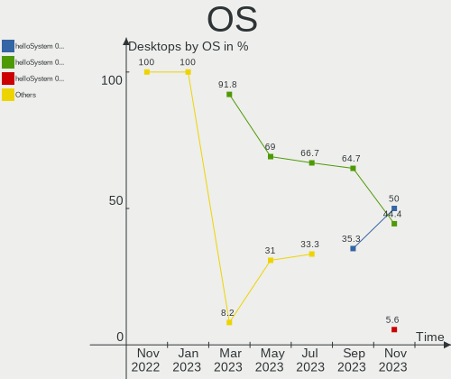
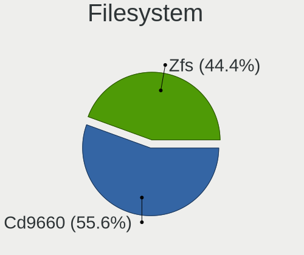
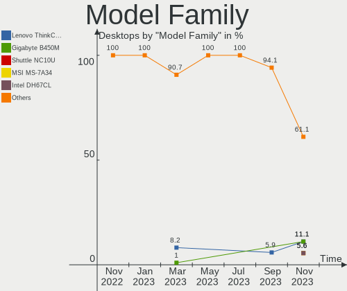
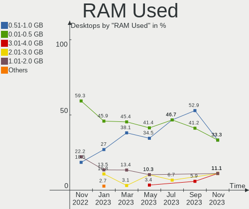
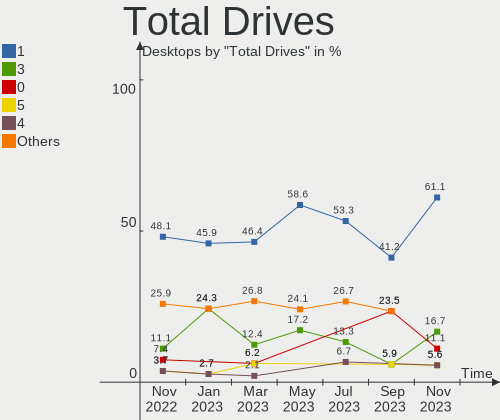
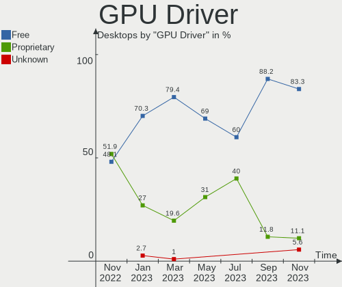
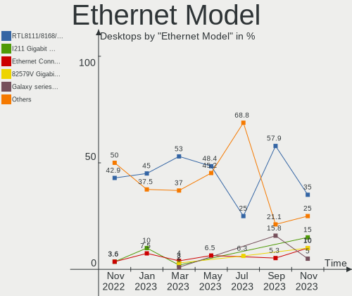
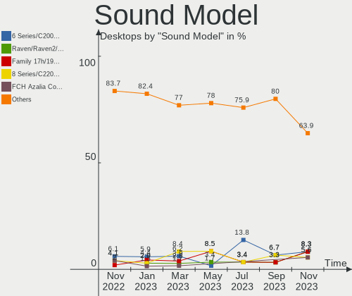

helloSystem - Hardware Trends (Desktops)
----------------------------------------

A project to identify most popular hardware characteristics and track their change
over time based on data collected by BSD users at https://BSD-Hardware.info.

Anyone can contribute to this report by the [hw-probe](https://github.com/linuxhw/hw-probe/blob/master/INSTALL.BSD.md) tool:

    hw-probe -all -upload

This report is for one last month. Overall report since the beginning of time: [TestDays](https://github.com/bsdhw/TestDays)

Period: Jul, 2023.

Contents
--------

* [ System ](#system)
  - [ OS                       ](#os)
  - [ OS Family                ](#os-family)
  - [ Arch                     ](#arch)
  - [ DE                       ](#de)
  - [ Display Server           ](#display-server)
  - [ Display Manager          ](#display-manager)
  - [ OS Lang                  ](#os-lang)
  - [ Boot Mode                ](#boot-mode)
  - [ Filesystem               ](#filesystem)
  - [ Part. scheme             ](#part-scheme)

* [ Board ](#board)
  - [ Vendor                   ](#vendor)
  - [ Model                    ](#model)
  - [ Model Family             ](#model-family)
  - [ MFG Year                 ](#mfg-year)
  - [ Form Factor              ](#form-factor)
  - [ Coreboot                 ](#coreboot)
  - [ RAM Size                 ](#ram-size)
  - [ RAM Used                 ](#ram-used)
  - [ Total Drives             ](#total-drives)
  - [ Has CD-ROM               ](#has-cd-rom)
  - [ Has Ethernet             ](#has-ethernet)
  - [ Has WiFi                 ](#has-wifi)
  - [ Has Bluetooth            ](#has-bluetooth)

* [ Location ](#location)
  - [ Country                  ](#country)
  - [ City                     ](#city)

* [ Drives ](#drives)
  - [ Drive Vendor             ](#drive-vendor)
  - [ Drive Model              ](#drive-model)
  - [ HDD Vendor               ](#hdd-vendor)
  - [ SSD Vendor               ](#ssd-vendor)
  - [ Drive Kind               ](#drive-kind)
  - [ Drive Connector          ](#drive-connector)
  - [ Drive Size               ](#drive-size)
  - [ Space Total              ](#space-total)
  - [ Space Used               ](#space-used)
  - [ Malfunc. Drives          ](#malfunc-drives)
  - [ Malfunc. Drive Vendor    ](#malfunc-drive-vendor)
  - [ Malfunc. HDD Vendor      ](#malfunc-hdd-vendor)
  - [ Malfunc. Drive Kind      ](#malfunc-drive-kind)
  - [ Failed Drives            ](#failed-drives)
  - [ Failed Drive Vendor      ](#failed-drive-vendor)
  - [ Drive Status             ](#drive-status)

* [ Storage controller ](#storage-controller)
  - [ Storage Vendor           ](#storage-vendor)
  - [ Storage Model            ](#storage-model)
  - [ Storage Kind             ](#storage-kind)

* [ Processor ](#processor)
  - [ CPU Vendor               ](#cpu-vendor)
  - [ CPU Model                ](#cpu-model)
  - [ CPU Model Family         ](#cpu-model-family)
  - [ CPU Cores                ](#cpu-cores)
  - [ CPU Sockets              ](#cpu-sockets)
  - [ CPU Threads              ](#cpu-threads)
  - [ CPU Microarch            ](#cpu-microarch)

* [ Graphics ](#graphics)
  - [ GPU Vendor               ](#gpu-vendor)
  - [ GPU Model                ](#gpu-model)
  - [ GPU Combo                ](#gpu-combo)
  - [ GPU Driver               ](#gpu-driver)
  - [ GPU Memory               ](#gpu-memory)

* [ Monitor ](#monitor)
  - [ Monitor Vendor           ](#monitor-vendor)
  - [ Monitor Model            ](#monitor-model)
  - [ Monitor Resolution       ](#monitor-resolution)
  - [ Monitor Diagonal         ](#monitor-diagonal)
  - [ Monitor Width            ](#monitor-width)
  - [ Aspect Ratio             ](#aspect-ratio)
  - [ Monitor Area             ](#monitor-area)
  - [ Pixel Density            ](#pixel-density)
  - [ Multiple Monitors        ](#multiple-monitors)

* [ Network ](#network)
  - [ Net Controller Vendor    ](#net-controller-vendor)
  - [ Net Controller Model     ](#net-controller-model)
  - [ Wireless Vendor          ](#wireless-vendor)
  - [ Wireless Model           ](#wireless-model)
  - [ Ethernet Vendor          ](#ethernet-vendor)
  - [ Ethernet Model           ](#ethernet-model)
  - [ Net Controller Kind      ](#net-controller-kind)
  - [ Used Controller          ](#used-controller)
  - [ NICs                     ](#nics)
  - [ IPv6                     ](#ipv6)

* [ Bluetooth ](#bluetooth)
  - [ Bluetooth Vendor         ](#bluetooth-vendor)
  - [ Bluetooth Model          ](#bluetooth-model)

* [ Sound ](#sound)
  - [ Sound Vendor             ](#sound-vendor)
  - [ Sound Model              ](#sound-model)

* [ Memory ](#memory)
  - [ Memory Vendor            ](#memory-vendor)
  - [ Memory Model             ](#memory-model)
  - [ Memory Kind              ](#memory-kind)
  - [ Memory Form Factor       ](#memory-form-factor)
  - [ Memory Size              ](#memory-size)
  - [ Memory Speed             ](#memory-speed)

* [ Printers & scanners ](#printers--scanners)
  - [ Printer Vendor           ](#printer-vendor)
  - [ Printer Model            ](#printer-model)
  - [ Scanner Vendor           ](#scanner-vendor)
  - [ Scanner Model            ](#scanner-model)

* [ Camera ](#camera)
  - [ Camera Vendor            ](#camera-vendor)
  - [ Camera Model             ](#camera-model)

* [ Security ](#security)
  - [ Fingerprint Vendor       ](#fingerprint-vendor)
  - [ Fingerprint Model        ](#fingerprint-model)
  - [ Chipcard Vendor          ](#chipcard-vendor)
  - [ Chipcard Model           ](#chipcard-model)

* [ Unsupported ](#unsupported)
  - [ Unsupported Devices      ](#unsupported-devices)
  - [ Unsupported Device Types ](#unsupported-device-types)

System
------

OS
--

Installed operating systems

| Name              | Desktops | Percent |
|-------------------|----------|---------|
| helloSystem 0.8.1 | 10       | 66.67%  |
| helloSystem 0.8.2 | 3        | 20%     |
| helloSystem 0.8.0 | 2        | 13.33%  |

OS Family
---------

OS without a version

| Name        | Desktops | Percent |
|-------------|----------|---------|
| helloSystem | 15       | 100%    |

Arch
----

OS architecture (x86_64, i586, etc.)

| Name  | Desktops | Percent |
|-------|----------|---------|
| amd64 | 15       | 100%    |

DE
--

Desktop Environment

| Name         | Desktops | Percent |
|--------------|----------|---------|
| helloDesktop | 14       | 93.33%  |
| XFCE         | 1        | 6.67%   |

Display Server
--------------

X11 or Wayland

| Name | Desktops | Percent |
|------|----------|---------|
| X11  | 15       | 100%    |

Display Manager
---------------

SDDM, LightDM, etc.

| Name | Desktops | Percent |
|------|----------|---------|
| SLiM | 15       | 100%    |

OS Lang
-------

Language

| Lang    | Desktops | Percent |
|---------|----------|---------|
| en_US   | 5        | 33.33%  |
| ru_RU   | 3        | 20%     |
| fr_FR   | 2        | 13.33%  |
| de_DE   | 2        | 13.33%  |
| ko      | 1        | 6.67%   |
| fr      | 1        | 6.67%   |
| Unknown | 1        | 6.67%   |

Boot Mode
---------

EFI or BIOS

| Mode | Desktops | Percent |
|------|----------|---------|
| EFI  | 15       | 100%    |

Filesystem
----------

Type of filesystem

| Type   | Desktops | Percent |
|--------|----------|---------|
| Cd9660 | 8        | 53.33%  |
| Zfs    | 7        | 46.67%  |

Part. scheme
------------

Scheme of partitioning

| Type | Desktops | Percent |
|------|----------|---------|
| GPT  | 15       | 100%    |

Board
-----

Vendor
------

Motherboard manufacturer

| Name             | Desktops | Percent |
|------------------|----------|---------|
| ASUSTek Computer | 4        | 26.67%  |
| ASRock           | 4        | 26.67%  |
| Hewlett-Packard  | 3        | 20%     |
| Fujitsu          | 1        | 6.67%   |
| ECS              | 1        | 6.67%   |
| Dell             | 1        | 6.67%   |
| Apple            | 1        | 6.67%   |

Model
-----

Motherboard model

| Name                    | Desktops | Percent |
|-------------------------|----------|---------|
| HP Z4 G4 Workstation    | 1        | 6.67%   |
| HP EliteDesk 800 G4 SFF | 1        | 6.67%   |
| HP Compaq Pro 6300 MT   | 1        | 6.67%   |
| Fujitsu ESPRIMO P710    | 1        | 6.67%   |
| ECS H61H2-M17           | 1        | 6.67%   |
| Dell OptiPlex 3020      | 1        | 6.67%   |
| ASUS P5QL PRO           | 1        | 6.67%   |
| ASUS P5B SE             | 1        | 6.67%   |
| ASUS All Series         | 1        | 6.67%   |
| ASUS A8N-E              | 1        | 6.67%   |
| ASRock P67 Pro3 SE      | 1        | 6.67%   |
| ASRock H61M-VG3         | 1        | 6.67%   |
| ASRock H61M-GS          | 1        | 6.67%   |
| ASRock A300M-STX        | 1        | 6.67%   |
| Apple MacPro5,1         | 1        | 6.67%   |

Model Family
------------

Motherboard model prefix

| Name             | Desktops | Percent |
|------------------|----------|---------|
| HP Z4            | 1        | 6.67%   |
| HP EliteDesk     | 1        | 6.67%   |
| HP Compaq        | 1        | 6.67%   |
| Fujitsu ESPRIMO  | 1        | 6.67%   |
| ECS H61H2-M17    | 1        | 6.67%   |
| Dell OptiPlex    | 1        | 6.67%   |
| ASUS P5QL        | 1        | 6.67%   |
| ASUS P5B         | 1        | 6.67%   |
| ASUS All         | 1        | 6.67%   |
| ASUS A8N-E       | 1        | 6.67%   |
| ASRock P67       | 1        | 6.67%   |
| ASRock H61M-VG3  | 1        | 6.67%   |
| ASRock H61M-GS   | 1        | 6.67%   |
| ASRock A300M-STX | 1        | 6.67%   |
| Apple MacPro5    | 1        | 6.67%   |

MFG Year
--------

Motherboard manufacture year

| Year | Desktops | Percent |
|------|----------|---------|
| 2013 | 3        | 20%     |
| 2019 | 2        | 13.33%  |
| 2012 | 2        | 13.33%  |
| 2011 | 2        | 13.33%  |
| 2008 | 2        | 13.33%  |
| 2023 | 1        | 6.67%   |
| 2015 | 1        | 6.67%   |
| 2010 | 1        | 6.67%   |
| 2006 | 1        | 6.67%   |

Form Factor
-----------

Physical design of the computer

| Name    | Desktops | Percent |
|---------|----------|---------|
| Desktop | 15       | 100%    |

Coreboot
--------

Have coreboot on board

| Used | Desktops | Percent |
|------|----------|---------|
| No   | 15       | 100%    |

RAM Size
--------

Total RAM memory

| Size in GB | Desktops | Percent |
|------------|----------|---------|
| 4.01-8.0   | 4        | 26.67%  |
| 16.01-24.0 | 4        | 26.67%  |
| 8.01-16.0  | 4        | 26.67%  |
| 32.01-64.0 | 1        | 6.67%   |
| 24.01-32.0 | 1        | 6.67%   |
| 2.01-3.0   | 1        | 6.67%   |

RAM Used
--------

Used RAM memory

| Used GB  | Desktops | Percent |
|----------|----------|---------|
| 0.51-1.0 | 7        | 46.67%  |
| 0.01-0.5 | 7        | 46.67%  |
| 2.01-3.0 | 1        | 6.67%   |

Total Drives
------------

Number of drives on board

| Drives | Desktops | Percent |
|--------|----------|---------|
| 1      | 8        | 53.33%  |
| 2      | 4        | 26.67%  |
| 3      | 2        | 13.33%  |
| 4      | 1        | 6.67%   |

Has CD-ROM
----------

Has CD-ROM on board

| Presented | Desktops | Percent |
|-----------|----------|---------|
| Yes       | 8        | 53.33%  |
| No        | 7        | 46.67%  |

Has Ethernet
------------

Has Ethernet on board

| Presented | Desktops | Percent |
|-----------|----------|---------|
| Yes       | 15       | 100%    |

Has WiFi
--------

Has WiFi module

| Presented | Desktops | Percent |
|-----------|----------|---------|
| No        | 14       | 93.33%  |
| Yes       | 1        | 6.67%   |

Has Bluetooth
-------------

Has Bluetooth module

| Presented | Desktops | Percent |
|-----------|----------|---------|
| No        | 13       | 86.67%  |
| Yes       | 2        | 13.33%  |

Location
--------

Country
-------

Geographic location (country)

| Country     | Desktops | Percent |
|-------------|----------|---------|
| USA         | 4        | 26.67%  |
| Russia      | 3        | 20%     |
| Germany     | 2        | 13.33%  |
| South Korea | 1        | 6.67%   |
| Kyrgyzstan  | 1        | 6.67%   |
| Hungary     | 1        | 6.67%   |
| Bulgaria    | 1        | 6.67%   |
| Belgium     | 1        | 6.67%   |
| Australia   | 1        | 6.67%   |

City
----

Geographic location (city)

| City        | Desktops | Percent |
|-------------|----------|---------|
| Penza       | 2        | 13.33%  |
| Woodbridge  | 1        | 6.67%   |
| Tokmok      | 1        | 6.67%   |
| Temple      | 1        | 6.67%   |
| Stuttgart   | 1        | 6.67%   |
| Springfield | 1        | 6.67%   |
| Sofia       | 1        | 6.67%   |
| Melbourne   | 1        | 6.67%   |
| Los Angeles | 1        | 6.67%   |
| Krasnoyarsk | 1        | 6.67%   |
| Hohenhameln | 1        | 6.67%   |
| Eger        | 1        | 6.67%   |
| Dobong-gu   | 1        | 6.67%   |
| Brussels    | 1        | 6.67%   |

Drives
------

Drive Vendor
------------

Hard drive vendors

| Vendor              | Desktops | Drives | Percent |
|---------------------|----------|--------|---------|
| Seagate             | 4        | 4      | 17.39%  |
| Samsung Electronics | 4        | 4      | 17.39%  |
| WDC                 | 3        | 3      | 13.04%  |
| Hitachi             | 3        | 4      | 13.04%  |
| Toshiba             | 1        | 2      | 4.35%   |
| TAMMUZ              | 1        | 1      | 4.35%   |
| SPCC                | 1        | 1      | 4.35%   |
| SanDisk             | 1        | 1      | 4.35%   |
| Maxtor              | 1        | 1      | 4.35%   |
| Kingston            | 1        | 1      | 4.35%   |
| Crucial             | 1        | 2      | 4.35%   |
| CLOVER              | 1        | 1      | 4.35%   |
| A-DATA Technology   | 1        | 1      | 4.35%   |

Drive Model
-----------

Hard drive models

| Model                                | Desktops | Percent |
|--------------------------------------|----------|---------|
| WDC WD800AAJS-00PSA0 80GB            | 1        | 4%      |
| WDC WD10EZEX-00WN4A0 1TB             | 1        | 4%      |
| WDC PC SN730 SDBQNTY-256G-1001 256GB | 1        | 4%      |
| Toshiba DT01ACA200 2TB               | 1        | 4%      |
| TAMMUZ SSD 240GB                     | 1        | 4%      |
| SPCC Solid State Disk 128GB          | 1        | 4%      |
| Seagate ST500DM002-1BD142 496GB      | 1        | 4%      |
| Seagate ST3250312AS 250GB            | 1        | 4%      |
| Seagate ST3160211AS 160GB            | 1        | 4%      |
| Seagate ST2000DM006-2DM164 2TB       | 1        | 4%      |
| SanDisk pSSD 16GB                    | 1        | 4%      |
| Samsung SSD 980 1TB                  | 1        | 4%      |
| Samsung SSD 970 EVO Plus 500GB       | 1        | 4%      |
| Samsung SP0812C 80GB                 | 1        | 4%      |
| Samsung SM961 NVMe 1024GB            | 1        | 4%      |
| Maxtor 6L080P0 82GB                  | 1        | 4%      |
| Kingston SA2000M8500G 500GB          | 1        | 4%      |
| Hitachi HDS725050KLAT80 500GB        | 1        | 4%      |
| Hitachi HDS721010KLA330 1TB          | 1        | 4%      |
| Hitachi HDP725025GLA380 250GB        | 1        | 4%      |
| Hitachi HDE721064SLA360 640GB        | 1        | 4%      |
| Crucial CT500MX500SSD1 500GB         | 1        | 4%      |
| Crucial CT1000P3SSD8 1TB             | 1        | 4%      |
| CLOVER CD253GJ 250GB                 | 1        | 4%      |
| A-DATA SP600 128GB                   | 1        | 4%      |

HDD Vendor
----------

Hard disk drive vendors

| Vendor              | Desktops | Drives | Percent |
|---------------------|----------|--------|---------|
| Seagate             | 4        | 4      | 30.77%  |
| Hitachi             | 3        | 4      | 23.08%  |
| WDC                 | 2        | 2      | 15.38%  |
| Toshiba             | 1        | 2      | 7.69%   |
| Samsung Electronics | 1        | 1      | 7.69%   |
| Maxtor              | 1        | 1      | 7.69%   |
| CLOVER              | 1        | 1      | 7.69%   |

SSD Vendor
----------

Solid state drive vendors

| Vendor            | Desktops | Drives | Percent |
|-------------------|----------|--------|---------|
| TAMMUZ            | 1        | 1      | 20%     |
| SPCC              | 1        | 1      | 20%     |
| SanDisk           | 1        | 1      | 20%     |
| Crucial           | 1        | 1      | 20%     |
| A-DATA Technology | 1        | 1      | 20%     |

Drive Kind
----------

HDD or SSD

| Kind | Desktops | Drives | Percent |
|------|----------|--------|---------|
| HDD  | 10       | 15     | 52.63%  |
| SSD  | 5        | 5      | 26.32%  |
| NVMe | 4        | 6      | 21.05%  |

Drive Connector
---------------

SATA, SAS, NVMe, etc.

| Type | Desktops | Drives | Percent |
|------|----------|--------|---------|
| SATA | 14       | 20     | 77.78%  |
| NVMe | 4        | 6      | 22.22%  |

Drive Size
----------

Size of hard drive

| Size in TB | Desktops | Drives | Percent |
|------------|----------|--------|---------|
| 0.01-0.5   | 12       | 14     | 75%     |
| 1.01-2.0   | 2        | 3      | 12.5%   |
| 0.51-1.0   | 2        | 3      | 12.5%   |

Space Total
-----------

Amount of disk space available on the file system

| Size in GB | Desktops | Percent |
|------------|----------|---------|
| 1-20       | 6        | 40%     |
| 101-250    | 3        | 20%     |
| 501-1000   | 2        | 13.33%  |
| 51-100     | 2        | 13.33%  |
| 21-50      | 1        | 6.67%   |
| 1001-2000  | 1        | 6.67%   |

Space Used
----------

Amount of used disk space

| Used GB | Desktops | Percent |
|---------|----------|---------|
| 1-20    | 14       | 93.33%  |
| 251-500 | 1        | 6.67%   |

Malfunc. Drives
---------------

Drive models with a malfunction

| Model                          | Desktops | Drives | Percent |
|--------------------------------|----------|--------|---------|
| Seagate ST3250312AS 250GB      | 1        | 1      | 25%     |
| Seagate ST2000DM006-2DM164 2TB | 1        | 1      | 25%     |
| Maxtor 6L080P0 82GB            | 1        | 1      | 25%     |
| Hitachi HDP725025GLA380 250GB  | 1        | 1      | 25%     |

Malfunc. Drive Vendor
---------------------

Vendors of faulty drives

| Vendor  | Desktops | Drives | Percent |
|---------|----------|--------|---------|
| Seagate | 2        | 2      | 50%     |
| Maxtor  | 1        | 1      | 25%     |
| Hitachi | 1        | 1      | 25%     |

Malfunc. HDD Vendor
-------------------

Vendors of faulty HDD drives

| Vendor  | Desktops | Drives | Percent |
|---------|----------|--------|---------|
| Seagate | 2        | 2      | 50%     |
| Maxtor  | 1        | 1      | 25%     |
| Hitachi | 1        | 1      | 25%     |

Malfunc. Drive Kind
-------------------

Kinds of faulty drives

| Kind | Desktops | Drives | Percent |
|------|----------|--------|---------|
| HDD  | 4        | 4      | 100%    |

Failed Drives
-------------

Failed drive models

Zero info for selected period =(

Failed Drive Vendor
-------------------

Failed drive vendors

Zero info for selected period =(

Drive Status
------------

Number of failed and malfunc. drives

| Status   | Desktops | Drives | Percent |
|----------|----------|--------|---------|
| Works    | 12       | 19     | 63.16%  |
| Malfunc  | 4        | 4      | 21.05%  |
| Detected | 3        | 3      | 15.79%  |

Storage controller
------------------

Storage Vendor
--------------

Storage controller vendors

| Vendor                      | Desktops | Percent |
|-----------------------------|----------|---------|
| Intel                       | 13       | 59.09%  |
| Samsung Electronics         | 3        | 13.64%  |
| SanDisk                     | 1        | 4.55%   |
| Nvidia                      | 1        | 4.55%   |
| Micron/Crucial Technology   | 1        | 4.55%   |
| Kingston Technology Company | 1        | 4.55%   |
| JMicron Technology          | 1        | 4.55%   |
| AMD                         | 1        | 4.55%   |

Storage Model
-------------

Storage controller models

| Model                                                                          | Desktops | Percent |
|--------------------------------------------------------------------------------|----------|---------|
| Intel 6 Series/C200 Series Chipset Family 6 port Desktop SATA AHCI Controller  | 4        | 16%     |
| Intel 82801JI (ICH10 Family) 4 port SATA IDE Controller #1                     | 2        | 8%      |
| Intel 82801JI (ICH10 Family) 2 port SATA IDE Controller #2                     | 2        | 8%      |
| Intel 7 Series/C210 Series Chipset Family 6-port SATA Controller [AHCI mode]   | 2        | 8%      |
| SanDisk WD Black SN750 / PC SN730 NVMe SSD                                     | 1        | 4%      |
| Samsung NVMe SSD Controller SM981/PM981/PM983                                  | 1        | 4%      |
| Samsung NVMe SSD Controller SM961/PM961/SM963                                  | 1        | 4%      |
| Samsung NVMe SSD Controller 980                                                | 1        | 4%      |
| Nvidia CK804 IDE                                                               | 1        | 4%      |
| Micron/Crucial P2 [Nick P2] / P3 / P3 Plus NVMe PCIe SSD (DRAM-less)           | 1        | 4%      |
| Kingston Company A2000 NVMe SSD                                                | 1        | 4%      |
| JMicron JMB363 SATA/IDE Controller                                             | 1        | 4%      |
| Intel SATA Controller [RAID mode]                                              | 1        | 4%      |
| Intel Cannon Lake PCH SATA AHCI Controller                                     | 1        | 4%      |
| Intel C600/X79 series chipset SATA RAID Controller                             | 1        | 4%      |
| Intel 82801HR/HO/HH (ICH8R/DO/DH) 2 port SATA Controller [IDE mode]            | 1        | 4%      |
| Intel 82801H (ICH8 Family) 4 port SATA Controller [IDE mode]                   | 1        | 4%      |
| Intel 8 Series/C220 Series Chipset Family 6-port SATA Controller 1 [AHCI mode] | 1        | 4%      |
| AMD FCH SATA Controller [AHCI mode]                                            | 1        | 4%      |

Storage Kind
------------

Kind of storage controller (IDE, SATA, NVMe, SAS, ...)

| Kind | Desktops | Percent |
|------|----------|---------|
| SATA | 9        | 47.37%  |
| NVMe | 4        | 21.05%  |
| IDE  | 4        | 21.05%  |
| RAID | 2        | 10.53%  |

Processor
---------

CPU Vendor
----------

Processor vendors

| Vendor | Desktops | Percent |
|--------|----------|---------|
| Intel  | 13       | 86.67%  |
| AMD    | 2        | 13.33%  |

CPU Model
---------

Processor models

| Model                                       | Desktops | Percent |
|---------------------------------------------|----------|---------|
| Intel Xeon W-2125 CPU @ 4.00GHz             | 1        | 6.67%   |
| Intel Xeon CPU W3670 @ 3.20GHz              | 1        | 6.67%   |
| Intel Xeon CPU E31220 @ 3.10GHz             | 1        | 6.67%   |
| Intel Pentium CPU G850 @ 2.90GHz            | 1        | 6.67%   |
| Intel Core i7-8700 CPU @ 3.20GHz            | 1        | 6.67%   |
| Intel Core i7-4790 CPU @ 3.60GHz            | 1        | 6.67%   |
| Intel Core i7-3770 CPU @ 3.40GHz            | 1        | 6.67%   |
| Intel Core i7-2600 CPU @ 3.40GHz            | 1        | 6.67%   |
| Intel Core i5-2310 CPU @ 2.90GHz            | 1        | 6.67%   |
| Intel Core i3-4130 CPU @ 3.40GHz            | 1        | 6.67%   |
| Intel Core 2 Duo CPU E7400 @ 2.80GHz        | 1        | 6.67%   |
| Intel Core 2 Duo CPU E7200 @ 2.53GHz        | 1        | 6.67%   |
| Intel Celeron CPU G1620 @ 2.70GHz           | 1        | 6.67%   |
| AMD Ryzen 3 3200G with Radeon Vega Graphics | 1        | 6.67%   |
| AMD Athlon 64 Processor 3200+               | 1        | 6.67%   |

CPU Model Family
----------------

Processor model prefix

| Model            | Desktops | Percent |
|------------------|----------|---------|
| Intel Core i7    | 4        | 26.67%  |
| Intel Xeon       | 3        | 20%     |
| Intel Core 2 Duo | 2        | 13.33%  |
| Intel Pentium    | 1        | 6.67%   |
| Intel Core i5    | 1        | 6.67%   |
| Intel Core i3    | 1        | 6.67%   |
| Intel Celeron    | 1        | 6.67%   |
| AMD Ryzen 3      | 1        | 6.67%   |
| AMD Athlon 64    | 1        | 6.67%   |

CPU Cores
---------

Number of processor cores

| Number  | Desktops | Percent |
|---------|----------|---------|
| 4       | 7        | 46.67%  |
| 2       | 4        | 26.67%  |
| 6       | 2        | 13.33%  |
| 1       | 1        | 6.67%   |
| Unknown | 1        | 6.67%   |

CPU Sockets
-----------

Number of sockets

| Number | Desktops | Percent |
|--------|----------|---------|
| 1      | 15       | 100%    |

CPU Threads
-----------

Threads per core (Hyper-Threading)

| Number  | Desktops | Percent |
|---------|----------|---------|
| 2       | 7        | 46.67%  |
| 1       | 7        | 46.67%  |
| Unknown | 1        | 6.67%   |

CPU Microarch
-------------

Microarchitecture

| Name        | Desktops | Percent |
|-------------|----------|---------|
| SandyBridge | 4        | 26.67%  |
| Penryn      | 2        | 13.33%  |
| IvyBridge   | 2        | 13.33%  |
| Haswell     | 2        | 13.33%  |
| Zen+        | 1        | 6.67%   |
| Westmere    | 1        | 6.67%   |
| Skylake     | 1        | 6.67%   |
| KabyLake    | 1        | 6.67%   |
| K8 Hammer   | 1        | 6.67%   |

Graphics
--------

GPU Vendor
----------

Vendors of graphics cards

| Vendor | Desktops | Percent |
|--------|----------|---------|
| Nvidia | 9        | 56.25%  |
| AMD    | 4        | 25%     |
| Intel  | 3        | 18.75%  |

GPU Model
---------

Graphics card models

| Model                                                                     | Desktops | Percent |
|---------------------------------------------------------------------------|----------|---------|
| Nvidia GT218 [GeForce 210]                                                | 1        | 6.25%   |
| Nvidia GP107 [GeForce GTX 1050]                                           | 1        | 6.25%   |
| Nvidia GM204 [GeForce GTX 980]                                            | 1        | 6.25%   |
| Nvidia GK208B [GeForce GT 730]                                            | 1        | 6.25%   |
| Nvidia GK208B [GeForce GT 710]                                            | 1        | 6.25%   |
| Nvidia GK104 [GeForce GTX 680]                                            | 1        | 6.25%   |
| Nvidia GF119 [GeForce GT 610]                                             | 1        | 6.25%   |
| Nvidia GF116 [GeForce GTS 450 Rev. 2]                                     | 1        | 6.25%   |
| Nvidia G92 [GeForce GTS 250]                                              | 1        | 6.25%   |
| Intel Xeon E3-1200 v2/3rd Gen Core processor Graphics Controller          | 1        | 6.25%   |
| Intel CoffeeLake-S GT2 [UHD Graphics 630]                                 | 1        | 6.25%   |
| Intel 4th Generation Core Processor Family Integrated Graphics Controller | 1        | 6.25%   |
| AMD Turks GL [FirePro V3900]                                              | 1        | 6.25%   |
| AMD RV670 [Radeon HD 3690/3850]                                           | 1        | 6.25%   |
| AMD Picasso/Raven 2 [Radeon Vega Series / Radeon Vega Mobile Series]      | 1        | 6.25%   |
| AMD Oland [Radeon HD 8570 / R5 430 OEM / R7 240/340 / Radeon 520 OEM]     | 1        | 6.25%   |

GPU Combo
---------

Combinations of graphics cards

| Name        | Desktops | Percent |
|-------------|----------|---------|
| 1 x Nvidia  | 9        | 60%     |
| 1 x AMD     | 3        | 20%     |
| 1 x Intel   | 2        | 13.33%  |
| Intel + AMD | 1        | 6.67%   |

GPU Driver
----------

Free vs proprietary

| Driver      | Desktops | Percent |
|-------------|----------|---------|
| Free        | 9        | 60%     |
| Proprietary | 6        | 40%     |

GPU Memory
----------

Total video memory

| Size in GB | Desktops | Percent |
|------------|----------|---------|
| Unknown    | 8        | 53.33%  |
| 1.01-2.0   | 4        | 26.67%  |
| 0.51-1.0   | 2        | 13.33%  |
| 3.01-4.0   | 1        | 6.67%   |

Monitor
-------

Monitor Vendor
--------------

Monitor vendors

| Vendor              | Desktops | Percent |
|---------------------|----------|---------|
| Samsung Electronics | 4        | 33.33%  |
| Lenovo              | 1        | 8.33%   |
| Iiyama              | 1        | 8.33%   |
| Goldstar            | 1        | 8.33%   |
| Eizo                | 1        | 8.33%   |
| Dell                | 1        | 8.33%   |
| CVT                 | 1        | 8.33%   |
| Apple               | 1        | 8.33%   |
| Acer                | 1        | 8.33%   |

Monitor Model
-------------

Monitor models

| Model                                                                  | Desktops | Percent |
|------------------------------------------------------------------------|----------|---------|
| Samsung Electronics SA300/SA350 SAM078D 1600x900 440x250mm 19.9-inch   | 1        | 8.33%   |
| Samsung Electronics S19B150 SAM08A2 1366x768 410x230mm 18.5-inch       | 1        | 8.33%   |
| Samsung Electronics Odyssey G50A SAM7181 2560x1440 600x340mm 27.2-inch | 1        | 8.33%   |
| Samsung Electronics LCD Monitor SAM0C3C 1366x768 530x300mm 24.0-inch   | 1        | 8.33%   |
| Lenovo D27-30 LEN66B8 1920x1080 600x340mm 27.2-inch                    | 1        | 8.33%   |
| Iiyama PL2283H IVM562E 1920x1080 500x290mm 22.8-inch                   | 1        | 8.33%   |
| Goldstar LG ULTRAGEAR GSM775B 1920x1080 700x390mm 31.5-inch            | 1        | 8.33%   |
| Eizo FS2331 ENC2211 1920x1080 510x290mm 23.1-inch                      | 1        | 8.33%   |
| Dell P2414H DELA09B 1920x1080 530x300mm 24.0-inch                      | 1        | 8.33%   |
| CVT LM201XD CVT0001 1680x1050 410x256mm 19.0-inch                      | 1        | 8.33%   |
| Apple Cinema HD Dis APP921F 1920x1200 490x310mm 22.8-inch              | 1        | 8.33%   |
| Acer G246HL ACR02FF 1920x1080 530x300mm 24.0-inch                      | 1        | 8.33%   |

Monitor Resolution
------------------

Monitor screen resolution

| Resolution         | Desktops | Percent |
|--------------------|----------|---------|
| 1920x1080 (FHD)    | 6        | 50%     |
| 1366x768 (WXGA)    | 2        | 16.67%  |
| 2560x1440 (QHD)    | 1        | 8.33%   |
| 1920x1200 (WUXGA)  | 1        | 8.33%   |
| 1680x1050 (WSXGA+) | 1        | 8.33%   |
| 1600x900 (HD+)     | 1        | 8.33%   |

Monitor Diagonal
----------------

Diagonal size in inches

| Inches | Desktops | Percent |
|--------|----------|---------|
| 27     | 2        | 18.18%  |
| 24     | 2        | 18.18%  |
| 22     | 2        | 18.18%  |
| 19     | 2        | 18.18%  |
| 31     | 1        | 9.09%   |
| 23     | 1        | 9.09%   |
| 18     | 1        | 9.09%   |

Monitor Width
-------------

Physical width

| Width in mm | Desktops | Percent |
|-------------|----------|---------|
| 501-600     | 5        | 45.45%  |
| 401-500     | 5        | 45.45%  |
| 601-700     | 1        | 9.09%   |

Aspect Ratio
------------

Proportional relationship between the width and the height

| Ratio | Desktops | Percent |
|-------|----------|---------|
| 16/9  | 9        | 81.82%  |
| 16/10 | 2        | 18.18%  |

Monitor Area
------------

Area in inch²

| Area in inch² | Desktops | Percent |
|----------------|----------|---------|
| 201-250        | 5        | 45.45%  |
| 301-350        | 2        | 18.18%  |
| 151-200        | 2        | 18.18%  |
| 351-500        | 1        | 9.09%   |
| 141-150        | 1        | 9.09%   |

Pixel Density
-------------

Pixels per inch

| Density | Desktops | Percent |
|---------|----------|---------|
| 51-100  | 9        | 81.82%  |
| 101-120 | 2        | 18.18%  |

Multiple Monitors
-----------------

Total monitors connected

| Total | Desktops | Percent |
|-------|----------|---------|
| 1     | 10       | 66.67%  |
| 0     | 4        | 26.67%  |
| 2     | 1        | 6.67%   |

Network
-------

Net Controller Vendor
---------------------

Controller vendors

| Vendor                | Desktops | Percent |
|-----------------------|----------|---------|
| Realtek Semiconductor | 5        | 31.25%  |
| Qualcomm Atheros      | 5        | 31.25%  |
| Intel                 | 5        | 31.25%  |
| Broadcom              | 1        | 6.25%   |

Net Controller Model
--------------------

Controller models

| Model                                                             | Desktops | Percent |
|-------------------------------------------------------------------|----------|---------|
| Realtek RTL8111/8168/8411 PCI Express Gigabit Ethernet Controller | 4        | 23.53%  |
| Qualcomm Atheros AR8151 v2.0 Gigabit Ethernet                     | 2        | 11.76%  |
| Realtek RTL-8100/8101L/8139 PCI Fast Ethernet Adapter             | 1        | 5.88%   |
| Qualcomm Atheros Attansic L1 Gigabit Ethernet                     | 1        | 5.88%   |
| Qualcomm Atheros AR8152 v2.0 Fast Ethernet                        | 1        | 5.88%   |
| Qualcomm Atheros AR8121/AR8113/AR8114 Gigabit or Fast Ethernet    | 1        | 5.88%   |
| Intel I210 Gigabit Network Connection                             | 1        | 5.88%   |
| Intel Ethernet Connection (7) I219-LM                             | 1        | 5.88%   |
| Intel Ethernet Connection (2) I219-LM                             | 1        | 5.88%   |
| Intel 82579V Gigabit Network Connection                           | 1        | 5.88%   |
| Intel 82579LM Gigabit Network Connection (Lewisville)             | 1        | 5.88%   |
| Intel 82574L Gigabit Network Connection                           | 1        | 5.88%   |
| Broadcom BCM4322 802.11a/b/g/n Wireless LAN Controller            | 1        | 5.88%   |

Wireless Vendor
---------------

Wireless vendors

| Vendor   | Desktops | Percent |
|----------|----------|---------|
| Broadcom | 1        | 100%    |

Wireless Model
--------------

Wireless models

| Model                                                  | Desktops | Percent |
|--------------------------------------------------------|----------|---------|
| Broadcom BCM4322 802.11a/b/g/n Wireless LAN Controller | 1        | 100%    |

Ethernet Vendor
---------------

Ethernet vendors

| Vendor                | Desktops | Percent |
|-----------------------|----------|---------|
| Realtek Semiconductor | 5        | 33.33%  |
| Qualcomm Atheros      | 5        | 33.33%  |
| Intel                 | 5        | 33.33%  |

Ethernet Model
--------------

Ethernet models

| Model                                                             | Desktops | Percent |
|-------------------------------------------------------------------|----------|---------|
| Realtek RTL8111/8168/8411 PCI Express Gigabit Ethernet Controller | 4        | 25%     |
| Qualcomm Atheros AR8151 v2.0 Gigabit Ethernet                     | 2        | 12.5%   |
| Realtek RTL-8100/8101L/8139 PCI Fast Ethernet Adapter             | 1        | 6.25%   |
| Qualcomm Atheros Attansic L1 Gigabit Ethernet                     | 1        | 6.25%   |
| Qualcomm Atheros AR8152 v2.0 Fast Ethernet                        | 1        | 6.25%   |
| Qualcomm Atheros AR8121/AR8113/AR8114 Gigabit or Fast Ethernet    | 1        | 6.25%   |
| Intel I210 Gigabit Network Connection                             | 1        | 6.25%   |
| Intel Ethernet Connection (7) I219-LM                             | 1        | 6.25%   |
| Intel Ethernet Connection (2) I219-LM                             | 1        | 6.25%   |
| Intel 82579V Gigabit Network Connection                           | 1        | 6.25%   |
| Intel 82579LM Gigabit Network Connection (Lewisville)             | 1        | 6.25%   |
| Intel 82574L Gigabit Network Connection                           | 1        | 6.25%   |

Net Controller Kind
-------------------

Ethernet, WiFi or modem

| Kind     | Desktops | Percent |
|----------|----------|---------|
| Ethernet | 15       | 93.75%  |
| WiFi     | 1        | 6.25%   |

Used Controller
---------------

Currently used network controller

| Kind     | Desktops | Percent |
|----------|----------|---------|
| Ethernet | 15       | 100%    |

NICs
----

Total network controllers on board

| Total | Desktops | Percent |
|-------|----------|---------|
| 1     | 13       | 86.67%  |
| 3     | 1        | 6.67%   |
| 2     | 1        | 6.67%   |

IPv6
----

IPv6 vs IPv4

| Used | Desktops | Percent |
|------|----------|---------|
| No   | 15       | 100%    |

Bluetooth
---------

Bluetooth Vendor
----------------

Controller vendors

| Vendor   | Desktops | Percent |
|----------|----------|---------|
| Broadcom | 1        | 50%     |
| Apple    | 1        | 50%     |

Bluetooth Model
---------------

Controller models

| Model                                | Desktops | Percent |
|--------------------------------------|----------|---------|
| Broadcom BCM20702A0 Bluetooth 4.0    | 1        | 50%     |
| Apple Built-in Bluetooth 2.0+EDR HCI | 1        | 50%     |

Sound
-----

Sound Vendor
------------

Sound card vendors

| Vendor | Desktops | Percent |
|--------|----------|---------|
| Intel  | 13       | 50%     |
| Nvidia | 8        | 30.77%  |
| AMD    | 4        | 15.38%  |
| Harman | 1        | 3.85%   |

Sound Model
-----------

Sound card models

| Model                                                                      | Desktops | Percent |
|----------------------------------------------------------------------------|----------|---------|
| Intel 6 Series/C200 Series Chipset Family High Definition Audio Controller | 4        | 13.79%  |
| Nvidia GK208 HDMI/DP Audio Controller                                      | 2        | 6.9%    |
| Intel 82801JI (ICH10 Family) HD Audio Controller                           | 2        | 6.9%    |
| Intel 7 Series/C216 Chipset Family High Definition Audio Controller        | 2        | 6.9%    |
| Nvidia High Definition Audio Controller                                    | 1        | 3.45%   |
| Nvidia GP107GL High Definition Audio Controller                            | 1        | 3.45%   |
| Nvidia GM204 High Definition Audio Controller                              | 1        | 3.45%   |
| Nvidia GK104 HDMI Audio Controller                                         | 1        | 3.45%   |
| Nvidia GF119 HDMI Audio Controller                                         | 1        | 3.45%   |
| Nvidia GF116 High Definition Audio Controller                              | 1        | 3.45%   |
| Nvidia CK804 AC'97 Audio Controller                                        | 1        | 3.45%   |
| Intel Xeon E3-1200 v3/4th Gen Core Processor HD Audio Controller           | 1        | 3.45%   |
| Intel Cannon Lake PCH cAVS                                                 | 1        | 3.45%   |
| Intel 9 Series Chipset Family HD Audio Controller                          | 1        | 3.45%   |
| Intel 82801H (ICH8 Family) HD Audio Controller                             | 1        | 3.45%   |
| Intel 8 Series/C220 Series Chipset High Definition Audio Controller        | 1        | 3.45%   |
| Intel 200 Series PCH HD Audio                                              | 1        | 3.45%   |
| Harman Harman/Kardon SoundSticks                                           | 1        | 3.45%   |
| AMD Turks HDMI Audio [Radeon HD 6500/6600 / 6700M Series]                  | 1        | 3.45%   |
| AMD RV670/680 HDMI Audio [Radeon HD 3690/3800 Series]                      | 1        | 3.45%   |
| AMD Raven/Raven2/Fenghuang HDMI/DP Audio Controller                        | 1        | 3.45%   |
| AMD Oland/Hainan/Cape Verde/Pitcairn HDMI Audio [Radeon HD 7000 Series]    | 1        | 3.45%   |
| AMD Family 17h/19h HD Audio Controller                                     | 1        | 3.45%   |

Memory
------

Memory Vendor
-------------

Memory module vendors

| Vendor              | Desktops | Percent |
|---------------------|----------|---------|
| Samsung Electronics | 4        | 23.53%  |
| Unknown             | 3        | 17.65%  |
| Kingston            | 3        | 17.65%  |
| SK hynix            | 1        | 5.88%   |
| Micron Technology   | 1        | 5.88%   |
| Kingmax             | 1        | 5.88%   |
| GOODRAM             | 1        | 5.88%   |
| Crucial             | 1        | 5.88%   |
| Corsair             | 1        | 5.88%   |
| AMD                 | 1        | 5.88%   |

Memory Model
------------

Memory module models

| Model                                                 | Desktops | Percent |
|-------------------------------------------------------|----------|---------|
| Unknown RAM Module 2GB DIMM DDR 667MT/s               | 1        | 5.26%   |
| Unknown RAM Module 1GB DIMM SDRAM 667MT/s             | 1        | 5.26%   |
| Unknown RAM Module 1GB DIMM DDR 667MT/s               | 1        | 5.26%   |
| Unknown RAM Module 1GB DIMM 400MT/s                   | 1        | 5.26%   |
| SK hynix RAM HMT351U6CFR8C-H9 4GB DIMM DDR3 1067MT/s  | 1        | 5.26%   |
| Samsung RAM Module 8GB DIMM DDR3 1066MT/s             | 1        | 5.26%   |
| Samsung RAM M393A2G40DB0-CPB 16GB DIMM DDR4 2133MT/s  | 1        | 5.26%   |
| Samsung RAM M378B5773DH0-CH9 2GB DIMM DDR3 1333MT/s   | 1        | 5.26%   |
| Samsung RAM M378B5773CH0-CH9 2GB DIMM DDR3 1333MT/s   | 1        | 5.26%   |
| Samsung RAM M378B5173QH0-CK0 4GB DIMM DDR3 1600MT/s   | 1        | 5.26%   |
| Micron RAM Module 8GB DIMM DDR4 2667MT/s              | 1        | 5.26%   |
| Kingston RAM KHX1600C9D3/4GX 4GB DIMM DDR3 1600MT/s   | 1        | 5.26%   |
| Kingston RAM 99U5471-011.A01LF 2GB DIMM DDR3 1333MT/s | 1        | 5.26%   |
| Kingston RAM 9905471-006.A01LF 4GB DIMM DDR3 1333MT/s | 1        | 5.26%   |
| Kingmax RAM FLGF65F-D8KJB 4GB DIMM DDR3 1333MT/s      | 1        | 5.26%   |
| GOODRAM RAM GR1333D364L9/4G 4GB DIMM DDR3 1067MT/s    | 1        | 5.26%   |
| Crucial RAM CT51264BD160B.C16F 4GB DIMM DDR3 1600MT/s | 1        | 5.26%   |
| Corsair RAM CMSX16GX4M2A3000C16 8GB SODIMM DDR4       | 1        | 5.26%   |
| AMD RAM R5S38G1601U2S 8GB DIMM DDR3 1333MT/s          | 1        | 5.26%   |

Memory Kind
-----------

Memory module kinds

| Kind    | Desktops | Percent |
|---------|----------|---------|
| DDR3    | 9        | 56.25%  |
| DDR4    | 3        | 18.75%  |
| SDRAM   | 2        | 12.5%   |
| DDR     | 1        | 6.25%   |
| Unknown | 1        | 6.25%   |

Memory Form Factor
------------------

Physical design of the memory module

| Name   | Desktops | Percent |
|--------|----------|---------|
| DIMM   | 14       | 93.33%  |
| SODIMM | 1        | 6.67%   |

Memory Size
-----------

Memory module size

| Size  | Desktops | Percent |
|-------|----------|---------|
| 4096  | 6        | 35.29%  |
| 8192  | 4        | 23.53%  |
| 2048  | 3        | 17.65%  |
| 1024  | 3        | 17.65%  |
| 16384 | 1        | 5.88%   |

Memory Speed
------------

Memory module speed

| Speed   | Desktops | Percent |
|---------|----------|---------|
| 1333    | 4        | 25%     |
| 1600    | 3        | 18.75%  |
| 1067    | 2        | 12.5%   |
| 667     | 2        | 12.5%   |
| 2667    | 1        | 6.25%   |
| 2133    | 1        | 6.25%   |
| 1066    | 1        | 6.25%   |
| 400     | 1        | 6.25%   |
| Unknown | 1        | 6.25%   |

Printers & scanners
-------------------

Printer Vendor
--------------

Printer device vendors

Zero info for selected period =(

Printer Model
-------------

Printer device models

Zero info for selected period =(

Scanner Vendor
--------------

Scanner device vendors

Zero info for selected period =(

Scanner Model
-------------

Scanner device models

Zero info for selected period =(

Camera
------

Camera Vendor
-------------

Camera device vendors

Zero info for selected period =(

Camera Model
------------

Camera device models

Zero info for selected period =(

Security
--------

Fingerprint Vendor
------------------

Fingerprint sensor vendors

Zero info for selected period =(

Fingerprint Model
-----------------

Fingerprint sensor models

Zero info for selected period =(

Chipcard Vendor
---------------

Chipcard module vendors

Zero info for selected period =(

Chipcard Model
--------------

Chipcard module models

Zero info for selected period =(

Unsupported
-----------

Unsupported Devices
-------------------

Total unsupported devices on board

| Total | Desktops | Percent |
|-------|----------|---------|
| 1     | 8        | 53.33%  |
| 0     | 6        | 40%     |
| 3     | 1        | 6.67%   |

Unsupported Device Types
------------------------

Types of unsupported devices

| Type                     | Desktops | Percent |
|--------------------------|----------|---------|
| Communication controller | 9        | 90%     |
| Sound                    | 1        | 10%     |

