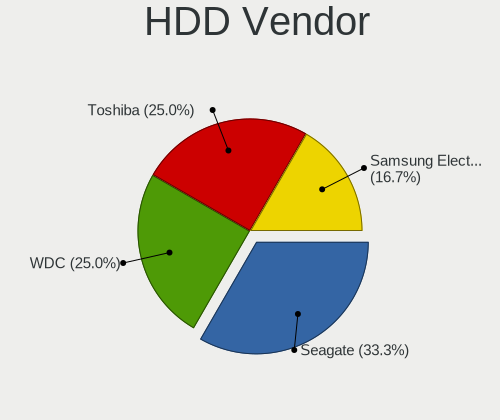
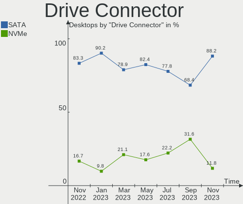
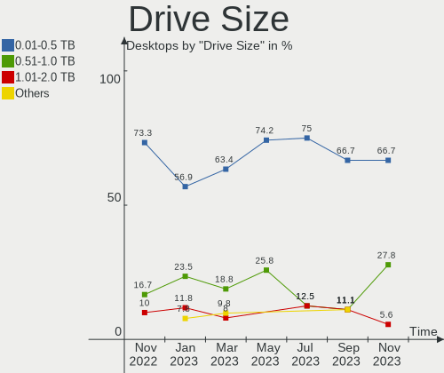
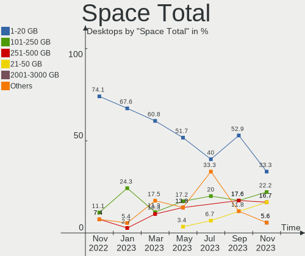
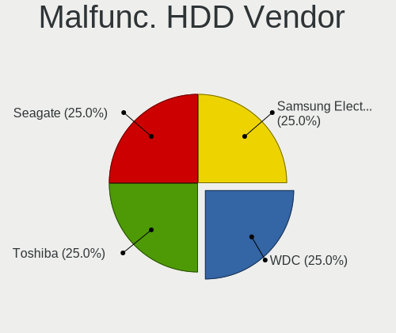
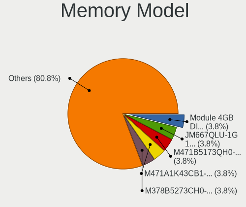

helloSystem - Hardware Trends (Desktops)
----------------------------------------

A project to identify most popular hardware characteristics and track their change
over time based on data collected by BSD users at https://BSD-Hardware.info.

Anyone can contribute to this report by the [hw-probe](https://github.com/linuxhw/hw-probe/blob/master/INSTALL.BSD.md) tool:

    hw-probe -all -upload

This report is for one last month. Overall report since the beginning of time: [TestCoverage](https://github.com/bsdhw/TestCoverage)

Period: Aug, 2022.

Contents
--------

* [ System ](#system)
  - [ OS                       ](#os)
  - [ OS Family                ](#os-family)
  - [ Arch                     ](#arch)
  - [ DE                       ](#de)
  - [ Display Server           ](#display-server)
  - [ Display Manager          ](#display-manager)
  - [ OS Lang                  ](#os-lang)
  - [ Boot Mode                ](#boot-mode)
  - [ Filesystem               ](#filesystem)
  - [ Part. scheme             ](#part-scheme)

* [ Board ](#board)
  - [ Vendor                   ](#vendor)
  - [ Model                    ](#model)
  - [ Model Family             ](#model-family)
  - [ MFG Year                 ](#mfg-year)
  - [ Form Factor              ](#form-factor)
  - [ Coreboot                 ](#coreboot)
  - [ RAM Size                 ](#ram-size)
  - [ RAM Used                 ](#ram-used)
  - [ Total Drives             ](#total-drives)
  - [ Has CD-ROM               ](#has-cd-rom)
  - [ Has Ethernet             ](#has-ethernet)
  - [ Has WiFi                 ](#has-wifi)
  - [ Has Bluetooth            ](#has-bluetooth)

* [ Location ](#location)
  - [ Country                  ](#country)
  - [ City                     ](#city)

* [ Drives ](#drives)
  - [ Drive Vendor             ](#drive-vendor)
  - [ Drive Model              ](#drive-model)
  - [ HDD Vendor               ](#hdd-vendor)
  - [ SSD Vendor               ](#ssd-vendor)
  - [ Drive Kind               ](#drive-kind)
  - [ Drive Connector          ](#drive-connector)
  - [ Drive Size               ](#drive-size)
  - [ Space Total              ](#space-total)
  - [ Space Used               ](#space-used)
  - [ Malfunc. Drives          ](#malfunc-drives)
  - [ Malfunc. Drive Vendor    ](#malfunc-drive-vendor)
  - [ Malfunc. HDD Vendor      ](#malfunc-hdd-vendor)
  - [ Malfunc. Drive Kind      ](#malfunc-drive-kind)
  - [ Failed Drives            ](#failed-drives)
  - [ Failed Drive Vendor      ](#failed-drive-vendor)
  - [ Drive Status             ](#drive-status)

* [ Storage controller ](#storage-controller)
  - [ Storage Vendor           ](#storage-vendor)
  - [ Storage Model            ](#storage-model)
  - [ Storage Kind             ](#storage-kind)

* [ Processor ](#processor)
  - [ CPU Vendor               ](#cpu-vendor)
  - [ CPU Model                ](#cpu-model)
  - [ CPU Model Family         ](#cpu-model-family)
  - [ CPU Cores                ](#cpu-cores)
  - [ CPU Sockets              ](#cpu-sockets)
  - [ CPU Threads              ](#cpu-threads)
  - [ CPU Microarch            ](#cpu-microarch)

* [ Graphics ](#graphics)
  - [ GPU Vendor               ](#gpu-vendor)
  - [ GPU Model                ](#gpu-model)
  - [ GPU Combo                ](#gpu-combo)
  - [ GPU Driver               ](#gpu-driver)
  - [ GPU Memory               ](#gpu-memory)

* [ Monitor ](#monitor)
  - [ Monitor Vendor           ](#monitor-vendor)
  - [ Monitor Model            ](#monitor-model)
  - [ Monitor Resolution       ](#monitor-resolution)
  - [ Monitor Diagonal         ](#monitor-diagonal)
  - [ Monitor Width            ](#monitor-width)
  - [ Aspect Ratio             ](#aspect-ratio)
  - [ Monitor Area             ](#monitor-area)
  - [ Pixel Density            ](#pixel-density)
  - [ Multiple Monitors        ](#multiple-monitors)

* [ Network ](#network)
  - [ Net Controller Vendor    ](#net-controller-vendor)
  - [ Net Controller Model     ](#net-controller-model)
  - [ Wireless Vendor          ](#wireless-vendor)
  - [ Wireless Model           ](#wireless-model)
  - [ Ethernet Vendor          ](#ethernet-vendor)
  - [ Ethernet Model           ](#ethernet-model)
  - [ Net Controller Kind      ](#net-controller-kind)
  - [ Used Controller          ](#used-controller)
  - [ NICs                     ](#nics)
  - [ IPv6                     ](#ipv6)

* [ Bluetooth ](#bluetooth)
  - [ Bluetooth Vendor         ](#bluetooth-vendor)
  - [ Bluetooth Model          ](#bluetooth-model)

* [ Sound ](#sound)
  - [ Sound Vendor             ](#sound-vendor)
  - [ Sound Model              ](#sound-model)

* [ Memory ](#memory)
  - [ Memory Vendor            ](#memory-vendor)
  - [ Memory Model             ](#memory-model)
  - [ Memory Kind              ](#memory-kind)
  - [ Memory Form Factor       ](#memory-form-factor)
  - [ Memory Size              ](#memory-size)
  - [ Memory Speed             ](#memory-speed)

* [ Printers & scanners ](#printers--scanners)
  - [ Printer Vendor           ](#printer-vendor)
  - [ Printer Model            ](#printer-model)
  - [ Scanner Vendor           ](#scanner-vendor)
  - [ Scanner Model            ](#scanner-model)

* [ Camera ](#camera)
  - [ Camera Vendor            ](#camera-vendor)
  - [ Camera Model             ](#camera-model)

* [ Security ](#security)
  - [ Fingerprint Vendor       ](#fingerprint-vendor)
  - [ Fingerprint Model        ](#fingerprint-model)
  - [ Chipcard Vendor          ](#chipcard-vendor)
  - [ Chipcard Model           ](#chipcard-model)

* [ Unsupported ](#unsupported)
  - [ Unsupported Devices      ](#unsupported-devices)
  - [ Unsupported Device Types ](#unsupported-device-types)

System
------

OS
--

Installed operating systems

| Name              | Desktops | Percent |
|-------------------|----------|---------|
| helloSystem 0.7.0 | 9        | 75%     |
| helloSystem 0.8.0 | 3        | 25%     |

OS Family
---------

OS without a version

| Name        | Desktops | Percent |
|-------------|----------|---------|
| helloSystem | 12       | 100%    |

Arch
----

OS architecture (x86_64, i586, etc.)

| Name  | Desktops | Percent |
|-------|----------|---------|
| amd64 | 12       | 100%    |

DE
--

Desktop Environment

| Name         | Desktops | Percent |
|--------------|----------|---------|
| helloDesktop | 12       | 100%    |

Display Server
--------------

X11 or Wayland

| Name | Desktops | Percent |
|------|----------|---------|
| X11  | 12       | 100%    |

Display Manager
---------------

SDDM, LightDM, etc.

| Name | Desktops | Percent |
|------|----------|---------|
| SLiM | 12       | 100%    |

OS Lang
-------

Language

| Lang  | Desktops | Percent |
|-------|----------|---------|
| en_US | 12       | 100%    |

Boot Mode
---------

EFI or BIOS

| Mode | Desktops | Percent |
|------|----------|---------|
| EFI  | 12       | 100%    |

Filesystem
----------

Type of filesystem

| Type   | Desktops | Percent |
|--------|----------|---------|
| Zfs    | 7        | 58.33%  |
| Cd9660 | 5        | 41.67%  |

Part. scheme
------------

Scheme of partitioning

| Type | Desktops | Percent |
|------|----------|---------|
| GPT  | 12       | 100%    |

Board
-----

Vendor
------

Motherboard manufacturer

| Name                | Desktops | Percent |
|---------------------|----------|---------|
| ASUSTek Computer    | 4        | 33.33%  |
| Gigabyte Technology | 3        | 25%     |
| ASRock              | 2        | 16.67%  |
| Lenovo              | 1        | 8.33%   |
| Hewlett-Packard     | 1        | 8.33%   |
| Fujitsu             | 1        | 8.33%   |

Model
-----

Motherboard model

| Name                               | Desktops | Percent |
|------------------------------------|----------|---------|
| Lenovo ThinkCentre M93z 10AD002UUS | 1        | 8.33%   |
| HP Compaq 6200 Pro SFF PC          | 1        | 8.33%   |
| Gigabyte X570 AORUS PRO            | 1        | 8.33%   |
| Gigabyte X570 AORUS ELITE WIFI     | 1        | 8.33%   |
| Gigabyte A320M-S2H V2              | 1        | 8.33%   |
| Fujitsu ESPRIMO P2560              | 1        | 8.33%   |
| ASUS ROG STRIX B550-I GAMING       | 1        | 8.33%   |
| ASUS P5QL-ASUS-SE                  | 1        | 8.33%   |
| ASUS P5GC-MX/CKD/SI                | 1        | 8.33%   |
| ASUS K30AM-J                       | 1        | 8.33%   |
| ASRock Z370 Pro4                   | 1        | 8.33%   |
| ASRock X570 Phantom Gaming 4       | 1        | 8.33%   |

Model Family
------------

Motherboard model prefix

| Name               | Desktops | Percent |
|--------------------|----------|---------|
| Gigabyte X570      | 2        | 16.67%  |
| Lenovo ThinkCentre | 1        | 8.33%   |
| HP Compaq          | 1        | 8.33%   |
| Gigabyte A320M-S2H | 1        | 8.33%   |
| Fujitsu ESPRIMO    | 1        | 8.33%   |
| ASUS ROG           | 1        | 8.33%   |
| ASUS P5QL-ASUS-SE  | 1        | 8.33%   |
| ASUS P5GC-MX       | 1        | 8.33%   |
| ASUS K30AM-J       | 1        | 8.33%   |
| ASRock Z370        | 1        | 8.33%   |
| ASRock X570        | 1        | 8.33%   |

MFG Year
--------

Motherboard manufacture year

| Year | Desktops | Percent |
|------|----------|---------|
| 2020 | 3        | 25%     |
| 2022 | 1        | 8.33%   |
| 2021 | 1        | 8.33%   |
| 2019 | 1        | 8.33%   |
| 2018 | 1        | 8.33%   |
| 2014 | 1        | 8.33%   |
| 2011 | 1        | 8.33%   |
| 2010 | 1        | 8.33%   |
| 2009 | 1        | 8.33%   |
| 2007 | 1        | 8.33%   |

Form Factor
-----------

Physical design of the computer

| Name    | Desktops | Percent |
|---------|----------|---------|
| Desktop | 12       | 100%    |

Coreboot
--------

Have coreboot on board

| Used | Desktops | Percent |
|------|----------|---------|
| No   | 12       | 100%    |

RAM Size
--------

Total RAM memory

| Size in GB | Desktops | Percent |
|------------|----------|---------|
| 4.01-8.0   | 4        | 33.33%  |
| 32.01-64.0 | 3        | 25%     |
| 8.01-16.0  | 3        | 25%     |
| 16.01-24.0 | 2        | 16.67%  |

RAM Used
--------

Used RAM memory

| Used GB  | Desktops | Percent |
|----------|----------|---------|
| 0.01-0.5 | 5        | 41.67%  |
| 1.01-2.0 | 3        | 25%     |
| 0.51-1.0 | 2        | 16.67%  |
| 4.01-8.0 | 1        | 8.33%   |
| 2.01-3.0 | 1        | 8.33%   |

Total Drives
------------

Number of drives on board

| Drives | Desktops | Percent |
|--------|----------|---------|
| 1      | 6        | 50%     |
| 2      | 3        | 25%     |
| 3      | 2        | 16.67%  |
| 4      | 1        | 8.33%   |

Has CD-ROM
----------

Has CD-ROM on board

| Presented | Desktops | Percent |
|-----------|----------|---------|
| No        | 9        | 75%     |
| Yes       | 3        | 25%     |

Has Ethernet
------------

Has Ethernet on board

| Presented | Desktops | Percent |
|-----------|----------|---------|
| Yes       | 12       | 100%    |

Has WiFi
--------

Has WiFi module

| Presented | Desktops | Percent |
|-----------|----------|---------|
| No        | 8        | 66.67%  |
| Yes       | 4        | 33.33%  |

Has Bluetooth
-------------

Has Bluetooth module

| Presented | Desktops | Percent |
|-----------|----------|---------|
| No        | 8        | 66.67%  |
| Yes       | 4        | 33.33%  |

Location
--------

Country
-------

Geographic location (country)

| Country     | Desktops | Percent |
|-------------|----------|---------|
| USA         | 3        | 25%     |
| Venezuela   | 1        | 8.33%   |
| Spain       | 1        | 8.33%   |
| Russia      | 1        | 8.33%   |
| Poland      | 1        | 8.33%   |
| Peru        | 1        | 8.33%   |
| Netherlands | 1        | 8.33%   |
| Mexico      | 1        | 8.33%   |
| Canada      | 1        | 8.33%   |
| Brazil      | 1        | 8.33%   |

City
----

Geographic location (city)

| City                | Desktops | Percent |
|---------------------|----------|---------|
| Vancouver           | 1        | 8.33%   |
| Tver                | 1        | 8.33%   |
| Tampa               | 1        | 8.33%   |
| Sao Paulo           | 1        | 8.33%   |
| Medford             | 1        | 8.33%   |
| Lima                | 1        | 8.33%   |
| Guadalupe           | 1        | 8.33%   |
| Caracas             | 1        | 8.33%   |
| Boise               | 1        | 8.33%   |
| Biłgoraj           | 1        | 8.33%   |
| Amsterdam           | 1        | 8.33%   |
| Alcalá de Guadaira | 1        | 8.33%   |

Drives
------

Drive Vendor
------------

Hard drive vendors

| Vendor              | Desktops | Drives | Percent |
|---------------------|----------|--------|---------|
| Seagate             | 5        | 5      | 27.78%  |
| Samsung Electronics | 5        | 8      | 27.78%  |
| Toshiba             | 2        | 2      | 11.11%  |
| Kingston            | 2        | 2      | 11.11%  |
| WDC                 | 1        | 1      | 5.56%   |
| SanDisk             | 1        | 1      | 5.56%   |
| GOODRAM             | 1        | 2      | 5.56%   |
| Crucial             | 1        | 1      | 5.56%   |

Drive Model
-----------

Hard drive models

| Model                            | Desktops | Percent |
|----------------------------------|----------|---------|
| WDC WDS100T2B0C-00PXH0 1TB       | 1        | 5%      |
| Toshiba MQ01ABD025 250GB         | 1        | 5%      |
| Toshiba DT01ACA100 1TB           | 1        | 5%      |
| Seagate ST320LM000 HM321HI 320GB | 1        | 5%      |
| Seagate ST3160815AS 160GB        | 1        | 5%      |
| Seagate ST3160023AS 160GB        | 1        | 5%      |
| Seagate ST1000LM035-1RK172 1TB   | 1        | 5%      |
| Seagate ST1000DM003-1CH162 1TB   | 1        | 5%      |
| SanDisk SDSA5GK-016G-1006 16GB   | 1        | 5%      |
| Samsung SSD 980 PRO 1TB          | 1        | 5%      |
| Samsung SSD 980 500GB            | 1        | 5%      |
| Samsung SSD 970 EVO Plus 1TB     | 1        | 5%      |
| Samsung MZ7PD128HCFV-000H1 128GB | 1        | 5%      |
| Samsung HD322HJ 320GB            | 1        | 5%      |
| Samsung HD081GJ 80GB             | 1        | 5%      |
| Kingston SV300S37A120G 120GB     | 1        | 5%      |
| Kingston OM8SBP3512K-AH 512GB    | 1        | 5%      |
| GOODRAM IRP-SSDPR-S25C-256 256GB | 1        | 5%      |
| GOODRAM IR-SSDPR-S25A-240 240GB  | 1        | 5%      |
| Crucial CT240BX500SSD1 240GB     | 1        | 5%      |

HDD Vendor
----------

Hard disk drive vendors

| Vendor              | Desktops | Drives | Percent |
|---------------------|----------|--------|---------|
| Seagate             | 5        | 5      | 55.56%  |
| Toshiba             | 2        | 2      | 22.22%  |
| Samsung Electronics | 2        | 2      | 22.22%  |

SSD Vendor
----------

Solid state drive vendors

| Vendor              | Desktops | Drives | Percent |
|---------------------|----------|--------|---------|
| SanDisk             | 1        | 1      | 20%     |
| Samsung Electronics | 1        | 1      | 20%     |
| Kingston            | 1        | 1      | 20%     |
| GOODRAM             | 1        | 2      | 20%     |
| Crucial             | 1        | 1      | 20%     |

Drive Kind
----------

HDD or SSD

| Kind | Desktops | Drives | Percent |
|------|----------|--------|---------|
| HDD  | 6        | 9      | 37.5%   |
| NVMe | 5        | 7      | 31.25%  |
| SSD  | 5        | 6      | 31.25%  |

Drive Connector
---------------

SATA, SAS, NVMe, etc.

| Type | Desktops | Drives | Percent |
|------|----------|--------|---------|
| SATA | 10       | 15     | 66.67%  |
| NVMe | 5        | 7      | 33.33%  |

Drive Size
----------

Size of hard drive

| Size in TB | Desktops | Drives | Percent |
|------------|----------|--------|---------|
| 0.01-0.5   | 8        | 12     | 72.73%  |
| 0.51-1.0   | 3        | 3      | 27.27%  |

Space Total
-----------

Amount of disk space available on the file system

| Size in GB | Desktops | Percent |
|------------|----------|---------|
| 1-20       | 5        | 41.67%  |
| 101-250    | 3        | 25%     |
| 251-500    | 2        | 16.67%  |
| 501-1000   | 2        | 16.67%  |

Space Used
----------

Amount of used disk space

| Used GB | Desktops | Percent |
|---------|----------|---------|
| 1-20    | 12       | 100%    |

Malfunc. Drives
---------------

Drive models with a malfunction

| Model                            | Desktops | Drives | Percent |
|----------------------------------|----------|--------|---------|
| Toshiba MQ01ABD025 250GB         | 1        | 1      | 33.33%  |
| Seagate ST320LM000 HM321HI 320GB | 1        | 1      | 33.33%  |
| Samsung Electronics HD081GJ 80GB | 1        | 1      | 33.33%  |

Malfunc. Drive Vendor
---------------------

Vendors of faulty drives

| Vendor              | Desktops | Drives | Percent |
|---------------------|----------|--------|---------|
| Toshiba             | 1        | 1      | 33.33%  |
| Seagate             | 1        | 1      | 33.33%  |
| Samsung Electronics | 1        | 1      | 33.33%  |

Malfunc. HDD Vendor
-------------------

Vendors of faulty HDD drives

| Vendor              | Desktops | Drives | Percent |
|---------------------|----------|--------|---------|
| Toshiba             | 1        | 1      | 33.33%  |
| Seagate             | 1        | 1      | 33.33%  |
| Samsung Electronics | 1        | 1      | 33.33%  |

Malfunc. Drive Kind
-------------------

Kinds of faulty drives

| Kind | Desktops | Drives | Percent |
|------|----------|--------|---------|
| HDD  | 3        | 3      | 100%    |

Failed Drives
-------------

Failed drive models

Zero info for selected period =(

Failed Drive Vendor
-------------------

Failed drive vendors

Zero info for selected period =(

Drive Status
------------

Number of failed and malfunc. drives

| Status  | Desktops | Drives | Percent |
|---------|----------|--------|---------|
| Works   | 11       | 19     | 78.57%  |
| Malfunc | 3        | 3      | 21.43%  |

Storage controller
------------------

Storage Vendor
--------------

Storage controller vendors

| Vendor                      | Desktops | Percent |
|-----------------------------|----------|---------|
| Intel                       | 7        | 38.89%  |
| AMD                         | 5        | 27.78%  |
| Samsung Electronics         | 3        | 16.67%  |
| SanDisk                     | 1        | 5.56%   |
| Kingston Technology Company | 1        | 5.56%   |
| JMicron Technology          | 1        | 5.56%   |

Storage Model
-------------

Storage controller models

| Model                                                                          | Desktops | Percent |
|--------------------------------------------------------------------------------|----------|---------|
| AMD FCH SATA Controller [AHCI mode]                                            | 3        | 15.79%  |
| Intel NM10/ICH7 Family SATA Controller [IDE mode]                              | 2        | 10.53%  |
| SanDisk WD Blue SN550 NVMe SSD                                                 | 1        | 5.26%   |
| Samsung NVMe SSD Controller SM981/PM981/PM983                                  | 1        | 5.26%   |
| Samsung NVMe SSD Controller PM9A1/PM9A3/980PRO                                 | 1        | 5.26%   |
| Samsung NVMe SSD Controller 980                                                | 1        | 5.26%   |
| JMicron JMB368 IDE controller                                                  | 1        | 5.26%   |
| Intel SATA Controller [RAID mode]                                              | 1        | 5.26%   |
| Intel Atom Processor E3800 Series SATA AHCI Controller                         | 1        | 5.26%   |
| Intel 82801JI (ICH10 Family) SATA AHCI Controller                              | 1        | 5.26%   |
| Intel 82801G (ICH7 Family) IDE Controller                                      | 1        | 5.26%   |
| Intel 8 Series/C220 Series Chipset Family 6-port SATA Controller 1 [AHCI mode] | 1        | 5.26%   |
| Intel 6 Series/C200 Series Chipset Family 6 port Desktop SATA AHCI Controller  | 1        | 5.26%   |
| AMD 500 Series Chipset SATA Controller                                         | 1        | 5.26%   |
| AMD 300 Series Chipset SATA Controller                                         | 1        | 5.26%   |
| Unknown                                                                        | 1        | 5.26%   |

Storage Kind
------------

Kind of storage controller (IDE, SATA, NVMe, SAS, ...)

| Kind | Desktops | Percent |
|------|----------|---------|
| SATA | 9        | 50%     |
| NVMe | 5        | 27.78%  |
| IDE  | 3        | 16.67%  |
| RAID | 1        | 5.56%   |

Processor
---------

CPU Vendor
----------

Processor vendors

| Vendor | Desktops | Percent |
|--------|----------|---------|
| Intel  | 7        | 58.33%  |
| AMD    | 5        | 41.67%  |

CPU Model
---------

Processor models

| Model                                       | Desktops | Percent |
|---------------------------------------------|----------|---------|
| Intel Core i7-8700 CPU @ 3.20GHz            | 1        | 8.33%   |
| Intel Core i5-4590S CPU @ 3.00GHz           | 1        | 8.33%   |
| Intel Core i3-2100 CPU @ 3.10GHz            | 1        | 8.33%   |
| Intel Core 2 Quad CPU Q6600 @ 2.40GHz       | 1        | 8.33%   |
| Intel Core 2 Duo CPU E7500                  | 1        | 8.33%   |
| Intel Core 2 Duo CPU E4500 @ 2.20GHz        | 1        | 8.33%   |
| Intel Celeron CPU J1800 @ 2.41GHz           | 1        | 8.33%   |
| AMD Ryzen 9 3900X 12-Core Processor         | 1        | 8.33%   |
| AMD Ryzen 7 3700X 8-Core Processor          | 1        | 8.33%   |
| AMD Ryzen 5 5600X 6-Core Processor          | 1        | 8.33%   |
| AMD Ryzen 5 5600G with Radeon Graphics      | 1        | 8.33%   |
| AMD Ryzen 3 3200G with Radeon Vega Graphics | 1        | 8.33%   |

CPU Model Family
----------------

Processor model prefix

| Model             | Desktops | Percent |
|-------------------|----------|---------|
| Intel Core 2 Duo  | 2        | 16.67%  |
| AMD Ryzen 5       | 2        | 16.67%  |
| Intel Core i7     | 1        | 8.33%   |
| Intel Core i5     | 1        | 8.33%   |
| Intel Core i3     | 1        | 8.33%   |
| Intel Core 2 Quad | 1        | 8.33%   |
| Intel Celeron     | 1        | 8.33%   |
| AMD Ryzen 9       | 1        | 8.33%   |
| AMD Ryzen 7       | 1        | 8.33%   |
| AMD Ryzen 3       | 1        | 8.33%   |

CPU Cores
---------

Number of processor cores

| Number  | Desktops | Percent |
|---------|----------|---------|
| 4       | 3        | 25%     |
| 2       | 3        | 25%     |
| 12      | 2        | 16.67%  |
| 24      | 1        | 8.33%   |
| 16      | 1        | 8.33%   |
| 6       | 1        | 8.33%   |
| Unknown | 1        | 8.33%   |

CPU Sockets
-----------

Number of sockets

| Number | Desktops | Percent |
|--------|----------|---------|
| 1      | 12       | 100%    |

CPU Threads
-----------

Threads per core (Hyper-Threading)

| Number  | Desktops | Percent |
|---------|----------|---------|
| 1       | 9        | 75%     |
| 2       | 2        | 16.67%  |
| Unknown | 1        | 8.33%   |

CPU Microarch
-------------

Microarchitecture

| Name        | Desktops | Percent |
|-------------|----------|---------|
| Zen 3       | 2        | 16.67%  |
| Zen 2       | 2        | 16.67%  |
| Core        | 2        | 16.67%  |
| Zen+        | 1        | 8.33%   |
| Silvermont  | 1        | 8.33%   |
| SandyBridge | 1        | 8.33%   |
| Penryn      | 1        | 8.33%   |
| KabyLake    | 1        | 8.33%   |
| Haswell     | 1        | 8.33%   |

Graphics
--------

GPU Vendor
----------

Vendors of graphics cards

| Vendor | Desktops | Percent |
|--------|----------|---------|
| Intel  | 5        | 41.67%  |
| AMD    | 5        | 41.67%  |
| Nvidia | 2        | 16.67%  |

GPU Model
---------

Graphics card models

| Model                                                                       | Desktops | Percent |
|-----------------------------------------------------------------------------|----------|---------|
| Nvidia GP102 [GeForce GTX 1080 Ti]                                          | 1        | 8.33%   |
| Nvidia GK104 [GeForce GTX 760]                                              | 1        | 8.33%   |
| Intel Xeon E3-1200 v3/4th Gen Core Processor Integrated Graphics Controller | 1        | 8.33%   |
| Intel Atom Processor Z36xxx/Z37xxx Series Graphics & Display                | 1        | 8.33%   |
| Intel 82945G/GZ Integrated Graphics Controller                              | 1        | 8.33%   |
| Intel 4 Series Chipset Integrated Graphics Controller                       | 1        | 8.33%   |
| Intel 2nd Generation Core Processor Family Integrated Graphics Controller   | 1        | 8.33%   |
| AMD Picasso/Raven 2 [Radeon Vega Series / Radeon Vega Mobile Series]        | 1        | 8.33%   |
| AMD Navi 23 [Radeon RX 6600/6600 XT/6600M]                                  | 1        | 8.33%   |
| AMD Navi 21 [Radeon RX 6800/6800 XT / 6900 XT]                              | 1        | 8.33%   |
| AMD Ellesmere [Radeon RX 470/480/570/570X/580/580X/590]                     | 1        | 8.33%   |
| AMD Cezanne                                                                 | 1        | 8.33%   |

GPU Combo
---------

Combinations of graphics cards

| Name       | Desktops | Percent |
|------------|----------|---------|
| 1 x Intel  | 5        | 41.67%  |
| 1 x AMD    | 5        | 41.67%  |
| 1 x Nvidia | 2        | 16.67%  |

GPU Driver
----------

Free vs proprietary

| Driver      | Desktops | Percent |
|-------------|----------|---------|
| Free        | 11       | 91.67%  |
| Proprietary | 1        | 8.33%   |

GPU Memory
----------

Total video memory

| Size in GB | Desktops | Percent |
|------------|----------|---------|
| Unknown    | 8        | 66.67%  |
| 7.01-8.0   | 1        | 8.33%   |
| 3.01-4.0   | 1        | 8.33%   |
| 1.01-2.0   | 1        | 8.33%   |
| 8.01-16.0  | 1        | 8.33%   |

Monitor
-------

Monitor Vendor
--------------

Monitor vendors

| Vendor              | Desktops | Percent |
|---------------------|----------|---------|
| Samsung Electronics | 3        | 33.33%  |
| Goldstar            | 2        | 22.22%  |
| Vizio               | 1        | 11.11%  |
| Lenovo              | 1        | 11.11%  |
| Hewlett-Packard     | 1        | 11.11%  |
| Acer                | 1        | 11.11%  |

Monitor Model
-------------

Monitor models

| Model                                                               | Desktops | Percent |
|---------------------------------------------------------------------|----------|---------|
| Vizio D43-D2 VIZ1004 1920x1080 930x520mm 41.9-inch                  | 1        | 11.11%  |
| Samsung Electronics U32J59x SAM0F35 3840x2160 700x390mm 31.5-inch   | 1        | 11.11%  |
| Samsung Electronics SyncMaster SAM02E3 1440x900 370x230mm 17.2-inch | 1        | 11.11%  |
| Samsung Electronics S24H85x SAM0E0C 2560x1440 530x300mm 24.0-inch   | 1        | 11.11%  |
| Lenovo LEN-M93z-B  LEN0093 1920x1080 510x290mm 23.1-inch            | 1        | 11.11%  |
| Hewlett-Packard LE1711 HWP2856 1280x1024 340x270mm 17.1-inch        | 1        | 11.11%  |
| Goldstar W1943 GSM4BAD 1360x768 410x230mm 18.5-inch                 | 1        | 11.11%  |
| Goldstar 2D FHD LG TV GSM59C6 1920x1080 510x290mm 23.1-inch         | 1        | 11.11%  |
| Acer V193 ACR004C 1280x1024 380x300mm 19.1-inch                     | 1        | 11.11%  |

Monitor Resolution
------------------

Monitor screen resolution

| Resolution       | Desktops | Percent |
|------------------|----------|---------|
| 1920x1080 (FHD)  | 3        | 33.33%  |
| 1280x1024 (SXGA) | 2        | 22.22%  |
| 3840x2160 (4K)   | 1        | 11.11%  |
| 2560x1440 (QHD)  | 1        | 11.11%  |
| 1440x900 (WXGA+) | 1        | 11.11%  |
| 1360x768         | 1        | 11.11%  |

Monitor Diagonal
----------------

Diagonal size in inches

| Inches | Desktops | Percent |
|--------|----------|---------|
| 23     | 2        | 22.22%  |
| 17     | 2        | 22.22%  |
| 41     | 1        | 11.11%  |
| 31     | 1        | 11.11%  |
| 24     | 1        | 11.11%  |
| 19     | 1        | 11.11%  |
| 18     | 1        | 11.11%  |

Monitor Width
-------------

Physical width

| Width in mm | Desktops | Percent |
|-------------|----------|---------|
| 501-600     | 3        | 33.33%  |
| 351-400     | 2        | 22.22%  |
| 601-700     | 1        | 11.11%  |
| 401-500     | 1        | 11.11%  |
| 301-350     | 1        | 11.11%  |
| 901-1000    | 1        | 11.11%  |

Aspect Ratio
------------

Proportional relationship between the width and the height

| Ratio | Desktops | Percent |
|-------|----------|---------|
| 16/9  | 6        | 66.67%  |
| 5/4   | 2        | 22.22%  |
| 16/10 | 1        | 11.11%  |

Monitor Area
------------

Area in inch²

| Area in inch² | Desktops | Percent |
|----------------|----------|---------|
| 201-250        | 3        | 33.33%  |
| 141-150        | 2        | 22.22%  |
| 351-500        | 1        | 11.11%  |
| 151-200        | 1        | 11.11%  |
| 131-140        | 1        | 11.11%  |
| 501-1000       | 1        | 11.11%  |

Pixel Density
-------------

Pixels per inch

| Density | Desktops | Percent |
|---------|----------|---------|
| 51-100  | 7        | 77.78%  |
| 121-160 | 2        | 22.22%  |

Multiple Monitors
-----------------

Total monitors connected

| Total | Desktops | Percent |
|-------|----------|---------|
| 1     | 9        | 75%     |
| 0     | 3        | 25%     |

Network
-------

Net Controller Vendor
---------------------

Controller vendors

| Vendor                | Desktops | Percent |
|-----------------------|----------|---------|
| Intel                 | 7        | 58.33%  |
| Realtek Semiconductor | 4        | 33.33%  |
| Qualcomm Atheros      | 1        | 8.33%   |

Net Controller Model
--------------------

Controller models

| Model                                                             | Desktops | Percent |
|-------------------------------------------------------------------|----------|---------|
| Realtek RTL8111/8168/8411 PCI Express Gigabit Ethernet Controller | 4        | 26.67%  |
| Intel I211 Gigabit Network Connection                             | 3        | 20%     |
| Qualcomm Atheros Attansic L2 Fast Ethernet                        | 1        | 6.67%   |
| Intel Wireless 7260                                               | 1        | 6.67%   |
| Intel Wi-Fi 6 AX200                                               | 1        | 6.67%   |
| Intel Ethernet Controller I225-V                                  | 1        | 6.67%   |
| Intel Ethernet Connection I217-LM                                 | 1        | 6.67%   |
| Intel Ethernet Connection (2) I219-V                              | 1        | 6.67%   |
| Intel Dual Band Wireless-AC 3168NGW [Stone Peak]                  | 1        | 6.67%   |
| Intel 82579LM Gigabit Network Connection (Lewisville)             | 1        | 6.67%   |

Wireless Vendor
---------------

Wireless vendors

| Vendor | Desktops | Percent |
|--------|----------|---------|
| Intel  | 3        | 100%    |

Wireless Model
--------------

Wireless models

| Model                                            | Desktops | Percent |
|--------------------------------------------------|----------|---------|
| Intel Wireless 7260                              | 1        | 33.33%  |
| Intel Wi-Fi 6 AX200                              | 1        | 33.33%  |
| Intel Dual Band Wireless-AC 3168NGW [Stone Peak] | 1        | 33.33%  |

Ethernet Vendor
---------------

Ethernet vendors

| Vendor                | Desktops | Percent |
|-----------------------|----------|---------|
| Intel                 | 7        | 58.33%  |
| Realtek Semiconductor | 4        | 33.33%  |
| Qualcomm Atheros      | 1        | 8.33%   |

Ethernet Model
--------------

Ethernet models

| Model                                                             | Desktops | Percent |
|-------------------------------------------------------------------|----------|---------|
| Realtek RTL8111/8168/8411 PCI Express Gigabit Ethernet Controller | 4        | 33.33%  |
| Intel I211 Gigabit Network Connection                             | 3        | 25%     |
| Qualcomm Atheros Attansic L2 Fast Ethernet                        | 1        | 8.33%   |
| Intel Ethernet Controller I225-V                                  | 1        | 8.33%   |
| Intel Ethernet Connection I217-LM                                 | 1        | 8.33%   |
| Intel Ethernet Connection (2) I219-V                              | 1        | 8.33%   |
| Intel 82579LM Gigabit Network Connection (Lewisville)             | 1        | 8.33%   |

Net Controller Kind
-------------------

Ethernet, WiFi or modem

| Kind     | Desktops | Percent |
|----------|----------|---------|
| Ethernet | 12       | 80%     |
| WiFi     | 3        | 20%     |

Used Controller
---------------

Currently used network controller

| Kind     | Desktops | Percent |
|----------|----------|---------|
| Ethernet | 11       | 91.67%  |
| WiFi     | 1        | 8.33%   |

NICs
----

Total network controllers on board

| Total | Desktops | Percent |
|-------|----------|---------|
| 1     | 9        | 75%     |
| 2     | 3        | 25%     |

IPv6
----

IPv6 vs IPv4

| Used | Desktops | Percent |
|------|----------|---------|
| No   | 12       | 100%    |

Bluetooth
---------

Bluetooth Vendor
----------------

Controller vendors

| Vendor                  | Desktops | Percent |
|-------------------------|----------|---------|
| Intel                   | 2        | 50%     |
| TP-Link                 | 1        | 25%     |
| Cambridge Silicon Radio | 1        | 25%     |

Bluetooth Model
---------------

Controller models

| Model                                               | Desktops | Percent |
|-----------------------------------------------------|----------|---------|
| TP-Link TP-Link UB500 Adapter                       | 1        | 25%     |
| Intel Wireless-AC 3168 Bluetooth                    | 1        | 25%     |
| Intel AX200 Bluetooth                               | 1        | 25%     |
| Cambridge Silicon Radio Bluetooth Dongle (HCI mode) | 1        | 25%     |

Sound
-----

Sound Vendor
------------

Sound card vendors

| Vendor          | Desktops | Percent |
|-----------------|----------|---------|
| Intel           | 7        | 46.67%  |
| AMD             | 5        | 33.33%  |
| Nvidia          | 2        | 13.33%  |
| SteelSeries ApS | 1        | 6.67%   |

Sound Model
-----------

Sound card models

| Model                                                                      | Desktops | Percent |
|----------------------------------------------------------------------------|----------|---------|
| AMD Starship/Matisse HD Audio Controller                                   | 3        | 14.29%  |
| Intel NM10/ICH7 Family High Definition Audio Controller                    | 2        | 9.52%   |
| AMD Navi 21/23 HDMI/DP Audio Controller                                    | 2        | 9.52%   |
| AMD Family 17h/19h HD Audio Controller                                     | 2        | 9.52%   |
| SteelSeries ApS Arctis 7P+                                                 | 1        | 4.76%   |
| Nvidia GP102 HDMI Audio Controller                                         | 1        | 4.76%   |
| Nvidia GK104 HDMI Audio Controller                                         | 1        | 4.76%   |
| Intel Xeon E3-1200 v3/4th Gen Core Processor HD Audio Controller           | 1        | 4.76%   |
| Intel Atom Processor Z36xxx/Z37xxx Series High Definition Audio Controller | 1        | 4.76%   |
| Intel 82801JI (ICH10 Family) HD Audio Controller                           | 1        | 4.76%   |
| Intel 8 Series/C220 Series Chipset High Definition Audio Controller        | 1        | 4.76%   |
| Intel 6 Series/C200 Series Chipset Family High Definition Audio Controller | 1        | 4.76%   |
| Intel 200 Series PCH HD Audio                                              | 1        | 4.76%   |
| AMD Renoir Radeon High Definition Audio Controller                         | 1        | 4.76%   |
| AMD Raven/Raven2/Fenghuang HDMI/DP Audio Controller                        | 1        | 4.76%   |
| AMD Ellesmere HDMI Audio [Radeon RX 470/480 / 570/580/590]                 | 1        | 4.76%   |

Memory
------

Memory Vendor
-------------

Memory module vendors

| Vendor              | Desktops | Percent |
|---------------------|----------|---------|
| Team                | 3        | 23.08%  |
| Samsung Electronics | 2        | 15.38%  |
| Unknown             | 2        | 15.38%  |
| Unknown             | 1        | 7.69%   |
| Ramaxel Technology  | 1        | 7.69%   |
| Micron Technology   | 1        | 7.69%   |
| G.Skill             | 1        | 7.69%   |
| Crucial             | 1        | 7.69%   |
| Corsair             | 1        | 7.69%   |

Memory Model
------------

Memory module models

| Model                                                 | Desktops | Percent |
|-------------------------------------------------------|----------|---------|
| Team RAM TEAMGROUP-UD4-3200 16GB DIMM DDR4 3200MT/s   | 3        | 21.43%  |
| Unknown                                               | 2        | 14.29%  |
| Unknown RAM Module 2GB DIMM DDR2 800MT/s              | 1        | 7.14%   |
| Samsung RAM Module 4GB DIMM DDR3 1333MT/s             | 1        | 7.14%   |
| Samsung RAM M471B5173QH0-YK0 4GB SODIMM DDR3 1600MT/s | 1        | 7.14%   |
| Samsung RAM M471B5173DB0-YK0 4GB SODIMM DDR3 1600MT/s | 1        | 7.14%   |
| Ramaxel RAM RMT3170EB68F9W1600 4GB DIMM DDR3 1600MT/s | 1        | 7.14%   |
| Micron RAM Module 4GB DIMM DDR3 1333MT/s              | 1        | 7.14%   |
| G.Skill RAM F4-3200C16-8GTZR 8GB DIMM DDR4 3200MT/s   | 1        | 7.14%   |
| Crucial RAM BL8G32C16U4BL.M8FE 8GB DIMM DDR4 2667MT/s | 1        | 7.14%   |
| Corsair RAM CMK32GX4M4Z3200C16 8GB DIMM DDR4 3200MT/s | 1        | 7.14%   |

Memory Kind
-----------

Memory module kinds

| Kind | Desktops | Percent |
|------|----------|---------|
| DDR4 | 6        | 50%     |
| DDR3 | 3        | 25%     |
| DDR2 | 3        | 25%     |

Memory Form Factor
------------------

Physical design of the memory module

| Name   | Desktops | Percent |
|--------|----------|---------|
| DIMM   | 11       | 91.67%  |
| SODIMM | 1        | 8.33%   |

Memory Size
-----------

Memory module size

| Size  | Desktops | Percent |
|-------|----------|---------|
| 4096  | 4        | 33.33%  |
| 16384 | 3        | 25%     |
| 8192  | 3        | 25%     |
| 2048  | 2        | 16.67%  |

Memory Speed
------------

Memory module speed

| Speed | Desktops | Percent |
|-------|----------|---------|
| 3200  | 5        | 41.67%  |
| 1600  | 2        | 16.67%  |
| 2667  | 1        | 8.33%   |
| 1333  | 1        | 8.33%   |
| 1067  | 1        | 8.33%   |
| 800   | 1        | 8.33%   |
| 333   | 1        | 8.33%   |

Printers & scanners
-------------------

Printer Vendor
--------------

Printer device vendors

Zero info for selected period =(

Printer Model
-------------

Printer device models

Zero info for selected period =(

Scanner Vendor
--------------

Scanner device vendors

Zero info for selected period =(

Scanner Model
-------------

Scanner device models

Zero info for selected period =(

Camera
------

Camera Vendor
-------------

Camera device vendors

| Vendor   | Desktops | Percent |
|----------|----------|---------|
| Logitech | 1        | 100%    |

Camera Model
------------

Camera device models

| Model                | Desktops | Percent |
|----------------------|----------|---------|
| Logitech Webcam C270 | 1        | 100%    |

Security
--------

Fingerprint Vendor
------------------

Fingerprint sensor vendors

Zero info for selected period =(

Fingerprint Model
-----------------

Fingerprint sensor models

Zero info for selected period =(

Chipcard Vendor
---------------

Chipcard module vendors

Zero info for selected period =(

Chipcard Model
--------------

Chipcard module models

Zero info for selected period =(

Unsupported
-----------

Unsupported Devices
-------------------

Total unsupported devices on board

| Total | Desktops | Percent |
|-------|----------|---------|
| 0     | 9        | 75%     |
| 1     | 2        | 16.67%  |
| 2     | 1        | 8.33%   |

Unsupported Device Types
------------------------

Types of unsupported devices

| Type                     | Desktops | Percent |
|--------------------------|----------|---------|
| Communication controller | 3        | 75%     |
| Card reader              | 1        | 25%     |

