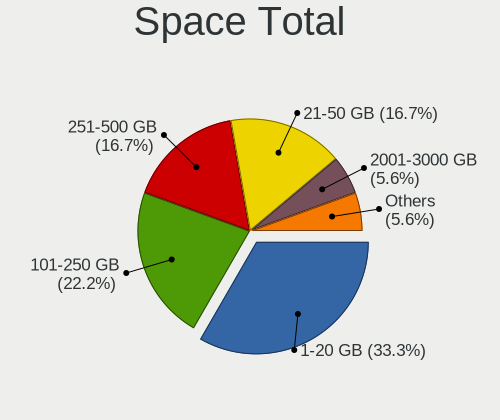
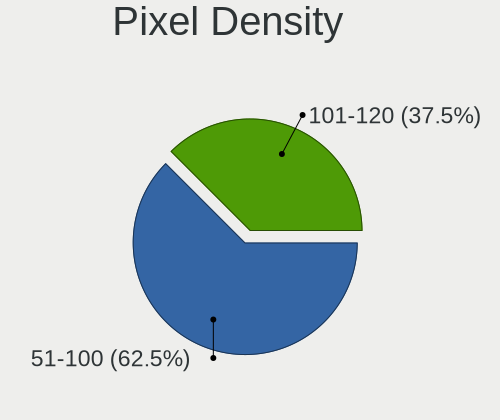
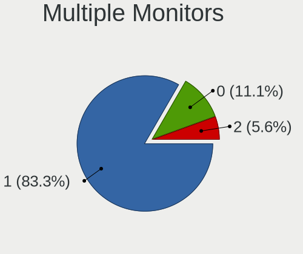
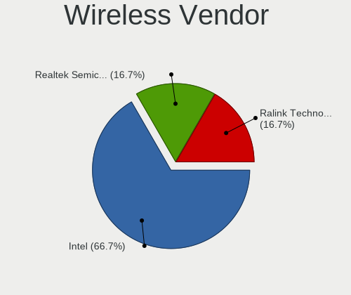
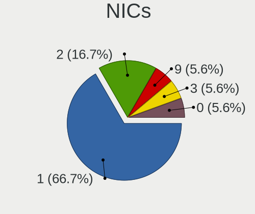
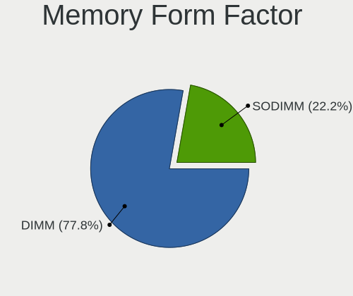
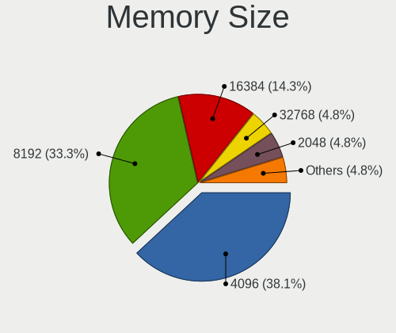

helloSystem Hardware Trends (Desktops)
--------------------------------------

A project to identify most popular hardware characteristics and track their change
over time based on data collected by helloSystem users at https://BSD-Hardware.info.

Anyone can contribute to this report by the [hw-probe](https://github.com/linuxhw/hw-probe/blob/master/INSTALL.BSD.md) tool:

    hw-probe -all -upload

Full-feature report is available here: https://bsd-hardware.info/?view=trends

Period: Mar, 2022.

Contents
--------

* [ System ](#system)
  - [ OS                       ](#os)
  - [ OS Family                ](#os-family)
  - [ Arch                     ](#arch)
  - [ DE                       ](#de)
  - [ Display Server           ](#display-server)
  - [ Display Manager          ](#display-manager)
  - [ OS Lang                  ](#os-lang)
  - [ Boot Mode                ](#boot-mode)
  - [ Filesystem               ](#filesystem)
  - [ Part. scheme             ](#part-scheme)

* [ Board ](#board)
  - [ Vendor                   ](#vendor)
  - [ Model                    ](#model)
  - [ Model Family             ](#model-family)
  - [ MFG Year                 ](#mfg-year)
  - [ Form Factor              ](#form-factor)
  - [ Coreboot                 ](#coreboot)
  - [ RAM Size                 ](#ram-size)
  - [ RAM Used                 ](#ram-used)
  - [ Total Drives             ](#total-drives)
  - [ Has CD-ROM               ](#has-cd-rom)
  - [ Has Ethernet             ](#has-ethernet)
  - [ Has WiFi                 ](#has-wifi)
  - [ Has Bluetooth            ](#has-bluetooth)

* [ Location ](#location)
  - [ Country                  ](#country)
  - [ City                     ](#city)

* [ Drives ](#drives)
  - [ Drive Vendor             ](#drive-vendor)
  - [ Drive Model              ](#drive-model)
  - [ HDD Vendor               ](#hdd-vendor)
  - [ SSD Vendor               ](#ssd-vendor)
  - [ Drive Kind               ](#drive-kind)
  - [ Drive Connector          ](#drive-connector)
  - [ Drive Size               ](#drive-size)
  - [ Space Total              ](#space-total)
  - [ Space Used               ](#space-used)
  - [ Malfunc. Drives          ](#malfunc-drives)
  - [ Malfunc. Drive Vendor    ](#malfunc-drive-vendor)
  - [ Malfunc. HDD Vendor      ](#malfunc-hdd-vendor)
  - [ Malfunc. Drive Kind      ](#malfunc-drive-kind)
  - [ Failed Drives            ](#failed-drives)
  - [ Failed Drive Vendor      ](#failed-drive-vendor)
  - [ Drive Status             ](#drive-status)

* [ Storage controller ](#storage-controller)
  - [ Storage Vendor           ](#storage-vendor)
  - [ Storage Model            ](#storage-model)
  - [ Storage Kind             ](#storage-kind)

* [ Processor ](#processor)
  - [ CPU Vendor               ](#cpu-vendor)
  - [ CPU Model                ](#cpu-model)
  - [ CPU Model Family         ](#cpu-model-family)
  - [ CPU Cores                ](#cpu-cores)
  - [ CPU Sockets              ](#cpu-sockets)
  - [ CPU Threads              ](#cpu-threads)
  - [ CPU Microarch            ](#cpu-microarch)

* [ Graphics ](#graphics)
  - [ GPU Vendor               ](#gpu-vendor)
  - [ GPU Model                ](#gpu-model)
  - [ GPU Combo                ](#gpu-combo)
  - [ GPU Driver               ](#gpu-driver)
  - [ GPU Memory               ](#gpu-memory)

* [ Monitor ](#monitor)
  - [ Monitor Vendor           ](#monitor-vendor)
  - [ Monitor Model            ](#monitor-model)
  - [ Monitor Resolution       ](#monitor-resolution)
  - [ Monitor Diagonal         ](#monitor-diagonal)
  - [ Monitor Width            ](#monitor-width)
  - [ Aspect Ratio             ](#aspect-ratio)
  - [ Monitor Area             ](#monitor-area)
  - [ Pixel Density            ](#pixel-density)
  - [ Multiple Monitors        ](#multiple-monitors)

* [ Network ](#network)
  - [ Net Controller Vendor    ](#net-controller-vendor)
  - [ Net Controller Model     ](#net-controller-model)
  - [ Wireless Vendor          ](#wireless-vendor)
  - [ Wireless Model           ](#wireless-model)
  - [ Ethernet Vendor          ](#ethernet-vendor)
  - [ Ethernet Model           ](#ethernet-model)
  - [ Net Controller Kind      ](#net-controller-kind)
  - [ Used Controller          ](#used-controller)
  - [ NICs                     ](#nics)
  - [ IPv6                     ](#ipv6)

* [ Bluetooth ](#bluetooth)
  - [ Bluetooth Vendor         ](#bluetooth-vendor)
  - [ Bluetooth Model          ](#bluetooth-model)

* [ Sound ](#sound)
  - [ Sound Vendor             ](#sound-vendor)
  - [ Sound Model              ](#sound-model)

* [ Memory ](#memory)
  - [ Memory Vendor            ](#memory-vendor)
  - [ Memory Model             ](#memory-model)
  - [ Memory Kind              ](#memory-kind)
  - [ Memory Form Factor       ](#memory-form-factor)
  - [ Memory Size              ](#memory-size)
  - [ Memory Speed             ](#memory-speed)

* [ Printers & scanners ](#printers--scanners)
  - [ Printer Vendor           ](#printer-vendor)
  - [ Printer Model            ](#printer-model)
  - [ Scanner Vendor           ](#scanner-vendor)
  - [ Scanner Model            ](#scanner-model)

* [ Camera ](#camera)
  - [ Camera Vendor            ](#camera-vendor)
  - [ Camera Model             ](#camera-model)

* [ Security ](#security)
  - [ Fingerprint Vendor       ](#fingerprint-vendor)
  - [ Fingerprint Model        ](#fingerprint-model)
  - [ Chipcard Vendor          ](#chipcard-vendor)
  - [ Chipcard Model           ](#chipcard-model)

* [ Unsupported ](#unsupported)
  - [ Unsupported Devices      ](#unsupported-devices)
  - [ Unsupported Device Types ](#unsupported-device-types)

System
------

OS
--

Installed operating systems

| Name              | Desktops | Percent |
|-------------------|----------|---------|
| helloSystem 0.7.0 | 17       | 80.95%  |
| helloSystem 0.8.0 | 3        | 14.29%  |
| helloSystem 0.6.0 | 1        | 4.76%   |

OS Family
---------

OS without a version

| Name        | Desktops | Percent |
|-------------|----------|---------|
| helloSystem | 21       | 100%    |

Arch
----

OS architecture (x86_64, i586, etc.)

| Name  | Desktops | Percent |
|-------|----------|---------|
| amd64 | 21       | 100%    |

DE
--

Desktop Environment

| Name         | Desktops | Percent |
|--------------|----------|---------|
| helloDesktop | 21       | 100%    |

Display Server
--------------

X11 or Wayland

| Name | Desktops | Percent |
|------|----------|---------|
| X11  | 21       | 100%    |

Display Manager
---------------

SDDM, LightDM, etc.

| Name | Desktops | Percent |
|------|----------|---------|
| SLiM | 21       | 100%    |

OS Lang
-------

Language

| Lang  | Desktops | Percent |
|-------|----------|---------|
| en_US | 21       | 100%    |

Boot Mode
---------

EFI or BIOS

| Mode | Desktops | Percent |
|------|----------|---------|
| EFI  | 19       | 90.48%  |
| BIOS | 2        | 9.52%   |

Filesystem
----------

Type of filesystem

| Type   | Desktops | Percent |
|--------|----------|---------|
| Cd9660 | 13       | 61.9%   |
| Zfs    | 8        | 38.1%   |

Part. scheme
------------

Scheme of partitioning

| Type | Desktops | Percent |
|------|----------|---------|
| GPT  | 19       | 90.48%  |
| MBR  | 2        | 9.52%   |

Board
-----

Vendor
------

Motherboard manufacturer

| Name                | Desktops | Percent |
|---------------------|----------|---------|
| ASUSTek Computer    | 5        | 23.81%  |
| Gigabyte Technology | 4        | 19.05%  |
| MSI                 | 2        | 9.52%   |
| Hewlett-Packard     | 2        | 9.52%   |
| ASRock              | 2        | 9.52%   |
| Pegatron            | 1        | 4.76%   |
| Lenovo              | 1        | 4.76%   |
| Koloe               | 1        | 4.76%   |
| Intel               | 1        | 4.76%   |
| ECS                 | 1        | 4.76%   |
| Dell                | 1        | 4.76%   |

Model
-----

Motherboard model

| Name                         | Desktops | Percent |
|------------------------------|----------|---------|
| Pegatron IPM41-D3            | 1        | 4.76%   |
| MSI MS-7A38                  | 1        | 4.76%   |
| MSI MS-7816                  | 1        | 4.76%   |
| Lenovo IdeaCentre B545 10100 | 1        | 4.76%   |
| Koloe Thurley                | 1        | 4.76%   |
| Intel DN2800MT AAG23738-600  | 1        | 4.76%   |
| HP Z230 Tower Workstation    | 1        | 4.76%   |
| HP EliteDesk 800 G2 SFF      | 1        | 4.76%   |
| Gigabyte H61M-S2PV           | 1        | 4.76%   |
| Gigabyte H270-Gaming 3       | 1        | 4.76%   |
| Gigabyte H110N-CF            | 1        | 4.76%   |
| Gigabyte G31M-ES2C           | 1        | 4.76%   |
| ECS G41T-M9                  | 1        | 4.76%   |
| Dell OptiPlex 7010           | 1        | 4.76%   |
| ASUS P8Z77-V LX              | 1        | 4.76%   |
| ASUS P6-P8H61E               | 1        | 4.76%   |
| ASUS P5Q DELUXE              | 1        | 4.76%   |
| ASUS M5A78L-M LX3            | 1        | 4.76%   |
| ASUS M4A88T-M                | 1        | 4.76%   |
| ASRock G41C-VS               | 1        | 4.76%   |
| ASRock A320M-HDV R4.0        | 1        | 4.76%   |

Model Family
------------

Motherboard model prefix

| Name                 | Desktops | Percent |
|----------------------|----------|---------|
| Pegatron IPM41-D3    | 1        | 4.76%   |
| MSI MS-7A38          | 1        | 4.76%   |
| MSI MS-7816          | 1        | 4.76%   |
| Lenovo IdeaCentre    | 1        | 4.76%   |
| Koloe Thurley        | 1        | 4.76%   |
| Intel DN2800MT       | 1        | 4.76%   |
| HP Z230              | 1        | 4.76%   |
| HP EliteDesk         | 1        | 4.76%   |
| Gigabyte H61M-S2PV   | 1        | 4.76%   |
| Gigabyte H270-Gaming | 1        | 4.76%   |
| Gigabyte H110N-CF    | 1        | 4.76%   |
| Gigabyte G31M-ES2C   | 1        | 4.76%   |
| ECS G41T-M9          | 1        | 4.76%   |
| Dell OptiPlex        | 1        | 4.76%   |
| ASUS P8Z77-V         | 1        | 4.76%   |
| ASUS P6-P8H61E       | 1        | 4.76%   |
| ASUS P5Q             | 1        | 4.76%   |
| ASUS M5A78L-M        | 1        | 4.76%   |
| ASUS M4A88T-M        | 1        | 4.76%   |
| ASRock G41C-VS       | 1        | 4.76%   |
| ASRock A320M-HDV     | 1        | 4.76%   |

MFG Year
--------

Motherboard manufacture year

| Year | Desktops | Percent |
|------|----------|---------|
| 2012 | 4        | 19.05%  |
| 2016 | 3        | 14.29%  |
| 2014 | 3        | 14.29%  |
| 2010 | 3        | 14.29%  |
| 2009 | 3        | 14.29%  |
| 2018 | 2        | 9.52%   |
| 2019 | 1        | 4.76%   |
| 2017 | 1        | 4.76%   |
| 2011 | 1        | 4.76%   |

Form Factor
-----------

Physical design of the computer

| Name    | Desktops | Percent |
|---------|----------|---------|
| Desktop | 21       | 100%    |

Coreboot
--------

Have coreboot on board

| Used | Desktops | Percent |
|------|----------|---------|
| No   | 21       | 100%    |

RAM Size
--------

Total RAM memory

| Size in GB | Desktops | Percent |
|------------|----------|---------|
| 8.01-16.0  | 8        | 38.1%   |
| 4.01-8.0   | 6        | 28.57%  |
| 16.01-24.0 | 3        | 14.29%  |
| 2.01-3.0   | 2        | 9.52%   |
| 32.01-64.0 | 1        | 4.76%   |
| 1.01-2.0   | 1        | 4.76%   |

RAM Used
--------

Used RAM memory

| Used GB  | Desktops | Percent |
|----------|----------|---------|
| 0.01-0.5 | 13       | 61.9%   |
| 0.51-1.0 | 5        | 23.81%  |
| 1.01-2.0 | 2        | 9.52%   |
| 2.01-3.0 | 1        | 4.76%   |

Total Drives
------------

Number of drives on board

| Drives | Desktops | Percent |
|--------|----------|---------|
| 1      | 14       | 66.67%  |
| 2      | 4        | 19.05%  |
| 3      | 2        | 9.52%   |
| 4      | 1        | 4.76%   |

Has CD-ROM
----------

Has CD-ROM on board

| Presented | Desktops | Percent |
|-----------|----------|---------|
| No        | 13       | 61.9%   |
| Yes       | 8        | 38.1%   |

Has Ethernet
------------

Has Ethernet on board

| Presented | Desktops | Percent |
|-----------|----------|---------|
| Yes       | 21       | 100%    |

Has WiFi
--------

Has WiFi module

| Presented | Desktops | Percent |
|-----------|----------|---------|
| No        | 15       | 71.43%  |
| Yes       | 6        | 28.57%  |

Has Bluetooth
-------------

Has Bluetooth module

| Presented | Desktops | Percent |
|-----------|----------|---------|
| No        | 19       | 90.48%  |
| Yes       | 2        | 9.52%   |

Location
--------

Country
-------

Geographic location (country)

| Country     | Desktops | Percent |
|-------------|----------|---------|
| Russia      | 6        | 28.57%  |
| USA         | 2        | 9.52%   |
| South Korea | 2        | 9.52%   |
| Germany     | 2        | 9.52%   |
| Brazil      | 2        | 9.52%   |
| Ukraine     | 1        | 4.76%   |
| Thailand    | 1        | 4.76%   |
| Spain       | 1        | 4.76%   |
| Poland      | 1        | 4.76%   |
| India       | 1        | 4.76%   |
| Hungary     | 1        | 4.76%   |
| China       | 1        | 4.76%   |

City
----

Geographic location (city)

| City                    | Desktops | Percent |
|-------------------------|----------|---------|
| Moscow                  | 3        | 14.29%  |
| Volgograd               | 1        | 4.76%   |
| Szombathely             | 1        | 4.76%   |
| St Petersburg           | 1        | 4.76%   |
| Songpa-gu               | 1        | 4.76%   |
| Pforzheim               | 1        | 4.76%   |
| Perm                    | 1        | 4.76%   |
| Paju                    | 1        | 4.76%   |
| Malonikolayevka         | 1        | 4.76%   |
| Jelenia Góra           | 1        | 4.76%   |
| Independence            | 1        | 4.76%   |
| Curitiba                | 1        | 4.76%   |
| Chennai                 | 1        | 4.76%   |
| Castilleja de la Cuesta | 1        | 4.76%   |
| Branford                | 1        | 4.76%   |
| Böblingen              | 1        | 4.76%   |
| Belém                  | 1        | 4.76%   |
| Beijing                 | 1        | 4.76%   |
| Bang Klam               | 1        | 4.76%   |

Drives
------

Drive Vendor
------------

Hard drive vendors

| Vendor              | Desktops | Drives | Percent |
|---------------------|----------|--------|---------|
| WDC                 | 4        | 5      | 12.9%   |
| Toshiba             | 4        | 4      | 12.9%   |
| Seagate             | 4        | 4      | 12.9%   |
| Samsung Electronics | 4        | 4      | 12.9%   |
| Kingston            | 3        | 3      | 9.68%   |
| Hitachi             | 3        | 3      | 9.68%   |
| SPCC                | 2        | 2      | 6.45%   |
| Patriot             | 2        | 2      | 6.45%   |
| Crucial             | 2        | 2      | 6.45%   |
| SanDisk             | 1        | 1      | 3.23%   |
| KingSpec            | 1        | 1      | 3.23%   |
| HGST                | 1        | 1      | 3.23%   |

Drive Model
-----------

Hard drive models

| Model                           | Desktops | Percent |
|---------------------------------|----------|---------|
| WDC WDS120G2G0A-00JH30 120GB    | 1        | 3.23%   |
| WDC WD5000LPLX-66ZNTT0 500GB    | 1        | 3.23%   |
| WDC WD5000AAKX-75U6AA0 500GB    | 1        | 3.23%   |
| WDC WD400JB-00ENA0 40GB         | 1        | 3.23%   |
| Toshiba HDWD110 1TB             | 1        | 3.23%   |
| Toshiba DT01ACA300 3TB          | 1        | 3.23%   |
| Toshiba DT01ACA100 1TB          | 1        | 3.23%   |
| Toshiba DT01ACA050 500GB        | 1        | 3.23%   |
| SPCC Solid State Disk 56GB      | 1        | 3.23%   |
| SPCC Solid State Disk 120GB     | 1        | 3.23%   |
| Seagate ST91000640SS 1TB        | 1        | 3.23%   |
| Seagate ST500LM021-1KJ152 500GB | 1        | 3.23%   |
| Seagate ST3250310AS 250GB       | 1        | 3.23%   |
| Seagate ST31000528AS 1TB        | 1        | 3.23%   |
| SanDisk SD8SB8U512G1122 512GB   | 1        | 3.23%   |
| Samsung SSD 840 EVO 250GB       | 1        | 3.23%   |
| Samsung SP0812C 80GB            | 1        | 3.23%   |
| Samsung HD322HJ 320GB           | 1        | 3.23%   |
| Samsung HD250HJ 250GB           | 1        | 3.23%   |
| Patriot Burst Elite 120GB       | 1        | 3.23%   |
| Patriot Burst 120GB             | 1        | 3.23%   |
| Kingston SA400S37240G 240GB     | 1        | 3.23%   |
| Kingston SA400S37120G 120GB     | 1        | 3.23%   |
| Kingston SA2000M8500G 500GB     | 1        | 3.23%   |
| KingSpec NT-512 512GB           | 1        | 3.23%   |
| Hitachi HTS722020K9SA00 200GB   | 1        | 3.23%   |
| Hitachi HTS541680J9SA00 80GB    | 1        | 3.23%   |
| Hitachi HDS728080PLAT20 82GB    | 1        | 3.23%   |
| HGST HTS725032A7E630 320GB      | 1        | 3.23%   |
| Crucial CT240BX500SSD1 240GB    | 1        | 3.23%   |
| Crucial CT1050MX300SSD1 1TB     | 1        | 3.23%   |

HDD Vendor
----------

Hard disk drive vendors

| Vendor              | Desktops | Drives | Percent |
|---------------------|----------|--------|---------|
| Toshiba             | 4        | 4      | 22.22%  |
| Seagate             | 4        | 4      | 22.22%  |
| WDC                 | 3        | 3      | 16.67%  |
| Samsung Electronics | 3        | 3      | 16.67%  |
| Hitachi             | 3        | 3      | 16.67%  |
| HGST                | 1        | 1      | 5.56%   |

SSD Vendor
----------

Solid state drive vendors

| Vendor              | Desktops | Drives | Percent |
|---------------------|----------|--------|---------|
| SPCC                | 2        | 2      | 16.67%  |
| Patriot             | 2        | 2      | 16.67%  |
| Kingston            | 2        | 2      | 16.67%  |
| Crucial             | 2        | 2      | 16.67%  |
| WDC                 | 1        | 2      | 8.33%   |
| SanDisk             | 1        | 1      | 8.33%   |
| Samsung Electronics | 1        | 1      | 8.33%   |
| KingSpec            | 1        | 1      | 8.33%   |

Drive Kind
----------

HDD or SSD

| Kind | Desktops | Drives | Percent |
|------|----------|--------|---------|
| HDD  | 14       | 18     | 56%     |
| SSD  | 10       | 13     | 40%     |
| NVMe | 1        | 1      | 4%      |

Drive Connector
---------------

SATA, SAS, NVMe, etc.

| Type | Desktops | Drives | Percent |
|------|----------|--------|---------|
| SATA | 21       | 31     | 95.45%  |
| NVMe | 1        | 1      | 4.55%   |

Drive Size
----------

Size of hard drive

| Size in TB | Desktops | Drives | Percent |
|------------|----------|--------|---------|
| 0.01-0.5   | 18       | 23     | 72%     |
| 0.51-1.0   | 5        | 6      | 20%     |
| 2.01-3.0   | 1        | 1      | 4%      |
| 1.01-2.0   | 1        | 1      | 4%      |

Space Total
-----------

Amount of disk space available on the file system

| Size in GB | Desktops | Percent |
|------------|----------|---------|
| 1-20       | 11       | 52.38%  |
| 101-250    | 5        | 23.81%  |
| 501-1000   | 2        | 9.52%   |
| 51-100     | 2        | 9.52%   |
| 251-500    | 1        | 4.76%   |

Space Used
----------

Amount of used disk space

| Used GB | Desktops | Percent |
|---------|----------|---------|
| 1-20    | 20       | 95.24%  |
| 21-50   | 1        | 4.76%   |

Malfunc. Drives
---------------

Drive models with a malfunction

| Model                             | Desktops | Drives | Percent |
|-----------------------------------|----------|--------|---------|
| WDC WD400JB-00ENA0 40GB           | 1        | 1      | 14.29%  |
| Seagate ST3250310AS 250GB         | 1        | 1      | 14.29%  |
| Seagate ST31000528AS 1TB          | 1        | 1      | 14.29%  |
| Samsung Electronics HD250HJ 250GB | 1        | 1      | 14.29%  |
| Hitachi HTS722020K9SA00 200GB     | 1        | 1      | 14.29%  |
| Hitachi HTS541680J9SA00 80GB      | 1        | 1      | 14.29%  |
| Crucial CT1050MX300SSD1 1TB       | 1        | 1      | 14.29%  |

Malfunc. Drive Vendor
---------------------

Vendors of faulty drives

| Vendor              | Desktops | Drives | Percent |
|---------------------|----------|--------|---------|
| Seagate             | 2        | 2      | 28.57%  |
| Hitachi             | 2        | 2      | 28.57%  |
| WDC                 | 1        | 1      | 14.29%  |
| Samsung Electronics | 1        | 1      | 14.29%  |
| Crucial             | 1        | 1      | 14.29%  |

Malfunc. HDD Vendor
-------------------

Vendors of faulty HDD drives

| Vendor              | Desktops | Drives | Percent |
|---------------------|----------|--------|---------|
| Seagate             | 2        | 2      | 33.33%  |
| Hitachi             | 2        | 2      | 33.33%  |
| WDC                 | 1        | 1      | 16.67%  |
| Samsung Electronics | 1        | 1      | 16.67%  |

Malfunc. Drive Kind
-------------------

Kinds of faulty drives

| Kind | Desktops | Drives | Percent |
|------|----------|--------|---------|
| HDD  | 5        | 6      | 83.33%  |
| SSD  | 1        | 1      | 16.67%  |

Failed Drives
-------------

Failed drive models

Zero info for selected period =(

Failed Drive Vendor
-------------------

Failed drive vendors

Zero info for selected period =(

Drive Status
------------

Number of failed and malfunc. drives

| Status   | Desktops | Drives | Percent |
|----------|----------|--------|---------|
| Works    | 15       | 24     | 68.18%  |
| Malfunc  | 6        | 7      | 27.27%  |
| Detected | 1        | 1      | 4.55%   |

Storage controller
------------------

Storage Vendor
--------------

Storage controller vendors

| Vendor                      | Desktops | Percent |
|-----------------------------|----------|---------|
| Intel                       | 16       | 66.67%  |
| AMD                         | 5        | 20.83%  |
| Marvell Technology Group    | 1        | 4.17%   |
| Kingston Technology Company | 1        | 4.17%   |
| Broadcom / LSI              | 1        | 4.17%   |

Storage Model
-------------

Storage controller models

| Model                                                                          | Desktops | Percent |
|--------------------------------------------------------------------------------|----------|---------|
| Intel NM10/ICH7 Family SATA Controller [IDE mode]                              | 4        | 13.33%  |
| AMD FCH SATA Controller [AHCI mode]                                            | 3        | 10%     |
| Intel Q170/Q150/B150/H170/H110/Z170/CM236 Chipset SATA Controller [AHCI Mode]  | 2        | 6.67%   |
| Intel 82801JI (ICH10 Family) SATA AHCI Controller                              | 2        | 6.67%   |
| Intel 82801G (ICH7 Family) IDE Controller                                      | 2        | 6.67%   |
| Intel 7 Series/C210 Series Chipset Family 6-port SATA Controller [AHCI mode]   | 2        | 6.67%   |
| Intel 6 Series/C200 Series Chipset Family 6 port Desktop SATA AHCI Controller  | 2        | 6.67%   |
| AMD SB7x0/SB8x0/SB9x0 SATA Controller [IDE mode]                               | 2        | 6.67%   |
| AMD SB7x0/SB8x0/SB9x0 IDE Controller                                           | 2        | 6.67%   |
| Marvell Group 88SE6111/6121 SATA II / PATA Controller                          | 1        | 3.33%   |
| Kingston Company A2000 NVMe SSD                                                | 1        | 3.33%   |
| Intel SATA Controller [RAID mode]                                              | 1        | 3.33%   |
| Intel NM10/ICH7 Family SATA Controller [AHCI mode]                             | 1        | 3.33%   |
| Intel 8 Series/C220 Series Chipset Family 6-port SATA Controller 1 [AHCI mode] | 1        | 3.33%   |
| Intel 200 Series PCH SATA controller [AHCI mode]                               | 1        | 3.33%   |
| Broadcom / LSI SAS1068E PCI-Express Fusion-MPT SAS                             | 1        | 3.33%   |
| AMD FCH SATA Controller D                                                      | 1        | 3.33%   |
| AMD 300 Series Chipset SATA Controller                                         | 1        | 3.33%   |

Storage Kind
------------

Kind of storage controller (IDE, SATA, NVMe, SAS, ...)

| Kind | Desktops | Percent |
|------|----------|---------|
| SATA | 14       | 58.33%  |
| IDE  | 7        | 29.17%  |
| RAID | 1        | 4.17%   |
| SCSI | 1        | 4.17%   |
| NVMe | 1        | 4.17%   |

Processor
---------

CPU Vendor
----------

Processor vendors

| Vendor | Desktops | Percent |
|--------|----------|---------|
| Intel  | 16       | 76.19%  |
| AMD    | 5        | 23.81%  |

CPU Model
---------

Processor models

| Model                                       | Desktops | Percent |
|---------------------------------------------|----------|---------|
| Intel Pentium CPU G860 @ 3.00GHz            | 2        | 9.52%   |
| Intel Core i5-6500 CPU @ 3.20GHz            | 2        | 9.52%   |
| Intel Xeon CPU E5504 @ 2.00GHz              | 1        | 4.76%   |
| Intel Xeon CPU E3-1270 v3 @ 3.50GHz         | 1        | 4.76%   |
| Intel Xeon CPU E3-1241 v3 @ 3.50GHz         | 1        | 4.76%   |
| Intel Pentium Dual-Core CPU E6700 @ 3.20GHz | 1        | 4.76%   |
| Intel Pentium Dual-Core CPU E5400 @ 2.70GHz | 1        | 4.76%   |
| Intel Core i7-6700 CPU @ 3.40GHz            | 1        | 4.76%   |
| Intel Core i7-3770 CPU @ 3.40GHz            | 1        | 4.76%   |
| Intel Core i5-3450 CPU @ 3.10GHz            | 1        | 4.76%   |
| Intel Core 2 Quad CPU Q9550 @ 2.83GHz       | 1        | 4.76%   |
| Intel Core 2 Quad CPU Q8300 @ 2.50GHz       | 1        | 4.76%   |
| Intel Core 2 Quad CPU                       | 1        | 4.76%   |
| Intel Atom CPU N2800 @ 1.86GHz              | 1        | 4.76%   |
| AMD Ryzen 5 2400G with Radeon Vega Graphics | 1        | 4.76%   |
| AMD Ryzen 3 2200G with Radeon Vega Graphics | 1        | 4.76%   |
| AMD Phenom II X4 B55 Processor              | 1        | 4.76%   |
| AMD Athlon II X4 635 Processor              | 1        | 4.76%   |
| AMD A10-5700 APU with Radeon HD Graphics    | 1        | 4.76%   |

CPU Model Family
----------------

Processor model prefix

| Model                   | Desktops | Percent |
|-------------------------|----------|---------|
| Intel Xeon              | 3        | 14.29%  |
| Intel Core i5           | 3        | 14.29%  |
| Intel Core 2 Quad       | 3        | 14.29%  |
| Intel Pentium Dual-Core | 2        | 9.52%   |
| Intel Pentium           | 2        | 9.52%   |
| Intel Core i7           | 2        | 9.52%   |
| Intel Atom              | 1        | 4.76%   |
| AMD Ryzen 5             | 1        | 4.76%   |
| AMD Ryzen 3             | 1        | 4.76%   |
| AMD Phenom II X4        | 1        | 4.76%   |
| AMD Athlon II X4        | 1        | 4.76%   |
| AMD A10                 | 1        | 4.76%   |

CPU Cores
---------

Number of processor cores

| Number  | Desktops | Percent |
|---------|----------|---------|
| 4       | 14       | 66.67%  |
| 2       | 5        | 23.81%  |
| 8       | 1        | 4.76%   |
| Unknown | 1        | 4.76%   |

CPU Sockets
-----------

Number of sockets

| Number | Desktops | Percent |
|--------|----------|---------|
| 1      | 21       | 100%    |

CPU Threads
-----------

Threads per core (Hyper-Threading)

| Number  | Desktops | Percent |
|---------|----------|---------|
| 1       | 16       | 76.19%  |
| 2       | 4        | 19.05%  |
| Unknown | 1        | 4.76%   |

CPU Microarch
-------------

Microarchitecture

| Name        | Desktops | Percent |
|-------------|----------|---------|
| Penryn      | 4        | 19.05%  |
| Skylake     | 3        | 14.29%  |
| Zen         | 2        | 9.52%   |
| SandyBridge | 2        | 9.52%   |
| K10         | 2        | 9.52%   |
| IvyBridge   | 2        | 9.52%   |
| Haswell     | 2        | 9.52%   |
| Piledriver  | 1        | 4.76%   |
| Nehalem     | 1        | 4.76%   |
| Core        | 1        | 4.76%   |
| Bonnell     | 1        | 4.76%   |

Graphics
--------

GPU Vendor
----------

Vendors of graphics cards

| Vendor | Desktops | Percent |
|--------|----------|---------|
| Nvidia | 9        | 40.91%  |
| Intel  | 7        | 31.82%  |
| AMD    | 6        | 27.27%  |

GPU Model
---------

Graphics card models

| Model                                                                     | Desktops | Percent |
|---------------------------------------------------------------------------|----------|---------|
| Intel HD Graphics 530                                                     | 2        | 8.7%    |
| Nvidia TU116 [GeForce GTX 1660]                                           | 1        | 4.35%   |
| Nvidia GP107 [GeForce GTX 1050 Ti]                                        | 1        | 4.35%   |
| Nvidia GK208B [GeForce GT 730]                                            | 1        | 4.35%   |
| Nvidia GK208B [GeForce GT 710]                                            | 1        | 4.35%   |
| Nvidia GK107GL [Quadro K2000]                                             | 1        | 4.35%   |
| Nvidia GK104 [GeForce GTX 770]                                            | 1        | 4.35%   |
| Nvidia GF119 [GeForce GT 625 OEM]                                         | 1        | 4.35%   |
| Nvidia GF108 [GeForce GT 430]                                             | 1        | 4.35%   |
| Nvidia G73 [GeForce 7600 GS]                                              | 1        | 4.35%   |
| Intel Xeon E3-1200 v2/3rd Gen Core processor Graphics Controller          | 1        | 4.35%   |
| Intel Atom Processor D2xxx/N2xxx Integrated Graphics Controller           | 1        | 4.35%   |
| Intel 82G33/G31 Express Integrated Graphics Controller                    | 1        | 4.35%   |
| Intel 4 Series Chipset Integrated Graphics Controller                     | 1        | 4.35%   |
| Intel 2nd Generation Core Processor Family Integrated Graphics Controller | 1        | 4.35%   |
| AMD Trinity [Radeon HD 7660D]                                             | 1        | 4.35%   |
| AMD RV710 [Radeon HD 4350/4550]                                           | 1        | 4.35%   |
| AMD RS880 [Radeon HD 4250]                                                | 1        | 4.35%   |
| AMD Redwood PRO [Radeon HD 5550/5570/5630/6510/6610/7570]                 | 1        | 4.35%   |
| AMD Raven Ridge [Radeon Vega Series / Radeon Vega Mobile Series]          | 1        | 4.35%   |
| AMD Caicos [Radeon HD 6450A/7450A]                                        | 1        | 4.35%   |
| AMD Baffin [Radeon RX 460/560D / Pro 450/455/460/555/555X/560/560X]       | 1        | 4.35%   |

GPU Combo
---------

Combinations of graphics cards

| Name           | Desktops | Percent |
|----------------|----------|---------|
| 1 x Nvidia     | 8        | 38.1%   |
| 1 x Intel      | 5        | 23.81%  |
| 1 x AMD        | 5        | 23.81%  |
| 2 x Intel      | 1        | 4.76%   |
| 2 x AMD        | 1        | 4.76%   |
| Intel + Nvidia | 1        | 4.76%   |

GPU Driver
----------

Free vs proprietary

| Driver      | Desktops | Percent |
|-------------|----------|---------|
| Free        | 12       | 57.14%  |
| Proprietary | 8        | 38.1%   |
| Unknown     | 1        | 4.76%   |

GPU Memory
----------

Total video memory

| Size in GB | Desktops | Percent |
|------------|----------|---------|
| Unknown    | 8        | 38.1%   |
| 1.01-2.0   | 4        | 19.05%  |
| 0.51-1.0   | 3        | 14.29%  |
| 0.01-0.5   | 3        | 14.29%  |
| 3.01-4.0   | 2        | 9.52%   |
| 5.01-6.0   | 1        | 4.76%   |

Monitor
-------

Monitor Vendor
--------------

Monitor vendors

| Vendor               | Desktops | Percent |
|----------------------|----------|---------|
| Dell                 | 5        | 31.25%  |
| Lenovo               | 2        | 12.5%   |
| Goldstar             | 2        | 12.5%   |
| Ancor Communications | 2        | 12.5%   |
| Vestel Elektronik    | 1        | 6.25%   |
| Samsung Electronics  | 1        | 6.25%   |
| Fujitsu Siemens      | 1        | 6.25%   |
| FND                  | 1        | 6.25%   |
| Acer                 | 1        | 6.25%   |

Monitor Model
-------------

Monitor models

| Model                                                               | Desktops | Percent |
|---------------------------------------------------------------------|----------|---------|
| Ancor Communications MX27AQ ACI27A5 2560x1440 600x340mm 27.2-inch   | 2        | 12.5%   |
| Vestel Elektronik 24W_LCD_TV VES3700 1920x1080 530x300mm 24.0-inch  | 1        | 6.25%   |
| Samsung Electronics SyncMaster SAM05FF 1600x900 440x250mm 19.9-inch | 1        | 6.25%   |
| Lenovo LEN T22i-10 LEN61A9 1920x1080 480x270mm 21.7-inch            | 1        | 6.25%   |
| Lenovo LCD Monitor LEN4000 1920x1080 510x290mm 23.1-inch            | 1        | 6.25%   |
| Goldstar LCD Monitor GSM5AB6 1920x1080 480x270mm 21.7-inch          | 1        | 6.25%   |
| Goldstar 2D FHD LG TV GSM59C6 1920x1080 510x290mm 23.1-inch         | 1        | 6.25%   |
| Fujitsu Siemens A17-2 DVI FUS0620 1280x1024 340x270mm 17.1-inch     | 1        | 6.25%   |
| FND F191WL FND02B8 1440x900 410x260mm 19.1-inch                     | 1        | 6.25%   |
| Dell S2418HN/NX DEL4123 1920x1080 530x300mm 24.0-inch               | 1        | 6.25%   |
| Dell P2418D DELD0C2 2560x1440 530x300mm 24.0-inch                   | 1        | 6.25%   |
| Dell IN2020M DELF029 1600x900 440x250mm 19.9-inch                   | 1        | 6.25%   |
| Dell E2216HV DELF06F 1920x1080 480x270mm 21.7-inch                  | 1        | 6.25%   |
| Dell E173FP DELA00B 1280x1024 340x270mm 17.1-inch                   | 1        | 6.25%   |
| Acer B173 ACR001C 1280x1024 340x270mm 17.1-inch                     | 1        | 6.25%   |

Monitor Resolution
------------------

Monitor screen resolution

| Resolution       | Desktops | Percent |
|------------------|----------|---------|
| 1920x1080 (FHD)  | 6        | 37.5%   |
| 2560x1440 (QHD)  | 3        | 18.75%  |
| 1280x1024 (SXGA) | 3        | 18.75%  |
| 1600x900 (HD+)   | 2        | 12.5%   |
| 1920x540         | 1        | 6.25%   |
| 1440x900 (WXGA+) | 1        | 6.25%   |

Monitor Diagonal
----------------

Diagonal size in inches

| Inches | Desktops | Percent |
|--------|----------|---------|
| 21     | 3        | 18.75%  |
| 19     | 3        | 18.75%  |
| 17     | 3        | 18.75%  |
| 27     | 2        | 12.5%   |
| 24     | 2        | 12.5%   |
| 23     | 2        | 12.5%   |
| 42     | 1        | 6.25%   |

Monitor Width
-------------

Physical width

| Width in mm | Desktops | Percent |
|-------------|----------|---------|
| 501-600     | 6        | 37.5%   |
| 401-500     | 6        | 37.5%   |
| 301-350     | 3        | 18.75%  |
| 901-1000    | 1        | 6.25%   |

Aspect Ratio
------------

Proportional relationship between the width and the height

| Ratio | Desktops | Percent |
|-------|----------|---------|
| 16/9  | 12       | 75%     |
| 5/4   | 3        | 18.75%  |
| 16/10 | 1        | 6.25%   |

Monitor Area
------------

Area in inch²

| Area in inch² | Desktops | Percent |
|----------------|----------|---------|
| 201-250        | 7        | 43.75%  |
| 151-200        | 3        | 18.75%  |
| 141-150        | 3        | 18.75%  |
| 301-350        | 2        | 12.5%   |
| 501-1000       | 1        | 6.25%   |

Pixel Density
-------------

Pixels per inch

| Density | Desktops | Percent |
|---------|----------|---------|
| 51-100  | 10       | 62.5%   |
| 101-120 | 5        | 31.25%  |
| 121-160 | 1        | 6.25%   |

Multiple Monitors
-----------------

Total monitors connected

| Total | Desktops | Percent |
|-------|----------|---------|
| 1     | 18       | 85.71%  |
| 0     | 3        | 14.29%  |

Network
-------

Net Controller Vendor
---------------------

Controller vendors

| Vendor                   | Desktops | Percent |
|--------------------------|----------|---------|
| Realtek Semiconductor    | 15       | 51.72%  |
| Intel                    | 6        | 20.69%  |
| Qualcomm Atheros         | 3        | 10.34%  |
| Ralink Technology        | 2        | 6.9%    |
| TP-Link                  | 1        | 3.45%   |
| MediaTek                 | 1        | 3.45%   |
| Marvell Technology Group | 1        | 3.45%   |

Net Controller Model
--------------------

Controller models

| Model                                                             | Desktops | Percent |
|-------------------------------------------------------------------|----------|---------|
| Realtek RTL8111/8168/8411 PCI Express Gigabit Ethernet Controller | 12       | 40%     |
| Realtek RTL810xE PCI Express Fast Ethernet controller             | 2        | 6.67%   |
| Intel Wi-Fi 6 AX200                                               | 2        | 6.67%   |
| TP-Link Archer T2U PLUS [RTL8821AU]                               | 1        | 3.33%   |
| Realtek RTL8188EUS 802.11n Wireless Network Adapter               | 1        | 3.33%   |
| Realtek RTL8188CE 802.11b/g/n WiFi Adapter                        | 1        | 3.33%   |
| Ralink RT5370 Wireless Adapter                                    | 1        | 3.33%   |
| Ralink MT7601U Wireless Adapter                                   | 1        | 3.33%   |
| Qualcomm Atheros QCA8171 Gigabit Ethernet                         | 1        | 3.33%   |
| Qualcomm Atheros Killer E2500 Gigabit Ethernet Controller         | 1        | 3.33%   |
| Qualcomm Atheros AR8132 Fast Ethernet                             | 1        | 3.33%   |
| MediaTek 802.11ac Wireless LAN Card                               | 1        | 3.33%   |
| Marvell Group 88E8056 PCI-E Gigabit Ethernet Controller           | 1        | 3.33%   |
| Intel Ethernet Connection I217-LM                                 | 1        | 3.33%   |
| Intel Ethernet Connection (2) I219-LM                             | 1        | 3.33%   |
| Intel 82579LM Gigabit Network Connection (Lewisville)             | 1        | 3.33%   |
| Intel 82574L Gigabit Network Connection                           | 1        | 3.33%   |

Wireless Vendor
---------------

Wireless vendors

| Vendor                | Desktops | Percent |
|-----------------------|----------|---------|
| Realtek Semiconductor | 2        | 25%     |
| Ralink Technology     | 2        | 25%     |
| Intel                 | 2        | 25%     |
| TP-Link               | 1        | 12.5%   |
| MediaTek              | 1        | 12.5%   |

Wireless Model
--------------

Wireless models

| Model                                               | Desktops | Percent |
|-----------------------------------------------------|----------|---------|
| Intel Wi-Fi 6 AX200                                 | 2        | 25%     |
| TP-Link Archer T2U PLUS [RTL8821AU]                 | 1        | 12.5%   |
| Realtek RTL8188EUS 802.11n Wireless Network Adapter | 1        | 12.5%   |
| Realtek RTL8188CE 802.11b/g/n WiFi Adapter          | 1        | 12.5%   |
| Ralink RT5370 Wireless Adapter                      | 1        | 12.5%   |
| Ralink MT7601U Wireless Adapter                     | 1        | 12.5%   |
| MediaTek 802.11ac Wireless LAN Card                 | 1        | 12.5%   |

Ethernet Vendor
---------------

Ethernet vendors

| Vendor                   | Desktops | Percent |
|--------------------------|----------|---------|
| Realtek Semiconductor    | 14       | 63.64%  |
| Intel                    | 4        | 18.18%  |
| Qualcomm Atheros         | 3        | 13.64%  |
| Marvell Technology Group | 1        | 4.55%   |

Ethernet Model
--------------

Ethernet models

| Model                                                             | Desktops | Percent |
|-------------------------------------------------------------------|----------|---------|
| Realtek RTL8111/8168/8411 PCI Express Gigabit Ethernet Controller | 12       | 54.55%  |
| Realtek RTL810xE PCI Express Fast Ethernet controller             | 2        | 9.09%   |
| Qualcomm Atheros QCA8171 Gigabit Ethernet                         | 1        | 4.55%   |
| Qualcomm Atheros Killer E2500 Gigabit Ethernet Controller         | 1        | 4.55%   |
| Qualcomm Atheros AR8132 Fast Ethernet                             | 1        | 4.55%   |
| Marvell Group 88E8056 PCI-E Gigabit Ethernet Controller           | 1        | 4.55%   |
| Intel Ethernet Connection I217-LM                                 | 1        | 4.55%   |
| Intel Ethernet Connection (2) I219-LM                             | 1        | 4.55%   |
| Intel 82579LM Gigabit Network Connection (Lewisville)             | 1        | 4.55%   |
| Intel 82574L Gigabit Network Connection                           | 1        | 4.55%   |

Net Controller Kind
-------------------

Ethernet, WiFi or modem

| Kind     | Desktops | Percent |
|----------|----------|---------|
| Ethernet | 21       | 77.78%  |
| WiFi     | 6        | 22.22%  |

Used Controller
---------------

Currently used network controller

| Kind     | Desktops | Percent |
|----------|----------|---------|
| Ethernet | 20       | 90.91%  |
| WiFi     | 2        | 9.09%   |

NICs
----

Total network controllers on board

| Total | Desktops | Percent |
|-------|----------|---------|
| 1     | 17       | 80.95%  |
| 2     | 4        | 19.05%  |

IPv6
----

IPv6 vs IPv4

| Used | Desktops | Percent |
|------|----------|---------|
| No   | 20       | 95.24%  |
| Yes  | 1        | 4.76%   |

Bluetooth
---------

Bluetooth Vendor
----------------

Controller vendors

| Vendor | Desktops | Percent |
|--------|----------|---------|
| Intel  | 2        | 100%    |

Bluetooth Model
---------------

Controller models

| Model                 | Desktops | Percent |
|-----------------------|----------|---------|
| Intel AX200 Bluetooth | 2        | 100%    |

Sound
-----

Sound Vendor
------------

Sound card vendors

| Vendor              | Desktops | Percent |
|---------------------|----------|---------|
| Intel               | 16       | 48.48%  |
| Nvidia              | 8        | 24.24%  |
| AMD                 | 8        | 24.24%  |
| C-Media Electronics | 1        | 3.03%   |

Sound Model
-----------

Sound card models

| Model                                                                      | Desktops | Percent |
|----------------------------------------------------------------------------|----------|---------|
| Intel NM10/ICH7 Family High Definition Audio Controller                    | 5        | 13.89%  |
| Nvidia GK208 HDMI/DP Audio Controller                                      | 2        | 5.56%   |
| Intel 82801JI (ICH10 Family) HD Audio Controller                           | 2        | 5.56%   |
| Intel 8 Series/C220 Series Chipset High Definition Audio Controller        | 2        | 5.56%   |
| Intel 7 Series/C216 Chipset Family High Definition Audio Controller        | 2        | 5.56%   |
| Intel 6 Series/C200 Series Chipset Family High Definition Audio Controller | 2        | 5.56%   |
| Intel 100 Series/C230 Series Chipset Family HD Audio Controller            | 2        | 5.56%   |
| AMD SBx00 Azalia (Intel HDA)                                               | 2        | 5.56%   |
| AMD Family 17h/19h HD Audio Controller                                     | 2        | 5.56%   |
| Nvidia TU116 High Definition Audio Controller                              | 1        | 2.78%   |
| Nvidia GP107GL High Definition Audio Controller                            | 1        | 2.78%   |
| Nvidia GK107 HDMI Audio Controller                                         | 1        | 2.78%   |
| Nvidia GK104 HDMI Audio Controller                                         | 1        | 2.78%   |
| Nvidia GF119 HDMI Audio Controller                                         | 1        | 2.78%   |
| Nvidia GF108 High Definition Audio Controller                              | 1        | 2.78%   |
| Intel 200 Series PCH HD Audio                                              | 1        | 2.78%   |
| C-Media Electronics USB Audio Class 1.0 and 2.0 Device                     | 1        | 2.78%   |
| AMD Trinity HDMI Audio Controller                                          | 1        | 2.78%   |
| AMD RV710/730 HDMI Audio [Radeon HD 4000 series]                           | 1        | 2.78%   |
| AMD RS880 HDMI Audio [Radeon HD 4200 Series]                               | 1        | 2.78%   |
| AMD Redwood HDMI Audio [Radeon HD 5000 Series]                             | 1        | 2.78%   |
| AMD Raven/Raven2/Fenghuang HDMI/DP Audio Controller                        | 1        | 2.78%   |
| AMD FCH Azalia Controller                                                  | 1        | 2.78%   |
| AMD Baffin HDMI/DP Audio [Radeon RX 550 640SP / RX 560/560X]               | 1        | 2.78%   |

Memory
------

Memory Vendor
-------------

Memory module vendors

| Vendor              | Desktops | Percent |
|---------------------|----------|---------|
| Unknown             | 7        | 30.43%  |
| Kingston            | 6        | 26.09%  |
| Patriot             | 2        | 8.7%    |
| Micron Technology   | 2        | 8.7%    |
| Corsair             | 2        | 8.7%    |
| Samsung Electronics | 1        | 4.35%   |
| Ramaxel Technology  | 1        | 4.35%   |
| Crucial             | 1        | 4.35%   |
| Unknown             | 1        | 4.35%   |

Memory Model
------------

Memory module models

| Model                                                  | Desktops | Percent |
|--------------------------------------------------------|----------|---------|
| Unknown RAM Module 4GB DIMM 1600MT/s                   | 1        | 3.45%   |
| Unknown RAM Module 2GB DIMM DDR3 1066MT/s              | 1        | 3.45%   |
| Unknown RAM Module 2GB DIMM DDR2 800MT/s               | 1        | 3.45%   |
| Unknown RAM Module 2GB DIMM DDR2                       | 1        | 3.45%   |
| Unknown RAM Module 2GB DIMM 800MT/s                    | 1        | 3.45%   |
| Unknown RAM Module 2GB DIMM 1333MT/s                   | 1        | 3.45%   |
| Unknown RAM Module 1GB DIMM SDRAM                      | 1        | 3.45%   |
| Samsung RAM M378A5143EB1-CPB 4GB DIMM DDR4 2133MT/s    | 1        | 3.45%   |
| Ramaxel RAM RMR5030MN68F9F1600 4GB DIMM DDR3 1600MT/s  | 1        | 3.45%   |
| Ramaxel RAM RMR5030EF68F9W1600 4GB DIMM DDR3 1600MT/s  | 1        | 3.45%   |
| Patriot RAM PSD48G240081 8GB DIMM DDR4 3200MT/s        | 1        | 3.45%   |
| Patriot RAM PSD34G16002 4GB DIMM DDR3 1600MT/s         | 1        | 3.45%   |
| Micron RAM Module 4GB DIMM DDR4 2133MT/s               | 1        | 3.45%   |
| Micron RAM 16KTF51264HZ-1G6M1 4GB SODIMM DDR3 1600MT/s | 1        | 3.45%   |
| Kingston RAM KHX2133C14D4/8G 8GB DIMM DDR4 2133MT/s    | 1        | 3.45%   |
| Kingston RAM K531R8-HYA 4GB DIMM DDR3 1600MT/s         | 1        | 3.45%   |
| Kingston RAM HP698650-154-KEB 4GB DIMM DDR3 1333MT/s   | 1        | 3.45%   |
| Kingston RAM 99U5584-005.A00LF 4GB DIMM DDR3 1600MT/s  | 1        | 3.45%   |
| Kingston RAM 99U5471-002.A01LF 2GB DIMM DDR3 1333MT/s  | 1        | 3.45%   |
| Kingston RAM 99U5471-002.A00LF 2GB DIMM DDR3 1333MT/s  | 1        | 3.45%   |
| Kingston RAM 99U5402-029.A00LF 2GB DIMM DDR3 1333MT/s  | 1        | 3.45%   |
| Kingston RAM 9905625-036.A00G 16GB DIMM DDR4 2133MT/s  | 1        | 3.45%   |
| Kingston RAM 9905474-044.A00LF 4GB DIMM DDR3 1600MT/s  | 1        | 3.45%   |
| Kingston RAM 9905403-011.A03LF 2GB DIMM DDR3 1333MT/s  | 1        | 3.45%   |
| Crucial RAM CT102464BD160B.M16 8GB DIMM DDR3 1600MT/s  | 1        | 3.45%   |
| Corsair RAM CMX8GX3M2A1333C9 4GB DIMM 1333MT/s         | 1        | 3.45%   |
| Corsair RAM CMX4GX3M2A1600C9 2GB DIMM DDR3 1333MT/s    | 1        | 3.45%   |
| Corsair RAM CM3X2G1600C9D3 2GB DIMM 1066MT/s           | 1        | 3.45%   |
| Unknown                                                | 1        | 3.45%   |

Memory Kind
-----------

Memory module kinds

| Kind    | Desktops | Percent |
|---------|----------|---------|
| DDR3    | 9        | 42.86%  |
| DDR4    | 5        | 23.81%  |
| Unknown | 4        | 19.05%  |
| DDR2    | 2        | 9.52%   |
| SDRAM   | 1        | 4.76%   |

Memory Form Factor
------------------

Physical design of the memory module

| Name   | Desktops | Percent |
|--------|----------|---------|
| DIMM   | 19       | 95%     |
| SODIMM | 1        | 5%      |

Memory Size
-----------

Memory module size

| Size  | Desktops | Percent |
|-------|----------|---------|
| 4096  | 9        | 39.13%  |
| 2048  | 9        | 39.13%  |
| 8192  | 3        | 13.04%  |
| 16384 | 1        | 4.35%   |
| 1024  | 1        | 4.35%   |

Memory Speed
------------

Memory module speed

| Speed   | Desktops | Percent |
|---------|----------|---------|
| 1600    | 6        | 26.09%  |
| 1333    | 6        | 26.09%  |
| 2133    | 4        | 17.39%  |
| 1066    | 2        | 8.7%    |
| 800     | 2        | 8.7%    |
| Unknown | 2        | 8.7%    |
| 3200    | 1        | 4.35%   |

Printers & scanners
-------------------

Printer Vendor
--------------

Printer device vendors

Zero info for selected period =(

Printer Model
-------------

Printer device models

Zero info for selected period =(

Scanner Vendor
--------------

Scanner device vendors

Zero info for selected period =(

Scanner Model
-------------

Scanner device models

Zero info for selected period =(

Camera
------

Camera Vendor
-------------

Camera device vendors

| Vendor                  | Desktops | Percent |
|-------------------------|----------|---------|
| Z-Star Microelectronics | 1        | 100%    |

Camera Model
------------

Camera device models

| Model                           | Desktops | Percent |
|---------------------------------|----------|---------|
| Z-Star Lenovo USB2.0 UVC Camera | 1        | 100%    |

Security
--------

Fingerprint Vendor
------------------

Fingerprint sensor vendors

Zero info for selected period =(

Fingerprint Model
-----------------

Fingerprint sensor models

Zero info for selected period =(

Chipcard Vendor
---------------

Chipcard module vendors

Zero info for selected period =(

Chipcard Model
--------------

Chipcard module models

Zero info for selected period =(

Unsupported
-----------

Unsupported Devices
-------------------

Total unsupported devices on board

| Total | Desktops | Percent |
|-------|----------|---------|
| 0     | 10       | 47.62%  |
| 1     | 7        | 33.33%  |
| 2     | 4        | 19.05%  |

Unsupported Device Types
------------------------

Types of unsupported devices

| Type                     | Desktops | Percent |
|--------------------------|----------|---------|
| Communication controller | 9        | 64.29%  |
| Net/wireless             | 4        | 28.57%  |
| Sound                    | 1        | 7.14%   |

