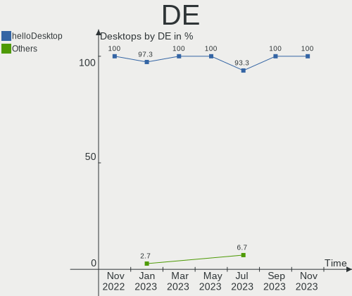
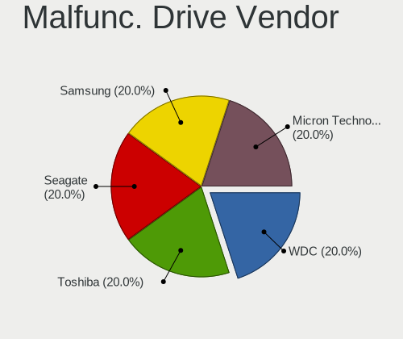
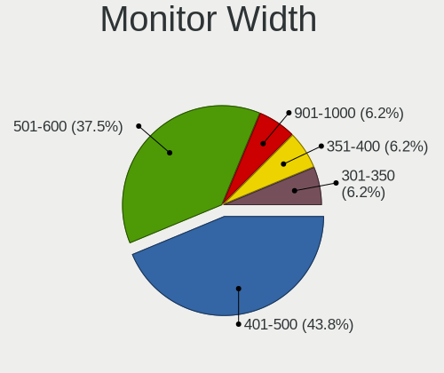
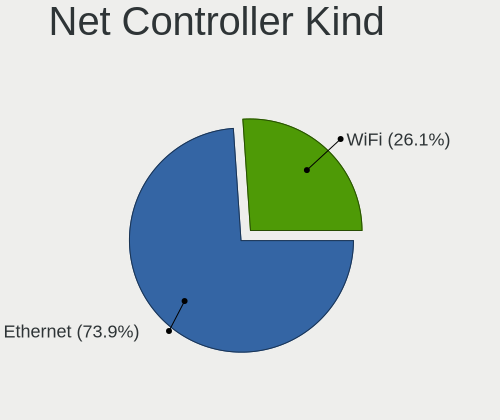
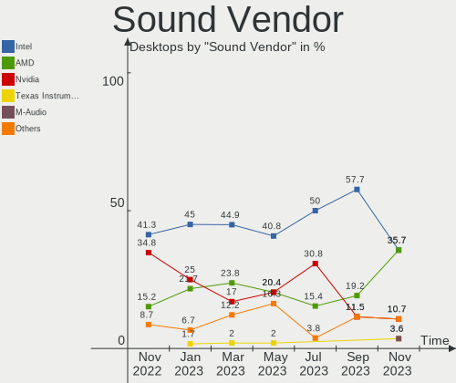
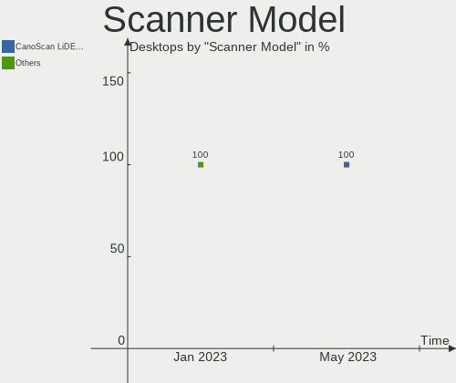

helloSystem - Hardware Trends (Desktops)
----------------------------------------

A project to identify most popular hardware characteristics and track their change
over time based on data collected by BSD users at https://BSD-Hardware.info.

Anyone can contribute to this report by the [hw-probe](https://github.com/linuxhw/hw-probe/blob/master/INSTALL.BSD.md) tool:

    hw-probe -all -upload

This report is for one last month. Overall report since the beginning of time: [TestDays](https://github.com/bsdhw/TestDays)

Period: Feb, 2023.

Contents
--------

* [ System ](#system)
  - [ OS                       ](#os)
  - [ OS Family                ](#os-family)
  - [ Arch                     ](#arch)
  - [ DE                       ](#de)
  - [ Display Server           ](#display-server)
  - [ Display Manager          ](#display-manager)
  - [ OS Lang                  ](#os-lang)
  - [ Boot Mode                ](#boot-mode)
  - [ Filesystem               ](#filesystem)
  - [ Part. scheme             ](#part-scheme)

* [ Board ](#board)
  - [ Vendor                   ](#vendor)
  - [ Model                    ](#model)
  - [ Model Family             ](#model-family)
  - [ MFG Year                 ](#mfg-year)
  - [ Form Factor              ](#form-factor)
  - [ Coreboot                 ](#coreboot)
  - [ RAM Size                 ](#ram-size)
  - [ RAM Used                 ](#ram-used)
  - [ Total Drives             ](#total-drives)
  - [ Has CD-ROM               ](#has-cd-rom)
  - [ Has Ethernet             ](#has-ethernet)
  - [ Has WiFi                 ](#has-wifi)
  - [ Has Bluetooth            ](#has-bluetooth)

* [ Location ](#location)
  - [ Country                  ](#country)
  - [ City                     ](#city)

* [ Drives ](#drives)
  - [ Drive Vendor             ](#drive-vendor)
  - [ Drive Model              ](#drive-model)
  - [ HDD Vendor               ](#hdd-vendor)
  - [ SSD Vendor               ](#ssd-vendor)
  - [ Drive Kind               ](#drive-kind)
  - [ Drive Connector          ](#drive-connector)
  - [ Drive Size               ](#drive-size)
  - [ Space Total              ](#space-total)
  - [ Space Used               ](#space-used)
  - [ Malfunc. Drives          ](#malfunc-drives)
  - [ Malfunc. Drive Vendor    ](#malfunc-drive-vendor)
  - [ Malfunc. HDD Vendor      ](#malfunc-hdd-vendor)
  - [ Malfunc. Drive Kind      ](#malfunc-drive-kind)
  - [ Failed Drives            ](#failed-drives)
  - [ Failed Drive Vendor      ](#failed-drive-vendor)
  - [ Drive Status             ](#drive-status)

* [ Storage controller ](#storage-controller)
  - [ Storage Vendor           ](#storage-vendor)
  - [ Storage Model            ](#storage-model)
  - [ Storage Kind             ](#storage-kind)

* [ Processor ](#processor)
  - [ CPU Vendor               ](#cpu-vendor)
  - [ CPU Model                ](#cpu-model)
  - [ CPU Model Family         ](#cpu-model-family)
  - [ CPU Cores                ](#cpu-cores)
  - [ CPU Sockets              ](#cpu-sockets)
  - [ CPU Threads              ](#cpu-threads)
  - [ CPU Microarch            ](#cpu-microarch)

* [ Graphics ](#graphics)
  - [ GPU Vendor               ](#gpu-vendor)
  - [ GPU Model                ](#gpu-model)
  - [ GPU Combo                ](#gpu-combo)
  - [ GPU Driver               ](#gpu-driver)
  - [ GPU Memory               ](#gpu-memory)

* [ Monitor ](#monitor)
  - [ Monitor Vendor           ](#monitor-vendor)
  - [ Monitor Model            ](#monitor-model)
  - [ Monitor Resolution       ](#monitor-resolution)
  - [ Monitor Diagonal         ](#monitor-diagonal)
  - [ Monitor Width            ](#monitor-width)
  - [ Aspect Ratio             ](#aspect-ratio)
  - [ Monitor Area             ](#monitor-area)
  - [ Pixel Density            ](#pixel-density)
  - [ Multiple Monitors        ](#multiple-monitors)

* [ Network ](#network)
  - [ Net Controller Vendor    ](#net-controller-vendor)
  - [ Net Controller Model     ](#net-controller-model)
  - [ Wireless Vendor          ](#wireless-vendor)
  - [ Wireless Model           ](#wireless-model)
  - [ Ethernet Vendor          ](#ethernet-vendor)
  - [ Ethernet Model           ](#ethernet-model)
  - [ Net Controller Kind      ](#net-controller-kind)
  - [ Used Controller          ](#used-controller)
  - [ NICs                     ](#nics)
  - [ IPv6                     ](#ipv6)

* [ Bluetooth ](#bluetooth)
  - [ Bluetooth Vendor         ](#bluetooth-vendor)
  - [ Bluetooth Model          ](#bluetooth-model)

* [ Sound ](#sound)
  - [ Sound Vendor             ](#sound-vendor)
  - [ Sound Model              ](#sound-model)

* [ Memory ](#memory)
  - [ Memory Vendor            ](#memory-vendor)
  - [ Memory Model             ](#memory-model)
  - [ Memory Kind              ](#memory-kind)
  - [ Memory Form Factor       ](#memory-form-factor)
  - [ Memory Size              ](#memory-size)
  - [ Memory Speed             ](#memory-speed)

* [ Printers & scanners ](#printers--scanners)
  - [ Printer Vendor           ](#printer-vendor)
  - [ Printer Model            ](#printer-model)
  - [ Scanner Vendor           ](#scanner-vendor)
  - [ Scanner Model            ](#scanner-model)

* [ Camera ](#camera)
  - [ Camera Vendor            ](#camera-vendor)
  - [ Camera Model             ](#camera-model)

* [ Security ](#security)
  - [ Fingerprint Vendor       ](#fingerprint-vendor)
  - [ Fingerprint Model        ](#fingerprint-model)
  - [ Chipcard Vendor          ](#chipcard-vendor)
  - [ Chipcard Model           ](#chipcard-model)

* [ Unsupported ](#unsupported)
  - [ Unsupported Devices      ](#unsupported-devices)
  - [ Unsupported Device Types ](#unsupported-device-types)

System
------

OS
--

Installed operating systems

| Name              | Desktops | Percent |
|-------------------|----------|---------|
| helloSystem 0.8.0 | 28       | 84.85%  |
| helloSystem 0.8.1 | 4        | 12.12%  |
| helloSystem 0.7.0 | 1        | 3.03%   |

OS Family
---------

OS without a version

| Name        | Desktops | Percent |
|-------------|----------|---------|
| helloSystem | 33       | 100%    |

Arch
----

OS architecture (x86_64, i586, etc.)

| Name  | Desktops | Percent |
|-------|----------|---------|
| amd64 | 33       | 100%    |

DE
--

Desktop Environment

| Name         | Desktops | Percent |
|--------------|----------|---------|
| helloDesktop | 33       | 100%    |

Display Server
--------------

X11 or Wayland

| Name | Desktops | Percent |
|------|----------|---------|
| X11  | 33       | 100%    |

Display Manager
---------------

SDDM, LightDM, etc.

| Name | Desktops | Percent |
|------|----------|---------|
| SLiM | 33       | 100%    |

OS Lang
-------

Language

| Lang  | Desktops | Percent |
|-------|----------|---------|
| en    | 14       | 42.42%  |
| fr    | 7        | 21.21%  |
| es    | 3        | 9.09%   |
| en_US | 2        | 6.06%   |
| de_DE | 2        | 6.06%   |
| ru    | 1        | 3.03%   |
| pt    | 1        | 3.03%   |
| pl    | 1        | 3.03%   |
| nl    | 1        | 3.03%   |
| en_GB | 1        | 3.03%   |

Boot Mode
---------

EFI or BIOS

| Mode | Desktops | Percent |
|------|----------|---------|
| EFI  | 33       | 100%    |

Filesystem
----------

Type of filesystem

| Type   | Desktops | Percent |
|--------|----------|---------|
| Cd9660 | 22       | 66.67%  |
| Zfs    | 11       | 33.33%  |

Part. scheme
------------

Scheme of partitioning

| Type | Desktops | Percent |
|------|----------|---------|
| GPT  | 33       | 100%    |

Board
-----

Vendor
------

Motherboard manufacturer

| Name                | Desktops | Percent |
|---------------------|----------|---------|
| ASUSTek Computer    | 8        | 24.24%  |
| Gigabyte Technology | 5        | 15.15%  |
| Dell                | 4        | 12.12%  |
| ASRock              | 4        | 12.12%  |
| MSI                 | 2        | 6.06%   |
| Lenovo              | 2        | 6.06%   |
| Hewlett-Packard     | 2        | 6.06%   |
| Biostar             | 2        | 6.06%   |
| Intel               | 1        | 3.03%   |
| Huanan              | 1        | 3.03%   |
| Fujitsu             | 1        | 3.03%   |
| AOpen               | 1        | 3.03%   |

Model
-----

Motherboard model

| Name                               | Desktops | Percent |
|------------------------------------|----------|---------|
| MSI MS-7C37                        | 1        | 3.03%   |
| MSI MS-7918                        | 1        | 3.03%   |
| Lenovo ThinkCentre M93p 10AB004DUS | 1        | 3.03%   |
| Lenovo ThinkCentre M82 2929AZ6     | 1        | 3.03%   |
| Intel DG41TY AAE47335-300          | 1        | 3.03%   |
| Huanan X99-TF GAMING V3.0          | 1        | 3.03%   |
| HP ProDesk 600 G4 SFF              | 1        | 3.03%   |
| HP Compaq Elite 8300 USDT          | 1        | 3.03%   |
| Gigabyte H81M-H                    | 1        | 3.03%   |
| Gigabyte H510M S2H V2              | 1        | 3.03%   |
| Gigabyte F2A88XM-D3H               | 1        | 3.03%   |
| Gigabyte B450M AORUS ELITE         | 1        | 3.03%   |
| Gigabyte A320M-H                   | 1        | 3.03%   |
| Fujitsu PRIMERGY TX100 S3          | 1        | 3.03%   |
| Dell OptiPlex 9020                 | 1        | 3.03%   |
| Dell OptiPlex 790                  | 1        | 3.03%   |
| Dell OptiPlex 780                  | 1        | 3.03%   |
| Dell OptiPlex 755                  | 1        | 3.03%   |
| Biostar TA970                      | 1        | 3.03%   |
| Biostar H61MLV3                    | 1        | 3.03%   |
| ASUS ROG STRIX Z390-E GAMING       | 1        | 3.03%   |
| ASUS PRIME H310M-C R2.0            | 1        | 3.03%   |
| ASUS PRIME B450M-A                 | 1        | 3.03%   |
| ASUS P8Z77-M                       | 1        | 3.03%   |
| ASUS P8Z68-V LX                    | 1        | 3.03%   |
| ASUS P8Z68-V                       | 1        | 3.03%   |
| ASUS M5A78L-M LX3                  | 1        | 3.03%   |
| ASUS A0000001                      | 1        | 3.03%   |
| ASRock X470 Gaming K4              | 1        | 3.03%   |
| ASRock H61M/U3S3                   | 1        | 3.03%   |
| ASRock A770DE+                     | 1        | 3.03%   |
| ASRock A320M-DGS                   | 1        | 3.03%   |
| AOpen ESPRIMO Q9000                | 1        | 3.03%   |

Model Family
------------

Motherboard model prefix

| Name                 | Desktops | Percent |
|----------------------|----------|---------|
| Dell OptiPlex        | 4        | 12.12%  |
| Lenovo ThinkCentre   | 2        | 6.06%   |
| ASUS PRIME           | 2        | 6.06%   |
| ASUS P8Z68-V         | 2        | 6.06%   |
| MSI MS-7C37          | 1        | 3.03%   |
| MSI MS-7918          | 1        | 3.03%   |
| Intel DG41TY         | 1        | 3.03%   |
| Huanan X99-TF        | 1        | 3.03%   |
| HP ProDesk           | 1        | 3.03%   |
| HP Compaq            | 1        | 3.03%   |
| Gigabyte H81M-H      | 1        | 3.03%   |
| Gigabyte H510M       | 1        | 3.03%   |
| Gigabyte F2A88XM-D3H | 1        | 3.03%   |
| Gigabyte B450M       | 1        | 3.03%   |
| Gigabyte A320M-H     | 1        | 3.03%   |
| Fujitsu PRIMERGY     | 1        | 3.03%   |
| Biostar TA970        | 1        | 3.03%   |
| Biostar H61MLV3      | 1        | 3.03%   |
| ASUS ROG             | 1        | 3.03%   |
| ASUS P8Z77-M         | 1        | 3.03%   |
| ASUS M5A78L-M        | 1        | 3.03%   |
| ASUS A0000001        | 1        | 3.03%   |
| ASRock X470          | 1        | 3.03%   |
| ASRock H61M          | 1        | 3.03%   |
| ASRock A770DE+       | 1        | 3.03%   |
| ASRock A320M-DGS     | 1        | 3.03%   |
| AOpen ESPRIMO        | 1        | 3.03%   |

MFG Year
--------

Motherboard manufacture year

| Year | Desktops | Percent |
|------|----------|---------|
| 2019 | 5        | 15.15%  |
| 2013 | 4        | 12.12%  |
| 2012 | 4        | 12.12%  |
| 2022 | 3        | 9.09%   |
| 2018 | 3        | 9.09%   |
| 2015 | 3        | 9.09%   |
| 2014 | 3        | 9.09%   |
| 2010 | 3        | 9.09%   |
| 2021 | 2        | 6.06%   |
| 2020 | 1        | 3.03%   |
| 2016 | 1        | 3.03%   |
| 2011 | 1        | 3.03%   |

Form Factor
-----------

Physical design of the computer

| Name    | Desktops | Percent |
|---------|----------|---------|
| Desktop | 33       | 100%    |

Coreboot
--------

Have coreboot on board

| Used | Desktops | Percent |
|------|----------|---------|
| No   | 33       | 100%    |

RAM Size
--------

Total RAM memory

| Size in GB  | Desktops | Percent |
|-------------|----------|---------|
| 8.01-16.0   | 13       | 39.39%  |
| 16.01-24.0  | 10       | 30.3%   |
| 4.01-8.0    | 3        | 9.09%   |
| 32.01-64.0  | 2        | 6.06%   |
| 64.01-256.0 | 2        | 6.06%   |
| 0.51-1.0    | 2        | 6.06%   |
| 2.01-3.0    | 1        | 3.03%   |

RAM Used
--------

Used RAM memory

| Used GB  | Desktops | Percent |
|----------|----------|---------|
| 0.01-0.5 | 16       | 48.48%  |
| 0.51-1.0 | 8        | 24.24%  |
| 1.01-2.0 | 7        | 21.21%  |
| 2.01-3.0 | 2        | 6.06%   |

Total Drives
------------

Number of drives on board

| Drives | Desktops | Percent |
|--------|----------|---------|
| 1      | 13       | 39.39%  |
| 2      | 8        | 24.24%  |
| 3      | 5        | 15.15%  |
| 4      | 3        | 9.09%   |
| 0      | 2        | 6.06%   |
| 6      | 1        | 3.03%   |
| 5      | 1        | 3.03%   |

Has CD-ROM
----------

Has CD-ROM on board

| Presented | Desktops | Percent |
|-----------|----------|---------|
| Yes       | 17       | 51.52%  |
| No        | 16       | 48.48%  |

Has Ethernet
------------

Has Ethernet on board

| Presented | Desktops | Percent |
|-----------|----------|---------|
| Yes       | 33       | 100%    |

Has WiFi
--------

Has WiFi module

| Presented | Desktops | Percent |
|-----------|----------|---------|
| No        | 24       | 72.73%  |
| Yes       | 9        | 27.27%  |

Has Bluetooth
-------------

Has Bluetooth module

| Presented | Desktops | Percent |
|-----------|----------|---------|
| No        | 26       | 78.79%  |
| Yes       | 7        | 21.21%  |

Location
--------

Country
-------

Geographic location (country)

| Country     | Desktops | Percent |
|-------------|----------|---------|
| USA         | 6        | 18.18%  |
| Germany     | 5        | 15.15%  |
| Spain       | 2        | 6.06%   |
| Peru        | 2        | 6.06%   |
| Brazil      | 2        | 6.06%   |
| Belgium     | 2        | 6.06%   |
| UK          | 1        | 3.03%   |
| Thailand    | 1        | 3.03%   |
| Russia      | 1        | 3.03%   |
| Portugal    | 1        | 3.03%   |
| Poland      | 1        | 3.03%   |
| Netherlands | 1        | 3.03%   |
| Japan       | 1        | 3.03%   |
| India       | 1        | 3.03%   |
| Hungary     | 1        | 3.03%   |
| Colombia    | 1        | 3.03%   |
| Chile       | 1        | 3.03%   |
| Canada      | 1        | 3.03%   |
| Australia   | 1        | 3.03%   |
| Argentina   | 1        | 3.03%   |

City
----

Geographic location (city)

| City                   | Desktops | Percent |
|------------------------|----------|---------|
| Lima                   | 2        | 6.06%   |
| Gistel                 | 2        | 6.06%   |
| Yekaterinburg          | 1        | 3.03%   |
| Yala                   | 1        | 3.03%   |
| Valledupar             | 1        | 3.03%   |
| Valencia               | 1        | 3.03%   |
| Trebujena              | 1        | 3.03%   |
| Tallahassee            | 1        | 3.03%   |
| Szigetszentmiklos      | 1        | 3.03%   |
| Sao Domingos das Dores | 1        | 3.03%   |
| Santiago               | 1        | 3.03%   |
| Salem                  | 1        | 3.03%   |
| Rhinelander            | 1        | 3.03%   |
| Remshalden             | 1        | 3.03%   |
| Recklinghausen         | 1        | 3.03%   |
| Québec                | 1        | 3.03%   |
| Portland               | 1        | 3.03%   |
| Osasco                 | 1        | 3.03%   |
| Noordwijkerhout        | 1        | 3.03%   |
| Mount Wolf             | 1        | 3.03%   |
| Marlow                 | 1        | 3.03%   |
| Krakow                 | 1        | 3.03%   |
| Kalahandi              | 1        | 3.03%   |
| Hyōgo                 | 1        | 3.03%   |
| Goncalo                | 1        | 3.03%   |
| Gelsenkirchen          | 1        | 3.03%   |
| Fort Worth             | 1        | 3.03%   |
| Erlangen               | 1        | 3.03%   |
| Cologne                | 1        | 3.03%   |
| Buenos Aires           | 1        | 3.03%   |
| Brisbane               | 1        | 3.03%   |

Drives
------

Drive Vendor
------------

Hard drive vendors

| Vendor              | Desktops | Drives | Percent |
|---------------------|----------|--------|---------|
| WDC                 | 14       | 18     | 25%     |
| Samsung Electronics | 12       | 15     | 21.43%  |
| Seagate             | 9        | 9      | 16.07%  |
| Hitachi             | 4        | 6      | 7.14%   |
| A-DATA Technology   | 4        | 5      | 7.14%   |
| Toshiba             | 2        | 2      | 3.57%   |
| SanDisk             | 2        | 2      | 3.57%   |
| Crucial             | 2        | 3      | 3.57%   |
| Transcend           | 1        | 1      | 1.79%   |
| Reletech            | 1        | 1      | 1.79%   |
| Micron Technology   | 1        | 1      | 1.79%   |
| Lexar               | 1        | 1      | 1.79%   |
| Kingston            | 1        | 1      | 1.79%   |
| Hewlett-Packard     | 1        | 1      | 1.79%   |
| Gigabyte Technology | 1        | 1      | 1.79%   |

Drive Model
-----------

Hard drive models

| Model                                | Desktops | Percent |
|--------------------------------------|----------|---------|
| WDC WDS120G2G0A-00JH30 120GB         | 2        | 3.08%   |
| Seagate ST500DM002-1BD142 500GB      | 2        | 3.08%   |
| Samsung SSD 850 EVO 250GB            | 2        | 3.08%   |
| Samsung HD322HJ 320GB                | 2        | 3.08%   |
| A-DATA SU800 256GB                   | 2        | 3.08%   |
| WDC WDS500G3XHC-00SJG0 500GB         | 1        | 1.54%   |
| WDC WDS120G2G0B-00EPW0 120GB         | 1        | 1.54%   |
| WDC WD50NPZZ-00A9JT0 5TB             | 1        | 1.54%   |
| WDC WD5000AAKX-00U6AA0 500GB         | 1        | 1.54%   |
| WDC WD3200BPVT-75JJ5T0 320GB         | 1        | 1.54%   |
| WDC WD3200BEVT-00ZCT0 320GB          | 1        | 1.54%   |
| WDC WD3200AAKS-75L9A0 320GB          | 1        | 1.54%   |
| WDC WD20EZAZ-22L9GB0 2TB             | 1        | 1.54%   |
| WDC WD2002FAEX-007BA0 2TB            | 1        | 1.54%   |
| WDC WD1600AAJS-61WAA0 160GB          | 1        | 1.54%   |
| WDC WD10EZEX-75WN4A1 1TB             | 1        | 1.54%   |
| WDC WD10EZEX-08WN4A0 1TB             | 1        | 1.54%   |
| WDC WD10EZEX-00BN5A0 1TB             | 1        | 1.54%   |
| WDC WD10EACS-00D6B1 1TB              | 1        | 1.54%   |
| WDC PC SN520 SDAPNUW-256G-1006 256GB | 1        | 1.54%   |
| Transcend TS240GESD240C 240GB        | 1        | 1.54%   |
| Toshiba TR200 240GB                  | 1        | 1.54%   |
| Toshiba HDWD110 1TB                  | 1        | 1.54%   |
| Seagate ST9250410AS 250GB            | 1        | 1.54%   |
| Seagate ST500DM002-1BC142 500GB      | 1        | 1.54%   |
| Seagate ST3250318AS 250GB            | 1        | 1.54%   |
| Seagate ST3250310AS 250GB            | 1        | 1.54%   |
| Seagate ST3160316CS 160GB            | 1        | 1.54%   |
| Seagate ST2000NM0024-1HT174 2TB      | 1        | 1.54%   |
| Seagate ST1000DM010-2EP102 1TB       | 1        | 1.54%   |
| SanDisk SDSSDH3 1T02 1TB             | 1        | 1.54%   |
| SanDisk SDSSDH2256G 256GB            | 1        | 1.54%   |
| Samsung SSD 980 1TB                  | 1        | 1.54%   |
| Samsung SSD 970 EVO Plus 2TB         | 1        | 1.54%   |
| Samsung SSD 970 EVO Plus 1TB         | 1        | 1.54%   |
| Samsung SSD 970 EVO 1TB              | 1        | 1.54%   |
| Samsung SSD 860 EVO 500GB            | 1        | 1.54%   |
| Samsung SSD 860 EVO 1TB              | 1        | 1.54%   |
| Samsung SSD 840 EVO 250GB            | 1        | 1.54%   |
| Samsung MZVLB512HAJQ-00000 512GB     | 1        | 1.54%   |

HDD Vendor
----------

Hard disk drive vendors

| Vendor              | Desktops | Drives | Percent |
|---------------------|----------|--------|---------|
| WDC                 | 10       | 12     | 34.48%  |
| Seagate             | 9        | 9      | 31.03%  |
| Samsung Electronics | 5        | 5      | 17.24%  |
| Hitachi             | 4        | 6      | 13.79%  |
| Toshiba             | 1        | 1      | 3.45%   |

SSD Vendor
----------

Solid state drive vendors

| Vendor              | Desktops | Drives | Percent |
|---------------------|----------|--------|---------|
| Samsung Electronics | 4        | 5      | 19.05%  |
| A-DATA Technology   | 4        | 5      | 19.05%  |
| WDC                 | 3        | 4      | 14.29%  |
| SanDisk             | 2        | 2      | 9.52%   |
| Crucial             | 2        | 3      | 9.52%   |
| Transcend           | 1        | 1      | 4.76%   |
| Toshiba             | 1        | 1      | 4.76%   |
| Micron Technology   | 1        | 1      | 4.76%   |
| Kingston            | 1        | 1      | 4.76%   |
| Hewlett-Packard     | 1        | 1      | 4.76%   |
| Gigabyte Technology | 1        | 1      | 4.76%   |

Drive Kind
----------

HDD or SSD

| Kind | Desktops | Drives | Percent |
|------|----------|--------|---------|
| HDD  | 21       | 33     | 48.84%  |
| SSD  | 15       | 25     | 34.88%  |
| NVMe | 7        | 9      | 16.28%  |

Drive Connector
---------------

SATA, SAS, NVMe, etc.

| Type | Desktops | Drives | Percent |
|------|----------|--------|---------|
| SATA | 28       | 58     | 80%     |
| NVMe | 7        | 9      | 20%     |

Drive Size
----------

Size of hard drive

| Size in TB | Desktops | Drives | Percent |
|------------|----------|--------|---------|
| 0.01-0.5   | 27       | 40     | 64.29%  |
| 0.51-1.0   | 9        | 11     | 21.43%  |
| 1.01-2.0   | 5        | 6      | 11.9%   |
| 4.01-10.0  | 1        | 1      | 2.38%   |

Space Total
-----------

Amount of disk space available on the file system

| Size in GB | Desktops | Percent |
|------------|----------|---------|
| 1-20       | 19       | 57.58%  |
| 101-250    | 4        | 12.12%  |
| 501-1000   | 3        | 9.09%   |
| 51-100     | 3        | 9.09%   |
| 251-500    | 2        | 6.06%   |
| 21-50      | 1        | 3.03%   |
| 1001-2000  | 1        | 3.03%   |

Space Used
----------

Amount of used disk space

| Used GB | Desktops | Percent |
|---------|----------|---------|
| 1-20    | 32       | 96.97%  |
| 101-250 | 1        | 3.03%   |

Malfunc. Drives
---------------

Drive models with a malfunction

| Model                             | Desktops | Drives | Percent |
|-----------------------------------|----------|--------|---------|
| WDC WD10EACS-00D6B1 1TB           | 1        | 1      | 12.5%   |
| Seagate ST500DM002-1BD142 500GB   | 1        | 1      | 12.5%   |
| Seagate ST1000DM010-2EP102 1TB    | 1        | 1      | 12.5%   |
| Samsung Electronics HD322HJ 320GB | 1        | 1      | 12.5%   |
| Hitachi HTS541680J9SA00 80GB      | 1        | 1      | 12.5%   |
| Hitachi HDT721010SLA360 1TB       | 1        | 1      | 12.5%   |
| Crucial CT1050MX300SSD1 1TB       | 1        | 1      | 12.5%   |
| A-DATA Technology SU800 256GB     | 1        | 1      | 12.5%   |

Malfunc. Drive Vendor
---------------------

Vendors of faulty drives

| Vendor              | Desktops | Drives | Percent |
|---------------------|----------|--------|---------|
| Seagate             | 2        | 2      | 25%     |
| Hitachi             | 2        | 2      | 25%     |
| WDC                 | 1        | 1      | 12.5%   |
| Samsung Electronics | 1        | 1      | 12.5%   |
| Crucial             | 1        | 1      | 12.5%   |
| A-DATA Technology   | 1        | 1      | 12.5%   |

Malfunc. HDD Vendor
-------------------

Vendors of faulty HDD drives

| Vendor              | Desktops | Drives | Percent |
|---------------------|----------|--------|---------|
| Seagate             | 2        | 2      | 33.33%  |
| Hitachi             | 2        | 2      | 33.33%  |
| WDC                 | 1        | 1      | 16.67%  |
| Samsung Electronics | 1        | 1      | 16.67%  |

Malfunc. Drive Kind
-------------------

Kinds of faulty drives

| Kind | Desktops | Drives | Percent |
|------|----------|--------|---------|
| HDD  | 6        | 6      | 75%     |
| SSD  | 2        | 2      | 25%     |

Failed Drives
-------------

Failed drive models

| Model                           | Desktops | Drives | Percent |
|---------------------------------|----------|--------|---------|
| Seagate ST3250310AS 250GB       | 1        | 1      | 50%     |
| Samsung Electronics HD103SJ 1TB | 1        | 1      | 50%     |

Failed Drive Vendor
-------------------

Failed drive vendors

| Vendor              | Desktops | Drives | Percent |
|---------------------|----------|--------|---------|
| Seagate             | 1        | 1      | 50%     |
| Samsung Electronics | 1        | 1      | 50%     |

Drive Status
------------

Number of failed and malfunc. drives

| Status   | Desktops | Drives | Percent |
|----------|----------|--------|---------|
| Works    | 27       | 54     | 69.23%  |
| Malfunc  | 8        | 8      | 20.51%  |
| Detected | 2        | 3      | 5.13%   |
| Failed   | 2        | 2      | 5.13%   |

Storage controller
------------------

Storage Vendor
--------------

Storage controller vendors

| Vendor                       | Desktops | Percent |
|------------------------------|----------|---------|
| Intel                        | 22       | 50%     |
| AMD                          | 11       | 25%     |
| Samsung Electronics          | 4        | 9.09%   |
| SanDisk                      | 2        | 4.55%   |
| ASMedia Technology           | 2        | 4.55%   |
| Shenzhen Longsys Electronics | 1        | 2.27%   |
| Phison Electronics           | 1        | 2.27%   |
| JMicron Technology           | 1        | 2.27%   |

Storage Model
-------------

Storage controller models

| Model                                                                                   | Desktops | Percent |
|-----------------------------------------------------------------------------------------|----------|---------|
| AMD FCH SATA Controller [AHCI mode]                                                     | 6        | 10.34%  |
| Samsung NVMe SSD Controller SM981/PM981/PM983                                           | 4        | 6.9%    |
| Intel 6 Series/C200 Series Chipset Family 6 port Desktop SATA AHCI Controller           | 4        | 6.9%    |
| Intel 7 Series/C210 Series Chipset Family 6-port SATA Controller [AHCI mode]            | 3        | 5.17%   |
| AMD SB7x0/SB8x0/SB9x0 SATA Controller [IDE mode]                                        | 3        | 5.17%   |
| AMD SB7x0/SB8x0/SB9x0 IDE Controller                                                    | 3        | 5.17%   |
| AMD FCH SATA Controller D                                                               | 3        | 5.17%   |
| AMD 400 Series Chipset SATA Controller                                                  | 3        | 5.17%   |
| Intel Cannon Lake PCH SATA AHCI Controller                                              | 2        | 3.45%   |
| Intel 8 Series/C220 Series Chipset Family 6-port SATA Controller 1 [AHCI mode]          | 2        | 3.45%   |
| Intel 6 Series/C200 Series Chipset Family Desktop SATA Controller (IDE mode, ports 4-5) | 2        | 3.45%   |
| Intel 6 Series/C200 Series Chipset Family Desktop SATA Controller (IDE mode, ports 0-3) | 2        | 3.45%   |
| ASMedia ASM1062 Serial ATA Controller                                                   | 2        | 3.45%   |
| SanDisk WD Blue SN500 / PC SN520 NVMe SSD                                               | 1        | 1.72%   |
| SanDisk WD Black 2018/SN750 / PC SN720 NVMe SSD                                         | 1        | 1.72%   |
| Samsung NVMe SSD Controller 980                                                         | 1        | 1.72%   |
| Phison E16 PCIe4 NVMe Controller                                                        | 1        | 1.72%   |
| JMicron JMB58x AHCI SATA controller                                                     | 1        | 1.72%   |
| Intel SATA Controller [RAID mode]                                                       | 1        | 1.72%   |
| Intel NM10/ICH7 Family SATA Controller [IDE mode]                                       | 1        | 1.72%   |
| Intel C610/X99 series chipset 6-Port SATA Controller [AHCI mode]                        | 1        | 1.72%   |
| Intel 9 Series Chipset Family SATA Controller [AHCI Mode]                               | 1        | 1.72%   |
| Intel 82Q35 Express PT IDER Controller                                                  | 1        | 1.72%   |
| Intel 82801JD/DO (ICH10 Family) SATA AHCI Controller                                    | 1        | 1.72%   |
| Intel 82801IR/IO/IH (ICH9R/DO/DH) 6 port SATA Controller [AHCI mode]                    | 1        | 1.72%   |
| Intel 82801G (ICH7 Family) IDE Controller                                               | 1        | 1.72%   |
| Intel 500 Series Chipset Family SATA AHCI Controller                                    | 1        | 1.72%   |
| Intel 5 Series/3400 Series Chipset 6 port SATA AHCI Controller                          | 1        | 1.72%   |
| Intel 4 Series Chipset PT IDER Controller                                               | 1        | 1.72%   |
| Intel 200 Series PCH SATA controller [AHCI mode]                                        | 1        | 1.72%   |
| AMD RS690 PCI to PCI Bridge (PCI Express Port 2)                                        | 1        | 1.72%   |
| Unknown                                                                                 | 1        | 1.72%   |

Storage Kind
------------

Kind of storage controller (IDE, SATA, NVMe, SAS, ...)

| Kind | Desktops | Percent |
|------|----------|---------|
| SATA | 26       | 60.47%  |
| IDE  | 8        | 18.6%   |
| NVMe | 7        | 16.28%  |
| RAID | 2        | 4.65%   |

Processor
---------

CPU Vendor
----------

Processor vendors

| Vendor | Desktops | Percent |
|--------|----------|---------|
| Intel  | 22       | 66.67%  |
| AMD    | 11       | 33.33%  |

CPU Model
---------

Processor models

| Model                                           | Desktops | Percent |
|-------------------------------------------------|----------|---------|
| Intel Core 2 Duo                                | 2        | 6.06%   |
| Intel Xeon CPU E5-2678 v3 @ 2.50GHz             | 1        | 3.03%   |
| Intel Pentium CPU G620 @ 2.60GHz                | 1        | 3.03%   |
| Intel Pentium CPU G2020 @ 2.90GHz               | 1        | 3.03%   |
| Intel Core i9-9900KS CPU @ 4.00GHz              | 1        | 3.03%   |
| Intel Core i7-4770 CPU @ 3.40GHz                | 1        | 3.03%   |
| Intel Core i5-8500 CPU @ 3.00GHz                | 1        | 3.03%   |
| Intel Core i5-4670 CPU @ 3.40GHz                | 1        | 3.03%   |
| Intel Core i5-4590T CPU @ 2.00GHz               | 1        | 3.03%   |
| Intel Core i5-3570 CPU @ 3.40GHz                | 1        | 3.03%   |
| Intel Core i5-3470S CPU @ 2.90GHz               | 1        | 3.03%   |
| Intel Core i5-3470 CPU @ 3.20GHz                | 1        | 3.03%   |
| Intel Core i5-2500K CPU @ 3.30GHz               | 1        | 3.03%   |
| Intel Core i5-2500 CPU @ 3.30GHz                | 1        | 3.03%   |
| Intel Core i5-2400 CPU @ 3.10GH                 | 1        | 3.03%   |
| Intel Core i5-2320 CPU @ 3.00GHz                | 1        | 3.03%   |
| Intel Core i5-10400F CPU @ 2.90GHz              | 1        | 3.03%   |
| Intel Core i3-8100 CPU @ 3.60GHz                | 1        | 3.03%   |
| Intel Core i3-4130 CPU @ 3.40GHz                | 1        | 3.03%   |
| Intel Core i3 CPU M 370 @ 2.40GHz               | 1        | 3.03%   |
| Intel Core 2 Duo CPU E7500 @ 2.93GHz            | 1        | 3.03%   |
| AMD Ryzen 9 5900X 12-Core Processor             | 1        | 3.03%   |
| AMD Ryzen 7 3700X 8-Core Processor              | 1        | 3.03%   |
| AMD Ryzen 5 2600 Six-Core Processor             | 1        | 3.03%   |
| AMD Ryzen 5 1600 Six-Core Processor             | 1        | 3.03%   |
| AMD Ryzen 3 PRO 2200G with Radeon Vega Graphics | 1        | 3.03%   |
| AMD Ryzen 3 3200G with Radeon Vega Graphics     | 1        | 3.03%   |
| AMD Phenom II X4 B55 Processor                  | 1        | 3.03%   |
| AMD Phenom II X4 940 Processor                  | 1        | 3.03%   |
| AMD FX-8300 Eight-Core Processor                | 1        | 3.03%   |
| AMD Athlon 3000G with Radeon Vega Graphics      | 1        | 3.03%   |
| AMD A8-7650K Radeon R7, 10 Compute Cores 4C+6G  | 1        | 3.03%   |

CPU Model Family
----------------

Processor model prefix

| Model            | Desktops | Percent |
|------------------|----------|---------|
| Intel Core i5    | 11       | 33.33%  |
| Intel Core i3    | 3        | 9.09%   |
| Intel Core 2 Duo | 3        | 9.09%   |
| Intel Pentium    | 2        | 6.06%   |
| AMD Ryzen 5      | 2        | 6.06%   |
| AMD Phenom II X4 | 2        | 6.06%   |
| Intel Xeon       | 1        | 3.03%   |
| Intel Core i9    | 1        | 3.03%   |
| Intel Core i7    | 1        | 3.03%   |
| AMD Ryzen 9      | 1        | 3.03%   |
| AMD Ryzen 7      | 1        | 3.03%   |
| AMD Ryzen 3 PRO  | 1        | 3.03%   |
| AMD Ryzen 3      | 1        | 3.03%   |
| AMD FX           | 1        | 3.03%   |
| AMD Athlon       | 1        | 3.03%   |
| AMD A8           | 1        | 3.03%   |

CPU Cores
---------

Number of processor cores

| Number  | Desktops | Percent |
|---------|----------|---------|
| 4       | 17       | 51.52%  |
| 2       | 6        | 18.18%  |
| 6       | 3        | 9.09%   |
| 12      | 2        | 6.06%   |
| 8       | 2        | 6.06%   |
| 24      | 1        | 3.03%   |
| 16      | 1        | 3.03%   |
| Unknown | 1        | 3.03%   |

CPU Sockets
-----------

Number of sockets

| Number | Desktops | Percent |
|--------|----------|---------|
| 1      | 33       | 100%    |

CPU Threads
-----------

Threads per core (Hyper-Threading)

| Number  | Desktops | Percent |
|---------|----------|---------|
| 1       | 26       | 78.79%  |
| 2       | 6        | 18.18%  |
| Unknown | 1        | 3.03%   |

CPU Microarch
-------------

Microarchitecture

| Name        | Desktops | Percent |
|-------------|----------|---------|
| SandyBridge | 5        | 15.15%  |
| Haswell     | 5        | 15.15%  |
| Zen+        | 4        | 12.12%  |
| IvyBridge   | 4        | 12.12%  |
| KabyLake    | 3        | 9.09%   |
| Penryn      | 2        | 6.06%   |
| K10         | 2        | 6.06%   |
| Zen 3       | 1        | 3.03%   |
| Zen 2       | 1        | 3.03%   |
| Zen         | 1        | 3.03%   |
| Westmere    | 1        | 3.03%   |
| Steamroller | 1        | 3.03%   |
| Piledriver  | 1        | 3.03%   |
| Core        | 1        | 3.03%   |
| CometLake   | 1        | 3.03%   |

Graphics
--------

GPU Vendor
----------

Vendors of graphics cards

| Vendor | Desktops | Percent |
|--------|----------|---------|
| Intel  | 14       | 41.18%  |
| Nvidia | 11       | 32.35%  |
| AMD    | 9        | 26.47%  |

GPU Model
---------

Graphics card models

| Model                                                                       | Desktops | Percent |
|-----------------------------------------------------------------------------|----------|---------|
| Intel Xeon E3-1200 v3/4th Gen Core Processor Integrated Graphics Controller | 3        | 8.82%   |
| Intel Xeon E3-1200 v2/3rd Gen Core processor Graphics Controller            | 3        | 8.82%   |
| Intel 2nd Generation Core Processor Family Integrated Graphics Controller   | 3        | 8.82%   |
| Intel CoffeeLake-S GT2 [UHD Graphics 630]                                   | 2        | 5.88%   |
| AMD Picasso/Raven 2 [Radeon Vega Series / Radeon Vega Mobile Series]        | 2        | 5.88%   |
| AMD Ellesmere [Radeon RX 470/480/570/570X/580/580X/590]                     | 2        | 5.88%   |
| Nvidia TU117 [GeForce GTX 1650]                                             | 1        | 2.94%   |
| Nvidia TU116 [GeForce GTX 1660 SUPER]                                       | 1        | 2.94%   |
| Nvidia TU102 [GeForce RTX 2080 Ti Rev. A]                                   | 1        | 2.94%   |
| Nvidia GT218 [GeForce 210]                                                  | 1        | 2.94%   |
| Nvidia GP107 [GeForce GTX 1050 Ti]                                          | 1        | 2.94%   |
| Nvidia GM206 [GeForce GTX 960]                                              | 1        | 2.94%   |
| Nvidia GM206 [GeForce GTX 950]                                              | 1        | 2.94%   |
| Nvidia GM107 [GeForce GTX 750]                                              | 1        | 2.94%   |
| Nvidia GF119 [GeForce GT 625 OEM]                                           | 1        | 2.94%   |
| Nvidia GF106GL [Quadro 2000]                                                | 1        | 2.94%   |
| Nvidia G84GL [Quadro FX 570]                                                | 1        | 2.94%   |
| Intel Core Processor Integrated Graphics Controller                         | 1        | 2.94%   |
| Intel 4th Generation Core Processor Family Integrated Graphics Controller   | 1        | 2.94%   |
| Intel 4 Series Chipset Integrated Graphics Controller                       | 1        | 2.94%   |
| AMD Raven Ridge [Radeon Vega Series / Radeon Vega Mobile Series]            | 1        | 2.94%   |
| AMD Polaris 20 XL [Radeon RX 580 2048SP]                                    | 1        | 2.94%   |
| AMD Oland PRO [Radeon R7 240/340 / Radeon 520]                              | 1        | 2.94%   |
| AMD Lexa PRO [Radeon 540/540X/550/550X / RX 540X/550/550X]                  | 1        | 2.94%   |
| AMD Kaveri [Radeon R7 Graphics]                                             | 1        | 2.94%   |

GPU Combo
---------

Combinations of graphics cards

| Name        | Desktops | Percent |
|-------------|----------|---------|
| 1 x Intel   | 12       | 36.36%  |
| 1 x Nvidia  | 11       | 33.33%  |
| 1 x AMD     | 8        | 24.24%  |
| 2 x Intel   | 1        | 3.03%   |
| Intel + AMD | 1        | 3.03%   |

GPU Driver
----------

Free vs proprietary

| Driver      | Desktops | Percent |
|-------------|----------|---------|
| Free        | 23       | 69.7%   |
| Proprietary | 10       | 30.3%   |

GPU Memory
----------

Total video memory

| Size in GB | Desktops | Percent |
|------------|----------|---------|
| Unknown    | 18       | 54.55%  |
| 3.01-4.0   | 5        | 15.15%  |
| 1.01-2.0   | 5        | 15.15%  |
| 0.51-1.0   | 2        | 6.06%   |
| 5.01-6.0   | 1        | 3.03%   |
| 8.01-16.0  | 1        | 3.03%   |
| 0.01-0.5   | 1        | 3.03%   |

Monitor
-------

Monitor Vendor
--------------

Monitor vendors

| Vendor               | Desktops | Percent |
|----------------------|----------|---------|
| BenQ                 | 2        | 20%     |
| Acer                 | 2        | 20%     |
| Philips              | 1        | 10%     |
| LG Electronics       | 1        | 10%     |
| Lenovo Group Limited | 1        | 10%     |
| Idek Iiyama          | 1        | 10%     |
| Dell                 | 1        | 10%     |
| Unknown              | 1        | 10%     |

Monitor Model
-------------

Monitor models

| Model                                             | Desktops | Percent |
|---------------------------------------------------|----------|---------|
| Philips LCD Monitor PHL 243V7 3840x1080           | 1        | 10%     |
| LG Electronics LCD Monitor E2441 3840x1080        | 1        | 10%     |
| Lenovo Group Limited LCD Monitor C24-25 1920x1080 | 1        | 10%     |
| Idek Iiyama LCD Monitor PL3270Q 2560x1440         | 1        | 10%     |
| Dell LCD Monitor E2014H                           | 1        | 10%     |
| BenQ LCD Monitor V2220H 1920x1080                 | 1        | 10%     |
| BenQ LCD Monitor GW2260 1920x1080                 | 1        | 10%     |
| Acer LCD Monitor VG270U 2560x1440                 | 1        | 10%     |
| Acer LCD Monitor G226HQL 3520x1080                | 1        | 10%     |
| Unknown                                           | 1        | 10%     |

Monitor Resolution
------------------

Monitor screen resolution

| Resolution      | Desktops | Percent |
|-----------------|----------|---------|
| 1920x1080 (FHD) | 4        | 44.44%  |
| 2560x1440 (QHD) | 2        | 22.22%  |
| 3840x1080       | 1        | 11.11%  |
| 3520x1080       | 1        | 11.11%  |
| Unknown         | 1        | 11.11%  |

Monitor Diagonal
----------------

Diagonal size in inches

| Inches  | Desktops | Percent |
|---------|----------|---------|
| Unknown | 8        | 100%    |

Monitor Width
-------------

Physical width

| Width in mm | Desktops | Percent |
|-------------|----------|---------|
| Unknown     | 8        | 100%    |

Aspect Ratio
------------

Proportional relationship between the width and the height

| Ratio   | Desktops | Percent |
|---------|----------|---------|
| Unknown | 8        | 100%    |

Monitor Area
------------

Area in inch²

| Area in inch² | Desktops | Percent |
|----------------|----------|---------|
| Unknown        | 8        | 100%    |

Pixel Density
-------------

Pixels per inch

| Density | Desktops | Percent |
|---------|----------|---------|
| Unknown | 8        | 100%    |

Multiple Monitors
-----------------

Total monitors connected

| Total | Desktops | Percent |
|-------|----------|---------|
| 1     | 27       | 81.82%  |
| 2     | 3        | 9.09%   |
| 0     | 3        | 9.09%   |

Network
-------

Net Controller Vendor
---------------------

Controller vendors

| Vendor                | Desktops | Percent |
|-----------------------|----------|---------|
| Realtek Semiconductor | 18       | 46.15%  |
| Intel                 | 15       | 38.46%  |
| Qualcomm Atheros      | 3        | 7.69%   |
| TP-Link               | 1        | 2.56%   |
| Ralink                | 1        | 2.56%   |
| Edimax Technology     | 1        | 2.56%   |

Net Controller Model
--------------------

Controller models

| Model                                                             | Desktops | Percent |
|-------------------------------------------------------------------|----------|---------|
| Realtek RTL8111/8168/8411 PCI Express Gigabit Ethernet Controller | 16       | 35.56%  |
| Intel 82579LM Gigabit Network Connection (Lewisville)             | 4        | 8.89%   |
| Intel Ethernet Connection I217-LM                                 | 2        | 4.44%   |
| Intel 82574L Gigabit Network Connection                           | 2        | 4.44%   |
| TP-Link Archer T2U PLUS [RTL8821AU]                               | 1        | 2.22%   |
| Realtek RTL8192EE PCIe Wireless Network Adapter                   | 1        | 2.22%   |
| Realtek RTL8188EUS 802.11n Wireless Network Adapter               | 1        | 2.22%   |
| Realtek RTL8188CUS 802.11n WLAN Adapter                           | 1        | 2.22%   |
| Realtek RTL810xE PCI Express Fast Ethernet controller             | 1        | 2.22%   |
| Ralink RT2500 Wireless 802.11bg                                   | 1        | 2.22%   |
| Qualcomm Atheros QCA8171 Gigabit Ethernet                         | 1        | 2.22%   |
| Qualcomm Atheros Killer E220x Gigabit Ethernet Controller         | 1        | 2.22%   |
| Qualcomm Atheros AR9227 Wireless Network Adapter                  | 1        | 2.22%   |
| Qualcomm Atheros AR8151 v2.0 Gigabit Ethernet                     | 1        | 2.22%   |
| Intel Wireless 7260                                               | 1        | 2.22%   |
| Intel Wi-Fi 6 AX210/AX211/AX411 160MHz                            | 1        | 2.22%   |
| Intel I211 Gigabit Network Connection                             | 1        | 2.22%   |
| Intel Ethernet Connection (7) I219-V                              | 1        | 2.22%   |
| Intel Ethernet Connection (7) I219-LM                             | 1        | 2.22%   |
| Intel Cannon Lake PCH CNVi WiFi                                   | 1        | 2.22%   |
| Intel 82579V Gigabit Network Connection                           | 1        | 2.22%   |
| Intel 82577LM Gigabit Network Connection                          | 1        | 2.22%   |
| Intel 82567LM-3 Gigabit Network Connection                        | 1        | 2.22%   |
| Intel 82566DM-2 Gigabit Network Connection                        | 1        | 2.22%   |
| Edimax EW-7811Un 802.11n Wireless Adapter [Realtek RTL8188CUS]    | 1        | 2.22%   |

Wireless Vendor
---------------

Wireless vendors

| Vendor                | Desktops | Percent |
|-----------------------|----------|---------|
| Realtek Semiconductor | 3        | 30%     |
| Intel                 | 3        | 30%     |
| TP-Link               | 1        | 10%     |
| Ralink                | 1        | 10%     |
| Qualcomm Atheros      | 1        | 10%     |
| Edimax Technology     | 1        | 10%     |

Wireless Model
--------------

Wireless models

| Model                                                          | Desktops | Percent |
|----------------------------------------------------------------|----------|---------|
| TP-Link Archer T2U PLUS [RTL8821AU]                            | 1        | 10%     |
| Realtek RTL8192EE PCIe Wireless Network Adapter                | 1        | 10%     |
| Realtek RTL8188EUS 802.11n Wireless Network Adapter            | 1        | 10%     |
| Realtek RTL8188CUS 802.11n WLAN Adapter                        | 1        | 10%     |
| Ralink RT2500 Wireless 802.11bg                                | 1        | 10%     |
| Qualcomm Atheros AR9227 Wireless Network Adapter               | 1        | 10%     |
| Intel Wireless 7260                                            | 1        | 10%     |
| Intel Wi-Fi 6 AX210/AX211/AX411 160MHz                         | 1        | 10%     |
| Intel Cannon Lake PCH CNVi WiFi                                | 1        | 10%     |
| Edimax EW-7811Un 802.11n Wireless Adapter [Realtek RTL8188CUS] | 1        | 10%     |

Ethernet Vendor
---------------

Ethernet vendors

| Vendor                | Desktops | Percent |
|-----------------------|----------|---------|
| Realtek Semiconductor | 17       | 50%     |
| Intel                 | 14       | 41.18%  |
| Qualcomm Atheros      | 3        | 8.82%   |

Ethernet Model
--------------

Ethernet models

| Model                                                             | Desktops | Percent |
|-------------------------------------------------------------------|----------|---------|
| Realtek RTL8111/8168/8411 PCI Express Gigabit Ethernet Controller | 16       | 45.71%  |
| Intel 82579LM Gigabit Network Connection (Lewisville)             | 4        | 11.43%  |
| Intel Ethernet Connection I217-LM                                 | 2        | 5.71%   |
| Intel 82574L Gigabit Network Connection                           | 2        | 5.71%   |
| Realtek RTL810xE PCI Express Fast Ethernet controller             | 1        | 2.86%   |
| Qualcomm Atheros QCA8171 Gigabit Ethernet                         | 1        | 2.86%   |
| Qualcomm Atheros Killer E220x Gigabit Ethernet Controller         | 1        | 2.86%   |
| Qualcomm Atheros AR8151 v2.0 Gigabit Ethernet                     | 1        | 2.86%   |
| Intel I211 Gigabit Network Connection                             | 1        | 2.86%   |
| Intel Ethernet Connection (7) I219-V                              | 1        | 2.86%   |
| Intel Ethernet Connection (7) I219-LM                             | 1        | 2.86%   |
| Intel 82579V Gigabit Network Connection                           | 1        | 2.86%   |
| Intel 82577LM Gigabit Network Connection                          | 1        | 2.86%   |
| Intel 82567LM-3 Gigabit Network Connection                        | 1        | 2.86%   |
| Intel 82566DM-2 Gigabit Network Connection                        | 1        | 2.86%   |

Net Controller Kind
-------------------

Ethernet, WiFi or modem

| Kind     | Desktops | Percent |
|----------|----------|---------|
| Ethernet | 33       | 78.57%  |
| WiFi     | 9        | 21.43%  |

Used Controller
---------------

Currently used network controller

| Kind     | Desktops | Percent |
|----------|----------|---------|
| Ethernet | 28       | 93.33%  |
| WiFi     | 2        | 6.67%   |

NICs
----

Total network controllers on board

| Total | Desktops | Percent |
|-------|----------|---------|
| 1     | 25       | 75.76%  |
| 2     | 8        | 24.24%  |

IPv6
----

IPv6 vs IPv4

| Used | Desktops | Percent |
|------|----------|---------|
| No   | 33       | 100%    |

Bluetooth
---------

Bluetooth Vendor
----------------

Controller vendors

| Vendor                  | Desktops | Percent |
|-------------------------|----------|---------|
| Intel                   | 3        | 42.86%  |
| Cambridge Silicon Radio | 2        | 28.57%  |
| Realtek Semiconductor   | 1        | 14.29%  |
| ASUSTek Computer        | 1        | 14.29%  |

Bluetooth Model
---------------

Controller models

| Model                                               | Desktops | Percent |
|-----------------------------------------------------|----------|---------|
| Cambridge Silicon Radio Bluetooth Dongle (HCI mode) | 2        | 28.57%  |
| Realtek  Bluetooth Adapter                          | 1        | 14.29%  |
| Intel Bluetooth wireless interface                  | 1        | 14.29%  |
| Intel Bluetooth 9460/9560 Jefferson Peak (JfP)      | 1        | 14.29%  |
| Intel AX210 Bluetooth                               | 1        | 14.29%  |
| ASUS Broadcom BCM20702A0 Bluetooth                  | 1        | 14.29%  |

Sound
-----

Sound Vendor
------------

Sound card vendors

| Vendor                 | Desktops | Percent |
|------------------------|----------|---------|
| Intel                  | 18       | 37.5%   |
| AMD                    | 13       | 27.08%  |
| Nvidia                 | 10       | 20.83%  |
| Generalplus Technology | 2        | 4.17%   |
| C-Media Electronics    | 2        | 4.17%   |
| VIA Technologies       | 1        | 2.08%   |
| Razer USA              | 1        | 2.08%   |
| ASUSTek Computer       | 1        | 2.08%   |

Sound Model
-----------

Sound card models

| Model                                                                       | Desktops | Percent |
|-----------------------------------------------------------------------------|----------|---------|
| Intel Xeon E3-1200 v3/4th Gen Core Processor HD Audio Controller            | 4        | 6.9%    |
| Intel 8 Series/C220 Series Chipset High Definition Audio Controller         | 3        | 5.17%   |
| Intel 7 Series/C216 Chipset Family High Definition Audio Controller         | 3        | 5.17%   |
| Intel 6 Series/C200 Series Chipset Family High Definition Audio Controller  | 3        | 5.17%   |
| AMD Raven/Raven2/Fenghuang HDMI/DP Audio Controller                         | 3        | 5.17%   |
| AMD Family 17h/19h HD Audio Controller                                      | 3        | 5.17%   |
| AMD Ellesmere HDMI Audio [Radeon RX 470/480 / 570/580/590]                  | 3        | 5.17%   |
| Nvidia GM206 High Definition Audio Controller                               | 2        | 3.45%   |
| Intel Cannon Lake PCH cAVS                                                  | 2        | 3.45%   |
| Generalplus Technology USB Audio Device                                     | 2        | 3.45%   |
| AMD Starship/Matisse HD Audio Controller                                    | 2        | 3.45%   |
| AMD SBx00 Azalia (Intel HDA)                                                | 2        | 3.45%   |
| AMD Family 17h (Models 00h-0fh) HD Audio Controller                         | 2        | 3.45%   |
| VIA Technologies VT1720/24 [Envy24PT/HT] PCI Multi-Channel Audio Controller | 1        | 1.72%   |
| Razer USA Nari Ultimate                                                     | 1        | 1.72%   |
| Nvidia TU116 High Definition Audio Controller                               | 1        | 1.72%   |
| Nvidia TU107 GeForce GTX 1650 High Definition Audio Controller              | 1        | 1.72%   |
| Nvidia TU102 High Definition Audio Controller                               | 1        | 1.72%   |
| Nvidia High Definition Audio Controller                                     | 1        | 1.72%   |
| Nvidia GP107GL High Definition Audio Controller                             | 1        | 1.72%   |
| Nvidia GM107 High Definition Audio Controller [GeForce 940MX]               | 1        | 1.72%   |
| Nvidia GF119 HDMI Audio Controller                                          | 1        | 1.72%   |
| Nvidia GF106 High Definition Audio Controller                               | 1        | 1.72%   |
| Intel NM10/ICH7 Family High Definition Audio Controller                     | 1        | 1.72%   |
| Intel C610/X99 series chipset HD Audio Controller                           | 1        | 1.72%   |
| Intel 9 Series Chipset Family HD Audio Controller                           | 1        | 1.72%   |
| Intel 82801I (ICH9 Family) HD Audio Controller                              | 1        | 1.72%   |
| Intel 5 Series/3400 Series Chipset High Definition Audio                    | 1        | 1.72%   |
| Intel 200 Series PCH HD Audio                                               | 1        | 1.72%   |
| C-Media Electronics USB Audio Class 1.0 and 2.0 Device                      | 1        | 1.72%   |
| C-Media Electronics CMI8788 [Oxygen HD Audio]                               | 1        | 1.72%   |
| ASUSTek Computer ASUS XONAR SC150 AUDIO DEVICE                              | 1        | 1.72%   |
| AMD Oland/Hainan/Cape Verde/Pitcairn HDMI Audio [Radeon HD 7000 Series]     | 1        | 1.72%   |
| AMD Kaveri HDMI/DP Audio Controller                                         | 1        | 1.72%   |
| AMD FCH Azalia Controller                                                   | 1        | 1.72%   |
| AMD Baffin HDMI/DP Audio [Radeon RX 550 640SP / RX 560/560X]                | 1        | 1.72%   |
| Unknown                                                                     | 1        | 1.72%   |

Memory
------

Memory Vendor
-------------

Memory module vendors

| Vendor              | Desktops | Percent |
|---------------------|----------|---------|
| Kingston            | 12       | 26.09%  |
| Micron Technology   | 5        | 10.87%  |
| Unknown             | 4        | 8.7%    |
| SK hynix            | 4        | 8.7%    |
| Samsung Electronics | 4        | 8.7%    |
| Patriot             | 3        | 6.52%   |
| Crucial             | 3        | 6.52%   |
| Ramaxel Technology  | 2        | 4.35%   |
| Unknown             | 2        | 4.35%   |
| Team                | 1        | 2.17%   |
| PNY                 | 1        | 2.17%   |
| GeIL                | 1        | 2.17%   |
| G.Skill             | 1        | 2.17%   |
| Elpida              | 1        | 2.17%   |
| Corsair             | 1        | 2.17%   |
| Atermiter           | 1        | 2.17%   |

Memory Model
------------

Memory module models

| Model                                                   | Desktops | Percent |
|---------------------------------------------------------|----------|---------|
| Unknown                                                 | 2        | 4.08%   |
| Unknown RAM Module 2GB DIMM DDR3 1333MT/s               | 1        | 2.04%   |
| Unknown RAM Module 2GB DIMM 1333MT/s                    | 1        | 2.04%   |
| Unknown RAM Module 1GB DIMM DDR2 667MT/s                | 1        | 2.04%   |
| Unknown RAM Module 1GB DIMM DDR2 400MT/s                | 1        | 2.04%   |
| Team RAM TEAMGROUP-UD4-3200 16GB DIMM DDR4 3200MT/s     | 1        | 2.04%   |
| SK hynix RAM Module 8GB DIMM DDR4 2667MT/s              | 1        | 2.04%   |
| SK hynix RAM Module 2GB DIMM DDR3 1066MT/s              | 1        | 2.04%   |
| SK hynix RAM HMT125U7TFR8C-H9 2GB DIMM DDR3 1067MT/s    | 1        | 2.04%   |
| SK hynix RAM HMT125U6AFP8C-G7 2GB DIMM DDR3 1066MT/s    | 1        | 2.04%   |
| Samsung RAM M391B5773DH0-YH9 2GB DIMM DDR3 1067MT/s     | 1        | 2.04%   |
| Samsung RAM M378B5773DH0-CK0 2GB DIMM DDR3 1600MT/s     | 1        | 2.04%   |
| Samsung RAM M378B5273DH0-CH9 4GB DIMM DDR3 1333MT/s     | 1        | 2.04%   |
| Samsung RAM M378B5273CH0-CH9 4GB DIMM DDR3 1333MT/s     | 1        | 2.04%   |
| Ramaxel RAM RMT3170EF68F9W1600 4GB SODIMM DDR3 1600MT/s | 1        | 2.04%   |
| Ramaxel RAM RMR5030EF68F9W1600 4GB DIMM DDR3 1600MT/s   | 1        | 2.04%   |
| PNY RAM 64C0MHHHJ-HS 4GB DIMM DDR3 1333MT/s             | 1        | 2.04%   |
| Patriot RAM PSD44G266681 4GB DIMM DDR4 2133MT/s         | 1        | 2.04%   |
| Patriot RAM PSD34G13332 4GB DIMM DDR3 1333MT/s          | 1        | 2.04%   |
| Patriot RAM 2666 C16 Series 4GB DIMM DDR4 3000MT/s      | 1        | 2.04%   |
| Micron RAM ITC 4GB DIMM DDR3 1066MT/s                   | 1        | 2.04%   |
| Micron RAM 9JSF25672AZ-1G6M1 2GB DIMM DDR3 1600MT/s     | 1        | 2.04%   |
| Micron RAM 8KTF51264HZ-1G6E1 4GB SODIMM DDR3 1600MT/s   | 1        | 2.04%   |
| Micron RAM 4JTF25664AZ-1G6E1 2GB DIMM DDR3 1600MT/s     | 1        | 2.04%   |
| Micron RAM 36ASF2G72PZ-2G3B1 16GB DIMM DDR4 2400MT/s    | 1        | 2.04%   |
| Kingston RAM KHX1866C10D3/8G 8GB DIMM DDR3 1867MT/s     | 1        | 2.04%   |
| Kingston RAM KHX1600C10D3/8G 8GB DIMM DDR3 1600MT/s     | 1        | 2.04%   |
| Kingston RAM KHX1600C10D3/ 8GB DIMM DDR3 1866MT/s       | 1        | 2.04%   |
| Kingston RAM KF2666C16D4/8G 8GB DIMM DDR4 2666MT/s      | 1        | 2.04%   |
| Kingston RAM K531R8-HYA 4GB DIMM DDR3 1600MT/s          | 1        | 2.04%   |
| Kingston RAM HX432C16FB/16 16GB DIMM DDR4 2400MT/s      | 1        | 2.04%   |
| Kingston RAM HP26D4U9D8ME-16X 16GB DIMM DDR4 2667MT/s   | 1        | 2.04%   |
| Kingston RAM HP26D4U9D8HC-16X 16GB DIMM DDR4 2667MT/s   | 1        | 2.04%   |
| Kingston RAM CL16-16-16 D4-2400 8GB DIMM DDR4 2133MT/s  | 1        | 2.04%   |
| Kingston RAM 99U5584-007.A00LF 4GB DIMM DDR3 1333MT/s   | 1        | 2.04%   |
| Kingston RAM 99U5471-056.A00LF 8GB DIMM DDR3 1600MT/s   | 1        | 2.04%   |
| Kingston RAM 99U5471-054.A00LF 8GB DIMM DDR3 1600MT/s   | 1        | 2.04%   |
| Kingston RAM 99U5471-052.A00LF 8GB DIMM DDR3 1333MT/s   | 1        | 2.04%   |
| Kingston RAM 9905702-137.A00G 8GB DIMM DDR4 2400MT/s    | 1        | 2.04%   |
| Kingston RAM 9905665-020.A00G 4GB DIMM DDR4 2667MT/s    | 1        | 2.04%   |

Memory Kind
-----------

Memory module kinds

| Kind    | Desktops | Percent |
|---------|----------|---------|
| DDR3    | 17       | 51.52%  |
| DDR4    | 12       | 36.36%  |
| DDR2    | 3        | 9.09%   |
| Unknown | 1        | 3.03%   |

Memory Form Factor
------------------

Physical design of the memory module

| Name   | Desktops | Percent |
|--------|----------|---------|
| DIMM   | 31       | 93.94%  |
| SODIMM | 2        | 6.06%   |

Memory Size
-----------

Memory module size

| Size  | Desktops | Percent |
|-------|----------|---------|
| 8192  | 12       | 32.43%  |
| 4096  | 11       | 29.73%  |
| 2048  | 7        | 18.92%  |
| 16384 | 4        | 10.81%  |
| 1024  | 2        | 5.41%   |
| 32768 | 1        | 2.7%    |

Memory Speed
------------

Memory module speed

| Speed | Desktops | Percent |
|-------|----------|---------|
| 1600  | 7        | 20%     |
| 1333  | 6        | 17.14%  |
| 2667  | 3        | 8.57%   |
| 2666  | 3        | 8.57%   |
| 2400  | 3        | 8.57%   |
| 3200  | 2        | 5.71%   |
| 1066  | 2        | 5.71%   |
| 667   | 2        | 5.71%   |
| 3000  | 1        | 2.86%   |
| 2133  | 1        | 2.86%   |
| 1867  | 1        | 2.86%   |
| 1866  | 1        | 2.86%   |
| 1067  | 1        | 2.86%   |
| 800   | 1        | 2.86%   |
| 400   | 1        | 2.86%   |

Printers & scanners
-------------------

Printer Vendor
--------------

Printer device vendors

Zero info for selected period =(

Printer Model
-------------

Printer device models

Zero info for selected period =(

Scanner Vendor
--------------

Scanner device vendors

| Vendor | Desktops | Percent |
|--------|----------|---------|
| Canon  | 1        | 100%    |

Scanner Model
-------------

Scanner device models

| Model                   | Desktops | Percent |
|-------------------------|----------|---------|
| Canon CanoScan LiDE 120 | 1        | 100%    |

Camera
------

Camera Vendor
-------------

Camera device vendors

| Vendor   | Desktops | Percent |
|----------|----------|---------|
| Trust    | 1        | 50%     |
| Microdia | 1        | 50%     |

Camera Model
------------

Camera device models

| Model                          | Desktops | Percent |
|--------------------------------|----------|---------|
| Trust Trust Full HD Webcam     | 1        | 50%     |
| Microdia REDRAGON  Live Camera | 1        | 50%     |

Security
--------

Fingerprint Vendor
------------------

Fingerprint sensor vendors

Zero info for selected period =(

Fingerprint Model
-----------------

Fingerprint sensor models

Zero info for selected period =(

Chipcard Vendor
---------------

Chipcard module vendors

Zero info for selected period =(

Chipcard Model
--------------

Chipcard module models

Zero info for selected period =(

Unsupported
-----------

Unsupported Devices
-------------------

Total unsupported devices on board

| Total | Desktops | Percent |
|-------|----------|---------|
| 1     | 18       | 54.55%  |
| 0     | 10       | 30.3%   |
| 2     | 5        | 15.15%  |

Unsupported Device Types
------------------------

Types of unsupported devices

| Type                     | Desktops | Percent |
|--------------------------|----------|---------|
| Communication controller | 20       | 80%     |
| Sound                    | 2        | 8%      |
| Storage/raid             | 1        | 4%      |
| Net/wireless             | 1        | 4%      |
| Bluetooth                | 1        | 4%      |

