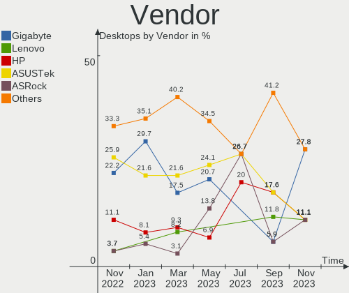
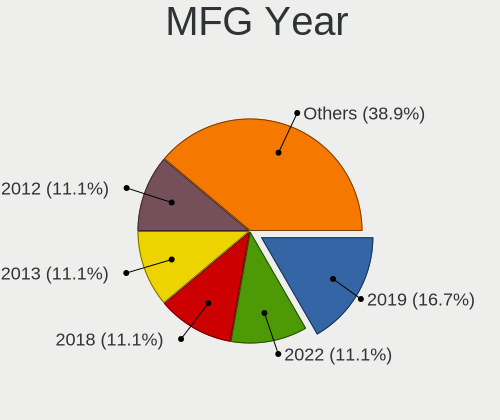

helloSystem - Hardware Trends (Desktops)
----------------------------------------

A project to identify most popular hardware characteristics and track their change
over time based on data collected by BSD users at https://BSD-Hardware.info.

Anyone can contribute to this report by the [hw-probe](https://github.com/linuxhw/hw-probe/blob/master/INSTALL.BSD.md) tool:

    hw-probe -all -upload

This report is for one last month. Overall report since the beginning of time: [TestDays](https://github.com/bsdhw/TestDays)

Period: Oct, 2023.

Contents
--------

* [ System ](#system)
  - [ OS                       ](#os)
  - [ OS Family                ](#os-family)
  - [ Arch                     ](#arch)
  - [ DE                       ](#de)
  - [ Display Server           ](#display-server)
  - [ Display Manager          ](#display-manager)
  - [ OS Lang                  ](#os-lang)
  - [ Boot Mode                ](#boot-mode)
  - [ Filesystem               ](#filesystem)
  - [ Part. scheme             ](#part-scheme)

* [ Board ](#board)
  - [ Vendor                   ](#vendor)
  - [ Model                    ](#model)
  - [ Model Family             ](#model-family)
  - [ MFG Year                 ](#mfg-year)
  - [ Form Factor              ](#form-factor)
  - [ Coreboot                 ](#coreboot)
  - [ RAM Size                 ](#ram-size)
  - [ RAM Used                 ](#ram-used)
  - [ Total Drives             ](#total-drives)
  - [ Has CD-ROM               ](#has-cd-rom)
  - [ Has Ethernet             ](#has-ethernet)
  - [ Has WiFi                 ](#has-wifi)
  - [ Has Bluetooth            ](#has-bluetooth)

* [ Location ](#location)
  - [ Country                  ](#country)
  - [ City                     ](#city)

* [ Drives ](#drives)
  - [ Drive Vendor             ](#drive-vendor)
  - [ Drive Model              ](#drive-model)
  - [ HDD Vendor               ](#hdd-vendor)
  - [ SSD Vendor               ](#ssd-vendor)
  - [ Drive Kind               ](#drive-kind)
  - [ Drive Connector          ](#drive-connector)
  - [ Drive Size               ](#drive-size)
  - [ Space Total              ](#space-total)
  - [ Space Used               ](#space-used)
  - [ Malfunc. Drives          ](#malfunc-drives)
  - [ Malfunc. Drive Vendor    ](#malfunc-drive-vendor)
  - [ Malfunc. HDD Vendor      ](#malfunc-hdd-vendor)
  - [ Malfunc. Drive Kind      ](#malfunc-drive-kind)
  - [ Failed Drives            ](#failed-drives)
  - [ Failed Drive Vendor      ](#failed-drive-vendor)
  - [ Drive Status             ](#drive-status)

* [ Storage controller ](#storage-controller)
  - [ Storage Vendor           ](#storage-vendor)
  - [ Storage Model            ](#storage-model)
  - [ Storage Kind             ](#storage-kind)

* [ Processor ](#processor)
  - [ CPU Vendor               ](#cpu-vendor)
  - [ CPU Model                ](#cpu-model)
  - [ CPU Model Family         ](#cpu-model-family)
  - [ CPU Cores                ](#cpu-cores)
  - [ CPU Sockets              ](#cpu-sockets)
  - [ CPU Threads              ](#cpu-threads)
  - [ CPU Microarch            ](#cpu-microarch)

* [ Graphics ](#graphics)
  - [ GPU Vendor               ](#gpu-vendor)
  - [ GPU Model                ](#gpu-model)
  - [ GPU Combo                ](#gpu-combo)
  - [ GPU Driver               ](#gpu-driver)
  - [ GPU Memory               ](#gpu-memory)

* [ Monitor ](#monitor)
  - [ Monitor Vendor           ](#monitor-vendor)
  - [ Monitor Model            ](#monitor-model)
  - [ Monitor Resolution       ](#monitor-resolution)
  - [ Monitor Diagonal         ](#monitor-diagonal)
  - [ Monitor Width            ](#monitor-width)
  - [ Aspect Ratio             ](#aspect-ratio)
  - [ Monitor Area             ](#monitor-area)
  - [ Pixel Density            ](#pixel-density)
  - [ Multiple Monitors        ](#multiple-monitors)

* [ Network ](#network)
  - [ Net Controller Vendor    ](#net-controller-vendor)
  - [ Net Controller Model     ](#net-controller-model)
  - [ Wireless Vendor          ](#wireless-vendor)
  - [ Wireless Model           ](#wireless-model)
  - [ Ethernet Vendor          ](#ethernet-vendor)
  - [ Ethernet Model           ](#ethernet-model)
  - [ Net Controller Kind      ](#net-controller-kind)
  - [ Used Controller          ](#used-controller)
  - [ NICs                     ](#nics)
  - [ IPv6                     ](#ipv6)

* [ Bluetooth ](#bluetooth)
  - [ Bluetooth Vendor         ](#bluetooth-vendor)
  - [ Bluetooth Model          ](#bluetooth-model)

* [ Sound ](#sound)
  - [ Sound Vendor             ](#sound-vendor)
  - [ Sound Model              ](#sound-model)

* [ Memory ](#memory)
  - [ Memory Vendor            ](#memory-vendor)
  - [ Memory Model             ](#memory-model)
  - [ Memory Kind              ](#memory-kind)
  - [ Memory Form Factor       ](#memory-form-factor)
  - [ Memory Size              ](#memory-size)
  - [ Memory Speed             ](#memory-speed)

* [ Printers & scanners ](#printers--scanners)
  - [ Printer Vendor           ](#printer-vendor)
  - [ Printer Model            ](#printer-model)
  - [ Scanner Vendor           ](#scanner-vendor)
  - [ Scanner Model            ](#scanner-model)

* [ Camera ](#camera)
  - [ Camera Vendor            ](#camera-vendor)
  - [ Camera Model             ](#camera-model)

* [ Security ](#security)
  - [ Fingerprint Vendor       ](#fingerprint-vendor)
  - [ Fingerprint Model        ](#fingerprint-model)
  - [ Chipcard Vendor          ](#chipcard-vendor)
  - [ Chipcard Model           ](#chipcard-model)

* [ Unsupported ](#unsupported)
  - [ Unsupported Devices      ](#unsupported-devices)
  - [ Unsupported Device Types ](#unsupported-device-types)

System
------

OS
--

Installed operating systems

| Name              | Desktops | Percent |
|-------------------|----------|---------|
| helloSystem 0.9.0 | 6        | 50%     |
| helloSystem 0.8.1 | 6        | 50%     |

OS Family
---------

OS without a version

| Name        | Desktops | Percent |
|-------------|----------|---------|
| helloSystem | 12       | 100%    |

Arch
----

OS architecture (x86_64, i586, etc.)

| Name  | Desktops | Percent |
|-------|----------|---------|
| amd64 | 12       | 100%    |

DE
--

Desktop Environment

| Name         | Desktops | Percent |
|--------------|----------|---------|
| helloDesktop | 12       | 100%    |

Display Server
--------------

X11 or Wayland

| Name | Desktops | Percent |
|------|----------|---------|
| X11  | 12       | 100%    |

Display Manager
---------------

SDDM, LightDM, etc.

| Name | Desktops | Percent |
|------|----------|---------|
| SLiM | 12       | 100%    |

OS Lang
-------

Language

| Lang    | Desktops | Percent |
|---------|----------|---------|
| Unknown | 6        | 50%     |
| en_US   | 3        | 25%     |
| de_DE   | 2        | 16.67%  |
| fr_FR   | 1        | 8.33%   |

Boot Mode
---------

EFI or BIOS

| Mode | Desktops | Percent |
|------|----------|---------|
| EFI  | 12       | 100%    |

Filesystem
----------

Type of filesystem

| Type   | Desktops | Percent |
|--------|----------|---------|
| Cd9660 | 7        | 58.33%  |
| Zfs    | 5        | 41.67%  |

Part. scheme
------------

Scheme of partitioning

| Type | Desktops | Percent |
|------|----------|---------|
| GPT  | 12       | 100%    |

Board
-----

Vendor
------

Motherboard manufacturer

| Name                | Desktops | Percent |
|---------------------|----------|---------|
| Gigabyte Technology | 6        | 50%     |
| ASUSTek Computer    | 3        | 25%     |
| Intel               | 1        | 8.33%   |
| Hewlett-Packard     | 1        | 8.33%   |
| ASRock              | 1        | 8.33%   |

Model
-----

Motherboard model

| Name                         | Desktops | Percent |
|------------------------------|----------|---------|
| Intel DB75EN AAG39650-302    | 1        | 8.33%   |
| HP Compaq 6200 Pro MT PC     | 1        | 8.33%   |
| Gigabyte Z370 AORUS Gaming 7 | 1        | 8.33%   |
| Gigabyte Z170-D3H            | 1        | 8.33%   |
| Gigabyte H61M-S1             | 1        | 8.33%   |
| Gigabyte H55M-D2H            | 1        | 8.33%   |
| Gigabyte B550M DS3H          | 1        | 8.33%   |
| Gigabyte B250M-D3H           | 1        | 8.33%   |
| ASUS PRIME B560-PLUS AC-HES  | 1        | 8.33%   |
| ASUS PRIME B250M-A           | 1        | 8.33%   |
| ASUS M5A78L-M/USB3           | 1        | 8.33%   |
| ASRock X300M-STX             | 1        | 8.33%   |

Model Family
------------

Motherboard model prefix

| Name               | Desktops | Percent |
|--------------------|----------|---------|
| ASUS PRIME         | 2        | 16.67%  |
| Intel DB75EN       | 1        | 8.33%   |
| HP Compaq          | 1        | 8.33%   |
| Gigabyte Z370      | 1        | 8.33%   |
| Gigabyte Z170-D3H  | 1        | 8.33%   |
| Gigabyte H61M-S1   | 1        | 8.33%   |
| Gigabyte H55M-D2H  | 1        | 8.33%   |
| Gigabyte B550M     | 1        | 8.33%   |
| Gigabyte B250M-D3H | 1        | 8.33%   |
| ASUS M5A78L-M      | 1        | 8.33%   |
| ASRock X300M-STX   | 1        | 8.33%   |

MFG Year
--------

Motherboard manufacture year

| Year | Desktops | Percent |
|------|----------|---------|
| 2022 | 2        | 16.67%  |
| 2021 | 2        | 16.67%  |
| 2018 | 2        | 16.67%  |
| 2013 | 2        | 16.67%  |
| 2011 | 2        | 16.67%  |
| 2017 | 1        | 8.33%   |
| 2012 | 1        | 8.33%   |

Form Factor
-----------

Physical design of the computer

| Name    | Desktops | Percent |
|---------|----------|---------|
| Desktop | 12       | 100%    |

Coreboot
--------

Have coreboot on board

| Used | Desktops | Percent |
|------|----------|---------|
| No   | 12       | 100%    |

RAM Size
--------

Total RAM memory

| Size in GB  | Desktops | Percent |
|-------------|----------|---------|
| 16.01-24.0  | 4        | 33.33%  |
| 8.01-16.0   | 3        | 25%     |
| 4.01-8.0    | 2        | 16.67%  |
| 32.01-64.0  | 2        | 16.67%  |
| 64.01-256.0 | 1        | 8.33%   |

RAM Used
--------

Used RAM memory

| Used GB  | Desktops | Percent |
|----------|----------|---------|
| 0.01-0.5 | 5        | 41.67%  |
| 1.01-2.0 | 3        | 25%     |
| 0.51-1.0 | 3        | 25%     |
| 4.01-8.0 | 1        | 8.33%   |

Total Drives
------------

Number of drives on board

| Drives | Desktops | Percent |
|--------|----------|---------|
| 1      | 5        | 41.67%  |
| 3      | 4        | 33.33%  |
| 2      | 2        | 16.67%  |
| 0      | 1        | 8.33%   |

Has CD-ROM
----------

Has CD-ROM on board

| Presented | Desktops | Percent |
|-----------|----------|---------|
| Yes       | 6        | 50%     |
| No        | 6        | 50%     |

Has Ethernet
------------

Has Ethernet on board

| Presented | Desktops | Percent |
|-----------|----------|---------|
| Yes       | 12       | 100%    |

Has WiFi
--------

Has WiFi module

| Presented | Desktops | Percent |
|-----------|----------|---------|
| No        | 8        | 66.67%  |
| Yes       | 4        | 33.33%  |

Has Bluetooth
-------------

Has Bluetooth module

| Presented | Desktops | Percent |
|-----------|----------|---------|
| No        | 9        | 75%     |
| Yes       | 3        | 25%     |

Location
--------

Country
-------

Geographic location (country)

| Country     | Desktops | Percent |
|-------------|----------|---------|
| USA         | 2        | 16.67%  |
| Taiwan      | 2        | 16.67%  |
| Russia      | 2        | 16.67%  |
| Germany     | 2        | 16.67%  |
| Ukraine     | 1        | 8.33%   |
| Netherlands | 1        | 8.33%   |
| Italy       | 1        | 8.33%   |
| Bulgaria    | 1        | 8.33%   |

City
----

Geographic location (city)

| City                | Desktops | Percent |
|---------------------|----------|---------|
| Taichung            | 2        | 16.67%  |
| Tallahassee         | 1        | 8.33%   |
| St Petersburg       | 1        | 8.33%   |
| Sofia               | 1        | 8.33%   |
| Simferopol          | 1        | 8.33%   |
| Rosignano Marittimo | 1        | 8.33%   |
| Ocean Springs       | 1        | 8.33%   |
| Neuwied             | 1        | 8.33%   |
| Naaldwijk           | 1        | 8.33%   |
| Kuznechikha         | 1        | 8.33%   |
| Friesenheim         | 1        | 8.33%   |

Drives
------

Drive Vendor
------------

Hard drive vendors

| Vendor              | Desktops | Drives | Percent |
|---------------------|----------|--------|---------|
| Samsung Electronics | 4        | 5      | 21.05%  |
| WDC                 | 3        | 5      | 15.79%  |
| Seagate             | 3        | 3      | 15.79%  |
| Hitachi             | 2        | 2      | 10.53%  |
| Transcend           | 1        | 1      | 5.26%   |
| SanDisk             | 1        | 1      | 5.26%   |
| Phison              | 1        | 1      | 5.26%   |
| Maxtor              | 1        | 1      | 5.26%   |
| Intel               | 1        | 1      | 5.26%   |
| AMD                 | 1        | 1      | 5.26%   |
| A-DATA Technology   | 1        | 1      | 5.26%   |

Drive Model
-----------

Hard drive models

| Model                           | Desktops | Percent |
|---------------------------------|----------|---------|
| Samsung HD161GJ 160GB           | 2        | 9.09%   |
| WDC WDS500G2B0A-00SM50 500GB    | 1        | 4.55%   |
| WDC WDS120G2G0A-00JH30 120GB    | 1        | 4.55%   |
| WDC WD40EFRX-68N32N0 4TB        | 1        | 4.55%   |
| WDC WD20EADS-00W4B0 2TB         | 1        | 4.55%   |
| WDC WD20EADS-00S2B0 2TB         | 1        | 4.55%   |
| Transcend TS120GSSD220S 120GB   | 1        | 4.55%   |
| Seagate ST500LT012-1DG142 500GB | 1        | 4.55%   |
| Seagate ST3500418AS 500GB       | 1        | 4.55%   |
| Seagate ST3360320AS 360GB       | 1        | 4.55%   |
| SanDisk SD8SBAT256G1122 256GB   | 1        | 4.55%   |
| Samsung SSD 970 EVO Plus 1TB    | 1        | 4.55%   |
| Samsung SSD 960 EVO 500GB       | 1        | 4.55%   |
| Samsung HD160JJ 160GB           | 1        | 4.55%   |
| Phison Viper M.2 VPN100 1TB     | 1        | 4.55%   |
| Maxtor STM3160211AS 160GB       | 1        | 4.55%   |
| Intel SSDSC2CT240A3 240GB       | 1        | 4.55%   |
| Hitachi HTS547575A9E384 752GB   | 1        | 4.55%   |
| Hitachi HTS541612J9SA00 120GB   | 1        | 4.55%   |
| AMD R5MP256G8 256GB             | 1        | 4.55%   |
| A-DATA SX7000NP 128GB           | 1        | 4.55%   |

HDD Vendor
----------

Hard disk drive vendors

| Vendor              | Desktops | Drives | Percent |
|---------------------|----------|--------|---------|
| Seagate             | 3        | 3      | 30%     |
| WDC                 | 2        | 3      | 20%     |
| Samsung Electronics | 2        | 3      | 20%     |
| Hitachi             | 2        | 2      | 20%     |
| Maxtor              | 1        | 1      | 10%     |

SSD Vendor
----------

Solid state drive vendors

| Vendor    | Desktops | Drives | Percent |
|-----------|----------|--------|---------|
| WDC       | 2        | 2      | 40%     |
| Transcend | 1        | 1      | 20%     |
| SanDisk   | 1        | 1      | 20%     |
| Intel     | 1        | 1      | 20%     |

Drive Kind
----------

HDD or SSD

| Kind | Desktops | Drives | Percent |
|------|----------|--------|---------|
| HDD  | 7        | 12     | 43.75%  |
| SSD  | 5        | 5      | 31.25%  |
| NVMe | 4        | 5      | 25%     |

Drive Connector
---------------

SATA, SAS, NVMe, etc.

| Type | Desktops | Drives | Percent |
|------|----------|--------|---------|
| SATA | 10       | 17     | 71.43%  |
| NVMe | 4        | 5      | 28.57%  |

Drive Size
----------

Size of hard drive

| Size in TB | Desktops | Drives | Percent |
|------------|----------|--------|---------|
| 0.01-0.5   | 9        | 13     | 75%     |
| 3.01-4.0   | 1        | 1      | 8.33%   |
| 1.01-2.0   | 1        | 2      | 8.33%   |
| 0.51-1.0   | 1        | 1      | 8.33%   |

Space Total
-----------

Amount of disk space available on the file system

| Size in GB | Desktops | Percent |
|------------|----------|---------|
| 1-20       | 5        | 41.67%  |
| 251-500    | 3        | 25%     |
| 101-250    | 2        | 16.67%  |
| 1001-2000  | 1        | 8.33%   |
| 51-100     | 1        | 8.33%   |

Space Used
----------

Amount of used disk space

| Used GB  | Desktops | Percent |
|----------|----------|---------|
| 1-20     | 10       | 83.33%  |
| 101-250  | 1        | 8.33%   |
| 501-1000 | 1        | 8.33%   |

Malfunc. Drives
---------------

Drive models with a malfunction

| Model                             | Desktops | Drives | Percent |
|-----------------------------------|----------|--------|---------|
| Samsung Electronics HD161GJ 160GB | 2        | 2      | 22.22%  |
| WDC WD20EADS-00W4B0 2TB           | 1        | 1      | 11.11%  |
| Transcend TS120GSSD220S 120GB     | 1        | 1      | 11.11%  |
| Seagate ST3500418AS 500GB         | 1        | 1      | 11.11%  |
| Seagate ST3360320AS 360GB         | 1        | 1      | 11.11%  |
| SanDisk SD8SBAT256G1122 256GB     | 1        | 1      | 11.11%  |
| Samsung Electronics HD160JJ 160GB | 1        | 1      | 11.11%  |
| A-DATA Technology SX7000NP 128GB  | 1        | 1      | 11.11%  |

Malfunc. Drive Vendor
---------------------

Vendors of faulty drives

| Vendor              | Desktops | Drives | Percent |
|---------------------|----------|--------|---------|
| Seagate             | 2        | 2      | 25%     |
| Samsung Electronics | 2        | 3      | 25%     |
| WDC                 | 1        | 1      | 12.5%   |
| Transcend           | 1        | 1      | 12.5%   |
| SanDisk             | 1        | 1      | 12.5%   |
| A-DATA Technology   | 1        | 1      | 12.5%   |

Malfunc. HDD Vendor
-------------------

Vendors of faulty HDD drives

| Vendor              | Desktops | Drives | Percent |
|---------------------|----------|--------|---------|
| Seagate             | 2        | 2      | 40%     |
| Samsung Electronics | 2        | 3      | 40%     |
| WDC                 | 1        | 1      | 20%     |

Malfunc. Drive Kind
-------------------

Kinds of faulty drives

| Kind | Desktops | Drives | Percent |
|------|----------|--------|---------|
| HDD  | 4        | 6      | 57.14%  |
| SSD  | 2        | 2      | 28.57%  |
| NVMe | 1        | 1      | 14.29%  |

Failed Drives
-------------

Failed drive models

Zero info for selected period =(

Failed Drive Vendor
-------------------

Failed drive vendors

Zero info for selected period =(

Drive Status
------------

Number of failed and malfunc. drives

| Status   | Desktops | Drives | Percent |
|----------|----------|--------|---------|
| Works    | 8        | 12     | 53.33%  |
| Malfunc  | 6        | 9      | 40%     |
| Detected | 1        | 1      | 6.67%   |

Storage controller
------------------

Storage Vendor
--------------

Storage controller vendors

| Vendor              | Desktops | Percent |
|---------------------|----------|---------|
| Intel               | 9        | 47.37%  |
| Silicon Motion      | 2        | 10.53%  |
| SanDisk             | 2        | 10.53%  |
| Samsung Electronics | 2        | 10.53%  |
| AMD                 | 2        | 10.53%  |
| Phison Electronics  | 1        | 5.26%   |
| JMicron Technology  | 1        | 5.26%   |

Storage Model
-------------

Storage controller models

| Model                                                                                   | Desktops | Percent |
|-----------------------------------------------------------------------------------------|----------|---------|
| Intel 200 Series PCH SATA controller [AHCI mode]                                        | 3        | 13.64%  |
| Silicon Motion SM2263EN/SM2263XT (DRAM-less) NVMe SSD Controllers                       | 1        | 4.55%   |
| Silicon Motion SM2260 NVMe SSD Controller                                               | 1        | 4.55%   |
| Sandisk WD Blue SN570 NVMe SSD 2TB                                                      | 1        | 4.55%   |
| SanDisk Ultra 3D / WD Blue SN570 NVMe SSD (DRAM-less)                                   | 1        | 4.55%   |
| Samsung NVMe SSD Controller SM981/PM981/PM983                                           | 1        | 4.55%   |
| Samsung NVMe SSD Controller SM961/PM961/SM963                                           | 1        | 4.55%   |
| Phison E12 NVMe Controller                                                              | 1        | 4.55%   |
| JMicron JMB368 IDE controller                                                           | 1        | 4.55%   |
| Intel Q170/Q150/B150/H170/H110/Z170/CM236 Chipset SATA Controller [AHCI Mode]           | 1        | 4.55%   |
| Intel 7 Series/C210 Series Chipset Family 6-port SATA Controller [AHCI mode]            | 1        | 4.55%   |
| Intel 6 Series/C200 Series Chipset Family Desktop SATA Controller (IDE mode, ports 4-5) | 1        | 4.55%   |
| Intel 6 Series/C200 Series Chipset Family Desktop SATA Controller (IDE mode, ports 0-3) | 1        | 4.55%   |
| Intel 6 Series/C200 Series Chipset Family 6 port Desktop SATA AHCI Controller           | 1        | 4.55%   |
| Intel 500 Series Chipset Family SATA AHCI Controller                                    | 1        | 4.55%   |
| Intel 5 Series/3400 Series Chipset 4 port SATA IDE Controller                           | 1        | 4.55%   |
| Intel 5 Series/3400 Series Chipset 2 port SATA IDE Controller                           | 1        | 4.55%   |
| AMD SB7x0/SB8x0/SB9x0 SATA Controller [IDE mode]                                        | 1        | 4.55%   |
| AMD SB7x0/SB8x0/SB9x0 IDE Controller                                                    | 1        | 4.55%   |
| AMD 500 Series Chipset SATA Controller                                                  | 1        | 4.55%   |

Storage Kind
------------

Kind of storage controller (IDE, SATA, NVMe, SAS, ...)

| Kind | Desktops | Percent |
|------|----------|---------|
| SATA | 8        | 50%     |
| NVMe | 5        | 31.25%  |
| IDE  | 3        | 18.75%  |

Processor
---------

CPU Vendor
----------

Processor vendors

| Vendor | Desktops | Percent |
|--------|----------|---------|
| Intel  | 9        | 75%     |
| AMD    | 3        | 25%     |

CPU Model
---------

Processor models

| Model                                   | Desktops | Percent |
|-----------------------------------------|----------|---------|
| Intel Core i7-8700K CPU @ 3.70GHz       | 1        | 8.33%   |
| Intel Core i5-7400 CPU @ 3.00GHz        | 1        | 8.33%   |
| Intel Core i5-6500 CPU @ 3.20GHz        | 1        | 8.33%   |
| Intel Core i5-3470 CPU @ 3.20GHz        | 1        | 8.33%   |
| Intel Core i5-2320 CPU @ 3.00GHz        | 1        | 8.33%   |
| Intel Core i3-7100 CPU @ 3.90GHz        | 1        | 8.33%   |
| Intel Core i3-2100 CPU @ 3.10GHz        | 1        | 8.33%   |
| Intel Core i3 CPU                       | 1        | 8.33%   |
| Intel 11th Gen Core i5-11400F @ 2.60GHz | 1        | 8.33%   |
| AMD Ryzen 7 5700G with Radeon Graphics  | 1        | 8.33%   |
| AMD Ryzen 5 5600G with Radeon Graphics  | 1        | 8.33%   |
| AMD Athlon II X2 250 Processor          | 1        | 8.33%   |

CPU Model Family
----------------

Processor model prefix

| Model            | Desktops | Percent |
|------------------|----------|---------|
| Intel Core i5    | 4        | 33.33%  |
| Intel Core i3    | 3        | 25%     |
| Other            | 1        | 8.33%   |
| Intel Core i7    | 1        | 8.33%   |
| AMD Ryzen 7      | 1        | 8.33%   |
| AMD Ryzen 5      | 1        | 8.33%   |
| AMD Athlon II X2 | 1        | 8.33%   |

CPU Cores
---------

Number of processor cores

| Number | Desktops | Percent |
|--------|----------|---------|
| 4      | 4        | 33.33%  |
| 2      | 4        | 33.33%  |
| 6      | 2        | 16.67%  |
| 16     | 1        | 8.33%   |
| 12     | 1        | 8.33%   |

CPU Sockets
-----------

Number of sockets

| Number | Desktops | Percent |
|--------|----------|---------|
| 1      | 12       | 100%    |

CPU Threads
-----------

Threads per core (Hyper-Threading)

| Number | Desktops | Percent |
|--------|----------|---------|
| 1      | 7        | 58.33%  |
| 2      | 5        | 41.67%  |

CPU Microarch
-------------

Microarchitecture

| Name        | Desktops | Percent |
|-------------|----------|---------|
| KabyLake    | 3        | 25%     |
| Zen 3       | 2        | 16.67%  |
| SandyBridge | 2        | 16.67%  |
| Westmere    | 1        | 8.33%   |
| Skylake     | 1        | 8.33%   |
| K10         | 1        | 8.33%   |
| IvyBridge   | 1        | 8.33%   |
| Unknown     | 1        | 8.33%   |

Graphics
--------

GPU Vendor
----------

Vendors of graphics cards

| Vendor | Desktops | Percent |
|--------|----------|---------|
| AMD    | 8        | 57.14%  |
| Nvidia | 4        | 28.57%  |
| Intel  | 2        | 14.29%  |

GPU Model
---------

Graphics card models

| Model                                                        | Desktops | Percent |
|--------------------------------------------------------------|----------|---------|
| Nvidia GF108 [GeForce GT 440]                                | 2        | 14.29%  |
| Intel HD Graphics 630                                        | 2        | 14.29%  |
| AMD Vega 10 XL/XT [Radeon RX Vega 56/64]                     | 2        | 14.29%  |
| AMD Ellesmere [Radeon RX 470/480/570/570X/580/580X/590]      | 2        | 14.29%  |
| AMD Cezanne [Radeon Vega Series / Radeon Vega Mobile Series] | 2        | 14.29%  |
| Nvidia GA104 [GeForce RTX 3060 Ti]                           | 1        | 7.14%   |
| Nvidia G92 [GeForce 8800 GT]                                 | 1        | 7.14%   |
| AMD RS780L [Radeon 3000]                                     | 1        | 7.14%   |
| AMD Caicos [Radeon HD 6450/7450/8450 / R5 230 OEM]           | 1        | 7.14%   |

GPU Combo
---------

Combinations of graphics cards

| Name                     | Desktops | Percent |
|--------------------------|----------|---------|
| 1 x AMD                  | 7        | 58.33%  |
| 1 x Nvidia               | 3        | 25%     |
| Intel + AMD + 1 x Nvidia | 1        | 8.33%   |
| 1 x Intel                | 1        | 8.33%   |

GPU Driver
----------

Free vs proprietary

| Driver      | Desktops | Percent |
|-------------|----------|---------|
| Free        | 10       | 83.33%  |
| Proprietary | 2        | 16.67%  |

GPU Memory
----------

Total video memory

| Size in GB | Desktops | Percent |
|------------|----------|---------|
| 0.51-1.0   | 4        | 33.33%  |
| Unknown    | 4        | 33.33%  |
| 7.01-8.0   | 2        | 16.67%  |
| 3.01-4.0   | 1        | 8.33%   |
| 0.01-0.5   | 1        | 8.33%   |

Monitor
-------

Monitor Vendor
--------------

Monitor vendors

| Vendor               | Desktops | Percent |
|----------------------|----------|---------|
| Acer                 | 3        | 27.27%  |
| Goldstar             | 2        | 18.18%  |
| BenQ                 | 2        | 18.18%  |
| ViewSonic            | 1        | 9.09%   |
| Samsung Electronics  | 1        | 9.09%   |
| Fujitsu Siemens      | 1        | 9.09%   |
| Ancor Communications | 1        | 9.09%   |

Monitor Model
-------------

Monitor models

| Model                                                                 | Desktops | Percent |
|-----------------------------------------------------------------------|----------|---------|
| ViewSonic VA2418-FHD VSCD739 1920x1080 530x300mm 24.0-inch            | 1        | 9.09%   |
| Samsung Electronics SyncMaster SAM05C5 1920x1080                      | 1        | 9.09%   |
| Goldstar LG HDR 4K GSM7707 3840x2160 600x340mm 27.2-inch              | 1        | 9.09%   |
| Goldstar 22M35 GSM5A31 1920x1080 480x270mm 21.7-inch                  | 1        | 9.09%   |
| Fujitsu Siemens L19-1 FUS07DB 1280x1024 380x300mm 19.1-inch           | 1        | 9.09%   |
| BenQ LCD BNQ801B 2560x1440 530x300mm 24.0-inch                        | 1        | 9.09%   |
| BenQ G2420HDBL BNQ785F 1920x1080 530x290mm 23.8-inch                  | 1        | 9.09%   |
| Ancor Communications ASUS VW227 ACI22E1 1920x1080 480x270mm 21.7-inch | 1        | 9.09%   |
| Acer X183H ACR006A 1366x768 410x230mm 18.5-inch                       | 1        | 9.09%   |
| Acer HA240Y ACR0583 1920x1080 530x300mm 24.0-inch                     | 1        | 9.09%   |
| Acer G227HQL ACR03DE 1920x1080 480x270mm 21.7-inch                    | 1        | 9.09%   |

Monitor Resolution
------------------

Monitor screen resolution

| Resolution       | Desktops | Percent |
|------------------|----------|---------|
| 1920x1080 (FHD)  | 7        | 63.64%  |
| 3840x2160 (4K)   | 1        | 9.09%   |
| 2560x1440 (QHD)  | 1        | 9.09%   |
| 1366x768 (WXGA)  | 1        | 9.09%   |
| 1280x1024 (SXGA) | 1        | 9.09%   |

Monitor Diagonal
----------------

Diagonal size in inches

| Inches  | Desktops | Percent |
|---------|----------|---------|
| 24      | 3        | 27.27%  |
| 21      | 3        | 27.27%  |
| 27      | 1        | 9.09%   |
| 23      | 1        | 9.09%   |
| 19      | 1        | 9.09%   |
| 18      | 1        | 9.09%   |
| Unknown | 1        | 9.09%   |

Monitor Width
-------------

Physical width

| Width in mm | Desktops | Percent |
|-------------|----------|---------|
| 501-600     | 5        | 45.45%  |
| 401-500     | 4        | 36.36%  |
| 351-400     | 1        | 9.09%   |
| Unknown     | 1        | 9.09%   |

Aspect Ratio
------------

Proportional relationship between the width and the height

| Ratio | Desktops | Percent |
|-------|----------|---------|
| 16/9  | 10       | 90.91%  |
| 5/4   | 1        | 9.09%   |

Monitor Area
------------

Area in inch²

| Area in inch² | Desktops | Percent |
|----------------|----------|---------|
| 201-250        | 7        | 63.64%  |
| 301-350        | 1        | 9.09%   |
| 151-200        | 1        | 9.09%   |
| 141-150        | 1        | 9.09%   |
| Unknown        | 1        | 9.09%   |

Pixel Density
-------------

Pixels per inch

| Density | Desktops | Percent |
|---------|----------|---------|
| 51-100  | 5        | 45.45%  |
| 101-120 | 3        | 27.27%  |
| 161-240 | 1        | 9.09%   |
| 121-160 | 1        | 9.09%   |
| Unknown | 1        | 9.09%   |

Multiple Monitors
-----------------

Total monitors connected

| Total | Desktops | Percent |
|-------|----------|---------|
| 1     | 11       | 91.67%  |
| 0     | 1        | 8.33%   |

Network
-------

Net Controller Vendor
---------------------

Controller vendors

| Vendor                | Desktops | Percent |
|-----------------------|----------|---------|
| Realtek Semiconductor | 8        | 42.11%  |
| Intel                 | 6        | 31.58%  |
| Samsung Electronics   | 2        | 10.53%  |
| Qualcomm Atheros      | 1        | 5.26%   |
| Broadcom              | 1        | 5.26%   |
| Arduino SA            | 1        | 5.26%   |

Net Controller Model
--------------------

Controller models

| Model                                                             | Desktops | Percent |
|-------------------------------------------------------------------|----------|---------|
| Realtek RTL8111/8168/8411 PCI Express Gigabit Ethernet Controller | 7        | 35%     |
| Samsung Galaxy series, misc. (tethering mode)                     | 2        | 10%     |
| Intel Ethernet Connection (2) I219-V                              | 2        | 10%     |
| Realtek Bluetooth Adapter                                         | 1        | 5%      |
| Qualcomm Atheros Killer E2500 Gigabit Ethernet Controller         | 1        | 5%      |
| Intel Tiger Lake PCH CNVi WiFi                                    | 1        | 5%      |
| Intel Ethernet Connection (14) I219-V                             | 1        | 5%      |
| Intel Dual Band Wireless-AC 3168NGW [Stone Peak]                  | 1        | 5%      |
| Intel 82579V Gigabit Network Connection                           | 1        | 5%      |
| Intel 82579LM Gigabit Network Connection (Lewisville)             | 1        | 5%      |
| Broadcom BCM4360 802.11ac Dual Band Wireless Network Adapter      | 1        | 5%      |
| Arduino SA Leonardo (CDC ACM, HID)                                | 1        | 5%      |

Wireless Vendor
---------------

Wireless vendors

| Vendor                | Desktops | Percent |
|-----------------------|----------|---------|
| Intel                 | 2        | 50%     |
| Realtek Semiconductor | 1        | 25%     |
| Broadcom              | 1        | 25%     |

Wireless Model
--------------

Wireless models

| Model                                                        | Desktops | Percent |
|--------------------------------------------------------------|----------|---------|
| Realtek Bluetooth Adapter                                    | 1        | 25%     |
| Intel Tiger Lake PCH CNVi WiFi                               | 1        | 25%     |
| Intel Dual Band Wireless-AC 3168NGW [Stone Peak]             | 1        | 25%     |
| Broadcom BCM4360 802.11ac Dual Band Wireless Network Adapter | 1        | 25%     |

Ethernet Vendor
---------------

Ethernet vendors

| Vendor                | Desktops | Percent |
|-----------------------|----------|---------|
| Realtek Semiconductor | 7        | 46.67%  |
| Intel                 | 5        | 33.33%  |
| Samsung Electronics   | 2        | 13.33%  |
| Qualcomm Atheros      | 1        | 6.67%   |

Ethernet Model
--------------

Ethernet models

| Model                                                             | Desktops | Percent |
|-------------------------------------------------------------------|----------|---------|
| Realtek RTL8111/8168/8411 PCI Express Gigabit Ethernet Controller | 7        | 46.67%  |
| Samsung Galaxy series, misc. (tethering mode)                     | 2        | 13.33%  |
| Intel Ethernet Connection (2) I219-V                              | 2        | 13.33%  |
| Qualcomm Atheros Killer E2500 Gigabit Ethernet Controller         | 1        | 6.67%   |
| Intel Ethernet Connection (14) I219-V                             | 1        | 6.67%   |
| Intel 82579V Gigabit Network Connection                           | 1        | 6.67%   |
| Intel 82579LM Gigabit Network Connection (Lewisville)             | 1        | 6.67%   |

Net Controller Kind
-------------------

Ethernet, WiFi or modem

| Kind     | Desktops | Percent |
|----------|----------|---------|
| Ethernet | 12       | 70.59%  |
| WiFi     | 4        | 23.53%  |
| Modem    | 1        | 5.88%   |

Used Controller
---------------

Currently used network controller

| Kind     | Desktops | Percent |
|----------|----------|---------|
| Ethernet | 9        | 100%    |

NICs
----

Total network controllers on board

| Total | Desktops | Percent |
|-------|----------|---------|
| 1     | 9        | 75%     |
| 2     | 2        | 16.67%  |
| 3     | 1        | 8.33%   |

IPv6
----

IPv6 vs IPv4

| Used | Desktops | Percent |
|------|----------|---------|
| No   | 12       | 100%    |

Bluetooth
---------

Bluetooth Vendor
----------------

Controller vendors

| Vendor | Desktops | Percent |
|--------|----------|---------|
| Intel  | 2        | 66.67%  |
| Apple  | 1        | 33.33%  |

Bluetooth Model
---------------

Controller models

| Model                                          | Desktops | Percent |
|------------------------------------------------|----------|---------|
| Intel Wireless-AC 3168 Bluetooth               | 1        | 33.33%  |
| Intel Bluetooth 9460/9560 Jefferson Peak (JfP) | 1        | 33.33%  |
| Apple Bluetooth Host Controller                | 1        | 33.33%  |

Sound
-----

Sound Vendor
------------

Sound card vendors

| Vendor              | Desktops | Percent |
|---------------------|----------|---------|
| Intel               | 8        | 38.1%   |
| AMD                 | 8        | 38.1%   |
| Nvidia              | 3        | 14.29%  |
| Creative Technology | 1        | 4.76%   |
| C-Media Electronics | 1        | 4.76%   |

Sound Model
-----------

Sound card models

| Model                                                                             | Desktops | Percent |
|-----------------------------------------------------------------------------------|----------|---------|
| Intel 200 Series PCH HD Audio                                                     | 3        | 12.5%   |
| Nvidia GF108 High Definition Audio Controller                                     | 2        | 8.33%   |
| Intel 6 Series/C200 Series Chipset Family High Definition Audio Controller        | 2        | 8.33%   |
| AMD Vega 10 HDMI Audio [Radeon Vega 56/64]                                        | 2        | 8.33%   |
| AMD Renoir Radeon High Definition Audio Controller                                | 2        | 8.33%   |
| AMD Family 17h/19h HD Audio Controller                                            | 2        | 8.33%   |
| AMD Ellesmere HDMI Audio [Radeon RX 470/480 / 570/580/590]                        | 2        | 8.33%   |
| Nvidia GA104 High Definition Audio Controller                                     | 1        | 4.17%   |
| Intel Tiger Lake-H HD Audio Controller                                            | 1        | 4.17%   |
| Intel 7 Series/C216 Chipset Family High Definition Audio Controller               | 1        | 4.17%   |
| Intel 5 Series/3400 Series Chipset High Definition Audio                          | 1        | 4.17%   |
| Creative Technology Sound Blaster Play! 2                                         | 1        | 4.17%   |
| C-Media Electronics TONOR TC-777 Audio Device                                     | 1        | 4.17%   |
| AMD SBx00 Azalia (Intel HDA)                                                      | 1        | 4.17%   |
| AMD RS780 HDMI Audio [Radeon 3000/3100 / HD 3200/3300]                            | 1        | 4.17%   |
| AMD Caicos HDMI Audio [Radeon HD 6450 / 7450/8450/8490 OEM / R5 230/235/235X OEM] | 1        | 4.17%   |

Memory
------

Memory Vendor
-------------

Memory module vendors

| Vendor              | Desktops | Percent |
|---------------------|----------|---------|
| Micron Technology   | 3        | 18.75%  |
| Unknown             | 2        | 12.5%   |
| Samsung Electronics | 2        | 12.5%   |
| G.Skill             | 2        | 12.5%   |
| Transcend           | 1        | 6.25%   |
| Team                | 1        | 6.25%   |
| SK hynix            | 1        | 6.25%   |
| Kingston            | 1        | 6.25%   |
| Crucial             | 1        | 6.25%   |
| Corsair             | 1        | 6.25%   |
| Unknown             | 1        | 6.25%   |

Memory Model
------------

Memory module models

| Model                                                   | Desktops | Percent |
|---------------------------------------------------------|----------|---------|
| Unknown RAM Module 4GB DIMM 1333MT/s                    | 2        | 11.11%  |
| Transcend RAM JM1333KLN-4G 4GB DIMM DDR3 1333MT/s       | 1        | 5.56%   |
| Transcend RAM JM1333KLH-8G 8GB DIMM DDR3 1333MT/s       | 1        | 5.56%   |
| Team RAM TEAMGROUP-UD4-3200 8GB DIMM DDR4 3200MT/s      | 1        | 5.56%   |
| SK hynix RAM HMA41GU6AFR8N-TF 8GB DIMM DDR4 2133MT/s    | 1        | 5.56%   |
| Samsung RAM Module 2GB DIMM DDR3 1333MT/s               | 1        | 5.56%   |
| Samsung RAM M378B5773CH0-CH9 2GB DIMM DDR3 1333MT/s     | 1        | 5.56%   |
| Samsung RAM M378B5173QH0-CK0 4GB DIMM DDR3 1600MT/s     | 1        | 5.56%   |
| Micron RAM Module 2GB DIMM DDR3 1333MT/s                | 1        | 5.56%   |
| Micron RAM 8JTF51264AZ-1G6E1 4GB DIMM DDR3 1600MT/s     | 1        | 5.56%   |
| Micron RAM 8ATF1G64AZ-2G3E1 8GB DIMM DDR4 2400MT/s      | 1        | 5.56%   |
| Kingston RAM 9905471-023.A00LF 8GB DIMM DDR3 1333MT/s   | 1        | 5.56%   |
| G.Skill RAM F4-3200C16-8GFX 8GB DIMM DDR4 3200MT/s      | 1        | 5.56%   |
| G.Skill RAM F4-2133C15-16GIS 16GB DIMM DDR4 2133MT/s    | 1        | 5.56%   |
| Crucial RAM CT8G4DFD824A.C16FDD2 8GB DIMM DDR4 2400MT/s | 1        | 5.56%   |
| Corsair RAM CMK32GX4M2D3200C16 16GB DIMM DDR4 3200MT/s  | 1        | 5.56%   |
| Unknown                                                 | 1        | 5.56%   |

Memory Kind
-----------

Memory module kinds

| Kind    | Desktops | Percent |
|---------|----------|---------|
| DDR4    | 7        | 58.33%  |
| DDR3    | 3        | 25%     |
| Unknown | 2        | 16.67%  |

Memory Form Factor
------------------

Physical design of the memory module

| Name   | Desktops | Percent |
|--------|----------|---------|
| DIMM   | 11       | 91.67%  |
| SODIMM | 1        | 8.33%   |

Memory Size
-----------

Memory module size

| Size  | Desktops | Percent |
|-------|----------|---------|
| 8192  | 5        | 33.33%  |
| 4096  | 4        | 26.67%  |
| 32768 | 2        | 13.33%  |
| 16384 | 2        | 13.33%  |
| 2048  | 2        | 13.33%  |

Memory Speed
------------

Memory module speed

| Speed | Desktops | Percent |
|-------|----------|---------|
| 1333  | 5        | 38.46%  |
| 3200  | 4        | 30.77%  |
| 2133  | 2        | 15.38%  |
| 2400  | 1        | 7.69%   |
| 1600  | 1        | 7.69%   |

Printers & scanners
-------------------

Printer Vendor
--------------

Printer device vendors

Zero info for selected period =(

Printer Model
-------------

Printer device models

Zero info for selected period =(

Scanner Vendor
--------------

Scanner device vendors

Zero info for selected period =(

Scanner Model
-------------

Scanner device models

Zero info for selected period =(

Camera
------

Camera Vendor
-------------

Camera device vendors

| Vendor                        | Desktops | Percent |
|-------------------------------|----------|---------|
| Sunplus Innovation Technology | 1        | 33.33%  |
| Logitech                      | 1        | 33.33%  |
| GEMBIRD                       | 1        | 33.33%  |

Camera Model
------------

Camera device models

| Model                         | Desktops | Percent |
|-------------------------------|----------|---------|
| Sunplus hama C-600 Pro Webcam | 1        | 33.33%  |
| Logitech Webcam C170          | 1        | 33.33%  |
| GEMBIRD USB2.0 PC CAMERA      | 1        | 33.33%  |

Security
--------

Fingerprint Vendor
------------------

Fingerprint sensor vendors

Zero info for selected period =(

Fingerprint Model
-----------------

Fingerprint sensor models

Zero info for selected period =(

Chipcard Vendor
---------------

Chipcard module vendors

Zero info for selected period =(

Chipcard Model
--------------

Chipcard module models

Zero info for selected period =(

Unsupported
-----------

Unsupported Devices
-------------------

Total unsupported devices on board

| Total | Desktops | Percent |
|-------|----------|---------|
| 1     | 8        | 66.67%  |
| 0     | 3        | 25%     |
| 2     | 1        | 8.33%   |

Unsupported Device Types
------------------------

Types of unsupported devices

| Type                     | Desktops | Percent |
|--------------------------|----------|---------|
| Communication controller | 9        | 90%     |
| Net/wireless             | 1        | 10%     |

