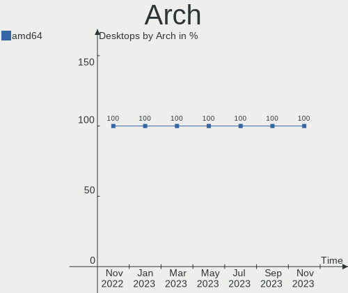
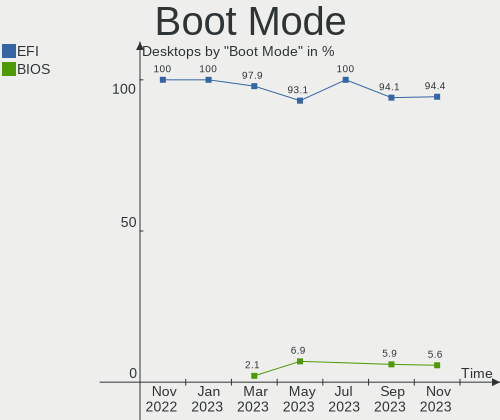
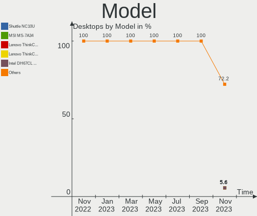
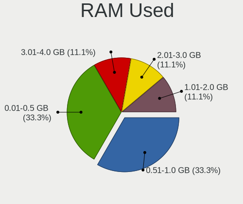
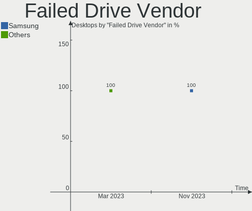
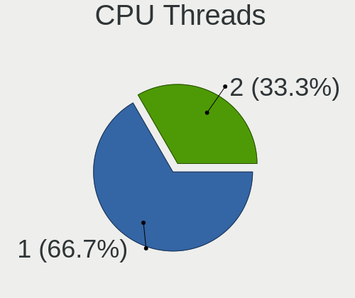
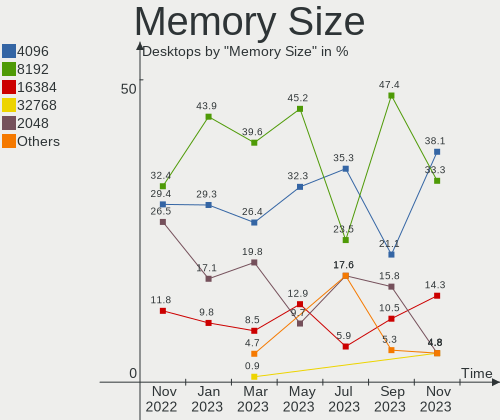
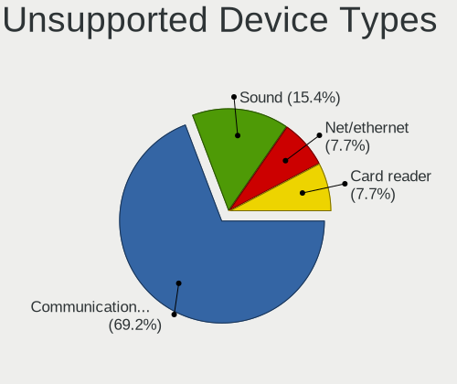

helloSystem - Hardware Trends (Desktops)
----------------------------------------

A project to identify most popular hardware characteristics and track their change
over time based on data collected by BSD users at https://BSD-Hardware.info.

Anyone can contribute to this report by the [hw-probe](https://github.com/linuxhw/hw-probe/blob/master/INSTALL.BSD.md) tool:

    hw-probe -all -upload

This report is for one last month. Overall report since the beginning of time: [TestDays](https://github.com/bsdhw/TestDays)

Period: Mar, 2023.

Contents
--------

* [ System ](#system)
  - [ OS                       ](#os)
  - [ OS Family                ](#os-family)
  - [ Arch                     ](#arch)
  - [ DE                       ](#de)
  - [ Display Server           ](#display-server)
  - [ Display Manager          ](#display-manager)
  - [ OS Lang                  ](#os-lang)
  - [ Boot Mode                ](#boot-mode)
  - [ Filesystem               ](#filesystem)
  - [ Part. scheme             ](#part-scheme)

* [ Board ](#board)
  - [ Vendor                   ](#vendor)
  - [ Model                    ](#model)
  - [ Model Family             ](#model-family)
  - [ MFG Year                 ](#mfg-year)
  - [ Form Factor              ](#form-factor)
  - [ Coreboot                 ](#coreboot)
  - [ RAM Size                 ](#ram-size)
  - [ RAM Used                 ](#ram-used)
  - [ Total Drives             ](#total-drives)
  - [ Has CD-ROM               ](#has-cd-rom)
  - [ Has Ethernet             ](#has-ethernet)
  - [ Has WiFi                 ](#has-wifi)
  - [ Has Bluetooth            ](#has-bluetooth)

* [ Location ](#location)
  - [ Country                  ](#country)
  - [ City                     ](#city)

* [ Drives ](#drives)
  - [ Drive Vendor             ](#drive-vendor)
  - [ Drive Model              ](#drive-model)
  - [ HDD Vendor               ](#hdd-vendor)
  - [ SSD Vendor               ](#ssd-vendor)
  - [ Drive Kind               ](#drive-kind)
  - [ Drive Connector          ](#drive-connector)
  - [ Drive Size               ](#drive-size)
  - [ Space Total              ](#space-total)
  - [ Space Used               ](#space-used)
  - [ Malfunc. Drives          ](#malfunc-drives)
  - [ Malfunc. Drive Vendor    ](#malfunc-drive-vendor)
  - [ Malfunc. HDD Vendor      ](#malfunc-hdd-vendor)
  - [ Malfunc. Drive Kind      ](#malfunc-drive-kind)
  - [ Failed Drives            ](#failed-drives)
  - [ Failed Drive Vendor      ](#failed-drive-vendor)
  - [ Drive Status             ](#drive-status)

* [ Storage controller ](#storage-controller)
  - [ Storage Vendor           ](#storage-vendor)
  - [ Storage Model            ](#storage-model)
  - [ Storage Kind             ](#storage-kind)

* [ Processor ](#processor)
  - [ CPU Vendor               ](#cpu-vendor)
  - [ CPU Model                ](#cpu-model)
  - [ CPU Model Family         ](#cpu-model-family)
  - [ CPU Cores                ](#cpu-cores)
  - [ CPU Sockets              ](#cpu-sockets)
  - [ CPU Threads              ](#cpu-threads)
  - [ CPU Microarch            ](#cpu-microarch)

* [ Graphics ](#graphics)
  - [ GPU Vendor               ](#gpu-vendor)
  - [ GPU Model                ](#gpu-model)
  - [ GPU Combo                ](#gpu-combo)
  - [ GPU Driver               ](#gpu-driver)
  - [ GPU Memory               ](#gpu-memory)

* [ Monitor ](#monitor)
  - [ Monitor Vendor           ](#monitor-vendor)
  - [ Monitor Model            ](#monitor-model)
  - [ Monitor Resolution       ](#monitor-resolution)
  - [ Monitor Diagonal         ](#monitor-diagonal)
  - [ Monitor Width            ](#monitor-width)
  - [ Aspect Ratio             ](#aspect-ratio)
  - [ Monitor Area             ](#monitor-area)
  - [ Pixel Density            ](#pixel-density)
  - [ Multiple Monitors        ](#multiple-monitors)

* [ Network ](#network)
  - [ Net Controller Vendor    ](#net-controller-vendor)
  - [ Net Controller Model     ](#net-controller-model)
  - [ Wireless Vendor          ](#wireless-vendor)
  - [ Wireless Model           ](#wireless-model)
  - [ Ethernet Vendor          ](#ethernet-vendor)
  - [ Ethernet Model           ](#ethernet-model)
  - [ Net Controller Kind      ](#net-controller-kind)
  - [ Used Controller          ](#used-controller)
  - [ NICs                     ](#nics)
  - [ IPv6                     ](#ipv6)

* [ Bluetooth ](#bluetooth)
  - [ Bluetooth Vendor         ](#bluetooth-vendor)
  - [ Bluetooth Model          ](#bluetooth-model)

* [ Sound ](#sound)
  - [ Sound Vendor             ](#sound-vendor)
  - [ Sound Model              ](#sound-model)

* [ Memory ](#memory)
  - [ Memory Vendor            ](#memory-vendor)
  - [ Memory Model             ](#memory-model)
  - [ Memory Kind              ](#memory-kind)
  - [ Memory Form Factor       ](#memory-form-factor)
  - [ Memory Size              ](#memory-size)
  - [ Memory Speed             ](#memory-speed)

* [ Printers & scanners ](#printers--scanners)
  - [ Printer Vendor           ](#printer-vendor)
  - [ Printer Model            ](#printer-model)
  - [ Scanner Vendor           ](#scanner-vendor)
  - [ Scanner Model            ](#scanner-model)

* [ Camera ](#camera)
  - [ Camera Vendor            ](#camera-vendor)
  - [ Camera Model             ](#camera-model)

* [ Security ](#security)
  - [ Fingerprint Vendor       ](#fingerprint-vendor)
  - [ Fingerprint Model        ](#fingerprint-model)
  - [ Chipcard Vendor          ](#chipcard-vendor)
  - [ Chipcard Model           ](#chipcard-model)

* [ Unsupported ](#unsupported)
  - [ Unsupported Devices      ](#unsupported-devices)
  - [ Unsupported Device Types ](#unsupported-device-types)

System
------

OS
--

Installed operating systems

| Name              | Desktops | Percent |
|-------------------|----------|---------|
| helloSystem 0.8.1 | 89       | 91.75%  |
| helloSystem 0.8.0 | 4        | 4.12%   |
| helloSystem 0.8.2 | 2        | 2.06%   |
| helloSystem 0.7.0 | 2        | 2.06%   |

OS Family
---------

OS without a version

| Name        | Desktops | Percent |
|-------------|----------|---------|
| helloSystem | 97       | 100%    |

Arch
----

OS architecture (x86_64, i586, etc.)

| Name  | Desktops | Percent |
|-------|----------|---------|
| amd64 | 97       | 100%    |

DE
--

Desktop Environment

| Name         | Desktops | Percent |
|--------------|----------|---------|
| helloDesktop | 97       | 100%    |

Display Server
--------------

X11 or Wayland

| Name | Desktops | Percent |
|------|----------|---------|
| X11  | 97       | 100%    |

Display Manager
---------------

SDDM, LightDM, etc.

| Name | Desktops | Percent |
|------|----------|---------|
| SLiM | 97       | 100%    |

OS Lang
-------

Language

| Lang    | Desktops | Percent |
|---------|----------|---------|
| fr_FR   | 38       | 39.18%  |
| en_US   | 29       | 29.9%   |
| es_ES   | 8        | 8.25%   |
| ru_RU   | 5        | 5.15%   |
| de_DE   | 5        | 5.15%   |
| pl_PL   | 2        | 2.06%   |
| jp_JP   | 2        | 2.06%   |
| it_IT   | 2        | 2.06%   |
| fr      | 2        | 2.06%   |
| ru      | 1        | 1.03%   |
| pt_BR   | 1        | 1.03%   |
| es      | 1        | 1.03%   |
| Unknown | 1        | 1.03%   |

Boot Mode
---------

EFI or BIOS

| Mode | Desktops | Percent |
|------|----------|---------|
| EFI  | 95       | 97.94%  |
| BIOS | 2        | 2.06%   |

Filesystem
----------

Type of filesystem

| Type   | Desktops | Percent |
|--------|----------|---------|
| Cd9660 | 60       | 61.86%  |
| Zfs    | 37       | 38.14%  |

Part. scheme
------------

Scheme of partitioning

| Type | Desktops | Percent |
|------|----------|---------|
| GPT  | 95       | 97.94%  |
| MBR  | 2        | 2.06%   |

Board
-----

Vendor
------

Motherboard manufacturer

| Name                | Desktops | Percent |
|---------------------|----------|---------|
| ASUSTek Computer    | 21       | 21.65%  |
| Gigabyte Technology | 17       | 17.53%  |
| MSI                 | 9        | 9.28%   |
| Hewlett-Packard     | 9        | 9.28%   |
| Dell                | 9        | 9.28%   |
| Lenovo              | 8        | 8.25%   |
| Unknown             | 4        | 4.12%   |
| ASRock              | 3        | 3.09%   |
| T-bao               | 2        | 2.06%   |
| Intel               | 2        | 2.06%   |
| Fujitsu Siemens     | 2        | 2.06%   |
| Fujitsu             | 2        | 2.06%   |
| Foxconn             | 2        | 2.06%   |
| Acer                | 2        | 2.06%   |
| Google              | 1        | 1.03%   |
| Biostar             | 1        | 1.03%   |
| BESSTAR Tech        | 1        | 1.03%   |
| AZW                 | 1        | 1.03%   |
| Axiomtek            | 1        | 1.03%   |

Model
-----

Motherboard model

| Name                                | Desktops | Percent |
|-------------------------------------|----------|---------|
| Unknown                             | 4        | 4.12%   |
| T-bao MINI PC                       | 2        | 2.06%   |
| MSI MS-7788                         | 2        | 2.06%   |
| HP Compaq Elite 8300 USDT           | 2        | 2.06%   |
| Dell OptiPlex 3020                  | 2        | 2.06%   |
| MSI MS-7C95                         | 1        | 1.03%   |
| MSI MS-7C91                         | 1        | 1.03%   |
| MSI MS-7C51                         | 1        | 1.03%   |
| MSI MS-7C09                         | 1        | 1.03%   |
| MSI MS-7B86                         | 1        | 1.03%   |
| MSI MS-7599                         | 1        | 1.03%   |
| MSI Compaq dx2200 MT                | 1        | 1.03%   |
| Lenovo ThinkCentre M900 10FLS15P00  | 1        | 1.03%   |
| Lenovo ThinkCentre M900 10FGS05C08  | 1        | 1.03%   |
| Lenovo ThinkCentre M83 10AHA0X9LS   | 1        | 1.03%   |
| Lenovo ThinkCentre M73 10AYA06EIA   | 1        | 1.03%   |
| Lenovo ThinkCentre M73 10AXS34800   | 1        | 1.03%   |
| Lenovo ThinkCentre M710s 10M8S0FW00 | 1        | 1.03%   |
| Lenovo ThinkCentre M58p 6138DK1     | 1        | 1.03%   |
| Lenovo ThinkCentre Edge72 34971B1   | 1        | 1.03%   |
| Intel X99                           | 1        | 1.03%   |
| Intel DB85FL AAG89861-203           | 1        | 1.03%   |
| HP Slim Desktop S01-pF1xxx          | 1        | 1.03%   |
| HP rp5800                           | 1        | 1.03%   |
| HP Pavilion Desktop 590-p0xxx       | 1        | 1.03%   |
| HP EliteDesk 800 G2 SFF             | 1        | 1.03%   |
| HP EliteDesk 800 G2 DM 65W          | 1        | 1.03%   |
| HP EliteDesk 800 G2 DM 35W          | 1        | 1.03%   |
| HP 290 G1 MT                        | 1        | 1.03%   |
| Google Panther                      | 1        | 1.03%   |
| Gigabyte Z87X-UD4H                  | 1        | 1.03%   |
| Gigabyte X570 UD                    | 1        | 1.03%   |
| Gigabyte H81M-H                     | 1        | 1.03%   |
| Gigabyte H81M-DS2V                  | 1        | 1.03%   |
| Gigabyte H61M-S2P-B3                | 1        | 1.03%   |
| Gigabyte H61M-DS2 x.x               | 1        | 1.03%   |
| Gigabyte H110M-S2                   | 1        | 1.03%   |
| Gigabyte H110M-H-CF                 | 1        | 1.03%   |
| Gigabyte GA-880GM-USB3              | 1        | 1.03%   |
| Gigabyte GA-78LMT-S2P               | 1        | 1.03%   |

Model Family
------------

Motherboard model prefix

| Name                    | Desktops | Percent |
|-------------------------|----------|---------|
| Lenovo ThinkCentre      | 8        | 8.25%   |
| Dell OptiPlex           | 7        | 7.22%   |
| ASUS PRIME              | 5        | 5.15%   |
| ASUS ROG                | 4        | 4.12%   |
| Unknown                 | 4        | 4.12%   |
| HP EliteDesk            | 3        | 3.09%   |
| T-bao MINI              | 2        | 2.06%   |
| MSI MS-7788             | 2        | 2.06%   |
| HP Compaq               | 2        | 2.06%   |
| Fujitsu Siemens ESPRIMO | 2        | 2.06%   |
| ASUS TUF                | 2        | 2.06%   |
| MSI MS-7C95             | 1        | 1.03%   |
| MSI MS-7C91             | 1        | 1.03%   |
| MSI MS-7C51             | 1        | 1.03%   |
| MSI MS-7C09             | 1        | 1.03%   |
| MSI MS-7B86             | 1        | 1.03%   |
| MSI MS-7599             | 1        | 1.03%   |
| MSI Compaq              | 1        | 1.03%   |
| Intel X99               | 1        | 1.03%   |
| Intel DB85FL            | 1        | 1.03%   |
| HP Slim                 | 1        | 1.03%   |
| HP rp5800               | 1        | 1.03%   |
| HP Pavilion             | 1        | 1.03%   |
| HP 290                  | 1        | 1.03%   |
| Google Panther          | 1        | 1.03%   |
| Gigabyte Z87X-UD4H      | 1        | 1.03%   |
| Gigabyte X570           | 1        | 1.03%   |
| Gigabyte H81M-H         | 1        | 1.03%   |
| Gigabyte H81M-DS2V      | 1        | 1.03%   |
| Gigabyte H61M-S2P-B3    | 1        | 1.03%   |
| Gigabyte H61M-DS2       | 1        | 1.03%   |
| Gigabyte H110M-S2       | 1        | 1.03%   |
| Gigabyte H110M-H-CF     | 1        | 1.03%   |
| Gigabyte GA-880GM-USB3  | 1        | 1.03%   |
| Gigabyte GA-78LMT-S2P   | 1        | 1.03%   |
| Gigabyte G31M-S2L       | 1        | 1.03%   |
| Gigabyte F2A85X-UP4     | 1        | 1.03%   |
| Gigabyte F2A68HM-HD2    | 1        | 1.03%   |
| Gigabyte F2A55-DS3      | 1        | 1.03%   |
| Gigabyte B450M          | 1        | 1.03%   |

MFG Year
--------

Motherboard manufacture year

| Year    | Desktops | Percent |
|---------|----------|---------|
| 2021    | 11       | 11.34%  |
| 2013    | 10       | 10.31%  |
| 2022    | 9        | 9.28%   |
| 2018    | 9        | 9.28%   |
| 2019    | 8        | 8.25%   |
| 2012    | 8        | 8.25%   |
| 2014    | 7        | 7.22%   |
| 2020    | 6        | 6.19%   |
| 2010    | 5        | 5.15%   |
| 2016    | 4        | 4.12%   |
| 2015    | 4        | 4.12%   |
| 2009    | 4        | 4.12%   |
| 2017    | 3        | 3.09%   |
| 2011    | 3        | 3.09%   |
| 2006    | 2        | 2.06%   |
| 2023    | 1        | 1.03%   |
| 2008    | 1        | 1.03%   |
| 2007    | 1        | 1.03%   |
| Unknown | 1        | 1.03%   |

Form Factor
-----------

Physical design of the computer

| Name    | Desktops | Percent |
|---------|----------|---------|
| Desktop | 97       | 100%    |

Coreboot
--------

Have coreboot on board

| Used | Desktops | Percent |
|------|----------|---------|
| No   | 96       | 98.97%  |
| Yes  | 1        | 1.03%   |

RAM Size
--------

Total RAM memory

| Size in GB  | Desktops | Percent |
|-------------|----------|---------|
| 8.01-16.0   | 37       | 38.14%  |
| 16.01-24.0  | 22       | 22.68%  |
| 4.01-8.0    | 20       | 20.62%  |
| 32.01-64.0  | 12       | 12.37%  |
| 24.01-32.0  | 2        | 2.06%   |
| 2.01-3.0    | 2        | 2.06%   |
| 3.01-4.0    | 1        | 1.03%   |
| 64.01-256.0 | 1        | 1.03%   |

RAM Used
--------

Used RAM memory

| Used GB  | Desktops | Percent |
|----------|----------|---------|
| 0.01-0.5 | 44       | 45.36%  |
| 0.51-1.0 | 37       | 38.14%  |
| 1.01-2.0 | 13       | 13.4%   |
| 2.01-3.0 | 3        | 3.09%   |

Total Drives
------------

Number of drives on board

| Drives | Desktops | Percent |
|--------|----------|---------|
| 1      | 45       | 46.39%  |
| 2      | 23       | 23.71%  |
| 3      | 12       | 12.37%  |
| 5      | 6        | 6.19%   |
| 0      | 6        | 6.19%   |
| 4      | 2        | 2.06%   |
| 9      | 1        | 1.03%   |
| 7      | 1        | 1.03%   |
| 6      | 1        | 1.03%   |

Has CD-ROM
----------

Has CD-ROM on board

| Presented | Desktops | Percent |
|-----------|----------|---------|
| No        | 58       | 59.79%  |
| Yes       | 39       | 40.21%  |

Has Ethernet
------------

Has Ethernet on board

| Presented | Desktops | Percent |
|-----------|----------|---------|
| Yes       | 95       | 97.94%  |
| No        | 2        | 2.06%   |

Has WiFi
--------

Has WiFi module

| Presented | Desktops | Percent |
|-----------|----------|---------|
| No        | 63       | 64.95%  |
| Yes       | 34       | 35.05%  |

Has Bluetooth
-------------

Has Bluetooth module

| Presented | Desktops | Percent |
|-----------|----------|---------|
| No        | 75       | 77.32%  |
| Yes       | 22       | 22.68%  |

Location
--------

Country
-------

Geographic location (country)

| Country            | Desktops | Percent |
|--------------------|----------|---------|
| Russia             | 13       | 13.4%   |
| USA                | 12       | 12.37%  |
| Spain              | 9        | 9.28%   |
| Germany            | 8        | 8.25%   |
| Italy              | 5        | 5.15%   |
| Serbia             | 4        | 4.12%   |
| Poland             | 4        | 4.12%   |
| Hungary            | 4        | 4.12%   |
| France             | 4        | 4.12%   |
| Romania            | 3        | 3.09%   |
| Brazil             | 3        | 3.09%   |
| Mexico             | 2        | 2.06%   |
| Japan              | 2        | 2.06%   |
| India              | 2        | 2.06%   |
| Canada             | 2        | 2.06%   |
| Bulgaria           | 2        | 2.06%   |
| Australia          | 2        | 2.06%   |
| Argentina          | 2        | 2.06%   |
| Ukraine            | 1        | 1.03%   |
| UK                 | 1        | 1.03%   |
| Turkey             | 1        | 1.03%   |
| Sweden             | 1        | 1.03%   |
| Peru               | 1        | 1.03%   |
| Netherlands        | 1        | 1.03%   |
| Indonesia          | 1        | 1.03%   |
| Dominican Republic | 1        | 1.03%   |
| Denmark            | 1        | 1.03%   |
| Croatia            | 1        | 1.03%   |
| Belgium            | 1        | 1.03%   |
| Belarus            | 1        | 1.03%   |
| Austria            | 1        | 1.03%   |
| Algeria            | 1        | 1.03%   |

City
----

Geographic location (city)

| City                     | Desktops | Percent |
|--------------------------|----------|---------|
| Moscow                   | 2        | 2.06%   |
| Madrid                   | 2        | 2.06%   |
| Kirov                    | 2        | 2.06%   |
| Berlin                   | 2        | 2.06%   |
| Belgrade                 | 2        | 2.06%   |
| Yokohama                 | 1        | 1.03%   |
| Warsaw                   | 1        | 1.03%   |
| Volgodonsk               | 1        | 1.03%   |
| Vogogna                  | 1        | 1.03%   |
| Virovitica               | 1        | 1.03%   |
| Villena                  | 1        | 1.03%   |
| Vienna                   | 1        | 1.03%   |
| Venice                   | 1        | 1.03%   |
| Vecses                   | 1        | 1.03%   |
| Valderrobres             | 1        | 1.03%   |
| Ubstadt-Weiher           | 1        | 1.03%   |
| Trumbull                 | 1        | 1.03%   |
| Topolovgrad              | 1        | 1.03%   |
| Sydney                   | 1        | 1.03%   |
| St Petersburg            | 1        | 1.03%   |
| Sopron                   | 1        | 1.03%   |
| Sofia                    | 1        | 1.03%   |
| Semlin                   | 1        | 1.03%   |
| Schweinfurt              | 1        | 1.03%   |
| Saskatoon                | 1        | 1.03%   |
| Saransk                  | 1        | 1.03%   |
| Sao Paulo                | 1        | 1.03%   |
| Santo Domingo Este       | 1        | 1.03%   |
| San Jose de la Rinconada | 1        | 1.03%   |
| Rüsselsheim am Main     | 1        | 1.03%   |
| Roquetas de Mar          | 1        | 1.03%   |
| Rochemaure               | 1        | 1.03%   |
| Río Cuarto              | 1        | 1.03%   |
| Ramenskoye               | 1        | 1.03%   |
| Radwanice                | 1        | 1.03%   |
| Piatra Neamţ            | 1        | 1.03%   |
| Pembroke                 | 1        | 1.03%   |
| Paris                    | 1        | 1.03%   |
| Novosibirsk              | 1        | 1.03%   |
| Mönchengladbach         | 1        | 1.03%   |

Drives
------

Drive Vendor
------------

Hard drive vendors

| Vendor              | Desktops | Drives | Percent |
|---------------------|----------|--------|---------|
| WDC                 | 31       | 48     | 20.26%  |
| Samsung Electronics | 21       | 29     | 13.73%  |
| Seagate             | 19       | 24     | 12.42%  |
| Kingston            | 19       | 19     | 12.42%  |
| Toshiba             | 9        | 9      | 5.88%   |
| SanDisk             | 7        | 7      | 4.58%   |
| Crucial             | 5        | 6      | 3.27%   |
| A-DATA Technology   | 5        | 6      | 3.27%   |
| Micron Technology   | 3        | 3      | 1.96%   |
| Maxtor              | 3        | 3      | 1.96%   |
| KingSpec            | 3        | 3      | 1.96%   |
| Hitachi             | 3        | 4      | 1.96%   |
| Transcend           | 2        | 2      | 1.31%   |
| PNY                 | 2        | 2      | 1.31%   |
| Patriot             | 2        | 2      | 1.31%   |
| China               | 2        | 3      | 1.31%   |
| SPCC                | 1        | 1      | 0.65%   |
| QUANTUM             | 1        | 1      | 0.65%   |
| Pioneer             | 1        | 1      | 0.65%   |
| Palit               | 1        | 1      | 0.65%   |
| OCZ                 | 1        | 1      | 0.65%   |
| Kston               | 1        | 1      | 0.65%   |
| KIOXIA-EXCERIA      | 1        | 1      | 0.65%   |
| Intenso             | 1        | 1      | 0.65%   |
| GOODRAM             | 1        | 1      | 0.65%   |
| Gigabyte Technology | 1        | 1      | 0.65%   |
| EDGE                | 1        | 1      | 0.65%   |
| Corsair             | 1        | 1      | 0.65%   |
| Colorful            | 1        | 1      | 0.65%   |
| ASint Technology    | 1        | 1      | 0.65%   |
| Apple               | 1        | 1      | 0.65%   |
| Apacer              | 1        | 1      | 0.65%   |
| AMD                 | 1        | 1      | 0.65%   |

Drive Model
-----------

Hard drive models

| Model                           | Desktops | Percent |
|---------------------------------|----------|---------|
| Seagate ST500DM002-1BD142 500GB | 5        | 2.75%   |
| Seagate ST3500418AS 500GB       | 4        | 2.2%    |
| Kingston SA400S37240G 240GB     | 4        | 2.2%    |
| Toshiba DT01ACA050 500GB        | 3        | 1.65%   |
| Samsung SSD 850 EVO 250GB       | 3        | 1.65%   |
| WDC WDS240G2G0A-00JH30 240GB    | 2        | 1.1%    |
| WDC WDS120G2G0A-00JH30 120GB    | 2        | 1.1%    |
| WDC WD5000AAKX-08U6AA0 500GB    | 2        | 1.1%    |
| WDC WD10EZEX-60WN4A0 1TB        | 2        | 1.1%    |
| WDC WD10EZEX-08WN4A0 1TB        | 2        | 1.1%    |
| Seagate ST2000LM007-1R8174 2TB  | 2        | 1.1%    |
| Seagate ST2000DM008-2FR102 2TB  | 2        | 1.1%    |
| Seagate ST1000DM010-2EP102 1TB  | 2        | 1.1%    |
| Samsung SSD 980 PRO 500GB       | 2        | 1.1%    |
| Samsung SSD 970 EVO Plus 250GB  | 2        | 1.1%    |
| Samsung SSD 970 EVO Plus 1TB    | 2        | 1.1%    |
| Samsung SSD 860 EVO 500GB       | 2        | 1.1%    |
| Kingston SHFS37A240G 240GB      | 2        | 1.1%    |
| Kingston SA400S37480G 480GB     | 2        | 1.1%    |
| Kingston SA400S37120G 120GB     | 2        | 1.1%    |
| Crucial CT240BX500SSD1 240GB    | 2        | 1.1%    |
| WDC WDS500G1B0A-00H9H0 500GB    | 1        | 0.55%   |
| WDC WDS250G1B0A-00H9H0 250GB    | 1        | 0.55%   |
| WDC WD800JD-75MSA3 80GB         | 1        | 0.55%   |
| WDC WD7501AALS-00J7B0 752GB     | 1        | 0.55%   |
| WDC WD6400BPVT-22HXZT3 640GB    | 1        | 0.55%   |
| WDC WD50NDZW-11A8JS1 5TB        | 1        | 0.55%   |
| WDC WD5003AZEX-00K1GA0 500GB    | 1        | 0.55%   |
| WDC WD5000LPCX-21VHAT0 500GB    | 1        | 0.55%   |
| WDC WD5000AZRX-00A8LB0 500GB    | 1        | 0.55%   |
| WDC WD5000AVVS-00ZWB0 500GB     | 1        | 0.55%   |
| WDC WD5000AAKX-001CA0 500GB     | 1        | 0.55%   |
| WDC WD42PURZ-85B4YY0 4TB        | 1        | 0.55%   |
| WDC WD40EZAZ-00SF3B0 4TB        | 1        | 0.55%   |
| WDC WD40EFRX-68WT0N0 4TB        | 1        | 0.55%   |
| WDC WD4000FYYZ-01UL1B3 4TB      | 1        | 0.55%   |
| WDC WD4000FYYZ-01UL1B2 4TB      | 1        | 0.55%   |
| WDC WD3200AAJS-56B4A0 320GB     | 1        | 0.55%   |
| WDC WD30PURX-64P6ZY0 3TB        | 1        | 0.55%   |
| WDC WD30EZRX-00SPEB0 3TB        | 1        | 0.55%   |

HDD Vendor
----------

Hard disk drive vendors

| Vendor              | Desktops | Drives | Percent |
|---------------------|----------|--------|---------|
| WDC                 | 26       | 42     | 42.62%  |
| Seagate             | 19       | 24     | 31.15%  |
| Toshiba             | 7        | 7      | 11.48%  |
| Maxtor              | 3        | 3      | 4.92%   |
| Hitachi             | 3        | 4      | 4.92%   |
| Samsung Electronics | 1        | 1      | 1.64%   |
| QUANTUM             | 1        | 1      | 1.64%   |
| Apple               | 1        | 1      | 1.64%   |

SSD Vendor
----------

Solid state drive vendors

| Vendor              | Desktops | Drives | Percent |
|---------------------|----------|--------|---------|
| Kingston            | 13       | 13     | 18.31%  |
| Samsung Electronics | 12       | 15     | 16.9%   |
| SanDisk             | 7        | 7      | 9.86%   |
| WDC                 | 6        | 6      | 8.45%   |
| Crucial             | 5        | 6      | 7.04%   |
| KingSpec            | 3        | 3      | 4.23%   |
| A-DATA Technology   | 3        | 3      | 4.23%   |
| Transcend           | 2        | 2      | 2.82%   |
| Toshiba             | 2        | 2      | 2.82%   |
| PNY                 | 2        | 2      | 2.82%   |
| Patriot             | 2        | 2      | 2.82%   |
| China               | 2        | 3      | 2.82%   |
| SPCC                | 1        | 1      | 1.41%   |
| Pioneer             | 1        | 1      | 1.41%   |
| Palit               | 1        | 1      | 1.41%   |
| OCZ                 | 1        | 1      | 1.41%   |
| Micron Technology   | 1        | 1      | 1.41%   |
| Kston               | 1        | 1      | 1.41%   |
| Intenso             | 1        | 1      | 1.41%   |
| GOODRAM             | 1        | 1      | 1.41%   |
| Gigabyte Technology | 1        | 1      | 1.41%   |
| EDGE                | 1        | 1      | 1.41%   |
| Apacer              | 1        | 1      | 1.41%   |
| AMD                 | 1        | 1      | 1.41%   |

Drive Kind
----------

HDD or SSD

| Kind | Desktops | Drives | Percent |
|------|----------|--------|---------|
| SSD  | 55       | 76     | 42.64%  |
| HDD  | 51       | 83     | 39.53%  |
| NVMe | 23       | 28     | 17.83%  |

Drive Connector
---------------

SATA, SAS, NVMe, etc.

| Type | Desktops | Drives | Percent |
|------|----------|--------|---------|
| SATA | 86       | 159    | 78.9%   |
| NVMe | 23       | 28     | 21.1%   |

Drive Size
----------

Size of hard drive

| Size in TB | Desktops | Drives | Percent |
|------------|----------|--------|---------|
| 0.01-0.5   | 71       | 106    | 63.39%  |
| 0.51-1.0   | 21       | 23     | 18.75%  |
| 1.01-2.0   | 9        | 14     | 8.04%   |
| 3.01-4.0   | 7        | 9      | 6.25%   |
| 2.01-3.0   | 2        | 5      | 1.79%   |
| 10.01-20.0 | 1        | 1      | 0.89%   |
| 4.01-10.0  | 1        | 1      | 0.89%   |

Space Total
-----------

Amount of disk space available on the file system

| Size in GB | Desktops | Percent |
|------------|----------|---------|
| 1-20       | 59       | 60.82%  |
| 101-250    | 11       | 11.34%  |
| 51-100     | 11       | 11.34%  |
| 251-500    | 10       | 10.31%  |
| 501-1000   | 5        | 5.15%   |
| Unknown    | 1        | 1.03%   |

Space Used
----------

Amount of used disk space

| Used GB | Desktops | Percent |
|---------|----------|---------|
| 1-20    | 96       | 98.97%  |
| Unknown | 1        | 1.03%   |

Malfunc. Drives
---------------

Drive models with a malfunction

| Model                                      | Desktops | Drives | Percent |
|--------------------------------------------|----------|--------|---------|
| WDC WD800JD-75MSA3 80GB                    | 1        | 1      | 4.17%   |
| WDC WD6400BPVT-22HXZT3 640GB               | 1        | 1      | 4.17%   |
| WDC WD5000AAKX-08U6AA0 500GB               | 1        | 1      | 4.17%   |
| WDC WD30EFRX-68EUZN0 3TB                   | 1        | 1      | 4.17%   |
| WDC WD20EZRX-00D8PB0 2TB                   | 1        | 1      | 4.17%   |
| WDC WD10EZEX-60WN4A0 1TB                   | 1        | 1      | 4.17%   |
| WDC WD10EARS-003BB1 1TB                    | 1        | 1      | 4.17%   |
| Toshiba MK3259GSXP 320GB                   | 1        | 1      | 4.17%   |
| Toshiba DT01ACA100 1TB                     | 1        | 1      | 4.17%   |
| Seagate ST500LM000-1EJ162 500GB            | 1        | 1      | 4.17%   |
| Seagate ST500DM002-1BD142 500GB            | 1        | 1      | 4.17%   |
| Seagate ST380215AS 80GB                    | 1        | 1      | 4.17%   |
| Seagate ST3500418AS 500GB                  | 1        | 1      | 4.17%   |
| Seagate ST3500320AS 500GB                  | 1        | 1      | 4.17%   |
| Seagate ST2000DM008-2FR102 2TB             | 1        | 1      | 4.17%   |
| Seagate ST1000DM010-2EP102 1TB             | 1        | 1      | 4.17%   |
| Samsung Electronics MZVL22T0HBLB-00B00 2TB | 1        | 1      | 4.17%   |
| Samsung Electronics HD103SJ 1TB            | 1        | 1      | 4.17%   |
| Maxtor 6Y080M0 82GB                        | 1        | 1      | 4.17%   |
| Maxtor 6V080E0 80GB                        | 1        | 1      | 4.17%   |
| Maxtor 6L080P0 82GB                        | 1        | 1      | 4.17%   |
| Kingston SA400S37240G 240GB                | 1        | 1      | 4.17%   |
| Hitachi HTS725050A7E630 500GB              | 1        | 1      | 4.17%   |
| Crucial CT1050MX300SSD1 1TB                | 1        | 1      | 4.17%   |

Malfunc. Drive Vendor
---------------------

Vendors of faulty drives

| Vendor              | Desktops | Drives | Percent |
|---------------------|----------|--------|---------|
| WDC                 | 7        | 7      | 31.82%  |
| Seagate             | 5        | 7      | 22.73%  |
| Maxtor              | 3        | 3      | 13.64%  |
| Toshiba             | 2        | 2      | 9.09%   |
| Samsung Electronics | 2        | 2      | 9.09%   |
| Kingston            | 1        | 1      | 4.55%   |
| Hitachi             | 1        | 1      | 4.55%   |
| Crucial             | 1        | 1      | 4.55%   |

Malfunc. HDD Vendor
-------------------

Vendors of faulty HDD drives

| Vendor              | Desktops | Drives | Percent |
|---------------------|----------|--------|---------|
| WDC                 | 7        | 7      | 36.84%  |
| Seagate             | 5        | 7      | 26.32%  |
| Maxtor              | 3        | 3      | 15.79%  |
| Toshiba             | 2        | 2      | 10.53%  |
| Samsung Electronics | 1        | 1      | 5.26%   |
| Hitachi             | 1        | 1      | 5.26%   |

Malfunc. Drive Kind
-------------------

Kinds of faulty drives

| Kind | Desktops | Drives | Percent |
|------|----------|--------|---------|
| HDD  | 19       | 21     | 86.36%  |
| SSD  | 2        | 2      | 9.09%   |
| NVMe | 1        | 1      | 4.55%   |

Failed Drives
-------------

Failed drive models

| Model                       | Desktops | Drives | Percent |
|-----------------------------|----------|--------|---------|
| WDC WD7501AALS-00J7B0 752GB | 1        | 1      | 50%     |
| SanDisk pSSD 128GB          | 1        | 1      | 50%     |

Failed Drive Vendor
-------------------

Failed drive vendors

| Vendor  | Desktops | Drives | Percent |
|---------|----------|--------|---------|
| WDC     | 1        | 1      | 50%     |
| SanDisk | 1        | 1      | 50%     |

Drive Status
------------

Number of failed and malfunc. drives

| Status   | Desktops | Drives | Percent |
|----------|----------|--------|---------|
| Works    | 77       | 154    | 73.33%  |
| Malfunc  | 22       | 24     | 20.95%  |
| Detected | 4        | 7      | 3.81%   |
| Failed   | 2        | 2      | 1.9%    |

Storage controller
------------------

Storage Vendor
--------------

Storage controller vendors

| Vendor                      | Desktops | Percent |
|-----------------------------|----------|---------|
| Intel                       | 67       | 50.76%  |
| AMD                         | 27       | 20.45%  |
| Samsung Electronics         | 11       | 8.33%   |
| Kingston Technology Company | 6        | 4.55%   |
| Marvell Technology Group    | 3        | 2.27%   |
| VIA Technologies            | 2        | 1.52%   |
| Silicon Motion              | 2        | 1.52%   |
| Sandisk                     | 2        | 1.52%   |
| Realtek Semiconductor       | 2        | 1.52%   |
| Nvidia                      | 2        | 1.52%   |
| Micron Technology           | 2        | 1.52%   |
| ASMedia Technology          | 2        | 1.52%   |
| Phison Electronics          | 1        | 0.76%   |
| KIOXIA                      | 1        | 0.76%   |
| Broadcom / LSI              | 1        | 0.76%   |
| ADATA Technology            | 1        | 0.76%   |

Storage Model
-------------

Storage controller models

| Model                                                                                   | Desktops | Percent |
|-----------------------------------------------------------------------------------------|----------|---------|
| Intel 8 Series/C220 Series Chipset Family 6-port SATA Controller 1 [AHCI mode]          | 13       | 7.83%   |
| AMD FCH SATA Controller [AHCI mode]                                                     | 12       | 7.23%   |
| Intel Q170/Q150/B150/H170/H110/Z170/CM236 Chipset SATA Controller [AHCI Mode]           | 8        | 4.82%   |
| Intel 6 Series/C200 Series Chipset Family 6 port Desktop SATA AHCI Controller           | 7        | 4.22%   |
| Intel 200 Series PCH SATA controller [AHCI mode]                                        | 7        | 4.22%   |
| Intel 6 Series/C200 Series Chipset Family Desktop SATA Controller (IDE mode, ports 4-5) | 6        | 3.61%   |
| Intel 6 Series/C200 Series Chipset Family Desktop SATA Controller (IDE mode, ports 0-3) | 6        | 3.61%   |
| Samsung NVMe SSD Controller SM981/PM981/PM983                                           | 5        | 3.01%   |
| Samsung NVMe SSD Controller PM9A1/PM9A3/980PRO                                          | 5        | 3.01%   |
| AMD SB7x0/SB8x0/SB9x0 IDE Controller                                                    | 5        | 3.01%   |
| AMD 500 Series Chipset SATA Controller                                                  | 5        | 3.01%   |
| Intel Cannon Lake PCH SATA AHCI Controller                                              | 4        | 2.41%   |
| AMD 400 Series Chipset SATA Controller                                                  | 4        | 2.41%   |
| Unknown                                                                                 | 4        | 2.41%   |
| Samsung NVMe SSD Controller 980                                                         | 3        | 1.81%   |
| Intel SATA Controller [RAID mode]                                                       | 3        | 1.81%   |
| Intel 82801JD/DO (ICH10 Family) 4-port SATA IDE Controller                              | 3        | 1.81%   |
| Intel 82801JD/DO (ICH10 Family) 2-port SATA IDE Controller                              | 3        | 1.81%   |
| Intel 4 Series Chipset PT IDER Controller                                               | 3        | 1.81%   |
| AMD SB7x0/SB8x0/SB9x0 SATA Controller [IDE mode]                                        | 3        | 1.81%   |
| AMD SB7x0/SB8x0/SB9x0 SATA Controller [AHCI mode]                                       | 3        | 1.81%   |
| VIA VT6415 PATA IDE Host Controller                                                     | 2        | 1.2%    |
| Silicon Motion SM2263EN/SM2263XT SSD Controller                                         | 2        | 1.2%    |
| Sandisk NVMe Controller                                                                 | 2        | 1.2%    |
| Realtek NVMe Controller                                                                 | 2        | 1.2%    |
| Micron NVMe Storage Controller                                                          | 2        | 1.2%    |
| Kingston Company OM3PDP3 NVMe SSD                                                       | 2        | 1.2%    |
| Intel Volume Management Device NVMe RAID Controller                                     | 2        | 1.2%    |
| Intel Atom Processor E3800 Series SATA AHCI Controller                                  | 2        | 1.2%    |
| Intel Alder Lake-S PCH SATA Controller [AHCI Mode]                                      | 2        | 1.2%    |
| Intel 7 Series/C210 Series Chipset Family 6-port SATA Controller [AHCI mode]            | 2        | 1.2%    |
| AMD FCH SATA Controller D                                                               | 2        | 1.2%    |
| Phison E16 PCIe4 NVMe Controller                                                        | 1        | 0.6%    |
| Nvidia MCP61 SATA Controller                                                            | 1        | 0.6%    |
| Nvidia MCP61 IDE                                                                        | 1        | 0.6%    |
| Nvidia CK804 IDE                                                                        | 1        | 0.6%    |
| Marvell Group 88SE91A3 SATA-600 Controller                                              | 1        | 0.6%    |
| Marvell Group 88SE9172 SATA 6Gb/s Controller                                            | 1        | 0.6%    |
| Marvell Group 88SE6111/6121 SATA II / PATA Controller                                   | 1        | 0.6%    |
| Kingston Company A2000 NVMe SSD                                                         | 1        | 0.6%    |

Storage Kind
------------

Kind of storage controller (IDE, SATA, NVMe, SAS, ...)

| Kind | Desktops | Percent |
|------|----------|---------|
| SATA | 73       | 57.48%  |
| NVMe | 25       | 19.69%  |
| IDE  | 23       | 18.11%  |
| RAID | 5        | 3.94%   |
| SAS  | 1        | 0.79%   |

Processor
---------

CPU Vendor
----------

Processor vendors

| Vendor | Desktops | Percent |
|--------|----------|---------|
| Intel  | 69       | 71.13%  |
| AMD    | 28       | 28.87%  |

CPU Model
---------

Processor models

| Model                                         | Desktops | Percent |
|-----------------------------------------------|----------|---------|
| Intel Core i5-6500 CPU @ 3.20GHz              | 4        | 4.12%   |
| AMD Ryzen 5 5600X 6-Core Processor            | 4        | 4.12%   |
| Intel Core i5-2400 CPU @ 3.10GHz              | 3        | 3.09%   |
| Intel Core i3-7100 CPU @ 3.90GHz              | 3        | 3.09%   |
| Intel Core i3-3220 CPU @ 3.30GHz              | 3        | 3.09%   |
| Intel Core i7-6700 CPU @ 3.40GHz              | 2        | 2.06%   |
| Intel Core i5-6500T CPU @ 2.50GHz             | 2        | 2.06%   |
| Intel Core i3-9100 CPU @ 3.60GHz              | 2        | 2.06%   |
| Intel Core i3-4130 CPU @ 3.40GHz              | 2        | 2.06%   |
| Intel Core i3-3240 CPU @ 3.40GHz              | 2        | 2.06%   |
| Intel Celeron CPU J1900 @ 1.99GHz             | 2        | 2.06%   |
| AMD Ryzen 7 3750H with Radeon Vega Mobile Gfx | 2        | 2.06%   |
| AMD Ryzen 5 2600 Six-Core Processor           | 2        | 2.06%   |
| AMD Ryzen 3 2200G with Radeon Vega Graphics   | 2        | 2.06%   |
| Intel Xeon CPU E5-2620 v3 @ 2.40GHz           | 1        | 1.03%   |
| Intel Xeon CPU E3-1220 V2 @ 3.10GHz           | 1        | 1.03%   |
| Intel Xeon                                    | 1        | 1.03%   |
| Intel Pentium Gold G5400 CPU @ 3.70GHz        | 1        | 1.03%   |
| Intel Pentium Dual-Core CPU E5300             | 1        | 1.03%   |
| Intel Pentium CPU G620 @ 2.60GHz              | 1        | 1.03%   |
| Intel Pentium CPU G3220 @ 3.00GHz             | 1        | 1.03%   |
| Intel Pentium CPU G2020 @ 2.90GHz             | 1        | 1.03%   |
| Intel Pentium 4 CPU                           | 1        | 1.03%   |
| Intel Core i7-8700 CPU @ 3.20GHz              | 1        | 1.03%   |
| Intel Core i7-4771 CPU @ 3.50GHz              | 1        | 1.03%   |
| Intel Core i7-4770S CPU @ 3.10GHz             | 1        | 1.03%   |
| Intel Core i7-4770 CPU @ 3.40GHz              | 1        | 1.03%   |
| Intel Core i7-4702MQ CPU @ 2.20GHz            | 1        | 1.03%   |
| Intel Core i7-2600 CPU @ 3.40GHz              | 1        | 1.03%   |
| Intel Core i7 CPU 950 @ 3.07GHz               | 1        | 1.03%   |
| Intel Core i5-9500 CPU @ 3.00GHz              | 1        | 1.03%   |
| Intel Core i5-9400F CPU @ 2.90GHz             | 1        | 1.03%   |
| Intel Core i5-9400 CPU @ 2.90GHz              | 1        | 1.03%   |
| Intel Core i5-7500 CPU @ 3.40GHz              | 1        | 1.03%   |
| Intel Core i5-4590T CPU @ 2.00GHz             | 1        | 1.03%   |
| Intel Core i5-4570 CPU @ 3.20GHz              | 1        | 1.03%   |
| Intel Core i5-4460 CPU @ 3.20GHz              | 1        | 1.03%   |
| Intel Core i5-4440 CPU @ 3.10GHz              | 1        | 1.03%   |
| Intel Core i5-3475S CPU @ 2.90GHz             | 1        | 1.03%   |
| Intel Core i5-2500K CPU @ 3.30GHz             | 1        | 1.03%   |

CPU Model Family
----------------

Processor model prefix

| Model                   | Desktops | Percent |
|-------------------------|----------|---------|
| Intel Core i5           | 19       | 19.59%  |
| Intel Core i3           | 19       | 19.59%  |
| Intel Core i7           | 9        | 9.28%   |
| AMD Ryzen 5             | 8        | 8.25%   |
| Intel Celeron           | 6        | 6.19%   |
| AMD Ryzen 7             | 5        | 5.15%   |
| AMD Ryzen 3             | 4        | 4.12%   |
| Other                   | 3        | 3.09%   |
| Intel Xeon              | 3        | 3.09%   |
| Intel Pentium           | 3        | 3.09%   |
| Intel Core 2 Quad       | 2        | 2.06%   |
| Intel Core 2 Duo        | 2        | 2.06%   |
| AMD Phenom II X4        | 2        | 2.06%   |
| AMD A4                  | 2        | 2.06%   |
| Intel Pentium Gold      | 1        | 1.03%   |
| Intel Pentium Dual-Core | 1        | 1.03%   |
| Intel Pentium 4         | 1        | 1.03%   |
| AMD Phenom II X2        | 1        | 1.03%   |
| AMD FX                  | 1        | 1.03%   |
| AMD E                   | 1        | 1.03%   |
| AMD Athlon II X4        | 1        | 1.03%   |
| AMD Athlon II X2        | 1        | 1.03%   |
| AMD Athlon 64           | 1        | 1.03%   |
| AMD A10                 | 1        | 1.03%   |

CPU Cores
---------

Number of processor cores

| Number  | Desktops | Percent |
|---------|----------|---------|
| 4       | 41       | 42.27%  |
| 2       | 31       | 31.96%  |
| 6       | 8        | 8.25%   |
| 12      | 7        | 7.22%   |
| 16      | 3        | 3.09%   |
| 8       | 3        | 3.09%   |
| Unknown | 3        | 3.09%   |
| 1       | 1        | 1.03%   |

CPU Sockets
-----------

Number of sockets

| Number | Desktops | Percent |
|--------|----------|---------|
| 1      | 96       | 98.97%  |
| 2      | 1        | 1.03%   |

CPU Threads
-----------

Threads per core (Hyper-Threading)

| Number  | Desktops | Percent |
|---------|----------|---------|
| 1       | 63       | 64.95%  |
| 2       | 31       | 31.96%  |
| Unknown | 3        | 3.09%   |

CPU Microarch
-------------

Microarchitecture

| Name        | Desktops | Percent |
|-------------|----------|---------|
| Haswell     | 17       | 17.53%  |
| KabyLake    | 11       | 11.34%  |
| Skylake     | 9        | 9.28%   |
| IvyBridge   | 9        | 9.28%   |
| Zen 3       | 7        | 7.22%   |
| SandyBridge | 7        | 7.22%   |
| Zen+        | 6        | 6.19%   |
| K10         | 5        | 5.15%   |
| Zen         | 4        | 4.12%   |
| Penryn      | 4        | 4.12%   |
| Unknown     | 4        | 4.12%   |
| Piledriver  | 3        | 3.09%   |
| Silvermont  | 2        | 2.06%   |
| Core        | 2        | 2.06%   |
| Westmere    | 1        | 1.03%   |
| NetBurst    | 1        | 1.03%   |
| Nehalem     | 1        | 1.03%   |
| K8 Hammer   | 1        | 1.03%   |
| CometLake   | 1        | 1.03%   |
| Bulldozer   | 1        | 1.03%   |
| Bobcat      | 1        | 1.03%   |

Graphics
--------

GPU Vendor
----------

Vendors of graphics cards

| Vendor                     | Desktops | Percent |
|----------------------------|----------|---------|
| Intel                      | 48       | 47.52%  |
| Nvidia                     | 26       | 25.74%  |
| AMD                        | 26       | 25.74%  |
| Matrox Electronics Systems | 1        | 0.99%   |

GPU Model
---------

Graphics card models

| Model                                                                       | Desktops | Percent |
|-----------------------------------------------------------------------------|----------|---------|
| Intel Xeon E3-1200 v3/4th Gen Core Processor Integrated Graphics Controller | 8        | 7.92%   |
| Intel HD Graphics 530                                                       | 8        | 7.92%   |
| Intel 2nd Generation Core Processor Family Integrated Graphics Controller   | 6        | 5.94%   |
| Nvidia GP107 [GeForce GTX 1050 Ti]                                          | 4        | 3.96%   |
| Intel Xeon E3-1200 v2/3rd Gen Core processor Graphics Controller            | 4        | 3.96%   |
| Nvidia GT218 [GeForce 210]                                                  | 3        | 2.97%   |
| Intel HD Graphics 630                                                       | 3        | 2.97%   |
| Intel CoffeeLake-S GT2 [UHD Graphics 630]                                   | 3        | 2.97%   |
| Intel 4th Generation Core Processor Family Integrated Graphics Controller   | 3        | 2.97%   |
| Intel 4 Series Chipset Integrated Graphics Controller                       | 3        | 2.97%   |
| AMD Raven Ridge [Radeon Vega Series / Radeon Vega Mobile Series]            | 3        | 2.97%   |
| AMD Lexa PRO [Radeon 540/540X/550/550X / RX 540X/550/550X]                  | 3        | 2.97%   |
| Nvidia TU116 [GeForce GTX 1660 SUPER]                                       | 2        | 1.98%   |
| Nvidia GK208B [GeForce GT 710]                                              | 2        | 1.98%   |
| AMD RS880 [Radeon HD 4250]                                                  | 2        | 1.98%   |
| AMD Picasso/Raven 2 [Radeon Vega Series / Radeon Vega Mobile Series]        | 2        | 1.98%   |
| AMD Ellesmere [Radeon RX 470/480/570/570X/580/580X/590]                     | 2        | 1.98%   |
| AMD Cedar [Radeon HD 5000/6000/7350/8350 Series]                            | 2        | 1.98%   |
| Nvidia TU117 [GeForce GTX 1650]                                             | 1        | 0.99%   |
| Nvidia TU116 [GeForce GTX 1660]                                             | 1        | 0.99%   |
| Nvidia GT216 [GeForce GT 220]                                               | 1        | 0.99%   |
| Nvidia GP106 [GeForce GTX 1060 6GB]                                         | 1        | 0.99%   |
| Nvidia GP106 [GeForce GTX 1060 3GB]                                         | 1        | 0.99%   |
| Nvidia GM204 [GeForce GTX 970]                                              | 1        | 0.99%   |
| Nvidia GM107 [GeForce GTX 750 Ti]                                           | 1        | 0.99%   |
| Nvidia GK107 [GeForce GT 740]                                               | 1        | 0.99%   |
| Nvidia GK104 [GeForce GTX 680]                                              | 1        | 0.99%   |
| Nvidia GK104 [GeForce GTX 670]                                              | 1        | 0.99%   |
| Nvidia GF119 [GeForce GT 610]                                               | 1        | 0.99%   |
| Nvidia GF116 [GeForce GTX 550 Ti]                                           | 1        | 0.99%   |
| Nvidia GA104 [GeForce RTX 3060 Ti Lite Hash Rate]                           | 1        | 0.99%   |
| Nvidia GA102 [GeForce RTX 3080]                                             | 1        | 0.99%   |
| Nvidia G72 [GeForce 7300 GS]                                                | 1        | 0.99%   |
| Matrox Electronics Systems MGA G200e [Pilot] ServerEngines (SEP1)           | 1        | 0.99%   |
| Intel RocketLake-S GT1 [UHD Graphics 730]                                   | 1        | 0.99%   |
| Intel JasperLake [UHD Graphics]                                             | 1        | 0.99%   |
| Intel IvyBridge GT2 [HD Graphics 4000]                                      | 1        | 0.99%   |
| Intel Haswell-ULT Integrated Graphics Controller                            | 1        | 0.99%   |
| Intel CometLake-S GT2 [UHD Graphics 630]                                    | 1        | 0.99%   |
| Intel CoffeeLake-S GT1 [UHD Graphics 610]                                   | 1        | 0.99%   |

GPU Combo
---------

Combinations of graphics cards

| Name           | Desktops | Percent |
|----------------|----------|---------|
| 1 x Intel      | 41       | 42.27%  |
| 1 x Nvidia     | 24       | 24.74%  |
| 1 x AMD        | 24       | 24.74%  |
| 2 x Intel      | 3        | 3.09%   |
| Intel + Nvidia | 2        | 2.06%   |
| Intel + AMD    | 2        | 2.06%   |
| 1 x Matrox     | 1        | 1.03%   |

GPU Driver
----------

Free vs proprietary

| Driver      | Desktops | Percent |
|-------------|----------|---------|
| Free        | 77       | 79.38%  |
| Proprietary | 19       | 19.59%  |
| Unknown     | 1        | 1.03%   |

GPU Memory
----------

Total video memory

| Size in GB | Desktops | Percent |
|------------|----------|---------|
| Unknown    | 62       | 63.92%  |
| 3.01-4.0   | 10       | 10.31%  |
| 0.51-1.0   | 7        | 7.22%   |
| 0.01-0.5   | 6        | 6.19%   |
| 1.01-2.0   | 5        | 5.15%   |
| 5.01-6.0   | 4        | 4.12%   |
| 7.01-8.0   | 1        | 1.03%   |
| 2.01-3.0   | 1        | 1.03%   |
| 8.01-16.0  | 1        | 1.03%   |

Monitor
-------

Monitor Vendor
--------------

Monitor vendors

| Vendor               | Desktops | Percent |
|----------------------|----------|---------|
| Acer                 | 4        | 23.53%  |
| LG Electronics       | 2        | 11.76%  |
| Dell                 | 2        | 11.76%  |
| PKB                  | 1        | 5.88%   |
| NEC Computers        | 1        | 5.88%   |
| Microstep            | 1        | 5.88%   |
| Idek Iiyama          | 1        | 5.88%   |
| BenQ                 | 1        | 5.88%   |
| AUS                  | 1        | 5.88%   |
| AOC                  | 1        | 5.88%   |
| Ancor Communications | 1        | 5.88%   |
| Unknown              | 1        | 5.88%   |

Monitor Model
-------------

Monitor models

| Model                                       | Desktops | Percent |
|---------------------------------------------|----------|---------|
| PKB LCD Monitor MAE200W 1680x1050           | 1        | 5.88%   |
| NEC Computers LCD Monitor 70GX2 1280x1024   | 1        | 5.88%   |
| Microstep LCD Monitor MSI MAG241C 1920x1080 | 1        | 5.88%   |
| LG Electronics LCD Monitor LG TV 1920x1080  | 1        | 5.88%   |
| LG Electronics LCD Monitor L1918S 1280x1024 | 1        | 5.88%   |
| Idek Iiyama LCD Monitor PL2209HD 5760x2160  | 1        | 5.88%   |
| Dell LCD Monitor U2419HC 1920x1080          | 1        | 5.88%   |
| Dell LCD Monitor S2721D 2560x1440           | 1        | 5.88%   |
| BenQ LCD Monitor GW2780 1920x1080           | 1        | 5.88%   |
| AUS LCD Monitor ASUS VG247Q1A 1920x1080     | 1        | 5.88%   |
| AOC LCD Monitor 27B2 1920x1080              | 1        | 5.88%   |
| Ancor Communications LCD Monitor VX238      | 1        | 5.88%   |
| Acer LCD Monitor XV280K 3840x2160           | 1        | 5.88%   |
| Acer LCD Monitor XB273K GP 3840x2160        | 1        | 5.88%   |
| Acer LCD Monitor VG270U 2560x1440           | 1        | 5.88%   |
| Acer LCD Monitor KG251Q 3840x1080           | 1        | 5.88%   |
| Unknown                                     | 1        | 5.88%   |

Monitor Resolution
------------------

Monitor screen resolution

| Resolution         | Desktops | Percent |
|--------------------|----------|---------|
| 1920x1080 (FHD)    | 6        | 35.29%  |
| 3840x2160 (4K)     | 2        | 11.76%  |
| 2560x1440 (QHD)    | 2        | 11.76%  |
| 1280x1024 (SXGA)   | 2        | 11.76%  |
| Unknown            | 2        | 11.76%  |
| 5760x2160          | 1        | 5.88%   |
| 3840x1080          | 1        | 5.88%   |
| 1680x1050 (WSXGA+) | 1        | 5.88%   |

Monitor Diagonal
----------------

Diagonal size in inches

| Inches  | Desktops | Percent |
|---------|----------|---------|
| Unknown | 15       | 100%    |

Monitor Width
-------------

Physical width

| Width in mm | Desktops | Percent |
|-------------|----------|---------|
| Unknown     | 15       | 100%    |

Aspect Ratio
------------

Proportional relationship between the width and the height

| Ratio   | Desktops | Percent |
|---------|----------|---------|
| Unknown | 15       | 100%    |

Monitor Area
------------

Area in inch²

| Area in inch² | Desktops | Percent |
|----------------|----------|---------|
| Unknown        | 15       | 100%    |

Pixel Density
-------------

Pixels per inch

| Density | Desktops | Percent |
|---------|----------|---------|
| Unknown | 15       | 100%    |

Multiple Monitors
-----------------

Total monitors connected

| Total | Desktops | Percent |
|-------|----------|---------|
| 1     | 79       | 81.44%  |
| 0     | 16       | 16.49%  |
| 2     | 2        | 2.06%   |

Network
-------

Net Controller Vendor
---------------------

Controller vendors

| Vendor                   | Desktops | Percent |
|--------------------------|----------|---------|
| Realtek Semiconductor    | 61       | 50%     |
| Intel                    | 38       | 31.15%  |
| Qualcomm Atheros         | 9        | 7.38%   |
| Ralink                   | 3        | 2.46%   |
| TP-Link                  | 2        | 1.64%   |
| Ralink Technology        | 2        | 1.64%   |
| Samsung Electronics      | 1        | 0.82%   |
| Marvell Technology Group | 1        | 0.82%   |
| Huawei Technologies      | 1        | 0.82%   |
| D-Link                   | 1        | 0.82%   |
| Broadcom                 | 1        | 0.82%   |
| Atheros                  | 1        | 0.82%   |
| Accton Technology        | 1        | 0.82%   |

Net Controller Model
--------------------

Controller models

| Model                                                             | Desktops | Percent |
|-------------------------------------------------------------------|----------|---------|
| Realtek RTL8111/8168/8411 PCI Express Gigabit Ethernet Controller | 53       | 38.69%  |
| Intel Ethernet Connection (2) I219-LM                             | 5        | 3.65%   |
| Realtek RTL8821CE 802.11ac PCIe Wireless Network Adapter          | 4        | 2.92%   |
| Intel Ethernet Connection I217-V                                  | 4        | 2.92%   |
| Intel Ethernet Connection I217-LM                                 | 4        | 2.92%   |
| Intel 82579LM Gigabit Network Connection (Lewisville)             | 4        | 2.92%   |
| Realtek RTL8188EUS 802.11n Wireless Network Adapter               | 3        | 2.19%   |
| Intel Ethernet Controller I225-V                                  | 3        | 2.19%   |
| Intel 82579V Gigabit Network Connection                           | 3        | 2.19%   |
| TP-Link TL-WN722N v2/v3 [Realtek RTL8188EUS]                      | 2        | 1.46%   |
| Realtek RTL8125 2.5GbE Controller                                 | 2        | 1.46%   |
| Realtek RTL-8100/8101L/8139 PCI Fast Ethernet Adapter             | 2        | 1.46%   |
| Qualcomm Atheros AR9462 Wireless Network Adapter                  | 2        | 1.46%   |
| Qualcomm Atheros AR9287 Wireless Network Adapter (PCI-Express)    | 2        | 1.46%   |
| Intel Wireless 7260                                               | 2        | 1.46%   |
| Intel Wi-Fi 6 AX200                                               | 2        | 1.46%   |
| Intel I211 Gigabit Network Connection                             | 2        | 1.46%   |
| Intel Ethernet Connection (17) I219-V                             | 2        | 1.46%   |
| Intel 82567LF-3 Gigabit Network Connection                        | 2        | 1.46%   |
| Samsung Galaxy series, misc. (tethering mode)                     | 1        | 0.73%   |
| Realtek RTL8812AE 802.11ac PCIe Wireless Network Adapter          | 1        | 0.73%   |
| Realtek RTL8192EE PCIe Wireless Network Adapter                   | 1        | 0.73%   |
| Realtek RTL8192CU 802.11n WLAN Adapter                            | 1        | 0.73%   |
| Realtek RTL8188CUS 802.11n WLAN Adapter                           | 1        | 0.73%   |
| Realtek RTL810xE PCI Express Fast Ethernet controller             | 1        | 0.73%   |
| Realtek 8811CU Wireless LAN 802.11ac USB NIC                      | 1        | 0.73%   |
| Ralink RT3072 Wireless Adapter                                    | 1        | 0.73%   |
| Ralink RT2870/RT3070 Wireless Adapter                             | 1        | 0.73%   |
| Ralink RT5392 PCIe Wireless Network Adapter                       | 1        | 0.73%   |
| Ralink RT5390 Wireless 802.11n 1T/1R PCIe                         | 1        | 0.73%   |
| Ralink RT3090 Wireless 802.11n 1T/1R PCIe                         | 1        | 0.73%   |
| Qualcomm Atheros Attansic L1 Gigabit Ethernet                     | 1        | 0.73%   |
| Qualcomm Atheros AR9485 Wireless Network Adapter                  | 1        | 0.73%   |
| Qualcomm Atheros AR8161 Gigabit Ethernet                          | 1        | 0.73%   |
| Qualcomm Atheros AR8151 v2.0 Gigabit Ethernet                     | 1        | 0.73%   |
| Qualcomm Atheros AR8131 Gigabit Ethernet                          | 1        | 0.73%   |
| Marvell Group 88E8056 PCI-E Gigabit Ethernet Controller           | 1        | 0.73%   |
| Intel Wireless 7265                                               | 1        | 0.73%   |
| Intel Wireless 3165                                               | 1        | 0.73%   |
| Intel I210 Gigabit Network Connection                             | 1        | 0.73%   |

Wireless Vendor
---------------

Wireless vendors

| Vendor                | Desktops | Percent |
|-----------------------|----------|---------|
| Realtek Semiconductor | 11       | 31.43%  |
| Intel                 | 8        | 22.86%  |
| Qualcomm Atheros      | 5        | 14.29%  |
| Ralink                | 3        | 8.57%   |
| TP-Link               | 2        | 5.71%   |
| Ralink Technology     | 2        | 5.71%   |
| D-Link                | 1        | 2.86%   |
| Broadcom              | 1        | 2.86%   |
| Atheros               | 1        | 2.86%   |
| Accton Technology     | 1        | 2.86%   |

Wireless Model
--------------

Wireless models

| Model                                                                | Desktops | Percent |
|----------------------------------------------------------------------|----------|---------|
| Realtek RTL8821CE 802.11ac PCIe Wireless Network Adapter             | 4        | 11.11%  |
| Realtek RTL8188EUS 802.11n Wireless Network Adapter                  | 3        | 8.33%   |
| TP-Link TL-WN722N v2/v3 [Realtek RTL8188EUS]                         | 2        | 5.56%   |
| Qualcomm Atheros AR9462 Wireless Network Adapter                     | 2        | 5.56%   |
| Qualcomm Atheros AR9287 Wireless Network Adapter (PCI-Express)       | 2        | 5.56%   |
| Intel Wireless 7260                                                  | 2        | 5.56%   |
| Intel Wi-Fi 6 AX200                                                  | 2        | 5.56%   |
| Realtek RTL8812AE 802.11ac PCIe Wireless Network Adapter             | 1        | 2.78%   |
| Realtek RTL8192EE PCIe Wireless Network Adapter                      | 1        | 2.78%   |
| Realtek RTL8192CU 802.11n WLAN Adapter                               | 1        | 2.78%   |
| Realtek RTL8188CUS 802.11n WLAN Adapter                              | 1        | 2.78%   |
| Realtek 8811CU Wireless LAN 802.11ac USB NIC                         | 1        | 2.78%   |
| Ralink RT3072 Wireless Adapter                                       | 1        | 2.78%   |
| Ralink RT2870/RT3070 Wireless Adapter                                | 1        | 2.78%   |
| Ralink RT5392 PCIe Wireless Network Adapter                          | 1        | 2.78%   |
| Ralink RT5390 Wireless 802.11n 1T/1R PCIe                            | 1        | 2.78%   |
| Ralink RT3090 Wireless 802.11n 1T/1R PCIe                            | 1        | 2.78%   |
| Qualcomm Atheros AR9485 Wireless Network Adapter                     | 1        | 2.78%   |
| Intel Wireless 7265                                                  | 1        | 2.78%   |
| Intel Wireless 3165                                                  | 1        | 2.78%   |
| Intel Dual Band Wireless-AC 3168NGW [Stone Peak]                     | 1        | 2.78%   |
| Intel Alder Lake-S PCH CNVi WiFi                                     | 1        | 2.78%   |
| D-Link DWA-125 Wireless N 150 Adapter(rev.D1) [Realtek RTL8188ETV]   | 1        | 2.78%   |
| Broadcom BCM43224 802.11a/b/g/n                                      | 1        | 2.78%   |
| Atheros AR2413/AR2414 Wireless Network Adapter [AR5005G(S) 802.11bg] | 1        | 2.78%   |
| Accton Arcadyan 802.11N Wireless Adapter                             | 1        | 2.78%   |

Ethernet Vendor
---------------

Ethernet vendors

| Vendor                   | Desktops | Percent |
|--------------------------|----------|---------|
| Realtek Semiconductor    | 57       | 58.16%  |
| Intel                    | 34       | 34.69%  |
| Qualcomm Atheros         | 4        | 4.08%   |
| Samsung Electronics      | 1        | 1.02%   |
| Marvell Technology Group | 1        | 1.02%   |
| Huawei Technologies      | 1        | 1.02%   |

Ethernet Model
--------------

Ethernet models

| Model                                                             | Desktops | Percent |
|-------------------------------------------------------------------|----------|---------|
| Realtek RTL8111/8168/8411 PCI Express Gigabit Ethernet Controller | 53       | 53%     |
| Intel Ethernet Connection (2) I219-LM                             | 5        | 5%      |
| Intel Ethernet Connection I217-V                                  | 4        | 4%      |
| Intel Ethernet Connection I217-LM                                 | 4        | 4%      |
| Intel 82579LM Gigabit Network Connection (Lewisville)             | 4        | 4%      |
| Intel Ethernet Controller I225-V                                  | 3        | 3%      |
| Intel 82579V Gigabit Network Connection                           | 3        | 3%      |
| Realtek RTL-8100/8101L/8139 PCI Fast Ethernet Adapter             | 2        | 2%      |
| Intel I211 Gigabit Network Connection                             | 2        | 2%      |
| Intel Ethernet Connection (17) I219-V                             | 2        | 2%      |
| Intel 82567LF-3 Gigabit Network Connection                        | 2        | 2%      |
| Samsung Galaxy series, misc. (tethering mode)                     | 1        | 1%      |
| Realtek RTL8125 2.5GbE Controller                                 | 1        | 1%      |
| Realtek RTL810xE PCI Express Fast Ethernet controller             | 1        | 1%      |
| Qualcomm Atheros Attansic L1 Gigabit Ethernet                     | 1        | 1%      |
| Qualcomm Atheros AR8161 Gigabit Ethernet                          | 1        | 1%      |
| Qualcomm Atheros AR8151 v2.0 Gigabit Ethernet                     | 1        | 1%      |
| Qualcomm Atheros AR8131 Gigabit Ethernet                          | 1        | 1%      |
| Marvell Group 88E8056 PCI-E Gigabit Ethernet Controller           | 1        | 1%      |
| Intel I210 Gigabit Network Connection                             | 1        | 1%      |
| Intel Ethernet Connection (7) I219-V                              | 1        | 1%      |
| Intel Ethernet Connection (7) I219-LM                             | 1        | 1%      |
| Intel Ethernet Connection (5) I219-V                              | 1        | 1%      |
| Intel 82574L Gigabit Network Connection                           | 1        | 1%      |
| Intel 82567LM-3 Gigabit Network Connection                        | 1        | 1%      |
| Intel 82566DM-2 Gigabit Network Connection                        | 1        | 1%      |
| Huawei Android ADB Interface                                      | 1        | 1%      |

Net Controller Kind
-------------------

Ethernet, WiFi or modem

| Kind     | Desktops | Percent |
|----------|----------|---------|
| Ethernet | 95       | 73.08%  |
| WiFi     | 34       | 26.15%  |
| Unknown  | 1        | 0.77%   |

Used Controller
---------------

Currently used network controller

| Kind     | Desktops | Percent |
|----------|----------|---------|
| Ethernet | 83       | 94.32%  |
| WiFi     | 5        | 5.68%   |

NICs
----

Total network controllers on board

| Total | Desktops | Percent |
|-------|----------|---------|
| 1     | 69       | 71.13%  |
| 2     | 26       | 26.8%   |
| 3     | 1        | 1.03%   |
| 0     | 1        | 1.03%   |

IPv6
----

IPv6 vs IPv4

| Used | Desktops | Percent |
|------|----------|---------|
| No   | 91       | 93.81%  |
| Yes  | 6        | 6.19%   |

Bluetooth
---------

Bluetooth Vendor
----------------

Controller vendors

| Vendor                  | Desktops | Percent |
|-------------------------|----------|---------|
| Intel                   | 7        | 31.82%  |
| Realtek Semiconductor   | 5        | 22.73%  |
| Cambridge Silicon Radio | 4        | 18.18%  |
| TP-Link                 | 2        | 9.09%   |
| Primax Electronics      | 1        | 4.55%   |
| IMC Networks            | 1        | 4.55%   |
| Fujitsu                 | 1        | 4.55%   |
| ASUSTek Computer        | 1        | 4.55%   |

Bluetooth Model
---------------

Controller models

| Model                                                      | Desktops | Percent |
|------------------------------------------------------------|----------|---------|
| Intel Bluetooth wireless interface                         | 4        | 18.18%  |
| Cambridge Silicon Radio Bluetooth Dongle (HCI mode)        | 4        | 18.18%  |
| Realtek Bluetooth Adapter                                  | 3        | 13.64%  |
| TP-Link Bluetooth 5.0 USB Adapter                          | 2        | 9.09%   |
| Realtek  Bluetooth 4.2 Adapter                             | 2        | 9.09%   |
| Primax Rocketfish RF-FLBTAD Bluetooth Adapter              | 1        | 4.55%   |
| Intel Wireless-AC 3168 Bluetooth                           | 1        | 4.55%   |
| Intel AX201 Bluetooth                                      | 1        | 4.55%   |
| Intel AX200 Bluetooth                                      | 1        | 4.55%   |
| IMC Networks Qualcomm Atheros AR9462 Bluetooth 4.0 + HS    | 1        | 4.55%   |
| Fujitsu Qualcomm Atheros AR9462 Bluetooth 4.0 + HS Adapter | 1        | 4.55%   |
| ASUS USB-BT500                                             | 1        | 4.55%   |

Sound
-----

Sound Vendor
------------

Sound card vendors

| Vendor                | Desktops | Percent |
|-----------------------|----------|---------|
| Intel                 | 66       | 44.9%   |
| AMD                   | 35       | 23.81%  |
| Nvidia                | 25       | 17.01%  |
| C-Media Electronics   | 7        | 4.76%   |
| Texas Instruments     | 3        | 2.04%   |
| Realtek Semiconductor | 2        | 1.36%   |
| Hewlett-Packard       | 2        | 1.36%   |
| Creative Labs         | 2        | 1.36%   |
| Yamaha                | 1        | 0.68%   |
| OPPO Electronics      | 1        | 0.68%   |
| KTMicro               | 1        | 0.68%   |
| GEMBIRD               | 1        | 0.68%   |
| Edifier Technology    | 1        | 0.68%   |

Sound Model
-----------

Sound card models

| Model                                                                          | Desktops | Percent |
|--------------------------------------------------------------------------------|----------|---------|
| Intel 8 Series/C220 Series Chipset High Definition Audio Controller            | 15       | 8.43%   |
| Intel Xeon E3-1200 v3/4th Gen Core Processor HD Audio Controller               | 11       | 6.18%   |
| Intel 6 Series/C200 Series Chipset Family High Definition Audio Controller     | 11       | 6.18%   |
| Intel 200 Series PCH HD Audio                                                  | 8        | 4.49%   |
| Intel 100 Series/C230 Series Chipset Family HD Audio Controller                | 8        | 4.49%   |
| AMD Family 17h/19h HD Audio Controller                                         | 7        | 3.93%   |
| AMD SBx00 Azalia (Intel HDA)                                                   | 6        | 3.37%   |
| AMD Starship/Matisse HD Audio Controller                                       | 5        | 2.81%   |
| AMD Raven/Raven2/Fenghuang HDMI/DP Audio Controller                            | 5        | 2.81%   |
| Nvidia GP107GL High Definition Audio Controller                                | 4        | 2.25%   |
| Intel Cannon Lake PCH cAVS                                                     | 4        | 2.25%   |
| AMD Family 17h (Models 00h-0fh) HD Audio Controller                            | 4        | 2.25%   |
| AMD Baffin HDMI/DP Audio [Radeon RX 550 640SP / RX 560/560X]                   | 4        | 2.25%   |
| Nvidia TU116 High Definition Audio Controller                                  | 3        | 1.69%   |
| Nvidia High Definition Audio Controller                                        | 3        | 1.69%   |
| Intel 82801JD/DO (ICH10 Family) HD Audio Controller                            | 3        | 1.69%   |
| Intel 7 Series/C216 Chipset Family High Definition Audio Controller            | 3        | 1.69%   |
| C-Media Electronics Audio Adapter (Unitek Y-247A)                              | 3        | 1.69%   |
| AMD Oland/Hainan/Cape Verde/Pitcairn HDMI Audio [Radeon HD 7000 Series]        | 3        | 1.69%   |
| AMD FCH Azalia Controller                                                      | 3        | 1.69%   |
| Nvidia GP106 High Definition Audio Controller                                  | 2        | 1.12%   |
| Nvidia GK208 HDMI/DP Audio Controller                                          | 2        | 1.12%   |
| Nvidia GK104 HDMI Audio Controller                                             | 2        | 1.12%   |
| Intel Atom Processor Z36xxx/Z37xxx Series High Definition Audio Controller     | 2        | 1.12%   |
| Intel Alder Lake-S HD Audio Controller                                         | 2        | 1.12%   |
| Intel 82801I (ICH9 Family) HD Audio Controller                                 | 2        | 1.12%   |
| C-Media Electronics CMI8788 [Oxygen HD Audio]                                  | 2        | 1.12%   |
| AMD Trinity HDMI Audio Controller                                              | 2        | 1.12%   |
| AMD RS880 HDMI Audio [Radeon HD 4200 Series]                                   | 2        | 1.12%   |
| AMD Navi 21/23 HDMI/DP Audio Controller                                        | 2        | 1.12%   |
| AMD Ellesmere HDMI Audio [Radeon RX 470/480 / 570/580/590]                     | 2        | 1.12%   |
| AMD Cedar HDMI Audio [Radeon HD 5400/6300/7300 Series]                         | 2        | 1.12%   |
| Yamaha AG06/AG03                                                               | 1        | 0.56%   |
| Texas Instruments PCM2903C Audio CODEC                                         | 1        | 0.56%   |
| Texas Instruments PCM2901 Audio Codec                                          | 1        | 0.56%   |
| Texas Instruments PCM2704 16-bit stereo audio DAC                              | 1        | 0.56%   |
| Realtek Semiconductor Realtek USB2.0 Audio                                     | 1        | 0.56%   |
| Realtek Semiconductor Microphone(Attila) Microphone(Attila) Microphone(Attila) | 1        | 0.56%   |
| OPPO Electronics CPH2083 MIDI function                                         | 1        | 0.56%   |
| Nvidia TU107 GeForce GTX 1650 High Definition Audio Controller                 | 1        | 0.56%   |

Memory
------

Memory Vendor
-------------

Memory module vendors

| Vendor              | Desktops | Percent |
|---------------------|----------|---------|
| Kingston            | 25       | 22.32%  |
| Unknown             | 15       | 13.39%  |
| Samsung Electronics | 13       | 11.61%  |
| Corsair             | 10       | 8.93%   |
| SK hynix            | 7        | 6.25%   |
| Crucial             | 6        | 5.36%   |
| Micron Technology   | 5        | 4.46%   |
| G.Skill             | 5        | 4.46%   |
| Unknown             | 5        | 4.46%   |
| Patriot             | 3        | 2.68%   |
| Team                | 2        | 1.79%   |
| Ramaxel Technology  | 2        | 1.79%   |
| Nanya Technology    | 2        | 1.79%   |
| A-DATA Technology   | 2        | 1.79%   |
| Transcend           | 1        | 0.89%   |
| Qumo                | 1        | 0.89%   |
| MemoWise            | 1        | 0.89%   |
| Kingmax             | 1        | 0.89%   |
| Juhor               | 1        | 0.89%   |
| GOODRAM             | 1        | 0.89%   |
| Golden Empire       | 1        | 0.89%   |
| Elpida              | 1        | 0.89%   |
| Apacer              | 1        | 0.89%   |
| AMD                 | 1        | 0.89%   |

Memory Model
------------

Memory module models

| Model                                                                   | Desktops | Percent |
|-------------------------------------------------------------------------|----------|---------|
| Unknown                                                                 | 5        | 4.17%   |
| Unknown RAM Module 4GB DIMM 1333MT/s                                    | 3        | 2.5%    |
| Unknown RAM Module 2GB DIMM 1333MT/s                                    | 2        | 1.67%   |
| Kingston RAM 202020202020202020202020202020202020 2GB DIMM DDR2 800MT/s | 2        | 1.67%   |
| Corsair RAM CMK16GX4M2B3200C16 8GB DIMM DDR4 3200MT/s                   | 2        | 1.67%   |
| Unknown RAM Module 8GB DIMM DDR4 2667MT/s                               | 1        | 0.83%   |
| Unknown RAM Module 8GB DIMM 1333MT/s                                    | 1        | 0.83%   |
| Unknown RAM Module 4GB SODIMM DDR3 1600MT/s                             | 1        | 0.83%   |
| Unknown RAM Module 4GB DIMM DDR3 1333MT/s                               | 1        | 0.83%   |
| Unknown RAM Module 2GB DIMM DDR3 1600MT/s                               | 1        | 0.83%   |
| Unknown RAM Module 2GB DIMM DDR3 1333MT/s                               | 1        | 0.83%   |
| Unknown RAM Module 2GB DIMM DDR2 800MT/s                                | 1        | 0.83%   |
| Unknown RAM Module 2GB DIMM DDR 1333MT/s                                | 1        | 0.83%   |
| Unknown RAM Module 2GB DIMM 800MT/s                                     | 1        | 0.83%   |
| Unknown RAM Module 1GB DIMM DDR2 800MT/s                                | 1        | 0.83%   |
| Unknown RAM Module 1GB DIMM DDR2                                        | 1        | 0.83%   |
| Unknown RAM Module 1GB DIMM 400MT/s                                     | 1        | 0.83%   |
| Transcend RAM JM1333KLN-2G 2GB DIMM DDR3 1333MT/s                       | 1        | 0.83%   |
| Team RAM TEAMGROUP-UD4-3200 32GB DIMM DDR4 3200MT/s                     | 1        | 0.83%   |
| Team RAM Elite-1600 8GB DIMM DDR3 1600MT/s                              | 1        | 0.83%   |
| SK hynix RAM Module 2GB DIMM DDR2 1639MT/s                              | 1        | 0.83%   |
| SK hynix RAM Module 16GB SODIMM DDR4 2133MT/s                           | 1        | 0.83%   |
| SK hynix RAM HMT451U6BFR8C-PB 4GB DIMM DDR3 1600MT/s                    | 1        | 0.83%   |
| SK hynix RAM HMT451U6BFR8A-PB 4GB DIMM DDR3 1333MT/s                    | 1        | 0.83%   |
| SK hynix RAM HMT41GS6MFR8C-PB 8GB DIMM DDR3 1600MT/s                    | 1        | 0.83%   |
| SK hynix RAM HMT351S6CFR8C-H9 4GB SODIMM DDR3 1333MT/s                  | 1        | 0.83%   |
| SK hynix RAM HMA81GU6MFR8N-UH 8GB DIMM DDR4 2400MT/s                    | 1        | 0.83%   |
| Samsung RAM Module 8GB SODIMM DDR4 2133MT/s                             | 1        | 0.83%   |
| Samsung RAM Module 8GB DIMM DDR4 2667MT/s                               | 1        | 0.83%   |
| Samsung RAM Module 8GB DIMM DDR4 2666MT/s                               | 1        | 0.83%   |
| Samsung RAM Module 8GB DIMM DDR4 2133MT/s                               | 1        | 0.83%   |
| Samsung RAM Module 2GB SODIMM DDR3 1333MT/s                             | 1        | 0.83%   |
| Samsung RAM M471B1G73EB0-YK0 8GB SODIMM DDR3 1600MT/s                   | 1        | 0.83%   |
| Samsung RAM M471A1K43CB1-CRC 8GB SODIMM DDR4 2400MT/s                   | 1        | 0.83%   |
| Samsung RAM M378B5773CH0-CH9 2GB DIMM DDR3 1333MT/s                     | 1        | 0.83%   |
| Samsung RAM M378B5173QH0-YK0 4GB DIMM DDR3 1600MT/s                     | 1        | 0.83%   |
| Samsung RAM M378B1G73EB0-YK0 8GB DIMM DDR3 1600MT/s                     | 1        | 0.83%   |
| Samsung RAM M378A1K43CB2-CRC 8GB DIMM DDR4 2400MT/s                     | 1        | 0.83%   |
| Samsung RAM M3 78T2863DZS-CE6 1GB DIMM DDR2 667MT/s                     | 1        | 0.83%   |
| Samsung RAM 4D3320373854353636334548332D43463720 2GB DIMM DDR2 800MT/s  | 1        | 0.83%   |

Memory Kind
-----------

Memory module kinds

| Kind    | Desktops | Percent |
|---------|----------|---------|
| DDR4    | 43       | 45.26%  |
| DDR3    | 36       | 37.89%  |
| Unknown | 8        | 8.42%   |
| DDR2    | 7        | 7.37%   |
| DDR     | 1        | 1.05%   |

Memory Form Factor
------------------

Physical design of the memory module

| Name   | Desktops | Percent |
|--------|----------|---------|
| DIMM   | 78       | 82.11%  |
| SODIMM | 17       | 17.89%  |

Memory Size
-----------

Memory module size

| Size  | Desktops | Percent |
|-------|----------|---------|
| 8192  | 42       | 39.62%  |
| 4096  | 28       | 26.42%  |
| 2048  | 21       | 19.81%  |
| 16384 | 9        | 8.49%   |
| 1024  | 5        | 4.72%   |
| 32768 | 1        | 0.94%   |

Memory Speed
------------

Memory module speed

| Speed   | Desktops | Percent |
|---------|----------|---------|
| 1333    | 23       | 22.33%  |
| 1600    | 20       | 19.42%  |
| 2133    | 11       | 10.68%  |
| 2400    | 10       | 9.71%   |
| 2667    | 9        | 8.74%   |
| 3200    | 8        | 7.77%   |
| 800     | 5        | 4.85%   |
| 3600    | 3        | 2.91%   |
| 3000    | 2        | 1.94%   |
| 1067    | 2        | 1.94%   |
| 667     | 2        | 1.94%   |
| 3333    | 1        | 0.97%   |
| 2666    | 1        | 0.97%   |
| 1867    | 1        | 0.97%   |
| 1639    | 1        | 0.97%   |
| 1200    | 1        | 0.97%   |
| 1066    | 1        | 0.97%   |
| 400     | 1        | 0.97%   |
| Unknown | 1        | 0.97%   |

Printers & scanners
-------------------

Printer Vendor
--------------

Printer device vendors

Zero info for selected period =(

Printer Model
-------------

Printer device models

Zero info for selected period =(

Scanner Vendor
--------------

Scanner device vendors

Zero info for selected period =(

Scanner Model
-------------

Scanner device models

Zero info for selected period =(

Camera
------

Camera Vendor
-------------

Camera device vendors

| Vendor                        | Desktops | Percent |
|-------------------------------|----------|---------|
| Logitech                      | 2        | 28.57%  |
| Sunplus Innovation Technology | 1        | 14.29%  |
| Importek                      | 1        | 14.29%  |
| IMC Networks                  | 1        | 14.29%  |
| Genesys Logic                 | 1        | 14.29%  |
| GEMBIRD                       | 1        | 14.29%  |

Camera Model
------------

Camera device models

| Model                                             | Desktops | Percent |
|---------------------------------------------------|----------|---------|
| Sunplus USB 2.0 Camera                            | 1        | 14.29%  |
| Logitech Webcam C270                              | 1        | 14.29%  |
| Logitech HD Pro Webcam C920                       | 1        | 14.29%  |
| Importek FJ Camera                                | 1        | 14.29%  |
| IMC Networks XHC Camera                           | 1        | 14.29%  |
| Genesys Logic Digital Microscope                  | 1        | 14.29%  |
| GEMBIRD Generic UVC 1.00 camera [AppoTech AX2311] | 1        | 14.29%  |

Security
--------

Fingerprint Vendor
------------------

Fingerprint sensor vendors

Zero info for selected period =(

Fingerprint Model
-----------------

Fingerprint sensor models

Zero info for selected period =(

Chipcard Vendor
---------------

Chipcard module vendors

Zero info for selected period =(

Chipcard Model
--------------

Chipcard module models

Zero info for selected period =(

Unsupported
-----------

Unsupported Devices
-------------------

Total unsupported devices on board

| Total | Desktops | Percent |
|-------|----------|---------|
| 1     | 46       | 47.42%  |
| 0     | 33       | 34.02%  |
| 2     | 17       | 17.53%  |
| 3     | 1        | 1.03%   |

Unsupported Device Types
------------------------

Types of unsupported devices

| Type                     | Desktops | Percent |
|--------------------------|----------|---------|
| Communication controller | 58       | 73.42%  |
| Net/wireless             | 10       | 12.66%  |
| Sound                    | 7        | 8.86%   |
| Bluetooth                | 2        | 2.53%   |
| Network                  | 1        | 1.27%   |
| Dvb card                 | 1        | 1.27%   |

