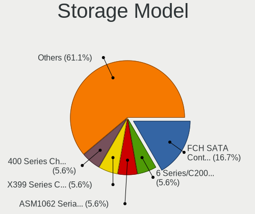
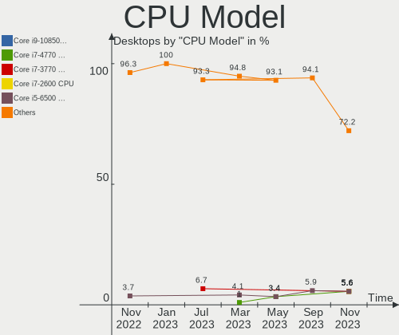
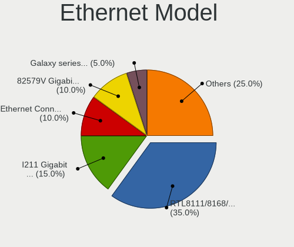

helloSystem - Hardware Trends (Desktops)
----------------------------------------

A project to identify most popular hardware characteristics and track their change
over time based on data collected by BSD users at https://BSD-Hardware.info.

Anyone can contribute to this report by the [hw-probe](https://github.com/linuxhw/hw-probe/blob/master/INSTALL.BSD.md) tool:

    hw-probe -all -upload

This report is for one last month. Overall report since the beginning of time: [TestCoverage](https://github.com/bsdhw/TestCoverage)

Period: Nov, 2022.

Contents
--------

* [ System ](#system)
  - [ OS                       ](#os)
  - [ OS Family                ](#os-family)
  - [ Arch                     ](#arch)
  - [ DE                       ](#de)
  - [ Display Server           ](#display-server)
  - [ Display Manager          ](#display-manager)
  - [ OS Lang                  ](#os-lang)
  - [ Boot Mode                ](#boot-mode)
  - [ Filesystem               ](#filesystem)
  - [ Part. scheme             ](#part-scheme)

* [ Board ](#board)
  - [ Vendor                   ](#vendor)
  - [ Model                    ](#model)
  - [ Model Family             ](#model-family)
  - [ MFG Year                 ](#mfg-year)
  - [ Form Factor              ](#form-factor)
  - [ Coreboot                 ](#coreboot)
  - [ RAM Size                 ](#ram-size)
  - [ RAM Used                 ](#ram-used)
  - [ Total Drives             ](#total-drives)
  - [ Has CD-ROM               ](#has-cd-rom)
  - [ Has Ethernet             ](#has-ethernet)
  - [ Has WiFi                 ](#has-wifi)
  - [ Has Bluetooth            ](#has-bluetooth)

* [ Location ](#location)
  - [ Country                  ](#country)
  - [ City                     ](#city)

* [ Drives ](#drives)
  - [ Drive Vendor             ](#drive-vendor)
  - [ Drive Model              ](#drive-model)
  - [ HDD Vendor               ](#hdd-vendor)
  - [ SSD Vendor               ](#ssd-vendor)
  - [ Drive Kind               ](#drive-kind)
  - [ Drive Connector          ](#drive-connector)
  - [ Drive Size               ](#drive-size)
  - [ Space Total              ](#space-total)
  - [ Space Used               ](#space-used)
  - [ Malfunc. Drives          ](#malfunc-drives)
  - [ Malfunc. Drive Vendor    ](#malfunc-drive-vendor)
  - [ Malfunc. HDD Vendor      ](#malfunc-hdd-vendor)
  - [ Malfunc. Drive Kind      ](#malfunc-drive-kind)
  - [ Failed Drives            ](#failed-drives)
  - [ Failed Drive Vendor      ](#failed-drive-vendor)
  - [ Drive Status             ](#drive-status)

* [ Storage controller ](#storage-controller)
  - [ Storage Vendor           ](#storage-vendor)
  - [ Storage Model            ](#storage-model)
  - [ Storage Kind             ](#storage-kind)

* [ Processor ](#processor)
  - [ CPU Vendor               ](#cpu-vendor)
  - [ CPU Model                ](#cpu-model)
  - [ CPU Model Family         ](#cpu-model-family)
  - [ CPU Cores                ](#cpu-cores)
  - [ CPU Sockets              ](#cpu-sockets)
  - [ CPU Threads              ](#cpu-threads)
  - [ CPU Microarch            ](#cpu-microarch)

* [ Graphics ](#graphics)
  - [ GPU Vendor               ](#gpu-vendor)
  - [ GPU Model                ](#gpu-model)
  - [ GPU Combo                ](#gpu-combo)
  - [ GPU Driver               ](#gpu-driver)
  - [ GPU Memory               ](#gpu-memory)

* [ Monitor ](#monitor)
  - [ Monitor Vendor           ](#monitor-vendor)
  - [ Monitor Model            ](#monitor-model)
  - [ Monitor Resolution       ](#monitor-resolution)
  - [ Monitor Diagonal         ](#monitor-diagonal)
  - [ Monitor Width            ](#monitor-width)
  - [ Aspect Ratio             ](#aspect-ratio)
  - [ Monitor Area             ](#monitor-area)
  - [ Pixel Density            ](#pixel-density)
  - [ Multiple Monitors        ](#multiple-monitors)

* [ Network ](#network)
  - [ Net Controller Vendor    ](#net-controller-vendor)
  - [ Net Controller Model     ](#net-controller-model)
  - [ Wireless Vendor          ](#wireless-vendor)
  - [ Wireless Model           ](#wireless-model)
  - [ Ethernet Vendor          ](#ethernet-vendor)
  - [ Ethernet Model           ](#ethernet-model)
  - [ Net Controller Kind      ](#net-controller-kind)
  - [ Used Controller          ](#used-controller)
  - [ NICs                     ](#nics)
  - [ IPv6                     ](#ipv6)

* [ Bluetooth ](#bluetooth)
  - [ Bluetooth Vendor         ](#bluetooth-vendor)
  - [ Bluetooth Model          ](#bluetooth-model)

* [ Sound ](#sound)
  - [ Sound Vendor             ](#sound-vendor)
  - [ Sound Model              ](#sound-model)

* [ Memory ](#memory)
  - [ Memory Vendor            ](#memory-vendor)
  - [ Memory Model             ](#memory-model)
  - [ Memory Kind              ](#memory-kind)
  - [ Memory Form Factor       ](#memory-form-factor)
  - [ Memory Size              ](#memory-size)
  - [ Memory Speed             ](#memory-speed)

* [ Printers & scanners ](#printers--scanners)
  - [ Printer Vendor           ](#printer-vendor)
  - [ Printer Model            ](#printer-model)
  - [ Scanner Vendor           ](#scanner-vendor)
  - [ Scanner Model            ](#scanner-model)

* [ Camera ](#camera)
  - [ Camera Vendor            ](#camera-vendor)
  - [ Camera Model             ](#camera-model)

* [ Security ](#security)
  - [ Fingerprint Vendor       ](#fingerprint-vendor)
  - [ Fingerprint Model        ](#fingerprint-model)
  - [ Chipcard Vendor          ](#chipcard-vendor)
  - [ Chipcard Model           ](#chipcard-model)

* [ Unsupported ](#unsupported)
  - [ Unsupported Devices      ](#unsupported-devices)
  - [ Unsupported Device Types ](#unsupported-device-types)

System
------

OS
--

Installed operating systems

| Name              | Desktops | Percent |
|-------------------|----------|---------|
| helloSystem 0.7.0 | 18       | 66.67%  |
| helloSystem 0.8.0 | 8        | 29.63%  |
| helloSystem 0.6.0 | 1        | 3.7%    |

OS Family
---------

OS without a version

| Name        | Desktops | Percent |
|-------------|----------|---------|
| helloSystem | 27       | 100%    |

Arch
----

OS architecture (x86_64, i586, etc.)

| Name  | Desktops | Percent |
|-------|----------|---------|
| amd64 | 27       | 100%    |

DE
--

Desktop Environment

| Name         | Desktops | Percent |
|--------------|----------|---------|
| helloDesktop | 27       | 100%    |

Display Server
--------------

X11 or Wayland

| Name | Desktops | Percent |
|------|----------|---------|
| X11  | 27       | 100%    |

Display Manager
---------------

SDDM, LightDM, etc.

| Name | Desktops | Percent |
|------|----------|---------|
| SLiM | 27       | 100%    |

OS Lang
-------

Language

| Lang  | Desktops | Percent |
|-------|----------|---------|
| en_US | 26       | 96.3%   |
| es_ES | 1        | 3.7%    |

Boot Mode
---------

EFI or BIOS

| Mode | Desktops | Percent |
|------|----------|---------|
| EFI  | 27       | 100%    |

Filesystem
----------

Type of filesystem

| Type   | Desktops | Percent |
|--------|----------|---------|
| Cd9660 | 20       | 74.07%  |
| Zfs    | 7        | 25.93%  |

Part. scheme
------------

Scheme of partitioning

| Type | Desktops | Percent |
|------|----------|---------|
| GPT  | 27       | 100%    |

Board
-----

Vendor
------

Motherboard manufacturer

| Name                | Desktops | Percent |
|---------------------|----------|---------|
| ASUSTek Computer    | 7        | 25.93%  |
| Gigabyte Technology | 6        | 22.22%  |
| MSI                 | 3        | 11.11%  |
| Hewlett-Packard     | 3        | 11.11%  |
| Dell                | 3        | 11.11%  |
| QIYIDA              | 1        | 3.7%    |
| Pegatron            | 1        | 3.7%    |
| Lenovo              | 1        | 3.7%    |
| Intel               | 1        | 3.7%    |
| ASRock              | 1        | 3.7%    |

Model
-----

Motherboard model

| Name                            | Desktops | Percent |
|---------------------------------|----------|---------|
| QIYIDA X99-H9 V2.0              | 1        | 3.7%    |
| Pegatron IPM41-D3               | 1        | 3.7%    |
| MSI MS-7C51                     | 1        | 3.7%    |
| MSI MS-7B43                     | 1        | 3.7%    |
| MSI MS-7977                     | 1        | 3.7%    |
| Lenovo ThinkStation S30 0569A93 | 1        | 3.7%    |
| Intel H61                       | 1        | 3.7%    |
| HP EliteDesk 800 G2 TWR         | 1        | 3.7%    |
| HP EliteDesk 700 G1 SFF         | 1        | 3.7%    |
| HP Compaq 6000 Pro SFF PC       | 1        | 3.7%    |
| Gigabyte P61-USB3-B3            | 1        | 3.7%    |
| Gigabyte H61M-S1                | 1        | 3.7%    |
| Gigabyte H270M-DS3H             | 1        | 3.7%    |
| Gigabyte G31M-S2L               | 1        | 3.7%    |
| Gigabyte E2500N                 | 1        | 3.7%    |
| Gigabyte 970A-D3P               | 1        | 3.7%    |
| Dell Studio 540                 | 1        | 3.7%    |
| Dell Precision T3610            | 1        | 3.7%    |
| Dell OptiPlex 960               | 1        | 3.7%    |
| ASUS ROG STRIX B450-F GAMING II | 1        | 3.7%    |
| ASUS PRIME Z390M-PLUS           | 1        | 3.7%    |
| ASUS PRIME A320M-K              | 1        | 3.7%    |
| ASUS P5KPL-VM-TWPC              | 1        | 3.7%    |
| ASUS P5E-VM SE                  | 1        | 3.7%    |
| ASUS All Series                 | 1        | 3.7%    |
| ASUS A55BM-K                    | 1        | 3.7%    |
| ASRock N68-S                    | 1        | 3.7%    |

Model Family
------------

Motherboard model prefix

| Name                 | Desktops | Percent |
|----------------------|----------|---------|
| HP EliteDesk         | 2        | 7.41%   |
| ASUS PRIME           | 2        | 7.41%   |
| QIYIDA X99-H9        | 1        | 3.7%    |
| Pegatron IPM41-D3    | 1        | 3.7%    |
| MSI MS-7C51          | 1        | 3.7%    |
| MSI MS-7B43          | 1        | 3.7%    |
| MSI MS-7977          | 1        | 3.7%    |
| Lenovo ThinkStation  | 1        | 3.7%    |
| Intel H61            | 1        | 3.7%    |
| HP Compaq            | 1        | 3.7%    |
| Gigabyte P61-USB3-B3 | 1        | 3.7%    |
| Gigabyte H61M-S1     | 1        | 3.7%    |
| Gigabyte H270M-DS3H  | 1        | 3.7%    |
| Gigabyte G31M-S2L    | 1        | 3.7%    |
| Gigabyte E2500N      | 1        | 3.7%    |
| Gigabyte 970A-D3P    | 1        | 3.7%    |
| Dell Studio          | 1        | 3.7%    |
| Dell Precision       | 1        | 3.7%    |
| Dell OptiPlex        | 1        | 3.7%    |
| ASUS ROG             | 1        | 3.7%    |
| ASUS P5KPL-VM-TWPC   | 1        | 3.7%    |
| ASUS P5E-VM          | 1        | 3.7%    |
| ASUS All             | 1        | 3.7%    |
| ASUS A55BM-K         | 1        | 3.7%    |
| ASRock N68-S         | 1        | 3.7%    |

MFG Year
--------

Motherboard manufacture year

| Year | Desktops | Percent |
|------|----------|---------|
| 2013 | 4        | 14.81%  |
| 2018 | 3        | 11.11%  |
| 2017 | 3        | 11.11%  |
| 2008 | 3        | 11.11%  |
| 2021 | 2        | 7.41%   |
| 2020 | 2        | 7.41%   |
| 2019 | 2        | 7.41%   |
| 2014 | 2        | 7.41%   |
| 2012 | 2        | 7.41%   |
| 2010 | 2        | 7.41%   |
| 2015 | 1        | 3.7%    |
| 2009 | 1        | 3.7%    |

Form Factor
-----------

Physical design of the computer

| Name    | Desktops | Percent |
|---------|----------|---------|
| Desktop | 27       | 100%    |

Coreboot
--------

Have coreboot on board

| Used | Desktops | Percent |
|------|----------|---------|
| No   | 27       | 100%    |

RAM Size
--------

Total RAM memory

| Size in GB  | Desktops | Percent |
|-------------|----------|---------|
| 8.01-16.0   | 10       | 37.04%  |
| 4.01-8.0    | 8        | 29.63%  |
| 32.01-64.0  | 5        | 18.52%  |
| 16.01-24.0  | 2        | 7.41%   |
| 24.01-32.0  | 1        | 3.7%    |
| 64.01-256.0 | 1        | 3.7%    |

RAM Used
--------

Used RAM memory

| Used GB  | Desktops | Percent |
|----------|----------|---------|
| 0.01-0.5 | 16       | 59.26%  |
| 1.01-2.0 | 6        | 22.22%  |
| 0.51-1.0 | 5        | 18.52%  |

Total Drives
------------

Number of drives on board

| Drives | Desktops | Percent |
|--------|----------|---------|
| 1      | 13       | 48.15%  |
| 2      | 5        | 18.52%  |
| 3      | 3        | 11.11%  |
| 6      | 2        | 7.41%   |
| 0      | 2        | 7.41%   |
| 5      | 1        | 3.7%    |
| 4      | 1        | 3.7%    |

Has CD-ROM
----------

Has CD-ROM on board

| Presented | Desktops | Percent |
|-----------|----------|---------|
| No        | 19       | 70.37%  |
| Yes       | 8        | 29.63%  |

Has Ethernet
------------

Has Ethernet on board

| Presented | Desktops | Percent |
|-----------|----------|---------|
| Yes       | 26       | 96.3%   |
| No        | 1        | 3.7%    |

Has WiFi
--------

Has WiFi module

| Presented | Desktops | Percent |
|-----------|----------|---------|
| No        | 20       | 74.07%  |
| Yes       | 7        | 25.93%  |

Has Bluetooth
-------------

Has Bluetooth module

| Presented | Desktops | Percent |
|-----------|----------|---------|
| No        | 23       | 85.19%  |
| Yes       | 4        | 14.81%  |

Location
--------

Country
-------

Geographic location (country)

| Country     | Desktops | Percent |
|-------------|----------|---------|
| Spain       | 5        | 18.52%  |
| Taiwan      | 4        | 14.81%  |
| Venezuela   | 2        | 7.41%   |
| USA         | 2        | 7.41%   |
| Italy       | 2        | 7.41%   |
| Brazil      | 2        | 7.41%   |
| UK          | 1        | 3.7%    |
| Sweden      | 1        | 3.7%    |
| South Korea | 1        | 3.7%    |
| Slovenia    | 1        | 3.7%    |
| Russia      | 1        | 3.7%    |
| Portugal    | 1        | 3.7%    |
| Mexico      | 1        | 3.7%    |
| India       | 1        | 3.7%    |
| Cuba        | 1        | 3.7%    |
| Argentina   | 1        | 3.7%    |

City
----

Geographic location (city)

| City                | Desktops | Percent |
|---------------------|----------|---------|
| Aquan               | 4        | 14.81%  |
| Willingboro         | 1        | 3.7%    |
| Trieste             | 1        | 3.7%    |
| Stockbridge         | 1        | 3.7%    |
| Shimla              | 1        | 3.7%    |
| Seville             | 1        | 3.7%    |
| Sever do Vouga      | 1        | 3.7%    |
| San Cristóbal      | 1        | 3.7%    |
| Rosignano Marittimo | 1        | 3.7%    |
| Rivas-Vaciamadrid   | 1        | 3.7%    |
| Podvelka            | 1        | 3.7%    |
| Perito Moreno       | 1        | 3.7%    |
| Outeiro de Rei      | 1        | 3.7%    |
| Mexico City         | 1        | 3.7%    |
| Maringá            | 1        | 3.7%    |
| Madrid              | 1        | 3.7%    |
| Lys'va              | 1        | 3.7%    |
| Kode                | 1        | 3.7%    |
| Japeri              | 1        | 3.7%    |
| Havana              | 1        | 3.7%    |
| Caracas             | 1        | 3.7%    |
| Busan               | 1        | 3.7%    |
| Barton upon Humber  | 1        | 3.7%    |
| Barcelona           | 1        | 3.7%    |

Drives
------

Drive Vendor
------------

Hard drive vendors

| Vendor              | Desktops | Drives | Percent |
|---------------------|----------|--------|---------|
| WDC                 | 9        | 13     | 20.93%  |
| Seagate             | 7        | 8      | 16.28%  |
| Samsung Electronics | 7        | 10     | 16.28%  |
| Crucial             | 5        | 6      | 11.63%  |
| Toshiba             | 3        | 4      | 6.98%   |
| Hitachi             | 2        | 2      | 4.65%   |
| A-DATA Technology   | 2        | 2      | 4.65%   |
| Team                | 1        | 1      | 2.33%   |
| PNY                 | 1        | 1      | 2.33%   |
| Nfortec             | 1        | 1      | 2.33%   |
| LITEONIT            | 1        | 1      | 2.33%   |
| Kingston            | 1        | 1      | 2.33%   |
| Kingchuxing         | 1        | 1      | 2.33%   |
| Emtec               | 1        | 1      | 2.33%   |
| Corsair             | 1        | 1      | 2.33%   |

Drive Model
-----------

Hard drive models

| Model                                | Desktops | Percent |
|--------------------------------------|----------|---------|
| Samsung SSD 980 PRO 1TB              | 2        | 4.17%   |
| Crucial CT500MX500SSD1 500GB         | 2        | 4.17%   |
| WDC WDS500G2B0A-00SM50 500GB         | 1        | 2.08%   |
| WDC WD5000LPLX-08ZNTT0 500GB         | 1        | 2.08%   |
| WDC WD5000AVCS-632DY1 500GB          | 1        | 2.08%   |
| WDC WD5000AAKX-00ERMA0 500GB         | 1        | 2.08%   |
| WDC WD5000AAKS-00YGA0 500GB          | 1        | 2.08%   |
| WDC WD2500BEVT-75A23T0 250GB         | 1        | 2.08%   |
| WDC WD20EARS-42S0XB0 2TB             | 1        | 2.08%   |
| WDC WD1600AVVS-63L2B0 160GB          | 1        | 2.08%   |
| WDC WD10EFRX-68JCSN0 1TB             | 1        | 2.08%   |
| WDC WD10EFRX-68FYTN0 1TB             | 1        | 2.08%   |
| Toshiba Q300 Pro 128GB               | 1        | 2.08%   |
| Toshiba Q300 240GB                   | 1        | 2.08%   |
| Toshiba MK1255GSX H 120GB            | 1        | 2.08%   |
| Team TM8FP6256G 256GB                | 1        | 2.08%   |
| Seagate ST9500325AS 500GB            | 1        | 2.08%   |
| Seagate ST500LT012-9WS142 500GB      | 1        | 2.08%   |
| Seagate ST500LT012-1DG142 500GB      | 1        | 2.08%   |
| Seagate ST500LM012 HN-M500MBB 500GB  | 1        | 2.08%   |
| Seagate ST500DM002-1BD142 500GB      | 1        | 2.08%   |
| Seagate ST3500414CS 500GB            | 1        | 2.08%   |
| Seagate ST3160211AS 160GB            | 1        | 2.08%   |
| Seagate ST1000DM003-9YN162 1TB       | 1        | 2.08%   |
| Samsung SSD 970 EVO Plus 500GB       | 1        | 2.08%   |
| Samsung SSD 970 EVO 500GB            | 1        | 2.08%   |
| Samsung SSD 860 QVO 1TB              | 1        | 2.08%   |
| Samsung SSD 860 EVO 1TB              | 1        | 2.08%   |
| Samsung SSD 850 EVO 120GB            | 1        | 2.08%   |
| Samsung SSD 840 Series 120GB         | 1        | 2.08%   |
| Samsung HM250HI 250GB                | 1        | 2.08%   |
| Samsung HD154UI 1.5TB                | 1        | 2.08%   |
| PNY SSD2SC120G1CS1754D117-551 120GB  | 1        | 2.08%   |
| Nfortec ALCYON 256GB                 | 1        | 2.08%   |
| LITEONIT LCS-256L9S-11 2.5 7mm 256GB | 1        | 2.08%   |
| Kingston SHFS37A240G 240GB           | 1        | 2.08%   |
| Kingchuxing SSD 128GB                | 1        | 2.08%   |
| Hitachi HDS728080PLA380 82GB         | 1        | 2.08%   |
| Hitachi HDS721616PLA380 164GB        | 1        | 2.08%   |
| Emtec X150 120GB                     | 1        | 2.08%   |

HDD Vendor
----------

Hard disk drive vendors

| Vendor              | Desktops | Drives | Percent |
|---------------------|----------|--------|---------|
| WDC                 | 8        | 12     | 42.11%  |
| Seagate             | 7        | 8      | 36.84%  |
| Hitachi             | 2        | 2      | 10.53%  |
| Toshiba             | 1        | 1      | 5.26%   |
| Samsung Electronics | 1        | 2      | 5.26%   |

SSD Vendor
----------

Solid state drive vendors

| Vendor              | Desktops | Drives | Percent |
|---------------------|----------|--------|---------|
| Crucial             | 5        | 6      | 25%     |
| Samsung Electronics | 4        | 4      | 20%     |
| Toshiba             | 2        | 3      | 10%     |
| A-DATA Technology   | 2        | 2      | 10%     |
| WDC                 | 1        | 1      | 5%      |
| PNY                 | 1        | 1      | 5%      |
| LITEONIT            | 1        | 1      | 5%      |
| Kingston            | 1        | 1      | 5%      |
| Kingchuxing         | 1        | 1      | 5%      |
| Emtec               | 1        | 1      | 5%      |
| Corsair             | 1        | 1      | 5%      |

Drive Kind
----------

HDD or SSD

| Kind | Desktops | Drives | Percent |
|------|----------|--------|---------|
| HDD  | 17       | 25     | 50%     |
| SSD  | 12       | 22     | 35.29%  |
| NVMe | 5        | 6      | 14.71%  |

Drive Connector
---------------

SATA, SAS, NVMe, etc.

| Type | Desktops | Drives | Percent |
|------|----------|--------|---------|
| SATA | 25       | 47     | 83.33%  |
| NVMe | 5        | 6      | 16.67%  |

Drive Size
----------

Size of hard drive

| Size in TB | Desktops | Drives | Percent |
|------------|----------|--------|---------|
| 0.01-0.5   | 22       | 35     | 73.33%  |
| 0.51-1.0   | 5        | 9      | 16.67%  |
| 1.01-2.0   | 3        | 3      | 10%     |

Space Total
-----------

Amount of disk space available on the file system

| Size in GB | Desktops | Percent |
|------------|----------|---------|
| 1-20       | 20       | 74.07%  |
| 101-250    | 3        | 11.11%  |
| 251-500    | 2        | 7.41%   |
| 501-1000   | 1        | 3.7%    |
| 51-100     | 1        | 3.7%    |

Space Used
----------

Amount of used disk space

| Used GB | Desktops | Percent |
|---------|----------|---------|
| 1-20    | 26       | 96.3%   |
| 21-50   | 1        | 3.7%    |

Malfunc. Drives
---------------

Drive models with a malfunction

| Model                                 | Desktops | Drives | Percent |
|---------------------------------------|----------|--------|---------|
| Toshiba MK1255GSX H 120GB             | 1        | 1      | 11.11%  |
| Seagate ST500LT012-9WS142 500GB       | 1        | 1      | 11.11%  |
| Seagate ST500LT012-1DG142 500GB       | 1        | 1      | 11.11%  |
| Seagate ST500LM012 HN-M500MBB 500GB   | 1        | 1      | 11.11%  |
| Seagate ST500DM002-1BD142 500GB       | 1        | 1      | 11.11%  |
| Seagate ST3500414CS 500GB             | 1        | 1      | 11.11%  |
| Seagate ST3160211AS 160GB             | 1        | 1      | 11.11%  |
| Samsung Electronics SSD 970 EVO 500GB | 1        | 1      | 11.11%  |
| Hitachi HDS728080PLA380 82GB          | 1        | 1      | 11.11%  |

Malfunc. Drive Vendor
---------------------

Vendors of faulty drives

| Vendor              | Desktops | Drives | Percent |
|---------------------|----------|--------|---------|
| Seagate             | 5        | 6      | 62.5%   |
| Toshiba             | 1        | 1      | 12.5%   |
| Samsung Electronics | 1        | 1      | 12.5%   |
| Hitachi             | 1        | 1      | 12.5%   |

Malfunc. HDD Vendor
-------------------

Vendors of faulty HDD drives

| Vendor  | Desktops | Drives | Percent |
|---------|----------|--------|---------|
| Seagate | 5        | 6      | 71.43%  |
| Toshiba | 1        | 1      | 14.29%  |
| Hitachi | 1        | 1      | 14.29%  |

Malfunc. Drive Kind
-------------------

Kinds of faulty drives

| Kind | Desktops | Drives | Percent |
|------|----------|--------|---------|
| HDD  | 6        | 8      | 85.71%  |
| NVMe | 1        | 1      | 14.29%  |

Failed Drives
-------------

Failed drive models

Zero info for selected period =(

Failed Drive Vendor
-------------------

Failed drive vendors

Zero info for selected period =(

Drive Status
------------

Number of failed and malfunc. drives

| Status   | Desktops | Drives | Percent |
|----------|----------|--------|---------|
| Works    | 19       | 40     | 65.52%  |
| Malfunc  | 7        | 9      | 24.14%  |
| Detected | 3        | 4      | 10.34%  |

Storage controller
------------------

Storage Vendor
--------------

Storage controller vendors

| Vendor                       | Desktops | Percent |
|------------------------------|----------|---------|
| Intel                        | 20       | 60.61%  |
| AMD                          | 6        | 18.18%  |
| Samsung Electronics          | 3        | 9.09%   |
| Shenzhen Longsys Electronics | 2        | 6.06%   |
| Nvidia                       | 1        | 3.03%   |
| JMicron Technology           | 1        | 3.03%   |

Storage Model
-------------

Storage controller models

| Model                                                                                   | Desktops | Percent |
|-----------------------------------------------------------------------------------------|----------|---------|
| Intel NM10/ICH7 Family SATA Controller [IDE mode]                                       | 3        | 6.67%   |
| AMD FCH SATA Controller [AHCI mode]                                                     | 3        | 6.67%   |
| Samsung NVMe SSD Controller SM981/PM981/PM983                                           | 2        | 4.44%   |
| Samsung NVMe SSD Controller PM9A1/PM9A3/980PRO                                          | 2        | 4.44%   |
| Intel Q170/Q150/B150/H170/H110/Z170/CM236 Chipset SATA Controller [AHCI Mode]           | 2        | 4.44%   |
| Intel 8 Series/C220 Series Chipset Family 6-port SATA Controller 1 [AHCI mode]          | 2        | 4.44%   |
| Intel 6 Series/C200 Series Chipset Family Desktop SATA Controller (IDE mode, ports 4-5) | 2        | 4.44%   |
| Intel 6 Series/C200 Series Chipset Family Desktop SATA Controller (IDE mode, ports 0-3) | 2        | 4.44%   |
| Intel 200 Series PCH SATA controller [AHCI mode]                                        | 2        | 4.44%   |
| AMD FCH SATA Controller D                                                               | 2        | 4.44%   |
| Shenzhen Longsys SM2263EN/SM2263XT-based OEM SSD                                        | 1        | 2.22%   |
| Nvidia MCP61 SATA Controller                                                            | 1        | 2.22%   |
| Nvidia MCP61 IDE                                                                        | 1        | 2.22%   |
| JMicron JMB368 IDE controller                                                           | 1        | 2.22%   |
| Intel SATA Controller [RAID mode]                                                       | 1        | 2.22%   |
| Intel Cannon Lake PCH SATA AHCI Controller                                              | 1        | 2.22%   |
| Intel C604/X79 series chipset 4-Port SATA/SAS Storage Control Unit                      | 1        | 2.22%   |
| Intel C600/X79 series chipset SATA RAID Controller                                      | 1        | 2.22%   |
| Intel C600/X79 series chipset IDE-r Controller                                          | 1        | 2.22%   |
| Intel C600/X79 series chipset 6-Port SATA AHCI Controller                               | 1        | 2.22%   |
| Intel 9 Series Chipset Family SATA Controller [AHCI Mode]                               | 1        | 2.22%   |
| Intel 82801JI (ICH10 Family) 4 port SATA IDE Controller #1                              | 1        | 2.22%   |
| Intel 82801JI (ICH10 Family) 2 port SATA IDE Controller #2                              | 1        | 2.22%   |
| Intel 82801JD/DO (ICH10 Family) SATA AHCI Controller                                    | 1        | 2.22%   |
| Intel 82801IB (ICH9) 2 port SATA Controller [IDE mode]                                  | 1        | 2.22%   |
| Intel 82801I (ICH9 Family) 2 port SATA Controller [IDE mode]                            | 1        | 2.22%   |
| Intel 82801G (ICH7 Family) IDE Controller                                               | 1        | 2.22%   |
| Intel 6 Series/C200 Series Chipset Family 6 port Desktop SATA AHCI Controller           | 1        | 2.22%   |
| Intel 4 Series Chipset PT IDER Controller                                               | 1        | 2.22%   |
| AMD SB7x0/SB8x0/SB9x0 SATA Controller [IDE mode]                                        | 1        | 2.22%   |
| AMD SB7x0/SB8x0/SB9x0 IDE Controller                                                    | 1        | 2.22%   |
| AMD 400 Series Chipset SATA Controller                                                  | 1        | 2.22%   |
| Unknown                                                                                 | 1        | 2.22%   |

Storage Kind
------------

Kind of storage controller (IDE, SATA, NVMe, SAS, ...)

| Kind | Desktops | Percent |
|------|----------|---------|
| SATA | 16       | 45.71%  |
| IDE  | 11       | 31.43%  |
| NVMe | 5        | 14.29%  |
| RAID | 2        | 5.71%   |
| SAS  | 1        | 2.86%   |

Processor
---------

CPU Vendor
----------

Processor vendors

| Vendor | Desktops | Percent |
|--------|----------|---------|
| Intel  | 20       | 74.07%  |
| AMD    | 7        | 25.93%  |

CPU Model
---------

Processor models

| Model                                       | Desktops | Percent |
|---------------------------------------------|----------|---------|
| Intel Core i5-3470 CPU @ 3.20GHz            | 2        | 7.41%   |
| Intel Xeon CPU E5-2690 0 @ 2.90GHz          | 1        | 3.7%    |
| Intel Xeon CPU E5-2630 v3 @ 2.40GHz         | 1        | 3.7%    |
| Intel Xeon CPU E5-1650 v2 @ 3.50GHz         | 1        | 3.7%    |
| Intel Core i7-8700K CPU @ 3.70GHz           | 1        | 3.7%    |
| Intel Core i7-7700 CPU @ 3.60GHz            | 1        | 3.7%    |
| Intel Core i7-6700K CPU @ 4.00GHz           | 1        | 3.7%    |
| Intel Core i5-9400 CPU @ 2.90GHz            | 1        | 3.7%    |
| Intel Core i5-6500 CPU @ 3.20GHz            | 1        | 3.7%    |
| Intel Core i5-4590 CPU @ 3.30GHz            | 1        | 3.7%    |
| Intel Core i5-4460 CPU @ 3.20GHz            | 1        | 3.7%    |
| Intel Core i3-2120 CPU                      | 1        | 3.7%    |
| Intel Core 2 Quad CPU Q8400 @ 2.66GHz       | 1        | 3.7%    |
| Intel Core 2 Quad CPU Q6600 @ 2.40GHz       | 1        | 3.7%    |
| Intel Core 2 Quad CPU                       | 1        | 3.7%    |
| Intel Core 2 Quad                           | 1        | 3.7%    |
| Intel Core 2 Duo CPU E8400 @ 3.00GHz        | 1        | 3.7%    |
| Intel Core 2 Duo CPU E7500 @ 2.93GHz        | 1        | 3.7%    |
| Intel Core 2 CPU 6600 @ 2.40GHz             | 1        | 3.7%    |
| AMD Ryzen 5 3600 6-Core Processor           | 1        | 3.7%    |
| AMD Ryzen 5 3400G with Radeon Vega Graphics | 1        | 3.7%    |
| AMD Ryzen 3 1200 Quad-Core Processor        | 1        | 3.7%    |
| AMD Phenom II X4 970 Processor              | 1        | 3.7%    |
| AMD Phenom II X4 810 Processor              | 1        | 3.7%    |
| AMD E1-2500 APU with Radeon HD Graphics     | 1        | 3.7%    |
| AMD A8-5600K APU with Radeon HD Graphics    | 1        | 3.7%    |

CPU Model Family
----------------

Processor model prefix

| Model             | Desktops | Percent |
|-------------------|----------|---------|
| Intel Core i5     | 6        | 22.22%  |
| Intel Core 2 Quad | 4        | 14.81%  |
| Intel Xeon        | 3        | 11.11%  |
| Intel Core i7     | 3        | 11.11%  |
| Intel Core 2 Duo  | 2        | 7.41%   |
| AMD Ryzen 5       | 2        | 7.41%   |
| AMD Phenom II X4  | 2        | 7.41%   |
| Intel Core i3     | 1        | 3.7%    |
| Intel Core 2      | 1        | 3.7%    |
| AMD Ryzen 3       | 1        | 3.7%    |
| AMD E1            | 1        | 3.7%    |
| AMD A8            | 1        | 3.7%    |

CPU Cores
---------

Number of processor cores

| Number  | Desktops | Percent |
|---------|----------|---------|
| 4       | 13       | 48.15%  |
| 2       | 4        | 14.81%  |
| 8       | 3        | 11.11%  |
| 6       | 3        | 11.11%  |
| Unknown | 3        | 11.11%  |
| 12      | 1        | 3.7%    |

CPU Sockets
-----------

Number of sockets

| Number | Desktops | Percent |
|--------|----------|---------|
| 1      | 27       | 100%    |

CPU Threads
-----------

Threads per core (Hyper-Threading)

| Number  | Desktops | Percent |
|---------|----------|---------|
| 1       | 17       | 62.96%  |
| 2       | 7        | 25.93%  |
| Unknown | 3        | 11.11%  |

CPU Microarch
-------------

Microarchitecture

| Name        | Desktops | Percent |
|-------------|----------|---------|
| Penryn      | 4        | 14.81%  |
| KabyLake    | 3        | 11.11%  |
| IvyBridge   | 3        | 11.11%  |
| Haswell     | 3        | 11.11%  |
| Core        | 3        | 11.11%  |
| Zen+        | 2        | 7.41%   |
| Skylake     | 2        | 7.41%   |
| SandyBridge | 2        | 7.41%   |
| K10         | 2        | 7.41%   |
| Zen 2       | 1        | 3.7%    |
| Piledriver  | 1        | 3.7%    |
| Jaguar      | 1        | 3.7%    |

Graphics
--------

GPU Vendor
----------

Vendors of graphics cards

| Vendor | Desktops | Percent |
|--------|----------|---------|
| Nvidia | 17       | 62.96%  |
| Intel  | 7        | 25.93%  |
| AMD    | 3        | 11.11%  |

GPU Model
---------

Graphics card models

| Model                                                                       | Desktops | Percent |
|-----------------------------------------------------------------------------|----------|---------|
| Nvidia GP106 [GeForce GTX 1060 6GB]                                         | 2        | 7.41%   |
| Nvidia G96C [GeForce 9500 GT]                                               | 2        | 7.41%   |
| Intel Xeon E3-1200 v3/4th Gen Core Processor Integrated Graphics Controller | 2        | 7.41%   |
| Nvidia TU117 [GeForce GTX 1650]                                             | 1        | 3.7%    |
| Nvidia TU116 [GeForce GTX 1660 SUPER]                                       | 1        | 3.7%    |
| Nvidia GT218 [GeForce 210]                                                  | 1        | 3.7%    |
| Nvidia GT215 [GeForce GT 240]                                               | 1        | 3.7%    |
| Nvidia GP108 [GeForce GT 1030]                                              | 1        | 3.7%    |
| Nvidia GP107 [GeForce GTX 1050 Ti]                                          | 1        | 3.7%    |
| Nvidia GM204 [GeForce GTX 970]                                              | 1        | 3.7%    |
| Nvidia GK208B [GeForce GT 710]                                              | 1        | 3.7%    |
| Nvidia GK106GL [Quadro K4000]                                               | 1        | 3.7%    |
| Nvidia GF119 [GeForce GT 620 OEM]                                           | 1        | 3.7%    |
| Nvidia GF108 [GeForce GT 630]                                               | 1        | 3.7%    |
| Nvidia GF108 [GeForce GT 440]                                               | 1        | 3.7%    |
| Nvidia GF100GL [Quadro 5000]                                                | 1        | 3.7%    |
| Intel Xeon E3-1200 v2/3rd Gen Core processor Graphics Controller            | 1        | 3.7%    |
| Intel HD Graphics 630                                                       | 1        | 3.7%    |
| Intel HD Graphics 530                                                       | 1        | 3.7%    |
| Intel 82G35 Express Integrated Graphics Controller                          | 1        | 3.7%    |
| Intel 82G33/G31 Express Integrated Graphics Controller                      | 1        | 3.7%    |
| AMD Trinity [Radeon HD 7560D]                                               | 1        | 3.7%    |
| AMD RV710 [Radeon HD 4350/4550]                                             | 1        | 3.7%    |
| AMD Kabini [Radeon HD 8240 / R3 Series]                                     | 1        | 3.7%    |

GPU Combo
---------

Combinations of graphics cards

| Name       | Desktops | Percent |
|------------|----------|---------|
| 1 x Nvidia | 17       | 62.96%  |
| 1 x Intel  | 7        | 25.93%  |
| 1 x AMD    | 3        | 11.11%  |

GPU Driver
----------

Free vs proprietary

| Driver      | Desktops | Percent |
|-------------|----------|---------|
| Proprietary | 14       | 51.85%  |
| Free        | 13       | 48.15%  |

GPU Memory
----------

Total video memory

| Size in GB | Desktops | Percent |
|------------|----------|---------|
| Unknown    | 11       | 40.74%  |
| 0.51-1.0   | 5        | 18.52%  |
| 5.01-6.0   | 3        | 11.11%  |
| 3.01-4.0   | 3        | 11.11%  |
| 2.01-3.0   | 2        | 7.41%   |
| 1.01-2.0   | 2        | 7.41%   |
| 0.01-0.5   | 1        | 3.7%    |

Monitor
-------

Monitor Vendor
--------------

Monitor vendors

| Vendor              | Desktops | Percent |
|---------------------|----------|---------|
| Samsung Electronics | 3        | 17.65%  |
| Hewlett-Packard     | 3        | 17.65%  |
| Dell                | 2        | 11.76%  |
| BenQ                | 2        | 11.76%  |
| AOC                 | 2        | 11.76%  |
| Acer                | 2        | 11.76%  |
| Philips             | 1        | 5.88%   |
| Iiyama              | 1        | 5.88%   |
| Goldstar            | 1        | 5.88%   |

Monitor Model
-------------

Monitor models

| Model                                                               | Desktops | Percent |
|---------------------------------------------------------------------|----------|---------|
| Acer G227HQL ACR03DE 1920x1080 480x270mm 21.7-inch                  | 2        | 11.76%  |
| Samsung Electronics SyncMaster SAM05C5 1920x1080                    | 1        | 5.88%   |
| Samsung Electronics SMT22A300 SAM087B 1920x1080 480x270mm 21.7-inch | 1        | 5.88%   |
| Samsung Electronics SME2020 SAM06A0 1600x900 440x250mm 19.9-inch    | 1        | 5.88%   |
| Philips PHL BDM3270 PHL08E7 2560x1440 710x400mm 32.1-inch           | 1        | 5.88%   |
| Iiyama PLX2283H IVM5638 1920x1080 480x270mm 21.7-inch               | 1        | 5.88%   |
| Hewlett-Packard W2072a HWP3000 1600x900 440x250mm 19.9-inch         | 1        | 5.88%   |
| Hewlett-Packard LCD Monitor HPN351A 1920x1080 700x390mm 31.5-inch   | 1        | 5.88%   |
| Hewlett-Packard L1506 HWP265B 1024x768 300x230mm 14.9-inch          | 1        | 5.88%   |
| Goldstar L192WS GSM4B32 1440x900 410x260mm 19.1-inch                | 1        | 5.88%   |
| Dell U3014 DEL4082 2560x1600 640x400mm 29.7-inch                    | 1        | 5.88%   |
| Dell LCD Monitor DELF003 1440x900 410x260mm 19.1-inch               | 1        | 5.88%   |
| BenQ GW2780 BNQ78E6 1920x1080 600x340mm 27.2-inch                   | 1        | 5.88%   |
| BenQ GL2480 BNQ78ED 1920x1080 530x300mm 24.0-inch                   | 1        | 5.88%   |
| AOC 1950 AOC1950 1440x900 410x260mm 19.1-inch                       | 1        | 5.88%   |
| AOC 1621w AOC1621 1366x768 340x190mm 15.3-inch                      | 1        | 5.88%   |

Monitor Resolution
------------------

Monitor screen resolution

| Resolution       | Desktops | Percent |
|------------------|----------|---------|
| 1920x1080 (FHD)  | 8        | 47.06%  |
| 1440x900 (WXGA+) | 3        | 17.65%  |
| 1600x900 (HD+)   | 2        | 11.76%  |
| 2560x1600        | 1        | 5.88%   |
| 2560x1440 (QHD)  | 1        | 5.88%   |
| 1366x768 (WXGA)  | 1        | 5.88%   |
| 1024x768 (XGA)   | 1        | 5.88%   |

Monitor Diagonal
----------------

Diagonal size in inches

| Inches  | Desktops | Percent |
|---------|----------|---------|
| 19      | 5        | 29.41%  |
| 21      | 4        | 23.53%  |
| 32      | 1        | 5.88%   |
| 31      | 1        | 5.88%   |
| 29      | 1        | 5.88%   |
| 27      | 1        | 5.88%   |
| 24      | 1        | 5.88%   |
| 15      | 1        | 5.88%   |
| 14      | 1        | 5.88%   |
| Unknown | 1        | 5.88%   |

Monitor Width
-------------

Physical width

| Width in mm | Desktops | Percent |
|-------------|----------|---------|
| 401-500     | 9        | 52.94%  |
| 601-700     | 2        | 11.76%  |
| 501-600     | 2        | 11.76%  |
| 701-800     | 1        | 5.88%   |
| 301-350     | 1        | 5.88%   |
| 201-300     | 1        | 5.88%   |
| Unknown     | 1        | 5.88%   |

Aspect Ratio
------------

Proportional relationship between the width and the height

| Ratio | Desktops | Percent |
|-------|----------|---------|
| 16/9  | 12       | 70.59%  |
| 16/10 | 4        | 23.53%  |
| 4/3   | 1        | 5.88%   |

Monitor Area
------------

Area in inch²

| Area in inch² | Desktops | Percent |
|----------------|----------|---------|
| 201-250        | 5        | 29.41%  |
| 151-200        | 5        | 29.41%  |
| 351-500        | 3        | 17.65%  |
| 301-350        | 1        | 5.88%   |
| 101-110        | 1        | 5.88%   |
| 91-100         | 1        | 5.88%   |
| Unknown        | 1        | 5.88%   |

Pixel Density
-------------

Pixels per inch

| Density | Desktops | Percent |
|---------|----------|---------|
| 51-100  | 10       | 58.82%  |
| 101-120 | 6        | 35.29%  |
| Unknown | 1        | 5.88%   |

Multiple Monitors
-----------------

Total monitors connected

| Total | Desktops | Percent |
|-------|----------|---------|
| 1     | 22       | 81.48%  |
| 0     | 5        | 18.52%  |

Network
-------

Net Controller Vendor
---------------------

Controller vendors

| Vendor                | Desktops | Percent |
|-----------------------|----------|---------|
| Realtek Semiconductor | 15       | 46.88%  |
| Intel                 | 12       | 37.5%   |
| Qualcomm Atheros      | 4        | 12.5%   |
| Broadcom              | 1        | 3.13%   |

Net Controller Model
--------------------

Controller models

| Model                                                                         | Desktops | Percent |
|-------------------------------------------------------------------------------|----------|---------|
| Realtek RTL8111/8168/8411 PCI Express Gigabit Ethernet Controller             | 12       | 34.29%  |
| Qualcomm Atheros Attansic L1 Gigabit Ethernet                                 | 2        | 5.71%   |
| Intel 82579LM Gigabit Network Connection (Lewisville)                         | 2        | 5.71%   |
| Intel 82567LM-3 Gigabit Network Connection                                    | 2        | 5.71%   |
| Realtek RTL8188SU 802.11n WLAN Adapter                                        | 1        | 2.86%   |
| Realtek RTL8188FTV 802.11b/g/n 1T1R 2.4G WLAN Adapter                         | 1        | 2.86%   |
| Realtek RTL8188CUS 802.11n WLAN Adapter                                       | 1        | 2.86%   |
| Realtek RTL810xE PCI Express Fast Ethernet controller                         | 1        | 2.86%   |
| Realtek RTL-8100/8101L/8139 PCI Fast Ethernet Adapter                         | 1        | 2.86%   |
| Qualcomm Atheros AR928X Wireless Network Adapter (PCI-Express)                | 1        | 2.86%   |
| Qualcomm Atheros AR9287 Wireless Network Adapter (PCI-Express)                | 1        | 2.86%   |
| Intel Wireless 8265 / 8275                                                    | 1        | 2.86%   |
| Intel I211 Gigabit Network Connection                                         | 1        | 2.86%   |
| Intel Ethernet Connection I217-LM                                             | 1        | 2.86%   |
| Intel Ethernet Connection (7) I219-V                                          | 1        | 2.86%   |
| Intel Ethernet Connection (2) I219-V                                          | 1        | 2.86%   |
| Intel Ethernet Connection (2) I219-LM                                         | 1        | 2.86%   |
| Intel Ethernet Connection (2) I218-V                                          | 1        | 2.86%   |
| Intel 82574L Gigabit Network Connection                                       | 1        | 2.86%   |
| Intel 82571EB/82571GB Gigabit Ethernet Controller D0/D1 (copper applications) | 1        | 2.86%   |
| Broadcom BCM4318 [AirForce One 54g] 802.11g Wireless LAN Controller           | 1        | 2.86%   |

Wireless Vendor
---------------

Wireless vendors

| Vendor                | Desktops | Percent |
|-----------------------|----------|---------|
| Realtek Semiconductor | 3        | 42.86%  |
| Qualcomm Atheros      | 2        | 28.57%  |
| Intel                 | 1        | 14.29%  |
| Broadcom              | 1        | 14.29%  |

Wireless Model
--------------

Wireless models

| Model                                                               | Desktops | Percent |
|---------------------------------------------------------------------|----------|---------|
| Realtek RTL8188SU 802.11n WLAN Adapter                              | 1        | 14.29%  |
| Realtek RTL8188FTV 802.11b/g/n 1T1R 2.4G WLAN Adapter               | 1        | 14.29%  |
| Realtek RTL8188CUS 802.11n WLAN Adapter                             | 1        | 14.29%  |
| Qualcomm Atheros AR928X Wireless Network Adapter (PCI-Express)      | 1        | 14.29%  |
| Qualcomm Atheros AR9287 Wireless Network Adapter (PCI-Express)      | 1        | 14.29%  |
| Intel Wireless 8265 / 8275                                          | 1        | 14.29%  |
| Broadcom BCM4318 [AirForce One 54g] 802.11g Wireless LAN Controller | 1        | 14.29%  |

Ethernet Vendor
---------------

Ethernet vendors

| Vendor                | Desktops | Percent |
|-----------------------|----------|---------|
| Realtek Semiconductor | 14       | 50%     |
| Intel                 | 12       | 42.86%  |
| Qualcomm Atheros      | 2        | 7.14%   |

Ethernet Model
--------------

Ethernet models

| Model                                                                         | Desktops | Percent |
|-------------------------------------------------------------------------------|----------|---------|
| Realtek RTL8111/8168/8411 PCI Express Gigabit Ethernet Controller             | 12       | 42.86%  |
| Qualcomm Atheros Attansic L1 Gigabit Ethernet                                 | 2        | 7.14%   |
| Intel 82579LM Gigabit Network Connection (Lewisville)                         | 2        | 7.14%   |
| Intel 82567LM-3 Gigabit Network Connection                                    | 2        | 7.14%   |
| Realtek RTL810xE PCI Express Fast Ethernet controller                         | 1        | 3.57%   |
| Realtek RTL-8100/8101L/8139 PCI Fast Ethernet Adapter                         | 1        | 3.57%   |
| Intel I211 Gigabit Network Connection                                         | 1        | 3.57%   |
| Intel Ethernet Connection I217-LM                                             | 1        | 3.57%   |
| Intel Ethernet Connection (7) I219-V                                          | 1        | 3.57%   |
| Intel Ethernet Connection (2) I219-V                                          | 1        | 3.57%   |
| Intel Ethernet Connection (2) I219-LM                                         | 1        | 3.57%   |
| Intel Ethernet Connection (2) I218-V                                          | 1        | 3.57%   |
| Intel 82574L Gigabit Network Connection                                       | 1        | 3.57%   |
| Intel 82571EB/82571GB Gigabit Ethernet Controller D0/D1 (copper applications) | 1        | 3.57%   |

Net Controller Kind
-------------------

Ethernet, WiFi or modem

| Kind     | Desktops | Percent |
|----------|----------|---------|
| Ethernet | 26       | 78.79%  |
| WiFi     | 7        | 21.21%  |

Used Controller
---------------

Currently used network controller

| Kind     | Desktops | Percent |
|----------|----------|---------|
| Ethernet | 24       | 100%    |

NICs
----

Total network controllers on board

| Total | Desktops | Percent |
|-------|----------|---------|
| 1     | 21       | 77.78%  |
| 2     | 4        | 14.81%  |
| 4     | 1        | 3.7%    |
| 0     | 1        | 3.7%    |

IPv6
----

IPv6 vs IPv4

| Used | Desktops | Percent |
|------|----------|---------|
| No   | 27       | 100%    |

Bluetooth
---------

Bluetooth Vendor
----------------

Controller vendors

| Vendor                     | Desktops | Percent |
|----------------------------|----------|---------|
| Cambridge Silicon Radio    | 2        | 50%     |
| Intel                      | 1        | 25%     |
| Integrated System Solution | 1        | 25%     |

Bluetooth Model
---------------

Controller models

| Model                                               | Desktops | Percent |
|-----------------------------------------------------|----------|---------|
| Cambridge Silicon Radio Bluetooth Dongle (HCI mode) | 2        | 50%     |
| Intel Bluetooth wireless interface                  | 1        | 25%     |
| Integrated System Solution Bluetooth Device         | 1        | 25%     |

Sound
-----

Sound Vendor
------------

Sound card vendors

| Vendor                  | Desktops | Percent |
|-------------------------|----------|---------|
| Intel                   | 19       | 41.3%   |
| Nvidia                  | 16       | 34.78%  |
| AMD                     | 7        | 15.22%  |
| C-Media Electronics     | 2        | 4.35%   |
| Logitech                | 1        | 2.17%   |
| BEHRINGER International | 1        | 2.17%   |

Sound Model
-----------

Sound card models

| Model                                                                      | Desktops | Percent |
|----------------------------------------------------------------------------|----------|---------|
| Intel NM10/ICH7 Family High Definition Audio Controller                    | 3        | 6.12%   |
| Intel 6 Series/C200 Series Chipset Family High Definition Audio Controller | 3        | 6.12%   |
| Nvidia High Definition Audio Controller                                    | 2        | 4.08%   |
| Nvidia GP106 High Definition Audio Controller                              | 2        | 4.08%   |
| Nvidia GF108 High Definition Audio Controller                              | 2        | 4.08%   |
| Intel Xeon E3-1200 v3/4th Gen Core Processor HD Audio Controller           | 2        | 4.08%   |
| Intel C600/X79 series chipset High Definition Audio Controller             | 2        | 4.08%   |
| Intel 82801JD/DO (ICH10 Family) HD Audio Controller                        | 2        | 4.08%   |
| Intel 8 Series/C220 Series Chipset High Definition Audio Controller        | 2        | 4.08%   |
| Intel 100 Series/C230 Series Chipset Family HD Audio Controller            | 2        | 4.08%   |
| AMD FCH Azalia Controller                                                  | 2        | 4.08%   |
| Nvidia TU116 High Definition Audio Controller                              | 1        | 2.04%   |
| Nvidia TU107 GeForce GTX 1650 High Definition Audio Controller             | 1        | 2.04%   |
| Nvidia MCP61 High Definition Audio                                         | 1        | 2.04%   |
| Nvidia GP108 High Definition Audio Controller                              | 1        | 2.04%   |
| Nvidia GP107GL High Definition Audio Controller                            | 1        | 2.04%   |
| Nvidia GM204 High Definition Audio Controller                              | 1        | 2.04%   |
| Nvidia GK208 HDMI/DP Audio Controller                                      | 1        | 2.04%   |
| Nvidia GK106 HDMI Audio Controller                                         | 1        | 2.04%   |
| Nvidia GF119 HDMI Audio Controller                                         | 1        | 2.04%   |
| Nvidia GF100 High Definition Audio Controller                              | 1        | 2.04%   |
| Logitech HD Webcam C510                                                    | 1        | 2.04%   |
| Intel Cannon Lake PCH cAVS                                                 | 1        | 2.04%   |
| Intel 9 Series Chipset Family HD Audio Controller                          | 1        | 2.04%   |
| Intel 82801JI (ICH10 Family) HD Audio Controller                           | 1        | 2.04%   |
| Intel 82801I (ICH9 Family) HD Audio Controller                             | 1        | 2.04%   |
| Intel 200 Series PCH HD Audio                                              | 1        | 2.04%   |
| C-Media Electronics Audio Adapter (Unitek Y-247A)                          | 1        | 2.04%   |
| C-Media Electronics Audio Adapter                                          | 1        | 2.04%   |
| BEHRINGER International UMC1820                                            | 1        | 2.04%   |
| AMD Starship/Matisse HD Audio Controller                                   | 1        | 2.04%   |
| AMD SBx00 Azalia (Intel HDA)                                               | 1        | 2.04%   |
| AMD RV710/730 HDMI Audio [Radeon HD 4000 series]                           | 1        | 2.04%   |
| AMD Kabini HDMI/DP Audio                                                   | 1        | 2.04%   |
| AMD Family 17h/19h HD Audio Controller                                     | 1        | 2.04%   |
| AMD Family 17h (Models 00h-0fh) HD Audio Controller                        | 1        | 2.04%   |

Memory
------

Memory Vendor
-------------

Memory module vendors

| Vendor              | Desktops | Percent |
|---------------------|----------|---------|
| Unknown             | 6        | 18.18%  |
| Kingston            | 5        | 15.15%  |
| Samsung Electronics | 4        | 12.12%  |
| Corsair             | 3        | 9.09%   |
| Transcend           | 2        | 6.06%   |
| SK hynix            | 2        | 6.06%   |
| Crucial             | 2        | 6.06%   |
| Unknown             | 2        | 6.06%   |
| Unknown (D386)      | 1        | 3.03%   |
| Team                | 1        | 3.03%   |
| Smart               | 1        | 3.03%   |
| Nanya Technology    | 1        | 3.03%   |
| Micron Technology   | 1        | 3.03%   |
| Kllisre             | 1        | 3.03%   |
| G.Skill             | 1        | 3.03%   |

Memory Model
------------

Memory module models

| Model                                                  | Desktops | Percent |
|--------------------------------------------------------|----------|---------|
| Transcend RAM JM1333KLN-4G 4GB DIMM DDR3 1333MT/s      | 2        | 5.13%   |
| Kingston RAM KF3200C16D4/8GX 8GB DIMM DDR4 3200MT/s    | 2        | 5.13%   |
| Unknown                                                | 2        | 5.13%   |
| Unknown RAM Module 4GB DIMM DDR3 1333MT/s              | 1        | 2.56%   |
| Unknown RAM Module 4GB DIMM 1333MT/s                   | 1        | 2.56%   |
| Unknown RAM Module 2GB DIMM DDR2 800MT/s               | 1        | 2.56%   |
| Unknown RAM Module 2GB DIMM DDR2 667MT/s               | 1        | 2.56%   |
| Unknown RAM Module 2GB DIMM DDR2                       | 1        | 2.56%   |
| Unknown RAM Module 2GB DIMM 800MT/s                    | 1        | 2.56%   |
| Unknown RAM Module 2GB DIMM 1333MT/s                   | 1        | 2.56%   |
| Unknown (D386) RAM Module 16GB DIMM DDR4 2133MT/s      | 1        | 2.56%   |
| Transcend RAM JM1333KLH-8G 8GB DIMM DDR3 1333MT/s      | 1        | 2.56%   |
| Team RAM Elite-13 4GB DIMM DDR3 667MT/s                | 1        | 2.56%   |
| Team RAM Elite-1 2GB DIMM DDR3 667MT/s                 | 1        | 2.56%   |
| Smart RAM SG564568FG8N6KFSQR 2GB DIMM DDR2 800MT/s     | 1        | 2.56%   |
| SK hynix RAM HMT41GU6DFR8A-PB 8GB DIMM DDR3            | 1        | 2.56%   |
| SK hynix RAM HMT41GR7AFR8A 8GB DIMM DDR3 1600MT/s      | 1        | 2.56%   |
| Samsung RAM Module 8GB DIMM DDR4 2133MT/s              | 1        | 2.56%   |
| Samsung RAM M393B1G70QH0-CMA 8GB DIMM DDR3 1866MT/s    | 1        | 2.56%   |
| Samsung RAM M393A2G40DB0-CPB 16GB DIMM DDR4 2133MT/s   | 1        | 2.56%   |
| Samsung RAM M393A1G43DB0-CPB 8GB DIMM DDR4 2133MT/s    | 1        | 2.56%   |
| Samsung RAM M378B5773DH0-CH9 2GB DIMM DDR3 1333MT/s    | 1        | 2.56%   |
| Nanya RAM NT2GC64B88B0NF-CG 2GB DIMM DDR3 1333MT/s     | 1        | 2.56%   |
| Micron RAM 18KSF51272AZ-1G4M1 4GB DIMM DDR3 1333MT/s   | 1        | 2.56%   |
| Kllisre RAM DDR2 2G 2GB DIMM DDR2 800MT/s              | 1        | 2.56%   |
| Kingston RAM KHX3200C16D4/8GX 8GB DIMM DDR4 3200MT/s   | 1        | 2.56%   |
| Kingston RAM HP5189-2180-ELC 2GB DIMM DDR2 800MT/s     | 1        | 2.56%   |
| Kingston RAM 99U5702-095.A00G 8GB DIMM DDR4 3200MT/s   | 1        | 2.56%   |
| Kingston RAM 9905584-023.A00LF 4GB DIMM DDR3 1600MT/s  | 1        | 2.56%   |
| Kingston RAM 9905584-017.A00LF 4GB DIMM DDR3 1600MT/s  | 1        | 2.56%   |
| G.Skill RAM F4-3200C14-8GTZKW 8GB DIMM DDR4 3200MT/s   | 1        | 2.56%   |
| Crucial RAM CT51264BD160B.M16 4GB DIMM DDR3 1333MT/s   | 1        | 2.56%   |
| Crucial RAM CT16G4DFRA266.C8FE 16GB DIMM DDR4 2667MT/s | 1        | 2.56%   |
| Corsair RAM CMK16GX4M2B3200C16 8GB DIMM DDR4 3200MT/s  | 1        | 2.56%   |
| Corsair RAM CMK16GX4M2A2400C14 8GB DIMM DDR4 2133MT/s  | 1        | 2.56%   |
| Corsair RAM CMK16GX4M1A2400C14 16GB DIMM DDR4 2400MT/s | 1        | 2.56%   |

Memory Kind
-----------

Memory module kinds

| Kind    | Desktops | Percent |
|---------|----------|---------|
| DDR3    | 10       | 37.04%  |
| DDR4    | 9        | 33.33%  |
| DDR2    | 6        | 22.22%  |
| Unknown | 2        | 7.41%   |

Memory Form Factor
------------------

Physical design of the memory module

| Name | Desktops | Percent |
|------|----------|---------|
| DIMM | 27       | 100%    |

Memory Size
-----------

Memory module size

| Size  | Desktops | Percent |
|-------|----------|---------|
| 8192  | 11       | 32.35%  |
| 4096  | 10       | 29.41%  |
| 2048  | 9        | 26.47%  |
| 16384 | 4        | 11.76%  |

Memory Speed
------------

Memory module speed

| Speed   | Desktops | Percent |
|---------|----------|---------|
| 1333    | 6        | 21.43%  |
| 3200    | 4        | 14.29%  |
| 800     | 4        | 14.29%  |
| 2133    | 3        | 10.71%  |
| 1600    | 3        | 10.71%  |
| 667     | 2        | 7.14%   |
| Unknown | 2        | 7.14%   |
| 2667    | 1        | 3.57%   |
| 2400    | 1        | 3.57%   |
| 1866    | 1        | 3.57%   |
| 400     | 1        | 3.57%   |

Printers & scanners
-------------------

Printer Vendor
--------------

Printer device vendors

| Vendor             | Desktops | Percent |
|--------------------|----------|---------|
| Brother Industries | 1        | 100%    |

Printer Model
-------------

Printer device models

| Model               | Desktops | Percent |
|---------------------|----------|---------|
| Brother MFC-L2685DW | 1        | 100%    |

Scanner Vendor
--------------

Scanner device vendors

Zero info for selected period =(

Scanner Model
-------------

Scanner device models

Zero info for selected period =(

Camera
------

Camera Vendor
-------------

Camera device vendors

| Vendor                | Desktops | Percent |
|-----------------------|----------|---------|
| Logitech              | 1        | 25%     |
| Genesys Logic         | 1        | 25%     |
| Creative Technology   | 1        | 25%     |
| Arkmicro Technologies | 1        | 25%     |

Camera Model
------------

Camera device models

| Model                            | Desktops | Percent |
|----------------------------------|----------|---------|
| Logitech HD Pro Webcam C920      | 1        | 25%     |
| Genesys Logic Digital Microscope | 1        | 25%     |
| Creative Webcam Instant          | 1        | 25%     |
| Arkmicro USB2.0 PC CAMERA        | 1        | 25%     |

Security
--------

Fingerprint Vendor
------------------

Fingerprint sensor vendors

Zero info for selected period =(

Fingerprint Model
-----------------

Fingerprint sensor models

Zero info for selected period =(

Chipcard Vendor
---------------

Chipcard module vendors

Zero info for selected period =(

Chipcard Model
--------------

Chipcard module models

Zero info for selected period =(

Unsupported
-----------

Unsupported Devices
-------------------

Total unsupported devices on board

| Total | Desktops | Percent |
|-------|----------|---------|
| 1     | 15       | 55.56%  |
| 0     | 11       | 40.74%  |
| 2     | 1        | 3.7%    |

Unsupported Device Types
------------------------

Types of unsupported devices

| Type                     | Desktops | Percent |
|--------------------------|----------|---------|
| Communication controller | 14       | 87.5%   |
| Net/wireless             | 2        | 12.5%   |

