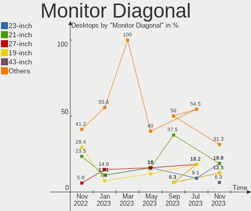
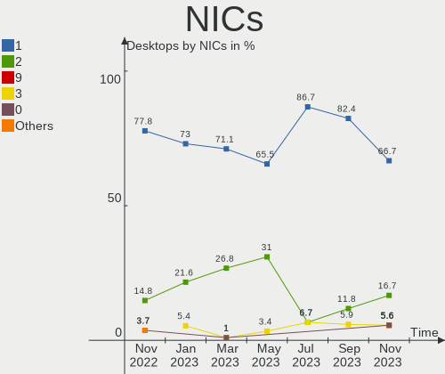

helloSystem Hardware Trends (Desktops)
--------------------------------------

A project to identify most popular hardware characteristics and track their change
over time based on data collected by helloSystem users at https://BSD-Hardware.info.

Anyone can contribute to this report by the [hw-probe](https://github.com/linuxhw/hw-probe/blob/master/INSTALL.BSD.md) tool:

    hw-probe -all -upload

Full-feature report is available here: https://bsd-hardware.info/?view=trends

Period: Jan, 2022.

Contents
--------

* [ System ](#system)
  - [ OS                       ](#os)
  - [ OS Family                ](#os-family)
  - [ Arch                     ](#arch)
  - [ DE                       ](#de)
  - [ Display Server           ](#display-server)
  - [ Display Manager          ](#display-manager)
  - [ OS Lang                  ](#os-lang)
  - [ Boot Mode                ](#boot-mode)
  - [ Filesystem               ](#filesystem)
  - [ Part. scheme             ](#part-scheme)

* [ Board ](#board)
  - [ Vendor                   ](#vendor)
  - [ Model                    ](#model)
  - [ Model Family             ](#model-family)
  - [ MFG Year                 ](#mfg-year)
  - [ Form Factor              ](#form-factor)
  - [ Coreboot                 ](#coreboot)
  - [ RAM Size                 ](#ram-size)
  - [ RAM Used                 ](#ram-used)
  - [ Total Drives             ](#total-drives)
  - [ Has CD-ROM               ](#has-cd-rom)
  - [ Has Ethernet             ](#has-ethernet)
  - [ Has WiFi                 ](#has-wifi)
  - [ Has Bluetooth            ](#has-bluetooth)

* [ Location ](#location)
  - [ Country                  ](#country)
  - [ City                     ](#city)

* [ Drives ](#drives)
  - [ Drive Vendor             ](#drive-vendor)
  - [ Drive Model              ](#drive-model)
  - [ HDD Vendor               ](#hdd-vendor)
  - [ SSD Vendor               ](#ssd-vendor)
  - [ Drive Kind               ](#drive-kind)
  - [ Drive Connector          ](#drive-connector)
  - [ Drive Size               ](#drive-size)
  - [ Space Total              ](#space-total)
  - [ Space Used               ](#space-used)
  - [ Malfunc. Drives          ](#malfunc-drives)
  - [ Malfunc. Drive Vendor    ](#malfunc-drive-vendor)
  - [ Malfunc. HDD Vendor      ](#malfunc-hdd-vendor)
  - [ Malfunc. Drive Kind      ](#malfunc-drive-kind)
  - [ Failed Drives            ](#failed-drives)
  - [ Failed Drive Vendor      ](#failed-drive-vendor)
  - [ Drive Status             ](#drive-status)

* [ Storage controller ](#storage-controller)
  - [ Storage Vendor           ](#storage-vendor)
  - [ Storage Model            ](#storage-model)
  - [ Storage Kind             ](#storage-kind)

* [ Processor ](#processor)
  - [ CPU Vendor               ](#cpu-vendor)
  - [ CPU Model                ](#cpu-model)
  - [ CPU Model Family         ](#cpu-model-family)
  - [ CPU Cores                ](#cpu-cores)
  - [ CPU Sockets              ](#cpu-sockets)
  - [ CPU Threads              ](#cpu-threads)
  - [ CPU Microarch            ](#cpu-microarch)

* [ Graphics ](#graphics)
  - [ GPU Vendor               ](#gpu-vendor)
  - [ GPU Model                ](#gpu-model)
  - [ GPU Combo                ](#gpu-combo)
  - [ GPU Driver               ](#gpu-driver)
  - [ GPU Memory               ](#gpu-memory)

* [ Monitor ](#monitor)
  - [ Monitor Vendor           ](#monitor-vendor)
  - [ Monitor Model            ](#monitor-model)
  - [ Monitor Resolution       ](#monitor-resolution)
  - [ Monitor Diagonal         ](#monitor-diagonal)
  - [ Monitor Width            ](#monitor-width)
  - [ Aspect Ratio             ](#aspect-ratio)
  - [ Monitor Area             ](#monitor-area)
  - [ Pixel Density            ](#pixel-density)
  - [ Multiple Monitors        ](#multiple-monitors)

* [ Network ](#network)
  - [ Net Controller Vendor    ](#net-controller-vendor)
  - [ Net Controller Model     ](#net-controller-model)
  - [ Wireless Vendor          ](#wireless-vendor)
  - [ Wireless Model           ](#wireless-model)
  - [ Ethernet Vendor          ](#ethernet-vendor)
  - [ Ethernet Model           ](#ethernet-model)
  - [ Net Controller Kind      ](#net-controller-kind)
  - [ Used Controller          ](#used-controller)
  - [ NICs                     ](#nics)
  - [ IPv6                     ](#ipv6)

* [ Bluetooth ](#bluetooth)
  - [ Bluetooth Vendor         ](#bluetooth-vendor)
  - [ Bluetooth Model          ](#bluetooth-model)

* [ Sound ](#sound)
  - [ Sound Vendor             ](#sound-vendor)
  - [ Sound Model              ](#sound-model)

* [ Memory ](#memory)
  - [ Memory Vendor            ](#memory-vendor)
  - [ Memory Model             ](#memory-model)
  - [ Memory Kind              ](#memory-kind)
  - [ Memory Form Factor       ](#memory-form-factor)
  - [ Memory Size              ](#memory-size)
  - [ Memory Speed             ](#memory-speed)

* [ Printers & scanners ](#printers--scanners)
  - [ Printer Vendor           ](#printer-vendor)
  - [ Printer Model            ](#printer-model)
  - [ Scanner Vendor           ](#scanner-vendor)
  - [ Scanner Model            ](#scanner-model)

* [ Camera ](#camera)
  - [ Camera Vendor            ](#camera-vendor)
  - [ Camera Model             ](#camera-model)

* [ Security ](#security)
  - [ Fingerprint Vendor       ](#fingerprint-vendor)
  - [ Fingerprint Model        ](#fingerprint-model)
  - [ Chipcard Vendor          ](#chipcard-vendor)
  - [ Chipcard Model           ](#chipcard-model)

* [ Unsupported ](#unsupported)
  - [ Unsupported Devices      ](#unsupported-devices)
  - [ Unsupported Device Types ](#unsupported-device-types)

System
------

OS
--

Installed operating systems

| Name              | Desktops | Percent |
|-------------------|----------|---------|
| helloSystem 0.7.0 | 27       | 75%     |
| helloSystem 0.8.0 | 7        | 19.44%  |
| helloSystem 0.6.0 | 2        | 5.56%   |

OS Family
---------

OS without a version

| Name        | Desktops | Percent |
|-------------|----------|---------|
| helloSystem | 36       | 100%    |

Arch
----

OS architecture (x86_64, i586, etc.)

| Name  | Desktops | Percent |
|-------|----------|---------|
| amd64 | 36       | 100%    |

DE
--

Desktop Environment

| Name         | Desktops | Percent |
|--------------|----------|---------|
| helloDesktop | 36       | 100%    |

Display Server
--------------

X11 or Wayland

| Name | Desktops | Percent |
|------|----------|---------|
| X11  | 36       | 100%    |

Display Manager
---------------

SDDM, LightDM, etc.

| Name | Desktops | Percent |
|------|----------|---------|
| SLiM | 36       | 100%    |

OS Lang
-------

Language

| Lang  | Desktops | Percent |
|-------|----------|---------|
| en_US | 35       | 97.22%  |
| C     | 1        | 2.78%   |

Boot Mode
---------

EFI or BIOS

| Mode | Desktops | Percent |
|------|----------|---------|
| EFI  | 33       | 91.67%  |
| BIOS | 3        | 8.33%   |

Filesystem
----------

Type of filesystem

| Type   | Desktops | Percent |
|--------|----------|---------|
| Cd9660 | 19       | 52.78%  |
| Zfs    | 17       | 47.22%  |

Part. scheme
------------

Scheme of partitioning

| Type | Desktops | Percent |
|------|----------|---------|
| GPT  | 34       | 94.44%  |
| MBR  | 2        | 5.56%   |

Board
-----

Vendor
------

Motherboard manufacturer

| Name                | Desktops | Percent |
|---------------------|----------|---------|
| ASUSTek Computer    | 13       | 36.11%  |
| Dell                | 6        | 16.67%  |
| Intel               | 3        | 8.33%   |
| Hewlett-Packard     | 3        | 8.33%   |
| ASRock              | 3        | 8.33%   |
| Pegatron            | 2        | 5.56%   |
| Gigabyte Technology | 2        | 5.56%   |
| Unknown             | 2        | 5.56%   |
| MSI                 | 1        | 2.78%   |
| Fujitsu             | 1        | 2.78%   |

Model
-----

Motherboard model

| Name                               | Desktops | Percent |
|------------------------------------|----------|---------|
| Dell OptiPlex 9020                 | 2        | 5.56%   |
| Unknown                            | 2        | 5.56%   |
| Pegatron IPPPV-D3G                 | 1        | 2.78%   |
| Pegatron Compaq 505B Microtower PC | 1        | 2.78%   |
| MSI MS-7D25                        | 1        | 2.78%   |
| Intel MAHOBAY                      | 1        | 2.78%   |
| Intel H81                          | 1        | 2.78%   |
| Intel DH77EB AAG39073-400          | 1        | 2.78%   |
| HP Slim Desktop S01-aF1xxx         | 1        | 2.78%   |
| HP ProDesk 600 G2 DM               | 1        | 2.78%   |
| HP EliteDesk 700 G1 SFF            | 1        | 2.78%   |
| Gigabyte Z77N-WIFI                 | 1        | 2.78%   |
| Gigabyte B365 HD3                  | 1        | 2.78%   |
| Fujitsu ESPRIMO E710               | 1        | 2.78%   |
| Dell Studio XPS 9100               | 1        | 2.78%   |
| Dell Precision 3440                | 1        | 2.78%   |
| Dell Inspiron 3891                 | 1        | 2.78%   |
| Dell Inspiron 3656                 | 1        | 2.78%   |
| ASUS TUF GAMING X570-PLUS          | 1        | 2.78%   |
| ASUS ROG STRIX Z390-E GAMING       | 1        | 2.78%   |
| ASUS ROG Strix GA35DX_G35DX        | 1        | 2.78%   |
| ASUS ROG STRIX B450-F GAMING       | 1        | 2.78%   |
| ASUS PRIME X570-P                  | 1        | 2.78%   |
| ASUS P8Z68-M PRO                   | 1        | 2.78%   |
| ASUS P8H61-M LX3 PLUS R2.0         | 1        | 2.78%   |
| ASUS P7H55-M                       | 1        | 2.78%   |
| ASUS P5P43TD PRO                   | 1        | 2.78%   |
| ASUS P5GC-MX                       | 1        | 2.78%   |
| ASUS P5B SE                        | 1        | 2.78%   |
| ASUS Maximus VIII HERO             | 1        | 2.78%   |
| ASUS BM6835_BM6635_BP6335          | 1        | 2.78%   |
| ASRock B460M Pro4                  | 1        | 2.78%   |
| ASRock B365M Pro4                  | 1        | 2.78%   |
| ASRock A300M-STX                   | 1        | 2.78%   |

Model Family
------------

Motherboard model prefix

| Name               | Desktops | Percent |
|--------------------|----------|---------|
| ASUS ROG           | 3        | 8.33%   |
| Dell OptiPlex      | 2        | 5.56%   |
| Dell Inspiron      | 2        | 5.56%   |
| Unknown            | 2        | 5.56%   |
| Pegatron IPPPV-D3G | 1        | 2.78%   |
| Pegatron Compaq    | 1        | 2.78%   |
| MSI MS-7D25        | 1        | 2.78%   |
| Intel MAHOBAY      | 1        | 2.78%   |
| Intel H81          | 1        | 2.78%   |
| Intel DH77EB       | 1        | 2.78%   |
| HP Slim            | 1        | 2.78%   |
| HP ProDesk         | 1        | 2.78%   |
| HP EliteDesk       | 1        | 2.78%   |
| Gigabyte Z77N-WIFI | 1        | 2.78%   |
| Gigabyte B365      | 1        | 2.78%   |
| Fujitsu ESPRIMO    | 1        | 2.78%   |
| Dell Studio        | 1        | 2.78%   |
| Dell Precision     | 1        | 2.78%   |
| ASUS TUF           | 1        | 2.78%   |
| ASUS PRIME         | 1        | 2.78%   |
| ASUS P8Z68-M       | 1        | 2.78%   |
| ASUS P8H61-M       | 1        | 2.78%   |
| ASUS P7H55-M       | 1        | 2.78%   |
| ASUS P5P43TD       | 1        | 2.78%   |
| ASUS P5GC-MX       | 1        | 2.78%   |
| ASUS P5B           | 1        | 2.78%   |
| ASUS Maximus       | 1        | 2.78%   |
| ASUS BM6835        | 1        | 2.78%   |
| ASRock B460M       | 1        | 2.78%   |
| ASRock B365M       | 1        | 2.78%   |
| ASRock A300M-STX   | 1        | 2.78%   |

MFG Year
--------

Motherboard manufacture year

| Year | Desktops | Percent |
|------|----------|---------|
| 2021 | 7        | 19.44%  |
| 2013 | 4        | 11.11%  |
| 2019 | 3        | 8.33%   |
| 2014 | 3        | 8.33%   |
| 2012 | 3        | 8.33%   |
| 2010 | 3        | 8.33%   |
| 2020 | 2        | 5.56%   |
| 2017 | 2        | 5.56%   |
| 2016 | 2        | 5.56%   |
| 2009 | 2        | 5.56%   |
| 2018 | 1        | 2.78%   |
| 2015 | 1        | 2.78%   |
| 2011 | 1        | 2.78%   |
| 2008 | 1        | 2.78%   |
| 2007 | 1        | 2.78%   |

Form Factor
-----------

Physical design of the computer

| Name    | Desktops | Percent |
|---------|----------|---------|
| Desktop | 36       | 100%    |

Coreboot
--------

Have coreboot on board

| Used | Desktops | Percent |
|------|----------|---------|
| No   | 36       | 100%    |

RAM Size
--------

Total RAM memory

| Size in GB  | Desktops | Percent |
|-------------|----------|---------|
| 16.01-24.0  | 11       | 30.56%  |
| 8.01-16.0   | 11       | 30.56%  |
| 32.01-64.0  | 7        | 19.44%  |
| 4.01-8.0    | 3        | 8.33%   |
| 2.01-3.0    | 3        | 8.33%   |
| 64.01-256.0 | 1        | 2.78%   |

RAM Used
--------

Used RAM memory

| Used GB  | Desktops | Percent |
|----------|----------|---------|
| 0.01-0.5 | 14       | 38.89%  |
| 0.51-1.0 | 12       | 33.33%  |
| 1.01-2.0 | 9        | 25%     |
| 2.01-3.0 | 1        | 2.78%   |

Total Drives
------------

Number of drives on board

| Drives | Desktops | Percent |
|--------|----------|---------|
| 2      | 16       | 44.44%  |
| 1      | 14       | 38.89%  |
| 4      | 2        | 5.56%   |
| 3      | 2        | 5.56%   |
| 6      | 1        | 2.78%   |
| 5      | 1        | 2.78%   |

Has CD-ROM
----------

Has CD-ROM on board

| Presented | Desktops | Percent |
|-----------|----------|---------|
| No        | 23       | 63.89%  |
| Yes       | 13       | 36.11%  |

Has Ethernet
------------

Has Ethernet on board

| Presented | Desktops | Percent |
|-----------|----------|---------|
| Yes       | 35       | 97.22%  |
| No        | 1        | 2.78%   |

Has WiFi
--------

Has WiFi module

| Presented | Desktops | Percent |
|-----------|----------|---------|
| No        | 26       | 72.22%  |
| Yes       | 10       | 27.78%  |

Has Bluetooth
-------------

Has Bluetooth module

| Presented | Desktops | Percent |
|-----------|----------|---------|
| No        | 21       | 58.33%  |
| Yes       | 15       | 41.67%  |

Location
--------

Country
-------

Geographic location (country)

| Country      | Desktops | Percent |
|--------------|----------|---------|
| Russia       | 8        | 22.22%  |
| USA          | 6        | 16.67%  |
| Poland       | 3        | 8.33%   |
| India        | 2        | 5.56%   |
| France       | 2        | 5.56%   |
| Canada       | 2        | 5.56%   |
| Australia    | 2        | 5.56%   |
| Ukraine      | 1        | 2.78%   |
| UK           | 1        | 2.78%   |
| Turkey       | 1        | 2.78%   |
| Spain        | 1        | 2.78%   |
| South Africa | 1        | 2.78%   |
| Kazakhstan   | 1        | 2.78%   |
| Italy        | 1        | 2.78%   |
| Hungary      | 1        | 2.78%   |
| Germany      | 1        | 2.78%   |
| Finland      | 1        | 2.78%   |
| Brazil       | 1        | 2.78%   |

City
----

Geographic location (city)

| City               | Desktops | Percent |
|--------------------|----------|---------|
| Barnaul            | 2        | 5.56%   |
| Warsaw             | 1        | 2.78%   |
| Voronezh           | 1        | 2.78%   |
| Tiruchi            | 1        | 2.78%   |
| Surrey             | 1        | 2.78%   |
| Surgut             | 1        | 2.78%   |
| Stavropol          | 1        | 2.78%   |
| St Petersburg      | 1        | 2.78%   |
| Spalice            | 1        | 2.78%   |
| Salisbury          | 1        | 2.78%   |
| Rio de Janeiro     | 1        | 2.78%   |
| Pflugerville       | 1        | 2.78%   |
| Myrtle Beach       | 1        | 2.78%   |
| Munich             | 1        | 2.78%   |
| Melbourne          | 1        | 2.78%   |
| Maglod             | 1        | 2.78%   |
| Luton              | 1        | 2.78%   |
| Kremenchug         | 1        | 2.78%   |
| Kostroma           | 1        | 2.78%   |
| Imperial           | 1        | 2.78%   |
| Helsinki           | 1        | 2.78%   |
| Harrisburg         | 1        | 2.78%   |
| Greater Sudbury    | 1        | 2.78%   |
| Genille            | 1        | 2.78%   |
| Escondido          | 1        | 2.78%   |
| Ernakulam          | 1        | 2.78%   |
| Cournon-d'Auvergne | 1        | 2.78%   |
| Coria del R?­o     | 1        | 2.78%   |
| Cheboksary         | 1        | 2.78%   |
| Catania            | 1        | 2.78%   |
| Bydgoszcz          | 1        | 2.78%   |
| Brisbane           | 1        | 2.78%   |
| Bloemfontein       | 1        | 2.78%   |
| Ankara             | 1        | 2.78%   |
| Almaty             | 1        | 2.78%   |

Drives
------

Drive Vendor
------------

Hard drive vendors

| Vendor              | Desktops | Drives | Percent |
|---------------------|----------|--------|---------|
| Seagate             | 15       | 15     | 24.59%  |
| Samsung Electronics | 10       | 11     | 16.39%  |
| WDC                 | 8        | 11     | 13.11%  |
| Crucial             | 6        | 11     | 9.84%   |
| Toshiba             | 4        | 4      | 6.56%   |
| SK Hynix            | 2        | 2      | 3.28%   |
| GOODRAM             | 2        | 2      | 3.28%   |
| Gigabyte Technology | 2        | 3      | 3.28%   |
| PLEXTOR             | 1        | 1      | 1.64%   |
| OCZ                 | 1        | 1      | 1.64%   |
| Mushkin             | 1        | 1      | 1.64%   |
| Lite-On             | 1        | 1      | 1.64%   |
| LDLC                | 1        | 1      | 1.64%   |
| Kingston            | 1        | 1      | 1.64%   |
| KingSpec            | 1        | 1      | 1.64%   |
| Intel               | 1        | 1      | 1.64%   |
| Hitachi             | 1        | 1      | 1.64%   |
| HGST                | 1        | 1      | 1.64%   |
| Apacer              | 1        | 1      | 1.64%   |
| A-DATA Technology   | 1        | 1      | 1.64%   |

Drive Model
-----------

Hard drive models

| Model                                   | Desktops | Percent |
|-----------------------------------------|----------|---------|
| Seagate ST2000DM008-2FR102 2TB          | 3        | 4.35%   |
| Crucial CT500MX500SSD1 500GB            | 3        | 4.35%   |
| Seagate ST1000LM024 HN-M101MBB 1TB      | 2        | 2.9%    |
| Samsung SSD 970 EVO Plus 1TB            | 2        | 2.9%    |
| WDC WDS500G2B0C-00PXH0 500GB            | 1        | 1.45%   |
| WDC WDS240G2G0A-00JH30 240GB            | 1        | 1.45%   |
| WDC WDBA3V0010BNC-WRSN 1TB              | 1        | 1.45%   |
| WDC WD5000LPVX-22V0TT0 500GB            | 1        | 1.45%   |
| WDC WD5000AAKS-22A7B0 500GB             | 1        | 1.45%   |
| WDC WD40EFRX-68N32N0 4TB                | 1        | 1.45%   |
| WDC WD4004FZWX-00GBGB0 4TB              | 1        | 1.45%   |
| WDC WD2500AAKX-073CA1 250GB             | 1        | 1.45%   |
| WDC WD1600BEVT-22ZCT0 160GB             | 1        | 1.45%   |
| WDC WD10EZEX-60ZF5A0 1TB                | 1        | 1.45%   |
| WDC WD1001FAES-75W7A0 1TB               | 1        | 1.45%   |
| Toshiba MQ01ABD050 247GB                | 1        | 1.45%   |
| Toshiba MQ01ABD032 320GB                | 1        | 1.45%   |
| Toshiba MK1655GSX 160GB                 | 1        | 1.45%   |
| Toshiba DT01ACA200 2TB                  | 1        | 1.45%   |
| SK Hynix BC711 NVMe 256GB               | 1        | 1.45%   |
| SK Hynix BC501 HFM128GDJTNG-8310A 128GB | 1        | 1.45%   |
| Seagate ST9120821AS 120GB               | 1        | 1.45%   |
| Seagate ST8000DM004-2U9188 8TB          | 1        | 1.45%   |
| Seagate ST500DM002-1BD142 500GB         | 1        | 1.45%   |
| Seagate ST380211AS 80GB                 | 1        | 1.45%   |
| Seagate ST3500312CS 500GB               | 1        | 1.45%   |
| Seagate ST3320418AS 320GB               | 1        | 1.45%   |
| Seagate ST3160811AS 160GB               | 1        | 1.45%   |
| Seagate ST31000528AS 1TB                | 1        | 1.45%   |
| Seagate ST2000DM001-1CH164 2TB          | 1        | 1.45%   |
| Seagate ST1000DM010-2EP102 1TB          | 1        | 1.45%   |
| Samsung SSD 980 PRO 1TB                 | 1        | 1.45%   |
| Samsung SSD 860 EVO 250GB               | 1        | 1.45%   |
| Samsung SSD 860 EVO 1TB                 | 1        | 1.45%   |
| Samsung SSD 850 EVO 500GB               | 1        | 1.45%   |
| Samsung SSD 840 PRO Series 128GB        | 1        | 1.45%   |
| Samsung MZVLQ512HALU-000H1 512GB        | 1        | 1.45%   |
| Samsung MZ7LN256HCHP-000L7 256GB        | 1        | 1.45%   |
| Samsung HD502HJ 500GB                   | 1        | 1.45%   |
| Samsung HD322HJ 320GB                   | 1        | 1.45%   |
| PLEXTOR PX-128M5M 128GB                 | 1        | 1.45%   |
| OCZ VERTEX4 128GB                       | 1        | 1.45%   |
| Mushkin MKNSSDPE500GB-D8                | 1        | 1.45%   |
| Lite-On PH4-CE120 120GB                 | 1        | 1.45%   |
| LDLC F8+M.2 240 240GB                   | 1        | 1.45%   |
| Kingston SUV500MS240G 240GB             | 1        | 1.45%   |
| KingSpec P4-120 120GB                   | 1        | 1.45%   |
| Intel SSDPEKNW512G8 512GB               | 1        | 1.45%   |
| Hitachi HDS721050CLA362 500GB           | 1        | 1.45%   |
| HGST HTS545050A7E680 500GB              | 1        | 1.45%   |
| GOODRAM SSDPR-CL100-120-G2 120GB        | 1        | 1.45%   |
| GOODRAM IRIDIUM PRO 120GB               | 1        | 1.45%   |
| Gigabyte GP-GSTFS31256GTND 256GB        | 1        | 1.45%   |
| Gigabyte GP-GSTFS31120GNTD 120GB        | 1        | 1.45%   |
| Crucial CT500P2SSD8 500GB               | 1        | 1.45%   |
| Crucial CT256MX100SSD1 256GB            | 1        | 1.45%   |
| Crucial CT250P2SSD8 250GB               | 1        | 1.45%   |
| Crucial CT250MX500SSD1 250GB            | 1        | 1.45%   |
| Crucial CT240BX500SSD1 240GB            | 1        | 1.45%   |
| Crucial CT120BX500SSD1 120GB            | 1        | 1.45%   |

HDD Vendor
----------

Hard disk drive vendors

| Vendor              | Desktops | Drives | Percent |
|---------------------|----------|--------|---------|
| Seagate             | 15       | 15     | 53.57%  |
| WDC                 | 5        | 8      | 17.86%  |
| Toshiba             | 4        | 4      | 14.29%  |
| Samsung Electronics | 2        | 2      | 7.14%   |
| Hitachi             | 1        | 1      | 3.57%   |
| HGST                | 1        | 1      | 3.57%   |

SSD Vendor
----------

Solid state drive vendors

| Vendor              | Desktops | Drives | Percent |
|---------------------|----------|--------|---------|
| Samsung Electronics | 5        | 5      | 22.73%  |
| Crucial             | 5        | 9      | 22.73%  |
| GOODRAM             | 2        | 2      | 9.09%   |
| Gigabyte Technology | 2        | 3      | 9.09%   |
| WDC                 | 1        | 1      | 4.55%   |
| PLEXTOR             | 1        | 1      | 4.55%   |
| OCZ                 | 1        | 1      | 4.55%   |
| Lite-On             | 1        | 1      | 4.55%   |
| Kingston            | 1        | 1      | 4.55%   |
| KingSpec            | 1        | 1      | 4.55%   |
| Apacer              | 1        | 1      | 4.55%   |
| A-DATA Technology   | 1        | 1      | 4.55%   |

Drive Kind
----------

HDD or SSD

| Kind | Desktops | Drives | Percent |
|------|----------|--------|---------|
| HDD  | 25       | 31     | 45.45%  |
| SSD  | 18       | 27     | 32.73%  |
| NVMe | 12       | 13     | 21.82%  |

Drive Connector
---------------

SATA, SAS, NVMe, etc.

| Type | Desktops | Drives | Percent |
|------|----------|--------|---------|
| SATA | 33       | 58     | 73.33%  |
| NVMe | 12       | 13     | 26.67%  |

Drive Size
----------

Size of hard drive

| Size in TB | Desktops | Drives | Percent |
|------------|----------|--------|---------|
| 0.01-0.5   | 27       | 41     | 62.79%  |
| 0.51-1.0   | 8        | 9      | 18.6%   |
| 1.01-2.0   | 5        | 5      | 11.63%  |
| 3.01-4.0   | 2        | 2      | 4.65%   |
| 4.01-10.0  | 1        | 1      | 2.33%   |

Space Total
-----------

Amount of disk space available on the file system

| Size in GB | Desktops | Percent |
|------------|----------|---------|
| 1-20       | 20       | 55.56%  |
| 101-250    | 11       | 30.56%  |
| 251-500    | 3        | 8.33%   |
| 501-1000   | 2        | 5.56%   |

Space Used
----------

Amount of used disk space

| Used GB | Desktops | Percent |
|---------|----------|---------|
| 1-20    | 36       | 100%    |

Malfunc. Drives
---------------

Drive models with a malfunction

| Model                              | Desktops | Drives | Percent |
|------------------------------------|----------|--------|---------|
| WDC WD5000AAKS-22A7B0 500GB        | 1        | 1      | 14.29%  |
| WDC WD1600BEVT-22ZCT0 160GB        | 1        | 1      | 14.29%  |
| Seagate ST380211AS 80GB            | 1        | 1      | 14.29%  |
| Seagate ST3320418AS 320GB          | 1        | 1      | 14.29%  |
| Seagate ST31000528AS 1TB           | 1        | 1      | 14.29%  |
| Seagate ST1000LM024 HN-M101MBB 1TB | 1        | 1      | 14.29%  |
| Samsung Electronics HD322HJ 320GB  | 1        | 1      | 14.29%  |

Malfunc. Drive Vendor
---------------------

Vendors of faulty drives

| Vendor              | Desktops | Drives | Percent |
|---------------------|----------|--------|---------|
| Seagate             | 4        | 4      | 57.14%  |
| WDC                 | 2        | 2      | 28.57%  |
| Samsung Electronics | 1        | 1      | 14.29%  |

Malfunc. HDD Vendor
-------------------

Vendors of faulty HDD drives

| Vendor              | Desktops | Drives | Percent |
|---------------------|----------|--------|---------|
| Seagate             | 4        | 4      | 57.14%  |
| WDC                 | 2        | 2      | 28.57%  |
| Samsung Electronics | 1        | 1      | 14.29%  |

Malfunc. Drive Kind
-------------------

Kinds of faulty drives

| Kind | Desktops | Drives | Percent |
|------|----------|--------|---------|
| HDD  | 7        | 7      | 100%    |

Failed Drives
-------------

Failed drive models

Zero info for selected period =(

Failed Drive Vendor
-------------------

Failed drive vendors

Zero info for selected period =(

Drive Status
------------

Number of failed and malfunc. drives

| Status  | Desktops | Drives | Percent |
|---------|----------|--------|---------|
| Works   | 34       | 64     | 82.93%  |
| Malfunc | 7        | 7      | 17.07%  |

Storage controller
------------------

Storage Vendor
--------------

Storage controller vendors

| Vendor                    | Desktops | Percent |
|---------------------------|----------|---------|
| Intel                     | 30       | 56.6%   |
| AMD                       | 5        | 9.43%   |
| Samsung Electronics       | 4        | 7.55%   |
| SK Hynix                  | 2        | 3.77%   |
| Silicon Motion            | 2        | 3.77%   |
| Sandisk                   | 2        | 3.77%   |
| Micron/Crucial Technology | 2        | 3.77%   |
| JMicron Technology        | 2        | 3.77%   |
| ASMedia Technology        | 2        | 3.77%   |
| Nvidia                    | 1        | 1.89%   |
| Marvell Technology Group  | 1        | 1.89%   |

Storage Model
-------------

Storage controller models

| Model                                                                          | Desktops | Percent |
|--------------------------------------------------------------------------------|----------|---------|
| Intel 7 Series/C210 Series Chipset Family 6-port SATA Controller [AHCI mode]   | 4        | 7.02%   |
| AMD FCH SATA Controller [AHCI mode]                                            | 4        | 7.02%   |
| Intel 8 Series/C220 Series Chipset Family 6-port SATA Controller 1 [AHCI mode] | 3        | 5.26%   |
| Intel 6 Series/C200 Series Chipset Family 6 port Desktop SATA AHCI Controller  | 3        | 5.26%   |
| Sandisk WD Blue SN550 NVMe SSD                                                 | 2        | 3.51%   |
| Samsung NVMe SSD Controller SM981/PM981/PM983                                  | 2        | 3.51%   |
| Micron/Crucial P2 NVMe PCIe SSD                                                | 2        | 3.51%   |
| Intel Q170/Q150/B150/H170/H110/Z170/CM236 Chipset SATA Controller [AHCI Mode]  | 2        | 3.51%   |
| Intel NM10/ICH7 Family SATA Controller [IDE mode]                              | 2        | 3.51%   |
| Intel 82801G (ICH7 Family) IDE Controller                                      | 2        | 3.51%   |
| Intel 200 Series PCH SATA controller [AHCI mode]                               | 2        | 3.51%   |
| ASMedia ASM1062 Serial ATA Controller                                          | 2        | 3.51%   |
| SK Hynix Gold P31 SSD                                                          | 1        | 1.75%   |
| SK Hynix BC501 NVMe Solid State Drive                                          | 1        | 1.75%   |
| Silicon Motion SM2263EN/SM2263XT SSD Controller                                | 1        | 1.75%   |
| Silicon Motion SM2262/SM2262EN SSD Controller                                  | 1        | 1.75%   |
| Samsung NVMe SSD Controller PM9A1/PM9A3/980PRO                                 | 1        | 1.75%   |
| Samsung NVMe SSD Controller 980                                                | 1        | 1.75%   |
| Nvidia MCP61 SATA Controller                                                   | 1        | 1.75%   |
| Marvell Group 88SE9235 PCIe 2.0 x2 4-port SATA 6 Gb/s Controller               | 1        | 1.75%   |
| JMicron JMB363 SATA/IDE Controller                                             | 1        | 1.75%   |
| JMicron JMB361 AHCI/IDE                                                        | 1        | 1.75%   |
| Intel SSD 660P Series                                                          | 1        | 1.75%   |
| Intel SATA Controller [RAID mode]                                              | 1        | 1.75%   |
| Intel NM10/ICH7 Family SATA Controller [AHCI mode]                             | 1        | 1.75%   |
| Intel Comet Lake SATA AHCI Controller                                          | 1        | 1.75%   |
| Intel Celeron/Pentium Silver Processor SATA Controller                         | 1        | 1.75%   |
| Intel Cannon Lake PCH SATA AHCI Controller                                     | 1        | 1.75%   |
| Intel Alder Lake-S PCH SATA Controller [AHCI Mode]                             | 1        | 1.75%   |
| Intel 82801JI (ICH10 Family) SATA AHCI Controller                              | 1        | 1.75%   |
| Intel 82801JI (ICH10 Family) 4 port SATA IDE Controller #1                     | 1        | 1.75%   |
| Intel 82801JI (ICH10 Family) 2 port SATA IDE Controller #2                     | 1        | 1.75%   |
| Intel 82801HM/HEM (ICH8M/ICH8M-E) SATA Controller [IDE mode]                   | 1        | 1.75%   |
| Intel 82801HM/HEM (ICH8M/ICH8M-E) IDE Controller                               | 1        | 1.75%   |
| Intel 82801HB (ICH8) 4 port SATA Controller [AHCI mode]                        | 1        | 1.75%   |
| Intel 500 Series Chipset Family SATA AHCI Controller                           | 1        | 1.75%   |
| Intel 5 Series/3400 Series Chipset 6 port SATA AHCI Controller                 | 1        | 1.75%   |
| Intel 400 Series Chipset Family SATA AHCI Controller                           | 1        | 1.75%   |
| AMD FCH SATA Controller [IDE mode]                                             | 1        | 1.75%   |

Storage Kind
------------

Kind of storage controller (IDE, SATA, NVMe, SAS, ...)

| Kind | Desktops | Percent |
|------|----------|---------|
| SATA | 28       | 58.33%  |
| NVMe | 12       | 25%     |
| IDE  | 7        | 14.58%  |
| RAID | 1        | 2.08%   |

Processor
---------

CPU Vendor
----------

Processor vendors

| Vendor | Desktops | Percent |
|--------|----------|---------|
| Intel  | 29       | 80.56%  |
| AMD    | 7        | 19.44%  |

CPU Model
---------

Processor models

| Model                                          | Desktops | Percent |
|------------------------------------------------|----------|---------|
| Intel Xeon CPU X3470 @ 2.93GHz                 | 1        | 2.78%   |
| Intel Xeon CPU E31245 @ 3.30GHz                | 1        | 2.78%   |
| Intel Xeon CPU E3-1265L V2 @ 2.50GHz           | 1        | 2.78%   |
| Intel Pentium Silver J5040 CPU @ 2.00GHz       | 1        | 2.78%   |
| Intel Pentium Dual-Core CPU E6500 @ 2.93GHz    | 1        | 2.78%   |
| Intel Pentium Dual-Core CPU E5500 @ 2.80GHz    | 1        | 2.78%   |
| Intel Pentium Dual CPU E2180 @ 2.00GHz         | 1        | 2.78%   |
| Intel Core i9-9900 CPU @ 3.10GHz               | 1        | 2.78%   |
| Intel Core i7-9700 CPU @ 3.00GHz               | 1        | 2.78%   |
| Intel Core i7-8700 CPU @ 3.20GHz               | 1        | 2.78%   |
| Intel Core i7-6700T CPU @ 2.80GHz              | 1        | 2.78%   |
| Intel Core i7-3770 CPU @ 3.40GHz               | 1        | 2.78%   |
| Intel Core i7 CPU 960 @ 3.20GHz                | 1        | 2.78%   |
| Intel Core i5-6600K CPU @ 3.50GHz              | 1        | 2.78%   |
| Intel Core i5-4590 CPU @ 3.30GHz               | 1        | 2.78%   |
| Intel Core i5-4570S CPU @ 2.90GHz              | 1        | 2.78%   |
| Intel Core i5-4570 CPU @ 3.20GHz               | 1        | 2.78%   |
| Intel Core i5-3570 CPU @ 3.40GHz               | 1        | 2.78%   |
| Intel Core i5-3470 CPU @ 3.20GHz               | 1        | 2.78%   |
| Intel Core i5-3450 CPU @ 3.10GHz               | 1        | 2.78%   |
| Intel Core i5-2405S CPU @ 2.50GHz              | 1        | 2.78%   |
| Intel Core i5-10500 CPU @ 3.10GHz              | 1        | 2.78%   |
| Intel Core i3-4130 CPU @ 3.40GHz               | 1        | 2.78%   |
| Intel Core i3-10100 CPU @ 3.60GHz              | 1        | 2.78%   |
| Intel Core 2 Quad CPU Q9550 @ 2.83GHz          | 1        | 2.78%   |
| Intel Atom CPU D525 @ 1.80GHz                  | 1        | 2.78%   |
| Intel Atom CPU D425 @ 1.80GHz                  | 1        | 2.78%   |
| Intel 12th Gen Core i5-12600K                  | 1        | 2.78%   |
| Intel 11th Gen Core i5-11400 @ 2.60GHz         | 1        | 2.78%   |
| AMD Ryzen 7 5800X 8-Core Processor             | 1        | 2.78%   |
| AMD Ryzen 7 3700X 8-Core Processor             | 1        | 2.78%   |
| AMD Ryzen 5 3600X 6-Core Processor             | 1        | 2.78%   |
| AMD Ryzen 5 3400G with Radeon Vega Graphics    | 1        | 2.78%   |
| AMD Ryzen 5 2600X Six-Core Processor           | 1        | 2.78%   |
| AMD FX-8800P Radeon R7, 12 Compute Cores 4C+8G | 1        | 2.78%   |
| AMD Athlon II X2 215 Processor                 | 1        | 2.78%   |

CPU Model Family
----------------

Processor model prefix

| Model                   | Desktops | Percent |
|-------------------------|----------|---------|
| Intel Core i5           | 9        | 25%     |
| Intel Core i7           | 5        | 13.89%  |
| Intel Xeon              | 3        | 8.33%   |
| AMD Ryzen 5             | 3        | 8.33%   |
| Other                   | 2        | 5.56%   |
| Intel Pentium Dual-Core | 2        | 5.56%   |
| Intel Core i3           | 2        | 5.56%   |
| Intel Atom              | 2        | 5.56%   |
| AMD Ryzen 7             | 2        | 5.56%   |
| Intel Pentium Silver    | 1        | 2.78%   |
| Intel Pentium Dual      | 1        | 2.78%   |
| Intel Core i9           | 1        | 2.78%   |
| Intel Core 2 Quad       | 1        | 2.78%   |
| AMD FX                  | 1        | 2.78%   |
| AMD Athlon II X2        | 1        | 2.78%   |

CPU Cores
---------

Number of processor cores

| Number  | Desktops | Percent |
|---------|----------|---------|
| 4       | 17       | 47.22%  |
| 2       | 5        | 13.89%  |
| 8       | 4        | 11.11%  |
| 6       | 3        | 8.33%   |
| 16      | 2        | 5.56%   |
| 12      | 2        | 5.56%   |
| Unknown | 2        | 5.56%   |
| 1       | 1        | 2.78%   |

CPU Sockets
-----------

Number of sockets

| Number | Desktops | Percent |
|--------|----------|---------|
| 1      | 36       | 100%    |

CPU Threads
-----------

Threads per core (Hyper-Threading)

| Number  | Desktops | Percent |
|---------|----------|---------|
| 1       | 19       | 52.78%  |
| 2       | 15       | 41.67%  |
| Unknown | 2        | 5.56%   |

CPU Microarch
-------------

Microarchitecture

| Name          | Desktops | Percent |
|---------------|----------|---------|
| IvyBridge     | 5        | 13.89%  |
| Haswell       | 4        | 11.11%  |
| Penryn        | 3        | 8.33%   |
| KabyLake      | 3        | 8.33%   |
| Zen+          | 2        | 5.56%   |
| Zen 2         | 2        | 5.56%   |
| Skylake       | 2        | 5.56%   |
| SandyBridge   | 2        | 5.56%   |
| Nehalem       | 2        | 5.56%   |
| CometLake     | 2        | 5.56%   |
| Bonnell       | 2        | 5.56%   |
| Unknown       | 2        | 5.56%   |
| Zen 3         | 1        | 2.78%   |
| K10           | 1        | 2.78%   |
| Goldmont plus | 1        | 2.78%   |
| Excavator     | 1        | 2.78%   |
| Core          | 1        | 2.78%   |

Graphics
--------

GPU Vendor
----------

Vendors of graphics cards

| Vendor | Desktops | Percent |
|--------|----------|---------|
| Intel  | 19       | 51.35%  |
| Nvidia | 11       | 29.73%  |
| AMD    | 7        | 18.92%  |

GPU Model
---------

Graphics card models

| Model                                                                       | Desktops | Percent |
|-----------------------------------------------------------------------------|----------|---------|
| Intel Xeon E3-1200 v3/4th Gen Core Processor Integrated Graphics Controller | 3        | 8.11%   |
| Nvidia GM204 [GeForce GTX 970]                                              | 2        | 5.41%   |
| Intel Xeon E3-1200 v2/3rd Gen Core processor Graphics Controller            | 2        | 5.41%   |
| Intel CometLake-S GT2 [UHD Graphics 630]                                    | 2        | 5.41%   |
| Intel Atom Processor D4xx/D5xx/N4xx/N5xx Integrated Graphics Controller     | 2        | 5.41%   |
| AMD Navi 10 [Radeon RX 5600 OEM/5600 XT / 5700/5700 XT]                     | 2        | 5.41%   |
| Nvidia TU116 [GeForce GTX 1660 Ti]                                          | 1        | 2.7%    |
| Nvidia TU116 [GeForce GTX 1650 SUPER]                                       | 1        | 2.7%    |
| Nvidia GK208B [GeForce GT 730]                                              | 1        | 2.7%    |
| Nvidia GK208B [GeForce GT 710]                                              | 1        | 2.7%    |
| Nvidia GF116 [GeForce GTX 550 Ti]                                           | 1        | 2.7%    |
| Nvidia GA106 [GeForce RTX 3060 Lite Hash Rate]                              | 1        | 2.7%    |
| Nvidia GA104 [GeForce RTX 3070]                                             | 1        | 2.7%    |
| Nvidia GA102 [GeForce RTX 3080]                                             | 1        | 2.7%    |
| Nvidia C61 [GeForce 6150SE nForce 430]                                      | 1        | 2.7%    |
| Intel RocketLake-S GT1 [UHD Graphics 730]                                   | 1        | 2.7%    |
| Intel IvyBridge GT2 [HD Graphics 4000]                                      | 1        | 2.7%    |
| Intel HD Graphics 530                                                       | 1        | 2.7%    |
| Intel GeminiLake [UHD Graphics 605]                                         | 1        | 2.7%    |
| Intel CoffeeLake-S GT2 [UHD Graphics 630]                                   | 1        | 2.7%    |
| Intel AlderLake-S GT1                                                       | 1        | 2.7%    |
| Intel 82G33/G31 Express Integrated Graphics Controller                      | 1        | 2.7%    |
| Intel 82945G/GZ Integrated Graphics Controller                              | 1        | 2.7%    |
| Intel 4th Generation Core Processor Family Integrated Graphics Controller   | 1        | 2.7%    |
| Intel 2nd Generation Core Processor Family Integrated Graphics Controller   | 1        | 2.7%    |
| AMD Tobago PRO [Radeon R7 360 / R9 360 OEM]                                 | 1        | 2.7%    |
| AMD Picasso/Raven 2 [Radeon Vega Series / Radeon Vega Mobile Series]        | 1        | 2.7%    |
| AMD Lexa PRO [Radeon 540/540X/550/550X / RX 540X/550/550X]                  | 1        | 2.7%    |
| AMD Ellesmere [Radeon RX 470/480/570/570X/580/580X/590]                     | 1        | 2.7%    |
| AMD Cedar [Radeon HD 5000/6000/7350/8350 Series]                            | 1        | 2.7%    |

GPU Combo
---------

Combinations of graphics cards

| Name           | Desktops | Percent |
|----------------|----------|---------|
| 1 x Intel      | 16       | 44.44%  |
| 1 x Nvidia     | 10       | 27.78%  |
| 1 x AMD        | 7        | 19.44%  |
| 2 x Intel      | 2        | 5.56%   |
| Intel + Nvidia | 1        | 2.78%   |

GPU Driver
----------

Free vs proprietary

| Driver      | Desktops | Percent |
|-------------|----------|---------|
| Free        | 26       | 72.22%  |
| Proprietary | 8        | 22.22%  |
| Unknown     | 2        | 5.56%   |

GPU Memory
----------

Total video memory

| Size in GB | Desktops | Percent |
|------------|----------|---------|
| Unknown    | 22       | 61.11%  |
| 1.01-2.0   | 4        | 11.11%  |
| 7.01-8.0   | 3        | 8.33%   |
| 3.01-4.0   | 3        | 8.33%   |
| 0.51-1.0   | 3        | 8.33%   |
| 5.01-6.0   | 1        | 2.78%   |

Monitor
-------

Monitor Vendor
--------------

Monitor vendors

| Vendor               | Desktops | Percent |
|----------------------|----------|---------|
| Samsung Electronics  | 5        | 16.67%  |
| BenQ                 | 5        | 16.67%  |
| Goldstar             | 4        | 13.33%  |
| Dell                 | 3        | 10%     |
| AOC                  | 3        | 10%     |
| Sony                 | 2        | 6.67%   |
| Hewlett-Packard      | 2        | 6.67%   |
| SGT                  | 1        | 3.33%   |
| Philips              | 1        | 3.33%   |
| Insignia             | 1        | 3.33%   |
| ASUSTek Computer     | 1        | 3.33%   |
| Ancor Communications | 1        | 3.33%   |
| Acer                 | 1        | 3.33%   |

Monitor Model
-------------

Monitor models

| Model                                                                  | Desktops | Percent |
|------------------------------------------------------------------------|----------|---------|
| Sony TV SNYEE01 1920x1080                                              | 1        | 3.13%   |
| Sony SDM-S75D/F/N SNY3800 1280x1024 340x270mm 17.1-inch                | 1        | 3.13%   |
| SGT YSD SGT1700 1280x1024 380x210mm 17.1-inch                          | 1        | 3.13%   |
| Samsung Electronics SyncMaster SAM0373 1680x1050 440x300mm 21.0-inch   | 1        | 3.13%   |
| Samsung Electronics SMS23A550H SAM07C9 1920x1080 510x290mm 23.1-inch   | 1        | 3.13%   |
| Samsung Electronics S19D300 SAM0B34 1366x768 410x230mm 18.5-inch       | 1        | 3.13%   |
| Samsung Electronics LCD Monitor SAM0AC6 1920x1080 1110x620mm 50.1-inch | 1        | 3.13%   |
| Samsung Electronics LC24RG50 SAM0F90 1920x1080 530x300mm 24.0-inch     | 1        | 3.13%   |
| Samsung Electronics C32F391 SAM0D34 1920x1080 700x390mm 31.5-inch      | 1        | 3.13%   |
| Philips 248CLH PHLC088 1920x1080 520x290mm 23.4-inch                   | 1        | 3.13%   |
| Insignia 32DR310NA17 BBY3253 1680x1050 700x390mm 31.5-inch             | 1        | 3.13%   |
| Hewlett-Packard 27xi HWP3038 1920x1080 600x340mm 27.2-inch             | 1        | 3.13%   |
| Hewlett-Packard 27f HPN354A 1920x1080 600x340mm 27.2-inch              | 1        | 3.13%   |
| Goldstar W1942 GSM4B6F 1440x900 410x260mm 19.1-inch                    | 1        | 3.13%   |
| Goldstar LG ULTRAWIDE GSM5AE2 3440x1440 800x340mm 34.2-inch            | 1        | 3.13%   |
| Goldstar LCD Monitor GSM5807 1920x1080 480x270mm 21.7-inch             | 1        | 3.13%   |
| Goldstar E1942 GSM4C09 1366x768 410x230mm 18.5-inch                    | 1        | 3.13%   |
| Dell ST2321L DELF033 1920x1080 510x290mm 23.1-inch                     | 1        | 3.13%   |
| Dell ST2321L DELF031 1920x1080 510x290mm 23.1-inch                     | 1        | 3.13%   |
| Dell S2316H DELD07E 1920x1080 510x290mm 23.1-inch                      | 1        | 3.13%   |
| Dell E248WFP DELA02D 1920x1200 520x320mm 24.0-inch                     | 1        | 3.13%   |
| BenQ XL2411Z BNQ7F31 1920x1080 530x300mm 24.0-inch                     | 1        | 3.13%   |
| BenQ GL2450 BNQ78A4 1920x1080 530x300mm 24.0-inch                      | 1        | 3.13%   |
| BenQ G702AD BNQ7846 1280x1024 340x270mm 17.1-inch                      | 1        | 3.13%   |
| BenQ G2020HD BNQ781F 1600x900 440x250mm 19.9-inch                      | 1        | 3.13%   |
| BenQ BL2780 BNQ802B 1920x1080 600x340mm 27.2-inch                      | 1        | 3.13%   |
| ASUSTek Computer VP228 AUS22A1 1920x1080 480x270mm 21.7-inch           | 1        | 3.13%   |
| AOC Q2577W AOC2577 2560x1440 550x310mm 24.9-inch                       | 1        | 3.13%   |
| AOC 2236 AOC2236 1920x1080 480x270mm 21.7-inch                         | 1        | 3.13%   |
| AOC 2050 AOC2050 1600x900 440x250mm 19.9-inch                          | 1        | 3.13%   |
| Ancor Communications ASUS MG278 ACI27A8 2560x1440 600x340mm 27.2-inch  | 1        | 3.13%   |
| Acer ET322QK C ACR06E3 3840x2160 700x390mm 31.5-inch                   | 1        | 3.13%   |

Monitor Resolution
------------------

Monitor screen resolution

| Resolution         | Desktops | Percent |
|--------------------|----------|---------|
| 1920x1080 (FHD)    | 15       | 50%     |
| 1280x1024 (SXGA)   | 3        | 10%     |
| 2560x1440 (QHD)    | 2        | 6.67%   |
| 1680x1050 (WSXGA+) | 2        | 6.67%   |
| 1600x900 (HD+)     | 2        | 6.67%   |
| 1366x768 (WXGA)    | 2        | 6.67%   |
| 3840x2160 (4K)     | 1        | 3.33%   |
| 3440x1440          | 1        | 3.33%   |
| 1920x1200 (WUXGA)  | 1        | 3.33%   |
| 1440x900 (WXGA+)   | 1        | 3.33%   |

Monitor Diagonal
----------------

Diagonal size in inches

| Inches  | Desktops | Percent |
|---------|----------|---------|
| 24      | 5        | 16.67%  |
| 27      | 4        | 13.33%  |
| 23      | 4        | 13.33%  |
| 31      | 3        | 10%     |
| 21      | 3        | 10%     |
| 19      | 3        | 10%     |
| 17      | 3        | 10%     |
| 18      | 2        | 6.67%   |
| 50      | 1        | 3.33%   |
| 34      | 1        | 3.33%   |
| Unknown | 1        | 3.33%   |

Monitor Width
-------------

Physical width

| Width in mm | Desktops | Percent |
|-------------|----------|---------|
| 501-600     | 13       | 43.33%  |
| 401-500     | 8        | 26.67%  |
| 601-700     | 3        | 10%     |
| 301-350     | 2        | 6.67%   |
| 701-800     | 1        | 3.33%   |
| 351-400     | 1        | 3.33%   |
| 1001-1500   | 1        | 3.33%   |
| Unknown     | 1        | 3.33%   |

Aspect Ratio
------------

Proportional relationship between the width and the height

| Ratio | Desktops | Percent |
|-------|----------|---------|
| 16/9  | 24       | 80%     |
| 5/4   | 2        | 6.67%   |
| 16/10 | 2        | 6.67%   |
| 3/2   | 1        | 3.33%   |
| 21/9  | 1        | 3.33%   |

Monitor Area
------------

Area in inch²

| Area in inch² | Desktops | Percent |
|----------------|----------|---------|
| 201-250        | 10       | 33.33%  |
| 351-500        | 4        | 13.33%  |
| 301-350        | 4        | 13.33%  |
| 141-150        | 4        | 13.33%  |
| 151-200        | 3        | 10%     |
| 251-300        | 2        | 6.67%   |
| More than 1000 | 1        | 3.33%   |
| 121-130        | 1        | 3.33%   |
| Unknown        | 1        | 3.33%   |

Pixel Density
-------------

Pixels per inch

| Density | Desktops | Percent |
|---------|----------|---------|
| 51-100  | 21       | 70%     |
| 101-120 | 6        | 20%     |
| 1-50    | 1        | 3.33%   |
| 121-160 | 1        | 3.33%   |
| Unknown | 1        | 3.33%   |

Multiple Monitors
-----------------

Total monitors connected

| Total | Desktops | Percent |
|-------|----------|---------|
| 1     | 28       | 77.78%  |
| 0     | 5        | 13.89%  |
| 2     | 2        | 5.56%   |
| 3     | 1        | 2.78%   |

Network
-------

Net Controller Vendor
---------------------

Controller vendors

| Vendor                | Desktops | Percent |
|-----------------------|----------|---------|
| Intel                 | 18       | 41.86%  |
| Realtek Semiconductor | 17       | 39.53%  |
| Qualcomm Atheros      | 4        | 9.3%    |
| NetGear               | 1        | 2.33%   |
| Microchip Technology  | 1        | 2.33%   |
| IMC Networks          | 1        | 2.33%   |
| Edimax Technology     | 1        | 2.33%   |

Net Controller Model
--------------------

Controller models

| Model                                                                       | Desktops | Percent |
|-----------------------------------------------------------------------------|----------|---------|
| Realtek RTL8111/8168/8411 PCI Express Gigabit Ethernet Controller           | 14       | 28.57%  |
| Intel Ethernet Connection I217-LM                                           | 3        | 6.12%   |
| Intel 82579V Gigabit Network Connection                                     | 3        | 6.12%   |
| Intel I211 Gigabit Network Connection                                       | 2        | 4.08%   |
| Intel Ethernet Connection (2) I219-V                                        | 2        | 4.08%   |
| Realtek RTL8822CE 802.11ac PCIe Wireless Network Adapter                    | 1        | 2.04%   |
| Realtek RTL8821CE 802.11ac PCIe Wireless Network Adapter                    | 1        | 2.04%   |
| Realtek RTL8723BE PCIe Wireless Network Adapter                             | 1        | 2.04%   |
| Realtek RTL810xE PCI Express Fast Ethernet controller                       | 1        | 2.04%   |
| Realtek RTL-8100/8101L/8139 PCI Fast Ethernet Adapter                       | 1        | 2.04%   |
| Qualcomm Atheros Attansic L2 Fast Ethernet                                  | 1        | 2.04%   |
| Qualcomm Atheros Attansic L1 Gigabit Ethernet                               | 1        | 2.04%   |
| Qualcomm Atheros AR928X Wireless Network Adapter (PCI-Express)              | 1        | 2.04%   |
| Qualcomm Atheros AR8121/AR8113/AR8114 Gigabit or Fast Ethernet              | 1        | 2.04%   |
| NetGear WN111(v2) RangeMax Next Wireless [Atheros AR9170+AR9101]            | 1        | 2.04%   |
| Microchip HTC Hub Controller                                                | 1        | 2.04%   |
| Intel Wireless-AC 9260                                                      | 1        | 2.04%   |
| Intel Wireless 7265                                                         | 1        | 2.04%   |
| Intel Ethernet Controller I225-V                                            | 1        | 2.04%   |
| Intel Ethernet Connection (7) I219-V                                        | 1        | 2.04%   |
| Intel Ethernet Connection (2) I219-LM                                       | 1        | 2.04%   |
| Intel Ethernet Connection (12) I219-V                                       | 1        | 2.04%   |
| Intel Ethernet Connection (11) I219-LM                                      | 1        | 2.04%   |
| Intel Centrino Wireless-N 2230                                              | 1        | 2.04%   |
| Intel Cannon Lake PCH CNVi WiFi                                             | 1        | 2.04%   |
| Intel Alder Lake-S PCH CNVi WiFi                                            | 1        | 2.04%   |
| Intel 82579LM Gigabit Network Connection (Lewisville)                       | 1        | 2.04%   |
| Intel 82574L Gigabit Network Connection                                     | 1        | 2.04%   |
| IMC Networks Realtek RTL8191SU Wireless LAN 802.11n USB 2.0 Network Adapter | 1        | 2.04%   |
| Edimax EW-7612UAn V2 802.11n Wireless Adapter [Realtek RTL8192CU]           | 1        | 2.04%   |

Wireless Vendor
---------------

Wireless vendors

| Vendor                | Desktops | Percent |
|-----------------------|----------|---------|
| Intel                 | 5        | 41.67%  |
| Realtek Semiconductor | 3        | 25%     |
| Qualcomm Atheros      | 1        | 8.33%   |
| NetGear               | 1        | 8.33%   |
| IMC Networks          | 1        | 8.33%   |
| Edimax Technology     | 1        | 8.33%   |

Wireless Model
--------------

Wireless models

| Model                                                                       | Desktops | Percent |
|-----------------------------------------------------------------------------|----------|---------|
| Realtek RTL8822CE 802.11ac PCIe Wireless Network Adapter                    | 1        | 8.33%   |
| Realtek RTL8821CE 802.11ac PCIe Wireless Network Adapter                    | 1        | 8.33%   |
| Realtek RTL8723BE PCIe Wireless Network Adapter                             | 1        | 8.33%   |
| Qualcomm Atheros AR928X Wireless Network Adapter (PCI-Express)              | 1        | 8.33%   |
| NetGear WN111(v2) RangeMax Next Wireless [Atheros AR9170+AR9101]            | 1        | 8.33%   |
| Intel Wireless-AC 9260                                                      | 1        | 8.33%   |
| Intel Wireless 7265                                                         | 1        | 8.33%   |
| Intel Centrino Wireless-N 2230                                              | 1        | 8.33%   |
| Intel Cannon Lake PCH CNVi WiFi                                             | 1        | 8.33%   |
| Intel Alder Lake-S PCH CNVi WiFi                                            | 1        | 8.33%   |
| IMC Networks Realtek RTL8191SU Wireless LAN 802.11n USB 2.0 Network Adapter | 1        | 8.33%   |
| Edimax EW-7612UAn V2 802.11n Wireless Adapter [Realtek RTL8192CU]           | 1        | 8.33%   |

Ethernet Vendor
---------------

Ethernet vendors

| Vendor                | Desktops | Percent |
|-----------------------|----------|---------|
| Realtek Semiconductor | 16       | 45.71%  |
| Intel                 | 16       | 45.71%  |
| Qualcomm Atheros      | 3        | 8.57%   |

Ethernet Model
--------------

Ethernet models

| Model                                                             | Desktops | Percent |
|-------------------------------------------------------------------|----------|---------|
| Realtek RTL8111/8168/8411 PCI Express Gigabit Ethernet Controller | 14       | 38.89%  |
| Intel Ethernet Connection I217-LM                                 | 3        | 8.33%   |
| Intel 82579V Gigabit Network Connection                           | 3        | 8.33%   |
| Intel I211 Gigabit Network Connection                             | 2        | 5.56%   |
| Intel Ethernet Connection (2) I219-V                              | 2        | 5.56%   |
| Realtek RTL810xE PCI Express Fast Ethernet controller             | 1        | 2.78%   |
| Realtek RTL-8100/8101L/8139 PCI Fast Ethernet Adapter             | 1        | 2.78%   |
| Qualcomm Atheros Attansic L2 Fast Ethernet                        | 1        | 2.78%   |
| Qualcomm Atheros Attansic L1 Gigabit Ethernet                     | 1        | 2.78%   |
| Qualcomm Atheros AR8121/AR8113/AR8114 Gigabit or Fast Ethernet    | 1        | 2.78%   |
| Intel Ethernet Controller I225-V                                  | 1        | 2.78%   |
| Intel Ethernet Connection (7) I219-V                              | 1        | 2.78%   |
| Intel Ethernet Connection (2) I219-LM                             | 1        | 2.78%   |
| Intel Ethernet Connection (12) I219-V                             | 1        | 2.78%   |
| Intel Ethernet Connection (11) I219-LM                            | 1        | 2.78%   |
| Intel 82579LM Gigabit Network Connection (Lewisville)             | 1        | 2.78%   |
| Intel 82574L Gigabit Network Connection                           | 1        | 2.78%   |

Net Controller Kind
-------------------

Ethernet, WiFi or modem

| Kind     | Desktops | Percent |
|----------|----------|---------|
| Ethernet | 35       | 76.09%  |
| WiFi     | 10       | 21.74%  |
| Modem    | 1        | 2.17%   |

Used Controller
---------------

Currently used network controller

| Kind     | Desktops | Percent |
|----------|----------|---------|
| Ethernet | 33       | 82.5%   |
| WiFi     | 7        | 17.5%   |

NICs
----

Total network controllers on board

| Total | Desktops | Percent |
|-------|----------|---------|
| 1     | 24       | 66.67%  |
| 2     | 9        | 25%     |
| 4     | 1        | 2.78%   |
| 3     | 1        | 2.78%   |
| 0     | 1        | 2.78%   |

IPv6
----

IPv6 vs IPv4

| Used | Desktops | Percent |
|------|----------|---------|
| No   | 35       | 97.22%  |
| Yes  | 1        | 2.78%   |

Bluetooth
---------

Bluetooth Vendor
----------------

Controller vendors

| Vendor                   | Desktops | Percent |
|--------------------------|----------|---------|
| Cambridge Silicon Radio  | 6        | 40%     |
| Intel                    | 5        | 33.33%  |
| Realtek Semiconductor    | 2        | 13.33%  |
| IMC Networks             | 1        | 6.67%   |
| HTC (High Tech Computer) | 1        | 6.67%   |

Bluetooth Model
---------------

Controller models

| Model                                                                | Desktops | Percent |
|----------------------------------------------------------------------|----------|---------|
| Cambridge Silicon Radio Bluetooth Dongle (HCI mode)                  | 6        | 40%     |
| Realtek  Bluetooth 4.2 Adapter                                       | 1        | 6.67%   |
| Realtek Dell Wireless 1801 Bluetooth 4.0 LE                          | 1        | 6.67%   |
| Intel Wireless-AC 9260 Bluetooth Adapter                             | 1        | 6.67%   |
| Intel Centrino Bluetooth Wireless Transceiver                        | 1        | 6.67%   |
| Intel Bluetooth wireless interface                                   | 1        | 6.67%   |
| Intel Bluetooth 9460/9560 Jefferson Peak (JfP)                       | 1        | 6.67%   |
| Intel AX201 Bluetooth                                                | 1        | 6.67%   |
| IMC Networks Realtek Bluetooth Adapter                               | 1        | 6.67%   |
| HTC (High Tech Computer) Vive Hub Bluetooth 4.1 (Broadcom BCM920703) | 1        | 6.67%   |

Sound
-----

Sound Vendor
------------

Sound card vendors

| Vendor              | Desktops | Percent |
|---------------------|----------|---------|
| Intel               | 25       | 46.3%   |
| Nvidia              | 11       | 20.37%  |
| AMD                 | 8        | 14.81%  |
| C-Media Electronics | 2        | 3.7%    |
| Yamaha              | 1        | 1.85%   |
| Texas Instruments   | 1        | 1.85%   |
| SteelSeries ApS     | 1        | 1.85%   |
| Logitech            | 1        | 1.85%   |
| KORG                | 1        | 1.85%   |
| Kingston Technology | 1        | 1.85%   |
| GN Netcom           | 1        | 1.85%   |
| Creative Labs       | 1        | 1.85%   |

Sound Model
-----------

Sound card models

| Model                                                                      | Desktops | Percent |
|----------------------------------------------------------------------------|----------|---------|
| Intel Xeon E3-1200 v3/4th Gen Core Processor HD Audio Controller           | 4        | 6.35%   |
| Intel 8 Series/C220 Series Chipset High Definition Audio Controller        | 4        | 6.35%   |
| Intel 7 Series/C216 Chipset Family High Definition Audio Controller        | 4        | 6.35%   |
| Intel NM10/ICH7 Family High Definition Audio Controller                    | 3        | 4.76%   |
| Intel 6 Series/C200 Series Chipset Family High Definition Audio Controller | 3        | 4.76%   |
| AMD Starship/Matisse HD Audio Controller                                   | 3        | 4.76%   |
| Nvidia TU116 High Definition Audio Controller                              | 2        | 3.17%   |
| Nvidia GM204 High Definition Audio Controller                              | 2        | 3.17%   |
| Nvidia GK208 HDMI/DP Audio Controller                                      | 2        | 3.17%   |
| Intel 200 Series PCH HD Audio                                              | 2        | 3.17%   |
| Intel 100 Series/C230 Series Chipset Family HD Audio Controller            | 2        | 3.17%   |
| AMD Navi 10 HDMI Audio                                                     | 2        | 3.17%   |
| Yamaha Steinberg UR22mkII                                                  | 1        | 1.59%   |
| Texas Instruments PCM2902 Audio Codec                                      | 1        | 1.59%   |
| SteelSeries ApS SteelSeries Arctis 5 Arctis 5 Chat Arctis 5 Game           | 1        | 1.59%   |
| Nvidia MCP61 High Definition Audio                                         | 1        | 1.59%   |
| Nvidia GF116 High Definition Audio Controller                              | 1        | 1.59%   |
| Nvidia GA104 High Definition Audio Controller                              | 1        | 1.59%   |
| Nvidia GA102 High Definition Audio Controller                              | 1        | 1.59%   |
| Logitech Headset H390                                                      | 1        | 1.59%   |
| KORG microKEY-25                                                           | 1        | 1.59%   |
| Kingston Technology HyperX QuadCast                                        | 1        | 1.59%   |
| Intel Tiger Lake-H HD Audio Controller                                     | 1        | 1.59%   |
| Intel Comet Lake PCH-V cAVS                                                | 1        | 1.59%   |
| Intel Celeron/Pentium Silver Processor High Definition Audio               | 1        | 1.59%   |
| Intel Alder Lake-S HD Audio Controller                                     | 1        | 1.59%   |
| Intel 82801JI (ICH10 Family) HD Audio Controller                           | 1        | 1.59%   |
| Intel 82801H (ICH8 Family) HD Audio Controller                             | 1        | 1.59%   |
| Intel 5 Series/3400 Series Chipset High Definition Audio                   | 1        | 1.59%   |
| GN Netcom Jabra Link 380                                                   | 1        | 1.59%   |
| Creative Labs CA0110 [Sound Blaster X-Fi Xtreme Audio]                     | 1        | 1.59%   |
| C-Media Electronics CMI8788 [Oxygen HD Audio]                              | 1        | 1.59%   |
| C-Media Electronics Cmedia Audio                                           | 1        | 1.59%   |
| AMD Tobago HDMI Audio [Radeon R7 360 / R9 360 OEM]                         | 1        | 1.59%   |
| AMD Raven/Raven2/Fenghuang HDMI/DP Audio Controller                        | 1        | 1.59%   |
| AMD Family 17h (Models 10h-1fh) HD Audio Controller                        | 1        | 1.59%   |
| AMD Family 17h (Models 00h-0fh) HD Audio Controller                        | 1        | 1.59%   |
| AMD Family 15h (Models 60h-6fh) Audio Controller                           | 1        | 1.59%   |
| AMD Ellesmere HDMI Audio [Radeon RX 470/480 / 570/580/590]                 | 1        | 1.59%   |
| AMD Cedar HDMI Audio [Radeon HD 5400/6300/7300 Series]                     | 1        | 1.59%   |
| AMD Baffin HDMI/DP Audio [Radeon RX 550 640SP / RX 560/560X]               | 1        | 1.59%   |
| Unknown                                                                    | 1        | 1.59%   |

Memory
------

Memory Vendor
-------------

Memory module vendors

| Vendor              | Desktops | Percent |
|---------------------|----------|---------|
| Unknown             | 7        | 16.67%  |
| Kingston            | 7        | 16.67%  |
| SK Hynix            | 5        | 11.9%   |
| Samsung Electronics | 5        | 11.9%   |
| G.Skill             | 3        | 7.14%   |
| Corsair             | 3        | 7.14%   |
| Micron Technology   | 2        | 4.76%   |
| Crucial             | 2        | 4.76%   |
| Unknown             | 2        | 4.76%   |
| Transcend           | 1        | 2.38%   |
| Team                | 1        | 2.38%   |
| Patriot             | 1        | 2.38%   |
| Hikvision           | 1        | 2.38%   |
| Atermiter           | 1        | 2.38%   |
| A-DATA Technology   | 1        | 2.38%   |

Memory Model
------------

Memory module models

| Model                                                    | Desktops | Percent |
|----------------------------------------------------------|----------|---------|
| SK Hynix RAM HMA81GU6DJR8N-XN 8GB DIMM DDR4 3200MT/s     | 2        | 4.65%   |
| Unknown                                                  | 2        | 4.65%   |
| Unknown RAM Module 8GB DIMM DDR3 1600MT/s                | 1        | 2.33%   |
| Unknown RAM Module 4GB SODIMM DDR3 800MT/s               | 1        | 2.33%   |
| Unknown RAM Module 4GB SODIMM DDR3 1333MT/s              | 1        | 2.33%   |
| Unknown RAM Module 2GB DIMM SDRAM 533MT/s                | 1        | 2.33%   |
| Unknown RAM Module 2GB DIMM DDR 1333MT/s                 | 1        | 2.33%   |
| Unknown RAM Module 1GB DIMM SDRAM                        | 1        | 2.33%   |
| Unknown RAM Module 1GB DIMM DDR2 333MT/s                 | 1        | 2.33%   |
| Transcend RAM TS256MSK64V3N 2GB SODIMM DDR3 1333MT/s     | 1        | 2.33%   |
| Team RAM TEAMGROUP-UD3-1600 8GB DIMM DDR3 1600MT/s       | 1        | 2.33%   |
| SK Hynix RAM HMT451S6BCFR8A-PB 4GB DIMM DDR3 1600MT/s    | 1        | 2.33%   |
| SK Hynix RAM HMT41GU6BFR8A-PB 8GB DIMM DDR3 1600MT/s     | 1        | 2.33%   |
| SK Hynix RAM HMAA1GU6CJR6N-XN 8GB DIMM DDR4 3200MT/s     | 1        | 2.33%   |
| Samsung RAM Module 8GB SODIMM DDR4 2400MT/s              | 1        | 2.33%   |
| Samsung RAM Module 4GB SODIMM DDR4 2133MT/s              | 1        | 2.33%   |
| Samsung RAM M378B5673FH0-CH9 2GB DIMM 1333MT/s           | 1        | 2.33%   |
| Samsung RAM M378B5273DH0-CK0 4GB DIMM DDR3 1600MT/s      | 1        | 2.33%   |
| Samsung RAM M378B5173DB0-CK0 4GB DIMM DDR3 1600MT/s      | 1        | 2.33%   |
| Patriot RAM PSD38G16002 8GB DIMM DDR3 1600MT/s           | 1        | 2.33%   |
| Micron RAM 4ATF51264AZ-3G2J1 4GB DIMM DDR4 3200MT/s      | 1        | 2.33%   |
| Micron RAM 18KSF51272AZ-1G4M1 4GB DIMM DDR3 1333MT/s     | 1        | 2.33%   |
| Kingston RAM KHX3733C19D4/16GX 16GB DIMM DDR4 3733MT/s   | 1        | 2.33%   |
| Kingston RAM KHX2666C15S4/8G 8GB SODIMM DDR4 2667MT/s    | 1        | 2.33%   |
| Kingston RAM KHX2666C13/16GX 16GB DIMM DDR4 2667MT/s     | 1        | 2.33%   |
| Kingston RAM KHX1600C9D3/4GX 4GB DIMM DDR3 1600MT/s      | 1        | 2.33%   |
| Kingston RAM KF3200C16D4/16GX 16GB DIMM DDR4 2400MT/s    | 1        | 2.33%   |
| Kingston RAM 99U5702-095.A00G 8GB DIMM DDR4 2667MT/s     | 1        | 2.33%   |
| Kingston RAM 99U5474-010.A00LF 2GB DIMM DDR3 1333MT/s    | 1        | 2.33%   |
| Hikvision RAM HKED3041AAB3H3HA1 4GB DIMM DDR3 1600MT/s   | 1        | 2.33%   |
| G.Skill RAM F4-3200C16-8GSXWB 8GB DIMM DDR4 2133MT/s     | 1        | 2.33%   |
| G.Skill RAM F3-1600C9-4GAO 4GB DIMM DDR3 1600MT/s        | 1        | 2.33%   |
| G.Skill RAM F3-10666CL9-4GBRL 4GB DIMM DDR3 1333MT/s     | 1        | 2.33%   |
| G.Skill RAM F3-10600CL9-2GBNT 2GB DIMM DDR3 1333MT/s     | 1        | 2.33%   |
| Crucial RAM CT4G4SFS824A.C8FBD1 4GB SODIMM DDR4 2400MT/s | 1        | 2.33%   |
| Crucial RAM BL16G32C16U4B.16FE 16GB DIMM DDR4 3200MT/s   | 1        | 2.33%   |
| Corsair RAM CMW32GX4M2E3200C16 16GB DIMM DDR4 2666MT/s   | 1        | 2.33%   |
| Corsair RAM CMK32GX4M2B3200C16 16GB DIMM DDR4 3200MT/s   | 1        | 2.33%   |
| Corsair RAM CMK16GX4M2B3200C16 8GB DIMM DDR4 3200MT/s    | 1        | 2.33%   |
| Atermiter RAM Atermiter9.A01LF 8GB DIMM DDR3 1600MT/s    | 1        | 2.33%   |
| A-DATA RAM DDR4 2666 2OZ 16GB DIMM DDR4 2667MT/s         | 1        | 2.33%   |

Memory Kind
-----------

Memory module kinds

| Kind    | Desktops | Percent |
|---------|----------|---------|
| DDR4    | 15       | 42.86%  |
| DDR3    | 15       | 42.86%  |
| SDRAM   | 2        | 5.71%   |
| DDR2    | 1        | 2.86%   |
| DDR     | 1        | 2.86%   |
| Unknown | 1        | 2.86%   |

Memory Form Factor
------------------

Physical design of the memory module

| Name   | Desktops | Percent |
|--------|----------|---------|
| DIMM   | 30       | 85.71%  |
| SODIMM | 5        | 14.29%  |

Memory Size
-----------

Memory module size

| Size  | Desktops | Percent |
|-------|----------|---------|
| 8192  | 12       | 31.58%  |
| 4096  | 10       | 26.32%  |
| 16384 | 7        | 18.42%  |
| 2048  | 6        | 15.79%  |
| 1024  | 3        | 7.89%   |

Memory Speed
------------

Memory module speed

| Speed   | Desktops | Percent |
|---------|----------|---------|
| 1600    | 9        | 24.32%  |
| 3200    | 6        | 16.22%  |
| 1333    | 5        | 13.51%  |
| 2667    | 4        | 10.81%  |
| 2400    | 3        | 8.11%   |
| 2133    | 2        | 5.41%   |
| 800     | 2        | 5.41%   |
| 3733    | 1        | 2.7%    |
| 2666    | 1        | 2.7%    |
| 1066    | 1        | 2.7%    |
| 533     | 1        | 2.7%    |
| 333     | 1        | 2.7%    |
| Unknown | 1        | 2.7%    |

Printers & scanners
-------------------

Printer Vendor
--------------

Printer device vendors

Zero info for selected period =(

Printer Model
-------------

Printer device models

Zero info for selected period =(

Scanner Vendor
--------------

Scanner device vendors

Zero info for selected period =(

Scanner Model
-------------

Scanner device models

Zero info for selected period =(

Camera
------

Camera Vendor
-------------

Camera device vendors

| Vendor                | Desktops | Percent |
|-----------------------|----------|---------|
| Logitech              | 2        | 50%     |
| IMC Networks          | 1        | 25%     |
| Arkmicro Technologies | 1        | 25%     |

Camera Model
------------

Camera device models

| Model                       | Desktops | Percent |
|-----------------------------|----------|---------|
| Logitech Webcam C310        | 1        | 25%     |
| Logitech HD Pro Webcam C920 | 1        | 25%     |
| IMC Networks XHC Camera     | 1        | 25%     |
| Arkmicro USB2.0 PC CAMERA   | 1        | 25%     |

Security
--------

Fingerprint Vendor
------------------

Fingerprint sensor vendors

Zero info for selected period =(

Fingerprint Model
-----------------

Fingerprint sensor models

Zero info for selected period =(

Chipcard Vendor
---------------

Chipcard module vendors

Zero info for selected period =(

Chipcard Model
--------------

Chipcard module models

Zero info for selected period =(

Unsupported
-----------

Unsupported Devices
-------------------

Total unsupported devices on board

| Total | Desktops | Percent |
|-------|----------|---------|
| 1     | 20       | 55.56%  |
| 0     | 9        | 25%     |
| 2     | 5        | 13.89%  |
| 4     | 2        | 5.56%   |

Unsupported Device Types
------------------------

Types of unsupported devices

| Type                     | Desktops | Percent |
|--------------------------|----------|---------|
| Communication controller | 22       | 59.46%  |
| Net/wireless             | 8        | 21.62%  |
| Bluetooth                | 3        | 8.11%   |
| Sound                    | 1        | 2.7%    |
| Net/ethernet             | 1        | 2.7%    |
| Firewire controller      | 1        | 2.7%    |
| Card reader              | 1        | 2.7%    |

