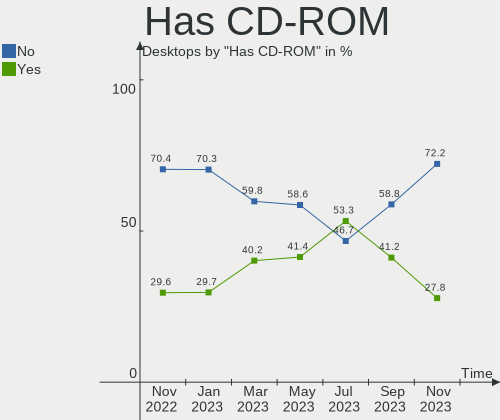
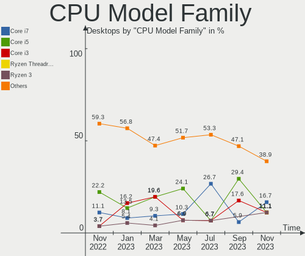
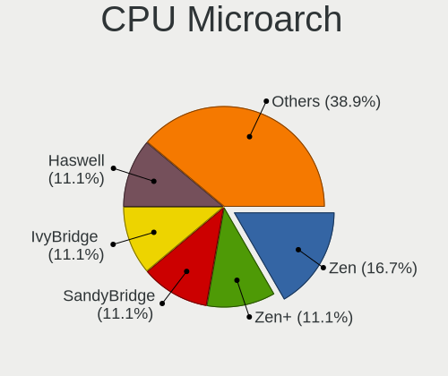
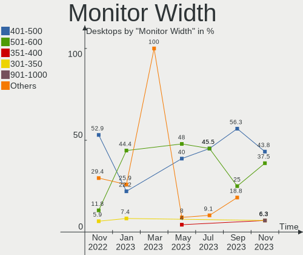
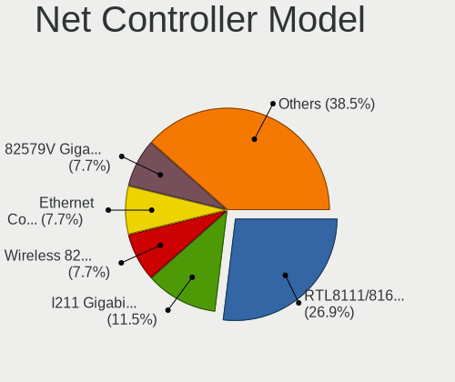
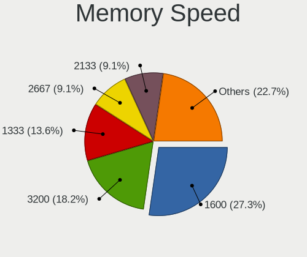
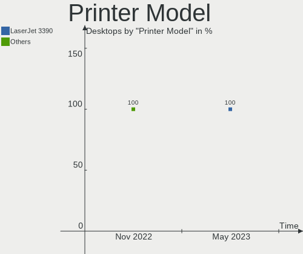

helloSystem Hardware Trends (Desktops)
--------------------------------------

A project to identify most popular hardware characteristics and track their change
over time based on data collected by helloSystem users at https://BSD-Hardware.info.

Anyone can contribute to this report by the [hw-probe](https://github.com/linuxhw/hw-probe/blob/master/INSTALL.BSD.md) tool:

    hw-probe -all -upload

Full-feature report is available here: https://bsd-hardware.info/?view=trends

Period: Nov, 2021.

Contents
--------

* [ System ](#system)
  - [ OS                       ](#os)
  - [ OS Family                ](#os-family)
  - [ Arch                     ](#arch)
  - [ DE                       ](#de)
  - [ Display Server           ](#display-server)
  - [ Display Manager          ](#display-manager)
  - [ OS Lang                  ](#os-lang)
  - [ Boot Mode                ](#boot-mode)
  - [ Filesystem               ](#filesystem)
  - [ Part. scheme             ](#part-scheme)

* [ Board ](#board)
  - [ Vendor                   ](#vendor)
  - [ Model                    ](#model)
  - [ Model Family             ](#model-family)
  - [ MFG Year                 ](#mfg-year)
  - [ Form Factor              ](#form-factor)
  - [ Coreboot                 ](#coreboot)
  - [ RAM Size                 ](#ram-size)
  - [ RAM Used                 ](#ram-used)
  - [ Total Drives             ](#total-drives)
  - [ Has CD-ROM               ](#has-cd-rom)
  - [ Has Ethernet             ](#has-ethernet)
  - [ Has WiFi                 ](#has-wifi)
  - [ Has Bluetooth            ](#has-bluetooth)

* [ Location ](#location)
  - [ Country                  ](#country)
  - [ City                     ](#city)

* [ Drives ](#drives)
  - [ Drive Vendor             ](#drive-vendor)
  - [ Drive Model              ](#drive-model)
  - [ HDD Vendor               ](#hdd-vendor)
  - [ SSD Vendor               ](#ssd-vendor)
  - [ Drive Kind               ](#drive-kind)
  - [ Drive Connector          ](#drive-connector)
  - [ Drive Size               ](#drive-size)
  - [ Space Total              ](#space-total)
  - [ Space Used               ](#space-used)
  - [ Malfunc. Drives          ](#malfunc-drives)
  - [ Malfunc. Drive Vendor    ](#malfunc-drive-vendor)
  - [ Malfunc. HDD Vendor      ](#malfunc-hdd-vendor)
  - [ Malfunc. Drive Kind      ](#malfunc-drive-kind)
  - [ Failed Drives            ](#failed-drives)
  - [ Failed Drive Vendor      ](#failed-drive-vendor)
  - [ Drive Status             ](#drive-status)

* [ Storage controller ](#storage-controller)
  - [ Storage Vendor           ](#storage-vendor)
  - [ Storage Model            ](#storage-model)
  - [ Storage Kind             ](#storage-kind)

* [ Processor ](#processor)
  - [ CPU Vendor               ](#cpu-vendor)
  - [ CPU Model                ](#cpu-model)
  - [ CPU Model Family         ](#cpu-model-family)
  - [ CPU Cores                ](#cpu-cores)
  - [ CPU Sockets              ](#cpu-sockets)
  - [ CPU Threads              ](#cpu-threads)
  - [ CPU Microarch            ](#cpu-microarch)

* [ Graphics ](#graphics)
  - [ GPU Vendor               ](#gpu-vendor)
  - [ GPU Model                ](#gpu-model)
  - [ GPU Combo                ](#gpu-combo)
  - [ GPU Driver               ](#gpu-driver)
  - [ GPU Memory               ](#gpu-memory)

* [ Monitor ](#monitor)
  - [ Monitor Vendor           ](#monitor-vendor)
  - [ Monitor Model            ](#monitor-model)
  - [ Monitor Resolution       ](#monitor-resolution)
  - [ Monitor Diagonal         ](#monitor-diagonal)
  - [ Monitor Width            ](#monitor-width)
  - [ Aspect Ratio             ](#aspect-ratio)
  - [ Monitor Area             ](#monitor-area)
  - [ Pixel Density            ](#pixel-density)
  - [ Multiple Monitors        ](#multiple-monitors)

* [ Network ](#network)
  - [ Net Controller Vendor    ](#net-controller-vendor)
  - [ Net Controller Model     ](#net-controller-model)
  - [ Wireless Vendor          ](#wireless-vendor)
  - [ Wireless Model           ](#wireless-model)
  - [ Ethernet Vendor          ](#ethernet-vendor)
  - [ Ethernet Model           ](#ethernet-model)
  - [ Net Controller Kind      ](#net-controller-kind)
  - [ Used Controller          ](#used-controller)
  - [ NICs                     ](#nics)
  - [ IPv6                     ](#ipv6)

* [ Bluetooth ](#bluetooth)
  - [ Bluetooth Vendor         ](#bluetooth-vendor)
  - [ Bluetooth Model          ](#bluetooth-model)

* [ Sound ](#sound)
  - [ Sound Vendor             ](#sound-vendor)
  - [ Sound Model              ](#sound-model)

* [ Memory ](#memory)
  - [ Memory Vendor            ](#memory-vendor)
  - [ Memory Model             ](#memory-model)
  - [ Memory Kind              ](#memory-kind)
  - [ Memory Form Factor       ](#memory-form-factor)
  - [ Memory Size              ](#memory-size)
  - [ Memory Speed             ](#memory-speed)

* [ Printers & scanners ](#printers--scanners)
  - [ Printer Vendor           ](#printer-vendor)
  - [ Printer Model            ](#printer-model)
  - [ Scanner Vendor           ](#scanner-vendor)
  - [ Scanner Model            ](#scanner-model)

* [ Camera ](#camera)
  - [ Camera Vendor            ](#camera-vendor)
  - [ Camera Model             ](#camera-model)

* [ Security ](#security)
  - [ Fingerprint Vendor       ](#fingerprint-vendor)
  - [ Fingerprint Model        ](#fingerprint-model)
  - [ Chipcard Vendor          ](#chipcard-vendor)
  - [ Chipcard Model           ](#chipcard-model)

* [ Unsupported ](#unsupported)
  - [ Unsupported Devices      ](#unsupported-devices)
  - [ Unsupported Device Types ](#unsupported-device-types)

System
------

OS
--

Installed operating systems

| Name              | Desktops | Percent |
|-------------------|----------|---------|
| helloSystem 0.6.0 | 15       | 62.5%   |
| helloSystem 0.7.0 | 7        | 29.17%  |
| helloSystem 0.5.0 | 2        | 8.33%   |

OS Family
---------

OS without a version

| Name        | Desktops | Percent |
|-------------|----------|---------|
| helloSystem | 24       | 100%    |

Arch
----

OS architecture (x86_64, i586, etc.)

| Name  | Desktops | Percent |
|-------|----------|---------|
| amd64 | 24       | 100%    |

DE
--

Desktop Environment

| Name         | Desktops | Percent |
|--------------|----------|---------|
| helloDesktop | 24       | 100%    |

Display Server
--------------

X11 or Wayland

| Name | Desktops | Percent |
|------|----------|---------|
| X11  | 24       | 100%    |

Display Manager
---------------

SDDM, LightDM, etc.

| Name | Desktops | Percent |
|------|----------|---------|
| SLiM | 24       | 100%    |

OS Lang
-------

Language

| Lang  | Desktops | Percent |
|-------|----------|---------|
| en_US | 24       | 100%    |

Boot Mode
---------

EFI or BIOS

| Mode | Desktops | Percent |
|------|----------|---------|
| EFI  | 19       | 79.17%  |
| BIOS | 5        | 20.83%  |

Filesystem
----------

Type of filesystem

| Type   | Desktops | Percent |
|--------|----------|---------|
| Zfs    | 21       | 87.5%   |
| Cd9660 | 3        | 12.5%   |

Part. scheme
------------

Scheme of partitioning

| Type | Desktops | Percent |
|------|----------|---------|
| GPT  | 24       | 100%    |

Board
-----

Vendor
------

Motherboard manufacturer

| Name                | Desktops | Percent |
|---------------------|----------|---------|
| Hewlett-Packard     | 4        | 16.67%  |
| Gigabyte Technology | 3        | 12.5%   |
| ASUSTek Computer    | 3        | 12.5%   |
| ASRock              | 3        | 12.5%   |
| Intel               | 2        | 8.33%   |
| Dell                | 2        | 8.33%   |
| T-bao               | 1        | 4.17%   |
| Shuttle             | 1        | 4.17%   |
| Lenovo              | 1        | 4.17%   |
| Itautec             | 1        | 4.17%   |
| Gateway             | 1        | 4.17%   |
| Fujitsu             | 1        | 4.17%   |
| Biostar             | 1        | 4.17%   |

Model
-----

Motherboard model

| Name                                | Desktops | Percent |
|-------------------------------------|----------|---------|
| T-bao MINI PC                       | 1        | 4.17%   |
| Shuttle SH61R                       | 1        | 4.17%   |
| Lenovo ThinkCentre E73z 10BD004RRU  | 1        | 4.17%   |
| Itautec Infoway ST-4344             | 1        | 4.17%   |
| Intel H81                           | 1        | 4.17%   |
| Intel DG41TY AAE47335-300           | 1        | 4.17%   |
| HP [AH877AV] _ Currency Bulk P      | 1        | 4.17%   |
| HP Pavilion Gaming Desktop 690-00xx | 1        | 4.17%   |
| HP EliteDesk 800 G1 DM              | 1        | 4.17%   |
| HP 844C                             | 1        | 4.17%   |
| Gigabyte X570 AORUS ELITE           | 1        | 4.17%   |
| Gigabyte F2A78M-DS2                 | 1        | 4.17%   |
| Gigabyte B450 I AORUS PRO WIFI      | 1        | 4.17%   |
| Gateway DX4840                      | 1        | 4.17%   |
| Fujitsu D3220-A1                    | 1        | 4.17%   |
| Dell OptiPlex 755                   | 1        | 4.17%   |
| Dell OptiPlex 390                   | 1        | 4.17%   |
| Biostar B365MHC                     | 1        | 4.17%   |
| ASUS TUF GAMING X570-PLUS           | 1        | 4.17%   |
| ASUS ROG STRIX X470-F GAMING        | 1        | 4.17%   |
| ASUS M5A78L-M/USB3                  | 1        | 4.17%   |
| ASRock X370 Gaming X                | 1        | 4.17%   |
| ASRock AB350 Pro4                   | 1        | 4.17%   |
| ASRock 775i945GZ                    | 1        | 4.17%   |

Model Family
------------

Motherboard model prefix

| Name                | Desktops | Percent |
|---------------------|----------|---------|
| Dell OptiPlex       | 2        | 8.33%   |
| T-bao MINI          | 1        | 4.17%   |
| Shuttle SH61R       | 1        | 4.17%   |
| Lenovo ThinkCentre  | 1        | 4.17%   |
| Itautec Infoway     | 1        | 4.17%   |
| Intel H81           | 1        | 4.17%   |
| Intel DG41TY        | 1        | 4.17%   |
| HP [AH877AV]        | 1        | 4.17%   |
| HP Pavilion         | 1        | 4.17%   |
| HP EliteDesk        | 1        | 4.17%   |
| HP 844C             | 1        | 4.17%   |
| Gigabyte X570       | 1        | 4.17%   |
| Gigabyte F2A78M-DS2 | 1        | 4.17%   |
| Gigabyte B450       | 1        | 4.17%   |
| Gateway DX4840      | 1        | 4.17%   |
| Fujitsu D3220-A1    | 1        | 4.17%   |
| Biostar B365MHC     | 1        | 4.17%   |
| ASUS TUF            | 1        | 4.17%   |
| ASUS ROG            | 1        | 4.17%   |
| ASUS M5A78L-M       | 1        | 4.17%   |
| ASRock X370         | 1        | 4.17%   |
| ASRock AB350        | 1        | 4.17%   |
| ASRock 775i945GZ    | 1        | 4.17%   |

MFG Year
--------

Motherboard manufacture year

| Year | Desktops | Percent |
|------|----------|---------|
| 2021 | 5        | 20.83%  |
| 2012 | 3        | 12.5%   |
| 2020 | 2        | 8.33%   |
| 2019 | 2        | 8.33%   |
| 2018 | 2        | 8.33%   |
| 2010 | 2        | 8.33%   |
| 2007 | 2        | 8.33%   |
| 2017 | 1        | 4.17%   |
| 2016 | 1        | 4.17%   |
| 2015 | 1        | 4.17%   |
| 2014 | 1        | 4.17%   |
| 2013 | 1        | 4.17%   |
| 2011 | 1        | 4.17%   |

Form Factor
-----------

Physical design of the computer

| Name    | Desktops | Percent |
|---------|----------|---------|
| Desktop | 24       | 100%    |

Coreboot
--------

Have coreboot on board

| Used | Desktops | Percent |
|------|----------|---------|
| No   | 24       | 100%    |

RAM Size
--------

Total RAM memory

| Size in GB | Desktops | Percent |
|------------|----------|---------|
| 8.01-16.0  | 8        | 33.33%  |
| 16.01-24.0 | 6        | 25%     |
| 4.01-8.0   | 4        | 16.67%  |
| 32.01-64.0 | 4        | 16.67%  |
| 2.01-3.0   | 1        | 4.17%   |
| 0.51-1.0   | 1        | 4.17%   |

RAM Used
--------

Used RAM memory

| Used GB  | Desktops | Percent |
|----------|----------|---------|
| 0.01-0.5 | 12       | 50%     |
| 0.51-1.0 | 7        | 29.17%  |
| 1.01-2.0 | 4        | 16.67%  |
| 3.01-4.0 | 1        | 4.17%   |

Total Drives
------------

Number of drives on board

| Drives | Desktops | Percent |
|--------|----------|---------|
| 1      | 12       | 50%     |
| 2      | 7        | 29.17%  |
| 4      | 2        | 8.33%   |
| 3      | 2        | 8.33%   |
| 0      | 1        | 4.17%   |

Has CD-ROM
----------

Has CD-ROM on board

| Presented | Desktops | Percent |
|-----------|----------|---------|
| No        | 15       | 62.5%   |
| Yes       | 9        | 37.5%   |

Has Ethernet
------------

Has Ethernet on board

| Presented | Desktops | Percent |
|-----------|----------|---------|
| Yes       | 24       | 100%    |

Has WiFi
--------

Has WiFi module

| Presented | Desktops | Percent |
|-----------|----------|---------|
| No        | 15       | 62.5%   |
| Yes       | 9        | 37.5%   |

Has Bluetooth
-------------

Has Bluetooth module

| Presented | Desktops | Percent |
|-----------|----------|---------|
| No        | 19       | 79.17%  |
| Yes       | 5        | 20.83%  |

Location
--------

Country
-------

Geographic location (country)

| Country   | Desktops | Percent |
|-----------|----------|---------|
| USA       | 4        | 16.67%  |
| Germany   | 3        | 12.5%   |
| Poland    | 2        | 8.33%   |
| Brazil    | 2        | 8.33%   |
| Australia | 2        | 8.33%   |
| Ukraine   | 1        | 4.17%   |
| Taiwan    | 1        | 4.17%   |
| Spain     | 1        | 4.17%   |
| Slovenia  | 1        | 4.17%   |
| Peru      | 1        | 4.17%   |
| Norway    | 1        | 4.17%   |
| Italy     | 1        | 4.17%   |
| India     | 1        | 4.17%   |
| Guatemala | 1        | 4.17%   |
| Denmark   | 1        | 4.17%   |
| Canada    | 1        | 4.17%   |

City
----

Geographic location (city)

| City           | Desktops | Percent |
|----------------|----------|---------|
| Hobart         | 2        | 8.33%   |
| Warrenton      | 1        | 4.17%   |
| Stralsund      | 1        | 4.17%   |
| Smiths Falls   | 1        | 4.17%   |
| Siedlce        | 1        | 4.17%   |
| Munich         | 1        | 4.17%   |
| Manaus         | 1        | 4.17%   |
| Ljubljana      | 1        | 4.17%   |
| Lima           | 1        | 4.17%   |
| Lehrte         | 1        | 4.17%   |
| Kyiv           | 1        | 4.17%   |
| Kochi          | 1        | 4.17%   |
| Katowice       | 1        | 4.17%   |
| Ilh?©us        | 1        | 4.17%   |
| Idaho Falls    | 1        | 4.17%   |
| Hsinchu        | 1        | 4.17%   |
| Hayfork        | 1        | 4.17%   |
| Guatemala City | 1        | 4.17%   |
| Esbjerg        | 1        | 4.17%   |
| Bari           | 1        | 4.17%   |
| Balestrand     | 1        | 4.17%   |
| Anaheim        | 1        | 4.17%   |
| A Valenza      | 1        | 4.17%   |

Drives
------

Drive Vendor
------------

Hard drive vendors

| Vendor              | Desktops | Drives | Percent |
|---------------------|----------|--------|---------|
| WDC                 | 8        | 10     | 23.53%  |
| Seagate             | 5        | 6      | 14.71%  |
| Samsung Electronics | 5        | 6      | 14.71%  |
| Toshiba             | 2        | 2      | 5.88%   |
| Kingston            | 2        | 2      | 5.88%   |
| Hitachi             | 2        | 3      | 5.88%   |
| SK Hynix            | 1        | 1      | 2.94%   |
| Silicon Motion      | 1        | 1      | 2.94%   |
| SanDisk             | 1        | 1      | 2.94%   |
| PNY                 | 1        | 1      | 2.94%   |
| KingSpec            | 1        | 1      | 2.94%   |
| Intel               | 1        | 1      | 2.94%   |
| HGST                | 1        | 1      | 2.94%   |
| GOODRAM             | 1        | 1      | 2.94%   |
| Crucial             | 1        | 2      | 2.94%   |
| A-DATA Technology   | 1        | 1      | 2.94%   |

Drive Model
-----------

Hard drive models

| Model                                   | Desktops | Percent |
|-----------------------------------------|----------|---------|
| WDC WDS500G2B0A-00SM50 500GB            | 1        | 2.7%    |
| WDC WDS250G1B0A-00H9H0 250GB            | 1        | 2.7%    |
| WDC WD800JD-00LSA0 80GB                 | 1        | 2.7%    |
| WDC WD5000AAKS-08V0A0 500GB             | 1        | 2.7%    |
| WDC WD2500JD-75HBB0 250GB               | 1        | 2.7%    |
| WDC WD2500BEVS-22UST0 250GB             | 1        | 2.7%    |
| WDC WD1500HLFS-01G6U4 150GB             | 1        | 2.7%    |
| WDC WD10EZEX-60WN4A0 1TB                | 1        | 2.7%    |
| WDC WD10EFRX-68FYTN0 1TB                | 1        | 2.7%    |
| Toshiba HDWE160 6TB                     | 1        | 2.7%    |
| Toshiba DT01ACA100 1TB                  | 1        | 2.7%    |
| SK Hynix BC501 HFM128GDJTNG-8310A 128GB | 1        | 2.7%    |
| Silicon Motion ASint AS806 128GB        | 1        | 2.7%    |
| Seagate ST500DM002-1BD142 500GB         | 1        | 2.7%    |
| Seagate ST3750640AS 752GB               | 1        | 2.7%    |
| Seagate ST3500312CS 500GB               | 1        | 2.7%    |
| Seagate ST2000LX001-1RG174 2TB          | 1        | 2.7%    |
| Seagate ST2000DM008-2FR102 2TB          | 1        | 2.7%    |
| Seagate ST1000LM048-2E7172 1TB          | 1        | 2.7%    |
| SanDisk SDSSDA120G 120GB                | 1        | 2.7%    |
| Samsung SSD 970 EVO Plus 500GB          | 1        | 2.7%    |
| Samsung SSD 970 EVO 250GB               | 1        | 2.7%    |
| Samsung SSD 970 EVO 1TB                 | 1        | 2.7%    |
| Samsung SSD 850 EVO 250GB               | 1        | 2.7%    |
| Samsung HD204UI 2TB                     | 1        | 2.7%    |
| PNY CS900 120GB SSD                     | 1        | 2.7%    |
| Kingston SA400S37480G 480GB             | 1        | 2.7%    |
| Kingston SA2000M81000G 1TB              | 1        | 2.7%    |
| KingSpec P4-120 120GB                   | 1        | 2.7%    |
| Intel SSDPEKKW256G8 256GB               | 1        | 2.7%    |
| Hitachi HUA722010CLA330 1TB             | 1        | 2.7%    |
| Hitachi HTS545025B9A300 250GB           | 1        | 2.7%    |
| HGST HTS725050A7E630 500GB              | 1        | 2.7%    |
| GOODRAM SSDPR-CX400-512-G2 512GB        | 1        | 2.7%    |
| Crucial CT500MX500SSD4 500GB            | 1        | 2.7%    |
| Crucial CT120BX100SSD1 120GB            | 1        | 2.7%    |
| A-DATA SU630 240GB                      | 1        | 2.7%    |

HDD Vendor
----------

Hard disk drive vendors

| Vendor              | Desktops | Drives | Percent |
|---------------------|----------|--------|---------|
| WDC                 | 7        | 8      | 38.89%  |
| Seagate             | 5        | 6      | 27.78%  |
| Toshiba             | 2        | 2      | 11.11%  |
| Hitachi             | 2        | 3      | 11.11%  |
| Samsung Electronics | 1        | 2      | 5.56%   |
| HGST                | 1        | 1      | 5.56%   |

SSD Vendor
----------

Solid state drive vendors

| Vendor              | Desktops | Drives | Percent |
|---------------------|----------|--------|---------|
| WDC                 | 1        | 2      | 11.11%  |
| SanDisk             | 1        | 1      | 11.11%  |
| Samsung Electronics | 1        | 1      | 11.11%  |
| PNY                 | 1        | 1      | 11.11%  |
| Kingston            | 1        | 1      | 11.11%  |
| KingSpec            | 1        | 1      | 11.11%  |
| GOODRAM             | 1        | 1      | 11.11%  |
| Crucial             | 1        | 2      | 11.11%  |
| A-DATA Technology   | 1        | 1      | 11.11%  |

Drive Kind
----------

HDD or SSD

| Kind | Desktops | Drives | Percent |
|------|----------|--------|---------|
| HDD  | 16       | 22     | 50%     |
| SSD  | 9        | 11     | 28.13%  |
| NVMe | 7        | 7      | 21.88%  |

Drive Connector
---------------

SATA, SAS, NVMe, etc.

| Type | Desktops | Drives | Percent |
|------|----------|--------|---------|
| SATA | 19       | 33     | 73.08%  |
| NVMe | 7        | 7      | 26.92%  |

Drive Size
----------

Size of hard drive

| Size in TB | Desktops | Drives | Percent |
|------------|----------|--------|---------|
| 0.01-0.5   | 13       | 20     | 56.52%  |
| 0.51-1.0   | 6        | 8      | 26.09%  |
| 1.01-2.0   | 3        | 4      | 13.04%  |
| 4.01-10.0  | 1        | 1      | 4.35%   |

Space Total
-----------

Amount of disk space available on the file system

| Size in GB | Desktops | Percent |
|------------|----------|---------|
| 1-20       | 14       | 58.33%  |
| 101-250    | 7        | 29.17%  |
| 251-500    | 1        | 4.17%   |
| 21-50      | 1        | 4.17%   |
| 51-100     | 1        | 4.17%   |

Space Used
----------

Amount of used disk space

| Used GB | Desktops | Percent |
|---------|----------|---------|
| 1-20    | 24       | 100%    |

Malfunc. Drives
---------------

Drive models with a malfunction

| Model                           | Desktops | Drives | Percent |
|---------------------------------|----------|--------|---------|
| WDC WD5000AAKS-08V0A0 500GB     | 1        | 1      | 25%     |
| Toshiba DT01ACA100 1TB          | 1        | 1      | 25%     |
| Seagate ST500DM002-1BD142 500GB | 1        | 1      | 25%     |
| Seagate ST3750640AS 752GB       | 1        | 1      | 25%     |

Malfunc. Drive Vendor
---------------------

Vendors of faulty drives

| Vendor  | Desktops | Drives | Percent |
|---------|----------|--------|---------|
| Seagate | 2        | 2      | 50%     |
| WDC     | 1        | 1      | 25%     |
| Toshiba | 1        | 1      | 25%     |

Malfunc. HDD Vendor
-------------------

Vendors of faulty HDD drives

| Vendor  | Desktops | Drives | Percent |
|---------|----------|--------|---------|
| Seagate | 2        | 2      | 50%     |
| WDC     | 1        | 1      | 25%     |
| Toshiba | 1        | 1      | 25%     |

Malfunc. Drive Kind
-------------------

Kinds of faulty drives

| Kind | Desktops | Drives | Percent |
|------|----------|--------|---------|
| HDD  | 4        | 4      | 100%    |

Failed Drives
-------------

Failed drive models

Zero info for selected period =(

Failed Drive Vendor
-------------------

Failed drive vendors

Zero info for selected period =(

Drive Status
------------

Number of failed and malfunc. drives

| Status  | Desktops | Drives | Percent |
|---------|----------|--------|---------|
| Works   | 21       | 36     | 84%     |
| Malfunc | 4        | 4      | 16%     |

Storage controller
------------------

Storage Vendor
--------------

Storage controller vendors

| Vendor                      | Desktops | Percent |
|-----------------------------|----------|---------|
| Intel                       | 16       | 50%     |
| AMD                         | 9        | 28.13%  |
| Samsung Electronics         | 3        | 9.38%   |
| SK Hynix                    | 1        | 3.13%   |
| Silicon Motion              | 1        | 3.13%   |
| Kingston Technology Company | 1        | 3.13%   |
| ASMedia Technology          | 1        | 3.13%   |

Storage Model
-------------

Storage controller models

| Model                                                                                   | Desktops | Percent |
|-----------------------------------------------------------------------------------------|----------|---------|
| AMD FCH SATA Controller [AHCI mode]                                                     | 8        | 19.51%  |
| Samsung NVMe SSD Controller SM981/PM981/PM983                                           | 3        | 7.32%   |
| Intel NM10/ICH7 Family SATA Controller [IDE mode]                                       | 3        | 7.32%   |
| Intel 8 Series/C220 Series Chipset Family 6-port SATA Controller 1 [AHCI mode]          | 3        | 7.32%   |
| Intel Cannon Lake PCH SATA AHCI Controller                                              | 2        | 4.88%   |
| Intel 82801G (ICH7 Family) IDE Controller                                               | 2        | 4.88%   |
| AMD 400 Series Chipset SATA Controller                                                  | 2        | 4.88%   |
| SK Hynix BC501 NVMe Solid State Drive                                                   | 1        | 2.44%   |
| Silicon Motion SM2263EN/SM2263XT SSD Controller                                         | 1        | 2.44%   |
| Kingston Company A2000 NVMe SSD                                                         | 1        | 2.44%   |
| Intel SSD Pro 7600p/760p/E 6100p Series                                                 | 1        | 2.44%   |
| Intel 82Q35 Express PT IDER Controller                                                  | 1        | 2.44%   |
| Intel 82801IR/IO/IH (ICH9R/DO/DH) 6 port SATA Controller [AHCI mode]                    | 1        | 2.44%   |
| Intel 82801H (ICH8 Family) 4 port SATA Controller [IDE mode]                            | 1        | 2.44%   |
| Intel 8 Series/C220 Series Chipset Family 4-port SATA Controller 1 [IDE mode]           | 1        | 2.44%   |
| Intel 6 Series/C200 Series Chipset Family Desktop SATA Controller (IDE mode, ports 4-5) | 1        | 2.44%   |
| Intel 6 Series/C200 Series Chipset Family Desktop SATA Controller (IDE mode, ports 0-3) | 1        | 2.44%   |
| Intel 6 Series/C200 Series Chipset Family 6 port Desktop SATA AHCI Controller           | 1        | 2.44%   |
| Intel 5 Series/3400 Series Chipset 6 port SATA AHCI Controller                          | 1        | 2.44%   |
| Intel 200 Series PCH SATA controller [AHCI mode]                                        | 1        | 2.44%   |
| ASMedia ASM1062 Serial ATA Controller                                                   | 1        | 2.44%   |
| AMD X370 Series Chipset SATA Controller                                                 | 1        | 2.44%   |
| AMD SB7x0/SB8x0/SB9x0 SATA Controller [AHCI mode]                                       | 1        | 2.44%   |
| AMD SB7x0/SB8x0/SB9x0 IDE Controller                                                    | 1        | 2.44%   |
| AMD 300 Series Chipset SATA Controller                                                  | 1        | 2.44%   |

Storage Kind
------------

Kind of storage controller (IDE, SATA, NVMe, SAS, ...)

| Kind | Desktops | Percent |
|------|----------|---------|
| SATA | 18       | 54.55%  |
| IDE  | 8        | 24.24%  |
| NVMe | 7        | 21.21%  |

Processor
---------

CPU Vendor
----------

Processor vendors

| Vendor | Desktops | Percent |
|--------|----------|---------|
| Intel  | 15       | 62.5%   |
| AMD    | 9        | 37.5%   |

CPU Model
---------

Processor models

| Model                                         | Desktops | Percent |
|-----------------------------------------------|----------|---------|
| AMD Ryzen 5 1600 Six-Core Processor           | 2        | 8.33%   |
| Intel Pentium Dual-Core CPU E5700 @ 3.00GHz   | 1        | 4.17%   |
| Intel Genuine CPU 2160 @ 1.80GHz              | 1        | 4.17%   |
| Intel Core i7-8700 CPU @ 3.20GHz              | 1        | 4.17%   |
| Intel Core i5-9400F CPU @ 2.90GHz             | 1        | 4.17%   |
| Intel Core i5-8400 CPU @ 2.80GHz              | 1        | 4.17%   |
| Intel Core i5-4590T CPU @ 2.00GHz             | 1        | 4.17%   |
| Intel Core i5-4590 CPU @ 3.30GHz              | 1        | 4.17%   |
| Intel Core i5-4570S CPU @ 2.90GHz             | 1        | 4.17%   |
| Intel Core i5-2500 CPU @ 3.30GHz              | 1        | 4.17%   |
| Intel Core i5 CPU 750 @ 2.67GHz               | 1        | 4.17%   |
| Intel Core i3-4130 CPU @ 3.40GHz              | 1        | 4.17%   |
| Intel Core i3-2120 CPU @ 3.30GH               | 1        | 4.17%   |
| Intel Core 2 Duo CPU E7500 @ 2.93GHz          | 1        | 4.17%   |
| Intel Core 2 Duo CPU E4700 @ 2.60GHz          | 1        | 4.17%   |
| Intel Core 2 Duo                              | 1        | 4.17%   |
| AMD Ryzen 9 5900X 12-Core Processor           | 1        | 4.17%   |
| AMD Ryzen 9 3900X 12-Core Processor           | 1        | 4.17%   |
| AMD Ryzen 7 5700G with Radeon Graphics        | 1        | 4.17%   |
| AMD Ryzen 7 1700X Eight-Core Processor        | 1        | 4.17%   |
| AMD Ryzen 3 2200U with Radeon Vega Mobile Gfx | 1        | 4.17%   |
| AMD FX-8350 Eight-Core Processor              | 1        | 4.17%   |
| AMD A4-7300 APU with Radeon HD Graphics       | 1        | 4.17%   |

CPU Model Family
----------------

Processor model prefix

| Model                   | Desktops | Percent |
|-------------------------|----------|---------|
| Intel Core i5           | 7        | 29.17%  |
| Intel Core 2 Duo        | 3        | 12.5%   |
| Intel Core i3           | 2        | 8.33%   |
| AMD Ryzen 9             | 2        | 8.33%   |
| AMD Ryzen 7             | 2        | 8.33%   |
| AMD Ryzen 5             | 2        | 8.33%   |
| Intel Pentium Dual-Core | 1        | 4.17%   |
| Intel Genuine           | 1        | 4.17%   |
| Intel Core i7           | 1        | 4.17%   |
| AMD Ryzen 3             | 1        | 4.17%   |
| AMD FX                  | 1        | 4.17%   |
| AMD A4                  | 1        | 4.17%   |

CPU Cores
---------

Number of processor cores

| Number  | Desktops | Percent |
|---------|----------|---------|
| 4       | 6        | 25%     |
| 2       | 6        | 25%     |
| 6       | 3        | 12.5%   |
| 24      | 2        | 8.33%   |
| 16      | 2        | 8.33%   |
| 12      | 2        | 8.33%   |
| Unknown | 2        | 8.33%   |
| 8       | 1        | 4.17%   |

CPU Sockets
-----------

Number of sockets

| Number | Desktops | Percent |
|--------|----------|---------|
| 1      | 23       | 95.83%  |
| 2      | 1        | 4.17%   |

CPU Threads
-----------

Threads per core (Hyper-Threading)

| Number  | Desktops | Percent |
|---------|----------|---------|
| 1       | 19       | 79.17%  |
| 2       | 3        | 12.5%   |
| Unknown | 2        | 8.33%   |

CPU Microarch
-------------

Microarchitecture

| Name        | Desktops | Percent |
|-------------|----------|---------|
| Zen         | 4        | 16.67%  |
| Haswell     | 4        | 16.67%  |
| KabyLake    | 3        | 12.5%   |
| Core        | 3        | 12.5%   |
| Zen 3       | 2        | 8.33%   |
| SandyBridge | 2        | 8.33%   |
| Piledriver  | 2        | 8.33%   |
| Penryn      | 2        | 8.33%   |
| Zen 2       | 1        | 4.17%   |
| Nehalem     | 1        | 4.17%   |

Graphics
--------

GPU Vendor
----------

Vendors of graphics cards

| Vendor | Desktops | Percent |
|--------|----------|---------|
| Nvidia | 9        | 37.5%   |
| Intel  | 8        | 33.33%  |
| AMD    | 7        | 29.17%  |

GPU Model
---------

Graphics card models

| Model                                                                       | Desktops | Percent |
|-----------------------------------------------------------------------------|----------|---------|
| Nvidia GK208B [GeForce GT 710]                                              | 2        | 8.33%   |
| Intel Xeon E3-1200 v3/4th Gen Core Processor Integrated Graphics Controller | 2        | 8.33%   |
| Intel 4 Series Chipset Integrated Graphics Controller                       | 2        | 8.33%   |
| Intel 2nd Generation Core Processor Family Integrated Graphics Controller   | 2        | 8.33%   |
| Nvidia TU116 [GeForce GTX 1660]                                             | 1        | 4.17%   |
| Nvidia GP107 [GeForce GTX 1050 Ti]                                          | 1        | 4.17%   |
| Nvidia GP104 [GeForce GTX 1080]                                             | 1        | 4.17%   |
| Nvidia GM206 [GeForce GTX 950]                                              | 1        | 4.17%   |
| Nvidia GM204 [GeForce GTX 970]                                              | 1        | 4.17%   |
| Nvidia GF119 [GeForce GT 610]                                               | 1        | 4.17%   |
| Nvidia G92 [GeForce GT 330]                                                 | 1        | 4.17%   |
| Intel 82Q963/Q965 Integrated Graphics Controller                            | 1        | 4.17%   |
| Intel 82Q35 Express Integrated Graphics Controller                          | 1        | 4.17%   |
| AMD Turks XT [Radeon HD 6670/7670]                                          | 1        | 4.17%   |
| AMD RS780L [Radeon 3000]                                                    | 1        | 4.17%   |
| AMD Richland [Radeon HD 8470D]                                              | 1        | 4.17%   |
| AMD Raven Ridge [Radeon Vega Series / Radeon Vega Mobile Series]            | 1        | 4.17%   |
| AMD Ellesmere [Radeon RX 470/480/570/570X/580/580X/590]                     | 1        | 4.17%   |
| AMD Cezanne                                                                 | 1        | 4.17%   |
| AMD Baffin [Radeon RX 550 640SP / RX 560/560X]                              | 1        | 4.17%   |

GPU Combo
---------

Combinations of graphics cards

| Name       | Desktops | Percent |
|------------|----------|---------|
| 1 x Nvidia | 9        | 37.5%   |
| 1 x AMD    | 7        | 29.17%  |
| 1 x Intel  | 5        | 20.83%  |
| 2 x Intel  | 3        | 12.5%   |

GPU Driver
----------

Free vs proprietary

| Driver      | Desktops | Percent |
|-------------|----------|---------|
| Free        | 16       | 66.67%  |
| Proprietary | 7        | 29.17%  |
| Unknown     | 1        | 4.17%   |

GPU Memory
----------

Total video memory

| Size in GB | Desktops | Percent |
|------------|----------|---------|
| Unknown    | 11       | 45.83%  |
| 3.01-4.0   | 4        | 16.67%  |
| 1.01-2.0   | 4        | 16.67%  |
| 0.01-0.5   | 2        | 8.33%   |
| 7.01-8.0   | 1        | 4.17%   |
| 5.01-6.0   | 1        | 4.17%   |
| 0.51-1.0   | 1        | 4.17%   |

Monitor
-------

Monitor Vendor
--------------

Monitor vendors

| Vendor               | Desktops | Percent |
|----------------------|----------|---------|
| Samsung Electronics  | 3        | 15.79%  |
| Dell                 | 3        | 15.79%  |
| AOC                  | 3        | 15.79%  |
| Goldstar             | 2        | 10.53%  |
| Philips              | 1        | 5.26%   |
| NEC Computers        | 1        | 5.26%   |
| Lenovo               | 1        | 5.26%   |
| Iiyama               | 1        | 5.26%   |
| Hewlett-Packard      | 1        | 5.26%   |
| BenQ                 | 1        | 5.26%   |
| ASUSTek Computer     | 1        | 5.26%   |
| Ancor Communications | 1        | 5.26%   |

Monitor Model
-------------

Monitor models

| Model                                                               | Desktops | Percent |
|---------------------------------------------------------------------|----------|---------|
| Samsung Electronics U28E590 SAM0C4E 3840x2160 610x350mm 27.7-inch   | 1        | 5.26%   |
| Samsung Electronics SMS24A450 SAM083A 1920x1200 520x320mm 24.0-inch | 1        | 5.26%   |
| Samsung Electronics S24D390 SAM0B65 1920x1080 520x290mm 23.4-inch   | 1        | 5.26%   |
| Philips PHL 243V7 PHLC155 1920x1080 530x300mm 24.0-inch             | 1        | 5.26%   |
| NEC Computers LCD1770VX NEC6696 1280x1024 340x270mm 17.1-inch       | 1        | 5.26%   |
| Lenovo LEN-E73Z-D LEN00A1 1600x900 440x240mm 19.7-inch              | 1        | 5.26%   |
| Iiyama PLE2407HDS IVM560D 1920x1080 520x300mm 23.6-inch             | 1        | 5.26%   |
| Hewlett-Packard 24fw HPN3545 1920x1080 530x300mm 24.0-inch          | 1        | 5.26%   |
| Goldstar D2342P GSM5840 1920x1080 510x290mm 23.1-inch               | 1        | 5.26%   |
| Goldstar 700E GSM4317 1280x1024 330x250mm 16.3-inch                 | 1        | 5.26%   |
| Dell U3415W DELA0A6 3440x1440 800x330mm 34.1-inch                   | 1        | 5.26%   |
| Dell U2515H DELD06F 2560x1440 550x310mm 24.9-inch                   | 1        | 5.26%   |
| Dell E228WFP DELD014 1680x1050 470x300mm 22.0-inch                  | 1        | 5.26%   |
| BenQ LCD Monitor BNQ7725 1920x1080 480x270mm 21.7-inch              | 1        | 5.26%   |
| ASUSTek Computer VP247 AUS24CA 1920x1080 520x290mm 23.4-inch        | 1        | 5.26%   |
| AOC Q32G2WG3 AOC3202 2560x1440 700x390mm 31.5-inch                  | 1        | 5.26%   |
| AOC 22V2WG5 AOC2202 1920x1080 480x270mm 21.7-inch                   | 1        | 5.26%   |
| AOC 2260W AOC2260 1920x1080 480x270mm 21.7-inch                     | 1        | 5.26%   |
| Ancor Communications BE24A ACI24AB 1920x1200 520x320mm 24.0-inch    | 1        | 5.26%   |

Monitor Resolution
------------------

Monitor screen resolution

| Resolution         | Desktops | Percent |
|--------------------|----------|---------|
| 1920x1080 (FHD)    | 9        | 47.37%  |
| 2560x1440 (QHD)    | 2        | 10.53%  |
| 1920x1200 (WUXGA)  | 2        | 10.53%  |
| 1280x1024 (SXGA)   | 2        | 10.53%  |
| 3840x2160 (4K)     | 1        | 5.26%   |
| 3440x1440          | 1        | 5.26%   |
| 1680x1050 (WSXGA+) | 1        | 5.26%   |
| 1600x900 (HD+)     | 1        | 5.26%   |

Monitor Diagonal
----------------

Diagonal size in inches

| Inches | Desktops | Percent |
|--------|----------|---------|
| 24     | 5        | 26.32%  |
| 23     | 4        | 21.05%  |
| 21     | 3        | 15.79%  |
| 34     | 1        | 5.26%   |
| 31     | 1        | 5.26%   |
| 27     | 1        | 5.26%   |
| 22     | 1        | 5.26%   |
| 19     | 1        | 5.26%   |
| 17     | 1        | 5.26%   |
| 16     | 1        | 5.26%   |

Monitor Width
-------------

Physical width

| Width in mm | Desktops | Percent |
|-------------|----------|---------|
| 501-600     | 8        | 44.44%  |
| 401-500     | 5        | 27.78%  |
| 601-700     | 2        | 11.11%  |
| 301-350     | 2        | 11.11%  |
| 701-800     | 1        | 5.56%   |

Aspect Ratio
------------

Proportional relationship between the width and the height

| Ratio | Desktops | Percent |
|-------|----------|---------|
| 16/9  | 12       | 66.67%  |
| 16/10 | 3        | 16.67%  |
| 5/4   | 1        | 5.56%   |
| 4/3   | 1        | 5.56%   |
| 21/9  | 1        | 5.56%   |

Monitor Area
------------

Area in inch²

| Area in inch² | Desktops | Percent |
|----------------|----------|---------|
| 201-250        | 10       | 52.63%  |
| 251-300        | 3        | 15.79%  |
| 351-500        | 2        | 10.53%  |
| 301-350        | 1        | 5.26%   |
| 151-200        | 1        | 5.26%   |
| 141-150        | 1        | 5.26%   |
| 121-130        | 1        | 5.26%   |

Pixel Density
-------------

Pixels per inch

| Density | Desktops | Percent |
|---------|----------|---------|
| 51-100  | 12       | 63.16%  |
| 101-120 | 6        | 31.58%  |
| 121-160 | 1        | 5.26%   |

Multiple Monitors
-----------------

Total monitors connected

| Total | Desktops | Percent |
|-------|----------|---------|
| 1     | 18       | 75%     |
| 0     | 5        | 20.83%  |
| 2     | 1        | 4.17%   |

Network
-------

Net Controller Vendor
---------------------

Controller vendors

| Vendor                | Desktops | Percent |
|-----------------------|----------|---------|
| Realtek Semiconductor | 16       | 57.14%  |
| Intel                 | 8        | 28.57%  |
| Broadcom              | 2        | 7.14%   |
| Ralink                | 1        | 3.57%   |
| Belkin Components     | 1        | 3.57%   |

Net Controller Model
--------------------

Controller models

| Model                                                              | Desktops | Percent |
|--------------------------------------------------------------------|----------|---------|
| Realtek RTL8111/8168/8411 PCI Express Gigabit Ethernet Controller  | 13       | 38.24%  |
| Intel I211 Gigabit Network Connection                              | 4        | 11.76%  |
| Realtek RTL8822BE 802.11a/b/g/n/ac WiFi adapter                    | 2        | 5.88%   |
| Intel Ethernet Connection I217-V                                   | 2        | 5.88%   |
| Realtek RTL8821CE 802.11ac PCIe Wireless Network Adapter           | 1        | 2.94%   |
| Realtek RTL8188EUS 802.11n Wireless Network Adapter                | 1        | 2.94%   |
| Realtek RTL8188EE Wireless Network Adapter                         | 1        | 2.94%   |
| Realtek RTL810xE PCI Express Fast Ethernet controller              | 1        | 2.94%   |
| Realtek RTL-8100/8101L/8139 PCI Fast Ethernet Adapter              | 1        | 2.94%   |
| Ralink RT2500 Wireless 802.11bg                                    | 1        | 2.94%   |
| Intel Wireless-AC 9260                                             | 1        | 2.94%   |
| Intel Ethernet Connection I217-LM                                  | 1        | 2.94%   |
| Intel Centrino Wireless-N 105                                      | 1        | 2.94%   |
| Intel 82566DM-2 Gigabit Network Connection                         | 1        | 2.94%   |
| Broadcom NetXtreme BCM5755 Gigabit Ethernet PCI Express            | 1        | 2.94%   |
| Broadcom BCM4360 802.11ac Wireless Network Adapter                 | 1        | 2.94%   |
| Belkin Components F5D7050 Wireless G Adapter v4000 [Zydas ZD1211B] | 1        | 2.94%   |

Wireless Vendor
---------------

Wireless vendors

| Vendor                | Desktops | Percent |
|-----------------------|----------|---------|
| Realtek Semiconductor | 4        | 44.44%  |
| Intel                 | 2        | 22.22%  |
| Ralink                | 1        | 11.11%  |
| Broadcom              | 1        | 11.11%  |
| Belkin Components     | 1        | 11.11%  |

Wireless Model
--------------

Wireless models

| Model                                                              | Desktops | Percent |
|--------------------------------------------------------------------|----------|---------|
| Realtek RTL8822BE 802.11a/b/g/n/ac WiFi adapter                    | 2        | 20%     |
| Realtek RTL8821CE 802.11ac PCIe Wireless Network Adapter           | 1        | 10%     |
| Realtek RTL8188EUS 802.11n Wireless Network Adapter                | 1        | 10%     |
| Realtek RTL8188EE Wireless Network Adapter                         | 1        | 10%     |
| Ralink RT2500 Wireless 802.11bg                                    | 1        | 10%     |
| Intel Wireless-AC 9260                                             | 1        | 10%     |
| Intel Centrino Wireless-N 105                                      | 1        | 10%     |
| Broadcom BCM4360 802.11ac Wireless Network Adapter                 | 1        | 10%     |
| Belkin Components F5D7050 Wireless G Adapter v4000 [Zydas ZD1211B] | 1        | 10%     |

Ethernet Vendor
---------------

Ethernet vendors

| Vendor                | Desktops | Percent |
|-----------------------|----------|---------|
| Realtek Semiconductor | 15       | 62.5%   |
| Intel                 | 8        | 33.33%  |
| Broadcom              | 1        | 4.17%   |

Ethernet Model
--------------

Ethernet models

| Model                                                             | Desktops | Percent |
|-------------------------------------------------------------------|----------|---------|
| Realtek RTL8111/8168/8411 PCI Express Gigabit Ethernet Controller | 13       | 54.17%  |
| Intel I211 Gigabit Network Connection                             | 4        | 16.67%  |
| Intel Ethernet Connection I217-V                                  | 2        | 8.33%   |
| Realtek RTL810xE PCI Express Fast Ethernet controller             | 1        | 4.17%   |
| Realtek RTL-8100/8101L/8139 PCI Fast Ethernet Adapter             | 1        | 4.17%   |
| Intel Ethernet Connection I217-LM                                 | 1        | 4.17%   |
| Intel 82566DM-2 Gigabit Network Connection                        | 1        | 4.17%   |
| Broadcom NetXtreme BCM5755 Gigabit Ethernet PCI Express           | 1        | 4.17%   |

Net Controller Kind
-------------------

Ethernet, WiFi or modem

| Kind     | Desktops | Percent |
|----------|----------|---------|
| Ethernet | 24       | 72.73%  |
| WiFi     | 9        | 27.27%  |

Used Controller
---------------

Currently used network controller

| Kind     | Desktops | Percent |
|----------|----------|---------|
| Ethernet | 24       | 82.76%  |
| WiFi     | 5        | 17.24%  |

NICs
----

Total network controllers on board

| Total | Desktops | Percent |
|-------|----------|---------|
| 1     | 16       | 66.67%  |
| 2     | 8        | 33.33%  |

IPv6
----

IPv6 vs IPv4

| Used | Desktops | Percent |
|------|----------|---------|
| No   | 22       | 91.67%  |
| Yes  | 2        | 8.33%   |

Bluetooth
---------

Bluetooth Vendor
----------------

Controller vendors

| Vendor                | Desktops | Percent |
|-----------------------|----------|---------|
| Realtek Semiconductor | 3        | 60%     |
| Intel                 | 1        | 20%     |
| Apple                 | 1        | 20%     |

Bluetooth Model
---------------

Controller models

| Model                                    | Desktops | Percent |
|------------------------------------------|----------|---------|
| Realtek  Bluetooth 4.2 Adapter           | 2        | 40%     |
| Realtek  Bluetooth Adapter               | 1        | 20%     |
| Intel Wireless-AC 9260 Bluetooth Adapter | 1        | 20%     |
| Apple Apple Broadcom Built-in Bluetooth  | 1        | 20%     |

Sound
-----

Sound Vendor
------------

Sound card vendors

| Vendor            | Desktops | Percent |
|-------------------|----------|---------|
| Intel             | 15       | 41.67%  |
| AMD               | 11       | 30.56%  |
| Nvidia            | 8        | 22.22%  |
| Texas Instruments | 1        | 2.78%   |
| JMTek             | 1        | 2.78%   |

Sound Model
-----------

Sound card models

| Model                                                                      | Desktops | Percent |
|----------------------------------------------------------------------------|----------|---------|
| Intel 8 Series/C220 Series Chipset High Definition Audio Controller        | 4        | 9.76%   |
| Intel NM10/ICH7 Family High Definition Audio Controller                    | 3        | 7.32%   |
| AMD Family 17h (Models 00h-0fh) HD Audio Controller                        | 3        | 7.32%   |
| Nvidia GK208 HDMI/DP Audio Controller                                      | 2        | 4.88%   |
| Intel Cannon Lake PCH cAVS                                                 | 2        | 4.88%   |
| Intel 6 Series/C200 Series Chipset Family High Definition Audio Controller | 2        | 4.88%   |
| AMD Starship/Matisse HD Audio Controller                                   | 2        | 4.88%   |
| AMD Family 17h (Models 10h-1fh) HD Audio Controller                        | 2        | 4.88%   |
| Texas Instruments PCM2902 Audio Codec                                      | 1        | 2.44%   |
| Nvidia TU116 High Definition Audio Controller                              | 1        | 2.44%   |
| Nvidia GP107GL High Definition Audio Controller                            | 1        | 2.44%   |
| Nvidia GP104 High Definition Audio Controller                              | 1        | 2.44%   |
| Nvidia GM206 High Definition Audio Controller                              | 1        | 2.44%   |
| Nvidia GM204 High Definition Audio Controller                              | 1        | 2.44%   |
| Nvidia GF119 HDMI Audio Controller                                         | 1        | 2.44%   |
| JMTek USB PnP Audio Device                                                 | 1        | 2.44%   |
| Intel Xeon E3-1200 v3/4th Gen Core Processor HD Audio Controller           | 1        | 2.44%   |
| Intel 82801I (ICH9 Family) HD Audio Controller                             | 1        | 2.44%   |
| Intel 82801H (ICH8 Family) HD Audio Controller                             | 1        | 2.44%   |
| Intel 5 Series/3400 Series Chipset High Definition Audio                   | 1        | 2.44%   |
| Intel 200 Series PCH HD Audio                                              | 1        | 2.44%   |
| AMD Turks HDMI Audio [Radeon HD 6500/6600 / 6700M Series]                  | 1        | 2.44%   |
| AMD SBx00 Azalia (Intel HDA)                                               | 1        | 2.44%   |
| AMD RS780 HDMI Audio [Radeon 3000/3100 / HD 3200/3300]                     | 1        | 2.44%   |
| AMD Renoir Radeon High Definition Audio Controller                         | 1        | 2.44%   |
| AMD Raven/Raven2/Fenghuang HDMI/DP Audio Controller                        | 1        | 2.44%   |
| AMD FCH Azalia Controller                                                  | 1        | 2.44%   |
| AMD Ellesmere HDMI Audio [Radeon RX 470/480 / 570/580/590]                 | 1        | 2.44%   |
| AMD Baffin HDMI/DP Audio [Radeon RX 550 640SP / RX 560/560X]               | 1        | 2.44%   |

Memory
------

Memory Vendor
-------------

Memory module vendors

| Vendor              | Desktops | Percent |
|---------------------|----------|---------|
| Unknown             | 4        | 14.29%  |
| Kingston            | 4        | 14.29%  |
| Nanya Technology    | 3        | 10.71%  |
| G.Skill             | 3        | 10.71%  |
| SK Hynix            | 2        | 7.14%   |
| Micron Technology   | 2        | 7.14%   |
| Crucial             | 2        | 7.14%   |
| Transcend           | 1        | 3.57%   |
| Samsung Electronics | 1        | 3.57%   |
| Patriot             | 1        | 3.57%   |
| Hikvision           | 1        | 3.57%   |
| Corsair             | 1        | 3.57%   |
| Avant               | 1        | 3.57%   |
| A-DATA Technology   | 1        | 3.57%   |
| Unknown             | 1        | 3.57%   |

Memory Model
------------

Memory module models

| Model                                                   | Desktops | Percent |
|---------------------------------------------------------|----------|---------|
| Unknown RAM Module 8GB DIMM 1600MT/s                    | 1        | 3.57%   |
| Unknown RAM Module 4GB DIMM DDR3 800MT/s                | 1        | 3.57%   |
| Unknown RAM Module 1GB DIMM SDRAM                       | 1        | 3.57%   |
| Unknown RAM Module 1GB DIMM DDR2 667MT/s                | 1        | 3.57%   |
| Transcend RAM Module 2GB DIMM DDR3 1333MT/s             | 1        | 3.57%   |
| SK Hynix RAM HMT451S6BCFR8A-PB 4GB DIMM DDR3 1600MT/s   | 1        | 3.57%   |
| SK Hynix RAM HMT351U6CFR8C-PB 4GB DIMM DDR3 1600MT/s    | 1        | 3.57%   |
| Samsung RAM M3 78T2953EZ3-CE6 1GB DIMM DDR2 667MT/s     | 1        | 3.57%   |
| Patriot RAM Module 2GB DIMM DDR2 533MT/s                | 1        | 3.57%   |
| Nanya RAM NT4GC72B8PB0NF-CG 4GB DIMM DDR3 1333MT/s      | 1        | 3.57%   |
| Nanya RAM NT1GT64U8HB0BY-3C 1GB DIMM DDR2 667MT/s       | 1        | 3.57%   |
| Nanya RAM M2F4G64CC88D7N-DI 4GB DIMM DDR3 1600MT/s      | 1        | 3.57%   |
| Micron RAM 4ATF51264HZ-2G6B1 4GB SODIMM DDR4 1200MT/s   | 1        | 3.57%   |
| Micron RAM 16KTF1G64HZ-1G6N1 8GB SODIMM DDR3 1600MT/s   | 1        | 3.57%   |
| Kingston RAM Module 8GB DIMM DDR4 2666MT/s              | 1        | 3.57%   |
| Kingston RAM KHX2666C16/16G 16GB DIMM DDR4 2666MT/s     | 1        | 3.57%   |
| Kingston RAM KHX2400C15/8G 8GB DIMM DDR4 2400MT/s       | 1        | 3.57%   |
| Kingston RAM 99U5471-012.A00LF 4GB DIMM DDR3 1333MT/s   | 1        | 3.57%   |
| Hikvision RAM HKED3041AAB3H3HA1 4GB DIMM DDR3 1600MT/s  | 1        | 3.57%   |
| G.Skill RAM F4-3600C16-16GTZNC 16GB DIMM DDR4 3600MT/s  | 1        | 3.57%   |
| G.Skill RAM F4-3200C16-8GTZR 8GB DIMM DDR4 3200MT/s     | 1        | 3.57%   |
| G.Skill RAM F4-2400C15-8GFT 8GB DIMM DDR4 2400MT/s      | 1        | 3.57%   |
| Crucial RAM CT16G4DFD8266.C16FP 16GB DIMM DDR4 2666MT/s | 1        | 3.57%   |
| Crucial RAM BL8G30C15U4B.M8FE 8GB DIMM DDR4 2666MT/s    | 1        | 3.57%   |
| Corsair RAM CMV4GX3M1A133 4GB DIMM DDR3 1333MT/s        | 1        | 3.57%   |
| Avant RAM W641GU49J9266N6 8192MB DIMM DDR4 2667MT/s     | 1        | 3.57%   |
| A-DATA RAM Module 1GB DIMM DDR2 533MT/s                 | 1        | 3.57%   |
| Unknown                                                 | 1        | 3.57%   |

Memory Kind
-----------

Memory module kinds

| Kind    | Desktops | Percent |
|---------|----------|---------|
| DDR4    | 10       | 43.48%  |
| DDR3    | 8        | 34.78%  |
| DDR2    | 3        | 13.04%  |
| SDRAM   | 1        | 4.35%   |
| Unknown | 1        | 4.35%   |

Memory Form Factor
------------------

Physical design of the memory module

| Name   | Desktops | Percent |
|--------|----------|---------|
| DIMM   | 21       | 91.3%   |
| SODIMM | 2        | 8.7%    |

Memory Size
-----------

Memory module size

| Size  | Desktops | Percent |
|-------|----------|---------|
| 8192  | 8        | 32%     |
| 4096  | 7        | 28%     |
| 1024  | 4        | 16%     |
| 16384 | 3        | 12%     |
| 2048  | 3        | 12%     |

Memory Speed
------------

Memory module speed

| Speed   | Desktops | Percent |
|---------|----------|---------|
| 2666    | 4        | 17.39%  |
| 1600    | 4        | 17.39%  |
| 1333    | 4        | 17.39%  |
| 2400    | 2        | 8.7%    |
| 667     | 2        | 8.7%    |
| 3600    | 1        | 4.35%   |
| 3200    | 1        | 4.35%   |
| 2667    | 1        | 4.35%   |
| 1200    | 1        | 4.35%   |
| 800     | 1        | 4.35%   |
| 533     | 1        | 4.35%   |
| Unknown | 1        | 4.35%   |

Printers & scanners
-------------------

Printer Vendor
--------------

Printer device vendors

| Vendor             | Desktops | Percent |
|--------------------|----------|---------|
| Brother Industries | 1        | 100%    |

Printer Model
-------------

Printer device models

| Model                         | Desktops | Percent |
|-------------------------------|----------|---------|
| Brother HL-1430 Laser Printer | 1        | 100%    |

Scanner Vendor
--------------

Scanner device vendors

Zero info for selected period =(

Scanner Model
-------------

Scanner device models

Zero info for selected period =(

Camera
------

Camera Vendor
-------------

Camera device vendors

| Vendor                  | Desktops | Percent |
|-------------------------|----------|---------|
| Z-Star Microelectronics | 1        | 33.33%  |
| IMC Networks            | 1        | 33.33%  |
| Hewlett-Packard         | 1        | 33.33%  |

Camera Model
------------

Camera device models

| Model                     | Desktops | Percent |
|---------------------------|----------|---------|
| Z-Star Integrated Camera  | 1        | 33.33%  |
| IMC Networks XHC Camera   | 1        | 33.33%  |
| HP Premium Starter Webcam | 1        | 33.33%  |

Security
--------

Fingerprint Vendor
------------------

Fingerprint sensor vendors

Zero info for selected period =(

Fingerprint Model
-----------------

Fingerprint sensor models

Zero info for selected period =(

Chipcard Vendor
---------------

Chipcard module vendors

Zero info for selected period =(

Chipcard Model
--------------

Chipcard module models

Zero info for selected period =(

Unsupported
-----------

Unsupported Devices
-------------------

Total unsupported devices on board

| Total | Desktops | Percent |
|-------|----------|---------|
| 1     | 11       | 45.83%  |
| 0     | 10       | 41.67%  |
| 3     | 2        | 8.33%   |
| 2     | 1        | 4.17%   |

Unsupported Device Types
------------------------

Types of unsupported devices

| Type                     | Desktops | Percent |
|--------------------------|----------|---------|
| Communication controller | 10       | 62.5%   |
| Net/wireless             | 5        | 31.25%  |
| Firewire controller      | 1        | 6.25%   |

