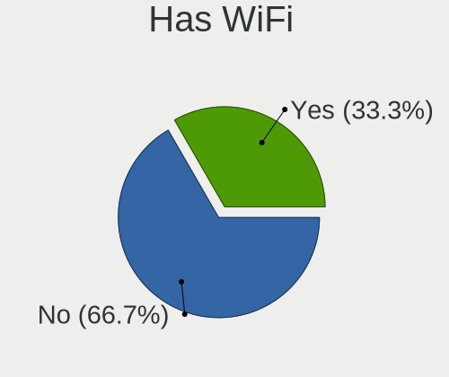
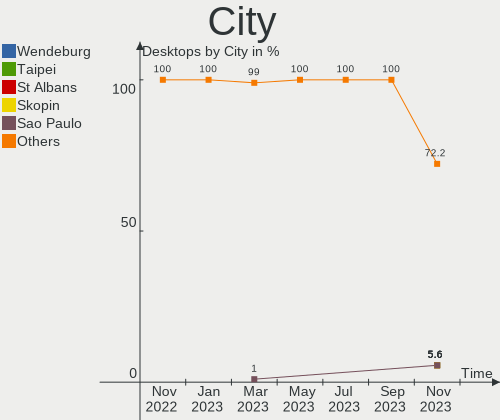
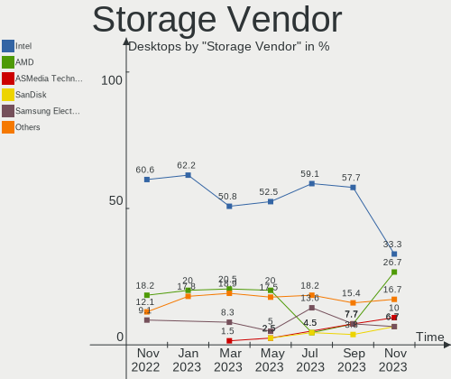
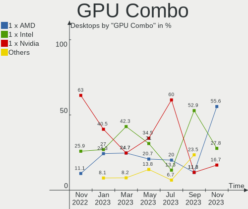
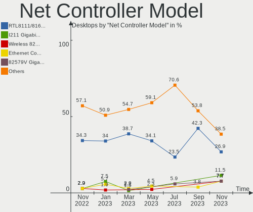
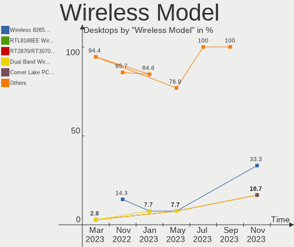
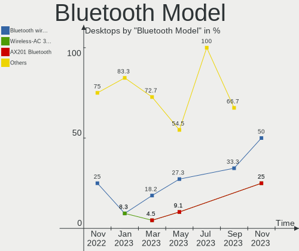
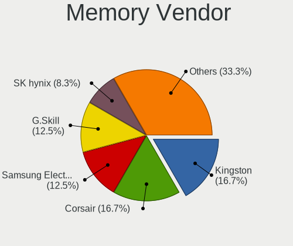
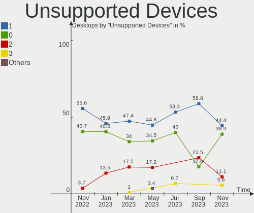

helloSystem - Hardware Trends (Desktops)
----------------------------------------

A project to identify most popular hardware characteristics and track their change
over time based on data collected by BSD users at https://BSD-Hardware.info.

Anyone can contribute to this report by the [hw-probe](https://github.com/linuxhw/hw-probe/blob/master/INSTALL.BSD.md) tool:

    hw-probe -all -upload

This report is for one last month. Overall report since the beginning of time: [TestCoverage](https://github.com/bsdhw/TestCoverage)

Period: May, 2022.

Contents
--------

* [ System ](#system)
  - [ OS                       ](#os)
  - [ OS Family                ](#os-family)
  - [ Arch                     ](#arch)
  - [ DE                       ](#de)
  - [ Display Server           ](#display-server)
  - [ Display Manager          ](#display-manager)
  - [ OS Lang                  ](#os-lang)
  - [ Boot Mode                ](#boot-mode)
  - [ Filesystem               ](#filesystem)
  - [ Part. scheme             ](#part-scheme)

* [ Board ](#board)
  - [ Vendor                   ](#vendor)
  - [ Model                    ](#model)
  - [ Model Family             ](#model-family)
  - [ MFG Year                 ](#mfg-year)
  - [ Form Factor              ](#form-factor)
  - [ Coreboot                 ](#coreboot)
  - [ RAM Size                 ](#ram-size)
  - [ RAM Used                 ](#ram-used)
  - [ Total Drives             ](#total-drives)
  - [ Has CD-ROM               ](#has-cd-rom)
  - [ Has Ethernet             ](#has-ethernet)
  - [ Has WiFi                 ](#has-wifi)
  - [ Has Bluetooth            ](#has-bluetooth)

* [ Location ](#location)
  - [ Country                  ](#country)
  - [ City                     ](#city)

* [ Drives ](#drives)
  - [ Drive Vendor             ](#drive-vendor)
  - [ Drive Model              ](#drive-model)
  - [ HDD Vendor               ](#hdd-vendor)
  - [ SSD Vendor               ](#ssd-vendor)
  - [ Drive Kind               ](#drive-kind)
  - [ Drive Connector          ](#drive-connector)
  - [ Drive Size               ](#drive-size)
  - [ Space Total              ](#space-total)
  - [ Space Used               ](#space-used)
  - [ Malfunc. Drives          ](#malfunc-drives)
  - [ Malfunc. Drive Vendor    ](#malfunc-drive-vendor)
  - [ Malfunc. HDD Vendor      ](#malfunc-hdd-vendor)
  - [ Malfunc. Drive Kind      ](#malfunc-drive-kind)
  - [ Failed Drives            ](#failed-drives)
  - [ Failed Drive Vendor      ](#failed-drive-vendor)
  - [ Drive Status             ](#drive-status)

* [ Storage controller ](#storage-controller)
  - [ Storage Vendor           ](#storage-vendor)
  - [ Storage Model            ](#storage-model)
  - [ Storage Kind             ](#storage-kind)

* [ Processor ](#processor)
  - [ CPU Vendor               ](#cpu-vendor)
  - [ CPU Model                ](#cpu-model)
  - [ CPU Model Family         ](#cpu-model-family)
  - [ CPU Cores                ](#cpu-cores)
  - [ CPU Sockets              ](#cpu-sockets)
  - [ CPU Threads              ](#cpu-threads)
  - [ CPU Microarch            ](#cpu-microarch)

* [ Graphics ](#graphics)
  - [ GPU Vendor               ](#gpu-vendor)
  - [ GPU Model                ](#gpu-model)
  - [ GPU Combo                ](#gpu-combo)
  - [ GPU Driver               ](#gpu-driver)
  - [ GPU Memory               ](#gpu-memory)

* [ Monitor ](#monitor)
  - [ Monitor Vendor           ](#monitor-vendor)
  - [ Monitor Model            ](#monitor-model)
  - [ Monitor Resolution       ](#monitor-resolution)
  - [ Monitor Diagonal         ](#monitor-diagonal)
  - [ Monitor Width            ](#monitor-width)
  - [ Aspect Ratio             ](#aspect-ratio)
  - [ Monitor Area             ](#monitor-area)
  - [ Pixel Density            ](#pixel-density)
  - [ Multiple Monitors        ](#multiple-monitors)

* [ Network ](#network)
  - [ Net Controller Vendor    ](#net-controller-vendor)
  - [ Net Controller Model     ](#net-controller-model)
  - [ Wireless Vendor          ](#wireless-vendor)
  - [ Wireless Model           ](#wireless-model)
  - [ Ethernet Vendor          ](#ethernet-vendor)
  - [ Ethernet Model           ](#ethernet-model)
  - [ Net Controller Kind      ](#net-controller-kind)
  - [ Used Controller          ](#used-controller)
  - [ NICs                     ](#nics)
  - [ IPv6                     ](#ipv6)

* [ Bluetooth ](#bluetooth)
  - [ Bluetooth Vendor         ](#bluetooth-vendor)
  - [ Bluetooth Model          ](#bluetooth-model)

* [ Sound ](#sound)
  - [ Sound Vendor             ](#sound-vendor)
  - [ Sound Model              ](#sound-model)

* [ Memory ](#memory)
  - [ Memory Vendor            ](#memory-vendor)
  - [ Memory Model             ](#memory-model)
  - [ Memory Kind              ](#memory-kind)
  - [ Memory Form Factor       ](#memory-form-factor)
  - [ Memory Size              ](#memory-size)
  - [ Memory Speed             ](#memory-speed)

* [ Printers & scanners ](#printers--scanners)
  - [ Printer Vendor           ](#printer-vendor)
  - [ Printer Model            ](#printer-model)
  - [ Scanner Vendor           ](#scanner-vendor)
  - [ Scanner Model            ](#scanner-model)

* [ Camera ](#camera)
  - [ Camera Vendor            ](#camera-vendor)
  - [ Camera Model             ](#camera-model)

* [ Security ](#security)
  - [ Fingerprint Vendor       ](#fingerprint-vendor)
  - [ Fingerprint Model        ](#fingerprint-model)
  - [ Chipcard Vendor          ](#chipcard-vendor)
  - [ Chipcard Model           ](#chipcard-model)

* [ Unsupported ](#unsupported)
  - [ Unsupported Devices      ](#unsupported-devices)
  - [ Unsupported Device Types ](#unsupported-device-types)

System
------

OS
--

Installed operating systems

| Name              | Desktops | Percent |
|-------------------|----------|---------|
| helloSystem 0.7.0 | 16       | 94.12%  |
| helloSystem 0.8.0 | 1        | 5.88%   |

OS Family
---------

OS without a version

| Name        | Desktops | Percent |
|-------------|----------|---------|
| helloSystem | 17       | 100%    |

Arch
----

OS architecture (x86_64, i586, etc.)

| Name  | Desktops | Percent |
|-------|----------|---------|
| amd64 | 17       | 100%    |

DE
--

Desktop Environment

| Name         | Desktops | Percent |
|--------------|----------|---------|
| helloDesktop | 17       | 100%    |

Display Server
--------------

X11 or Wayland

| Name | Desktops | Percent |
|------|----------|---------|
| X11  | 17       | 100%    |

Display Manager
---------------

SDDM, LightDM, etc.

| Name | Desktops | Percent |
|------|----------|---------|
| SLiM | 17       | 100%    |

OS Lang
-------

Language

| Lang  | Desktops | Percent |
|-------|----------|---------|
| en_US | 17       | 100%    |

Boot Mode
---------

EFI or BIOS

| Mode | Desktops | Percent |
|------|----------|---------|
| EFI  | 17       | 100%    |

Filesystem
----------

Type of filesystem

| Type   | Desktops | Percent |
|--------|----------|---------|
| Cd9660 | 11       | 64.71%  |
| Zfs    | 6        | 35.29%  |

Part. scheme
------------

Scheme of partitioning

| Type | Desktops | Percent |
|------|----------|---------|
| GPT  | 17       | 100%    |

Board
-----

Vendor
------

Motherboard manufacturer

| Name                | Desktops | Percent |
|---------------------|----------|---------|
| Gigabyte Technology | 5        | 29.41%  |
| ASUSTek Computer    | 5        | 29.41%  |
| Dell                | 3        | 17.65%  |
| T-bao               | 1        | 5.88%   |
| Positivo            | 1        | 5.88%   |
| OEM                 | 1        | 5.88%   |
| Lenovo              | 1        | 5.88%   |

Model
-----

Motherboard model

| Name                        | Desktops | Percent |
|-----------------------------|----------|---------|
| T-bao MINI PC               | 1        | 5.88%   |
| Positivo POS-PIQ77CL        | 1        | 5.88%   |
| OEM B85 JHS359              | 1        | 5.88%   |
| Lenovo YangTianA8800T       | 1        | 5.88%   |
| Gigabyte F2A88XM-HD3        | 1        | 5.88%   |
| Gigabyte F2A68HM-H          | 1        | 5.88%   |
| Gigabyte B75M-D3H           | 1        | 5.88%   |
| Gigabyte AB350N-Gaming WIFI | 1        | 5.88%   |
| Gigabyte A320M-H            | 1        | 5.88%   |
| Dell Precision T1700        | 1        | 5.88%   |
| Dell OptiPlex 960           | 1        | 5.88%   |
| Dell OptiPlex 7040          | 1        | 5.88%   |
| ASUS TUF X470-PLUS GAMING   | 1        | 5.88%   |
| ASUS PRIME X570-P           | 1        | 5.88%   |
| ASUS P8Z77-V LX             | 1        | 5.88%   |
| ASUS P5LD2                  | 1        | 5.88%   |
| ASUS K30AM-J                | 1        | 5.88%   |

Model Family
------------

Motherboard model prefix

| Name                   | Desktops | Percent |
|------------------------|----------|---------|
| Dell OptiPlex          | 2        | 11.76%  |
| T-bao MINI             | 1        | 5.88%   |
| Positivo POS-PIQ77CL   | 1        | 5.88%   |
| OEM B85                | 1        | 5.88%   |
| Lenovo YangTianA8800T  | 1        | 5.88%   |
| Gigabyte F2A88XM-HD3   | 1        | 5.88%   |
| Gigabyte F2A68HM-H     | 1        | 5.88%   |
| Gigabyte B75M-D3H      | 1        | 5.88%   |
| Gigabyte AB350N-Gaming | 1        | 5.88%   |
| Gigabyte A320M-H       | 1        | 5.88%   |
| Dell Precision         | 1        | 5.88%   |
| ASUS TUF               | 1        | 5.88%   |
| ASUS PRIME             | 1        | 5.88%   |
| ASUS P8Z77-V           | 1        | 5.88%   |
| ASUS P5LD2             | 1        | 5.88%   |
| ASUS K30AM-J           | 1        | 5.88%   |

MFG Year
--------

Motherboard manufacture year

| Year | Desktops | Percent |
|------|----------|---------|
| 2014 | 3        | 17.65%  |
| 2012 | 3        | 17.65%  |
| 2020 | 2        | 11.76%  |
| 2019 | 2        | 11.76%  |
| 2009 | 2        | 11.76%  |
| 2018 | 1        | 5.88%   |
| 2017 | 1        | 5.88%   |
| 2016 | 1        | 5.88%   |
| 2015 | 1        | 5.88%   |
| 2013 | 1        | 5.88%   |

Form Factor
-----------

Physical design of the computer

| Name    | Desktops | Percent |
|---------|----------|---------|
| Desktop | 17       | 100%    |

Coreboot
--------

Have coreboot on board

| Used | Desktops | Percent |
|------|----------|---------|
| No   | 17       | 100%    |

RAM Size
--------

Total RAM memory

| Size in GB | Desktops | Percent |
|------------|----------|---------|
| 8.01-16.0  | 7        | 41.18%  |
| 16.01-24.0 | 6        | 35.29%  |
| 4.01-8.0   | 3        | 17.65%  |
| 2.01-3.0   | 1        | 5.88%   |

RAM Used
--------

Used RAM memory

| Used GB  | Desktops | Percent |
|----------|----------|---------|
| 0.51-1.0 | 9        | 52.94%  |
| 0.01-0.5 | 8        | 47.06%  |

Total Drives
------------

Number of drives on board

| Drives | Desktops | Percent |
|--------|----------|---------|
| 1      | 13       | 76.47%  |
| 2      | 3        | 17.65%  |
| 0      | 1        | 5.88%   |

Has CD-ROM
----------

Has CD-ROM on board

| Presented | Desktops | Percent |
|-----------|----------|---------|
| No        | 10       | 58.82%  |
| Yes       | 7        | 41.18%  |

Has Ethernet
------------

Has Ethernet on board

| Presented | Desktops | Percent |
|-----------|----------|---------|
| Yes       | 17       | 100%    |

Has WiFi
--------

Has WiFi module

| Presented | Desktops | Percent |
|-----------|----------|---------|
| No        | 9        | 52.94%  |
| Yes       | 8        | 47.06%  |

Has Bluetooth
-------------

Has Bluetooth module

| Presented | Desktops | Percent |
|-----------|----------|---------|
| No        | 14       | 82.35%  |
| Yes       | 3        | 17.65%  |

Location
--------

Country
-------

Geographic location (country)

| Country      | Desktops | Percent |
|--------------|----------|---------|
| Russia       | 3        | 17.65%  |
| China        | 3        | 17.65%  |
| Mexico       | 2        | 11.76%  |
| USA          | 1        | 5.88%   |
| Turkey       | 1        | 5.88%   |
| South Africa | 1        | 5.88%   |
| Serbia       | 1        | 5.88%   |
| Norway       | 1        | 5.88%   |
| New Zealand  | 1        | 5.88%   |
| Italy        | 1        | 5.88%   |
| Canada       | 1        | 5.88%   |
| Brazil       | 1        | 5.88%   |

City
----

Geographic location (city)

| City                  | Desktops | Percent |
|-----------------------|----------|---------|
| Moscow                | 2        | 11.76%  |
| Zhengzhou             | 1        | 5.88%   |
| Tromsø               | 1        | 5.88%   |
| Somerset West         | 1        | 5.88%   |
| San Luis Potosí City | 1        | 5.88%   |
| Saint-Colomban        | 1        | 5.88%   |
| New Plymouth          | 1        | 5.88%   |
| Monterrey             | 1        | 5.88%   |
| Mladenovac            | 1        | 5.88%   |
| Izhevsk               | 1        | 5.88%   |
| Istanbul              | 1        | 5.88%   |
| Independence          | 1        | 5.88%   |
| Gaoleshan             | 1        | 5.88%   |
| Cidade Universitária | 1        | 5.88%   |
| Chengdu               | 1        | 5.88%   |
| Adelfia               | 1        | 5.88%   |

Drives
------

Drive Vendor
------------

Hard drive vendors

| Vendor              | Desktops | Drives | Percent |
|---------------------|----------|--------|---------|
| Seagate             | 4        | 4      | 21.05%  |
| Kingston            | 3        | 3      | 15.79%  |
| WDC                 | 2        | 2      | 10.53%  |
| SanDisk             | 2        | 2      | 10.53%  |
| Samsung Electronics | 2        | 2      | 10.53%  |
| XPG                 | 1        | 1      | 5.26%   |
| Toshiba             | 1        | 1      | 5.26%   |
| Silicon Motion      | 1        | 1      | 5.26%   |
| LITEON              | 1        | 1      | 5.26%   |
| Intel               | 1        | 1      | 5.26%   |
| Hitachi             | 1        | 1      | 5.26%   |

Drive Model
-----------

Hard drive models

| Model                            | Desktops | Percent |
|----------------------------------|----------|---------|
| XPG GAMMIX S11 Pro 256GB         | 1        | 5.26%   |
| WDC WD5000AZLX-00K2TA0 500GB     | 1        | 5.26%   |
| WDC WD3200AAJS-60Z0A0 320GB      | 1        | 5.26%   |
| Toshiba MQ01ABD050 500GB         | 1        | 5.26%   |
| Silicon Motion ASint AS806 128GB | 1        | 5.26%   |
| Seagate ST9500325AS 500GB        | 1        | 5.26%   |
| Seagate ST3250410AS 250GB        | 1        | 5.26%   |
| Seagate ST31000520AS 1TB         | 1        | 5.26%   |
| Seagate ST1000DM010-2EP102 1TB   | 1        | 5.26%   |
| SanDisk SDSA5GK-016G-1006 16GB   | 1        | 5.26%   |
| SanDisk SD6SF1M-032G-1006 32GB   | 1        | 5.26%   |
| Samsung SSD 750 EVO 120GB        | 1        | 5.26%   |
| Samsung MZVLW128HEGR-00000 128GB | 1        | 5.26%   |
| LITEON LCH-256V2S 256GB          | 1        | 5.26%   |
| Kingston SV300S37A120G 120GB     | 1        | 5.26%   |
| Kingston SA400S37120G 120GB      | 1        | 5.26%   |
| Kingston SA2000M81000G 1TB       | 1        | 5.26%   |
| Intel SSDSA2CW120G3 120GB        | 1        | 5.26%   |
| Hitachi HDT725025VLA380 250GB    | 1        | 5.26%   |

HDD Vendor
----------

Hard disk drive vendors

| Vendor  | Desktops | Drives | Percent |
|---------|----------|--------|---------|
| Seagate | 4        | 4      | 50%     |
| WDC     | 2        | 2      | 25%     |
| Toshiba | 1        | 1      | 12.5%   |
| Hitachi | 1        | 1      | 12.5%   |

SSD Vendor
----------

Solid state drive vendors

| Vendor              | Desktops | Drives | Percent |
|---------------------|----------|--------|---------|
| SanDisk             | 2        | 2      | 28.57%  |
| Kingston            | 2        | 2      | 28.57%  |
| Samsung Electronics | 1        | 1      | 14.29%  |
| LITEON              | 1        | 1      | 14.29%  |
| Intel               | 1        | 1      | 14.29%  |

Drive Kind
----------

HDD or SSD

| Kind | Desktops | Drives | Percent |
|------|----------|--------|---------|
| HDD  | 8        | 8      | 44.44%  |
| SSD  | 6        | 7      | 33.33%  |
| NVMe | 4        | 4      | 22.22%  |

Drive Connector
---------------

SATA, SAS, NVMe, etc.

| Type | Desktops | Drives | Percent |
|------|----------|--------|---------|
| SATA | 13       | 15     | 76.47%  |
| NVMe | 4        | 4      | 23.53%  |

Drive Size
----------

Size of hard drive

| Size in TB | Desktops | Drives | Percent |
|------------|----------|--------|---------|
| 0.01-0.5   | 11       | 13     | 84.62%  |
| 0.51-1.0   | 2        | 2      | 15.38%  |

Space Total
-----------

Amount of disk space available on the file system

| Size in GB | Desktops | Percent |
|------------|----------|---------|
| 1-20       | 12       | 70.59%  |
| 251-500    | 2        | 11.76%  |
| 101-250    | 2        | 11.76%  |
| 501-1000   | 1        | 5.88%   |

Space Used
----------

Amount of used disk space

| Used GB | Desktops | Percent |
|---------|----------|---------|
| 1-20    | 17       | 100%    |

Malfunc. Drives
---------------

Drive models with a malfunction

| Model                    | Desktops | Drives | Percent |
|--------------------------|----------|--------|---------|
| Seagate ST31000520AS 1TB | 1        | 1      | 100%    |

Malfunc. Drive Vendor
---------------------

Vendors of faulty drives

| Vendor  | Desktops | Drives | Percent |
|---------|----------|--------|---------|
| Seagate | 1        | 1      | 100%    |

Malfunc. HDD Vendor
-------------------

Vendors of faulty HDD drives

| Vendor  | Desktops | Drives | Percent |
|---------|----------|--------|---------|
| Seagate | 1        | 1      | 100%    |

Malfunc. Drive Kind
-------------------

Kinds of faulty drives

| Kind | Desktops | Drives | Percent |
|------|----------|--------|---------|
| HDD  | 1        | 1      | 100%    |

Failed Drives
-------------

Failed drive models

Zero info for selected period =(

Failed Drive Vendor
-------------------

Failed drive vendors

Zero info for selected period =(

Drive Status
------------

Number of failed and malfunc. drives

| Status  | Desktops | Drives | Percent |
|---------|----------|--------|---------|
| Works   | 15       | 18     | 93.75%  |
| Malfunc | 1        | 1      | 6.25%   |

Storage controller
------------------

Storage Vendor
--------------

Storage controller vendors

| Vendor                      | Desktops | Percent |
|-----------------------------|----------|---------|
| Intel                       | 9        | 42.86%  |
| AMD                         | 7        | 33.33%  |
| Silicon Motion              | 1        | 4.76%   |
| Samsung Electronics         | 1        | 4.76%   |
| Kingston Technology Company | 1        | 4.76%   |
| Broadcom / LSI              | 1        | 4.76%   |
| ADATA Technology            | 1        | 4.76%   |

Storage Model
-------------

Storage controller models

| Model                                                                          | Desktops | Percent |
|--------------------------------------------------------------------------------|----------|---------|
| AMD FCH SATA Controller [AHCI mode]                                            | 6        | 23.08%  |
| Intel 7 Series/C210 Series Chipset Family 6-port SATA Controller [AHCI mode]   | 4        | 15.38%  |
| Silicon Motion SM2263EN/SM2263XT SSD Controller                                | 1        | 3.85%   |
| Samsung NVMe SSD Controller SM961/PM961/SM963                                  | 1        | 3.85%   |
| Kingston Company A2000 NVMe SSD                                                | 1        | 3.85%   |
| Intel Q170/Q150/B150/H170/H110/Z170/CM236 Chipset SATA Controller [AHCI Mode]  | 1        | 3.85%   |
| Intel NM10/ICH7 Family SATA Controller [AHCI mode]                             | 1        | 3.85%   |
| Intel Atom Processor E3800 Series SATA AHCI Controller                         | 1        | 3.85%   |
| Intel 82801JD/DO (ICH10 Family) SATA AHCI Controller                           | 1        | 3.85%   |
| Intel 82801G (ICH7 Family) IDE Controller                                      | 1        | 3.85%   |
| Intel 8 Series/C220 Series Chipset Family 6-port SATA Controller 1 [AHCI mode] | 1        | 3.85%   |
| Intel 4 Series Chipset PT IDER Controller                                      | 1        | 3.85%   |
| Broadcom / LSI MegaRAID SAS 2208 [Thunderbolt]                                 | 1        | 3.85%   |
| AMD FCH SATA Controller [IDE mode]                                             | 1        | 3.85%   |
| AMD FCH SATA Controller D                                                      | 1        | 3.85%   |
| AMD 400 Series Chipset SATA Controller                                         | 1        | 3.85%   |
| AMD 300 Series Chipset SATA Controller                                         | 1        | 3.85%   |
| ADATA XPG SX8200 Pro PCIe Gen3x4 M.2 2280 Solid State Drive                    | 1        | 3.85%   |

Storage Kind
------------

Kind of storage controller (IDE, SATA, NVMe, SAS, ...)

| Kind | Desktops | Percent |
|------|----------|---------|
| SATA | 15       | 65.22%  |
| NVMe | 4        | 17.39%  |
| IDE  | 3        | 13.04%  |
| RAID | 1        | 4.35%   |

Processor
---------

CPU Vendor
----------

Processor vendors

| Vendor | Desktops | Percent |
|--------|----------|---------|
| Intel  | 10       | 58.82%  |
| AMD    | 7        | 41.18%  |

CPU Model
---------

Processor models

| Model                                         | Desktops | Percent |
|-----------------------------------------------|----------|---------|
| AMD Ryzen 7 3700X 8-Core Processor            | 2        | 11.76%  |
| Intel Xeon CPU E3-1270 v3 @ 3.50GHz           | 1        | 5.88%   |
| Intel Pentium D CPU 3.00GHz                   | 1        | 5.88%   |
| Intel Pentium CPU G3460T @ 3.00GHz            | 1        | 5.88%   |
| Intel Core i7-6700 CPU @ 3.40GHz              | 1        | 5.88%   |
| Intel Core i7-3770 CPU @ 3.40GHz              | 1        | 5.88%   |
| Intel Core i5-3570 CPU @ 3.40GHz              | 1        | 5.88%   |
| Intel Core i5-3470 CPU @ 3.20GHz              | 1        | 5.88%   |
| Intel Core i5-3450 CPU @ 3.10GHz              | 1        | 5.88%   |
| Intel Core 2 Duo                              | 1        | 5.88%   |
| Intel Celeron CPU J1800 @ 2.41GHz             | 1        | 5.88%   |
| AMD Ryzen 5 2600 Six-Core Processor           | 1        | 5.88%   |
| AMD Ryzen 5 1600X Six-Core Processor          | 1        | 5.88%   |
| AMD Ryzen 3 2200U with Radeon Vega Mobile Gfx | 1        | 5.88%   |
| AMD A6-5400K APU with Radeon HD Graphics      | 1        | 5.88%   |
| AMD A10-6800K APU with Radeon HD Graphics     | 1        | 5.88%   |

CPU Model Family
----------------

Processor model prefix

| Model            | Desktops | Percent |
|------------------|----------|---------|
| Intel Core i5    | 3        | 17.65%  |
| Intel Core i7    | 2        | 11.76%  |
| AMD Ryzen 7      | 2        | 11.76%  |
| AMD Ryzen 5      | 2        | 11.76%  |
| Intel Xeon       | 1        | 5.88%   |
| Intel Pentium D  | 1        | 5.88%   |
| Intel Pentium    | 1        | 5.88%   |
| Intel Core 2 Duo | 1        | 5.88%   |
| Intel Celeron    | 1        | 5.88%   |
| AMD Ryzen 3      | 1        | 5.88%   |
| AMD A6           | 1        | 5.88%   |
| AMD A10          | 1        | 5.88%   |

CPU Cores
---------

Number of processor cores

| Number  | Desktops | Percent |
|---------|----------|---------|
| 4       | 8        | 47.06%  |
| 2       | 4        | 23.53%  |
| 16      | 2        | 11.76%  |
| 12      | 2        | 11.76%  |
| Unknown | 1        | 5.88%   |

CPU Sockets
-----------

Number of sockets

| Number | Desktops | Percent |
|--------|----------|---------|
| 1      | 17       | 100%    |

CPU Threads
-----------

Threads per core (Hyper-Threading)

| Number  | Desktops | Percent |
|---------|----------|---------|
| 1       | 13       | 76.47%  |
| 2       | 3        | 17.65%  |
| Unknown | 1        | 5.88%   |

CPU Microarch
-------------

Microarchitecture

| Name       | Desktops | Percent |
|------------|----------|---------|
| IvyBridge  | 4        | 23.53%  |
| Zen 2      | 2        | 11.76%  |
| Zen        | 2        | 11.76%  |
| Piledriver | 2        | 11.76%  |
| Haswell    | 2        | 11.76%  |
| Zen+       | 1        | 5.88%   |
| Skylake    | 1        | 5.88%   |
| Silvermont | 1        | 5.88%   |
| Penryn     | 1        | 5.88%   |
| NetBurst   | 1        | 5.88%   |

Graphics
--------

GPU Vendor
----------

Vendors of graphics cards

| Vendor | Desktops | Percent |
|--------|----------|---------|
| Intel  | 7        | 41.18%  |
| Nvidia | 6        | 35.29%  |
| AMD    | 4        | 23.53%  |

GPU Model
---------

Graphics card models

| Model                                                                       | Desktops | Percent |
|-----------------------------------------------------------------------------|----------|---------|
| Intel Xeon E3-1200 v2/3rd Gen Core processor Graphics Controller            | 3        | 17.65%  |
| Nvidia TU106 [GeForce RTX 2060 SUPER]                                       | 1        | 5.88%   |
| Nvidia GM206 [GeForce GTX 960]                                              | 1        | 5.88%   |
| Nvidia GK208B [GeForce GT 710]                                              | 1        | 5.88%   |
| Nvidia GK208 [GeForce GT 635]                                               | 1        | 5.88%   |
| Nvidia GK107GL [Quadro K2000]                                               | 1        | 5.88%   |
| Nvidia G73 [GeForce 7600 GS]                                                | 1        | 5.88%   |
| Intel Xeon E3-1200 v3/4th Gen Core Processor Integrated Graphics Controller | 1        | 5.88%   |
| Intel IvyBridge GT2 [HD Graphics 4000]                                      | 1        | 5.88%   |
| Intel Atom Processor Z36xxx/Z37xxx Series Graphics & Display                | 1        | 5.88%   |
| Intel 4 Series Chipset Integrated Graphics Controller                       | 1        | 5.88%   |
| AMD Trinity 2 [Radeon HD 7540D]                                             | 1        | 5.88%   |
| AMD RV730 PRO [Radeon HD 4650]                                              | 1        | 5.88%   |
| AMD Raven Ridge [Radeon Vega Series / Radeon Vega Mobile Series]            | 1        | 5.88%   |
| AMD Navi 10 [Radeon RX 5600 OEM/5600 XT / 5700/5700 XT]                     | 1        | 5.88%   |

GPU Combo
---------

Combinations of graphics cards

| Name       | Desktops | Percent |
|------------|----------|---------|
| 1 x Nvidia | 6        | 35.29%  |
| 1 x Intel  | 6        | 35.29%  |
| 1 x AMD    | 4        | 23.53%  |
| 2 x Intel  | 1        | 5.88%   |

GPU Driver
----------

Free vs proprietary

| Driver      | Desktops | Percent |
|-------------|----------|---------|
| Free        | 12       | 70.59%  |
| Proprietary | 5        | 29.41%  |

GPU Memory
----------

Total video memory

| Size in GB | Desktops | Percent |
|------------|----------|---------|
| Unknown    | 9        | 52.94%  |
| 1.01-2.0   | 3        | 17.65%  |
| 7.01-8.0   | 2        | 11.76%  |
| 3.01-4.0   | 1        | 5.88%   |
| 0.51-1.0   | 1        | 5.88%   |
| 0.01-0.5   | 1        | 5.88%   |

Monitor
-------

Monitor Vendor
--------------

Monitor vendors

| Vendor              | Desktops | Percent |
|---------------------|----------|---------|
| Goldstar            | 3        | 20%     |
| Samsung Electronics | 2        | 13.33%  |
| AOC                 | 2        | 13.33%  |
| ZL_                 | 1        | 6.67%   |
| MSI                 | 1        | 6.67%   |
| LTV                 | 1        | 6.67%   |
| Lenovo              | 1        | 6.67%   |
| Hewlett-Packard     | 1        | 6.67%   |
| Fujitsu Siemens     | 1        | 6.67%   |
| Dell                | 1        | 6.67%   |
| Acer                | 1        | 6.67%   |

Monitor Model
-------------

Monitor models

| Model                                                             | Desktops | Percent |
|-------------------------------------------------------------------|----------|---------|
| ZL_ zhuoyue-DP ZL_2716 2560x1440 600x330mm 27.0-inch              | 1        | 6.67%   |
| Samsung Electronics SyncMaster SAM05B0 1920x1080                  | 1        | 6.67%   |
| Samsung Electronics S24D332 SAM0F5E 1920x1080 530x300mm 24.0-inch | 1        | 6.67%   |
| MSI MAG271C MSI3FA6 1920x1080 600x340mm 27.2-inch                 | 1        | 6.67%   |
| LTV LTV1280M1A LTV0A3C 1024x768 800x450mm 36.1-inch               | 1        | 6.67%   |
| Lenovo G27q-20 LEN66C3 2560x1440 600x340mm 27.2-inch              | 1        | 6.67%   |
| Hewlett-Packard 23xw HWP318A 1920x1080 510x290mm 23.1-inch        | 1        | 6.67%   |
| Goldstar LCD Monitor GSM5AB6 1920x1080 480x270mm 21.7-inch        | 1        | 6.67%   |
| Goldstar E2411 GSM583B 1920x1080 530x300mm 24.0-inch              | 1        | 6.67%   |
| Goldstar E1942 GSM4C09 1366x768 410x230mm 18.5-inch               | 1        | 6.67%   |
| Fujitsu Siemens E19-7 FUS0757 1280x1024 380x300mm 19.1-inch       | 1        | 6.67%   |
| Dell S2418HN/NX DEL4123 1920x1080 530x300mm 24.0-inch             | 1        | 6.67%   |
| AOC Q27P1B AOC2701 1920x1080 600x340mm 27.2-inch                  | 1        | 6.67%   |
| AOC F19 AOC1900 1366x768 410x230mm 18.5-inch                      | 1        | 6.67%   |
| Acer G195WV ACR0263 1440x900 410x260mm 19.1-inch                  | 1        | 6.67%   |

Monitor Resolution
------------------

Monitor screen resolution

| Resolution       | Desktops | Percent |
|------------------|----------|---------|
| 1920x1080 (FHD)  | 8        | 53.33%  |
| 2560x1440 (QHD)  | 2        | 13.33%  |
| 1366x768 (WXGA)  | 2        | 13.33%  |
| 1440x900 (WXGA+) | 1        | 6.67%   |
| 1280x1024 (SXGA) | 1        | 6.67%   |
| 1024x768 (XGA)   | 1        | 6.67%   |

Monitor Diagonal
----------------

Diagonal size in inches

| Inches  | Desktops | Percent |
|---------|----------|---------|
| 27      | 4        | 26.67%  |
| 24      | 3        | 20%     |
| 19      | 2        | 13.33%  |
| 18      | 2        | 13.33%  |
| 36      | 1        | 6.67%   |
| 23      | 1        | 6.67%   |
| 21      | 1        | 6.67%   |
| Unknown | 1        | 6.67%   |

Monitor Width
-------------

Physical width

| Width in mm | Desktops | Percent |
|-------------|----------|---------|
| 501-600     | 8        | 53.33%  |
| 401-500     | 4        | 26.67%  |
| 701-800     | 1        | 6.67%   |
| 351-400     | 1        | 6.67%   |
| Unknown     | 1        | 6.67%   |

Aspect Ratio
------------

Proportional relationship between the width and the height

| Ratio | Desktops | Percent |
|-------|----------|---------|
| 16/9  | 13       | 86.67%  |
| 5/4   | 1        | 6.67%   |
| 16/10 | 1        | 6.67%   |

Monitor Area
------------

Area in inch²

| Area in inch² | Desktops | Percent |
|----------------|----------|---------|
| 201-250        | 5        | 33.33%  |
| 301-350        | 4        | 26.67%  |
| 151-200        | 2        | 13.33%  |
| 141-150        | 2        | 13.33%  |
| 501-1000       | 1        | 6.67%   |
| Unknown        | 1        | 6.67%   |

Pixel Density
-------------

Pixels per inch

| Density | Desktops | Percent |
|---------|----------|---------|
| 51-100  | 10       | 66.67%  |
| 101-120 | 3        | 20%     |
| 1-50    | 1        | 6.67%   |
| Unknown | 1        | 6.67%   |

Multiple Monitors
-----------------

Total monitors connected

| Total | Desktops | Percent |
|-------|----------|---------|
| 1     | 16       | 94.12%  |
| 0     | 1        | 5.88%   |

Network
-------

Net Controller Vendor
---------------------

Controller vendors

| Vendor                   | Desktops | Percent |
|--------------------------|----------|---------|
| Realtek Semiconductor    | 12       | 54.55%  |
| Intel                    | 7        | 31.82%  |
| Qualcomm Atheros         | 1        | 4.55%   |
| Marvell Technology Group | 1        | 4.55%   |
| Edimax Technology        | 1        | 4.55%   |

Net Controller Model
--------------------

Controller models

| Model                                                             | Desktops | Percent |
|-------------------------------------------------------------------|----------|---------|
| Realtek RTL8111/8168/8411 PCI Express Gigabit Ethernet Controller | 11       | 40.74%  |
| Realtek RTL8812AE 802.11ac PCIe Wireless Network Adapter          | 2        | 7.41%   |
| Intel 82579LM Gigabit Network Connection (Lewisville)             | 2        | 7.41%   |
| Realtek RTL8821CE 802.11ac PCIe Wireless Network Adapter          | 1        | 3.7%    |
| Realtek RTL8188EUS 802.11n Wireless Network Adapter               | 1        | 3.7%    |
| Realtek RTL8188CUS 802.11n WLAN Adapter                           | 1        | 3.7%    |
| Realtek RTL8188CE 802.11b/g/n WiFi Adapter                        | 1        | 3.7%    |
| Qualcomm Atheros AR93xx Wireless Network Adapter                  | 1        | 3.7%    |
| Marvell Group 88E8053 PCI-E Gigabit Ethernet Controller           | 1        | 3.7%    |
| Intel Wireless 3165                                               | 1        | 3.7%    |
| Intel Wi-Fi 6 AX200                                               | 1        | 3.7%    |
| Intel Ethernet Connection I217-LM                                 | 1        | 3.7%    |
| Intel Ethernet Connection (2) I219-LM                             | 1        | 3.7%    |
| Intel 82567LM-3 Gigabit Network Connection                        | 1        | 3.7%    |
| Edimax EW-7612UAn V2 802.11n Wireless Adapter [Realtek RTL8192CU] | 1        | 3.7%    |

Wireless Vendor
---------------

Wireless vendors

| Vendor                | Desktops | Percent |
|-----------------------|----------|---------|
| Realtek Semiconductor | 5        | 55.56%  |
| Intel                 | 2        | 22.22%  |
| Qualcomm Atheros      | 1        | 11.11%  |
| Edimax Technology     | 1        | 11.11%  |

Wireless Model
--------------

Wireless models

| Model                                                             | Desktops | Percent |
|-------------------------------------------------------------------|----------|---------|
| Realtek RTL8812AE 802.11ac PCIe Wireless Network Adapter          | 2        | 20%     |
| Realtek RTL8821CE 802.11ac PCIe Wireless Network Adapter          | 1        | 10%     |
| Realtek RTL8188EUS 802.11n Wireless Network Adapter               | 1        | 10%     |
| Realtek RTL8188CUS 802.11n WLAN Adapter                           | 1        | 10%     |
| Realtek RTL8188CE 802.11b/g/n WiFi Adapter                        | 1        | 10%     |
| Qualcomm Atheros AR93xx Wireless Network Adapter                  | 1        | 10%     |
| Intel Wireless 3165                                               | 1        | 10%     |
| Intel Wi-Fi 6 AX200                                               | 1        | 10%     |
| Edimax EW-7612UAn V2 802.11n Wireless Adapter [Realtek RTL8192CU] | 1        | 10%     |

Ethernet Vendor
---------------

Ethernet vendors

| Vendor                   | Desktops | Percent |
|--------------------------|----------|---------|
| Realtek Semiconductor    | 11       | 64.71%  |
| Intel                    | 5        | 29.41%  |
| Marvell Technology Group | 1        | 5.88%   |

Ethernet Model
--------------

Ethernet models

| Model                                                             | Desktops | Percent |
|-------------------------------------------------------------------|----------|---------|
| Realtek RTL8111/8168/8411 PCI Express Gigabit Ethernet Controller | 11       | 64.71%  |
| Intel 82579LM Gigabit Network Connection (Lewisville)             | 2        | 11.76%  |
| Marvell Group 88E8053 PCI-E Gigabit Ethernet Controller           | 1        | 5.88%   |
| Intel Ethernet Connection I217-LM                                 | 1        | 5.88%   |
| Intel Ethernet Connection (2) I219-LM                             | 1        | 5.88%   |
| Intel 82567LM-3 Gigabit Network Connection                        | 1        | 5.88%   |

Net Controller Kind
-------------------

Ethernet, WiFi or modem

| Kind     | Desktops | Percent |
|----------|----------|---------|
| Ethernet | 17       | 68%     |
| WiFi     | 8        | 32%     |

Used Controller
---------------

Currently used network controller

| Kind     | Desktops | Percent |
|----------|----------|---------|
| Ethernet | 13       | 100%    |

NICs
----

Total network controllers on board

| Total | Desktops | Percent |
|-------|----------|---------|
| 1     | 9        | 52.94%  |
| 2     | 8        | 47.06%  |

IPv6
----

IPv6 vs IPv4

| Used | Desktops | Percent |
|------|----------|---------|
| No   | 17       | 100%    |

Bluetooth
---------

Bluetooth Vendor
----------------

Controller vendors

| Vendor                | Desktops | Percent |
|-----------------------|----------|---------|
| Intel                 | 2        | 66.67%  |
| Realtek Semiconductor | 1        | 33.33%  |

Bluetooth Model
---------------

Controller models

| Model                              | Desktops | Percent |
|------------------------------------|----------|---------|
| Realtek  Bluetooth Adapter         | 1        | 33.33%  |
| Intel Bluetooth wireless interface | 1        | 33.33%  |
| Intel AX200 Bluetooth              | 1        | 33.33%  |

Sound
-----

Sound Vendor
------------

Sound card vendors

| Vendor       | Desktops | Percent |
|--------------|----------|---------|
| Intel        | 10       | 43.48%  |
| AMD          | 7        | 30.43%  |
| Nvidia       | 5        | 21.74%  |
| Astro Gaming | 1        | 4.35%   |

Sound Model
-----------

Sound card models

| Model                                                                      | Desktops | Percent |
|----------------------------------------------------------------------------|----------|---------|
| Intel 7 Series/C216 Chipset Family High Definition Audio Controller        | 4        | 14.29%  |
| Nvidia GK208 HDMI/DP Audio Controller                                      | 2        | 7.14%   |
| Intel 8 Series/C220 Series Chipset High Definition Audio Controller        | 2        | 7.14%   |
| AMD Starship/Matisse HD Audio Controller                                   | 2        | 7.14%   |
| AMD FCH Azalia Controller                                                  | 2        | 7.14%   |
| AMD Family 17h (Models 00h-0fh) HD Audio Controller                        | 2        | 7.14%   |
| Nvidia TU106 High Definition Audio Controller                              | 1        | 3.57%   |
| Nvidia GM206 High Definition Audio Controller                              | 1        | 3.57%   |
| Nvidia GK107 HDMI Audio Controller                                         | 1        | 3.57%   |
| Intel Xeon E3-1200 v3/4th Gen Core Processor HD Audio Controller           | 1        | 3.57%   |
| Intel NM10/ICH7 Family High Definition Audio Controller                    | 1        | 3.57%   |
| Intel Atom Processor Z36xxx/Z37xxx Series High Definition Audio Controller | 1        | 3.57%   |
| Intel 82801JD/DO (ICH10 Family) HD Audio Controller                        | 1        | 3.57%   |
| Intel 100 Series/C230 Series Chipset Family HD Audio Controller            | 1        | 3.57%   |
| Astro Gaming A50                                                           | 1        | 3.57%   |
| AMD Trinity HDMI Audio Controller                                          | 1        | 3.57%   |
| AMD RV710/730 HDMI Audio [Radeon HD 4000 series]                           | 1        | 3.57%   |
| AMD Raven/Raven2/Fenghuang HDMI/DP Audio Controller                        | 1        | 3.57%   |
| AMD Navi 10 HDMI Audio                                                     | 1        | 3.57%   |
| AMD Family 17h/19h HD Audio Controller                                     | 1        | 3.57%   |

Memory
------

Memory Vendor
-------------

Memory module vendors

| Vendor              | Desktops | Percent |
|---------------------|----------|---------|
| Kingston            | 4        | 20%     |
| Unknown             | 2        | 10%     |
| SK Hynix            | 2        | 10%     |
| Ramaxel Technology  | 2        | 10%     |
| Micron Technology   | 2        | 10%     |
| Corsair             | 2        | 10%     |
| Transcend           | 1        | 5%      |
| Strontium           | 1        | 5%      |
| Samsung Electronics | 1        | 5%      |
| G.Skill             | 1        | 5%      |
| Elpida              | 1        | 5%      |
| A-DATA Technology   | 1        | 5%      |

Memory Model
------------

Memory module models

| Model                                                 | Desktops | Percent |
|-------------------------------------------------------|----------|---------|
| Unknown RAM Module 512MB DIMM SDRAM                   | 1        | 4.55%   |
| Unknown RAM Module 4GB DIMM DDR4 2133MT/s             | 1        | 4.55%   |
| Transcend RAM JM1333KLN-2G 2GB DIMM DDR3 1333MT/s     | 1        | 4.55%   |
| Strontium RAM EVMT2G1333U88S 2GB DIMM DDR3 1333MT/s   | 1        | 4.55%   |
| SK Hynix RAM HMT41GU6MFR8C-PB 8GB DIMM DDR3 1600MT/s  | 1        | 4.55%   |
| SK Hynix RAM HMA41GU6AFR8N-TF 8GB DIMM DDR4 2133MT/s  | 1        | 4.55%   |
| Samsung RAM M378B5173QH0-CK0 4GB DIMM DDR3 1600MT/s   | 1        | 4.55%   |
| Ramaxel RAM RMT3170EB68F9W1600 4GB DIMM DDR3 1600MT/s | 1        | 4.55%   |
| Ramaxel RAM RMR5040ED58E9W1600 4GB DIMM DDR3 1600MT/s | 1        | 4.55%   |
| Micron RAM 8HTF12864AY-800G1 1GB DIMM DDR2 667MT/s    | 1        | 4.55%   |
| Micron RAM 4ATF51264HZ-2G6B1 4GB SODIMM DDR4 1200MT/s | 1        | 4.55%   |
| Kingston RAM Module 1GB DIMM DDR2 667MT/s             | 1        | 4.55%   |
| Kingston RAM KHX1866C10D3/8G 8GB DIMM DDR3 1867MT/s   | 1        | 4.55%   |
| Kingston RAM KF3200C16D4/8GX 8GB DIMM DDR4 2400MT/s   | 1        | 4.55%   |
| Kingston RAM 99U5471-002.A01LF 2GB DIMM DDR3 1333MT/s | 1        | 4.55%   |
| Kingston RAM 99U5471-002.A00LF 2GB DIMM DDR3 1333MT/s | 1        | 4.55%   |
| Kingston RAM 9905403-011.A03LF 2GB DIMM DDR3 1333MT/s | 1        | 4.55%   |
| G.Skill RAM F3-10666CL7-4 4GB DIMM DDR3 1333MT/s      | 1        | 4.55%   |
| Elpida RAM EBE21UE8AFFA-8G-F 2GB DIMM DDR2 800MT/s    | 1        | 4.55%   |
| Corsair RAM CMW16GX4M2C3000C15 8GB DIMM DDR4 2133MT/s | 1        | 4.55%   |
| Corsair RAM CMK16GX4M2Z3600C18 8GB DIMM DDR4 2667MT/s | 1        | 4.55%   |
| A-DATA RAM Module 4GB DIMM DDR3 1600MT/s              | 1        | 4.55%   |

Memory Kind
-----------

Memory module kinds

| Kind  | Desktops | Percent |
|-------|----------|---------|
| DDR3  | 8        | 50%     |
| DDR4  | 6        | 37.5%   |
| SDRAM | 1        | 6.25%   |
| DDR2  | 1        | 6.25%   |

Memory Form Factor
------------------

Physical design of the memory module

| Name   | Desktops | Percent |
|--------|----------|---------|
| DIMM   | 15       | 93.75%  |
| SODIMM | 1        | 6.25%   |

Memory Size
-----------

Memory module size

| Size | Desktops | Percent |
|------|----------|---------|
| 8192 | 6        | 35.29%  |
| 4096 | 6        | 35.29%  |
| 2048 | 3        | 17.65%  |
| 1024 | 1        | 5.88%   |
| 512  | 1        | 5.88%   |

Memory Speed
------------

Memory module speed

| Speed   | Desktops | Percent |
|---------|----------|---------|
| 1600    | 4        | 23.53%  |
| 2133    | 3        | 17.65%  |
| 1333    | 3        | 17.65%  |
| 2667    | 1        | 5.88%   |
| 2400    | 1        | 5.88%   |
| 1867    | 1        | 5.88%   |
| 1200    | 1        | 5.88%   |
| 800     | 1        | 5.88%   |
| 667     | 1        | 5.88%   |
| Unknown | 1        | 5.88%   |

Printers & scanners
-------------------

Printer Vendor
--------------

Printer device vendors

Zero info for selected period =(

Printer Model
-------------

Printer device models

Zero info for selected period =(

Scanner Vendor
--------------

Scanner device vendors

Zero info for selected period =(

Scanner Model
-------------

Scanner device models

Zero info for selected period =(

Camera
------

Camera Vendor
-------------

Camera device vendors

| Vendor          | Desktops | Percent |
|-----------------|----------|---------|
| Logitech        | 1        | 50%     |
| Aveo Technology | 1        | 50%     |

Camera Model
------------

Camera device models

| Model                     | Desktops | Percent |
|---------------------------|----------|---------|
| Logitech C670i FHD Webcam | 1        | 50%     |
| Aveo Camera               | 1        | 50%     |

Security
--------

Fingerprint Vendor
------------------

Fingerprint sensor vendors

Zero info for selected period =(

Fingerprint Model
-----------------

Fingerprint sensor models

Zero info for selected period =(

Chipcard Vendor
---------------

Chipcard module vendors

Zero info for selected period =(

Chipcard Model
--------------

Chipcard module models

Zero info for selected period =(

Unsupported
-----------

Unsupported Devices
-------------------

Total unsupported devices on board

| Total | Desktops | Percent |
|-------|----------|---------|
| 1     | 12       | 70.59%  |
| 0     | 4        | 23.53%  |
| 2     | 1        | 5.88%   |

Unsupported Device Types
------------------------

Types of unsupported devices

| Type                     | Desktops | Percent |
|--------------------------|----------|---------|
| Communication controller | 8        | 61.54%  |
| Net/wireless             | 4        | 30.77%  |
| Sound                    | 1        | 7.69%   |

