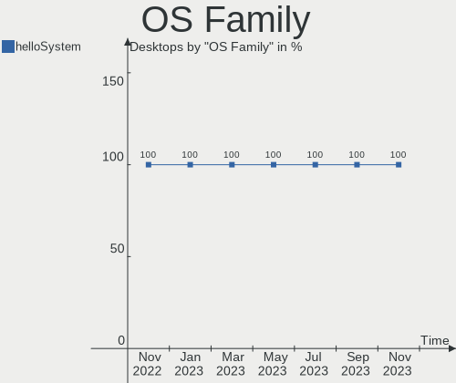
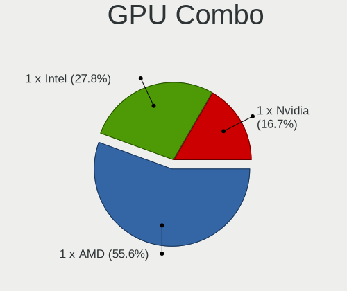

helloSystem - Hardware Trends (Desktops)
----------------------------------------

A project to identify most popular hardware characteristics and track their change
over time based on data collected by BSD users at https://BSD-Hardware.info.

Anyone can contribute to this report by the [hw-probe](https://github.com/linuxhw/hw-probe/blob/master/INSTALL.BSD.md) tool:

    hw-probe -all -upload

This report is for one last month. Overall report since the beginning of time: [TestDays](https://github.com/bsdhw/TestDays)

Period: Aug, 2023.

Contents
--------

* [ System ](#system)
  - [ OS                       ](#os)
  - [ OS Family                ](#os-family)
  - [ Arch                     ](#arch)
  - [ DE                       ](#de)
  - [ Display Server           ](#display-server)
  - [ Display Manager          ](#display-manager)
  - [ OS Lang                  ](#os-lang)
  - [ Boot Mode                ](#boot-mode)
  - [ Filesystem               ](#filesystem)
  - [ Part. scheme             ](#part-scheme)

* [ Board ](#board)
  - [ Vendor                   ](#vendor)
  - [ Model                    ](#model)
  - [ Model Family             ](#model-family)
  - [ MFG Year                 ](#mfg-year)
  - [ Form Factor              ](#form-factor)
  - [ Coreboot                 ](#coreboot)
  - [ RAM Size                 ](#ram-size)
  - [ RAM Used                 ](#ram-used)
  - [ Total Drives             ](#total-drives)
  - [ Has CD-ROM               ](#has-cd-rom)
  - [ Has Ethernet             ](#has-ethernet)
  - [ Has WiFi                 ](#has-wifi)
  - [ Has Bluetooth            ](#has-bluetooth)

* [ Location ](#location)
  - [ Country                  ](#country)
  - [ City                     ](#city)

* [ Drives ](#drives)
  - [ Drive Vendor             ](#drive-vendor)
  - [ Drive Model              ](#drive-model)
  - [ HDD Vendor               ](#hdd-vendor)
  - [ SSD Vendor               ](#ssd-vendor)
  - [ Drive Kind               ](#drive-kind)
  - [ Drive Connector          ](#drive-connector)
  - [ Drive Size               ](#drive-size)
  - [ Space Total              ](#space-total)
  - [ Space Used               ](#space-used)
  - [ Malfunc. Drives          ](#malfunc-drives)
  - [ Malfunc. Drive Vendor    ](#malfunc-drive-vendor)
  - [ Malfunc. HDD Vendor      ](#malfunc-hdd-vendor)
  - [ Malfunc. Drive Kind      ](#malfunc-drive-kind)
  - [ Failed Drives            ](#failed-drives)
  - [ Failed Drive Vendor      ](#failed-drive-vendor)
  - [ Drive Status             ](#drive-status)

* [ Storage controller ](#storage-controller)
  - [ Storage Vendor           ](#storage-vendor)
  - [ Storage Model            ](#storage-model)
  - [ Storage Kind             ](#storage-kind)

* [ Processor ](#processor)
  - [ CPU Vendor               ](#cpu-vendor)
  - [ CPU Model                ](#cpu-model)
  - [ CPU Model Family         ](#cpu-model-family)
  - [ CPU Cores                ](#cpu-cores)
  - [ CPU Sockets              ](#cpu-sockets)
  - [ CPU Threads              ](#cpu-threads)
  - [ CPU Microarch            ](#cpu-microarch)

* [ Graphics ](#graphics)
  - [ GPU Vendor               ](#gpu-vendor)
  - [ GPU Model                ](#gpu-model)
  - [ GPU Combo                ](#gpu-combo)
  - [ GPU Driver               ](#gpu-driver)
  - [ GPU Memory               ](#gpu-memory)

* [ Monitor ](#monitor)
  - [ Monitor Vendor           ](#monitor-vendor)
  - [ Monitor Model            ](#monitor-model)
  - [ Monitor Resolution       ](#monitor-resolution)
  - [ Monitor Diagonal         ](#monitor-diagonal)
  - [ Monitor Width            ](#monitor-width)
  - [ Aspect Ratio             ](#aspect-ratio)
  - [ Monitor Area             ](#monitor-area)
  - [ Pixel Density            ](#pixel-density)
  - [ Multiple Monitors        ](#multiple-monitors)

* [ Network ](#network)
  - [ Net Controller Vendor    ](#net-controller-vendor)
  - [ Net Controller Model     ](#net-controller-model)
  - [ Wireless Vendor          ](#wireless-vendor)
  - [ Wireless Model           ](#wireless-model)
  - [ Ethernet Vendor          ](#ethernet-vendor)
  - [ Ethernet Model           ](#ethernet-model)
  - [ Net Controller Kind      ](#net-controller-kind)
  - [ Used Controller          ](#used-controller)
  - [ NICs                     ](#nics)
  - [ IPv6                     ](#ipv6)

* [ Bluetooth ](#bluetooth)
  - [ Bluetooth Vendor         ](#bluetooth-vendor)
  - [ Bluetooth Model          ](#bluetooth-model)

* [ Sound ](#sound)
  - [ Sound Vendor             ](#sound-vendor)
  - [ Sound Model              ](#sound-model)

* [ Memory ](#memory)
  - [ Memory Vendor            ](#memory-vendor)
  - [ Memory Model             ](#memory-model)
  - [ Memory Kind              ](#memory-kind)
  - [ Memory Form Factor       ](#memory-form-factor)
  - [ Memory Size              ](#memory-size)
  - [ Memory Speed             ](#memory-speed)

* [ Printers & scanners ](#printers--scanners)
  - [ Printer Vendor           ](#printer-vendor)
  - [ Printer Model            ](#printer-model)
  - [ Scanner Vendor           ](#scanner-vendor)
  - [ Scanner Model            ](#scanner-model)

* [ Camera ](#camera)
  - [ Camera Vendor            ](#camera-vendor)
  - [ Camera Model             ](#camera-model)

* [ Security ](#security)
  - [ Fingerprint Vendor       ](#fingerprint-vendor)
  - [ Fingerprint Model        ](#fingerprint-model)
  - [ Chipcard Vendor          ](#chipcard-vendor)
  - [ Chipcard Model           ](#chipcard-model)

* [ Unsupported ](#unsupported)
  - [ Unsupported Devices      ](#unsupported-devices)
  - [ Unsupported Device Types ](#unsupported-device-types)

System
------

OS
--

Installed operating systems

| Name              | Desktops | Percent |
|-------------------|----------|---------|
| helloSystem 0.8.1 | 18       | 75%     |
| helloSystem 0.8.2 | 4        | 16.67%  |
| helloSystem 0.9.0 | 1        | 4.17%   |
| helloSystem 0.8.0 | 1        | 4.17%   |

OS Family
---------

OS without a version

| Name        | Desktops | Percent |
|-------------|----------|---------|
| helloSystem | 24       | 100%    |

Arch
----

OS architecture (x86_64, i586, etc.)

| Name  | Desktops | Percent |
|-------|----------|---------|
| amd64 | 24       | 100%    |

DE
--

Desktop Environment

| Name         | Desktops | Percent |
|--------------|----------|---------|
| helloDesktop | 24       | 100%    |

Display Server
--------------

X11 or Wayland

| Name | Desktops | Percent |
|------|----------|---------|
| X11  | 24       | 100%    |

Display Manager
---------------

SDDM, LightDM, etc.

| Name | Desktops | Percent |
|------|----------|---------|
| SLiM | 24       | 100%    |

OS Lang
-------

Language

| Lang    | Desktops | Percent |
|---------|----------|---------|
| en_US   | 7        | 29.17%  |
| fr_FR   | 4        | 16.67%  |
| Unknown | 4        | 16.67%  |
| pt_BR   | 3        | 12.5%   |
| it_IT   | 2        | 8.33%   |
| ru_RU   | 1        | 4.17%   |
| es_ES   | 1        | 4.17%   |
| en      | 1        | 4.17%   |
| de_DE   | 1        | 4.17%   |

Boot Mode
---------

EFI or BIOS

| Mode | Desktops | Percent |
|------|----------|---------|
| EFI  | 24       | 100%    |

Filesystem
----------

Type of filesystem

| Type   | Desktops | Percent |
|--------|----------|---------|
| Cd9660 | 14       | 58.33%  |
| Zfs    | 10       | 41.67%  |

Part. scheme
------------

Scheme of partitioning

| Type | Desktops | Percent |
|------|----------|---------|
| GPT  | 24       | 100%    |

Board
-----

Vendor
------

Motherboard manufacturer

| Name                | Desktops | Percent |
|---------------------|----------|---------|
| ASUSTek Computer    | 6        | 25%     |
| Gigabyte Technology | 5        | 20.83%  |
| MSI                 | 4        | 16.67%  |
| Intel               | 2        | 8.33%   |
| ASRock              | 2        | 8.33%   |
| Hewlett-Packard     | 1        | 4.17%   |
| Dell                | 1        | 4.17%   |
| Daten Tecnologia    | 1        | 4.17%   |
| AZW                 | 1        | 4.17%   |
| Acer                | 1        | 4.17%   |

Model
-----

Motherboard model

| Name                                   | Desktops | Percent |
|----------------------------------------|----------|---------|
| MSI MS-7C83                            | 1        | 4.17%   |
| MSI MS-7B24                            | 1        | 4.17%   |
| MSI MS-7B17                            | 1        | 4.17%   |
| MSI MS-7996                            | 1        | 4.17%   |
| Intel Jasper Lake Client Platform      | 1        | 4.17%   |
| Intel H81                              | 1        | 4.17%   |
| HP Compaq dc7800 Convertible Minitower | 1        | 4.17%   |
| Gigabyte Z170-HD3 DDR3                 | 1        | 4.17%   |
| Gigabyte GA-880GA-UD3H                 | 1        | 4.17%   |
| Gigabyte G41M-ES2L                     | 1        | 4.17%   |
| Gigabyte F2A88XM-D3H                   | 1        | 4.17%   |
| Gigabyte B550 AORUS ELITE V2           | 1        | 4.17%   |
| Dell OptiPlex 7010                     | 1        | 4.17%   |
| Daten Tecnologia DH110MXV              | 1        | 4.17%   |
| AZW U59                                | 1        | 4.17%   |
| ASUS ROG STRIX B450-I GAMING           | 1        | 4.17%   |
| ASUS PRIME B450-PLUS                   | 1        | 4.17%   |
| ASUS P5QL PRO                          | 1        | 4.17%   |
| ASUS P5G41T-M LX2/BR                   | 1        | 4.17%   |
| ASUS M5A78L-M LE/USB3                  | 1        | 4.17%   |
| ASUS M4A88TD-M/USB3                    | 1        | 4.17%   |
| ASRock H110M-STX                       | 1        | 4.17%   |
| ASRock B450 Pro4                       | 1        | 4.17%   |
| Acer Veriton N2620G                    | 1        | 4.17%   |

Model Family
------------

Motherboard model prefix

| Name                      | Desktops | Percent |
|---------------------------|----------|---------|
| MSI MS-7C83               | 1        | 4.17%   |
| MSI MS-7B24               | 1        | 4.17%   |
| MSI MS-7B17               | 1        | 4.17%   |
| MSI MS-7996               | 1        | 4.17%   |
| Intel Jasper              | 1        | 4.17%   |
| Intel H81                 | 1        | 4.17%   |
| HP Compaq                 | 1        | 4.17%   |
| Gigabyte Z170-HD3         | 1        | 4.17%   |
| Gigabyte GA-880GA-UD3H    | 1        | 4.17%   |
| Gigabyte G41M-ES2L        | 1        | 4.17%   |
| Gigabyte F2A88XM-D3H      | 1        | 4.17%   |
| Gigabyte B550             | 1        | 4.17%   |
| Dell OptiPlex             | 1        | 4.17%   |
| Daten Tecnologia DH110MXV | 1        | 4.17%   |
| AZW U59                   | 1        | 4.17%   |
| ASUS ROG                  | 1        | 4.17%   |
| ASUS PRIME                | 1        | 4.17%   |
| ASUS P5QL                 | 1        | 4.17%   |
| ASUS P5G41T-M             | 1        | 4.17%   |
| ASUS M5A78L-M             | 1        | 4.17%   |
| ASUS M4A88TD-M            | 1        | 4.17%   |
| ASRock H110M-STX          | 1        | 4.17%   |
| ASRock B450               | 1        | 4.17%   |
| Acer Veriton              | 1        | 4.17%   |

MFG Year
--------

Motherboard manufacture year

| Year | Desktops | Percent |
|------|----------|---------|
| 2022 | 4        | 16.67%  |
| 2019 | 3        | 12.5%   |
| 2016 | 3        | 12.5%   |
| 2010 | 3        | 12.5%   |
| 2020 | 2        | 8.33%   |
| 2018 | 2        | 8.33%   |
| 2021 | 1        | 4.17%   |
| 2017 | 1        | 4.17%   |
| 2014 | 1        | 4.17%   |
| 2012 | 1        | 4.17%   |
| 2011 | 1        | 4.17%   |
| 2008 | 1        | 4.17%   |
| 2007 | 1        | 4.17%   |

Form Factor
-----------

Physical design of the computer

| Name    | Desktops | Percent |
|---------|----------|---------|
| Desktop | 24       | 100%    |

Coreboot
--------

Have coreboot on board

| Used | Desktops | Percent |
|------|----------|---------|
| No   | 24       | 100%    |

RAM Size
--------

Total RAM memory

| Size in GB  | Desktops | Percent |
|-------------|----------|---------|
| 8.01-16.0   | 8        | 33.33%  |
| 4.01-8.0    | 5        | 20.83%  |
| 16.01-24.0  | 5        | 20.83%  |
| 32.01-64.0  | 3        | 12.5%   |
| 24.01-32.0  | 2        | 8.33%   |
| 64.01-256.0 | 1        | 4.17%   |

RAM Used
--------

Used RAM memory

| Used GB  | Desktops | Percent |
|----------|----------|---------|
| 0.01-0.5 | 12       | 50%     |
| 1.01-2.0 | 5        | 20.83%  |
| 0.51-1.0 | 5        | 20.83%  |
| 3.01-4.0 | 1        | 4.17%   |
| 2.01-3.0 | 1        | 4.17%   |

Total Drives
------------

Number of drives on board

| Drives | Desktops | Percent |
|--------|----------|---------|
| 1      | 12       | 50%     |
| 2      | 3        | 12.5%   |
| 0      | 3        | 12.5%   |
| 3      | 2        | 8.33%   |
| 13     | 1        | 4.17%   |
| 6      | 1        | 4.17%   |
| 5      | 1        | 4.17%   |
| 4      | 1        | 4.17%   |

Has CD-ROM
----------

Has CD-ROM on board

| Presented | Desktops | Percent |
|-----------|----------|---------|
| No        | 14       | 58.33%  |
| Yes       | 10       | 41.67%  |

Has Ethernet
------------

Has Ethernet on board

| Presented | Desktops | Percent |
|-----------|----------|---------|
| Yes       | 23       | 95.83%  |
| No        | 1        | 4.17%   |

Has WiFi
--------

Has WiFi module

| Presented | Desktops | Percent |
|-----------|----------|---------|
| No        | 13       | 54.17%  |
| Yes       | 11       | 45.83%  |

Has Bluetooth
-------------

Has Bluetooth module

| Presented | Desktops | Percent |
|-----------|----------|---------|
| No        | 18       | 75%     |
| Yes       | 6        | 25%     |

Location
--------

Country
-------

Geographic location (country)

| Country   | Desktops | Percent |
|-----------|----------|---------|
| USA       | 6        | 25%     |
| Russia    | 4        | 16.67%  |
| Brazil    | 3        | 12.5%   |
| Italy     | 2        | 8.33%   |
| Canada    | 2        | 8.33%   |
| Serbia    | 1        | 4.17%   |
| Peru      | 1        | 4.17%   |
| Mexico    | 1        | 4.17%   |
| Hungary   | 1        | 4.17%   |
| Germany   | 1        | 4.17%   |
| France    | 1        | 4.17%   |
| Australia | 1        | 4.17%   |

City
----

Geographic location (city)

| City            | Desktops | Percent |
|-----------------|----------|---------|
| Winnipeg        | 1        | 4.17%   |
| Vladivostok     | 1        | 4.17%   |
| Trieste         | 1        | 4.17%   |
| Superior        | 1        | 4.17%   |
| St Petersburg   | 1        | 4.17%   |
| Redondo Beach   | 1        | 4.17%   |
| Paris           | 1        | 4.17%   |
| Oshawa          | 1        | 4.17%   |
| New York        | 1        | 4.17%   |
| Milwaukee       | 1        | 4.17%   |
| Marion          | 1        | 4.17%   |
| Manvel          | 1        | 4.17%   |
| Manoel Vitorino | 1        | 4.17%   |
| Lima            | 1        | 4.17%   |
| Kingisepp       | 1        | 4.17%   |
| Grottaglie      | 1        | 4.17%   |
| Eger            | 1        | 4.17%   |
| Dresden         | 1        | 4.17%   |
| Curitiba        | 1        | 4.17%   |
| Cruzeiro do Sul | 1        | 4.17%   |
| Celaya          | 1        | 4.17%   |
| Brisbane        | 1        | 4.17%   |
| Belgrade        | 1        | 4.17%   |
| Balashikha      | 1        | 4.17%   |

Drives
------

Drive Vendor
------------

Hard drive vendors

| Vendor              | Desktops | Drives | Percent |
|---------------------|----------|--------|---------|
| Seagate             | 7        | 16     | 18.92%  |
| WDC                 | 6        | 12     | 16.22%  |
| Kingston            | 3        | 3      | 8.11%   |
| Crucial             | 3        | 3      | 8.11%   |
| Toshiba             | 2        | 2      | 5.41%   |
| SPCC                | 2        | 2      | 5.41%   |
| China               | 2        | 2      | 5.41%   |
| WALRAM              | 1        | 1      | 2.7%    |
| Transcend           | 1        | 1      | 2.7%    |
| Samsung Electronics | 1        | 1      | 2.7%    |
| Phison              | 1        | 1      | 2.7%    |
| Maxtor              | 1        | 1      | 2.7%    |
| KingSpec            | 1        | 1      | 2.7%    |
| Intenso             | 1        | 1      | 2.7%    |
| Intel               | 1        | 1      | 2.7%    |
| HEORIADY            | 1        | 1      | 2.7%    |
| Gigabyte Technology | 1        | 1      | 2.7%    |
| Azerty              | 1        | 1      | 2.7%    |
| A-DATA Technology   | 1        | 1      | 2.7%    |

Drive Model
-----------

Hard drive models

| Model                                | Desktops | Percent |
|--------------------------------------|----------|---------|
| Crucial CT500MX500SSD1 500GB         | 2        | 4.26%   |
| WDC WD5000AAKX-60U6AA0 500GB         | 1        | 2.13%   |
| WDC WD40EFRX-68N32N0 4TB             | 1        | 2.13%   |
| WDC WD3200BPVT-75JJ5T0 320GB         | 1        | 2.13%   |
| WDC WD20EZRZ-22Z5HB0 2TB             | 1        | 2.13%   |
| WDC WD20EZRX-00D8PB0 2TB             | 1        | 2.13%   |
| WDC WD20EFRX-68EUZN0 2TB             | 1        | 2.13%   |
| WDC WD20EARS-00MVWB0 2TB             | 1        | 2.13%   |
| WDC WD10EZEX-60WN4A1 1TB             | 1        | 2.13%   |
| WDC WD10EZEX-60M2NA0 1TB             | 1        | 2.13%   |
| WDC WD10EADS-11M2B2 1TB              | 1        | 2.13%   |
| WDC PC SN530 SDBPNPZ-256G-1014 256GB | 1        | 2.13%   |
| WALRAM SSD 1TB                       | 1        | 2.13%   |
| Transcend TS512GMTE220S 512GB        | 1        | 2.13%   |
| Toshiba Q300 240GB                   | 1        | 2.13%   |
| Toshiba HDWD110 1TB                  | 1        | 2.13%   |
| SPCC Solid State Disk 128GB          | 1        | 2.13%   |
| SPCC M.2 PCIE SSD 512GB              | 1        | 2.13%   |
| Seagate ST8000VN0022-2EL112 8TB      | 1        | 2.13%   |
| Seagate ST8000DM004-2U9188 8TB       | 1        | 2.13%   |
| Seagate ST8000DM004-2CX188 8TB       | 1        | 2.13%   |
| Seagate ST3250312AS 250GB            | 1        | 2.13%   |
| Seagate ST31000528AS 1TB             | 1        | 2.13%   |
| Seagate ST250DM000-1BD141 250GB      | 1        | 2.13%   |
| Seagate ST2000DM006-2DM164 2TB       | 1        | 2.13%   |
| Seagate ST2000DM001-1ER164 2TB       | 1        | 2.13%   |
| Seagate ST1000LM025 HN-M101ABB 1TB   | 1        | 2.13%   |
| Seagate ST1000DM010-2EP102 1TB       | 1        | 2.13%   |
| Seagate ST1000DM005 HD103SJ 1TB      | 1        | 2.13%   |
| Seagate ST1000DM003-1CH162 1TB       | 1        | 2.13%   |
| Samsung SSD 860 EVO 250GB            | 1        | 2.13%   |
| Phison Sabrent Rocket Q 500GB        | 1        | 2.13%   |
| Maxtor 6Y120M0 122GB                 | 1        | 2.13%   |
| Kingston SNV2S250G 250GB             | 1        | 2.13%   |
| Kingston SA400S37240G 240GB          | 1        | 2.13%   |
| Kingston SA400S37120G 120GB          | 1        | 2.13%   |
| KingSpec P3-512 512GB                | 1        | 2.13%   |
| Intenso SSD 120GB                    | 1        | 2.13%   |
| Intel MEMPEK1W016GA 16GB             | 1        | 2.13%   |
| HEORIADY HX-001 D 256G               | 1        | 2.13%   |

HDD Vendor
----------

Hard disk drive vendors

| Vendor  | Desktops | Drives | Percent |
|---------|----------|--------|---------|
| Seagate | 7        | 16     | 46.67%  |
| WDC     | 6        | 11     | 40%     |
| Toshiba | 1        | 1      | 6.67%   |
| Maxtor  | 1        | 1      | 6.67%   |

SSD Vendor
----------

Solid state drive vendors

| Vendor              | Desktops | Drives | Percent |
|---------------------|----------|--------|---------|
| Crucial             | 3        | 3      | 18.75%  |
| Kingston            | 2        | 2      | 12.5%   |
| China               | 2        | 2      | 12.5%   |
| WALRAM              | 1        | 1      | 6.25%   |
| Toshiba             | 1        | 1      | 6.25%   |
| SPCC                | 1        | 1      | 6.25%   |
| Samsung Electronics | 1        | 1      | 6.25%   |
| KingSpec            | 1        | 1      | 6.25%   |
| Intenso             | 1        | 1      | 6.25%   |
| HEORIADY            | 1        | 1      | 6.25%   |
| Azerty              | 1        | 1      | 6.25%   |
| A-DATA Technology   | 1        | 1      | 6.25%   |

Drive Kind
----------

HDD or SSD

| Kind | Desktops | Drives | Percent |
|------|----------|--------|---------|
| HDD  | 13       | 29     | 40.63%  |
| SSD  | 12       | 16     | 37.5%   |
| NVMe | 7        | 7      | 21.88%  |

Drive Connector
---------------

SATA, SAS, NVMe, etc.

| Type | Desktops | Drives | Percent |
|------|----------|--------|---------|
| SATA | 19       | 45     | 73.08%  |
| NVMe | 7        | 7      | 26.92%  |

Drive Size
----------

Size of hard drive

| Size in TB | Desktops | Drives | Percent |
|------------|----------|--------|---------|
| 0.01-0.5   | 15       | 17     | 51.72%  |
| 0.51-1.0   | 8        | 12     | 27.59%  |
| 1.01-2.0   | 4        | 9      | 13.79%  |
| 3.01-4.0   | 1        | 2      | 3.45%   |
| 4.01-10.0  | 1        | 5      | 3.45%   |

Space Total
-----------

Amount of disk space available on the file system

| Size in GB | Desktops | Percent |
|------------|----------|---------|
| 1-20       | 12       | 50%     |
| 251-500    | 5        | 20.83%  |
| 101-250    | 2        | 8.33%   |
| 501-1000   | 2        | 8.33%   |
| 51-100     | 2        | 8.33%   |
| 1001-2000  | 1        | 4.17%   |

Space Used
----------

Amount of used disk space

| Used GB | Desktops | Percent |
|---------|----------|---------|
| 1-20    | 22       | 91.67%  |
| 251-500 | 1        | 4.17%   |
| 101-250 | 1        | 4.17%   |

Malfunc. Drives
---------------

Drive models with a malfunction

| Model                        | Desktops | Drives | Percent |
|------------------------------|----------|--------|---------|
| WDC WD5000AAKX-60U6AA0 500GB | 1        | 1      | 16.67%  |
| WDC WD20EARS-00MVWB0 2TB     | 1        | 1      | 16.67%  |
| WDC WD10EZEX-60M2NA0 1TB     | 1        | 1      | 16.67%  |
| WDC WD10EADS-11M2B2 1TB      | 1        | 1      | 16.67%  |
| Seagate ST3250312AS 250GB    | 1        | 1      | 16.67%  |
| Maxtor 6Y120M0 122GB         | 1        | 1      | 16.67%  |

Malfunc. Drive Vendor
---------------------

Vendors of faulty drives

| Vendor  | Desktops | Drives | Percent |
|---------|----------|--------|---------|
| WDC     | 3        | 4      | 60%     |
| Seagate | 1        | 1      | 20%     |
| Maxtor  | 1        | 1      | 20%     |

Malfunc. HDD Vendor
-------------------

Vendors of faulty HDD drives

| Vendor  | Desktops | Drives | Percent |
|---------|----------|--------|---------|
| WDC     | 3        | 4      | 60%     |
| Seagate | 1        | 1      | 20%     |
| Maxtor  | 1        | 1      | 20%     |

Malfunc. Drive Kind
-------------------

Kinds of faulty drives

| Kind | Desktops | Drives | Percent |
|------|----------|--------|---------|
| HDD  | 5        | 6      | 100%    |

Failed Drives
-------------

Failed drive models

Zero info for selected period =(

Failed Drive Vendor
-------------------

Failed drive vendors

Zero info for selected period =(

Drive Status
------------

Number of failed and malfunc. drives

| Status   | Desktops | Drives | Percent |
|----------|----------|--------|---------|
| Works    | 17       | 45     | 73.91%  |
| Malfunc  | 5        | 6      | 21.74%  |
| Detected | 1        | 1      | 4.35%   |

Storage controller
------------------

Storage Vendor
--------------

Storage controller vendors

| Vendor                      | Desktops | Percent |
|-----------------------------|----------|---------|
| Intel                       | 16       | 47.06%  |
| AMD                         | 8        | 23.53%  |
| Silicon Motion              | 2        | 5.88%   |
| Phison Electronics          | 2        | 5.88%   |
| VIA Technologies            | 1        | 2.94%   |
| SanDisk                     | 1        | 2.94%   |
| Marvell Technology Group    | 1        | 2.94%   |
| Kingston Technology Company | 1        | 2.94%   |
| JMicron Technology          | 1        | 2.94%   |
| ASMedia Technology          | 1        | 2.94%   |

Storage Model
-------------

Storage controller models

| Model                                                                          | Desktops | Percent |
|--------------------------------------------------------------------------------|----------|---------|
| Intel Q170/Q150/B150/H170/H110/Z170/CM236 Chipset SATA Controller [AHCI Mode]  | 4        | 8.7%    |
| AMD SB7x0/SB8x0/SB9x0 SATA Controller [IDE mode]                               | 3        | 6.52%   |
| AMD SB7x0/SB8x0/SB9x0 IDE Controller                                           | 3        | 6.52%   |
| AMD FCH SATA Controller [AHCI mode]                                            | 3        | 6.52%   |
| AMD 400 Series Chipset SATA Controller                                         | 3        | 6.52%   |
| Intel NM10/ICH7 Family SATA Controller [IDE mode]                              | 2        | 4.35%   |
| Intel Jasper Lake SATA AHCI Controller                                         | 2        | 4.35%   |
| Intel Cannon Lake PCH SATA AHCI Controller                                     | 2        | 4.35%   |
| VIA VT6415 PATA IDE Host Controller                                            | 1        | 2.17%   |
| Silicon Motion SM2263EN/SM2263XT (DRAM-less) NVMe SSD Controllers              | 1        | 2.17%   |
| Silicon Motion SM2262/SM2262EN SSD Controller                                  | 1        | 2.17%   |
| SanDisk WD Blue SN550 NVMe SSD                                                 | 1        | 2.17%   |
| Phison PS5013 E13 NVMe Controller                                              | 1        | 2.17%   |
| Phison E12 NVMe Controller                                                     | 1        | 2.17%   |
| Marvell Group 88SE9215 PCIe 2.0 x1 4-port SATA 6 Gb/s Controller               | 1        | 2.17%   |
| Kingston Company unknown                                                       | 1        | 2.17%   |
| JMicron JMB363 SATA/IDE Controller                                             | 1        | 2.17%   |
| Intel NVMe Optane Memory Series                                                | 1        | 2.17%   |
| Intel 82Q35 Express PT IDER Controller                                         | 1        | 2.17%   |
| Intel 82801JI (ICH10 Family) 4 port SATA IDE Controller #1                     | 1        | 2.17%   |
| Intel 82801JI (ICH10 Family) 2 port SATA IDE Controller #2                     | 1        | 2.17%   |
| Intel 82801IR/IO/IH (ICH9R/DO/DH) 4 port SATA Controller [IDE mode]            | 1        | 2.17%   |
| Intel 82801I (ICH9 Family) 2 port SATA Controller [IDE mode]                   | 1        | 2.17%   |
| Intel 82801G (ICH7 Family) IDE Controller                                      | 1        | 2.17%   |
| Intel 8 Series/C220 Series Chipset Family 6-port SATA Controller 1 [AHCI mode] | 1        | 2.17%   |
| Intel 7 Series/C210 Series Chipset Family IDE-r Controller                     | 1        | 2.17%   |
| Intel 7 Series/C210 Series Chipset Family 6-port SATA Controller [AHCI mode]   | 1        | 2.17%   |
| Intel 7 Series Chipset Family 4-port SATA Controller [IDE mode]                | 1        | 2.17%   |
| Intel 7 Series Chipset Family 2-port SATA Controller [IDE mode]                | 1        | 2.17%   |
| Intel 400 Series Chipset Family SATA AHCI Controller                           | 1        | 2.17%   |
| ASMedia ASM1062 Serial ATA Controller                                          | 1        | 2.17%   |
| AMD 500 Series Chipset SATA Controller                                         | 1        | 2.17%   |

Storage Kind
------------

Kind of storage controller (IDE, SATA, NVMe, SAS, ...)

| Kind | Desktops | Percent |
|------|----------|---------|
| SATA | 16       | 50%     |
| IDE  | 9        | 28.13%  |
| NVMe | 7        | 21.88%  |

Processor
---------

CPU Vendor
----------

Processor vendors

| Vendor | Desktops | Percent |
|--------|----------|---------|
| Intel  | 16       | 66.67%  |
| AMD    | 8        | 33.33%  |

CPU Model
---------

Processor models

| Model                                          | Desktops | Percent |
|------------------------------------------------|----------|---------|
| Intel Celeron N5105 @ 2.00GHz                  | 2        | 8.33%   |
| Intel Pentium Dual-Core CPU E5                 | 1        | 4.17%   |
| Intel Core i7-8700K CPU @ 3.70GHz              | 1        | 4.17%   |
| Intel Core i7-3770 CPU @ 3.40GHz               | 1        | 4.17%   |
| Intel Core i5-8400 CPU @ 2.80GHz               | 1        | 4.17%   |
| Intel Core i5-7600 CPU @ 3.50GHz               | 1        | 4.17%   |
| Intel Core i5-6600 CPU @ 3.30GHz               | 1        | 4.17%   |
| Intel Core i5-6500 CPU @ 3.20GHz               | 1        | 4.17%   |
| Intel Core i5-4440 CPU @ 3.10GHz               | 1        | 4.17%   |
| Intel Core i5-10400F CPU @ 2.90GHz             | 1        | 4.17%   |
| Intel Core i3-6100 CPU @ 3.70GHz               | 1        | 4.17%   |
| Intel Core 2 Duo CPU E8500 @ 3.16GHz           | 1        | 4.17%   |
| Intel Core 2 Duo CPU E7400 @ 2.80GHz           | 1        | 4.17%   |
| Intel Core 2 Duo CPU E4400 @ 2.00GHz           | 1        | 4.17%   |
| Intel Celeron CPU 887 @ 1.50GHz                | 1        | 4.17%   |
| AMD Ryzen 5 5600X 6-Core Processor             | 1        | 4.17%   |
| AMD Ryzen 5 3400G with Radeon Vega Graphics    | 1        | 4.17%   |
| AMD Ryzen 5 2600 Six-Core Processor            | 1        | 4.17%   |
| AMD Ryzen 5 2400G with Radeon Vega Graphics    | 1        | 4.17%   |
| AMD Phenom II X6 1055T Processor               | 1        | 4.17%   |
| AMD FX-4350 Quad-Core Processor                | 1        | 4.17%   |
| AMD Athlon II X2 255 Processor                 | 1        | 4.17%   |
| AMD A8-7650K Radeon R7, 10 Compute Cores 4C+6G | 1        | 4.17%   |

CPU Model Family
----------------

Processor model prefix

| Model                   | Desktops | Percent |
|-------------------------|----------|---------|
| Intel Core i5           | 6        | 25%     |
| AMD Ryzen 5             | 4        | 16.67%  |
| Intel Core 2 Duo        | 3        | 12.5%   |
| Intel Celeron           | 3        | 12.5%   |
| Intel Core i7           | 2        | 8.33%   |
| Intel Pentium Dual-Core | 1        | 4.17%   |
| Intel Core i3           | 1        | 4.17%   |
| AMD Phenom II X6        | 1        | 4.17%   |
| AMD FX                  | 1        | 4.17%   |
| AMD Athlon II X2        | 1        | 4.17%   |
| AMD A8                  | 1        | 4.17%   |

CPU Cores
---------

Number of processor cores

| Number  | Desktops | Percent |
|---------|----------|---------|
| 4       | 9        | 37.5%   |
| 2       | 6        | 25%     |
| 6       | 4        | 16.67%  |
| 12      | 2        | 8.33%   |
| 8       | 2        | 8.33%   |
| Unknown | 1        | 4.17%   |

CPU Sockets
-----------

Number of sockets

| Number | Desktops | Percent |
|--------|----------|---------|
| 1      | 24       | 100%    |

CPU Threads
-----------

Threads per core (Hyper-Threading)

| Number  | Desktops | Percent |
|---------|----------|---------|
| 1       | 19       | 79.17%  |
| 2       | 4        | 16.67%  |
| Unknown | 1        | 4.17%   |

CPU Microarch
-------------

Microarchitecture

| Name        | Desktops | Percent |
|-------------|----------|---------|
| Skylake     | 3        | 12.5%   |
| Penryn      | 3        | 12.5%   |
| KabyLake    | 3        | 12.5%   |
| Zen+        | 2        | 8.33%   |
| K10         | 2        | 8.33%   |
| Unknown     | 2        | 8.33%   |
| Zen 3       | 1        | 4.17%   |
| Zen         | 1        | 4.17%   |
| Steamroller | 1        | 4.17%   |
| SandyBridge | 1        | 4.17%   |
| Piledriver  | 1        | 4.17%   |
| IvyBridge   | 1        | 4.17%   |
| Haswell     | 1        | 4.17%   |
| Core        | 1        | 4.17%   |
| CometLake   | 1        | 4.17%   |

Graphics
--------

GPU Vendor
----------

Vendors of graphics cards

| Vendor | Desktops | Percent |
|--------|----------|---------|
| AMD    | 10       | 41.67%  |
| Intel  | 9        | 37.5%   |
| Nvidia | 5        | 20.83%  |

GPU Model
---------

Graphics card models

| Model                                                                       | Desktops | Percent |
|-----------------------------------------------------------------------------|----------|---------|
| Intel JasperLake [UHD Graphics]                                             | 2        | 8.33%   |
| Intel HD Graphics 530                                                       | 2        | 8.33%   |
| Nvidia TU106 [GeForce RTX 2070 Rev. A]                                      | 1        | 4.17%   |
| Nvidia GP106 [GeForce GTX 1060 6GB]                                         | 1        | 4.17%   |
| Nvidia GP102 [GeForce GTX 1080 Ti]                                          | 1        | 4.17%   |
| Nvidia GK208B [GeForce GT 710]                                              | 1        | 4.17%   |
| Nvidia G84GL [Quadro FX 570]                                                | 1        | 4.17%   |
| Intel Xeon E3-1200 v3/4th Gen Core Processor Integrated Graphics Controller | 1        | 4.17%   |
| Intel IvyBridge GT2 [HD Graphics 4000]                                      | 1        | 4.17%   |
| Intel HD Graphics 630                                                       | 1        | 4.17%   |
| Intel 82Q35 Express Integrated Graphics Controller                          | 1        | 4.17%   |
| Intel 2nd Generation Core Processor Family Integrated Graphics Controller   | 1        | 4.17%   |
| AMD Vega 10 XL/XT [Radeon RX Vega 56/64]                                    | 1        | 4.17%   |
| AMD RV710 [Radeon HD 4350/4550]                                             | 1        | 4.17%   |
| AMD RS880 [Radeon HD 4250]                                                  | 1        | 4.17%   |
| AMD Raven Ridge [Radeon Vega Series / Radeon Vega Mobile Series]            | 1        | 4.17%   |
| AMD Picasso/Raven 2 [Radeon Vega Series / Radeon Vega Mobile Series]        | 1        | 4.17%   |
| AMD Navi 23 [Radeon RX 6650 XT / 6700S / 6800S]                             | 1        | 4.17%   |
| AMD Navi 23 [Radeon RX 6600/6600 XT/6600M]                                  | 1        | 4.17%   |
| AMD Kaveri [Radeon R7 Graphics]                                             | 1        | 4.17%   |
| AMD Juniper XT [Radeon HD 5770]                                             | 1        | 4.17%   |
| AMD Caicos [Radeon HD 6450/7450/8450 / R5 230 OEM]                          | 1        | 4.17%   |

GPU Combo
---------

Combinations of graphics cards

| Name       | Desktops | Percent |
|------------|----------|---------|
| 1 x AMD    | 10       | 41.67%  |
| 1 x Intel  | 8        | 33.33%  |
| 1 x Nvidia | 5        | 20.83%  |
| 2 x Intel  | 1        | 4.17%   |

GPU Driver
----------

Free vs proprietary

| Driver      | Desktops | Percent |
|-------------|----------|---------|
| Free        | 20       | 83.33%  |
| Proprietary | 4        | 16.67%  |

GPU Memory
----------

Total video memory

| Size in GB | Desktops | Percent |
|------------|----------|---------|
| Unknown    | 15       | 62.5%   |
| 0.51-1.0   | 4        | 16.67%  |
| 7.01-8.0   | 2        | 8.33%   |
| 5.01-6.0   | 1        | 4.17%   |
| 1.01-2.0   | 1        | 4.17%   |
| 8.01-16.0  | 1        | 4.17%   |

Monitor
-------

Monitor Vendor
--------------

Monitor vendors

| Vendor               | Desktops | Percent |
|----------------------|----------|---------|
| Goldstar             | 3        | 17.65%  |
| AOC                  | 3        | 17.65%  |
| Hewlett-Packard      | 2        | 11.76%  |
| BenQ                 | 2        | 11.76%  |
| ViewSonic            | 1        | 5.88%   |
| RS                   | 1        | 5.88%   |
| ITE                  | 1        | 5.88%   |
| Dell                 | 1        | 5.88%   |
| ASUSTek Computer     | 1        | 5.88%   |
| Ancor Communications | 1        | 5.88%   |
| Acer                 | 1        | 5.88%   |

Monitor Model
-------------

Monitor models

| Model                                                            | Desktops | Percent |
|------------------------------------------------------------------|----------|---------|
| ViewSonic VX2250 SERIES VSCCB25 1920x1080 480x270mm 21.7-inch    | 1        | 5.88%   |
| RS LM-1702 BTC1702 1280x1024 340x270mm 17.1-inch                 | 1        | 5.88%   |
| ITE DP2VGA V235 ITE6516 1920x1080 600x340mm 27.2-inch            | 1        | 5.88%   |
| Hewlett-Packard w2007 HWP26A6 1680x1050 430x270mm 20.0-inch      | 1        | 5.88%   |
| Hewlett-Packard 32 Display HPN351A 1920x1080 700x390mm 31.5-inch | 1        | 5.88%   |
| Goldstar E2242 GSM58BE 1920x1080 480x270mm 21.7-inch             | 1        | 5.88%   |
| Goldstar 22EA53 GSM59A6 1920x1080 480x270mm 21.7-inch            | 1        | 5.88%   |
| Goldstar 20EN43 GSM4EE3 1600x900 450x250mm 20.3-inch             | 1        | 5.88%   |
| Dell S2421H DEL41EF 1920x1080 530x300mm 24.0-inch                | 1        | 5.88%   |
| BenQ GW2480 BNQ78E7 1920x1080 530x300mm 24.0-inch                | 1        | 5.88%   |
| BenQ GW2283 BNQ78E9 1920x1080 480x270mm 21.7-inch                | 1        | 5.88%   |
| ASUSTek Computer VA32U AUS32A4 3840x2160 700x390mm 31.5-inch     | 1        | 5.88%   |
| AOC 2470W AOC2470 1920x1080 520x290mm 23.4-inch                  | 1        | 5.88%   |
| AOC 2250W AOC2250 1920x1080 480x270mm 21.7-inch                  | 1        | 5.88%   |
| AOC 1970W AOC1970 1366x768 410x230mm 18.5-inch                   | 1        | 5.88%   |
| Ancor Communications VH226 ACI22F2 1920x1080 480x270mm 21.7-inch | 1        | 5.88%   |
| Acer CB272 ACR0894 1920x1080 600x340mm 27.2-inch                 | 1        | 5.88%   |

Monitor Resolution
------------------

Monitor screen resolution

| Resolution         | Desktops | Percent |
|--------------------|----------|---------|
| 1920x1080 (FHD)    | 12       | 70.59%  |
| 3840x2160 (4K)     | 1        | 5.88%   |
| 1680x1050 (WSXGA+) | 1        | 5.88%   |
| 1600x900 (HD+)     | 1        | 5.88%   |
| 1366x768 (WXGA)    | 1        | 5.88%   |
| 1280x1024 (SXGA)   | 1        | 5.88%   |

Monitor Diagonal
----------------

Diagonal size in inches

| Inches | Desktops | Percent |
|--------|----------|---------|
| 21     | 6        | 35.29%  |
| 31     | 2        | 11.76%  |
| 27     | 2        | 11.76%  |
| 24     | 2        | 11.76%  |
| 20     | 2        | 11.76%  |
| 23     | 1        | 5.88%   |
| 18     | 1        | 5.88%   |
| 17     | 1        | 5.88%   |

Monitor Width
-------------

Physical width

| Width in mm | Desktops | Percent |
|-------------|----------|---------|
| 401-500     | 9        | 52.94%  |
| 501-600     | 5        | 29.41%  |
| 601-700     | 2        | 11.76%  |
| 301-350     | 1        | 5.88%   |

Aspect Ratio
------------

Proportional relationship between the width and the height

| Ratio | Desktops | Percent |
|-------|----------|---------|
| 16/9  | 15       | 88.24%  |
| 5/4   | 1        | 5.88%   |
| 16/10 | 1        | 5.88%   |

Monitor Area
------------

Area in inch²

| Area in inch² | Desktops | Percent |
|----------------|----------|---------|
| 201-250        | 9        | 52.94%  |
| 351-500        | 2        | 11.76%  |
| 301-350        | 2        | 11.76%  |
| 151-200        | 2        | 11.76%  |
| 141-150        | 2        | 11.76%  |

Pixel Density
-------------

Pixels per inch

| Density | Desktops | Percent |
|---------|----------|---------|
| 51-100  | 10       | 58.82%  |
| 101-120 | 6        | 35.29%  |
| 121-160 | 1        | 5.88%   |

Multiple Monitors
-----------------

Total monitors connected

| Total | Desktops | Percent |
|-------|----------|---------|
| 1     | 20       | 83.33%  |
| 0     | 4        | 16.67%  |

Network
-------

Net Controller Vendor
---------------------

Controller vendors

| Vendor                 | Desktops | Percent |
|------------------------|----------|---------|
| Realtek Semiconductor  | 18       | 56.25%  |
| Intel                  | 7        | 21.88%  |
| Samsung Electronics    | 2        | 6.25%   |
| Qualcomm Atheros       | 2        | 6.25%   |
| Ralink                 | 1        | 3.13%   |
| National Semiconductor | 1        | 3.13%   |
| D-Link                 | 1        | 3.13%   |

Net Controller Model
--------------------

Controller models

| Model                                                                | Desktops | Percent |
|----------------------------------------------------------------------|----------|---------|
| Realtek RTL8111/8168/8411 PCI Express Gigabit Ethernet Controller    | 15       | 40.54%  |
| Realtek RTL8188CUS 802.11n WLAN Adapter                              | 2        | 5.41%   |
| Samsung GT-I9070 (network tethering, USB debugging enabled)          | 1        | 2.7%    |
| Samsung Galaxy series, misc. (tethering mode)                        | 1        | 2.7%    |
| Realtek RTL8822BE 802.11a/b/g/n/ac WiFi adapter                      | 1        | 2.7%    |
| Realtek RTL8821CE 802.11ac PCIe Wireless Network Adapter             | 1        | 2.7%    |
| Realtek RTL8192CU 802.11n WLAN Adapter                               | 1        | 2.7%    |
| Realtek RTL8188EUS 802.11n Wireless Network Adapter                  | 1        | 2.7%    |
| Realtek RTL8125 2.5GbE Controller                                    | 1        | 2.7%    |
| Ralink RT2500 Wireless 802.11bg                                      | 1        | 2.7%    |
| Qualcomm Atheros AR93xx Wireless Network Adapter                     | 1        | 2.7%    |
| Qualcomm Atheros AR8121/AR8113/AR8114 Gigabit or Fast Ethernet       | 1        | 2.7%    |
| National DP83815 (MacPhyter) Ethernet Controller                     | 1        | 2.7%    |
| Intel Wireless 3165                                                  | 1        | 2.7%    |
| Intel I211 Gigabit Network Connection                                | 1        | 2.7%    |
| Intel Ethernet Connection (7) I219-V                                 | 1        | 2.7%    |
| Intel Ethernet Connection (2) I219-V                                 | 1        | 2.7%    |
| Intel Cannon Lake PCH CNVi WiFi                                      | 1        | 2.7%    |
| Intel 82579V Gigabit Network Connection                              | 1        | 2.7%    |
| Intel 82579LM Gigabit Network Connection (Lewisville)                | 1        | 2.7%    |
| Intel 82566DM-2 Gigabit Network Connection                           | 1        | 2.7%    |
| D-Link DWA-171 AC600 DB Wireless Adapter(rev.A1) [Realtek RTL8811AU] | 1        | 2.7%    |

Wireless Vendor
---------------

Wireless vendors

| Vendor                | Desktops | Percent |
|-----------------------|----------|---------|
| Realtek Semiconductor | 6        | 54.55%  |
| Intel                 | 2        | 18.18%  |
| Ralink                | 1        | 9.09%   |
| Qualcomm Atheros      | 1        | 9.09%   |
| D-Link                | 1        | 9.09%   |

Wireless Model
--------------

Wireless models

| Model                                                                | Desktops | Percent |
|----------------------------------------------------------------------|----------|---------|
| Realtek RTL8188CUS 802.11n WLAN Adapter                              | 2        | 18.18%  |
| Realtek RTL8822BE 802.11a/b/g/n/ac WiFi adapter                      | 1        | 9.09%   |
| Realtek RTL8821CE 802.11ac PCIe Wireless Network Adapter             | 1        | 9.09%   |
| Realtek RTL8192CU 802.11n WLAN Adapter                               | 1        | 9.09%   |
| Realtek RTL8188EUS 802.11n Wireless Network Adapter                  | 1        | 9.09%   |
| Ralink RT2500 Wireless 802.11bg                                      | 1        | 9.09%   |
| Qualcomm Atheros AR93xx Wireless Network Adapter                     | 1        | 9.09%   |
| Intel Wireless 3165                                                  | 1        | 9.09%   |
| Intel Cannon Lake PCH CNVi WiFi                                      | 1        | 9.09%   |
| D-Link DWA-171 AC600 DB Wireless Adapter(rev.A1) [Realtek RTL8811AU] | 1        | 9.09%   |

Ethernet Vendor
---------------

Ethernet vendors

| Vendor                 | Desktops | Percent |
|------------------------|----------|---------|
| Realtek Semiconductor  | 16       | 61.54%  |
| Intel                  | 6        | 23.08%  |
| Samsung Electronics    | 2        | 7.69%   |
| Qualcomm Atheros       | 1        | 3.85%   |
| National Semiconductor | 1        | 3.85%   |

Ethernet Model
--------------

Ethernet models

| Model                                                             | Desktops | Percent |
|-------------------------------------------------------------------|----------|---------|
| Realtek RTL8111/8168/8411 PCI Express Gigabit Ethernet Controller | 15       | 57.69%  |
| Samsung GT-I9070 (network tethering, USB debugging enabled)       | 1        | 3.85%   |
| Samsung Galaxy series, misc. (tethering mode)                     | 1        | 3.85%   |
| Realtek RTL8125 2.5GbE Controller                                 | 1        | 3.85%   |
| Qualcomm Atheros AR8121/AR8113/AR8114 Gigabit or Fast Ethernet    | 1        | 3.85%   |
| National DP83815 (MacPhyter) Ethernet Controller                  | 1        | 3.85%   |
| Intel I211 Gigabit Network Connection                             | 1        | 3.85%   |
| Intel Ethernet Connection (7) I219-V                              | 1        | 3.85%   |
| Intel Ethernet Connection (2) I219-V                              | 1        | 3.85%   |
| Intel 82579V Gigabit Network Connection                           | 1        | 3.85%   |
| Intel 82579LM Gigabit Network Connection (Lewisville)             | 1        | 3.85%   |
| Intel 82566DM-2 Gigabit Network Connection                        | 1        | 3.85%   |

Net Controller Kind
-------------------

Ethernet, WiFi or modem

| Kind     | Desktops | Percent |
|----------|----------|---------|
| Ethernet | 23       | 67.65%  |
| WiFi     | 11       | 32.35%  |

Used Controller
---------------

Currently used network controller

| Kind     | Desktops | Percent |
|----------|----------|---------|
| Ethernet | 20       | 95.24%  |
| WiFi     | 1        | 4.76%   |

NICs
----

Total network controllers on board

| Total | Desktops | Percent |
|-------|----------|---------|
| 1     | 17       | 70.83%  |
| 2     | 4        | 16.67%  |
| 3     | 2        | 8.33%   |
| 0     | 1        | 4.17%   |

IPv6
----

IPv6 vs IPv4

| Used | Desktops | Percent |
|------|----------|---------|
| No   | 24       | 100%    |

Bluetooth
---------

Bluetooth Vendor
----------------

Controller vendors

| Vendor                  | Desktops | Percent |
|-------------------------|----------|---------|
| Intel                   | 2        | 33.33%  |
| ASUSTek Computer        | 2        | 33.33%  |
| Realtek Semiconductor   | 1        | 16.67%  |
| Cambridge Silicon Radio | 1        | 16.67%  |

Bluetooth Model
---------------

Controller models

| Model                                               | Desktops | Percent |
|-----------------------------------------------------|----------|---------|
| Realtek Bluetooth Adapter                           | 1        | 16.67%  |
| Intel Bluetooth wireless interface                  | 1        | 16.67%  |
| Intel Bluetooth 9460/9560 Jefferson Peak (JfP)      | 1        | 16.67%  |
| Cambridge Silicon Radio Bluetooth Dongle (HCI mode) | 1        | 16.67%  |
| ASUS USB-BT500                                      | 1        | 16.67%  |
| ASUS Bluetooth Controller                           | 1        | 16.67%  |

Sound
-----

Sound Vendor
------------

Sound card vendors

| Vendor                   | Desktops | Percent |
|--------------------------|----------|---------|
| Intel                    | 15       | 37.5%   |
| AMD                      | 12       | 30%     |
| Nvidia                   | 4        | 10%     |
| C-Media Electronics      | 4        | 10%     |
| KTMicro                  | 1        | 2.5%    |
| JMTek                    | 1        | 2.5%    |
| Hewlett-Packard          | 1        | 2.5%    |
| HECATE G2 GAMING HEADSET | 1        | 2.5%    |
| Unknown                  | 1        | 2.5%    |

Sound Model
-----------

Sound card models

| Model                                                                             | Desktops | Percent |
|-----------------------------------------------------------------------------------|----------|---------|
| Intel 100 Series/C230 Series Chipset Family HD Audio Controller                   | 4        | 8.51%   |
| C-Media Electronics Audio Adapter (Unitek Y-247A)                                 | 3        | 6.38%   |
| AMD SBx00 Azalia (Intel HDA)                                                      | 3        | 6.38%   |
| Intel NM10/ICH7 Family High Definition Audio Controller                           | 2        | 4.26%   |
| Intel Jasper Lake HD Audio                                                        | 2        | 4.26%   |
| Intel 7 Series/C216 Chipset Family High Definition Audio Controller               | 2        | 4.26%   |
| AMD Raven/Raven2/Fenghuang HDMI/DP Audio Controller                               | 2        | 4.26%   |
| AMD Navi 21/23 HDMI/DP Audio Controller                                           | 2        | 4.26%   |
| AMD Family 17h/19h HD Audio Controller                                            | 2        | 4.26%   |
| Nvidia TU106 High Definition Audio Controller                                     | 1        | 2.13%   |
| Nvidia GP106 High Definition Audio Controller                                     | 1        | 2.13%   |
| Nvidia GP102 HDMI Audio Controller                                                | 1        | 2.13%   |
| Nvidia GK208 HDMI/DP Audio Controller                                             | 1        | 2.13%   |
| KTMicro KT USB Audio                                                              | 1        | 2.13%   |
| JMTek USB PnP Audio Device                                                        | 1        | 2.13%   |
| Intel Xeon E3-1200 v3/4th Gen Core Processor HD Audio Controller                  | 1        | 2.13%   |
| Intel Comet Lake PCH-V cAVS                                                       | 1        | 2.13%   |
| Intel Cannon Lake PCH cAVS                                                        | 1        | 2.13%   |
| Intel 82801JI (ICH10 Family) HD Audio Controller                                  | 1        | 2.13%   |
| Intel 82801I (ICH9 Family) HD Audio Controller                                    | 1        | 2.13%   |
| Intel 8 Series/C220 Series Chipset High Definition Audio Controller               | 1        | 2.13%   |
| Hewlett-Packard HyperX Cloud Alpha Wireless                                       | 1        | 2.13%   |
| HECATE G2 GAMING HEADSET HECATE G2 GAMING HEADSET                                 | 1        | 2.13%   |
| C-Media Electronics Blue Snowball                                                 | 1        | 2.13%   |
| AMD Vega 10 HDMI Audio [Radeon Vega 56/64]                                        | 1        | 2.13%   |
| AMD Starship/Matisse HD Audio Controller                                          | 1        | 2.13%   |
| AMD RV710/730 HDMI Audio [Radeon HD 4000 series]                                  | 1        | 2.13%   |
| AMD RS880 HDMI Audio [Radeon HD 4200 Series]                                      | 1        | 2.13%   |
| AMD Kaveri HDMI/DP Audio Controller                                               | 1        | 2.13%   |
| AMD Juniper HDMI Audio [Radeon HD 5700 Series]                                    | 1        | 2.13%   |
| AMD FCH Azalia Controller                                                         | 1        | 2.13%   |
| AMD Family 17h (Models 00h-0fh) HD Audio Controller                               | 1        | 2.13%   |
| AMD Caicos HDMI Audio [Radeon HD 6450 / 7450/8450/8490 OEM / R5 230/235/235X OEM] | 1        | 2.13%   |
| Unknown                                                                           | 1        | 2.13%   |

Memory
------

Memory Vendor
-------------

Memory module vendors

| Vendor              | Desktops | Percent |
|---------------------|----------|---------|
| Unknown             | 5        | 15.63%  |
| Unknown             | 4        | 12.5%   |
| Samsung Electronics | 3        | 9.38%   |
| Micron Technology   | 3        | 9.38%   |
| Corsair             | 3        | 9.38%   |
| Nanya Technology    | 2        | 6.25%   |
| Kingston            | 2        | 6.25%   |
| G.Skill             | 2        | 6.25%   |
| Unknown (8A02)      | 1        | 3.13%   |
| Team                | 1        | 3.13%   |
| SK hynix            | 1        | 3.13%   |
| Patriot             | 1        | 3.13%   |
| Crucial             | 1        | 3.13%   |
| Atermiter           | 1        | 3.13%   |
| Apacer              | 1        | 3.13%   |
| A-DATA Technology   | 1        | 3.13%   |

Memory Model
------------

Memory module models

| Model                                                  | Desktops | Percent |
|--------------------------------------------------------|----------|---------|
| Unknown                                                | 4        | 11.76%  |
| Micron RAM 8JTF51264AZ-1G6E1 4GB DIMM DDR3 1600MT/s    | 2        | 5.88%   |
| Unknown RAM Module 4GB DIMM DDR3 1600MT/s              | 1        | 2.94%   |
| Unknown RAM Module 4GB DIMM 1600MT/s                   | 1        | 2.94%   |
| Unknown RAM Module 2GB DIMM DDR 667MT/s                | 1        | 2.94%   |
| Unknown RAM Module 2GB DIMM 800MT/s                    | 1        | 2.94%   |
| Unknown RAM Module 2GB DIMM 1066MT/s                   | 1        | 2.94%   |
| Unknown RAM Module 1GB DIMM DDR 667MT/s                | 1        | 2.94%   |
| Unknown (8A02) RAM Module 8GB DIMM DDR3 1600MT/s       | 1        | 2.94%   |
| Team RAM TEAMGROUP-UD4-2400 8GB DIMM DDR4 2667MT/s     | 1        | 2.94%   |
| SK hynix RAM HMT351U6CFR8C-H9 4GB DIMM DDR3 1333MT/s   | 1        | 2.94%   |
| Samsung RAM Module 2GB SODIMM DDR3 1333MT/s            | 1        | 2.94%   |
| Samsung RAM M471A1K43DB1-CWE 8GB SODIMM DDR4 3200MT/s  | 1        | 2.94%   |
| Samsung RAM M3 78T2953EZ3-CE6 1GB DIMM DDR2 667MT/s    | 1        | 2.94%   |
| Samsung RAM M3 78T2863DZS-CE6 1GB DIMM DDR2 667MT/s    | 1        | 2.94%   |
| Patriot RAM 3200 C16 Series 8GB DIMM DDR4 3200MT/s     | 1        | 2.94%   |
| Nanya RAM NT4GC64B88B1NF-DI 4GB DIMM DDR3 1600MT/s     | 1        | 2.94%   |
| Nanya RAM NT2GT64U8HD0BY-AD 2GB DIMM DDR2 800MT/s      | 1        | 2.94%   |
| Micron RAM AFLD44FK2P 4GB DIMM DDR4 2133MT/s           | 1        | 2.94%   |
| Kingston RAM KHX1600C10D3/ 8GB DIMM DDR3 1866MT/s      | 1        | 2.94%   |
| Kingston RAM KF3200C16D4/8GX 8GB DIMM DDR4 3200MT/s    | 1        | 2.94%   |
| G.Skill RAM F4-3200C16-16GVK 16GB DIMM DDR4 3200MT/s   | 1        | 2.94%   |
| G.Skill RAM F4-3000C16-8GISB 8GB DIMM DDR4 3000MT/s    | 1        | 2.94%   |
| Crucial RAM CT8G4DFS8266.M8FD 8GB DIMM DDR4 2667MT/s   | 1        | 2.94%   |
| Corsair RAM CMK32GX4M2A2400C16 16GB DIMM DDR4 2400MT/s | 1        | 2.94%   |
| Corsair RAM CMK16GX4M2B3200C16 8GB DIMM DDR4 3200MT/s  | 1        | 2.94%   |
| Corsair RAM CMD32GX4M2B3000C15 16GB DIMM DDR4 2133MT/s | 1        | 2.94%   |
| Atermiter RAM D3-1600 8GB DIMM DDR3 1600MT/s           | 1        | 2.94%   |
| Apacer RAM 75.C93DE.G040C 8GB DIMM DDR3 1600MT/s       | 1        | 2.94%   |
| A-DATA RAM DDR4 3200 8GB DIMM DDR4 3200MT/s            | 1        | 2.94%   |

Memory Kind
-----------

Memory module kinds

| Kind    | Desktops | Percent |
|---------|----------|---------|
| DDR4    | 11       | 45.83%  |
| DDR3    | 7        | 29.17%  |
| Unknown | 4        | 16.67%  |
| DDR2    | 1        | 4.17%   |
| DDR     | 1        | 4.17%   |

Memory Form Factor
------------------

Physical design of the memory module

| Name   | Desktops | Percent |
|--------|----------|---------|
| DIMM   | 20       | 83.33%  |
| SODIMM | 4        | 16.67%  |

Memory Size
-----------

Memory module size

| Size  | Desktops | Percent |
|-------|----------|---------|
| 8192  | 12       | 40%     |
| 4096  | 6        | 20%     |
| 2048  | 5        | 16.67%  |
| 16384 | 3        | 10%     |
| 1024  | 3        | 10%     |
| 32768 | 1        | 3.33%   |

Memory Speed
------------

Memory module speed

| Speed   | Desktops | Percent |
|---------|----------|---------|
| 1600    | 6        | 21.43%  |
| 3200    | 5        | 17.86%  |
| 2667    | 4        | 14.29%  |
| 2133    | 2        | 7.14%   |
| 1333    | 2        | 7.14%   |
| 800     | 2        | 7.14%   |
| 667     | 2        | 7.14%   |
| 3000    | 1        | 3.57%   |
| 2400    | 1        | 3.57%   |
| 1866    | 1        | 3.57%   |
| 1066    | 1        | 3.57%   |
| Unknown | 1        | 3.57%   |

Printers & scanners
-------------------

Printer Vendor
--------------

Printer device vendors

Zero info for selected period =(

Printer Model
-------------

Printer device models

Zero info for selected period =(

Scanner Vendor
--------------

Scanner device vendors

Zero info for selected period =(

Scanner Model
-------------

Scanner device models

Zero info for selected period =(

Camera
------

Camera Vendor
-------------

Camera device vendors

| Vendor        | Desktops | Percent |
|---------------|----------|---------|
| Microdia      | 1        | 50%     |
| Genesys Logic | 1        | 50%     |

Camera Model
------------

Camera device models

| Model                            | Desktops | Percent |
|----------------------------------|----------|---------|
| Microdia Webcam Vitade AF        | 1        | 50%     |
| Genesys Logic Digital Microscope | 1        | 50%     |

Security
--------

Fingerprint Vendor
------------------

Fingerprint sensor vendors

Zero info for selected period =(

Fingerprint Model
-----------------

Fingerprint sensor models

Zero info for selected period =(

Chipcard Vendor
---------------

Chipcard module vendors

Zero info for selected period =(

Chipcard Model
--------------

Chipcard module models

Zero info for selected period =(

Unsupported
-----------

Unsupported Devices
-------------------

Total unsupported devices on board

| Total | Desktops | Percent |
|-------|----------|---------|
| 1     | 11       | 45.83%  |
| 0     | 9        | 37.5%   |
| 2     | 3        | 12.5%   |
| 3     | 1        | 4.17%   |

Unsupported Device Types
------------------------

Types of unsupported devices

| Type                     | Desktops | Percent |
|--------------------------|----------|---------|
| Communication controller | 13       | 81.25%  |
| Net/wireless             | 2        | 12.5%   |
| Network                  | 1        | 6.25%   |

