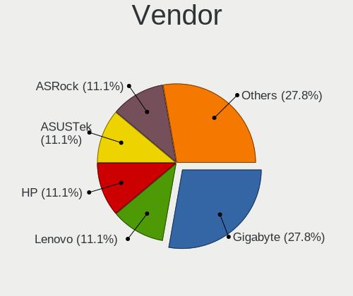
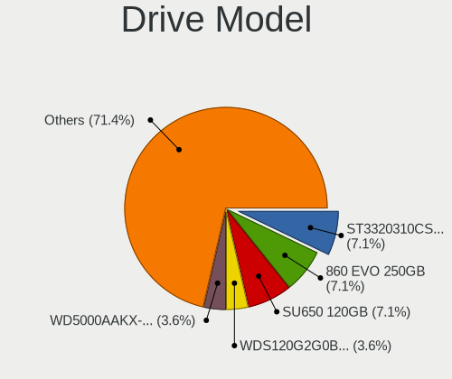
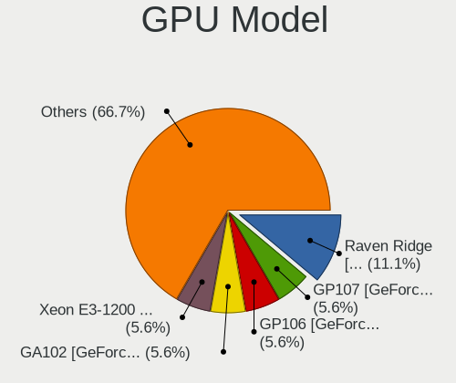

helloSystem - Hardware Trends (Desktops)
----------------------------------------

A project to identify most popular hardware characteristics and track their change
over time based on data collected by BSD users at https://BSD-Hardware.info.

Anyone can contribute to this report by the [hw-probe](https://github.com/linuxhw/hw-probe/blob/master/INSTALL.BSD.md) tool:

    hw-probe -all -upload

This report is for one last month. Overall report since the beginning of time: [TestCoverage](https://github.com/bsdhw/TestCoverage)

Period: Jul, 2022.

Contents
--------

* [ System ](#system)
  - [ OS                       ](#os)
  - [ OS Family                ](#os-family)
  - [ Arch                     ](#arch)
  - [ DE                       ](#de)
  - [ Display Server           ](#display-server)
  - [ Display Manager          ](#display-manager)
  - [ OS Lang                  ](#os-lang)
  - [ Boot Mode                ](#boot-mode)
  - [ Filesystem               ](#filesystem)
  - [ Part. scheme             ](#part-scheme)

* [ Board ](#board)
  - [ Vendor                   ](#vendor)
  - [ Model                    ](#model)
  - [ Model Family             ](#model-family)
  - [ MFG Year                 ](#mfg-year)
  - [ Form Factor              ](#form-factor)
  - [ Coreboot                 ](#coreboot)
  - [ RAM Size                 ](#ram-size)
  - [ RAM Used                 ](#ram-used)
  - [ Total Drives             ](#total-drives)
  - [ Has CD-ROM               ](#has-cd-rom)
  - [ Has Ethernet             ](#has-ethernet)
  - [ Has WiFi                 ](#has-wifi)
  - [ Has Bluetooth            ](#has-bluetooth)

* [ Location ](#location)
  - [ Country                  ](#country)
  - [ City                     ](#city)

* [ Drives ](#drives)
  - [ Drive Vendor             ](#drive-vendor)
  - [ Drive Model              ](#drive-model)
  - [ HDD Vendor               ](#hdd-vendor)
  - [ SSD Vendor               ](#ssd-vendor)
  - [ Drive Kind               ](#drive-kind)
  - [ Drive Connector          ](#drive-connector)
  - [ Drive Size               ](#drive-size)
  - [ Space Total              ](#space-total)
  - [ Space Used               ](#space-used)
  - [ Malfunc. Drives          ](#malfunc-drives)
  - [ Malfunc. Drive Vendor    ](#malfunc-drive-vendor)
  - [ Malfunc. HDD Vendor      ](#malfunc-hdd-vendor)
  - [ Malfunc. Drive Kind      ](#malfunc-drive-kind)
  - [ Failed Drives            ](#failed-drives)
  - [ Failed Drive Vendor      ](#failed-drive-vendor)
  - [ Drive Status             ](#drive-status)

* [ Storage controller ](#storage-controller)
  - [ Storage Vendor           ](#storage-vendor)
  - [ Storage Model            ](#storage-model)
  - [ Storage Kind             ](#storage-kind)

* [ Processor ](#processor)
  - [ CPU Vendor               ](#cpu-vendor)
  - [ CPU Model                ](#cpu-model)
  - [ CPU Model Family         ](#cpu-model-family)
  - [ CPU Cores                ](#cpu-cores)
  - [ CPU Sockets              ](#cpu-sockets)
  - [ CPU Threads              ](#cpu-threads)
  - [ CPU Microarch            ](#cpu-microarch)

* [ Graphics ](#graphics)
  - [ GPU Vendor               ](#gpu-vendor)
  - [ GPU Model                ](#gpu-model)
  - [ GPU Combo                ](#gpu-combo)
  - [ GPU Driver               ](#gpu-driver)
  - [ GPU Memory               ](#gpu-memory)

* [ Monitor ](#monitor)
  - [ Monitor Vendor           ](#monitor-vendor)
  - [ Monitor Model            ](#monitor-model)
  - [ Monitor Resolution       ](#monitor-resolution)
  - [ Monitor Diagonal         ](#monitor-diagonal)
  - [ Monitor Width            ](#monitor-width)
  - [ Aspect Ratio             ](#aspect-ratio)
  - [ Monitor Area             ](#monitor-area)
  - [ Pixel Density            ](#pixel-density)
  - [ Multiple Monitors        ](#multiple-monitors)

* [ Network ](#network)
  - [ Net Controller Vendor    ](#net-controller-vendor)
  - [ Net Controller Model     ](#net-controller-model)
  - [ Wireless Vendor          ](#wireless-vendor)
  - [ Wireless Model           ](#wireless-model)
  - [ Ethernet Vendor          ](#ethernet-vendor)
  - [ Ethernet Model           ](#ethernet-model)
  - [ Net Controller Kind      ](#net-controller-kind)
  - [ Used Controller          ](#used-controller)
  - [ NICs                     ](#nics)
  - [ IPv6                     ](#ipv6)

* [ Bluetooth ](#bluetooth)
  - [ Bluetooth Vendor         ](#bluetooth-vendor)
  - [ Bluetooth Model          ](#bluetooth-model)

* [ Sound ](#sound)
  - [ Sound Vendor             ](#sound-vendor)
  - [ Sound Model              ](#sound-model)

* [ Memory ](#memory)
  - [ Memory Vendor            ](#memory-vendor)
  - [ Memory Model             ](#memory-model)
  - [ Memory Kind              ](#memory-kind)
  - [ Memory Form Factor       ](#memory-form-factor)
  - [ Memory Size              ](#memory-size)
  - [ Memory Speed             ](#memory-speed)

* [ Printers & scanners ](#printers--scanners)
  - [ Printer Vendor           ](#printer-vendor)
  - [ Printer Model            ](#printer-model)
  - [ Scanner Vendor           ](#scanner-vendor)
  - [ Scanner Model            ](#scanner-model)

* [ Camera ](#camera)
  - [ Camera Vendor            ](#camera-vendor)
  - [ Camera Model             ](#camera-model)

* [ Security ](#security)
  - [ Fingerprint Vendor       ](#fingerprint-vendor)
  - [ Fingerprint Model        ](#fingerprint-model)
  - [ Chipcard Vendor          ](#chipcard-vendor)
  - [ Chipcard Model           ](#chipcard-model)

* [ Unsupported ](#unsupported)
  - [ Unsupported Devices      ](#unsupported-devices)
  - [ Unsupported Device Types ](#unsupported-device-types)

System
------

OS
--

Installed operating systems

| Name              | Desktops | Percent |
|-------------------|----------|---------|
| helloSystem 0.7.0 | 9        | 69.23%  |
| helloSystem 0.8.0 | 4        | 30.77%  |

OS Family
---------

OS without a version

| Name        | Desktops | Percent |
|-------------|----------|---------|
| helloSystem | 13       | 100%    |

Arch
----

OS architecture (x86_64, i586, etc.)

| Name  | Desktops | Percent |
|-------|----------|---------|
| amd64 | 13       | 100%    |

DE
--

Desktop Environment

| Name         | Desktops | Percent |
|--------------|----------|---------|
| helloDesktop | 13       | 100%    |

Display Server
--------------

X11 or Wayland

| Name | Desktops | Percent |
|------|----------|---------|
| X11  | 13       | 100%    |

Display Manager
---------------

SDDM, LightDM, etc.

| Name | Desktops | Percent |
|------|----------|---------|
| SLiM | 13       | 100%    |

OS Lang
-------

Language

| Lang  | Desktops | Percent |
|-------|----------|---------|
| en_US | 13       | 100%    |

Boot Mode
---------

EFI or BIOS

| Mode | Desktops | Percent |
|------|----------|---------|
| EFI  | 12       | 92.31%  |
| BIOS | 1        | 7.69%   |

Filesystem
----------

Type of filesystem

| Type   | Desktops | Percent |
|--------|----------|---------|
| Cd9660 | 10       | 76.92%  |
| Zfs    | 3        | 23.08%  |

Part. scheme
------------

Scheme of partitioning

| Type | Desktops | Percent |
|------|----------|---------|
| GPT  | 13       | 100%    |

Board
-----

Vendor
------

Motherboard manufacturer

| Name                | Desktops | Percent |
|---------------------|----------|---------|
| Gigabyte Technology | 3        | 23.08%  |
| Hewlett-Packard     | 2        | 15.38%  |
| ASUSTek Computer    | 2        | 15.38%  |
| Shuttle             | 1        | 7.69%   |
| Pegatron            | 1        | 7.69%   |
| MSI                 | 1        | 7.69%   |
| MAXSUN              | 1        | 7.69%   |
| Lenovo              | 1        | 7.69%   |
| Biostar             | 1        | 7.69%   |

Model
-----

Motherboard model

| Name                         | Desktops | Percent |
|------------------------------|----------|---------|
| Shuttle XH170                | 1        | 7.69%   |
| Pegatron IPM41-D3            | 1        | 7.69%   |
| MSI MS-7C37                  | 1        | 7.69%   |
| MAXSUN MS-H110D4L FS M.2     | 1        | 7.69%   |
| Lenovo ThinkCentre M72e m72e | 1        | 7.69%   |
| HP EliteDesk 800 G2 DM 35W   | 1        | 7.69%   |
| HP EliteDesk 800 G1 SFF      | 1        | 7.69%   |
| Gigabyte F2A88XM-D3H         | 1        | 7.69%   |
| Gigabyte AB350N-Gaming WIFI  | 1        | 7.69%   |
| Gigabyte A320M-S2H V2        | 1        | 7.69%   |
| Biostar G41D3C               | 1        | 7.69%   |
| ASUS P8B WS                  | 1        | 7.69%   |
| ASUS Maximus IX HERO         | 1        | 7.69%   |

Model Family
------------

Motherboard model prefix

| Name                   | Desktops | Percent |
|------------------------|----------|---------|
| HP EliteDesk           | 2        | 15.38%  |
| Shuttle XH170          | 1        | 7.69%   |
| Pegatron IPM41-D3      | 1        | 7.69%   |
| MSI MS-7C37            | 1        | 7.69%   |
| MAXSUN MS-H110D4L      | 1        | 7.69%   |
| Lenovo ThinkCentre     | 1        | 7.69%   |
| Gigabyte F2A88XM-D3H   | 1        | 7.69%   |
| Gigabyte AB350N-Gaming | 1        | 7.69%   |
| Gigabyte A320M-S2H     | 1        | 7.69%   |
| Biostar G41D3C         | 1        | 7.69%   |
| ASUS P8B               | 1        | 7.69%   |
| ASUS Maximus           | 1        | 7.69%   |

MFG Year
--------

Motherboard manufacture year

| Year | Desktops | Percent |
|------|----------|---------|
| 2018 | 2        | 15.38%  |
| 2017 | 2        | 15.38%  |
| 2014 | 2        | 15.38%  |
| 2010 | 2        | 15.38%  |
| 2021 | 1        | 7.69%   |
| 2020 | 1        | 7.69%   |
| 2019 | 1        | 7.69%   |
| 2015 | 1        | 7.69%   |
| 2012 | 1        | 7.69%   |

Form Factor
-----------

Physical design of the computer

| Name    | Desktops | Percent |
|---------|----------|---------|
| Desktop | 13       | 100%    |

Coreboot
--------

Have coreboot on board

| Used | Desktops | Percent |
|------|----------|---------|
| No   | 13       | 100%    |

RAM Size
--------

Total RAM memory

| Size in GB | Desktops | Percent |
|------------|----------|---------|
| 8.01-16.0  | 6        | 46.15%  |
| 16.01-24.0 | 4        | 30.77%  |
| 32.01-64.0 | 2        | 15.38%  |
| 4.01-8.0   | 1        | 7.69%   |

RAM Used
--------

Used RAM memory

| Used GB  | Desktops | Percent |
|----------|----------|---------|
| 0.01-0.5 | 6        | 46.15%  |
| 0.51-1.0 | 5        | 38.46%  |
| 2.01-3.0 | 1        | 7.69%   |
| 1.01-2.0 | 1        | 7.69%   |

Total Drives
------------

Number of drives on board

| Drives | Desktops | Percent |
|--------|----------|---------|
| 2      | 6        | 46.15%  |
| 1      | 3        | 23.08%  |
| 3      | 2        | 15.38%  |
| 6      | 1        | 7.69%   |
| 0      | 1        | 7.69%   |

Has CD-ROM
----------

Has CD-ROM on board

| Presented | Desktops | Percent |
|-----------|----------|---------|
| No        | 11       | 84.62%  |
| Yes       | 2        | 15.38%  |

Has Ethernet
------------

Has Ethernet on board

| Presented | Desktops | Percent |
|-----------|----------|---------|
| Yes       | 13       | 100%    |

Has WiFi
--------

Has WiFi module

| Presented | Desktops | Percent |
|-----------|----------|---------|
| No        | 11       | 84.62%  |
| Yes       | 2        | 15.38%  |

Has Bluetooth
-------------

Has Bluetooth module

| Presented | Desktops | Percent |
|-----------|----------|---------|
| No        | 11       | 84.62%  |
| Yes       | 2        | 15.38%  |

Location
--------

Country
-------

Geographic location (country)

| Country   | Desktops | Percent |
|-----------|----------|---------|
| China     | 3        | 23.08%  |
| Brazil    | 2        | 15.38%  |
| UK        | 1        | 7.69%   |
| Spain     | 1        | 7.69%   |
| Serbia    | 1        | 7.69%   |
| Russia    | 1        | 7.69%   |
| Poland    | 1        | 7.69%   |
| Peru      | 1        | 7.69%   |
| Norway    | 1        | 7.69%   |
| Australia | 1        | 7.69%   |

City
----

Geographic location (city)

| City             | Desktops | Percent |
|------------------|----------|---------|
| Xicheng District | 1        | 7.69%   |
| Reinsvoll        | 1        | 7.69%   |
| Poznan           | 1        | 7.69%   |
| Perth            | 1        | 7.69%   |
| Moscow           | 1        | 7.69%   |
| Logroño         | 1        | 7.69%   |
| Lima             | 1        | 7.69%   |
| Leyton           | 1        | 7.69%   |
| Guli             | 1        | 7.69%   |
| Guangzhou        | 1        | 7.69%   |
| Curitiba         | 1        | 7.69%   |
| Brasília        | 1        | 7.69%   |
| Belgrade         | 1        | 7.69%   |

Drives
------

Drive Vendor
------------

Hard drive vendors

| Vendor              | Desktops | Drives | Percent |
|---------------------|----------|--------|---------|
| Seagate             | 6        | 6      | 24%     |
| WDC                 | 5        | 7      | 20%     |
| Samsung Electronics | 5        | 8      | 20%     |
| Hitachi             | 2        | 2      | 8%      |
| Toshiba             | 1        | 1      | 4%      |
| tigo                | 1        | 1      | 4%      |
| SanDisk             | 1        | 1      | 4%      |
| OCZ                 | 1        | 1      | 4%      |
| Intenso             | 1        | 1      | 4%      |
| Intel               | 1        | 1      | 4%      |
| Corsair             | 1        | 1      | 4%      |

Drive Model
-----------

Hard drive models

| Model                            | Desktops | Percent |
|----------------------------------|----------|---------|
| WDC WDS500G2X0C-00L350 500GB     | 1        | 3.57%   |
| WDC WDS500G2B0A 500GB            | 1        | 3.57%   |
| WDC WD5000AVVS-63H0B1 500GB      | 1        | 3.57%   |
| WDC WD5000AAKX-00ERMA0 500GB     | 1        | 3.57%   |
| WDC WD30EZRX-00D8PB0 3TB         | 1        | 3.57%   |
| WDC WD20EFRX-68EUZN0 2TB         | 1        | 3.57%   |
| WDC WD10EZEX-21WN4A0 1TB         | 1        | 3.57%   |
| Toshiba DT01ACA100 1TB           | 1        | 3.57%   |
| tigo SSD 480GB                   | 1        | 3.57%   |
| Seagate ST500LM000-1EJ162 500GB  | 1        | 3.57%   |
| Seagate ST320LM000 HM321HI 320GB | 1        | 3.57%   |
| Seagate ST2000DM006-2DM164 2TB   | 1        | 3.57%   |
| Seagate ST1000VX001-1Z4102 1TB   | 1        | 3.57%   |
| Seagate ST1000DM003-1SB102 1TB   | 1        | 3.57%   |
| Seagate ST1000DM003-1ER162 1TB   | 1        | 3.57%   |
| SanDisk SD6PP4M-256G-1006 256GB  | 1        | 3.57%   |
| Samsung SSD 850 PRO 128GB        | 1        | 3.57%   |
| Samsung SSD 750 EVO 120GB        | 1        | 3.57%   |
| Samsung Portable SSD T3 500GB    | 1        | 3.57%   |
| Samsung MZVPW256HEGL-00000 256GB | 1        | 3.57%   |
| Samsung MZVLW128HEGR-00000 128GB | 1        | 3.57%   |
| Samsung HD501LJ 500GB            | 1        | 3.57%   |
| OCZ VERTEX3 240GB                | 1        | 3.57%   |
| Intenso SSD Sata III 128GB       | 1        | 3.57%   |
| Intel SSDSC2CW120A3 120GB        | 1        | 3.57%   |
| Hitachi HTS545050A7E380 500GB    | 1        | 3.57%   |
| Hitachi HTS541680J9SA00 80GB     | 1        | 3.57%   |
| Corsair Force MP510 480GB        | 1        | 3.57%   |

HDD Vendor
----------

Hard disk drive vendors

| Vendor              | Desktops | Drives | Percent |
|---------------------|----------|--------|---------|
| Seagate             | 6        | 6      | 40%     |
| WDC                 | 5        | 5      | 33.33%  |
| Hitachi             | 2        | 2      | 13.33%  |
| Toshiba             | 1        | 1      | 6.67%   |
| Samsung Electronics | 1        | 1      | 6.67%   |

SSD Vendor
----------

Solid state drive vendors

| Vendor              | Desktops | Drives | Percent |
|---------------------|----------|--------|---------|
| Samsung Electronics | 3        | 4      | 33.33%  |
| WDC                 | 1        | 1      | 11.11%  |
| tigo                | 1        | 1      | 11.11%  |
| SanDisk             | 1        | 1      | 11.11%  |
| OCZ                 | 1        | 1      | 11.11%  |
| Intenso             | 1        | 1      | 11.11%  |
| Intel               | 1        | 1      | 11.11%  |

Drive Kind
----------

HDD or SSD

| Kind | Desktops | Drives | Percent |
|------|----------|--------|---------|
| HDD  | 10       | 15     | 47.62%  |
| SSD  | 8        | 10     | 38.1%   |
| NVMe | 3        | 5      | 14.29%  |

Drive Connector
---------------

SATA, SAS, NVMe, etc.

| Type | Desktops | Drives | Percent |
|------|----------|--------|---------|
| SATA | 12       | 25     | 80%     |
| NVMe | 3        | 5      | 20%     |

Drive Size
----------

Size of hard drive

| Size in TB | Desktops | Drives | Percent |
|------------|----------|--------|---------|
| 0.01-0.5   | 11       | 17     | 57.89%  |
| 0.51-1.0   | 5        | 5      | 26.32%  |
| 1.01-2.0   | 2        | 2      | 10.53%  |
| 2.01-3.0   | 1        | 1      | 5.26%   |

Space Total
-----------

Amount of disk space available on the file system

| Size in GB | Desktops | Percent |
|------------|----------|---------|
| 1-20       | 8        | 61.54%  |
| 101-250    | 2        | 15.38%  |
| 1001-2000  | 2        | 15.38%  |
| 251-500    | 1        | 7.69%   |

Space Used
----------

Amount of used disk space

| Used GB  | Desktops | Percent |
|----------|----------|---------|
| 1-20     | 11       | 84.62%  |
| 101-250  | 1        | 7.69%   |
| 501-1000 | 1        | 7.69%   |

Malfunc. Drives
---------------

Drive models with a malfunction

| Model                             | Desktops | Drives | Percent |
|-----------------------------------|----------|--------|---------|
| WDC WD5000AVVS-63H0B1 500GB       | 1        | 1      | 14.29%  |
| WDC WD5000AAKX-00ERMA0 500GB      | 1        | 1      | 14.29%  |
| Seagate ST320LM000 HM321HI 320GB  | 1        | 1      | 14.29%  |
| Samsung Electronics HD501LJ 500GB | 1        | 1      | 14.29%  |
| OCZ VERTEX3 240GB                 | 1        | 1      | 14.29%  |
| Hitachi HTS545050A7E380 500GB     | 1        | 1      | 14.29%  |
| Hitachi HTS541680J9SA00 80GB      | 1        | 1      | 14.29%  |

Malfunc. Drive Vendor
---------------------

Vendors of faulty drives

| Vendor              | Desktops | Drives | Percent |
|---------------------|----------|--------|---------|
| WDC                 | 2        | 2      | 28.57%  |
| Hitachi             | 2        | 2      | 28.57%  |
| Seagate             | 1        | 1      | 14.29%  |
| Samsung Electronics | 1        | 1      | 14.29%  |
| OCZ                 | 1        | 1      | 14.29%  |

Malfunc. HDD Vendor
-------------------

Vendors of faulty HDD drives

| Vendor              | Desktops | Drives | Percent |
|---------------------|----------|--------|---------|
| WDC                 | 2        | 2      | 33.33%  |
| Hitachi             | 2        | 2      | 33.33%  |
| Seagate             | 1        | 1      | 16.67%  |
| Samsung Electronics | 1        | 1      | 16.67%  |

Malfunc. Drive Kind
-------------------

Kinds of faulty drives

| Kind | Desktops | Drives | Percent |
|------|----------|--------|---------|
| HDD  | 6        | 6      | 85.71%  |
| SSD  | 1        | 1      | 14.29%  |

Failed Drives
-------------

Failed drive models

Zero info for selected period =(

Failed Drive Vendor
-------------------

Failed drive vendors

Zero info for selected period =(

Drive Status
------------

Number of failed and malfunc. drives

| Status  | Desktops | Drives | Percent |
|---------|----------|--------|---------|
| Works   | 11       | 23     | 64.71%  |
| Malfunc | 6        | 7      | 35.29%  |

Storage controller
------------------

Storage Vendor
--------------

Storage controller vendors

| Vendor                   | Desktops | Percent |
|--------------------------|----------|---------|
| Intel                    | 9        | 47.37%  |
| AMD                      | 4        | 21.05%  |
| Samsung Electronics      | 2        | 10.53%  |
| SanDisk                  | 1        | 5.26%   |
| Phison Electronics       | 1        | 5.26%   |
| Marvell Technology Group | 1        | 5.26%   |
| ASMedia Technology       | 1        | 5.26%   |

Storage Model
-------------

Storage controller models

| Model                                                                         | Desktops | Percent |
|-------------------------------------------------------------------------------|----------|---------|
| Intel Q170/Q150/B150/H170/H110/Z170/CM236 Chipset SATA Controller [AHCI Mode] | 3        | 13.64%  |
| AMD FCH SATA Controller [AHCI mode]                                           | 3        | 13.64%  |
| Samsung NVMe SSD Controller SM961/PM961/SM963                                 | 2        | 9.09%   |
| Intel NM10/ICH7 Family SATA Controller [IDE mode]                             | 2        | 9.09%   |
| Intel 6 Series/C200 Series Chipset Family 6 port Desktop SATA AHCI Controller | 2        | 9.09%   |
| AMD 300 Series Chipset SATA Controller                                        | 2        | 9.09%   |
| SanDisk WD Black 2018/SN750 / PC SN720 NVMe SSD                               | 1        | 4.55%   |
| Phison E12 NVMe Controller                                                    | 1        | 4.55%   |
| Marvell Group 88SS9183 PCIe SSD Controller                                    | 1        | 4.55%   |
| Intel SATA Controller [RAID mode]                                             | 1        | 4.55%   |
| Intel 82801G (ICH7 Family) IDE Controller                                     | 1        | 4.55%   |
| Intel 8 Series/C220 Series Chipset Family 4-port SATA Controller 1 [IDE mode] | 1        | 4.55%   |
| Intel 200 Series PCH SATA controller [AHCI mode]                              | 1        | 4.55%   |
| ASMedia ASM1062 Serial ATA Controller                                         | 1        | 4.55%   |

Storage Kind
------------

Kind of storage controller (IDE, SATA, NVMe, SAS, ...)

| Kind | Desktops | Percent |
|------|----------|---------|
| SATA | 10       | 58.82%  |
| NVMe | 3        | 17.65%  |
| IDE  | 3        | 17.65%  |
| RAID | 1        | 5.88%   |

Processor
---------

CPU Vendor
----------

Processor vendors

| Vendor | Desktops | Percent |
|--------|----------|---------|
| Intel  | 9        | 69.23%  |
| AMD    | 4        | 30.77%  |

CPU Model
---------

Processor models

| Model                                       | Desktops | Percent |
|---------------------------------------------|----------|---------|
| Intel Xeon CPU E3-1240 V2 @ 3.40GHz         | 1        | 7.69%   |
| Intel Xeon CPU E3-1230 V2 @ 3.30GHz         | 1        | 7.69%   |
| Intel Pentium Dual-Core CPU E6700 @ 3.20GHz | 1        | 7.69%   |
| Intel Pentium Dual-Core CPU E5700 @ 3.00GHz | 1        | 7.69%   |
| Intel Pentium CPU G4560 @ 3.50GHz           | 1        | 7.69%   |
| Intel Core i7-7700K CPU @ 4.20GHz           | 1        | 7.69%   |
| Intel Core i7-4790 CPU @ 3.60GHz            | 1        | 7.69%   |
| Intel Core i5-6500T CPU @ 2.50GHz           | 1        | 7.69%   |
| Intel Core i3-6100 CPU @ 3.70GHz            | 1        | 7.69%   |
| AMD Ryzen 5 3600X 6-Core Processor          | 1        | 7.69%   |
| AMD Ryzen 5 1600X Six-Core Processor        | 1        | 7.69%   |
| AMD Ryzen 3 3200G with Radeon Vega Graphics | 1        | 7.69%   |
| AMD A4-6300 APU with Radeon HD Graphics     | 1        | 7.69%   |

CPU Model Family
----------------

Processor model prefix

| Model                   | Desktops | Percent |
|-------------------------|----------|---------|
| Intel Xeon              | 2        | 15.38%  |
| Intel Pentium Dual-Core | 2        | 15.38%  |
| Intel Core i7           | 2        | 15.38%  |
| AMD Ryzen 5             | 2        | 15.38%  |
| Intel Pentium           | 1        | 7.69%   |
| Intel Core i5           | 1        | 7.69%   |
| Intel Core i3           | 1        | 7.69%   |
| AMD Ryzen 3             | 1        | 7.69%   |
| AMD A4                  | 1        | 7.69%   |

CPU Cores
---------

Number of processor cores

| Number | Desktops | Percent |
|--------|----------|---------|
| 4      | 6        | 46.15%  |
| 2      | 5        | 38.46%  |
| 12     | 2        | 15.38%  |

CPU Sockets
-----------

Number of sockets

| Number | Desktops | Percent |
|--------|----------|---------|
| 1      | 13       | 100%    |

CPU Threads
-----------

Threads per core (Hyper-Threading)

| Number | Desktops | Percent |
|--------|----------|---------|
| 1      | 7        | 53.85%  |
| 2      | 6        | 46.15%  |

CPU Microarch
-------------

Microarchitecture

| Name       | Desktops | Percent |
|------------|----------|---------|
| Skylake    | 2        | 15.38%  |
| Penryn     | 2        | 15.38%  |
| KabyLake   | 2        | 15.38%  |
| IvyBridge  | 2        | 15.38%  |
| Zen+       | 1        | 7.69%   |
| Zen 2      | 1        | 7.69%   |
| Zen        | 1        | 7.69%   |
| Piledriver | 1        | 7.69%   |
| Haswell    | 1        | 7.69%   |

Graphics
--------

GPU Vendor
----------

Vendors of graphics cards

| Vendor | Desktops | Percent |
|--------|----------|---------|
| Nvidia | 5        | 35.71%  |
| AMD    | 5        | 35.71%  |
| Intel  | 4        | 28.57%  |

GPU Model
---------

Graphics card models

| Model                                                                       | Desktops | Percent |
|-----------------------------------------------------------------------------|----------|---------|
| Intel HD Graphics 530                                                       | 2        | 14.29%  |
| Nvidia GP107 [GeForce GTX 1050]                                             | 1        | 7.14%   |
| Nvidia GP106 [GeForce GTX 1060 3GB]                                         | 1        | 7.14%   |
| Nvidia GP102 [GeForce GTX 1080 Ti]                                          | 1        | 7.14%   |
| Nvidia GM206GL [Quadro M2000]                                               | 1        | 7.14%   |
| Nvidia GM206 [GeForce GTX 960]                                              | 1        | 7.14%   |
| Intel Xeon E3-1200 v3/4th Gen Core Processor Integrated Graphics Controller | 1        | 7.14%   |
| Intel 4 Series Chipset Integrated Graphics Controller                       | 1        | 7.14%   |
| AMD Picasso/Raven 2 [Radeon Vega Series / Radeon Vega Mobile Series]        | 1        | 7.14%   |
| AMD Oland PRO [Radeon R7 240/340 / Radeon 520]                              | 1        | 7.14%   |
| AMD Navi 10 [Radeon RX 5600 OEM/5600 XT / 5700/5700 XT]                     | 1        | 7.14%   |
| AMD Ellesmere [Radeon RX 470/480/570/570X/580/580X/590]                     | 1        | 7.14%   |
| AMD Cedar [Radeon HD 5000/6000/7350/8350 Series]                            | 1        | 7.14%   |

GPU Combo
---------

Combinations of graphics cards

| Name        | Desktops | Percent |
|-------------|----------|---------|
| 1 x Nvidia  | 5        | 38.46%  |
| 1 x AMD     | 4        | 30.77%  |
| 1 x Intel   | 3        | 23.08%  |
| Intel + AMD | 1        | 7.69%   |

GPU Driver
----------

Free vs proprietary

| Driver      | Desktops | Percent |
|-------------|----------|---------|
| Free        | 8        | 61.54%  |
| Proprietary | 5        | 38.46%  |

GPU Memory
----------

Total video memory

| Size in GB | Desktops | Percent |
|------------|----------|---------|
| 1.01-2.0   | 4        | 30.77%  |
| 3.01-4.0   | 3        | 23.08%  |
| Unknown    | 3        | 23.08%  |
| 7.01-8.0   | 1        | 7.69%   |
| 2.01-3.0   | 1        | 7.69%   |
| 8.01-16.0  | 1        | 7.69%   |

Monitor
-------

Monitor Vendor
--------------

Monitor vendors

| Vendor              | Desktops | Percent |
|---------------------|----------|---------|
| Samsung Electronics | 2        | 16.67%  |
| Dell                | 2        | 16.67%  |
| ZL_                 | 1        | 8.33%   |
| Philips             | 1        | 8.33%   |
| MSI                 | 1        | 8.33%   |
| Iiyama              | 1        | 8.33%   |
| GRR                 | 1        | 8.33%   |
| Goldstar            | 1        | 8.33%   |
| Fujitsu Siemens     | 1        | 8.33%   |
| ASUSTek Computer    | 1        | 8.33%   |

Monitor Model
-------------

Monitor models

| Model                                                               | Desktops | Percent |
|---------------------------------------------------------------------|----------|---------|
| ZL_ zhuoyue-HDMI ZL_2716 2560x1440 600x330mm 27.0-inch              | 1        | 7.69%   |
| Samsung Electronics SyncMaster SAM0601 1600x900                     | 1        | 7.69%   |
| Samsung Electronics SyncMaster SAM05FF 1600x900 440x250mm 19.9-inch | 1        | 7.69%   |
| Samsung Electronics SyncMaster SAM02E3 1440x900 370x230mm 17.2-inch | 1        | 7.69%   |
| Philips PHL 223V5 PHLC0CF 1920x1080 480x270mm 21.7-inch             | 1        | 7.69%   |
| MSI MAG342CQRV MSI3DB6 3440x1440 790x330mm 33.7-inch                | 1        | 7.69%   |
| Iiyama PL2390 IVM562D 1920x1080 510x290mm 23.1-inch                 | 1        | 7.69%   |
| GRR GRC GRR2400 1920x1080 520x310mm 23.8-inch                       | 1        | 7.69%   |
| Goldstar LG FULL HD GSM5ABB 1920x1080 480x270mm 21.7-inch           | 1        | 7.69%   |
| Fujitsu Siemens SL22W-1 LED FUS07E0 1680x1050 470x300mm 22.0-inch   | 1        | 7.69%   |
| Dell U2212HM DELD047 1920x1080 480x270mm 21.7-inch                  | 1        | 7.69%   |
| Dell P2419H DELD0DA 1920x1080 530x300mm 24.0-inch                   | 1        | 7.69%   |
| ASUSTek Computer ROG XG279Q AUS278D 2560x1440 600x340mm 27.2-inch   | 1        | 7.69%   |

Monitor Resolution
------------------

Monitor screen resolution

| Resolution         | Desktops | Percent |
|--------------------|----------|---------|
| 1920x1080 (FHD)    | 6        | 50%     |
| 2560x1440 (QHD)    | 2        | 16.67%  |
| 3440x1440          | 1        | 8.33%   |
| 1680x1050 (WSXGA+) | 1        | 8.33%   |
| 1600x900 (HD+)     | 1        | 8.33%   |
| 1440x900 (WXGA+)   | 1        | 8.33%   |

Monitor Diagonal
----------------

Diagonal size in inches

| Inches  | Desktops | Percent |
|---------|----------|---------|
| 21      | 3        | 23.08%  |
| 27      | 2        | 15.38%  |
| 23      | 2        | 15.38%  |
| 33      | 1        | 7.69%   |
| 24      | 1        | 7.69%   |
| 22      | 1        | 7.69%   |
| 19      | 1        | 7.69%   |
| 17      | 1        | 7.69%   |
| Unknown | 1        | 7.69%   |

Monitor Width
-------------

Physical width

| Width in mm | Desktops | Percent |
|-------------|----------|---------|
| 501-600     | 5        | 38.46%  |
| 401-500     | 5        | 38.46%  |
| 701-800     | 1        | 7.69%   |
| 351-400     | 1        | 7.69%   |
| Unknown     | 1        | 7.69%   |

Aspect Ratio
------------

Proportional relationship between the width and the height

| Ratio | Desktops | Percent |
|-------|----------|---------|
| 16/9  | 9        | 75%     |
| 16/10 | 2        | 16.67%  |
| 21/9  | 1        | 8.33%   |

Monitor Area
------------

Area in inch²

| Area in inch² | Desktops | Percent |
|----------------|----------|---------|
| 201-250        | 7        | 53.85%  |
| 301-350        | 2        | 15.38%  |
| 351-500        | 1        | 7.69%   |
| 151-200        | 1        | 7.69%   |
| 131-140        | 1        | 7.69%   |
| Unknown        | 1        | 7.69%   |

Pixel Density
-------------

Pixels per inch

| Density | Desktops | Percent |
|---------|----------|---------|
| 101-120 | 6        | 46.15%  |
| 51-100  | 6        | 46.15%  |
| Unknown | 1        | 7.69%   |

Multiple Monitors
-----------------

Total monitors connected

| Total | Desktops | Percent |
|-------|----------|---------|
| 1     | 12       | 92.31%  |
| 2     | 1        | 7.69%   |

Network
-------

Net Controller Vendor
---------------------

Controller vendors

| Vendor                | Desktops | Percent |
|-----------------------|----------|---------|
| Realtek Semiconductor | 7        | 43.75%  |
| Intel                 | 6        | 37.5%   |
| Qualcomm Atheros      | 1        | 6.25%   |
| Mellanox Technologies | 1        | 6.25%   |
| ASUSTek Computer      | 1        | 6.25%   |

Net Controller Model
--------------------

Controller models

| Model                                                             | Desktops | Percent |
|-------------------------------------------------------------------|----------|---------|
| Realtek RTL8111/8168/8411 PCI Express Gigabit Ethernet Controller | 6        | 37.5%   |
| Intel Ethernet Connection (2) I219-LM                             | 2        | 12.5%   |
| Realtek RTL810xE PCI Express Fast Ethernet controller             | 1        | 6.25%   |
| Qualcomm Atheros AR8152 v2.0 Fast Ethernet                        | 1        | 6.25%   |
| Mellanox MT26448 [ConnectX EN 10GigE, PCIe 2.0 5GT/s]             | 1        | 6.25%   |
| Intel Wireless 3165                                               | 1        | 6.25%   |
| Intel Ethernet Connection I217-LM                                 | 1        | 6.25%   |
| Intel Ethernet Connection (2) I219-V                              | 1        | 6.25%   |
| Intel 82574L Gigabit Network Connection                           | 1        | 6.25%   |
| ASUS N10 Nano 802.11n Network Adapter [Realtek RTL8192CU]         | 1        | 6.25%   |

Wireless Vendor
---------------

Wireless vendors

| Vendor           | Desktops | Percent |
|------------------|----------|---------|
| Intel            | 1        | 50%     |
| ASUSTek Computer | 1        | 50%     |

Wireless Model
--------------

Wireless models

| Model                                                     | Desktops | Percent |
|-----------------------------------------------------------|----------|---------|
| Intel Wireless 3165                                       | 1        | 50%     |
| ASUS N10 Nano 802.11n Network Adapter [Realtek RTL8192CU] | 1        | 50%     |

Ethernet Vendor
---------------

Ethernet vendors

| Vendor                | Desktops | Percent |
|-----------------------|----------|---------|
| Realtek Semiconductor | 7        | 53.85%  |
| Intel                 | 5        | 38.46%  |
| Qualcomm Atheros      | 1        | 7.69%   |

Ethernet Model
--------------

Ethernet models

| Model                                                             | Desktops | Percent |
|-------------------------------------------------------------------|----------|---------|
| Realtek RTL8111/8168/8411 PCI Express Gigabit Ethernet Controller | 6        | 46.15%  |
| Intel Ethernet Connection (2) I219-LM                             | 2        | 15.38%  |
| Realtek RTL810xE PCI Express Fast Ethernet controller             | 1        | 7.69%   |
| Qualcomm Atheros AR8152 v2.0 Fast Ethernet                        | 1        | 7.69%   |
| Intel Ethernet Connection I217-LM                                 | 1        | 7.69%   |
| Intel Ethernet Connection (2) I219-V                              | 1        | 7.69%   |
| Intel 82574L Gigabit Network Connection                           | 1        | 7.69%   |

Net Controller Kind
-------------------

Ethernet, WiFi or modem

| Kind     | Desktops | Percent |
|----------|----------|---------|
| Ethernet | 13       | 81.25%  |
| WiFi     | 2        | 12.5%   |
| Unknown  | 1        | 6.25%   |

Used Controller
---------------

Currently used network controller

| Kind     | Desktops | Percent |
|----------|----------|---------|
| Ethernet | 12       | 100%    |

NICs
----

Total network controllers on board

| Total | Desktops | Percent |
|-------|----------|---------|
| 1     | 11       | 84.62%  |
| 3     | 1        | 7.69%   |
| 2     | 1        | 7.69%   |

IPv6
----

IPv6 vs IPv4

| Used | Desktops | Percent |
|------|----------|---------|
| No   | 12       | 92.31%  |
| Yes  | 1        | 7.69%   |

Bluetooth
---------

Bluetooth Vendor
----------------

Controller vendors

| Vendor                | Desktops | Percent |
|-----------------------|----------|---------|
| Realtek Semiconductor | 1        | 50%     |
| Intel                 | 1        | 50%     |

Bluetooth Model
---------------

Controller models

| Model                              | Desktops | Percent |
|------------------------------------|----------|---------|
| Realtek  Bluetooth 4.0 Adapter     | 1        | 50%     |
| Intel Bluetooth wireless interface | 1        | 50%     |

Sound
-----

Sound Vendor
------------

Sound card vendors

| Vendor                 | Desktops | Percent |
|------------------------|----------|---------|
| Intel                  | 9        | 40.91%  |
| AMD                    | 7        | 31.82%  |
| Nvidia                 | 5        | 22.73%  |
| Generalplus Technology | 1        | 4.55%   |

Sound Model
-----------

Sound card models

| Model                                                                      | Desktops | Percent |
|----------------------------------------------------------------------------|----------|---------|
| Intel 100 Series/C230 Series Chipset Family HD Audio Controller            | 3        | 12%     |
| Nvidia GM206 High Definition Audio Controller                              | 2        | 8%      |
| Intel NM10/ICH7 Family High Definition Audio Controller                    | 2        | 8%      |
| Intel 6 Series/C200 Series Chipset Family High Definition Audio Controller | 2        | 8%      |
| Nvidia GP107GL High Definition Audio Controller                            | 1        | 4%      |
| Nvidia GP106 High Definition Audio Controller                              | 1        | 4%      |
| Nvidia GP102 HDMI Audio Controller                                         | 1        | 4%      |
| Intel Xeon E3-1200 v3/4th Gen Core Processor HD Audio Controller           | 1        | 4%      |
| Intel 8 Series/C220 Series Chipset High Definition Audio Controller        | 1        | 4%      |
| Intel 200 Series PCH HD Audio                                              | 1        | 4%      |
| Generalplus Technology USB Audio Device                                    | 1        | 4%      |
| AMD Starship/Matisse HD Audio Controller                                   | 1        | 4%      |
| AMD Raven/Raven2/Fenghuang HDMI/DP Audio Controller                        | 1        | 4%      |
| AMD Oland/Hainan/Cape Verde/Pitcairn HDMI Audio [Radeon HD 7000 Series]    | 1        | 4%      |
| AMD Navi 10 HDMI Audio                                                     | 1        | 4%      |
| AMD FCH Azalia Controller                                                  | 1        | 4%      |
| AMD Family 17h/19h HD Audio Controller                                     | 1        | 4%      |
| AMD Family 17h (Models 00h-0fh) HD Audio Controller                        | 1        | 4%      |
| AMD Ellesmere HDMI Audio [Radeon RX 470/480 / 570/580/590]                 | 1        | 4%      |
| AMD Cedar HDMI Audio [Radeon HD 5400/6300/7300 Series]                     | 1        | 4%      |

Memory
------

Memory Vendor
-------------

Memory module vendors

| Vendor            | Desktops | Percent |
|-------------------|----------|---------|
| Kingston          | 6        | 37.5%   |
| Unknown           | 3        | 18.75%  |
| SK hynix          | 2        | 12.5%   |
| Micron Technology | 2        | 12.5%   |
| Team              | 1        | 6.25%   |
| G.Skill           | 1        | 6.25%   |
| Unknown           | 1        | 6.25%   |

Memory Model
------------

Memory module models

| Model                                                   | Desktops | Percent |
|---------------------------------------------------------|----------|---------|
| Unknown RAM Module 4GB DIMM SDRAM                       | 1        | 5.88%   |
| Unknown RAM Module 4GB DIMM DDR4 2133MT/s               | 1        | 5.88%   |
| Unknown RAM Module 2GB DIMM DDR2                        | 1        | 5.88%   |
| Team RAM TEAMGROUP-UD4-3200 8GB DIMM DDR4 3200MT/s      | 1        | 5.88%   |
| SK hynix RAM HMT41GU6BFR8A-PB 8GB DIMM DDR3 1600MT/s    | 1        | 5.88%   |
| SK hynix RAM 8ATF1G64HZ-2G3A1 8GB DIMM DDR4 2400MT/s    | 1        | 5.88%   |
| Micron RAM 8JTF51264AZ-1G6E1 4GB DIMM DDR3 1600MT/s     | 1        | 5.88%   |
| Micron RAM 8ATF51264AZ-2G1A1 4GB SODIMM DDR4 2133MT/s   | 1        | 5.88%   |
| Kingston RAM Module 8GB SODIMM DDR4 2133MT/s            | 1        | 5.88%   |
| Kingston RAM KHX3200C18D4/16G 16GB DIMM DDR4 3200MT/s   | 1        | 5.88%   |
| Kingston RAM KHX1600C9D3/4G 4GB DIMM DDR3 1600MT/s      | 1        | 5.88%   |
| Kingston RAM KHX1600C10D3/ 8GB DIMM DDR3 1866MT/s       | 1        | 5.88%   |
| Kingston RAM HP669239-081-KEF 8GB DIMM DDR3 1600MT/s    | 1        | 5.88%   |
| Kingston RAM 99U5428-078.A00LF 8GB SODIMM DDR3 1600MT/s | 1        | 5.88%   |
| Kingston RAM 9905403-518.A 8GB DIMM DDR3 1600MT/s       | 1        | 5.88%   |
| G.Skill RAM F4-3200C16-16GTZA 16GB DIMM DDR4 3200MT/s   | 1        | 5.88%   |
| Unknown                                                 | 1        | 5.88%   |

Memory Kind
-----------

Memory module kinds

| Kind  | Desktops | Percent |
|-------|----------|---------|
| DDR4  | 6        | 46.15%  |
| DDR3  | 5        | 38.46%  |
| SDRAM | 1        | 7.69%   |
| DDR2  | 1        | 7.69%   |

Memory Form Factor
------------------

Physical design of the memory module

| Name   | Desktops | Percent |
|--------|----------|---------|
| DIMM   | 11       | 78.57%  |
| SODIMM | 3        | 21.43%  |

Memory Size
-----------

Memory module size

| Size  | Desktops | Percent |
|-------|----------|---------|
| 8192  | 6        | 37.5%   |
| 4096  | 6        | 37.5%   |
| 16384 | 3        | 18.75%  |
| 2048  | 1        | 6.25%   |

Memory Speed
------------

Memory module speed

| Speed   | Desktops | Percent |
|---------|----------|---------|
| 1600    | 5        | 33.33%  |
| 3200    | 3        | 20%     |
| 2133    | 3        | 20%     |
| Unknown | 2        | 13.33%  |
| 2400    | 1        | 6.67%   |
| 1866    | 1        | 6.67%   |

Printers & scanners
-------------------

Printer Vendor
--------------

Printer device vendors

Zero info for selected period =(

Printer Model
-------------

Printer device models

Zero info for selected period =(

Scanner Vendor
--------------

Scanner device vendors

Zero info for selected period =(

Scanner Model
-------------

Scanner device models

Zero info for selected period =(

Camera
------

Camera Vendor
-------------

Camera device vendors

| Vendor   | Desktops | Percent |
|----------|----------|---------|
| Microdia | 2        | 50%     |
| Logitech | 2        | 50%     |

Camera Model
------------

Camera device models

| Model                       | Desktops | Percent |
|-----------------------------|----------|---------|
| Microdia USB 2.0 Camera     | 1        | 25%     |
| Microdia ASUS USB2.0 Webcam | 1        | 25%     |
| Logitech Webcam C170        | 1        | 25%     |
| Logitech C670i FHD Webcam   | 1        | 25%     |

Security
--------

Fingerprint Vendor
------------------

Fingerprint sensor vendors

Zero info for selected period =(

Fingerprint Model
-----------------

Fingerprint sensor models

Zero info for selected period =(

Chipcard Vendor
---------------

Chipcard module vendors

Zero info for selected period =(

Chipcard Model
--------------

Chipcard module models

Zero info for selected period =(

Unsupported
-----------

Unsupported Devices
-------------------

Total unsupported devices on board

| Total | Desktops | Percent |
|-------|----------|---------|
| 0     | 6        | 46.15%  |
| 1     | 4        | 30.77%  |
| 2     | 3        | 23.08%  |

Unsupported Device Types
------------------------

Types of unsupported devices

| Type                     | Desktops | Percent |
|--------------------------|----------|---------|
| Communication controller | 7        | 77.78%  |
| Sound                    | 1        | 11.11%  |
| Network                  | 1        | 11.11%  |

