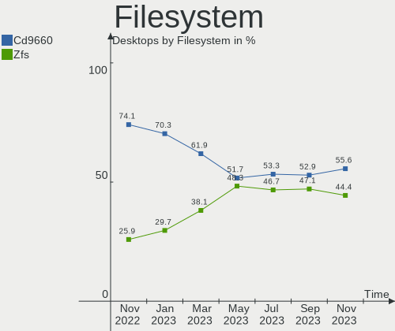
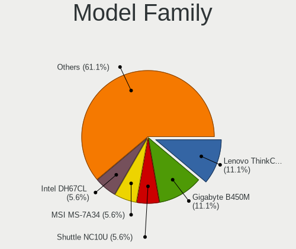
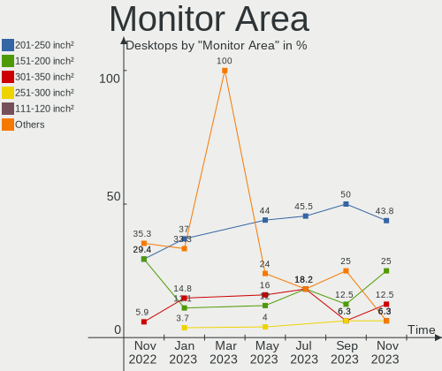
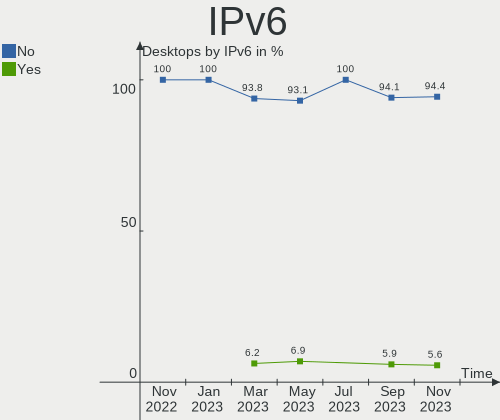

helloSystem Hardware Trends (Desktops)
--------------------------------------

A project to identify most popular hardware characteristics and track their change
over time based on data collected by helloSystem users at https://BSD-Hardware.info.

Anyone can contribute to this report by the [hw-probe](https://github.com/linuxhw/hw-probe/blob/master/INSTALL.BSD.md) tool:

    hw-probe -all -upload

This report is for one last month. Overall report since the beginning of time: [TestCoverage](https://github.com/bsdhw/TestCoverage)

Period: Apr, 2022.

Contents
--------

* [ System ](#system)
  - [ OS                       ](#os)
  - [ OS Family                ](#os-family)
  - [ Arch                     ](#arch)
  - [ DE                       ](#de)
  - [ Display Server           ](#display-server)
  - [ Display Manager          ](#display-manager)
  - [ OS Lang                  ](#os-lang)
  - [ Boot Mode                ](#boot-mode)
  - [ Filesystem               ](#filesystem)
  - [ Part. scheme             ](#part-scheme)

* [ Board ](#board)
  - [ Vendor                   ](#vendor)
  - [ Model                    ](#model)
  - [ Model Family             ](#model-family)
  - [ MFG Year                 ](#mfg-year)
  - [ Form Factor              ](#form-factor)
  - [ Coreboot                 ](#coreboot)
  - [ RAM Size                 ](#ram-size)
  - [ RAM Used                 ](#ram-used)
  - [ Total Drives             ](#total-drives)
  - [ Has CD-ROM               ](#has-cd-rom)
  - [ Has Ethernet             ](#has-ethernet)
  - [ Has WiFi                 ](#has-wifi)
  - [ Has Bluetooth            ](#has-bluetooth)

* [ Location ](#location)
  - [ Country                  ](#country)
  - [ City                     ](#city)

* [ Drives ](#drives)
  - [ Drive Vendor             ](#drive-vendor)
  - [ Drive Model              ](#drive-model)
  - [ HDD Vendor               ](#hdd-vendor)
  - [ SSD Vendor               ](#ssd-vendor)
  - [ Drive Kind               ](#drive-kind)
  - [ Drive Connector          ](#drive-connector)
  - [ Drive Size               ](#drive-size)
  - [ Space Total              ](#space-total)
  - [ Space Used               ](#space-used)
  - [ Malfunc. Drives          ](#malfunc-drives)
  - [ Malfunc. Drive Vendor    ](#malfunc-drive-vendor)
  - [ Malfunc. HDD Vendor      ](#malfunc-hdd-vendor)
  - [ Malfunc. Drive Kind      ](#malfunc-drive-kind)
  - [ Failed Drives            ](#failed-drives)
  - [ Failed Drive Vendor      ](#failed-drive-vendor)
  - [ Drive Status             ](#drive-status)

* [ Storage controller ](#storage-controller)
  - [ Storage Vendor           ](#storage-vendor)
  - [ Storage Model            ](#storage-model)
  - [ Storage Kind             ](#storage-kind)

* [ Processor ](#processor)
  - [ CPU Vendor               ](#cpu-vendor)
  - [ CPU Model                ](#cpu-model)
  - [ CPU Model Family         ](#cpu-model-family)
  - [ CPU Cores                ](#cpu-cores)
  - [ CPU Sockets              ](#cpu-sockets)
  - [ CPU Threads              ](#cpu-threads)
  - [ CPU Microarch            ](#cpu-microarch)

* [ Graphics ](#graphics)
  - [ GPU Vendor               ](#gpu-vendor)
  - [ GPU Model                ](#gpu-model)
  - [ GPU Combo                ](#gpu-combo)
  - [ GPU Driver               ](#gpu-driver)
  - [ GPU Memory               ](#gpu-memory)

* [ Monitor ](#monitor)
  - [ Monitor Vendor           ](#monitor-vendor)
  - [ Monitor Model            ](#monitor-model)
  - [ Monitor Resolution       ](#monitor-resolution)
  - [ Monitor Diagonal         ](#monitor-diagonal)
  - [ Monitor Width            ](#monitor-width)
  - [ Aspect Ratio             ](#aspect-ratio)
  - [ Monitor Area             ](#monitor-area)
  - [ Pixel Density            ](#pixel-density)
  - [ Multiple Monitors        ](#multiple-monitors)

* [ Network ](#network)
  - [ Net Controller Vendor    ](#net-controller-vendor)
  - [ Net Controller Model     ](#net-controller-model)
  - [ Wireless Vendor          ](#wireless-vendor)
  - [ Wireless Model           ](#wireless-model)
  - [ Ethernet Vendor          ](#ethernet-vendor)
  - [ Ethernet Model           ](#ethernet-model)
  - [ Net Controller Kind      ](#net-controller-kind)
  - [ Used Controller          ](#used-controller)
  - [ NICs                     ](#nics)
  - [ IPv6                     ](#ipv6)

* [ Bluetooth ](#bluetooth)
  - [ Bluetooth Vendor         ](#bluetooth-vendor)
  - [ Bluetooth Model          ](#bluetooth-model)

* [ Sound ](#sound)
  - [ Sound Vendor             ](#sound-vendor)
  - [ Sound Model              ](#sound-model)

* [ Memory ](#memory)
  - [ Memory Vendor            ](#memory-vendor)
  - [ Memory Model             ](#memory-model)
  - [ Memory Kind              ](#memory-kind)
  - [ Memory Form Factor       ](#memory-form-factor)
  - [ Memory Size              ](#memory-size)
  - [ Memory Speed             ](#memory-speed)

* [ Printers & scanners ](#printers--scanners)
  - [ Printer Vendor           ](#printer-vendor)
  - [ Printer Model            ](#printer-model)
  - [ Scanner Vendor           ](#scanner-vendor)
  - [ Scanner Model            ](#scanner-model)

* [ Camera ](#camera)
  - [ Camera Vendor            ](#camera-vendor)
  - [ Camera Model             ](#camera-model)

* [ Security ](#security)
  - [ Fingerprint Vendor       ](#fingerprint-vendor)
  - [ Fingerprint Model        ](#fingerprint-model)
  - [ Chipcard Vendor          ](#chipcard-vendor)
  - [ Chipcard Model           ](#chipcard-model)

* [ Unsupported ](#unsupported)
  - [ Unsupported Devices      ](#unsupported-devices)
  - [ Unsupported Device Types ](#unsupported-device-types)

System
------

OS
--

Installed operating systems

| Name              | Desktops | Percent |
|-------------------|----------|---------|
| helloSystem 0.7.0 | 21       | 87.5%   |
| helloSystem 0.8.0 | 1        | 4.17%   |
| helloSystem 0.5.0 | 1        | 4.17%   |
| helloSystem 0.4.0 | 1        | 4.17%   |

OS Family
---------

OS without a version

| Name        | Desktops | Percent |
|-------------|----------|---------|
| helloSystem | 24       | 100%    |

Arch
----

OS architecture (x86_64, i586, etc.)

| Name  | Desktops | Percent |
|-------|----------|---------|
| amd64 | 24       | 100%    |

DE
--

Desktop Environment

| Name         | Desktops | Percent |
|--------------|----------|---------|
| helloDesktop | 24       | 100%    |

Display Server
--------------

X11 or Wayland

| Name | Desktops | Percent |
|------|----------|---------|
| X11  | 24       | 100%    |

Display Manager
---------------

SDDM, LightDM, etc.

| Name | Desktops | Percent |
|------|----------|---------|
| SLiM | 24       | 100%    |

OS Lang
-------

Language

| Lang  | Desktops | Percent |
|-------|----------|---------|
| en_US | 21       | 87.5%   |
| es_ES | 2        | 8.33%   |
| fr_FR | 1        | 4.17%   |

Boot Mode
---------

EFI or BIOS

| Mode | Desktops | Percent |
|------|----------|---------|
| EFI  | 24       | 100%    |

Filesystem
----------

Type of filesystem

| Type   | Desktops | Percent |
|--------|----------|---------|
| Cd9660 | 13       | 54.17%  |
| Zfs    | 11       | 45.83%  |

Part. scheme
------------

Scheme of partitioning

| Type | Desktops | Percent |
|------|----------|---------|
| GPT  | 24       | 100%    |

Board
-----

Vendor
------

Motherboard manufacturer

| Name                | Desktops | Percent |
|---------------------|----------|---------|
| ASUSTek Computer    | 9        | 37.5%   |
| Gigabyte Technology | 3        | 12.5%   |
| Hewlett-Packard     | 2        | 8.33%   |
| Dell                | 2        | 8.33%   |
| ASRock              | 2        | 8.33%   |
| Supermicro          | 1        | 4.17%   |
| MSI                 | 1        | 4.17%   |
| Lenovo              | 1        | 4.17%   |
| Intel               | 1        | 4.17%   |
| BESSTAR Tech        | 1        | 4.17%   |
| Acidanthera         | 1        | 4.17%   |

Model
-----

Motherboard model

| Name                                | Desktops | Percent |
|-------------------------------------|----------|---------|
| Supermicro X9DAL                    | 1        | 4.17%   |
| MSI MS-7369                         | 1        | 4.17%   |
| Lenovo ThinkCentre M700 10GS        | 1        | 4.17%   |
| Intel H55                           | 1        | 4.17%   |
| HP EliteDesk 700 G1 SFF             | 1        | 4.17%   |
| HP Compaq dc7800p Small Form Factor | 1        | 4.17%   |
| Gigabyte OPTIMA B0307               | 1        | 4.17%   |
| Gigabyte E3000N                     | 1        | 4.17%   |
| Gigabyte B450 AORUS M               | 1        | 4.17%   |
| Dell OptiPlex 990                   | 1        | 4.17%   |
| Dell OptiPlex 7040                  | 1        | 4.17%   |
| BESSTAR Tech UM250                  | 1        | 4.17%   |
| ASUS TUF B450-PRO GAMING            | 1        | 4.17%   |
| ASUS PRIME Z390M-PLUS               | 1        | 4.17%   |
| ASUS PRIME X399-A                   | 1        | 4.17%   |
| ASUS PRIME B350-PLUS                | 1        | 4.17%   |
| ASUS P8Z77-V LX                     | 1        | 4.17%   |
| ASUS P5G41T-M LX3                   | 1        | 4.17%   |
| ASUS M5A97 LE R2.0                  | 1        | 4.17%   |
| ASUS M4A88T-M                       | 1        | 4.17%   |
| ASUS CROSSHAIR V FORMULA-Z          | 1        | 4.17%   |
| ASRock X570 Phantom Gaming 4        | 1        | 4.17%   |
| ASRock G950                         | 1        | 4.17%   |
| Acidanthera MacPro6,1               | 1        | 4.17%   |

Model Family
------------

Motherboard model prefix

| Name                | Desktops | Percent |
|---------------------|----------|---------|
| ASUS PRIME          | 3        | 12.5%   |
| Dell OptiPlex       | 2        | 8.33%   |
| Supermicro X9DAL    | 1        | 4.17%   |
| MSI MS-7369         | 1        | 4.17%   |
| Lenovo ThinkCentre  | 1        | 4.17%   |
| Intel H55           | 1        | 4.17%   |
| HP EliteDesk        | 1        | 4.17%   |
| HP Compaq           | 1        | 4.17%   |
| Gigabyte OPTIMA     | 1        | 4.17%   |
| Gigabyte E3000N     | 1        | 4.17%   |
| Gigabyte B450       | 1        | 4.17%   |
| BESSTAR Tech UM250  | 1        | 4.17%   |
| ASUS TUF            | 1        | 4.17%   |
| ASUS P8Z77-V        | 1        | 4.17%   |
| ASUS P5G41T-M       | 1        | 4.17%   |
| ASUS M5A97          | 1        | 4.17%   |
| ASUS M4A88T-M       | 1        | 4.17%   |
| ASUS CROSSHAIR      | 1        | 4.17%   |
| ASRock X570         | 1        | 4.17%   |
| ASRock G950         | 1        | 4.17%   |
| Acidanthera MacPro6 | 1        | 4.17%   |

MFG Year
--------

Motherboard manufacture year

| Year | Desktops | Percent |
|------|----------|---------|
| 2021 | 5        | 20.83%  |
| 2019 | 4        | 16.67%  |
| 2018 | 4        | 16.67%  |
| 2010 | 3        | 12.5%   |
| 2016 | 2        | 8.33%   |
| 2014 | 2        | 8.33%   |
| 2011 | 2        | 8.33%   |
| 2015 | 1        | 4.17%   |
| 2012 | 1        | 4.17%   |

Form Factor
-----------

Physical design of the computer

| Name    | Desktops | Percent |
|---------|----------|---------|
| Desktop | 24       | 100%    |

Coreboot
--------

Have coreboot on board

| Used | Desktops | Percent |
|------|----------|---------|
| No   | 24       | 100%    |

RAM Size
--------

Total RAM memory

| Size in GB  | Desktops | Percent |
|-------------|----------|---------|
| 16.01-24.0  | 9        | 37.5%   |
| 4.01-8.0    | 6        | 25%     |
| 8.01-16.0   | 4        | 16.67%  |
| 32.01-64.0  | 2        | 8.33%   |
| 64.01-256.0 | 2        | 8.33%   |
| 24.01-32.0  | 1        | 4.17%   |

RAM Used
--------

Used RAM memory

| Used GB  | Desktops | Percent |
|----------|----------|---------|
| 0.51-1.0 | 9        | 37.5%   |
| 0.01-0.5 | 9        | 37.5%   |
| 1.01-2.0 | 5        | 20.83%  |
| 2.01-3.0 | 1        | 4.17%   |

Total Drives
------------

Number of drives on board

| Drives | Desktops | Percent |
|--------|----------|---------|
| 1      | 13       | 54.17%  |
| 2      | 4        | 16.67%  |
| 4      | 3        | 12.5%   |
| 3      | 2        | 8.33%   |
| 9      | 1        | 4.17%   |
| 0      | 1        | 4.17%   |

Has CD-ROM
----------

Has CD-ROM on board

| Presented | Desktops | Percent |
|-----------|----------|---------|
| No        | 15       | 62.5%   |
| Yes       | 9        | 37.5%   |

Has Ethernet
------------

Has Ethernet on board

| Presented | Desktops | Percent |
|-----------|----------|---------|
| Yes       | 24       | 100%    |

Has WiFi
--------

Has WiFi module

| Presented | Desktops | Percent |
|-----------|----------|---------|
| No        | 16       | 66.67%  |
| Yes       | 8        | 33.33%  |

Has Bluetooth
-------------

Has Bluetooth module

| Presented | Desktops | Percent |
|-----------|----------|---------|
| No        | 20       | 83.33%  |
| Yes       | 4        | 16.67%  |

Location
--------

Country
-------

Geographic location (country)

| Country   | Desktops | Percent |
|-----------|----------|---------|
| USA       | 5        | 20.83%  |
| Russia    | 3        | 12.5%   |
| Germany   | 2        | 8.33%   |
| France    | 2        | 8.33%   |
| Brazil    | 2        | 8.33%   |
| Ukraine   | 1        | 4.17%   |
| Turkey    | 1        | 4.17%   |
| Spain     | 1        | 4.17%   |
| Portugal  | 1        | 4.17%   |
| Poland    | 1        | 4.17%   |
| Panama    | 1        | 4.17%   |
| Italy     | 1        | 4.17%   |
| India     | 1        | 4.17%   |
| Iceland   | 1        | 4.17%   |
| Argentina | 1        | 4.17%   |

City
----

Geographic location (city)

| City                    | Desktops | Percent |
|-------------------------|----------|---------|
| Tampa                   | 1        | 4.17%   |
| St Petersburg           | 1        | 4.17%   |
| Sparta                  | 1        | 4.17%   |
| Reykjavik               | 1        | 4.17%   |
| Paris                   | 1        | 4.17%   |
| Panama City             | 1        | 4.17%   |
| Moscow                  | 1        | 4.17%   |
| Kyiv                    | 1        | 4.17%   |
| Kiselëvsk              | 1        | 4.17%   |
| Jedlicze                | 1        | 4.17%   |
| Istanbul                | 1        | 4.17%   |
| Independence            | 1        | 4.17%   |
| Hyères                 | 1        | 4.17%   |
| Gaildorf                | 1        | 4.17%   |
| Curitiba                | 1        | 4.17%   |
| Cruzeiro do Sul         | 1        | 4.17%   |
| Chennai                 | 1        | 4.17%   |
| Chemnitz                | 1        | 4.17%   |
| Champlin                | 1        | 4.17%   |
| Castilleja de la Cuesta | 1        | 4.17%   |
| Caranguejeira           | 1        | 4.17%   |
| Buenos Aires            | 1        | 4.17%   |
| Bolivar                 | 1        | 4.17%   |
| Belluno                 | 1        | 4.17%   |

Drives
------

Drive Vendor
------------

Hard drive vendors

| Vendor              | Desktops | Drives | Percent |
|---------------------|----------|--------|---------|
| WDC                 | 6        | 10     | 15.79%  |
| Seagate             | 6        | 8      | 15.79%  |
| Toshiba             | 4        | 4      | 10.53%  |
| Kingston            | 3        | 3      | 7.89%   |
| A-DATA Technology   | 3        | 4      | 7.89%   |
| SanDisk             | 2        | 2      | 5.26%   |
| Samsung Electronics | 2        | 3      | 5.26%   |
| Intenso             | 2        | 3      | 5.26%   |
| Crucial             | 2        | 2      | 5.26%   |
| PNY                 | 1        | 1      | 2.63%   |
| Phison              | 1        | 1      | 2.63%   |
| LITEON              | 1        | 1      | 2.63%   |
| Leven               | 1        | 2      | 2.63%   |
| Hitachi             | 1        | 1      | 2.63%   |
| Gigabyte Technology | 1        | 1      | 2.63%   |
| EMTEC               | 1        | 1      | 2.63%   |
| Apple               | 1        | 1      | 2.63%   |

Drive Model
-----------

Hard drive models

| Model                               | Desktops | Percent |
|-------------------------------------|----------|---------|
| WDC WDS100T2B0C-00PXH0 1TB          | 2        | 4.55%   |
| Seagate ST1000DM003-1ER162 1TB      | 2        | 4.55%   |
| Kingston SA400S37120G 120GB         | 2        | 4.55%   |
| WDC WDS200T2B0C-00PXH0 2TB          | 1        | 2.27%   |
| WDC WD60EZRZ-00RWYB1 6TB            | 1        | 2.27%   |
| WDC WD5000LPLX-08ZNTT0 500GB        | 1        | 2.27%   |
| WDC WD3200AAJS-00YZCA0 320GB        | 1        | 2.27%   |
| WDC WD10EZEX-00BN5A0 1TB            | 1        | 2.27%   |
| Toshiba MQ01ABF050 500GB            | 1        | 2.27%   |
| Toshiba HDWE140 4TB                 | 1        | 2.27%   |
| Toshiba HDWD240 4TB                 | 1        | 2.27%   |
| Toshiba HDWD110 1TB                 | 1        | 2.27%   |
| Seagate ST8000NM0055-1RM112 8TB     | 1        | 2.27%   |
| Seagate ST3500418AS 500GB           | 1        | 2.27%   |
| Seagate ST3500413AS 500GB           | 1        | 2.27%   |
| Seagate ST320LT020-9YG142 320GB     | 1        | 2.27%   |
| Seagate ST12000NM0008-2H3101 12TB   | 1        | 2.27%   |
| Seagate ST1000DM010-2EP102 1TB      | 1        | 2.27%   |
| SanDisk SDSSDH2128G 128GB           | 1        | 2.27%   |
| SanDisk SDSSDA120G 120GB            | 1        | 2.27%   |
| Samsung SSD 980 PRO 1TB             | 1        | 2.27%   |
| Samsung SSD 960 EVO 1TB             | 1        | 2.27%   |
| Samsung SSD 860 EVO 250GB           | 1        | 2.27%   |
| PNY SSD2SC120G1CS1754D117-551 120GB | 1        | 2.27%   |
| Phison Sabrent Rocket Q 1TB         | 1        | 2.27%   |
| LITEON LCH-256V2S 256GB             | 1        | 2.27%   |
| Leven JAJS600M256C 256GB            | 1        | 2.27%   |
| Kingston OM8P0S3256B-A0 256GB       | 1        | 2.27%   |
| Intenso SSD SATAIII 256GB           | 1        | 2.27%   |
| Intenso SSD SATA III 480GB          | 1        | 2.27%   |
| Intenso SSD 240GB                   | 1        | 2.27%   |
| Hitachi HTS547550A9E384 500GB       | 1        | 2.27%   |
| Gigabyte GP-GSTFS31240GNTD 240GB    | 1        | 2.27%   |
| EMTEC X150 120GB                    | 1        | 2.27%   |
| Crucial CT275MX300SSD1 275GB        | 1        | 2.27%   |
| Crucial CT240BX500SSD1 240GB        | 1        | 2.27%   |
| Apple SSD SM256E 256GB              | 1        | 2.27%   |
| A-DATA SX8200PNP 512GB              | 1        | 2.27%   |
| A-DATA SX6000PNP 512GB              | 1        | 2.27%   |
| A-DATA SU650 120GB                  | 1        | 2.27%   |
| A-DATA SU635 240GB                  | 1        | 2.27%   |

HDD Vendor
----------

Hard disk drive vendors

| Vendor  | Desktops | Drives | Percent |
|---------|----------|--------|---------|
| Seagate | 6        | 8      | 40%     |
| WDC     | 4        | 4      | 26.67%  |
| Toshiba | 4        | 4      | 26.67%  |
| Hitachi | 1        | 1      | 6.67%   |

SSD Vendor
----------

Solid state drive vendors

| Vendor              | Desktops | Drives | Percent |
|---------------------|----------|--------|---------|
| Kingston            | 3        | 3      | 16.67%  |
| SanDisk             | 2        | 2      | 11.11%  |
| Intenso             | 2        | 3      | 11.11%  |
| Crucial             | 2        | 2      | 11.11%  |
| A-DATA Technology   | 2        | 2      | 11.11%  |
| Samsung Electronics | 1        | 1      | 5.56%   |
| PNY                 | 1        | 1      | 5.56%   |
| LITEON              | 1        | 1      | 5.56%   |
| Leven               | 1        | 2      | 5.56%   |
| Gigabyte Technology | 1        | 1      | 5.56%   |
| EMTEC               | 1        | 1      | 5.56%   |
| Apple               | 1        | 1      | 5.56%   |

Drive Kind
----------

HDD or SSD

| Kind | Desktops | Drives | Percent |
|------|----------|--------|---------|
| SSD  | 13       | 20     | 40.63%  |
| HDD  | 13       | 17     | 40.63%  |
| NVMe | 6        | 11     | 18.75%  |

Drive Connector
---------------

SATA, SAS, NVMe, etc.

| Type | Desktops | Drives | Percent |
|------|----------|--------|---------|
| SATA | 22       | 37     | 78.57%  |
| NVMe | 6        | 11     | 21.43%  |

Drive Size
----------

Size of hard drive

| Size in TB | Desktops | Drives | Percent |
|------------|----------|--------|---------|
| 0.01-0.5   | 20       | 27     | 68.97%  |
| 0.51-1.0   | 5        | 5      | 17.24%  |
| 3.01-4.0   | 2        | 2      | 6.9%    |
| 10.01-20.0 | 1        | 1      | 3.45%   |
| 4.01-10.0  | 1        | 2      | 3.45%   |

Space Total
-----------

Amount of disk space available on the file system

| Size in GB | Desktops | Percent |
|------------|----------|---------|
| 1-20       | 15       | 62.5%   |
| 101-250    | 5        | 20.83%  |
| 251-500    | 3        | 12.5%   |
| 501-1000   | 1        | 4.17%   |

Space Used
----------

Amount of used disk space

| Used GB | Desktops | Percent |
|---------|----------|---------|
| 1-20    | 24       | 100%    |

Malfunc. Drives
---------------

Drive models with a malfunction

| Model                             | Desktops | Drives | Percent |
|-----------------------------------|----------|--------|---------|
| WDC WD60EZRZ-00RWYB1 6TB          | 1        | 1      | 20%     |
| Seagate ST8000NM0055-1RM112 8TB   | 1        | 1      | 20%     |
| Seagate ST3500413AS 500GB         | 1        | 1      | 20%     |
| Seagate ST1000DM003-1ER162 1TB    | 1        | 1      | 20%     |
| A-DATA Technology SX8200PNP 512GB | 1        | 1      | 20%     |

Malfunc. Drive Vendor
---------------------

Vendors of faulty drives

| Vendor            | Desktops | Drives | Percent |
|-------------------|----------|--------|---------|
| Seagate           | 3        | 3      | 60%     |
| WDC               | 1        | 1      | 20%     |
| A-DATA Technology | 1        | 1      | 20%     |

Malfunc. HDD Vendor
-------------------

Vendors of faulty HDD drives

| Vendor  | Desktops | Drives | Percent |
|---------|----------|--------|---------|
| Seagate | 3        | 3      | 75%     |
| WDC     | 1        | 1      | 25%     |

Malfunc. Drive Kind
-------------------

Kinds of faulty drives

| Kind | Desktops | Drives | Percent |
|------|----------|--------|---------|
| HDD  | 3        | 4      | 75%     |
| NVMe | 1        | 1      | 25%     |

Failed Drives
-------------

Failed drive models

| Model                        | Desktops | Drives | Percent |
|------------------------------|----------|--------|---------|
| WDC WD3200AAJS-00YZCA0 320GB | 1        | 1      | 100%    |

Failed Drive Vendor
-------------------

Failed drive vendors

| Vendor | Desktops | Drives | Percent |
|--------|----------|--------|---------|
| WDC    | 1        | 1      | 100%    |

Drive Status
------------

Number of failed and malfunc. drives

| Status  | Desktops | Drives | Percent |
|---------|----------|--------|---------|
| Works   | 21       | 42     | 84%     |
| Malfunc | 3        | 5      | 12%     |
| Failed  | 1        | 1      | 4%      |

Storage controller
------------------

Storage Vendor
--------------

Storage controller vendors

| Vendor                | Desktops | Percent |
|-----------------------|----------|---------|
| Intel                 | 11       | 32.35%  |
| AMD                   | 11       | 32.35%  |
| Sandisk               | 3        | 8.82%   |
| Samsung Electronics   | 2        | 5.88%   |
| Broadcom / LSI        | 2        | 5.88%   |
| Realtek Semiconductor | 1        | 2.94%   |
| Phison Electronics    | 1        | 2.94%   |
| Nvidia                | 1        | 2.94%   |
| ASMedia Technology    | 1        | 2.94%   |
| ADATA Technology      | 1        | 2.94%   |

Storage Model
-------------

Storage controller models

| Model                                                                          | Desktops | Percent |
|--------------------------------------------------------------------------------|----------|---------|
| AMD FCH SATA Controller [AHCI mode]                                            | 7        | 16.28%  |
| Sandisk WD Blue SN550 NVMe SSD                                                 | 2        | 4.65%   |
| Intel Q170/Q150/B150/H170/H110/Z170/CM236 Chipset SATA Controller [AHCI Mode]  | 2        | 4.65%   |
| Intel C602 chipset 4-Port SATA Storage Control Unit                            | 2        | 4.65%   |
| AMD SB7x0/SB8x0/SB9x0 SATA Controller [AHCI mode]                              | 2        | 4.65%   |
| AMD 400 Series Chipset SATA Controller                                         | 2        | 4.65%   |
| Unknown                                                                        | 2        | 4.65%   |
| Samsung NVMe SSD Controller SM961/PM961/SM963                                  | 1        | 2.33%   |
| Samsung NVMe SSD Controller PM9A1/PM9A3/980PRO                                 | 1        | 2.33%   |
| Phison E12 NVMe Controller                                                     | 1        | 2.33%   |
| Nvidia MCP65 AHCI Controller                                                   | 1        | 2.33%   |
| Intel SATA Controller [RAID mode]                                              | 1        | 2.33%   |
| Intel NM10/ICH7 Family SATA Controller [IDE mode]                              | 1        | 2.33%   |
| Intel Cannon Lake PCH SATA AHCI Controller                                     | 1        | 2.33%   |
| Intel C600/X79 series chipset SATA RAID Controller                             | 1        | 2.33%   |
| Intel C600/X79 series chipset IDE-r Controller                                 | 1        | 2.33%   |
| Intel C600/X79 series chipset 6-Port SATA AHCI Controller                      | 1        | 2.33%   |
| Intel 82Q35 Express PT IDER Controller                                         | 1        | 2.33%   |
| Intel 82801IR/IO/IH (ICH9R/DO/DH) 6 port SATA Controller [AHCI mode]           | 1        | 2.33%   |
| Intel 82801G (ICH7 Family) IDE Controller                                      | 1        | 2.33%   |
| Intel 8 Series/C220 Series Chipset Family 6-port SATA Controller 1 [AHCI mode] | 1        | 2.33%   |
| Intel 7 Series/C210 Series Chipset Family 6-port SATA Controller [AHCI mode]   | 1        | 2.33%   |
| Intel 5 Series/3400 Series Chipset 4 port SATA AHCI Controller                 | 1        | 2.33%   |
| Broadcom / LSI SAS2008 PCI-Express Fusion-MPT SAS-2 [Falcon]                   | 1        | 2.33%   |
| Broadcom / LSI MegaRAID SAS 1078                                               | 1        | 2.33%   |
| ASMedia ASM1062 Serial ATA Controller                                          | 1        | 2.33%   |
| AMD X399 Series Chipset SATA Controller                                        | 1        | 2.33%   |
| AMD SB7x0/SB8x0/SB9x0 SATA Controller [IDE mode]                               | 1        | 2.33%   |
| AMD SB7x0/SB8x0/SB9x0 IDE Controller                                           | 1        | 2.33%   |
| AMD 300 Series Chipset SATA Controller                                         | 1        | 2.33%   |
| ADATA XPG SX8200 Pro PCIe Gen3x4 M.2 2280 Solid State Drive                    | 1        | 2.33%   |

Storage Kind
------------

Kind of storage controller (IDE, SATA, NVMe, SAS, ...)

| Kind | Desktops | Percent |
|------|----------|---------|
| SATA | 19       | 54.29%  |
| NVMe | 6        | 17.14%  |
| IDE  | 4        | 11.43%  |
| RAID | 3        | 8.57%   |
| SAS  | 3        | 8.57%   |

Processor
---------

CPU Vendor
----------

Processor vendors

| Vendor | Desktops | Percent |
|--------|----------|---------|
| Intel  | 12       | 50%     |
| AMD    | 12       | 50%     |

CPU Model
---------

Processor models

| Model                                           | Desktops | Percent |
|-------------------------------------------------|----------|---------|
| AMD Ryzen 5 3600 6-Core Processor               | 2        | 8.33%   |
| Intel Xeon CPU E5-2403 v2 @ 1.80GHz             | 1        | 4.17%   |
| Intel Xeon CPU E5-1620 @ 3.60GHz                | 1        | 4.17%   |
| Intel Pentium CPU G4400 @ 3.30GHz               | 1        | 4.17%   |
| Intel Core i7-6700 CPU @ 3.40GHz                | 1        | 4.17%   |
| Intel Core i5-9400 CPU @ 2.90GHz                | 1        | 4.17%   |
| Intel Core i5-4590 CPU @ 3.30GHz                | 1        | 4.17%   |
| Intel Core i5-4570 CPU @ 3.20GHz                | 1        | 4.17%   |
| Intel Core i5-3450 CPU @ 3.10GHz                | 1        | 4.17%   |
| Intel Core i5-2400S CPU @ 2.50GH                | 1        | 4.17%   |
| Intel Core i5 CPU 650 @ 3.20GHz                 | 1        | 4.17%   |
| Intel Core 2 Quad CPU Q8300 @ 2.50GHz           | 1        | 4.17%   |
| Intel Core 2 Duo CPU E6750 @ 2.66GHz            | 1        | 4.17%   |
| AMD Ryzen Threadripper 2970WX 24-Core Processor | 1        | 4.17%   |
| AMD Ryzen 9 5950X 16-Core Processor             | 1        | 4.17%   |
| AMD Ryzen 9 3900X 12-Core Processor             | 1        | 4.17%   |
| AMD Ryzen 7 2700X Eight-Core Processor          | 1        | 4.17%   |
| AMD Ryzen 5 PRO 2500U w/ Radeon Vega Mobile Gfx | 1        | 4.17%   |
| AMD FX-8320 Eight-Core Processor                | 1        | 4.17%   |
| AMD FX-8300 Eight-Core Processor                | 1        | 4.17%   |
| AMD E2-3000 APU with Radeon HD Graphics         | 1        | 4.17%   |
| AMD Athlon II X4 635 Processor                  | 1        | 4.17%   |
| AMD Athlon Dual Core Processor 4850e            | 1        | 4.17%   |

CPU Model Family
----------------

Processor model prefix

| Model                  | Desktops | Percent |
|------------------------|----------|---------|
| Intel Core i5          | 6        | 25%     |
| Intel Xeon             | 2        | 8.33%   |
| AMD Ryzen 9            | 2        | 8.33%   |
| AMD Ryzen 5            | 2        | 8.33%   |
| AMD FX                 | 2        | 8.33%   |
| Intel Pentium          | 1        | 4.17%   |
| Intel Core i7          | 1        | 4.17%   |
| Intel Core 2 Quad      | 1        | 4.17%   |
| Intel Core 2 Duo       | 1        | 4.17%   |
| AMD Ryzen Threadripper | 1        | 4.17%   |
| AMD Ryzen 7            | 1        | 4.17%   |
| AMD Ryzen 5 PRO        | 1        | 4.17%   |
| AMD E2                 | 1        | 4.17%   |
| AMD Athlon II X4       | 1        | 4.17%   |
| AMD Athlon Dual Core   | 1        | 4.17%   |

CPU Cores
---------

Number of processor cores

| Number | Desktops | Percent |
|--------|----------|---------|
| 4      | 8        | 33.33%  |
| 2      | 5        | 20.83%  |
| 8      | 4        | 16.67%  |
| 12     | 2        | 8.33%   |
| 48     | 1        | 4.17%   |
| 32     | 1        | 4.17%   |
| 24     | 1        | 4.17%   |
| 16     | 1        | 4.17%   |
| 6      | 1        | 4.17%   |

CPU Sockets
-----------

Number of sockets

| Number | Desktops | Percent |
|--------|----------|---------|
| 1      | 23       | 95.83%  |
| 2      | 1        | 4.17%   |

CPU Threads
-----------

Threads per core (Hyper-Threading)

| Number | Desktops | Percent |
|--------|----------|---------|
| 1      | 21       | 87.5%   |
| 2      | 3        | 12.5%   |

CPU Microarch
-------------

Microarchitecture

| Name        | Desktops | Percent |
|-------------|----------|---------|
| Zen 2       | 3        | 12.5%   |
| Zen+        | 2        | 8.33%   |
| Skylake     | 2        | 8.33%   |
| SandyBridge | 2        | 8.33%   |
| Piledriver  | 2        | 8.33%   |
| IvyBridge   | 2        | 8.33%   |
| Haswell     | 2        | 8.33%   |
| Zen 3       | 1        | 4.17%   |
| Zen         | 1        | 4.17%   |
| Westmere    | 1        | 4.17%   |
| Penryn      | 1        | 4.17%   |
| KabyLake    | 1        | 4.17%   |
| K8 Hammer   | 1        | 4.17%   |
| K10         | 1        | 4.17%   |
| Jaguar      | 1        | 4.17%   |
| Core        | 1        | 4.17%   |

Graphics
--------

GPU Vendor
----------

Vendors of graphics cards

| Vendor | Desktops | Percent |
|--------|----------|---------|
| Nvidia | 9        | 37.5%   |
| AMD    | 9        | 37.5%   |
| Intel  | 6        | 25%     |

GPU Model
---------

Graphics card models

| Model                                                                       | Desktops | Percent |
|-----------------------------------------------------------------------------|----------|---------|
| Nvidia GT218 [GeForce 210]                                                  | 2        | 8.33%   |
| Intel Xeon E3-1200 v3/4th Gen Core Processor Integrated Graphics Controller | 2        | 8.33%   |
| AMD Ellesmere [Radeon RX 470/480/570/570X/580/580X/590]                     | 2        | 8.33%   |
| Nvidia TU117 [GeForce GTX 1650]                                             | 1        | 4.17%   |
| Nvidia TU116 [GeForce GTX 1660 Ti]                                          | 1        | 4.17%   |
| Nvidia TU116 [GeForce GTX 1660 SUPER]                                       | 1        | 4.17%   |
| Nvidia GF119 [GeForce GT 610]                                               | 1        | 4.17%   |
| Nvidia GF114 [GeForce GTX 560]                                              | 1        | 4.17%   |
| Nvidia GF108 [GeForce GT 730]                                               | 1        | 4.17%   |
| Nvidia GA104 [GeForce RTX 3070 Ti]                                          | 1        | 4.17%   |
| Intel Xeon E3-1200 v2/3rd Gen Core processor Graphics Controller            | 1        | 4.17%   |
| Intel HD Graphics 530                                                       | 1        | 4.17%   |
| Intel HD Graphics 510                                                       | 1        | 4.17%   |
| Intel Core Processor Integrated Graphics Controller                         | 1        | 4.17%   |
| AMD Turks XT [Radeon HD 6670/7670]                                          | 1        | 4.17%   |
| AMD RS880 [Radeon HD 4250]                                                  | 1        | 4.17%   |
| AMD Raven Ridge [Radeon Vega Series / Radeon Vega Mobile Series]            | 1        | 4.17%   |
| AMD Navi 22 [Radeon RX 6700/6700 XT/6750 XT / 6800M]                        | 1        | 4.17%   |
| AMD Navi 21 [Radeon RX 6800/6800 XT / 6900 XT]                              | 1        | 4.17%   |
| AMD Kabini [Radeon HD 8280 / R3 Series]                                     | 1        | 4.17%   |
| AMD Baffin [Radeon RX 550 640SP / RX 560/560X]                              | 1        | 4.17%   |

GPU Combo
---------

Combinations of graphics cards

| Name       | Desktops | Percent |
|------------|----------|---------|
| 1 x Nvidia | 9        | 37.5%   |
| 1 x AMD    | 9        | 37.5%   |
| 1 x Intel  | 6        | 25%     |

GPU Driver
----------

Free vs proprietary

| Driver      | Desktops | Percent |
|-------------|----------|---------|
| Free        | 18       | 75%     |
| Proprietary | 6        | 25%     |

GPU Memory
----------

Total video memory

| Size in GB | Desktops | Percent |
|------------|----------|---------|
| Unknown    | 11       | 45.83%  |
| 0.51-1.0   | 4        | 16.67%  |
| 3.01-4.0   | 3        | 12.5%   |
| 0.01-0.5   | 3        | 12.5%   |
| 5.01-6.0   | 2        | 8.33%   |
| 7.01-8.0   | 1        | 4.17%   |

Monitor
-------

Monitor Vendor
--------------

Monitor vendors

| Vendor               | Desktops | Percent |
|----------------------|----------|---------|
| Goldstar             | 5        | 29.41%  |
| Dell                 | 3        | 17.65%  |
| ViewSonic            | 2        | 11.76%  |
| Toshiba              | 1        | 5.88%   |
| Samsung Electronics  | 1        | 5.88%   |
| Hewlett-Packard      | 1        | 5.88%   |
| ASUSTek Computer     | 1        | 5.88%   |
| AOC                  | 1        | 5.88%   |
| Ancor Communications | 1        | 5.88%   |
| Acer                 | 1        | 5.88%   |

Monitor Model
-------------

Monitor models

| Model                                                                 | Desktops | Percent |
|-----------------------------------------------------------------------|----------|---------|
| ViewSonic VX1940w VSC6A20 1680x1050 410x260mm 19.1-inch               | 1        | 5.26%   |
| ViewSonic LCD Monitor VSCBD2B 1920x1080 480x270mm 21.7-inch           | 1        | 5.26%   |
| Toshiba TV TSB0110 1920x1080 1110x620mm 50.1-inch                     | 1        | 5.26%   |
| Samsung Electronics SyncMaster SAM0601 1600x900                       | 1        | 5.26%   |
| Samsung Electronics SyncMaster SAM0116 1024x768 280x210mm 13.8-inch   | 1        | 5.26%   |
| Hewlett-Packard LCD Monitor HPN351A 1920x1080 700x390mm 31.5-inch     | 1        | 5.26%   |
| Goldstar W2043 GSM4E9D 1600x900 450x250mm 20.3-inch                   | 1        | 5.26%   |
| Goldstar LG Ultra HD GSM5B09 3840x2160 600x340mm 27.2-inch            | 1        | 5.26%   |
| Goldstar LG HDR WFHD GSM7714 2560x1080 800x340mm 34.2-inch            | 1        | 5.26%   |
| Goldstar LCD Monitor GSM5AB7 1920x1080 480x270mm 21.7-inch            | 1        | 5.26%   |
| Goldstar LCD Monitor GSM5AB6 1920x1080 480x270mm 21.7-inch            | 1        | 5.26%   |
| Dell U2412M DELA07A 1920x1200 520x320mm 24.0-inch                     | 1        | 5.26%   |
| Dell S2418HN/NX DEL4123 1920x1080 530x300mm 24.0-inch                 | 1        | 5.26%   |
| Dell IN2020M DELF029 1600x900 440x250mm 19.9-inch                     | 1        | 5.26%   |
| ASUSTek Computer VZ279 AUS27C0 1920x1080 600x340mm 27.2-inch          | 1        | 5.26%   |
| AOC 24G2W1G4 AOC2402 1920x1080 530x300mm 24.0-inch                    | 1        | 5.26%   |
| Ancor Communications ASUS VW198 ACI19AA 1680x1050 400x250mm 18.6-inch | 1        | 5.26%   |
| Acer KA242Y ACR073C 1920x1080 530x300mm 24.0-inch                     | 1        | 5.26%   |
| Acer EG240Y ACR077B 1920x1080 530x300mm 24.0-inch                     | 1        | 5.26%   |

Monitor Resolution
------------------

Monitor screen resolution

| Resolution         | Desktops | Percent |
|--------------------|----------|---------|
| 1920x1080 (FHD)    | 9        | 50%     |
| 1600x900 (HD+)     | 3        | 16.67%  |
| 1680x1050 (WSXGA+) | 2        | 11.11%  |
| 3840x2160 (4K)     | 1        | 5.56%   |
| 2560x1080          | 1        | 5.56%   |
| 1920x1200 (WUXGA)  | 1        | 5.56%   |
| 1024x768 (XGA)     | 1        | 5.56%   |

Monitor Diagonal
----------------

Diagonal size in inches

| Inches  | Desktops | Percent |
|---------|----------|---------|
| 24      | 4        | 22.22%  |
| 21      | 3        | 16.67%  |
| 27      | 2        | 11.11%  |
| 19      | 2        | 11.11%  |
| 50      | 1        | 5.56%   |
| 34      | 1        | 5.56%   |
| 31      | 1        | 5.56%   |
| 20      | 1        | 5.56%   |
| 18      | 1        | 5.56%   |
| 13      | 1        | 5.56%   |
| Unknown | 1        | 5.56%   |

Monitor Width
-------------

Physical width

| Width in mm | Desktops | Percent |
|-------------|----------|---------|
| 501-600     | 6        | 33.33%  |
| 401-500     | 6        | 33.33%  |
| 701-800     | 1        | 5.56%   |
| 601-700     | 1        | 5.56%   |
| 351-400     | 1        | 5.56%   |
| 201-300     | 1        | 5.56%   |
| 1001-1500   | 1        | 5.56%   |
| Unknown     | 1        | 5.56%   |

Aspect Ratio
------------

Proportional relationship between the width and the height

| Ratio | Desktops | Percent |
|-------|----------|---------|
| 16/9  | 12       | 70.59%  |
| 16/10 | 3        | 17.65%  |
| 4/3   | 1        | 5.88%   |
| 21/9  | 1        | 5.88%   |

Monitor Area
------------

Area in inch²

| Area in inch² | Desktops | Percent |
|----------------|----------|---------|
| 201-250        | 6        | 33.33%  |
| 151-200        | 4        | 22.22%  |
| 351-500        | 2        | 11.11%  |
| 301-350        | 2        | 11.11%  |
| More than 1000 | 1        | 5.56%   |
| 251-300        | 1        | 5.56%   |
| 91-100         | 1        | 5.56%   |
| Unknown        | 1        | 5.56%   |

Pixel Density
-------------

Pixels per inch

| Density | Desktops | Percent |
|---------|----------|---------|
| 51-100  | 10       | 55.56%  |
| 101-120 | 5        | 27.78%  |
| 1-50    | 1        | 5.56%   |
| 161-240 | 1        | 5.56%   |
| Unknown | 1        | 5.56%   |

Multiple Monitors
-----------------

Total monitors connected

| Total | Desktops | Percent |
|-------|----------|---------|
| 1     | 15       | 62.5%   |
| 0     | 6        | 25%     |
| 2     | 3        | 12.5%   |

Network
-------

Net Controller Vendor
---------------------

Controller vendors

| Vendor                | Desktops | Percent |
|-----------------------|----------|---------|
| Realtek Semiconductor | 14       | 46.67%  |
| Intel                 | 12       | 40%     |
| Qualcomm Atheros      | 2        | 6.67%   |
| D-Link System         | 1        | 3.33%   |
| Broadcom              | 1        | 3.33%   |

Net Controller Model
--------------------

Controller models

| Model                                                             | Desktops | Percent |
|-------------------------------------------------------------------|----------|---------|
| Realtek RTL8111/8168/8411 PCI Express Gigabit Ethernet Controller | 11       | 33.33%  |
| Intel I211 Gigabit Network Connection                             | 3        | 9.09%   |
| Realtek RTL8192CU 802.11n WLAN Adapter                            | 2        | 6.06%   |
| Intel Wi-Fi 6 AX200                                               | 2        | 6.06%   |
| Intel 82579LM Gigabit Network Connection (Lewisville)             | 2        | 6.06%   |
| Realtek RTL8188EUS 802.11n Wireless Network Adapter               | 1        | 3.03%   |
| Realtek RTL810xE PCI Express Fast Ethernet controller             | 1        | 3.03%   |
| Qualcomm Atheros AR93xx Wireless Network Adapter                  | 1        | 3.03%   |
| Qualcomm Atheros AR8151 v2.0 Gigabit Ethernet                     | 1        | 3.03%   |
| Intel Wireless 7265                                               | 1        | 3.03%   |
| Intel Ethernet Connection I217-LM                                 | 1        | 3.03%   |
| Intel Ethernet Connection (7) I219-V                              | 1        | 3.03%   |
| Intel Ethernet Connection (2) I219-LM                             | 1        | 3.03%   |
| Intel 82583V Gigabit Network Connection                           | 1        | 3.03%   |
| Intel 82574L Gigabit Network Connection                           | 1        | 3.03%   |
| Intel 82566DM-2 Gigabit Network Connection                        | 1        | 3.03%   |
| D-Link System DGE-528T Gigabit Ethernet Adapter                   | 1        | 3.03%   |
| Broadcom BCM4360 802.11ac Wireless Network Adapter                | 1        | 3.03%   |

Wireless Vendor
---------------

Wireless vendors

| Vendor                | Desktops | Percent |
|-----------------------|----------|---------|
| Realtek Semiconductor | 3        | 37.5%   |
| Intel                 | 3        | 37.5%   |
| Qualcomm Atheros      | 1        | 12.5%   |
| Broadcom              | 1        | 12.5%   |

Wireless Model
--------------

Wireless models

| Model                                               | Desktops | Percent |
|-----------------------------------------------------|----------|---------|
| Realtek RTL8192CU 802.11n WLAN Adapter              | 2        | 25%     |
| Intel Wi-Fi 6 AX200                                 | 2        | 25%     |
| Realtek RTL8188EUS 802.11n Wireless Network Adapter | 1        | 12.5%   |
| Qualcomm Atheros AR93xx Wireless Network Adapter    | 1        | 12.5%   |
| Intel Wireless 7265                                 | 1        | 12.5%   |
| Broadcom BCM4360 802.11ac Wireless Network Adapter  | 1        | 12.5%   |

Ethernet Vendor
---------------

Ethernet vendors

| Vendor                | Desktops | Percent |
|-----------------------|----------|---------|
| Realtek Semiconductor | 12       | 48%     |
| Intel                 | 11       | 44%     |
| Qualcomm Atheros      | 1        | 4%      |
| D-Link System         | 1        | 4%      |

Ethernet Model
--------------

Ethernet models

| Model                                                             | Desktops | Percent |
|-------------------------------------------------------------------|----------|---------|
| Realtek RTL8111/8168/8411 PCI Express Gigabit Ethernet Controller | 11       | 44%     |
| Intel I211 Gigabit Network Connection                             | 3        | 12%     |
| Intel 82579LM Gigabit Network Connection (Lewisville)             | 2        | 8%      |
| Realtek RTL810xE PCI Express Fast Ethernet controller             | 1        | 4%      |
| Qualcomm Atheros AR8151 v2.0 Gigabit Ethernet                     | 1        | 4%      |
| Intel Ethernet Connection I217-LM                                 | 1        | 4%      |
| Intel Ethernet Connection (7) I219-V                              | 1        | 4%      |
| Intel Ethernet Connection (2) I219-LM                             | 1        | 4%      |
| Intel 82583V Gigabit Network Connection                           | 1        | 4%      |
| Intel 82574L Gigabit Network Connection                           | 1        | 4%      |
| Intel 82566DM-2 Gigabit Network Connection                        | 1        | 4%      |
| D-Link System DGE-528T Gigabit Ethernet Adapter                   | 1        | 4%      |

Net Controller Kind
-------------------

Ethernet, WiFi or modem

| Kind     | Desktops | Percent |
|----------|----------|---------|
| Ethernet | 24       | 75%     |
| WiFi     | 8        | 25%     |

Used Controller
---------------

Currently used network controller

| Kind     | Desktops | Percent |
|----------|----------|---------|
| Ethernet | 21       | 95.45%  |
| WiFi     | 1        | 4.55%   |

NICs
----

Total network controllers on board

| Total | Desktops | Percent |
|-------|----------|---------|
| 1     | 17       | 70.83%  |
| 2     | 6        | 25%     |
| 3     | 1        | 4.17%   |

IPv6
----

IPv6 vs IPv4

| Used | Desktops | Percent |
|------|----------|---------|
| No   | 20       | 83.33%  |
| Yes  | 4        | 16.67%  |

Bluetooth
---------

Bluetooth Vendor
----------------

Controller vendors

| Vendor                     | Desktops | Percent |
|----------------------------|----------|---------|
| Intel                      | 2        | 40%     |
| Integrated System Solution | 1        | 20%     |
| Cambridge Silicon Radio    | 1        | 20%     |
| Apple                      | 1        | 20%     |

Bluetooth Model
---------------

Controller models

| Model                                               | Desktops | Percent |
|-----------------------------------------------------|----------|---------|
| Intel Bluetooth wireless interface                  | 1        | 20%     |
| Intel AX200 Bluetooth                               | 1        | 20%     |
| Integrated System Solution Bluetooth Device         | 1        | 20%     |
| Cambridge Silicon Radio Bluetooth Dongle (HCI mode) | 1        | 20%     |
| Apple Apple Broadcom Built-in Bluetooth             | 1        | 20%     |

Sound
-----

Sound Vendor
------------

Sound card vendors

| Vendor                      | Desktops | Percent |
|-----------------------------|----------|---------|
| AMD                         | 13       | 34.21%  |
| Intel                       | 12       | 31.58%  |
| Nvidia                      | 9        | 23.68%  |
| Logitech                    | 1        | 2.63%   |
| JMTek                       | 1        | 2.63%   |
| FiiO Electronics Technology | 1        | 2.63%   |
| Creative Technology         | 1        | 2.63%   |

Sound Model
-----------

Sound card models

| Model                                                                      | Desktops | Percent |
|----------------------------------------------------------------------------|----------|---------|
| AMD Starship/Matisse HD Audio Controller                                   | 4        | 8.33%   |
| AMD SBx00 Azalia (Intel HDA)                                               | 3        | 6.25%   |
| Nvidia TU116 High Definition Audio Controller                              | 2        | 4.17%   |
| Nvidia High Definition Audio Controller                                    | 2        | 4.17%   |
| Intel Xeon E3-1200 v3/4th Gen Core Processor HD Audio Controller           | 2        | 4.17%   |
| Intel C600/X79 series chipset High Definition Audio Controller             | 2        | 4.17%   |
| Intel 8 Series/C220 Series Chipset High Definition Audio Controller        | 2        | 4.17%   |
| Intel 100 Series/C230 Series Chipset Family HD Audio Controller            | 2        | 4.17%   |
| AMD Navi 21/23 HDMI/DP Audio Controller                                    | 2        | 4.17%   |
| AMD Family 17h (Models 00h-0fh) HD Audio Controller                        | 2        | 4.17%   |
| AMD Ellesmere HDMI Audio [Radeon RX 470/480 / 570/580/590]                 | 2        | 4.17%   |
| Nvidia TU107 GeForce GTX 1650 High Definition Audio Controller             | 1        | 2.08%   |
| Nvidia MCP65 High Definition Audio                                         | 1        | 2.08%   |
| Nvidia GF119 HDMI Audio Controller                                         | 1        | 2.08%   |
| Nvidia GF114 HDMI Audio Controller                                         | 1        | 2.08%   |
| Nvidia GF108 High Definition Audio Controller                              | 1        | 2.08%   |
| Nvidia GA104 High Definition Audio Controller                              | 1        | 2.08%   |
| Logitech G560 Gaming Speaker                                               | 1        | 2.08%   |
| JMTek USB PnP Audio Device                                                 | 1        | 2.08%   |
| Intel NM10/ICH7 Family High Definition Audio Controller                    | 1        | 2.08%   |
| Intel Cannon Lake PCH cAVS                                                 | 1        | 2.08%   |
| Intel 82801I (ICH9 Family) HD Audio Controller                             | 1        | 2.08%   |
| Intel 7 Series/C216 Chipset Family High Definition Audio Controller        | 1        | 2.08%   |
| Intel 6 Series/C200 Series Chipset Family High Definition Audio Controller | 1        | 2.08%   |
| Intel 5 Series/3400 Series Chipset High Definition Audio                   | 1        | 2.08%   |
| FiiO Electronics Technology FiiO M3K                                       | 1        | 2.08%   |
| Creative Technology Sound BlasterX G1                                      | 1        | 2.08%   |
| AMD Turks HDMI Audio [Radeon HD 6500/6600 / 6700M Series]                  | 1        | 2.08%   |
| AMD RS880 HDMI Audio [Radeon HD 4200 Series]                               | 1        | 2.08%   |
| AMD Raven/Raven2/Fenghuang HDMI/DP Audio Controller                        | 1        | 2.08%   |
| AMD Kabini HDMI/DP Audio                                                   | 1        | 2.08%   |
| AMD FCH Azalia Controller                                                  | 1        | 2.08%   |
| AMD Family 17h/19h HD Audio Controller                                     | 1        | 2.08%   |
| AMD Baffin HDMI/DP Audio [Radeon RX 550 640SP / RX 560/560X]               | 1        | 2.08%   |

Memory
------

Memory Vendor
-------------

Memory module vendors

| Vendor              | Desktops | Percent |
|---------------------|----------|---------|
| Kingston            | 7        | 21.88%  |
| Unknown             | 5        | 15.63%  |
| Samsung Electronics | 3        | 9.38%   |
| Corsair             | 3        | 9.38%   |
| Micron Technology   | 2        | 6.25%   |
| Crucial             | 2        | 6.25%   |
| Unifosa             | 1        | 3.13%   |
| Transcend           | 1        | 3.13%   |
| Team                | 1        | 3.13%   |
| TakeMS              | 1        | 3.13%   |
| Super Talent        | 1        | 3.13%   |
| SK Hynix            | 1        | 3.13%   |
| Nanya Technology    | 1        | 3.13%   |
| Goldkey             | 1        | 3.13%   |
| G.Skill             | 1        | 3.13%   |
| A-DATA Technology   | 1        | 3.13%   |

Memory Model
------------

Memory module models

| Model                                                  | Desktops | Percent |
|--------------------------------------------------------|----------|---------|
| Kingston RAM KHX3200C16D4/8GX 8GB DIMM DDR4 3200MT/s   | 2        | 5.13%   |
| Corsair RAM CMK16GX4M2A2666C16 8GB DIMM DDR4 2667MT/s  | 2        | 5.13%   |
| Unknown RAM Module 4GB DIMM SDRAM                      | 1        | 2.56%   |
| Unknown RAM Module 4GB DIMM DDR3 1333MT/s              | 1        | 2.56%   |
| Unknown RAM Module 4GB DIMM 1600MT/s                   | 1        | 2.56%   |
| Unknown RAM Module 2GB DIMM DDR2                       | 1        | 2.56%   |
| Unknown RAM Module 2GB DIMM 1333MT/s                   | 1        | 2.56%   |
| Unifosa RAM GU512303EP0202 2GB DIMM DDR3 1333MT/s      | 1        | 2.56%   |
| Transcend RAM TS128MLQ64V8U 1GB DIMM DDR2 800MT/s      | 1        | 2.56%   |
| Team RAM TEAMGROUP-UD4-3200 16GB DIMM DDR4 3200MT/s    | 1        | 2.56%   |
| TakeMS RAM TMS1GB264C081665QI 1GB DIMM DDR2 667MT/s    | 1        | 2.56%   |
| Super Talent RAM SUPERTALENT02 4GB DIMM DDR3 1333MT/s  | 1        | 2.56%   |
| SK Hynix RAM HMA41GU6AFR8N-TF 8GB DIMM DDR4 2133MT/s   | 1        | 2.56%   |
| Samsung RAM M393B1G70QH0 8GB DIMM DDR3 1333MT/s        | 1        | 2.56%   |
| Samsung RAM M391B5673EH1-CH9 2048MB DIMM DDR3 1333MT/s | 1        | 2.56%   |
| Samsung RAM M378B5773DH0-CH9 2GB DIMM DDR3 1333MT/s    | 1        | 2.56%   |
| Nanya RAM NT2GC64B88B0NF-CG 2GB DIMM DDR3 1333MT/s     | 1        | 2.56%   |
| Micron RAM 9KSF25672AZ-1G6K1 2048MB DIMM DDR3 1600MT/s | 1        | 2.56%   |
| Micron RAM 18KSF51272AZ-1G4M1 4GB DIMM DDR3 1333MT/s   | 1        | 2.56%   |
| Kingston RAM Module 1GB DIMM DDR2 667MT/s              | 1        | 2.56%   |
| Kingston RAM KF3200C16D4/8GX 8GB DIMM DDR4 2400MT/s    | 1        | 2.56%   |
| Kingston RAM HP497157-D88-ELFWG 2GB DIMM DDR3 1333MT/s | 1        | 2.56%   |
| Kingston RAM CBD26D4S9S1ME-8 8GB SODIMM DDR4 2667MT/s  | 1        | 2.56%   |
| Kingston RAM 99U5702-095.A00G 8GB DIMM DDR4 2667MT/s   | 1        | 2.56%   |
| Kingston RAM 99U5471-047.A00LF 8GB DIMM DDR3 1333MT/s  | 1        | 2.56%   |
| Kingston RAM 99U5471-012.A00LF 4GB DIMM DDR3 1333MT/s  | 1        | 2.56%   |
| Kingston RAM 99U5471-002.A01LF 2GB DIMM DDR3 1333MT/s  | 1        | 2.56%   |
| Kingston RAM 99U5471-002.A00LF 2GB DIMM DDR3 1333MT/s  | 1        | 2.56%   |
| Kingston RAM 99U5403-002.A00G 2GB DIMM DDR3 1333MT/s   | 1        | 2.56%   |
| Kingston RAM 9905403-011.A03LF 2GB DIMM DDR3 1333MT/s  | 1        | 2.56%   |
| Goldkey RAM GKH200UD12808-1333 2GB DIMM DDR3 1333MT/s  | 1        | 2.56%   |
| G.Skill RAM F4-3600C16-16GVKC 16GB DIMM DDR4 3600MT/s  | 1        | 2.56%   |
| Crucial RAM CT51264BA160B.C16F 4GB DIMM DDR3 1600MT/s  | 1        | 2.56%   |
| Crucial RAM CT4G4DFS824A.C8FBD2 4GB DIMM DDR4 2133MT/s | 1        | 2.56%   |
| Corsair RAM CMZ8GX3M2A1600C9 4GB DIMM DDR3 1600MT/s    | 1        | 2.56%   |
| Corsair RAM CMK16GX4M2A2400C16 8GB DIMM DDR4 2400MT/s  | 1        | 2.56%   |
| A-DATA RAM DDR4 3000 8GB DIMM DDR4 3400MT/s            | 1        | 2.56%   |

Memory Kind
-----------

Memory module kinds

| Kind    | Desktops | Percent |
|---------|----------|---------|
| DDR4    | 10       | 41.67%  |
| DDR3    | 9        | 37.5%   |
| DDR2    | 2        | 8.33%   |
| Unknown | 2        | 8.33%   |
| SDRAM   | 1        | 4.17%   |

Memory Form Factor
------------------

Physical design of the memory module

| Name   | Desktops | Percent |
|--------|----------|---------|
| DIMM   | 23       | 95.83%  |
| SODIMM | 1        | 4.17%   |

Memory Size
-----------

Memory module size

| Size  | Desktops | Percent |
|-------|----------|---------|
| 8192  | 9        | 33.33%  |
| 4096  | 7        | 25.93%  |
| 2048  | 7        | 25.93%  |
| 16384 | 3        | 11.11%  |
| 1024  | 1        | 3.7%    |

Memory Speed
------------

Memory module speed

| Speed   | Desktops | Percent |
|---------|----------|---------|
| 1333    | 9        | 29.03%  |
| 1600    | 5        | 16.13%  |
| 2667    | 4        | 12.9%   |
| 3200    | 3        | 9.68%   |
| 2400    | 2        | 6.45%   |
| 2133    | 2        | 6.45%   |
| Unknown | 2        | 6.45%   |
| 3600    | 1        | 3.23%   |
| 3400    | 1        | 3.23%   |
| 800     | 1        | 3.23%   |
| 667     | 1        | 3.23%   |

Printers & scanners
-------------------

Printer Vendor
--------------

Printer device vendors

| Vendor          | Desktops | Percent |
|-----------------|----------|---------|
| Hewlett-Packard | 1        | 100%    |

Printer Model
-------------

Printer device models

| Model                                                                                                             | Desktops | Percent |
|-------------------------------------------------------------------------------------------------------------------|----------|---------|
| HP HP LaserJet MFP E52645 LaserJet 0 LaserJet 0 LaserJet 1 LaserJet 1 LaserJet 2 LaserJet 2 LaserJet 3 LaserJet 3 | 1        | 100%    |

Scanner Vendor
--------------

Scanner device vendors

Zero info for selected period =(

Scanner Model
-------------

Scanner device models

Zero info for selected period =(

Camera
------

Camera Vendor
-------------

Camera device vendors

| Vendor        | Desktops | Percent |
|---------------|----------|---------|
| Logitech      | 1        | 50%     |
| Genesys Logic | 1        | 50%     |

Camera Model
------------

Camera device models

| Model                            | Desktops | Percent |
|----------------------------------|----------|---------|
| Logitech C922 Pro Stream Webcam  | 1        | 50%     |
| Genesys Logic Digital Microscope | 1        | 50%     |

Security
--------

Fingerprint Vendor
------------------

Fingerprint sensor vendors

Zero info for selected period =(

Fingerprint Model
-----------------

Fingerprint sensor models

Zero info for selected period =(

Chipcard Vendor
---------------

Chipcard module vendors

Zero info for selected period =(

Chipcard Model
--------------

Chipcard module models

Zero info for selected period =(

Unsupported
-----------

Unsupported Devices
-------------------

Total unsupported devices on board

| Total | Desktops | Percent |
|-------|----------|---------|
| 0     | 12       | 50%     |
| 1     | 9        | 37.5%   |
| 2     | 3        | 12.5%   |

Unsupported Device Types
------------------------

Types of unsupported devices

| Type                     | Desktops | Percent |
|--------------------------|----------|---------|
| Communication controller | 9        | 75%     |
| Net/wireless             | 3        | 25%     |

