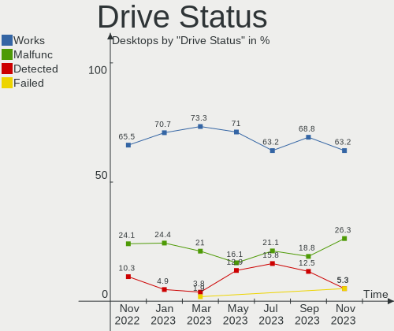
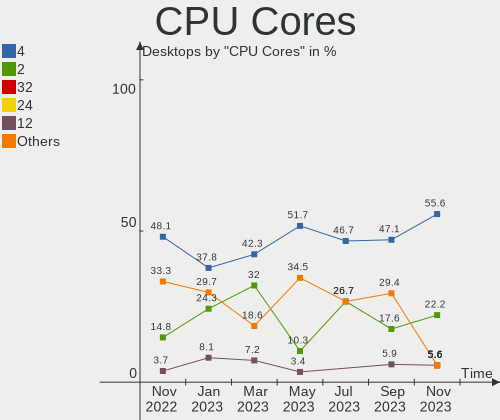
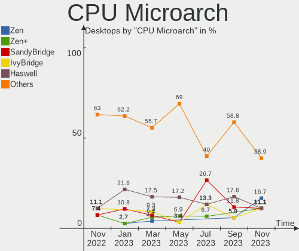
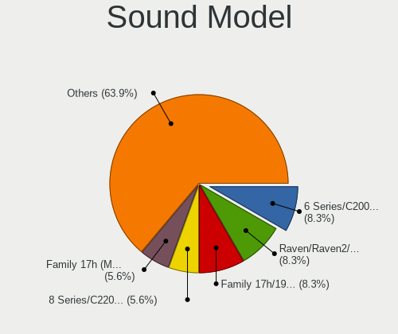
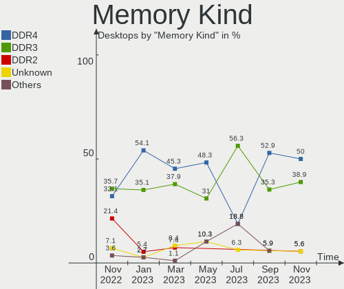
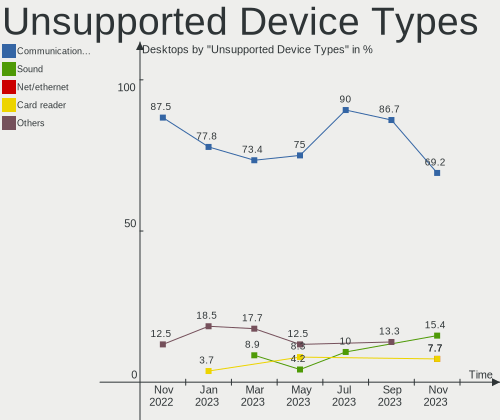

helloSystem - Hardware Trends (Desktops)
----------------------------------------

A project to identify most popular hardware characteristics and track their change
over time based on data collected by BSD users at https://BSD-Hardware.info.

Anyone can contribute to this report by the [hw-probe](https://github.com/linuxhw/hw-probe/blob/master/INSTALL.BSD.md) tool:

    hw-probe -all -upload

This report is for one last month. Overall report since the beginning of time: [TestCoverage](https://github.com/bsdhw/TestCoverage)

Period: Oct, 2022.

Contents
--------

* [ System ](#system)
  - [ OS                       ](#os)
  - [ OS Family                ](#os-family)
  - [ Arch                     ](#arch)
  - [ DE                       ](#de)
  - [ Display Server           ](#display-server)
  - [ Display Manager          ](#display-manager)
  - [ OS Lang                  ](#os-lang)
  - [ Boot Mode                ](#boot-mode)
  - [ Filesystem               ](#filesystem)
  - [ Part. scheme             ](#part-scheme)

* [ Board ](#board)
  - [ Vendor                   ](#vendor)
  - [ Model                    ](#model)
  - [ Model Family             ](#model-family)
  - [ MFG Year                 ](#mfg-year)
  - [ Form Factor              ](#form-factor)
  - [ Coreboot                 ](#coreboot)
  - [ RAM Size                 ](#ram-size)
  - [ RAM Used                 ](#ram-used)
  - [ Total Drives             ](#total-drives)
  - [ Has CD-ROM               ](#has-cd-rom)
  - [ Has Ethernet             ](#has-ethernet)
  - [ Has WiFi                 ](#has-wifi)
  - [ Has Bluetooth            ](#has-bluetooth)

* [ Location ](#location)
  - [ Country                  ](#country)
  - [ City                     ](#city)

* [ Drives ](#drives)
  - [ Drive Vendor             ](#drive-vendor)
  - [ Drive Model              ](#drive-model)
  - [ HDD Vendor               ](#hdd-vendor)
  - [ SSD Vendor               ](#ssd-vendor)
  - [ Drive Kind               ](#drive-kind)
  - [ Drive Connector          ](#drive-connector)
  - [ Drive Size               ](#drive-size)
  - [ Space Total              ](#space-total)
  - [ Space Used               ](#space-used)
  - [ Malfunc. Drives          ](#malfunc-drives)
  - [ Malfunc. Drive Vendor    ](#malfunc-drive-vendor)
  - [ Malfunc. HDD Vendor      ](#malfunc-hdd-vendor)
  - [ Malfunc. Drive Kind      ](#malfunc-drive-kind)
  - [ Failed Drives            ](#failed-drives)
  - [ Failed Drive Vendor      ](#failed-drive-vendor)
  - [ Drive Status             ](#drive-status)

* [ Storage controller ](#storage-controller)
  - [ Storage Vendor           ](#storage-vendor)
  - [ Storage Model            ](#storage-model)
  - [ Storage Kind             ](#storage-kind)

* [ Processor ](#processor)
  - [ CPU Vendor               ](#cpu-vendor)
  - [ CPU Model                ](#cpu-model)
  - [ CPU Model Family         ](#cpu-model-family)
  - [ CPU Cores                ](#cpu-cores)
  - [ CPU Sockets              ](#cpu-sockets)
  - [ CPU Threads              ](#cpu-threads)
  - [ CPU Microarch            ](#cpu-microarch)

* [ Graphics ](#graphics)
  - [ GPU Vendor               ](#gpu-vendor)
  - [ GPU Model                ](#gpu-model)
  - [ GPU Combo                ](#gpu-combo)
  - [ GPU Driver               ](#gpu-driver)
  - [ GPU Memory               ](#gpu-memory)

* [ Monitor ](#monitor)
  - [ Monitor Vendor           ](#monitor-vendor)
  - [ Monitor Model            ](#monitor-model)
  - [ Monitor Resolution       ](#monitor-resolution)
  - [ Monitor Diagonal         ](#monitor-diagonal)
  - [ Monitor Width            ](#monitor-width)
  - [ Aspect Ratio             ](#aspect-ratio)
  - [ Monitor Area             ](#monitor-area)
  - [ Pixel Density            ](#pixel-density)
  - [ Multiple Monitors        ](#multiple-monitors)

* [ Network ](#network)
  - [ Net Controller Vendor    ](#net-controller-vendor)
  - [ Net Controller Model     ](#net-controller-model)
  - [ Wireless Vendor          ](#wireless-vendor)
  - [ Wireless Model           ](#wireless-model)
  - [ Ethernet Vendor          ](#ethernet-vendor)
  - [ Ethernet Model           ](#ethernet-model)
  - [ Net Controller Kind      ](#net-controller-kind)
  - [ Used Controller          ](#used-controller)
  - [ NICs                     ](#nics)
  - [ IPv6                     ](#ipv6)

* [ Bluetooth ](#bluetooth)
  - [ Bluetooth Vendor         ](#bluetooth-vendor)
  - [ Bluetooth Model          ](#bluetooth-model)

* [ Sound ](#sound)
  - [ Sound Vendor             ](#sound-vendor)
  - [ Sound Model              ](#sound-model)

* [ Memory ](#memory)
  - [ Memory Vendor            ](#memory-vendor)
  - [ Memory Model             ](#memory-model)
  - [ Memory Kind              ](#memory-kind)
  - [ Memory Form Factor       ](#memory-form-factor)
  - [ Memory Size              ](#memory-size)
  - [ Memory Speed             ](#memory-speed)

* [ Printers & scanners ](#printers--scanners)
  - [ Printer Vendor           ](#printer-vendor)
  - [ Printer Model            ](#printer-model)
  - [ Scanner Vendor           ](#scanner-vendor)
  - [ Scanner Model            ](#scanner-model)

* [ Camera ](#camera)
  - [ Camera Vendor            ](#camera-vendor)
  - [ Camera Model             ](#camera-model)

* [ Security ](#security)
  - [ Fingerprint Vendor       ](#fingerprint-vendor)
  - [ Fingerprint Model        ](#fingerprint-model)
  - [ Chipcard Vendor          ](#chipcard-vendor)
  - [ Chipcard Model           ](#chipcard-model)

* [ Unsupported ](#unsupported)
  - [ Unsupported Devices      ](#unsupported-devices)
  - [ Unsupported Device Types ](#unsupported-device-types)

System
------

OS
--

Installed operating systems

| Name                | Desktops | Percent |
|---------------------|----------|---------|
| helloSystem 0.8.0   | 4        | 50%     |
| helloSystem 0.7.0   | 3        | 37.5%   |
| helloSystem 13.1-p2 | 1        | 12.5%   |

OS Family
---------

OS without a version

| Name        | Desktops | Percent |
|-------------|----------|---------|
| helloSystem | 8        | 100%    |

Arch
----

OS architecture (x86_64, i586, etc.)

| Name  | Desktops | Percent |
|-------|----------|---------|
| amd64 | 8        | 100%    |

DE
--

Desktop Environment

| Name         | Desktops | Percent |
|--------------|----------|---------|
| helloDesktop | 7        | 87.5%   |
| Cinnamon     | 1        | 12.5%   |

Display Server
--------------

X11 or Wayland

| Name | Desktops | Percent |
|------|----------|---------|
| X11  | 8        | 100%    |

Display Manager
---------------

SDDM, LightDM, etc.

| Name | Desktops | Percent |
|------|----------|---------|
| SLiM | 7        | 87.5%   |
| GDM  | 1        | 12.5%   |

OS Lang
-------

Language

| Lang  | Desktops | Percent |
|-------|----------|---------|
| en_US | 7        | 87.5%   |
| C     | 1        | 12.5%   |

Boot Mode
---------

EFI or BIOS

| Mode | Desktops | Percent |
|------|----------|---------|
| EFI  | 8        | 100%    |

Filesystem
----------

Type of filesystem

| Type   | Desktops | Percent |
|--------|----------|---------|
| Zfs    | 4        | 50%     |
| Cd9660 | 3        | 37.5%   |
| Ufs    | 1        | 12.5%   |

Part. scheme
------------

Scheme of partitioning

| Type | Desktops | Percent |
|------|----------|---------|
| GPT  | 8        | 100%    |

Board
-----

Vendor
------

Motherboard manufacturer

| Name             | Desktops | Percent |
|------------------|----------|---------|
| Hewlett-Packard  | 3        | 37.5%   |
| Lenovo           | 2        | 25%     |
| ASUSTek Computer | 2        | 25%     |
| MSI              | 1        | 12.5%   |

Model
-----

Motherboard model

| Name                                | Desktops | Percent |
|-------------------------------------|----------|---------|
| MSI MS-7A38                         | 1        | 12.5%   |
| Lenovo ThinkCentre M910s 10MK0039US | 1        | 12.5%   |
| Lenovo ThinkCentre M57p 6078AJ6     | 1        | 12.5%   |
| HP ProDesk 600 G2 DM                | 1        | 12.5%   |
| HP Pavilion Desktop 590-p0xxx       | 1        | 12.5%   |
| HP Desktop Pro A G3                 | 1        | 12.5%   |
| ASUS H110M-PLUS                     | 1        | 12.5%   |
| ASUS All Series                     | 1        | 12.5%   |

Model Family
------------

Motherboard model prefix

| Name               | Desktops | Percent |
|--------------------|----------|---------|
| Lenovo ThinkCentre | 2        | 25%     |
| MSI MS-7A38        | 1        | 12.5%   |
| HP ProDesk         | 1        | 12.5%   |
| HP Pavilion        | 1        | 12.5%   |
| HP Desktop         | 1        | 12.5%   |
| ASUS H110M-PLUS    | 1        | 12.5%   |
| ASUS All           | 1        | 12.5%   |

MFG Year
--------

Motherboard manufacture year

| Year | Desktops | Percent |
|------|----------|---------|
| 2018 | 3        | 37.5%   |
| 2022 | 2        | 25%     |
| 2021 | 1        | 12.5%   |
| 2016 | 1        | 12.5%   |
| 2008 | 1        | 12.5%   |

Form Factor
-----------

Physical design of the computer

| Name    | Desktops | Percent |
|---------|----------|---------|
| Desktop | 8        | 100%    |

Coreboot
--------

Have coreboot on board

| Used | Desktops | Percent |
|------|----------|---------|
| No   | 8        | 100%    |

RAM Size
--------

Total RAM memory

| Size in GB | Desktops | Percent |
|------------|----------|---------|
| 16.01-24.0 | 4        | 50%     |
| 4.01-8.0   | 2        | 25%     |
| 8.01-16.0  | 2        | 25%     |

RAM Used
--------

Used RAM memory

| Used GB  | Desktops | Percent |
|----------|----------|---------|
| 0.51-1.0 | 5        | 62.5%   |
| 0.01-0.5 | 2        | 25%     |
| 1.01-2.0 | 1        | 12.5%   |

Total Drives
------------

Number of drives on board

| Drives | Desktops | Percent |
|--------|----------|---------|
| 1      | 5        | 62.5%   |
| 3      | 1        | 12.5%   |
| 2      | 1        | 12.5%   |
| 0      | 1        | 12.5%   |

Has CD-ROM
----------

Has CD-ROM on board

| Presented | Desktops | Percent |
|-----------|----------|---------|
| No        | 6        | 75%     |
| Yes       | 2        | 25%     |

Has Ethernet
------------

Has Ethernet on board

| Presented | Desktops | Percent |
|-----------|----------|---------|
| Yes       | 8        | 100%    |

Has WiFi
--------

Has WiFi module

| Presented | Desktops | Percent |
|-----------|----------|---------|
| No        | 6        | 75%     |
| Yes       | 2        | 25%     |

Has Bluetooth
-------------

Has Bluetooth module

| Presented | Desktops | Percent |
|-----------|----------|---------|
| No        | 6        | 75%     |
| Yes       | 2        | 25%     |

Location
--------

Country
-------

Geographic location (country)

| Country | Desktops | Percent |
|---------|----------|---------|
| USA     | 3        | 37.5%   |
| Brazil  | 2        | 25%     |
| UK      | 1        | 12.5%   |
| Russia  | 1        | 12.5%   |
| China   | 1        | 12.5%   |

City
----

Geographic location (city)

| City         | Desktops | Percent |
|--------------|----------|---------|
| Temple       | 3        | 37.5%   |
| Zhengzhou    | 1        | 12.5%   |
| Stavropol    | 1        | 12.5%   |
| Santo André | 1        | 12.5%   |
| Londrina     | 1        | 12.5%   |
| Barry        | 1        | 12.5%   |

Drives
------

Drive Vendor
------------

Hard drive vendors

| Vendor              | Desktops | Drives | Percent |
|---------------------|----------|--------|---------|
| WDC                 | 4        | 6      | 50%     |
| PNY                 | 2        | 2      | 25%     |
| Samsung Electronics | 1        | 1      | 12.5%   |
| Hewlett-Packard     | 1        | 1      | 12.5%   |

Drive Model
-----------

Hard drive models

| Model                            | Desktops | Percent |
|----------------------------------|----------|---------|
| PNY CS900 500GB SSD              | 2        | 20%     |
| WDC WDS500G1B0C-00S6U0 500GB     | 1        | 10%     |
| WDC WD80EZAZ-11TDBA0 8TB         | 1        | 10%     |
| WDC WD60PURZ-85ZUFY1 6TB         | 1        | 10%     |
| WDC WD5000AZLX-60K2TA1 500GB     | 1        | 10%     |
| WDC WD3200AAJS-00YZCA0 320GB     | 1        | 10%     |
| WDC WD30EFRX-68EUZN0 3TB         | 1        | 10%     |
| Samsung MZNLN128HAHQ-000H1 128GB | 1        | 10%     |
| HP GB0500EAFYL 500GB             | 1        | 10%     |

HDD Vendor
----------

Hard disk drive vendors

| Vendor          | Desktops | Drives | Percent |
|-----------------|----------|--------|---------|
| WDC             | 3        | 5      | 75%     |
| Hewlett-Packard | 1        | 1      | 25%     |

SSD Vendor
----------

Solid state drive vendors

| Vendor              | Desktops | Drives | Percent |
|---------------------|----------|--------|---------|
| PNY                 | 2        | 2      | 66.67%  |
| Samsung Electronics | 1        | 1      | 33.33%  |

Drive Kind
----------

HDD or SSD

| Kind | Desktops | Drives | Percent |
|------|----------|--------|---------|
| HDD  | 4        | 6      | 50%     |
| SSD  | 3        | 3      | 37.5%   |
| NVMe | 1        | 1      | 12.5%   |

Drive Connector
---------------

SATA, SAS, NVMe, etc.

| Type | Desktops | Drives | Percent |
|------|----------|--------|---------|
| SATA | 7        | 9      | 87.5%   |
| NVMe | 1        | 1      | 12.5%   |

Drive Size
----------

Size of hard drive

| Size in TB | Desktops | Drives | Percent |
|------------|----------|--------|---------|
| 0.01-0.5   | 6        | 6      | 75%     |
| 2.01-3.0   | 1        | 1      | 12.5%   |
| 4.01-10.0  | 1        | 2      | 12.5%   |

Space Total
-----------

Amount of disk space available on the file system

| Size in GB     | Desktops | Percent |
|----------------|----------|---------|
| 251-500        | 3        | 37.5%   |
| 1-20           | 3        | 37.5%   |
| More than 3000 | 1        | 12.5%   |
| 101-250        | 1        | 12.5%   |

Space Used
----------

Amount of used disk space

| Used GB        | Desktops | Percent |
|----------------|----------|---------|
| 1-20           | 7        | 87.5%   |
| More than 3000 | 1        | 12.5%   |

Malfunc. Drives
---------------

Drive models with a malfunction

| Model                        | Desktops | Drives | Percent |
|------------------------------|----------|--------|---------|
| WDC WD3200AAJS-00YZCA0 320GB | 1        | 1      | 50%     |
| WDC WD30EFRX-68EUZN0 3TB     | 1        | 1      | 50%     |

Malfunc. Drive Vendor
---------------------

Vendors of faulty drives

| Vendor | Desktops | Drives | Percent |
|--------|----------|--------|---------|
| WDC    | 2        | 2      | 100%    |

Malfunc. HDD Vendor
-------------------

Vendors of faulty HDD drives

| Vendor | Desktops | Drives | Percent |
|--------|----------|--------|---------|
| WDC    | 2        | 2      | 100%    |

Malfunc. Drive Kind
-------------------

Kinds of faulty drives

| Kind | Desktops | Drives | Percent |
|------|----------|--------|---------|
| HDD  | 2        | 2      | 100%    |

Failed Drives
-------------

Failed drive models

Zero info for selected period =(

Failed Drive Vendor
-------------------

Failed drive vendors

Zero info for selected period =(

Drive Status
------------

Number of failed and malfunc. drives

| Status  | Desktops | Drives | Percent |
|---------|----------|--------|---------|
| Works   | 6        | 8      | 75%     |
| Malfunc | 2        | 2      | 25%     |

Storage controller
------------------

Storage Vendor
--------------

Storage controller vendors

| Vendor             | Desktops | Percent |
|--------------------|----------|---------|
| Intel              | 5        | 55.56%  |
| AMD                | 2        | 22.22%  |
| SanDisk            | 1        | 11.11%  |
| JMicron Technology | 1        | 11.11%  |

Storage Model
-------------

Storage controller models

| Model                                                                         | Desktops | Percent |
|-------------------------------------------------------------------------------|----------|---------|
| Intel Q170/Q150/B150/H170/H110/Z170/CM236 Chipset SATA Controller [AHCI Mode] | 2        | 18.18%  |
| AMD FCH SATA Controller [AHCI mode]                                           | 2        | 18.18%  |
| SanDisk WD Blue SN500 / PC SN520 NVMe SSD                                     | 1        | 9.09%   |
| JMicron JMB363 SATA/IDE Controller                                            | 1        | 9.09%   |
| Intel Cannon Lake PCH SATA AHCI Controller                                    | 1        | 9.09%   |
| Intel 82Q35 Express PT IDER Controller                                        | 1        | 9.09%   |
| Intel 82801IR/IO/IH (ICH9R/DO/DH) 6 port SATA Controller [AHCI mode]          | 1        | 9.09%   |
| Intel 200 Series PCH SATA controller [AHCI mode]                              | 1        | 9.09%   |
| AMD 400 Series Chipset SATA Controller                                        | 1        | 9.09%   |

Storage Kind
------------

Kind of storage controller (IDE, SATA, NVMe, SAS, ...)

| Kind | Desktops | Percent |
|------|----------|---------|
| SATA | 7        | 77.78%  |
| NVMe | 1        | 11.11%  |
| IDE  | 1        | 11.11%  |

Processor
---------

CPU Vendor
----------

Processor vendors

| Vendor | Desktops | Percent |
|--------|----------|---------|
| Intel  | 6        | 75%     |
| AMD    | 2        | 25%     |

CPU Model
---------

Processor models

| Model                                           | Desktops | Percent |
|-------------------------------------------------|----------|---------|
| Intel Core i5-7400 CPU @ 3.00GHz                | 1        | 12.5%   |
| Intel Core i5-6500T CPU @ 2.50GHz               | 1        | 12.5%   |
| Intel Core i5-6500 CPU @ 3.20GHz                | 1        | 12.5%   |
| Intel Core i3-8100 CPU @ 3.60GHz                | 1        | 12.5%   |
| Intel Core 2 Duo CPU E6750 @ 2.66GHz            | 1        | 12.5%   |
| Intel Celeron CPU N3050 @ 1.60GHz               | 1        | 12.5%   |
| AMD Ryzen 5 PRO 3400G with Radeon Vega Graphics | 1        | 12.5%   |
| AMD Ryzen 5 2600 Six-Core Processor             | 1        | 12.5%   |

CPU Model Family
----------------

Processor model prefix

| Model            | Desktops | Percent |
|------------------|----------|---------|
| Intel Core i5    | 3        | 37.5%   |
| Intel Core i3    | 1        | 12.5%   |
| Intel Core 2 Duo | 1        | 12.5%   |
| Intel Celeron    | 1        | 12.5%   |
| AMD Ryzen 5 PRO  | 1        | 12.5%   |
| AMD Ryzen 5      | 1        | 12.5%   |

CPU Cores
---------

Number of processor cores

| Number | Desktops | Percent |
|--------|----------|---------|
| 4      | 4        | 50%     |
| 2      | 2        | 25%     |
| 12     | 1        | 12.5%   |
| 8      | 1        | 12.5%   |

CPU Sockets
-----------

Number of sockets

| Number | Desktops | Percent |
|--------|----------|---------|
| 1      | 8        | 100%    |

CPU Threads
-----------

Threads per core (Hyper-Threading)

| Number | Desktops | Percent |
|--------|----------|---------|
| 1      | 8        | 100%    |

CPU Microarch
-------------

Microarchitecture

| Name       | Desktops | Percent |
|------------|----------|---------|
| Zen+       | 2        | 25%     |
| Skylake    | 2        | 25%     |
| KabyLake   | 2        | 25%     |
| Silvermont | 1        | 12.5%   |
| Core       | 1        | 12.5%   |

Graphics
--------

GPU Vendor
----------

Vendors of graphics cards

| Vendor | Desktops | Percent |
|--------|----------|---------|
| Intel  | 4        | 50%     |
| Nvidia | 3        | 37.5%   |
| AMD    | 1        | 12.5%   |

GPU Model
---------

Graphics card models

| Model                                                                                    | Desktops | Percent |
|------------------------------------------------------------------------------------------|----------|---------|
| Intel HD Graphics 530                                                                    | 2        | 25%     |
| Nvidia TU116 [GeForce GTX 1660]                                                          | 1        | 12.5%   |
| Nvidia GP108 [GeForce GT 1030]                                                           | 1        | 12.5%   |
| Nvidia GP106 [GeForce GTX 1060 6GB]                                                      | 1        | 12.5%   |
| Intel Atom/Celeron/Pentium Processor x5-E8000/J3xxx/N3xxx Integrated Graphics Controller | 1        | 12.5%   |
| Intel 82Q35 Express Integrated Graphics Controller                                       | 1        | 12.5%   |
| AMD Picasso/Raven 2 [Radeon Vega Series / Radeon Vega Mobile Series]                     | 1        | 12.5%   |

GPU Combo
---------

Combinations of graphics cards

| Name       | Desktops | Percent |
|------------|----------|---------|
| 1 x Intel  | 4        | 50%     |
| 1 x Nvidia | 3        | 37.5%   |
| 1 x AMD    | 1        | 12.5%   |

GPU Driver
----------

Free vs proprietary

| Driver      | Desktops | Percent |
|-------------|----------|---------|
| Free        | 6        | 75%     |
| Proprietary | 2        | 25%     |

GPU Memory
----------

Total video memory

| Size in GB | Desktops | Percent |
|------------|----------|---------|
| Unknown    | 5        | 62.5%   |
| 5.01-6.0   | 1        | 12.5%   |
| 1.01-2.0   | 1        | 12.5%   |
| 0.51-1.0   | 1        | 12.5%   |

Monitor
-------

Monitor Vendor
--------------

Monitor vendors

| Vendor   | Desktops | Percent |
|----------|----------|---------|
| MSI      | 3        | 42.86%  |
| Sony     | 1        | 14.29%  |
| Philips  | 1        | 14.29%  |
| Goldstar | 1        | 14.29%  |
| Dell     | 1        | 14.29%  |

Monitor Model
-------------

Monitor models

| Model                                                    | Desktops | Percent |
|----------------------------------------------------------|----------|---------|
| MSI G32C4 MSI3DA6 1920x1080 700x390mm 31.5-inch          | 3        | 42.86%  |
| Sony SDM-E76D SNYB200 1280x1024 340x270mm 17.1-inch      | 1        | 14.29%  |
| Philips LCD Monitor PHL2051 1600x900 440x250mm 19.9-inch | 1        | 14.29%  |
| Goldstar 22MP55 GSM5A24 1920x1080 480x270mm 21.7-inch    | 1        | 14.29%  |
| Dell E228WFP DELD015 1680x1050 470x300mm 22.0-inch       | 1        | 14.29%  |

Monitor Resolution
------------------

Monitor screen resolution

| Resolution         | Desktops | Percent |
|--------------------|----------|---------|
| 1920x1080 (FHD)    | 4        | 57.14%  |
| 1680x1050 (WSXGA+) | 1        | 14.29%  |
| 1600x900 (HD+)     | 1        | 14.29%  |
| 1280x1024 (SXGA)   | 1        | 14.29%  |

Monitor Diagonal
----------------

Diagonal size in inches

| Inches | Desktops | Percent |
|--------|----------|---------|
| 31     | 3        | 42.86%  |
| 22     | 1        | 14.29%  |
| 21     | 1        | 14.29%  |
| 19     | 1        | 14.29%  |
| 17     | 1        | 14.29%  |

Monitor Width
-------------

Physical width

| Width in mm | Desktops | Percent |
|-------------|----------|---------|
| 601-700     | 3        | 42.86%  |
| 401-500     | 3        | 42.86%  |
| 301-350     | 1        | 14.29%  |

Aspect Ratio
------------

Proportional relationship between the width and the height

| Ratio | Desktops | Percent |
|-------|----------|---------|
| 16/9  | 5        | 71.43%  |
| 5/4   | 1        | 14.29%  |
| 16/10 | 1        | 14.29%  |

Monitor Area
------------

Area in inch²

| Area in inch² | Desktops | Percent |
|----------------|----------|---------|
| 351-500        | 3        | 42.86%  |
| 201-250        | 2        | 28.57%  |
| 151-200        | 1        | 14.29%  |
| 141-150        | 1        | 14.29%  |

Pixel Density
-------------

Pixels per inch

| Density | Desktops | Percent |
|---------|----------|---------|
| 51-100  | 6        | 85.71%  |
| 101-120 | 1        | 14.29%  |

Multiple Monitors
-----------------

Total monitors connected

| Total | Desktops | Percent |
|-------|----------|---------|
| 1     | 7        | 87.5%   |
| 0     | 1        | 12.5%   |

Network
-------

Net Controller Vendor
---------------------

Controller vendors

| Vendor                | Desktops | Percent |
|-----------------------|----------|---------|
| Realtek Semiconductor | 5        | 62.5%   |
| Intel                 | 3        | 37.5%   |

Net Controller Model
--------------------

Controller models

| Model                                                             | Desktops | Percent |
|-------------------------------------------------------------------|----------|---------|
| Realtek RTL8111/8168/8411 PCI Express Gigabit Ethernet Controller | 5        | 50%     |
| Intel Ethernet Connection (2) I219-LM                             | 2        | 20%     |
| Realtek RTL8821CE 802.11ac PCIe Wireless Network Adapter          | 1        | 10%     |
| Intel Wireless 7265                                               | 1        | 10%     |
| Intel 82566DM-2 Gigabit Network Connection                        | 1        | 10%     |

Wireless Vendor
---------------

Wireless vendors

| Vendor                | Desktops | Percent |
|-----------------------|----------|---------|
| Realtek Semiconductor | 1        | 50%     |
| Intel                 | 1        | 50%     |

Wireless Model
--------------

Wireless models

| Model                                                    | Desktops | Percent |
|----------------------------------------------------------|----------|---------|
| Realtek RTL8821CE 802.11ac PCIe Wireless Network Adapter | 1        | 50%     |
| Intel Wireless 7265                                      | 1        | 50%     |

Ethernet Vendor
---------------

Ethernet vendors

| Vendor                | Desktops | Percent |
|-----------------------|----------|---------|
| Realtek Semiconductor | 5        | 62.5%   |
| Intel                 | 3        | 37.5%   |

Ethernet Model
--------------

Ethernet models

| Model                                                             | Desktops | Percent |
|-------------------------------------------------------------------|----------|---------|
| Realtek RTL8111/8168/8411 PCI Express Gigabit Ethernet Controller | 5        | 62.5%   |
| Intel Ethernet Connection (2) I219-LM                             | 2        | 25%     |
| Intel 82566DM-2 Gigabit Network Connection                        | 1        | 12.5%   |

Net Controller Kind
-------------------

Ethernet, WiFi or modem

| Kind     | Desktops | Percent |
|----------|----------|---------|
| Ethernet | 8        | 80%     |
| WiFi     | 2        | 20%     |

Used Controller
---------------

Currently used network controller

| Kind     | Desktops | Percent |
|----------|----------|---------|
| Ethernet | 8        | 100%    |

NICs
----

Total network controllers on board

| Total | Desktops | Percent |
|-------|----------|---------|
| 1     | 6        | 75%     |
| 2     | 2        | 25%     |

IPv6
----

IPv6 vs IPv4

| Used | Desktops | Percent |
|------|----------|---------|
| No   | 8        | 100%    |

Bluetooth
---------

Bluetooth Vendor
----------------

Controller vendors

| Vendor                | Desktops | Percent |
|-----------------------|----------|---------|
| Realtek Semiconductor | 1        | 50%     |
| Intel                 | 1        | 50%     |

Bluetooth Model
---------------

Controller models

| Model                              | Desktops | Percent |
|------------------------------------|----------|---------|
| Realtek  Bluetooth 4.2 Adapter     | 1        | 50%     |
| Intel Bluetooth wireless interface | 1        | 50%     |

Sound
-----

Sound Vendor
------------

Sound card vendors

| Vendor              | Desktops | Percent |
|---------------------|----------|---------|
| Intel               | 6        | 42.86%  |
| Nvidia              | 3        | 21.43%  |
| Google              | 2        | 14.29%  |
| AMD                 | 2        | 14.29%  |
| C-Media Electronics | 1        | 7.14%   |

Sound Model
-----------

Sound card models

| Model                                                                                             | Desktops | Percent |
|---------------------------------------------------------------------------------------------------|----------|---------|
| Intel 100 Series/C230 Series Chipset Family HD Audio Controller                                   | 2        | 13.33%  |
| Google Pixel earbuds                                                                              | 2        | 13.33%  |
| Nvidia TU116 High Definition Audio Controller                                                     | 1        | 6.67%   |
| Nvidia GP108 High Definition Audio Controller                                                     | 1        | 6.67%   |
| Nvidia GP106 High Definition Audio Controller                                                     | 1        | 6.67%   |
| Intel Cannon Lake PCH cAVS                                                                        | 1        | 6.67%   |
| Intel Atom/Celeron/Pentium Processor x5-E8000/J3xxx/N3xxx Series High Definition Audio Controller | 1        | 6.67%   |
| Intel 82801I (ICH9 Family) HD Audio Controller                                                    | 1        | 6.67%   |
| Intel 200 Series PCH HD Audio                                                                     | 1        | 6.67%   |
| C-Media Electronics Audio Adapter (Unitek Y-247A)                                                 | 1        | 6.67%   |
| AMD Raven/Raven2/Fenghuang HDMI/DP Audio Controller                                               | 1        | 6.67%   |
| AMD Family 17h/19h HD Audio Controller                                                            | 1        | 6.67%   |
| AMD Family 17h (Models 00h-0fh) HD Audio Controller                                               | 1        | 6.67%   |

Memory
------

Memory Vendor
-------------

Memory module vendors

| Vendor              | Desktops | Percent |
|---------------------|----------|---------|
| Samsung Electronics | 4        | 33.33%  |
| SK hynix            | 2        | 16.67%  |
| Kingston            | 2        | 16.67%  |
| Micron Technology   | 1        | 8.33%   |
| GLOWAY              | 1        | 8.33%   |
| Corsair             | 1        | 8.33%   |
| A-DATA Technology   | 1        | 8.33%   |

Memory Model
------------

Memory module models

| Model                                                                   | Desktops | Percent |
|-------------------------------------------------------------------------|----------|---------|
| SK hynix RAM Module 4GB SODIMM DDR4 2133MT/s                            | 1        | 7.69%   |
| SK hynix RAM HMA81GU6AFR8N-UH 8GB DIMM DDR4 2400MT/s                    | 1        | 7.69%   |
| Samsung RAM Module 4GB SODIMM DDR4 2133MT/s                             | 1        | 7.69%   |
| Samsung RAM Module 4GB DIMM DDR4 2400MT/s                               | 1        | 7.69%   |
| Samsung RAM M378B5673GB0-CH9 2GB DIMM DDR3 1066MT/s                     | 1        | 7.69%   |
| Samsung RAM M378A5143DB0-CPB 4GB DIMM DDR4 2133MT/s                     | 1        | 7.69%   |
| Micron RAM Module 8GB DIMM DDR4 2400MT/s                                | 1        | 7.69%   |
| Kingston RAM Module 2GB DIMM DDR2 800MT/s                               | 1        | 7.69%   |
| Kingston RAM KHX3000C15D4/8GX 8GB DIMM DDR4 2933MT/s                    | 1        | 7.69%   |
| Kingston RAM 202020202020202020202020202020202020 2GB DIMM DDR2 800MT/s | 1        | 7.69%   |
| GLOWAY RAM TYA4U2666D19161C 16GB DIMM DDR4 2666MT/s                     | 1        | 7.69%   |
| Corsair RAM CMK16GX4M2B3000C15 8GB DIMM DDR4 2933MT/s                   | 1        | 7.69%   |
| A-DATA RAM AM2P26KC4U1-BBOS 4GB DIMM DDR4 2666MT/s                      | 1        | 7.69%   |

Memory Kind
-----------

Memory module kinds

| Kind | Desktops | Percent |
|------|----------|---------|
| DDR4 | 6        | 75%     |
| DDR3 | 1        | 12.5%   |
| DDR2 | 1        | 12.5%   |

Memory Form Factor
------------------

Physical design of the memory module

| Name   | Desktops | Percent |
|--------|----------|---------|
| DIMM   | 7        | 87.5%   |
| SODIMM | 1        | 12.5%   |

Memory Size
-----------

Memory module size

| Size  | Desktops | Percent |
|-------|----------|---------|
| 8192  | 4        | 36.36%  |
| 4096  | 4        | 36.36%  |
| 2048  | 2        | 18.18%  |
| 16384 | 1        | 9.09%   |

Memory Speed
------------

Memory module speed

| Speed | Desktops | Percent |
|-------|----------|---------|
| 2933  | 2        | 22.22%  |
| 2400  | 2        | 22.22%  |
| 2133  | 2        | 22.22%  |
| 2666  | 1        | 11.11%  |
| 1066  | 1        | 11.11%  |
| 800   | 1        | 11.11%  |

Printers & scanners
-------------------

Printer Vendor
--------------

Printer device vendors

Zero info for selected period =(

Printer Model
-------------

Printer device models

Zero info for selected period =(

Scanner Vendor
--------------

Scanner device vendors

Zero info for selected period =(

Scanner Model
-------------

Scanner device models

Zero info for selected period =(

Camera
------

Camera Vendor
-------------

Camera device vendors

| Vendor   | Desktops | Percent |
|----------|----------|---------|
| Microdia | 1        | 100%    |

Camera Model
------------

Camera device models

| Model           | Desktops | Percent |
|-----------------|----------|---------|
| Microdia Camera | 1        | 100%    |

Security
--------

Fingerprint Vendor
------------------

Fingerprint sensor vendors

Zero info for selected period =(

Fingerprint Model
-----------------

Fingerprint sensor models

Zero info for selected period =(

Chipcard Vendor
---------------

Chipcard module vendors

Zero info for selected period =(

Chipcard Model
--------------

Chipcard module models

Zero info for selected period =(

Unsupported
-----------

Unsupported Devices
-------------------

Total unsupported devices on board

| Total | Desktops | Percent |
|-------|----------|---------|
| 0     | 3        | 37.5%   |
| 2     | 2        | 25%     |
| 1     | 2        | 25%     |
| 3     | 1        | 12.5%   |

Unsupported Device Types
------------------------

Types of unsupported devices

| Type                     | Desktops | Percent |
|--------------------------|----------|---------|
| Communication controller | 5        | 83.33%  |
| Net/wireless             | 1        | 16.67%  |

