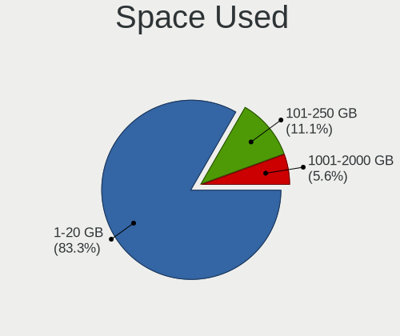
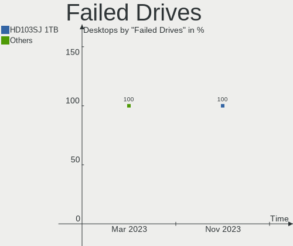
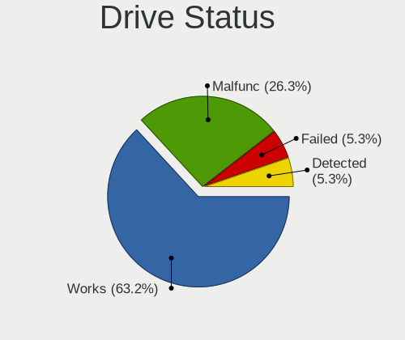
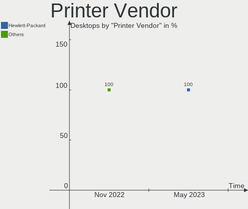
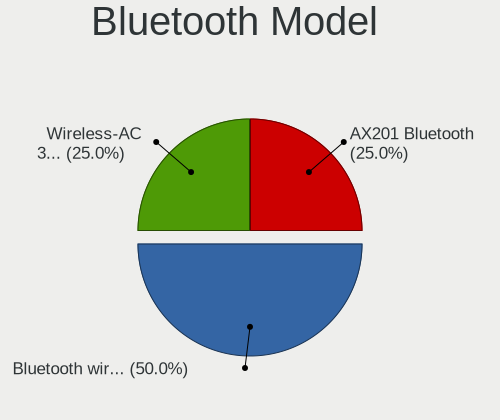

helloSystem Hardware Trends (Desktop)
-------------------------------------

A project to identify most popular hardware characteristics and track their change
over time based on data collected by helloSystem users at https://BSD-Hardware.info.

Anyone can contribute to the study by uploading probes of their computers by
the [hw-probe](https://github.com/linuxhw/hw-probe/blob/master/INSTALL.BSD.md) tool:

    hw-probe -all -upload

Full-feature report is available here: https://bsd-hardware.info/?view=trends&formfactor=desktop

Period: Feb, 2021.

Contents
--------

- [ OS                       ](#os)
- [ OS Family                ](#os-family)
- [ Arch                     ](#arch)
- [ DE                       ](#de)
- [ Display Server           ](#display-server)
- [ Display Manager          ](#display-manager)
- [ OS Lang                  ](#os-lang)
- [ Boot Mode                ](#boot-mode)
- [ Filesystem               ](#filesystem)
- [ Part. scheme             ](#part-scheme)
- [ Country                  ](#country)
- [ City                     ](#city)
- [ Vendor                   ](#vendor)
- [ Model                    ](#model)
- [ Model Family             ](#model-family)
- [ MFG Year                 ](#mfg-year)
- [ Form Factor              ](#form-factor)
- [ Coreboot                 ](#coreboot)
- [ RAM Size                 ](#ram-size)
- [ RAM Used                 ](#ram-used)
- [ Has CD-ROM               ](#has-cd-rom)
- [ Total Drives             ](#total-drives)
- [ Has Ethernet             ](#has-ethernet)
- [ Drive Vendor             ](#drive-vendor)
- [ Drive Model              ](#drive-model)
- [ HDD Vendor               ](#hdd-vendor)
- [ SSD Vendor               ](#ssd-vendor)
- [ Drive Kind               ](#drive-kind)
- [ Drive Connector          ](#drive-connector)
- [ Drive Size               ](#drive-size)
- [ Space Total              ](#space-total)
- [ Space Used               ](#space-used)
- [ Malfunc. Drives          ](#malfunc-drives)
- [ Malfunc. Drive Vendor    ](#malfunc-drive-vendor)
- [ Malfunc. HDD Vendor      ](#malfunc-hdd-vendor)
- [ Malfunc. Drive Kind      ](#malfunc-drive-kind)
- [ Failed Drives            ](#failed-drives)
- [ Failed Drive Vendor      ](#failed-drive-vendor)
- [ Drive Status             ](#drive-status)
- [ Storage Vendor           ](#storage-vendor)
- [ Storage Model            ](#storage-model)
- [ Storage Kind             ](#storage-kind)
- [ CPU Vendor               ](#cpu-vendor)
- [ CPU Model                ](#cpu-model)
- [ CPU Model Family         ](#cpu-model-family)
- [ CPU Cores                ](#cpu-cores)
- [ CPU Sockets              ](#cpu-sockets)
- [ CPU Threads              ](#cpu-threads)
- [ CPU Microarch            ](#cpu-microarch)
- [ GPU Vendor               ](#gpu-vendor)
- [ GPU Model                ](#gpu-model)
- [ GPU Combo                ](#gpu-combo)
- [ GPU Driver               ](#gpu-driver)
- [ GPU Memory               ](#gpu-memory)
- [ Monitor Vendor           ](#monitor-vendor)
- [ Monitor Model            ](#monitor-model)
- [ Monitor Resolution       ](#monitor-resolution)
- [ Monitor Diagonal         ](#monitor-diagonal)
- [ Monitor Width            ](#monitor-width)
- [ Aspect Ratio             ](#aspect-ratio)
- [ Monitor Area             ](#monitor-area)
- [ Pixel Density            ](#pixel-density)
- [ Multiple Monitors        ](#multiple-monitors)
- [ Net Controller Vendor    ](#net-controller-vendor)
- [ Net Controller Model     ](#net-controller-model)
- [ Wireless Vendor          ](#wireless-vendor)
- [ Wireless Model           ](#wireless-model)
- [ Ethernet Vendor          ](#ethernet-vendor)
- [ Ethernet Model           ](#ethernet-model)
- [ Net Controller Kind      ](#net-controller-kind)
- [ Used Controller          ](#used-controller)
- [ NICs                     ](#nics)
- [ Memory Vendor            ](#memory-vendor)
- [ Memory Model             ](#memory-model)
- [ Memory Kind              ](#memory-kind)
- [ Memory Form Factor       ](#memory-form-factor)
- [ Memory Size              ](#memory-size)
- [ Memory Speed             ](#memory-speed)
- [ Sound Vendor             ](#sound-vendor)
- [ Sound Model              ](#sound-model)
- [ Camera Vendor            ](#camera-vendor)
- [ Camera Model             ](#camera-model)
- [ Fingerprint Vendor       ](#fingerprint-vendor)
- [ Fingerprint Model        ](#fingerprint-model)
- [ Chipcard Vendor          ](#chipcard-vendor)
- [ Chipcard Model           ](#chipcard-model)
- [ Printer Vendor           ](#printer-vendor)
- [ Printer Model            ](#printer-model)
- [ Scanner Vendor           ](#scanner-vendor)
- [ Scanner Model            ](#scanner-model)
- [ Bluetooth Vendor         ](#bluetooth-vendor)
- [ Bluetooth Model          ](#bluetooth-model)
- [ Unsupported Devices      ](#unsupported-devices)
- [ Unsupported Device Types ](#unsupported-device-types)

OS
--

Installed operating systems

| Name              | Desktops | Percent |
|-------------------|----------|---------|
| helloSystem 0.4.0 | 65       | 77.38%  |
| helloSystem 0.5.0 | 19       | 22.62%  |

OS Family
---------

OS without a version

| Name        | Desktops | Percent |
|-------------|----------|---------|
| helloSystem | 84       | 100%    |

Arch
----

OS architecture (x86_64, i586, etc.)

| Name  | Desktops | Percent |
|-------|----------|---------|
| amd64 | 84       | 100%    |

DE
--

Desktop Environment

| Name         | Desktops | Percent |
|--------------|----------|---------|
| helloDesktop | 84       | 100%    |

Display Server
--------------

X11 or Wayland

| Name | Desktops | Percent |
|------|----------|---------|
| X11  | 84       | 100%    |

Display Manager
---------------

SDDM, LightDM, etc.

| Name | Desktops | Percent |
|------|----------|---------|
| SLiM | 84       | 100%    |

OS Lang
-------

Language

| Lang  | Desktops | Percent |
|-------|----------|---------|
| en_US | 81       | 96.43%  |
| es_ES | 2        | 2.38%   |
| fr_FR | 1        | 1.19%   |

Boot Mode
---------

EFI or BIOS

| Mode | Desktops | Percent |
|------|----------|---------|
| EFI  | 76       | 90.48%  |
| BIOS | 8        | 9.52%   |

Filesystem
----------

Type of filesystem

| Type | Desktops | Percent |
|------|----------|---------|
| Zfs  | 84       | 100%    |

Part. scheme
------------

Scheme of partitioning

| Type | Desktops | Percent |
|------|----------|---------|
| GPT  | 84       | 100%    |

Country
-------

Geographic location (country)

| Country            | Desktops | Percent |
|--------------------|----------|---------|
| Germany            | 15       | 17.86%  |
| USA                | 11       | 13.1%   |
| UK                 | 6        | 7.14%   |
| Spain              | 6        | 7.14%   |
| Italy              | 6        | 7.14%   |
| Russia             | 5        | 5.95%   |
| China              | 5        | 5.95%   |
| Brazil             | 4        | 4.76%   |
| Mexico             | 2        | 2.38%   |
| France             | 2        | 2.38%   |
| Australia          | 2        | 2.38%   |
| Ukraine            | 1        | 1.19%   |
| Taiwan             | 1        | 1.19%   |
| Switzerland        | 1        | 1.19%   |
| South Africa       | 1        | 1.19%   |
| Slovakia           | 1        | 1.19%   |
| Portugal           | 1        | 1.19%   |
| Peru               | 1        | 1.19%   |
| Macau              | 1        | 1.19%   |
| Korea, Republic of | 1        | 1.19%   |
| Japan              | 1        | 1.19%   |
| Hungary            | 1        | 1.19%   |
| Guatemala          | 1        | 1.19%   |
| Greece             | 1        | 1.19%   |
| Estonia            | 1        | 1.19%   |
| Croatia            | 1        | 1.19%   |
| Colombia           | 1        | 1.19%   |
| Chile              | 1        | 1.19%   |
| Bulgaria           | 1        | 1.19%   |
| Belgium            | 1        | 1.19%   |
| Argentina          | 1        | 1.19%   |

City
----

Geographic location (city)

| City                    | Desktops | Percent |
|-------------------------|----------|---------|
| Stourbridge             | 2        | 2.38%   |
| Rudersberg              | 2        | 2.38%   |
| Čakovec                | 1        | 1.19%   |
| Zovon                   | 1        | 1.19%   |
| Yekaterinburg           | 1        | 1.19%   |
| West Jordan             | 1        | 1.19%   |
| Vereeniging             | 1        | 1.19%   |
| Valencia                | 1        | 1.19%   |
| Ufa                     | 1        | 1.19%   |
| Tallinn                 | 1        | 1.19%   |
| Taipa                   | 1        | 1.19%   |
| São Paulo              | 1        | 1.19%   |
| Stuttgart               | 1        | 1.19%   |
| Steinau an der Strasse  | 1        | 1.19%   |
| St Petersburg           | 1        | 1.19%   |
| Sparta                  | 1        | 1.19%   |
| Seattle                 | 1        | 1.19%   |
| Schmalkalden            | 1        | 1.19%   |
| Sankt Augustin          | 1        | 1.19%   |
| Rockford                | 1        | 1.19%   |
| Reutlingen              | 1        | 1.19%   |
| Renens                  | 1        | 1.19%   |
| Quinta Normal           | 1        | 1.19%   |
| Qinnan                  | 1        | 1.19%   |
| Qingdao                 | 1        | 1.19%   |
| Popovo                  | 1        | 1.19%   |
| Piacenza                | 1        | 1.19%   |
| Peissenberg             | 1        | 1.19%   |
| Paris                   | 1        | 1.19%   |
| Oklahoma City           | 1        | 1.19%   |
| Nurtingen               | 1        | 1.19%   |
| Noicattaro              | 1        | 1.19%   |
| New York                | 1        | 1.19%   |
| Narni                   | 1        | 1.19%   |
| Munich                  | 1        | 1.19%   |
| Moscow                  | 1        | 1.19%   |
| Monteroni d'Arbia       | 1        | 1.19%   |
| Milton Keynes           | 1        | 1.19%   |
| Melbourne               | 1        | 1.19%   |
| Medellín               | 1        | 1.19%   |
| Matosinhos Municipality | 1        | 1.19%   |
| Marlborough             | 1        | 1.19%   |
| Mansfield               | 1        | 1.19%   |
| Madrid                  | 1        | 1.19%   |
| Luis Guillon            | 1        | 1.19%   |
| Lingen                  | 1        | 1.19%   |
| Lima                    | 1        | 1.19%   |
| Lencois Paulista        | 1        | 1.19%   |
| Kyiv                    | 1        | 1.19%   |
| Kuiju                   | 1        | 1.19%   |
| Kawagoe                 | 1        | 1.19%   |
| Jungnang-gu             | 1        | 1.19%   |
| Ixtapaluca              | 1        | 1.19%   |
| Idaho Falls             | 1        | 1.19%   |
| Ibi                     | 1        | 1.19%   |
| Hook                    | 1        | 1.19%   |
| Heimbuchenthal          | 1        | 1.19%   |
| Hatvan                  | 1        | 1.19%   |
| Haslett                 | 1        | 1.19%   |
| Hamburg                 | 1        | 1.19%   |

Vendor
------

Motherboard manufacturer

| Name                | Desktops | Percent |
|---------------------|----------|---------|
| ASUSTek Computer    | 28       | 33.33%  |
| Gigabyte Technology | 10       | 11.9%   |
| ASRock              | 10       | 11.9%   |
| Hewlett-Packard     | 7        | 8.33%   |
| Dell                | 7        | 8.33%   |
| Lenovo              | 5        | 5.95%   |
| MSI                 | 4        | 4.76%   |
| Intel               | 3        | 3.57%   |
| Google              | 2        | 2.38%   |
| Pegatron            | 1        | 1.19%   |
| Medion              | 1        | 1.19%   |
| HARDKERNEL          | 1        | 1.19%   |
| Fujitsu             | 1        | 1.19%   |
| Biostar             | 1        | 1.19%   |
| Apple               | 1        | 1.19%   |
| Acer                | 1        | 1.19%   |
| Unknown             | 1        | 1.19%   |

Model
-----

Motherboard model

| Name                                | Desktops | Percent |
|-------------------------------------|----------|---------|
| ASUS All Series                     | 2        | 2.38%   |
| Pegatron IPM41-D3                   | 1        | 1.19%   |
| MSI MS-7C37                         | 1        | 1.19%   |
| MSI MS-7850                         | 1        | 1.19%   |
| MSI MS-7721                         | 1        | 1.19%   |
| MSI MS-7592                         | 1        | 1.19%   |
| Medion H81H3-EM2                    | 1        | 1.19%   |
| Lenovo ThinkStation S30 43511K5     | 1        | 1.19%   |
| Lenovo ThinkCentre M92 3229AM4      | 1        | 1.19%   |
| Lenovo ThinkCentre M90p 5864W1S     | 1        | 1.19%   |
| Lenovo ThinkCentre M73 10AY0020US   | 1        | 1.19%   |
| Lenovo 70A0S02K00 ThinkServer TS140 | 1        | 1.19%   |
| Intel H61                           | 1        | 1.19%   |
| Intel DN2820FYK H24582-201          | 1        | 1.19%   |
| Intel DG41RQ AAE54511-203           | 1        | 1.19%   |
| HP Slim Desktop S01-pF1xxx          | 1        | 1.19%   |
| HP EliteDesk 800 G2 DM 35W          | 1        | 1.19%   |
| HP Compaq Pro 6300 MT               | 1        | 1.19%   |
| HP Compaq 8100 Elite CMT PC         | 1        | 1.19%   |
| HP 500-311ns                        | 1        | 1.19%   |
| HP 260-p026                         | 1        | 1.19%   |
| HP 23-r103la                        | 1        | 1.19%   |
| HARDKERNEL ODROID-H2                | 1        | 1.19%   |
| Google Panther                      | 1        | 1.19%   |
| Google Guado                        | 1        | 1.19%   |
| Gigabyte Z97P-D3                    | 1        | 1.19%   |
| Gigabyte Z97M-D3H                   | 1        | 1.19%   |
| Gigabyte Z87-D3HP                   | 1        | 1.19%   |
| Gigabyte Z77M-D3H                   | 1        | 1.19%   |
| Gigabyte Z68X-UD3H-B3               | 1        | 1.19%   |
| Gigabyte GA-870-UD3P                | 1        | 1.19%   |
| Gigabyte F2A88XM-D3H                | 1        | 1.19%   |
| Gigabyte B450M DS3H                 | 1        | 1.19%   |
| Gigabyte B360N WIFI                 | 1        | 1.19%   |
| Gigabyte B150M-D3H-CF               | 1        | 1.19%   |
| Fujitsu CELSIUS W570power           | 1        | 1.19%   |
| Dell XPS 8700                       | 1        | 1.19%   |
| Dell Precision WorkStation T7400    | 1        | 1.19%   |
| Dell Precision T1600                | 1        | 1.19%   |
| Dell OptiPlex 9020                  | 1        | 1.19%   |
| Dell OptiPlex 790                   | 1        | 1.19%   |
| Dell OptiPlex 760                   | 1        | 1.19%   |
| Dell OptiPlex 755                   | 1        | 1.19%   |
| Biostar B365MHC                     | 1        | 1.19%   |
| ASUS Z170-K                         | 1        | 1.19%   |
| ASUS VM62                           | 1        | 1.19%   |
| ASUS ROG STRIX Z370-G GAMING        | 1        | 1.19%   |
| ASUS ROG STRIX TRX40-E GAMING       | 1        | 1.19%   |
| ASUS ROG STRIX B450-F GAMING        | 1        | 1.19%   |
| ASUS ROG STRIX B360-F GAMING        | 1        | 1.19%   |
| ASUS PRIME Z390M-PLUS               | 1        | 1.19%   |
| ASUS PRIME X470-PRO                 | 1        | 1.19%   |
| ASUS PRIME H310M-A                  | 1        | 1.19%   |
| ASUS PRIME H270-PLUS                | 1        | 1.19%   |
| ASUS PRIME B450M-A                  | 1        | 1.19%   |
| ASUS P8Z77-V PRO/THUNDERBOLT        | 1        | 1.19%   |
| ASUS P8Z77-V LX2                    | 1        | 1.19%   |
| ASUS P8Z77-V LX                     | 1        | 1.19%   |
| ASUS P8H77-V                        | 1        | 1.19%   |
| ASUS P8H61-MX R2.0                  | 1        | 1.19%   |

Model Family
------------

Motherboard model prefix

| Name                  | Desktops | Percent |
|-----------------------|----------|---------|
| ASUS PRIME            | 5        | 5.95%   |
| Dell OptiPlex         | 4        | 4.76%   |
| ASUS ROG              | 4        | 4.76%   |
| Lenovo ThinkCentre    | 3        | 3.57%   |
| ASUS P8Z77-V          | 3        | 3.57%   |
| HP Compaq             | 2        | 2.38%   |
| Dell Precision        | 2        | 2.38%   |
| ASUS M5A78L-M         | 2        | 2.38%   |
| ASUS All              | 2        | 2.38%   |
| ASRock AB350          | 2        | 2.38%   |
| Pegatron IPM41-D3     | 1        | 1.19%   |
| MSI MS-7C37           | 1        | 1.19%   |
| MSI MS-7850           | 1        | 1.19%   |
| MSI MS-7721           | 1        | 1.19%   |
| MSI MS-7592           | 1        | 1.19%   |
| Medion H81H3-EM2      | 1        | 1.19%   |
| Lenovo ThinkStation   | 1        | 1.19%   |
| Lenovo 70A0S02K00     | 1        | 1.19%   |
| Intel H61             | 1        | 1.19%   |
| Intel DN2820FYK       | 1        | 1.19%   |
| Intel DG41RQ          | 1        | 1.19%   |
| HP Slim               | 1        | 1.19%   |
| HP EliteDesk          | 1        | 1.19%   |
| HP 500-311ns          | 1        | 1.19%   |
| HP 260-p026           | 1        | 1.19%   |
| HP 23-r103la          | 1        | 1.19%   |
| HARDKERNEL ODROID-H2  | 1        | 1.19%   |
| Google Panther        | 1        | 1.19%   |
| Google Guado          | 1        | 1.19%   |
| Gigabyte Z97P-D3      | 1        | 1.19%   |
| Gigabyte Z97M-D3H     | 1        | 1.19%   |
| Gigabyte Z87-D3HP     | 1        | 1.19%   |
| Gigabyte Z77M-D3H     | 1        | 1.19%   |
| Gigabyte Z68X-UD3H-B3 | 1        | 1.19%   |
| Gigabyte GA-870-UD3P  | 1        | 1.19%   |
| Gigabyte F2A88XM-D3H  | 1        | 1.19%   |
| Gigabyte B450M        | 1        | 1.19%   |
| Gigabyte B360N        | 1        | 1.19%   |
| Gigabyte B150M-D3H-CF | 1        | 1.19%   |
| Fujitsu CELSIUS       | 1        | 1.19%   |
| Dell XPS              | 1        | 1.19%   |
| Biostar B365MHC       | 1        | 1.19%   |
| ASUS Z170-K           | 1        | 1.19%   |
| ASUS VM62             | 1        | 1.19%   |
| ASUS P8H77-V          | 1        | 1.19%   |
| ASUS P8H61-MX         | 1        | 1.19%   |
| ASUS P8H61-M          | 1        | 1.19%   |
| ASUS P5Q              | 1        | 1.19%   |
| ASUS P5E-VM           | 1        | 1.19%   |
| ASUS P5B-Deluxe       | 1        | 1.19%   |
| ASUS P5B              | 1        | 1.19%   |
| ASUS M5A99FX          | 1        | 1.19%   |
| ASUS Intel            | 1        | 1.19%   |
| ASUS H61M-E           | 1        | 1.19%   |
| ASRock Z170           | 1        | 1.19%   |
| ASRock H61M-VG3       | 1        | 1.19%   |
| ASRock H270M          | 1        | 1.19%   |
| ASRock B550M          | 1        | 1.19%   |
| ASRock B450M          | 1        | 1.19%   |
| ASRock B365M          | 1        | 1.19%   |

MFG Year
--------

Motherboard manufacture year

| Year | Desktops | Percent |
|------|----------|---------|
| 2020 | 17       | 20.24%  |
| 2014 | 12       | 14.29%  |
| 2018 | 11       | 13.1%   |
| 2019 | 9        | 10.71%  |
| 2012 | 6        | 7.14%   |
| 2013 | 5        | 5.95%   |
| 2011 | 5        | 5.95%   |
| 2008 | 5        | 5.95%   |
| 2016 | 4        | 4.76%   |
| 2015 | 4        | 4.76%   |
| 2010 | 3        | 3.57%   |
| 2021 | 2        | 2.38%   |
| 2017 | 1        | 1.19%   |

Form Factor
-----------

Physical design of the computer

| Name    | Desktops | Percent |
|---------|----------|---------|
| Desktop | 84       | 100%    |

Coreboot
--------

Have coreboot on board

| Used | Desktops | Percent |
|------|----------|---------|
| No   | 82       | 97.62%  |
| Yes  | 2        | 2.38%   |

RAM Size
--------

Total RAM memory

| Size in GB  | Desktops | Percent |
|-------------|----------|---------|
| 8.01-16.0   | 31       | 36.9%   |
| 16.01-24.0  | 27       | 32.14%  |
| 4.01-8.0    | 14       | 16.67%  |
| 32.01-64.0  | 8        | 9.52%   |
| 64.01-256.0 | 3        | 3.57%   |
| 24.01-32.0  | 1        | 1.19%   |

RAM Used
--------

Used RAM memory

| Used GB  | Desktops | Percent |
|----------|----------|---------|
| 0.01-0.5 | 41       | 48.81%  |
| 0.51-1.0 | 31       | 36.9%   |
| 1.01-2.0 | 9        | 10.71%  |
| 2.01-3.0 | 3        | 3.57%   |

Has CD-ROM
----------

Has CD-ROM on board

| Presented | Desktops | Percent |
|-----------|----------|---------|
| No        | 48       | 57.14%  |
| Yes       | 36       | 42.86%  |

Total Drives
------------

Number of drives on board

| Drives | Desktops | Percent |
|--------|----------|---------|
| 1      | 30       | 35.71%  |
| 2      | 20       | 23.81%  |
| 3      | 16       | 19.05%  |
| 4      | 10       | 11.9%   |
| 0      | 3        | 3.57%   |
| 6      | 2        | 2.38%   |
| 5      | 2        | 2.38%   |
| 7      | 1        | 1.19%   |

Has Ethernet
------------

Has Ethernet on board

| Presented | Desktops | Percent |
|-----------|----------|---------|
| Yes       | 84       | 100%    |

Drive Vendor
------------

Hard drive vendors

| Vendor              | Desktops | Drives | Percent |
|---------------------|----------|--------|---------|
| WDC                 | 29       | 39     | 18.83%  |
| Seagate             | 26       | 34     | 16.88%  |
| Samsung Electronics | 24       | 37     | 15.58%  |
| Crucial             | 11       | 15     | 7.14%   |
| SanDisk             | 10       | 11     | 6.49%   |
| Kingston            | 10       | 10     | 6.49%   |
| Toshiba             | 7        | 7      | 4.55%   |
| Hitachi             | 6        | 7      | 3.9%    |
| SPCC                | 4        | 4      | 2.6%    |
| Intel               | 4        | 4      | 2.6%    |
| PNY                 | 2        | 2      | 1.3%    |
| Micron Technology   | 2        | 2      | 1.3%    |
| HGST                | 2        | 2      | 1.3%    |
| Corsair             | 2        | 2      | 1.3%    |
| Transcend           | 1        | 1      | 0.65%   |
| SK Hynix            | 1        | 1      | 0.65%   |
| Silicon Motion      | 1        | 1      | 0.65%   |
| Phison              | 1        | 1      | 0.65%   |
| OCZ                 | 1        | 1      | 0.65%   |
| MAXTOR              | 1        | 1      | 0.65%   |
| Lenovo              | 1        | 1      | 0.65%   |
| KingSpec            | 1        | 1      | 0.65%   |
| GOODRAM             | 1        | 1      | 0.65%   |
| Gigabyte Technology | 1        | 1      | 0.65%   |
| Fujitsu             | 1        | 1      | 0.65%   |
| Enmotus             | 1        | 1      | 0.65%   |
| EMTEC               | 1        | 1      | 0.65%   |
| CLOVER              | 1        | 1      | 0.65%   |
| Apacer              | 1        | 1      | 0.65%   |

Drive Model
-----------

Hard drive models

| Model                           | Desktops | Percent |
|---------------------------------|----------|---------|
| Kingston SA400S37240G 240GB     | 4        | 2.16%   |
| Crucial CT500MX500SSD1 500GB    | 4        | 2.16%   |
| WDC WDS100T2B0A-00SM50 1TB      | 3        | 1.62%   |
| Samsung SSD 860 EVO 500GB       | 3        | 1.62%   |
| Samsung SSD 850 EVO 250GB       | 3        | 1.62%   |
| Samsung HD103SI 1TB             | 3        | 1.62%   |
| WDC WD20EARX-00PASB0 2TB        | 2        | 1.08%   |
| Toshiba Q300 240GB              | 2        | 1.08%   |
| SPCC Solid State Disk 512GB     | 2        | 1.08%   |
| Seagate ST8000VN0022-2EL112 8TB | 2        | 1.08%   |
| Seagate ST500LX025-1U717D 500GB | 2        | 1.08%   |
| Seagate ST500DM002-1BD142 500GB | 2        | 1.08%   |
| Seagate ST2000DM006-2DM164 2TB  | 2        | 1.08%   |
| Seagate ST1000DM010-2EP102 1TB  | 2        | 1.08%   |
| Seagate ST1000DM003-1ER162 1TB  | 2        | 1.08%   |
| SanDisk pSSD 32GB               | 2        | 1.08%   |
| Samsung SSD 960 EVO 500GB       | 2        | 1.08%   |
| Samsung SSD 960 EVO 250GB       | 2        | 1.08%   |
| Samsung HD753LJ 752GB           | 2        | 1.08%   |
| Kingston SV300S37A120G 120GB    | 2        | 1.08%   |
| Crucial CT500MX500SSD4 500GB    | 2        | 1.08%   |
| WDC WDS500G2B0A-00SM50 500GB    | 1        | 0.54%   |
| WDC WDS250G2B0A-00SM50 250GB    | 1        | 0.54%   |
| WDC WDS240G2G0A-00JH30 240GB    | 1        | 0.54%   |
| WDC WDS120G2G0A-00JH30 120GB    | 1        | 0.54%   |
| WDC WDS100T2G0A-00JH30 1TB      | 1        | 0.54%   |
| WDC WD7500BPKX-00HPJT0 752GB    | 1        | 0.54%   |
| WDC WD7500AAVS-00D7B0 752GB     | 1        | 0.54%   |
| WDC WD60EMAZ-11LW3B0 6TB        | 1        | 0.54%   |
| WDC WD5003ABYZ-011FA0 500GB     | 1        | 0.54%   |
| WDC WD5003ABYX-88 LEN 500GB     | 1        | 0.54%   |
| WDC WD5000LPCX-24VHAT0 500GB    | 1        | 0.54%   |
| WDC WD5000LPCX-24C6HT0 500GB    | 1        | 0.54%   |
| WDC WD5000BEVT-00A03T0 500GB    | 1        | 0.54%   |
| WDC WD5000AVCS-632DY1 500GB     | 1        | 0.54%   |
| WDC WD5000AAKX-00ERMA0 500GB    | 1        | 0.54%   |
| WDC WD5000AAKS-00E4A0 500GB     | 1        | 0.54%   |
| WDC WD5000AADS-00S9B0 500GB     | 1        | 0.54%   |
| WDC WD40EFRX-68WT0N0 4TB        | 1        | 0.54%   |
| WDC WD400BD-75LRA0 40GB         | 1        | 0.54%   |
| WDC WD2500JS-58NCB1 250GB       | 1        | 0.54%   |
| WDC WD2500AAJS-75M0A0 250GB     | 1        | 0.54%   |
| WDC WD20EZRX-00D8PB0 2TB        | 1        | 0.54%   |
| WDC WD20EVDS-63T3B0 2TB         | 1        | 0.54%   |
| WDC WD2002FYPS-01U1B1 2TB       | 1        | 0.54%   |
| WDC WD1600AABS-61PRA0 160GB     | 1        | 0.54%   |
| WDC WD10SPZX-00Z10T0 1TB        | 1        | 0.54%   |
| WDC WD10JPVX-22JC3T0 1TB        | 1        | 0.54%   |
| WDC WD10EZEX-00RKKA0 1TB        | 1        | 0.54%   |
| WDC WD10EFRX-68FYTN0 1TB        | 1        | 0.54%   |
| WDC WD10EAVS-00D7B0 1TB         | 1        | 0.54%   |
| WDC WD10EARS-00MVWB0 1TB        | 1        | 0.54%   |
| WDC WD10EARS-003BB1 1TB         | 1        | 0.54%   |
| Transcend TS128GMTS400 128GB    | 1        | 0.54%   |
| Toshiba THNSNJ128GCSU 128GB     | 1        | 0.54%   |
| Toshiba MQ01ABD100 1TB          | 1        | 0.54%   |
| Toshiba MK3276GSX 320GB         | 1        | 0.54%   |
| Toshiba DT01ACA200 2TB          | 1        | 0.54%   |
| Toshiba DT01ACA100 1TB          | 1        | 0.54%   |
| SPCC Solid State Disk 256GB     | 1        | 0.54%   |

HDD Vendor
----------

Hard disk drive vendors

| Vendor              | Desktops | Drives | Percent |
|---------------------|----------|--------|---------|
| Seagate             | 26       | 34     | 35.62%  |
| WDC                 | 24       | 31     | 32.88%  |
| Samsung Electronics | 8        | 12     | 10.96%  |
| Hitachi             | 6        | 7      | 8.22%   |
| Toshiba             | 4        | 4      | 5.48%   |
| HGST                | 2        | 2      | 2.74%   |
| MAXTOR              | 1        | 1      | 1.37%   |
| Fujitsu             | 1        | 1      | 1.37%   |
| CLOVER              | 1        | 1      | 1.37%   |

SSD Vendor
----------

Solid state drive vendors

| Vendor              | Desktops | Drives | Percent |
|---------------------|----------|--------|---------|
| Samsung Electronics | 11       | 15     | 16.42%  |
| Crucial             | 11       | 15     | 16.42%  |
| SanDisk             | 10       | 11     | 14.93%  |
| Kingston            | 9        | 9      | 13.43%  |
| WDC                 | 7        | 8      | 10.45%  |
| Toshiba             | 3        | 3      | 4.48%   |
| SPCC                | 3        | 3      | 4.48%   |
| PNY                 | 2        | 2      | 2.99%   |
| Micron Technology   | 2        | 2      | 2.99%   |
| Intel               | 2        | 2      | 2.99%   |
| Transcend           | 1        | 1      | 1.49%   |
| OCZ                 | 1        | 1      | 1.49%   |
| Lenovo              | 1        | 1      | 1.49%   |
| KingSpec            | 1        | 1      | 1.49%   |
| GOODRAM             | 1        | 1      | 1.49%   |
| EMTEC               | 1        | 1      | 1.49%   |
| Apacer              | 1        | 1      | 1.49%   |

Drive Kind
----------

HDD or SSD

| Kind | Desktops | Drives | Percent |
|------|----------|--------|---------|
| HDD  | 56       | 93     | 46.28%  |
| SSD  | 48       | 77     | 39.67%  |
| NVMe | 17       | 21     | 14.05%  |

Drive Connector
---------------

SATA, SAS, NVMe, etc.

| Type | Desktops | Drives | Percent |
|------|----------|--------|---------|
| SATA | 78       | 170    | 82.11%  |
| NVMe | 17       | 21     | 17.89%  |

Drive Size
----------

Size of hard drive

| Size in TB | Desktops | Drives | Percent |
|------------|----------|--------|---------|
| 0.01-0.5   | 66       | 111    | 60.55%  |
| 0.51-1.0   | 28       | 41     | 25.69%  |
| 1.01-2.0   | 9        | 11     | 8.26%   |
| 4.01-10.0  | 4        | 5      | 3.67%   |
| 3.01-4.0   | 2        | 2      | 1.83%   |

Space Total
-----------

Amount of disk space available on the file system

| Size in GB | Desktops | Percent |
|------------|----------|---------|
| 1-20       | 64       | 76.19%  |
| 101-250    | 11       | 13.1%   |
| 251-500    | 6        | 7.14%   |
| 501-1000   | 2        | 2.38%   |
| 21-50      | 1        | 1.19%   |

Space Used
----------

Amount of used disk space

| Used GB | Desktops | Percent |
|---------|----------|---------|
| 1-20    | 84       | 100%    |

Malfunc. Drives
---------------

Drive models with a malfunction

| Model                             | Desktops | Drives | Percent |
|-----------------------------------|----------|--------|---------|
| Seagate ST500DM002-1BD142 500GB   | 2        | 2      | 7.41%   |
| WDC WDS240G2G0A-00JH30 240GB      | 1        | 1      | 3.7%    |
| WDC WD5000AVCS-632DY1 500GB       | 1        | 1      | 3.7%    |
| WDC WD5000AAKS-00E4A0 500GB       | 1        | 1      | 3.7%    |
| WDC WD20EVDS-63T3B0 2TB           | 1        | 1      | 3.7%    |
| WDC WD20EARX-00PASB0 2TB          | 1        | 1      | 3.7%    |
| WDC WD2002FYPS-01U1B1 2TB         | 1        | 1      | 3.7%    |
| WDC WD10EAVS-00D7B0 1TB           | 1        | 1      | 3.7%    |
| Toshiba MK3276GSX 320GB           | 1        | 1      | 3.7%    |
| Seagate ST380815AS 80GB           | 1        | 1      | 3.7%    |
| Seagate ST3250410AS 250GB         | 1        | 1      | 3.7%    |
| Seagate ST3160215AS 160GB         | 1        | 1      | 3.7%    |
| Seagate ST31500341AS 1.5TB        | 1        | 1      | 3.7%    |
| Seagate ST1000DM003-9YN162 1TB    | 1        | 1      | 3.7%    |
| SanDisk SSD PLUS 480GB            | 1        | 1      | 3.7%    |
| Samsung Electronics SP2514N 250GB | 1        | 1      | 3.7%    |
| Samsung Electronics HM320JI 320GB | 1        | 1      | 3.7%    |
| Samsung Electronics HD753LJ 752GB | 1        | 1      | 3.7%    |
| Samsung Electronics HD252HJ 250GB | 1        | 1      | 3.7%    |
| Samsung Electronics HD103SI 1TB   | 1        | 1      | 3.7%    |
| Intel SSDSC2BF180A4L 180GB        | 1        | 1      | 3.7%    |
| Hitachi HTS725050A9A364 500GB     | 1        | 1      | 3.7%    |
| Hitachi HTS723232A7A364 320GB     | 1        | 1      | 3.7%    |
| Hitachi HDP725025GLA380 250GB     | 1        | 1      | 3.7%    |
| Hitachi HCS5C1050CLA382 500GB     | 1        | 1      | 3.7%    |
| HGST HTS545032A7E380 320GB        | 1        | 1      | 3.7%    |

Malfunc. Drive Vendor
---------------------

Vendors of faulty drives

| Vendor              | Desktops | Drives | Percent |
|---------------------|----------|--------|---------|
| WDC                 | 7        | 7      | 29.17%  |
| Seagate             | 6        | 7      | 25%     |
| Hitachi             | 4        | 4      | 16.67%  |
| Samsung Electronics | 3        | 5      | 12.5%   |
| Toshiba             | 1        | 1      | 4.17%   |
| SanDisk             | 1        | 1      | 4.17%   |
| Intel               | 1        | 1      | 4.17%   |
| HGST                | 1        | 1      | 4.17%   |

Malfunc. HDD Vendor
-------------------

Vendors of faulty HDD drives

| Vendor              | Desktops | Drives | Percent |
|---------------------|----------|--------|---------|
| WDC                 | 6        | 6      | 28.57%  |
| Seagate             | 6        | 7      | 28.57%  |
| Hitachi             | 4        | 4      | 19.05%  |
| Samsung Electronics | 3        | 5      | 14.29%  |
| Toshiba             | 1        | 1      | 4.76%   |
| HGST                | 1        | 1      | 4.76%   |

Malfunc. Drive Kind
-------------------

Kinds of faulty drives

| Kind | Desktops | Drives | Percent |
|------|----------|--------|---------|
| HDD  | 18       | 24     | 85.71%  |
| SSD  | 3        | 3      | 14.29%  |

Failed Drives
-------------

Failed drive models

| Model                      | Desktops | Drives | Percent |
|----------------------------|----------|--------|---------|
| HGST HTS725050A7E630 500GB | 1        | 1      | 100%    |

Failed Drive Vendor
-------------------

Failed drive vendors

| Vendor | Desktops | Drives | Percent |
|--------|----------|--------|---------|
| HGST   | 1        | 1      | 100%    |

Drive Status
------------

Number of failed and malfunc. drives

| Status   | Desktops | Drives | Percent |
|----------|----------|--------|---------|
| Works    | 74       | 162    | 76.29%  |
| Malfunc  | 21       | 27     | 21.65%  |
| Detected | 1        | 1      | 1.03%   |
| Failed   | 1        | 1      | 1.03%   |

Storage Vendor
--------------

Storage controller vendors

| Vendor                      | Desktops | Percent |
|-----------------------------|----------|---------|
| Intel                       | 63       | 57.8%   |
| AMD                         | 18       | 16.51%  |
| Samsung Electronics         | 9        | 8.26%   |
| ASMedia Technology          | 6        | 5.5%    |
| Phison Electronics          | 4        | 3.67%   |
| JMicron Technology          | 3        | 2.75%   |
| SK Hynix                    | 1        | 0.92%   |
| Silicon Motion              | 1        | 0.92%   |
| Nvidia                      | 1        | 0.92%   |
| Marvell Technology Group    | 1        | 0.92%   |
| Kingston Technology Company | 1        | 0.92%   |
| Enmotus                     | 1        | 0.92%   |

Storage Model
-------------

Storage controller models

| Model                                                                                   | Desktops | Percent |
|-----------------------------------------------------------------------------------------|----------|---------|
| AMD FCH SATA Controller [AHCI mode]                                                     | 10       | 7.46%   |
| Intel 8 Series/C220 Series Chipset Family 6-port SATA Controller 1 [AHCI mode]          | 8        | 5.97%   |
| Intel 6 Series/C200 Series Chipset Family 6 port Desktop SATA AHCI Controller           | 7        | 5.22%   |
| Intel 7 Series/C210 Series Chipset Family 6-port SATA Controller [AHCI mode]            | 6        | 4.48%   |
| ASMedia ASM1062 Serial ATA Controller                                                   | 6        | 4.48%   |
| Samsung NVMe SSD Controller SM961/PM961/SM963                                           | 5        | 3.73%   |
| Intel Q170/Q150/B150/H170/H110/Z170/CM236 Chipset SATA Controller [AHCI Mode]           | 5        | 3.73%   |
| Intel 200 Series PCH SATA controller [AHCI mode]                                        | 5        | 3.73%   |
| Samsung NVMe SSD Controller SM981/PM981/PM983                                           | 4        | 2.99%   |
| Intel Cannon Lake PCH SATA AHCI Controller                                              | 4        | 2.99%   |
| AMD SB7x0/SB8x0/SB9x0 IDE Controller                                                    | 4        | 2.99%   |
| AMD 400 Series Chipset SATA Controller                                                  | 4        | 2.99%   |
| Intel NM10/ICH7 Family SATA Controller [IDE mode]                                       | 3        | 2.24%   |
| AMD SB7x0/SB8x0/SB9x0 SATA Controller [IDE mode]                                        | 3        | 2.24%   |
| Unknown                                                                                 | 3        | 2.24%   |
| Phison E12 NVMe Controller                                                              | 2        | 1.49%   |
| JMicron JMB363 SATA/IDE Controller                                                      | 2        | 1.49%   |
| Intel SATA Controller [RAID mode]                                                       | 2        | 1.49%   |
| Intel Celeron/Pentium Silver Processor SATA Controller                                  | 2        | 1.49%   |
| Intel 9 Series Chipset Family SATA Controller [AHCI Mode]                               | 2        | 1.49%   |
| Intel 82801I (ICH9 Family) 2 port SATA Controller [IDE mode]                            | 2        | 1.49%   |
| Intel 82801G (ICH7 Family) IDE Controller                                               | 2        | 1.49%   |
| Intel 8 Series SATA Controller 1 [AHCI mode]                                            | 2        | 1.49%   |
| Intel 631xESB/632xESB SATA AHCI Controller                                              | 2        | 1.49%   |
| Intel 631xESB/632xESB IDE Controller                                                    | 2        | 1.49%   |
| Intel 5 Series/3400 Series Chipset 6 port SATA AHCI Controller                          | 2        | 1.49%   |
| AMD SB7x0/SB8x0/SB9x0 SATA Controller [AHCI mode]                                       | 2        | 1.49%   |
| AMD 300 Series Chipset SATA Controller                                                  | 2        | 1.49%   |
| SK Hynix BC501 NVMe Solid State Drive 512GB                                             | 1        | 0.75%   |
| Silicon Motion SM2263EN/SM2263XT SSD Controller                                         | 1        | 0.75%   |
| Samsung NVMe SSD Controller SM951/PM951                                                 | 1        | 0.75%   |
| Phison PS5013 E13 NVMe Controller                                                       | 1        | 0.75%   |
| Phison E16 PCIe4 NVMe Controller                                                        | 1        | 0.75%   |
| Nvidia MCP73 IDE Controller                                                             | 1        | 0.75%   |
| Nvidia GeForce 7100/nForce 630i SATA                                                    | 1        | 0.75%   |
| Marvell Group 88SE9172 SATA 6Gb/s Controller                                            | 1        | 0.75%   |
| Kingston Company A2000 NVMe SSD                                                         | 1        | 0.75%   |
| JMicron JMB368 IDE controller                                                           | 1        | 0.75%   |
| Intel Wildcat Point-LP SATA Controller [AHCI Mode]                                      | 1        | 0.75%   |
| Intel SSD 660P Series                                                                   | 1        | 0.75%   |
| Intel C602 chipset 4-Port SATA Storage Control Unit                                     | 1        | 0.75%   |
| Intel C600/X79 series chipset SATA RAID Controller                                      | 1        | 0.75%   |
| Intel C600/X79 series chipset IDE-r Controller                                          | 1        | 0.75%   |
| Intel Atom Processor E3800 Series SATA AHCI Controller                                  | 1        | 0.75%   |
| Intel 82Q35 Express PT IDER Controller                                                  | 1        | 0.75%   |
| Intel 82801JI (ICH10 Family) SATA AHCI Controller                                       | 1        | 0.75%   |
| Intel 82801JD/DO (ICH10 Family) SATA AHCI Controller                                    | 1        | 0.75%   |
| Intel 82801IR/IO/IH (ICH9R/DO/DH) 4 port SATA Controller [IDE mode]                     | 1        | 0.75%   |
| Intel 82801IB (ICH9) 2 port SATA Controller [IDE mode]                                  | 1        | 0.75%   |
| Intel 82801HR/HO/HH (ICH8R/DO/DH) 6 port SATA Controller [AHCI mode]                    | 1        | 0.75%   |
| Intel 82801HR/HO/HH (ICH8R/DO/DH) 2 port SATA Controller [IDE mode]                     | 1        | 0.75%   |
| Intel 82801H (ICH8 Family) 4 port SATA Controller [IDE mode]                            | 1        | 0.75%   |
| Intel 8 Series/C220 Series Chipset Family 4-port SATA Controller 1 [IDE mode]           | 1        | 0.75%   |
| Intel 7 Series/C210 Series Chipset Family 4-port SATA Controller [IDE mode]             | 1        | 0.75%   |
| Intel 7 Series/C210 Series Chipset Family 2-port SATA Controller [IDE mode]             | 1        | 0.75%   |
| Intel 6 Series/C200 Series Chipset Family Desktop SATA Controller (IDE mode, ports 4-5) | 1        | 0.75%   |
| Intel 6 Series/C200 Series Chipset Family Desktop SATA Controller (IDE mode, ports 0-3) | 1        | 0.75%   |
| Intel 400 Series Chipset Family SATA AHCI Controller                                    | 1        | 0.75%   |
| Intel 4 Series Chipset PT IDER Controller                                               | 1        | 0.75%   |

Storage Kind
------------

Kind of storage controller (IDE, SATA, NVMe, SAS, ...)

| Kind | Desktops | Percent |
|------|----------|---------|
| SATA | 67       | 63.21%  |
| IDE  | 19       | 17.92%  |
| NVMe | 16       | 15.09%  |
| RAID | 3        | 2.83%   |
| SAS  | 1        | 0.94%   |

CPU Vendor
----------

Processor vendors

| Vendor | Desktops | Percent |
|--------|----------|---------|
| Intel  | 65       | 77.38%  |
| AMD    | 19       | 22.62%  |

CPU Model
---------

Processor models

| Model                                          | Desktops | Percent |
|------------------------------------------------|----------|---------|
| Intel Core i7-8700 CPU @ 3.20GHz               | 3        | 3.57%   |
| Intel Core i5-3570K CPU @ 3.40GHz              | 3        | 3.57%   |
| Intel Xeon                                     | 2        | 2.38%   |
| Intel Core i7-4790 CPU @ 3.60GHz               | 2        | 2.38%   |
| Intel Core i7-3770K CPU @ 3.50GHz              | 2        | 2.38%   |
| Intel Core i5-9400F CPU @ 2.90GHz              | 2        | 2.38%   |
| Intel Core i5-9400 CPU @ 2.90GHz               | 2        | 2.38%   |
| Intel Core i3-6100T CPU @ 3.20GHz              | 2        | 2.38%   |
| Intel Core i3-6100 CPU @ 3.70GHz               | 2        | 2.38%   |
| Intel Core 2 Duo CPU E7200 @ 2.53GHz           | 2        | 2.38%   |
| AMD Ryzen 5 3600 6-Core Processor              | 2        | 2.38%   |
| AMD Ryzen 5 1600 Six-Core Processor            | 2        | 2.38%   |
| Intel Xeon CPU X                               | 1        | 1.19%   |
| Intel Xeon CPU E5-2620 0 @ 2.00GHz             | 1        | 1.19%   |
| Intel Xeon CPU E31245 @ 3.30GH                 | 1        | 1.19%   |
| Intel Xeon CPU E3-1245 v3 @ 3.40GHz            | 1        | 1.19%   |
| Intel Xeon CPU E3-1230 v3 @ 3.30GHz            | 1        | 1.19%   |
| Intel Pentium Dual-Core CPU E6700 @ 3.20GHz    | 1        | 1.19%   |
| Intel Pentium Dual-Core CPU E5200 @ 2.50GHz    | 1        | 1.19%   |
| Intel Pentium CPU G640 @ 2.80GHz               | 1        | 1.19%   |
| Intel Pentium CPU G2030 @ 3.00GHz              | 1        | 1.19%   |
| Intel Pentium CPU G2020T @ 2.50GHz             | 1        | 1.19%   |
| Intel Pentium CPU G2020 @ 2.90GHz              | 1        | 1.19%   |
| Intel Pentium 4 CPU 3.60GHz                    | 1        | 1.19%   |
| Intel Core i7-8700K CPU @ 3.70GHz              | 1        | 1.19%   |
| Intel Core i7-7700 CPU @ 3.60GHz               | 1        | 1.19%   |
| Intel Core i7-6700K CPU @ 4.00GHz              | 1        | 1.19%   |
| Intel Core i7-4790K CPU @ 4.00GHz              | 1        | 1.19%   |
| Intel Core i7-4770 CPU @ 3.40GHz               | 1        | 1.19%   |
| Intel Core i7-2600 CPU @ 3.40GH                | 1        | 1.19%   |
| Intel Core i5-7400 CPU @ 3.00GHz               | 1        | 1.19%   |
| Intel Core i5-4670K CPU @ 3.40GHz              | 1        | 1.19%   |
| Intel Core i5-4590 CPU @ 3.30GHz               | 1        | 1.19%   |
| Intel Core i5-4570T CPU @ 2.90GHz              | 1        | 1.19%   |
| Intel Core i5-4460T CPU @ 1.90GHz              | 1        | 1.19%   |
| Intel Core i5-4460 CPU @ 3.20GHz               | 1        | 1.19%   |
| Intel Core i5-4210U CPU @ 1.70GHz              | 1        | 1.19%   |
| Intel Core i5-3470 CPU @ 3.20GHz               | 1        | 1.19%   |
| Intel Core i5 CPU 670 @ 3.47GHz                | 1        | 1.19%   |
| Intel Core i5 CPU 650 @ 3.20GHz                | 1        | 1.19%   |
| Intel Core i3-5010U CPU @ 2.10GHz              | 1        | 1.19%   |
| Intel Core i3-4350 CPU @ 3.60GHz               | 1        | 1.19%   |
| Intel Core i3-3240 CPU @ 3.40GHz               | 1        | 1.19%   |
| Intel Core i3-3220 CPU @ 3.30GHz               | 1        | 1.19%   |
| Intel Core i3-2100 CPU @ 3.10GHz               | 1        | 1.19%   |
| Intel Core i3-10100 CPU @ 3.60GHz              | 1        | 1.19%   |
| Intel Core 2 Quad CPU Q9400 @ 2.66GHz          | 1        | 1.19%   |
| Intel Core 2 Duo CPU E8400 @ 3.00GHz           | 1        | 1.19%   |
| Intel Core 2 Duo CPU E7500 @ 2.93GHz           | 1        | 1.19%   |
| Intel Core 2 Duo                               | 1        | 1.19%   |
| Intel Celeron J4115 CPU @ 1.80GHz              | 1        | 1.19%   |
| Intel Celeron J4105 CPU @ 1.50GHz              | 1        | 1.19%   |
| Intel Celeron CPU N2820 @ 2.13GHz              | 1        | 1.19%   |
| Intel Celeron CPU G3930 @ 2.90GHz              | 1        | 1.19%   |
| Intel Celeron 2955U @ 1.40GHz                  | 1        | 1.19%   |
| AMD Ryzen Threadripper 3960X 24-Core Processor | 1        | 1.19%   |
| AMD Ryzen 9 3900X 12-Core Processor            | 1        | 1.19%   |
| AMD Ryzen 7 2700X Eight-Core Processor         | 1        | 1.19%   |
| AMD Ryzen 5 3400G with Radeon Vega Graphics    | 1        | 1.19%   |
| AMD Ryzen 5 2600X Six-Core Processor           | 1        | 1.19%   |

CPU Model Family
----------------

Processor model prefix

| Model                   | Desktops | Percent |
|-------------------------|----------|---------|
| Intel Core i5           | 17       | 20.24%  |
| Intel Core i7           | 13       | 15.48%  |
| Intel Core i3           | 10       | 11.9%   |
| Intel Xeon              | 7        | 8.33%   |
| AMD Ryzen 5             | 6        | 7.14%   |
| Intel Core 2 Duo        | 5        | 5.95%   |
| Intel Celeron           | 5        | 5.95%   |
| Intel Pentium           | 4        | 4.76%   |
| AMD FX                  | 4        | 4.76%   |
| AMD A8                  | 3        | 3.57%   |
| Intel Pentium Dual-Core | 2        | 2.38%   |
| AMD Ryzen 3             | 2        | 2.38%   |
| Intel Pentium 4         | 1        | 1.19%   |
| Intel Core 2 Quad       | 1        | 1.19%   |
| AMD Ryzen Threadripper  | 1        | 1.19%   |
| AMD Ryzen 9             | 1        | 1.19%   |
| AMD Ryzen 7             | 1        | 1.19%   |
| AMD Phenom II X4        | 1        | 1.19%   |

CPU Cores
---------

Number of processor cores

| Number  | Desktops | Percent |
|---------|----------|---------|
| 4       | 32       | 38.1%   |
| 2       | 24       | 28.57%  |
| 6       | 10       | 11.9%   |
| 12      | 5        | 5.95%   |
| 8       | 5        | 5.95%   |
| Unknown | 5        | 5.95%   |
| 48      | 1        | 1.19%   |
| 24      | 1        | 1.19%   |
| 16      | 1        | 1.19%   |

CPU Sockets
-----------

Number of sockets

| Number | Desktops | Percent |
|--------|----------|---------|
| 1      | 82       | 97.62%  |
| 8      | 1        | 1.19%   |
| 2      | 1        | 1.19%   |

CPU Threads
-----------

Threads per core (Hyper-Threading)

| Number  | Desktops | Percent |
|---------|----------|---------|
| 1       | 48       | 57.14%  |
| 2       | 31       | 36.9%   |
| Unknown | 5        | 5.95%   |

CPU Microarch
-------------

Microarchitecture

| Name          | Desktops | Percent |
|---------------|----------|---------|
| Haswell       | 14       | 16.67%  |
| Penryn        | 11       | 13.1%   |
| KabyLake      | 11       | 13.1%   |
| IvyBridge     | 11       | 13.1%   |
| Piledriver    | 6        | 7.14%   |
| Zen 2         | 5        | 5.95%   |
| Skylake       | 5        | 5.95%   |
| SandyBridge   | 5        | 5.95%   |
| Zen+          | 4        | 4.76%   |
| Zen           | 2        | 2.38%   |
| Westmere      | 2        | 2.38%   |
| Goldmont plus | 2        | 2.38%   |
| Silvermont    | 1        | 1.19%   |
| NetBurst      | 1        | 1.19%   |
| K10           | 1        | 1.19%   |
| CometLake     | 1        | 1.19%   |
| Bulldozer     | 1        | 1.19%   |
| Broadwell     | 1        | 1.19%   |

GPU Vendor
----------

Vendors of graphics cards

| Vendor | Desktops | Percent |
|--------|----------|---------|
| Nvidia | 40       | 44.94%  |
| Intel  | 28       | 31.46%  |
| AMD    | 21       | 23.6%   |

GPU Model
---------

Graphics card models

| Model                                                                       | Desktops | Percent |
|-----------------------------------------------------------------------------|----------|---------|
| Intel Xeon E3-1200 v3/4th Gen Core Processor Integrated Graphics Controller | 5        | 5.56%   |
| Intel Xeon E3-1200 v2/3rd Gen Core processor Graphics Controller            | 5        | 5.56%   |
| Intel CometLake-S GT2 [UHD Graphics 630]                                    | 5        | 5.56%   |
| AMD Ellesmere [Radeon RX 470/480/570/570X/580/580X/590]                     | 4        | 4.44%   |
| Nvidia GM206 [GeForce GTX 960]                                              | 3        | 3.33%   |
| Nvidia GM107 [GeForce GTX 750 Ti]                                           | 3        | 3.33%   |
| Nvidia GP107 [GeForce GTX 1050 Ti]                                          | 2        | 2.22%   |
| Nvidia GP106 [GeForce GTX 1060 6GB]                                         | 2        | 2.22%   |
| Nvidia GK208B [GeForce GT 730]                                              | 2        | 2.22%   |
| Nvidia GK208B [GeForce GT 720]                                              | 2        | 2.22%   |
| Nvidia GK208B [GeForce GT 710]                                              | 2        | 2.22%   |
| Nvidia GK107 [GeForce GTX 650]                                              | 2        | 2.22%   |
| Nvidia GF119 [GeForce GT 610]                                               | 2        | 2.22%   |
| Nvidia GF106 [GeForce GTS 450]                                              | 2        | 2.22%   |
| Intel Haswell-ULT Integrated Graphics Controller                            | 2        | 2.22%   |
| Intel GeminiLake [UHD Graphics 600]                                         | 2        | 2.22%   |
| Intel 2nd Generation Core Processor Family Integrated Graphics Controller   | 2        | 2.22%   |
| AMD Picasso                                                                 | 2        | 2.22%   |
| AMD Navi 10 [Radeon RX 5600 OEM/5600 XT / 5700/5700 XT]                     | 2        | 2.22%   |
| Nvidia TU116 [GeForce GTX 1660]                                             | 1        | 1.11%   |
| Nvidia TU116 [GeForce GTX 1660 SUPER]                                       | 1        | 1.11%   |
| Nvidia TU104 [GeForce RTX 2080 Rev. A]                                      | 1        | 1.11%   |
| Nvidia NV43 [GeForce 6600]                                                  | 1        | 1.11%   |
| Nvidia GT218 [GeForce 210]                                                  | 1        | 1.11%   |
| Nvidia GP108 [GeForce GT 1030]                                              | 1        | 1.11%   |
| Nvidia GP104 [GeForce GTX 1060 6GB]                                         | 1        | 1.11%   |
| Nvidia GM204 [GeForce GTX 970]                                              | 1        | 1.11%   |
| Nvidia GK208 [GeForce GT 720]                                               | 1        | 1.11%   |
| Nvidia GK110 [GeForce GTX 780]                                              | 1        | 1.11%   |
| Nvidia GK107GL [Quadro K600]                                                | 1        | 1.11%   |
| Nvidia GK107 [GeForce GT 740]                                               | 1        | 1.11%   |
| Nvidia GK106 [GeForce GTX 660]                                              | 1        | 1.11%   |
| Nvidia GF108 [GeForce GT 630]                                               | 1        | 1.11%   |
| Nvidia GF108 [GeForce GT 430]                                               | 1        | 1.11%   |
| Nvidia G98 [GeForce 8400 GS Rev. 2]                                         | 1        | 1.11%   |
| Nvidia G92 [GeForce 9800 GT]                                                | 1        | 1.11%   |
| Nvidia G80GL [Quadro FX 5600]                                               | 1        | 1.11%   |
| Nvidia G72 [GeForce 7300 LE]                                                | 1        | 1.11%   |
| Intel HD Graphics 630                                                       | 1        | 1.11%   |
| Intel HD Graphics 610                                                       | 1        | 1.11%   |
| Intel HD Graphics 5500                                                      | 1        | 1.11%   |
| Intel HD Graphics 530                                                       | 1        | 1.11%   |
| Intel Core Processor Integrated Graphics Controller                         | 1        | 1.11%   |
| Intel Atom Processor Z36xxx/Z37xxx Series Graphics & Display                | 1        | 1.11%   |
| Intel 4 Series Chipset Integrated Graphics Controller                       | 1        | 1.11%   |
| AMD RV710 [Radeon HD 4350/4550]                                             | 1        | 1.11%   |
| AMD RV670 [Radeon HD 3690/3850]                                             | 1        | 1.11%   |
| AMD Richland [Radeon HD 8570D]                                              | 1        | 1.11%   |
| AMD Park [Mobility Radeon HD 5430]                                          | 1        | 1.11%   |
| AMD Oland XT [Radeon HD 8670 / R7 250/350]                                  | 1        | 1.11%   |
| AMD Oland PRO [Radeon R7 240/340]                                           | 1        | 1.11%   |
| AMD Navi 14 [Radeon RX 5500/5500M / Pro 5500M]                              | 1        | 1.11%   |
| AMD Lexa PRO [Radeon 540/540X/550/550X / RX 540X/550/550X]                  | 1        | 1.11%   |
| AMD Juniper XT [Radeon HD 5770]                                             | 1        | 1.11%   |
| AMD Cedar [Radeon HD 5000/6000/7350/8350 Series]                            | 1        | 1.11%   |
| AMD Cape Verde XT [Radeon HD 7770/8760 / R7 250X]                           | 1        | 1.11%   |
| AMD Cape Verde PRO [Radeon HD 7750/8740 / R7 250E]                          | 1        | 1.11%   |
| AMD Baffin [Radeon RX 550 640SP / RX 560/560X]                              | 1        | 1.11%   |

GPU Combo
---------

Combinations of graphics cards

| Name           | Desktops | Percent |
|----------------|----------|---------|
| 1 x Nvidia     | 35       | 41.67%  |
| 1 x Intel      | 22       | 26.19%  |
| 1 x AMD        | 20       | 23.81%  |
| Intel + Nvidia | 4        | 4.76%   |
| 2 x Nvidia     | 1        | 1.19%   |
| 2 x Intel      | 1        | 1.19%   |
| Intel + AMD    | 1        | 1.19%   |

GPU Driver
----------

Free vs proprietary

| Driver      | Desktops | Percent |
|-------------|----------|---------|
| Free        | 51       | 60.71%  |
| Proprietary | 27       | 32.14%  |
| Unknown     | 6        | 7.14%   |

GPU Memory
----------

Total video memory

| Size in GB | Desktops | Percent |
|------------|----------|---------|
| Unknown    | 42       | 50%     |
| 1.01-2.0   | 17       | 20.24%  |
| 0.51-1.0   | 8        | 9.52%   |
| 3.01-4.0   | 7        | 8.33%   |
| 5.01-6.0   | 4        | 4.76%   |
| 7.01-8.0   | 3        | 3.57%   |
| 0.01-0.5   | 2        | 2.38%   |
| 2.01-3.0   | 1        | 1.19%   |

Monitor Vendor
--------------

Monitor vendors

| Vendor               | Desktops | Percent |
|----------------------|----------|---------|
| Goldstar             | 10       | 16.67%  |
| Samsung Electronics  | 7        | 11.67%  |
| Hewlett-Packard      | 6        | 10%     |
| Dell                 | 5        | 8.33%   |
| Acer                 | 4        | 6.67%   |
| Philips              | 3        | 5%      |
| AOC                  | 3        | 5%      |
| Ancor Communications | 3        | 5%      |
| ViewSonic            | 2        | 3.33%   |
| Packard Bell         | 2        | 3.33%   |
| Lenovo               | 2        | 3.33%   |
| Iiyama               | 2        | 3.33%   |
| Eizo                 | 2        | 3.33%   |
| BenQ                 | 2        | 3.33%   |
| Toshiba              | 1        | 1.67%   |
| Sony                 | 1        | 1.67%   |
| KJT                  | 1        | 1.67%   |
| HannStar             | 1        | 1.67%   |
| CVT                  | 1        | 1.67%   |
| CAN                  | 1        | 1.67%   |
| ASUSTek Computer     | 1        | 1.67%   |

Monitor Model
-------------

Monitor models

| Model                                                                 | Desktops | Percent |
|-----------------------------------------------------------------------|----------|---------|
| Philips LCD Monitor PHLC0B1 1920x1080 480x270mm 21.7-inch             | 2        | 3.33%   |
| Goldstar E2441 GSM581F 1920x1080 530x300mm 24.0-inch                  | 2        | 3.33%   |
| ViewSonic VX2433wm VSC3822 1920x1080 520x290mm 23.4-inch              | 1        | 1.67%   |
| ViewSonic VX1940w VSC6A20 1680x1050 410x260mm 19.1-inch               | 1        | 1.67%   |
| Toshiba TV TSB0218 3840x2160                                          | 1        | 1.67%   |
| Sony TV SNY9C01 1360x768                                              | 1        | 1.67%   |
| Samsung Electronics SyncMaster SAM0600 1600x900 440x250mm 19.9-inch   | 1        | 1.67%   |
| Samsung Electronics SyncMaster SAM05C5 1920x1080                      | 1        | 1.67%   |
| Samsung Electronics SyncMaster SAM036C 1920x1200 550x340mm 25.5-inch  | 1        | 1.67%   |
| Samsung Electronics SMBX2231 SAM076D 1920x1080 480x270mm 21.7-inch    | 1        | 1.67%   |
| Samsung Electronics S24E390 SAM0C1A 1920x1080 520x290mm 23.4-inch     | 1        | 1.67%   |
| Samsung Electronics S24C350 SAM0A3A 1920x1080 530x300mm 24.0-inch     | 1        | 1.67%   |
| Samsung Electronics LCD Monitor SAM03A2 1440x900 410x260mm 19.1-inch  | 1        | 1.67%   |
| Philips PHL 278E9Q PHLC17F 1920x1080 600x340mm 27.2-inch              | 1        | 1.67%   |
| Packard Bell Viseo223DX PKB0385 1920x1080 480x270mm 21.7-inch         | 1        | 1.67%   |
| Packard Bell Viseo 200Ws PKB00C2 1600x900 440x250mm 19.9-inch         | 1        | 1.67%   |
| Lenovo LCD Monitor LEN60A1 1920x1080 480x270mm 21.7-inch              | 1        | 1.67%   |
| Lenovo C24-25 LEN66B0 1920x1080 530x300mm 24.0-inch                   | 1        | 1.67%   |
| KJT KJT4K2K60DP KJT5AFD 3840x2160 600x340mm 27.2-inch                 | 1        | 1.67%   |
| Iiyama PLG2888UH IVM710C 3840x2160 620x340mm 27.8-inch                | 1        | 1.67%   |
| Iiyama PL4071UH IVM000A 3840x2160 880x490mm 39.7-inch                 | 1        | 1.67%   |
| Hewlett-Packard w1907 HWP26A3 1440x900 410x260mm 19.1-inch            | 1        | 1.67%   |
| Hewlett-Packard LCD Monitor HWP2915 1920x1080 510x290mm 23.1-inch     | 1        | 1.67%   |
| Hewlett-Packard LA2405 HWP284A 1920x1200 520x320mm 24.0-inch          | 1        | 1.67%   |
| Hewlett-Packard All-in-One HWP4253 1920x1080 510x290mm 23.1-inch      | 1        | 1.67%   |
| Hewlett-Packard 23xi HWP3031 1920x1080 510x290mm 23.1-inch            | 1        | 1.67%   |
| Hewlett-Packard 22cw HWP3183 1920x1080 480x270mm 21.7-inch            | 1        | 1.67%   |
| HannStar LCD Monitor HSD2469 1680x1050 470x300mm 22.0-inch            | 1        | 1.67%   |
| Goldstar W1942 GSM4B6F 1440x900 410x260mm 19.1-inch                   | 1        | 1.67%   |
| Goldstar MP59G GSM5B35 1920x1080 600x340mm 27.2-inch                  | 1        | 1.67%   |
| Goldstar LG ULTRAWIDE GSM59F1 2560x1080 670x280mm 28.6-inch           | 1        | 1.67%   |
| Goldstar LG QHD GSM772A 2560x1440 700x390mm 31.5-inch                 | 1        | 1.67%   |
| Goldstar LG HDR WFHD GSM7714 2560x1080 800x340mm 34.2-inch            | 1        | 1.67%   |
| Goldstar L1950H GSM4AA2 1280x1024 380x300mm 19.1-inch                 | 1        | 1.67%   |
| Goldstar E2242 GSM58BE 1920x1080 480x270mm 21.7-inch                  | 1        | 1.67%   |
| Goldstar 2D FHD LG TV GSM59C4 1920x1080 510x290mm 23.1-inch           | 1        | 1.67%   |
| Eizo EV2303W ENC2060 1920x1080 510x290mm 23.1-inch                    | 1        | 1.67%   |
| Eizo CS2731 ENC3071 2560x1440 600x340mm 27.2-inch                     | 1        | 1.67%   |
| Dell U2412M DELA07A 1920x1200 520x320mm 24.0-inch                     | 1        | 1.67%   |
| Dell S2716DG DELA0D1 2560x1440 600x340mm 27.2-inch                    | 1        | 1.67%   |
| Dell P2416D DELA0C2 2048x1152 530x300mm 24.0-inch                     | 1        | 1.67%   |
| Dell LCD Monitor DELA0FA 3440x1440 800x340mm 34.2-inch                | 1        | 1.67%   |
| Dell E1916H DELF065 1366x768 410x230mm 18.5-inch                      | 1        | 1.67%   |
| CVT LM201XD CVT0001 1680x1050 410x256mm 19.0-inch                     | 1        | 1.67%   |
| CAN F55C CAN0055 3840x2160 1210x680mm 54.6-inch                       | 1        | 1.67%   |
| BenQ GL2240 BNQ7887 1920x1080 480x270mm 21.7-inch                     | 1        | 1.67%   |
| BenQ G2250 BNQ789D 1920x1080 480x270mm 21.7-inch                      | 1        | 1.67%   |
| ASUSTek Computer VG248 AUS24C2 1920x1080 530x300mm 24.0-inch          | 1        | 1.67%   |
| AOC 2963 AOC2963 2560x1080 670x280mm 28.6-inch                        | 1        | 1.67%   |
| AOC 22V2WG5 AOC2202 1920x1080 480x270mm 21.7-inch                     | 1        | 1.67%   |
| AOC 1970W AOC1970 1366x768 410x230mm 18.5-inch                        | 1        | 1.67%   |
| Ancor Communications VS278 ACI27A1 1920x1080 600x340mm 27.2-inch      | 1        | 1.67%   |
| Ancor Communications ASUS VS228 ACI22FD 1920x1080 480x270mm 21.7-inch | 1        | 1.67%   |
| Ancor Communications ASUS MX239 ACI23C2 1920x1080 530x310mm 24.2-inch | 1        | 1.67%   |
| Acer VG270U ACR06C9 2560x1440 600x340mm 27.2-inch                     | 1        | 1.67%   |
| Acer S271HL ACR02CA 1920x1080 600x340mm 27.2-inch                     | 1        | 1.67%   |
| Acer S221HQL ACR01A9 1920x1080 480x270mm 21.7-inch                    | 1        | 1.67%   |
| Acer R271 ACR0496 1920x1080 600x340mm 27.2-inch                       | 1        | 1.67%   |

Monitor Resolution
------------------

Monitor screen resolution

| Resolution         | Desktops | Percent |
|--------------------|----------|---------|
| 1920x1080 (FHD)    | 29       | 50%     |
| 3840x2160 (4K)     | 5        | 8.62%   |
| 2560x1440 (QHD)    | 4        | 6.9%    |
| 2560x1080          | 3        | 5.17%   |
| 1920x1200 (WUXGA)  | 3        | 5.17%   |
| 1680x1050 (WSXGA+) | 3        | 5.17%   |
| 1440x900 (WXGA+)   | 3        | 5.17%   |
| 1600x900 (HD+)     | 2        | 3.45%   |
| 1366x768 (WXGA)    | 2        | 3.45%   |
| 3440x1440          | 1        | 1.72%   |
| 2048x1152          | 1        | 1.72%   |
| 1360x768           | 1        | 1.72%   |
| 1280x1024 (SXGA)   | 1        | 1.72%   |

Monitor Diagonal
----------------

Diagonal size in inches

| Inches  | Desktops | Percent |
|---------|----------|---------|
| 21      | 12       | 20%     |
| 27      | 10       | 16.67%  |
| 24      | 9        | 15%     |
| 19      | 8        | 13.33%  |
| 23      | 7        | 11.67%  |
| Unknown | 3        | 5%      |
| 34      | 2        | 3.33%   |
| 28      | 2        | 3.33%   |
| 18      | 2        | 3.33%   |
| 54      | 1        | 1.67%   |
| 39      | 1        | 1.67%   |
| 31      | 1        | 1.67%   |
| 25      | 1        | 1.67%   |
| 22      | 1        | 1.67%   |

Monitor Width
-------------

Physical width

| Width in mm | Desktops | Percent |
|-------------|----------|---------|
| 501-600     | 25       | 42.37%  |
| 401-500     | 22       | 37.29%  |
| 601-700     | 4        | 6.78%   |
| Unknown     | 3        | 5.08%   |
| 701-800     | 2        | 3.39%   |
| 801-900     | 1        | 1.69%   |
| 351-400     | 1        | 1.69%   |
| 1001-1500   | 1        | 1.69%   |

Aspect Ratio
------------

Proportional relationship between the width and the height

| Ratio | Desktops | Percent |
|-------|----------|---------|
| 16/9  | 43       | 75.44%  |
| 16/10 | 9        | 15.79%  |
| 21/9  | 4        | 7.02%   |
| 5/4   | 1        | 1.75%   |

Monitor Area
------------

Area in inch²

| Area in inch² | Desktops | Percent |
|----------------|----------|---------|
| 201-250        | 24       | 41.38%  |
| 301-350        | 10       | 17.24%  |
| 151-200        | 8        | 13.79%  |
| 251-300        | 6        | 10.34%  |
| 351-500        | 3        | 5.17%   |
| Unknown        | 3        | 5.17%   |
| 141-150        | 2        | 3.45%   |
| More than 1000 | 1        | 1.72%   |
| 501-1000       | 1        | 1.72%   |

Pixel Density
-------------

Pixels per inch

| Density | Desktops | Percent |
|---------|----------|---------|
| 51-100  | 36       | 60%     |
| 101-120 | 19       | 31.67%  |
| Unknown | 3        | 5%      |
| 161-240 | 1        | 1.67%   |
| 121-160 | 1        | 1.67%   |

Multiple Monitors
-----------------

Total monitors connected

| Total | Desktops | Percent |
|-------|----------|---------|
| 1     | 58       | 69.05%  |
| 0     | 23       | 27.38%  |
| 2     | 3        | 3.57%   |

Net Controller Vendor
---------------------

Controller vendors

| Vendor                         | Desktops | Percent |
|--------------------------------|----------|---------|
| Realtek Semiconductor          | 48       | 47.06%  |
| Intel                          | 34       | 33.33%  |
| Qualcomm Atheros               | 9        | 8.82%   |
| Broadcom Inc. and subsidiaries | 3        | 2.94%   |
| Ralink Technology              | 2        | 1.96%   |
| Ralink                         | 1        | 0.98%   |
| Nvidia                         | 1        | 0.98%   |
| MediaTek                       | 1        | 0.98%   |
| Marvell Technology Group       | 1        | 0.98%   |
| D-Link System                  | 1        | 0.98%   |
| Bluegiga Technologies          | 1        | 0.98%   |

Net Controller Model
--------------------

Controller models

| Model                                                                                 | Desktops | Percent |
|---------------------------------------------------------------------------------------|----------|---------|
| Realtek RTL8111/8168/8411 PCI Express Gigabit Ethernet Controller                     | 44       | 38.6%   |
| Intel I211 Gigabit Network Connection                                                 | 5        | 4.39%   |
| Intel 82579LM Gigabit Network Connection (Lewisville)                                 | 5        | 4.39%   |
| Intel Ethernet Connection (2) I219-V                                                  | 4        | 3.51%   |
| Intel Wi-Fi 6 AX200                                                                   | 3        | 2.63%   |
| Intel Ethernet Connection (7) I219-V                                                  | 3        | 2.63%   |
| Realtek RTL8125 2.5GbE Controller                                                     | 2        | 1.75%   |
| Ralink RT5370 Wireless Adapter                                                        | 2        | 1.75%   |
| Qualcomm Atheros Attansic L1 Gigabit Ethernet                                         | 2        | 1.75%   |
| Qualcomm Atheros AR9485 Wireless Network Adapter                                      | 2        | 1.75%   |
| Intel Wireless 7260                                                                   | 2        | 1.75%   |
| Intel Ethernet Connection I217-V                                                      | 2        | 1.75%   |
| Intel Ethernet Connection I217-LM                                                     | 2        | 1.75%   |
| Intel Ethernet Connection (2) I219-LM                                                 | 2        | 1.75%   |
| Intel 82578DM Gigabit Network Connection                                              | 2        | 1.75%   |
| Realtek RTL8821CE 802.11ac PCIe Wireless Network Adapter                              | 1        | 0.88%   |
| Realtek RTL8821AE 802.11ac PCIe Wireless Network Adapter                              | 1        | 0.88%   |
| Realtek RTL8723BE PCIe Wireless Network Adapter                                       | 1        | 0.88%   |
| Realtek RTL8188SU 802.11n WLAN Adapter                                                | 1        | 0.88%   |
| Realtek RTL8188EE Wireless Network Adapter                                            | 1        | 0.88%   |
| Realtek RTL810xE PCI Express Fast Ethernet controller                                 | 1        | 0.88%   |
| Ralink RT5360 Wireless 802.11n 1T/1R                                                  | 1        | 0.88%   |
| Qualcomm Atheros AR9462 Wireless Network Adapter                                      | 1        | 0.88%   |
| Qualcomm Atheros AR8161 Gigabit Ethernet                                              | 1        | 0.88%   |
| Qualcomm Atheros AR8151 v2.0 Gigabit Ethernet                                         | 1        | 0.88%   |
| Qualcomm Atheros AR8121/AR8113/AR8114 Gigabit or Fast Ethernet                        | 1        | 0.88%   |
| Qualcomm Atheros AR5418 Wireless Network Adapter [AR5008E 802.11(a)bgn] (PCI-Express) | 1        | 0.88%   |
| Nvidia MCP73 Ethernet                                                                 | 1        | 0.88%   |
| MediaTek USB Ethernet-RNDIS                                                           | 1        | 0.88%   |
| Marvell Group 88E8056 PCI-E Gigabit Ethernet Controller                               | 1        | 0.88%   |
| Marvell Group 88E8001 Gigabit Ethernet Controller                                     | 1        | 0.88%   |
| Intel Wireless-AC 9260                                                                | 1        | 0.88%   |
| Intel Ethernet Connection (2) I218-V                                                  | 1        | 0.88%   |
| Intel Dual Band Wireless-AC 3168NGW [Stone Peak]                                      | 1        | 0.88%   |
| Intel Centrino Wireless-N 2230                                                        | 1        | 0.88%   |
| Intel Centrino Advanced-N 6230 [Rainbow Peak]                                         | 1        | 0.88%   |
| Intel 82579V Gigabit Network Connection                                               | 1        | 0.88%   |
| Intel 82571EB/82571GB Gigabit Ethernet Controller D0/D1 (copper applications)         | 1        | 0.88%   |
| Intel 82567LM-3 Gigabit Network Connection                                            | 1        | 0.88%   |
| Intel 82566DM-2 Gigabit Network Connection                                            | 1        | 0.88%   |
| Intel 82557/8/9/0/1 Ethernet Pro 100                                                  | 1        | 0.88%   |
| Intel 80003ES2LAN Gigabit Ethernet Controller (Copper)                                | 1        | 0.88%   |
| D-Link System DGE-528T Gigabit Ethernet Adapter                                       | 1        | 0.88%   |
| Broadcom Inc. and subsidiaries NetXtreme BCM5754 Gigabit Ethernet PCI Express         | 1        | 0.88%   |
| Broadcom Inc. and subsidiaries BCM43224 802.11a/b/g/n                                 | 1        | 0.88%   |
| Broadcom Inc. and subsidiaries 802.11ac Network Adapter                               | 1        | 0.88%   |
| Bluegiga BLED112 Bluetooth 4.0 Single Mode Dongle                                     | 1        | 0.88%   |

Wireless Vendor
---------------

Wireless vendors

| Vendor                         | Desktops | Percent |
|--------------------------------|----------|---------|
| Intel                          | 9        | 39.13%  |
| Realtek Semiconductor          | 5        | 21.74%  |
| Qualcomm Atheros               | 4        | 17.39%  |
| Ralink Technology              | 2        | 8.7%    |
| Broadcom Inc. and subsidiaries | 2        | 8.7%    |
| Ralink                         | 1        | 4.35%   |

Wireless Model
--------------

Wireless models

| Model                                                                                 | Desktops | Percent |
|---------------------------------------------------------------------------------------|----------|---------|
| Intel Wi-Fi 6 AX200                                                                   | 3        | 13.04%  |
| Ralink RT5370 Wireless Adapter                                                        | 2        | 8.7%    |
| Qualcomm Atheros AR9485 Wireless Network Adapter                                      | 2        | 8.7%    |
| Intel Wireless 7260                                                                   | 2        | 8.7%    |
| Realtek RTL8821CE 802.11ac PCIe Wireless Network Adapter                              | 1        | 4.35%   |
| Realtek RTL8821AE 802.11ac PCIe Wireless Network Adapter                              | 1        | 4.35%   |
| Realtek RTL8723BE PCIe Wireless Network Adapter                                       | 1        | 4.35%   |
| Realtek RTL8188SU 802.11n WLAN Adapter                                                | 1        | 4.35%   |
| Realtek RTL8188EE Wireless Network Adapter                                            | 1        | 4.35%   |
| Ralink RT5360 Wireless 802.11n 1T/1R                                                  | 1        | 4.35%   |
| Qualcomm Atheros AR9462 Wireless Network Adapter                                      | 1        | 4.35%   |
| Qualcomm Atheros AR5418 Wireless Network Adapter [AR5008E 802.11(a)bgn] (PCI-Express) | 1        | 4.35%   |
| Intel Wireless-AC 9260                                                                | 1        | 4.35%   |
| Intel Dual Band Wireless-AC 3168NGW [Stone Peak]                                      | 1        | 4.35%   |
| Intel Centrino Wireless-N 2230                                                        | 1        | 4.35%   |
| Intel Centrino Advanced-N 6230 [Rainbow Peak]                                         | 1        | 4.35%   |
| Broadcom Inc. and subsidiaries BCM43224 802.11a/b/g/n                                 | 1        | 4.35%   |
| Broadcom Inc. and subsidiaries 802.11ac Network Adapter                               | 1        | 4.35%   |

Ethernet Vendor
---------------

Ethernet vendors

| Vendor                         | Desktops | Percent |
|--------------------------------|----------|---------|
| Realtek Semiconductor          | 46       | 54.12%  |
| Intel                          | 29       | 34.12%  |
| Qualcomm Atheros               | 5        | 5.88%   |
| Nvidia                         | 1        | 1.18%   |
| MediaTek                       | 1        | 1.18%   |
| Marvell Technology Group       | 1        | 1.18%   |
| D-Link System                  | 1        | 1.18%   |
| Broadcom Inc. and subsidiaries | 1        | 1.18%   |

Ethernet Model
--------------

Ethernet models

| Model                                                                         | Desktops | Percent |
|-------------------------------------------------------------------------------|----------|---------|
| Realtek RTL8111/8168/8411 PCI Express Gigabit Ethernet Controller             | 44       | 49.44%  |
| Intel I211 Gigabit Network Connection                                         | 5        | 5.62%   |
| Intel 82579LM Gigabit Network Connection (Lewisville)                         | 5        | 5.62%   |
| Intel Ethernet Connection (2) I219-V                                          | 4        | 4.49%   |
| Intel Ethernet Connection (7) I219-V                                          | 3        | 3.37%   |
| Qualcomm Atheros Attansic L1 Gigabit Ethernet                                 | 2        | 2.25%   |
| Intel Ethernet Connection I217-V                                              | 2        | 2.25%   |
| Intel Ethernet Connection I217-LM                                             | 2        | 2.25%   |
| Intel Ethernet Connection (2) I219-LM                                         | 2        | 2.25%   |
| Intel 82578DM Gigabit Network Connection                                      | 2        | 2.25%   |
| Realtek RTL8125 2.5GbE Controller                                             | 1        | 1.12%   |
| Realtek RTL810xE PCI Express Fast Ethernet controller                         | 1        | 1.12%   |
| Qualcomm Atheros AR8161 Gigabit Ethernet                                      | 1        | 1.12%   |
| Qualcomm Atheros AR8151 v2.0 Gigabit Ethernet                                 | 1        | 1.12%   |
| Qualcomm Atheros AR8121/AR8113/AR8114 Gigabit or Fast Ethernet                | 1        | 1.12%   |
| Nvidia MCP73 Ethernet                                                         | 1        | 1.12%   |
| MediaTek USB Ethernet-RNDIS                                                   | 1        | 1.12%   |
| Marvell Group 88E8056 PCI-E Gigabit Ethernet Controller                       | 1        | 1.12%   |
| Marvell Group 88E8001 Gigabit Ethernet Controller                             | 1        | 1.12%   |
| Intel Ethernet Connection (2) I218-V                                          | 1        | 1.12%   |
| Intel 82579V Gigabit Network Connection                                       | 1        | 1.12%   |
| Intel 82571EB/82571GB Gigabit Ethernet Controller D0/D1 (copper applications) | 1        | 1.12%   |
| Intel 82567LM-3 Gigabit Network Connection                                    | 1        | 1.12%   |
| Intel 82566DM-2 Gigabit Network Connection                                    | 1        | 1.12%   |
| Intel 82557/8/9/0/1 Ethernet Pro 100                                          | 1        | 1.12%   |
| Intel 80003ES2LAN Gigabit Ethernet Controller (Copper)                        | 1        | 1.12%   |
| D-Link System DGE-528T Gigabit Ethernet Adapter                               | 1        | 1.12%   |
| Broadcom Inc. and subsidiaries NetXtreme BCM5754 Gigabit Ethernet PCI Express | 1        | 1.12%   |

Net Controller Kind
-------------------

Ethernet, WiFi or modem

| Kind     | Desktops | Percent |
|----------|----------|---------|
| Ethernet | 84       | 77.78%  |
| WiFi     | 22       | 20.37%  |
| Modem    | 1        | 0.93%   |
| Unknown  | 1        | 0.93%   |

Used Controller
---------------

Currently used network controller

| Kind     | Desktops | Percent |
|----------|----------|---------|
| Ethernet | 84       | 85.71%  |
| WiFi     | 14       | 14.29%  |

NICs
----

Total network controllers on board

| Total | Desktops | Percent |
|-------|----------|---------|
| 1     | 58       | 69.05%  |
| 2     | 22       | 26.19%  |
| 3     | 4        | 4.76%   |

Memory Vendor
-------------

Memory module vendors

| Vendor                     | Desktops | Percent |
|----------------------------|----------|---------|
| Kingston                   | 17       | 17.89%  |
| Crucial                    | 14       | 14.74%  |
| Unknown                    | 13       | 13.68%  |
| Samsung Electronics        | 10       | 10.53%  |
| SK Hynix                   | 9        | 9.47%   |
| G.Skill                    | 8        | 8.42%   |
| Micron Technology          | 7        | 7.37%   |
| Corsair                    | 7        | 7.37%   |
| Unknown (ABCD)             | 1        | 1.05%   |
| Unknown (7F7F7F94FFFFFFFF) | 1        | 1.05%   |
| Unknown (09A4)             | 1        | 1.05%   |
| Transcend                  | 1        | 1.05%   |
| Team                       | 1        | 1.05%   |
| Patriot                    | 1        | 1.05%   |
| Nanya Technology           | 1        | 1.05%   |
| KomputerBay                | 1        | 1.05%   |
| Elpida                     | 1        | 1.05%   |
| Avant                      | 1        | 1.05%   |

Memory Model
------------

Memory module models

| Model                                                              | Desktops | Percent |
|--------------------------------------------------------------------|----------|---------|
| Unknown RAM Module 2048MB DIMM DDR2 800MT/s                        | 3        | 2.86%   |
| Unknown RAM Module 4096MB DIMM 1600MT/s                            | 2        | 1.9%    |
| Samsung RAM M378B5273DH0-CH9 4096MB DIMM DDR3 1333MT/s             | 2        | 1.9%    |
| Kingston RAM Module 2048MB DIMM DDR2 800MT/s                       | 2        | 1.9%    |
| Kingston RAM KHX3200C16D4/8GX 8192MB DIMM DDR4 3200MT/s            | 2        | 1.9%    |
| Kingston RAM 99U5471-025.A00LF 4096MB DIMM DDR3                    | 2        | 1.9%    |
| Crucial RAM BLS8G3D1609DS1S00. 8GB DIMM DDR3 1600MT/s              | 2        | 1.9%    |
| Unknown RAM TMKS8G68ALFBCH-266 8192MB SODIMM DDR4 2400MT/s         | 1        | 0.95%   |
| Unknown RAM Module 8192MB DIMM 1600MT/s                            | 1        | 0.95%   |
| Unknown RAM Module 4096MB DIMM DDR3 1067MT/s                       | 1        | 0.95%   |
| Unknown RAM Module 4096MB DIMM DDR2                                | 1        | 0.95%   |
| Unknown RAM Module 2048MB SODIMM DDR3 1600MT/s                     | 1        | 0.95%   |
| Unknown RAM Module 2048MB DIMM SDRAM 800MT/s                       | 1        | 0.95%   |
| Unknown RAM Module 2048MB DIMM SDRAM 1066MT/s                      | 1        | 0.95%   |
| Unknown RAM Module 2048MB DIMM DDR2                                | 1        | 0.95%   |
| Unknown RAM Module 2048MB DIMM 1333MT/s                            | 1        | 0.95%   |
| Unknown RAM Module 1024MB DIMM SDRAM 667MT/s                       | 1        | 0.95%   |
| Unknown (ABCD) RAM 123456789012345678 1536MB DIMM LPDDR4 2400MT/s  | 1        | 0.95%   |
| Unknown (7F7F7F94FFFFFFFF) RAM 996593PCGH 2048MB DIMM DDR2 800MT/s | 1        | 0.95%   |
| Unknown (09A4) RAM 08S2400CL170H 8192MB DIMM DDR4 2133MT/s         | 1        | 0.95%   |
| Transcend RAM TS1GLH64V1H 8192MB DIMM DDR4 2133MT/s                | 1        | 0.95%   |
| Team RAM Elite-1600 8192MB DIMM DDR3 1600MT/s                      | 1        | 0.95%   |
| SK Hynix RAM Module 4096MB FB-DIMM DDR2 667MT/s                    | 1        | 0.95%   |
| SK Hynix RAM HYMP525F72CP4N3-Y5 2048MB FB-DIMM DDR2 533MT/s        | 1        | 0.95%   |
| SK Hynix RAM HMT451U6BFR8A-PB 4096MB DIMM DDR3 1600MT/s            | 1        | 0.95%   |
| SK Hynix RAM HMT451S6BFR8A-PB 4GB SODIMM DDR3 1600MT/s             | 1        | 0.95%   |
| SK Hynix RAM HMT42GR7MFR4A 16384MB DIMM DDR3 1333MT/s              | 1        | 0.95%   |
| SK Hynix RAM HMT351U6EFR8C-PB 4096MB DIMM DDR3 1600MT/s            | 1        | 0.95%   |
| SK Hynix RAM HMT351U6CFR8C-H9 4096MB DIMM DDR3 1333MT/s            | 1        | 0.95%   |
| SK Hynix RAM HMT325U6CFR8C-H9 2048MB DIMM DDR3 1333MT/s            | 1        | 0.95%   |
| SK Hynix RAM HMT325U6BFR8C-H9 2048MB DIMM DDR3 1333MT/s            | 1        | 0.95%   |
| SK Hynix RAM HMT31GR7CFR4A 8192MB DIMM DDR3 1333MT/s               | 1        | 0.95%   |
| SK Hynix RAM HMT125U6BFR8C-H9 2048MB DIMM DDR3 1333MT/s            | 1        | 0.95%   |
| Samsung RAM M471B5173DB0-YK0 4096MB SODIMM DDR3 1600MT/s           | 1        | 0.95%   |
| Samsung RAM M471B1G73EB0-YK0 8192MB DDR3 1600MT/s                  | 1        | 0.95%   |
| Samsung RAM M378B5273CH0-CK0 4096MB DIMM DDR3 1600MT/s             | 1        | 0.95%   |
| Samsung RAM M378B5273CH0-CH9 4GB DIMM DDR3 1333MT/s                | 1        | 0.95%   |
| Samsung RAM M378B5173QH0-CK0 4GB DIMM DDR3 1600MT/s                | 1        | 0.95%   |
| Samsung RAM M378B5173DB0-CK0 4GB DIMM DDR3 1600MT/s                | 1        | 0.95%   |
| Samsung RAM M378A1K43CB2-CRC 8192MB DIMM DDR4 2400MT/s             | 1        | 0.95%   |
| Samsung RAM M378A1G43TB1-CTD 8192MB DIMM DDR4 3200MT/s             | 1        | 0.95%   |
| Patriot RAM 3200 C16 Series 4096MB DIMM DDR4 2133MT/s              | 1        | 0.95%   |
| Nanya RAM NT4GC64B8HG0NF-DI 4096MB DIMM DDR3 1600MT/s              | 1        | 0.95%   |
| Micron RAM Module 8192MB DIMM DDR4 3200MT/s                        | 1        | 0.95%   |
| Micron RAM Module 4096MB FB-DIMM DDR2 667MT/s                      | 1        | 0.95%   |
| Micron RAM CT102464BD160B.C16 8192MB DIMM DDR3 1600MT/s            | 1        | 0.95%   |
| Micron RAM 8KTF51264HZ-1G6N1 4GB SODIMM DDR3 1600MT/s              | 1        | 0.95%   |
| Micron RAM 8KTF51264HZ-1G6J1 4096MB SODIMM DDR3 1333MT/s           | 1        | 0.95%   |
| Micron RAM 8JTF51264AZ-1G6E1 4GB DIMM DDR3 1600MT/s                | 1        | 0.95%   |
| Micron RAM 8ATF1G64HZ-3G2J1 8192MB SODIMM DDR4 3200MT/s            | 1        | 0.95%   |
| KomputerBay RAM KB_8G_D3_1600_C10 8192MB DIMM DDR3 1600MT/s        | 1        | 0.95%   |
| Kingston RAM MSI24D4U7S8MB-8 8192MB DIMM DDR4 2400MT/s             | 1        | 0.95%   |
| Kingston RAM KHX1866C10D3/8G 8192MB DIMM DDR3 1867MT/s             | 1        | 0.95%   |
| Kingston RAM 99U5584-010.A00LF 4096MB DIMM DDR3 1600MT/s           | 1        | 0.95%   |
| Kingston RAM 99U5584-007.A00LF 4096MB DIMM DDR3 1333MT/s           | 1        | 0.95%   |
| Kingston RAM 99U5474-037.A00LF 4096MB DIMM DDR3 1333MT/s           | 1        | 0.95%   |
| Kingston RAM 99U5474-028.A00LF 4096MB DIMM DDR3 1333MT/s           | 1        | 0.95%   |
| Kingston RAM 99U5471-054.A00LF 8192MB DIMM DDR3 1600MT/s           | 1        | 0.95%   |
| Kingston RAM 99U5471-050.A00LF 8192MB DIMM DDR3 1600MT/s           | 1        | 0.95%   |
| Kingston RAM 99U5471-020.A00LF 4096MB DIMM DDR3 1333MT/s           | 1        | 0.95%   |

Memory Kind
-----------

Memory module kinds

| Kind    | Desktops | Percent |
|---------|----------|---------|
| DDR3    | 37       | 45.68%  |
| DDR4    | 28       | 34.57%  |
| DDR2    | 9        | 11.11%  |
| SDRAM   | 3        | 3.7%    |
| Unknown | 3        | 3.7%    |
| LPDDR4  | 1        | 1.23%   |

Memory Form Factor
------------------

Physical design of the memory module

| Name    | Desktops | Percent |
|---------|----------|---------|
| DIMM    | 70       | 86.42%  |
| SODIMM  | 8        | 9.88%   |
| FB-DIMM | 2        | 2.47%   |
| Unknown | 1        | 1.23%   |

Memory Size
-----------

Memory module size

| Size  | Desktops | Percent |
|-------|----------|---------|
| 8192  | 33       | 35.87%  |
| 4096  | 33       | 35.87%  |
| 2048  | 17       | 18.48%  |
| 16384 | 7        | 7.61%   |
| 32768 | 1        | 1.09%   |
| 1024  | 1        | 1.09%   |

Memory Speed
------------

Memory module speed

| Speed   | Desktops | Percent |
|---------|----------|---------|
| 1600    | 20       | 24.1%   |
| 1333    | 18       | 21.69%  |
| 2400    | 9        | 10.84%  |
| 800     | 8        | 9.64%   |
| 3200    | 6        | 7.23%   |
| 2667    | 5        | 6.02%   |
| 2133    | 5        | 6.02%   |
| 2666    | 2        | 2.41%   |
| 1867    | 2        | 2.41%   |
| 667     | 2        | 2.41%   |
| 2933    | 1        | 1.2%    |
| 2800    | 1        | 1.2%    |
| 1067    | 1        | 1.2%    |
| 1066    | 1        | 1.2%    |
| 533     | 1        | 1.2%    |
| Unknown | 1        | 1.2%    |

Sound Vendor
------------

Sound card vendors

| Vendor              | Desktops | Percent |
|---------------------|----------|---------|
| Intel               | 62       | 44.93%  |
| Nvidia              | 36       | 26.09%  |
| AMD                 | 29       | 21.01%  |
| C-Media Electronics | 5        | 3.62%   |
| Texas Instruments   | 2        | 1.45%   |
| Creative Labs       | 2        | 1.45%   |
| Elgato Systems      | 1        | 0.72%   |
| Bose                | 1        | 0.72%   |

Sound Model
-----------

Sound card models

| Model                                                                      | Desktops | Percent |
|----------------------------------------------------------------------------|----------|---------|
| Intel 8 Series/C220 Series Chipset High Definition Audio Controller        | 9        | 5.66%   |
| Intel 6 Series/C200 Series Chipset Family High Definition Audio Controller | 8        | 5.03%   |
| Nvidia GK208 HDMI/DP Audio Controller                                      | 7        | 4.4%    |
| Intel 200 Series PCH HD Audio                                              | 6        | 3.77%   |
| Intel 100 Series/C230 Series Chipset Family HD Audio Controller            | 6        | 3.77%   |
| Intel Xeon E3-1200 v3/4th Gen Core Processor HD Audio Controller           | 5        | 3.14%   |
| Intel 7 Series/C216 Chipset Family High Definition Audio Controller        | 5        | 3.14%   |
| AMD Starship/Matisse HD Audio Controller                                   | 5        | 3.14%   |
| AMD SBx00 Azalia (Intel HDA)                                               | 5        | 3.14%   |
| Nvidia GK107 HDMI Audio Controller                                         | 4        | 2.52%   |
| Intel Cannon Lake PCH cAVS                                                 | 4        | 2.52%   |
| AMD Oland/Hainan/Cape Verde/Pitcairn HDMI Audio [Radeon HD 7000 Series]    | 4        | 2.52%   |
| AMD Family 17h (Models 00h-0fh) HD Audio Controller                        | 4        | 2.52%   |
| AMD Ellesmere HDMI Audio [Radeon RX 470/480 / 570/580/590]                 | 4        | 2.52%   |
| Nvidia GM206 High Definition Audio Controller                              | 3        | 1.89%   |
| Nvidia GM107 High Definition Audio Controller [GeForce 940MX]              | 3        | 1.89%   |
| Intel NM10/ICH7 Family High Definition Audio Controller                    | 3        | 1.89%   |
| Intel 9 Series Chipset Family HD Audio Controller                          | 3        | 1.89%   |
| AMD Navi 10 HDMI Audio                                                     | 3        | 1.89%   |
| AMD FCH Azalia Controller                                                  | 3        | 1.89%   |
| Nvidia TU116 High Definition Audio Controller                              | 2        | 1.26%   |
| Nvidia GP107GL High Definition Audio Controller                            | 2        | 1.26%   |
| Nvidia GP106 High Definition Audio Controller                              | 2        | 1.26%   |
| Nvidia GF119 HDMI Audio Controller                                         | 2        | 1.26%   |
| Nvidia GF108 High Definition Audio Controller                              | 2        | 1.26%   |
| Nvidia GF106 High Definition Audio Controller                              | 2        | 1.26%   |
| Intel Haswell-ULT HD Audio Controller                                      | 2        | 1.26%   |
| Intel Celeron/Pentium Silver Processor High Definition Audio               | 2        | 1.26%   |
| Intel 82801I (ICH9 Family) HD Audio Controller                             | 2        | 1.26%   |
| Intel 82801H (ICH8 Family) HD Audio Controller                             | 2        | 1.26%   |
| Intel 8 Series HD Audio Controller                                         | 2        | 1.26%   |
| Intel 631xESB/632xESB High Definition Audio Controller                     | 2        | 1.26%   |
| Intel 5 Series/3400 Series Chipset High Definition Audio                   | 2        | 1.26%   |
| C-Media Electronics Audio Adapter (Unitek Y-247A)                          | 2        | 1.26%   |
| AMD Raven/Raven2/Fenghuang HDMI/DP Audio Controller                        | 2        | 1.26%   |
| AMD Family 17h (Models 10h-1fh) HD Audio Controller                        | 2        | 1.26%   |
| AMD Cedar HDMI Audio [Radeon HD 5400/6300/7300 Series]                     | 2        | 1.26%   |
| AMD Baffin HDMI/DP Audio [Radeon RX 550 640SP / RX 560/560X]               | 2        | 1.26%   |
| Texas Instruments PCM2902 Audio Codec                                      | 1        | 0.63%   |
| Texas Instruments PCM2704 16-bit stereo audio DAC                          | 1        | 0.63%   |
| Nvidia TU104 HD Audio Controller                                           | 1        | 0.63%   |
| Nvidia MCP73 High Definition Audio                                         | 1        | 0.63%   |
| Nvidia High Definition Audio Controller                                    | 1        | 0.63%   |
| Nvidia GP108 High Definition Audio Controller                              | 1        | 0.63%   |
| Nvidia GP104 High Definition Audio Controller                              | 1        | 0.63%   |
| Nvidia GM204 High Definition Audio Controller                              | 1        | 0.63%   |
| Nvidia GK110 High Definition Audio Controller                              | 1        | 0.63%   |
| Nvidia GK106 HDMI Audio Controller                                         | 1        | 0.63%   |
| Intel Wildcat Point-LP High Definition Audio Controller                    | 1        | 0.63%   |
| Intel C600/X79 series chipset High Definition Audio Controller             | 1        | 0.63%   |
| Intel Broadwell-U Audio Controller                                         | 1        | 0.63%   |
| Intel Atom Processor Z36xxx/Z37xxx Series High Definition Audio Controller | 1        | 0.63%   |
| Intel 82801JI (ICH10 Family) HD Audio Controller                           | 1        | 0.63%   |
| Intel 82801JD/DO (ICH10 Family) HD Audio Controller                        | 1        | 0.63%   |
| Elgato Systems Elgato Wave:3 Elgato Wave:3 Controls Elgato Wave:3 DFU      | 1        | 0.63%   |
| Creative Labs EMU20k1 [Sound Blaster X-Fi Series]                          | 1        | 0.63%   |
| Creative Labs EMU10k2/CA0100/CA0102/CA10200 [Sound Blaster Audigy Series]  | 1        | 0.63%   |
| C-Media Electronics USB Audio Class 1.0 and 2.0 Device                     | 1        | 0.63%   |
| C-Media Electronics CMI8738/CMI8768 PCI Audio                              | 1        | 0.63%   |
| C-Media Electronics Audio Adapter (Planet UP-100, Genius G-Talk)           | 1        | 0.63%   |

Camera Vendor
-------------

Camera device vendors

| Vendor                        | Desktops | Percent |
|-------------------------------|----------|---------|
| Z-Star Microelectronics       | 2        | 16.67%  |
| Microdia                      | 2        | 16.67%  |
| ARC International             | 2        | 16.67%  |
| Sunplus Innovation Technology | 1        | 8.33%   |
| Logitech                      | 1        | 8.33%   |
| KYE Systems (Mouse Systems)   | 1        | 8.33%   |
| Generalplus Technology        | 1        | 8.33%   |
| Chicony Electronics           | 1        | 8.33%   |
| Alcor Micro                   | 1        | 8.33%   |

Camera Model
------------

Camera device models

| Model                                            | Desktops | Percent |
|--------------------------------------------------|----------|---------|
| ARC International Camera                         | 2        | 16.67%  |
| Z-Star Venus USB2.0 Camera                       | 1        | 8.33%   |
| Z-Star Vega USB 2.0 Camera                       | 1        | 8.33%   |
| Sunplus Aukey-PC-LM1E Camera                     | 1        | 8.33%   |
| Microdia Webcam Vitade AF                        | 1        | 8.33%   |
| Microdia ASUS USB2.0 Webcam                      | 1        | 8.33%   |
| Logitech Webcam C310                             | 1        | 8.33%   |
| KYE Systems (Mouse Systems) AUKEY PC-LM1E Camera | 1        | 8.33%   |
| Generalplus GENERAL WEBCAM                       | 1        | 8.33%   |
| Chicony HP Integrated Webcam                     | 1        | 8.33%   |
| Alcor Micro PC Camera                            | 1        | 8.33%   |

Fingerprint Vendor
------------------

Fingerprint sensor vendors

Zero info for selected period =(

Fingerprint Model
-----------------

Fingerprint sensor models

Zero info for selected period =(

Chipcard Vendor
---------------

Chipcard module vendors

Zero info for selected period =(

Chipcard Model
--------------

Chipcard module models

Zero info for selected period =(

Printer Vendor
--------------

Printer device vendors

| Vendor             | Desktops | Percent |
|--------------------|----------|---------|
| Ricoh              | 1        | 33.33%  |
| Kyocera            | 1        | 33.33%  |
| Brother Industries | 1        | 33.33%  |

Printer Model
-------------

Printer device models

| Model              | Desktops | Percent |
|--------------------|----------|---------|
| Ricoh SP 112       | 1        | 33.33%  |
| Kyocera FS-1025MFP | 1        | 33.33%  |
| Brother MFC-J200   | 1        | 33.33%  |

Scanner Vendor
--------------

Scanner device vendors

| Vendor      | Desktops | Percent |
|-------------|----------|---------|
| Seiko Epson | 1        | 50%     |
| Canon       | 1        | 50%     |

Scanner Model
-------------

Scanner device models

| Model                                                                               | Desktops | Percent |
|-------------------------------------------------------------------------------------|----------|---------|
| Seiko Epson WF-2860 Series EPSON Scanner USB2.0 Printer EPSON Utility USB2.0 Faxout | 1        | 50%     |
| Canon CanoScan LiDE 110                                                             | 1        | 50%     |

Bluetooth Vendor
----------------

Controller vendors

| Vendor                     | Desktops | Percent |
|----------------------------|----------|---------|
| Cambridge Silicon Radio    | 9        | 31.03%  |
| Intel                      | 8        | 27.59%  |
| Realtek Semiconductor      | 3        | 10.34%  |
| Broadcom                   | 3        | 10.34%  |
| ASUSTek Computer           | 3        | 10.34%  |
| Integrated System Solution | 1        | 3.45%   |
| IMC Networks               | 1        | 3.45%   |
| Apple                      | 1        | 3.45%   |

Bluetooth Model
---------------

Controller models

| Model                                                   | Desktops | Percent |
|---------------------------------------------------------|----------|---------|
| Cambridge Silicon Radio Bluetooth Dongle (HCI mode)     | 9        | 31.03%  |
| Intel AX200 Bluetooth                                   | 3        | 10.34%  |
| Intel Bluetooth wireless interface                      | 2        | 6.9%    |
| Broadcom BCM20702A0 Bluetooth 4.0                       | 2        | 6.9%    |
| ASUS ASUS USB-BT500                                     | 2        | 6.9%    |
| Realtek  Bluetooth Adapter                              | 1        | 3.45%   |
| Realtek  Bluetooth 4.2 Adapter                          | 1        | 3.45%   |
| Realtek  Bluetooth 4.0 Adapter                          | 1        | 3.45%   |
| Intel Wireless-AC 9260 Bluetooth Adapter                | 1        | 3.45%   |
| Intel Wireless-AC 3168 Bluetooth                        | 1        | 3.45%   |
| Intel Centrino Bluetooth Wireless Transceiver           | 1        | 3.45%   |
| Integrated System Solution Bluetooth Device             | 1        | 3.45%   |
| IMC Networks Qualcomm Atheros AR9462 Bluetooth 4.0 + HS | 1        | 3.45%   |
| Broadcom Broadcom 4371 Bluetooth 4.1 Adapter            | 1        | 3.45%   |
| ASUS Realtek Bluetooth 4.0 + High Speed Chip            | 1        | 3.45%   |
| Apple Built-in Bluetooth 2.0+EDR HCI                    | 1        | 3.45%   |

Unsupported Devices
-------------------

Total unsupported devices on board

| Total | Desktops | Percent |
|-------|----------|---------|
| 1     | 46       | 54.76%  |
| 0     | 23       | 27.38%  |
| 2     | 11       | 13.1%   |
| 3     | 4        | 4.76%   |

Unsupported Device Types
------------------------

Types of unsupported devices

| Type                     | Desktops | Percent |
|--------------------------|----------|---------|
| Communication controller | 53       | 69.74%  |
| Net/wireless             | 10       | 13.16%  |
| Sound                    | 6        | 7.89%   |
| Card reader              | 2        | 2.63%   |
| Bluetooth                | 2        | 2.63%   |
| Network                  | 1        | 1.32%   |
| Net/ethernet             | 1        | 1.32%   |
| Firewire controller      | 1        | 1.32%   |

