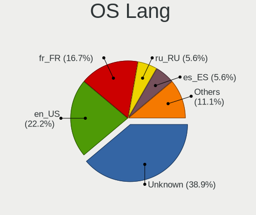
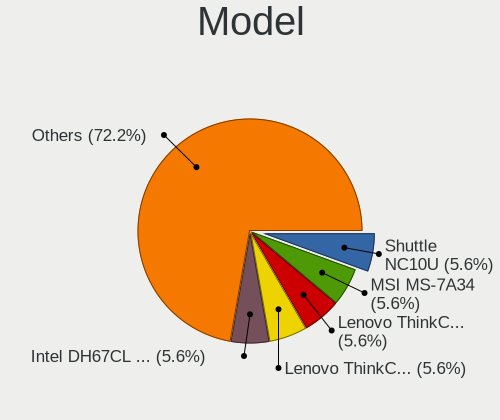
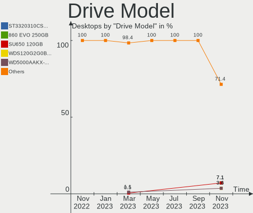
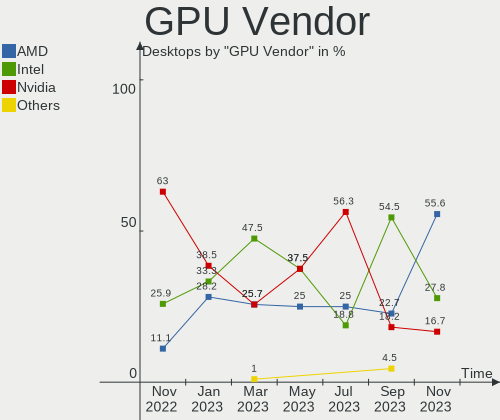

helloSystem - Hardware Trends (Desktops)
----------------------------------------

A project to identify most popular hardware characteristics and track their change
over time based on data collected by BSD users at https://BSD-Hardware.info.

Anyone can contribute to this report by the [hw-probe](https://github.com/linuxhw/hw-probe/blob/master/INSTALL.BSD.md) tool:

    hw-probe -all -upload

This report is for one last month. Overall report since the beginning of time: [TestDays](https://github.com/bsdhw/TestDays)

Period: Nov, 2023.

Contents
--------

* [ System ](#system)
  - [ OS                       ](#os)
  - [ OS Family                ](#os-family)
  - [ Arch                     ](#arch)
  - [ DE                       ](#de)
  - [ Display Server           ](#display-server)
  - [ Display Manager          ](#display-manager)
  - [ OS Lang                  ](#os-lang)
  - [ Boot Mode                ](#boot-mode)
  - [ Filesystem               ](#filesystem)
  - [ Part. scheme             ](#part-scheme)

* [ Board ](#board)
  - [ Vendor                   ](#vendor)
  - [ Model                    ](#model)
  - [ Model Family             ](#model-family)
  - [ MFG Year                 ](#mfg-year)
  - [ Form Factor              ](#form-factor)
  - [ Coreboot                 ](#coreboot)
  - [ RAM Size                 ](#ram-size)
  - [ RAM Used                 ](#ram-used)
  - [ Total Drives             ](#total-drives)
  - [ Has CD-ROM               ](#has-cd-rom)
  - [ Has Ethernet             ](#has-ethernet)
  - [ Has WiFi                 ](#has-wifi)
  - [ Has Bluetooth            ](#has-bluetooth)

* [ Location ](#location)
  - [ Country                  ](#country)
  - [ City                     ](#city)

* [ Drives ](#drives)
  - [ Drive Vendor             ](#drive-vendor)
  - [ Drive Model              ](#drive-model)
  - [ HDD Vendor               ](#hdd-vendor)
  - [ SSD Vendor               ](#ssd-vendor)
  - [ Drive Kind               ](#drive-kind)
  - [ Drive Connector          ](#drive-connector)
  - [ Drive Size               ](#drive-size)
  - [ Space Total              ](#space-total)
  - [ Space Used               ](#space-used)
  - [ Malfunc. Drives          ](#malfunc-drives)
  - [ Malfunc. Drive Vendor    ](#malfunc-drive-vendor)
  - [ Malfunc. HDD Vendor      ](#malfunc-hdd-vendor)
  - [ Malfunc. Drive Kind      ](#malfunc-drive-kind)
  - [ Failed Drives            ](#failed-drives)
  - [ Failed Drive Vendor      ](#failed-drive-vendor)
  - [ Drive Status             ](#drive-status)

* [ Storage controller ](#storage-controller)
  - [ Storage Vendor           ](#storage-vendor)
  - [ Storage Model            ](#storage-model)
  - [ Storage Kind             ](#storage-kind)

* [ Processor ](#processor)
  - [ CPU Vendor               ](#cpu-vendor)
  - [ CPU Model                ](#cpu-model)
  - [ CPU Model Family         ](#cpu-model-family)
  - [ CPU Cores                ](#cpu-cores)
  - [ CPU Sockets              ](#cpu-sockets)
  - [ CPU Threads              ](#cpu-threads)
  - [ CPU Microarch            ](#cpu-microarch)

* [ Graphics ](#graphics)
  - [ GPU Vendor               ](#gpu-vendor)
  - [ GPU Model                ](#gpu-model)
  - [ GPU Combo                ](#gpu-combo)
  - [ GPU Driver               ](#gpu-driver)
  - [ GPU Memory               ](#gpu-memory)

* [ Monitor ](#monitor)
  - [ Monitor Vendor           ](#monitor-vendor)
  - [ Monitor Model            ](#monitor-model)
  - [ Monitor Resolution       ](#monitor-resolution)
  - [ Monitor Diagonal         ](#monitor-diagonal)
  - [ Monitor Width            ](#monitor-width)
  - [ Aspect Ratio             ](#aspect-ratio)
  - [ Monitor Area             ](#monitor-area)
  - [ Pixel Density            ](#pixel-density)
  - [ Multiple Monitors        ](#multiple-monitors)

* [ Network ](#network)
  - [ Net Controller Vendor    ](#net-controller-vendor)
  - [ Net Controller Model     ](#net-controller-model)
  - [ Wireless Vendor          ](#wireless-vendor)
  - [ Wireless Model           ](#wireless-model)
  - [ Ethernet Vendor          ](#ethernet-vendor)
  - [ Ethernet Model           ](#ethernet-model)
  - [ Net Controller Kind      ](#net-controller-kind)
  - [ Used Controller          ](#used-controller)
  - [ NICs                     ](#nics)
  - [ IPv6                     ](#ipv6)

* [ Bluetooth ](#bluetooth)
  - [ Bluetooth Vendor         ](#bluetooth-vendor)
  - [ Bluetooth Model          ](#bluetooth-model)

* [ Sound ](#sound)
  - [ Sound Vendor             ](#sound-vendor)
  - [ Sound Model              ](#sound-model)

* [ Memory ](#memory)
  - [ Memory Vendor            ](#memory-vendor)
  - [ Memory Model             ](#memory-model)
  - [ Memory Kind              ](#memory-kind)
  - [ Memory Form Factor       ](#memory-form-factor)
  - [ Memory Size              ](#memory-size)
  - [ Memory Speed             ](#memory-speed)

* [ Printers & scanners ](#printers--scanners)
  - [ Printer Vendor           ](#printer-vendor)
  - [ Printer Model            ](#printer-model)
  - [ Scanner Vendor           ](#scanner-vendor)
  - [ Scanner Model            ](#scanner-model)

* [ Camera ](#camera)
  - [ Camera Vendor            ](#camera-vendor)
  - [ Camera Model             ](#camera-model)

* [ Security ](#security)
  - [ Fingerprint Vendor       ](#fingerprint-vendor)
  - [ Fingerprint Model        ](#fingerprint-model)
  - [ Chipcard Vendor          ](#chipcard-vendor)
  - [ Chipcard Model           ](#chipcard-model)

* [ Unsupported ](#unsupported)
  - [ Unsupported Devices      ](#unsupported-devices)
  - [ Unsupported Device Types ](#unsupported-device-types)

System
------

OS
--

Installed operating systems

| Name              | Desktops | Percent |
|-------------------|----------|---------|
| helloSystem 0.9.0 | 9        | 50%     |
| helloSystem 0.8.1 | 8        | 44.44%  |
| helloSystem 0.5.0 | 1        | 5.56%   |

OS Family
---------

OS without a version

| Name        | Desktops | Percent |
|-------------|----------|---------|
| helloSystem | 18       | 100%    |

Arch
----

OS architecture (x86_64, i586, etc.)

| Name  | Desktops | Percent |
|-------|----------|---------|
| amd64 | 18       | 100%    |

DE
--

Desktop Environment

| Name         | Desktops | Percent |
|--------------|----------|---------|
| helloDesktop | 18       | 100%    |

Display Server
--------------

X11 or Wayland

| Name | Desktops | Percent |
|------|----------|---------|
| X11  | 18       | 100%    |

Display Manager
---------------

SDDM, LightDM, etc.

| Name | Desktops | Percent |
|------|----------|---------|
| SLiM | 18       | 100%    |

OS Lang
-------

Language

| Lang    | Desktops | Percent |
|---------|----------|---------|
| Unknown | 7        | 38.89%  |
| en_US   | 4        | 22.22%  |
| fr_FR   | 3        | 16.67%  |
| ru_RU   | 1        | 5.56%   |
| es_ES   | 1        | 5.56%   |
| en_GB   | 1        | 5.56%   |
| de_DE   | 1        | 5.56%   |

Boot Mode
---------

EFI or BIOS

| Mode | Desktops | Percent |
|------|----------|---------|
| EFI  | 17       | 94.44%  |
| BIOS | 1        | 5.56%   |

Filesystem
----------

Type of filesystem

| Type   | Desktops | Percent |
|--------|----------|---------|
| Cd9660 | 10       | 55.56%  |
| Zfs    | 8        | 44.44%  |

Part. scheme
------------

Scheme of partitioning

| Type | Desktops | Percent |
|------|----------|---------|
| GPT  | 17       | 94.44%  |
| MBR  | 1        | 5.56%   |

Board
-----

Vendor
------

Motherboard manufacturer

| Name                | Desktops | Percent |
|---------------------|----------|---------|
| Gigabyte Technology | 5        | 27.78%  |
| Lenovo              | 2        | 11.11%  |
| Hewlett-Packard     | 2        | 11.11%  |
| ASUSTek Computer    | 2        | 11.11%  |
| ASRock              | 2        | 11.11%  |
| Shuttle             | 1        | 5.56%   |
| MSI                 | 1        | 5.56%   |
| Intel               | 1        | 5.56%   |
| Fujitsu             | 1        | 5.56%   |
| Dell                | 1        | 5.56%   |

Model
-----

Motherboard model

| Name                               | Desktops | Percent |
|------------------------------------|----------|---------|
| Shuttle NC10U                      | 1        | 5.56%   |
| MSI MS-7A34                        | 1        | 5.56%   |
| Lenovo ThinkCentre M72e 3598BS7    | 1        | 5.56%   |
| Lenovo ThinkCentre M700 10J0S1CK00 | 1        | 5.56%   |
| Intel DH67CL AAG10212-206          | 1        | 5.56%   |
| HP ProDesk 600 G1 SFF              | 1        | 5.56%   |
| HP Compaq dc7900 Small Form Factor | 1        | 5.56%   |
| Gigabyte Z68X-UD5-B3               | 1        | 5.56%   |
| Gigabyte X399 DESIGNARE EX         | 1        | 5.56%   |
| Gigabyte F2A85X-UP4                | 1        | 5.56%   |
| Gigabyte B450M H                   | 1        | 5.56%   |
| Gigabyte B450M AORUS ELITE         | 1        | 5.56%   |
| Fujitsu FUTRO S920                 | 1        | 5.56%   |
| Dell OptiPlex 9020                 | 1        | 5.56%   |
| ASUS ROG Maximus XII APEX          | 1        | 5.56%   |
| ASUS P8Z77-V PRO                   | 1        | 5.56%   |
| ASRock X399 Professional Gaming    | 1        | 5.56%   |
| ASRock A300M-STX                   | 1        | 5.56%   |

Model Family
------------

Motherboard model prefix

| Name                 | Desktops | Percent |
|----------------------|----------|---------|
| Lenovo ThinkCentre   | 2        | 11.11%  |
| Gigabyte B450M       | 2        | 11.11%  |
| Shuttle NC10U        | 1        | 5.56%   |
| MSI MS-7A34          | 1        | 5.56%   |
| Intel DH67CL         | 1        | 5.56%   |
| HP ProDesk           | 1        | 5.56%   |
| HP Compaq            | 1        | 5.56%   |
| Gigabyte Z68X-UD5-B3 | 1        | 5.56%   |
| Gigabyte X399        | 1        | 5.56%   |
| Gigabyte F2A85X-UP4  | 1        | 5.56%   |
| Fujitsu FUTRO        | 1        | 5.56%   |
| Dell OptiPlex        | 1        | 5.56%   |
| ASUS ROG             | 1        | 5.56%   |
| ASUS P8Z77-V         | 1        | 5.56%   |
| ASRock X399          | 1        | 5.56%   |
| ASRock A300M-STX     | 1        | 5.56%   |

MFG Year
--------

Motherboard manufacture year

| Year | Desktops | Percent |
|------|----------|---------|
| 2019 | 3        | 16.67%  |
| 2022 | 2        | 11.11%  |
| 2018 | 2        | 11.11%  |
| 2013 | 2        | 11.11%  |
| 2012 | 2        | 11.11%  |
| 2023 | 1        | 5.56%   |
| 2021 | 1        | 5.56%   |
| 2020 | 1        | 5.56%   |
| 2016 | 1        | 5.56%   |
| 2014 | 1        | 5.56%   |
| 2011 | 1        | 5.56%   |
| 2008 | 1        | 5.56%   |

Form Factor
-----------

Physical design of the computer

| Name    | Desktops | Percent |
|---------|----------|---------|
| Desktop | 18       | 100%    |

Coreboot
--------

Have coreboot on board

| Used | Desktops | Percent |
|------|----------|---------|
| No   | 18       | 100%    |

RAM Size
--------

Total RAM memory

| Size in GB  | Desktops | Percent |
|-------------|----------|---------|
| 8.01-16.0   | 6        | 33.33%  |
| 16.01-24.0  | 5        | 27.78%  |
| 64.01-256.0 | 3        | 16.67%  |
| 4.01-8.0    | 2        | 11.11%  |
| 24.01-32.0  | 2        | 11.11%  |

RAM Used
--------

Used RAM memory

| Used GB  | Desktops | Percent |
|----------|----------|---------|
| 0.51-1.0 | 6        | 33.33%  |
| 0.01-0.5 | 6        | 33.33%  |
| 3.01-4.0 | 2        | 11.11%  |
| 2.01-3.0 | 2        | 11.11%  |
| 1.01-2.0 | 2        | 11.11%  |

Total Drives
------------

Number of drives on board

| Drives | Desktops | Percent |
|--------|----------|---------|
| 1      | 11       | 61.11%  |
| 3      | 3        | 16.67%  |
| 0      | 2        | 11.11%  |
| 5      | 1        | 5.56%   |
| 4      | 1        | 5.56%   |

Has CD-ROM
----------

Has CD-ROM on board

| Presented | Desktops | Percent |
|-----------|----------|---------|
| No        | 13       | 72.22%  |
| Yes       | 5        | 27.78%  |

Has Ethernet
------------

Has Ethernet on board

| Presented | Desktops | Percent |
|-----------|----------|---------|
| Yes       | 17       | 94.44%  |
| No        | 1        | 5.56%   |

Has WiFi
--------

Has WiFi module

| Presented | Desktops | Percent |
|-----------|----------|---------|
| No        | 12       | 66.67%  |
| Yes       | 6        | 33.33%  |

Has Bluetooth
-------------

Has Bluetooth module

| Presented | Desktops | Percent |
|-----------|----------|---------|
| No        | 14       | 77.78%  |
| Yes       | 4        | 22.22%  |

Location
--------

Country
-------

Geographic location (country)

| Country   | Desktops | Percent |
|-----------|----------|---------|
| USA       | 3        | 16.67%  |
| UK        | 3        | 16.67%  |
| Russia    | 3        | 16.67%  |
| France    | 2        | 11.11%  |
| Taiwan    | 1        | 5.56%   |
| Poland    | 1        | 5.56%   |
| Panama    | 1        | 5.56%   |
| Germany   | 1        | 5.56%   |
| Brazil    | 1        | 5.56%   |
| Belgium   | 1        | 5.56%   |
| Argentina | 1        | 5.56%   |

City
----

Geographic location (city)

| City           | Desktops | Percent |
|----------------|----------|---------|
| Wendeburg      | 1        | 5.56%   |
| Taipei         | 1        | 5.56%   |
| St Albans      | 1        | 5.56%   |
| Skopin         | 1        | 5.56%   |
| Sao Paulo      | 1        | 5.56%   |
| Rochester      | 1        | 5.56%   |
| Río Cuarto    | 1        | 5.56%   |
| Panama City    | 1        | 5.56%   |
| Novosibirsk    | 1        | 5.56%   |
| Lyon           | 1        | 5.56%   |
| Lille          | 1        | 5.56%   |
| Ligonier       | 1        | 5.56%   |
| Kirov          | 1        | 5.56%   |
| Horseshoe Bend | 1        | 5.56%   |
| Fort Thomas    | 1        | 5.56%   |
| Bydgoszcz      | 1        | 5.56%   |
| Brussels       | 1        | 5.56%   |
| Brent          | 1        | 5.56%   |

Drives
------

Drive Vendor
------------

Hard drive vendors

| Vendor              | Desktops | Drives | Percent |
|---------------------|----------|--------|---------|
| Samsung Electronics | 5        | 5      | 20%     |
| Seagate             | 4        | 5      | 16%     |
| WDC                 | 3        | 4      | 12%     |
| Toshiba             | 3        | 4      | 12%     |
| A-DATA Technology   | 2        | 2      | 8%      |
| Transcend           | 1        | 1      | 4%      |
| SanDisk             | 1        | 1      | 4%      |
| Patriot             | 1        | 1      | 4%      |
| Micron Technology   | 1        | 1      | 4%      |
| Kingston            | 1        | 1      | 4%      |
| GOODRAM             | 1        | 1      | 4%      |
| Crucial             | 1        | 1      | 4%      |
| Apacer              | 1        | 1      | 4%      |

Drive Model
-----------

Hard drive models

| Model                            | Desktops | Percent |
|----------------------------------|----------|---------|
| Seagate ST3320310CS 320GB        | 2        | 7.14%   |
| Samsung SSD 860 EVO 250GB        | 2        | 7.14%   |
| A-DATA SU650 120GB               | 2        | 7.14%   |
| WDC WDS120G2G0B-00EPW0 120GB     | 1        | 3.57%   |
| WDC WD5000AAKX-08U6AA0 500GB     | 1        | 3.57%   |
| WDC WD1600AAJS-61WAA0 160GB      | 1        | 3.57%   |
| WDC WD10JPVX-22JC3T0 1TB         | 1        | 3.57%   |
| Transcend TS32GMTS400S 32GB      | 1        | 3.57%   |
| Toshiba MQ01ABF032 320GB         | 1        | 3.57%   |
| Toshiba HDWD110 1TB              | 1        | 3.57%   |
| Toshiba DT01ACA100 1TB           | 1        | 3.57%   |
| Toshiba DT01ABA200 2TB           | 1        | 3.57%   |
| Seagate ST3500830AS 500GB        | 1        | 3.57%   |
| Seagate ST3250823AS 250GB        | 1        | 3.57%   |
| Seagate ST1000DM003-1SB10C 1TB   | 1        | 3.57%   |
| SanDisk pSSD 16GB                | 1        | 3.57%   |
| Samsung SSD 850 EVO 1TB          | 1        | 3.57%   |
| Samsung HD161HJ 160GB            | 1        | 3.57%   |
| Samsung HD103SJ 1TB              | 1        | 3.57%   |
| Patriot M.2 P300 128GB           | 1        | 3.57%   |
| Micron C400 RealSSD mSATA 32GB   | 1        | 3.57%   |
| Kingston SA400S37480G 480GB      | 1        | 3.57%   |
| GOODRAM SSDPR-CX400-512-G2 512GB | 1        | 3.57%   |
| Crucial CT500P3SSD8 500GB        | 1        | 3.57%   |
| Apacer AS340 240GB               | 1        | 3.57%   |

HDD Vendor
----------

Hard disk drive vendors

| Vendor              | Desktops | Drives | Percent |
|---------------------|----------|--------|---------|
| Seagate             | 4        | 5      | 33.33%  |
| WDC                 | 3        | 3      | 25%     |
| Toshiba             | 3        | 4      | 25%     |
| Samsung Electronics | 2        | 2      | 16.67%  |

SSD Vendor
----------

Solid state drive vendors

| Vendor              | Desktops | Drives | Percent |
|---------------------|----------|--------|---------|
| Samsung Electronics | 3        | 3      | 25%     |
| A-DATA Technology   | 2        | 2      | 16.67%  |
| WDC                 | 1        | 1      | 8.33%   |
| Transcend           | 1        | 1      | 8.33%   |
| SanDisk             | 1        | 1      | 8.33%   |
| Micron Technology   | 1        | 1      | 8.33%   |
| Kingston            | 1        | 1      | 8.33%   |
| GOODRAM             | 1        | 1      | 8.33%   |
| Apacer              | 1        | 1      | 8.33%   |

Drive Kind
----------

HDD or SSD

| Kind | Desktops | Drives | Percent |
|------|----------|--------|---------|
| SSD  | 11       | 12     | 52.38%  |
| HDD  | 8        | 14     | 38.1%   |
| NVMe | 2        | 2      | 9.52%   |

Drive Connector
---------------

SATA, SAS, NVMe, etc.

| Type | Desktops | Drives | Percent |
|------|----------|--------|---------|
| SATA | 15       | 26     | 88.24%  |
| NVMe | 2        | 2      | 11.76%  |

Drive Size
----------

Size of hard drive

| Size in TB | Desktops | Drives | Percent |
|------------|----------|--------|---------|
| 0.01-0.5   | 12       | 18     | 66.67%  |
| 0.51-1.0   | 5        | 7      | 27.78%  |
| 1.01-2.0   | 1        | 1      | 5.56%   |

Space Total
-----------

Amount of disk space available on the file system

| Size in GB | Desktops | Percent |
|------------|----------|---------|
| 1-20       | 6        | 33.33%  |
| 101-250    | 4        | 22.22%  |
| 251-500    | 3        | 16.67%  |
| 21-50      | 3        | 16.67%  |
| 2001-3000  | 1        | 5.56%   |
| 51-100     | 1        | 5.56%   |

Space Used
----------

Amount of used disk space

| Used GB   | Desktops | Percent |
|-----------|----------|---------|
| 1-20      | 15       | 83.33%  |
| 101-250   | 2        | 11.11%  |
| 1001-2000 | 1        | 5.56%   |

Malfunc. Drives
---------------

Drive models with a malfunction

| Model                                     | Desktops | Drives | Percent |
|-------------------------------------------|----------|--------|---------|
| WDC WD10JPVX-22JC3T0 1TB                  | 1        | 1      | 20%     |
| Toshiba DT01ABA200 2TB                    | 1        | 1      | 20%     |
| Seagate ST3320310CS 320GB                 | 1        | 1      | 20%     |
| Samsung Electronics HD161HJ 160GB         | 1        | 1      | 20%     |
| Micron Technology C400 RealSSD mSATA 32GB | 1        | 1      | 20%     |

Malfunc. Drive Vendor
---------------------

Vendors of faulty drives

| Vendor              | Desktops | Drives | Percent |
|---------------------|----------|--------|---------|
| WDC                 | 1        | 1      | 20%     |
| Toshiba             | 1        | 1      | 20%     |
| Seagate             | 1        | 1      | 20%     |
| Samsung Electronics | 1        | 1      | 20%     |
| Micron Technology   | 1        | 1      | 20%     |

Malfunc. HDD Vendor
-------------------

Vendors of faulty HDD drives

| Vendor              | Desktops | Drives | Percent |
|---------------------|----------|--------|---------|
| WDC                 | 1        | 1      | 25%     |
| Toshiba             | 1        | 1      | 25%     |
| Seagate             | 1        | 1      | 25%     |
| Samsung Electronics | 1        | 1      | 25%     |

Malfunc. Drive Kind
-------------------

Kinds of faulty drives

| Kind | Desktops | Drives | Percent |
|------|----------|--------|---------|
| HDD  | 4        | 4      | 80%     |
| SSD  | 1        | 1      | 20%     |

Failed Drives
-------------

Failed drive models

| Model                           | Desktops | Drives | Percent |
|---------------------------------|----------|--------|---------|
| Samsung Electronics HD103SJ 1TB | 1        | 1      | 100%    |

Failed Drive Vendor
-------------------

Failed drive vendors

| Vendor              | Desktops | Drives | Percent |
|---------------------|----------|--------|---------|
| Samsung Electronics | 1        | 1      | 100%    |

Drive Status
------------

Number of failed and malfunc. drives

| Status   | Desktops | Drives | Percent |
|----------|----------|--------|---------|
| Works    | 12       | 21     | 63.16%  |
| Malfunc  | 5        | 5      | 26.32%  |
| Detected | 1        | 1      | 5.26%   |
| Failed   | 1        | 1      | 5.26%   |

Storage controller
------------------

Storage Vendor
--------------

Storage controller vendors

| Vendor                      | Desktops | Percent |
|-----------------------------|----------|---------|
| Intel                       | 10       | 33.33%  |
| AMD                         | 8        | 26.67%  |
| ASMedia Technology          | 3        | 10%     |
| SanDisk                     | 2        | 6.67%   |
| Samsung Electronics         | 2        | 6.67%   |
| Micron/Crucial Technology   | 1        | 3.33%   |
| MAXIO Technology (Hangzhou) | 1        | 3.33%   |
| Marvell Technology Group    | 1        | 3.33%   |
| Kingston Technology Company | 1        | 3.33%   |
| Chelsio Communications      | 1        | 3.33%   |

Storage Model
-------------

Storage controller models

| Model                                                                                   | Desktops | Percent |
|-----------------------------------------------------------------------------------------|----------|---------|
| AMD FCH SATA Controller [AHCI mode]                                                     | 6        | 16.67%  |
| Intel 6 Series/C200 Series Chipset Family 6 port Desktop SATA AHCI Controller           | 2        | 5.56%   |
| ASMedia ASM1062 Serial ATA Controller                                                   | 2        | 5.56%   |
| AMD X399 Series Chipset SATA Controller                                                 | 2        | 5.56%   |
| AMD 400 Series Chipset SATA Controller                                                  | 2        | 5.56%   |
| Sandisk WD Blue SN570 NVMe SSD 2TB                                                      | 1        | 2.78%   |
| SanDisk Extreme Pro / WD Black 2018/SN750/PC SN720 NVMe SSD                             | 1        | 2.78%   |
| Samsung NVMe SSD Controller SM981/PM981/PM983                                           | 1        | 2.78%   |
| Samsung NVMe SSD Controller 980 (DRAM-less)                                             | 1        | 2.78%   |
| Micron/Crucial P2 [Nick P2] / P3 / P3 Plus NVMe PCIe SSD (DRAM-less)                    | 1        | 2.78%   |
| MAXIO (Hangzhou) NVMe SSD Controller MAP1202                                            | 1        | 2.78%   |
| Marvell Group 88SE91A3 SATA-600 Controller                                              | 1        | 2.78%   |
| Kingston Company A2000 NVMe SSD SM2263EN                                                | 1        | 2.78%   |
| Intel SATA Controller [RAID mode]                                                       | 1        | 2.78%   |
| Intel Q170/Q150/B150/H170/H110/Z170/CM236 Chipset SATA Controller [AHCI Mode]           | 1        | 2.78%   |
| Intel Optane SSD 900P Series                                                            | 1        | 2.78%   |
| Intel Cannon Point-LP SATA Controller [AHCI Mode]                                       | 1        | 2.78%   |
| Intel 82801JD/DO (ICH10 Family) SATA AHCI Controller                                    | 1        | 2.78%   |
| Intel 8 Series/C220 Series Chipset Family 6-port SATA Controller 1 [AHCI mode]          | 1        | 2.78%   |
| Intel 7 Series/C210 Series Chipset Family 4-port SATA Controller [IDE mode]             | 1        | 2.78%   |
| Intel 7 Series/C210 Series Chipset Family 2-port SATA Controller [IDE mode]             | 1        | 2.78%   |
| Intel 6 Series/C200 Series Chipset Family Desktop SATA Controller (IDE mode, ports 4-5) | 1        | 2.78%   |
| Intel 6 Series/C200 Series Chipset Family Desktop SATA Controller (IDE mode, ports 0-3) | 1        | 2.78%   |
| Intel 4 Series Chipset PT IDER Controller                                               | 1        | 2.78%   |
| Chelsio T520-CR Unified Wire Storage Controller                                         | 1        | 2.78%   |
| ASMedia 1064 SATA Controller                                                            | 1        | 2.78%   |
| AMD 300 Series Chipset SATA Controller                                                  | 1        | 2.78%   |

Storage Kind
------------

Kind of storage controller (IDE, SATA, NVMe, SAS, ...)

| Kind | Desktops | Percent |
|------|----------|---------|
| SATA | 16       | 59.26%  |
| NVMe | 6        | 22.22%  |
| IDE  | 3        | 11.11%  |
| RAID | 1        | 3.7%    |
| SCSI | 1        | 3.7%    |

Processor
---------

CPU Vendor
----------

Processor vendors

| Vendor | Desktops | Percent |
|--------|----------|---------|
| Intel  | 10       | 55.56%  |
| AMD    | 8        | 44.44%  |

CPU Model
---------

Processor models

| Model                                           | Desktops | Percent |
|-------------------------------------------------|----------|---------|
| Intel Core i9-10850K CPU @ 3.60GHz              | 1        | 5.56%   |
| Intel Core i7-4770 CPU @ 3.40GHz                | 1        | 5.56%   |
| Intel Core i7-3770 CPU @ 3.40GHz                | 1        | 5.56%   |
| Intel Core i7-2600 CPU                          | 1        | 5.56%   |
| Intel Core i5-6500 CPU @ 3.20GHz                | 1        | 5.56%   |
| Intel Core i5-3470 CPU @ 3.20GHz                | 1        | 5.56%   |
| Intel Core i3-4130 CPU @ 3.40GHz                | 1        | 5.56%   |
| Intel Core i3-2100T CPU @ 2.50GHz               | 1        | 5.56%   |
| Intel Core 2 Duo CPU E8400 @ 3.00GHz            | 1        | 5.56%   |
| Intel Celeron CPU 4205U @ 1.80GHz               | 1        | 5.56%   |
| AMD Ryzen Threadripper 2950X 16-Core Processor  | 1        | 5.56%   |
| AMD Ryzen Threadripper 1920X 12-Core Processor  | 1        | 5.56%   |
| AMD Ryzen 5 3600 6-Core Processor               | 1        | 5.56%   |
| AMD Ryzen 3 PRO 2200G with Radeon Vega Graphics | 1        | 5.56%   |
| AMD Ryzen 3 3200G with Radeon Vega Graphics     | 1        | 5.56%   |
| AMD Ryzen 3 2200G with Radeon Vega Graphics     | 1        | 5.56%   |
| AMD GX-415GA SOC with Radeon HD Graphics        | 1        | 5.56%   |
| AMD A10-6800K APU with Radeon HD Graphics       | 1        | 5.56%   |

CPU Model Family
----------------

Processor model prefix

| Model                  | Desktops | Percent |
|------------------------|----------|---------|
| Intel Core i7          | 3        | 16.67%  |
| Intel Core i5          | 2        | 11.11%  |
| Intel Core i3          | 2        | 11.11%  |
| AMD Ryzen Threadripper | 2        | 11.11%  |
| AMD Ryzen 3            | 2        | 11.11%  |
| Intel Core i9          | 1        | 5.56%   |
| Intel Core 2 Duo       | 1        | 5.56%   |
| Intel Celeron          | 1        | 5.56%   |
| AMD Ryzen 5            | 1        | 5.56%   |
| AMD Ryzen 3 PRO        | 1        | 5.56%   |
| AMD GX                 | 1        | 5.56%   |
| AMD A10                | 1        | 5.56%   |

CPU Cores
---------

Number of processor cores

| Number | Desktops | Percent |
|--------|----------|---------|
| 4      | 10       | 55.56%  |
| 2      | 4        | 22.22%  |
| 32     | 1        | 5.56%   |
| 24     | 1        | 5.56%   |
| 12     | 1        | 5.56%   |
| 10     | 1        | 5.56%   |

CPU Sockets
-----------

Number of sockets

| Number | Desktops | Percent |
|--------|----------|---------|
| 1      | 18       | 100%    |

CPU Threads
-----------

Threads per core (Hyper-Threading)

| Number | Desktops | Percent |
|--------|----------|---------|
| 1      | 12       | 66.67%  |
| 2      | 6        | 33.33%  |

CPU Microarch
-------------

Microarchitecture

| Name        | Desktops | Percent |
|-------------|----------|---------|
| Zen         | 3        | 16.67%  |
| Zen+        | 2        | 11.11%  |
| SandyBridge | 2        | 11.11%  |
| IvyBridge   | 2        | 11.11%  |
| Haswell     | 2        | 11.11%  |
| Zen 2       | 1        | 5.56%   |
| Skylake     | 1        | 5.56%   |
| Piledriver  | 1        | 5.56%   |
| Penryn      | 1        | 5.56%   |
| KabyLake    | 1        | 5.56%   |
| Jaguar      | 1        | 5.56%   |
| CometLake   | 1        | 5.56%   |

Graphics
--------

GPU Vendor
----------

Vendors of graphics cards

| Vendor | Desktops | Percent |
|--------|----------|---------|
| AMD    | 10       | 55.56%  |
| Intel  | 5        | 27.78%  |
| Nvidia | 3        | 16.67%  |

GPU Model
---------

Graphics card models

| Model                                                                     | Desktops | Percent |
|---------------------------------------------------------------------------|----------|---------|
| AMD Raven Ridge [Radeon Vega Series / Radeon Vega Mobile Series]          | 2        | 11.11%  |
| Nvidia GP107 [GeForce GTX 1050 Ti]                                        | 1        | 5.56%   |
| Nvidia GP106 [GeForce GTX 1060 3GB]                                       | 1        | 5.56%   |
| Nvidia GA102 [GeForce RTX 3080 Ti]                                        | 1        | 5.56%   |
| Intel Xeon E3-1200 v2/3rd Gen Core processor Graphics Controller          | 1        | 5.56%   |
| Intel Whiskey Lake-U GT1 [UHD Graphics 610]                               | 1        | 5.56%   |
| Intel HD Graphics 530                                                     | 1        | 5.56%   |
| Intel 4th Generation Core Processor Family Integrated Graphics Controller | 1        | 5.56%   |
| Intel 2nd Generation Core Processor Family Integrated Graphics Controller | 1        | 5.56%   |
| AMD Richland [Radeon HD 8670D]                                            | 1        | 5.56%   |
| AMD Picasso/Raven 2 [Radeon Vega Series / Radeon Vega Mobile Series]      | 1        | 5.56%   |
| AMD Oland [Radeon HD 8570 / R5 430 OEM / R7 240/340 / Radeon 520 OEM]     | 1        | 5.56%   |
| AMD Navi 22 [Radeon RX 6700/6700 XT/6750 XT / 6800M/6850M XT]             | 1        | 5.56%   |
| AMD Kabini [Radeon HD 8330E]                                              | 1        | 5.56%   |
| AMD Ellesmere [Radeon RX 470/480/570/570X/580/580X/590]                   | 1        | 5.56%   |
| AMD Cedar [Radeon HD 5000/6000/7350/8350 Series]                          | 1        | 5.56%   |
| AMD Barts XT [Radeon HD 6870]                                             | 1        | 5.56%   |

GPU Combo
---------

Combinations of graphics cards

| Name       | Desktops | Percent |
|------------|----------|---------|
| 1 x AMD    | 10       | 55.56%  |
| 1 x Intel  | 5        | 27.78%  |
| 1 x Nvidia | 3        | 16.67%  |

GPU Driver
----------

Free vs proprietary

| Driver      | Desktops | Percent |
|-------------|----------|---------|
| Free        | 15       | 83.33%  |
| Proprietary | 2        | 11.11%  |
| Unknown     | 1        | 5.56%   |

GPU Memory
----------

Total video memory

| Size in GB | Desktops | Percent |
|------------|----------|---------|
| Unknown    | 10       | 55.56%  |
| 0.51-1.0   | 3        | 16.67%  |
| 3.01-4.0   | 2        | 11.11%  |
| 2.01-3.0   | 1        | 5.56%   |
| 1.01-2.0   | 1        | 5.56%   |
| 0.01-0.5   | 1        | 5.56%   |

Monitor
-------

Monitor Vendor
--------------

Monitor vendors

| Vendor               | Desktops | Percent |
|----------------------|----------|---------|
| Samsung Electronics  | 5        | 31.25%  |
| Dell                 | 3        | 18.75%  |
| Goldstar             | 2        | 12.5%   |
| Hewlett-Packard      | 1        | 6.25%   |
| Eizo                 | 1        | 6.25%   |
| CVT                  | 1        | 6.25%   |
| BenQ                 | 1        | 6.25%   |
| Ancor Communications | 1        | 6.25%   |
| Acer                 | 1        | 6.25%   |

Monitor Model
-------------

Monitor models

| Model                                                                 | Desktops | Percent |
|-----------------------------------------------------------------------|----------|---------|
| Samsung Electronics SyncMaster SAM058F 1920x1080 480x270mm 21.7-inch  | 1        | 6.25%   |
| Samsung Electronics SyncMaster SAM030D 1680x1050 470x300mm 22.0-inch  | 1        | 6.25%   |
| Samsung Electronics SyncMaster SAM022F 1280x1024 310x230mm 15.2-inch  | 1        | 6.25%   |
| Samsung Electronics S27R35x SAM1053 1920x1080 600x340mm 27.2-inch     | 1        | 6.25%   |
| Samsung Electronics LCD Monitor SAM0FEF 3840x2160 950x540mm 43.0-inch | 1        | 6.25%   |
| Hewlett-Packard w1907 HWP26A2 1440x900 410x260mm 19.1-inch            | 1        | 6.25%   |
| Goldstar W2043 GSM4E9E 1600x900 450x250mm 20.3-inch                   | 1        | 6.25%   |
| Goldstar LG ULTRAGEAR GSM5B7F 2560x1440 600x340mm 27.2-inch           | 1        | 6.25%   |
| Eizo FS2331 ENC2211 1920x1080 510x290mm 23.1-inch                     | 1        | 6.25%   |
| Dell P2214H DELA098 1920x1080 480x270mm 21.7-inch                     | 1        | 6.25%   |
| Dell E1913 DELD051 1440x900 410x260mm 19.1-inch                       | 1        | 6.25%   |
| Dell 2408WFP DELA02B 1920x1200 520x320mm 24.0-inch                    | 1        | 6.25%   |
| CVT LCD Monitor CVT4668 1440x900 360x290mm 18.2-inch                  | 1        | 6.25%   |
| BenQ G2320HDB BNQ7828 1920x1080 510x290mm 23.1-inch                   | 1        | 6.25%   |
| Ancor Communications ASUS PB238 ACI23A2 1920x1080 510x290mm 23.1-inch | 1        | 6.25%   |
| Acer G226HQL ACR0311 1920x1080 480x270mm 21.7-inch                    | 1        | 6.25%   |

Monitor Resolution
------------------

Monitor screen resolution

| Resolution         | Desktops | Percent |
|--------------------|----------|---------|
| 1920x1080 (FHD)    | 6        | 40%     |
| 1440x900 (WXGA+)   | 3        | 20%     |
| 3840x2160 (4K)     | 1        | 6.67%   |
| 2560x1440 (QHD)    | 1        | 6.67%   |
| 1920x1200 (WUXGA)  | 1        | 6.67%   |
| 1680x1050 (WSXGA+) | 1        | 6.67%   |
| 1600x900 (HD+)     | 1        | 6.67%   |
| 1280x1024 (SXGA)   | 1        | 6.67%   |

Monitor Diagonal
----------------

Diagonal size in inches

| Inches | Desktops | Percent |
|--------|----------|---------|
| 23     | 3        | 18.75%  |
| 21     | 3        | 18.75%  |
| 27     | 2        | 12.5%   |
| 19     | 2        | 12.5%   |
| 43     | 1        | 6.25%   |
| 24     | 1        | 6.25%   |
| 22     | 1        | 6.25%   |
| 20     | 1        | 6.25%   |
| 18     | 1        | 6.25%   |
| 15     | 1        | 6.25%   |

Monitor Width
-------------

Physical width

| Width in mm | Desktops | Percent |
|-------------|----------|---------|
| 401-500     | 7        | 43.75%  |
| 501-600     | 6        | 37.5%   |
| 351-400     | 1        | 6.25%   |
| 301-350     | 1        | 6.25%   |
| 901-1000    | 1        | 6.25%   |

Aspect Ratio
------------

Proportional relationship between the width and the height

| Ratio | Desktops | Percent |
|-------|----------|---------|
| 16/9  | 9        | 60%     |
| 16/10 | 4        | 26.67%  |
| 6/5   | 1        | 6.67%   |
| 4/3   | 1        | 6.67%   |

Monitor Area
------------

Area in inch²

| Area in inch² | Desktops | Percent |
|----------------|----------|---------|
| 201-250        | 7        | 43.75%  |
| 151-200        | 4        | 25%     |
| 301-350        | 2        | 12.5%   |
| 251-300        | 1        | 6.25%   |
| 111-120        | 1        | 6.25%   |
| 501-1000       | 1        | 6.25%   |

Pixel Density
-------------

Pixels per inch

| Density | Desktops | Percent |
|---------|----------|---------|
| 51-100  | 10       | 62.5%   |
| 101-120 | 6        | 37.5%   |

Multiple Monitors
-----------------

Total monitors connected

| Total | Desktops | Percent |
|-------|----------|---------|
| 1     | 15       | 83.33%  |
| 0     | 2        | 11.11%  |
| 2     | 1        | 5.56%   |

Network
-------

Net Controller Vendor
---------------------

Controller vendors

| Vendor                 | Desktops | Percent |
|------------------------|----------|---------|
| Intel                  | 11       | 47.83%  |
| Realtek Semiconductor  | 8        | 34.78%  |
| Samsung Electronics    | 1        | 4.35%   |
| Ralink Technology      | 1        | 4.35%   |
| Chelsio Communications | 1        | 4.35%   |
| Aquantia               | 1        | 4.35%   |

Net Controller Model
--------------------

Controller models

| Model                                                             | Desktops | Percent |
|-------------------------------------------------------------------|----------|---------|
| Realtek RTL8111/8168/8411 PCI Express Gigabit Ethernet Controller | 7        | 26.92%  |
| Intel I211 Gigabit Network Connection                             | 3        | 11.54%  |
| Intel Wireless 8265 / 8275                                        | 2        | 7.69%   |
| Intel Ethernet Connection I217-LM                                 | 2        | 7.69%   |
| Intel 82579V Gigabit Network Connection                           | 2        | 7.69%   |
| Samsung Galaxy series, misc. (tethering mode)                     | 1        | 3.85%   |
| Realtek RTL8188EE Wireless Network Adapter                        | 1        | 3.85%   |
| Ralink RT2870/RT3070 Wireless Adapter                             | 1        | 3.85%   |
| Intel Ethernet Controller I225-V                                  | 1        | 3.85%   |
| Intel Ethernet Connection (2) I219-V                              | 1        | 3.85%   |
| Intel Dual Band Wireless-AC 3168NGW [Stone Peak]                  | 1        | 3.85%   |
| Intel Comet Lake PCH CNVi WiFi                                    | 1        | 3.85%   |
| Intel 82567LM-3 Gigabit Network Connection                        | 1        | 3.85%   |
| Chelsio T520-CR Unified Wire Ethernet Controller                  | 1        | 3.85%   |
| Aquantia AQC107 NBase-T/IEEE 802.3bz Ethernet Controller [AQtion] | 1        | 3.85%   |

Wireless Vendor
---------------

Wireless vendors

| Vendor                | Desktops | Percent |
|-----------------------|----------|---------|
| Intel                 | 4        | 66.67%  |
| Realtek Semiconductor | 1        | 16.67%  |
| Ralink Technology     | 1        | 16.67%  |

Wireless Model
--------------

Wireless models

| Model                                            | Desktops | Percent |
|--------------------------------------------------|----------|---------|
| Intel Wireless 8265 / 8275                       | 2        | 33.33%  |
| Realtek RTL8188EE Wireless Network Adapter       | 1        | 16.67%  |
| Ralink RT2870/RT3070 Wireless Adapter            | 1        | 16.67%  |
| Intel Dual Band Wireless-AC 3168NGW [Stone Peak] | 1        | 16.67%  |
| Intel Comet Lake PCH CNVi WiFi                   | 1        | 16.67%  |

Ethernet Vendor
---------------

Ethernet vendors

| Vendor                 | Desktops | Percent |
|------------------------|----------|---------|
| Intel                  | 10       | 50%     |
| Realtek Semiconductor  | 7        | 35%     |
| Samsung Electronics    | 1        | 5%      |
| Chelsio Communications | 1        | 5%      |
| Aquantia               | 1        | 5%      |

Ethernet Model
--------------

Ethernet models

| Model                                                             | Desktops | Percent |
|-------------------------------------------------------------------|----------|---------|
| Realtek RTL8111/8168/8411 PCI Express Gigabit Ethernet Controller | 7        | 35%     |
| Intel I211 Gigabit Network Connection                             | 3        | 15%     |
| Intel Ethernet Connection I217-LM                                 | 2        | 10%     |
| Intel 82579V Gigabit Network Connection                           | 2        | 10%     |
| Samsung Galaxy series, misc. (tethering mode)                     | 1        | 5%      |
| Intel Ethernet Controller I225-V                                  | 1        | 5%      |
| Intel Ethernet Connection (2) I219-V                              | 1        | 5%      |
| Intel 82567LM-3 Gigabit Network Connection                        | 1        | 5%      |
| Chelsio T520-CR Unified Wire Ethernet Controller                  | 1        | 5%      |
| Aquantia AQC107 NBase-T/IEEE 802.3bz Ethernet Controller [AQtion] | 1        | 5%      |

Net Controller Kind
-------------------

Ethernet, WiFi or modem

| Kind     | Desktops | Percent |
|----------|----------|---------|
| Ethernet | 17       | 73.91%  |
| WiFi     | 6        | 26.09%  |

Used Controller
---------------

Currently used network controller

| Kind     | Desktops | Percent |
|----------|----------|---------|
| Ethernet | 15       | 88.24%  |
| WiFi     | 2        | 11.76%  |

NICs
----

Total network controllers on board

| Total | Desktops | Percent |
|-------|----------|---------|
| 1     | 12       | 66.67%  |
| 2     | 3        | 16.67%  |
| 9     | 1        | 5.56%   |
| 3     | 1        | 5.56%   |
| 0     | 1        | 5.56%   |

IPv6
----

IPv6 vs IPv4

| Used | Desktops | Percent |
|------|----------|---------|
| No   | 17       | 94.44%  |
| Yes  | 1        | 5.56%   |

Bluetooth
---------

Bluetooth Vendor
----------------

Controller vendors

| Vendor | Desktops | Percent |
|--------|----------|---------|
| Intel  | 4        | 100%    |

Bluetooth Model
---------------

Controller models

| Model                              | Desktops | Percent |
|------------------------------------|----------|---------|
| Intel Bluetooth wireless interface | 2        | 50%     |
| Intel Wireless-AC 3168 Bluetooth   | 1        | 25%     |
| Intel AX201 Bluetooth              | 1        | 25%     |

Sound
-----

Sound Vendor
------------

Sound card vendors

| Vendor                  | Desktops | Percent |
|-------------------------|----------|---------|
| Intel                   | 10       | 35.71%  |
| AMD                     | 10       | 35.71%  |
| Nvidia                  | 3        | 10.71%  |
| Texas Instruments       | 1        | 3.57%   |
| M-Audio                 | 1        | 3.57%   |
| JMTek                   | 1        | 3.57%   |
| GEMBIRD                 | 1        | 3.57%   |
| Cambridge Silicon Radio | 1        | 3.57%   |

Sound Model
-----------

Sound card models

| Model                                                                      | Desktops | Percent |
|----------------------------------------------------------------------------|----------|---------|
| Intel 6 Series/C200 Series Chipset Family High Definition Audio Controller | 3        | 8.33%   |
| AMD Raven/Raven2/Fenghuang HDMI/DP Audio Controller                        | 3        | 8.33%   |
| AMD Family 17h/19h HD Audio Controller                                     | 3        | 8.33%   |
| Intel 8 Series/C220 Series Chipset High Definition Audio Controller        | 2        | 5.56%   |
| AMD FCH Azalia Controller                                                  | 2        | 5.56%   |
| AMD Family 17h (Models 00h-0fh) HD Audio Controller                        | 2        | 5.56%   |
| Texas Instruments PCM2902 Audio Codec                                      | 1        | 2.78%   |
| Nvidia GP107GL High Definition Audio Controller                            | 1        | 2.78%   |
| Nvidia GP106 High Definition Audio Controller                              | 1        | 2.78%   |
| Nvidia GA102 High Definition Audio Controller                              | 1        | 2.78%   |
| M-Audio M-Audio Fast Track MKII                                            | 1        | 2.78%   |
| JMTek USB PnP Audio Device                                                 | 1        | 2.78%   |
| Intel Xeon E3-1200 v3/4th Gen Core Processor HD Audio Controller           | 1        | 2.78%   |
| Intel Comet Lake PCH cAVS                                                  | 1        | 2.78%   |
| Intel Cannon Point-LP High Definition Audio Controller                     | 1        | 2.78%   |
| Intel 82801JD/DO (ICH10 Family) HD Audio Controller                        | 1        | 2.78%   |
| Intel 7 Series/C216 Chipset Family High Definition Audio Controller        | 1        | 2.78%   |
| Intel 100 Series/C230 Series Chipset Family HD Audio Controller            | 1        | 2.78%   |
| GEMBIRD Honk HK-5002 USB Speaker                                           | 1        | 2.78%   |
| Cambridge Silicon Radio FiiO BTR3K                                         | 1        | 2.78%   |
| AMD Trinity HDMI Audio Controller                                          | 1        | 2.78%   |
| AMD Starship/Matisse HD Audio Controller                                   | 1        | 2.78%   |
| AMD Oland/Hainan/Cape Verde/Pitcairn HDMI Audio [Radeon HD 7000 Series]    | 1        | 2.78%   |
| AMD Navi 21/23 HDMI/DP Audio Controller                                    | 1        | 2.78%   |
| AMD Kabini HDMI/DP Audio                                                   | 1        | 2.78%   |
| AMD Ellesmere HDMI Audio [Radeon RX 470/480 / 570/580/590]                 | 1        | 2.78%   |
| AMD Barts HDMI Audio [Radeon HD 6790/6850/6870 / 7720 OEM]                 | 1        | 2.78%   |

Memory
------

Memory Vendor
-------------

Memory module vendors

| Vendor              | Desktops | Percent |
|---------------------|----------|---------|
| Kingston            | 4        | 16.67%  |
| Corsair             | 4        | 16.67%  |
| Samsung Electronics | 3        | 12.5%   |
| G.Skill             | 3        | 12.5%   |
| SK hynix            | 2        | 8.33%   |
| Crucial             | 2        | 8.33%   |
| Unknown             | 1        | 4.17%   |
| Transcend           | 1        | 4.17%   |
| Patriot             | 1        | 4.17%   |
| Panram              | 1        | 4.17%   |
| Nanya Technology    | 1        | 4.17%   |
| Micron Technology   | 1        | 4.17%   |

Memory Model
------------

Memory module models

| Model                                                   | Desktops | Percent |
|---------------------------------------------------------|----------|---------|
| Unknown RAM Module 4GB DIMM 1600MT/s                    | 1        | 3.85%   |
| Transcend RAM JM667QLU-1G 1GB DIMM DDR2 667MT/s         | 1        | 3.85%   |
| SK hynix RAM HMT451U6BFR8C-PB 4GB DIMM DDR3 1600MT/s    | 1        | 3.85%   |
| SK hynix RAM HMT41GU6MFR8C-PB 8GB DIMM DDR3 1600MT/s    | 1        | 3.85%   |
| SK hynix RAM HMA81GU6CJR8N-XN 8GB DIMM DDR4 3200MT/s    | 1        | 3.85%   |
| Samsung RAM M471B5173QH0-YK0 4GB SODIMM DDR3 1600MT/s   | 1        | 3.85%   |
| Samsung RAM M471A1K43CB1-CRC 8GB SODIMM DDR4 2667MT/s   | 1        | 3.85%   |
| Samsung RAM M378B5273CH0-CK0 4GB DIMM DDR3 1600MT/s     | 1        | 3.85%   |
| Patriot RAM 2666 C16 Series 4GB DIMM DDR4 3000MT/s      | 1        | 3.85%   |
| Panram RAM PUD31600C114GVS 4GB DIMM DDR3 1600MT/s       | 1        | 3.85%   |
| Nanya RAM NT2GC64B88B0NF-CG 2GB DIMM DDR3 1333MT/s      | 1        | 3.85%   |
| Micron RAM 8HTF12864AY-800J1 1GB DIMM DDR2 800MT/s      | 1        | 3.85%   |
| Kingston RAM Module 1GB DIMM DDR2 667MT/s               | 1        | 3.85%   |
| Kingston RAM KHX3200C16D4/4GX 4GB DIMM DDR4 3200MT/s    | 1        | 3.85%   |
| Kingston RAM KF3200C16D4/16GX 16GB DIMM DDR4 3200MT/s   | 1        | 3.85%   |
| Kingston RAM KF2666C16D4/8G 8GB DIMM DDR4 3200MT/s      | 1        | 3.85%   |
| Kingston RAM 9905316-005.A04LF 1GB DIMM DDR2 667MT/s    | 1        | 3.85%   |
| G.Skill RAM F4-4000C18-32GVK 32GB DIMM DDR4 4000MT/s    | 1        | 3.85%   |
| G.Skill RAM F4-2133C15-4GRS 4GB SODIMM DDR4 2133MT/s    | 1        | 3.85%   |
| G.Skill RAM F3-2400C10-4G 4GB DIMM DDR3 1600MT/s        | 1        | 3.85%   |
| Crucial RAM CT4G4SFS8266.C8FG 4GB SODIMM DDR4 2667MT/s  | 1        | 3.85%   |
| Crucial RAM BLS8G3D169DS3.16FE 8GB DIMM DDR3 1600MT/s   | 1        | 3.85%   |
| Corsair RAM CMX8GX3M2A1333C9 4GB DIMM DDR3 1333MT/s     | 1        | 3.85%   |
| Corsair RAM CMW128GX4M8C3200C16 16GB DIMM DDR4 2133MT/s | 1        | 3.85%   |
| Corsair RAM CMSX16GX4M2A3000C16 8GB SODIMM DDR4         | 1        | 3.85%   |
| Corsair RAM CMD16GX3M2A1600C9 8GB DIMM DDR3 1333MT/s    | 1        | 3.85%   |

Memory Kind
-----------

Memory module kinds

| Kind    | Desktops | Percent |
|---------|----------|---------|
| DDR4    | 9        | 50%     |
| DDR3    | 7        | 38.89%  |
| DDR2    | 1        | 5.56%   |
| Unknown | 1        | 5.56%   |

Memory Form Factor
------------------

Physical design of the memory module

| Name   | Desktops | Percent |
|--------|----------|---------|
| DIMM   | 14       | 77.78%  |
| SODIMM | 4        | 22.22%  |

Memory Size
-----------

Memory module size

| Size  | Desktops | Percent |
|-------|----------|---------|
| 4096  | 8        | 38.1%   |
| 8192  | 7        | 33.33%  |
| 16384 | 3        | 14.29%  |
| 32768 | 1        | 4.76%   |
| 2048  | 1        | 4.76%   |
| 1024  | 1        | 4.76%   |

Memory Speed
------------

Memory module speed

| Speed   | Desktops | Percent |
|---------|----------|---------|
| 1600    | 6        | 27.27%  |
| 3200    | 4        | 18.18%  |
| 1333    | 3        | 13.64%  |
| 2667    | 2        | 9.09%   |
| 2133    | 2        | 9.09%   |
| 4000    | 1        | 4.55%   |
| 3000    | 1        | 4.55%   |
| 800     | 1        | 4.55%   |
| 667     | 1        | 4.55%   |
| Unknown | 1        | 4.55%   |

Printers & scanners
-------------------

Printer Vendor
--------------

Printer device vendors

Zero info for selected period =(

Printer Model
-------------

Printer device models

Zero info for selected period =(

Scanner Vendor
--------------

Scanner device vendors

Zero info for selected period =(

Scanner Model
-------------

Scanner device models

Zero info for selected period =(

Camera
------

Camera Vendor
-------------

Camera device vendors

| Vendor   | Desktops | Percent |
|----------|----------|---------|
| Logitech | 1        | 100%    |

Camera Model
------------

Camera device models

| Model                         | Desktops | Percent |
|-------------------------------|----------|---------|
| Logitech BRIO Ultra HD Webcam | 1        | 100%    |

Security
--------

Fingerprint Vendor
------------------

Fingerprint sensor vendors

Zero info for selected period =(

Fingerprint Model
-----------------

Fingerprint sensor models

Zero info for selected period =(

Chipcard Vendor
---------------

Chipcard module vendors

Zero info for selected period =(

Chipcard Model
--------------

Chipcard module models

Zero info for selected period =(

Unsupported
-----------

Unsupported Devices
-------------------

Total unsupported devices on board

| Total | Desktops | Percent |
|-------|----------|---------|
| 1     | 8        | 44.44%  |
| 0     | 7        | 38.89%  |
| 2     | 2        | 11.11%  |
| 3     | 1        | 5.56%   |

Unsupported Device Types
------------------------

Types of unsupported devices

| Type                     | Desktops | Percent |
|--------------------------|----------|---------|
| Communication controller | 9        | 69.23%  |
| Sound                    | 2        | 15.38%  |
| Net/ethernet             | 1        | 7.69%   |
| Card reader              | 1        | 7.69%   |

