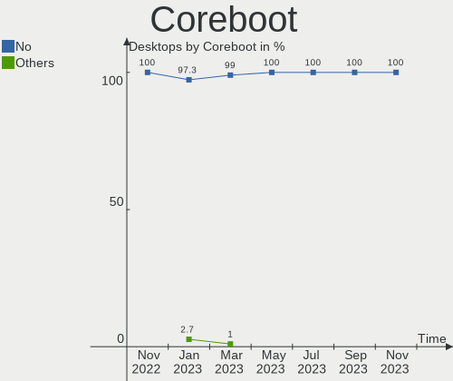
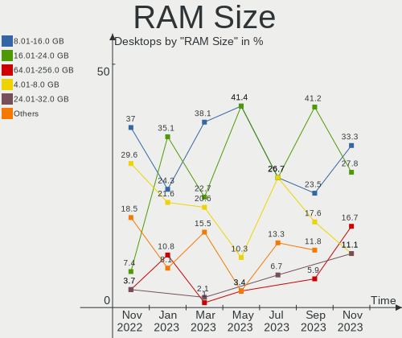
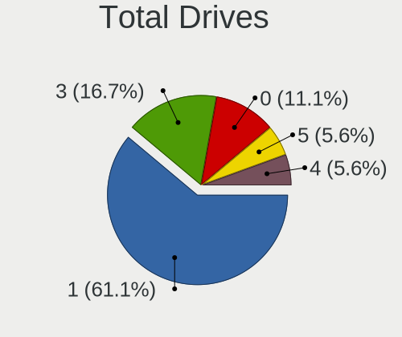
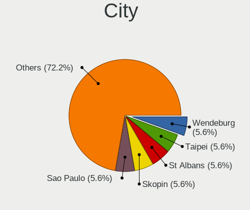
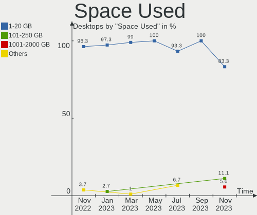
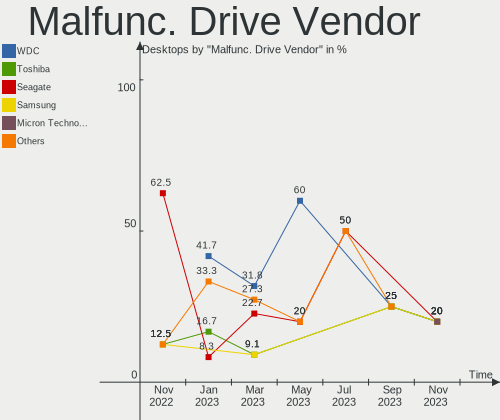
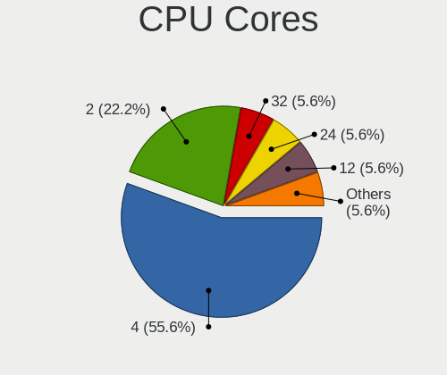
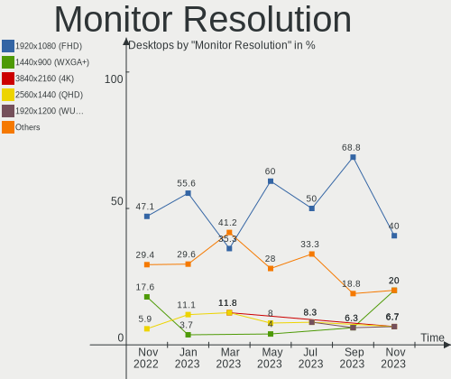
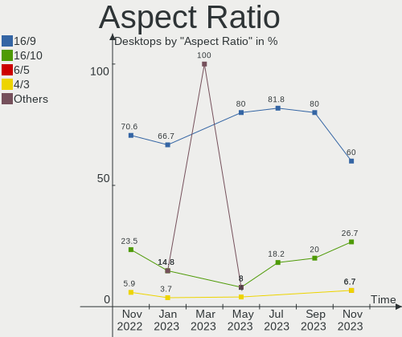
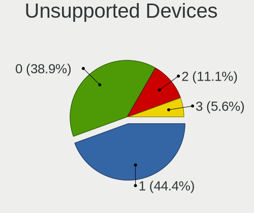

helloSystem Hardware Trends (Desktops)
--------------------------------------

A project to identify most popular hardware characteristics and track their change
over time based on data collected by helloSystem users at https://BSD-Hardware.info.

Anyone can contribute to this report by the [hw-probe](https://github.com/linuxhw/hw-probe/blob/master/INSTALL.BSD.md) tool:

    hw-probe -all -upload

Full-feature report is available here: https://bsd-hardware.info/?view=trends&formfactor=desktop

Period: Oct, 2021.

Contents
--------

* [ System ](#system)
  - [ OS                       ](#os)
  - [ OS Family                ](#os-family)
  - [ Arch                     ](#arch)
  - [ DE                       ](#de)
  - [ Display Server           ](#display-server)
  - [ Display Manager          ](#display-manager)
  - [ OS Lang                  ](#os-lang)
  - [ Boot Mode                ](#boot-mode)
  - [ Filesystem               ](#filesystem)
  - [ Part. scheme             ](#part-scheme)

* [ Board ](#board)
  - [ Vendor                   ](#vendor)
  - [ Model                    ](#model)
  - [ Model Family             ](#model-family)
  - [ MFG Year                 ](#mfg-year)
  - [ Form Factor              ](#form-factor)
  - [ Coreboot                 ](#coreboot)
  - [ RAM Size                 ](#ram-size)
  - [ RAM Used                 ](#ram-used)
  - [ Total Drives             ](#total-drives)
  - [ Has CD-ROM               ](#has-cd-rom)
  - [ Has Ethernet             ](#has-ethernet)
  - [ Has WiFi                 ](#has-wifi)
  - [ Has Bluetooth            ](#has-bluetooth)

* [ Location ](#location)
  - [ Country                  ](#country)
  - [ City                     ](#city)

* [ Drives ](#drives)
  - [ Drive Vendor             ](#drive-vendor)
  - [ Drive Model              ](#drive-model)
  - [ HDD Vendor               ](#hdd-vendor)
  - [ SSD Vendor               ](#ssd-vendor)
  - [ Drive Kind               ](#drive-kind)
  - [ Drive Connector          ](#drive-connector)
  - [ Drive Size               ](#drive-size)
  - [ Space Total              ](#space-total)
  - [ Space Used               ](#space-used)
  - [ Malfunc. Drives          ](#malfunc-drives)
  - [ Malfunc. Drive Vendor    ](#malfunc-drive-vendor)
  - [ Malfunc. HDD Vendor      ](#malfunc-hdd-vendor)
  - [ Malfunc. Drive Kind      ](#malfunc-drive-kind)
  - [ Failed Drives            ](#failed-drives)
  - [ Failed Drive Vendor      ](#failed-drive-vendor)
  - [ Drive Status             ](#drive-status)

* [ Storage controller ](#storage-controller)
  - [ Storage Vendor           ](#storage-vendor)
  - [ Storage Model            ](#storage-model)
  - [ Storage Kind             ](#storage-kind)

* [ Processor ](#processor)
  - [ CPU Vendor               ](#cpu-vendor)
  - [ CPU Model                ](#cpu-model)
  - [ CPU Model Family         ](#cpu-model-family)
  - [ CPU Cores                ](#cpu-cores)
  - [ CPU Sockets              ](#cpu-sockets)
  - [ CPU Threads              ](#cpu-threads)
  - [ CPU Microarch            ](#cpu-microarch)

* [ Graphics ](#graphics)
  - [ GPU Vendor               ](#gpu-vendor)
  - [ GPU Model                ](#gpu-model)
  - [ GPU Combo                ](#gpu-combo)
  - [ GPU Driver               ](#gpu-driver)
  - [ GPU Memory               ](#gpu-memory)

* [ Monitor ](#monitor)
  - [ Monitor Vendor           ](#monitor-vendor)
  - [ Monitor Model            ](#monitor-model)
  - [ Monitor Resolution       ](#monitor-resolution)
  - [ Monitor Diagonal         ](#monitor-diagonal)
  - [ Monitor Width            ](#monitor-width)
  - [ Aspect Ratio             ](#aspect-ratio)
  - [ Monitor Area             ](#monitor-area)
  - [ Pixel Density            ](#pixel-density)
  - [ Multiple Monitors        ](#multiple-monitors)

* [ Network ](#network)
  - [ Net Controller Vendor    ](#net-controller-vendor)
  - [ Net Controller Model     ](#net-controller-model)
  - [ Wireless Vendor          ](#wireless-vendor)
  - [ Wireless Model           ](#wireless-model)
  - [ Ethernet Vendor          ](#ethernet-vendor)
  - [ Ethernet Model           ](#ethernet-model)
  - [ Net Controller Kind      ](#net-controller-kind)
  - [ Used Controller          ](#used-controller)
  - [ NICs                     ](#nics)
  - [ IPv6                     ](#ipv6)

* [ Bluetooth ](#bluetooth)
  - [ Bluetooth Vendor         ](#bluetooth-vendor)
  - [ Bluetooth Model          ](#bluetooth-model)

* [ Sound ](#sound)
  - [ Sound Vendor             ](#sound-vendor)
  - [ Sound Model              ](#sound-model)

* [ Memory ](#memory)
  - [ Memory Vendor            ](#memory-vendor)
  - [ Memory Model             ](#memory-model)
  - [ Memory Kind              ](#memory-kind)
  - [ Memory Form Factor       ](#memory-form-factor)
  - [ Memory Size              ](#memory-size)
  - [ Memory Speed             ](#memory-speed)

* [ Printers & scanners ](#printers--scanners)
  - [ Printer Vendor           ](#printer-vendor)
  - [ Printer Model            ](#printer-model)
  - [ Scanner Vendor           ](#scanner-vendor)
  - [ Scanner Model            ](#scanner-model)

* [ Camera ](#camera)
  - [ Camera Vendor            ](#camera-vendor)
  - [ Camera Model             ](#camera-model)

* [ Security ](#security)
  - [ Fingerprint Vendor       ](#fingerprint-vendor)
  - [ Fingerprint Model        ](#fingerprint-model)
  - [ Chipcard Vendor          ](#chipcard-vendor)
  - [ Chipcard Model           ](#chipcard-model)

* [ Unsupported ](#unsupported)
  - [ Unsupported Devices      ](#unsupported-devices)
  - [ Unsupported Device Types ](#unsupported-device-types)

System
------

OS
--

Installed operating systems

| Name              | Desktops | Percent |
|-------------------|----------|---------|
| helloSystem 0.6.0 | 24       | 82.76%  |
| helloSystem 0.5.0 | 4        | 13.79%  |
| helloSystem 0.7.0 | 1        | 3.45%   |

OS Family
---------

OS without a version

| Name        | Desktops | Percent |
|-------------|----------|---------|
| helloSystem | 29       | 100%    |

Arch
----

OS architecture (x86_64, i586, etc.)

| Name  | Desktops | Percent |
|-------|----------|---------|
| amd64 | 29       | 100%    |

DE
--

Desktop Environment

| Name         | Desktops | Percent |
|--------------|----------|---------|
| helloDesktop | 29       | 100%    |

Display Server
--------------

X11 or Wayland

| Name | Desktops | Percent |
|------|----------|---------|
| X11  | 29       | 100%    |

Display Manager
---------------

SDDM, LightDM, etc.

| Name | Desktops | Percent |
|------|----------|---------|
| SLiM | 29       | 100%    |

OS Lang
-------

Language

| Lang  | Desktops | Percent |
|-------|----------|---------|
| en_US | 29       | 100%    |

Boot Mode
---------

EFI or BIOS

| Mode | Desktops | Percent |
|------|----------|---------|
| EFI  | 26       | 89.66%  |
| BIOS | 3        | 10.34%  |

Filesystem
----------

Type of filesystem

| Type | Desktops | Percent |
|------|----------|---------|
| Zfs  | 29       | 100%    |

Part. scheme
------------

Scheme of partitioning

| Type | Desktops | Percent |
|------|----------|---------|
| GPT  | 29       | 100%    |

Board
-----

Vendor
------

Motherboard manufacturer

| Name                | Desktops | Percent |
|---------------------|----------|---------|
| ASUSTek Computer    | 8        | 27.59%  |
| Hewlett-Packard     | 4        | 13.79%  |
| Gigabyte Technology | 4        | 13.79%  |
| MSI                 | 3        | 10.34%  |
| ASRock              | 3        | 10.34%  |
| Acer                | 2        | 6.9%    |
| Medion              | 1        | 3.45%   |
| Intel               | 1        | 3.45%   |
| Dell                | 1        | 3.45%   |
| Apple               | 1        | 3.45%   |
| Unknown             | 1        | 3.45%   |

Model
-----

Motherboard model

| Name                                | Desktops | Percent |
|-------------------------------------|----------|---------|
| MSI MS-7B93                         | 1        | 3.45%   |
| MSI MS-7A40                         | 1        | 3.45%   |
| MSI MS-7592                         | 1        | 3.45%   |
| Medion H61H2-LM3                    | 1        | 3.45%   |
| Intel H61                           | 1        | 3.45%   |
| HP ProLiant ML350 G5                | 1        | 3.45%   |
| HP Pavilion Gaming Desktop 690-00xx | 1        | 3.45%   |
| HP Compaq Elite 8300 USDT           | 1        | 3.45%   |
| HP Compaq Elite 8300 SFF            | 1        | 3.45%   |
| Gigabyte H410M S2 V2                | 1        | 3.45%   |
| Gigabyte G41MT-S2                   | 1        | 3.45%   |
| Gigabyte B450 AORUS M               | 1        | 3.45%   |
| Gigabyte 990FXA-UD3                 | 1        | 3.45%   |
| Dell OptiPlex 3020M                 | 1        | 3.45%   |
| ASUS TUF GAMING X570-PLUS           | 1        | 3.45%   |
| ASUS TUF B450M-PRO GAMING           | 1        | 3.45%   |
| ASUS PRIME Z390M-PLUS               | 1        | 3.45%   |
| ASUS P5P43TD PRO                    | 1        | 3.45%   |
| ASUS F2A85-M                        | 1        | 3.45%   |
| ASUS CROSSHAIR V FORMULA-Z          | 1        | 3.45%   |
| ASUS ASUSPROART D940MX_D940MX       | 1        | 3.45%   |
| ASUS All Series                     | 1        | 3.45%   |
| ASRock X300M-STX                    | 1        | 3.45%   |
| ASRock B365M-ITX/ac                 | 1        | 3.45%   |
| ASRock A320M-DGS                    | 1        | 3.45%   |
| Apple MacPro5,1                     | 1        | 3.45%   |
| Acer Veriton M430                   | 1        | 3.45%   |
| Acer Aspire TC-780                  | 1        | 3.45%   |
| Unknown                             | 1        | 3.45%   |

Model Family
------------

Motherboard model prefix

| Name                | Desktops | Percent |
|---------------------|----------|---------|
| HP Compaq           | 2        | 6.9%    |
| ASUS TUF            | 2        | 6.9%    |
| MSI MS-7B93         | 1        | 3.45%   |
| MSI MS-7A40         | 1        | 3.45%   |
| MSI MS-7592         | 1        | 3.45%   |
| Medion H61H2-LM3    | 1        | 3.45%   |
| Intel H61           | 1        | 3.45%   |
| HP ProLiant         | 1        | 3.45%   |
| HP Pavilion         | 1        | 3.45%   |
| Gigabyte H410M      | 1        | 3.45%   |
| Gigabyte G41MT-S2   | 1        | 3.45%   |
| Gigabyte B450       | 1        | 3.45%   |
| Gigabyte 990FXA-UD3 | 1        | 3.45%   |
| Dell OptiPlex       | 1        | 3.45%   |
| ASUS PRIME          | 1        | 3.45%   |
| ASUS P5P43TD        | 1        | 3.45%   |
| ASUS F2A85-M        | 1        | 3.45%   |
| ASUS CROSSHAIR      | 1        | 3.45%   |
| ASUS ASUSPROART     | 1        | 3.45%   |
| ASUS All            | 1        | 3.45%   |
| ASRock X300M-STX    | 1        | 3.45%   |
| ASRock B365M-ITX    | 1        | 3.45%   |
| ASRock A320M-DGS    | 1        | 3.45%   |
| Apple MacPro5       | 1        | 3.45%   |
| Acer Veriton        | 1        | 3.45%   |
| Acer Aspire         | 1        | 3.45%   |
| Unknown             | 1        | 3.45%   |

MFG Year
--------

Motherboard manufacture year

| Year | Desktops | Percent |
|------|----------|---------|
| 2021 | 7        | 24.14%  |
| 2019 | 5        | 17.24%  |
| 2020 | 4        | 13.79%  |
| 2018 | 3        | 10.34%  |
| 2015 | 3        | 10.34%  |
| 2010 | 3        | 10.34%  |
| 2013 | 1        | 3.45%   |
| 2012 | 1        | 3.45%   |
| 2011 | 1        | 3.45%   |
| 2009 | 1        | 3.45%   |

Form Factor
-----------

Physical design of the computer

| Name    | Desktops | Percent |
|---------|----------|---------|
| Desktop | 29       | 100%    |

Coreboot
--------

Have coreboot on board

| Used | Desktops | Percent |
|------|----------|---------|
| No   | 29       | 100%    |

RAM Size
--------

Total RAM memory

| Size in GB  | Desktops | Percent |
|-------------|----------|---------|
| 8.01-16.0   | 9        | 31.03%  |
| 16.01-24.0  | 8        | 27.59%  |
| 4.01-8.0    | 5        | 17.24%  |
| 32.01-64.0  | 5        | 17.24%  |
| 64.01-256.0 | 2        | 6.9%    |

RAM Used
--------

Used RAM memory

| Used GB  | Desktops | Percent |
|----------|----------|---------|
| 0.01-0.5 | 12       | 41.38%  |
| 0.51-1.0 | 11       | 37.93%  |
| 1.01-2.0 | 6        | 20.69%  |

Total Drives
------------

Number of drives on board

| Drives | Desktops | Percent |
|--------|----------|---------|
| 2      | 10       | 34.48%  |
| 1      | 9        | 31.03%  |
| 4      | 5        | 17.24%  |
| 3      | 3        | 10.34%  |
| 5      | 2        | 6.9%    |

Has CD-ROM
----------

Has CD-ROM on board

| Presented | Desktops | Percent |
|-----------|----------|---------|
| Yes       | 15       | 51.72%  |
| No        | 14       | 48.28%  |

Has Ethernet
------------

Has Ethernet on board

| Presented | Desktops | Percent |
|-----------|----------|---------|
| Yes       | 29       | 100%    |

Has WiFi
--------

Has WiFi module

| Presented | Desktops | Percent |
|-----------|----------|---------|
| No        | 18       | 62.07%  |
| Yes       | 11       | 37.93%  |

Has Bluetooth
-------------

Has Bluetooth module

| Presented | Desktops | Percent |
|-----------|----------|---------|
| No        | 18       | 62.07%  |
| Yes       | 11       | 37.93%  |

Location
--------

Country
-------

Geographic location (country)

| Country     | Desktops | Percent |
|-------------|----------|---------|
| Russia      | 6        | 20.69%  |
| Spain       | 3        | 10.34%  |
| Canada      | 3        | 10.34%  |
| Germany     | 2        | 6.9%    |
| China       | 2        | 6.9%    |
| Brazil      | 2        | 6.9%    |
| USA         | 1        | 3.45%   |
| Ukraine     | 1        | 3.45%   |
| Turkey      | 1        | 3.45%   |
| Thailand    | 1        | 3.45%   |
| Switzerland | 1        | 3.45%   |
| Poland      | 1        | 3.45%   |
| Italy       | 1        | 3.45%   |
| India       | 1        | 3.45%   |
| Guatemala   | 1        | 3.45%   |
| Denmark     | 1        | 3.45%   |
| Chile       | 1        | 3.45%   |

City
----

Geographic location (city)

| City              | Desktops | Percent |
|-------------------|----------|---------|
| Yekaterinburg     | 1        | 3.45%   |
| Xiamen            | 1        | 3.45%   |
| Voronezh          | 1        | 3.45%   |
| Torre del Mar     | 1        | 3.45%   |
| Stuttgart         | 1        | 3.45%   |
| Smiths Falls      | 1        | 3.45%   |
| Shepetivka        | 1        | 3.45%   |
| Santiago          | 1        | 3.45%   |
| Rostov-on-Don     | 1        | 3.45%   |
| Riehen            | 1        | 3.45%   |
| Richmond          | 1        | 3.45%   |
| Reriutaba         | 1        | 3.45%   |
| Qingdao           | 1        | 3.45%   |
| Petergof          | 1        | 3.45%   |
| Moscow            | 1        | 3.45%   |
| Malo              | 1        | 3.45%   |
| Kosekoy           | 1        | 3.45%   |
| Katowice          | 1        | 3.45%   |
| Irkutsk           | 1        | 3.45%   |
| Inhapim           | 1        | 3.45%   |
| Hicksville        | 1        | 3.45%   |
| Heidelberg        | 1        | 3.45%   |
| Guatemala City    | 1        | 3.45%   |
| Fuente Carreteros | 1        | 3.45%   |
| Frederiksberg     | 1        | 3.45%   |
| Ernakulam         | 1        | 3.45%   |
| Edmonton          | 1        | 3.45%   |
| Barakaldo         | 1        | 3.45%   |
| Bangkok           | 1        | 3.45%   |

Drives
------

Drive Vendor
------------

Hard drive vendors

| Vendor              | Desktops | Drives | Percent |
|---------------------|----------|--------|---------|
| WDC                 | 11       | 16     | 20%     |
| Seagate             | 11       | 14     | 20%     |
| Samsung Electronics | 6        | 7      | 10.91%  |
| Toshiba             | 5        | 6      | 9.09%   |
| Hitachi             | 3        | 3      | 5.45%   |
| Crucial             | 3        | 5      | 5.45%   |
| SanDisk             | 2        | 2      | 3.64%   |
| SPCC                | 1        | 1      | 1.82%   |
| Smartbuy            | 1        | 1      | 1.82%   |
| SK Hynix            | 1        | 1      | 1.82%   |
| PNY                 | 1        | 1      | 1.82%   |
| PLEXTOR             | 1        | 1      | 1.82%   |
| Patriot             | 1        | 1      | 1.82%   |
| LITEONIT            | 1        | 1      | 1.82%   |
| Kingston            | 1        | 3      | 1.82%   |
| Intel               | 1        | 1      | 1.82%   |
| Hewlett-Packard     | 1        | 1      | 1.82%   |
| EMTEC               | 1        | 1      | 1.82%   |
| Corsair             | 1        | 1      | 1.82%   |
| Apacer              | 1        | 1      | 1.82%   |
| A-DATA Technology   | 1        | 1      | 1.82%   |

Drive Model
-----------

Hard drive models

| Model                                   | Desktops | Percent |
|-----------------------------------------|----------|---------|
| Toshiba DT01ACA100 1TB                  | 3        | 4.48%   |
| Samsung HD322HJ 320GB                   | 2        | 2.99%   |
| WDC WDS100T2B0C-00PXH0 1TB              | 1        | 1.49%   |
| WDC WD80EZAZ-11TDBA0 8TB                | 1        | 1.49%   |
| WDC WD5000LPCX-00VHAT0 500GB            | 1        | 1.49%   |
| WDC WD5000AAKS-00V1A0 500GB             | 1        | 1.49%   |
| WDC WD3200BPVT-22JJ5T0 320GB            | 1        | 1.49%   |
| WDC WD3200AAKS-00UU3A0 320GB            | 1        | 1.49%   |
| WDC WD30EZRZ-00WN9B0 3TB                | 1        | 1.49%   |
| WDC WD30EZRX-22D8PB0 3TB                | 1        | 1.49%   |
| WDC WD3003FZEX-00Z4SA0 3TB              | 1        | 1.49%   |
| WDC WD1600BEVT-22ZCT0 160GB             | 1        | 1.49%   |
| WDC WD1600AAJS-00WAA0 160GB             | 1        | 1.49%   |
| WDC WD1600AAJS-00V4A0 160GB             | 1        | 1.49%   |
| WDC WD10JMVW-11AJGS4 1TB                | 1        | 1.49%   |
| WDC WD10EZEX-75WN4A1 1TB                | 1        | 1.49%   |
| WDC WD1002FAEX-00Y9A0 1TB               | 1        | 1.49%   |
| Toshiba Q300 240GB                      | 1        | 1.49%   |
| Toshiba MQ01UBD100 1TB                  | 1        | 1.49%   |
| Toshiba DT01ACA050 500GB                | 1        | 1.49%   |
| SPCC M.2 PCIe SSD 256GB                 | 1        | 1.49%   |
| Smartbuy SSD 240GB                      | 1        | 1.49%   |
| SK Hynix BC501 HFM128GDJTNG-8310A 128GB | 1        | 1.49%   |
| Seagate ST9320325AS 320GB               | 1        | 1.49%   |
| Seagate ST500DM002-1SB10A 500GB         | 1        | 1.49%   |
| Seagate ST4000DM004-2CV104 4TB          | 1        | 1.49%   |
| Seagate ST3500413AS 500GB               | 1        | 1.49%   |
| Seagate ST3500312CS 500GB               | 1        | 1.49%   |
| Seagate ST3160813AS 160GB               | 1        | 1.49%   |
| Seagate ST31000524AS 1TB                | 1        | 1.49%   |
| Seagate ST3000DM001-1CH166 3TB          | 1        | 1.49%   |
| Seagate ST2000DX001-1CM164 2TB          | 1        | 1.49%   |
| Seagate ST2000DL003-9VT166 2TB          | 1        | 1.49%   |
| Seagate ST1000LM049-2GH172 1TB          | 1        | 1.49%   |
| Seagate ST1000LM035-1RK172 1TB          | 1        | 1.49%   |
| Seagate ST1000LM024 HN-M101MBB 1TB      | 1        | 1.49%   |
| Seagate ST1000DM010-2EP102 1TB          | 1        | 1.49%   |
| SanDisk SDSSDA240G 240GB                | 1        | 1.49%   |
| SanDisk SDSSDA120G 120GB                | 1        | 1.49%   |
| Samsung SSD 860 EVO 500GB               | 1        | 1.49%   |
| Samsung SSD 860 EVO 250GB               | 1        | 1.49%   |
| Samsung SSD 850 EVO 250GB               | 1        | 1.49%   |
| Samsung MZVLB1T0HALR-00000 1TB          | 1        | 1.49%   |
| Samsung HD161HJ 160GB                   | 1        | 1.49%   |
| PNY SSD2SC120G1CS1754D117-551 120GB     | 1        | 1.49%   |
| PLEXTOR PX-AG256M6e 256GB               | 1        | 1.49%   |
| Patriot Burst 960GB                     | 1        | 1.49%   |
| LITEONIT LMT-32L3M 32GB                 | 1        | 1.49%   |
| Kingston SUV400S37240G 240GB            | 1        | 1.49%   |
| Kingston SA400S37240G 240GB             | 1        | 1.49%   |
| Intel SSDSA2BW160G3H 160GB              | 1        | 1.49%   |
| Hitachi HUS724030ALE641 3TB             | 1        | 1.49%   |
| Hitachi HTS547550A9E384 500GB           | 1        | 1.49%   |
| Hitachi HDS721050CLA360 500GB           | 1        | 1.49%   |
| HP RAID 0 450GB                         | 1        | 1.49%   |
| EMTEC X150 120GB                        | 1        | 1.49%   |
| Crucial CT250MX500SSD1 250GB            | 1        | 1.49%   |
| Crucial CT2000MX500SSD1 2TB             | 1        | 1.49%   |
| Crucial CT128M550SSD4 128GB             | 1        | 1.49%   |
| Crucial CT120M500SSD1 120GB             | 1        | 1.49%   |

HDD Vendor
----------

Hard disk drive vendors

| Vendor              | Desktops | Drives | Percent |
|---------------------|----------|--------|---------|
| WDC                 | 11       | 15     | 34.38%  |
| Seagate             | 11       | 14     | 34.38%  |
| Toshiba             | 4        | 5      | 12.5%   |
| Hitachi             | 3        | 3      | 9.38%   |
| Samsung Electronics | 2        | 3      | 6.25%   |
| Hewlett-Packard     | 1        | 1      | 3.13%   |

SSD Vendor
----------

Solid state drive vendors

| Vendor              | Desktops | Drives | Percent |
|---------------------|----------|--------|---------|
| Samsung Electronics | 3        | 3      | 15.79%  |
| Crucial             | 3        | 5      | 15.79%  |
| SanDisk             | 2        | 2      | 10.53%  |
| Toshiba             | 1        | 1      | 5.26%   |
| Smartbuy            | 1        | 1      | 5.26%   |
| PNY                 | 1        | 1      | 5.26%   |
| PLEXTOR             | 1        | 1      | 5.26%   |
| Patriot             | 1        | 1      | 5.26%   |
| LITEONIT            | 1        | 1      | 5.26%   |
| Kingston            | 1        | 3      | 5.26%   |
| Intel               | 1        | 1      | 5.26%   |
| EMTEC               | 1        | 1      | 5.26%   |
| Apacer              | 1        | 1      | 5.26%   |
| A-DATA Technology   | 1        | 1      | 5.26%   |

Drive Kind
----------

HDD or SSD

| Kind | Desktops | Drives | Percent |
|------|----------|--------|---------|
| HDD  | 22       | 41     | 55%     |
| SSD  | 13       | 23     | 32.5%   |
| NVMe | 5        | 5      | 12.5%   |

Drive Connector
---------------

SATA, SAS, NVMe, etc.

| Type | Desktops | Drives | Percent |
|------|----------|--------|---------|
| SATA | 28       | 64     | 84.85%  |
| NVMe | 5        | 5      | 15.15%  |

Drive Size
----------

Size of hard drive

| Size in TB | Desktops | Drives | Percent |
|------------|----------|--------|---------|
| 0.01-0.5   | 23       | 39     | 51.11%  |
| 0.51-1.0   | 13       | 14     | 28.89%  |
| 2.01-3.0   | 4        | 5      | 8.89%   |
| 1.01-2.0   | 3        | 3      | 6.67%   |
| 3.01-4.0   | 1        | 1      | 2.22%   |
| 4.01-10.0  | 1        | 2      | 2.22%   |

Space Total
-----------

Amount of disk space available on the file system

| Size in GB | Desktops | Percent |
|------------|----------|---------|
| 1-20       | 22       | 75.86%  |
| 101-250    | 5        | 17.24%  |
| 251-500    | 1        | 3.45%   |
| 501-1000   | 1        | 3.45%   |

Space Used
----------

Amount of used disk space

| Used GB | Desktops | Percent |
|---------|----------|---------|
| 1-20    | 29       | 100%    |

Malfunc. Drives
---------------

Drive models with a malfunction

| Model                             | Desktops | Drives | Percent |
|-----------------------------------|----------|--------|---------|
| Toshiba DT01ACA100 1TB            | 2        | 2      | 16.67%  |
| Samsung Electronics HD322HJ 320GB | 2        | 2      | 16.67%  |
| WDC WD5000AAKS-00V1A0 500GB       | 1        | 1      | 8.33%   |
| WDC WD3200BPVT-22JJ5T0 320GB      | 1        | 1      | 8.33%   |
| WDC WD3200AAKS-00UU3A0 320GB      | 1        | 1      | 8.33%   |
| WDC WD30EZRX-22D8PB0 3TB          | 1        | 1      | 8.33%   |
| Toshiba MQ01UBD100 1TB            | 1        | 1      | 8.33%   |
| Seagate ST9320325AS 320GB         | 1        | 1      | 8.33%   |
| Seagate ST3500413AS 500GB         | 1        | 1      | 8.33%   |
| Samsung Electronics HD161HJ 160GB | 1        | 1      | 8.33%   |

Malfunc. Drive Vendor
---------------------

Vendors of faulty drives

| Vendor              | Desktops | Drives | Percent |
|---------------------|----------|--------|---------|
| WDC                 | 4        | 4      | 36.36%  |
| Toshiba             | 3        | 3      | 27.27%  |
| Seagate             | 2        | 2      | 18.18%  |
| Samsung Electronics | 2        | 3      | 18.18%  |

Malfunc. HDD Vendor
-------------------

Vendors of faulty HDD drives

| Vendor              | Desktops | Drives | Percent |
|---------------------|----------|--------|---------|
| WDC                 | 4        | 4      | 36.36%  |
| Toshiba             | 3        | 3      | 27.27%  |
| Seagate             | 2        | 2      | 18.18%  |
| Samsung Electronics | 2        | 3      | 18.18%  |

Malfunc. Drive Kind
-------------------

Kinds of faulty drives

| Kind | Desktops | Drives | Percent |
|------|----------|--------|---------|
| HDD  | 10       | 12     | 100%    |

Failed Drives
-------------

Failed drive models

Zero info for selected period =(

Failed Drive Vendor
-------------------

Failed drive vendors

Zero info for selected period =(

Drive Status
------------

Number of failed and malfunc. drives

| Status   | Desktops | Drives | Percent |
|----------|----------|--------|---------|
| Works    | 26       | 56     | 70.27%  |
| Malfunc  | 10       | 12     | 27.03%  |
| Detected | 1        | 1      | 2.7%    |

Storage controller
------------------

Storage Vendor
--------------

Storage controller vendors

| Vendor                     | Desktops | Percent |
|----------------------------|----------|---------|
| Intel                      | 18       | 47.37%  |
| AMD                        | 10       | 26.32%  |
| Phison Electronics         | 2        | 5.26%   |
| ASMedia Technology         | 2        | 5.26%   |
| SK Hynix                   | 1        | 2.63%   |
| Sandisk                    | 1        | 2.63%   |
| Samsung Electronics        | 1        | 2.63%   |
| Lite-On IT Corp. / Plextor | 1        | 2.63%   |
| JMicron Technology         | 1        | 2.63%   |
| Hewlett-Packard            | 1        | 2.63%   |

Storage Model
-------------

Storage controller models

| Model                                                                          | Desktops | Percent |
|--------------------------------------------------------------------------------|----------|---------|
| AMD FCH SATA Controller [AHCI mode]                                            | 7        | 15.22%  |
| Intel 7 Series/C210 Series Chipset Family 6-port SATA Controller [AHCI mode]   | 3        | 6.52%   |
| AMD 400 Series Chipset SATA Controller                                         | 3        | 6.52%   |
| Intel NM10/ICH7 Family SATA Controller [IDE mode]                              | 2        | 4.35%   |
| Intel Cannon Lake PCH SATA AHCI Controller                                     | 2        | 4.35%   |
| Intel 8 Series/C220 Series Chipset Family 6-port SATA Controller 1 [AHCI mode] | 2        | 4.35%   |
| Intel 6 Series/C200 Series Chipset Family 6 port Desktop SATA AHCI Controller  | 2        | 4.35%   |
| ASMedia ASM1062 Serial ATA Controller                                          | 2        | 4.35%   |
| AMD SB7x0/SB8x0/SB9x0 SATA Controller [AHCI mode]                              | 2        | 4.35%   |
| SK Hynix BC501 NVMe Solid State Drive                                          | 1        | 2.17%   |
| Sandisk WD Blue SN550 NVMe SSD                                                 | 1        | 2.17%   |
| Samsung NVMe SSD Controller SM981/PM981/PM983                                  | 1        | 2.17%   |
| Phison E16 PCIe4 NVMe Controller                                               | 1        | 2.17%   |
| Phison E12 NVMe Controller                                                     | 1        | 2.17%   |
| Lite-On IT Corp. / Plextor M6e PCI Express SSD [Marvell 88SS9183]              | 1        | 2.17%   |
| JMicron JMB361 AHCI/IDE                                                        | 1        | 2.17%   |
| Intel SATA Controller [RAID mode]                                              | 1        | 2.17%   |
| Intel Q170/Q150/B150/H170/H110/Z170/CM236 Chipset SATA Controller [AHCI Mode]  | 1        | 2.17%   |
| Intel Comet Lake SATA AHCI Controller                                          | 1        | 2.17%   |
| Intel 82801JI (ICH10 Family) SATA AHCI Controller                              | 1        | 2.17%   |
| Intel 82801JI (ICH10 Family) 4 port SATA IDE Controller #1                     | 1        | 2.17%   |
| Intel 82801JI (ICH10 Family) 2 port SATA IDE Controller #2                     | 1        | 2.17%   |
| Intel 82801G (ICH7 Family) IDE Controller                                      | 1        | 2.17%   |
| Intel 631xESB/632xESB IDE Controller                                           | 1        | 2.17%   |
| Intel 200 Series PCH SATA controller [AHCI mode]                               | 1        | 2.17%   |
| HP Smart Array E200i (SAS Controller)                                          | 1        | 2.17%   |
| HP Smart Array Controller                                                      | 1        | 2.17%   |
| AMD SB7x0/SB8x0/SB9x0 SATA Controller [IDE mode]                               | 1        | 2.17%   |
| AMD SB7x0/SB8x0/SB9x0 IDE Controller                                           | 1        | 2.17%   |
| AMD FCH SATA Controller D                                                      | 1        | 2.17%   |

Storage Kind
------------

Kind of storage controller (IDE, SATA, NVMe, SAS, ...)

| Kind | Desktops | Percent |
|------|----------|---------|
| SATA | 22       | 64.71%  |
| NVMe | 5        | 14.71%  |
| IDE  | 5        | 14.71%  |
| RAID | 2        | 5.88%   |

Processor
---------

CPU Vendor
----------

Processor vendors

| Vendor | Desktops | Percent |
|--------|----------|---------|
| Intel  | 18       | 62.07%  |
| AMD    | 11       | 37.93%  |

CPU Model
---------

Processor models

| Model                                       | Desktops | Percent |
|---------------------------------------------|----------|---------|
| Intel Xeon CPU W3680 @ 3.33GHz              | 1        | 3.45%   |
| Intel Xeon CPU E5-2690 0 @ 2.90GHz          | 1        | 3.45%   |
| Intel Xeon                                  | 1        | 3.45%   |
| Intel Core i7-9700K CPU @ 3.60GHz           | 1        | 3.45%   |
| Intel Core i7-9700F CPU @ 3.00GHz           | 1        | 3.45%   |
| Intel Core i7-7700 CPU @ 3.60GHz            | 1        | 3.45%   |
| Intel Core i7-3770 CPU @ 3.40GHz            | 1        | 3.45%   |
| Intel Core i7-10700 CPU @ 2.90GHz           | 1        | 3.45%   |
| Intel Core i5-9400 CPU @ 2.90GHz            | 1        | 3.45%   |
| Intel Core i5-8400 CPU @ 2.80GHz            | 1        | 3.45%   |
| Intel Core i5-4460 CPU @ 3.20GHz            | 1        | 3.45%   |
| Intel Core i5-2320 CPU @ 3.00GHz            | 1        | 3.45%   |
| Intel Core i3-4150T CPU @ 3.00GHz           | 1        | 3.45%   |
| Intel Core i3-3240 CPU @ 3.40GHz            | 1        | 3.45%   |
| Intel Core i3-2120 CPU @ 3.30GHz            | 1        | 3.45%   |
| Intel Core 2 Quad CPU Q8400 @ 2.66GHz       | 1        | 3.45%   |
| Intel Core 2 Duo CPU E7500 @ 2.93GHz        | 1        | 3.45%   |
| Intel Core 2 Duo CPU                        | 1        | 3.45%   |
| AMD Ryzen 9 3900X 12-Core Processor         | 1        | 3.45%   |
| AMD Ryzen 7 3800X 8-Core Processor          | 1        | 3.45%   |
| AMD Ryzen 7 2700X Eight-Core Processor      | 1        | 3.45%   |
| AMD Ryzen 5 PRO 4650G with Radeon Graphics  | 1        | 3.45%   |
| AMD Ryzen 5 2600 Six-Core Processor         | 1        | 3.45%   |
| AMD Ryzen 5 1600 Six-Core Processor         | 1        | 3.45%   |
| AMD Ryzen 3 2200G with Radeon Vega Graphics | 1        | 3.45%   |
| AMD Phenom II X6 1045T Processor            | 1        | 3.45%   |
| AMD FX-8350 Eight-Core Processor            | 1        | 3.45%   |
| AMD FX-6300 Six-Core Processor              | 1        | 3.45%   |
| AMD A10-5700 APU with Radeon HD Graphics    | 1        | 3.45%   |

CPU Model Family
----------------

Processor model prefix

| Model             | Desktops | Percent |
|-------------------|----------|---------|
| Intel Core i7     | 5        | 17.24%  |
| Intel Core i5     | 4        | 13.79%  |
| Intel Xeon        | 3        | 10.34%  |
| Intel Core i3     | 3        | 10.34%  |
| Intel Core 2 Duo  | 2        | 6.9%    |
| AMD Ryzen 7       | 2        | 6.9%    |
| AMD Ryzen 5       | 2        | 6.9%    |
| AMD FX            | 2        | 6.9%    |
| Intel Core 2 Quad | 1        | 3.45%   |
| AMD Ryzen 9       | 1        | 3.45%   |
| AMD Ryzen 5 PRO   | 1        | 3.45%   |
| AMD Ryzen 3       | 1        | 3.45%   |
| AMD Phenom II X6  | 1        | 3.45%   |
| AMD A10           | 1        | 3.45%   |

CPU Cores
---------

Number of processor cores

| Number  | Desktops | Percent |
|---------|----------|---------|
| 4       | 8        | 27.59%  |
| 8       | 5        | 17.24%  |
| 6       | 5        | 17.24%  |
| 2       | 4        | 13.79%  |
| 12      | 3        | 10.34%  |
| 16      | 2        | 6.9%    |
| 24      | 1        | 3.45%   |
| Unknown | 1        | 3.45%   |

CPU Sockets
-----------

Number of sockets

| Number | Desktops | Percent |
|--------|----------|---------|
| 1      | 28       | 96.55%  |
| 2      | 1        | 3.45%   |

CPU Threads
-----------

Threads per core (Hyper-Threading)

| Number  | Desktops | Percent |
|---------|----------|---------|
| 1       | 20       | 68.97%  |
| 2       | 8        | 27.59%  |
| Unknown | 1        | 3.45%   |

CPU Microarch
-------------

Microarchitecture

| Name        | Desktops | Percent |
|-------------|----------|---------|
| KabyLake    | 5        | 17.24%  |
| Penryn      | 4        | 13.79%  |
| Zen+        | 3        | 10.34%  |
| Zen 2       | 3        | 10.34%  |
| SandyBridge | 3        | 10.34%  |
| Piledriver  | 3        | 10.34%  |
| IvyBridge   | 2        | 6.9%    |
| Haswell     | 2        | 6.9%    |
| Zen         | 1        | 3.45%   |
| Westmere    | 1        | 3.45%   |
| K10         | 1        | 3.45%   |
| CometLake   | 1        | 3.45%   |

Graphics
--------

GPU Vendor
----------

Vendors of graphics cards

| Vendor | Desktops | Percent |
|--------|----------|---------|
| Nvidia | 15       | 46.88%  |
| AMD    | 10       | 31.25%  |
| Intel  | 7        | 21.88%  |

GPU Model
---------

Graphics card models

| Model                                                                       | Desktops | Percent |
|-----------------------------------------------------------------------------|----------|---------|
| Nvidia TU116 [GeForce GTX 1660 SUPER]                                       | 3        | 9.38%   |
| Nvidia GP107 [GeForce GTX 1050 Ti]                                          | 2        | 6.25%   |
| Nvidia GM206 [GeForce GTX 950]                                              | 2        | 6.25%   |
| Nvidia GF119 [GeForce GT 610]                                               | 2        | 6.25%   |
| AMD Oland PRO [Radeon R7 240/340]                                           | 2        | 6.25%   |
| AMD Ellesmere [Radeon RX 470/480/570/570X/580/580X/590]                     | 2        | 6.25%   |
| Nvidia TU104GL [Quadro RTX 4000]                                            | 1        | 3.13%   |
| Nvidia GT215 [GeForce GT 220]                                               | 1        | 3.13%   |
| Nvidia GK208B [GeForce GT 710]                                              | 1        | 3.13%   |
| Nvidia GK104 [GeForce GTX 770]                                              | 1        | 3.13%   |
| Nvidia GK104 [GeForce GTX 680]                                              | 1        | 3.13%   |
| Nvidia GF108 [GeForce GT 440]                                               | 1        | 3.13%   |
| Intel Xeon E3-1200 v3/4th Gen Core Processor Integrated Graphics Controller | 1        | 3.13%   |
| Intel Xeon E3-1200 v2/3rd Gen Core processor Graphics Controller            | 1        | 3.13%   |
| Intel HD Graphics 630                                                       | 1        | 3.13%   |
| Intel CometLake-S GT2 [UHD Graphics 630]                                    | 1        | 3.13%   |
| Intel CoffeeLake-S GT2 [UHD Graphics 630]                                   | 1        | 3.13%   |
| Intel 4th Generation Core Processor Family Integrated Graphics Controller   | 1        | 3.13%   |
| Intel 2nd Generation Core Processor Family Integrated Graphics Controller   | 1        | 3.13%   |
| AMD Turks XT [Radeon HD 6670/7670]                                          | 1        | 3.13%   |
| AMD Trinity [Radeon HD 7660D]                                               | 1        | 3.13%   |
| AMD RS880 [Radeon HD 4250]                                                  | 1        | 3.13%   |
| AMD Renoir                                                                  | 1        | 3.13%   |
| AMD Oland [Radeon HD 8570 / R5 430 OEM / R7 240/340 / Radeon 520 OEM]       | 1        | 3.13%   |
| AMD Lexa PRO [Radeon 540/540X/550/550X / RX 540X/550/550X]                  | 1        | 3.13%   |

GPU Combo
---------

Combinations of graphics cards

| Name           | Desktops | Percent |
|----------------|----------|---------|
| 1 x Nvidia     | 13       | 44.83%  |
| 1 x AMD        | 9        | 31.03%  |
| 1 x Intel      | 4        | 13.79%  |
| Intel + Nvidia | 2        | 6.9%    |
| Intel + AMD    | 1        | 3.45%   |

GPU Driver
----------

Free vs proprietary

| Driver      | Desktops | Percent |
|-------------|----------|---------|
| Free        | 19       | 65.52%  |
| Proprietary | 9        | 31.03%  |
| Unknown     | 1        | 3.45%   |

GPU Memory
----------

Total video memory

| Size in GB | Desktops | Percent |
|------------|----------|---------|
| Unknown    | 12       | 41.38%  |
| 1.01-2.0   | 6        | 20.69%  |
| 7.01-8.0   | 3        | 10.34%  |
| 5.01-6.0   | 3        | 10.34%  |
| 0.51-1.0   | 2        | 6.9%    |
| 0.01-0.5   | 2        | 6.9%    |
| 3.01-4.0   | 1        | 3.45%   |

Monitor
-------

Monitor Vendor
--------------

Monitor vendors

| Vendor              | Desktops | Percent |
|---------------------|----------|---------|
| Samsung Electronics | 2        | 10%     |
| Goldstar            | 2        | 10%     |
| BenQ                | 2        | 10%     |
| Acer                | 2        | 10%     |
| Vizio               | 1        | 5%      |
| ViewSonic           | 1        | 5%      |
| Philips             | 1        | 5%      |
| Medion              | 1        | 5%      |
| Lenovo              | 1        | 5%      |
| Iiyama              | 1        | 5%      |
| Hewlett-Packard     | 1        | 5%      |
| Haier               | 1        | 5%      |
| Eizo                | 1        | 5%      |
| Dell                | 1        | 5%      |
| ASUSTek Computer    | 1        | 5%      |
| AOC                 | 1        | 5%      |

Monitor Model
-------------

Monitor models

| Model                                                             | Desktops | Percent |
|-------------------------------------------------------------------|----------|---------|
| Vizio LCD Monitor VIZ0022 1920x540 480x270mm 21.7-inch            | 1        | 5%      |
| ViewSonic VX2458-mhd VSC0437 1920x1080 520x290mm 23.4-inch        | 1        | 5%      |
| Samsung Electronics T22D390 SAM0B69 1920x1080 480x270mm 21.7-inch | 1        | 5%      |
| Samsung Electronics SyncMaster SAM05CD 1920x1080                  | 1        | 5%      |
| Philips PHL 193V5 PHLC0CD 1366x768 410x230mm 18.5-inch            | 1        | 5%      |
| Medion MD21281 MED3947 1366x768 410x230mm 18.5-inch               | 1        | 5%      |
| Lenovo LEN-M73Z-D LEN00A0 1600x900 440x240mm 19.7-inch            | 1        | 5%      |
| Iiyama PLE2407HDS IVM560D 1920x1080 520x300mm 23.6-inch           | 1        | 5%      |
| Hewlett-Packard E243m HPN3465 1920x1080 530x300mm 24.0-inch       | 1        | 5%      |
| Haier HT-20216B(C) HAI2031 1920x1080 480x270mm 21.7-inch          | 1        | 5%      |
| Goldstar LG HDR 4K GSM7707 3840x2160 600x340mm 27.2-inch          | 1        | 5%      |
| Goldstar L1553S GSM3BB0 1024x768 300x230mm 14.9-inch              | 1        | 5%      |
| Eizo EV2316W ENC2394 1920x1080 510x290mm 23.1-inch                | 1        | 5%      |
| Dell 1708FP DEL4024 1280x1024 340x270mm 17.1-inch                 | 1        | 5%      |
| BenQ GW2765 BNQ78D6 2560x1440 600x340mm 27.2-inch                 | 1        | 5%      |
| BenQ GW2260 BNQ78C4 1920x1080 480x270mm 21.7-inch                 | 1        | 5%      |
| ASUSTek Computer VP228 AUS22A1 1920x1080 480x270mm 21.7-inch      | 1        | 5%      |
| AOC LE19W037 AOC1907 1360x768 410x230mm 18.5-inch                 | 1        | 5%      |
| Acer R271 ACR0496 1920x1080 600x340mm 27.2-inch                   | 1        | 5%      |
| Acer B223W ACR0018 1680x1050 470x300mm 22.0-inch                  | 1        | 5%      |

Monitor Resolution
------------------

Monitor screen resolution

| Resolution         | Desktops | Percent |
|--------------------|----------|---------|
| 1920x1080 (FHD)    | 10       | 50%     |
| 1366x768 (WXGA)    | 2        | 10%     |
| 3840x2160 (4K)     | 1        | 5%      |
| 2560x1440 (QHD)    | 1        | 5%      |
| 1920x540           | 1        | 5%      |
| 1680x1050 (WSXGA+) | 1        | 5%      |
| 1600x900 (HD+)     | 1        | 5%      |
| 1360x768           | 1        | 5%      |
| 1280x1024 (SXGA)   | 1        | 5%      |
| 1024x768 (XGA)     | 1        | 5%      |

Monitor Diagonal
----------------

Diagonal size in inches

| Inches  | Desktops | Percent |
|---------|----------|---------|
| 21      | 5        | 25%     |
| 27      | 3        | 15%     |
| 23      | 3        | 15%     |
| 18      | 3        | 15%     |
| 24      | 1        | 5%      |
| 22      | 1        | 5%      |
| 19      | 1        | 5%      |
| 17      | 1        | 5%      |
| 14      | 1        | 5%      |
| Unknown | 1        | 5%      |

Monitor Width
-------------

Physical width

| Width in mm | Desktops | Percent |
|-------------|----------|---------|
| 401-500     | 10       | 50%     |
| 501-600     | 7        | 35%     |
| 301-350     | 1        | 5%      |
| 201-300     | 1        | 5%      |
| Unknown     | 1        | 5%      |

Aspect Ratio
------------

Proportional relationship between the width and the height

| Ratio | Desktops | Percent |
|-------|----------|---------|
| 16/9  | 17       | 85%     |
| 5/4   | 1        | 5%      |
| 4/3   | 1        | 5%      |
| 16/10 | 1        | 5%      |

Monitor Area
------------

Area in inch

| Area in inch | Desktops | Percent |
|----------------|----------|---------|
| 201-250        | 10       | 50%     |
| 141-150        | 4        | 20%     |
| 301-350        | 3        | 15%     |
| 151-200        | 1        | 5%      |
| 101-110        | 1        | 5%      |
| Unknown        | 1        | 5%      |

Pixel Density
-------------

Pixels per inch

| Density | Desktops | Percent |
|---------|----------|---------|
| 51-100  | 13       | 65%     |
| 101-120 | 5        | 25%     |
| 161-240 | 1        | 5%      |
| Unknown | 1        | 5%      |

Multiple Monitors
-----------------

Total monitors connected

| Total | Desktops | Percent |
|-------|----------|---------|
| 1     | 17       | 58.62%  |
| 0     | 11       | 37.93%  |
| 2     | 1        | 3.45%   |

Network
-------

Net Controller Vendor
---------------------

Controller vendors

| Vendor                | Desktops | Percent |
|-----------------------|----------|---------|
| Realtek Semiconductor | 17       | 43.59%  |
| Intel                 | 11       | 28.21%  |
| Broadcom              | 4        | 10.26%  |
| Qualcomm Atheros      | 3        | 7.69%   |
| VIA Technologies      | 1        | 2.56%   |
| Ralink Technology     | 1        | 2.56%   |
| Ralink                | 1        | 2.56%   |
| Aquantia              | 1        | 2.56%   |

Net Controller Model
--------------------

Controller models

| Model                                                             | Desktops | Percent |
|-------------------------------------------------------------------|----------|---------|
| Realtek RTL8111/8168/8411 PCI Express Gigabit Ethernet Controller | 16       | 38.1%   |
| Intel Ethernet Connection (7) I219-V                              | 2        | 4.76%   |
| Intel Dual Band Wireless-AC 3168NGW [Stone Peak]                  | 2        | 4.76%   |
| Intel 82579LM Gigabit Network Connection (Lewisville)             | 2        | 4.76%   |
| Broadcom BCM4360 802.11ac Wireless Network Adapter                | 2        | 4.76%   |
| VIA VT6105/VT6106S [Rhine-III]                                    | 1        | 2.38%   |
| Realtek RTL8822BE 802.11a/b/g/n/ac WiFi adapter                   | 1        | 2.38%   |
| Realtek RTL810xE PCI Express Fast Ethernet controller             | 1        | 2.38%   |
| Ralink RT3072 Wireless Adapter                                    | 1        | 2.38%   |
| Ralink RT2561/RT61 rev B 802.11g                                  | 1        | 2.38%   |
| Qualcomm Atheros AR9485 Wireless Network Adapter                  | 1        | 2.38%   |
| Qualcomm Atheros AR8151 v1.0 Gigabit Ethernet                     | 1        | 2.38%   |
| Qualcomm Atheros AR8121/AR8113/AR8114 Gigabit or Fast Ethernet    | 1        | 2.38%   |
| Intel Wireless 7265                                               | 1        | 2.38%   |
| Intel Wi-Fi 6 AX200                                               | 1        | 2.38%   |
| Intel I211 Gigabit Network Connection                             | 1        | 2.38%   |
| Intel Ethernet Connection (2) I219-V                              | 1        | 2.38%   |
| Intel Ethernet Connection (11) I219-V                             | 1        | 2.38%   |
| Intel 82583V Gigabit Network Connection                           | 1        | 2.38%   |
| Intel 82574L Gigabit Network Connection                           | 1        | 2.38%   |
| Broadcom NetXtreme II BCM5708 Gigabit Ethernet                    | 1        | 2.38%   |
| Broadcom BCM4322 802.11a/b/g/n Wireless LAN Controller            | 1        | 2.38%   |
| Aquantia AQC107 NBase-T/IEEE 802.3bz Ethernet Controller [AQtion] | 1        | 2.38%   |

Wireless Vendor
---------------

Wireless vendors

| Vendor                | Desktops | Percent |
|-----------------------|----------|---------|
| Intel                 | 4        | 36.36%  |
| Broadcom              | 3        | 27.27%  |
| Realtek Semiconductor | 1        | 9.09%   |
| Ralink Technology     | 1        | 9.09%   |
| Ralink                | 1        | 9.09%   |
| Qualcomm Atheros      | 1        | 9.09%   |

Wireless Model
--------------

Wireless models

| Model                                                  | Desktops | Percent |
|--------------------------------------------------------|----------|---------|
| Intel Dual Band Wireless-AC 3168NGW [Stone Peak]       | 2        | 18.18%  |
| Broadcom BCM4360 802.11ac Wireless Network Adapter     | 2        | 18.18%  |
| Realtek RTL8822BE 802.11a/b/g/n/ac WiFi adapter        | 1        | 9.09%   |
| Ralink RT3072 Wireless Adapter                         | 1        | 9.09%   |
| Ralink RT2561/RT61 rev B 802.11g                       | 1        | 9.09%   |
| Qualcomm Atheros AR9485 Wireless Network Adapter       | 1        | 9.09%   |
| Intel Wireless 7265                                    | 1        | 9.09%   |
| Intel Wi-Fi 6 AX200                                    | 1        | 9.09%   |
| Broadcom BCM4322 802.11a/b/g/n Wireless LAN Controller | 1        | 9.09%   |

Ethernet Vendor
---------------

Ethernet vendors

| Vendor                | Desktops | Percent |
|-----------------------|----------|---------|
| Realtek Semiconductor | 17       | 54.84%  |
| Intel                 | 9        | 29.03%  |
| Qualcomm Atheros      | 2        | 6.45%   |
| VIA Technologies      | 1        | 3.23%   |
| Broadcom              | 1        | 3.23%   |
| Aquantia              | 1        | 3.23%   |

Ethernet Model
--------------

Ethernet models

| Model                                                             | Desktops | Percent |
|-------------------------------------------------------------------|----------|---------|
| Realtek RTL8111/8168/8411 PCI Express Gigabit Ethernet Controller | 16       | 51.61%  |
| Intel Ethernet Connection (7) I219-V                              | 2        | 6.45%   |
| Intel 82579LM Gigabit Network Connection (Lewisville)             | 2        | 6.45%   |
| VIA VT6105/VT6106S [Rhine-III]                                    | 1        | 3.23%   |
| Realtek RTL810xE PCI Express Fast Ethernet controller             | 1        | 3.23%   |
| Qualcomm Atheros AR8151 v1.0 Gigabit Ethernet                     | 1        | 3.23%   |
| Qualcomm Atheros AR8121/AR8113/AR8114 Gigabit or Fast Ethernet    | 1        | 3.23%   |
| Intel I211 Gigabit Network Connection                             | 1        | 3.23%   |
| Intel Ethernet Connection (2) I219-V                              | 1        | 3.23%   |
| Intel Ethernet Connection (11) I219-V                             | 1        | 3.23%   |
| Intel 82583V Gigabit Network Connection                           | 1        | 3.23%   |
| Intel 82574L Gigabit Network Connection                           | 1        | 3.23%   |
| Broadcom NetXtreme II BCM5708 Gigabit Ethernet                    | 1        | 3.23%   |
| Aquantia AQC107 NBase-T/IEEE 802.3bz Ethernet Controller [AQtion] | 1        | 3.23%   |

Net Controller Kind
-------------------

Ethernet, WiFi or modem

| Kind     | Desktops | Percent |
|----------|----------|---------|
| Ethernet | 29       | 72.5%   |
| WiFi     | 11       | 27.5%   |

Used Controller
---------------

Currently used network controller

| Kind     | Desktops | Percent |
|----------|----------|---------|
| Ethernet | 29       | 80.56%  |
| WiFi     | 7        | 19.44%  |

NICs
----

Total network controllers on board

| Total | Desktops | Percent |
|-------|----------|---------|
| 1     | 16       | 55.17%  |
| 2     | 12       | 41.38%  |
| 3     | 1        | 3.45%   |

IPv6
----

IPv6 vs IPv4

| Used | Desktops | Percent |
|------|----------|---------|
| No   | 29       | 100%    |

Bluetooth
---------

Bluetooth Vendor
----------------

Controller vendors

| Vendor                  | Desktops | Percent |
|-------------------------|----------|---------|
| Intel                   | 5        | 45.45%  |
| Apple                   | 3        | 27.27%  |
| Realtek Semiconductor   | 1        | 9.09%   |
| Cambridge Silicon Radio | 1        | 9.09%   |
| Broadcom                | 1        | 9.09%   |

Bluetooth Model
---------------

Controller models

| Model                                               | Desktops | Percent |
|-----------------------------------------------------|----------|---------|
| Intel Wireless-AC 3168 Bluetooth                    | 2        | 18.18%  |
| Intel AX200 Bluetooth                               | 2        | 18.18%  |
| Apple Apple Broadcom Built-in Bluetooth             | 2        | 18.18%  |
| Realtek  Bluetooth 4.2 Adapter                      | 1        | 9.09%   |
| Intel Bluetooth wireless interface                  | 1        | 9.09%   |
| Cambridge Silicon Radio Bluetooth Dongle (HCI mode) | 1        | 9.09%   |
| Broadcom BCM92046DG-CL1ROM Bluetooth 2.1 Adapter    | 1        | 9.09%   |
| Apple Built-in Bluetooth 2.0+EDR HCI                | 1        | 9.09%   |

Sound
-----

Sound Vendor
------------

Sound card vendors

| Vendor                  | Desktops | Percent |
|-------------------------|----------|---------|
| Intel                   | 17       | 33.33%  |
| Nvidia                  | 15       | 29.41%  |
| AMD                     | 13       | 25.49%  |
| C-Media Electronics     | 2        | 3.92%   |
| Texas Instruments       | 1        | 1.96%   |
| Plantronics             | 1        | 1.96%   |
| Hewlett-Packard         | 1        | 1.96%   |
| BEHRINGER International | 1        | 1.96%   |

Sound Model
-----------

Sound card models

| Model                                                                      | Desktops | Percent |
|----------------------------------------------------------------------------|----------|---------|
| Nvidia TU116 High Definition Audio Controller                              | 3        | 5%      |
| Intel Cannon Lake PCH cAVS                                                 | 3        | 5%      |
| Intel 7 Series/C216 Chipset Family High Definition Audio Controller        | 3        | 5%      |
| AMD SBx00 Azalia (Intel HDA)                                               | 3        | 5%      |
| AMD Oland/Hainan/Cape Verde/Pitcairn HDMI Audio [Radeon HD 7000 Series]    | 3        | 5%      |
| AMD Family 17h (Models 00h-0fh) HD Audio Controller                        | 3        | 5%      |
| Nvidia GP107GL High Definition Audio Controller                            | 2        | 3.33%   |
| Nvidia GM206 High Definition Audio Controller                              | 2        | 3.33%   |
| Nvidia GK104 HDMI Audio Controller                                         | 2        | 3.33%   |
| Nvidia GF119 HDMI Audio Controller                                         | 2        | 3.33%   |
| Intel NM10/ICH7 Family High Definition Audio Controller                    | 2        | 3.33%   |
| Intel 82801JI (ICH10 Family) HD Audio Controller                           | 2        | 3.33%   |
| Intel 8 Series/C220 Series Chipset High Definition Audio Controller        | 2        | 3.33%   |
| Intel 6 Series/C200 Series Chipset Family High Definition Audio Controller | 2        | 3.33%   |
| AMD Starship/Matisse HD Audio Controller                                   | 2        | 3.33%   |
| AMD Family 17h (Models 10h-1fh) HD Audio Controller                        | 2        | 3.33%   |
| AMD Ellesmere HDMI Audio [Radeon RX 470/480 / 570/580/590]                 | 2        | 3.33%   |
| Texas Instruments PCM2902 Audio Codec                                      | 1        | 1.67%   |
| Plantronics Plantronics Blackwire 325.1                                    | 1        | 1.67%   |
| Nvidia TU104 HD Audio Controller                                           | 1        | 1.67%   |
| Nvidia High Definition Audio Controller                                    | 1        | 1.67%   |
| Nvidia GK208 HDMI/DP Audio Controller                                      | 1        | 1.67%   |
| Nvidia GF108 High Definition Audio Controller                              | 1        | 1.67%   |
| Intel Xeon E3-1200 v3/4th Gen Core Processor HD Audio Controller           | 1        | 1.67%   |
| Intel Comet Lake PCH cAVS                                                  | 1        | 1.67%   |
| Intel 200 Series PCH HD Audio                                              | 1        | 1.67%   |
| Intel 100 Series/C230 Series Chipset Family HD Audio Controller            | 1        | 1.67%   |
| Hewlett-Packard E243m                                                      | 1        | 1.67%   |
| C-Media Electronics CM102-A+/102S+ Audio Controller                        | 1        | 1.67%   |
| C-Media Electronics Audio Adapter                                          | 1        | 1.67%   |
| BEHRINGER International UMC202HD 192k                                      | 1        | 1.67%   |
| AMD Turks HDMI Audio [Radeon HD 6500/6600 / 6700M Series]                  | 1        | 1.67%   |
| AMD Trinity HDMI Audio Controller                                          | 1        | 1.67%   |
| AMD RS880 HDMI Audio [Radeon HD 4200 Series]                               | 1        | 1.67%   |
| AMD Renoir Radeon High Definition Audio Controller                         | 1        | 1.67%   |
| AMD FCH Azalia Controller                                                  | 1        | 1.67%   |
| AMD Baffin HDMI/DP Audio [Radeon RX 550 640SP / RX 560/560X]               | 1        | 1.67%   |

Memory
------

Memory Vendor
-------------

Memory module vendors

| Vendor              | Desktops | Percent |
|---------------------|----------|---------|
| Kingston            | 11       | 32.35%  |
| Samsung Electronics | 7        | 20.59%  |
| Unknown             | 4        | 11.76%  |
| Crucial             | 3        | 8.82%   |
| SK Hynix            | 2        | 5.88%   |
| Unknown             | 2        | 5.88%   |
| Team                | 1        | 2.94%   |
| Nanya Technology    | 1        | 2.94%   |
| Micron Technology   | 1        | 2.94%   |
| Corsair             | 1        | 2.94%   |
| A-DATA Technology   | 1        | 2.94%   |

Memory Model
------------

Memory module models

| Model                                                   | Desktops | Percent |
|---------------------------------------------------------|----------|---------|
| Kingston RAM KHX3200C16D4/8GX 8GB DIMM DDR4 3200MT/s    | 2        | 5.71%   |
| Unknown                                                 | 2        | 5.71%   |
| Unknown RAM Module 4GB FB-DIMM DDR2 667MT/s             | 1        | 2.86%   |
| Unknown RAM Module 4GB DIMM 400MT/s                     | 1        | 2.86%   |
| Unknown RAM Module 2GB DIMM DDR3 1333MT/s               | 1        | 2.86%   |
| Unknown RAM Module 2GB DIMM 1333MT/s                    | 1        | 2.86%   |
| Team RAM TEAMGROUP-UD4-3200 16GB DIMM DDR4 3200MT/s     | 1        | 2.86%   |
| SK Hynix RAM HMT451U6BFR8C-PB 4GB DIMM DDR3 1600MT/s    | 1        | 2.86%   |
| SK Hynix RAM HMT451S6BCFR8A-PB 4GB DIMM DDR3            | 1        | 2.86%   |
| Samsung RAM Module 2GB DIMM DDR3 400MT/s                | 1        | 2.86%   |
| Samsung RAM Module 16GB DIMM DDR3 1333MT/s              | 1        | 2.86%   |
| Samsung RAM M471B5273DH0-CK0 4GB SODIMM DDR3 1600MT/s   | 1        | 2.86%   |
| Samsung RAM M471B1G73DB0-YK0 8GB SODIMM DDR3 1600MT/s   | 1        | 2.86%   |
| Samsung RAM M393B1K70DH0 8GB DIMM DDR3 1600MT/s         | 1        | 2.86%   |
| Samsung RAM M378B5673FH0-CH9 2GB DIMM DDR3              | 1        | 2.86%   |
| Samsung RAM M378B1G73DB0-CK0 8GB DIMM DDR3 1600MT/s     | 1        | 2.86%   |
| Nanya RAM M2F4G64CB8HG5N-CG 4GB DIMM DDR3 1333MT/s      | 1        | 2.86%   |
| Nanya RAM M2F2G64CB88G7N-CG 2GB DIMM DDR3 1333MT/s      | 1        | 2.86%   |
| Micron RAM 16ATF2G64HZ-2G6E1 16GB SODIMM DDR4 2667MT/s  | 1        | 2.86%   |
| Kingston RAM Module 8GB DIMM DDR4 2666MT/s              | 1        | 2.86%   |
| Kingston RAM KHX3466C19D4/16G 16GB DIMM DDR4 3200MT/s   | 1        | 2.86%   |
| Kingston RAM KHX2400C14S4/16G 16GB SODIMM DDR4 2400MT/s | 1        | 2.86%   |
| Kingston RAM KHX1600C10D3/ 8GB DIMM DDR3 1600MT/s       | 1        | 2.86%   |
| Kingston RAM ACR24D4U7D8MB-16 16GB DIMM DDR4 2400MT/s   | 1        | 2.86%   |
| Kingston RAM 99U5665-001.A00G 4GB DIMM DDR4 2400MT/s    | 1        | 2.86%   |
| Kingston RAM 99P5458-001.A00LF 2GB DIMM DDR3 1333MT/s   | 1        | 2.86%   |
| Kingston RAM 9905734-180.A00G 16GB DIMM DDR4 2666MT/s   | 1        | 2.86%   |
| Kingston RAM 9905665-020.A00G 4GB DIMM DDR4 2667MT/s    | 1        | 2.86%   |
| Crucial RAM CT4G4DFS824A.C8FF 4GB DIMM DDR4 2667MT/s    | 1        | 2.86%   |
| Crucial RAM BL8G32C16U4BL.M8FE 8GB DIMM DDR4 2667MT/s   | 1        | 2.86%   |
| Crucial RAM BL8G30C15U4B.M8FE 8GB DIMM DDR4 2666MT/s    | 1        | 2.86%   |
| Corsair RAM CMZ8GX3M1A1600C10 8GB DIMM DDR3 1600MT/s    | 1        | 2.86%   |
| A-DATA RAM MI74C1C167HZ1 4GB SODIMM DDR3 1333MT/s       | 1        | 2.86%   |

Memory Kind
-----------

Memory module kinds

| Kind    | Desktops | Percent |
|---------|----------|---------|
| DDR4    | 13       | 44.83%  |
| DDR3    | 12       | 41.38%  |
| Unknown | 2        | 6.9%    |
| SDRAM   | 1        | 3.45%   |
| DDR2    | 1        | 3.45%   |

Memory Form Factor
------------------

Physical design of the memory module

| Name    | Desktops | Percent |
|---------|----------|---------|
| DIMM    | 24       | 82.76%  |
| SODIMM  | 4        | 13.79%  |
| FB-DIMM | 1        | 3.45%   |

Memory Size
-----------

Memory module size

| Size  | Desktops | Percent |
|-------|----------|---------|
| 8192  | 10       | 32.26%  |
| 4096  | 8        | 25.81%  |
| 16384 | 7        | 22.58%  |
| 2048  | 6        | 19.35%  |

Memory Speed
------------

Memory module speed

| Speed   | Desktops | Percent |
|---------|----------|---------|
| 1600    | 7        | 22.58%  |
| 1333    | 6        | 19.35%  |
| 3200    | 4        | 12.9%   |
| 2667    | 3        | 9.68%   |
| 2666    | 3        | 9.68%   |
| 2400    | 3        | 9.68%   |
| 400     | 2        | 6.45%   |
| 1066    | 1        | 3.23%   |
| 667     | 1        | 3.23%   |
| Unknown | 1        | 3.23%   |

Printers & scanners
-------------------

Printer Vendor
--------------

Printer device vendors

Zero info for selected period =(

Printer Model
-------------

Printer device models

Zero info for selected period =(

Scanner Vendor
--------------

Scanner device vendors

Zero info for selected period =(

Scanner Model
-------------

Scanner device models

Zero info for selected period =(

Camera
------

Camera Vendor
-------------

Camera device vendors

| Vendor                  | Desktops | Percent |
|-------------------------|----------|---------|
| Z-Star Microelectronics | 1        | 16.67%  |
| Microdia                | 1        | 16.67%  |
| IMC Networks            | 1        | 16.67%  |
| Hewlett-Packard         | 1        | 16.67%  |
| HD WEBCAM               | 1        | 16.67%  |
| Chicony Electronics     | 1        | 16.67%  |

Camera Model
------------

Camera device models

| Model                             | Desktops | Percent |
|-----------------------------------|----------|---------|
| Z-Star A4 TECH USB2.0 PC Camera J | 1        | 16.67%  |
| Microdia ASUS USB2.0 Webcam       | 1        | 16.67%  |
| IMC Networks XHC Camera           | 1        | 16.67%  |
| HP Premium Starter Webcam         | 1        | 16.67%  |
| HD WEBCAM HD WEBCAM               | 1        | 16.67%  |
| Chicony HP Display Camera         | 1        | 16.67%  |

Security
--------

Fingerprint Vendor
------------------

Fingerprint sensor vendors

Zero info for selected period =(

Fingerprint Model
-----------------

Fingerprint sensor models

Zero info for selected period =(

Chipcard Vendor
---------------

Chipcard module vendors

Zero info for selected period =(

Chipcard Model
--------------

Chipcard module models

Zero info for selected period =(

Unsupported
-----------

Unsupported Devices
-------------------

Total unsupported devices on board

| Total | Desktops | Percent |
|-------|----------|---------|
| 1     | 14       | 48.28%  |
| 0     | 11       | 37.93%  |
| 2     | 3        | 10.34%  |
| 3     | 1        | 3.45%   |

Unsupported Device Types
------------------------

Types of unsupported devices

| Type                     | Desktops | Percent |
|--------------------------|----------|---------|
| Communication controller | 11       | 50%     |
| Sound                    | 4        | 18.18%  |
| Net/wireless             | 4        | 18.18%  |
| Net/ethernet             | 1        | 4.55%   |
| Firewire controller      | 1        | 4.55%   |
| Card reader              | 1        | 4.55%   |

