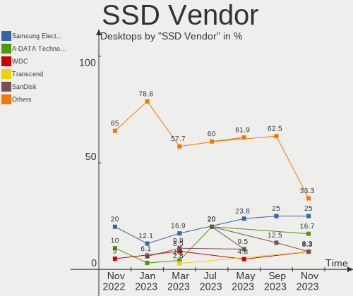
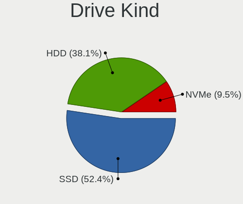
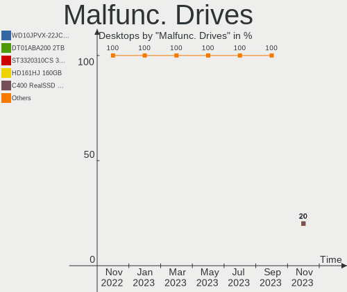
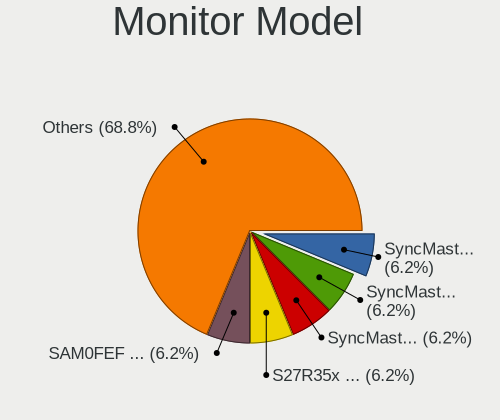
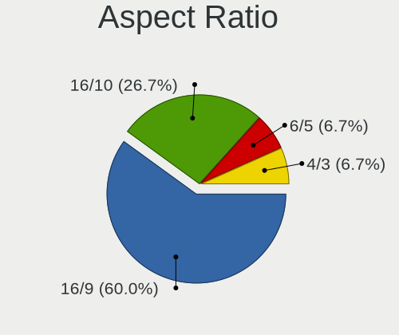
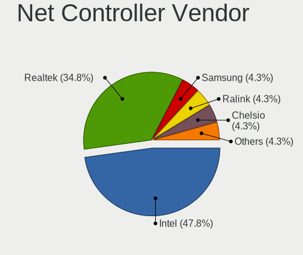
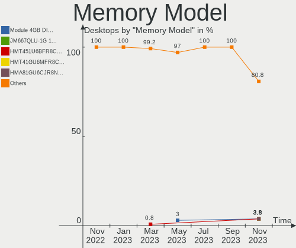
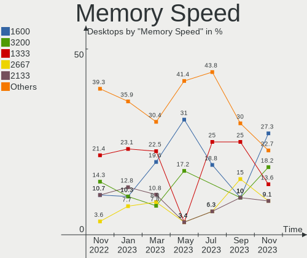
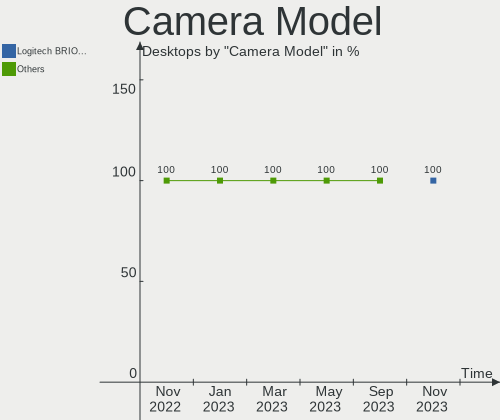

helloSystem - Hardware Trends (Desktops)
----------------------------------------

A project to identify most popular hardware characteristics and track their change
over time based on data collected by BSD users at https://BSD-Hardware.info.

Anyone can contribute to this report by the [hw-probe](https://github.com/linuxhw/hw-probe/blob/master/INSTALL.BSD.md) tool:

    hw-probe -all -upload

This report is for one last month. Overall report since the beginning of time: [TestDays](https://github.com/bsdhw/TestDays)

Period: Sep, 2023.

Contents
--------

* [ System ](#system)
  - [ OS                       ](#os)
  - [ OS Family                ](#os-family)
  - [ Arch                     ](#arch)
  - [ DE                       ](#de)
  - [ Display Server           ](#display-server)
  - [ Display Manager          ](#display-manager)
  - [ OS Lang                  ](#os-lang)
  - [ Boot Mode                ](#boot-mode)
  - [ Filesystem               ](#filesystem)
  - [ Part. scheme             ](#part-scheme)

* [ Board ](#board)
  - [ Vendor                   ](#vendor)
  - [ Model                    ](#model)
  - [ Model Family             ](#model-family)
  - [ MFG Year                 ](#mfg-year)
  - [ Form Factor              ](#form-factor)
  - [ Coreboot                 ](#coreboot)
  - [ RAM Size                 ](#ram-size)
  - [ RAM Used                 ](#ram-used)
  - [ Total Drives             ](#total-drives)
  - [ Has CD-ROM               ](#has-cd-rom)
  - [ Has Ethernet             ](#has-ethernet)
  - [ Has WiFi                 ](#has-wifi)
  - [ Has Bluetooth            ](#has-bluetooth)

* [ Location ](#location)
  - [ Country                  ](#country)
  - [ City                     ](#city)

* [ Drives ](#drives)
  - [ Drive Vendor             ](#drive-vendor)
  - [ Drive Model              ](#drive-model)
  - [ HDD Vendor               ](#hdd-vendor)
  - [ SSD Vendor               ](#ssd-vendor)
  - [ Drive Kind               ](#drive-kind)
  - [ Drive Connector          ](#drive-connector)
  - [ Drive Size               ](#drive-size)
  - [ Space Total              ](#space-total)
  - [ Space Used               ](#space-used)
  - [ Malfunc. Drives          ](#malfunc-drives)
  - [ Malfunc. Drive Vendor    ](#malfunc-drive-vendor)
  - [ Malfunc. HDD Vendor      ](#malfunc-hdd-vendor)
  - [ Malfunc. Drive Kind      ](#malfunc-drive-kind)
  - [ Failed Drives            ](#failed-drives)
  - [ Failed Drive Vendor      ](#failed-drive-vendor)
  - [ Drive Status             ](#drive-status)

* [ Storage controller ](#storage-controller)
  - [ Storage Vendor           ](#storage-vendor)
  - [ Storage Model            ](#storage-model)
  - [ Storage Kind             ](#storage-kind)

* [ Processor ](#processor)
  - [ CPU Vendor               ](#cpu-vendor)
  - [ CPU Model                ](#cpu-model)
  - [ CPU Model Family         ](#cpu-model-family)
  - [ CPU Cores                ](#cpu-cores)
  - [ CPU Sockets              ](#cpu-sockets)
  - [ CPU Threads              ](#cpu-threads)
  - [ CPU Microarch            ](#cpu-microarch)

* [ Graphics ](#graphics)
  - [ GPU Vendor               ](#gpu-vendor)
  - [ GPU Model                ](#gpu-model)
  - [ GPU Combo                ](#gpu-combo)
  - [ GPU Driver               ](#gpu-driver)
  - [ GPU Memory               ](#gpu-memory)

* [ Monitor ](#monitor)
  - [ Monitor Vendor           ](#monitor-vendor)
  - [ Monitor Model            ](#monitor-model)
  - [ Monitor Resolution       ](#monitor-resolution)
  - [ Monitor Diagonal         ](#monitor-diagonal)
  - [ Monitor Width            ](#monitor-width)
  - [ Aspect Ratio             ](#aspect-ratio)
  - [ Monitor Area             ](#monitor-area)
  - [ Pixel Density            ](#pixel-density)
  - [ Multiple Monitors        ](#multiple-monitors)

* [ Network ](#network)
  - [ Net Controller Vendor    ](#net-controller-vendor)
  - [ Net Controller Model     ](#net-controller-model)
  - [ Wireless Vendor          ](#wireless-vendor)
  - [ Wireless Model           ](#wireless-model)
  - [ Ethernet Vendor          ](#ethernet-vendor)
  - [ Ethernet Model           ](#ethernet-model)
  - [ Net Controller Kind      ](#net-controller-kind)
  - [ Used Controller          ](#used-controller)
  - [ NICs                     ](#nics)
  - [ IPv6                     ](#ipv6)

* [ Bluetooth ](#bluetooth)
  - [ Bluetooth Vendor         ](#bluetooth-vendor)
  - [ Bluetooth Model          ](#bluetooth-model)

* [ Sound ](#sound)
  - [ Sound Vendor             ](#sound-vendor)
  - [ Sound Model              ](#sound-model)

* [ Memory ](#memory)
  - [ Memory Vendor            ](#memory-vendor)
  - [ Memory Model             ](#memory-model)
  - [ Memory Kind              ](#memory-kind)
  - [ Memory Form Factor       ](#memory-form-factor)
  - [ Memory Size              ](#memory-size)
  - [ Memory Speed             ](#memory-speed)

* [ Printers & scanners ](#printers--scanners)
  - [ Printer Vendor           ](#printer-vendor)
  - [ Printer Model            ](#printer-model)
  - [ Scanner Vendor           ](#scanner-vendor)
  - [ Scanner Model            ](#scanner-model)

* [ Camera ](#camera)
  - [ Camera Vendor            ](#camera-vendor)
  - [ Camera Model             ](#camera-model)

* [ Security ](#security)
  - [ Fingerprint Vendor       ](#fingerprint-vendor)
  - [ Fingerprint Model        ](#fingerprint-model)
  - [ Chipcard Vendor          ](#chipcard-vendor)
  - [ Chipcard Model           ](#chipcard-model)

* [ Unsupported ](#unsupported)
  - [ Unsupported Devices      ](#unsupported-devices)
  - [ Unsupported Device Types ](#unsupported-device-types)

System
------

OS
--

Installed operating systems

| Name              | Desktops | Percent |
|-------------------|----------|---------|
| helloSystem 0.8.1 | 11       | 64.71%  |
| helloSystem 0.9.0 | 6        | 35.29%  |

OS Family
---------

OS without a version

| Name        | Desktops | Percent |
|-------------|----------|---------|
| helloSystem | 17       | 100%    |

Arch
----

OS architecture (x86_64, i586, etc.)

| Name  | Desktops | Percent |
|-------|----------|---------|
| amd64 | 17       | 100%    |

DE
--

Desktop Environment

| Name         | Desktops | Percent |
|--------------|----------|---------|
| helloDesktop | 17       | 100%    |

Display Server
--------------

X11 or Wayland

| Name | Desktops | Percent |
|------|----------|---------|
| X11  | 17       | 100%    |

Display Manager
---------------

SDDM, LightDM, etc.

| Name | Desktops | Percent |
|------|----------|---------|
| SLiM | 17       | 100%    |

OS Lang
-------

Language

| Lang    | Desktops | Percent |
|---------|----------|---------|
| en_US   | 7        | 41.18%  |
| Unknown | 5        | 29.41%  |
| ru_RU   | 2        | 11.76%  |
| pt_BR   | 1        | 5.88%   |
| it_IT   | 1        | 5.88%   |
| fr_FR   | 1        | 5.88%   |

Boot Mode
---------

EFI or BIOS

| Mode | Desktops | Percent |
|------|----------|---------|
| EFI  | 16       | 94.12%  |
| BIOS | 1        | 5.88%   |

Filesystem
----------

Type of filesystem

| Type   | Desktops | Percent |
|--------|----------|---------|
| Cd9660 | 9        | 52.94%  |
| Zfs    | 8        | 47.06%  |

Part. scheme
------------

Scheme of partitioning

| Type | Desktops | Percent |
|------|----------|---------|
| GPT  | 16       | 94.12%  |
| MBR  | 1        | 5.88%   |

Board
-----

Vendor
------

Motherboard manufacturer

| Name                | Desktops | Percent |
|---------------------|----------|---------|
| Hewlett-Packard     | 3        | 17.65%  |
| ASUSTek Computer    | 3        | 17.65%  |
| MSI                 | 2        | 11.76%  |
| Lenovo              | 2        | 11.76%  |
| Dell                | 2        | 11.76%  |
| Intel               | 1        | 5.88%   |
| Gigabyte Technology | 1        | 5.88%   |
| Bochs               | 1        | 5.88%   |
| AZW                 | 1        | 5.88%   |
| ASRock              | 1        | 5.88%   |

Model
-----

Motherboard model

| Name                                   | Desktops | Percent |
|----------------------------------------|----------|---------|
| MSI MS-7C37                            | 1        | 5.88%   |
| MSI MS-7B98                            | 1        | 5.88%   |
| Lenovo ThinkCentre M81 5049D7G         | 1        | 5.88%   |
| Lenovo IdeaCentre 510S-07ICB Type 90K8 | 1        | 5.88%   |
| Intel HM570                            | 1        | 5.88%   |
| HP ProOne 600 G1 AiO                   | 1        | 5.88%   |
| HP ProDesk 400 G4 DM                   | 1        | 5.88%   |
| HP EliteDesk 800 G2 DM 35W             | 1        | 5.88%   |
| Gigabyte H55M-D2H                      | 1        | 5.88%   |
| Dell OptiPlex 3020M                    | 1        | 5.88%   |
| Dell OptiPlex 3020                     | 1        | 5.88%   |
| AZW U59                                | 1        | 5.88%   |
| ASUS Z170-A                            | 1        | 5.88%   |
| ASUS P8Z77-V LX                        | 1        | 5.88%   |
| ASUS P8H61-M LX PLUS                   | 1        | 5.88%   |
| ASRock B450 Pro4                       | 1        | 5.88%   |
| Unknown                                | 1        | 5.88%   |

Model Family
------------

Motherboard model prefix

| Name               | Desktops | Percent |
|--------------------|----------|---------|
| Dell OptiPlex      | 2        | 11.76%  |
| MSI MS-7C37        | 1        | 5.88%   |
| MSI MS-7B98        | 1        | 5.88%   |
| Lenovo ThinkCentre | 1        | 5.88%   |
| Lenovo IdeaCentre  | 1        | 5.88%   |
| Intel HM570        | 1        | 5.88%   |
| HP ProOne          | 1        | 5.88%   |
| HP ProDesk         | 1        | 5.88%   |
| HP EliteDesk       | 1        | 5.88%   |
| Gigabyte H55M-D2H  | 1        | 5.88%   |
| AZW U59            | 1        | 5.88%   |
| ASUS Z170-A        | 1        | 5.88%   |
| ASUS P8Z77-V       | 1        | 5.88%   |
| ASUS P8H61-M       | 1        | 5.88%   |
| ASRock B450        | 1        | 5.88%   |
| Unknown            | 1        | 5.88%   |

MFG Year
--------

Motherboard manufacture year

| Year | Desktops | Percent |
|------|----------|---------|
| 2022 | 3        | 17.65%  |
| 2020 | 3        | 17.65%  |
| 2019 | 2        | 11.76%  |
| 2016 | 2        | 11.76%  |
| 2012 | 2        | 11.76%  |
| 2011 | 2        | 11.76%  |
| 2021 | 1        | 5.88%   |
| 2014 | 1        | 5.88%   |
| 2013 | 1        | 5.88%   |

Form Factor
-----------

Physical design of the computer

| Name    | Desktops | Percent |
|---------|----------|---------|
| Desktop | 17       | 100%    |

Coreboot
--------

Have coreboot on board

| Used | Desktops | Percent |
|------|----------|---------|
| No   | 17       | 100%    |

RAM Size
--------

Total RAM memory

| Size in GB  | Desktops | Percent |
|-------------|----------|---------|
| 16.01-24.0  | 7        | 41.18%  |
| 8.01-16.0   | 4        | 23.53%  |
| 4.01-8.0    | 3        | 17.65%  |
| 32.01-64.0  | 1        | 5.88%   |
| 64.01-256.0 | 1        | 5.88%   |
| 1.01-2.0    | 1        | 5.88%   |

RAM Used
--------

Used RAM memory

| Used GB  | Desktops | Percent |
|----------|----------|---------|
| 0.51-1.0 | 9        | 52.94%  |
| 0.01-0.5 | 7        | 41.18%  |
| 3.01-4.0 | 1        | 5.88%   |

Total Drives
------------

Number of drives on board

| Drives | Desktops | Percent |
|--------|----------|---------|
| 1      | 7        | 41.18%  |
| 0      | 4        | 23.53%  |
| 2      | 3        | 17.65%  |
| 13     | 1        | 5.88%   |
| 5      | 1        | 5.88%   |
| 3      | 1        | 5.88%   |

Has CD-ROM
----------

Has CD-ROM on board

| Presented | Desktops | Percent |
|-----------|----------|---------|
| No        | 10       | 58.82%  |
| Yes       | 7        | 41.18%  |

Has Ethernet
------------

Has Ethernet on board

| Presented | Desktops | Percent |
|-----------|----------|---------|
| Yes       | 16       | 94.12%  |
| No        | 1        | 5.88%   |

Has WiFi
--------

Has WiFi module

| Presented | Desktops | Percent |
|-----------|----------|---------|
| No        | 11       | 64.71%  |
| Yes       | 6        | 35.29%  |

Has Bluetooth
-------------

Has Bluetooth module

| Presented | Desktops | Percent |
|-----------|----------|---------|
| No        | 12       | 70.59%  |
| Yes       | 5        | 29.41%  |

Location
--------

Country
-------

Geographic location (country)

| Country   | Desktops | Percent |
|-----------|----------|---------|
| USA       | 3        | 17.65%  |
| Taiwan    | 3        | 17.65%  |
| Russia    | 2        | 11.76%  |
| Italy     | 2        | 11.76%  |
| Serbia    | 1        | 5.88%   |
| Japan     | 1        | 5.88%   |
| Israel    | 1        | 5.88%   |
| Indonesia | 1        | 5.88%   |
| Canada    | 1        | 5.88%   |
| Brazil    | 1        | 5.88%   |
| Belgium   | 1        | 5.88%   |

City
----

Geographic location (city)

| City        | Desktops | Percent |
|-------------|----------|---------|
| Taichung    | 3        | 17.65%  |
| Vladimir    | 1        | 5.88%   |
| Selegas     | 1        | 5.88%   |
| Petah Tikva | 1        | 5.88%   |
| Oshawa      | 1        | 5.88%   |
| Nonoichi    | 1        | 5.88%   |
| New York    | 1        | 5.88%   |
| Moscow      | 1        | 5.88%   |
| Guarulhos   | 1        | 5.88%   |
| Gorizia     | 1        | 5.88%   |
| Fort Wayne  | 1        | 5.88%   |
| Fleurus     | 1        | 5.88%   |
| Bristol     | 1        | 5.88%   |
| Bandung     | 1        | 5.88%   |
| Arangelovac | 1        | 5.88%   |

Drives
------

Drive Vendor
------------

Hard drive vendors

| Vendor              | Desktops | Drives | Percent |
|---------------------|----------|--------|---------|
| Seagate             | 4        | 11     | 17.39%  |
| WDC                 | 3        | 8      | 13.04%  |
| Samsung Electronics | 3        | 4      | 13.04%  |
| Hitachi             | 3        | 3      | 13.04%  |
| Toshiba             | 2        | 2      | 8.7%    |
| Kingston            | 2        | 2      | 8.7%    |
| SUNEAST             | 1        | 1      | 4.35%   |
| SK hynix            | 1        | 1      | 4.35%   |
| SanDisk             | 1        | 1      | 4.35%   |
| RX7                 | 1        | 1      | 4.35%   |
| Intel               | 1        | 1      | 4.35%   |
| Apacer              | 1        | 1      | 4.35%   |

Drive Model
-----------

Hard drive models

| Model                                   | Desktops | Percent |
|-----------------------------------------|----------|---------|
| WDC WD20EFRX-68EUZN0 2TB                | 2        | 6.45%   |
| Hitachi HTS541612J9SA00 120GB           | 2        | 6.45%   |
| WDC WD40EFRX-68N32N0 4TB                | 1        | 3.23%   |
| WDC WD3200AAKS-00L9A0 320GB             | 1        | 3.23%   |
| WDC WD20EZRZ-22Z5HB0 2TB                | 1        | 3.23%   |
| WDC WD1003FZEX-00K3CA0 1TB              | 1        | 3.23%   |
| WDC PC SN530 SDBPNPZ-256G-1014 256GB    | 1        | 3.23%   |
| Toshiba Q300 240GB                      | 1        | 3.23%   |
| Toshiba MK8052GSX 80GB                  | 1        | 3.23%   |
| SUNEAST SSD SE800 mSATA 256GB           | 1        | 3.23%   |
| SK hynix BC501 HFM128GDJTNG-8310A 128GB | 1        | 3.23%   |
| Seagate ST8000VN0022-2EL112 8TB         | 1        | 3.23%   |
| Seagate ST8000DM004-2U9188 8TB          | 1        | 3.23%   |
| Seagate ST8000DM004-2CX188 8TB          | 1        | 3.23%   |
| Seagate ST500DM002-1BD142 500GB         | 1        | 3.23%   |
| Seagate ST380815AS 80GB                 | 1        | 3.23%   |
| Seagate ST2000DM001-1ER164 2TB          | 1        | 3.23%   |
| Seagate ST1000DM003-9YN162 1TB          | 1        | 3.23%   |
| SanDisk SD8SB8U-128G-1006 128GB         | 1        | 3.23%   |
| Samsung SSD 970 EVO Plus 500GB          | 1        | 3.23%   |
| Samsung SSD 870 EVO 500GB               | 1        | 3.23%   |
| Samsung SSD 860 EVO 500GB               | 1        | 3.23%   |
| Samsung MZVLB256HBHQ-000L7 256GB        | 1        | 3.23%   |
| RX7 2.5 128GB                           | 1        | 3.23%   |
| Kingston SUV400S37240G 240GB            | 1        | 3.23%   |
| Kingston SNV2S500G 500GB                | 1        | 3.23%   |
| Intel SSDPEKNU020TZ 2TB                 | 1        | 3.23%   |
| Hitachi HDS728080PLA380 82GB            | 1        | 3.23%   |
| Apacer AS340 120GB                      | 1        | 3.23%   |

HDD Vendor
----------

Hard disk drive vendors

| Vendor  | Desktops | Drives | Percent |
|---------|----------|--------|---------|
| Seagate | 4        | 11     | 36.36%  |
| WDC     | 3        | 7      | 27.27%  |
| Hitachi | 3        | 3      | 27.27%  |
| Toshiba | 1        | 1      | 9.09%   |

SSD Vendor
----------

Solid state drive vendors

| Vendor              | Desktops | Drives | Percent |
|---------------------|----------|--------|---------|
| Samsung Electronics | 2        | 2      | 25%     |
| Toshiba             | 1        | 1      | 12.5%   |
| SUNEAST             | 1        | 1      | 12.5%   |
| SanDisk             | 1        | 1      | 12.5%   |
| RX7                 | 1        | 1      | 12.5%   |
| Kingston            | 1        | 1      | 12.5%   |
| Apacer              | 1        | 1      | 12.5%   |

Drive Kind
----------

HDD or SSD

| Kind | Desktops | Drives | Percent |
|------|----------|--------|---------|
| HDD  | 8        | 22     | 38.1%   |
| SSD  | 7        | 8      | 33.33%  |
| NVMe | 6        | 6      | 28.57%  |

Drive Connector
---------------

SATA, SAS, NVMe, etc.

| Type | Desktops | Drives | Percent |
|------|----------|--------|---------|
| SATA | 13       | 30     | 68.42%  |
| NVMe | 6        | 6      | 31.58%  |

Drive Size
----------

Size of hard drive

| Size in TB | Desktops | Drives | Percent |
|------------|----------|--------|---------|
| 0.01-0.5   | 12       | 15     | 66.67%  |
| 1.01-2.0   | 2        | 6      | 11.11%  |
| 0.51-1.0   | 2        | 2      | 11.11%  |
| 3.01-4.0   | 1        | 2      | 5.56%   |
| 4.01-10.0  | 1        | 5      | 5.56%   |

Space Total
-----------

Amount of disk space available on the file system

| Size in GB | Desktops | Percent |
|------------|----------|---------|
| 1-20       | 9        | 52.94%  |
| 251-500    | 3        | 17.65%  |
| 101-250    | 3        | 17.65%  |
| 51-100     | 2        | 11.76%  |

Space Used
----------

Amount of used disk space

| Used GB | Desktops | Percent |
|---------|----------|---------|
| 1-20    | 17       | 100%    |

Malfunc. Drives
---------------

Drive models with a malfunction

| Model                                 | Desktops | Drives | Percent |
|---------------------------------------|----------|--------|---------|
| WDC WD3200AAKS-00L9A0 320GB           | 1        | 1      | 25%     |
| Toshiba MK8052GSX 80GB                | 1        | 1      | 25%     |
| Samsung Electronics SSD 860 EVO 500GB | 1        | 1      | 25%     |
| Kingston SNV2S500G 500GB              | 1        | 1      | 25%     |

Malfunc. Drive Vendor
---------------------

Vendors of faulty drives

| Vendor              | Desktops | Drives | Percent |
|---------------------|----------|--------|---------|
| WDC                 | 1        | 1      | 25%     |
| Toshiba             | 1        | 1      | 25%     |
| Samsung Electronics | 1        | 1      | 25%     |
| Kingston            | 1        | 1      | 25%     |

Malfunc. HDD Vendor
-------------------

Vendors of faulty HDD drives

| Vendor  | Desktops | Drives | Percent |
|---------|----------|--------|---------|
| WDC     | 1        | 1      | 50%     |
| Toshiba | 1        | 1      | 50%     |

Malfunc. Drive Kind
-------------------

Kinds of faulty drives

| Kind | Desktops | Drives | Percent |
|------|----------|--------|---------|
| HDD  | 2        | 2      | 50%     |
| NVMe | 1        | 1      | 25%     |
| SSD  | 1        | 1      | 25%     |

Failed Drives
-------------

Failed drive models

Zero info for selected period =(

Failed Drive Vendor
-------------------

Failed drive vendors

Zero info for selected period =(

Drive Status
------------

Number of failed and malfunc. drives

| Status   | Desktops | Drives | Percent |
|----------|----------|--------|---------|
| Works    | 11       | 30     | 68.75%  |
| Malfunc  | 3        | 4      | 18.75%  |
| Detected | 2        | 2      | 12.5%   |

Storage controller
------------------

Storage Vendor
--------------

Storage controller vendors

| Vendor                      | Desktops | Percent |
|-----------------------------|----------|---------|
| Intel                       | 15       | 57.69%  |
| Samsung Electronics         | 2        | 7.69%   |
| ASMedia Technology          | 2        | 7.69%   |
| AMD                         | 2        | 7.69%   |
| SK hynix                    | 1        | 3.85%   |
| SanDisk                     | 1        | 3.85%   |
| Marvell Technology Group    | 1        | 3.85%   |
| Kingston Technology Company | 1        | 3.85%   |
| JMicron Technology          | 1        | 3.85%   |

Storage Model
-------------

Storage controller models

| Model                                                                                   | Desktops | Percent |
|-----------------------------------------------------------------------------------------|----------|---------|
| Intel Cannon Lake PCH SATA AHCI Controller                                              | 3        | 10.34%  |
| Intel 8 Series/C220 Series Chipset Family 6-port SATA Controller 1 [AHCI mode]          | 3        | 10.34%  |
| Samsung NVMe SSD Controller SM981/PM981/PM983                                           | 2        | 6.9%    |
| Intel Q170/Q150/B150/H170/H110/Z170/CM236 Chipset SATA Controller [AHCI Mode]           | 2        | 6.9%    |
| ASMedia ASM1062 Serial ATA Controller                                                   | 2        | 6.9%    |
| SK hynix BC501 NVMe Solid State Drive                                                   | 1        | 3.45%   |
| SanDisk WD Blue SN550 NVMe SSD                                                          | 1        | 3.45%   |
| Marvell Group 88SE9215 PCIe 2.0 x1 4-port SATA 6 Gb/s Controller                        | 1        | 3.45%   |
| Kingston Company unknown                                                                | 1        | 3.45%   |
| JMicron JMB368 IDE controller                                                           | 1        | 3.45%   |
| Intel Tiger Lake SATA AHCI Controller                                                   | 1        | 3.45%   |
| Intel SSD 670p Series [Keystone Harbor]                                                 | 1        | 3.45%   |
| Intel Jasper Lake SATA AHCI Controller                                                  | 1        | 3.45%   |
| Intel 82371SB PIIX3 IDE [Natoma/Triton II]                                              | 1        | 3.45%   |
| Intel 7 Series/C210 Series Chipset Family 6-port SATA Controller [AHCI mode]            | 1        | 3.45%   |
| Intel 6 Series/C200 Series Chipset Family Desktop SATA Controller (IDE mode, ports 4-5) | 1        | 3.45%   |
| Intel 6 Series/C200 Series Chipset Family Desktop SATA Controller (IDE mode, ports 0-3) | 1        | 3.45%   |
| Intel 6 Series/C200 Series Chipset Family 6 port Desktop SATA AHCI Controller           | 1        | 3.45%   |
| Intel 5 Series/3400 Series Chipset 4 port SATA IDE Controller                           | 1        | 3.45%   |
| Intel 5 Series/3400 Series Chipset 2 port SATA IDE Controller                           | 1        | 3.45%   |
| AMD FCH SATA Controller [AHCI mode]                                                     | 1        | 3.45%   |
| AMD 400 Series Chipset SATA Controller                                                  | 1        | 3.45%   |

Storage Kind
------------

Kind of storage controller (IDE, SATA, NVMe, SAS, ...)

| Kind | Desktops | Percent |
|------|----------|---------|
| SATA | 14       | 60.87%  |
| NVMe | 6        | 26.09%  |
| IDE  | 3        | 13.04%  |

Processor
---------

CPU Vendor
----------

Processor vendors

| Vendor | Desktops | Percent |
|--------|----------|---------|
| Intel  | 14       | 82.35%  |
| AMD    | 2        | 11.76%  |
| Bochs  | 1        | 5.88%   |

CPU Model
---------

Processor models

| Model                                       | Desktops | Percent |
|---------------------------------------------|----------|---------|
| Intel Xeon CPU E3-1230 V2 @ 3.30GHz         | 1        | 5.88%   |
| Intel Genuine CPU 0000 @ 2.60GHz            | 1        | 5.88%   |
| Intel Core i9-9900K CPU @ 3.60GHz           | 1        | 5.88%   |
| Intel Core i7-8700T CPU @ 2.40GHz           | 1        | 5.88%   |
| Intel Core i5-6600T CPU @ 2.70GHz           | 1        | 5.88%   |
| Intel Core i5-6500 CPU @ 3.20GHz            | 1        | 5.88%   |
| Intel Core i5-4590T CPU @ 2.00GHz           | 1        | 5.88%   |
| Intel Core i5-4590S CPU @ 3.00GHz           | 1        | 5.88%   |
| Intel Core i5-4570 CPU @ 3.20GHz            | 1        | 5.88%   |
| Intel Core i3-9100 CPU @ 3.60GHz            | 1        | 5.88%   |
| Intel Core i3-2100 CPU @ 3.10GHz            | 1        | 5.88%   |
| Intel Core i3 CPU                           | 1        | 5.88%   |
| Intel Celeron N5105 @ 2.00GHz               | 1        | 5.88%   |
| Intel Celeron CPU G530 @ 2.40GHz            | 1        | 5.88%   |
| Bochs Other                                 | 1        | 5.88%   |
| AMD Ryzen 5 5600 6-Core Processor           | 1        | 5.88%   |
| AMD Ryzen 5 2400G with Radeon Vega Graphics | 1        | 5.88%   |

CPU Model Family
----------------

Processor model prefix

| Model         | Desktops | Percent |
|---------------|----------|---------|
| Intel Core i5 | 5        | 29.41%  |
| Intel Core i3 | 3        | 17.65%  |
| Intel Celeron | 2        | 11.76%  |
| AMD Ryzen 5   | 2        | 11.76%  |
| Other         | 1        | 5.88%   |
| Intel Xeon    | 1        | 5.88%   |
| Intel Genuine | 1        | 5.88%   |
| Intel Core i9 | 1        | 5.88%   |
| Intel Core i7 | 1        | 5.88%   |

CPU Cores
---------

Number of processor cores

| Number  | Desktops | Percent |
|---------|----------|---------|
| 4       | 8        | 47.06%  |
| 8       | 3        | 17.65%  |
| 2       | 3        | 17.65%  |
| 12      | 1        | 5.88%   |
| 6       | 1        | 5.88%   |
| Unknown | 1        | 5.88%   |

CPU Sockets
-----------

Number of sockets

| Number | Desktops | Percent |
|--------|----------|---------|
| 1      | 16       | 94.12%  |
| 8      | 1        | 5.88%   |

CPU Threads
-----------

Threads per core (Hyper-Threading)

| Number  | Desktops | Percent |
|---------|----------|---------|
| 1       | 10       | 58.82%  |
| 2       | 6        | 35.29%  |
| Unknown | 1        | 5.88%   |

CPU Microarch
-------------

Microarchitecture

| Name        | Desktops | Percent |
|-------------|----------|---------|
| KabyLake    | 3        | 17.65%  |
| Haswell     | 3        | 17.65%  |
| Skylake     | 2        | 11.76%  |
| SandyBridge | 2        | 11.76%  |
| Unknown     | 2        | 11.76%  |
| Zen 3       | 1        | 5.88%   |
| Zen         | 1        | 5.88%   |
| Westmere    | 1        | 5.88%   |
| Nehalem     | 1        | 5.88%   |
| IvyBridge   | 1        | 5.88%   |

Graphics
--------

GPU Vendor
----------

Vendors of graphics cards

| Vendor  | Desktops | Percent |
|---------|----------|---------|
| Intel   | 12       | 54.55%  |
| AMD     | 5        | 22.73%  |
| Nvidia  | 4        | 18.18%  |
| Red Hat | 1        | 4.55%   |

GPU Model
---------

Graphics card models

| Model                                                                       | Desktops | Percent |
|-----------------------------------------------------------------------------|----------|---------|
| Intel Xeon E3-1200 v3/4th Gen Core Processor Integrated Graphics Controller | 3        | 13.64%  |
| Nvidia GF108 [GeForce GT 440]                                               | 2        | 9.09%   |
| Intel HD Graphics 530                                                       | 2        | 9.09%   |
| Intel CoffeeLake-S GT2 [UHD Graphics 630]                                   | 2        | 9.09%   |
| Intel 2nd Generation Core Processor Family Integrated Graphics Controller   | 2        | 9.09%   |
| Red Hat QXL paravirtual graphic card                                        | 1        | 4.55%   |
| Nvidia TU106 [GeForce RTX 2060 Rev. A]                                      | 1        | 4.55%   |
| Nvidia GP106 [P106-100]                                                     | 1        | 4.55%   |
| Intel TigerLake-H GT1 [UHD Graphics]                                        | 1        | 4.55%   |
| Intel JasperLake [UHD Graphics]                                             | 1        | 4.55%   |
| Intel Core Processor Integrated Graphics Controller                         | 1        | 4.55%   |
| AMD Vega 10 XL/XT [Radeon RX Vega 56/64]                                    | 1        | 4.55%   |
| AMD Turks XT [Radeon HD 6670/7670]                                          | 1        | 4.55%   |
| AMD RV770 [Radeon HD 4850]                                                  | 1        | 4.55%   |
| AMD Raven Ridge [Radeon Vega Series / Radeon Vega Mobile Series]            | 1        | 4.55%   |
| AMD Ellesmere [Radeon RX 470/480/570/570X/580/580X/590]                     | 1        | 4.55%   |

GPU Combo
---------

Combinations of graphics cards

| Name         | Desktops | Percent |
|--------------|----------|---------|
| 1 x Intel    | 9        | 52.94%  |
| 1 x Nvidia   | 2        | 11.76%  |
| Intel + AMD  | 2        | 11.76%  |
| 1 x AMD      | 2        | 11.76%  |
| 1 x Red Hat  | 1        | 5.88%   |
| AMD + Nvidia | 1        | 5.88%   |

GPU Driver
----------

Free vs proprietary

| Driver      | Desktops | Percent |
|-------------|----------|---------|
| Free        | 15       | 88.24%  |
| Proprietary | 2        | 11.76%  |

GPU Memory
----------

Total video memory

| Size in GB | Desktops | Percent |
|------------|----------|---------|
| Unknown    | 12       | 70.59%  |
| 1.01-2.0   | 2        | 11.76%  |
| 7.01-8.0   | 1        | 5.88%   |
| 5.01-6.0   | 1        | 5.88%   |
| 0.51-1.0   | 1        | 5.88%   |

Monitor
-------

Monitor Vendor
--------------

Monitor vendors

| Vendor               | Desktops | Percent |
|----------------------|----------|---------|
| Hewlett-Packard      | 2        | 12.5%   |
| Goldstar             | 2        | 12.5%   |
| Dell                 | 2        | 12.5%   |
| BenQ                 | 2        | 12.5%   |
| Acer                 | 2        | 12.5%   |
| Vizio                | 1        | 6.25%   |
| ViewSonic            | 1        | 6.25%   |
| Samsung Electronics  | 1        | 6.25%   |
| MStar                | 1        | 6.25%   |
| MSI                  | 1        | 6.25%   |
| Ancor Communications | 1        | 6.25%   |

Monitor Model
-------------

Monitor models

| Model                                                                 | Desktops | Percent |
|-----------------------------------------------------------------------|----------|---------|
| Vizio E321VL VIZ0083 1366x768 700x400mm 31.7-inch                     | 1        | 6.25%   |
| ViewSonic VA2418-FHD VSCD739 1920x1080 530x300mm 24.0-inch            | 1        | 6.25%   |
| Samsung Electronics S22B150 SAM08A3 1920x1080 480x270mm 21.7-inch     | 1        | 6.25%   |
| MStar TSB LEDTV MST0030 1920x1080 1150x650mm 52.0-inch                | 1        | 6.25%   |
| MSI MP242 MSI30A1 1920x1080 530x300mm 24.0-inch                       | 1        | 6.25%   |
| Hewlett-Packard HPQ 600 AIO HWP108B 1920x1080 480x270mm 21.7-inch     | 1        | 6.25%   |
| Hewlett-Packard 32 Display HPN351A 1920x1080 700x390mm 31.5-inch      | 1        | 6.25%   |
| Goldstar W1934 GSM4B7A 1440x900 410x260mm 19.1-inch                   | 1        | 6.25%   |
| Goldstar LG IPS FULLHD GSM5AB6 1920x1080 480x270mm 21.7-inch          | 1        | 6.25%   |
| Dell U2415 DELA0B9 1920x1200 520x320mm 24.0-inch                      | 1        | 6.25%   |
| Dell 2007WFP DELA018 1680x1050 430x270mm 20.0-inch                    | 1        | 6.25%   |
| BenQ GW2270 BNQ78DB 1920x1080 480x270mm 21.7-inch                     | 1        | 6.25%   |
| BenQ GL930A BNQ7870 1366x768 410x230mm 18.5-inch                      | 1        | 6.25%   |
| Ancor Communications ASUS VS228 ACI22FD 1920x1080 480x270mm 21.7-inch | 1        | 6.25%   |
| Acer G276HL ACR0300 1920x1080 600x340mm 27.2-inch                     | 1        | 6.25%   |
| Acer G227HQL ACR03DE 1920x1080 480x270mm 21.7-inch                    | 1        | 6.25%   |

Monitor Resolution
------------------

Monitor screen resolution

| Resolution         | Desktops | Percent |
|--------------------|----------|---------|
| 1920x1080 (FHD)    | 11       | 68.75%  |
| 1366x768 (WXGA)    | 2        | 12.5%   |
| 1920x1200 (WUXGA)  | 1        | 6.25%   |
| 1680x1050 (WSXGA+) | 1        | 6.25%   |
| 1440x900 (WXGA+)   | 1        | 6.25%   |

Monitor Diagonal
----------------

Diagonal size in inches

| Inches | Desktops | Percent |
|--------|----------|---------|
| 21     | 6        | 37.5%   |
| 24     | 3        | 18.75%  |
| 31     | 2        | 12.5%   |
| 52     | 1        | 6.25%   |
| 27     | 1        | 6.25%   |
| 20     | 1        | 6.25%   |
| 19     | 1        | 6.25%   |
| 18     | 1        | 6.25%   |

Monitor Width
-------------

Physical width

| Width in mm | Desktops | Percent |
|-------------|----------|---------|
| 401-500     | 9        | 56.25%  |
| 501-600     | 4        | 25%     |
| 601-700     | 2        | 12.5%   |
| 1001-1500   | 1        | 6.25%   |

Aspect Ratio
------------

Proportional relationship between the width and the height

| Ratio | Desktops | Percent |
|-------|----------|---------|
| 16/9  | 12       | 80%     |
| 16/10 | 3        | 20%     |

Monitor Area
------------

Area in inch²

| Area in inch² | Desktops | Percent |
|----------------|----------|---------|
| 201-250        | 8        | 50%     |
| 351-500        | 2        | 12.5%   |
| 151-200        | 2        | 12.5%   |
| More than 1000 | 1        | 6.25%   |
| 301-350        | 1        | 6.25%   |
| 251-300        | 1        | 6.25%   |
| 141-150        | 1        | 6.25%   |

Pixel Density
-------------

Pixels per inch

| Density | Desktops | Percent |
|---------|----------|---------|
| 51-100  | 7        | 46.67%  |
| 101-120 | 6        | 40%     |
| 1-50    | 2        | 13.33%  |

Multiple Monitors
-----------------

Total monitors connected

| Total | Desktops | Percent |
|-------|----------|---------|
| 1     | 15       | 88.24%  |
| 2     | 1        | 5.88%   |
| 0     | 1        | 5.88%   |

Network
-------

Net Controller Vendor
---------------------

Controller vendors

| Vendor                | Desktops | Percent |
|-----------------------|----------|---------|
| Realtek Semiconductor | 12       | 50%     |
| Intel                 | 6        | 25%     |
| Samsung Electronics   | 3        | 12.5%   |
| Ralink Technology     | 1        | 4.17%   |
| Qualcomm Atheros      | 1        | 4.17%   |
| D-Link System         | 1        | 4.17%   |

Net Controller Model
--------------------

Controller models

| Model                                                                      | Desktops | Percent |
|----------------------------------------------------------------------------|----------|---------|
| Realtek RTL8111/8168/8411 PCI Express Gigabit Ethernet Controller          | 11       | 42.31%  |
| Samsung Galaxy series, misc. (tethering mode)                              | 3        | 11.54%  |
| Realtek RTL8188EUS 802.11n Wireless Network Adapter                        | 1        | 3.85%   |
| Realtek RTL-8100/8101L/8139 PCI Fast Ethernet Adapter                      | 1        | 3.85%   |
| Ralink MT7601U Wireless Adapter                                            | 1        | 3.85%   |
| Qualcomm Atheros QCA9565 / AR9565 Wireless Network Adapter                 | 1        | 3.85%   |
| Intel Wireless 8260                                                        | 1        | 3.85%   |
| Intel Wireless 3165                                                        | 1        | 3.85%   |
| Intel Ethernet Connection I217-LM                                          | 1        | 3.85%   |
| Intel Ethernet Connection (7) I219-V                                       | 1        | 3.85%   |
| Intel Ethernet Connection (2) I219-V                                       | 1        | 3.85%   |
| Intel Cannon Lake PCH CNVi WiFi                                            | 1        | 3.85%   |
| Intel 82579LM Gigabit Network Connection (Lewisville)                      | 1        | 3.85%   |
| D-Link System AirPlus G DWL-G122 Wireless Adapter(rev.C1) [Ralink RT2571W] | 1        | 3.85%   |

Wireless Vendor
---------------

Wireless vendors

| Vendor                | Desktops | Percent |
|-----------------------|----------|---------|
| Intel                 | 3        | 42.86%  |
| Realtek Semiconductor | 1        | 14.29%  |
| Ralink Technology     | 1        | 14.29%  |
| Qualcomm Atheros      | 1        | 14.29%  |
| D-Link System         | 1        | 14.29%  |

Wireless Model
--------------

Wireless models

| Model                                                                      | Desktops | Percent |
|----------------------------------------------------------------------------|----------|---------|
| Realtek RTL8188EUS 802.11n Wireless Network Adapter                        | 1        | 14.29%  |
| Ralink MT7601U Wireless Adapter                                            | 1        | 14.29%  |
| Qualcomm Atheros QCA9565 / AR9565 Wireless Network Adapter                 | 1        | 14.29%  |
| Intel Wireless 8260                                                        | 1        | 14.29%  |
| Intel Wireless 3165                                                        | 1        | 14.29%  |
| Intel Cannon Lake PCH CNVi WiFi                                            | 1        | 14.29%  |
| D-Link System AirPlus G DWL-G122 Wireless Adapter(rev.C1) [Ralink RT2571W] | 1        | 14.29%  |

Ethernet Vendor
---------------

Ethernet vendors

| Vendor                | Desktops | Percent |
|-----------------------|----------|---------|
| Realtek Semiconductor | 12       | 63.16%  |
| Intel                 | 4        | 21.05%  |
| Samsung Electronics   | 3        | 15.79%  |

Ethernet Model
--------------

Ethernet models

| Model                                                             | Desktops | Percent |
|-------------------------------------------------------------------|----------|---------|
| Realtek RTL8111/8168/8411 PCI Express Gigabit Ethernet Controller | 11       | 57.89%  |
| Samsung Galaxy series, misc. (tethering mode)                     | 3        | 15.79%  |
| Realtek RTL-8100/8101L/8139 PCI Fast Ethernet Adapter             | 1        | 5.26%   |
| Intel Ethernet Connection I217-LM                                 | 1        | 5.26%   |
| Intel Ethernet Connection (7) I219-V                              | 1        | 5.26%   |
| Intel Ethernet Connection (2) I219-V                              | 1        | 5.26%   |
| Intel 82579LM Gigabit Network Connection (Lewisville)             | 1        | 5.26%   |

Net Controller Kind
-------------------

Ethernet, WiFi or modem

| Kind     | Desktops | Percent |
|----------|----------|---------|
| Ethernet | 16       | 72.73%  |
| WiFi     | 6        | 27.27%  |

Used Controller
---------------

Currently used network controller

| Kind     | Desktops | Percent |
|----------|----------|---------|
| Ethernet | 12       | 92.31%  |
| WiFi     | 1        | 7.69%   |

NICs
----

Total network controllers on board

| Total | Desktops | Percent |
|-------|----------|---------|
| 1     | 14       | 82.35%  |
| 2     | 2        | 11.76%  |
| 3     | 1        | 5.88%   |

IPv6
----

IPv6 vs IPv4

| Used | Desktops | Percent |
|------|----------|---------|
| No   | 16       | 94.12%  |
| Yes  | 1        | 5.88%   |

Bluetooth
---------

Bluetooth Vendor
----------------

Controller vendors

| Vendor                | Desktops | Percent |
|-----------------------|----------|---------|
| Intel                 | 3        | 50%     |
| Realtek Semiconductor | 2        | 33.33%  |
| Lite-On Technology    | 1        | 16.67%  |

Bluetooth Model
---------------

Controller models

| Model                                          | Desktops | Percent |
|------------------------------------------------|----------|---------|
| Intel Bluetooth wireless interface             | 2        | 33.33%  |
| Realtek Bluetooth Adapter                      | 1        | 16.67%  |
| Realtek Bluetooth 5.1 Adapter                  | 1        | 16.67%  |
| Lite-On Atheros AR3012 Bluetooth               | 1        | 16.67%  |
| Intel Bluetooth 9460/9560 Jefferson Peak (JfP) | 1        | 16.67%  |

Sound
-----

Sound Vendor
------------

Sound card vendors

| Vendor              | Desktops | Percent |
|---------------------|----------|---------|
| Intel               | 15       | 57.69%  |
| AMD                 | 5        | 19.23%  |
| Nvidia              | 3        | 11.54%  |
| C-Media Electronics | 2        | 7.69%   |
| KTMicro             | 1        | 3.85%   |

Sound Model
-----------

Sound card models

| Model                                                                      | Desktops | Percent |
|----------------------------------------------------------------------------|----------|---------|
| Intel Xeon E3-1200 v3/4th Gen Core Processor HD Audio Controller           | 3        | 10%     |
| Intel Cannon Lake PCH cAVS                                                 | 3        | 10%     |
| Nvidia GF108 High Definition Audio Controller                              | 2        | 6.67%   |
| Intel 8 Series/C220 Series Chipset High Definition Audio Controller        | 2        | 6.67%   |
| Intel 6 Series/C200 Series Chipset Family High Definition Audio Controller | 2        | 6.67%   |
| Intel 100 Series/C230 Series Chipset Family HD Audio Controller            | 2        | 6.67%   |
| Nvidia TU106 High Definition Audio Controller                              | 1        | 3.33%   |
| KTMicro KT USB Audio                                                       | 1        | 3.33%   |
| Intel Tiger Lake-H HD Audio Controller                                     | 1        | 3.33%   |
| Intel Jasper Lake HD Audio                                                 | 1        | 3.33%   |
| Intel 82801AA AC'97 Audio Controller                                       | 1        | 3.33%   |
| Intel 7 Series/C216 Chipset Family High Definition Audio Controller        | 1        | 3.33%   |
| Intel 5 Series/3400 Series Chipset High Definition Audio                   | 1        | 3.33%   |
| C-Media Electronics CM108 Audio Controller                                 | 1        | 3.33%   |
| C-Media Electronics Audio Adapter (Unitek Y-247A)                          | 1        | 3.33%   |
| AMD Vega 10 HDMI Audio [Radeon Vega 56/64]                                 | 1        | 3.33%   |
| AMD Turks HDMI Audio [Radeon HD 6500/6600 / 6700M Series]                  | 1        | 3.33%   |
| AMD Starship/Matisse HD Audio Controller                                   | 1        | 3.33%   |
| AMD RV770 HDMI Audio [Radeon HD 4850/4870]                                 | 1        | 3.33%   |
| AMD Raven/Raven2/Fenghuang HDMI/DP Audio Controller                        | 1        | 3.33%   |
| AMD Family 17h/19h HD Audio Controller                                     | 1        | 3.33%   |
| AMD Ellesmere HDMI Audio [Radeon RX 470/480 / 570/580/590]                 | 1        | 3.33%   |

Memory
------

Memory Vendor
-------------

Memory module vendors

| Vendor              | Desktops | Percent |
|---------------------|----------|---------|
| Kingston            | 4        | 19.05%  |
| Unknown             | 3        | 14.29%  |
| Team                | 2        | 9.52%   |
| Micron Technology   | 2        | 9.52%   |
| Corsair             | 2        | 9.52%   |
| A-DATA Technology   | 2        | 9.52%   |
| Unknown             | 1        | 4.76%   |
| Teikon              | 1        | 4.76%   |
| Samsung Electronics | 1        | 4.76%   |
| Ramaxel Technology  | 1        | 4.76%   |
| Patriot             | 1        | 4.76%   |
| G.Skill             | 1        | 4.76%   |

Memory Model
------------

Memory module models

| Model                                                   | Desktops | Percent |
|---------------------------------------------------------|----------|---------|
| Unknown                                                 | 3        | 13.64%  |
| Team RAM Elite-1333 2GB DIMM DDR3 1333MT/s              | 2        | 9.09%   |
| Unknown RAM Module 4GB DIMM 1333MT/s                    | 1        | 4.55%   |
| Teikon RAM TMT41GS6BFR8A-PBHC 8GB SODIMM DDR3 1600MT/s  | 1        | 4.55%   |
| Samsung RAM Module 8GB SODIMM DDR4 2133MT/s             | 1        | 4.55%   |
| Ramaxel RAM RMUA5110ME78HAF-2666 8GB DIMM DDR4 2400MT/s | 1        | 4.55%   |
| Patriot RAM PSD3L1600C118GVS 8GB SODIMM DDR3 1600MT/s   | 1        | 4.55%   |
| Micron RAM Module 8GB SODIMM DDR4 2667MT/s              | 1        | 4.55%   |
| Micron RAM 9KSF25672AZ-1G4M1 2GB DIMM DDR3 1333MT/s     | 1        | 4.55%   |
| Micron RAM 8KTF25664AZ-1G4M1 2GB DIMM DDR3 1333MT/s     | 1        | 4.55%   |
| Kingston RAM Module 8GB SODIMM DDR3 1600MT/s            | 1        | 4.55%   |
| Kingston RAM KP382H-HYC 4GB DIMM DDR3 1333MT/s          | 1        | 4.55%   |
| Kingston RAM KHX2133C14D4/8G 8GB DIMM DDR4 2133MT/s     | 1        | 4.55%   |
| Kingston RAM KHX1866C10D3/4G 4GB DIMM DDR3 1867MT/s     | 1        | 4.55%   |
| G.Skill RAM F4-3200C16-16GVK 16GB DIMM DDR4 3200MT/s    | 1        | 4.55%   |
| Corsair RAM CMK32GX4M2A2400C16 16GB DIMM DDR4 2400MT/s  | 1        | 4.55%   |
| Corsair RAM CMK16GX4M2D3600C18 8GB DIMM DDR4 3600MT/s   | 1        | 4.55%   |
| A-DATA RAM Module 4GB DIMM DDR3 1067MT/s                | 1        | 4.55%   |
| A-DATA RAM DDR4 3200 8GB DIMM DDR4 3200MT/s             | 1        | 4.55%   |

Memory Kind
-----------

Memory module kinds

| Kind    | Desktops | Percent |
|---------|----------|---------|
| DDR4    | 9        | 52.94%  |
| DDR3    | 6        | 35.29%  |
| RAM     | 1        | 5.88%   |
| Unknown | 1        | 5.88%   |

Memory Form Factor
------------------

Physical design of the memory module

| Name   | Desktops | Percent |
|--------|----------|---------|
| DIMM   | 12       | 70.59%  |
| SODIMM | 5        | 29.41%  |

Memory Size
-----------

Memory module size

| Size  | Desktops | Percent |
|-------|----------|---------|
| 8192  | 9        | 47.37%  |
| 4096  | 4        | 21.05%  |
| 2048  | 3        | 15.79%  |
| 16384 | 2        | 10.53%  |
| 1491  | 1        | 5.26%   |

Memory Speed
------------

Memory module speed

| Speed   | Desktops | Percent |
|---------|----------|---------|
| 1333    | 5        | 25%     |
| 2667    | 3        | 15%     |
| 3200    | 2        | 10%     |
| 2400    | 2        | 10%     |
| 2133    | 2        | 10%     |
| 1600    | 2        | 10%     |
| 3600    | 1        | 5%      |
| 1867    | 1        | 5%      |
| 1067    | 1        | 5%      |
| Unknown | 1        | 5%      |

Printers & scanners
-------------------

Printer Vendor
--------------

Printer device vendors

Zero info for selected period =(

Printer Model
-------------

Printer device models

Zero info for selected period =(

Scanner Vendor
--------------

Scanner device vendors

Zero info for selected period =(

Scanner Model
-------------

Scanner device models

Zero info for selected period =(

Camera
------

Camera Vendor
-------------

Camera device vendors

| Vendor              | Desktops | Percent |
|---------------------|----------|---------|
| Genesys Logic       | 1        | 50%     |
| Chicony Electronics | 1        | 50%     |

Camera Model
------------

Camera device models

| Model                                   | Desktops | Percent |
|-----------------------------------------|----------|---------|
| Genesys Logic Digital Microscope        | 1        | 50%     |
| Chicony HP 2.0MP High Definition Webcam | 1        | 50%     |

Security
--------

Fingerprint Vendor
------------------

Fingerprint sensor vendors

Zero info for selected period =(

Fingerprint Model
-----------------

Fingerprint sensor models

Zero info for selected period =(

Chipcard Vendor
---------------

Chipcard module vendors

Zero info for selected period =(

Chipcard Model
--------------

Chipcard module models

Zero info for selected period =(

Unsupported
-----------

Unsupported Devices
-------------------

Total unsupported devices on board

| Total | Desktops | Percent |
|-------|----------|---------|
| 1     | 10       | 58.82%  |
| 2     | 4        | 23.53%  |
| 0     | 3        | 17.65%  |

Unsupported Device Types
------------------------

Types of unsupported devices

| Type                     | Desktops | Percent |
|--------------------------|----------|---------|
| Communication controller | 13       | 86.67%  |
| Net/wireless             | 2        | 13.33%  |

