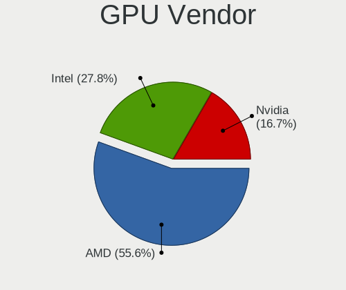
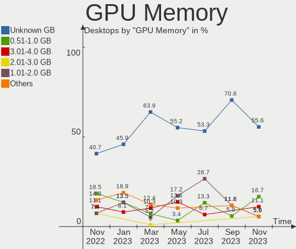

helloSystem - Hardware Trends (Desktops)
----------------------------------------

A project to identify most popular hardware characteristics and track their change
over time based on data collected by BSD users at https://BSD-Hardware.info.

Anyone can contribute to this report by the [hw-probe](https://github.com/linuxhw/hw-probe/blob/master/INSTALL.BSD.md) tool:

    hw-probe -all -upload

This report is for one last month. Overall report since the beginning of time: [TestCoverage](https://github.com/bsdhw/TestCoverage)

Period: Dec, 2022.

Contents
--------

* [ System ](#system)
  - [ OS                       ](#os)
  - [ OS Family                ](#os-family)
  - [ Arch                     ](#arch)
  - [ DE                       ](#de)
  - [ Display Server           ](#display-server)
  - [ Display Manager          ](#display-manager)
  - [ OS Lang                  ](#os-lang)
  - [ Boot Mode                ](#boot-mode)
  - [ Filesystem               ](#filesystem)
  - [ Part. scheme             ](#part-scheme)

* [ Board ](#board)
  - [ Vendor                   ](#vendor)
  - [ Model                    ](#model)
  - [ Model Family             ](#model-family)
  - [ MFG Year                 ](#mfg-year)
  - [ Form Factor              ](#form-factor)
  - [ Coreboot                 ](#coreboot)
  - [ RAM Size                 ](#ram-size)
  - [ RAM Used                 ](#ram-used)
  - [ Total Drives             ](#total-drives)
  - [ Has CD-ROM               ](#has-cd-rom)
  - [ Has Ethernet             ](#has-ethernet)
  - [ Has WiFi                 ](#has-wifi)
  - [ Has Bluetooth            ](#has-bluetooth)

* [ Location ](#location)
  - [ Country                  ](#country)
  - [ City                     ](#city)

* [ Drives ](#drives)
  - [ Drive Vendor             ](#drive-vendor)
  - [ Drive Model              ](#drive-model)
  - [ HDD Vendor               ](#hdd-vendor)
  - [ SSD Vendor               ](#ssd-vendor)
  - [ Drive Kind               ](#drive-kind)
  - [ Drive Connector          ](#drive-connector)
  - [ Drive Size               ](#drive-size)
  - [ Space Total              ](#space-total)
  - [ Space Used               ](#space-used)
  - [ Malfunc. Drives          ](#malfunc-drives)
  - [ Malfunc. Drive Vendor    ](#malfunc-drive-vendor)
  - [ Malfunc. HDD Vendor      ](#malfunc-hdd-vendor)
  - [ Malfunc. Drive Kind      ](#malfunc-drive-kind)
  - [ Failed Drives            ](#failed-drives)
  - [ Failed Drive Vendor      ](#failed-drive-vendor)
  - [ Drive Status             ](#drive-status)

* [ Storage controller ](#storage-controller)
  - [ Storage Vendor           ](#storage-vendor)
  - [ Storage Model            ](#storage-model)
  - [ Storage Kind             ](#storage-kind)

* [ Processor ](#processor)
  - [ CPU Vendor               ](#cpu-vendor)
  - [ CPU Model                ](#cpu-model)
  - [ CPU Model Family         ](#cpu-model-family)
  - [ CPU Cores                ](#cpu-cores)
  - [ CPU Sockets              ](#cpu-sockets)
  - [ CPU Threads              ](#cpu-threads)
  - [ CPU Microarch            ](#cpu-microarch)

* [ Graphics ](#graphics)
  - [ GPU Vendor               ](#gpu-vendor)
  - [ GPU Model                ](#gpu-model)
  - [ GPU Combo                ](#gpu-combo)
  - [ GPU Driver               ](#gpu-driver)
  - [ GPU Memory               ](#gpu-memory)

* [ Monitor ](#monitor)
  - [ Monitor Vendor           ](#monitor-vendor)
  - [ Monitor Model            ](#monitor-model)
  - [ Monitor Resolution       ](#monitor-resolution)
  - [ Monitor Diagonal         ](#monitor-diagonal)
  - [ Monitor Width            ](#monitor-width)
  - [ Aspect Ratio             ](#aspect-ratio)
  - [ Monitor Area             ](#monitor-area)
  - [ Pixel Density            ](#pixel-density)
  - [ Multiple Monitors        ](#multiple-monitors)

* [ Network ](#network)
  - [ Net Controller Vendor    ](#net-controller-vendor)
  - [ Net Controller Model     ](#net-controller-model)
  - [ Wireless Vendor          ](#wireless-vendor)
  - [ Wireless Model           ](#wireless-model)
  - [ Ethernet Vendor          ](#ethernet-vendor)
  - [ Ethernet Model           ](#ethernet-model)
  - [ Net Controller Kind      ](#net-controller-kind)
  - [ Used Controller          ](#used-controller)
  - [ NICs                     ](#nics)
  - [ IPv6                     ](#ipv6)

* [ Bluetooth ](#bluetooth)
  - [ Bluetooth Vendor         ](#bluetooth-vendor)
  - [ Bluetooth Model          ](#bluetooth-model)

* [ Sound ](#sound)
  - [ Sound Vendor             ](#sound-vendor)
  - [ Sound Model              ](#sound-model)

* [ Memory ](#memory)
  - [ Memory Vendor            ](#memory-vendor)
  - [ Memory Model             ](#memory-model)
  - [ Memory Kind              ](#memory-kind)
  - [ Memory Form Factor       ](#memory-form-factor)
  - [ Memory Size              ](#memory-size)
  - [ Memory Speed             ](#memory-speed)

* [ Printers & scanners ](#printers--scanners)
  - [ Printer Vendor           ](#printer-vendor)
  - [ Printer Model            ](#printer-model)
  - [ Scanner Vendor           ](#scanner-vendor)
  - [ Scanner Model            ](#scanner-model)

* [ Camera ](#camera)
  - [ Camera Vendor            ](#camera-vendor)
  - [ Camera Model             ](#camera-model)

* [ Security ](#security)
  - [ Fingerprint Vendor       ](#fingerprint-vendor)
  - [ Fingerprint Model        ](#fingerprint-model)
  - [ Chipcard Vendor          ](#chipcard-vendor)
  - [ Chipcard Model           ](#chipcard-model)

* [ Unsupported ](#unsupported)
  - [ Unsupported Devices      ](#unsupported-devices)
  - [ Unsupported Device Types ](#unsupported-device-types)

System
------

OS
--

Installed operating systems

| Name              | Desktops | Percent |
|-------------------|----------|---------|
| helloSystem 0.7.0 | 8        | 80%     |
| helloSystem 0.8.0 | 2        | 20%     |

OS Family
---------

OS without a version

| Name        | Desktops | Percent |
|-------------|----------|---------|
| helloSystem | 10       | 100%    |

Arch
----

OS architecture (x86_64, i586, etc.)

| Name  | Desktops | Percent |
|-------|----------|---------|
| amd64 | 10       | 100%    |

DE
--

Desktop Environment

| Name         | Desktops | Percent |
|--------------|----------|---------|
| helloDesktop | 10       | 100%    |

Display Server
--------------

X11 or Wayland

| Name | Desktops | Percent |
|------|----------|---------|
| X11  | 10       | 100%    |

Display Manager
---------------

SDDM, LightDM, etc.

| Name | Desktops | Percent |
|------|----------|---------|
| SLiM | 10       | 100%    |

OS Lang
-------

Language

| Lang  | Desktops | Percent |
|-------|----------|---------|
| en_US | 8        | 80%     |
| zh_TW | 1        | 10%     |
| fr    | 1        | 10%     |

Boot Mode
---------

EFI or BIOS

| Mode | Desktops | Percent |
|------|----------|---------|
| EFI  | 10       | 100%    |

Filesystem
----------

Type of filesystem

| Type   | Desktops | Percent |
|--------|----------|---------|
| Cd9660 | 9        | 90%     |
| Zfs    | 1        | 10%     |

Part. scheme
------------

Scheme of partitioning

| Type | Desktops | Percent |
|------|----------|---------|
| GPT  | 10       | 100%    |

Board
-----

Vendor
------

Motherboard manufacturer

| Name                | Desktops | Percent |
|---------------------|----------|---------|
| Gigabyte Technology | 3        | 30%     |
| Dell                | 2        | 20%     |
| Pegatron            | 1        | 10%     |
| Intel               | 1        | 10%     |
| Hewlett-Packard     | 1        | 10%     |
| ASUSTek Computer    | 1        | 10%     |
| Apple               | 1        | 10%     |

Model
-----

Motherboard model

| Name                              | Desktops | Percent |
|-----------------------------------|----------|---------|
| Pegatron Compaq dx2450 Microtower | 1        | 10%     |
| Intel X99                         | 1        | 10%     |
| HP Compaq Elite 8300 SFF          | 1        | 10%     |
| Gigabyte X399 AORUS Gaming 7      | 1        | 10%     |
| Gigabyte M68MT-S2P                | 1        | 10%     |
| Gigabyte H81M-DS2                 | 1        | 10%     |
| Dell OptiPlex 3020                | 1        | 10%     |
| Dell Dimension E521               | 1        | 10%     |
| ASUS CM1530                       | 1        | 10%     |
| Apple MacPro5,1                   | 1        | 10%     |

Model Family
------------

Motherboard model prefix

| Name               | Desktops | Percent |
|--------------------|----------|---------|
| Pegatron Compaq    | 1        | 10%     |
| Intel X99          | 1        | 10%     |
| HP Compaq          | 1        | 10%     |
| Gigabyte X399      | 1        | 10%     |
| Gigabyte M68MT-S2P | 1        | 10%     |
| Gigabyte H81M-DS2  | 1        | 10%     |
| Dell OptiPlex      | 1        | 10%     |
| Dell Dimension     | 1        | 10%     |
| ASUS CM1530        | 1        | 10%     |
| Apple MacPro5      | 1        | 10%     |

MFG Year
--------

Motherboard manufacture year

| Year | Desktops | Percent |
|------|----------|---------|
| 2010 | 3        | 30%     |
| 2019 | 2        | 20%     |
| 2015 | 1        | 10%     |
| 2014 | 1        | 10%     |
| 2012 | 1        | 10%     |
| 2011 | 1        | 10%     |
| 2007 | 1        | 10%     |

Form Factor
-----------

Physical design of the computer

| Name    | Desktops | Percent |
|---------|----------|---------|
| Desktop | 10       | 100%    |

Coreboot
--------

Have coreboot on board

| Used | Desktops | Percent |
|------|----------|---------|
| No   | 10       | 100%    |

RAM Size
--------

Total RAM memory

| Size in GB | Desktops | Percent |
|------------|----------|---------|
| 16.01-24.0 | 3        | 30%     |
| 8.01-16.0  | 3        | 30%     |
| 4.01-8.0   | 1        | 10%     |
| 32.01-64.0 | 1        | 10%     |
| 3.01-4.0   | 1        | 10%     |
| 0.51-1.0   | 1        | 10%     |

RAM Used
--------

Used RAM memory

| Used GB  | Desktops | Percent |
|----------|----------|---------|
| 0.01-0.5 | 5        | 50%     |
| 0.51-1.0 | 4        | 40%     |
| 1.01-2.0 | 1        | 10%     |

Total Drives
------------

Number of drives on board

| Drives | Desktops | Percent |
|--------|----------|---------|
| 1      | 5        | 50%     |
| 3      | 2        | 20%     |
| 2      | 2        | 20%     |
| 0      | 1        | 10%     |

Has CD-ROM
----------

Has CD-ROM on board

| Presented | Desktops | Percent |
|-----------|----------|---------|
| No        | 7        | 70%     |
| Yes       | 3        | 30%     |

Has Ethernet
------------

Has Ethernet on board

| Presented | Desktops | Percent |
|-----------|----------|---------|
| Yes       | 8        | 80%     |
| No        | 2        | 20%     |

Has WiFi
--------

Has WiFi module

| Presented | Desktops | Percent |
|-----------|----------|---------|
| No        | 8        | 80%     |
| Yes       | 2        | 20%     |

Has Bluetooth
-------------

Has Bluetooth module

| Presented | Desktops | Percent |
|-----------|----------|---------|
| No        | 8        | 80%     |
| Yes       | 2        | 20%     |

Location
--------

Country
-------

Geographic location (country)

| Country   | Desktops | Percent |
|-----------|----------|---------|
| USA       | 4        | 40%     |
| Canada    | 2        | 20%     |
| Taiwan    | 1        | 10%     |
| Russia    | 1        | 10%     |
| Mexico    | 1        | 10%     |
| Argentina | 1        | 10%     |

City
----

Geographic location (city)

| City              | Desktops | Percent |
|-------------------|----------|---------|
| St. Jean Baptiste | 2        | 20%     |
| Nizhniy Novgorod  | 1        | 10%     |
| Devils Lake       | 1        | 10%     |
| Dayuan            | 1        | 10%     |
| Dayton            | 1        | 10%     |
| Córdoba          | 1        | 10%     |
| Concordia         | 1        | 10%     |
| Charlotte         | 1        | 10%     |
| Austin            | 1        | 10%     |

Drives
------

Drive Vendor
------------

Hard drive vendors

| Vendor              | Desktops | Drives | Percent |
|---------------------|----------|--------|---------|
| WDC                 | 6        | 6      | 46.15%  |
| Seagate             | 2        | 2      | 15.38%  |
| Samsung Electronics | 1        | 2      | 7.69%   |
| Patriot             | 1        | 1      | 7.69%   |
| Hitachi             | 1        | 1      | 7.69%   |
| Hewlett-Packard     | 1        | 1      | 7.69%   |
| Apple               | 1        | 2      | 7.69%   |

Drive Model
-----------

Hard drive models

| Model                          | Desktops | Percent |
|--------------------------------|----------|---------|
| WDC WD5000AAKX-75U6AA0 500GB   | 1        | 7.14%   |
| WDC WD4000FYYZ-05UL1B0 4TB     | 1        | 7.14%   |
| WDC WD3200AAKS-75SBA0 320GB    | 1        | 7.14%   |
| WDC WD3200AAKS-75L9A0 320GB    | 1        | 7.14%   |
| WDC WD1600AAJS-60Z0A0 160GB    | 1        | 7.14%   |
| WDC WD10SPSX-22A6WT0 1TB       | 1        | 7.14%   |
| Seagate ST3320620AS 320GB      | 1        | 7.14%   |
| Seagate ST2000LX001-1RG174 2TB | 1        | 7.14%   |
| Samsung SSD 970 EVO Plus 500GB | 1        | 7.14%   |
| Samsung SSD 970 EVO 250GB      | 1        | 7.14%   |
| Patriot Burst Elite 240GB      | 1        | 7.14%   |
| Hitachi HDS721616PLA380 160GB  | 1        | 7.14%   |
| HP SSD S700 250GB              | 1        | 7.14%   |
| Apple SSD SM512E 500GB         | 1        | 7.14%   |

HDD Vendor
----------

Hard disk drive vendors

| Vendor  | Desktops | Drives | Percent |
|---------|----------|--------|---------|
| WDC     | 6        | 6      | 66.67%  |
| Seagate | 2        | 2      | 22.22%  |
| Hitachi | 1        | 1      | 11.11%  |

SSD Vendor
----------

Solid state drive vendors

| Vendor          | Desktops | Drives | Percent |
|-----------------|----------|--------|---------|
| Patriot         | 1        | 1      | 33.33%  |
| Hewlett-Packard | 1        | 1      | 33.33%  |
| Apple           | 1        | 2      | 33.33%  |

Drive Kind
----------

HDD or SSD

| Kind | Desktops | Drives | Percent |
|------|----------|--------|---------|
| HDD  | 8        | 9      | 66.67%  |
| SSD  | 3        | 4      | 25%     |
| NVMe | 1        | 2      | 8.33%   |

Drive Connector
---------------

SATA, SAS, NVMe, etc.

| Type | Desktops | Drives | Percent |
|------|----------|--------|---------|
| SATA | 9        | 13     | 90%     |
| NVMe | 1        | 2      | 10%     |

Drive Size
----------

Size of hard drive

| Size in TB | Desktops | Drives | Percent |
|------------|----------|--------|---------|
| 0.01-0.5   | 8        | 10     | 72.73%  |
| 3.01-4.0   | 1        | 1      | 9.09%   |
| 1.01-2.0   | 1        | 1      | 9.09%   |
| 0.51-1.0   | 1        | 1      | 9.09%   |

Space Total
-----------

Amount of disk space available on the file system

| Size in GB | Desktops | Percent |
|------------|----------|---------|
| 1-20       | 8        | 80%     |
| 251-500    | 1        | 10%     |
| 101-250    | 1        | 10%     |

Space Used
----------

Amount of used disk space

| Used GB | Desktops | Percent |
|---------|----------|---------|
| 1-20    | 10       | 100%    |

Malfunc. Drives
---------------

Drive models with a malfunction

| Model                         | Desktops | Drives | Percent |
|-------------------------------|----------|--------|---------|
| WDC WD3200AAKS-75L9A0 320GB   | 1        | 1      | 33.33%  |
| WDC WD1600AAJS-60Z0A0 160GB   | 1        | 1      | 33.33%  |
| Hitachi HDS721616PLA380 160GB | 1        | 1      | 33.33%  |

Malfunc. Drive Vendor
---------------------

Vendors of faulty drives

| Vendor  | Desktops | Drives | Percent |
|---------|----------|--------|---------|
| WDC     | 2        | 2      | 66.67%  |
| Hitachi | 1        | 1      | 33.33%  |

Malfunc. HDD Vendor
-------------------

Vendors of faulty HDD drives

| Vendor  | Desktops | Drives | Percent |
|---------|----------|--------|---------|
| WDC     | 2        | 2      | 66.67%  |
| Hitachi | 1        | 1      | 33.33%  |

Malfunc. Drive Kind
-------------------

Kinds of faulty drives

| Kind | Desktops | Drives | Percent |
|------|----------|--------|---------|
| HDD  | 3        | 3      | 100%    |

Failed Drives
-------------

Failed drive models

Zero info for selected period =(

Failed Drive Vendor
-------------------

Failed drive vendors

Zero info for selected period =(

Drive Status
------------

Number of failed and malfunc. drives

| Status  | Desktops | Drives | Percent |
|---------|----------|--------|---------|
| Works   | 7        | 12     | 70%     |
| Malfunc | 3        | 3      | 30%     |

Storage controller
------------------

Storage Vendor
--------------

Storage controller vendors

| Vendor              | Desktops | Percent |
|---------------------|----------|---------|
| Intel               | 5        | 45.45%  |
| Nvidia              | 3        | 27.27%  |
| AMD                 | 2        | 18.18%  |
| Samsung Electronics | 1        | 9.09%   |

Storage Model
-------------

Storage controller models

| Model                                                                          | Desktops | Percent |
|--------------------------------------------------------------------------------|----------|---------|
| Nvidia MCP61 SATA Controller                                                   | 2        | 14.29%  |
| Samsung NVMe SSD Controller SM981/PM981/PM983                                  | 1        | 7.14%   |
| Nvidia MCP51 Serial ATA Controller                                             | 1        | 7.14%   |
| Intel C610/X99 series chipset 6-Port SATA Controller [AHCI mode]               | 1        | 7.14%   |
| Intel 82801JI (ICH10 Family) SATA AHCI Controller                              | 1        | 7.14%   |
| Intel 8 Series/C220 Series Chipset Family 6-port SATA Controller 1 [AHCI mode] | 1        | 7.14%   |
| Intel 8 Series/C220 Series Chipset Family 4-port SATA Controller 1 [IDE mode]  | 1        | 7.14%   |
| Intel 8 Series/C220 Series Chipset Family 2-port SATA Controller 2 [IDE mode]  | 1        | 7.14%   |
| Intel 7 Series/C210 Series Chipset Family 6-port SATA Controller [AHCI mode]   | 1        | 7.14%   |
| AMD X399 Series Chipset SATA Controller                                        | 1        | 7.14%   |
| AMD SB7x0/SB8x0/SB9x0 SATA Controller [IDE mode]                               | 1        | 7.14%   |
| AMD SB7x0/SB8x0/SB9x0 IDE Controller                                           | 1        | 7.14%   |
| AMD FCH SATA Controller [AHCI mode]                                            | 1        | 7.14%   |

Storage Kind
------------

Kind of storage controller (IDE, SATA, NVMe, SAS, ...)

| Kind | Desktops | Percent |
|------|----------|---------|
| IDE  | 5        | 45.45%  |
| SATA | 5        | 45.45%  |
| NVMe | 1        | 9.09%   |

Processor
---------

CPU Vendor
----------

Processor vendors

| Vendor | Desktops | Percent |
|--------|----------|---------|
| Intel  | 5        | 50%     |
| AMD    | 5        | 50%     |

CPU Model
---------

Processor models

| Model                                         | Desktops | Percent |
|-----------------------------------------------|----------|---------|
| Intel Xeon CPU W3565 @ 3.20GHz                | 1        | 10%     |
| Intel Xeon CPU E5-2630 v3 @ 2.40GHz           | 1        | 10%     |
| Intel Xeon CPU E3-1231 v3 @ 3.40GHz           | 1        | 10%     |
| Intel Core i5-4590 CPU @ 3.30GHz              | 1        | 10%     |
| Intel Core i5-3570 CPU @ 3.40GHz              | 1        | 10%     |
| AMD Ryzen Threadripper 1900X 8-Core Processor | 1        | 10%     |
| AMD Athlon II X4 645 Processor                | 1        | 10%     |
| AMD Athlon II X2 250 Processor                | 1        | 10%     |
| AMD Athlon Dual Core Processor 5200B          | 1        | 10%     |
| AMD Athlon 64 X2 Dual Core Processor 3600+    | 1        | 10%     |

CPU Model Family
----------------

Processor model prefix

| Model                  | Desktops | Percent |
|------------------------|----------|---------|
| Intel Xeon             | 3        | 30%     |
| Intel Core i5          | 2        | 20%     |
| AMD Ryzen Threadripper | 1        | 10%     |
| AMD Athlon II X4       | 1        | 10%     |
| AMD Athlon II X2       | 1        | 10%     |
| AMD Athlon Dual Core   | 1        | 10%     |
| AMD Athlon 64 X2       | 1        | 10%     |

CPU Cores
---------

Number of processor cores

| Number | Desktops | Percent |
|--------|----------|---------|
| 4      | 5        | 50%     |
| 2      | 3        | 30%     |
| 16     | 1        | 10%     |
| 8      | 1        | 10%     |

CPU Sockets
-----------

Number of sockets

| Number | Desktops | Percent |
|--------|----------|---------|
| 1      | 10       | 100%    |

CPU Threads
-----------

Threads per core (Hyper-Threading)

| Number | Desktops | Percent |
|--------|----------|---------|
| 1      | 7        | 70%     |
| 2      | 3        | 30%     |

CPU Microarch
-------------

Microarchitecture

| Name      | Desktops | Percent |
|-----------|----------|---------|
| Haswell   | 3        | 30%     |
| K8 Hammer | 2        | 20%     |
| K10       | 2        | 20%     |
| Zen       | 1        | 10%     |
| Nehalem   | 1        | 10%     |
| IvyBridge | 1        | 10%     |

Graphics
--------

GPU Vendor
----------

Vendors of graphics cards

| Vendor | Desktops | Percent |
|--------|----------|---------|
| Nvidia | 5        | 50%     |
| AMD    | 3        | 30%     |
| Intel  | 2        | 20%     |

GPU Model
---------

Graphics card models

| Model                                                                       | Desktops | Percent |
|-----------------------------------------------------------------------------|----------|---------|
| Nvidia TU116 [GeForce GTX 1660 Ti]                                          | 1        | 10%     |
| Nvidia GP107 [GeForce GTX 1050 Ti]                                          | 1        | 10%     |
| Nvidia G72 [GeForce 7300 LE]                                                | 1        | 10%     |
| Nvidia C61 [GeForce 7025 / nForce 630a]                                     | 1        | 10%     |
| Nvidia C51 [GeForce 6150 LE]                                                | 1        | 10%     |
| Intel Xeon E3-1200 v3/4th Gen Core Processor Integrated Graphics Controller | 1        | 10%     |
| Intel Xeon E3-1200 v2/3rd Gen Core processor Graphics Controller            | 1        | 10%     |
| AMD RS780L [Radeon 3000]                                                    | 1        | 10%     |
| AMD Navi 14 [Radeon RX 5500/5500M / Pro 5500M]                              | 1        | 10%     |
| AMD Juniper XT [Radeon HD 5770]                                             | 1        | 10%     |

GPU Combo
---------

Combinations of graphics cards

| Name       | Desktops | Percent |
|------------|----------|---------|
| 1 x Nvidia | 5        | 50%     |
| 1 x AMD    | 3        | 30%     |
| 1 x Intel  | 2        | 20%     |

GPU Driver
----------

Free vs proprietary

| Driver      | Desktops | Percent |
|-------------|----------|---------|
| Free        | 6        | 60%     |
| Proprietary | 4        | 40%     |

GPU Memory
----------

Total video memory

| Size in GB | Desktops | Percent |
|------------|----------|---------|
| Unknown    | 5        | 50%     |
| 3.01-4.0   | 2        | 20%     |
| 5.01-6.0   | 1        | 10%     |
| 0.51-1.0   | 1        | 10%     |
| 0.01-0.5   | 1        | 10%     |

Monitor
-------

Monitor Vendor
--------------

Monitor vendors

| Vendor              | Desktops | Percent |
|---------------------|----------|---------|
| Acer                | 3        | 37.5%   |
| Samsung Electronics | 1        | 12.5%   |
| Hewlett-Packard     | 1        | 12.5%   |
| Dell                | 1        | 12.5%   |
| BenQ                | 1        | 12.5%   |
| Apple               | 1        | 12.5%   |

Monitor Model
-------------

Monitor models

| Model                                                                 | Desktops | Percent |
|-----------------------------------------------------------------------|----------|---------|
| Samsung Electronics LCD Monitor SAM0C26 1920x1080 700x390mm 31.5-inch | 1        | 12.5%   |
| Hewlett-Packard 24w HPN3431 1920x1080 530x300mm 24.0-inch             | 1        | 12.5%   |
| Dell U2913WM DEL408B 2560x1080 670x280mm 28.6-inch                    | 1        | 12.5%   |
| BenQ GW2270 BNQ78DB 1920x1080 480x270mm 21.7-inch                     | 1        | 12.5%   |
| Apple Cinema Display APP921D 1680x1050 430x270mm 20.0-inch            | 1        | 12.5%   |
| Acer S240HL ACR0289 1920x1080 530x300mm 24.0-inch                     | 1        | 12.5%   |
| Acer B276HL ACR0332 1920x1080 600x340mm 27.2-inch                     | 1        | 12.5%   |
| Acer AL2216W ACRAD74 1680x1050 470x300mm 22.0-inch                    | 1        | 12.5%   |

Monitor Resolution
------------------

Monitor screen resolution

| Resolution         | Desktops | Percent |
|--------------------|----------|---------|
| 1920x1080 (FHD)    | 4        | 57.14%  |
| 1680x1050 (WSXGA+) | 2        | 28.57%  |
| 2560x1080          | 1        | 14.29%  |

Monitor Diagonal
----------------

Diagonal size in inches

| Inches | Desktops | Percent |
|--------|----------|---------|
| 24     | 2        | 25%     |
| 31     | 1        | 12.5%   |
| 28     | 1        | 12.5%   |
| 27     | 1        | 12.5%   |
| 22     | 1        | 12.5%   |
| 21     | 1        | 12.5%   |
| 20     | 1        | 12.5%   |

Monitor Width
-------------

Physical width

| Width in mm | Desktops | Percent |
|-------------|----------|---------|
| 501-600     | 3        | 37.5%   |
| 401-500     | 3        | 37.5%   |
| 601-700     | 2        | 25%     |

Aspect Ratio
------------

Proportional relationship between the width and the height

| Ratio | Desktops | Percent |
|-------|----------|---------|
| 16/9  | 4        | 57.14%  |
| 16/10 | 2        | 28.57%  |
| 21/9  | 1        | 14.29%  |

Monitor Area
------------

Area in inch²

| Area in inch² | Desktops | Percent |
|----------------|----------|---------|
| 201-250        | 4        | 50%     |
| 351-500        | 1        | 12.5%   |
| 301-350        | 1        | 12.5%   |
| 251-300        | 1        | 12.5%   |
| 151-200        | 1        | 12.5%   |

Pixel Density
-------------

Pixels per inch

| Density | Desktops | Percent |
|---------|----------|---------|
| 51-100  | 6        | 85.71%  |
| 101-120 | 1        | 14.29%  |

Multiple Monitors
-----------------

Total monitors connected

| Total | Desktops | Percent |
|-------|----------|---------|
| 1     | 8        | 80%     |
| 2     | 1        | 10%     |
| 0     | 1        | 10%     |

Network
-------

Net Controller Vendor
---------------------

Controller vendors

| Vendor                | Desktops | Percent |
|-----------------------|----------|---------|
| Realtek Semiconductor | 4        | 40%     |
| Intel                 | 3        | 30%     |
| Broadcom              | 2        | 20%     |
| Qualcomm Atheros      | 1        | 10%     |

Net Controller Model
--------------------

Controller models

| Model                                                             | Desktops | Percent |
|-------------------------------------------------------------------|----------|---------|
| Realtek RTL8111/8168/8411 PCI Express Gigabit Ethernet Controller | 4        | 40%     |
| Qualcomm Atheros Killer E2500 Gigabit Ethernet Controller         | 1        | 10%     |
| Intel Wireless 8265 / 8275                                        | 1        | 10%     |
| Intel 82579LM Gigabit Network Connection (Lewisville)             | 1        | 10%     |
| Intel 82574L Gigabit Network Connection                           | 1        | 10%     |
| Broadcom BCM4401-B0 100Base-TX                                    | 1        | 10%     |
| Broadcom BCM4322 802.11a/b/g/n Wireless LAN Controller            | 1        | 10%     |

Wireless Vendor
---------------

Wireless vendors

| Vendor   | Desktops | Percent |
|----------|----------|---------|
| Intel    | 1        | 50%     |
| Broadcom | 1        | 50%     |

Wireless Model
--------------

Wireless models

| Model                                                  | Desktops | Percent |
|--------------------------------------------------------|----------|---------|
| Intel Wireless 8265 / 8275                             | 1        | 50%     |
| Broadcom BCM4322 802.11a/b/g/n Wireless LAN Controller | 1        | 50%     |

Ethernet Vendor
---------------

Ethernet vendors

| Vendor                | Desktops | Percent |
|-----------------------|----------|---------|
| Realtek Semiconductor | 4        | 50%     |
| Intel                 | 2        | 25%     |
| Qualcomm Atheros      | 1        | 12.5%   |
| Broadcom              | 1        | 12.5%   |

Ethernet Model
--------------

Ethernet models

| Model                                                             | Desktops | Percent |
|-------------------------------------------------------------------|----------|---------|
| Realtek RTL8111/8168/8411 PCI Express Gigabit Ethernet Controller | 4        | 50%     |
| Qualcomm Atheros Killer E2500 Gigabit Ethernet Controller         | 1        | 12.5%   |
| Intel 82579LM Gigabit Network Connection (Lewisville)             | 1        | 12.5%   |
| Intel 82574L Gigabit Network Connection                           | 1        | 12.5%   |
| Broadcom BCM4401-B0 100Base-TX                                    | 1        | 12.5%   |

Net Controller Kind
-------------------

Ethernet, WiFi or modem

| Kind     | Desktops | Percent |
|----------|----------|---------|
| Ethernet | 8        | 80%     |
| WiFi     | 2        | 20%     |

Used Controller
---------------

Currently used network controller

| Kind     | Desktops | Percent |
|----------|----------|---------|
| Ethernet | 7        | 87.5%   |
| WiFi     | 1        | 12.5%   |

NICs
----

Total network controllers on board

| Total | Desktops | Percent |
|-------|----------|---------|
| 1     | 6        | 60%     |
| 0     | 2        | 20%     |
| 3     | 1        | 10%     |
| 2     | 1        | 10%     |

IPv6
----

IPv6 vs IPv4

| Used | Desktops | Percent |
|------|----------|---------|
| No   | 10       | 100%    |

Bluetooth
---------

Bluetooth Vendor
----------------

Controller vendors

| Vendor | Desktops | Percent |
|--------|----------|---------|
| Intel  | 1        | 50%     |
| Apple  | 1        | 50%     |

Bluetooth Model
---------------

Controller models

| Model                                | Desktops | Percent |
|--------------------------------------|----------|---------|
| Intel Bluetooth wireless interface   | 1        | 50%     |
| Apple Built-in Bluetooth 2.0+EDR HCI | 1        | 50%     |

Sound
-----

Sound Vendor
------------

Sound card vendors

| Vendor | Desktops | Percent |
|--------|----------|---------|
| Intel  | 5        | 35.71%  |
| Nvidia | 4        | 28.57%  |
| AMD    | 4        | 28.57%  |
| JMTek  | 1        | 7.14%   |

Sound Model
-----------

Sound card models

| Model                                                               | Desktops | Percent |
|---------------------------------------------------------------------|----------|---------|
| Intel 8 Series/C220 Series Chipset High Definition Audio Controller | 2        | 12.5%   |
| Nvidia TU116 High Definition Audio Controller                       | 1        | 6.25%   |
| Nvidia MCP61 High Definition Audio                                  | 1        | 6.25%   |
| Nvidia MCP51 High Definition Audio                                  | 1        | 6.25%   |
| Nvidia GP107GL High Definition Audio Controller                     | 1        | 6.25%   |
| JMTek USB PnP Audio Device                                          | 1        | 6.25%   |
| Intel Xeon E3-1200 v3/4th Gen Core Processor HD Audio Controller    | 1        | 6.25%   |
| Intel C610/X99 series chipset HD Audio Controller                   | 1        | 6.25%   |
| Intel 82801JI (ICH10 Family) HD Audio Controller                    | 1        | 6.25%   |
| Intel 7 Series/C216 Chipset Family High Definition Audio Controller | 1        | 6.25%   |
| AMD SBx00 Azalia (Intel HDA)                                        | 1        | 6.25%   |
| AMD RS780 HDMI Audio [Radeon 3000/3100 / HD 3200/3300]              | 1        | 6.25%   |
| AMD Navi 10 HDMI Audio                                              | 1        | 6.25%   |
| AMD Juniper HDMI Audio [Radeon HD 5700 Series]                      | 1        | 6.25%   |
| AMD Family 17h (Models 00h-0fh) HD Audio Controller                 | 1        | 6.25%   |

Memory
------

Memory Vendor
-------------

Memory module vendors

| Vendor            | Desktops | Percent |
|-------------------|----------|---------|
| Unknown           | 2        | 14.29%  |
| Kingston          | 2        | 14.29%  |
| Crucial           | 2        | 14.29%  |
| Unknown           | 2        | 14.29%  |
| SK hynix          | 1        | 7.14%   |
| Nanya Technology  | 1        | 7.14%   |
| Micron Technology | 1        | 7.14%   |
| Corsair           | 1        | 7.14%   |
| Avant             | 1        | 7.14%   |
| Atermiter         | 1        | 7.14%   |

Memory Model
------------

Memory module models

| Model                                                    | Desktops | Percent |
|----------------------------------------------------------|----------|---------|
| Kingston RAM KHX1600C10D3/4G 4GB DIMM DDR3 1600MT/s      | 2        | 12.5%   |
| Unknown                                                  | 2        | 12.5%   |
| Unknown RAM Module 4GB DIMM 1600MT/s                     | 1        | 6.25%   |
| Unknown RAM Module 2GB DIMM 1066MT/s                     | 1        | 6.25%   |
| SK hynix RAM HMT451U6BFR8A-PB 4GB DIMM DDR3 1600MT/s     | 1        | 6.25%   |
| Nanya RAM Module 8GB DIMM DDR3 1066MT/s                  | 1        | 6.25%   |
| Micron RAM 8HTF6464AY-667D7 512MB DIMM DDR2 667MT/s      | 1        | 6.25%   |
| Kingston RAM KHX1600C10D3/8G 4GB DIMM DDR3 1600MT/s      | 1        | 6.25%   |
| Crucial RAM CT12864AA800.S8F 1GB DIMM DDR2 800MT/s       | 1        | 6.25%   |
| Crucial RAM CT12864AA800.K8F 1GB DIMM DDR2 800MT/s       | 1        | 6.25%   |
| Crucial RAM BL16G32C16U4BL.M8FB1 16GB DIMM DDR4 2666MT/s | 1        | 6.25%   |
| Corsair RAM CMZ8GX3M1A1600C10 8GB DIMM DDR3 1600MT/s     | 1        | 6.25%   |
| Avant RAM F6456U61E6800F 2GB DIMM DDR2 800MT/s           | 1        | 6.25%   |
| Atermiter RAM Module 4GB DIMM DDR4 2400MT/s              | 1        | 6.25%   |

Memory Kind
-----------

Memory module kinds

| Kind    | Desktops | Percent |
|---------|----------|---------|
| DDR3    | 4        | 40%     |
| DDR4    | 2        | 20%     |
| DDR2    | 2        | 20%     |
| Unknown | 2        | 20%     |

Memory Form Factor
------------------

Physical design of the memory module

| Name | Desktops | Percent |
|------|----------|---------|
| DIMM | 10       | 100%    |

Memory Size
-----------

Memory module size

| Size  | Desktops | Percent |
|-------|----------|---------|
| 4096  | 5        | 35.71%  |
| 8192  | 3        | 21.43%  |
| 2048  | 2        | 14.29%  |
| 1024  | 2        | 14.29%  |
| 16384 | 1        | 7.14%   |
| 512   | 1        | 7.14%   |

Memory Speed
------------

Memory module speed

| Speed | Desktops | Percent |
|-------|----------|---------|
| 1600  | 4        | 40%     |
| 1066  | 2        | 20%     |
| 2666  | 1        | 10%     |
| 2400  | 1        | 10%     |
| 800   | 1        | 10%     |
| 667   | 1        | 10%     |

Printers & scanners
-------------------

Printer Vendor
--------------

Printer device vendors

Zero info for selected period =(

Printer Model
-------------

Printer device models

Zero info for selected period =(

Scanner Vendor
--------------

Scanner device vendors

Zero info for selected period =(

Scanner Model
-------------

Scanner device models

Zero info for selected period =(

Camera
------

Camera Vendor
-------------

Camera device vendors

Zero info for selected period =(

Camera Model
------------

Camera device models

Zero info for selected period =(

Security
--------

Fingerprint Vendor
------------------

Fingerprint sensor vendors

Zero info for selected period =(

Fingerprint Model
-----------------

Fingerprint sensor models

Zero info for selected period =(

Chipcard Vendor
---------------

Chipcard module vendors

Zero info for selected period =(

Chipcard Model
--------------

Chipcard module models

Zero info for selected period =(

Unsupported
-----------

Unsupported Devices
-------------------

Total unsupported devices on board

| Total | Desktops | Percent |
|-------|----------|---------|
| 0     | 8        | 80%     |
| 1     | 2        | 20%     |

Unsupported Device Types
------------------------

Types of unsupported devices

| Type                     | Desktops | Percent |
|--------------------------|----------|---------|
| Communication controller | 2        | 100%    |

