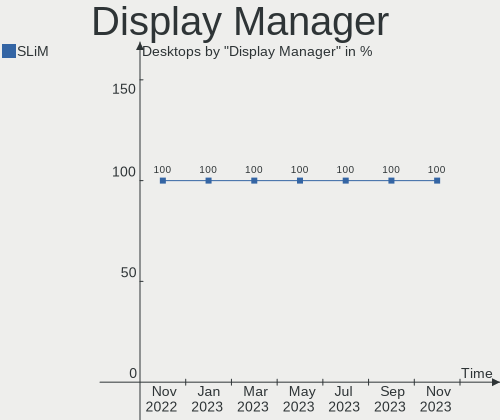
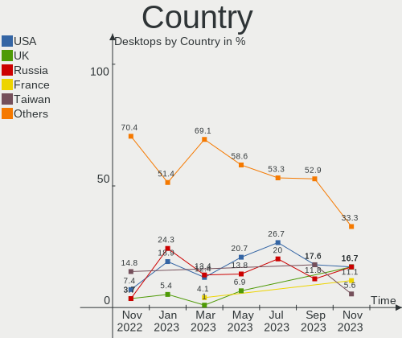
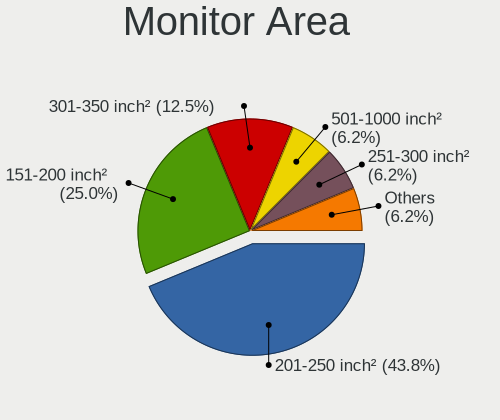
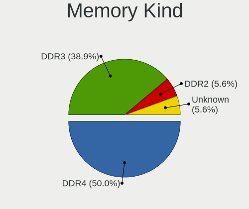

helloSystem Hardware Trends (Desktop)
-------------------------------------

A project to identify most popular hardware characteristics and track their change
over time based on data collected by helloSystem users at https://BSD-Hardware.info.

Anyone can contribute to the study by uploading probes of their computers by
the [hw-probe](https://github.com/linuxhw/hw-probe/blob/master/INSTALL.BSD.md) tool:

    hw-probe -all -upload

Full-feature report is available here: https://bsd-hardware.info/?view=trends&formfactor=desktop

Period: Jun, 2021.

Contents
--------

- [ OS                       ](#os)
- [ OS Family                ](#os-family)
- [ Arch                     ](#arch)
- [ DE                       ](#de)
- [ Display Server           ](#display-server)
- [ Display Manager          ](#display-manager)
- [ OS Lang                  ](#os-lang)
- [ Boot Mode                ](#boot-mode)
- [ Filesystem               ](#filesystem)
- [ Part. scheme             ](#part-scheme)
- [ Country                  ](#country)
- [ City                     ](#city)
- [ Vendor                   ](#vendor)
- [ Model                    ](#model)
- [ Model Family             ](#model-family)
- [ MFG Year                 ](#mfg-year)
- [ Form Factor              ](#form-factor)
- [ Coreboot                 ](#coreboot)
- [ RAM Size                 ](#ram-size)
- [ RAM Used                 ](#ram-used)
- [ Has CD-ROM               ](#has-cd-rom)
- [ Total Drives             ](#total-drives)
- [ Has Ethernet             ](#has-ethernet)
- [ Has WiFi                 ](#has-wifi)
- [ Has Bluetooth            ](#has-bluetooth)
- [ Drive Vendor             ](#drive-vendor)
- [ Drive Model              ](#drive-model)
- [ HDD Vendor               ](#hdd-vendor)
- [ SSD Vendor               ](#ssd-vendor)
- [ Drive Kind               ](#drive-kind)
- [ Drive Connector          ](#drive-connector)
- [ Drive Size               ](#drive-size)
- [ Space Total              ](#space-total)
- [ Space Used               ](#space-used)
- [ Malfunc. Drives          ](#malfunc-drives)
- [ Malfunc. Drive Vendor    ](#malfunc-drive-vendor)
- [ Malfunc. HDD Vendor      ](#malfunc-hdd-vendor)
- [ Malfunc. Drive Kind      ](#malfunc-drive-kind)
- [ Failed Drives            ](#failed-drives)
- [ Failed Drive Vendor      ](#failed-drive-vendor)
- [ Drive Status             ](#drive-status)
- [ Storage Vendor           ](#storage-vendor)
- [ Storage Model            ](#storage-model)
- [ Storage Kind             ](#storage-kind)
- [ CPU Vendor               ](#cpu-vendor)
- [ CPU Model                ](#cpu-model)
- [ CPU Model Family         ](#cpu-model-family)
- [ CPU Cores                ](#cpu-cores)
- [ CPU Sockets              ](#cpu-sockets)
- [ CPU Threads              ](#cpu-threads)
- [ CPU Microarch            ](#cpu-microarch)
- [ GPU Vendor               ](#gpu-vendor)
- [ GPU Model                ](#gpu-model)
- [ GPU Combo                ](#gpu-combo)
- [ GPU Driver               ](#gpu-driver)
- [ GPU Memory               ](#gpu-memory)
- [ Monitor Vendor           ](#monitor-vendor)
- [ Monitor Model            ](#monitor-model)
- [ Monitor Resolution       ](#monitor-resolution)
- [ Monitor Diagonal         ](#monitor-diagonal)
- [ Monitor Width            ](#monitor-width)
- [ Aspect Ratio             ](#aspect-ratio)
- [ Monitor Area             ](#monitor-area)
- [ Pixel Density            ](#pixel-density)
- [ Multiple Monitors        ](#multiple-monitors)
- [ Net Controller Vendor    ](#net-controller-vendor)
- [ Net Controller Model     ](#net-controller-model)
- [ Wireless Vendor          ](#wireless-vendor)
- [ Wireless Model           ](#wireless-model)
- [ Ethernet Vendor          ](#ethernet-vendor)
- [ Ethernet Model           ](#ethernet-model)
- [ Net Controller Kind      ](#net-controller-kind)
- [ Used Controller          ](#used-controller)
- [ NICs                     ](#nics)
- [ IPv6                     ](#ipv6)
- [ Memory Vendor            ](#memory-vendor)
- [ Memory Model             ](#memory-model)
- [ Memory Kind              ](#memory-kind)
- [ Memory Form Factor       ](#memory-form-factor)
- [ Memory Size              ](#memory-size)
- [ Memory Speed             ](#memory-speed)
- [ Sound Vendor             ](#sound-vendor)
- [ Sound Model              ](#sound-model)
- [ Camera Vendor            ](#camera-vendor)
- [ Camera Model             ](#camera-model)
- [ Fingerprint Vendor       ](#fingerprint-vendor)
- [ Fingerprint Model        ](#fingerprint-model)
- [ Chipcard Vendor          ](#chipcard-vendor)
- [ Chipcard Model           ](#chipcard-model)
- [ Printer Vendor           ](#printer-vendor)
- [ Printer Model            ](#printer-model)
- [ Scanner Vendor           ](#scanner-vendor)
- [ Scanner Model            ](#scanner-model)
- [ Bluetooth Vendor         ](#bluetooth-vendor)
- [ Bluetooth Model          ](#bluetooth-model)
- [ Unsupported Devices      ](#unsupported-devices)
- [ Unsupported Device Types ](#unsupported-device-types)

OS
--

Installed operating systems

| Name              | Desktops | Percent |
|-------------------|----------|---------|
| helloSystem 0.5.0 | 32       | 88.89%  |
| helloSystem 0.4.0 | 2        | 5.56%   |
| helloSystem 0.6.0 | 1        | 2.78%   |
| helloSystem 0.1.0 | 1        | 2.78%   |

OS Family
---------

OS without a version

| Name        | Desktops | Percent |
|-------------|----------|---------|
| helloSystem | 36       | 100%    |

Arch
----

OS architecture (x86_64, i586, etc.)

| Name  | Desktops | Percent |
|-------|----------|---------|
| amd64 | 36       | 100%    |

DE
--

Desktop Environment

| Name         | Desktops | Percent |
|--------------|----------|---------|
| helloDesktop | 35       | 97.22%  |
| GNOME        | 1        | 2.78%   |

Display Server
--------------

X11 or Wayland

| Name | Desktops | Percent |
|------|----------|---------|
| X11  | 36       | 100%    |

Display Manager
---------------

SDDM, LightDM, etc.

| Name | Desktops | Percent |
|------|----------|---------|
| SLiM | 36       | 100%    |

OS Lang
-------

Language

| Lang  | Desktops | Percent |
|-------|----------|---------|
| en_US | 36       | 100%    |

Boot Mode
---------

EFI or BIOS

| Mode | Desktops | Percent |
|------|----------|---------|
| EFI  | 30       | 83.33%  |
| BIOS | 6        | 16.67%  |

Filesystem
----------

Type of filesystem

| Type | Desktops | Percent |
|------|----------|---------|
| Zfs  | 36       | 100%    |

Part. scheme
------------

Scheme of partitioning

| Type | Desktops | Percent |
|------|----------|---------|
| GPT  | 36       | 100%    |

Country
-------

Geographic location (country)

| Country     | Desktops | Percent |
|-------------|----------|---------|
| USA         | 5        | 13.89%  |
| Russia      | 5        | 13.89%  |
| Ukraine     | 4        | 11.11%  |
| Germany     | 3        | 8.33%   |
| UK          | 2        | 5.56%   |
| Taiwan      | 2        | 5.56%   |
| Poland      | 2        | 5.56%   |
| Canada      | 2        | 5.56%   |
| Uruguay     | 1        | 2.78%   |
| Turkey      | 1        | 2.78%   |
| Sweden      | 1        | 2.78%   |
| New Zealand | 1        | 2.78%   |
| Netherlands | 1        | 2.78%   |
| Mexico      | 1        | 2.78%   |
| Lithuania   | 1        | 2.78%   |
| Italy       | 1        | 2.78%   |
| Egypt       | 1        | 2.78%   |
| Brazil      | 1        | 2.78%   |
| Australia   | 1        | 2.78%   |

City
----

Geographic location (city)

| City               | Desktops | Percent |
|--------------------|----------|---------|
| Dnipropetrovsk     | 2        | 5.56%   |
| Chelyabinsk        | 2        | 5.56%   |
| Šiauliai          | 1        | 2.78%   |
| York               | 1        | 2.78%   |
| Winnipeg           | 1        | 2.78%   |
| Vladivostok        | 1        | 2.78%   |
| Ufa                | 1        | 2.78%   |
| Toronto            | 1        | 2.78%   |
| Taichung           | 1        | 2.78%   |
| São Paulo         | 1        | 2.78%   |
| Sydney             | 1        | 2.78%   |
| Sevastopol         | 1        | 2.78%   |
| Rome               | 1        | 2.78%   |
| Querétaro City    | 1        | 2.78%   |
| Pflugerville       | 1        | 2.78%   |
| New Taipei         | 1        | 2.78%   |
| Neuffen            | 1        | 2.78%   |
| Mount Pleasant     | 1        | 2.78%   |
| Montevideo         | 1        | 2.78%   |
| Mankato            | 1        | 2.78%   |
| Malokaterynivka    | 1        | 2.78%   |
| London             | 1        | 2.78%   |
| Kyiv               | 1        | 2.78%   |
| Kungsbacka         | 1        | 2.78%   |
| Kosekoy            | 1        | 2.78%   |
| Katowice           | 1        | 2.78%   |
| Kampen             | 1        | 2.78%   |
| Faqus              | 1        | 2.78%   |
| Erfurt             | 1        | 2.78%   |
| Dąbrowa Górnicza | 1        | 2.78%   |
| Auckland           | 1        | 2.78%   |
| Ashville           | 1        | 2.78%   |
| Ann Arbor          | 1        | 2.78%   |
| Aalen              | 1        | 2.78%   |

Vendor
------

Motherboard manufacturer

| Name                | Desktops | Percent |
|---------------------|----------|---------|
| ASUSTek Computer    | 14       | 38.89%  |
| MSI                 | 4        | 11.11%  |
| Gigabyte Technology | 3        | 8.33%   |
| Dell                | 3        | 8.33%   |
| Lenovo              | 2        | 5.56%   |
| Intel               | 2        | 5.56%   |
| Hewlett-Packard     | 2        | 5.56%   |
| ASRock              | 2        | 5.56%   |
| Protectli           | 1        | 2.78%   |
| Huanan              | 1        | 2.78%   |
| Foxconn             | 1        | 2.78%   |
| Biostar             | 1        | 2.78%   |

Model
-----

Motherboard model

| Name                                | Desktops | Percent |
|-------------------------------------|----------|---------|
| ASUS All Series                     | 2        | 5.56%   |
| Protectli FW2B                      | 1        | 2.78%   |
| MSI MS-7B86                         | 1        | 2.78%   |
| MSI MS-7B84                         | 1        | 2.78%   |
| MSI MS-7A15                         | 1        | 2.78%   |
| MSI MS-7592                         | 1        | 2.78%   |
| Lenovo ThinkCentre M91p 7033DE6     | 1        | 2.78%   |
| Lenovo 70F8S01J00 ThinkServer RS140 | 1        | 2.78%   |
| Intel X79 V2.72A                    | 1        | 2.78%   |
| Intel DH67CL AAG10212-206           | 1        | 2.78%   |
| Huanan X99-8M-F V1.2                | 1        | 2.78%   |
| HP Z400 Workstation                 | 1        | 2.78%   |
| HP Compaq Elite 8300 SFF            | 1        | 2.78%   |
| Gigabyte H97-D3H                    | 1        | 2.78%   |
| Gigabyte H470M DS3H                 | 1        | 2.78%   |
| Gigabyte AX370-Gaming               | 1        | 2.78%   |
| Foxconn Pro 3500 Series             | 1        | 2.78%   |
| Dell Precision WorkStation T3500    | 1        | 2.78%   |
| Dell OptiPlex 990                   | 1        | 2.78%   |
| Dell OptiPlex 5055 Ryzen CPU        | 1        | 2.78%   |
| Biostar B450MH                      | 1        | 2.78%   |
| ASUS TUF GAMING X570-PLUS           | 1        | 2.78%   |
| ASUS ROG STRIX H370-I GAMING        | 1        | 2.78%   |
| ASUS PRIME H410M-D                  | 1        | 2.78%   |
| ASUS PRIME A320M-K                  | 1        | 2.78%   |
| ASUS P7H55                          | 1        | 2.78%   |
| ASUS M5A97 R2.0                     | 1        | 2.78%   |
| ASUS M5A78L-M LX/BR                 | 1        | 2.78%   |
| ASUS M4A78LT-M                      | 1        | 2.78%   |
| ASUS H110M-E/M.2                    | 1        | 2.78%   |
| ASUS H110I-PLUS                     | 1        | 2.78%   |
| ASUS exone-PC                       | 1        | 2.78%   |
| ASUS CP5141                         | 1        | 2.78%   |
| ASRock G31M-VS2                     | 1        | 2.78%   |
| ASRock FM2A68M-HD+                  | 1        | 2.78%   |

Model Family
------------

Motherboard model prefix

| Name                  | Desktops | Percent |
|-----------------------|----------|---------|
| Dell OptiPlex         | 2        | 5.56%   |
| ASUS PRIME            | 2        | 5.56%   |
| ASUS All              | 2        | 5.56%   |
| Protectli FW2B        | 1        | 2.78%   |
| MSI MS-7B86           | 1        | 2.78%   |
| MSI MS-7B84           | 1        | 2.78%   |
| MSI MS-7A15           | 1        | 2.78%   |
| MSI MS-7592           | 1        | 2.78%   |
| Lenovo ThinkCentre    | 1        | 2.78%   |
| Lenovo 70F8S01J00     | 1        | 2.78%   |
| Intel X79             | 1        | 2.78%   |
| Intel DH67CL          | 1        | 2.78%   |
| Huanan X99-8M-F       | 1        | 2.78%   |
| HP Z400               | 1        | 2.78%   |
| HP Compaq             | 1        | 2.78%   |
| Gigabyte H97-D3H      | 1        | 2.78%   |
| Gigabyte H470M        | 1        | 2.78%   |
| Gigabyte AX370-Gaming | 1        | 2.78%   |
| Foxconn Pro           | 1        | 2.78%   |
| Dell Precision        | 1        | 2.78%   |
| Biostar B450MH        | 1        | 2.78%   |
| ASUS TUF              | 1        | 2.78%   |
| ASUS ROG              | 1        | 2.78%   |
| ASUS P7H55            | 1        | 2.78%   |
| ASUS M5A97            | 1        | 2.78%   |
| ASUS M5A78L-M         | 1        | 2.78%   |
| ASUS M4A78LT-M        | 1        | 2.78%   |
| ASUS H110M-E          | 1        | 2.78%   |
| ASUS H110I-PLUS       | 1        | 2.78%   |
| ASUS exone-PC         | 1        | 2.78%   |
| ASUS CP5141           | 1        | 2.78%   |
| ASRock G31M-VS2       | 1        | 2.78%   |
| ASRock FM2A68M-HD+    | 1        | 2.78%   |

MFG Year
--------

Motherboard manufacture year

| Year | Desktops | Percent |
|------|----------|---------|
| 2019 | 6        | 16.67%  |
| 2021 | 5        | 13.89%  |
| 2018 | 5        | 13.89%  |
| 2020 | 4        | 11.11%  |
| 2012 | 4        | 11.11%  |
| 2010 | 3        | 8.33%   |
| 2015 | 2        | 5.56%   |
| 2013 | 2        | 5.56%   |
| 2011 | 2        | 5.56%   |
| 2017 | 1        | 2.78%   |
| 2016 | 1        | 2.78%   |
| 2009 | 1        | 2.78%   |

Form Factor
-----------

Physical design of the computer

| Name    | Desktops | Percent |
|---------|----------|---------|
| Desktop | 36       | 100%    |

Coreboot
--------

Have coreboot on board

| Used | Desktops | Percent |
|------|----------|---------|
| No   | 36       | 100%    |

RAM Size
--------

Total RAM memory

| Size in GB | Desktops | Percent |
|------------|----------|---------|
| 16.01-24.0 | 14       | 38.89%  |
| 4.01-8.0   | 11       | 30.56%  |
| 8.01-16.0  | 8        | 22.22%  |
| 32.01-64.0 | 2        | 5.56%   |
| 24.01-32.0 | 1        | 2.78%   |

RAM Used
--------

Used RAM memory

| Used GB  | Desktops | Percent |
|----------|----------|---------|
| 0.01-0.5 | 17       | 47.22%  |
| 0.51-1.0 | 16       | 44.44%  |
| 1.01-2.0 | 2        | 5.56%   |
| 2.01-3.0 | 1        | 2.78%   |

Has CD-ROM
----------

Has CD-ROM on board

| Presented | Desktops | Percent |
|-----------|----------|---------|
| Yes       | 18       | 50%     |
| No        | 18       | 50%     |

Total Drives
------------

Number of drives on board

| Drives | Desktops | Percent |
|--------|----------|---------|
| 2      | 14       | 38.89%  |
| 1      | 14       | 38.89%  |
| 3      | 4        | 11.11%  |
| 4      | 2        | 5.56%   |
| 6      | 1        | 2.78%   |
| 0      | 1        | 2.78%   |

Has Ethernet
------------

Has Ethernet on board

| Presented | Desktops | Percent |
|-----------|----------|---------|
| Yes       | 36       | 100%    |

Has WiFi
--------

Has WiFi module

| Presented | Desktops | Percent |
|-----------|----------|---------|
| No        | 28       | 77.78%  |
| Yes       | 8        | 22.22%  |

Has Bluetooth
-------------

Has Bluetooth module

| Presented | Desktops | Percent |
|-----------|----------|---------|
| No        | 31       | 86.11%  |
| Yes       | 5        | 13.89%  |

Drive Vendor
------------

Hard drive vendors

| Vendor              | Desktops | Drives | Percent |
|---------------------|----------|--------|---------|
| WDC                 | 15       | 16     | 25.86%  |
| Samsung Electronics | 12       | 16     | 20.69%  |
| Seagate             | 11       | 15     | 18.97%  |
| Kingston            | 5        | 6      | 8.62%   |
| A-DATA Technology   | 3        | 3      | 5.17%   |
| Toshiba             | 2        | 2      | 3.45%   |
| Hitachi             | 2        | 2      | 3.45%   |
| Verbatim            | 1        | 1      | 1.72%   |
| Smartbuy            | 1        | 1      | 1.72%   |
| SanDisk             | 1        | 1      | 1.72%   |
| OCZ                 | 1        | 1      | 1.72%   |
| LITEON              | 1        | 1      | 1.72%   |
| Intel               | 1        | 1      | 1.72%   |
| HGST                | 1        | 1      | 1.72%   |
| Apacer              | 1        | 1      | 1.72%   |

Drive Model
-----------

Hard drive models

| Model                            | Desktops | Percent |
|----------------------------------|----------|---------|
| WDC WD10EZRX-00A8LB0 1TB         | 2        | 3.03%   |
| Toshiba DT01ACA100 1TB           | 2        | 3.03%   |
| WDC WDS250G3X0C-00SJG0 250GB     | 1        | 1.52%   |
| WDC WD6400AAKS-22A7B0 640GB      | 1        | 1.52%   |
| WDC WD5002ABYS-02B1B0 500GB      | 1        | 1.52%   |
| WDC WD5000AAKX-60U6AA0 500GB     | 1        | 1.52%   |
| WDC WD4004FZWX-00GBGB0 4TB       | 1        | 1.52%   |
| WDC WD3200BEVT-00A0RT0 233GB     | 1        | 1.52%   |
| WDC WD3200BEKT-60PVMT0 320GB     | 1        | 1.52%   |
| WDC WD3003FZEX-00Z4SA0 3TB       | 1        | 1.52%   |
| WDC WD2500YS-01SHB1 256GB        | 1        | 1.52%   |
| WDC WD2500AAKX-083CA1 250GB      | 1        | 1.52%   |
| WDC WD20EARS-00MVWB0 2TB         | 1        | 1.52%   |
| WDC WD10EZEX-08Y20A0 1TB         | 1        | 1.52%   |
| WDC WD10EZEX-08WN4A0 1TB         | 1        | 1.52%   |
| Verbatim Vi550 S3 SSD 256GB      | 1        | 1.52%   |
| Smartbuy SSD 120GB               | 1        | 1.52%   |
| Seagate ST500DM002-1BD142 500GB  | 1        | 1.52%   |
| Seagate ST4000VX007-2DT166 4TB   | 1        | 1.52%   |
| Seagate ST4000DM004-2CV104 4TB   | 1        | 1.52%   |
| Seagate ST380815AS 80GB          | 1        | 1.52%   |
| Seagate ST3500830AS 500GB        | 1        | 1.52%   |
| Seagate ST3500412AS 500GB        | 1        | 1.52%   |
| Seagate ST3500312CS 500GB        | 1        | 1.52%   |
| Seagate ST3360320AS 360GB        | 1        | 1.52%   |
| Seagate ST3320613AS 320GB        | 1        | 1.52%   |
| Seagate ST3300831AS 304GB        | 1        | 1.52%   |
| Seagate ST3250410AS 250GB        | 1        | 1.52%   |
| Seagate ST3000DM001-1CH166 3TB   | 1        | 1.52%   |
| Seagate ST2000DM008-2FR102 2TB   | 1        | 1.52%   |
| Seagate ST2000DL003-9VT166 2TB   | 1        | 1.52%   |
| Seagate ST1000DM003-1CH162 1TB   | 1        | 1.52%   |
| SanDisk SSD PLUS 240GB           | 1        | 1.52%   |
| Samsung SSD 970 EVO Plus 500GB   | 1        | 1.52%   |
| Samsung SSD 970 EVO Plus 250GB   | 1        | 1.52%   |
| Samsung SSD 860 PRO 512GB        | 1        | 1.52%   |
| Samsung SSD 860 PRO 256GB        | 1        | 1.52%   |
| Samsung SSD 860 EVO 500GB        | 1        | 1.52%   |
| Samsung SSD 860 EVO 250GB        | 1        | 1.52%   |
| Samsung SSD 860 EVO 1TB          | 1        | 1.52%   |
| Samsung SSD 850 EVO 250GB        | 1        | 1.52%   |
| Samsung SP2004C 200GB            | 1        | 1.52%   |
| Samsung MZ7TE128HMGR-000H1 128GB | 1        | 1.52%   |
| Samsung HN-M101MBB 1TB           | 1        | 1.52%   |
| Samsung HD642JJ 640GB            | 1        | 1.52%   |
| Samsung HD502HJ 500GB            | 1        | 1.52%   |
| Samsung HD321KJ 320GB            | 1        | 1.52%   |
| Samsung HD161HJ 160GB            | 1        | 1.52%   |
| OCZ VERTEX2 56GB                 | 1        | 1.52%   |
| LITEON IT LCS-128L9S-HP 128GB    | 1        | 1.52%   |
| Kingston SV300S37A240G 240GB     | 1        | 1.52%   |
| Kingston SUV500MS120G 120GB      | 1        | 1.52%   |
| Kingston SHFS37A120G 120GB       | 1        | 1.52%   |
| Kingston SA400S37480G 480GB      | 1        | 1.52%   |
| Kingston SA400S37240G 240GB      | 1        | 1.52%   |
| Kingston SA2000M8250G 250GB      | 1        | 1.52%   |
| Intel SSDPEKNW512G8 512GB        | 1        | 1.52%   |
| Hitachi HTS727550A9E364 500GB    | 1        | 1.52%   |
| Hitachi HDS721010CLA632 1TB      | 1        | 1.52%   |
| HGST HTS725050A7E630 500GB       | 1        | 1.52%   |

HDD Vendor
----------

Hard disk drive vendors

| Vendor              | Desktops | Drives | Percent |
|---------------------|----------|--------|---------|
| WDC                 | 14       | 15     | 38.89%  |
| Seagate             | 11       | 15     | 30.56%  |
| Samsung Electronics | 6        | 6      | 16.67%  |
| Toshiba             | 2        | 2      | 5.56%   |
| Hitachi             | 2        | 2      | 5.56%   |
| HGST                | 1        | 1      | 2.78%   |

SSD Vendor
----------

Solid state drive vendors

| Vendor              | Desktops | Drives | Percent |
|---------------------|----------|--------|---------|
| Samsung Electronics | 6        | 8      | 31.58%  |
| Kingston            | 5        | 5      | 26.32%  |
| A-DATA Technology   | 2        | 2      | 10.53%  |
| Verbatim            | 1        | 1      | 5.26%   |
| Smartbuy            | 1        | 1      | 5.26%   |
| SanDisk             | 1        | 1      | 5.26%   |
| OCZ                 | 1        | 1      | 5.26%   |
| LITEON              | 1        | 1      | 5.26%   |
| Apacer              | 1        | 1      | 5.26%   |

Drive Kind
----------

HDD or SSD

| Kind | Desktops | Drives | Percent |
|------|----------|--------|---------|
| HDD  | 29       | 41     | 55.77%  |
| SSD  | 18       | 21     | 34.62%  |
| NVMe | 5        | 6      | 9.62%   |

Drive Connector
---------------

SATA, SAS, NVMe, etc.

| Type | Desktops | Drives | Percent |
|------|----------|--------|---------|
| SATA | 35       | 62     | 87.5%   |
| NVMe | 5        | 6      | 12.5%   |

Drive Size
----------

Size of hard drive

| Size in TB | Desktops | Drives | Percent |
|------------|----------|--------|---------|
| 0.01-0.5   | 31       | 41     | 60.78%  |
| 0.51-1.0   | 13       | 13     | 25.49%  |
| 3.01-4.0   | 3        | 3      | 5.88%   |
| 1.01-2.0   | 3        | 3      | 5.88%   |
| 2.01-3.0   | 1        | 2      | 1.96%   |

Space Total
-----------

Amount of disk space available on the file system

| Size in GB | Desktops | Percent |
|------------|----------|---------|
| 1-20       | 25       | 69.44%  |
| 101-250    | 4        | 11.11%  |
| 501-1000   | 3        | 8.33%   |
| 251-500    | 2        | 5.56%   |
| 21-50      | 1        | 2.78%   |
| 51-100     | 1        | 2.78%   |

Space Used
----------

Amount of used disk space

| Used GB | Desktops | Percent |
|---------|----------|---------|
| 1-20    | 36       | 100%    |

Malfunc. Drives
---------------

Drive models with a malfunction

| Model                             | Desktops | Drives | Percent |
|-----------------------------------|----------|--------|---------|
| WDC WD6400AAKS-22A7B0 640GB       | 1        | 1      | 7.69%   |
| WDC WD5000AAKX-60U6AA0 500GB      | 1        | 1      | 7.69%   |
| WDC WD3200BEVT-00A0RT0 233GB      | 1        | 1      | 7.69%   |
| WDC WD2500AAKX-083CA1 250GB       | 1        | 1      | 7.69%   |
| Toshiba DT01ACA100 1TB            | 1        | 1      | 7.69%   |
| Seagate ST380815AS 80GB           | 1        | 1      | 7.69%   |
| Seagate ST3250410AS 250GB         | 1        | 1      | 7.69%   |
| Samsung Electronics SP2004C 200GB | 1        | 1      | 7.69%   |
| Samsung Electronics HD642JJ 640GB | 1        | 1      | 7.69%   |
| Samsung Electronics HD321KJ 320GB | 1        | 1      | 7.69%   |
| Samsung Electronics HD161HJ 160GB | 1        | 1      | 7.69%   |
| Hitachi HTS727550A9E364 500GB     | 1        | 1      | 7.69%   |
| HGST HTS725050A7E630 500GB        | 1        | 1      | 7.69%   |

Malfunc. Drive Vendor
---------------------

Vendors of faulty drives

| Vendor              | Desktops | Drives | Percent |
|---------------------|----------|--------|---------|
| WDC                 | 4        | 4      | 30.77%  |
| Samsung Electronics | 4        | 4      | 30.77%  |
| Seagate             | 2        | 2      | 15.38%  |
| Toshiba             | 1        | 1      | 7.69%   |
| Hitachi             | 1        | 1      | 7.69%   |
| HGST                | 1        | 1      | 7.69%   |

Malfunc. HDD Vendor
-------------------

Vendors of faulty HDD drives

| Vendor              | Desktops | Drives | Percent |
|---------------------|----------|--------|---------|
| WDC                 | 4        | 4      | 30.77%  |
| Samsung Electronics | 4        | 4      | 30.77%  |
| Seagate             | 2        | 2      | 15.38%  |
| Toshiba             | 1        | 1      | 7.69%   |
| Hitachi             | 1        | 1      | 7.69%   |
| HGST                | 1        | 1      | 7.69%   |

Malfunc. Drive Kind
-------------------

Kinds of faulty drives

| Kind | Desktops | Drives | Percent |
|------|----------|--------|---------|
| HDD  | 11       | 13     | 100%    |

Failed Drives
-------------

Failed drive models

Zero info for selected period =(

Failed Drive Vendor
-------------------

Failed drive vendors

Zero info for selected period =(

Drive Status
------------

Number of failed and malfunc. drives

| Status   | Desktops | Drives | Percent |
|----------|----------|--------|---------|
| Works    | 26       | 53     | 68.42%  |
| Malfunc  | 11       | 13     | 28.95%  |
| Detected | 1        | 2      | 2.63%   |

Storage Vendor
--------------

Storage controller vendors

| Vendor                      | Desktops | Percent |
|-----------------------------|----------|---------|
| Intel                       | 26       | 56.52%  |
| AMD                         | 11       | 23.91%  |
| VIA Technologies            | 2        | 4.35%   |
| Samsung Electronics         | 2        | 4.35%   |
| Silicon Image               | 1        | 2.17%   |
| Sandisk                     | 1        | 2.17%   |
| Kingston Technology Company | 1        | 2.17%   |
| Broadcom / LSI              | 1        | 2.17%   |
| ADATA Technology            | 1        | 2.17%   |

Storage Model
-------------

Storage controller models

| Model                                                                            | Desktops | Percent |
|----------------------------------------------------------------------------------|----------|---------|
| AMD FCH SATA Controller [AHCI mode]                                              | 7        | 12.28%  |
| Intel 6 Series/C200 Series Chipset Family 6 port Desktop SATA AHCI Controller    | 5        | 8.77%   |
| Intel Q170/Q150/B150/H170/H110/Z170/CM236 Chipset SATA Controller [AHCI Mode]    | 3        | 5.26%   |
| Intel NM10/ICH7 Family SATA Controller [IDE mode]                                | 3        | 5.26%   |
| Intel 82801G (ICH7 Family) IDE Controller                                        | 3        | 5.26%   |
| AMD 400 Series Chipset SATA Controller                                           | 3        | 5.26%   |
| VIA VT6415 PATA IDE Host Controller                                              | 2        | 3.51%   |
| Samsung NVMe SSD Controller SM981/PM981/PM983                                    | 2        | 3.51%   |
| Intel SATA Controller [RAID mode]                                                | 2        | 3.51%   |
| Intel 9 Series Chipset Family SATA Controller [AHCI Mode]                        | 2        | 3.51%   |
| Intel 8 Series/C220 Series Chipset Family 6-port SATA Controller 1 [AHCI mode]   | 2        | 3.51%   |
| AMD SB7x0/SB8x0/SB9x0 SATA Controller [AHCI mode]                                | 2        | 3.51%   |
| AMD SB7x0/SB8x0/SB9x0 IDE Controller                                             | 2        | 3.51%   |
| Silicon Image SiI 3512 [SATALink/SATARaid] Serial ATA Controller                 | 1        | 1.75%   |
| Sandisk WD Black 2018/SN750 / PC SN720 NVMe SSD                                  | 1        | 1.75%   |
| Kingston Company A2000 NVMe SSD                                                  | 1        | 1.75%   |
| Intel SSD 660P Series                                                            | 1        | 1.75%   |
| Intel Cannon Lake PCH SATA AHCI Controller                                       | 1        | 1.75%   |
| Intel C600/X79 series chipset 6-Port SATA AHCI Controller                        | 1        | 1.75%   |
| Intel Atom/Celeron/Pentium Processor x5-E8000/J3xxx/N3xxx Series SATA Controller | 1        | 1.75%   |
| Intel 82801JI (ICH10 Family) SATA AHCI Controller                                | 1        | 1.75%   |
| Intel 8 Series/C220 Series Chipset Family 4-port SATA Controller 1 [IDE mode]    | 1        | 1.75%   |
| Intel 8 Series/C220 Series Chipset Family 2-port SATA Controller 2 [IDE mode]    | 1        | 1.75%   |
| Intel 7 Series/C210 Series Chipset Family 6-port SATA Controller [AHCI mode]     | 1        | 1.75%   |
| Intel 5 Series/3400 Series Chipset 6 port SATA AHCI Controller                   | 1        | 1.75%   |
| Intel 400 Series Chipset Family SATA AHCI Controller                             | 1        | 1.75%   |
| Broadcom / LSI SAS1068E PCI-Express Fusion-MPT SAS                               | 1        | 1.75%   |
| AMD X370 Series Chipset SATA Controller                                          | 1        | 1.75%   |
| AMD SB7x0/SB8x0/SB9x0 SATA Controller [IDE mode]                                 | 1        | 1.75%   |
| AMD FCH SATA Controller D                                                        | 1        | 1.75%   |
| AMD 300 Series Chipset SATA Controller                                           | 1        | 1.75%   |
| ADATA XPG SX8200 Pro PCIe Gen3x4 M.2 2280 Solid State Drive                      | 1        | 1.75%   |

Storage Kind
------------

Kind of storage controller (IDE, SATA, NVMe, SAS, ...)

| Kind | Desktops | Percent |
|------|----------|---------|
| SATA | 29       | 63.04%  |
| IDE  | 8        | 17.39%  |
| NVMe | 5        | 10.87%  |
| RAID | 3        | 6.52%   |
| SCSI | 1        | 2.17%   |

CPU Vendor
----------

Processor vendors

| Vendor | Desktops | Percent |
|--------|----------|---------|
| Intel  | 25       | 69.44%  |
| AMD    | 11       | 30.56%  |

CPU Model
---------

Processor models

| Model                                       | Desktops | Percent |
|---------------------------------------------|----------|---------|
| Intel Core i5-2400 CPU @ 3.10GHz            | 2        | 5.56%   |
| Intel Core i3-6100 CPU @ 3.70GHz            | 2        | 5.56%   |
| Intel Xeon CPU W3550 @ 3.07GHz              | 1        | 2.78%   |
| Intel Xeon CPU E5-2630L 0 @ 2.00GHz         | 1        | 2.78%   |
| Intel Xeon CPU E3-1241 v3 @ 3.50GHz         | 1        | 2.78%   |
| Intel Xeon                                  | 1        | 2.78%   |
| Intel Pentium Dual-Core CPU E6600 @ 3.06GHz | 1        | 2.78%   |
| Intel Pentium Dual-Core CPU E5800 @ 3.20GHz | 1        | 2.78%   |
| Intel Pentium CPU G4400 @ 3.30GHz           | 1        | 2.78%   |
| Intel Pentium CPU G3460 @ 3.50GHz           | 1        | 2.78%   |
| Intel Genuine CPU 0000 @ 2.10GHz            | 1        | 2.78%   |
| Intel Core i7-4790 CPU @ 3.60GHz            | 1        | 2.78%   |
| Intel Core i5-8400 CPU @ 2.80GHz            | 1        | 2.78%   |
| Intel Core i5-4460 CPU @ 3.20GHz            | 1        | 2.78%   |
| Intel Core i5-2400S CPU @ 2.50GH            | 1        | 2.78%   |
| Intel Core i3-3240 CPU @ 3.40GHz            | 1        | 2.78%   |
| Intel Core i3-3225 CPU @ 3.30GHz            | 1        | 2.78%   |
| Intel Core i3-2100T CPU @ 2.50GHz           | 1        | 2.78%   |
| Intel Core i3-10100F CPU @ 3.60GHz          | 1        | 2.78%   |
| Intel Core i3-10100 CPU @ 3.60GHz           | 1        | 2.78%   |
| Intel Core i3 CPU 530 @ 2.93GHz             | 1        | 2.78%   |
| Intel Core 2 Quad CPU Q9400 @ 2.66GHz       | 1        | 2.78%   |
| Intel Celeron CPU J3060 @ 1.60GHz           | 1        | 2.78%   |
| AMD Ryzen 9 3900X 12-Core Processor         | 1        | 2.78%   |
| AMD Ryzen 7 3700X 8-Core Processor          | 1        | 2.78%   |
| AMD Ryzen 7 1700 Eight-Core Processor       | 1        | 2.78%   |
| AMD Ryzen 5 3600X 6-Core Processor          | 1        | 2.78%   |
| AMD Ryzen 5 3400G with Radeon Vega Graphics | 1        | 2.78%   |
| AMD Ryzen 5 1500X Quad-Core Processor       | 1        | 2.78%   |
| AMD FX-6300 Six-Core Processor              | 1        | 2.78%   |
| AMD FX-6100 Six-Core Processor              | 1        | 2.78%   |
| AMD Athlon II X4 640 Processor              | 1        | 2.78%   |
| AMD Athlon 3000G with Radeon Vega Graphics  | 1        | 2.78%   |
| AMD A10-5700 APU with Radeon HD Graphics    | 1        | 2.78%   |

CPU Model Family
----------------

Processor model prefix

| Model                   | Desktops | Percent |
|-------------------------|----------|---------|
| Intel Core i3           | 8        | 22.22%  |
| Intel Core i5           | 5        | 13.89%  |
| Intel Xeon              | 4        | 11.11%  |
| AMD Ryzen 5             | 3        | 8.33%   |
| Intel Pentium Dual-Core | 2        | 5.56%   |
| Intel Pentium           | 2        | 5.56%   |
| AMD Ryzen 7             | 2        | 5.56%   |
| AMD FX                  | 2        | 5.56%   |
| Intel Genuine           | 1        | 2.78%   |
| Intel Core i7           | 1        | 2.78%   |
| Intel Core 2 Quad       | 1        | 2.78%   |
| Intel Celeron           | 1        | 2.78%   |
| AMD Ryzen 9             | 1        | 2.78%   |
| AMD Athlon II X4        | 1        | 2.78%   |
| AMD Athlon              | 1        | 2.78%   |
| AMD A10                 | 1        | 2.78%   |

CPU Cores
---------

Number of processor cores

| Number  | Desktops | Percent |
|---------|----------|---------|
| 4       | 14       | 38.89%  |
| 2       | 10       | 27.78%  |
| 6       | 4        | 11.11%  |
| 8       | 3        | 8.33%   |
| 16      | 2        | 5.56%   |
| 24      | 1        | 2.78%   |
| 12      | 1        | 2.78%   |
| Unknown | 1        | 2.78%   |

CPU Sockets
-----------

Number of sockets

| Number | Desktops | Percent |
|--------|----------|---------|
| 1      | 36       | 100%    |

CPU Threads
-----------

Threads per core (Hyper-Threading)

| Number  | Desktops | Percent |
|---------|----------|---------|
| 1       | 21       | 58.33%  |
| 2       | 14       | 38.89%  |
| Unknown | 1        | 2.78%   |

CPU Microarch
-------------

Microarchitecture

| Name        | Desktops | Percent |
|-------------|----------|---------|
| SandyBridge | 5        | 13.89%  |
| Haswell     | 4        | 11.11%  |
| Zen 2       | 3        | 8.33%   |
| Skylake     | 3        | 8.33%   |
| Penryn      | 3        | 8.33%   |
| Zen+        | 2        | 5.56%   |
| Zen         | 2        | 5.56%   |
| Piledriver  | 2        | 5.56%   |
| Nehalem     | 2        | 5.56%   |
| IvyBridge   | 2        | 5.56%   |
| CometLake   | 2        | 5.56%   |
| Westmere    | 1        | 2.78%   |
| Silvermont  | 1        | 2.78%   |
| KabyLake    | 1        | 2.78%   |
| K10         | 1        | 2.78%   |
| Bulldozer   | 1        | 2.78%   |
| Broadwell   | 1        | 2.78%   |

GPU Vendor
----------

Vendors of graphics cards

| Vendor | Desktops | Percent |
|--------|----------|---------|
| Nvidia | 21       | 53.85%  |
| Intel  | 10       | 25.64%  |
| AMD    | 8        | 20.51%  |

GPU Model
---------

Graphics card models

| Model                                                                                    | Desktops | Percent |
|------------------------------------------------------------------------------------------|----------|---------|
| Nvidia GP108 [GeForce GT 1030]                                                           | 5        | 12.82%  |
| Nvidia GK208B [GeForce GT 710]                                                           | 3        | 7.69%   |
| Intel Xeon E3-1200 v3/4th Gen Core Processor Integrated Graphics Controller              | 3        | 7.69%   |
| Intel 2nd Generation Core Processor Family Integrated Graphics Controller                | 3        | 7.69%   |
| AMD Picasso                                                                              | 2        | 5.13%   |
| Nvidia TU116 [GeForce GTX 1650]                                                          | 1        | 2.56%   |
| Nvidia GT218 [GeForce 210]                                                               | 1        | 2.56%   |
| Nvidia GP107 [GeForce GTX 1050 Ti]                                                       | 1        | 2.56%   |
| Nvidia GP104 [GeForce GTX 1060 3GB]                                                      | 1        | 2.56%   |
| Nvidia GM206 [GeForce GTX 960]                                                           | 1        | 2.56%   |
| Nvidia GM206 [GeForce GTX 950]                                                           | 1        | 2.56%   |
| Nvidia GM107 [GeForce GTX 750 Ti]                                                        | 1        | 2.56%   |
| Nvidia GK104 [GeForce GTX 760]                                                           | 1        | 2.56%   |
| Nvidia GF119 [NVS 315]                                                                   | 1        | 2.56%   |
| Nvidia GF119 [GeForce GT 610]                                                            | 1        | 2.56%   |
| Nvidia GF108 [GeForce GT 630]                                                            | 1        | 2.56%   |
| Nvidia G92 [GeForce GTS 250]                                                             | 1        | 2.56%   |
| Nvidia G86 [Quadro NVS 290]                                                              | 1        | 2.56%   |
| Intel HD Graphics 530                                                                    | 1        | 2.56%   |
| Intel CometLake-S GT2 [UHD Graphics 630]                                                 | 1        | 2.56%   |
| Intel Atom/Celeron/Pentium Processor x5-E8000/J3xxx/N3xxx Integrated Graphics Controller | 1        | 2.56%   |
| Intel 4 Series Chipset Integrated Graphics Controller                                    | 1        | 2.56%   |
| AMD Whistler LE [Radeon HD 6610M/7610M]                                                  | 1        | 2.56%   |
| AMD RS780L [Radeon 3000]                                                                 | 1        | 2.56%   |
| AMD Redwood PRO [Radeon HD 5550/5570/5630/6510/6610/7570]                                | 1        | 2.56%   |
| AMD Oland [Radeon HD 8570 / R5 430 OEM / R7 240/340 / Radeon 520 OEM]                    | 1        | 2.56%   |
| AMD Lexa PRO [Radeon 540/540X/550/550X / RX 540X/550/550X]                               | 1        | 2.56%   |
| AMD Caicos [Radeon HD 6450/7450/8450 / R5 230 OEM]                                       | 1        | 2.56%   |

GPU Combo
---------

Combinations of graphics cards

| Name           | Desktops | Percent |
|----------------|----------|---------|
| 1 x Nvidia     | 19       | 52.78%  |
| 1 x Intel      | 7        | 19.44%  |
| 1 x AMD        | 6        | 16.67%  |
| 2 x Intel      | 1        | 2.78%   |
| Intel + Nvidia | 1        | 2.78%   |
| Intel + AMD    | 1        | 2.78%   |
| AMD + Nvidia   | 1        | 2.78%   |

GPU Driver
----------

Free vs proprietary

| Driver      | Desktops | Percent |
|-------------|----------|---------|
| Free        | 21       | 58.33%  |
| Proprietary | 14       | 38.89%  |
| Unknown     | 1        | 2.78%   |

GPU Memory
----------

Total video memory

| Size in GB | Desktops | Percent |
|------------|----------|---------|
| Unknown    | 18       | 50%     |
| 1.01-2.0   | 11       | 30.56%  |
| 3.01-4.0   | 3        | 8.33%   |
| 0.51-1.0   | 3        | 8.33%   |
| 0.01-0.5   | 1        | 2.78%   |

Monitor Vendor
--------------

Monitor vendors

| Vendor               | Desktops | Percent |
|----------------------|----------|---------|
| Samsung Electronics  | 9        | 29.03%  |
| Goldstar             | 5        | 16.13%  |
| Hewlett-Packard      | 3        | 9.68%   |
| ViewSonic            | 2        | 6.45%   |
| Iiyama               | 2        | 6.45%   |
| Ancor Communications | 2        | 6.45%   |
| Acer                 | 2        | 6.45%   |
| Sun                  | 1        | 3.23%   |
| Sony                 | 1        | 3.23%   |
| Insignia             | 1        | 3.23%   |
| Gateway              | 1        | 3.23%   |
| Fujitsu Siemens      | 1        | 3.23%   |
| BenQ                 | 1        | 3.23%   |

Monitor Model
-------------

Monitor models

| Model                                                                  | Desktops | Percent |
|------------------------------------------------------------------------|----------|---------|
| ViewSonic LCD Monitor VSCD824 1920x1080 520x290mm 23.4-inch            | 1        | 3.23%   |
| ViewSonic LCD Monitor VSC8724 1440x900 410x260mm 19.1-inch             | 1        | 3.23%   |
| Sun X7202A SUN0595 1280x1024 380x300mm 19.1-inch                       | 1        | 3.23%   |
| Sony TV SNYC901 1920x1080                                              | 1        | 3.23%   |
| Samsung Electronics U32J59x SAM0F33 3840x2160 700x390mm 31.5-inch      | 1        | 3.23%   |
| Samsung Electronics T24D390 SAM0B6E 1920x1080 520x290mm 23.4-inch      | 1        | 3.23%   |
| Samsung Electronics T22D390 SAM0B69 1920x1080 480x270mm 21.7-inch      | 1        | 3.23%   |
| Samsung Electronics SyncMaster SAM03E0 1440x900 410x260mm 19.1-inch    | 1        | 3.23%   |
| Samsung Electronics SyncMaster SAM036C 1920x1200 550x340mm 25.5-inch   | 1        | 3.23%   |
| Samsung Electronics SyncMaster SAM0304 1680x1050 490x320mm 23.0-inch   | 1        | 3.23%   |
| Samsung Electronics S24D300 SAM0B43 1920x1080 530x300mm 24.0-inch      | 1        | 3.23%   |
| Samsung Electronics LCD Monitor SAM0F9F 3840x2160 1420x800mm 64.2-inch | 1        | 3.23%   |
| Samsung Electronics LCD Monitor SAM0AC6 1920x1080 700x390mm 31.5-inch  | 1        | 3.23%   |
| Insignia LCD Monitor BBY0050 1920x1080 700x400mm 31.7-inch             | 1        | 3.23%   |
| Iiyama PLE2407HDS IVM560D 1920x1080 520x300mm 23.6-inch                | 1        | 3.23%   |
| Iiyama PL3270Q IVM7608 2560x1440 700x390mm 31.5-inch                   | 1        | 3.23%   |
| Hewlett-Packard Z27n G2 HPN348A 2560x1440 600x340mm 27.2-inch          | 1        | 3.23%   |
| Hewlett-Packard w1907 HWP26A2 1440x900 410x260mm 19.1-inch             | 1        | 3.23%   |
| Hewlett-Packard LA1905 HWP2844 1440x900 410x260mm 19.1-inch            | 1        | 3.23%   |
| Goldstar LG ULTRAWIDE GSM59F2 2560x1080 580x240mm 24.7-inch            | 1        | 3.23%   |
| Goldstar LG FULL HD GSM5B55 1920x1080 480x270mm 21.7-inch              | 1        | 3.23%   |
| Goldstar LG FULL HD GSM5ABB 1920x1080 480x270mm 21.7-inch              | 1        | 3.23%   |
| Goldstar LCD Monitor GSM76F5 1920x1080 700x390mm 31.5-inch             | 1        | 3.23%   |
| Goldstar E1941 GSM4BF0 1366x768 410x230mm 18.5-inch                    | 1        | 3.23%   |
| Gateway FPD1775W GWY06B0 1280x1024 370x210mm 16.7-inch                 | 1        | 3.23%   |
| Fujitsu Siemens B19-6 LED FUS07F2 1280x1024 380x300mm 19.1-inch        | 1        | 3.23%   |
| BenQ GL2760 BNQ78D5 1920x1080 600x340mm 27.2-inch                      | 1        | 3.23%   |
| Ancor Communications MW221 ACI22B1 1680x1050 470x300mm 22.0-inch       | 1        | 3.23%   |
| Ancor Communications ASUS VP228 ACI22C3 1920x1080 480x270mm 21.7-inch  | 1        | 3.23%   |
| Acer ED347CKR ACR0648 3440x1440 800x340mm 34.2-inch                    | 1        | 3.23%   |
| Acer AL1916 ACRAD49 1280x1024 380x300mm 19.1-inch                      | 1        | 3.23%   |

Monitor Resolution
------------------

Monitor screen resolution

| Resolution         | Desktops | Percent |
|--------------------|----------|---------|
| 1920x1080 (FHD)    | 12       | 40%     |
| 1440x900 (WXGA+)   | 4        | 13.33%  |
| 1280x1024 (SXGA)   | 4        | 13.33%  |
| 3840x2160 (4K)     | 2        | 6.67%   |
| 2560x1440 (QHD)    | 2        | 6.67%   |
| 1680x1050 (WSXGA+) | 2        | 6.67%   |
| 3440x1440          | 1        | 3.33%   |
| 2560x1080          | 1        | 3.33%   |
| 1920x1200 (WUXGA)  | 1        | 3.33%   |
| 1366x768 (WXGA)    | 1        | 3.33%   |

Monitor Diagonal
----------------

Diagonal size in inches

| Inches  | Desktops | Percent |
|---------|----------|---------|
| 19      | 7        | 23.33%  |
| 31      | 4        | 13.33%  |
| 23      | 4        | 13.33%  |
| 21      | 4        | 13.33%  |
| 27      | 2        | 6.67%   |
| 24      | 2        | 6.67%   |
| 64      | 1        | 3.33%   |
| 34      | 1        | 3.33%   |
| 25      | 1        | 3.33%   |
| 22      | 1        | 3.33%   |
| 18      | 1        | 3.33%   |
| 16      | 1        | 3.33%   |
| Unknown | 1        | 3.33%   |

Monitor Width
-------------

Physical width

| Width in mm | Desktops | Percent |
|-------------|----------|---------|
| 401-500     | 11       | 36.67%  |
| 501-600     | 8        | 26.67%  |
| 601-700     | 4        | 13.33%  |
| 351-400     | 4        | 13.33%  |
| 701-800     | 1        | 3.33%   |
| 1001-1500   | 1        | 3.33%   |
| Unknown     | 1        | 3.33%   |

Aspect Ratio
------------

Proportional relationship between the width and the height

| Ratio | Desktops | Percent |
|-------|----------|---------|
| 16/9  | 18       | 60%     |
| 16/10 | 6        | 20%     |
| 5/4   | 3        | 10%     |
| 21/9  | 2        | 6.67%   |
| 3/2   | 1        | 3.33%   |

Monitor Area
------------

Area in inch²

| Area in inch² | Desktops | Percent |
|----------------|----------|---------|
| 201-250        | 11       | 36.67%  |
| 151-200        | 7        | 23.33%  |
| 351-500        | 5        | 16.67%  |
| 301-350        | 2        | 6.67%   |
| More than 1000 | 1        | 3.33%   |
| 251-300        | 1        | 3.33%   |
| 141-150        | 1        | 3.33%   |
| 111-120        | 1        | 3.33%   |
| Unknown        | 1        | 3.33%   |

Pixel Density
-------------

Pixels per inch

| Density | Desktops | Percent |
|---------|----------|---------|
| 51-100  | 21       | 70%     |
| 101-120 | 7        | 23.33%  |
| 121-160 | 1        | 3.33%   |
| Unknown | 1        | 3.33%   |

Multiple Monitors
-----------------

Total monitors connected

| Total | Desktops | Percent |
|-------|----------|---------|
| 1     | 29       | 80.56%  |
| 0     | 6        | 16.67%  |
| 2     | 1        | 2.78%   |

Net Controller Vendor
---------------------

Controller vendors

| Vendor                | Desktops | Percent |
|-----------------------|----------|---------|
| Realtek Semiconductor | 25       | 55.56%  |
| Intel                 | 11       | 24.44%  |
| Broadcom              | 4        | 8.89%   |
| Ralink                | 1        | 2.22%   |
| Qualcomm Atheros      | 1        | 2.22%   |
| D-Link System         | 1        | 2.22%   |
| D-Link                | 1        | 2.22%   |
| 3Com                  | 1        | 2.22%   |

Net Controller Model
--------------------

Controller models

| Model                                                                      | Desktops | Percent |
|----------------------------------------------------------------------------|----------|---------|
| Realtek RTL8111/8168/8411 PCI Express Gigabit Ethernet Controller          | 23       | 48.94%  |
| Intel 82579LM Gigabit Network Connection (Lewisville)                      | 3        | 6.38%   |
| Realtek RTL8188EUS 802.11n Wireless Network Adapter                        | 2        | 4.26%   |
| Realtek RTL810xE PCI Express Fast Ethernet controller                      | 1        | 2.13%   |
| Ralink RT5390R 802.11bgn PCIe Wireless Network Adapter                     | 1        | 2.13%   |
| Qualcomm Atheros AR9485 Wireless Network Adapter                           | 1        | 2.13%   |
| Intel I211 Gigabit Network Connection                                      | 1        | 2.13%   |
| Intel Ethernet Connection I217-V                                           | 1        | 2.13%   |
| Intel Ethernet Connection I217-LM                                          | 1        | 2.13%   |
| Intel Ethernet Connection (7) I219-V                                       | 1        | 2.13%   |
| Intel Ethernet Connection (2) I218-V                                       | 1        | 2.13%   |
| Intel Ethernet Connection (11) I219-V                                      | 1        | 2.13%   |
| Intel Centrino Advanced-N 6205 [Taylor Peak]                               | 1        | 2.13%   |
| Intel Cannon Lake PCH CNVi WiFi                                            | 1        | 2.13%   |
| Intel 82579V Gigabit Network Connection                                    | 1        | 2.13%   |
| D-Link System AirPlus G DWL-G122 Wireless Adapter(rev.C1) [Ralink RT2571W] | 1        | 2.13%   |
| D-Link DWA-125 Wireless N 150 Adapter(rev.B1) [Ralink RT5370]              | 1        | 2.13%   |
| Broadcom NetXtreme BCM5764M Gigabit Ethernet PCIe                          | 1        | 2.13%   |
| Broadcom NetXtreme BCM5762 Gigabit Ethernet PCIe                           | 1        | 2.13%   |
| Broadcom NetXtreme BCM5761 Gigabit Ethernet PCIe                           | 1        | 2.13%   |
| Broadcom BCM4360 802.11ac Wireless Network Adapter                         | 1        | 2.13%   |
| 3Com 3c940 10/100/1000Base-T [Marvell]                                     | 1        | 2.13%   |

Wireless Vendor
---------------

Wireless vendors

| Vendor                | Desktops | Percent |
|-----------------------|----------|---------|
| Realtek Semiconductor | 2        | 22.22%  |
| Intel                 | 2        | 22.22%  |
| Ralink                | 1        | 11.11%  |
| Qualcomm Atheros      | 1        | 11.11%  |
| D-Link System         | 1        | 11.11%  |
| D-Link                | 1        | 11.11%  |
| Broadcom              | 1        | 11.11%  |

Wireless Model
--------------

Wireless models

| Model                                                                      | Desktops | Percent |
|----------------------------------------------------------------------------|----------|---------|
| Realtek RTL8188EUS 802.11n Wireless Network Adapter                        | 2        | 22.22%  |
| Ralink RT5390R 802.11bgn PCIe Wireless Network Adapter                     | 1        | 11.11%  |
| Qualcomm Atheros AR9485 Wireless Network Adapter                           | 1        | 11.11%  |
| Intel Centrino Advanced-N 6205 [Taylor Peak]                               | 1        | 11.11%  |
| Intel Cannon Lake PCH CNVi WiFi                                            | 1        | 11.11%  |
| D-Link System AirPlus G DWL-G122 Wireless Adapter(rev.C1) [Ralink RT2571W] | 1        | 11.11%  |
| D-Link DWA-125 Wireless N 150 Adapter(rev.B1) [Ralink RT5370]              | 1        | 11.11%  |
| Broadcom BCM4360 802.11ac Wireless Network Adapter                         | 1        | 11.11%  |

Ethernet Vendor
---------------

Ethernet vendors

| Vendor                | Desktops | Percent |
|-----------------------|----------|---------|
| Realtek Semiconductor | 24       | 64.86%  |
| Intel                 | 10       | 27.03%  |
| Broadcom              | 3        | 8.11%   |

Ethernet Model
--------------

Ethernet models

| Model                                                             | Desktops | Percent |
|-------------------------------------------------------------------|----------|---------|
| Realtek RTL8111/8168/8411 PCI Express Gigabit Ethernet Controller | 23       | 62.16%  |
| Intel 82579LM Gigabit Network Connection (Lewisville)             | 3        | 8.11%   |
| Realtek RTL810xE PCI Express Fast Ethernet controller             | 1        | 2.7%    |
| Intel I211 Gigabit Network Connection                             | 1        | 2.7%    |
| Intel Ethernet Connection I217-V                                  | 1        | 2.7%    |
| Intel Ethernet Connection I217-LM                                 | 1        | 2.7%    |
| Intel Ethernet Connection (7) I219-V                              | 1        | 2.7%    |
| Intel Ethernet Connection (2) I218-V                              | 1        | 2.7%    |
| Intel Ethernet Connection (11) I219-V                             | 1        | 2.7%    |
| Intel 82579V Gigabit Network Connection                           | 1        | 2.7%    |
| Broadcom NetXtreme BCM5764M Gigabit Ethernet PCIe                 | 1        | 2.7%    |
| Broadcom NetXtreme BCM5762 Gigabit Ethernet PCIe                  | 1        | 2.7%    |
| Broadcom NetXtreme BCM5761 Gigabit Ethernet PCIe                  | 1        | 2.7%    |

Net Controller Kind
-------------------

Ethernet, WiFi or modem

| Kind     | Desktops | Percent |
|----------|----------|---------|
| Ethernet | 36       | 80%     |
| WiFi     | 8        | 17.78%  |
| Unknown  | 1        | 2.22%   |

Used Controller
---------------

Currently used network controller

| Kind     | Desktops | Percent |
|----------|----------|---------|
| Ethernet | 36       | 81.82%  |
| WiFi     | 7        | 15.91%  |
| Unknown  | 1        | 2.27%   |

NICs
----

Total network controllers on board

| Total | Desktops | Percent |
|-------|----------|---------|
| 1     | 29       | 80.56%  |
| 2     | 5        | 13.89%  |
| 3     | 2        | 5.56%   |

IPv6
----

IPv6 vs IPv4

| Used | Desktops | Percent |
|------|----------|---------|
| No   | 36       | 100%    |

Memory Vendor
-------------

Memory module vendors

| Vendor              | Desktops | Percent |
|---------------------|----------|---------|
| Kingston            | 9        | 19.57%  |
| Crucial             | 8        | 17.39%  |
| Unknown             | 6        | 13.04%  |
| Samsung Electronics | 5        | 10.87%  |
| SK Hynix            | 4        | 8.7%    |
| Micron Technology   | 4        | 8.7%    |
| Corsair             | 3        | 6.52%   |
| G.Skill             | 2        | 4.35%   |
| AMD                 | 2        | 4.35%   |
| Nanya Technology    | 1        | 2.17%   |
| Elpida              | 1        | 2.17%   |
| Apacer              | 1        | 2.17%   |

Memory Model
------------

Memory module models

| Model                                                   | Desktops | Percent |
|---------------------------------------------------------|----------|---------|
| Unknown RAM Module 4GB DIMM DDR 1333MT/s                | 1        | 1.92%   |
| Unknown RAM Module 2GB DIMM SDRAM                       | 1        | 1.92%   |
| Unknown RAM Module 2GB DIMM DDR2 800MT/s                | 1        | 1.92%   |
| Unknown RAM Module 2GB DIMM DDR 1333MT/s                | 1        | 1.92%   |
| Unknown RAM Module 2GB DIMM 1600MT/s                    | 1        | 1.92%   |
| Unknown RAM Module 2GB DIMM 1333MT/s                    | 1        | 1.92%   |
| Unknown RAM Module 2048MB DIMM SDRAM 1066MT/s           | 1        | 1.92%   |
| Unknown RAM Module 1GB DIMM 1333MT/s                    | 1        | 1.92%   |
| SK Hynix RAM HMT451U6BFR8C-PB 4GB DIMM DDR3 1600MT/s    | 1        | 1.92%   |
| SK Hynix RAM HMT451U6AFR8C-PB 4GB DIMM DDR3 1600MT/s    | 1        | 1.92%   |
| SK Hynix RAM HMT351U6EFR8C-PB 4GB DIMM DDR3 1600MT/s    | 1        | 1.92%   |
| SK Hynix RAM HMT325U6CFR8C-PB 2GB DIMM DDR3 1333MT/s    | 1        | 1.92%   |
| SK Hynix RAM HMT325U6CFR8C-H9 2GB DIMM DDR3 1333MT/s    | 1        | 1.92%   |
| Samsung RAM M391B5673EH1-CF8 2GB DIMM DDR3 1066MT/s     | 1        | 1.92%   |
| Samsung RAM M378B5773DH0-CH9 2GB DIMM DDR3 1333MT/s     | 1        | 1.92%   |
| Samsung RAM M378B5773CH0-CH9 2GB DIMM DDR3 1333MT/s     | 1        | 1.92%   |
| Samsung RAM M378B1G73DB0-CK0 8GB DIMM DDR3 1600MT/s     | 1        | 1.92%   |
| Samsung RAM M378B1G73BH0-CK0 8GB DIMM DDR3 1333MT/s     | 1        | 1.92%   |
| Nanya RAM NT4GC72B4NA1N 4GB DIMM DDR3 1333MT/s          | 1        | 1.92%   |
| Micron RAM 8JTF25664AZ-1G6M1 2GB DIMM DDR3 1333MT/s     | 1        | 1.92%   |
| Micron RAM 36JSZF51272PZ 4GB DIMM DDR3 1333MT/s         | 1        | 1.92%   |
| Micron RAM 36ASF2G72PZ-2G1A2 16GB DIMM DDR4 2133MT/s    | 1        | 1.92%   |
| Micron RAM 16ATF2G64AZ-2G6J1 16GB DIMM DDR4 2667MT/s    | 1        | 1.92%   |
| Kingston RAM KHX3200C16D4/8GX 8GB DIMM DDR4 3200MT/s    | 1        | 1.92%   |
| Kingston RAM KHX2666C16/8G 8GB DIMM DDR4 2667MT/s       | 1        | 1.92%   |
| Kingston RAM KHX1866C9D3/4GX 4GB DIMM DDR3 1600MT/s     | 1        | 1.92%   |
| Kingston RAM KHX1600C10D3/8G 8192MB DIMM DDR3 1600MT/s  | 1        | 1.92%   |
| Kingston RAM ASU16D3LFU1KBG/2G 2GB DIMM DDR3 1600MT/s   | 1        | 1.92%   |
| Kingston RAM 99U5595-003.A00LF 2GB DIMM DDR3 1600MT/s   | 1        | 1.92%   |
| Kingston RAM 99U5469-070.A00LF 4GB DIMM DDR3 1600MT/s   | 1        | 1.92%   |
| Kingston RAM 99U5402-031.A00LF 4GB DIMM DDR3 1333MT/s   | 1        | 1.92%   |
| Kingston RAM 9965525-116.A00LF 8GB DIMM DDR3 1600MT/s   | 1        | 1.92%   |
| Kingston RAM 9905625-030.A00G 8GB DIMM DDR4 2133MT/s    | 1        | 1.92%   |
| G.Skill RAM F4-2666C19-8GNT 8GB DIMM DDR4 2666MT/s      | 1        | 1.92%   |
| G.Skill RAM F3-1600C9-8GXM 8GB DIMM DDR3 1400MT/s       | 1        | 1.92%   |
| Elpida RAM EBJ10UE8BDF0-DJ-F 1GB DIMM DDR3 1333MT/s     | 1        | 1.92%   |
| Crucial RAM CT8G4DFRA266.C8FN 8GB DIMM DDR4 2666MT/s    | 1        | 1.92%   |
| Crucial RAM CT8G4DFD824A.C16FBD1 8GB DIMM DDR4 2400MT/s | 1        | 1.92%   |
| Crucial RAM CT8G4DFD8213.C16FAR1 8GB DIMM DDR4 2133MT/s | 1        | 1.92%   |
| Crucial RAM CT4G4DFS8213.C8FBD1 4GB DIMM DDR4 2133MT/s  | 1        | 1.92%   |
| Crucial RAM CT16G4DFRA266.C8FE 16GB DIMM DDR4 2666MT/s  | 1        | 1.92%   |
| Crucial RAM CT16G4DFD824A.M16FB 16GB DIMM DDR4 2133MT/s | 1        | 1.92%   |
| Crucial RAM BLS8G3D169DS3.16FE 8GB DIMM DDR3 1600MT/s   | 1        | 1.92%   |
| Crucial RAM BLS4G4D240FSE.8FBD 4GB DIMM DDR4 2400MT/s   | 1        | 1.92%   |
| Crucial RAM BL8G30C15U4B.M8FE 8GB DIMM DDR4 2666MT/s    | 1        | 1.92%   |
| Corsair RAM CMX8GX3M2A1333C9 4GB DIMM DDR3 1333MT/s     | 1        | 1.92%   |
| Corsair RAM CMV4GX3M1A1333C9 4GB DIMM DDR3 1333MT/s     | 1        | 1.92%   |
| Corsair RAM CMK8GX4M1A2400C16 8GB DIMM DDR4 2400MT/s    | 1        | 1.92%   |
| Apacer RAM 78.A1GDE.CP00C 2GB DIMM DDR3 1333MT/s        | 1        | 1.92%   |
| Apacer RAM 78.A1GDE.4200C 2GB DIMM DDR3 1333MT/s        | 1        | 1.92%   |
| AMD RAM R744G2606U1S 4GB DIMM DDR4 2133MT/s             | 1        | 1.92%   |
| AMD RAM R744G2400U1S 4GB DIMM DDR4 2400MT/s             | 1        | 1.92%   |

Memory Kind
-----------

Memory module kinds

| Kind    | Desktops | Percent |
|---------|----------|---------|
| DDR3    | 16       | 44.44%  |
| DDR4    | 14       | 38.89%  |
| SDRAM   | 2        | 5.56%   |
| Unknown | 2        | 5.56%   |
| DDR2    | 1        | 2.78%   |
| DDR     | 1        | 2.78%   |

Memory Form Factor
------------------

Physical design of the memory module

| Name | Desktops | Percent |
|------|----------|---------|
| DIMM | 36       | 100%    |

Memory Size
-----------

Memory module size

| Size  | Desktops | Percent |
|-------|----------|---------|
| 8192  | 14       | 31.11%  |
| 2048  | 13       | 28.89%  |
| 4096  | 12       | 26.67%  |
| 16384 | 4        | 8.89%   |
| 1024  | 2        | 4.44%   |

Memory Speed
------------

Memory module speed

| Speed   | Desktops | Percent |
|---------|----------|---------|
| 1600    | 10       | 24.39%  |
| 1333    | 10       | 24.39%  |
| 2133    | 5        | 12.2%   |
| 2666    | 4        | 9.76%   |
| 2400    | 4        | 9.76%   |
| 2667    | 2        | 4.88%   |
| 1066    | 2        | 4.88%   |
| 3200    | 1        | 2.44%   |
| 1400    | 1        | 2.44%   |
| 800     | 1        | 2.44%   |
| Unknown | 1        | 2.44%   |

Sound Vendor
------------

Sound card vendors

| Vendor                      | Desktops | Percent |
|-----------------------------|----------|---------|
| Intel                       | 25       | 40.98%  |
| Nvidia                      | 19       | 31.15%  |
| AMD                         | 12       | 19.67%  |
| C-Media Electronics         | 2        | 3.28%   |
| XMOS                        | 1        | 1.64%   |
| Steinberg Soft-und Hardware | 1        | 1.64%   |
| Creative Labs               | 1        | 1.64%   |

Sound Model
-----------

Sound card models

| Model                                                                                             | Desktops | Percent |
|---------------------------------------------------------------------------------------------------|----------|---------|
| Nvidia GP108 High Definition Audio Controller                                                     | 5        | 7.46%   |
| Intel 6 Series/C200 Series Chipset Family High Definition Audio Controller                        | 5        | 7.46%   |
| Nvidia GK208 HDMI/DP Audio Controller                                                             | 3        | 4.48%   |
| Intel NM10/ICH7 Family High Definition Audio Controller                                           | 3        | 4.48%   |
| Intel 100 Series/C230 Series Chipset Family HD Audio Controller                                   | 3        | 4.48%   |
| AMD Starship/Matisse HD Audio Controller                                                          | 3        | 4.48%   |
| AMD SBx00 Azalia (Intel HDA)                                                                      | 3        | 4.48%   |
| Nvidia GM206 High Definition Audio Controller                                                     | 2        | 2.99%   |
| Nvidia GF119 HDMI Audio Controller                                                                | 2        | 2.99%   |
| Intel Xeon E3-1200 v3/4th Gen Core Processor HD Audio Controller                                  | 2        | 2.99%   |
| Intel 9 Series Chipset Family HD Audio Controller                                                 | 2        | 2.99%   |
| Intel 82801JI (ICH10 Family) HD Audio Controller                                                  | 2        | 2.99%   |
| Intel 8 Series/C220 Series Chipset High Definition Audio Controller                               | 2        | 2.99%   |
| AMD Raven/Raven2/Fenghuang HDMI/DP Audio Controller                                               | 2        | 2.99%   |
| AMD Family 17h (Models 10h-1fh) HD Audio Controller                                               | 2        | 2.99%   |
| AMD Family 17h (Models 00h-0fh) HD Audio Controller                                               | 2        | 2.99%   |
| XMOS Cyberdrive Audio Driver                                                                      | 1        | 1.49%   |
| Steinberg Soft-und Hardware MI4                                                                   | 1        | 1.49%   |
| Nvidia TU116 High Definition Audio Controller                                                     | 1        | 1.49%   |
| Nvidia High Definition Audio Controller                                                           | 1        | 1.49%   |
| Nvidia GP107GL High Definition Audio Controller                                                   | 1        | 1.49%   |
| Nvidia GP104 High Definition Audio Controller                                                     | 1        | 1.49%   |
| Nvidia GM107 High Definition Audio Controller [GeForce 940MX]                                     | 1        | 1.49%   |
| Nvidia GK104 HDMI Audio Controller                                                                | 1        | 1.49%   |
| Nvidia GF108 High Definition Audio Controller                                                     | 1        | 1.49%   |
| Intel Comet Lake PCH-V Smart Sound Technology Audio Controller                                    | 1        | 1.49%   |
| Intel Comet Lake PCH cAVS                                                                         | 1        | 1.49%   |
| Intel Cannon Lake PCH cAVS                                                                        | 1        | 1.49%   |
| Intel C600/X79 series chipset High Definition Audio Controller                                    | 1        | 1.49%   |
| Intel Atom/Celeron/Pentium Processor x5-E8000/J3xxx/N3xxx Series High Definition Audio Controller | 1        | 1.49%   |
| Intel 7 Series/C216 Chipset Family High Definition Audio Controller                               | 1        | 1.49%   |
| Intel 5 Series/3400 Series Chipset High Definition Audio                                          | 1        | 1.49%   |
| Creative Labs CA0108/CA10300 [Sound Blaster Audigy Series]                                        | 1        | 1.49%   |
| C-Media Electronics CM108 Audio Controller                                                        | 1        | 1.49%   |
| C-Media Electronics CM102-A+/102S+ Audio Controller                                               | 1        | 1.49%   |
| AMD Turks HDMI Audio [Radeon HD 6500/6600 / 6700M Series]                                         | 1        | 1.49%   |
| AMD Redwood HDMI Audio [Radeon HD 5000 Series]                                                    | 1        | 1.49%   |
| AMD Oland/Hainan/Cape Verde/Pitcairn HDMI Audio [Radeon HD 7000 Series]                           | 1        | 1.49%   |
| AMD Caicos HDMI Audio [Radeon HD 6450 / 7450/8450/8490 OEM / R5 230/235/235X OEM]                 | 1        | 1.49%   |
| AMD Baffin HDMI/DP Audio [Radeon RX 550 640SP / RX 560/560X]                                      | 1        | 1.49%   |

Camera Vendor
-------------

Camera device vendors

| Vendor                  | Desktops | Percent |
|-------------------------|----------|---------|
| Z-Star Microelectronics | 1        | 25%     |
| Logitech                | 1        | 25%     |
| Hewlett-Packard         | 1        | 25%     |
| Generalplus Technology  | 1        | 25%     |

Camera Model
------------

Camera device models

| Model                             | Desktops | Percent |
|-----------------------------------|----------|---------|
| Z-Star A4 TECH USB2.0 PC Camera J | 1        | 25%     |
| Logitech Webcam C270              | 1        | 25%     |
| HP Premium Starter Webcam         | 1        | 25%     |
| Generalplus GENERAL WEBCAM        | 1        | 25%     |

Fingerprint Vendor
------------------

Fingerprint sensor vendors

Zero info for selected period =(

Fingerprint Model
-----------------

Fingerprint sensor models

Zero info for selected period =(

Chipcard Vendor
---------------

Chipcard module vendors

Zero info for selected period =(

Chipcard Model
--------------

Chipcard module models

Zero info for selected period =(

Printer Vendor
--------------

Printer device vendors

| Vendor          | Desktops | Percent |
|-----------------|----------|---------|
| Hewlett-Packard | 2        | 100%    |

Printer Model
-------------

Printer device models

| Model                         | Desktops | Percent |
|-------------------------------|----------|---------|
| HP LaserJet 2200              | 1        | 50%     |
| HP HP LaserJet P2035 HP Print | 1        | 50%     |

Scanner Vendor
--------------

Scanner device vendors

Zero info for selected period =(

Scanner Model
-------------

Scanner device models

Zero info for selected period =(

Bluetooth Vendor
----------------

Controller vendors

| Vendor                  | Desktops | Percent |
|-------------------------|----------|---------|
| Cambridge Silicon Radio | 2        | 40%     |
| Intel                   | 1        | 20%     |
| Broadcom                | 1        | 20%     |
| Apple                   | 1        | 20%     |

Bluetooth Model
---------------

Controller models

| Model                                               | Desktops | Percent |
|-----------------------------------------------------|----------|---------|
| Cambridge Silicon Radio Bluetooth Dongle (HCI mode) | 2        | 40%     |
| Intel Bluetooth 9460/9560 Jefferson Peak (JfP)      | 1        | 20%     |
| Broadcom Bluetooth 2.0+eDR dongle                   | 1        | 20%     |
| Apple Apple Broadcom Built-in Bluetooth             | 1        | 20%     |

Unsupported Devices
-------------------

Total unsupported devices on board

| Total | Desktops | Percent |
|-------|----------|---------|
| 0     | 20       | 55.56%  |
| 1     | 13       | 36.11%  |
| 2     | 3        | 8.33%   |

Unsupported Device Types
------------------------

Types of unsupported devices

| Type                     | Desktops | Percent |
|--------------------------|----------|---------|
| Communication controller | 15       | 83.33%  |
| Net/wireless             | 2        | 11.11%  |
| Sound                    | 1        | 5.56%   |

