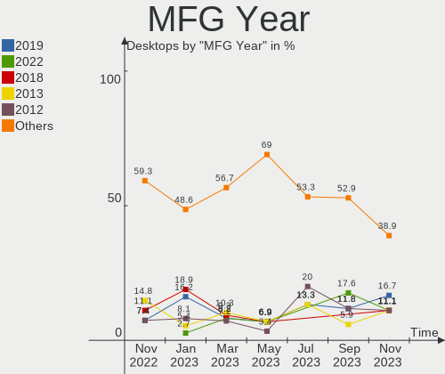
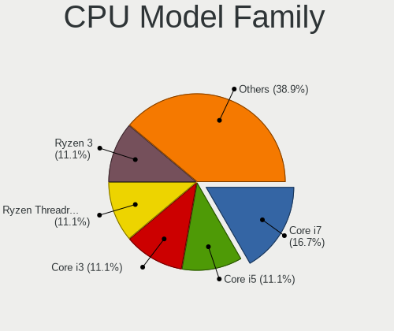
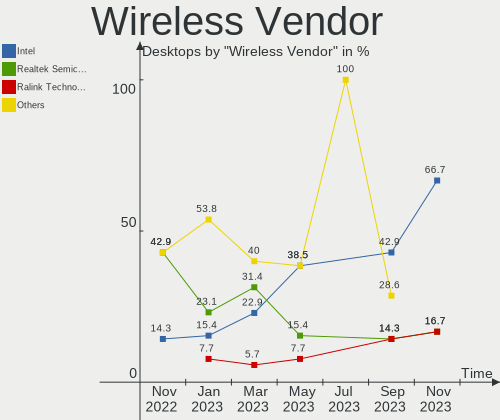

helloSystem Hardware Trends (Desktops)
--------------------------------------

A project to identify most popular hardware characteristics and track their change
over time based on data collected by helloSystem users at https://BSD-Hardware.info.

Anyone can contribute to this report by the [hw-probe](https://github.com/linuxhw/hw-probe/blob/master/INSTALL.BSD.md) tool:

    hw-probe -all -upload

Full-feature report is available here: https://bsd-hardware.info/?view=trends&formfactor=desktop

Period: Aug, 2021.

Contents
--------

* [ System ](#system)
  - [ OS                       ](#os)
  - [ OS Family                ](#os-family)
  - [ Arch                     ](#arch)
  - [ DE                       ](#de)
  - [ Display Server           ](#display-server)
  - [ Display Manager          ](#display-manager)
  - [ OS Lang                  ](#os-lang)
  - [ Boot Mode                ](#boot-mode)
  - [ Filesystem               ](#filesystem)
  - [ Part. scheme             ](#part-scheme)

* [ Board ](#board)
  - [ Vendor                   ](#vendor)
  - [ Model                    ](#model)
  - [ Model Family             ](#model-family)
  - [ MFG Year                 ](#mfg-year)
  - [ Form Factor              ](#form-factor)
  - [ Coreboot                 ](#coreboot)
  - [ RAM Size                 ](#ram-size)
  - [ RAM Used                 ](#ram-used)
  - [ Total Drives             ](#total-drives)
  - [ Has CD-ROM               ](#has-cd-rom)
  - [ Has Ethernet             ](#has-ethernet)
  - [ Has WiFi                 ](#has-wifi)
  - [ Has Bluetooth            ](#has-bluetooth)

* [ Location ](#location)
  - [ Country                  ](#country)
  - [ City                     ](#city)

* [ Drives ](#drives)
  - [ Drive Vendor             ](#drive-vendor)
  - [ Drive Model              ](#drive-model)
  - [ HDD Vendor               ](#hdd-vendor)
  - [ SSD Vendor               ](#ssd-vendor)
  - [ Drive Kind               ](#drive-kind)
  - [ Drive Connector          ](#drive-connector)
  - [ Drive Size               ](#drive-size)
  - [ Space Total              ](#space-total)
  - [ Space Used               ](#space-used)
  - [ Malfunc. Drives          ](#malfunc-drives)
  - [ Malfunc. Drive Vendor    ](#malfunc-drive-vendor)
  - [ Malfunc. HDD Vendor      ](#malfunc-hdd-vendor)
  - [ Malfunc. Drive Kind      ](#malfunc-drive-kind)
  - [ Failed Drives            ](#failed-drives)
  - [ Failed Drive Vendor      ](#failed-drive-vendor)
  - [ Drive Status             ](#drive-status)

* [ Storage controller ](#storage-controller)
  - [ Storage Vendor           ](#storage-vendor)
  - [ Storage Model            ](#storage-model)
  - [ Storage Kind             ](#storage-kind)

* [ Processor ](#processor)
  - [ CPU Vendor               ](#cpu-vendor)
  - [ CPU Model                ](#cpu-model)
  - [ CPU Model Family         ](#cpu-model-family)
  - [ CPU Cores                ](#cpu-cores)
  - [ CPU Sockets              ](#cpu-sockets)
  - [ CPU Threads              ](#cpu-threads)
  - [ CPU Microarch            ](#cpu-microarch)

* [ Graphics ](#graphics)
  - [ GPU Vendor               ](#gpu-vendor)
  - [ GPU Model                ](#gpu-model)
  - [ GPU Combo                ](#gpu-combo)
  - [ GPU Driver               ](#gpu-driver)
  - [ GPU Memory               ](#gpu-memory)

* [ Monitor ](#monitor)
  - [ Monitor Vendor           ](#monitor-vendor)
  - [ Monitor Model            ](#monitor-model)
  - [ Monitor Resolution       ](#monitor-resolution)
  - [ Monitor Diagonal         ](#monitor-diagonal)
  - [ Monitor Width            ](#monitor-width)
  - [ Aspect Ratio             ](#aspect-ratio)
  - [ Monitor Area             ](#monitor-area)
  - [ Pixel Density            ](#pixel-density)
  - [ Multiple Monitors        ](#multiple-monitors)

* [ Network ](#network)
  - [ Net Controller Vendor    ](#net-controller-vendor)
  - [ Net Controller Model     ](#net-controller-model)
  - [ Wireless Vendor          ](#wireless-vendor)
  - [ Wireless Model           ](#wireless-model)
  - [ Ethernet Vendor          ](#ethernet-vendor)
  - [ Ethernet Model           ](#ethernet-model)
  - [ Net Controller Kind      ](#net-controller-kind)
  - [ Used Controller          ](#used-controller)
  - [ NICs                     ](#nics)
  - [ IPv6                     ](#ipv6)

* [ Bluetooth ](#bluetooth)
  - [ Bluetooth Vendor         ](#bluetooth-vendor)
  - [ Bluetooth Model          ](#bluetooth-model)

* [ Sound ](#sound)
  - [ Sound Vendor             ](#sound-vendor)
  - [ Sound Model              ](#sound-model)

* [ Memory ](#memory)
  - [ Memory Vendor            ](#memory-vendor)
  - [ Memory Model             ](#memory-model)
  - [ Memory Kind              ](#memory-kind)
  - [ Memory Form Factor       ](#memory-form-factor)
  - [ Memory Size              ](#memory-size)
  - [ Memory Speed             ](#memory-speed)

* [ Printers & scanners ](#printers--scanners)
  - [ Printer Vendor           ](#printer-vendor)
  - [ Printer Model            ](#printer-model)
  - [ Scanner Vendor           ](#scanner-vendor)
  - [ Scanner Model            ](#scanner-model)

* [ Camera ](#camera)
  - [ Camera Vendor            ](#camera-vendor)
  - [ Camera Model             ](#camera-model)

* [ Security ](#security)
  - [ Fingerprint Vendor       ](#fingerprint-vendor)
  - [ Fingerprint Model        ](#fingerprint-model)
  - [ Chipcard Vendor          ](#chipcard-vendor)
  - [ Chipcard Model           ](#chipcard-model)

* [ Unsupported ](#unsupported)
  - [ Unsupported Devices      ](#unsupported-devices)
  - [ Unsupported Device Types ](#unsupported-device-types)

System
------

OS
--

Installed operating systems

| Name              | Desktops | Percent |
|-------------------|----------|---------|
| helloSystem 0.5.0 | 19       | 82.61%  |
| helloSystem 0.1.0 | 2        | 8.7%    |
| helloSystem 0.6.0 | 1        | 4.35%   |
| helloSystem 0.4.0 | 1        | 4.35%   |

OS Family
---------

OS without a version

| Name        | Desktops | Percent |
|-------------|----------|---------|
| helloSystem | 23       | 100%    |

Arch
----

OS architecture (x86_64, i586, etc.)

| Name  | Desktops | Percent |
|-------|----------|---------|
| amd64 | 23       | 100%    |

DE
--

Desktop Environment

| Name         | Desktops | Percent |
|--------------|----------|---------|
| helloDesktop | 23       | 100%    |

Display Server
--------------

X11 or Wayland

| Name | Desktops | Percent |
|------|----------|---------|
| X11  | 23       | 100%    |

Display Manager
---------------

SDDM, LightDM, etc.

| Name | Desktops | Percent |
|------|----------|---------|
| SLiM | 23       | 100%    |

OS Lang
-------

Language

| Lang  | Desktops | Percent |
|-------|----------|---------|
| en_US | 23       | 100%    |

Boot Mode
---------

EFI or BIOS

| Mode | Desktops | Percent |
|------|----------|---------|
| EFI  | 17       | 73.91%  |
| BIOS | 6        | 26.09%  |

Filesystem
----------

Type of filesystem

| Type | Desktops | Percent |
|------|----------|---------|
| Zfs  | 23       | 100%    |

Part. scheme
------------

Scheme of partitioning

| Type | Desktops | Percent |
|------|----------|---------|
| GPT  | 23       | 100%    |

Board
-----

Vendor
------

Motherboard manufacturer

| Name                | Desktops | Percent |
|---------------------|----------|---------|
| ASUSTek Computer    | 6        | 26.09%  |
| Gigabyte Technology | 4        | 17.39%  |
| Hewlett-Packard     | 2        | 8.7%    |
| Dell                | 2        | 8.7%    |
| Pegatron            | 1        | 4.35%   |
| PCPartner           | 1        | 4.35%   |
| Intel               | 1        | 4.35%   |
| HC                  | 1        | 4.35%   |
| Foxconn             | 1        | 4.35%   |
| EVGA                | 1        | 4.35%   |
| Biostar             | 1        | 4.35%   |
| ASRock              | 1        | 4.35%   |
| Acer                | 1        | 4.35%   |

Model
-----

Motherboard model

| Name                               | Desktops | Percent |
|------------------------------------|----------|---------|
| Pegatron SAISHIAT2                 | 1        | 4.35%   |
| PCPartner DREAMSYS                 | 1        | 4.35%   |
| Intel D54250WYK H13922-304         | 1        | 4.35%   |
| HP Z420 Workstation                | 1        | 4.35%   |
| HP Compaq dc5700 Small Form Factor | 1        | 4.35%   |
| HC HCAR357-MI                      | 1        | 4.35%   |
| Gigabyte HA65M-D2H-B3              | 1        | 4.35%   |
| Gigabyte H110-D3A                  | 1        | 4.35%   |
| Gigabyte B360M-D3H                 | 1        | 4.35%   |
| Gigabyte A75M-DS2                  | 1        | 4.35%   |
| Foxconn p6-2171a                   | 1        | 4.35%   |
| EVGA X299 MICRO                    | 1        | 4.35%   |
| Dell OptiPlex 3040                 | 1        | 4.35%   |
| Dell Inspiron 530                  | 1        | 4.35%   |
| Biostar A770E3                     | 1        | 4.35%   |
| ASUS TUF B360M-PLUS GAMING S       | 1        | 4.35%   |
| ASUS P7H55-M LX                    | 1        | 4.35%   |
| ASUS M5A78L LE                     | 1        | 4.35%   |
| ASUS Crosshair V Formula           | 1        | 4.35%   |
| ASUS All Series                    | 1        | 4.35%   |
| ASUS A58M-A/USB3                   | 1        | 4.35%   |
| ASRock Z390 Pro4                   | 1        | 4.35%   |
| Acer Aspire TC-895                 | 1        | 4.35%   |

Model Family
------------

Motherboard model prefix

| Name                  | Desktops | Percent |
|-----------------------|----------|---------|
| Pegatron SAISHIAT2    | 1        | 4.35%   |
| PCPartner DREAMSYS    | 1        | 4.35%   |
| Intel D54250WYK       | 1        | 4.35%   |
| HP Z420               | 1        | 4.35%   |
| HP Compaq             | 1        | 4.35%   |
| HC HCAR357-MI         | 1        | 4.35%   |
| Gigabyte HA65M-D2H-B3 | 1        | 4.35%   |
| Gigabyte H110-D3A     | 1        | 4.35%   |
| Gigabyte B360M-D3H    | 1        | 4.35%   |
| Gigabyte A75M-DS2     | 1        | 4.35%   |
| Foxconn p6-2171a      | 1        | 4.35%   |
| EVGA X299             | 1        | 4.35%   |
| Dell OptiPlex         | 1        | 4.35%   |
| Dell Inspiron         | 1        | 4.35%   |
| Biostar A770E3        | 1        | 4.35%   |
| ASUS TUF              | 1        | 4.35%   |
| ASUS P7H55-M          | 1        | 4.35%   |
| ASUS M5A78L           | 1        | 4.35%   |
| ASUS Crosshair        | 1        | 4.35%   |
| ASUS All              | 1        | 4.35%   |
| ASUS A58M-A           | 1        | 4.35%   |
| ASRock Z390           | 1        | 4.35%   |
| Acer Aspire           | 1        | 4.35%   |

MFG Year
--------

Motherboard manufacture year

| Year | Desktops | Percent |
|------|----------|---------|
| 2012 | 5        | 21.74%  |
| 2020 | 3        | 13.04%  |
| 2013 | 3        | 13.04%  |
| 2021 | 2        | 8.7%    |
| 2018 | 2        | 8.7%    |
| 2017 | 2        | 8.7%    |
| 2011 | 2        | 8.7%    |
| 2019 | 1        | 4.35%   |
| 2015 | 1        | 4.35%   |
| 2010 | 1        | 4.35%   |
| 2009 | 1        | 4.35%   |

Form Factor
-----------

Physical design of the computer

| Name    | Desktops | Percent |
|---------|----------|---------|
| Desktop | 23       | 100%    |

Coreboot
--------

Have coreboot on board

| Used | Desktops | Percent |
|------|----------|---------|
| No   | 23       | 100%    |

RAM Size
--------

Total RAM memory

| Size in GB | Desktops | Percent |
|------------|----------|---------|
| 4.01-8.0   | 7        | 30.43%  |
| 8.01-16.0  | 7        | 30.43%  |
| 16.01-24.0 | 6        | 26.09%  |
| 32.01-64.0 | 3        | 13.04%  |

RAM Used
--------

Used RAM memory

| Used GB  | Desktops | Percent |
|----------|----------|---------|
| 0.01-0.5 | 11       | 47.83%  |
| 1.01-2.0 | 6        | 26.09%  |
| 0.51-1.0 | 5        | 21.74%  |
| 4.01-8.0 | 1        | 4.35%   |

Total Drives
------------

Number of drives on board

| Drives | Desktops | Percent |
|--------|----------|---------|
| 1      | 12       | 52.17%  |
| 2      | 4        | 17.39%  |
| 4      | 2        | 8.7%    |
| 3      | 2        | 8.7%    |
| 0      | 2        | 8.7%    |
| 6      | 1        | 4.35%   |

Has CD-ROM
----------

Has CD-ROM on board

| Presented | Desktops | Percent |
|-----------|----------|---------|
| No        | 12       | 52.17%  |
| Yes       | 11       | 47.83%  |

Has Ethernet
------------

Has Ethernet on board

| Presented | Desktops | Percent |
|-----------|----------|---------|
| Yes       | 22       | 95.65%  |
| No        | 1        | 4.35%   |

Has WiFi
--------

Has WiFi module

| Presented | Desktops | Percent |
|-----------|----------|---------|
| No        | 17       | 73.91%  |
| Yes       | 6        | 26.09%  |

Has Bluetooth
-------------

Has Bluetooth module

| Presented | Desktops | Percent |
|-----------|----------|---------|
| No        | 16       | 69.57%  |
| Yes       | 7        | 30.43%  |

Location
--------

Country
-------

Geographic location (country)

| Country     | Desktops | Percent |
|-------------|----------|---------|
| USA         | 6        | 26.09%  |
| South Korea | 2        | 8.7%    |
| Russia      | 2        | 8.7%    |
| Mexico      | 2        | 8.7%    |
| Canada      | 2        | 8.7%    |
| Australia   | 2        | 8.7%    |
| Hong Kong   | 1        | 4.35%   |
| France      | 1        | 4.35%   |
| Finland     | 1        | 4.35%   |
| Chile       | 1        | 4.35%   |
| Brazil      | 1        | 4.35%   |
| Belarus     | 1        | 4.35%   |
| Argentina   | 1        | 4.35%   |

City
----

Geographic location (city)

| City            | Desktops | Percent |
|-----------------|----------|---------|
| Brisbane        | 2        | 8.7%    |
| Vawkavysk       | 1        | 4.35%   |
| Tula de Allende | 1        | 4.35%   |
| St Petersburg   | 1        | 4.35%   |
| Simpsonville    | 1        | 4.35%   |
| S??o Paulo      | 1        | 4.35%   |
| North Vancouver | 1        | 4.35%   |
| Mokpo           | 1        | 4.35%   |
| Minneapolis     | 1        | 4.35%   |
| Miami           | 1        | 4.35%   |
| Marlborough     | 1        | 4.35%   |
| Mar del Plata   | 1        | 4.35%   |
| Kitchener       | 1        | 4.35%   |
| Kazan?ˆ™        | 1        | 4.35%   |
| Hong Kong       | 1        | 4.35%   |
| Helsinki        | 1        | 4.35%   |
| Gwangju         | 1        | 4.35%   |
| Concepci??n     | 1        | 4.35%   |
| Cleveland       | 1        | 4.35%   |
| Chicago         | 1        | 4.35%   |
| Cabo San Lucas  | 1        | 4.35%   |
| Blois           | 1        | 4.35%   |

Drives
------

Drive Vendor
------------

Hard drive vendors

| Vendor              | Desktops | Drives | Percent |
|---------------------|----------|--------|---------|
| WDC                 | 8        | 9      | 22.86%  |
| Seagate             | 8        | 10     | 22.86%  |
| Samsung Electronics | 5        | 6      | 14.29%  |
| Toshiba             | 2        | 2      | 5.71%   |
| A-DATA Technology   | 2        | 3      | 5.71%   |
| SPCC                | 1        | 1      | 2.86%   |
| Silicon Motion      | 1        | 1      | 2.86%   |
| SanDisk             | 1        | 1      | 2.86%   |
| ORICO               | 1        | 2      | 2.86%   |
| LSI                 | 1        | 1      | 2.86%   |
| Kingston            | 1        | 1      | 2.86%   |
| Hitachi             | 1        | 1      | 2.86%   |
| HGST                | 1        | 1      | 2.86%   |
| Fujitsu             | 1        | 1      | 2.86%   |
| Crucial             | 1        | 1      | 2.86%   |

Drive Model
-----------

Hard drive models

| Model                               | Desktops | Percent |
|-------------------------------------|----------|---------|
| Seagate ST3250318AS 250GB           | 2        | 5.13%   |
| WDC WD5000BEVT-22ZAT0 500GB         | 1        | 2.56%   |
| WDC WD5000AAVS-00ZTB0 500GB         | 1        | 2.56%   |
| WDC WD5000AAKX-00ERMA0 500GB        | 1        | 2.56%   |
| WDC WD40EZRZ-22GXCB0 4TB            | 1        | 2.56%   |
| WDC WD40EFRX-68WT0N0 4TB            | 1        | 2.56%   |
| WDC WD3200AAJS-00L7A0 320GB         | 1        | 2.56%   |
| WDC WD20EARS-00MVWB0 2TB            | 1        | 2.56%   |
| WDC WD10SPZX-22Z10T0 1TB            | 1        | 2.56%   |
| WDC WD10EARS-00Y5B1 1TB             | 1        | 2.56%   |
| Toshiba MQ01ABF050M 500GB           | 1        | 2.56%   |
| Toshiba MG04ACA200E 2TB             | 1        | 2.56%   |
| SPCC Solid State Disk 64GB          | 1        | 2.56%   |
| Silicon Motion ShiJi 256GB M.2-NVMe | 1        | 2.56%   |
| Seagate ST750LM022 HN-M750MBB 752GB | 1        | 2.56%   |
| Seagate ST500LM012 HN-M500MBB 500GB | 1        | 2.56%   |
| Seagate ST500DM002-1BD142 500GB     | 1        | 2.56%   |
| Seagate ST31000528AS 1TB            | 1        | 2.56%   |
| Seagate ST31000340NS 1TB            | 1        | 2.56%   |
| Seagate ST2000DM001-1CH164 2TB      | 1        | 2.56%   |
| Seagate ST1000DM003-1ER162 1TB      | 1        | 2.56%   |
| SanDisk SDSSDA240G 240GB            | 1        | 2.56%   |
| Samsung SSD 980 PRO 250GB           | 1        | 2.56%   |
| Samsung SSD 970 EVO 500GB           | 1        | 2.56%   |
| Samsung SSD 960 PRO 512GB           | 1        | 2.56%   |
| Samsung SSD 860 EVO 250GB           | 1        | 2.56%   |
| Samsung SSD 850 PRO 256GB           | 1        | 2.56%   |
| Samsung MZVLW256HEHP-000L7 256GB    | 1        | 2.56%   |
| ORICO H110-120GB-PU-EP              | 1        | 2.56%   |
| LSI Logical Volume 997GB            | 1        | 2.56%   |
| Kingston SV300S37A120G 120GB        | 1        | 2.56%   |
| Hitachi HDS721050CLA362 500GB       | 1        | 2.56%   |
| HGST HTS545032A7E380 320GB          | 1        | 2.56%   |
| Fujitsu MHZ2250BH G1 250GB          | 1        | 2.56%   |
| Crucial CT120BX500SSD1 120GB        | 1        | 2.56%   |
| A-DATA SX8200PNP 512GB              | 1        | 2.56%   |
| A-DATA SX8200PNP 256GB              | 1        | 2.56%   |
| A-DATA SU650 120GB                  | 1        | 2.56%   |

HDD Vendor
----------

Hard disk drive vendors

| Vendor  | Desktops | Drives | Percent |
|---------|----------|--------|---------|
| WDC     | 8        | 9      | 36.36%  |
| Seagate | 8        | 10     | 36.36%  |
| Toshiba | 2        | 2      | 9.09%   |
| LSI     | 1        | 1      | 4.55%   |
| Hitachi | 1        | 1      | 4.55%   |
| HGST    | 1        | 1      | 4.55%   |
| Fujitsu | 1        | 1      | 4.55%   |

SSD Vendor
----------

Solid state drive vendors

| Vendor              | Desktops | Drives | Percent |
|---------------------|----------|--------|---------|
| Samsung Electronics | 2        | 2      | 25%     |
| SPCC                | 1        | 1      | 12.5%   |
| SanDisk             | 1        | 1      | 12.5%   |
| ORICO               | 1        | 2      | 12.5%   |
| Kingston            | 1        | 1      | 12.5%   |
| Crucial             | 1        | 1      | 12.5%   |
| A-DATA Technology   | 1        | 1      | 12.5%   |

Drive Kind
----------

HDD or SSD

| Kind | Desktops | Drives | Percent |
|------|----------|--------|---------|
| HDD  | 16       | 25     | 55.17%  |
| SSD  | 7        | 9      | 24.14%  |
| NVMe | 6        | 7      | 20.69%  |

Drive Connector
---------------

SATA, SAS, NVMe, etc.

| Type | Desktops | Drives | Percent |
|------|----------|--------|---------|
| SATA | 20       | 34     | 76.92%  |
| NVMe | 6        | 7      | 23.08%  |

Drive Size
----------

Size of hard drive

| Size in TB | Desktops | Drives | Percent |
|------------|----------|--------|---------|
| 0.01-0.5   | 17       | 22     | 60.71%  |
| 0.51-1.0   | 6        | 7      | 21.43%  |
| 1.01-2.0   | 3        | 3      | 10.71%  |
| 3.01-4.0   | 2        | 2      | 7.14%   |

Space Total
-----------

Amount of disk space available on the file system

| Size in GB | Desktops | Percent |
|------------|----------|---------|
| 1-20       | 17       | 73.91%  |
| 501-1000   | 3        | 13.04%  |
| 101-250    | 2        | 8.7%    |
| 1001-2000  | 1        | 4.35%   |

Space Used
----------

Amount of used disk space

| Used GB | Desktops | Percent |
|---------|----------|---------|
| 1-20    | 23       | 100%    |

Malfunc. Drives
---------------

Drive models with a malfunction

| Model                               | Desktops | Drives | Percent |
|-------------------------------------|----------|--------|---------|
| WDC WD5000AAKX-00ERMA0 500GB        | 1        | 1      | 10%     |
| WDC WD40EFRX-68WT0N0 4TB            | 1        | 1      | 10%     |
| WDC WD3200AAJS-00L7A0 320GB         | 1        | 1      | 10%     |
| WDC WD20EARS-00MVWB0 2TB            | 1        | 1      | 10%     |
| WDC WD10EARS-00Y5B1 1TB             | 1        | 1      | 10%     |
| Seagate ST750LM022 HN-M750MBB 752GB | 1        | 1      | 10%     |
| Seagate ST3250318AS 250GB           | 1        | 1      | 10%     |
| Hitachi HDS721050CLA362 500GB       | 1        | 1      | 10%     |
| HGST HTS545032A7E380 320GB          | 1        | 1      | 10%     |
| Fujitsu MHZ2250BH G1 250GB          | 1        | 1      | 10%     |

Malfunc. Drive Vendor
---------------------

Vendors of faulty drives

| Vendor  | Desktops | Drives | Percent |
|---------|----------|--------|---------|
| WDC     | 5        | 5      | 50%     |
| Seagate | 2        | 2      | 20%     |
| Hitachi | 1        | 1      | 10%     |
| HGST    | 1        | 1      | 10%     |
| Fujitsu | 1        | 1      | 10%     |

Malfunc. HDD Vendor
-------------------

Vendors of faulty HDD drives

| Vendor  | Desktops | Drives | Percent |
|---------|----------|--------|---------|
| WDC     | 5        | 5      | 50%     |
| Seagate | 2        | 2      | 20%     |
| Hitachi | 1        | 1      | 10%     |
| HGST    | 1        | 1      | 10%     |
| Fujitsu | 1        | 1      | 10%     |

Malfunc. Drive Kind
-------------------

Kinds of faulty drives

| Kind | Desktops | Drives | Percent |
|------|----------|--------|---------|
| HDD  | 8        | 10     | 100%    |

Failed Drives
-------------

Failed drive models

Zero info for selected period =(

Failed Drive Vendor
-------------------

Failed drive vendors

Zero info for selected period =(

Drive Status
------------

Number of failed and malfunc. drives

| Status   | Desktops | Drives | Percent |
|----------|----------|--------|---------|
| Works    | 16       | 26     | 61.54%  |
| Malfunc  | 8        | 10     | 30.77%  |
| Detected | 2        | 5      | 7.69%   |

Storage controller
------------------

Storage Vendor
--------------

Storage controller vendors

| Vendor                   | Desktops | Percent |
|--------------------------|----------|---------|
| Intel                    | 17       | 51.52%  |
| AMD                      | 6        | 18.18%  |
| Samsung Electronics      | 4        | 12.12%  |
| Silicon Motion           | 1        | 3.03%   |
| Marvell Technology Group | 1        | 3.03%   |
| Broadcom / LSI           | 1        | 3.03%   |
| ASMedia Technology       | 1        | 3.03%   |
| ADATA Technology         | 1        | 3.03%   |
| Adaptec                  | 1        | 3.03%   |

Storage Model
-------------

Storage controller models

| Model                                                                                   | Desktops | Percent |
|-----------------------------------------------------------------------------------------|----------|---------|
| Intel Cannon Lake PCH SATA AHCI Controller                                              | 3        | 7.14%   |
| AMD SB7x0/SB8x0/SB9x0 IDE Controller                                                    | 3        | 7.14%   |
| Samsung NVMe SSD Controller SM961/PM961/SM963                                           | 2        | 4.76%   |
| Intel Q170/Q150/B150/H170/H110/Z170/CM236 Chipset SATA Controller [AHCI Mode]           | 2        | 4.76%   |
| Intel 8 Series/C220 Series Chipset Family 6-port SATA Controller 1 [AHCI mode]          | 2        | 4.76%   |
| AMD SB7x0/SB8x0/SB9x0 SATA Controller [IDE mode]                                        | 2        | 4.76%   |
| AMD FCH SATA Controller [AHCI mode]                                                     | 2        | 4.76%   |
| Silicon Motion SM2263EN/SM2263XT SSD Controller                                         | 1        | 2.38%   |
| Samsung NVMe SSD Controller SM981/PM981/PM983                                           | 1        | 2.38%   |
| Samsung NVMe SSD Controller PM9A1/PM9A3/980PRO                                          | 1        | 2.38%   |
| Marvell Group 88SE9172 SATA III 6Gb/s RAID Controller                                   | 1        | 2.38%   |
| Intel C602 chipset 4-Port SATA Storage Control Unit                                     | 1        | 2.38%   |
| Intel C600/X79 series chipset SATA RAID Controller                                      | 1        | 2.38%   |
| Intel C600/X79 series chipset IDE-r Controller                                          | 1        | 2.38%   |
| Intel 82801IR/IO/IH (ICH9R/DO/DH) 4 port SATA Controller [IDE mode]                     | 1        | 2.38%   |
| Intel 82801I (ICH9 Family) 2 port SATA Controller [IDE mode]                            | 1        | 2.38%   |
| Intel 82801HR/HO/HH (ICH8R/DO/DH) 2 port SATA Controller [IDE mode]                     | 1        | 2.38%   |
| Intel 82801H (ICH8 Family) 4 port SATA Controller [IDE mode]                            | 1        | 2.38%   |
| Intel 8 Series SATA Controller 1 [AHCI mode]                                            | 1        | 2.38%   |
| Intel 7 Series Chipset Family 6-port SATA Controller [AHCI mode]                        | 1        | 2.38%   |
| Intel 6 Series/C200 Series Chipset Family Desktop SATA Controller (IDE mode, ports 4-5) | 1        | 2.38%   |
| Intel 6 Series/C200 Series Chipset Family Desktop SATA Controller (IDE mode, ports 0-3) | 1        | 2.38%   |
| Intel 6 Series/C200 Series Chipset Family 6 port Desktop SATA AHCI Controller           | 1        | 2.38%   |
| Intel 5 Series/3400 Series Chipset 4 port SATA IDE Controller                           | 1        | 2.38%   |
| Intel 5 Series/3400 Series Chipset 2 port SATA IDE Controller                           | 1        | 2.38%   |
| Intel 300 Series Chipset Family SATA RAID Controller                                    | 1        | 2.38%   |
| Intel 200 Series PCH SATA controller [AHCI mode]                                        | 1        | 2.38%   |
| Broadcom / LSI SAS2008 PCI-Express Fusion-MPT SAS-2 [Falcon]                            | 1        | 2.38%   |
| ASMedia ASM1062 Serial ATA Controller                                                   | 1        | 2.38%   |
| AMD SB7x0/SB8x0/SB9x0 SATA Controller [RAID5 mode]                                      | 1        | 2.38%   |
| AMD FCH SATA Controller [IDE mode]                                                      | 1        | 2.38%   |
| ADATA XPG SX8200 Pro PCIe Gen3x4 M.2 2280 Solid State Drive                             | 1        | 2.38%   |
| Adaptec AIC-7850T/7856T [AVA-2902/4/6 / AHA-2910]                                       | 1        | 2.38%   |

Storage Kind
------------

Kind of storage controller (IDE, SATA, NVMe, SAS, ...)

| Kind | Desktops | Percent |
|------|----------|---------|
| SATA | 14       | 40%     |
| IDE  | 9        | 25.71%  |
| NVMe | 6        | 17.14%  |
| RAID | 3        | 8.57%   |
| SAS  | 2        | 5.71%   |
| SCSI | 1        | 2.86%   |

Processor
---------

CPU Vendor
----------

Processor vendors

| Vendor | Desktops | Percent |
|--------|----------|---------|
| Intel  | 17       | 73.91%  |
| AMD    | 6        | 26.09%  |

CPU Model
---------

Processor models

| Model                                         | Desktops | Percent |
|-----------------------------------------------|----------|---------|
| Intel Xeon CPU E5-1603 @ 2.80GHz              | 1        | 4.35%   |
| Intel Pentium Gold G5400 CPU @ 3.70GHz        | 1        | 4.35%   |
| Intel Pentium Dual-Core CPU E5500 @ 2.80GHz   | 1        | 4.35%   |
| Intel Pentium CPU G3420 @ 3.20GHz             | 1        | 4.35%   |
| Intel Core i9-7920X CPU @ 2.90GHz             | 1        | 4.35%   |
| Intel Core i7-8700K CPU @ 3.70GHz             | 1        | 4.35%   |
| Intel Core i5-4440 CPU @ 3.10GHz              | 1        | 4.35%   |
| Intel Core i5-4250U CPU @ 1.30GHz             | 1        | 4.35%   |
| Intel Core i5-3450 CPU @ 3.10GHz              | 1        | 4.35%   |
| Intel Core i5-2400S CPU                       | 1        | 4.35%   |
| Intel Core i5-10400 CPU @ 2.90GHz             | 1        | 4.35%   |
| Intel Core i5 CPU 661 @ 3.33GHz               | 1        | 4.35%   |
| Intel Core i3-8100 CPU @ 3.60GHz              | 1        | 4.35%   |
| Intel Core i3-6100T CPU @ 3.20GHz             | 1        | 4.35%   |
| Intel Core 2 Duo CPU E4500 @ 2.20GHz          | 1        | 4.35%   |
| Intel Celeron CPU G3930 @ 2.90GHz             | 1        | 4.35%   |
| Intel Celeron CPU 1037U @ 1.80GHz             | 1        | 4.35%   |
| AMD Ryzen 5 3550H with Radeon Vega Mobile Gfx | 1        | 4.35%   |
| AMD Phenom II X4 965 Processor                | 1        | 4.35%   |
| AMD Phenom II X4 955 Processor                | 1        | 4.35%   |
| AMD FX-8150 Eight-Core Processor              | 1        | 4.35%   |
| AMD Athlon II X4 641 Quad-Core Processor      | 1        | 4.35%   |
| AMD A6-6400K APU with Radeon HD Graphics      | 1        | 4.35%   |

CPU Model Family
----------------

Processor model prefix

| Model                   | Desktops | Percent |
|-------------------------|----------|---------|
| Intel Core i5           | 6        | 26.09%  |
| Intel Core i3           | 2        | 8.7%    |
| Intel Celeron           | 2        | 8.7%    |
| AMD Phenom II X4        | 2        | 8.7%    |
| Intel Xeon              | 1        | 4.35%   |
| Intel Pentium Gold      | 1        | 4.35%   |
| Intel Pentium Dual-Core | 1        | 4.35%   |
| Intel Pentium           | 1        | 4.35%   |
| Intel Core i9           | 1        | 4.35%   |
| Intel Core i7           | 1        | 4.35%   |
| Intel Core 2 Duo        | 1        | 4.35%   |
| AMD Ryzen 5             | 1        | 4.35%   |
| AMD FX                  | 1        | 4.35%   |
| AMD Athlon II X4        | 1        | 4.35%   |
| AMD A6                  | 1        | 4.35%   |

CPU Cores
---------

Number of processor cores

| Number | Desktops | Percent |
|--------|----------|---------|
| 4      | 9        | 39.13%  |
| 2      | 9        | 39.13%  |
| 8      | 2        | 8.7%    |
| 6      | 2        | 8.7%    |
| 12     | 1        | 4.35%   |

CPU Sockets
-----------

Number of sockets

| Number | Desktops | Percent |
|--------|----------|---------|
| 1      | 22       | 95.65%  |
| 2      | 1        | 4.35%   |

CPU Threads
-----------

Threads per core (Hyper-Threading)

| Number | Desktops | Percent |
|--------|----------|---------|
| 1      | 16       | 69.57%  |
| 2      | 7        | 30.43%  |

CPU Microarch
-------------

Microarchitecture

| Name        | Desktops | Percent |
|-------------|----------|---------|
| KabyLake    | 4        | 17.39%  |
| Haswell     | 3        | 13.04%  |
| Skylake     | 2        | 8.7%    |
| SandyBridge | 2        | 8.7%    |
| K10         | 2        | 8.7%    |
| IvyBridge   | 2        | 8.7%    |
| Zen+        | 1        | 4.35%   |
| Westmere    | 1        | 4.35%   |
| Piledriver  | 1        | 4.35%   |
| Penryn      | 1        | 4.35%   |
| K10 Llano   | 1        | 4.35%   |
| Core        | 1        | 4.35%   |
| CometLake   | 1        | 4.35%   |
| Bulldozer   | 1        | 4.35%   |

Graphics
--------

GPU Vendor
----------

Vendors of graphics cards

| Vendor | Desktops | Percent |
|--------|----------|---------|
| Nvidia | 11       | 44%     |
| Intel  | 7        | 28%     |
| AMD    | 7        | 28%     |

GPU Model
---------

Graphics card models

| Model                                                               | Desktops | Percent |
|---------------------------------------------------------------------|----------|---------|
| Nvidia GP108 [GeForce GT 1030]                                      | 2        | 8%      |
| Nvidia GT218 [GeForce 210]                                          | 1        | 4%      |
| Nvidia GP107 [GeForce GTX 1050 Ti]                                  | 1        | 4%      |
| Nvidia GM204 [GeForce GTX 970]                                      | 1        | 4%      |
| Nvidia GK208 [GeForce GT 630 Rev. 2]                                | 1        | 4%      |
| Nvidia GK107 [GeForce GT 640]                                       | 1        | 4%      |
| Nvidia GK106GL [Quadro K4000]                                       | 1        | 4%      |
| Nvidia GF108 [GeForce GT 530]                                       | 1        | 4%      |
| Nvidia G96C [GeForce 9500 GT]                                       | 1        | 4%      |
| Nvidia G84 [GeForce 8600 GT]                                        | 1        | 4%      |
| Intel HD Graphics 530                                               | 1        | 4%      |
| Intel Haswell-ULT Integrated Graphics Controller                    | 1        | 4%      |
| Intel CometLake-S GT2 [UHD Graphics 630]                            | 1        | 4%      |
| Intel CoffeeLake-S GT1 [UHD Graphics 610]                           | 1        | 4%      |
| Intel 82Q963/Q965 Integrated Graphics Controller                    | 1        | 4%      |
| Intel 82G33/G31 Express Integrated Graphics Controller              | 1        | 4%      |
| Intel 3rd Gen Core processor Graphics Controller                    | 1        | 4%      |
| AMD Turks PRO [Radeon HD 6570/7570/8550 / R5 230]                   | 1        | 4%      |
| AMD Tahiti XT [Radeon HD 7970/8970 OEM / R9 280X]                   | 1        | 4%      |
| AMD Richland [Radeon HD 8470D]                                      | 1        | 4%      |
| AMD Picasso                                                         | 1        | 4%      |
| AMD Ellesmere [Radeon RX 470/480/570/570X/580/580X/590]             | 1        | 4%      |
| AMD Caicos PRO [Radeon HD 7450]                                     | 1        | 4%      |
| AMD Baffin [Radeon RX 460/560D / Pro 450/455/460/555/555X/560/560X] | 1        | 4%      |

GPU Combo
---------

Combinations of graphics cards

| Name        | Desktops | Percent |
|-------------|----------|---------|
| 1 x Nvidia  | 11       | 47.83%  |
| 1 x Intel   | 5        | 21.74%  |
| 1 x AMD     | 5        | 21.74%  |
| Intel + AMD | 2        | 8.7%    |

GPU Driver
----------

Free vs proprietary

| Driver      | Desktops | Percent |
|-------------|----------|---------|
| Free        | 15       | 65.22%  |
| Proprietary | 8        | 34.78%  |

GPU Memory
----------

Total video memory

| Size in GB | Desktops | Percent |
|------------|----------|---------|
| Unknown    | 10       | 43.48%  |
| 1.01-2.0   | 4        | 17.39%  |
| 3.01-4.0   | 3        | 13.04%  |
| 0.51-1.0   | 3        | 13.04%  |
| 7.01-8.0   | 1        | 4.35%   |
| 2.01-3.0   | 1        | 4.35%   |
| 0.01-0.5   | 1        | 4.35%   |

Monitor
-------

Monitor Vendor
--------------

Monitor vendors

| Vendor              | Desktops | Percent |
|---------------------|----------|---------|
| Samsung Electronics | 5        | 27.78%  |
| Hewlett-Packard     | 3        | 16.67%  |
| Dell                | 3        | 16.67%  |
| Goldstar            | 2        | 11.11%  |
| Vizio               | 1        | 5.56%   |
| Lenovo              | 1        | 5.56%   |
| BenQ                | 1        | 5.56%   |
| ALP                 | 1        | 5.56%   |
| Acer                | 1        | 5.56%   |

Monitor Model
-------------

Monitor models

| Model                                                                 | Desktops | Percent |
|-----------------------------------------------------------------------|----------|---------|
| Vizio D32f-F1 VIZ1027 1920x1080 700x390mm 31.5-inch                   | 1        | 5.56%   |
| Samsung Electronics SyncMaster SAM03D7 1680x1050 470x300mm 22.0-inch  | 1        | 5.56%   |
| Samsung Electronics SyncMaster SAM0320 1680x1050 470x300mm 22.0-inch  | 1        | 5.56%   |
| Samsung Electronics SyncMaster SAM021E 1680x1050 430x270mm 20.0-inch  | 1        | 5.56%   |
| Samsung Electronics SE790C SAM0C62 2560x1080 700x310mm 30.1-inch      | 1        | 5.56%   |
| Samsung Electronics LCD Monitor SAM0D3B 3840x2160 890x500mm 40.2-inch | 1        | 5.56%   |
| Lenovo LEN X24A LEN60CF 1920x1080 530x300mm 24.0-inch                 | 1        | 5.56%   |
| Hewlett-Packard w20 HWP26AB 1680x1050 430x270mm 20.0-inch             | 1        | 5.56%   |
| Hewlett-Packard 27er HWP3325 1920x1080 600x340mm 27.2-inch            | 1        | 5.56%   |
| Hewlett-Packard 2310 HWP288F 1920x1080 510x290mm 23.1-inch            | 1        | 5.56%   |
| Goldstar LG HDR QHD GSM5B95 2560x1440 700x390mm 31.5-inch             | 1        | 5.56%   |
| Goldstar 19M35 GSM4C24 1366x768 410x230mm 18.5-inch                   | 1        | 5.56%   |
| Dell SP2309W DELD01C 2048x1152 510x290mm 23.1-inch                    | 1        | 5.56%   |
| Dell E207WFP DELD010 1680x1050 430x270mm 20.0-inch                    | 1        | 5.56%   |
| Dell E196FP DELA015 1280x1024 340x270mm 17.1-inch                     | 1        | 5.56%   |
| BenQ GL2460 BNQ78CE 1920x1080 530x300mm 24.0-inch                     | 1        | 5.56%   |
| ALP 2476 IPS ALP2476 1920x1080 530x300mm 24.0-inch                    | 1        | 5.56%   |
| Acer ET430K ACR0558 3840x2160 940x530mm 42.5-inch                     | 1        | 5.56%   |

Monitor Resolution
------------------

Monitor screen resolution

| Resolution         | Desktops | Percent |
|--------------------|----------|---------|
| 1920x1080 (FHD)    | 6        | 33.33%  |
| 1680x1050 (WSXGA+) | 5        | 27.78%  |
| 3840x2160 (4K)     | 2        | 11.11%  |
| 2560x1440 (QHD)    | 1        | 5.56%   |
| 2560x1080          | 1        | 5.56%   |
| 2048x1152          | 1        | 5.56%   |
| 1366x768 (WXGA)    | 1        | 5.56%   |
| 1280x1024 (SXGA)   | 1        | 5.56%   |

Monitor Diagonal
----------------

Diagonal size in inches

| Inches | Desktops | Percent |
|--------|----------|---------|
| 24     | 3        | 16.67%  |
| 20     | 3        | 16.67%  |
| 31     | 2        | 11.11%  |
| 23     | 2        | 11.11%  |
| 22     | 2        | 11.11%  |
| 42     | 1        | 5.56%   |
| 40     | 1        | 5.56%   |
| 30     | 1        | 5.56%   |
| 27     | 1        | 5.56%   |
| 18     | 1        | 5.56%   |
| 17     | 1        | 5.56%   |

Monitor Width
-------------

Physical width

| Width in mm | Desktops | Percent |
|-------------|----------|---------|
| 501-600     | 6        | 33.33%  |
| 401-500     | 6        | 33.33%  |
| 601-700     | 3        | 16.67%  |
| 801-900     | 1        | 5.56%   |
| 301-350     | 1        | 5.56%   |
| 901-1000    | 1        | 5.56%   |

Aspect Ratio
------------

Proportional relationship between the width and the height

| Ratio | Desktops | Percent |
|-------|----------|---------|
| 16/9  | 11       | 61.11%  |
| 16/10 | 5        | 27.78%  |
| 5/4   | 1        | 5.56%   |
| 21/9  | 1        | 5.56%   |

Monitor Area
------------

Area in inch²

| Area in inch² | Desktops | Percent |
|----------------|----------|---------|
| 201-250        | 7        | 38.89%  |
| 151-200        | 3        | 16.67%  |
| 351-500        | 2        | 11.11%  |
| 301-350        | 2        | 11.11%  |
| 141-150        | 2        | 11.11%  |
| 501-1000       | 2        | 11.11%  |

Pixel Density
-------------

Pixels per inch

| Density | Desktops | Percent |
|---------|----------|---------|
| 51-100  | 14       | 82.35%  |
| 101-120 | 3        | 17.65%  |

Multiple Monitors
-----------------

Total monitors connected

| Total | Desktops | Percent |
|-------|----------|---------|
| 1     | 17       | 73.91%  |
| 0     | 5        | 21.74%  |
| 2     | 1        | 4.35%   |

Network
-------

Net Controller Vendor
---------------------

Controller vendors

| Vendor                | Desktops | Percent |
|-----------------------|----------|---------|
| Realtek Semiconductor | 13       | 48.15%  |
| Intel                 | 8        | 29.63%  |
| Broadcom              | 3        | 11.11%  |
| Ralink                | 1        | 3.7%    |
| Qualcomm Atheros      | 1        | 3.7%    |
| Mellanox Technologies | 1        | 3.7%    |

Net Controller Model
--------------------

Controller models

| Model                                                             | Desktops | Percent |
|-------------------------------------------------------------------|----------|---------|
| Realtek RTL8111/8168/8411 PCI Express Gigabit Ethernet Controller | 13       | 44.83%  |
| Intel Ethernet Connection (7) I219-V                              | 3        | 10.34%  |
| Realtek RTL8821CE 802.11ac PCIe Wireless Network Adapter          | 1        | 3.45%   |
| Realtek RTL8188CE 802.11b/g/n WiFi Adapter                        | 1        | 3.45%   |
| Ralink RT5392 PCIe Wireless Network Adapter                       | 1        | 3.45%   |
| Qualcomm Atheros QCA9565 / AR9565 Wireless Network Adapter        | 1        | 3.45%   |
| Mellanox MT27500 Family [ConnectX-3]                              | 1        | 3.45%   |
| Intel Wi-Fi 6 AX200                                               | 1        | 3.45%   |
| Intel Ethernet Connection I218-V                                  | 1        | 3.45%   |
| Intel 82583V Gigabit Network Connection                           | 1        | 3.45%   |
| Intel 82579LM Gigabit Network Connection (Lewisville)             | 1        | 3.45%   |
| Intel 82562V-2 10/100 Network Connection                          | 1        | 3.45%   |
| Broadcom NetXtreme BCM5755 Gigabit Ethernet PCI Express           | 1        | 3.45%   |
| Broadcom NetXtreme BCM5705_2 Gigabit Ethernet                     | 1        | 3.45%   |
| Broadcom BCM4352 802.11ac Wireless Network Adapter                | 1        | 3.45%   |

Wireless Vendor
---------------

Wireless vendors

| Vendor                | Desktops | Percent |
|-----------------------|----------|---------|
| Realtek Semiconductor | 2        | 33.33%  |
| Ralink                | 1        | 16.67%  |
| Qualcomm Atheros      | 1        | 16.67%  |
| Intel                 | 1        | 16.67%  |
| Broadcom              | 1        | 16.67%  |

Wireless Model
--------------

Wireless models

| Model                                                      | Desktops | Percent |
|------------------------------------------------------------|----------|---------|
| Realtek RTL8821CE 802.11ac PCIe Wireless Network Adapter   | 1        | 16.67%  |
| Realtek RTL8188CE 802.11b/g/n WiFi Adapter                 | 1        | 16.67%  |
| Ralink RT5392 PCIe Wireless Network Adapter                | 1        | 16.67%  |
| Qualcomm Atheros QCA9565 / AR9565 Wireless Network Adapter | 1        | 16.67%  |
| Intel Wi-Fi 6 AX200                                        | 1        | 16.67%  |
| Broadcom BCM4352 802.11ac Wireless Network Adapter         | 1        | 16.67%  |

Ethernet Vendor
---------------

Ethernet vendors

| Vendor                | Desktops | Percent |
|-----------------------|----------|---------|
| Realtek Semiconductor | 13       | 59.09%  |
| Intel                 | 7        | 31.82%  |
| Broadcom              | 2        | 9.09%   |

Ethernet Model
--------------

Ethernet models

| Model                                                             | Desktops | Percent |
|-------------------------------------------------------------------|----------|---------|
| Realtek RTL8111/8168/8411 PCI Express Gigabit Ethernet Controller | 13       | 59.09%  |
| Intel Ethernet Connection (7) I219-V                              | 3        | 13.64%  |
| Intel Ethernet Connection I218-V                                  | 1        | 4.55%   |
| Intel 82583V Gigabit Network Connection                           | 1        | 4.55%   |
| Intel 82579LM Gigabit Network Connection (Lewisville)             | 1        | 4.55%   |
| Intel 82562V-2 10/100 Network Connection                          | 1        | 4.55%   |
| Broadcom NetXtreme BCM5755 Gigabit Ethernet PCI Express           | 1        | 4.55%   |
| Broadcom NetXtreme BCM5705_2 Gigabit Ethernet                     | 1        | 4.55%   |

Net Controller Kind
-------------------

Ethernet, WiFi or modem

| Kind     | Desktops | Percent |
|----------|----------|---------|
| Ethernet | 22       | 75.86%  |
| WiFi     | 6        | 20.69%  |
| Unknown  | 1        | 3.45%   |

Used Controller
---------------

Currently used network controller

| Kind     | Desktops | Percent |
|----------|----------|---------|
| Ethernet | 22       | 84.62%  |
| WiFi     | 3        | 11.54%  |
| Unknown  | 1        | 3.85%   |

NICs
----

Total network controllers on board

| Total | Desktops | Percent |
|-------|----------|---------|
| 1     | 17       | 73.91%  |
| 2     | 6        | 26.09%  |

IPv6
----

IPv6 vs IPv4

| Used | Desktops | Percent |
|------|----------|---------|
| No   | 23       | 100%    |

Bluetooth
---------

Bluetooth Vendor
----------------

Controller vendors

| Vendor                          | Desktops | Percent |
|---------------------------------|----------|---------|
| Cambridge Silicon Radio         | 2        | 28.57%  |
| Realtek Semiconductor           | 1        | 14.29%  |
| Qualcomm Atheros Communications | 1        | 14.29%  |
| Intel                           | 1        | 14.29%  |
| Foxconn / Hon Hai               | 1        | 14.29%  |
| ASUSTek Computer                | 1        | 14.29%  |

Bluetooth Model
---------------

Controller models

| Model                                               | Desktops | Percent |
|-----------------------------------------------------|----------|---------|
| Cambridge Silicon Radio Bluetooth Dongle (HCI mode) | 2        | 28.57%  |
| Realtek  Bluetooth Adapter                          | 1        | 14.29%  |
| Qualcomm Atheros AR3012 Bluetooth 4.0               | 1        | 14.29%  |
| Intel AX200 Bluetooth                               | 1        | 14.29%  |
| Foxconn / Hon Hai Broadcom Bluetooth 4.0 USB        | 1        | 14.29%  |
| ASUS Broadcom BCM20702A0 Bluetooth                  | 1        | 14.29%  |

Sound
-----

Sound Vendor
------------

Sound card vendors

| Vendor                | Desktops | Percent |
|-----------------------|----------|---------|
| Intel                 | 17       | 41.46%  |
| AMD                   | 10       | 24.39%  |
| Nvidia                | 9        | 21.95%  |
| C-Media Electronics   | 2        | 4.88%   |
| Texas Instruments     | 1        | 2.44%   |
| Realtek Semiconductor | 1        | 2.44%   |
| Creative Labs         | 1        | 2.44%   |

Sound Model
-----------

Sound card models

| Model                                                                             | Desktops | Percent |
|-----------------------------------------------------------------------------------|----------|---------|
| Intel Cannon Lake PCH cAVS                                                        | 3        | 6.52%   |
| AMD SBx00 Azalia (Intel HDA)                                                      | 3        | 6.52%   |
| Nvidia GP108 High Definition Audio Controller                                     | 2        | 4.35%   |
| Intel 8 Series/C220 Series Chipset High Definition Audio Controller               | 2        | 4.35%   |
| Intel 6 Series/C200 Series Chipset Family High Definition Audio Controller        | 2        | 4.35%   |
| Intel 100 Series/C230 Series Chipset Family HD Audio Controller                   | 2        | 4.35%   |
| AMD FCH Azalia Controller                                                         | 2        | 4.35%   |
| Texas Instruments SMSL Q5 AMP                                                     | 1        | 2.17%   |
| Realtek Semiconductor Realtek Audio USB Realtek Audio USB Microphone              | 1        | 2.17%   |
| Nvidia High Definition Audio Controller                                           | 1        | 2.17%   |
| Nvidia GP107GL High Definition Audio Controller                                   | 1        | 2.17%   |
| Nvidia GM204 High Definition Audio Controller                                     | 1        | 2.17%   |
| Nvidia GK208 HDMI/DP Audio Controller                                             | 1        | 2.17%   |
| Nvidia GK107 HDMI Audio Controller                                                | 1        | 2.17%   |
| Nvidia GK106 HDMI Audio Controller                                                | 1        | 2.17%   |
| Nvidia GF108 High Definition Audio Controller                                     | 1        | 2.17%   |
| Intel USB PnP Sound Device                                                        | 1        | 2.17%   |
| Intel Haswell-ULT HD Audio Controller                                             | 1        | 2.17%   |
| Intel Comet Lake PCH-V Smart Sound Technology Audio Controller                    | 1        | 2.17%   |
| Intel C600/X79 series chipset High Definition Audio Controller                    | 1        | 2.17%   |
| Intel 82801I (ICH9 Family) HD Audio Controller                                    | 1        | 2.17%   |
| Intel 82801H (ICH8 Family) HD Audio Controller                                    | 1        | 2.17%   |
| Intel 8 Series HD Audio Controller                                                | 1        | 2.17%   |
| Intel 7 Series/C216 Chipset Family High Definition Audio Controller               | 1        | 2.17%   |
| Intel 5 Series/3400 Series Chipset High Definition Audio                          | 1        | 2.17%   |
| Intel 200 Series PCH HD Audio                                                     | 1        | 2.17%   |
| Creative Labs EMU10k2/CA0100/CA0102/CA10200 [Sound Blaster Audigy Series]         | 1        | 2.17%   |
| C-Media Electronics Audio Adapter (Unitek Y-247A)                                 | 1        | 2.17%   |
| C-Media Electronics Audio Adapter                                                 | 1        | 2.17%   |
| AMD Turks HDMI Audio [Radeon HD 6500/6600 / 6700M Series]                         | 1        | 2.17%   |
| AMD Trinity HDMI Audio Controller                                                 | 1        | 2.17%   |
| AMD Tahiti HDMI Audio [Radeon HD 7870 XT / 7950/7970]                             | 1        | 2.17%   |
| AMD Raven/Raven2/Fenghuang HDMI/DP Audio Controller                               | 1        | 2.17%   |
| AMD Family 17h (Models 10h-1fh) HD Audio Controller                               | 1        | 2.17%   |
| AMD Ellesmere HDMI Audio [Radeon RX 470/480 / 570/580/590]                        | 1        | 2.17%   |
| AMD Caicos HDMI Audio [Radeon HD 6450 / 7450/8450/8490 OEM / R5 230/235/235X OEM] | 1        | 2.17%   |
| AMD Baffin HDMI/DP Audio [Radeon RX 550 640SP / RX 560/560X]                      | 1        | 2.17%   |

Memory
------

Memory Vendor
-------------

Memory module vendors

| Vendor              | Desktops | Percent |
|---------------------|----------|---------|
| Unknown             | 6        | 20%     |
| Kingston            | 6        | 20%     |
| Micron Technology   | 5        | 16.67%  |
| Crucial             | 4        | 13.33%  |
| Samsung Electronics | 3        | 10%     |
| SK Hynix            | 2        | 6.67%   |
| Team                | 1        | 3.33%   |
| Elpida              | 1        | 3.33%   |
| Corsair             | 1        | 3.33%   |
| Avant               | 1        | 3.33%   |

Memory Model
------------

Memory module models

| Model                                                  | Desktops | Percent |
|--------------------------------------------------------|----------|---------|
| Unknown RAM Module 4GB DIMM 1333MT/s                   | 2        | 6.06%   |
| Unknown RAM Module 8GB DIMM DDR4 2400MT/s              | 1        | 3.03%   |
| Unknown RAM Module 8GB DIMM DDR3 1866MT/s              | 1        | 3.03%   |
| Unknown RAM Module 4GB DIMM DDR3 1866MT/s              | 1        | 3.03%   |
| Unknown RAM Module 4GB DIMM DDR 1333MT/s               | 1        | 3.03%   |
| Team RAM TEAMGROUP-UD4-2666 8GB DIMM DDR4 2667MT/s     | 1        | 3.03%   |
| SK Hynix RAM HMT351U6CFR8C-PB 4GB DIMM DDR3 1600MT/s   | 1        | 3.03%   |
| SK Hynix RAM HMT351S6CFR8C-H9 4GB SODIMM DDR3 1333MT/s | 1        | 3.03%   |
| Samsung RAM M378B5773QB0-CK0 2GB DIMM DDR3 1600MT/s    | 1        | 3.03%   |
| Samsung RAM M378B5173BH0-CK0 4GB DIMM DDR3 1600MT/s    | 1        | 3.03%   |
| Samsung RAM M378A5244CB0-CRC 4GB DIMM DDR4 2400MT/s    | 1        | 3.03%   |
| Samsung RAM M3 78T5663QZ3-CF7 2GB DIMM DDR2 800MT/s    | 1        | 3.03%   |
| Micron RAM Module 16GB SODIMM DDR4 2667MT/s            | 1        | 3.03%   |
| Micron RAM 9JSF25672AZ-1G6M1 2GB DIMM DDR3 1600MT/s    | 1        | 3.03%   |
| Micron RAM 8JTF25664AZ-1G6M1 2GB DIMM DDR3 1600MT/s    | 1        | 3.03%   |
| Micron RAM 8HTF12864AY-800J3 1GB DIMM DDR2 667MT/s     | 1        | 3.03%   |
| Micron RAM 18JSF51272AZ-1G6M 4GB DIMM DDR3 1600MT/s    | 1        | 3.03%   |
| Micron RAM 16KTF1G64HZ-1G6N1 8GB SODIMM DDR3 1600MT/s  | 1        | 3.03%   |
| Kingston RAM KHX2666C16/8G 8GB DIMM DDR4 2667MT/s      | 1        | 3.03%   |
| Kingston RAM KHX1600C9D3/4GX 4GB DIMM DDR3 1600MT/s    | 1        | 3.03%   |
| Kingston RAM 99U5474-038.A 4GB DIMM DDR3 1333MT/s      | 1        | 3.03%   |
| Kingston RAM 99U5402-052.A00LF 4GB DIMM DDR3 1600MT/s  | 1        | 3.03%   |
| Kingston RAM 99U5316-028.A00LF 1GB DIMM DDR2 800MT/s   | 1        | 3.03%   |
| Kingston RAM 9905428-087.A00G 8GB SODIMM DDR3 1600MT/s | 1        | 3.03%   |
| Kingston RAM 9905316-005.A04LF 1GB DIMM DDR2 667MT/s   | 1        | 3.03%   |
| Elpida RAM EBE21UE8AFFA-8G-F 2GB DIMM DDR2 800MT/s     | 1        | 3.03%   |
| Crucial RAM Module 8192MB SODIMM DDR3 1600MT/s         | 1        | 3.03%   |
| Crucial RAM Module 4GB SODIMM DDR3 1600MT/s            | 1        | 3.03%   |
| Crucial RAM BLE8G4D26AFEA.16FAD 8GB DIMM DDR4 2400MT/s | 1        | 3.03%   |
| Crucial RAM BL25664BA1339.8FD0 2GB DIMM 667MT/s        | 1        | 3.03%   |
| Corsair RAM Module 16GB DIMM DDR4 2133MT/s             | 1        | 3.03%   |
| Avant RAM Module 2GB DIMM DDR2 667MT/s                 | 1        | 3.03%   |

Memory Kind
-----------

Memory module kinds

| Kind    | Desktops | Percent |
|---------|----------|---------|
| DDR3    | 11       | 45.83%  |
| DDR4    | 7        | 29.17%  |
| Unknown | 3        | 12.5%   |
| DDR2    | 2        | 8.33%   |
| DDR     | 1        | 4.17%   |

Memory Form Factor
------------------

Physical design of the memory module

| Name   | Desktops | Percent |
|--------|----------|---------|
| DIMM   | 19       | 82.61%  |
| SODIMM | 4        | 17.39%  |

Memory Size
-----------

Memory module size

| Size  | Desktops | Percent |
|-------|----------|---------|
| 4096  | 13       | 43.33%  |
| 8192  | 7        | 23.33%  |
| 2048  | 6        | 20%     |
| 16384 | 2        | 6.67%   |
| 1024  | 2        | 6.67%   |

Memory Speed
------------

Memory module speed

| Speed | Desktops | Percent |
|-------|----------|---------|
| 1600  | 7        | 26.92%  |
| 1333  | 5        | 19.23%  |
| 2667  | 3        | 11.54%  |
| 2400  | 3        | 11.54%  |
| 667   | 3        | 11.54%  |
| 1866  | 2        | 7.69%   |
| 800   | 2        | 7.69%   |
| 2133  | 1        | 3.85%   |

Printers & scanners
-------------------

Printer Vendor
--------------

Printer device vendors

| Vendor                | Desktops | Percent |
|-----------------------|----------|---------|
| Lexmark International | 1        | 50%     |
| Brother Industries    | 1        | 50%     |

Printer Model
-------------

Printer device models

| Model                                        | Desktops | Percent |
|----------------------------------------------|----------|---------|
| Lexmark International SINDOH A603_A608 Print | 1        | 50%     |
| Brother DCP-J100                             | 1        | 50%     |

Scanner Vendor
--------------

Scanner device vendors

Zero info for selected period =(

Scanner Model
-------------

Scanner device models

Zero info for selected period =(

Camera
------

Camera Vendor
-------------

Camera device vendors

Zero info for selected period =(

Camera Model
------------

Camera device models

Zero info for selected period =(

Security
--------

Fingerprint Vendor
------------------

Fingerprint sensor vendors

Zero info for selected period =(

Fingerprint Model
-----------------

Fingerprint sensor models

Zero info for selected period =(

Chipcard Vendor
---------------

Chipcard module vendors

Zero info for selected period =(

Chipcard Model
--------------

Chipcard module models

Zero info for selected period =(

Unsupported
-----------

Unsupported Devices
-------------------

Total unsupported devices on board

| Total | Desktops | Percent |
|-------|----------|---------|
| 1     | 12       | 52.17%  |
| 0     | 6        | 26.09%  |
| 2     | 4        | 17.39%  |
| 4     | 1        | 4.35%   |

Unsupported Device Types
------------------------

Types of unsupported devices

| Type                     | Desktops | Percent |
|--------------------------|----------|---------|
| Communication controller | 15       | 62.5%   |
| Net/wireless             | 3        | 12.5%   |
| Sound                    | 2        | 8.33%   |
| Bluetooth                | 2        | 8.33%   |
| Storage/raid             | 1        | 4.17%   |
| Firewire controller      | 1        | 4.17%   |

