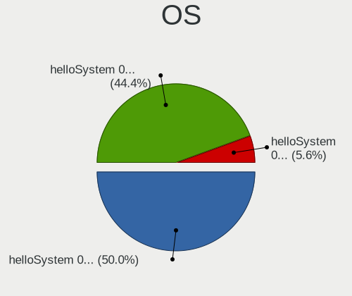
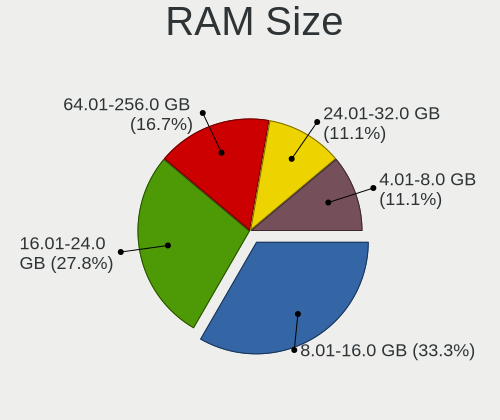
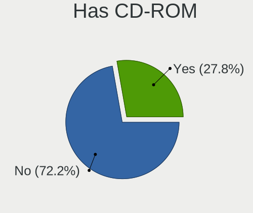
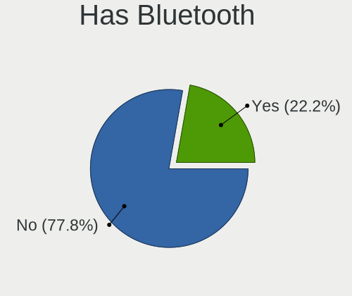
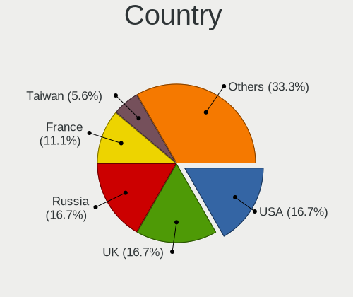
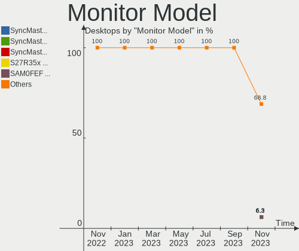

helloSystem - Hardware Trends (Desktops)
----------------------------------------

A project to identify most popular hardware characteristics and track their change
over time based on data collected by BSD users at https://BSD-Hardware.info.

Anyone can contribute to this report by the [hw-probe](https://github.com/linuxhw/hw-probe/blob/master/INSTALL.BSD.md) tool:

    hw-probe -all -upload

This report is for one last month. Overall report since the beginning of time: [TestCoverage](https://github.com/bsdhw/TestCoverage)

Period: Jan, 2023.

Contents
--------

* [ System ](#system)
  - [ OS                       ](#os)
  - [ OS Family                ](#os-family)
  - [ Arch                     ](#arch)
  - [ DE                       ](#de)
  - [ Display Server           ](#display-server)
  - [ Display Manager          ](#display-manager)
  - [ OS Lang                  ](#os-lang)
  - [ Boot Mode                ](#boot-mode)
  - [ Filesystem               ](#filesystem)
  - [ Part. scheme             ](#part-scheme)

* [ Board ](#board)
  - [ Vendor                   ](#vendor)
  - [ Model                    ](#model)
  - [ Model Family             ](#model-family)
  - [ MFG Year                 ](#mfg-year)
  - [ Form Factor              ](#form-factor)
  - [ Coreboot                 ](#coreboot)
  - [ RAM Size                 ](#ram-size)
  - [ RAM Used                 ](#ram-used)
  - [ Total Drives             ](#total-drives)
  - [ Has CD-ROM               ](#has-cd-rom)
  - [ Has Ethernet             ](#has-ethernet)
  - [ Has WiFi                 ](#has-wifi)
  - [ Has Bluetooth            ](#has-bluetooth)

* [ Location ](#location)
  - [ Country                  ](#country)
  - [ City                     ](#city)

* [ Drives ](#drives)
  - [ Drive Vendor             ](#drive-vendor)
  - [ Drive Model              ](#drive-model)
  - [ HDD Vendor               ](#hdd-vendor)
  - [ SSD Vendor               ](#ssd-vendor)
  - [ Drive Kind               ](#drive-kind)
  - [ Drive Connector          ](#drive-connector)
  - [ Drive Size               ](#drive-size)
  - [ Space Total              ](#space-total)
  - [ Space Used               ](#space-used)
  - [ Malfunc. Drives          ](#malfunc-drives)
  - [ Malfunc. Drive Vendor    ](#malfunc-drive-vendor)
  - [ Malfunc. HDD Vendor      ](#malfunc-hdd-vendor)
  - [ Malfunc. Drive Kind      ](#malfunc-drive-kind)
  - [ Failed Drives            ](#failed-drives)
  - [ Failed Drive Vendor      ](#failed-drive-vendor)
  - [ Drive Status             ](#drive-status)

* [ Storage controller ](#storage-controller)
  - [ Storage Vendor           ](#storage-vendor)
  - [ Storage Model            ](#storage-model)
  - [ Storage Kind             ](#storage-kind)

* [ Processor ](#processor)
  - [ CPU Vendor               ](#cpu-vendor)
  - [ CPU Model                ](#cpu-model)
  - [ CPU Model Family         ](#cpu-model-family)
  - [ CPU Cores                ](#cpu-cores)
  - [ CPU Sockets              ](#cpu-sockets)
  - [ CPU Threads              ](#cpu-threads)
  - [ CPU Microarch            ](#cpu-microarch)

* [ Graphics ](#graphics)
  - [ GPU Vendor               ](#gpu-vendor)
  - [ GPU Model                ](#gpu-model)
  - [ GPU Combo                ](#gpu-combo)
  - [ GPU Driver               ](#gpu-driver)
  - [ GPU Memory               ](#gpu-memory)

* [ Monitor ](#monitor)
  - [ Monitor Vendor           ](#monitor-vendor)
  - [ Monitor Model            ](#monitor-model)
  - [ Monitor Resolution       ](#monitor-resolution)
  - [ Monitor Diagonal         ](#monitor-diagonal)
  - [ Monitor Width            ](#monitor-width)
  - [ Aspect Ratio             ](#aspect-ratio)
  - [ Monitor Area             ](#monitor-area)
  - [ Pixel Density            ](#pixel-density)
  - [ Multiple Monitors        ](#multiple-monitors)

* [ Network ](#network)
  - [ Net Controller Vendor    ](#net-controller-vendor)
  - [ Net Controller Model     ](#net-controller-model)
  - [ Wireless Vendor          ](#wireless-vendor)
  - [ Wireless Model           ](#wireless-model)
  - [ Ethernet Vendor          ](#ethernet-vendor)
  - [ Ethernet Model           ](#ethernet-model)
  - [ Net Controller Kind      ](#net-controller-kind)
  - [ Used Controller          ](#used-controller)
  - [ NICs                     ](#nics)
  - [ IPv6                     ](#ipv6)

* [ Bluetooth ](#bluetooth)
  - [ Bluetooth Vendor         ](#bluetooth-vendor)
  - [ Bluetooth Model          ](#bluetooth-model)

* [ Sound ](#sound)
  - [ Sound Vendor             ](#sound-vendor)
  - [ Sound Model              ](#sound-model)

* [ Memory ](#memory)
  - [ Memory Vendor            ](#memory-vendor)
  - [ Memory Model             ](#memory-model)
  - [ Memory Kind              ](#memory-kind)
  - [ Memory Form Factor       ](#memory-form-factor)
  - [ Memory Size              ](#memory-size)
  - [ Memory Speed             ](#memory-speed)

* [ Printers & scanners ](#printers--scanners)
  - [ Printer Vendor           ](#printer-vendor)
  - [ Printer Model            ](#printer-model)
  - [ Scanner Vendor           ](#scanner-vendor)
  - [ Scanner Model            ](#scanner-model)

* [ Camera ](#camera)
  - [ Camera Vendor            ](#camera-vendor)
  - [ Camera Model             ](#camera-model)

* [ Security ](#security)
  - [ Fingerprint Vendor       ](#fingerprint-vendor)
  - [ Fingerprint Model        ](#fingerprint-model)
  - [ Chipcard Vendor          ](#chipcard-vendor)
  - [ Chipcard Model           ](#chipcard-model)

* [ Unsupported ](#unsupported)
  - [ Unsupported Devices      ](#unsupported-devices)
  - [ Unsupported Device Types ](#unsupported-device-types)

System
------

OS
--

Installed operating systems

| Name              | Desktops | Percent |
|-------------------|----------|---------|
| helloSystem 0.8.0 | 26       | 70.27%  |
| helloSystem 0.7.0 | 11       | 29.73%  |

OS Family
---------

OS without a version

| Name        | Desktops | Percent |
|-------------|----------|---------|
| helloSystem | 37       | 100%    |

Arch
----

OS architecture (x86_64, i586, etc.)

| Name  | Desktops | Percent |
|-------|----------|---------|
| amd64 | 37       | 100%    |

DE
--

Desktop Environment

| Name         | Desktops | Percent |
|--------------|----------|---------|
| helloDesktop | 36       | 97.3%   |
| KDE5         | 1        | 2.7%    |

Display Server
--------------

X11 or Wayland

| Name | Desktops | Percent |
|------|----------|---------|
| X11  | 37       | 100%    |

Display Manager
---------------

SDDM, LightDM, etc.

| Name | Desktops | Percent |
|------|----------|---------|
| SLiM | 37       | 100%    |

OS Lang
-------

Language

| Lang  | Desktops | Percent |
|-------|----------|---------|
| en    | 13       | 35.14%  |
| en_US | 12       | 32.43%  |
| ru    | 4        | 10.81%  |
| pt    | 2        | 5.41%   |
| it    | 1        | 2.7%    |
| fr    | 1        | 2.7%    |
| es_ES | 1        | 2.7%    |
| es    | 1        | 2.7%    |
| en_GB | 1        | 2.7%    |
| de    | 1        | 2.7%    |

Boot Mode
---------

EFI or BIOS

| Mode | Desktops | Percent |
|------|----------|---------|
| EFI  | 37       | 100%    |

Filesystem
----------

Type of filesystem

| Type   | Desktops | Percent |
|--------|----------|---------|
| Cd9660 | 26       | 70.27%  |
| Zfs    | 11       | 29.73%  |

Part. scheme
------------

Scheme of partitioning

| Type | Desktops | Percent |
|------|----------|---------|
| GPT  | 37       | 100%    |

Board
-----

Vendor
------

Motherboard manufacturer

| Name                | Desktops | Percent |
|---------------------|----------|---------|
| Gigabyte Technology | 11       | 29.73%  |
| ASUSTek Computer    | 8        | 21.62%  |
| Dell                | 7        | 18.92%  |
| Hewlett-Packard     | 3        | 8.11%   |
| ASRock              | 2        | 5.41%   |
| MSI                 | 1        | 2.7%    |
| MACHINIST           | 1        | 2.7%    |
| Intel               | 1        | 2.7%    |
| Google              | 1        | 2.7%    |
| Biostar             | 1        | 2.7%    |
| Apple               | 1        | 2.7%    |

Model
-----

Motherboard model

| Name                           | Desktops | Percent |
|--------------------------------|----------|---------|
| Dell Precision Tower 5810      | 3        | 8.11%   |
| ASUS All Series                | 3        | 8.11%   |
| MSI MS-7B89                    | 1        | 2.7%    |
| MACHINIST X99-K9 V2.0          | 1        | 2.7%    |
| Intel H61                      | 1        | 2.7%    |
| HP Z240 SFF Workstation        | 1        | 2.7%    |
| HP Compaq 8200 Elite USDT PC   | 1        | 2.7%    |
| HP Compaq 8200 Elite SFF PC    | 1        | 2.7%    |
| Google Panther                 | 1        | 2.7%    |
| Gigabyte Z390 AORUS ELITE      | 1        | 2.7%    |
| Gigabyte X570 AORUS PRO        | 1        | 2.7%    |
| Gigabyte H81M-H                | 1        | 2.7%    |
| Gigabyte H61M-S2PV             | 1        | 2.7%    |
| Gigabyte H270M-DS3H            | 1        | 2.7%    |
| Gigabyte GA-MA770T-UD3         | 1        | 2.7%    |
| Gigabyte GA-990X-Gaming SLI-CF | 1        | 2.7%    |
| Gigabyte G1.Sniper A88X-CF     | 1        | 2.7%    |
| Gigabyte B450 AORUS PRO WIFI   | 1        | 2.7%    |
| Gigabyte B360M-D2V             | 1        | 2.7%    |
| Gigabyte A520M S2H             | 1        | 2.7%    |
| Dell OptiPlex 780              | 1        | 2.7%    |
| Dell OptiPlex 760              | 1        | 2.7%    |
| Dell OptiPlex 3060             | 1        | 2.7%    |
| Dell Inspiron 3470             | 1        | 2.7%    |
| Biostar TB250-BTC+             | 1        | 2.7%    |
| ASUS PRIME H310M-K             | 1        | 2.7%    |
| ASUS P7P55D LE                 | 1        | 2.7%    |
| ASUS P5KPL-AM SE               | 1        | 2.7%    |
| ASUS M4A89TD PRO USB3          | 1        | 2.7%    |
| ASUS A0000001                  | 1        | 2.7%    |
| ASRock Z390 Pro4               | 1        | 2.7%    |
| ASRock X299E-ITX/ac            | 1        | 2.7%    |
| Apple MacPro5,1                | 1        | 2.7%    |

Model Family
------------

Motherboard model prefix

| Name                    | Desktops | Percent |
|-------------------------|----------|---------|
| Dell Precision          | 3        | 8.11%   |
| Dell OptiPlex           | 3        | 8.11%   |
| ASUS All                | 3        | 8.11%   |
| HP Compaq               | 2        | 5.41%   |
| MSI MS-7B89             | 1        | 2.7%    |
| MACHINIST X99-K9        | 1        | 2.7%    |
| Intel H61               | 1        | 2.7%    |
| HP Z240                 | 1        | 2.7%    |
| Google Panther          | 1        | 2.7%    |
| Gigabyte Z390           | 1        | 2.7%    |
| Gigabyte X570           | 1        | 2.7%    |
| Gigabyte H81M-H         | 1        | 2.7%    |
| Gigabyte H61M-S2PV      | 1        | 2.7%    |
| Gigabyte H270M-DS3H     | 1        | 2.7%    |
| Gigabyte GA-MA770T-UD3  | 1        | 2.7%    |
| Gigabyte GA-990X-Gaming | 1        | 2.7%    |
| Gigabyte G1.Sniper      | 1        | 2.7%    |
| Gigabyte B450           | 1        | 2.7%    |
| Gigabyte B360M-D2V      | 1        | 2.7%    |
| Gigabyte A520M          | 1        | 2.7%    |
| Dell Inspiron           | 1        | 2.7%    |
| Biostar TB250-BTC+      | 1        | 2.7%    |
| ASUS PRIME              | 1        | 2.7%    |
| ASUS P7P55D             | 1        | 2.7%    |
| ASUS P5KPL-AM           | 1        | 2.7%    |
| ASUS M4A89TD            | 1        | 2.7%    |
| ASUS A0000001           | 1        | 2.7%    |
| ASRock Z390             | 1        | 2.7%    |
| ASRock X299E-ITX        | 1        | 2.7%    |
| Apple MacPro5           | 1        | 2.7%    |

MFG Year
--------

Motherboard manufacture year

| Year | Desktops | Percent |
|------|----------|---------|
| 2018 | 7        | 18.92%  |
| 2019 | 6        | 16.22%  |
| 2020 | 4        | 10.81%  |
| 2021 | 3        | 8.11%   |
| 2015 | 3        | 8.11%   |
| 2012 | 3        | 8.11%   |
| 2011 | 3        | 8.11%   |
| 2017 | 2        | 5.41%   |
| 2013 | 2        | 5.41%   |
| 2010 | 2        | 5.41%   |
| 2022 | 1        | 2.7%    |
| 2016 | 1        | 2.7%    |

Form Factor
-----------

Physical design of the computer

| Name    | Desktops | Percent |
|---------|----------|---------|
| Desktop | 37       | 100%    |

Coreboot
--------

Have coreboot on board

| Used | Desktops | Percent |
|------|----------|---------|
| No   | 36       | 97.3%   |
| Yes  | 1        | 2.7%    |

RAM Size
--------

Total RAM memory

| Size in GB  | Desktops | Percent |
|-------------|----------|---------|
| 16.01-24.0  | 13       | 35.14%  |
| 8.01-16.0   | 9        | 24.32%  |
| 4.01-8.0    | 8        | 21.62%  |
| 64.01-256.0 | 4        | 10.81%  |
| 32.01-64.0  | 2        | 5.41%   |
| 2.01-3.0    | 1        | 2.7%    |

RAM Used
--------

Used RAM memory

| Used GB   | Desktops | Percent |
|-----------|----------|---------|
| 0.01-0.5  | 17       | 45.95%  |
| 0.51-1.0  | 10       | 27.03%  |
| 1.01-2.0  | 5        | 13.51%  |
| 2.01-3.0  | 4        | 10.81%  |
| 8.01-16.0 | 1        | 2.7%    |

Total Drives
------------

Number of drives on board

| Drives | Desktops | Percent |
|--------|----------|---------|
| 1      | 17       | 45.95%  |
| 3      | 9        | 24.32%  |
| 2      | 9        | 24.32%  |
| 5      | 1        | 2.7%    |
| 4      | 1        | 2.7%    |

Has CD-ROM
----------

Has CD-ROM on board

| Presented | Desktops | Percent |
|-----------|----------|---------|
| No        | 26       | 70.27%  |
| Yes       | 11       | 29.73%  |

Has Ethernet
------------

Has Ethernet on board

| Presented | Desktops | Percent |
|-----------|----------|---------|
| Yes       | 37       | 100%    |

Has WiFi
--------

Has WiFi module

| Presented | Desktops | Percent |
|-----------|----------|---------|
| No        | 25       | 67.57%  |
| Yes       | 12       | 32.43%  |

Has Bluetooth
-------------

Has Bluetooth module

| Presented | Desktops | Percent |
|-----------|----------|---------|
| No        | 25       | 67.57%  |
| Yes       | 12       | 32.43%  |

Location
--------

Country
-------

Geographic location (country)

| Country     | Desktops | Percent |
|-------------|----------|---------|
| Russia      | 9        | 24.32%  |
| USA         | 7        | 18.92%  |
| Indonesia   | 3        | 8.11%   |
| Brazil      | 3        | 8.11%   |
| UK          | 2        | 5.41%   |
| Italy       | 2        | 5.41%   |
| Germany     | 2        | 5.41%   |
| Spain       | 1        | 2.7%    |
| Portugal    | 1        | 2.7%    |
| Netherlands | 1        | 2.7%    |
| India       | 1        | 2.7%    |
| China       | 1        | 2.7%    |
| Canada      | 1        | 2.7%    |
| Bulgaria    | 1        | 2.7%    |
| Argentina   | 1        | 2.7%    |
| Algeria     | 1        | 2.7%    |

City
----

Geographic location (city)

| City            | Desktops | Percent |
|-----------------|----------|---------|
| Saratov         | 2        | 5.41%   |
| Chelyabinsk     | 2        | 5.41%   |
| Yekaterinburg   | 1        | 2.7%    |
| Yancheng        | 1        | 2.7%    |
| Winnipeg        | 1        | 2.7%    |
| Voronezh        | 1        | 2.7%    |
| Veliko Tarnovo  | 1        | 2.7%    |
| Tegal           | 1        | 2.7%    |
| Tasikmalaya     | 1        | 2.7%    |
| Sumaré         | 1        | 2.7%    |
| Sliedrecht      | 1        | 2.7%    |
| Seattle         | 1        | 2.7%    |
| Richardson      | 1        | 2.7%    |
| Recklinghausen  | 1        | 2.7%    |
| Pieve a Nievole | 1        | 2.7%    |
| Palembang       | 1        | 2.7%    |
| Oryol           | 1        | 2.7%    |
| Oklahoma City   | 1        | 2.7%    |
| Mt. Pleasant    | 1        | 2.7%    |
| Moscow          | 1        | 2.7%    |
| Marcus Hook     | 1        | 2.7%    |
| Málaga         | 1        | 2.7%    |
| Makhachkala     | 1        | 2.7%    |
| Londrina        | 1        | 2.7%    |
| Lisbon          | 1        | 2.7%    |
| Lafayette       | 1        | 2.7%    |
| Hull            | 1        | 2.7%    |
| Guwahati        | 1        | 2.7%    |
| Genoa           | 1        | 2.7%    |
| Dayton          | 1        | 2.7%    |
| Buenos Aires    | 1        | 2.7%    |
| Blumenau        | 1        | 2.7%    |
| Berlin          | 1        | 2.7%    |
| Beighton        | 1        | 2.7%    |
| Algiers         | 1        | 2.7%    |

Drives
------

Drive Vendor
------------

Hard drive vendors

| Vendor              | Desktops | Drives | Percent |
|---------------------|----------|--------|---------|
| WDC                 | 12       | 16     | 19.05%  |
| Seagate             | 7        | 7      | 11.11%  |
| Kingston            | 7        | 7      | 11.11%  |
| Samsung Electronics | 5        | 7      | 7.94%   |
| Crucial             | 5        | 5      | 7.94%   |
| Toshiba             | 4        | 4      | 6.35%   |
| SanDisk             | 2        | 2      | 3.17%   |
| Plextor             | 2        | 2      | 3.17%   |
| Patriot             | 2        | 2      | 3.17%   |
| Hitachi             | 2        | 2      | 3.17%   |
| China               | 2        | 2      | 3.17%   |
| XrayDisk            | 1        | 1      | 1.59%   |
| Team                | 1        | 1      | 1.59%   |
| Silicon Motion      | 1        | 1      | 1.59%   |
| PNY                 | 1        | 1      | 1.59%   |
| Pioneer             | 1        | 1      | 1.59%   |
| Phison              | 1        | 2      | 1.59%   |
| MidasForce          | 1        | 1      | 1.59%   |
| KingSpec            | 1        | 1      | 1.59%   |
| Kimtigo             | 1        | 1      | 1.59%   |
| Fanxiang            | 1        | 1      | 1.59%   |
| Corsair             | 1        | 1      | 1.59%   |
| Apple               | 1        | 2      | 1.59%   |
| A-DATA Technology   | 1        | 1      | 1.59%   |

Drive Model
-----------

Hard drive models

| Model                           | Desktops | Percent |
|---------------------------------|----------|---------|
| Kingston SA400S37240G 240GB     | 3        | 4.35%   |
| Toshiba HDWD110 1TB             | 2        | 2.9%    |
| Seagate ST3500418AS 500GB       | 2        | 2.9%    |
| XrayDisk SSD 256GB              | 1        | 1.45%   |
| WDC WD80EFAX-68KNBN0 8TB        | 1        | 1.45%   |
| WDC WD5000LPCX-60VHAT0 500GB    | 1        | 1.45%   |
| WDC WD5000LPCX-22VHAT1 500GB    | 1        | 1.45%   |
| WDC WD5000AAKX-001CA0 500GB     | 1        | 1.45%   |
| WDC WD4000FYYZ-05UL1B0 4TB      | 1        | 1.45%   |
| WDC WD20EZAZ-22L9GB0 2TB        | 1        | 1.45%   |
| WDC WD20EARS-00MVWB0 2TB        | 1        | 1.45%   |
| WDC WD2003FYYS-02W0B1 2TB       | 1        | 1.45%   |
| WDC WD2002FFSX-68PF8N0 2TB      | 1        | 1.45%   |
| WDC WD10JPVX-22JC3T0 1TB        | 1        | 1.45%   |
| WDC WD10EZRZ-00HTKB0 1TB        | 1        | 1.45%   |
| WDC WD10EZEX-22MFCA0 1TB        | 1        | 1.45%   |
| WDC WD10EZEX-08WN4A0 1TB        | 1        | 1.45%   |
| WDC WD10EADS-65M2BX 1TB         | 1        | 1.45%   |
| WDC WD10EACS-00D6B1 1TB         | 1        | 1.45%   |
| WDC WD1002FAEX-00Y9A0 1TB       | 1        | 1.45%   |
| Toshiba MK1255GSX H 120GB       | 1        | 1.45%   |
| Toshiba DT01ACA100 1TB          | 1        | 1.45%   |
| Team TM8FP4512G 512GB           | 1        | 1.45%   |
| Silicon Motion NE-256 256GB     | 1        | 1.45%   |
| Seagate ST5000LM000-2AN170 5TB  | 1        | 1.45%   |
| Seagate ST3160815AS 160GB       | 1        | 1.45%   |
| Seagate ST2000LM007-1R8174 2TB  | 1        | 1.45%   |
| Seagate ST2000DX001-1CM164 2TB  | 1        | 1.45%   |
| Seagate ST2000DM008-2FR102 2TB  | 1        | 1.45%   |
| SanDisk SSD U110 16GB           | 1        | 1.45%   |
| SanDisk SD8SN8U-128G-1006 128GB | 1        | 1.45%   |
| Samsung SSD 870 QVO 4TB         | 1        | 1.45%   |
| Samsung SSD 860 EVO M.2 500GB   | 1        | 1.45%   |
| Samsung SSD 860 EVO M.2 250GB   | 1        | 1.45%   |
| Samsung SSD 860 EVO 1TB         | 1        | 1.45%   |
| Samsung SSD 850 EVO 500GB       | 1        | 1.45%   |
| Samsung SSD 850 EVO 1TB         | 1        | 1.45%   |
| Samsung HD502HJ 500GB           | 1        | 1.45%   |
| PNY CS900 250GB SSD             | 1        | 1.45%   |
| Plextor PX-AG256M6e 256GB       | 1        | 1.45%   |

HDD Vendor
----------

Hard disk drive vendors

| Vendor              | Desktops | Drives | Percent |
|---------------------|----------|--------|---------|
| WDC                 | 12       | 16     | 46.15%  |
| Seagate             | 7        | 7      | 26.92%  |
| Toshiba             | 4        | 4      | 15.38%  |
| Hitachi             | 2        | 2      | 7.69%   |
| Samsung Electronics | 1        | 1      | 3.85%   |

SSD Vendor
----------

Solid state drive vendors

| Vendor              | Desktops | Drives | Percent |
|---------------------|----------|--------|---------|
| Kingston            | 7        | 7      | 21.21%  |
| Crucial             | 5        | 5      | 15.15%  |
| Samsung Electronics | 4        | 6      | 12.12%  |
| SanDisk             | 2        | 2      | 6.06%   |
| Plextor             | 2        | 2      | 6.06%   |
| Patriot             | 2        | 2      | 6.06%   |
| China               | 2        | 2      | 6.06%   |
| XrayDisk            | 1        | 1      | 3.03%   |
| PNY                 | 1        | 1      | 3.03%   |
| Pioneer             | 1        | 1      | 3.03%   |
| MidasForce          | 1        | 1      | 3.03%   |
| KingSpec            | 1        | 1      | 3.03%   |
| Fanxiang            | 1        | 1      | 3.03%   |
| Corsair             | 1        | 1      | 3.03%   |
| Apple               | 1        | 2      | 3.03%   |
| A-DATA Technology   | 1        | 1      | 3.03%   |

Drive Kind
----------

HDD or SSD

| Kind | Desktops | Drives | Percent |
|------|----------|--------|---------|
| SSD  | 28       | 36     | 52.83%  |
| HDD  | 21       | 30     | 39.62%  |
| NVMe | 4        | 5      | 7.55%   |

Drive Connector
---------------

SATA, SAS, NVMe, etc.

| Type | Desktops | Drives | Percent |
|------|----------|--------|---------|
| SATA | 37       | 66     | 90.24%  |
| NVMe | 4        | 5      | 9.76%   |

Drive Size
----------

Size of hard drive

| Size in TB | Desktops | Drives | Percent |
|------------|----------|--------|---------|
| 0.01-0.5   | 29       | 39     | 56.86%  |
| 0.51-1.0   | 12       | 14     | 23.53%  |
| 1.01-2.0   | 6        | 9      | 11.76%  |
| 3.01-4.0   | 2        | 2      | 3.92%   |
| 4.01-10.0  | 2        | 2      | 3.92%   |

Space Total
-----------

Amount of disk space available on the file system

| Size in GB     | Desktops | Percent |
|----------------|----------|---------|
| 1-20           | 25       | 67.57%  |
| 101-250        | 9        | 24.32%  |
| More than 3000 | 1        | 2.7%    |
| 251-500        | 1        | 2.7%    |
| 501-1000       | 1        | 2.7%    |

Space Used
----------

Amount of used disk space

| Used GB | Desktops | Percent |
|---------|----------|---------|
| 1-20    | 36       | 97.3%   |
| 101-250 | 1        | 2.7%    |

Malfunc. Drives
---------------

Drive models with a malfunction

| Model                        | Desktops | Drives | Percent |
|------------------------------|----------|--------|---------|
| WDC WD5000LPCX-60VHAT0 500GB | 1        | 1      | 8.33%   |
| WDC WD5000AAKX-001CA0 500GB  | 1        | 1      | 8.33%   |
| WDC WD10EZRZ-00HTKB0 1TB     | 1        | 1      | 8.33%   |
| WDC WD10EADS-65M2BX 1TB      | 1        | 1      | 8.33%   |
| WDC WD10EACS-00D6B1 1TB      | 1        | 1      | 8.33%   |
| Toshiba MK1255GSX H 120GB    | 1        | 1      | 8.33%   |
| Toshiba DT01ACA100 1TB       | 1        | 1      | 8.33%   |
| Seagate ST3500418AS 500GB    | 1        | 1      | 8.33%   |
| Pioneer APS-SL3N-240 240GB   | 1        | 1      | 8.33%   |
| MidasForce SSD 120GB         | 1        | 1      | 8.33%   |
| Hitachi HDS721010DLE630 1TB  | 1        | 1      | 8.33%   |
| Corsair Force LE SSD 240GB   | 1        | 1      | 8.33%   |

Malfunc. Drive Vendor
---------------------

Vendors of faulty drives

| Vendor     | Desktops | Drives | Percent |
|------------|----------|--------|---------|
| WDC        | 5        | 5      | 41.67%  |
| Toshiba    | 2        | 2      | 16.67%  |
| Seagate    | 1        | 1      | 8.33%   |
| Pioneer    | 1        | 1      | 8.33%   |
| MidasForce | 1        | 1      | 8.33%   |
| Hitachi    | 1        | 1      | 8.33%   |
| Corsair    | 1        | 1      | 8.33%   |

Malfunc. HDD Vendor
-------------------

Vendors of faulty HDD drives

| Vendor  | Desktops | Drives | Percent |
|---------|----------|--------|---------|
| WDC     | 5        | 5      | 55.56%  |
| Toshiba | 2        | 2      | 22.22%  |
| Seagate | 1        | 1      | 11.11%  |
| Hitachi | 1        | 1      | 11.11%  |

Malfunc. Drive Kind
-------------------

Kinds of faulty drives

| Kind | Desktops | Drives | Percent |
|------|----------|--------|---------|
| HDD  | 8        | 9      | 72.73%  |
| SSD  | 3        | 3      | 27.27%  |

Failed Drives
-------------

Failed drive models

Zero info for selected period =(

Failed Drive Vendor
-------------------

Failed drive vendors

Zero info for selected period =(

Drive Status
------------

Number of failed and malfunc. drives

| Status   | Desktops | Drives | Percent |
|----------|----------|--------|---------|
| Works    | 29       | 55     | 70.73%  |
| Malfunc  | 10       | 12     | 24.39%  |
| Detected | 2        | 4      | 4.88%   |

Storage controller
------------------

Storage Vendor
--------------

Storage controller vendors

| Vendor                     | Desktops | Percent |
|----------------------------|----------|---------|
| Intel                      | 28       | 62.22%  |
| AMD                        | 9        | 20%     |
| Silicon Motion             | 2        | 4.44%   |
| Phison Electronics         | 2        | 4.44%   |
| JMicron Technology         | 2        | 4.44%   |
| Realtek Semiconductor      | 1        | 2.22%   |
| Lite-On IT Corp. / Plextor | 1        | 2.22%   |

Storage Model
-------------

Storage controller models

| Model                                                                                   | Desktops | Percent |
|-----------------------------------------------------------------------------------------|----------|---------|
| Intel Cannon Lake PCH SATA AHCI Controller                                              | 6        | 11.11%  |
| Intel C610/X99 series chipset 6-Port SATA Controller [AHCI mode]                        | 3        | 5.56%   |
| Intel 6 Series/C200 Series Chipset Family 6 port Desktop SATA AHCI Controller           | 3        | 5.56%   |
| AMD FCH SATA Controller [AHCI mode]                                                     | 3        | 5.56%   |
| Silicon Motion SM2263EN/SM2263XT SSD Controller                                         | 2        | 3.7%    |
| Phison E12 NVMe Controller                                                              | 2        | 3.7%    |
| JMicron JMB361 AHCI/IDE                                                                 | 2        | 3.7%    |
| Intel C610/X99 series chipset sSATA Controller [AHCI mode]                              | 2        | 3.7%    |
| Intel C600/X79 series chipset SATA RAID Controller                                      | 2        | 3.7%    |
| Intel 8 Series/C220 Series Chipset Family 6-port SATA Controller 1 [AHCI mode]          | 2        | 3.7%    |
| Intel 4 Series Chipset PT IDER Controller                                               | 2        | 3.7%    |
| Intel 200 Series PCH SATA controller [AHCI mode]                                        | 2        | 3.7%    |
| AMD SB7x0/SB8x0/SB9x0 SATA Controller [AHCI mode]                                       | 2        | 3.7%    |
| AMD 400 Series Chipset SATA Controller                                                  | 2        | 3.7%    |
| Lite-On IT Corp. / Plextor M6e PCI Express SSD [Marvell 88SS9183]                       | 1        | 1.85%   |
| Intel SATA Controller [RAID mode]                                                       | 1        | 1.85%   |
| Intel Q170/Q150/B150/H170/H110/Z170/CM236 Chipset SATA Controller [AHCI Mode]           | 1        | 1.85%   |
| Intel NM10/ICH7 Family SATA Controller [IDE mode]                                       | 1        | 1.85%   |
| Intel Atom Processor E3800 Series SATA AHCI Controller                                  | 1        | 1.85%   |
| Intel 82801JI (ICH10 Family) SATA AHCI Controller                                       | 1        | 1.85%   |
| Intel 82801JD/DO (ICH10 Family) SATA AHCI Controller                                    | 1        | 1.85%   |
| Intel 82801JD/DO (ICH10 Family) 4-port SATA IDE Controller                              | 1        | 1.85%   |
| Intel 82801JD/DO (ICH10 Family) 2-port SATA IDE Controller                              | 1        | 1.85%   |
| Intel 82801G (ICH7 Family) IDE Controller                                               | 1        | 1.85%   |
| Intel 8 Series SATA Controller 1 [AHCI mode]                                            | 1        | 1.85%   |
| Intel 6 Series/C200 Series Chipset Family Desktop SATA Controller (IDE mode, ports 4-5) | 1        | 1.85%   |
| Intel 6 Series/C200 Series Chipset Family Desktop SATA Controller (IDE mode, ports 0-3) | 1        | 1.85%   |
| Intel 5 Series/3400 Series Chipset 6 port SATA AHCI Controller                          | 1        | 1.85%   |
| AMD SB7x0/SB8x0/SB9x0 SATA Controller [IDE mode]                                        | 1        | 1.85%   |
| AMD SB7x0/SB8x0/SB9x0 IDE Controller                                                    | 1        | 1.85%   |
| AMD FCH SATA Controller D                                                               | 1        | 1.85%   |
| AMD 500 Series Chipset SATA Controller                                                  | 1        | 1.85%   |
| Unknown                                                                                 | 1        | 1.85%   |

Storage Kind
------------

Kind of storage controller (IDE, SATA, NVMe, SAS, ...)

| Kind | Desktops | Percent |
|------|----------|---------|
| SATA | 31       | 67.39%  |
| IDE  | 7        | 15.22%  |
| NVMe | 5        | 10.87%  |
| RAID | 3        | 6.52%   |

Processor
---------

CPU Vendor
----------

Processor vendors

| Vendor | Desktops | Percent |
|--------|----------|---------|
| Intel  | 28       | 75.68%  |
| AMD    | 9        | 24.32%  |

CPU Model
---------

Processor models

| Model                                        | Desktops | Percent |
|----------------------------------------------|----------|---------|
| Intel Core i3-8100 CPU @ 3.60GHz             | 3        | 8.11%   |
| Intel Xeon CPU E5-1650 v3 @ 3.50GHz          | 2        | 5.41%   |
| Intel Core 2 Duo                             | 2        | 5.41%   |
| AMD Phenom II X4 945 Processor               | 2        | 5.41%   |
| Intel Xeon CPU W3565 @ 3.20GHz               | 1        | 2.7%    |
| Intel Xeon CPU E5462 @ 2.80GHz               | 1        | 2.7%    |
| Intel Xeon CPU E5-2676 v3 @ 2.40GHz          | 1        | 2.7%    |
| Intel Xeon CPU E5-2640 v3 @ 2.60GHz          | 1        | 2.7%    |
| Intel Xeon CPU E3-1225 v5 @ 3.30GHz          | 1        | 2.7%    |
| Intel Pentium CPU G630 @ 2.70GHz             | 1        | 2.7%    |
| Intel Core i9-9980XE CPU @ 3.00GHz           | 1        | 2.7%    |
| Intel Core i7-7700 CPU @ 3.60GHz             | 1        | 2.7%    |
| Intel Core i7-5820K CPU @ 3.30GHz            | 1        | 2.7%    |
| Intel Core i7-2600 CPU @ 3.40GHz             | 1        | 2.7%    |
| Intel Core i5-9400F CPU @ 2.90GHz            | 1        | 2.7%    |
| Intel Core i5-8500T CPU @ 2.10GHz            | 1        | 2.7%    |
| Intel Core i5-8400 CPU @ 2.80GHz             | 1        | 2.7%    |
| Intel Core i5-2400S CPU @ 2.50GHz            | 1        | 2.7%    |
| Intel Core i5 CPU 750 @ 2.67GHz              | 1        | 2.7%    |
| Intel Core i3-7100 CPU @ 3.90GHz             | 1        | 2.7%    |
| Intel Core i3-4150 CPU @ 3.50GHz             | 1        | 2.7%    |
| Intel Core i3-4130 CPU @ 3.40GHz             | 1        | 2.7%    |
| Intel Celeron CPU J1800 @ 2.41GHz            | 1        | 2.7%    |
| Intel Celeron CPU G530 @ 2.40GHz             | 1        | 2.7%    |
| Intel Celeron 2955U @ 1.40GHz                | 1        | 2.7%    |
| AMD Ryzen 7 3800X 8-Core Processor           | 1        | 2.7%    |
| AMD Ryzen 5 5600G with Radeon Graphics       | 1        | 2.7%    |
| AMD Ryzen 5 3600 6-Core Processor            | 1        | 2.7%    |
| AMD Ryzen 3 3200G with Radeon Vega Graphics  | 1        | 2.7%    |
| AMD Ryzen 3 2200GE with Radeon Vega Graphics | 1        | 2.7%    |
| AMD FX-8320E Eight-Core Processor            | 1        | 2.7%    |
| AMD A10-5800K APU with Radeon HD Graphics    | 1        | 2.7%    |

CPU Model Family
----------------

Processor model prefix

| Model            | Desktops | Percent |
|------------------|----------|---------|
| Intel Xeon       | 7        | 18.92%  |
| Intel Core i3    | 6        | 16.22%  |
| Intel Core i5    | 5        | 13.51%  |
| Intel Core i7    | 3        | 8.11%   |
| Intel Celeron    | 3        | 8.11%   |
| Intel Core 2 Duo | 2        | 5.41%   |
| AMD Ryzen 5      | 2        | 5.41%   |
| AMD Ryzen 3      | 2        | 5.41%   |
| AMD Phenom II X4 | 2        | 5.41%   |
| Intel Pentium    | 1        | 2.7%    |
| Intel Core i9    | 1        | 2.7%    |
| AMD Ryzen 7      | 1        | 2.7%    |
| AMD FX           | 1        | 2.7%    |
| AMD A10          | 1        | 2.7%    |

CPU Cores
---------

Number of processor cores

| Number  | Desktops | Percent |
|---------|----------|---------|
| 4       | 14       | 37.84%  |
| 2       | 9        | 24.32%  |
| 6       | 6        | 16.22%  |
| 12      | 3        | 8.11%   |
| 8       | 2        | 5.41%   |
| 18      | 1        | 2.7%    |
| 16      | 1        | 2.7%    |
| Unknown | 1        | 2.7%    |

CPU Sockets
-----------

Number of sockets

| Number | Desktops | Percent |
|--------|----------|---------|
| 1      | 37       | 100%    |

CPU Threads
-----------

Threads per core (Hyper-Threading)

| Number  | Desktops | Percent |
|---------|----------|---------|
| 1       | 24       | 64.86%  |
| 2       | 12       | 32.43%  |
| Unknown | 1        | 2.7%    |

CPU Microarch
-------------

Microarchitecture

| Name        | Desktops | Percent |
|-------------|----------|---------|
| KabyLake    | 8        | 21.62%  |
| Haswell     | 8        | 21.62%  |
| SandyBridge | 4        | 10.81%  |
| Zen 2       | 2        | 5.41%   |
| Skylake     | 2        | 5.41%   |
| Piledriver  | 2        | 5.41%   |
| Penryn      | 2        | 5.41%   |
| Nehalem     | 2        | 5.41%   |
| K10         | 2        | 5.41%   |
| Zen+        | 1        | 2.7%    |
| Zen 3       | 1        | 2.7%    |
| Zen         | 1        | 2.7%    |
| Silvermont  | 1        | 2.7%    |
| Core        | 1        | 2.7%    |

Graphics
--------

GPU Vendor
----------

Vendors of graphics cards

| Vendor | Desktops | Percent |
|--------|----------|---------|
| Nvidia | 15       | 38.46%  |
| Intel  | 13       | 33.33%  |
| AMD    | 11       | 28.21%  |

GPU Model
---------

Graphics card models

| Model                                                                     | Desktops | Percent |
|---------------------------------------------------------------------------|----------|---------|
| Intel CoffeeLake-S GT2 [UHD Graphics 630]                                 | 3        | 7.69%   |
| Intel 2nd Generation Core Processor Family Integrated Graphics Controller | 3        | 7.69%   |
| Nvidia GK208B [GeForce GT 710]                                            | 2        | 5.13%   |
| Intel HD Graphics 630                                                     | 2        | 5.13%   |
| Intel 4th Generation Core Processor Family Integrated Graphics Controller | 2        | 5.13%   |
| AMD Ellesmere [Radeon RX 470/480/570/570X/580/580X/590]                   | 2        | 5.13%   |
| Nvidia TU117 [GeForce GTX 1650]                                           | 1        | 2.56%   |
| Nvidia TU104 [GeForce RTX 2070 SUPER]                                     | 1        | 2.56%   |
| Nvidia GP108 [GeForce GT 1030]                                            | 1        | 2.56%   |
| Nvidia GP107 [GeForce GTX 1050 Ti]                                        | 1        | 2.56%   |
| Nvidia GP104 [GeForce GTX 1070]                                           | 1        | 2.56%   |
| Nvidia GM206 [GeForce GTX 960]                                            | 1        | 2.56%   |
| Nvidia GM107GL [Quadro K620]                                              | 1        | 2.56%   |
| Nvidia GM107GL [Quadro K1200]                                             | 1        | 2.56%   |
| Nvidia GK208B [GeForce GT 730]                                            | 1        | 2.56%   |
| Nvidia GK107 [GeForce GTX 650]                                            | 1        | 2.56%   |
| Nvidia GK106 [GeForce GTX 660]                                            | 1        | 2.56%   |
| Nvidia GF119 [NVS 310]                                                    | 1        | 2.56%   |
| Nvidia GF108 [GeForce GT 730]                                             | 1        | 2.56%   |
| Intel Haswell-ULT Integrated Graphics Controller                          | 1        | 2.56%   |
| Intel Atom Processor Z36xxx/Z37xxx Series Graphics & Display              | 1        | 2.56%   |
| Intel 4 Series Chipset Integrated Graphics Controller                     | 1        | 2.56%   |
| AMD Turks XT [Radeon HD 6670/7670]                                        | 1        | 2.56%   |
| AMD RV730 XT [Radeon HD 4670]                                             | 1        | 2.56%   |
| AMD Raven Ridge [Radeon Vega Series / Radeon Vega Mobile Series]          | 1        | 2.56%   |
| AMD Picasso/Raven 2 [Radeon Vega Series / Radeon Vega Mobile Series]      | 1        | 2.56%   |
| AMD Navi 10 [Radeon RX 5600 OEM/5600 XT / 5700/5700 XT]                   | 1        | 2.56%   |
| AMD Lexa PRO [Radeon 540/540X/550/550X / RX 540X/550/550X]                | 1        | 2.56%   |
| AMD Juniper XT [Radeon HD 5770]                                           | 1        | 2.56%   |
| AMD Cezanne [Radeon Vega Series / Radeon Vega Mobile Series]              | 1        | 2.56%   |
| AMD Cedar [Radeon HD 5000/6000/7350/8350 Series]                          | 1        | 2.56%   |

GPU Combo
---------

Combinations of graphics cards

| Name        | Desktops | Percent |
|-------------|----------|---------|
| 1 x Nvidia  | 15       | 40.54%  |
| 1 x Intel   | 10       | 27.03%  |
| 1 x AMD     | 9        | 24.32%  |
| Intel + AMD | 2        | 5.41%   |
| 2 x Intel   | 1        | 2.7%    |

GPU Driver
----------

Free vs proprietary

| Driver      | Desktops | Percent |
|-------------|----------|---------|
| Free        | 26       | 70.27%  |
| Proprietary | 10       | 27.03%  |
| Unknown     | 1        | 2.7%    |

GPU Memory
----------

Total video memory

| Size in GB | Desktops | Percent |
|------------|----------|---------|
| Unknown    | 17       | 45.95%  |
| 7.01-8.0   | 5        | 13.51%  |
| 1.01-2.0   | 5        | 13.51%  |
| 0.51-1.0   | 5        | 13.51%  |
| 3.01-4.0   | 3        | 8.11%   |
| 0.01-0.5   | 2        | 5.41%   |

Monitor
-------

Monitor Vendor
--------------

Monitor vendors

| Vendor              | Desktops | Percent |
|---------------------|----------|---------|
| Goldstar            | 7        | 26.92%  |
| Samsung Electronics | 3        | 11.54%  |
| Hewlett-Packard     | 3        | 11.54%  |
| Dell                | 3        | 11.54%  |
| Philips             | 2        | 7.69%   |
| ViewSonic           | 1        | 3.85%   |
| NEC Computers       | 1        | 3.85%   |
| CHD                 | 1        | 3.85%   |
| BenQ                | 1        | 3.85%   |
| ASUSTek Computer    | 1        | 3.85%   |
| Apple               | 1        | 3.85%   |
| AOC                 | 1        | 3.85%   |
| Acer                | 1        | 3.85%   |

Monitor Model
-------------

Monitor models

| Model                                                               | Desktops | Percent |
|---------------------------------------------------------------------|----------|---------|
| Goldstar LG ULTRAWIDE GSM5AFB 2560x1080 800x340mm 34.2-inch         | 2        | 7.41%   |
| ViewSonic VA2710-FHD VSCA736 1920x1080 600x340mm 27.2-inch          | 1        | 3.7%    |
| Samsung Electronics SyncMaster SAM05C5 1920x1080                    | 1        | 3.7%    |
| Samsung Electronics SMT22A300 SAM087B 1920x1080 480x270mm 21.7-inch | 1        | 3.7%    |
| Samsung Electronics S27H85x SAM0E0F 2560x1440 600x340mm 27.2-inch   | 1        | 3.7%    |
| Philips PHL 241V8 PHLC212 1920x1080 530x300mm 24.0-inch             | 1        | 3.7%    |
| Philips LCD Monitor PHL0868 1680x1050 470x290mm 21.7-inch           | 1        | 3.7%    |
| NEC Computers LCD175VXM+ NEC66C0 1280x1024 340x270mm 17.1-inch      | 1        | 3.7%    |
| Hewlett-Packard LA2306 HWP294A 1920x1080 510x290mm 23.1-inch        | 1        | 3.7%    |
| Hewlett-Packard 27w HPN3494 1920x1080 600x340mm 27.2-inch           | 1        | 3.7%    |
| Hewlett-Packard 24y HPN3504 1920x1080 530x300mm 24.0-inch           | 1        | 3.7%    |
| Goldstar W1934 GSM4B7A 1440x900 410x260mm 19.1-inch                 | 1        | 3.7%    |
| Goldstar LG ULTRAGEAR GSM7766 2560x1440 700x390mm 31.5-inch         | 1        | 3.7%    |
| Goldstar LG HDR WFHD GSM5BA0 2560x1080 800x340mm 34.2-inch          | 1        | 3.7%    |
| Goldstar E2240 GSM57A4 1920x1080 480x270mm 21.7-inch                | 1        | 3.7%    |
| Goldstar E1642 GSM3E8C 1366x768 340x190mm 15.3-inch                 | 1        | 3.7%    |
| Goldstar 23EA53 GSM59A9 1920x1080 510x290mm 23.1-inch               | 1        | 3.7%    |
| Dell SE2719H DELF10D 1920x1080 600x340mm 27.2-inch                  | 1        | 3.7%    |
| Dell LCD Monitor LNK0001 1920x1080 300x230mm 14.9-inch              | 1        | 3.7%    |
| Dell E2016HV DELF06E 1600x900 430x240mm 19.4-inch                   | 1        | 3.7%    |
| CHD LCD Monitor CHD0320 2560x1440 700x390mm 31.5-inch               | 1        | 3.7%    |
| BenQ GL2450 BNQ78A4 1920x1080 530x300mm 24.0-inch                   | 1        | 3.7%    |
| ASUSTek Computer VP247 AUS24DA 1920x1080 520x290mm 23.4-inch        | 1        | 3.7%    |
| Apple Cinema Display APP921D 1680x1050 430x270mm 20.0-inch          | 1        | 3.7%    |
| AOC 2490W1 AOC2490 1920x1080 530x300mm 24.0-inch                    | 1        | 3.7%    |
| Acer QG241Y ACR079C 1920x1080 520x320mm 24.0-inch                   | 1        | 3.7%    |

Monitor Resolution
------------------

Monitor screen resolution

| Resolution         | Desktops | Percent |
|--------------------|----------|---------|
| 1920x1080 (FHD)    | 15       | 55.56%  |
| 2560x1440 (QHD)    | 3        | 11.11%  |
| 2560x1080          | 3        | 11.11%  |
| 1680x1050 (WSXGA+) | 2        | 7.41%   |
| 1600x900 (HD+)     | 1        | 3.7%    |
| 1440x900 (WXGA+)   | 1        | 3.7%    |
| 1366x768 (WXGA)    | 1        | 3.7%    |
| 1280x1024 (SXGA)   | 1        | 3.7%    |

Monitor Diagonal
----------------

Diagonal size in inches

| Inches  | Desktops | Percent |
|---------|----------|---------|
| 24      | 5        | 18.52%  |
| 27      | 4        | 14.81%  |
| 34      | 3        | 11.11%  |
| 23      | 3        | 11.11%  |
| 21      | 3        | 11.11%  |
| 31      | 2        | 7.41%   |
| 19      | 2        | 7.41%   |
| 20      | 1        | 3.7%    |
| 17      | 1        | 3.7%    |
| 15      | 1        | 3.7%    |
| 14      | 1        | 3.7%    |
| Unknown | 1        | 3.7%    |

Monitor Width
-------------

Physical width

| Width in mm | Desktops | Percent |
|-------------|----------|---------|
| 501-600     | 12       | 44.44%  |
| 401-500     | 6        | 22.22%  |
| 701-800     | 3        | 11.11%  |
| 601-700     | 2        | 7.41%   |
| 301-350     | 2        | 7.41%   |
| 201-300     | 1        | 3.7%    |
| Unknown     | 1        | 3.7%    |

Aspect Ratio
------------

Proportional relationship between the width and the height

| Ratio | Desktops | Percent |
|-------|----------|---------|
| 16/9  | 18       | 66.67%  |
| 16/10 | 4        | 14.81%  |
| 21/9  | 3        | 11.11%  |
| 5/4   | 1        | 3.7%    |
| 4/3   | 1        | 3.7%    |

Monitor Area
------------

Area in inch²

| Area in inch² | Desktops | Percent |
|----------------|----------|---------|
| 201-250        | 10       | 37.04%  |
| 351-500        | 5        | 18.52%  |
| 301-350        | 4        | 14.81%  |
| 151-200        | 3        | 11.11%  |
| 251-300        | 1        | 3.7%    |
| 141-150        | 1        | 3.7%    |
| 101-110        | 1        | 3.7%    |
| 91-100         | 1        | 3.7%    |
| Unknown        | 1        | 3.7%    |

Pixel Density
-------------

Pixels per inch

| Density | Desktops | Percent |
|---------|----------|---------|
| 51-100  | 21       | 77.78%  |
| 101-120 | 4        | 14.81%  |
| 121-160 | 1        | 3.7%    |
| Unknown | 1        | 3.7%    |

Multiple Monitors
-----------------

Total monitors connected

| Total | Desktops | Percent |
|-------|----------|---------|
| 1     | 30       | 81.08%  |
| 0     | 6        | 16.22%  |
| 2     | 1        | 2.7%    |

Network
-------

Net Controller Vendor
---------------------

Controller vendors

| Vendor                | Desktops | Percent |
|-----------------------|----------|---------|
| Realtek Semiconductor | 22       | 45.83%  |
| Intel                 | 17       | 35.42%  |
| Qualcomm Atheros      | 4        | 8.33%   |
| TP-Link               | 2        | 4.17%   |
| Ralink Technology     | 1        | 2.08%   |
| OPPO Electronics      | 1        | 2.08%   |
| Broadcom              | 1        | 2.08%   |

Net Controller Model
--------------------

Controller models

| Model                                                             | Desktops | Percent |
|-------------------------------------------------------------------|----------|---------|
| Realtek RTL8111/8168/8411 PCI Express Gigabit Ethernet Controller | 18       | 33.96%  |
| Intel I211 Gigabit Network Connection                             | 4        | 7.55%   |
| Intel Ethernet Connection I217-LM                                 | 3        | 5.66%   |
| Realtek RTL8192EE PCIe Wireless Network Adapter                   | 2        | 3.77%   |
| Realtek RTL810xE PCI Express Fast Ethernet controller             | 2        | 3.77%   |
| Intel Ethernet Connection (7) I219-V                              | 2        | 3.77%   |
| Intel 82579LM Gigabit Network Connection (Lewisville)             | 2        | 3.77%   |
| Intel 82574L Gigabit Network Connection                           | 2        | 3.77%   |
| Intel 82567LM-3 Gigabit Network Connection                        | 2        | 3.77%   |
| TP-Link TL-WN722N v2/v3 [Realtek RTL8188EUS]                      | 1        | 1.89%   |
| TP-Link Archer T2U PLUS [RTL8821AU]                               | 1        | 1.89%   |
| Realtek RTL8188EUS 802.11n Wireless Network Adapter               | 1        | 1.89%   |
| Realtek RTL-8100/8101L/8139 PCI Fast Ethernet Adapter             | 1        | 1.89%   |
| Ralink RT5370 Wireless Adapter                                    | 1        | 1.89%   |
| Qualcomm Atheros QCA9565 / AR9565 Wireless Network Adapter        | 1        | 1.89%   |
| Qualcomm Atheros QCA9377 802.11ac Wireless Network Adapter        | 1        | 1.89%   |
| Qualcomm Atheros AR9462 Wireless Network Adapter                  | 1        | 1.89%   |
| Qualcomm Atheros AR9285 Wireless Network Adapter (PCI-Express)    | 1        | 1.89%   |
| OPPO CPH1909 RNDIS Control RNDIS Ethernet Data                    | 1        | 1.89%   |
| Intel Wireless 8265 / 8275                                        | 1        | 1.89%   |
| Intel Ethernet Connection (2) I219-V                              | 1        | 1.89%   |
| Intel Ethernet Connection (2) I219-LM                             | 1        | 1.89%   |
| Intel Ethernet Connection (2) I218-V                              | 1        | 1.89%   |
| Intel Dual Band Wireless-AC 3168NGW [Stone Peak]                  | 1        | 1.89%   |
| Broadcom BCM4322 802.11a/b/g/n Wireless LAN Controller            | 1        | 1.89%   |

Wireless Vendor
---------------

Wireless vendors

| Vendor                | Desktops | Percent |
|-----------------------|----------|---------|
| Qualcomm Atheros      | 4        | 30.77%  |
| Realtek Semiconductor | 3        | 23.08%  |
| TP-Link               | 2        | 15.38%  |
| Intel                 | 2        | 15.38%  |
| Ralink Technology     | 1        | 7.69%   |
| Broadcom              | 1        | 7.69%   |

Wireless Model
--------------

Wireless models

| Model                                                          | Desktops | Percent |
|----------------------------------------------------------------|----------|---------|
| Realtek RTL8192EE PCIe Wireless Network Adapter                | 2        | 15.38%  |
| TP-Link TL-WN722N v2/v3 [Realtek RTL8188EUS]                   | 1        | 7.69%   |
| TP-Link Archer T2U PLUS [RTL8821AU]                            | 1        | 7.69%   |
| Realtek RTL8188EUS 802.11n Wireless Network Adapter            | 1        | 7.69%   |
| Ralink RT5370 Wireless Adapter                                 | 1        | 7.69%   |
| Qualcomm Atheros QCA9565 / AR9565 Wireless Network Adapter     | 1        | 7.69%   |
| Qualcomm Atheros QCA9377 802.11ac Wireless Network Adapter     | 1        | 7.69%   |
| Qualcomm Atheros AR9462 Wireless Network Adapter               | 1        | 7.69%   |
| Qualcomm Atheros AR9285 Wireless Network Adapter (PCI-Express) | 1        | 7.69%   |
| Intel Wireless 8265 / 8275                                     | 1        | 7.69%   |
| Intel Dual Band Wireless-AC 3168NGW [Stone Peak]               | 1        | 7.69%   |
| Broadcom BCM4322 802.11a/b/g/n Wireless LAN Controller         | 1        | 7.69%   |

Ethernet Vendor
---------------

Ethernet vendors

| Vendor                | Desktops | Percent |
|-----------------------|----------|---------|
| Realtek Semiconductor | 20       | 52.63%  |
| Intel                 | 17       | 44.74%  |
| OPPO Electronics      | 1        | 2.63%   |

Ethernet Model
--------------

Ethernet models

| Model                                                             | Desktops | Percent |
|-------------------------------------------------------------------|----------|---------|
| Realtek RTL8111/8168/8411 PCI Express Gigabit Ethernet Controller | 18       | 45%     |
| Intel I211 Gigabit Network Connection                             | 4        | 10%     |
| Intel Ethernet Connection I217-LM                                 | 3        | 7.5%    |
| Realtek RTL810xE PCI Express Fast Ethernet controller             | 2        | 5%      |
| Intel Ethernet Connection (7) I219-V                              | 2        | 5%      |
| Intel 82579LM Gigabit Network Connection (Lewisville)             | 2        | 5%      |
| Intel 82574L Gigabit Network Connection                           | 2        | 5%      |
| Intel 82567LM-3 Gigabit Network Connection                        | 2        | 5%      |
| Realtek RTL-8100/8101L/8139 PCI Fast Ethernet Adapter             | 1        | 2.5%    |
| OPPO CPH1909 RNDIS Control RNDIS Ethernet Data                    | 1        | 2.5%    |
| Intel Ethernet Connection (2) I219-V                              | 1        | 2.5%    |
| Intel Ethernet Connection (2) I219-LM                             | 1        | 2.5%    |
| Intel Ethernet Connection (2) I218-V                              | 1        | 2.5%    |

Net Controller Kind
-------------------

Ethernet, WiFi or modem

| Kind     | Desktops | Percent |
|----------|----------|---------|
| Ethernet | 37       | 75.51%  |
| WiFi     | 12       | 24.49%  |

Used Controller
---------------

Currently used network controller

| Kind     | Desktops | Percent |
|----------|----------|---------|
| Ethernet | 34       | 97.14%  |
| WiFi     | 1        | 2.86%   |

NICs
----

Total network controllers on board

| Total | Desktops | Percent |
|-------|----------|---------|
| 1     | 27       | 72.97%  |
| 2     | 8        | 21.62%  |
| 3     | 2        | 5.41%   |

IPv6
----

IPv6 vs IPv4

| Used | Desktops | Percent |
|------|----------|---------|
| No   | 37       | 100%    |

Bluetooth
---------

Bluetooth Vendor
----------------

Controller vendors

| Vendor                          | Desktops | Percent |
|---------------------------------|----------|---------|
| Cambridge Silicon Radio         | 7        | 58.33%  |
| Intel                           | 2        | 16.67%  |
| Qualcomm Atheros Communications | 1        | 8.33%   |
| IMC Networks                    | 1        | 8.33%   |
| Apple                           | 1        | 8.33%   |

Bluetooth Model
---------------

Controller models

| Model                                                       | Desktops | Percent |
|-------------------------------------------------------------|----------|---------|
| Cambridge Silicon Radio Bluetooth Dongle (HCI mode)         | 7        | 58.33%  |
| Qualcomm Atheros Dell Wireless 1707 Bluetooth 4.0 LE Device | 1        | 8.33%   |
| Intel Wireless-AC 3168 Bluetooth                            | 1        | 8.33%   |
| Intel Bluetooth wireless interface                          | 1        | 8.33%   |
| IMC Networks Qualcomm Atheros AR9462 Bluetooth 4.0 + HS     | 1        | 8.33%   |
| Apple Built-in Bluetooth 2.0+EDR HCI                        | 1        | 8.33%   |

Sound
-----

Sound Vendor
------------

Sound card vendors

| Vendor                 | Desktops | Percent |
|------------------------|----------|---------|
| Intel                  | 27       | 45%     |
| Nvidia                 | 15       | 25%     |
| AMD                    | 13       | 21.67%  |
| Texas Instruments      | 1        | 1.67%   |
| RME                    | 1        | 1.67%   |
| Logitech               | 1        | 1.67%   |
| Generalplus Technology | 1        | 1.67%   |
| C-Media Electronics    | 1        | 1.67%   |

Sound Model
-----------

Sound card models

| Model                                                                      | Desktops | Percent |
|----------------------------------------------------------------------------|----------|---------|
| Intel Cannon Lake PCH cAVS                                                 | 6        | 8.82%   |
| Intel C610/X99 series chipset HD Audio Controller                          | 5        | 7.35%   |
| Intel 6 Series/C200 Series Chipset Family High Definition Audio Controller | 4        | 5.88%   |
| Nvidia GK208 HDMI/DP Audio Controller                                      | 3        | 4.41%   |
| Intel 200 Series PCH HD Audio                                              | 3        | 4.41%   |
| AMD Family 17h/19h HD Audio Controller                                     | 3        | 4.41%   |
| Nvidia GM107 High Definition Audio Controller [GeForce 940MX]              | 2        | 2.94%   |
| Intel 82801JD/DO (ICH10 Family) HD Audio Controller                        | 2        | 2.94%   |
| Intel 8 Series/C220 Series Chipset High Definition Audio Controller        | 2        | 2.94%   |
| AMD Starship/Matisse HD Audio Controller                                   | 2        | 2.94%   |
| AMD SBx00 Azalia (Intel HDA)                                               | 2        | 2.94%   |
| AMD Raven/Raven2/Fenghuang HDMI/DP Audio Controller                        | 2        | 2.94%   |
| AMD Ellesmere HDMI Audio [Radeon RX 470/480 / 570/580/590]                 | 2        | 2.94%   |
| Texas Instruments PCM2900C Audio CODEC                                     | 1        | 1.47%   |
| RME Babyface Pro (Class Compliant Mode)                                    | 1        | 1.47%   |
| Nvidia TU107 GeForce GTX 1650 High Definition Audio Controller             | 1        | 1.47%   |
| Nvidia TU104 HD Audio Controller                                           | 1        | 1.47%   |
| Nvidia GP108 High Definition Audio Controller                              | 1        | 1.47%   |
| Nvidia GP107GL High Definition Audio Controller                            | 1        | 1.47%   |
| Nvidia GP104 High Definition Audio Controller                              | 1        | 1.47%   |
| Nvidia GM206 High Definition Audio Controller                              | 1        | 1.47%   |
| Nvidia GK107 HDMI Audio Controller                                         | 1        | 1.47%   |
| Nvidia GK106 HDMI Audio Controller                                         | 1        | 1.47%   |
| Nvidia GF119 HDMI Audio Controller                                         | 1        | 1.47%   |
| Nvidia GF108 High Definition Audio Controller                              | 1        | 1.47%   |
| Logitech HD Webcam C510                                                    | 1        | 1.47%   |
| Intel Xeon E3-1200 v3/4th Gen Core Processor HD Audio Controller           | 1        | 1.47%   |
| Intel NM10/ICH7 Family High Definition Audio Controller                    | 1        | 1.47%   |
| Intel Haswell-ULT HD Audio Controller                                      | 1        | 1.47%   |
| Intel Atom Processor Z36xxx/Z37xxx Series High Definition Audio Controller | 1        | 1.47%   |
| Intel 82801JI (ICH10 Family) HD Audio Controller                           | 1        | 1.47%   |
| Intel 8 Series HD Audio Controller                                         | 1        | 1.47%   |
| Intel 5 Series/3400 Series Chipset High Definition Audio                   | 1        | 1.47%   |
| Generalplus Technology USB Audio Device                                    | 1        | 1.47%   |
| C-Media Electronics Antlion USB adapter                                    | 1        | 1.47%   |
| AMD Turks HDMI Audio [Radeon HD 6500/6600 / 6700M Series]                  | 1        | 1.47%   |
| AMD RV710/730 HDMI Audio [Radeon HD 4000 series]                           | 1        | 1.47%   |
| AMD Renoir Radeon High Definition Audio Controller                         | 1        | 1.47%   |
| AMD Navi 10 HDMI Audio                                                     | 1        | 1.47%   |
| AMD Juniper HDMI Audio [Radeon HD 5700 Series]                             | 1        | 1.47%   |

Memory
------

Memory Vendor
-------------

Memory module vendors

| Vendor              | Desktops | Percent |
|---------------------|----------|---------|
| Kingston            | 8        | 18.6%   |
| SK hynix            | 6        | 13.95%  |
| Samsung Electronics | 6        | 13.95%  |
| Unknown             | 5        | 11.63%  |
| Unknown             | 4        | 9.3%    |
| Crucial             | 4        | 9.3%    |
| Micron Technology   | 3        | 6.98%   |
| GOODRAM             | 2        | 4.65%   |
| G.Skill             | 2        | 4.65%   |
| Ramaxel Technology  | 1        | 2.33%   |
| Nanya Technology    | 1        | 2.33%   |
| Corsair             | 1        | 2.33%   |

Memory Model
------------

Memory module models

| Model                                                  | Desktops | Percent |
|--------------------------------------------------------|----------|---------|
| Unknown                                                | 5        | 10.87%  |
| Unknown RAM Module 2GB DIMM DDR2 800MT/s               | 2        | 4.35%   |
| GOODRAM RAM GR2400D464L17S/8G 8GB DIMM DDR4 2400MT/s   | 2        | 4.35%   |
| Unknown RAM Module 4GB DIMM DDR3 1333MT/s              | 1        | 2.17%   |
| Unknown RAM Module 4GB DIMM 1333MT/s                   | 1        | 2.17%   |
| Unknown RAM Module 2GB DIMM 1333MT/s                   | 1        | 2.17%   |
| SK hynix RAM Module 4GB SODIMM DDR3 1333MT/s           | 1        | 2.17%   |
| SK hynix RAM Module 4GB DIMM DDR4 2133MT/s             | 1        | 2.17%   |
| SK hynix RAM HMT325U6CFR8C-H9 2GB DIMM DDR3            | 1        | 2.17%   |
| SK hynix RAM HMA81GR7AFR8N-UH 8GB RIMM DDR4 2400MT/s   | 1        | 2.17%   |
| SK hynix RAM HMA451R7MFR8N-TF 4GB RIMM DDR4 2133MT/s   | 1        | 2.17%   |
| SK hynix RAM HMA42GR7AFR4N-TF 16GB RIMM DDR4 2133MT/s  | 1        | 2.17%   |
| Samsung RAM Module 8GB DIMM DDR3 1333MT/s              | 1        | 2.17%   |
| Samsung RAM Module 4GB SODIMM DDR3 1333MT/s            | 1        | 2.17%   |
| Samsung RAM Module 4GB DIMM DDR4 2133MT/s              | 1        | 2.17%   |
| Samsung RAM M393A1G40DB0-CPB 8GB DIMM DDR4 2133MT/s    | 1        | 2.17%   |
| Samsung RAM M378B5673FH0-CH9 2GB DIMM DDR3 1333MT/s    | 1        | 2.17%   |
| Samsung RAM M378B5173QH0-CK0 4GB DIMM DDR3             | 1        | 2.17%   |
| Ramaxel RAM RMT3170ME68F9F1600 4GB DIMM DDR3 1600MT/s  | 1        | 2.17%   |
| Nanya RAM Module 8GB DIMM DDR3 1066MT/s                | 1        | 2.17%   |
| Micron RAM 8KTF51264HZ-1G6E1 4GB DIMM DDR3 1600MT/s    | 1        | 2.17%   |
| Micron RAM 8ATF1G64HZ-2G6J1 8GB SODIMM DDR4 2667MT/s   | 1        | 2.17%   |
| Micron RAM 4ATF51264AZ-2G6E1 4GB DIMM DDR4 2666MT/s    | 1        | 2.17%   |
| Kingston RAM KHX3466C19D4/16G 16GB DIMM DDR4 3200MT/s  | 1        | 2.17%   |
| Kingston RAM KHX3200C16D4/8GX 8GB DIMM DDR4 3200MT/s   | 1        | 2.17%   |
| Kingston RAM KHX2666C16/8G 8GB DIMM DDR4 2667MT/s      | 1        | 2.17%   |
| Kingston RAM KHX1600C10D3/ 8GB DIMM DDR3 1866MT/s      | 1        | 2.17%   |
| Kingston RAM 99U5471-056.A00LF 8GB DIMM DDR3 1600MT/s  | 1        | 2.17%   |
| Kingston RAM 99U5471-054.A00LF 8GB DIMM DDR3 1600MT/s  | 1        | 2.17%   |
| Kingston RAM 99U5471-034.A00LF 4GB DIMM DDR3 1333MT/s  | 1        | 2.17%   |
| Kingston RAM 99U5471-002.A01LF 2GB DIMM DDR3 1333MT/s  | 1        | 2.17%   |
| Kingston RAM 9905713-026.A00G 4GB DIMM DDR4 2667MT/s   | 1        | 2.17%   |
| G.Skill RAM F4-2400C15-8GRR 8GB DIMM DDR4 2133MT/s     | 1        | 2.17%   |
| G.Skill RAM F3-10666CL9-4GBRL 4GB DIMM DDR3 1333MT/s   | 1        | 2.17%   |
| Crucial RAM CT8G4SFS8320.C8FD1 8GB DIMM DDR4 2933MT/s  | 1        | 2.17%   |
| Crucial RAM CT8G4DFRA32A.M4FF 8GB DIMM DDR4 3200MT/s   | 1        | 2.17%   |
| Crucial RAM CT4G4DFS824A.C8FF 4GB DIMM DDR4 2667MT/s   | 1        | 2.17%   |
| Crucial RAM CB8GU2666.C8RT 8GB DIMM DDR4 2400MT/s      | 1        | 2.17%   |
| Crucial RAM BL8G30C15U4B.M8FE1 8GB DIMM DDR4 2666MT/s  | 1        | 2.17%   |
| Corsair RAM CMK16GX4M1A2400C14 16GB DIMM DDR4 2400MT/s | 1        | 2.17%   |

Memory Kind
-----------

Memory module kinds

| Kind    | Desktops | Percent |
|---------|----------|---------|
| DDR4    | 20       | 54.05%  |
| DDR3    | 13       | 35.14%  |
| DDR2    | 2        | 5.41%   |
| DDR     | 1        | 2.7%    |
| Unknown | 1        | 2.7%    |

Memory Form Factor
------------------

Physical design of the memory module

| Name   | Desktops | Percent |
|--------|----------|---------|
| DIMM   | 31       | 83.78%  |
| SODIMM | 3        | 8.11%   |
| RIMM   | 3        | 8.11%   |

Memory Size
-----------

Memory module size

| Size  | Desktops | Percent |
|-------|----------|---------|
| 8192  | 18       | 43.9%   |
| 4096  | 12       | 29.27%  |
| 2048  | 7        | 17.07%  |
| 16384 | 4        | 9.76%   |

Memory Speed
------------

Memory module speed

| Speed | Desktops | Percent |
|-------|----------|---------|
| 1333  | 9        | 23.08%  |
| 2400  | 5        | 12.82%  |
| 2133  | 5        | 12.82%  |
| 3200  | 4        | 10.26%  |
| 2667  | 4        | 10.26%  |
| 1600  | 4        | 10.26%  |
| 2666  | 3        | 7.69%   |
| 800   | 2        | 5.13%   |
| 2933  | 1        | 2.56%   |
| 1866  | 1        | 2.56%   |
| 1066  | 1        | 2.56%   |

Printers & scanners
-------------------

Printer Vendor
--------------

Printer device vendors

Zero info for selected period =(

Printer Model
-------------

Printer device models

Zero info for selected period =(

Scanner Vendor
--------------

Scanner device vendors

| Vendor | Desktops | Percent |
|--------|----------|---------|
| Canon  | 2        | 100%    |

Scanner Model
-------------

Scanner device models

| Model                   | Desktops | Percent |
|-------------------------|----------|---------|
| Canon CanoScan LiDE 220 | 1        | 50%     |
| Canon CanoScan LiDE 100 | 1        | 50%     |

Camera
------

Camera Vendor
-------------

Camera device vendors

| Vendor   | Desktops | Percent |
|----------|----------|---------|
| Logitech | 2        | 100%    |

Camera Model
------------

Camera device models

| Model                       | Desktops | Percent |
|-----------------------------|----------|---------|
| Logitech Webcam C270        | 1        | 50%     |
| Logitech HD Pro Webcam C920 | 1        | 50%     |

Security
--------

Fingerprint Vendor
------------------

Fingerprint sensor vendors

Zero info for selected period =(

Fingerprint Model
-----------------

Fingerprint sensor models

Zero info for selected period =(

Chipcard Vendor
---------------

Chipcard module vendors

Zero info for selected period =(

Chipcard Model
--------------

Chipcard module models

Zero info for selected period =(

Unsupported
-----------

Unsupported Devices
-------------------

Total unsupported devices on board

| Total | Desktops | Percent |
|-------|----------|---------|
| 1     | 17       | 45.95%  |
| 0     | 15       | 40.54%  |
| 2     | 5        | 13.51%  |

Unsupported Device Types
------------------------

Types of unsupported devices

| Type                     | Desktops | Percent |
|--------------------------|----------|---------|
| Communication controller | 21       | 77.78%  |
| Net/wireless             | 3        | 11.11%  |
| Bluetooth                | 2        | 7.41%   |
| Card reader              | 1        | 3.7%    |

