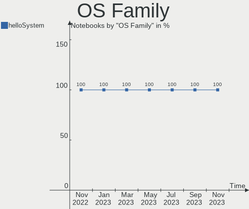
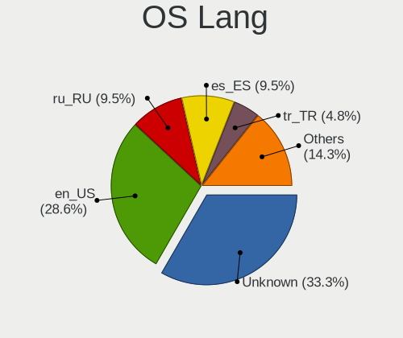
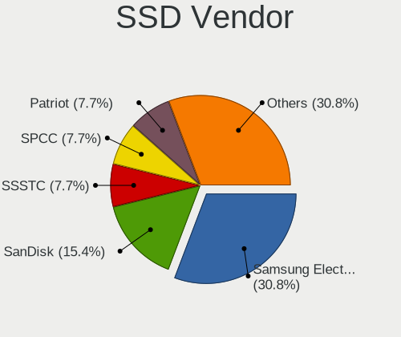
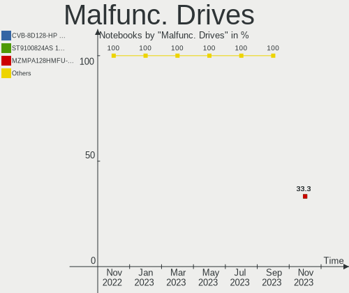
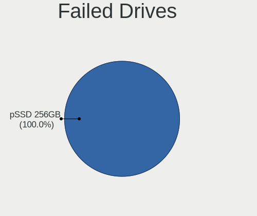
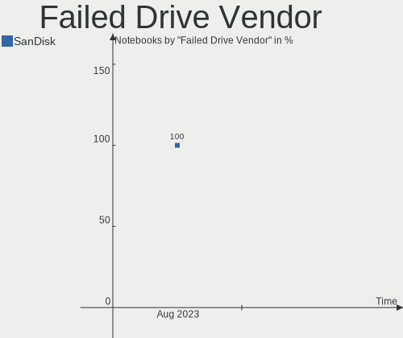
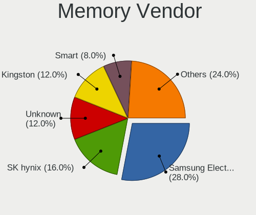
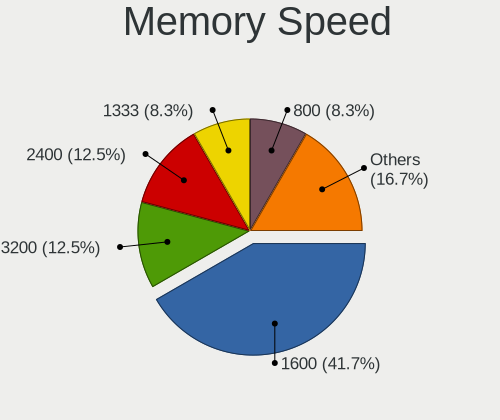

helloSystem - Hardware Trends (Notebooks)
-----------------------------------------

A project to identify most popular hardware characteristics and track their change
over time based on data collected by BSD users at https://BSD-Hardware.info.

Anyone can contribute to this report by the [hw-probe](https://github.com/linuxhw/hw-probe/blob/master/INSTALL.BSD.md) tool:

    hw-probe -all -upload

This report is for one last month. Overall report since the beginning of time: [TestDays](https://github.com/bsdhw/TestDays)

Period: May, 2023.

Contents
--------

* [ System ](#system)
  - [ OS                       ](#os)
  - [ OS Family                ](#os-family)
  - [ Arch                     ](#arch)
  - [ DE                       ](#de)
  - [ Display Server           ](#display-server)
  - [ Display Manager          ](#display-manager)
  - [ OS Lang                  ](#os-lang)
  - [ Boot Mode                ](#boot-mode)
  - [ Filesystem               ](#filesystem)
  - [ Part. scheme             ](#part-scheme)

* [ Board ](#board)
  - [ Vendor                   ](#vendor)
  - [ Model                    ](#model)
  - [ Model Family             ](#model-family)
  - [ MFG Year                 ](#mfg-year)
  - [ Form Factor              ](#form-factor)
  - [ Coreboot                 ](#coreboot)
  - [ RAM Size                 ](#ram-size)
  - [ RAM Used                 ](#ram-used)
  - [ Total Drives             ](#total-drives)
  - [ Has CD-ROM               ](#has-cd-rom)
  - [ Has Ethernet             ](#has-ethernet)
  - [ Has WiFi                 ](#has-wifi)
  - [ Has Bluetooth            ](#has-bluetooth)

* [ Location ](#location)
  - [ Country                  ](#country)
  - [ City                     ](#city)

* [ Drives ](#drives)
  - [ Drive Vendor             ](#drive-vendor)
  - [ Drive Model              ](#drive-model)
  - [ HDD Vendor               ](#hdd-vendor)
  - [ SSD Vendor               ](#ssd-vendor)
  - [ Drive Kind               ](#drive-kind)
  - [ Drive Connector          ](#drive-connector)
  - [ Drive Size               ](#drive-size)
  - [ Space Total              ](#space-total)
  - [ Space Used               ](#space-used)
  - [ Malfunc. Drives          ](#malfunc-drives)
  - [ Malfunc. Drive Vendor    ](#malfunc-drive-vendor)
  - [ Malfunc. HDD Vendor      ](#malfunc-hdd-vendor)
  - [ Malfunc. Drive Kind      ](#malfunc-drive-kind)
  - [ Failed Drives            ](#failed-drives)
  - [ Failed Drive Vendor      ](#failed-drive-vendor)
  - [ Drive Status             ](#drive-status)

* [ Storage controller ](#storage-controller)
  - [ Storage Vendor           ](#storage-vendor)
  - [ Storage Model            ](#storage-model)
  - [ Storage Kind             ](#storage-kind)

* [ Processor ](#processor)
  - [ CPU Vendor               ](#cpu-vendor)
  - [ CPU Model                ](#cpu-model)
  - [ CPU Model Family         ](#cpu-model-family)
  - [ CPU Cores                ](#cpu-cores)
  - [ CPU Sockets              ](#cpu-sockets)
  - [ CPU Threads              ](#cpu-threads)
  - [ CPU Microarch            ](#cpu-microarch)

* [ Graphics ](#graphics)
  - [ GPU Vendor               ](#gpu-vendor)
  - [ GPU Model                ](#gpu-model)
  - [ GPU Combo                ](#gpu-combo)
  - [ GPU Driver               ](#gpu-driver)
  - [ GPU Memory               ](#gpu-memory)

* [ Monitor ](#monitor)
  - [ Monitor Vendor           ](#monitor-vendor)
  - [ Monitor Model            ](#monitor-model)
  - [ Monitor Resolution       ](#monitor-resolution)
  - [ Monitor Diagonal         ](#monitor-diagonal)
  - [ Monitor Width            ](#monitor-width)
  - [ Aspect Ratio             ](#aspect-ratio)
  - [ Monitor Area             ](#monitor-area)
  - [ Pixel Density            ](#pixel-density)
  - [ Multiple Monitors        ](#multiple-monitors)

* [ Network ](#network)
  - [ Net Controller Vendor    ](#net-controller-vendor)
  - [ Net Controller Model     ](#net-controller-model)
  - [ Wireless Vendor          ](#wireless-vendor)
  - [ Wireless Model           ](#wireless-model)
  - [ Ethernet Vendor          ](#ethernet-vendor)
  - [ Ethernet Model           ](#ethernet-model)
  - [ Net Controller Kind      ](#net-controller-kind)
  - [ Used Controller          ](#used-controller)
  - [ NICs                     ](#nics)
  - [ IPv6                     ](#ipv6)

* [ Bluetooth ](#bluetooth)
  - [ Bluetooth Vendor         ](#bluetooth-vendor)
  - [ Bluetooth Model          ](#bluetooth-model)

* [ Sound ](#sound)
  - [ Sound Vendor             ](#sound-vendor)
  - [ Sound Model              ](#sound-model)

* [ Memory ](#memory)
  - [ Memory Vendor            ](#memory-vendor)
  - [ Memory Model             ](#memory-model)
  - [ Memory Kind              ](#memory-kind)
  - [ Memory Form Factor       ](#memory-form-factor)
  - [ Memory Size              ](#memory-size)
  - [ Memory Speed             ](#memory-speed)

* [ Printers & scanners ](#printers--scanners)
  - [ Printer Vendor           ](#printer-vendor)
  - [ Printer Model            ](#printer-model)
  - [ Scanner Vendor           ](#scanner-vendor)
  - [ Scanner Model            ](#scanner-model)

* [ Camera ](#camera)
  - [ Camera Vendor            ](#camera-vendor)
  - [ Camera Model             ](#camera-model)

* [ Security ](#security)
  - [ Fingerprint Vendor       ](#fingerprint-vendor)
  - [ Fingerprint Model        ](#fingerprint-model)
  - [ Chipcard Vendor          ](#chipcard-vendor)
  - [ Chipcard Model           ](#chipcard-model)

* [ Unsupported ](#unsupported)
  - [ Unsupported Devices      ](#unsupported-devices)
  - [ Unsupported Device Types ](#unsupported-device-types)

System
------

OS
--

Installed operating systems

| Name              | Notebooks | Percent |
|-------------------|-----------|---------|
| helloSystem 0.8.1 | 15        | 75%     |
| helloSystem 0.8.2 | 4         | 20%     |
| helloSystem 0.8.0 | 1         | 5%      |

OS Family
---------

OS without a version

| Name        | Notebooks | Percent |
|-------------|-----------|---------|
| helloSystem | 20        | 100%    |

Arch
----

OS architecture (x86_64, i586, etc.)

| Name  | Notebooks | Percent |
|-------|-----------|---------|
| amd64 | 20        | 100%    |

DE
--

Desktop Environment

| Name         | Notebooks | Percent |
|--------------|-----------|---------|
| helloDesktop | 20        | 100%    |

Display Server
--------------

X11 or Wayland

| Name | Notebooks | Percent |
|------|-----------|---------|
| X11  | 20        | 100%    |

Display Manager
---------------

SDDM, LightDM, etc.

| Name | Notebooks | Percent |
|------|-----------|---------|
| SLiM | 19        | 95%     |
| SDDM | 1         | 5%      |

OS Lang
-------

Language

| Lang    | Notebooks | Percent |
|---------|-----------|---------|
| en_US   | 9         | 45%     |
| ru_RU   | 3         | 15%     |
| fr_FR   | 3         | 15%     |
| es_ES   | 2         | 10%     |
| en      | 1         | 5%      |
| de_DE   | 1         | 5%      |
| Unknown | 1         | 5%      |

Boot Mode
---------

EFI or BIOS

| Mode | Notebooks | Percent |
|------|-----------|---------|
| EFI  | 20        | 100%    |

Filesystem
----------

Type of filesystem

| Type   | Notebooks | Percent |
|--------|-----------|---------|
| Zfs    | 13        | 65%     |
| Cd9660 | 7         | 35%     |

Part. scheme
------------

Scheme of partitioning

| Type | Notebooks | Percent |
|------|-----------|---------|
| GPT  | 20        | 100%    |

Board
-----

Vendor
------

Motherboard manufacturer

| Name             | Notebooks | Percent |
|------------------|-----------|---------|
| Lenovo           | 4         | 20%     |
| Hewlett-Packard  | 4         | 20%     |
| Apple            | 3         | 15%     |
| Sony             | 2         | 10%     |
| TUXEDO           | 1         | 5%      |
| Timi             | 1         | 5%      |
| Packard Bell     | 1         | 5%      |
| Google           | 1         | 5%      |
| Fujitsu          | 1         | 5%      |
| ASUSTek Computer | 1         | 5%      |
| Acer             | 1         | 5%      |

Model
-----

Motherboard model

| Name                             | Notebooks | Percent |
|----------------------------------|-----------|---------|
| TUXEDO Aura 15 Gen1              | 1         | 5%      |
| Timi TM1701                      | 1         | 5%      |
| Sony VPCEG15FB                   | 1         | 5%      |
| Sony SVF14A15CBB                 | 1         | 5%      |
| Packard Bell EasyNote LJ65       | 1         | 5%      |
| Lenovo Yoga 2 Pro 20266          | 1         | 5%      |
| Lenovo ThinkPad L450 20DSS1S402  | 1         | 5%      |
| Lenovo Flex 2-15 20405           | 1         | 5%      |
| Lenovo B570e HuronRiver Platform | 1         | 5%      |
| HP ZBook 15 G3                   | 1         | 5%      |
| HP Pavilion Notebook             | 1         | 5%      |
| HP Laptop 14-bs0xx               | 1         | 5%      |
| HP Compaq Presario CQ50          | 1         | 5%      |
| Google Sentry                    | 1         | 5%      |
| ASUS K42Jc                       | 1         | 5%      |
| Apple MacBookPro10,2             | 1         | 5%      |
| Apple MacBookPro10,1             | 1         | 5%      |
| Apple MacBook5,1                 | 1         | 5%      |
| Acer V5-131                      | 1         | 5%      |
| Unknown                          | 1         | 5%      |

Model Family
------------

Motherboard model prefix

| Name                  | Notebooks | Percent |
|-----------------------|-----------|---------|
| Apple MacBookPro10    | 2         | 10%     |
| TUXEDO Aura           | 1         | 5%      |
| Timi TM1701           | 1         | 5%      |
| Sony VPCEG15FB        | 1         | 5%      |
| Sony SVF14A15CBB      | 1         | 5%      |
| Packard Bell EasyNote | 1         | 5%      |
| Lenovo Yoga           | 1         | 5%      |
| Lenovo ThinkPad       | 1         | 5%      |
| Lenovo Flex           | 1         | 5%      |
| Lenovo B570e          | 1         | 5%      |
| HP ZBook              | 1         | 5%      |
| HP Pavilion           | 1         | 5%      |
| HP Laptop             | 1         | 5%      |
| HP Compaq             | 1         | 5%      |
| Google Sentry         | 1         | 5%      |
| ASUS K42Jc            | 1         | 5%      |
| Apple MacBook5        | 1         | 5%      |
| Acer V5-131           | 1         | 5%      |
| Unknown               | 1         | 5%      |

MFG Year
--------

Motherboard manufacture year

| Year | Notebooks | Percent |
|------|-----------|---------|
| 2017 | 3         | 15%     |
| 2012 | 3         | 15%     |
| 2022 | 2         | 10%     |
| 2014 | 2         | 10%     |
| 2013 | 2         | 10%     |
| 2011 | 2         | 10%     |
| 2008 | 2         | 10%     |
| 2020 | 1         | 5%      |
| 2019 | 1         | 5%      |
| 2015 | 1         | 5%      |
| 2010 | 1         | 5%      |

Form Factor
-----------

Physical design of the computer

| Name     | Notebooks | Percent |
|----------|-----------|---------|
| Notebook | 20        | 100%    |

Coreboot
--------

Have coreboot on board

| Used | Notebooks | Percent |
|------|-----------|---------|
| No   | 19        | 95%     |
| Yes  | 1         | 5%      |

RAM Size
--------

Total RAM memory

| Size in GB | Notebooks | Percent |
|------------|-----------|---------|
| 8.01-16.0  | 10        | 50%     |
| 4.01-8.0   | 5         | 25%     |
| 16.01-24.0 | 3         | 15%     |
| 32.01-64.0 | 1         | 5%      |
| 2.01-3.0   | 1         | 5%      |

RAM Used
--------

Used RAM memory

| Used GB  | Notebooks | Percent |
|----------|-----------|---------|
| 0.01-0.5 | 14        | 70%     |
| 0.51-1.0 | 5         | 25%     |
| 1.01-2.0 | 1         | 5%      |

Total Drives
------------

Number of drives on board

| Drives | Notebooks | Percent |
|--------|-----------|---------|
| 1      | 14        | 70%     |
| 2      | 4         | 20%     |
| 3      | 1         | 5%      |
| 0      | 1         | 5%      |

Has CD-ROM
----------

Has CD-ROM on board

| Presented | Notebooks | Percent |
|-----------|-----------|---------|
| No        | 14        | 70%     |
| Yes       | 6         | 30%     |

Has Ethernet
------------

Has Ethernet on board

| Presented | Notebooks | Percent |
|-----------|-----------|---------|
| Yes       | 16        | 80%     |
| No        | 4         | 20%     |

Has WiFi
--------

Has WiFi module

| Presented | Notebooks | Percent |
|-----------|-----------|---------|
| Yes       | 19        | 95%     |
| No        | 1         | 5%      |

Has Bluetooth
-------------

Has Bluetooth module

| Presented | Notebooks | Percent |
|-----------|-----------|---------|
| Yes       | 13        | 65%     |
| No        | 7         | 35%     |

Location
--------

Country
-------

Geographic location (country)

| Country     | Notebooks | Percent |
|-------------|-----------|---------|
| USA         | 3         | 15%     |
| Russia      | 3         | 15%     |
| Poland      | 2         | 10%     |
| Indonesia   | 2         | 10%     |
| Brazil      | 2         | 10%     |
| UK          | 1         | 5%      |
| Spain       | 1         | 5%      |
| Netherlands | 1         | 5%      |
| Mexico      | 1         | 5%      |
| Hungary     | 1         | 5%      |
| Germany     | 1         | 5%      |
| Belgium     | 1         | 5%      |
| Australia   | 1         | 5%      |

City
----

Geographic location (city)

| City       | Notebooks | Percent |
|------------|-----------|---------|
| Warsaw     | 1         | 5%      |
| Ulyanovsk  | 1         | 5%      |
| Sydney     | 1         | 5%      |
| Schoten    | 1         | 5%      |
| Patrocinio | 1         | 5%      |
| Palmas     | 1         | 5%      |
| Mytishchi  | 1         | 5%      |
| Moers      | 1         | 5%      |
| Krakow     | 1         | 5%      |
| Jakarta    | 1         | 5%      |
| Irkutsk    | 1         | 5%      |
| Indramayu  | 1         | 5%      |
| Houston    | 1         | 5%      |
| Headland   | 1         | 5%      |
| Guadalupe  | 1         | 5%      |
| Glasgow    | 1         | 5%      |
| Elim       | 1         | 5%      |
| Dothan     | 1         | 5%      |
| Budapest   | 1         | 5%      |
| Almensilla | 1         | 5%      |

Drives
------

Drive Vendor
------------

Hard drive vendors

| Vendor              | Notebooks | Drives | Percent |
|---------------------|-----------|--------|---------|
| Samsung Electronics | 5         | 6      | 21.74%  |
| Toshiba             | 4         | 4      | 17.39%  |
| Seagate             | 4         | 4      | 17.39%  |
| WDC                 | 2         | 2      | 8.7%    |
| Apple               | 2         | 2      | 8.7%    |
| Kingmax             | 1         | 1      | 4.35%   |
| Intel               | 1         | 1      | 4.35%   |
| Hitachi             | 1         | 1      | 4.35%   |
| HGST                | 1         | 2      | 4.35%   |
| Goldenfir           | 1         | 1      | 4.35%   |
| Biostar             | 1         | 1      | 4.35%   |

Drive Model
-----------

Hard drive models

| Model                            | Notebooks | Percent |
|----------------------------------|-----------|---------|
| WDC WD5000LPCX-60VHAT0 500GB     | 1         | 4%      |
| WDC WD1600BEVT-60ZCT0 160GB      | 1         | 4%      |
| Toshiba MQ04ABF100 1TB           | 1         | 4%      |
| Toshiba MK8034GSX 80GB           | 1         | 4%      |
| Toshiba MK5059GSXP 500GB         | 1         | 4%      |
| Toshiba MK3261GSYN 320GB         | 1         | 4%      |
| Seagate ST9160314AS 160GB        | 1         | 4%      |
| Seagate ST500LM000-SSHD-8GB      | 1         | 4%      |
| Seagate ST320LT020-9YG142 320GB  | 1         | 4%      |
| Seagate ST1000LM035-1RK172 1TB   | 1         | 4%      |
| Samsung SSD 980 1TB              | 1         | 4%      |
| Samsung SSD 860 EVO 500GB        | 1         | 4%      |
| Samsung MZVLB256HAHQ-00000 256GB | 1         | 4%      |
| Samsung MZMTE256HMHP-000L1 256GB | 1         | 4%      |
| Samsung HM500JJ 500GB            | 1         | 4%      |
| Samsung HM321HI 320GB            | 1         | 4%      |
| Kingmax SSD 240GB                | 1         | 4%      |
| Intel SSDPEKKF256G8L 256GB       | 1         | 4%      |
| Hitachi HTS545050B9A300 500GB    | 1         | 4%      |
| HGST HTS725050A7E630 500GB       | 1         | 4%      |
| HGST HTS541010A9E680 1TB         | 1         | 4%      |
| Goldenfir T650-60GB              | 1         | 4%      |
| Biostar S120-128GB               | 1         | 4%      |
| Apple SSD SM256E 256GB           | 1         | 4%      |
| Apple SSD SD128E 121GB           | 1         | 4%      |

HDD Vendor
----------

Hard disk drive vendors

| Vendor              | Notebooks | Drives | Percent |
|---------------------|-----------|--------|---------|
| Toshiba             | 4         | 4      | 30.77%  |
| Seagate             | 4         | 4      | 30.77%  |
| WDC                 | 2         | 2      | 15.38%  |
| Samsung Electronics | 1         | 2      | 7.69%   |
| Hitachi             | 1         | 1      | 7.69%   |
| HGST                | 1         | 2      | 7.69%   |

SSD Vendor
----------

Solid state drive vendors

| Vendor              | Notebooks | Drives | Percent |
|---------------------|-----------|--------|---------|
| Samsung Electronics | 2         | 2      | 28.57%  |
| Apple               | 2         | 2      | 28.57%  |
| Kingmax             | 1         | 1      | 14.29%  |
| Goldenfir           | 1         | 1      | 14.29%  |
| Biostar             | 1         | 1      | 14.29%  |

Drive Kind
----------

HDD or SSD

| Kind | Notebooks | Drives | Percent |
|------|-----------|--------|---------|
| HDD  | 12        | 15     | 54.55%  |
| SSD  | 7         | 7      | 31.82%  |
| NVMe | 3         | 3      | 13.64%  |

Drive Connector
---------------

SATA, SAS, NVMe, etc.

| Type | Notebooks | Drives | Percent |
|------|-----------|--------|---------|
| SATA | 17        | 22     | 85%     |
| NVMe | 3         | 3      | 15%     |

Drive Size
----------

Size of hard drive

| Size in TB | Notebooks | Drives | Percent |
|------------|-----------|--------|---------|
| 0.01-0.5   | 16        | 19     | 84.21%  |
| 0.51-1.0   | 3         | 3      | 15.79%  |

Space Total
-----------

Amount of disk space available on the file system

| Size in GB | Notebooks | Percent |
|------------|-----------|---------|
| 1-20       | 8         | 40%     |
| 251-500    | 4         | 20%     |
| 51-100     | 4         | 20%     |
| 101-250    | 2         | 10%     |
| 501-1000   | 2         | 10%     |

Space Used
----------

Amount of used disk space

| Used GB | Notebooks | Percent |
|---------|-----------|---------|
| 1-20    | 20        | 100%    |

Malfunc. Drives
---------------

Drive models with a malfunction

| Model                             | Notebooks | Drives | Percent |
|-----------------------------------|-----------|--------|---------|
| Toshiba MK5059GSXP 500GB          | 1         | 1      | 16.67%  |
| Seagate ST9160314AS 160GB         | 1         | 1      | 16.67%  |
| Seagate ST500LM000-SSHD-8GB       | 1         | 1      | 16.67%  |
| Seagate ST320LT020-9YG142 320GB   | 1         | 1      | 16.67%  |
| Samsung Electronics HM321HI 320GB | 1         | 1      | 16.67%  |
| HGST HTS541010A9E680 1TB          | 1         | 1      | 16.67%  |

Malfunc. Drive Vendor
---------------------

Vendors of faulty drives

| Vendor              | Notebooks | Drives | Percent |
|---------------------|-----------|--------|---------|
| Seagate             | 3         | 3      | 50%     |
| Toshiba             | 1         | 1      | 16.67%  |
| Samsung Electronics | 1         | 1      | 16.67%  |
| HGST                | 1         | 1      | 16.67%  |

Malfunc. HDD Vendor
-------------------

Vendors of faulty HDD drives

| Vendor              | Notebooks | Drives | Percent |
|---------------------|-----------|--------|---------|
| Seagate             | 3         | 3      | 50%     |
| Toshiba             | 1         | 1      | 16.67%  |
| Samsung Electronics | 1         | 1      | 16.67%  |
| HGST                | 1         | 1      | 16.67%  |

Malfunc. Drive Kind
-------------------

Kinds of faulty drives

| Kind | Notebooks | Drives | Percent |
|------|-----------|--------|---------|
| HDD  | 5         | 6      | 100%    |

Failed Drives
-------------

Failed drive models

| Model                             | Notebooks | Drives | Percent |
|-----------------------------------|-----------|--------|---------|
| Samsung Electronics HM500JJ 500GB | 1         | 1      | 100%    |

Failed Drive Vendor
-------------------

Failed drive vendors

| Vendor              | Notebooks | Drives | Percent |
|---------------------|-----------|--------|---------|
| Samsung Electronics | 1         | 1      | 100%    |

Drive Status
------------

Number of failed and malfunc. drives

| Status  | Notebooks | Drives | Percent |
|---------|-----------|--------|---------|
| Works   | 16        | 18     | 72.73%  |
| Malfunc | 5         | 6      | 22.73%  |
| Failed  | 1         | 1      | 4.55%   |

Storage controller
------------------

Storage Vendor
--------------

Storage controller vendors

| Vendor              | Notebooks | Percent |
|---------------------|-----------|---------|
| Intel               | 16        | 84.21%  |
| Samsung Electronics | 2         | 10.53%  |
| Nvidia              | 1         | 5.26%   |

Storage Model
-------------

Storage controller models

| Model                                                                            | Notebooks | Percent |
|----------------------------------------------------------------------------------|-----------|---------|
| Intel 7 Series Chipset Family 6-port SATA Controller [AHCI mode]                 | 4         | 20%     |
| Intel 6 Series/C200 Series Chipset Family 6 port Mobile SATA AHCI Controller     | 3         | 15%     |
| Intel 82801IBM/IEM (ICH9M/ICH9M-E) 4 port SATA Controller [AHCI mode]            | 2         | 10%     |
| Intel 8 Series SATA Controller 1 [AHCI mode]                                     | 2         | 10%     |
| Samsung NVMe SSD Controller SM981/PM981/PM983                                    | 1         | 5%      |
| Samsung NVMe SSD Controller 980                                                  | 1         | 5%      |
| Nvidia MCP79 AHCI Controller                                                     | 1         | 5%      |
| Intel Wildcat Point-LP SATA Controller [AHCI Mode]                               | 1         | 5%      |
| Intel SSD Pro 7600p/760p/E 6100p Series                                          | 1         | 5%      |
| Intel Q170/Q150/B150/H170/H110/Z170/CM236 Chipset SATA Controller [AHCI Mode]    | 1         | 5%      |
| Intel Atom/Celeron/Pentium Processor x5-E8000/J3xxx/N3xxx Series SATA Controller | 1         | 5%      |
| Intel 82801 Mobile SATA Controller [RAID mode]                                   | 1         | 5%      |
| Intel 5 Series/3400 Series Chipset 4 port SATA AHCI Controller                   | 1         | 5%      |

Storage Kind
------------

Kind of storage controller (IDE, SATA, NVMe, SAS, ...)

| Kind | Notebooks | Percent |
|------|-----------|---------|
| SATA | 16        | 80%     |
| NVMe | 3         | 15%     |
| RAID | 1         | 5%      |

Processor
---------

CPU Vendor
----------

Processor vendors

| Vendor | Notebooks | Percent |
|--------|-----------|---------|
| Intel  | 19        | 95%     |
| AMD    | 1         | 5%      |

CPU Model
---------

Processor models

| Model                                       | Notebooks | Percent |
|---------------------------------------------|-----------|---------|
| Intel Pentium Dual-Core CPU T4500 @ 2.30GHz | 1         | 5%      |
| Intel Genuine CPU 575 @ 2.00GHz             | 1         | 5%      |
| Intel Core i7-8550U CPU @ 1.80GHz           | 1         | 5%      |
| Intel Core i7-6820HQ CPU @ 2.70GHz          | 1         | 5%      |
| Intel Core i7-4510U CPU @ 2.00GHz           | 1         | 5%      |
| Intel Core i7-3615QM CPU @ 2.30GHz          | 1         | 5%      |
| Intel Core i5-8300H CPU @ 2.30GHz           | 1         | 5%      |
| Intel Core i5-5200U CPU @ 2.20GHz           | 1         | 5%      |
| Intel Core i5-4210U CPU @ 1.70GHz           | 1         | 5%      |
| Intel Core i5-3337U CPU @ 1.80GHz           | 1         | 5%      |
| Intel Core i5-3210M CPU @ 2.50GHz           | 1         | 5%      |
| Intel Core i5-2520M CPU @ 2.50GHz           | 1         | 5%      |
| Intel Core i5-2410M CPU @ 2.30GHz           | 1         | 5%      |
| Intel Core i5 CPU M 460 @ 2.53GH            | 1         | 5%      |
| Intel Core i3-2310M CPU @ 2.10GHz           | 1         | 5%      |
| Intel Core 2 Duo CPU P7350 @ 2.00GHz        | 1         | 5%      |
| Intel Celeron CPU N3060 @ 1.60GHz           | 1         | 5%      |
| Intel Celeron CPU 3855U @ 1.60GHz           | 1         | 5%      |
| Intel Celeron CPU 1007U @ 1.50GHz           | 1         | 5%      |
| AMD Ryzen 7 4700U with Radeon Graphics      | 1         | 5%      |

CPU Model Family
----------------

Processor model prefix

| Model                   | Notebooks | Percent |
|-------------------------|-----------|---------|
| Intel Core i5           | 8         | 40%     |
| Intel Core i7           | 4         | 20%     |
| Intel Celeron           | 3         | 15%     |
| Intel Pentium Dual-Core | 1         | 5%      |
| Intel Genuine           | 1         | 5%      |
| Intel Core i3           | 1         | 5%      |
| Intel Core 2 Duo        | 1         | 5%      |
| AMD Ryzen 7             | 1         | 5%      |

CPU Cores
---------

Number of processor cores

| Number  | Notebooks | Percent |
|---------|-----------|---------|
| 2       | 12        | 60%     |
| 4       | 4         | 20%     |
| Unknown | 2         | 10%     |
| 8       | 1         | 5%      |
| 1       | 1         | 5%      |

CPU Sockets
-----------

Number of sockets

| Number | Notebooks | Percent |
|--------|-----------|---------|
| 1      | 19        | 95%     |
| 2      | 1         | 5%      |

CPU Threads
-----------

Threads per core (Hyper-Threading)

| Number  | Notebooks | Percent |
|---------|-----------|---------|
| 2       | 13        | 65%     |
| 1       | 4         | 20%     |
| Unknown | 3         | 15%     |

CPU Microarch
-------------

Microarchitecture

| Name        | Notebooks | Percent |
|-------------|-----------|---------|
| IvyBridge   | 4         | 20%     |
| SandyBridge | 3         | 15%     |
| Skylake     | 2         | 10%     |
| Penryn      | 2         | 10%     |
| KabyLake    | 2         | 10%     |
| Haswell     | 2         | 10%     |
| Zen 2       | 1         | 5%      |
| Westmere    | 1         | 5%      |
| Silvermont  | 1         | 5%      |
| Core        | 1         | 5%      |
| Broadwell   | 1         | 5%      |

Graphics
--------

GPU Vendor
----------

Vendors of graphics cards

| Vendor | Notebooks | Percent |
|--------|-----------|---------|
| Intel  | 17        | 62.96%  |
| Nvidia | 9         | 33.33%  |
| AMD    | 1         | 3.7%    |

GPU Model
---------

Graphics card models

| Model                                                                                    | Notebooks | Percent |
|------------------------------------------------------------------------------------------|-----------|---------|
| Intel 3rd Gen Core processor Graphics Controller                                         | 4         | 14.81%  |
| Intel 2nd Generation Core Processor Family Integrated Graphics Controller                | 3         | 11.11%  |
| Intel Haswell-ULT Integrated Graphics Controller                                         | 2         | 7.41%   |
| Nvidia GT218M [GeForce 310M]                                                             | 1         | 3.7%    |
| Nvidia GT216M [GeForce GT 240M]                                                          | 1         | 3.7%    |
| Nvidia GP108M [GeForce MX150]                                                            | 1         | 3.7%    |
| Nvidia GP107M [GeForce GTX 1050 Mobile]                                                  | 1         | 3.7%    |
| Nvidia GM107GLM [Quadro M2000M]                                                          | 1         | 3.7%    |
| Nvidia GK208M [GeForce GT 735M]                                                          | 1         | 3.7%    |
| Nvidia GK107M [GeForce GT 650M Mac Edition]                                              | 1         | 3.7%    |
| Nvidia GF119M [GeForce 410M]                                                             | 1         | 3.7%    |
| Nvidia C79 [GeForce 9400M]                                                               | 1         | 3.7%    |
| Intel UHD Graphics 620                                                                   | 1         | 3.7%    |
| Intel Mobile 4 Series Chipset Integrated Graphics Controller                             | 1         | 3.7%    |
| Intel HD Graphics 5500                                                                   | 1         | 3.7%    |
| Intel HD Graphics 530                                                                    | 1         | 3.7%    |
| Intel HD Graphics 510                                                                    | 1         | 3.7%    |
| Intel Core Processor Integrated Graphics Controller                                      | 1         | 3.7%    |
| Intel CoffeeLake-H GT2 [UHD Graphics 630]                                                | 1         | 3.7%    |
| Intel Atom/Celeron/Pentium Processor x5-E8000/J3xxx/N3xxx Integrated Graphics Controller | 1         | 3.7%    |
| AMD Renoir                                                                               | 1         | 3.7%    |

GPU Combo
---------

Combinations of graphics cards

| Name           | Notebooks | Percent |
|----------------|-----------|---------|
| 1 x Intel      | 9         | 45%     |
| Intel + Nvidia | 7         | 35%     |
| 1 x Nvidia     | 2         | 10%     |
| 2 x Intel      | 1         | 5%      |
| 1 x AMD        | 1         | 5%      |

GPU Driver
----------

Free vs proprietary

| Driver      | Notebooks | Percent |
|-------------|-----------|---------|
| Free        | 17        | 85%     |
| Proprietary | 2         | 10%     |
| Unknown     | 1         | 5%      |

GPU Memory
----------

Total video memory

| Size in GB | Notebooks | Percent |
|------------|-----------|---------|
| Unknown    | 20        | 100%    |

Monitor
-------

Monitor Vendor
--------------

Monitor vendors

| Vendor                  | Notebooks | Percent |
|-------------------------|-----------|---------|
| AU Optronics            | 5         | 26.32%  |
| Samsung Electronics     | 4         | 21.05%  |
| LG Display              | 2         | 10.53%  |
| Apple                   | 2         | 10.53%  |
| LG Philips              | 1         | 5.26%   |
| InfoVision              | 1         | 5.26%   |
| Chimei Innolux          | 1         | 5.26%   |
| Chi Mei Optoelectronics | 1         | 5.26%   |
| BOE                     | 1         | 5.26%   |
| AOC                     | 1         | 5.26%   |

Monitor Model
-------------

Monitor models

| Model                                                                    | Notebooks | Percent |
|--------------------------------------------------------------------------|-----------|---------|
| Samsung Electronics SyncMaster SAM058D 1600x900 440x250mm 19.9-inch      | 1         | 5.26%   |
| Samsung Electronics LCD Monitor SEC3541 1366x768 300x170mm 13.6-inch     | 1         | 5.26%   |
| Samsung Electronics LCD Monitor SDC424A 3200x1800 290x170mm 13.2-inch    | 1         | 5.26%   |
| Samsung Electronics LCD Monitor SAM0902 1920x1080 890x500mm 40.2-inch    | 1         | 5.26%   |
| LG Philips LP154WX4-TLCB LPL3101 1280x800 330x210mm 15.4-inch            | 1         | 5.26%   |
| LG Display LCD Monitor LGD046F 1920x1080 350x190mm 15.7-inch             | 1         | 5.26%   |
| LG Display LCD Monitor LGD033A 1366x768 340x190mm 15.3-inch              | 1         | 5.26%   |
| InfoVision LCD Monitor IVO0533 1366x768 290x170mm 13.2-inch              | 1         | 5.26%   |
| Chimei Innolux LCD Monitor CMN15D7 1920x1080 340x190mm 15.3-inch         | 1         | 5.26%   |
| Chi Mei Optoelectronics LCD Monitor CMO1465 1366x768 310x180mm 14.1-inch | 1         | 5.26%   |
| BOE LCD Monitor BOE0747 1920x1080 340x190mm 15.3-inch                    | 1         | 5.26%   |
| AU Optronics LCD Monitor AUO325C 1366x768 260x140mm 11.6-inch            | 1         | 5.26%   |
| AU Optronics LCD Monitor AUO323E 1600x900 310x170mm 13.9-inch            | 1         | 5.26%   |
| AU Optronics LCD Monitor AUO2E3C 1366x768 310x170mm 13.9-inch            | 1         | 5.26%   |
| AU Optronics LCD Monitor AUO183C 1366x768 310x170mm 13.9-inch            | 1         | 5.26%   |
| AU Optronics LCD Monitor AUO109D 1920x1080 380x210mm 17.1-inch           | 1         | 5.26%   |
| Apple Color LCD APPA014 2560x1600 290x180mm 13.4-inch                    | 1         | 5.26%   |
| Apple Color LCD APPA00F 2880x1800 330x210mm 15.4-inch                    | 1         | 5.26%   |
| AOC T2242we AOC2242 1920x1080 480x270mm 21.7-inch                        | 1         | 5.26%   |

Monitor Resolution
------------------

Monitor screen resolution

| Resolution       | Notebooks | Percent |
|------------------|-----------|---------|
| 1366x768 (WXGA)  | 7         | 38.89%  |
| 1920x1080 (FHD)  | 5         | 27.78%  |
| 1600x900 (HD+)   | 2         | 11.11%  |
| 3200x1800 (QHD+) | 1         | 5.56%   |
| 2880x1800        | 1         | 5.56%   |
| 2560x1600        | 1         | 5.56%   |
| 1280x800 (WXGA)  | 1         | 5.56%   |

Monitor Diagonal
----------------

Diagonal size in inches

| Inches | Notebooks | Percent |
|--------|-----------|---------|
| 13     | 7         | 36.84%  |
| 15     | 6         | 31.58%  |
| 40     | 1         | 5.26%   |
| 21     | 1         | 5.26%   |
| 19     | 1         | 5.26%   |
| 17     | 1         | 5.26%   |
| 14     | 1         | 5.26%   |
| 11     | 1         | 5.26%   |

Monitor Width
-------------

Physical width

| Width in mm | Notebooks | Percent |
|-------------|-----------|---------|
| 301-350     | 10        | 52.63%  |
| 201-300     | 5         | 26.32%  |
| 401-500     | 2         | 10.53%  |
| 801-900     | 1         | 5.26%   |
| 351-400     | 1         | 5.26%   |

Aspect Ratio
------------

Proportional relationship between the width and the height

| Ratio | Notebooks | Percent |
|-------|-----------|---------|
| 16/9  | 14        | 82.35%  |
| 16/10 | 3         | 17.65%  |

Monitor Area
------------

Area in inch²

| Area in inch² | Notebooks | Percent |
|----------------|-----------|---------|
| 81-90          | 5         | 26.32%  |
| 71-80          | 3         | 15.79%  |
| 101-110        | 3         | 15.79%  |
| 91-100         | 3         | 15.79%  |
| 51-60          | 1         | 5.26%   |
| 201-250        | 1         | 5.26%   |
| 151-200        | 1         | 5.26%   |
| 121-130        | 1         | 5.26%   |
| 501-1000       | 1         | 5.26%   |

Pixel Density
-------------

Pixels per inch

| Density       | Notebooks | Percent |
|---------------|-----------|---------|
| 101-120       | 7         | 36.84%  |
| 121-160       | 6         | 31.58%  |
| 51-100        | 3         | 15.79%  |
| 161-240       | 2         | 10.53%  |
| More than 240 | 1         | 5.26%   |

Multiple Monitors
-----------------

Total monitors connected

| Total | Notebooks | Percent |
|-------|-----------|---------|
| 1     | 16        | 80%     |
| 2     | 2         | 10%     |
| 0     | 2         | 10%     |

Network
-------

Net Controller Vendor
---------------------

Controller vendors

| Vendor                | Notebooks | Percent |
|-----------------------|-----------|---------|
| Intel                 | 10        | 30.3%   |
| Realtek Semiconductor | 7         | 21.21%  |
| Broadcom              | 5         | 15.15%  |
| Qualcomm Atheros      | 4         | 12.12%  |
| TP-Link               | 1         | 3.03%   |
| Sierra Wireless       | 1         | 3.03%   |
| Samsung Electronics   | 1         | 3.03%   |
| Nvidia                | 1         | 3.03%   |
| MediaTek              | 1         | 3.03%   |
| JMicron Technology    | 1         | 3.03%   |
| Google                | 1         | 3.03%   |

Net Controller Model
--------------------

Controller models

| Model                                                                             | Notebooks | Percent |
|-----------------------------------------------------------------------------------|-----------|---------|
| Realtek RTL8111/8168/8411 PCI Express Gigabit Ethernet Controller                 | 6         | 14.63%  |
| Qualcomm Atheros AR9285 Wireless Network Adapter (PCI-Express)                    | 3         | 7.32%   |
| Intel Wireless 7265                                                               | 2         | 4.88%   |
| Broadcom NetXtreme BCM57786 Gigabit Ethernet PCIe                                 | 2         | 4.88%   |
| Broadcom BCM4331 802.11a/b/g/n                                                    | 2         | 4.88%   |
| TP-Link AC600 wireless Realtek RTL8811AU [Archer T2U Nano]                        | 1         | 2.44%   |
| Sierra Wireless EM7345 4G LTE                                                     | 1         | 2.44%   |
| Samsung Galaxy series, misc. (tethering mode)                                     | 1         | 2.44%   |
| Realtek RTL8723DE Wireless Network Adapter                                        | 1         | 2.44%   |
| Realtek RTL8188CE 802.11b/g/n WiFi Adapter                                        | 1         | 2.44%   |
| Realtek RTL810xE PCI Express Fast Ethernet controller                             | 1         | 2.44%   |
| Realtek Realtek Bluetooth 4.2 Adapter                                             | 1         | 2.44%   |
| Qualcomm Atheros AR8151 v2.0 Gigabit Ethernet                                     | 1         | 2.44%   |
| Qualcomm Atheros AR242x / AR542x Wireless Network Adapter (PCI-Express)           | 1         | 2.44%   |
| Nvidia MCP79 Ethernet                                                             | 1         | 2.44%   |
| MediaTek USB Ethernet-RNDIS                                                       | 1         | 2.44%   |
| JMicron JMC250 PCI Express Gigabit Ethernet Controller                            | 1         | 2.44%   |
| Intel Wireless 8265 / 8275                                                        | 1         | 2.44%   |
| Intel Wireless 8260                                                               | 1         | 2.44%   |
| Intel Wireless 7260                                                               | 1         | 2.44%   |
| Intel WiFi Link 5100                                                              | 1         | 2.44%   |
| Intel Wi-Fi 6 AX200                                                               | 1         | 2.44%   |
| Intel Ethernet Connection (3) I218-V                                              | 1         | 2.44%   |
| Intel Centrino Wireless-N 1000 [Condor Peak]                                      | 1         | 2.44%   |
| Intel Centrino Advanced-N 6205 [Taylor Peak]                                      | 1         | 2.44%   |
| Intel Cannon Lake PCH CNVi WiFi                                                   | 1         | 2.44%   |
| Intel 82579V Gigabit Network Connection                                           | 1         | 2.44%   |
| Google Pixel 6a CDC Network Control Model (NCM) CDC Network Data CDC Network Data | 1         | 2.44%   |
| Broadcom NetLink BCM5784M Gigabit Ethernet PCIe                                   | 1         | 2.44%   |
| Broadcom NetLink BCM57785 Gigabit Ethernet PCIe                                   | 1         | 2.44%   |
| Broadcom BCM4322 802.11a/b/g/n Wireless LAN Controller                            | 1         | 2.44%   |

Wireless Vendor
---------------

Wireless vendors

| Vendor                | Notebooks | Percent |
|-----------------------|-----------|---------|
| Intel                 | 10        | 47.62%  |
| Qualcomm Atheros      | 4         | 19.05%  |
| Broadcom              | 3         | 14.29%  |
| Realtek Semiconductor | 2         | 9.52%   |
| TP-Link               | 1         | 4.76%   |
| Sierra Wireless       | 1         | 4.76%   |

Wireless Model
--------------

Wireless models

| Model                                                                   | Notebooks | Percent |
|-------------------------------------------------------------------------|-----------|---------|
| Qualcomm Atheros AR9285 Wireless Network Adapter (PCI-Express)          | 3         | 13.64%  |
| Intel Wireless 7265                                                     | 2         | 9.09%   |
| Broadcom BCM4331 802.11a/b/g/n                                          | 2         | 9.09%   |
| TP-Link AC600 wireless Realtek RTL8811AU [Archer T2U Nano]              | 1         | 4.55%   |
| Sierra Wireless EM7345 4G LTE                                           | 1         | 4.55%   |
| Realtek RTL8723DE Wireless Network Adapter                              | 1         | 4.55%   |
| Realtek RTL8188CE 802.11b/g/n WiFi Adapter                              | 1         | 4.55%   |
| Realtek Realtek Bluetooth 4.2 Adapter                                   | 1         | 4.55%   |
| Qualcomm Atheros AR242x / AR542x Wireless Network Adapter (PCI-Express) | 1         | 4.55%   |
| Intel Wireless 8265 / 8275                                              | 1         | 4.55%   |
| Intel Wireless 8260                                                     | 1         | 4.55%   |
| Intel Wireless 7260                                                     | 1         | 4.55%   |
| Intel WiFi Link 5100                                                    | 1         | 4.55%   |
| Intel Wi-Fi 6 AX200                                                     | 1         | 4.55%   |
| Intel Centrino Wireless-N 1000 [Condor Peak]                            | 1         | 4.55%   |
| Intel Centrino Advanced-N 6205 [Taylor Peak]                            | 1         | 4.55%   |
| Intel Cannon Lake PCH CNVi WiFi                                         | 1         | 4.55%   |
| Broadcom BCM4322 802.11a/b/g/n Wireless LAN Controller                  | 1         | 4.55%   |

Ethernet Vendor
---------------

Ethernet vendors

| Vendor                | Notebooks | Percent |
|-----------------------|-----------|---------|
| Realtek Semiconductor | 7         | 38.89%  |
| Broadcom              | 4         | 22.22%  |
| Intel                 | 2         | 11.11%  |
| Samsung Electronics   | 1         | 5.56%   |
| Qualcomm Atheros      | 1         | 5.56%   |
| Nvidia                | 1         | 5.56%   |
| MediaTek              | 1         | 5.56%   |
| JMicron Technology    | 1         | 5.56%   |

Ethernet Model
--------------

Ethernet models

| Model                                                             | Notebooks | Percent |
|-------------------------------------------------------------------|-----------|---------|
| Realtek RTL8111/8168/8411 PCI Express Gigabit Ethernet Controller | 6         | 33.33%  |
| Broadcom NetXtreme BCM57786 Gigabit Ethernet PCIe                 | 2         | 11.11%  |
| Samsung Galaxy series, misc. (tethering mode)                     | 1         | 5.56%   |
| Realtek RTL810xE PCI Express Fast Ethernet controller             | 1         | 5.56%   |
| Qualcomm Atheros AR8151 v2.0 Gigabit Ethernet                     | 1         | 5.56%   |
| Nvidia MCP79 Ethernet                                             | 1         | 5.56%   |
| MediaTek USB Ethernet-RNDIS                                       | 1         | 5.56%   |
| JMicron JMC250 PCI Express Gigabit Ethernet Controller            | 1         | 5.56%   |
| Intel Ethernet Connection (3) I218-V                              | 1         | 5.56%   |
| Intel 82579V Gigabit Network Connection                           | 1         | 5.56%   |
| Broadcom NetLink BCM5784M Gigabit Ethernet PCIe                   | 1         | 5.56%   |
| Broadcom NetLink BCM57785 Gigabit Ethernet PCIe                   | 1         | 5.56%   |

Net Controller Kind
-------------------

Ethernet, WiFi or modem

| Kind     | Notebooks | Percent |
|----------|-----------|---------|
| WiFi     | 19        | 52.78%  |
| Ethernet | 16        | 44.44%  |
| Unknown  | 1         | 2.78%   |

Used Controller
---------------

Currently used network controller

| Kind     | Notebooks | Percent |
|----------|-----------|---------|
| WiFi     | 12        | 75%     |
| Ethernet | 4         | 25%     |

NICs
----

Total network controllers on board

| Total | Notebooks | Percent |
|-------|-----------|---------|
| 2     | 15        | 75%     |
| 1     | 5         | 25%     |

IPv6
----

IPv6 vs IPv4

| Used | Notebooks | Percent |
|------|-----------|---------|
| No   | 17        | 85%     |
| Yes  | 3         | 15%     |

Bluetooth
---------

Bluetooth Vendor
----------------

Controller vendors

| Vendor            | Notebooks | Percent |
|-------------------|-----------|---------|
| Intel             | 7         | 53.85%  |
| Apple             | 3         | 23.08%  |
| Foxconn / Hon Hai | 2         | 15.38%  |
| ASUSTek Computer  | 1         | 7.69%   |

Bluetooth Model
---------------

Controller models

| Model                                                       | Notebooks | Percent |
|-------------------------------------------------------------|-----------|---------|
| Intel Bluetooth wireless interface                          | 5         | 38.46%  |
| Apple Bluetooth Host Controller                             | 3         | 23.08%  |
| Intel Bluetooth 9460/9560 Jefferson Peak (JfP)              | 1         | 7.69%   |
| Intel AX200 Bluetooth                                       | 1         | 7.69%   |
| Foxconn / Hon Hai Qualcomm Atheros AR3011 Bluetooth Adapter | 1         | 7.69%   |
| Foxconn / Hon Hai Broadcom BCM20702 Bluetooth USB Device    | 1         | 7.69%   |
| ASUS BT-270 Bluetooth Adapter                               | 1         | 7.69%   |

Sound
-----

Sound Vendor
------------

Sound card vendors

| Vendor            | Notebooks | Percent |
|-------------------|-----------|---------|
| Intel             | 18        | 75%     |
| Nvidia            | 3         | 12.5%   |
| Texas Instruments | 1         | 4.17%   |
| Conexant Systems  | 1         | 4.17%   |
| AMD               | 1         | 4.17%   |

Sound Model
-----------

Sound card models

| Model                                                                                             | Notebooks | Percent |
|---------------------------------------------------------------------------------------------------|-----------|---------|
| Intel 7 Series/C216 Chipset Family High Definition Audio Controller                               | 4         | 14.29%  |
| Intel 6 Series/C200 Series Chipset Family High Definition Audio Controller                        | 3         | 10.71%  |
| Intel Sunrise Point-LP HD Audio                                                                   | 2         | 7.14%   |
| Intel Haswell-ULT HD Audio Controller                                                             | 2         | 7.14%   |
| Intel 82801I (ICH9 Family) HD Audio Controller                                                    | 2         | 7.14%   |
| Intel 8 Series HD Audio Controller                                                                | 2         | 7.14%   |
| Texas Instruments PCM2902 Audio Codec                                                             | 1         | 3.57%   |
| Nvidia MCP79 High Definition Audio                                                                | 1         | 3.57%   |
| Nvidia GT216 HDMI Audio Controller                                                                | 1         | 3.57%   |
| Nvidia GK107 HDMI Audio Controller                                                                | 1         | 3.57%   |
| Intel Wildcat Point-LP High Definition Audio Controller                                           | 1         | 3.57%   |
| Intel Cannon Lake PCH cAVS                                                                        | 1         | 3.57%   |
| Intel Broadwell-U Audio Controller                                                                | 1         | 3.57%   |
| Intel Atom/Celeron/Pentium Processor x5-E8000/J3xxx/N3xxx Series High Definition Audio Controller | 1         | 3.57%   |
| Intel 5 Series/3400 Series Chipset High Definition Audio                                          | 1         | 3.57%   |
| Intel 100 Series/C230 Series Chipset Family HD Audio Controller                                   | 1         | 3.57%   |
| Conexant Systems Hi-Res Audio                                                                     | 1         | 3.57%   |
| AMD Renoir Radeon High Definition Audio Controller                                                | 1         | 3.57%   |
| AMD Family 17h/19h HD Audio Controller                                                            | 1         | 3.57%   |

Memory
------

Memory Vendor
-------------

Memory module vendors

| Vendor              | Notebooks | Percent |
|---------------------|-----------|---------|
| Samsung Electronics | 8         | 38.1%   |
| SK hynix            | 3         | 14.29%  |
| Micron Technology   | 3         | 14.29%  |
| Unknown             | 3         | 14.29%  |
| Unknown             | 1         | 4.76%   |
| Ramaxel Technology  | 1         | 4.76%   |
| Kingston            | 1         | 4.76%   |
| Corsair             | 1         | 4.76%   |

Memory Model
------------

Memory module models

| Model                                                   | Notebooks | Percent |
|---------------------------------------------------------|-----------|---------|
| Unknown                                                 | 3         | 13.04%  |
| Unknown RAM Module 4GB SODIMM DDR3                      | 1         | 4.35%   |
| Unknown RAM Module 2GB SODIMM DDR3                      | 1         | 4.35%   |
| SK hynix RAM Module 4GB SODIMM DDR3 1600MT/s            | 1         | 4.35%   |
| SK hynix RAM HMT41GS6MFR8C-PB 8GB SODIMM DDR3 1600MT/s  | 1         | 4.35%   |
| SK hynix RAM HMA81GS6JJR8N-VK 8GB SODIMM DDR4 2667MT/s  | 1         | 4.35%   |
| Samsung RAM Module 8GB SODIMM DDR4 2133MT/s             | 1         | 4.35%   |
| Samsung RAM M471B5273BH1-CF8 4GB SODIMM DDR3 1067MT/s   | 1         | 4.35%   |
| Samsung RAM M471B5173EB0-YK0 4GB SODIMM DDR3 1600MT/s   | 1         | 4.35%   |
| Samsung RAM M471B5173DB0-YK0 4GB SODIMM DDR3 1600MT/s   | 1         | 4.35%   |
| Samsung RAM M471B5173DB0-YK0 4GB DDR3 1600MT/s          | 1         | 4.35%   |
| Samsung RAM M471A2K43CB1-CTD 16GB SODIMM DDR4 2667MT/s  | 1         | 4.35%   |
| Samsung RAM M471A1K43BB1-CRC 8GB SODIMM DDR4 2400MT/s   | 1         | 4.35%   |
| Samsung RAM K4E8E324EB-EGCF 2GB LPDDR3 1867MT/s         | 1         | 4.35%   |
| Ramaxel RAM RMN1150EC48D7F-667 1GB SODIMM DDR2 667MT/s  | 1         | 4.35%   |
| Micron RAM Module 4GB SODIMM DDR3 1600MT/s              | 1         | 4.35%   |
| Micron RAM Module 4GB SODIMM DDR3 1067MT/s              | 1         | 4.35%   |
| Micron RAM 16KTF51264HZ-1G4M1 4GB SODIMM DDR3 1333MT/s  | 1         | 4.35%   |
| Micron RAM 16JTF51264HZ-1G4M1 4GB SODIMM DDR3 1333MT/s  | 1         | 4.35%   |
| Kingston RAM SNY1333D3S9ELC/4G 4GB SODIMM DDR3 1333MT/s | 1         | 4.35%   |
| Corsair RAM Module 4GB SODIMM DDR3 1067MT/s             | 1         | 4.35%   |

Memory Kind
-----------

Memory module kinds

| Kind    | Notebooks | Percent |
|---------|-----------|---------|
| DDR3    | 11        | 57.89%  |
| DDR4    | 4         | 21.05%  |
| Unknown | 2         | 10.53%  |
| LPDDR3  | 1         | 5.26%   |
| DDR2    | 1         | 5.26%   |

Memory Form Factor
------------------

Physical design of the memory module

| Name    | Notebooks | Percent |
|---------|-----------|---------|
| SODIMM  | 17        | 89.47%  |
| Unknown | 2         | 10.53%  |

Memory Size
-----------

Memory module size

| Size  | Notebooks | Percent |
|-------|-----------|---------|
| 4096  | 12        | 54.55%  |
| 8192  | 4         | 18.18%  |
| 2048  | 3         | 13.64%  |
| 16384 | 2         | 9.09%   |
| 1024  | 1         | 4.55%   |

Memory Speed
------------

Memory module speed

| Speed   | Notebooks | Percent |
|---------|-----------|---------|
| 1600    | 6         | 31.58%  |
| 2667    | 2         | 10.53%  |
| 1333    | 2         | 10.53%  |
| 1067    | 2         | 10.53%  |
| Unknown | 2         | 10.53%  |
| 2400    | 1         | 5.26%   |
| 2133    | 1         | 5.26%   |
| 1867    | 1         | 5.26%   |
| 800     | 1         | 5.26%   |
| 667     | 1         | 5.26%   |

Printers & scanners
-------------------

Printer Vendor
--------------

Printer device vendors

Zero info for selected period =(

Printer Model
-------------

Printer device models

Zero info for selected period =(

Scanner Vendor
--------------

Scanner device vendors

Zero info for selected period =(

Scanner Model
-------------

Scanner device models

Zero info for selected period =(

Camera
------

Camera Vendor
-------------

Camera device vendors

| Vendor                                 | Notebooks | Percent |
|----------------------------------------|-----------|---------|
| Chicony Electronics                    | 6         | 42.86%  |
| Cheng Uei Precision Industry (Foxlink) | 2         | 14.29%  |
| Apple                                  | 2         | 14.29%  |
| Suyin                                  | 1         | 7.14%   |
| Sunplus Innovation Technology          | 1         | 7.14%   |
| IMC Networks                           | 1         | 7.14%   |
| Bison Electronics                      | 1         | 7.14%   |

Camera Model
------------

Camera device models

| Model                                                        | Notebooks | Percent |
|--------------------------------------------------------------|-----------|---------|
| Apple FaceTime HD Camera (Built-in)                          | 2         | 14.29%  |
| Suyin Acer/HP Integrated Webcam [CN0314]                     | 1         | 7.14%   |
| Sunplus Integrated Camera                                    | 1         | 7.14%   |
| IMC Networks Integrated Webcam                               | 1         | 7.14%   |
| Chicony Sony Visual Communication Camera                     | 1         | 7.14%   |
| Chicony Lenovo EasyCamera                                    | 1         | 7.14%   |
| Chicony Integrated Camera                                    | 1         | 7.14%   |
| Chicony HP Universal Camera                                  | 1         | 7.14%   |
| Chicony Front Camera                                         | 1         | 7.14%   |
| Chicony FJ Camera                                            | 1         | 7.14%   |
| Cheng Uei Precision Industry (Foxlink) XiaoMi USB 2.0 Webcam | 1         | 7.14%   |
| Cheng Uei Precision Industry (Foxlink) HP Webcam             | 1         | 7.14%   |
| Bison Lenovo EasyCamera integrated webcam                    | 1         | 7.14%   |

Security
--------

Fingerprint Vendor
------------------

Fingerprint sensor vendors

| Vendor                | Notebooks | Percent |
|-----------------------|-----------|---------|
| Elan Microelectronics | 2         | 66.67%  |
| Validity Sensors      | 1         | 33.33%  |

Fingerprint Model
-----------------

Fingerprint sensor models

| Model                                      | Notebooks | Percent |
|--------------------------------------------|-----------|---------|
| Elan Fingerprint Sensor                    | 2         | 66.67%  |
| Validity Sensors VFS495 Fingerprint Reader | 1         | 33.33%  |

Chipcard Vendor
---------------

Chipcard module vendors

Zero info for selected period =(

Chipcard Model
--------------

Chipcard module models

Zero info for selected period =(

Unsupported
-----------

Unsupported Devices
-------------------

Total unsupported devices on board

| Total | Notebooks | Percent |
|-------|-----------|---------|
| 1     | 10        | 50%     |
| 2     | 5         | 25%     |
| 0     | 4         | 20%     |
| 3     | 1         | 5%      |

Unsupported Device Types
------------------------

Types of unsupported devices

| Type                     | Notebooks | Percent |
|--------------------------|-----------|---------|
| Communication controller | 14        | 60.87%  |
| Fingerprint reader       | 3         | 13.04%  |
| Net/ethernet             | 2         | 8.7%    |
| Card reader              | 2         | 8.7%    |
| Net/wireless             | 1         | 4.35%   |
| Bluetooth                | 1         | 4.35%   |

