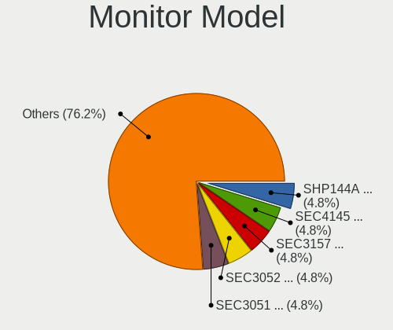
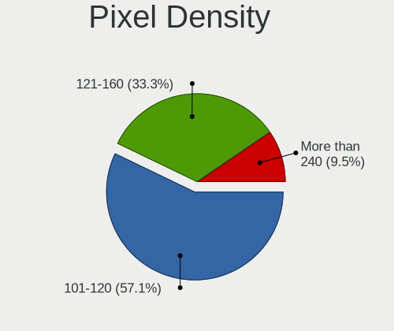
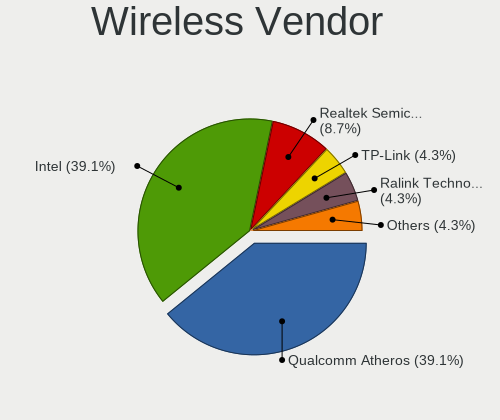
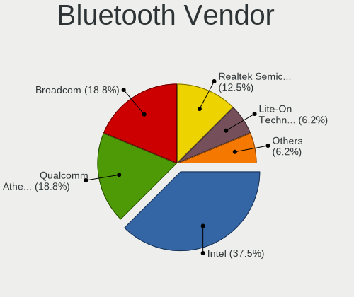
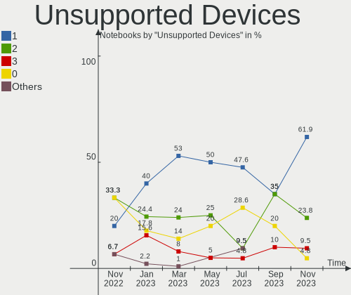

helloSystem Hardware Trends (Notebooks)
---------------------------------------

A project to identify most popular hardware characteristics and track their change
over time based on data collected by helloSystem users at https://BSD-Hardware.info.

Anyone can contribute to this report by the [hw-probe](https://github.com/linuxhw/hw-probe/blob/master/INSTALL.BSD.md) tool:

    hw-probe -all -upload

Full-feature report is available here: https://bsd-hardware.info/?view=trends&formfactor=notebook

Period: Aug, 2021.

Contents
--------

* [ System ](#system)
  - [ OS                       ](#os)
  - [ OS Family                ](#os-family)
  - [ Arch                     ](#arch)
  - [ DE                       ](#de)
  - [ Display Server           ](#display-server)
  - [ Display Manager          ](#display-manager)
  - [ OS Lang                  ](#os-lang)
  - [ Boot Mode                ](#boot-mode)
  - [ Filesystem               ](#filesystem)
  - [ Part. scheme             ](#part-scheme)

* [ Board ](#board)
  - [ Vendor                   ](#vendor)
  - [ Model                    ](#model)
  - [ Model Family             ](#model-family)
  - [ MFG Year                 ](#mfg-year)
  - [ Form Factor              ](#form-factor)
  - [ Coreboot                 ](#coreboot)
  - [ RAM Size                 ](#ram-size)
  - [ RAM Used                 ](#ram-used)
  - [ Total Drives             ](#total-drives)
  - [ Has CD-ROM               ](#has-cd-rom)
  - [ Has Ethernet             ](#has-ethernet)
  - [ Has WiFi                 ](#has-wifi)
  - [ Has Bluetooth            ](#has-bluetooth)

* [ Location ](#location)
  - [ Country                  ](#country)
  - [ City                     ](#city)

* [ Drives ](#drives)
  - [ Drive Vendor             ](#drive-vendor)
  - [ Drive Model              ](#drive-model)
  - [ HDD Vendor               ](#hdd-vendor)
  - [ SSD Vendor               ](#ssd-vendor)
  - [ Drive Kind               ](#drive-kind)
  - [ Drive Connector          ](#drive-connector)
  - [ Drive Size               ](#drive-size)
  - [ Space Total              ](#space-total)
  - [ Space Used               ](#space-used)
  - [ Malfunc. Drives          ](#malfunc-drives)
  - [ Malfunc. Drive Vendor    ](#malfunc-drive-vendor)
  - [ Malfunc. HDD Vendor      ](#malfunc-hdd-vendor)
  - [ Malfunc. Drive Kind      ](#malfunc-drive-kind)
  - [ Failed Drives            ](#failed-drives)
  - [ Failed Drive Vendor      ](#failed-drive-vendor)
  - [ Drive Status             ](#drive-status)

* [ Storage controller ](#storage-controller)
  - [ Storage Vendor           ](#storage-vendor)
  - [ Storage Model            ](#storage-model)
  - [ Storage Kind             ](#storage-kind)

* [ Processor ](#processor)
  - [ CPU Vendor               ](#cpu-vendor)
  - [ CPU Model                ](#cpu-model)
  - [ CPU Model Family         ](#cpu-model-family)
  - [ CPU Cores                ](#cpu-cores)
  - [ CPU Sockets              ](#cpu-sockets)
  - [ CPU Threads              ](#cpu-threads)
  - [ CPU Microarch            ](#cpu-microarch)

* [ Graphics ](#graphics)
  - [ GPU Vendor               ](#gpu-vendor)
  - [ GPU Model                ](#gpu-model)
  - [ GPU Combo                ](#gpu-combo)
  - [ GPU Driver               ](#gpu-driver)
  - [ GPU Memory               ](#gpu-memory)

* [ Monitor ](#monitor)
  - [ Monitor Vendor           ](#monitor-vendor)
  - [ Monitor Model            ](#monitor-model)
  - [ Monitor Resolution       ](#monitor-resolution)
  - [ Monitor Diagonal         ](#monitor-diagonal)
  - [ Monitor Width            ](#monitor-width)
  - [ Aspect Ratio             ](#aspect-ratio)
  - [ Monitor Area             ](#monitor-area)
  - [ Pixel Density            ](#pixel-density)
  - [ Multiple Monitors        ](#multiple-monitors)

* [ Network ](#network)
  - [ Net Controller Vendor    ](#net-controller-vendor)
  - [ Net Controller Model     ](#net-controller-model)
  - [ Wireless Vendor          ](#wireless-vendor)
  - [ Wireless Model           ](#wireless-model)
  - [ Ethernet Vendor          ](#ethernet-vendor)
  - [ Ethernet Model           ](#ethernet-model)
  - [ Net Controller Kind      ](#net-controller-kind)
  - [ Used Controller          ](#used-controller)
  - [ NICs                     ](#nics)
  - [ IPv6                     ](#ipv6)

* [ Bluetooth ](#bluetooth)
  - [ Bluetooth Vendor         ](#bluetooth-vendor)
  - [ Bluetooth Model          ](#bluetooth-model)

* [ Sound ](#sound)
  - [ Sound Vendor             ](#sound-vendor)
  - [ Sound Model              ](#sound-model)

* [ Memory ](#memory)
  - [ Memory Vendor            ](#memory-vendor)
  - [ Memory Model             ](#memory-model)
  - [ Memory Kind              ](#memory-kind)
  - [ Memory Form Factor       ](#memory-form-factor)
  - [ Memory Size              ](#memory-size)
  - [ Memory Speed             ](#memory-speed)

* [ Printers & scanners ](#printers--scanners)
  - [ Printer Vendor           ](#printer-vendor)
  - [ Printer Model            ](#printer-model)
  - [ Scanner Vendor           ](#scanner-vendor)
  - [ Scanner Model            ](#scanner-model)

* [ Camera ](#camera)
  - [ Camera Vendor            ](#camera-vendor)
  - [ Camera Model             ](#camera-model)

* [ Security ](#security)
  - [ Fingerprint Vendor       ](#fingerprint-vendor)
  - [ Fingerprint Model        ](#fingerprint-model)
  - [ Chipcard Vendor          ](#chipcard-vendor)
  - [ Chipcard Model           ](#chipcard-model)

* [ Unsupported ](#unsupported)
  - [ Unsupported Devices      ](#unsupported-devices)
  - [ Unsupported Device Types ](#unsupported-device-types)

System
------

OS
--

Installed operating systems

| Name              | Notebooks | Percent |
|-------------------|-----------|---------|
| helloSystem 0.5.0 | 17        | 80.95%  |
| helloSystem 0.6.0 | 2         | 9.52%   |
| helloSystem 0.1.0 | 2         | 9.52%   |

OS Family
---------

OS without a version

| Name        | Notebooks | Percent |
|-------------|-----------|---------|
| helloSystem | 21        | 100%    |

Arch
----

OS architecture (x86_64, i586, etc.)

| Name  | Notebooks | Percent |
|-------|-----------|---------|
| amd64 | 21        | 100%    |

DE
--

Desktop Environment

| Name         | Notebooks | Percent |
|--------------|-----------|---------|
| helloDesktop | 21        | 100%    |

Display Server
--------------

X11 or Wayland

| Name | Notebooks | Percent |
|------|-----------|---------|
| X11  | 21        | 100%    |

Display Manager
---------------

SDDM, LightDM, etc.

| Name | Notebooks | Percent |
|------|-----------|---------|
| SLiM | 21        | 100%    |

OS Lang
-------

Language

| Lang  | Notebooks | Percent |
|-------|-----------|---------|
| en_US | 21        | 100%    |

Boot Mode
---------

EFI or BIOS

| Mode | Notebooks | Percent |
|------|-----------|---------|
| EFI  | 14        | 66.67%  |
| BIOS | 7         | 33.33%  |

Filesystem
----------

Type of filesystem

| Type | Notebooks | Percent |
|------|-----------|---------|
| Zfs  | 21        | 100%    |

Part. scheme
------------

Scheme of partitioning

| Type | Notebooks | Percent |
|------|-----------|---------|
| GPT  | 21        | 100%    |

Board
-----

Vendor
------

Motherboard manufacturer

| Name             | Notebooks | Percent |
|------------------|-----------|---------|
| Hewlett-Packard  | 4         | 19.05%  |
| Dell             | 4         | 19.05%  |
| Lenovo           | 3         | 14.29%  |
| Toshiba          | 2         | 9.52%   |
| ASUSTek Computer | 2         | 9.52%   |
| Apple            | 2         | 9.52%   |
| Sony             | 1         | 4.76%   |
| NEC Computers    | 1         | 4.76%   |
| MSI              | 1         | 4.76%   |
| Itautec          | 1         | 4.76%   |

Model
-----

Motherboard model

| Name                            | Notebooks | Percent |
|---------------------------------|-----------|---------|
| Toshiba Satellite S55t-B        | 1         | 4.76%   |
| Toshiba Satellite L855          | 1         | 4.76%   |
| Sony VPCEJ1E1E                  | 1         | 4.76%   |
| NEC Computers PC-VK17HBBCD      | 1         | 4.76%   |
| MSI GF65 Thin 10SDR             | 1         | 4.76%   |
| Lenovo ThinkPad X250 20CLS4JH00 | 1         | 4.76%   |
| Lenovo ThinkPad X230 2330A48    | 1         | 4.76%   |
| Lenovo ThinkPad X230 23062S2    | 1         | 4.76%   |
| Itautec Infoway w7530           | 1         | 4.76%   |
| HP Pavilion dv6                 | 1         | 4.76%   |
| HP Pavilion 11                  | 1         | 4.76%   |
| HP 625                          | 1         | 4.76%   |
| HP 250 G4                       | 1         | 4.76%   |
| Dell Latitude E5530 non-vPro    | 1         | 4.76%   |
| Dell Latitude 3540              | 1         | 4.76%   |
| Dell Inspiron 15-3567           | 1         | 4.76%   |
| Dell G3 3579                    | 1         | 4.76%   |
| ASUS X55CR                      | 1         | 4.76%   |
| ASUS K55VD                      | 1         | 4.76%   |
| Apple MacBookPro3,1             | 1         | 4.76%   |
| Apple MacBookAir7,2             | 1         | 4.76%   |

Model Family
------------

Motherboard model prefix

| Name                       | Notebooks | Percent |
|----------------------------|-----------|---------|
| Lenovo ThinkPad            | 3         | 14.29%  |
| Toshiba Satellite          | 2         | 9.52%   |
| HP Pavilion                | 2         | 9.52%   |
| Dell Latitude              | 2         | 9.52%   |
| Sony VPCEJ1E1E             | 1         | 4.76%   |
| NEC Computers PC-VK17HBBCD | 1         | 4.76%   |
| MSI GF65                   | 1         | 4.76%   |
| Itautec Infoway            | 1         | 4.76%   |
| HP 625                     | 1         | 4.76%   |
| HP 250                     | 1         | 4.76%   |
| Dell Inspiron              | 1         | 4.76%   |
| Dell G3                    | 1         | 4.76%   |
| ASUS X55CR                 | 1         | 4.76%   |
| ASUS K55VD                 | 1         | 4.76%   |
| Apple MacBookPro3          | 1         | 4.76%   |
| Apple MacBookAir7          | 1         | 4.76%   |

MFG Year
--------

Motherboard manufacture year

| Year | Notebooks | Percent |
|------|-----------|---------|
| 2013 | 5         | 23.81%  |
| 2020 | 3         | 14.29%  |
| 2012 | 3         | 14.29%  |
| 2021 | 2         | 9.52%   |
| 2019 | 2         | 9.52%   |
| 2014 | 2         | 9.52%   |
| 2018 | 1         | 4.76%   |
| 2015 | 1         | 4.76%   |
| 2009 | 1         | 4.76%   |
| 2008 | 1         | 4.76%   |

Form Factor
-----------

Physical design of the computer

| Name     | Notebooks | Percent |
|----------|-----------|---------|
| Notebook | 21        | 100%    |

Coreboot
--------

Have coreboot on board

| Used | Notebooks | Percent |
|------|-----------|---------|
| No   | 20        | 95.24%  |
| Yes  | 1         | 4.76%   |

RAM Size
--------

Total RAM memory

| Size in GB | Notebooks | Percent |
|------------|-----------|---------|
| 4.01-8.0   | 11        | 52.38%  |
| 8.01-16.0  | 8         | 38.1%   |
| 16.01-24.0 | 2         | 9.52%   |

RAM Used
--------

Used RAM memory

| Used GB  | Notebooks | Percent |
|----------|-----------|---------|
| 0.01-0.5 | 17        | 80.95%  |
| 0.51-1.0 | 4         | 19.05%  |

Total Drives
------------

Number of drives on board

| Drives | Notebooks | Percent |
|--------|-----------|---------|
| 1      | 19        | 90.48%  |
| 2      | 1         | 4.76%   |
| 0      | 1         | 4.76%   |

Has CD-ROM
----------

Has CD-ROM on board

| Presented | Notebooks | Percent |
|-----------|-----------|---------|
| Yes       | 11        | 52.38%  |
| No        | 10        | 47.62%  |

Has Ethernet
------------

Has Ethernet on board

| Presented | Notebooks | Percent |
|-----------|-----------|---------|
| Yes       | 19        | 90.48%  |
| No        | 2         | 9.52%   |

Has WiFi
--------

Has WiFi module

| Presented | Notebooks | Percent |
|-----------|-----------|---------|
| Yes       | 21        | 100%    |

Has Bluetooth
-------------

Has Bluetooth module

| Presented | Notebooks | Percent |
|-----------|-----------|---------|
| Yes       | 15        | 71.43%  |
| No        | 6         | 28.57%  |

Location
--------

Country
-------

Geographic location (country)

| Country     | Notebooks | Percent |
|-------------|-----------|---------|
| USA         | 3         | 14.29%  |
| Germany     | 3         | 14.29%  |
| Sweden      | 2         | 9.52%   |
| Spain       | 2         | 9.52%   |
| Mexico      | 2         | 9.52%   |
| India       | 2         | 9.52%   |
| China       | 2         | 9.52%   |
| Puerto Rico | 1         | 4.76%   |
| Peru        | 1         | 4.76%   |
| Netherlands | 1         | 4.76%   |
| Brazil      | 1         | 4.76%   |
| Belgium     | 1         | 4.76%   |

City
----

Geographic location (city)

| City            | Notebooks | Percent |
|-----------------|-----------|---------|
| Warmond         | 1         | 4.76%   |
| Wandur          | 1         | 4.76%   |
| V?¤ster??s      | 1         | 4.76%   |
| Tula de Allende | 1         | 4.76%   |
| The Bronx       | 1         | 4.76%   |
| Perwez          | 1         | 4.76%   |
| Oklahoma City   | 1         | 4.76%   |
| Lule??          | 1         | 4.76%   |
| Lima            | 1         | 4.76%   |
| Ipojuca         | 1         | 4.76%   |
| Hamburg         | 1         | 4.76%   |
| Guangzhou       | 1         | 4.76%   |
| Ecatepec        | 1         | 4.76%   |
| Dachong         | 1         | 4.76%   |
| Colombres       | 1         | 4.76%   |
| Cabo Rojo       | 1         | 4.76%   |
| Bremerton       | 1         | 4.76%   |
| Berlin          | 1         | 4.76%   |
| Bensheim        | 1         | 4.76%   |
| Bengaluru       | 1         | 4.76%   |
| ??guilas        | 1         | 4.76%   |

Drives
------

Drive Vendor
------------

Hard drive vendors

| Vendor              | Notebooks | Drives | Percent |
|---------------------|-----------|--------|---------|
| Toshiba             | 3         | 3      | 14.29%  |
| Seagate             | 3         | 3      | 14.29%  |
| WDC                 | 2         | 2      | 9.52%   |
| SanDisk             | 2         | 2      | 9.52%   |
| Samsung Electronics | 2         | 2      | 9.52%   |
| Hitachi             | 2         | 2      | 9.52%   |
| SPCC                | 1         | 1      | 4.76%   |
| SK Hynix            | 1         | 1      | 4.76%   |
| Lexar               | 1         | 1      | 4.76%   |
| Kingston            | 1         | 1      | 4.76%   |
| Intel               | 1         | 1      | 4.76%   |
| Crucial             | 1         | 1      | 4.76%   |
| Apple               | 1         | 1      | 4.76%   |

Drive Model
-----------

Hard drive models

| Model                                | Notebooks | Percent |
|--------------------------------------|-----------|---------|
| Seagate ST500LM012 HN-M500MBB 500GB  | 2         | 9.52%   |
| WDC WD3200BEVT-60ZCT1 320GB          | 1         | 4.76%   |
| WDC PC SN530 SDBPNPZ-512G-1032 512GB | 1         | 4.76%   |
| Toshiba THNSNF128GCSS 128GB          | 1         | 4.76%   |
| Toshiba MQ01ABF050 500GB             | 1         | 4.76%   |
| Toshiba MQ01ABD100 1TB               | 1         | 4.76%   |
| SPCC Solid State Disk 1TB            | 1         | 4.76%   |
| SK Hynix SHGP31-1000GM-2 1TB         | 1         | 4.76%   |
| Seagate ST9500325AS 500GB            | 1         | 4.76%   |
| SanDisk SDSSDP128G 128GB             | 1         | 4.76%   |
| SanDisk SDSSDHP256G 256GB            | 1         | 4.76%   |
| Samsung SSD RBX Series 64GB M        | 1         | 4.76%   |
| Samsung SG9XCS1F50GMIBM 43W7729 50GB | 1         | 4.76%   |
| Lexar 256GB SSD                      | 1         | 4.76%   |
| Kingston SA400S37120G 120GB          | 1         | 4.76%   |
| Intel SSDSA2CT040G3 40GB             | 1         | 4.76%   |
| Hitachi HTS545032B9A300 320GB        | 1         | 4.76%   |
| Hitachi HTS545025B9SA02 250GB        | 1         | 4.76%   |
| Crucial CT1000MX500SSD1 1TB          | 1         | 4.76%   |
| Apple SSD SM0512G 500GB              | 1         | 4.76%   |

HDD Vendor
----------

Hard disk drive vendors

| Vendor  | Notebooks | Drives | Percent |
|---------|-----------|--------|---------|
| Seagate | 3         | 3      | 37.5%   |
| Toshiba | 2         | 2      | 25%     |
| Hitachi | 2         | 2      | 25%     |
| WDC     | 1         | 1      | 12.5%   |

SSD Vendor
----------

Solid state drive vendors

| Vendor              | Notebooks | Drives | Percent |
|---------------------|-----------|--------|---------|
| SanDisk             | 2         | 2      | 18.18%  |
| Samsung Electronics | 2         | 2      | 18.18%  |
| Toshiba             | 1         | 1      | 9.09%   |
| SPCC                | 1         | 1      | 9.09%   |
| Lexar               | 1         | 1      | 9.09%   |
| Kingston            | 1         | 1      | 9.09%   |
| Intel               | 1         | 1      | 9.09%   |
| Crucial             | 1         | 1      | 9.09%   |
| Apple               | 1         | 1      | 9.09%   |

Drive Kind
----------

HDD or SSD

| Kind | Notebooks | Drives | Percent |
|------|-----------|--------|---------|
| SSD  | 11        | 11     | 52.38%  |
| HDD  | 8         | 8      | 38.1%   |
| NVMe | 2         | 2      | 9.52%   |

Drive Connector
---------------

SATA, SAS, NVMe, etc.

| Type | Notebooks | Drives | Percent |
|------|-----------|--------|---------|
| SATA | 18        | 19     | 90%     |
| NVMe | 2         | 2      | 10%     |

Drive Size
----------

Size of hard drive

| Size in TB | Notebooks | Drives | Percent |
|------------|-----------|--------|---------|
| 0.01-0.5   | 15        | 16     | 83.33%  |
| 0.51-1.0   | 2         | 2      | 11.11%  |
| 1.01-2.0   | 1         | 1      | 5.56%   |

Space Total
-----------

Amount of disk space available on the file system

| Size in GB | Notebooks | Percent |
|------------|-----------|---------|
| 1-20       | 12        | 57.14%  |
| 251-500    | 3         | 14.29%  |
| 501-1000   | 3         | 14.29%  |
| 21-50      | 2         | 9.52%   |
| 51-100     | 1         | 4.76%   |

Space Used
----------

Amount of used disk space

| Used GB | Notebooks | Percent |
|---------|-----------|---------|
| 1-20    | 21        | 100%    |

Malfunc. Drives
---------------

Drive models with a malfunction

| Model                         | Notebooks | Drives | Percent |
|-------------------------------|-----------|--------|---------|
| Toshiba MQ01ABF050 500GB      | 1         | 1      | 33.33%  |
| Hitachi HTS545032B9A300 320GB | 1         | 1      | 33.33%  |
| Hitachi HTS545025B9SA02 250GB | 1         | 1      | 33.33%  |

Malfunc. Drive Vendor
---------------------

Vendors of faulty drives

| Vendor  | Notebooks | Drives | Percent |
|---------|-----------|--------|---------|
| Hitachi | 2         | 2      | 66.67%  |
| Toshiba | 1         | 1      | 33.33%  |

Malfunc. HDD Vendor
-------------------

Vendors of faulty HDD drives

| Vendor  | Notebooks | Drives | Percent |
|---------|-----------|--------|---------|
| Hitachi | 2         | 2      | 66.67%  |
| Toshiba | 1         | 1      | 33.33%  |

Malfunc. Drive Kind
-------------------

Kinds of faulty drives

| Kind | Notebooks | Drives | Percent |
|------|-----------|--------|---------|
| HDD  | 3         | 3      | 100%    |

Failed Drives
-------------

Failed drive models

Zero info for selected period =(

Failed Drive Vendor
-------------------

Failed drive vendors

Zero info for selected period =(

Drive Status
------------

Number of failed and malfunc. drives

| Status  | Notebooks | Drives | Percent |
|---------|-----------|--------|---------|
| Works   | 17        | 18     | 85%     |
| Malfunc | 3         | 3      | 15%     |

Storage controller
------------------

Storage Vendor
--------------

Storage controller vendors

| Vendor              | Notebooks | Percent |
|---------------------|-----------|---------|
| Intel               | 17        | 77.27%  |
| AMD                 | 2         | 9.09%   |
| SK Hynix            | 1         | 4.55%   |
| Sandisk             | 1         | 4.55%   |
| Samsung Electronics | 1         | 4.55%   |

Storage Model
-------------

Storage controller models

| Model                                                                            | Notebooks | Percent |
|----------------------------------------------------------------------------------|-----------|---------|
| Intel 7 Series Chipset Family 6-port SATA Controller [AHCI mode]                 | 7         | 30.43%  |
| Intel Wildcat Point-LP SATA Controller [AHCI Mode]                               | 2         | 8.7%    |
| Intel 6 Series/C200 Series Chipset Family 6 port Mobile SATA AHCI Controller     | 2         | 8.7%    |
| SK Hynix NVMe SSD Controller                                                     | 1         | 4.35%   |
| Sandisk WD Blue SN550 NVMe SSD                                                   | 1         | 4.35%   |
| Samsung SM951 AHCI                                                               | 1         | 4.35%   |
| Intel Sunrise Point-LP SATA Controller [AHCI mode]                               | 1         | 4.35%   |
| Intel Cannon Lake Mobile PCH SATA AHCI Controller                                | 1         | 4.35%   |
| Intel Atom/Celeron/Pentium Processor x5-E8000/J3xxx/N3xxx Series SATA Controller | 1         | 4.35%   |
| Intel 82801IBM/IEM (ICH9M/ICH9M-E) 4 port SATA Controller [AHCI mode]            | 1         | 4.35%   |
| Intel 82801HM/HEM (ICH8M/ICH8M-E) SATA Controller [AHCI mode]                    | 1         | 4.35%   |
| Intel 82801HM/HEM (ICH8M/ICH8M-E) IDE Controller                                 | 1         | 4.35%   |
| Intel 8 Series SATA Controller 1 [AHCI mode]                                     | 1         | 4.35%   |
| AMD SB7x0/SB8x0/SB9x0 SATA Controller [AHCI mode]                                | 1         | 4.35%   |
| AMD FCH SATA Controller [AHCI mode]                                              | 1         | 4.35%   |

Storage Kind
------------

Kind of storage controller (IDE, SATA, NVMe, SAS, ...)

| Kind | Notebooks | Percent |
|------|-----------|---------|
| SATA | 20        | 86.96%  |
| NVMe | 2         | 8.7%    |
| IDE  | 1         | 4.35%   |

Processor
---------

CPU Vendor
----------

Processor vendors

| Vendor | Notebooks | Percent |
|--------|-----------|---------|
| Intel  | 19        | 90.48%  |
| AMD    | 2         | 9.52%   |

CPU Model
---------

Processor models

| Model                                   | Notebooks | Percent |
|-----------------------------------------|-----------|---------|
| Intel Core i5-5200U CPU @ 2.20GHz       | 2         | 9.52%   |
| Intel Pentium CPU B940 @ 2.00GHz        | 1         | 4.76%   |
| Intel Core i7-8750H CPU @ 2.20GHz       | 1         | 4.76%   |
| Intel Core i7-3630QM CPU @ 2.40GHz      | 1         | 4.76%   |
| Intel Core i7-2637M CPU                 | 1         | 4.76%   |
| Intel Core i7-10750H CPU @ 2.60GHz      | 1         | 4.76%   |
| Intel Core i5-5250U CPU @ 1.60GHz       | 1         | 4.76%   |
| Intel Core i5-4210U CPU @ 1.70GHz       | 1         | 4.76%   |
| Intel Core i5-3340M CPU @ 2.70GHz       | 1         | 4.76%   |
| Intel Core i5-3320M CPU @ 2.60GHz       | 1         | 4.76%   |
| Intel Core i5-3230M CPU @ 2.60GHz       | 1         | 4.76%   |
| Intel Core i5-3210M CPU @ 2.50GHz       | 1         | 4.76%   |
| Intel Core i3-6006U CPU @ 2.00GHz       | 1         | 4.76%   |
| Intel Core i3-2370M CPU @ 2.40GHz       | 1         | 4.76%   |
| Intel Core 2 Duo CPU T7500 @ 2.20GHz    | 1         | 4.76%   |
| Intel Core 2 Duo CPU T6500 @ 2.10GHz    | 1         | 4.76%   |
| Intel Celeron CPU N3050 @ 1.60GHz       | 1         | 4.76%   |
| Intel Celeron CPU 847 @ 1.10GHz         | 1         | 4.76%   |
| AMD Athlon II P320 Dual-Core Processor  | 1         | 4.76%   |
| AMD A6-1450 APU with Radeon HD Graphics | 1         | 4.76%   |

CPU Model Family
----------------

Processor model prefix

| Model            | Notebooks | Percent |
|------------------|-----------|---------|
| Intel Core i5    | 8         | 38.1%   |
| Intel Core i7    | 4         | 19.05%  |
| Intel Core i3    | 2         | 9.52%   |
| Intel Core 2 Duo | 2         | 9.52%   |
| Intel Celeron    | 2         | 9.52%   |
| Intel Pentium    | 1         | 4.76%   |
| AMD Athlon II    | 1         | 4.76%   |
| AMD A6           | 1         | 4.76%   |

CPU Cores
---------

Number of processor cores

| Number  | Notebooks | Percent |
|---------|-----------|---------|
| 2       | 15        | 71.43%  |
| 6       | 2         | 9.52%   |
| 4       | 2         | 9.52%   |
| Unknown | 2         | 9.52%   |

CPU Sockets
-----------

Number of sockets

| Number | Notebooks | Percent |
|--------|-----------|---------|
| 1      | 20        | 95.24%  |
| 2      | 1         | 4.76%   |

CPU Threads
-----------

Threads per core (Hyper-Threading)

| Number  | Notebooks | Percent |
|---------|-----------|---------|
| 2       | 14        | 66.67%  |
| 1       | 5         | 23.81%  |
| Unknown | 2         | 9.52%   |

CPU Microarch
-------------

Microarchitecture

| Name        | Notebooks | Percent |
|-------------|-----------|---------|
| IvyBridge   | 5         | 23.81%  |
| SandyBridge | 4         | 19.05%  |
| Broadwell   | 3         | 14.29%  |
| Skylake     | 1         | 4.76%   |
| Silvermont  | 1         | 4.76%   |
| Penryn      | 1         | 4.76%   |
| KabyLake    | 1         | 4.76%   |
| K10         | 1         | 4.76%   |
| Jaguar      | 1         | 4.76%   |
| Haswell     | 1         | 4.76%   |
| Core        | 1         | 4.76%   |
| CometLake   | 1         | 4.76%   |

Graphics
--------

GPU Vendor
----------

Vendors of graphics cards

| Vendor | Notebooks | Percent |
|--------|-----------|---------|
| Intel  | 16        | 64%     |
| Nvidia | 5         | 20%     |
| AMD    | 4         | 16%     |

GPU Model
---------

Graphics card models

| Model                                                                                    | Notebooks | Percent |
|------------------------------------------------------------------------------------------|-----------|---------|
| Intel 3rd Gen Core processor Graphics Controller                                         | 4         | 16%     |
| Intel 2nd Generation Core Processor Family Integrated Graphics Controller                | 3         | 12%     |
| Intel HD Graphics 5500                                                                   | 2         | 8%      |
| Nvidia TU116M [GeForce GTX 1660 Ti Mobile]                                               | 1         | 4%      |
| Nvidia GP107M [GeForce GTX 1050 Ti Mobile]                                               | 1         | 4%      |
| Nvidia GF119M [GeForce 610M]                                                             | 1         | 4%      |
| Nvidia GF119M [GeForce 410M]                                                             | 1         | 4%      |
| Nvidia G84M [GeForce 8600M GT]                                                           | 1         | 4%      |
| Intel Skylake GT2 [HD Graphics 520]                                                      | 1         | 4%      |
| Intel Mobile 4 Series Chipset Integrated Graphics Controller                             | 1         | 4%      |
| Intel HD Graphics 6000                                                                   | 1         | 4%      |
| Intel Haswell-ULT Integrated Graphics Controller                                         | 1         | 4%      |
| Intel CometLake-H GT2 [UHD Graphics]                                                     | 1         | 4%      |
| Intel CoffeeLake-H GT2 [UHD Graphics 630]                                                | 1         | 4%      |
| Intel Atom/Celeron/Pentium Processor x5-E8000/J3xxx/N3xxx Integrated Graphics Controller | 1         | 4%      |
| AMD Venus PRO [Radeon HD 8850M / R9 M265X]                                               | 1         | 4%      |
| AMD Thames [Radeon HD 7500M/7600M Series]                                                | 1         | 4%      |
| AMD Temash [Radeon HD 8250/8280G]                                                        | 1         | 4%      |
| AMD RS880M [Mobility Radeon HD 4225/4250]                                                | 1         | 4%      |

GPU Combo
---------

Combinations of graphics cards

| Name           | Notebooks | Percent |
|----------------|-----------|---------|
| 1 x Intel      | 11        | 52.38%  |
| Intel + Nvidia | 3         | 14.29%  |
| 1 x AMD        | 3         | 14.29%  |
| 1 x Nvidia     | 2         | 9.52%   |
| 2 x Intel      | 1         | 4.76%   |
| Intel + AMD    | 1         | 4.76%   |

GPU Driver
----------

Free vs proprietary

| Driver  | Notebooks | Percent |
|---------|-----------|---------|
| Free    | 20        | 95.24%  |
| Unknown | 1         | 4.76%   |

GPU Memory
----------

Total video memory

| Size in GB | Notebooks | Percent |
|------------|-----------|---------|
| Unknown    | 18        | 85.71%  |
| 0.01-0.5   | 2         | 9.52%   |
| 0.51-1.0   | 1         | 4.76%   |

Monitor
-------

Monitor Vendor
--------------

Monitor vendors

| Vendor              | Notebooks | Percent |
|---------------------|-----------|---------|
| LG Display          | 7         | 46.67%  |
| Samsung Electronics | 3         | 20%     |
| AU Optronics        | 2         | 13.33%  |
| InfoVision          | 1         | 6.67%   |
| Chimei Innolux      | 1         | 6.67%   |
| Apple               | 1         | 6.67%   |

Monitor Model
-------------

Monitor models

| Model                                                                | Notebooks | Percent |
|----------------------------------------------------------------------|-----------|---------|
| Samsung Electronics LCD Monitor SEC414C 1366x768 310x170mm 13.9-inch | 1         | 6.67%   |
| Samsung Electronics LCD Monitor SEC354C 1366x768 350x200mm 15.9-inch | 1         | 6.67%   |
| Samsung Electronics LCD Monitor SDC4C51 1366x768 340x190mm 15.3-inch | 1         | 6.67%   |
| LG Display LCD Monitor LGD053F 1920x1080 340x190mm 15.3-inch         | 1         | 6.67%   |
| LG Display LCD Monitor LGD0525 1366x768 340x190mm 15.3-inch          | 1         | 6.67%   |
| LG Display LCD Monitor LGD0470 1920x1080 350x190mm 15.7-inch         | 1         | 6.67%   |
| LG Display LCD Monitor LGD03A3 1366x768 280x160mm 12.7-inch          | 1         | 6.67%   |
| LG Display LCD Monitor LGD02DC 1366x768 340x190mm 15.3-inch          | 1         | 6.67%   |
| LG Display LCD Monitor LGD02D8 1366x768 280x160mm 12.7-inch          | 1         | 6.67%   |
| LG Display LCD Monitor LGD02AD 1366x768 340x190mm 15.3-inch          | 1         | 6.67%   |
| InfoVision LCD Monitor IVO04E3 1366x768 280x160mm 12.7-inch          | 1         | 6.67%   |
| Chimei Innolux LCD Monitor CMN15B1 1920x1080 340x190mm 15.3-inch     | 1         | 6.67%   |
| AU Optronics LCD Monitor AUO21ED 1920x1080 340x190mm 15.3-inch       | 1         | 6.67%   |
| AU Optronics LCD Monitor AUO20EC 1366x768 340x190mm 15.3-inch        | 1         | 6.67%   |
| Apple Color LCD APP9CF0 1440x900 290x180mm 13.4-inch                 | 1         | 6.67%   |

Monitor Resolution
------------------

Monitor screen resolution

| Resolution       | Notebooks | Percent |
|------------------|-----------|---------|
| 1366x768 (WXGA)  | 10        | 66.67%  |
| 1920x1080 (FHD)  | 4         | 26.67%  |
| 1440x900 (WXGA+) | 1         | 6.67%   |

Monitor Diagonal
----------------

Diagonal size in inches

| Inches | Notebooks | Percent |
|--------|-----------|---------|
| 15     | 10        | 66.67%  |
| 12     | 3         | 20%     |
| 13     | 2         | 13.33%  |

Monitor Width
-------------

Physical width

| Width in mm | Notebooks | Percent |
|-------------|-----------|---------|
| 301-350     | 11        | 73.33%  |
| 201-300     | 4         | 26.67%  |

Aspect Ratio
------------

Proportional relationship between the width and the height

| Ratio | Notebooks | Percent |
|-------|-----------|---------|
| 16/9  | 14        | 93.33%  |
| 16/10 | 1         | 6.67%   |

Monitor Area
------------

Area in inch²

| Area in inch² | Notebooks | Percent |
|----------------|-----------|---------|
| 91-100         | 8         | 53.33%  |
| 61-70          | 3         | 20%     |
| 81-90          | 2         | 13.33%  |
| 101-110        | 2         | 13.33%  |

Pixel Density
-------------

Pixels per inch

| Density | Notebooks | Percent |
|---------|-----------|---------|
| 121-160 | 8         | 53.33%  |
| 101-120 | 6         | 40%     |
| 51-100  | 1         | 6.67%   |

Multiple Monitors
-----------------

Total monitors connected

| Total | Notebooks | Percent |
|-------|-----------|---------|
| 1     | 17        | 80.95%  |
| 0     | 4         | 19.05%  |

Network
-------

Net Controller Vendor
---------------------

Controller vendors

| Vendor                   | Notebooks | Percent |
|--------------------------|-----------|---------|
| Realtek Semiconductor    | 12        | 32.43%  |
| Qualcomm Atheros         | 9         | 24.32%  |
| Intel                    | 8         | 21.62%  |
| Broadcom                 | 3         | 8.11%   |
| TP-Link                  | 1         | 2.7%    |
| Sierra Wireless          | 1         | 2.7%    |
| Ralink Technology        | 1         | 2.7%    |
| Ralink                   | 1         | 2.7%    |
| Marvell Technology Group | 1         | 2.7%    |

Net Controller Model
--------------------

Controller models

| Model                                                                                 | Notebooks | Percent |
|---------------------------------------------------------------------------------------|-----------|---------|
| Realtek RTL8111/8168/8411 PCI Express Gigabit Ethernet Controller                     | 6         | 13.64%  |
| Realtek RTL810xE PCI Express Fast Ethernet controller                                 | 6         | 13.64%  |
| Intel 82579LM Gigabit Network Connection (Lewisville)                                 | 3         | 6.82%   |
| Qualcomm Atheros QCA9565 / AR9565 Wireless Network Adapter                            | 2         | 4.55%   |
| Qualcomm Atheros AR9485 Wireless Network Adapter                                      | 2         | 4.55%   |
| Qualcomm Atheros AR9285 Wireless Network Adapter (PCI-Express)                        | 2         | 4.55%   |
| Qualcomm Atheros AR8161 Gigabit Ethernet                                              | 2         | 4.55%   |
| TP-Link AC600 wireless Realtek RTL8811AU [Archer T2U Nano]                            | 1         | 2.27%   |
| Sierra Wireless Sierra Wireless EM7345 4G LTE                                         | 1         | 2.27%   |
| Realtek RTL8821AE 802.11ac PCIe Wireless Network Adapter                              | 1         | 2.27%   |
| Realtek RTL8188EUS 802.11n Wireless Network Adapter                                   | 1         | 2.27%   |
| Realtek RTL8188CE 802.11b/g/n WiFi Adapter                                            | 1         | 2.27%   |
| Ralink RT5370 Wireless Adapter                                                        | 1         | 2.27%   |
| Ralink RT3290 Wireless 802.11n 1T/1R PCIe                                             | 1         | 2.27%   |
| Qualcomm Atheros AR9462 Wireless Network Adapter                                      | 1         | 2.27%   |
| Qualcomm Atheros AR928X Wireless Network Adapter (PCI-Express)                        | 1         | 2.27%   |
| Qualcomm Atheros AR5418 Wireless Network Adapter [AR5008E 802.11(a)bgn] (PCI-Express) | 1         | 2.27%   |
| Marvell Group 88E8058 PCI-E Gigabit Ethernet Controller                               | 1         | 2.27%   |
| Intel Wireless 7265                                                                   | 1         | 2.27%   |
| Intel Wireless 3160                                                                   | 1         | 2.27%   |
| Intel WiFi Link 5100                                                                  | 1         | 2.27%   |
| Intel PRO/Wireless 5100 AGN [Shiloh] Network Connection                               | 1         | 2.27%   |
| Intel Ethernet Connection (3) I218-LM                                                 | 1         | 2.27%   |
| Intel Comet Lake PCH CNVi WiFi                                                        | 1         | 2.27%   |
| Intel Centrino Wireless-N 2200                                                        | 1         | 2.27%   |
| Broadcom BCM4360 802.11ac Wireless Network Adapter                                    | 1         | 2.27%   |
| Broadcom BCM43142 802.11b/g/n                                                         | 1         | 2.27%   |
| Broadcom BCM4313 802.11bgn Wireless Network Adapter                                   | 1         | 2.27%   |

Wireless Vendor
---------------

Wireless vendors

| Vendor                | Notebooks | Percent |
|-----------------------|-----------|---------|
| Qualcomm Atheros      | 9         | 36%     |
| Intel                 | 6         | 24%     |
| Realtek Semiconductor | 3         | 12%     |
| Broadcom              | 3         | 12%     |
| TP-Link               | 1         | 4%      |
| Sierra Wireless       | 1         | 4%      |
| Ralink Technology     | 1         | 4%      |
| Ralink                | 1         | 4%      |

Wireless Model
--------------

Wireless models

| Model                                                                                 | Notebooks | Percent |
|---------------------------------------------------------------------------------------|-----------|---------|
| Qualcomm Atheros QCA9565 / AR9565 Wireless Network Adapter                            | 2         | 8%      |
| Qualcomm Atheros AR9485 Wireless Network Adapter                                      | 2         | 8%      |
| Qualcomm Atheros AR9285 Wireless Network Adapter (PCI-Express)                        | 2         | 8%      |
| TP-Link AC600 wireless Realtek RTL8811AU [Archer T2U Nano]                            | 1         | 4%      |
| Sierra Wireless Sierra Wireless EM7345 4G LTE                                         | 1         | 4%      |
| Realtek RTL8821AE 802.11ac PCIe Wireless Network Adapter                              | 1         | 4%      |
| Realtek RTL8188EUS 802.11n Wireless Network Adapter                                   | 1         | 4%      |
| Realtek RTL8188CE 802.11b/g/n WiFi Adapter                                            | 1         | 4%      |
| Ralink RT5370 Wireless Adapter                                                        | 1         | 4%      |
| Ralink RT3290 Wireless 802.11n 1T/1R PCIe                                             | 1         | 4%      |
| Qualcomm Atheros AR9462 Wireless Network Adapter                                      | 1         | 4%      |
| Qualcomm Atheros AR928X Wireless Network Adapter (PCI-Express)                        | 1         | 4%      |
| Qualcomm Atheros AR5418 Wireless Network Adapter [AR5008E 802.11(a)bgn] (PCI-Express) | 1         | 4%      |
| Intel Wireless 7265                                                                   | 1         | 4%      |
| Intel Wireless 3160                                                                   | 1         | 4%      |
| Intel WiFi Link 5100                                                                  | 1         | 4%      |
| Intel PRO/Wireless 5100 AGN [Shiloh] Network Connection                               | 1         | 4%      |
| Intel Comet Lake PCH CNVi WiFi                                                        | 1         | 4%      |
| Intel Centrino Wireless-N 2200                                                        | 1         | 4%      |
| Broadcom BCM4360 802.11ac Wireless Network Adapter                                    | 1         | 4%      |
| Broadcom BCM43142 802.11b/g/n                                                         | 1         | 4%      |
| Broadcom BCM4313 802.11bgn Wireless Network Adapter                                   | 1         | 4%      |

Ethernet Vendor
---------------

Ethernet vendors

| Vendor                   | Notebooks | Percent |
|--------------------------|-----------|---------|
| Realtek Semiconductor    | 12        | 63.16%  |
| Intel                    | 4         | 21.05%  |
| Qualcomm Atheros         | 2         | 10.53%  |
| Marvell Technology Group | 1         | 5.26%   |

Ethernet Model
--------------

Ethernet models

| Model                                                             | Notebooks | Percent |
|-------------------------------------------------------------------|-----------|---------|
| Realtek RTL8111/8168/8411 PCI Express Gigabit Ethernet Controller | 6         | 31.58%  |
| Realtek RTL810xE PCI Express Fast Ethernet controller             | 6         | 31.58%  |
| Intel 82579LM Gigabit Network Connection (Lewisville)             | 3         | 15.79%  |
| Qualcomm Atheros AR8161 Gigabit Ethernet                          | 2         | 10.53%  |
| Marvell Group 88E8058 PCI-E Gigabit Ethernet Controller           | 1         | 5.26%   |
| Intel Ethernet Connection (3) I218-LM                             | 1         | 5.26%   |

Net Controller Kind
-------------------

Ethernet, WiFi or modem

| Kind     | Notebooks | Percent |
|----------|-----------|---------|
| WiFi     | 21        | 52.5%   |
| Ethernet | 19        | 47.5%   |

Used Controller
---------------

Currently used network controller

| Kind     | Notebooks | Percent |
|----------|-----------|---------|
| Ethernet | 19        | 52.78%  |
| WiFi     | 17        | 47.22%  |

NICs
----

Total network controllers on board

| Total | Notebooks | Percent |
|-------|-----------|---------|
| 2     | 19        | 90.48%  |
| 1     | 2         | 9.52%   |

IPv6
----

IPv6 vs IPv4

| Used | Notebooks | Percent |
|------|-----------|---------|
| No   | 19        | 90.48%  |
| Yes  | 2         | 9.52%   |

Bluetooth
---------

Bluetooth Vendor
----------------

Controller vendors

| Vendor                          | Notebooks | Percent |
|---------------------------------|-----------|---------|
| Broadcom                        | 4         | 25%     |
| Qualcomm Atheros Communications | 3         | 18.75%  |
| Intel                           | 3         | 18.75%  |
| Realtek Semiconductor           | 1         | 6.25%   |
| Ralink                          | 1         | 6.25%   |
| IMC Networks                    | 1         | 6.25%   |
| Foxconn / Hon Hai               | 1         | 6.25%   |
| Dell                            | 1         | 6.25%   |
| Apple                           | 1         | 6.25%   |

Bluetooth Model
---------------

Controller models

| Model                                                       | Notebooks | Percent |
|-------------------------------------------------------------|-----------|---------|
| Intel Bluetooth wireless interface                          | 2         | 12.5%   |
| Broadcom BCM20702 Bluetooth 4.0 [ThinkPad]                  | 2         | 12.5%   |
| Realtek RTL8821A Bluetooth                                  | 1         | 6.25%   |
| Ralink RT3290 Bluetooth                                     | 1         | 6.25%   |
| Qualcomm Atheros Dell Wireless 1707 Bluetooth 4.0 LE Device | 1         | 6.25%   |
| Qualcomm Atheros Atheros AR9462 Bluetooth 3.0 + HS Adapter  | 1         | 6.25%   |
| Qualcomm Atheros AR9462 Bluetooth                           | 1         | 6.25%   |
| Intel AX201 Bluetooth                                       | 1         | 6.25%   |
| IMC Networks Atheros AR3012 Bluetooth 4.0 Adapter           | 1         | 6.25%   |
| Foxconn / Hon Hai Qualcomm Atheros AR3011 Bluetooth Adapter | 1         | 6.25%   |
| Dell Dell Wireless 380 Bluetooth 4.0 Module                 | 1         | 6.25%   |
| Broadcom BCM43142A0 Bluetooth 4.0                           | 1         | 6.25%   |
| Broadcom BCM2070 Bluetooth 2.1 + EDR                        | 1         | 6.25%   |
| Apple Apple Broadcom Built-in Bluetooth                     | 1         | 6.25%   |

Sound
-----

Sound Vendor
------------

Sound card vendors

| Vendor | Notebooks | Percent |
|--------|-----------|---------|
| Intel  | 19        | 79.17%  |
| AMD    | 3         | 12.5%   |
| Nvidia | 2         | 8.33%   |

Sound Model
-----------

Sound card models

| Model                                                                                             | Notebooks | Percent |
|---------------------------------------------------------------------------------------------------|-----------|---------|
| Intel 7 Series/C216 Chipset Family High Definition Audio Controller                               | 7         | 24.14%  |
| Intel Wildcat Point-LP High Definition Audio Controller                                           | 3         | 10.34%  |
| Intel Broadwell-U Audio Controller                                                                | 3         | 10.34%  |
| Intel 6 Series/C200 Series Chipset Family High Definition Audio Controller                        | 2         | 6.9%    |
| Nvidia TU116 High Definition Audio Controller                                                     | 1         | 3.45%   |
| Nvidia GF119 HDMI Audio Controller                                                                | 1         | 3.45%   |
| Intel Sunrise Point-LP HD Audio                                                                   | 1         | 3.45%   |
| Intel Comet Lake PCH cAVS                                                                         | 1         | 3.45%   |
| Intel Cannon Lake PCH cAVS                                                                        | 1         | 3.45%   |
| Intel Atom/Celeron/Pentium Processor x5-E8000/J3xxx/N3xxx Series High Definition Audio Controller | 1         | 3.45%   |
| Intel 82801I (ICH9 Family) HD Audio Controller                                                    | 1         | 3.45%   |
| Intel 82801H (ICH8 Family) HD Audio Controller                                                    | 1         | 3.45%   |
| Intel 8 Series HD Audio Controller                                                                | 1         | 3.45%   |
| AMD Turks HDMI Audio [Radeon HD 6500/6600 / 6700M Series]                                         | 1         | 3.45%   |
| AMD SBx00 Azalia (Intel HDA)                                                                      | 1         | 3.45%   |
| AMD RS880 HDMI Audio [Radeon HD 4200 Series]                                                      | 1         | 3.45%   |
| AMD Kabini HDMI/DP Audio                                                                          | 1         | 3.45%   |
| AMD FCH Azalia Controller                                                                         | 1         | 3.45%   |

Memory
------

Memory Vendor
-------------

Memory module vendors

| Vendor             | Notebooks | Percent |
|--------------------|-----------|---------|
| SK Hynix           | 12        | 44.44%  |
| Micron Technology  | 3         | 11.11%  |
| Kingston           | 3         | 11.11%  |
| Elpida             | 3         | 11.11%  |
| Unknown            | 2         | 7.41%   |
| Teikon             | 1         | 3.7%    |
| Smart              | 1         | 3.7%    |
| Ramaxel Technology | 1         | 3.7%    |
| Nanya Technology   | 1         | 3.7%    |

Memory Model
------------

Memory module models

| Model                                                                     | Notebooks | Percent |
|---------------------------------------------------------------------------|-----------|---------|
| SK Hynix RAM HMT41GS6BFR8A-PB 8GB SODIMM DDR3 1600MT/s                    | 3         | 10.34%  |
| Unknown RAM Module 4GB SODIMM DDR3 1333MT/s                               | 1         | 3.45%   |
| Unknown RAM Module 4GB SODIMM DDR3                                        | 1         | 3.45%   |
| Teikon RAM TMT451S6BFR8A-PBHC 4GB SODIMM DDR3 1333MT/s                    | 1         | 3.45%   |
| Smart RAM SH564568FH8NZPHSCR 2GB SODIMM DDR3 1334MT/s                     | 1         | 3.45%   |
| SK Hynix RAM Module 2GB SODIMM DDR3 1600MT/s                              | 1         | 3.45%   |
| SK Hynix RAM HMT451S6AFR8C-PB 4GB SODIMM DDR3 1600MT/s                    | 1         | 3.45%   |
| SK Hynix RAM HMT41GS6AFR8A-PB 8GB SODIMM DDR3 1600MT/s                    | 1         | 3.45%   |
| SK Hynix RAM HMT351S6CFR8C-PB 4GB SODIMM DDR3 1600MT/s                    | 1         | 3.45%   |
| SK Hynix RAM HMT325S6CFR8C-PB 2GB SODIMM DDR3 1600MT/s                    | 1         | 3.45%   |
| SK Hynix RAM HMT125S6BFR8C-G7 2GB SODIMM DDR3 1067MT/s                    | 1         | 3.45%   |
| SK Hynix RAM HMA81GS6DJR8N-VK 8GB SODIMM DDR4 2667MT/s                    | 1         | 3.45%   |
| SK Hynix RAM HMA81GS6CJR8N-VK 8GB SODIMM DDR4 2667MT/s                    | 1         | 3.45%   |
| SK Hynix RAM 9A9A9A9A9A9A9A9A9A9A9A9A9A9A9A9A9A9A 2GB SODIMM DDR2 800MT/s | 1         | 3.45%   |
| SK Hynix RAM 313131313131313131313131313131313131 2GB SODIMM DDR2 800MT/s | 1         | 3.45%   |
| Ramaxel RAM RMT3020EF48E8W1333 2GB SODIMM DDR3 1334MT/s                   | 1         | 3.45%   |
| Nanya RAM Module 2GB SODIMM DDR2 667MT/s                                  | 1         | 3.45%   |
| Micron RAM 8KTF51264HZ-1G6E1 4GB SODIMM DDR3 1600MT/s                     | 1         | 3.45%   |
| Micron RAM 4ATF51264HZ-2G3B1 4GB SODIMM DDR4 2400MT/s                     | 1         | 3.45%   |
| Micron RAM 16KTF1G64HZ-1G6E1 8GB SODIMM DDR3 1600MT/s                     | 1         | 3.45%   |
| Kingston RAM TSB16D3LS1KFG/4G 4GB SODIMM DDR3 1600MT/s                    | 1         | 3.45%   |
| Kingston RAM ASU1600S11-4G-EDEG 4GB SODIMM DDR3 1600MT/s                  | 1         | 3.45%   |
| Kingston RAM ACR16D3LS1KFG/8G 8GB SODIMM DDR3 1600MT/s                    | 1         | 3.45%   |
| Kingston RAM 99U5417-021.A00LF 4GB SODIMM DDR3 1600MT/s                   | 1         | 3.45%   |
| Elpida RAM Module 2GB SODIMM DDR2 667MT/s                                 | 1         | 3.45%   |
| Elpida RAM EBJ41UF8BCS0-DJ-F 4GB SODIMM DDR3 1333MT/s                     | 1         | 3.45%   |
| Elpida RAM EBJ40UG8BBU0-GN-F 4GB SODIMM DDR3 1333MT/s                     | 1         | 3.45%   |

Memory Kind
-----------

Memory module kinds

| Kind | Notebooks | Percent |
|------|-----------|---------|
| DDR3 | 16        | 76.19%  |
| DDR4 | 3         | 14.29%  |
| DDR2 | 2         | 9.52%   |

Memory Form Factor
------------------

Physical design of the memory module

| Name   | Notebooks | Percent |
|--------|-----------|---------|
| SODIMM | 21        | 100%    |

Memory Size
-----------

Memory module size

| Size | Notebooks | Percent |
|------|-----------|---------|
| 4096 | 11        | 44%     |
| 8192 | 7         | 28%     |
| 2048 | 7         | 28%     |

Memory Speed
------------

Memory module speed

| Speed   | Notebooks | Percent |
|---------|-----------|---------|
| 1600    | 11        | 45.83%  |
| 1333    | 4         | 16.67%  |
| 2667    | 2         | 8.33%   |
| 1334    | 2         | 8.33%   |
| 2400    | 1         | 4.17%   |
| 1067    | 1         | 4.17%   |
| 800     | 1         | 4.17%   |
| 667     | 1         | 4.17%   |
| Unknown | 1         | 4.17%   |

Printers & scanners
-------------------

Printer Vendor
--------------

Printer device vendors

Zero info for selected period =(

Printer Model
-------------

Printer device models

Zero info for selected period =(

Scanner Vendor
--------------

Scanner device vendors

Zero info for selected period =(

Scanner Model
-------------

Scanner device models

Zero info for selected period =(

Camera
------

Camera Vendor
-------------

Camera device vendors

| Vendor                                 | Notebooks | Percent |
|----------------------------------------|-----------|---------|
| Chicony Electronics                    | 3         | 20%     |
| Sunplus Innovation Technology          | 2         | 13.33%  |
| Microdia                               | 2         | 13.33%  |
| Acer                                   | 2         | 13.33%  |
| Suyin                                  | 1         | 6.67%   |
| Realtek Semiconductor                  | 1         | 6.67%   |
| Quanta                                 | 1         | 6.67%   |
| Logitech                               | 1         | 6.67%   |
| Importek                               | 1         | 6.67%   |
| Cheng Uei Precision Industry (Foxlink) | 1         | 6.67%   |

Camera Model
------------

Camera device models

| Model                                         | Notebooks | Percent |
|-----------------------------------------------|-----------|---------|
| Suyin Sony Visual Communication Camera        | 1         | 6.67%   |
| Sunplus Integrated_Webcam_HD                  | 1         | 6.67%   |
| Sunplus Asus Webcam                           | 1         | 6.67%   |
| Realtek Integrated Webcam                     | 1         | 6.67%   |
| Quanta HP Webcam                              | 1         | 6.67%   |
| Microdia HP Webcam                            | 1         | 6.67%   |
| Microdia Dell Laptop Integrated Webcam HD     | 1         | 6.67%   |
| Logitech Webcam C270                          | 1         | 6.67%   |
| Importek TOSHIBA Web Camera - HD              | 1         | 6.67%   |
| Chicony UVC 1.00 device HD UVC WebCam         | 1         | 6.67%   |
| Chicony TOSHIBA Web Camera - HD               | 1         | 6.67%   |
| Chicony Integrated Camera [ThinkPad]          | 1         | 6.67%   |
| Cheng Uei Precision Industry (Foxlink) Webcam | 1         | 6.67%   |
| Acer ThinkPad Integrated Camera               | 1         | 6.67%   |
| Acer HD Webcam                                | 1         | 6.67%   |

Security
--------

Fingerprint Vendor
------------------

Fingerprint sensor vendors

| Vendor    | Notebooks | Percent |
|-----------|-----------|---------|
| AuthenTec | 1         | 100%    |

Fingerprint Model
-----------------

Fingerprint sensor models

| Model             | Notebooks | Percent |
|-------------------|-----------|---------|
| AuthenTec AES2810 | 1         | 100%    |

Chipcard Vendor
---------------

Chipcard module vendors

Zero info for selected period =(

Chipcard Model
--------------

Chipcard module models

Zero info for selected period =(

Unsupported
-----------

Unsupported Devices
-------------------

Total unsupported devices on board

| Total | Notebooks | Percent |
|-------|-----------|---------|
| 2     | 10        | 47.62%  |
| 1     | 6         | 28.57%  |
| 3     | 4         | 19.05%  |
| 0     | 1         | 4.76%   |

Unsupported Device Types
------------------------

Types of unsupported devices

| Type                     | Notebooks | Percent |
|--------------------------|-----------|---------|
| Communication controller | 16        | 43.24%  |
| Card reader              | 10        | 27.03%  |
| Net/wireless             | 6         | 16.22%  |
| Bluetooth                | 3         | 8.11%   |
| Firewire controller      | 1         | 2.7%    |
| Fingerprint reader       | 1         | 2.7%    |

