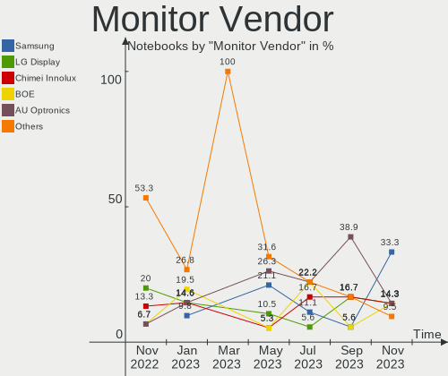
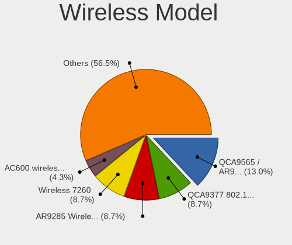

helloSystem - Hardware Trends (Notebooks)
-----------------------------------------

A project to identify most popular hardware characteristics and track their change
over time based on data collected by BSD users at https://BSD-Hardware.info.

Anyone can contribute to this report by the [hw-probe](https://github.com/linuxhw/hw-probe/blob/master/INSTALL.BSD.md) tool:

    hw-probe -all -upload

This report is for one last month. Overall report since the beginning of time: [TestCoverage](https://github.com/bsdhw/TestCoverage)

Period: Sep, 2022.

Contents
--------

* [ System ](#system)
  - [ OS                       ](#os)
  - [ OS Family                ](#os-family)
  - [ Arch                     ](#arch)
  - [ DE                       ](#de)
  - [ Display Server           ](#display-server)
  - [ Display Manager          ](#display-manager)
  - [ OS Lang                  ](#os-lang)
  - [ Boot Mode                ](#boot-mode)
  - [ Filesystem               ](#filesystem)
  - [ Part. scheme             ](#part-scheme)

* [ Board ](#board)
  - [ Vendor                   ](#vendor)
  - [ Model                    ](#model)
  - [ Model Family             ](#model-family)
  - [ MFG Year                 ](#mfg-year)
  - [ Form Factor              ](#form-factor)
  - [ Coreboot                 ](#coreboot)
  - [ RAM Size                 ](#ram-size)
  - [ RAM Used                 ](#ram-used)
  - [ Total Drives             ](#total-drives)
  - [ Has CD-ROM               ](#has-cd-rom)
  - [ Has Ethernet             ](#has-ethernet)
  - [ Has WiFi                 ](#has-wifi)
  - [ Has Bluetooth            ](#has-bluetooth)

* [ Location ](#location)
  - [ Country                  ](#country)
  - [ City                     ](#city)

* [ Drives ](#drives)
  - [ Drive Vendor             ](#drive-vendor)
  - [ Drive Model              ](#drive-model)
  - [ HDD Vendor               ](#hdd-vendor)
  - [ SSD Vendor               ](#ssd-vendor)
  - [ Drive Kind               ](#drive-kind)
  - [ Drive Connector          ](#drive-connector)
  - [ Drive Size               ](#drive-size)
  - [ Space Total              ](#space-total)
  - [ Space Used               ](#space-used)
  - [ Malfunc. Drives          ](#malfunc-drives)
  - [ Malfunc. Drive Vendor    ](#malfunc-drive-vendor)
  - [ Malfunc. HDD Vendor      ](#malfunc-hdd-vendor)
  - [ Malfunc. Drive Kind      ](#malfunc-drive-kind)
  - [ Failed Drives            ](#failed-drives)
  - [ Failed Drive Vendor      ](#failed-drive-vendor)
  - [ Drive Status             ](#drive-status)

* [ Storage controller ](#storage-controller)
  - [ Storage Vendor           ](#storage-vendor)
  - [ Storage Model            ](#storage-model)
  - [ Storage Kind             ](#storage-kind)

* [ Processor ](#processor)
  - [ CPU Vendor               ](#cpu-vendor)
  - [ CPU Model                ](#cpu-model)
  - [ CPU Model Family         ](#cpu-model-family)
  - [ CPU Cores                ](#cpu-cores)
  - [ CPU Sockets              ](#cpu-sockets)
  - [ CPU Threads              ](#cpu-threads)
  - [ CPU Microarch            ](#cpu-microarch)

* [ Graphics ](#graphics)
  - [ GPU Vendor               ](#gpu-vendor)
  - [ GPU Model                ](#gpu-model)
  - [ GPU Combo                ](#gpu-combo)
  - [ GPU Driver               ](#gpu-driver)
  - [ GPU Memory               ](#gpu-memory)

* [ Monitor ](#monitor)
  - [ Monitor Vendor           ](#monitor-vendor)
  - [ Monitor Model            ](#monitor-model)
  - [ Monitor Resolution       ](#monitor-resolution)
  - [ Monitor Diagonal         ](#monitor-diagonal)
  - [ Monitor Width            ](#monitor-width)
  - [ Aspect Ratio             ](#aspect-ratio)
  - [ Monitor Area             ](#monitor-area)
  - [ Pixel Density            ](#pixel-density)
  - [ Multiple Monitors        ](#multiple-monitors)

* [ Network ](#network)
  - [ Net Controller Vendor    ](#net-controller-vendor)
  - [ Net Controller Model     ](#net-controller-model)
  - [ Wireless Vendor          ](#wireless-vendor)
  - [ Wireless Model           ](#wireless-model)
  - [ Ethernet Vendor          ](#ethernet-vendor)
  - [ Ethernet Model           ](#ethernet-model)
  - [ Net Controller Kind      ](#net-controller-kind)
  - [ Used Controller          ](#used-controller)
  - [ NICs                     ](#nics)
  - [ IPv6                     ](#ipv6)

* [ Bluetooth ](#bluetooth)
  - [ Bluetooth Vendor         ](#bluetooth-vendor)
  - [ Bluetooth Model          ](#bluetooth-model)

* [ Sound ](#sound)
  - [ Sound Vendor             ](#sound-vendor)
  - [ Sound Model              ](#sound-model)

* [ Memory ](#memory)
  - [ Memory Vendor            ](#memory-vendor)
  - [ Memory Model             ](#memory-model)
  - [ Memory Kind              ](#memory-kind)
  - [ Memory Form Factor       ](#memory-form-factor)
  - [ Memory Size              ](#memory-size)
  - [ Memory Speed             ](#memory-speed)

* [ Printers & scanners ](#printers--scanners)
  - [ Printer Vendor           ](#printer-vendor)
  - [ Printer Model            ](#printer-model)
  - [ Scanner Vendor           ](#scanner-vendor)
  - [ Scanner Model            ](#scanner-model)

* [ Camera ](#camera)
  - [ Camera Vendor            ](#camera-vendor)
  - [ Camera Model             ](#camera-model)

* [ Security ](#security)
  - [ Fingerprint Vendor       ](#fingerprint-vendor)
  - [ Fingerprint Model        ](#fingerprint-model)
  - [ Chipcard Vendor          ](#chipcard-vendor)
  - [ Chipcard Model           ](#chipcard-model)

* [ Unsupported ](#unsupported)
  - [ Unsupported Devices      ](#unsupported-devices)
  - [ Unsupported Device Types ](#unsupported-device-types)

System
------

OS
--

Installed operating systems

| Name              | Notebooks | Percent |
|-------------------|-----------|---------|
| helloSystem 0.7.0 | 8         | 66.67%  |
| helloSystem 0.8.0 | 4         | 33.33%  |

OS Family
---------

OS without a version

| Name        | Notebooks | Percent |
|-------------|-----------|---------|
| helloSystem | 12        | 100%    |

Arch
----

OS architecture (x86_64, i586, etc.)

| Name  | Notebooks | Percent |
|-------|-----------|---------|
| amd64 | 12        | 100%    |

DE
--

Desktop Environment

| Name         | Notebooks | Percent |
|--------------|-----------|---------|
| helloDesktop | 12        | 100%    |

Display Server
--------------

X11 or Wayland

| Name | Notebooks | Percent |
|------|-----------|---------|
| X11  | 12        | 100%    |

Display Manager
---------------

SDDM, LightDM, etc.

| Name | Notebooks | Percent |
|------|-----------|---------|
| SLiM | 12        | 100%    |

OS Lang
-------

Language

| Lang  | Notebooks | Percent |
|-------|-----------|---------|
| en_US | 10        | 83.33%  |
| ru_RU | 1         | 8.33%   |
| fr_FR | 1         | 8.33%   |

Boot Mode
---------

EFI or BIOS

| Mode | Notebooks | Percent |
|------|-----------|---------|
| EFI  | 12        | 100%    |

Filesystem
----------

Type of filesystem

| Type   | Notebooks | Percent |
|--------|-----------|---------|
| Cd9660 | 8         | 66.67%  |
| Zfs    | 4         | 33.33%  |

Part. scheme
------------

Scheme of partitioning

| Type | Notebooks | Percent |
|------|-----------|---------|
| GPT  | 12        | 100%    |

Board
-----

Vendor
------

Motherboard manufacturer

| Name     | Notebooks | Percent |
|----------|-----------|---------|
| Lenovo   | 6         | 50%     |
| Dell     | 3         | 25%     |
| Apple    | 2         | 16.67%  |
| Kraftway | 1         | 8.33%   |

Model
-----

Motherboard model

| Name                               | Notebooks | Percent |
|------------------------------------|-----------|---------|
| Dell Precision 7710                | 2         | 16.67%  |
| Lenovo ThinkPad X61 Tablet 7763AD6 | 1         | 8.33%   |
| Lenovo ThinkPad X270 20HMS2LL00    | 1         | 8.33%   |
| Lenovo ThinkPad X250 20CLS1WP01    | 1         | 8.33%   |
| Lenovo ThinkPad T440 20B7S2LT00    | 1         | 8.33%   |
| Lenovo Legion Y540-17IRH 81Q4      | 1         | 8.33%   |
| Lenovo G50-30 80G0                 | 1         | 8.33%   |
| Kraftway KW10T                     | 1         | 8.33%   |
| Dell Latitude E5550                | 1         | 8.33%   |
| Apple MacBookPro5,1                | 1         | 8.33%   |
| Apple MacBook5,2                   | 1         | 8.33%   |

Model Family
------------

Motherboard model prefix

| Name              | Notebooks | Percent |
|-------------------|-----------|---------|
| Lenovo ThinkPad   | 4         | 33.33%  |
| Dell Precision    | 2         | 16.67%  |
| Lenovo Legion     | 1         | 8.33%   |
| Lenovo G50-30     | 1         | 8.33%   |
| Kraftway KW10T    | 1         | 8.33%   |
| Dell Latitude     | 1         | 8.33%   |
| Apple MacBookPro5 | 1         | 8.33%   |
| Apple MacBook5    | 1         | 8.33%   |

MFG Year
--------

Motherboard manufacture year

| Year | Notebooks | Percent |
|------|-----------|---------|
| 2016 | 2         | 16.67%  |
| 2014 | 2         | 16.67%  |
| 2022 | 1         | 8.33%   |
| 2020 | 1         | 8.33%   |
| 2019 | 1         | 8.33%   |
| 2017 | 1         | 8.33%   |
| 2015 | 1         | 8.33%   |
| 2012 | 1         | 8.33%   |
| 2011 | 1         | 8.33%   |
| 2009 | 1         | 8.33%   |

Form Factor
-----------

Physical design of the computer

| Name     | Notebooks | Percent |
|----------|-----------|---------|
| Notebook | 12        | 100%    |

Coreboot
--------

Have coreboot on board

| Used | Notebooks | Percent |
|------|-----------|---------|
| No   | 12        | 100%    |

RAM Size
--------

Total RAM memory

| Size in GB | Notebooks | Percent |
|------------|-----------|---------|
| 4.01-8.0   | 4         | 33.33%  |
| 8.01-16.0  | 3         | 25%     |
| 32.01-64.0 | 2         | 16.67%  |
| 16.01-24.0 | 2         | 16.67%  |
| 2.01-3.0   | 1         | 8.33%   |

RAM Used
--------

Used RAM memory

| Used GB  | Notebooks | Percent |
|----------|-----------|---------|
| 0.01-0.5 | 7         | 58.33%  |
| 0.51-1.0 | 3         | 25%     |
| 1.01-2.0 | 2         | 16.67%  |

Total Drives
------------

Number of drives on board

| Drives | Notebooks | Percent |
|--------|-----------|---------|
| 1      | 8         | 66.67%  |
| 2      | 4         | 33.33%  |

Has CD-ROM
----------

Has CD-ROM on board

| Presented | Notebooks | Percent |
|-----------|-----------|---------|
| No        | 11        | 91.67%  |
| Yes       | 1         | 8.33%   |

Has Ethernet
------------

Has Ethernet on board

| Presented | Notebooks | Percent |
|-----------|-----------|---------|
| Yes       | 9         | 75%     |
| No        | 3         | 25%     |

Has WiFi
--------

Has WiFi module

| Presented | Notebooks | Percent |
|-----------|-----------|---------|
| Yes       | 12        | 100%    |

Has Bluetooth
-------------

Has Bluetooth module

| Presented | Notebooks | Percent |
|-----------|-----------|---------|
| Yes       | 8         | 66.67%  |
| No        | 4         | 33.33%  |

Location
--------

Country
-------

Geographic location (country)

| Country     | Notebooks | Percent |
|-------------|-----------|---------|
| USA         | 2         | 16.67%  |
| UK          | 1         | 8.33%   |
| Switzerland | 1         | 8.33%   |
| Russia      | 1         | 8.33%   |
| Poland      | 1         | 8.33%   |
| Netherlands | 1         | 8.33%   |
| Hungary     | 1         | 8.33%   |
| Germany     | 1         | 8.33%   |
| Czechia     | 1         | 8.33%   |
| Belgium     | 1         | 8.33%   |
| Argentina   | 1         | 8.33%   |

City
----

Geographic location (city)

| City           | Notebooks | Percent |
|----------------|-----------|---------|
| Wroclaw        | 1         | 8.33%   |
| Ufa            | 1         | 8.33%   |
| San Bernardino | 1         | 8.33%   |
| Prague         | 1         | 8.33%   |
| Mendoza        | 1         | 8.33%   |
| Lutry          | 1         | 8.33%   |
| Krefeld        | 1         | 8.33%   |
| Kazincbarcika  | 1         | 8.33%   |
| Dover          | 1         | 8.33%   |
| Antwerp        | 1         | 8.33%   |
| Amsterdam      | 1         | 8.33%   |
| Abingdon       | 1         | 8.33%   |

Drives
------

Drive Vendor
------------

Hard drive vendors

| Vendor              | Notebooks | Drives | Percent |
|---------------------|-----------|--------|---------|
| Samsung Electronics | 4         | 4      | 23.53%  |
| WDC                 | 2         | 2      | 11.76%  |
| Seagate             | 2         | 2      | 11.76%  |
| Toshiba             | 1         | 1      | 5.88%   |
| SanDisk             | 1         | 1      | 5.88%   |
| Lexar               | 1         | 1      | 5.88%   |
| Leven               | 1         | 1      | 5.88%   |
| KingSpec            | 1         | 1      | 5.88%   |
| Intel               | 1         | 1      | 5.88%   |
| Hitachi             | 1         | 1      | 5.88%   |
| Fujitsu             | 1         | 1      | 5.88%   |
| FORESEE             | 1         | 1      | 5.88%   |

Drive Model
-----------

Hard drive models

| Model                              | Notebooks | Percent |
|------------------------------------|-----------|---------|
| WDC WDBNCE5000PNC 500GB            | 1         | 5.88%   |
| WDC WD5000LPCX-60VHAT0 500GB       | 1         | 5.88%   |
| Toshiba MK8034GSX 80GB             | 1         | 5.88%   |
| Seagate ST9160412AS 160GB          | 1         | 5.88%   |
| Seagate ST2000LM003 HN-M201RAD 2TB | 1         | 5.88%   |
| SanDisk SD8SB8U128G1001 128GB      | 1         | 5.88%   |
| Samsung SSD 850 EVO 250GB          | 1         | 5.88%   |
| Samsung SSD 840 PRO Series 256GB   | 1         | 5.88%   |
| Samsung SM951 NVMe 512GB           | 1         | 5.88%   |
| Samsung PM961 NVMe 256GB           | 1         | 5.88%   |
| Lexar SSD 120GB                    | 1         | 5.88%   |
| Leven JAJS300M240C 240GB           | 1         | 5.88%   |
| KingSpec NT-256 256GB              | 1         | 5.88%   |
| Intel SSDPEKNW020T8 2TB            | 1         | 5.88%   |
| Hitachi HTS541680J9SA00 80GB       | 1         | 5.88%   |
| Fujitsu MHZ2160BH FFS G1 160GB     | 1         | 5.88%   |
| FORESEE 128GB SSD                  | 1         | 5.88%   |

HDD Vendor
----------

Hard disk drive vendors

| Vendor  | Notebooks | Drives | Percent |
|---------|-----------|--------|---------|
| Seagate | 2         | 2      | 33.33%  |
| WDC     | 1         | 1      | 16.67%  |
| Toshiba | 1         | 1      | 16.67%  |
| Hitachi | 1         | 1      | 16.67%  |
| Fujitsu | 1         | 1      | 16.67%  |

SSD Vendor
----------

Solid state drive vendors

| Vendor              | Notebooks | Drives | Percent |
|---------------------|-----------|--------|---------|
| Samsung Electronics | 2         | 2      | 25%     |
| WDC                 | 1         | 1      | 12.5%   |
| SanDisk             | 1         | 1      | 12.5%   |
| Lexar               | 1         | 1      | 12.5%   |
| Leven               | 1         | 1      | 12.5%   |
| KingSpec            | 1         | 1      | 12.5%   |
| FORESEE             | 1         | 1      | 12.5%   |

Drive Kind
----------

HDD or SSD

| Kind | Notebooks | Drives | Percent |
|------|-----------|--------|---------|
| SSD  | 7         | 8      | 50%     |
| HDD  | 4         | 6      | 28.57%  |
| NVMe | 3         | 3      | 21.43%  |

Drive Connector
---------------

SATA, SAS, NVMe, etc.

| Type | Notebooks | Drives | Percent |
|------|-----------|--------|---------|
| SATA | 11        | 14     | 78.57%  |
| NVMe | 3         | 3      | 21.43%  |

Drive Size
----------

Size of hard drive

| Size in TB | Notebooks | Drives | Percent |
|------------|-----------|--------|---------|
| 0.01-0.5   | 10        | 13     | 90.91%  |
| 1.01-2.0   | 1         | 1      | 9.09%   |

Space Total
-----------

Amount of disk space available on the file system

| Size in GB | Notebooks | Percent |
|------------|-----------|---------|
| 1-20       | 7         | 58.33%  |
| 101-250    | 5         | 41.67%  |

Space Used
----------

Amount of used disk space

| Used GB | Notebooks | Percent |
|---------|-----------|---------|
| 1-20    | 12        | 100%    |

Malfunc. Drives
---------------

Drive models with a malfunction

| Model                          | Notebooks | Drives | Percent |
|--------------------------------|-----------|--------|---------|
| WDC WD5000LPCX-60VHAT0 500GB   | 1         | 1      | 25%     |
| Toshiba MK8034GSX 80GB         | 1         | 1      | 25%     |
| Seagate ST9160412AS 160GB      | 1         | 1      | 25%     |
| Fujitsu MHZ2160BH FFS G1 160GB | 1         | 1      | 25%     |

Malfunc. Drive Vendor
---------------------

Vendors of faulty drives

| Vendor  | Notebooks | Drives | Percent |
|---------|-----------|--------|---------|
| WDC     | 1         | 1      | 25%     |
| Toshiba | 1         | 1      | 25%     |
| Seagate | 1         | 1      | 25%     |
| Fujitsu | 1         | 1      | 25%     |

Malfunc. HDD Vendor
-------------------

Vendors of faulty HDD drives

| Vendor  | Notebooks | Drives | Percent |
|---------|-----------|--------|---------|
| WDC     | 1         | 1      | 25%     |
| Toshiba | 1         | 1      | 25%     |
| Seagate | 1         | 1      | 25%     |
| Fujitsu | 1         | 1      | 25%     |

Malfunc. Drive Kind
-------------------

Kinds of faulty drives

| Kind | Notebooks | Drives | Percent |
|------|-----------|--------|---------|
| HDD  | 2         | 4      | 100%    |

Failed Drives
-------------

Failed drive models

Zero info for selected period =(

Failed Drive Vendor
-------------------

Failed drive vendors

Zero info for selected period =(

Drive Status
------------

Number of failed and malfunc. drives

| Status  | Notebooks | Drives | Percent |
|---------|-----------|--------|---------|
| Works   | 10        | 13     | 83.33%  |
| Malfunc | 2         | 4      | 16.67%  |

Storage controller
------------------

Storage Vendor
--------------

Storage controller vendors

| Vendor              | Notebooks | Percent |
|---------------------|-----------|---------|
| Intel               | 10        | 71.43%  |
| Samsung Electronics | 2         | 14.29%  |
| Nvidia              | 2         | 14.29%  |

Storage Model
-------------

Storage controller models

| Model                                                                         | Notebooks | Percent |
|-------------------------------------------------------------------------------|-----------|---------|
| Nvidia MCP79 AHCI Controller                                                  | 2         | 12.5%   |
| Intel Q170/Q150/B150/H170/H110/Z170/CM236 Chipset SATA Controller [AHCI Mode] | 2         | 12.5%   |
| Intel Atom Processor E3800 Series SATA AHCI Controller                        | 2         | 12.5%   |
| Samsung NVMe SSD Controller SM961/PM961/SM963                                 | 1         | 6.25%   |
| Samsung NVMe SSD Controller SM951/PM951                                       | 1         | 6.25%   |
| Intel Wildcat Point-LP SATA Controller [AHCI Mode]                            | 1         | 6.25%   |
| Intel Sunrise Point-LP SATA Controller [AHCI mode]                            | 1         | 6.25%   |
| Intel SSD 660P Series                                                         | 1         | 6.25%   |
| Intel Cannon Lake Mobile PCH SATA AHCI Controller                             | 1         | 6.25%   |
| Intel 82801HM/HEM (ICH8M/ICH8M-E) SATA Controller [AHCI mode]                 | 1         | 6.25%   |
| Intel 82801HM/HEM (ICH8M/ICH8M-E) IDE Controller                              | 1         | 6.25%   |
| Intel 82801 Mobile SATA Controller [RAID mode]                                | 1         | 6.25%   |
| Intel 8 Series SATA Controller 1 [AHCI mode]                                  | 1         | 6.25%   |

Storage Kind
------------

Kind of storage controller (IDE, SATA, NVMe, SAS, ...)

| Kind | Notebooks | Percent |
|------|-----------|---------|
| SATA | 11        | 68.75%  |
| NVMe | 3         | 18.75%  |
| RAID | 1         | 6.25%   |
| IDE  | 1         | 6.25%   |

Processor
---------

CPU Vendor
----------

Processor vendors

| Vendor | Notebooks | Percent |
|--------|-----------|---------|
| Intel  | 12        | 100%    |

CPU Model
---------

Processor models

| Model                                | Notebooks | Percent |
|--------------------------------------|-----------|---------|
| Intel Core i7-9750H CPU @ 2.60GHz    | 1         | 8.33%   |
| Intel Core i7-6920HQ CPU @ 2.90GHz   | 1         | 8.33%   |
| Intel Core i7-6820HQ CPU @ 2.70GHz   | 1         | 8.33%   |
| Intel Core i5-7300U CPU @ 2.60GHz    | 1         | 8.33%   |
| Intel Core i5-5300U CPU @ 2.30GHz    | 1         | 8.33%   |
| Intel Core i5-5200U CPU @ 2.20GHz    | 1         | 8.33%   |
| Intel Core i5-4200U CPU @ 1.60GHz    | 1         | 8.33%   |
| Intel Core 2 Duo CPU T9600 @ 2.80GHz | 1         | 8.33%   |
| Intel Core 2 Duo CPU P7450 @ 2.13GHz | 1         | 8.33%   |
| Intel Core 2 Duo CPU L7500 @ 1.60GHz | 1         | 8.33%   |
| Intel Celeron CPU N2840 @ 2.16GHz    | 1         | 8.33%   |
| Intel Atom CPU E3825 @ 1.33GHz       | 1         | 8.33%   |

CPU Model Family
----------------

Processor model prefix

| Model            | Notebooks | Percent |
|------------------|-----------|---------|
| Intel Core i5    | 4         | 33.33%  |
| Intel Core i7    | 3         | 25%     |
| Intel Core 2 Duo | 3         | 25%     |
| Intel Celeron    | 1         | 8.33%   |
| Intel Atom       | 1         | 8.33%   |

CPU Cores
---------

Number of processor cores

| Number  | Notebooks | Percent |
|---------|-----------|---------|
| 2       | 6         | 50%     |
| Unknown | 3         | 25%     |
| 4       | 2         | 16.67%  |
| 6       | 1         | 8.33%   |

CPU Sockets
-----------

Number of sockets

| Number | Notebooks | Percent |
|--------|-----------|---------|
| 1      | 10        | 83.33%  |
| 2      | 2         | 16.67%  |

CPU Threads
-----------

Threads per core (Hyper-Threading)

| Number  | Notebooks | Percent |
|---------|-----------|---------|
| 2       | 7         | 58.33%  |
| Unknown | 3         | 25%     |
| 1       | 2         | 16.67%  |

CPU Microarch
-------------

Microarchitecture

| Name       | Notebooks | Percent |
|------------|-----------|---------|
| Skylake    | 2         | 16.67%  |
| Silvermont | 2         | 16.67%  |
| Penryn     | 2         | 16.67%  |
| KabyLake   | 2         | 16.67%  |
| Broadwell  | 2         | 16.67%  |
| Haswell    | 1         | 8.33%   |
| Core       | 1         | 8.33%   |

Graphics
--------

GPU Vendor
----------

Vendors of graphics cards

| Vendor | Notebooks | Percent |
|--------|-----------|---------|
| Intel  | 9         | 64.29%  |
| Nvidia | 5         | 35.71%  |

GPU Model
---------

Graphics card models

| Model                                                               | Notebooks | Percent |
|---------------------------------------------------------------------|-----------|---------|
| Intel HD Graphics 5500                                              | 2         | 12.5%   |
| Intel HD Graphics 530                                               | 2         | 12.5%   |
| Intel Atom Processor Z36xxx/Z37xxx Series Graphics & Display        | 2         | 12.5%   |
| Nvidia TU106M [GeForce RTX 2060 Mobile]                             | 1         | 6.25%   |
| Nvidia GM204GLM [Quadro M4000M]                                     | 1         | 6.25%   |
| Nvidia GM204GLM [Quadro M3000M]                                     | 1         | 6.25%   |
| Nvidia G96CM [GeForce 9600M GT]                                     | 1         | 6.25%   |
| Nvidia C79 [GeForce 9400M]                                          | 1         | 6.25%   |
| Nvidia C79 [GeForce 9400M G]                                        | 1         | 6.25%   |
| Intel Mobile GM965/GL960 Integrated Graphics Controller (secondary) | 1         | 6.25%   |
| Intel Mobile GM965/GL960 Integrated Graphics Controller (primary)   | 1         | 6.25%   |
| Intel HD Graphics 620                                               | 1         | 6.25%   |
| Intel Haswell-ULT Integrated Graphics Controller                    | 1         | 6.25%   |

GPU Combo
---------

Combinations of graphics cards

| Name           | Notebooks | Percent |
|----------------|-----------|---------|
| 1 x Intel      | 6         | 50%     |
| 1 x Nvidia     | 2         | 16.67%  |
| Intel + Nvidia | 2         | 16.67%  |
| 2 x Nvidia     | 1         | 8.33%   |
| 2 x Intel      | 1         | 8.33%   |

GPU Driver
----------

Free vs proprietary

| Driver      | Notebooks | Percent |
|-------------|-----------|---------|
| Free        | 8         | 66.67%  |
| Proprietary | 3         | 25%     |
| Unknown     | 1         | 8.33%   |

GPU Memory
----------

Total video memory

| Size in GB | Notebooks | Percent |
|------------|-----------|---------|
| Unknown    | 9         | 75%     |
| 0.01-0.5   | 2         | 16.67%  |
| 5.01-6.0   | 1         | 8.33%   |

Monitor
-------

Monitor Vendor
--------------

Monitor vendors

| Vendor              | Notebooks | Percent |
|---------------------|-----------|---------|
| LG Display          | 3         | 23.08%  |
| AU Optronics        | 2         | 15.38%  |
| Apple               | 2         | 15.38%  |
| Samsung Electronics | 1         | 7.69%   |
| Lenovo              | 1         | 7.69%   |
| InfoVision          | 1         | 7.69%   |
| Dell                | 1         | 7.69%   |
| Chimei Innolux      | 1         | 7.69%   |
| BOE                 | 1         | 7.69%   |

Monitor Model
-------------

Monitor models

| Model                                                                | Notebooks | Percent |
|----------------------------------------------------------------------|-----------|---------|
| LG Display LCD Monitor LGD0459 1920x1080 380x210mm 17.1-inch         | 2         | 15.38%  |
| Samsung Electronics LCD Monitor SDC4852 1366x768 340x190mm 15.3-inch | 1         | 7.69%   |
| LG Display LCD Monitor LGD046F 1920x1080 340x190mm 15.3-inch         | 1         | 7.69%   |
| Lenovo LCD Monitor LEN4002 1024x768 250x180mm 12.1-inch              | 1         | 7.69%   |
| InfoVision LCD Monitor IVO04E3 1366x768 280x160mm 12.7-inch          | 1         | 7.69%   |
| Dell P2412H DELA07D 1920x1080 530x300mm 24.0-inch                    | 1         | 7.69%   |
| Chimei Innolux LCD Monitor CMN1490 1366x768 310x170mm 13.9-inch      | 1         | 7.69%   |
| BOE LCD Monitor BOE06CE 1366x768 280x160mm 12.7-inch                 | 1         | 7.69%   |
| AU Optronics LCD Monitor AUO449D 1920x1080 380x220mm 17.3-inch       | 1         | 7.69%   |
| AU Optronics LCD Monitor AUO4100 1920x1200 220x140mm 10.3-inch       | 1         | 7.69%   |
| Apple LCD Monitor APP9C84 1440x900 330x210mm 15.4-inch               | 1         | 7.69%   |
| Apple Color LCD APP9C5C 1280x800 290x180mm 13.4-inch                 | 1         | 7.69%   |

Monitor Resolution
------------------

Monitor screen resolution

| Resolution        | Notebooks | Percent |
|-------------------|-----------|---------|
| 1920x1080 (FHD)   | 5         | 41.67%  |
| 1366x768 (WXGA)   | 3         | 25%     |
| 1920x1200 (WUXGA) | 1         | 8.33%   |
| 1440x900 (WXGA+)  | 1         | 8.33%   |
| 1280x800 (WXGA)   | 1         | 8.33%   |
| 1024x768 (XGA)    | 1         | 8.33%   |

Monitor Diagonal
----------------

Diagonal size in inches

| Inches | Notebooks | Percent |
|--------|-----------|---------|
| 17     | 3         | 23.08%  |
| 15     | 3         | 23.08%  |
| 12     | 3         | 23.08%  |
| 13     | 2         | 15.38%  |
| 24     | 1         | 7.69%   |
| 10     | 1         | 7.69%   |

Monitor Width
-------------

Physical width

| Width in mm | Notebooks | Percent |
|-------------|-----------|---------|
| 201-300     | 5         | 38.46%  |
| 301-350     | 4         | 30.77%  |
| 351-400     | 3         | 23.08%  |
| 501-600     | 1         | 7.69%   |

Aspect Ratio
------------

Proportional relationship between the width and the height

| Ratio | Notebooks | Percent |
|-------|-----------|---------|
| 16/9  | 8         | 66.67%  |
| 16/10 | 3         | 25%     |
| 4/3   | 1         | 8.33%   |

Monitor Area
------------

Area in inch²

| Area in inch² | Notebooks | Percent |
|----------------|-----------|---------|
| 61-70          | 3         | 23.08%  |
| 121-130        | 3         | 23.08%  |
| 81-90          | 2         | 15.38%  |
| 101-110        | 2         | 15.38%  |
| 41-50          | 1         | 7.69%   |
| 201-250        | 1         | 7.69%   |
| 91-100         | 1         | 7.69%   |

Pixel Density
-------------

Pixels per inch

| Density | Notebooks | Percent |
|---------|-----------|---------|
| 121-160 | 6         | 46.15%  |
| 101-120 | 5         | 38.46%  |
| 161-240 | 1         | 7.69%   |
| 51-100  | 1         | 7.69%   |

Multiple Monitors
-----------------

Total monitors connected

| Total | Notebooks | Percent |
|-------|-----------|---------|
| 1     | 11        | 91.67%  |
| 2     | 1         | 8.33%   |

Network
-------

Net Controller Vendor
---------------------

Controller vendors

| Vendor                        | Notebooks | Percent |
|-------------------------------|-----------|---------|
| Intel                         | 9         | 47.37%  |
| Realtek Semiconductor         | 3         | 15.79%  |
| Broadcom                      | 3         | 15.79%  |
| Nvidia                        | 2         | 10.53%  |
| OnePlus Technology (Shenzhen) | 1         | 5.26%   |
| Huawei Technologies           | 1         | 5.26%   |

Net Controller Model
--------------------

Controller models

| Model                                                             | Notebooks | Percent |
|-------------------------------------------------------------------|-----------|---------|
| Intel Wireless 7265                                               | 3         | 12.5%   |
| Realtek RTL8111/8168/8411 PCI Express Gigabit Ethernet Controller | 2         | 8.33%   |
| Nvidia MCP79 Ethernet                                             | 2         | 8.33%   |
| Intel Wireless 8260                                               | 2         | 8.33%   |
| Broadcom BCM4322 802.11a/b/g/n Wireless LAN Controller            | 2         | 8.33%   |
| Realtek RTL8188CUS 802.11n WLAN Adapter                           | 1         | 4.17%   |
| OnePlus (Shenzhen) OnePlus RNDIS Control RNDIS Ethernet Data      | 1         | 4.17%   |
| Intel Wireless 8265 / 8275                                        | 1         | 4.17%   |
| Intel Wireless 7260                                               | 1         | 4.17%   |
| Intel PRO/Wireless 3945ABG [Golan] Network Connection             | 1         | 4.17%   |
| Intel Ethernet Connection I218-V                                  | 1         | 4.17%   |
| Intel Ethernet Connection (4) I219-LM                             | 1         | 4.17%   |
| Intel Ethernet Connection (3) I218-LM                             | 1         | 4.17%   |
| Intel Ethernet Connection (2) I219-LM                             | 1         | 4.17%   |
| Intel Cannon Lake PCH CNVi WiFi                                   | 1         | 4.17%   |
| Intel 82566MM Gigabit Network Connection                          | 1         | 4.17%   |
| Huawei ME936 LTE/HSDPA+ 4G modem                                  | 1         | 4.17%   |
| Broadcom BCM43142 802.11b/g/n                                     | 1         | 4.17%   |

Wireless Vendor
---------------

Wireless vendors

| Vendor                | Notebooks | Percent |
|-----------------------|-----------|---------|
| Intel                 | 9         | 69.23%  |
| Broadcom              | 3         | 23.08%  |
| Realtek Semiconductor | 1         | 7.69%   |

Wireless Model
--------------

Wireless models

| Model                                                  | Notebooks | Percent |
|--------------------------------------------------------|-----------|---------|
| Intel Wireless 7265                                    | 3         | 23.08%  |
| Intel Wireless 8260                                    | 2         | 15.38%  |
| Broadcom BCM4322 802.11a/b/g/n Wireless LAN Controller | 2         | 15.38%  |
| Realtek RTL8188CUS 802.11n WLAN Adapter                | 1         | 7.69%   |
| Intel Wireless 8265 / 8275                             | 1         | 7.69%   |
| Intel Wireless 7260                                    | 1         | 7.69%   |
| Intel PRO/Wireless 3945ABG [Golan] Network Connection  | 1         | 7.69%   |
| Intel Cannon Lake PCH CNVi WiFi                        | 1         | 7.69%   |
| Broadcom BCM43142 802.11b/g/n                          | 1         | 7.69%   |

Ethernet Vendor
---------------

Ethernet vendors

| Vendor                        | Notebooks | Percent |
|-------------------------------|-----------|---------|
| Intel                         | 5         | 50%     |
| Realtek Semiconductor         | 2         | 20%     |
| Nvidia                        | 2         | 20%     |
| OnePlus Technology (Shenzhen) | 1         | 10%     |

Ethernet Model
--------------

Ethernet models

| Model                                                             | Notebooks | Percent |
|-------------------------------------------------------------------|-----------|---------|
| Realtek RTL8111/8168/8411 PCI Express Gigabit Ethernet Controller | 2         | 20%     |
| Nvidia MCP79 Ethernet                                             | 2         | 20%     |
| OnePlus (Shenzhen) OnePlus RNDIS Control RNDIS Ethernet Data      | 1         | 10%     |
| Intel Ethernet Connection I218-V                                  | 1         | 10%     |
| Intel Ethernet Connection (4) I219-LM                             | 1         | 10%     |
| Intel Ethernet Connection (3) I218-LM                             | 1         | 10%     |
| Intel Ethernet Connection (2) I219-LM                             | 1         | 10%     |
| Intel 82566MM Gigabit Network Connection                          | 1         | 10%     |

Net Controller Kind
-------------------

Ethernet, WiFi or modem

| Kind     | Notebooks | Percent |
|----------|-----------|---------|
| WiFi     | 12        | 54.55%  |
| Ethernet | 9         | 40.91%  |
| Modem    | 1         | 4.55%   |

Used Controller
---------------

Currently used network controller

| Kind     | Notebooks | Percent |
|----------|-----------|---------|
| WiFi     | 8         | 72.73%  |
| Ethernet | 3         | 27.27%  |

NICs
----

Total network controllers on board

| Total | Notebooks | Percent |
|-------|-----------|---------|
| 2     | 9         | 75%     |
| 1     | 3         | 25%     |

IPv6
----

IPv6 vs IPv4

| Used | Notebooks | Percent |
|------|-----------|---------|
| No   | 12        | 100%    |

Bluetooth
---------

Bluetooth Vendor
----------------

Controller vendors

| Vendor   | Notebooks | Percent |
|----------|-----------|---------|
| Intel    | 5         | 62.5%   |
| Apple    | 2         | 25%     |
| Broadcom | 1         | 12.5%   |

Bluetooth Model
---------------

Controller models

| Model                                          | Notebooks | Percent |
|------------------------------------------------|-----------|---------|
| Intel Bluetooth wireless interface             | 4         | 44.44%  |
| Intel Bluetooth 9460/9560 Jefferson Peak (JfP) | 1         | 11.11%  |
| Broadcom BCM43142A0 Bluetooth Module           | 1         | 11.11%  |
| Apple Built-in iSight (no firmware loaded)     | 1         | 11.11%  |
| Apple Built-in Bluetooth 2.0+EDR HCI           | 1         | 11.11%  |
| Apple Bluetooth Host Controller                | 1         | 11.11%  |

Sound
-----

Sound Vendor
------------

Sound card vendors

| Vendor    | Notebooks | Percent |
|-----------|-----------|---------|
| Intel     | 10        | 71.43%  |
| Nvidia    | 3         | 21.43%  |
| GN Netcom | 1         | 7.14%   |

Sound Model
-----------

Sound card models

| Model                                                                      | Notebooks | Percent |
|----------------------------------------------------------------------------|-----------|---------|
| Nvidia MCP79 High Definition Audio                                         | 2         | 11.76%  |
| Intel Wildcat Point-LP High Definition Audio Controller                    | 2         | 11.76%  |
| Intel Broadwell-U Audio Controller                                         | 2         | 11.76%  |
| Intel Atom Processor Z36xxx/Z37xxx Series High Definition Audio Controller | 2         | 11.76%  |
| Intel 100 Series/C230 Series Chipset Family HD Audio Controller            | 2         | 11.76%  |
| Nvidia TU106 High Definition Audio Controller                              | 1         | 5.88%   |
| Intel Sunrise Point-LP HD Audio                                            | 1         | 5.88%   |
| Intel Haswell-ULT HD Audio Controller                                      | 1         | 5.88%   |
| Intel Cannon Lake PCH cAVS                                                 | 1         | 5.88%   |
| Intel 82801H (ICH8 Family) HD Audio Controller                             | 1         | 5.88%   |
| Intel 8 Series HD Audio Controller                                         | 1         | 5.88%   |
| GN Netcom Jabra EVOLVE 20                                                  | 1         | 5.88%   |

Memory
------

Memory Vendor
-------------

Memory module vendors

| Vendor              | Notebooks | Percent |
|---------------------|-----------|---------|
| SK hynix            | 3         | 23.08%  |
| Samsung Electronics | 3         | 23.08%  |
| Unknown             | 2         | 15.38%  |
| Micron Technology   | 2         | 15.38%  |
| Nanya Technology    | 1         | 7.69%   |
| Kingston            | 1         | 7.69%   |
| A-DATA Technology   | 1         | 7.69%   |

Memory Model
------------

Memory module models

| Model                                                   | Notebooks | Percent |
|---------------------------------------------------------|-----------|---------|
| Unknown RAM Module 4GB DIMM DDR3 1067MT/s               | 1         | 7.69%   |
| Unknown RAM Module 1GB SODIMM DDR2 667MT/s              | 1         | 7.69%   |
| SK hynix RAM HMT41GS6BFR8A-PB 8GB SODIMM DDR3 1600MT/s  | 1         | 7.69%   |
| SK hynix RAM HMA82GS6MFR8N-TF 16GB SODIMM DDR4 2133MT/s | 1         | 7.69%   |
| SK hynix RAM HMA41GS6AFR8N-TF 8GB SODIMM DDR4 2133MT/s  | 1         | 7.69%   |
| Samsung RAM Module 2GB SODIMM DDR3 1067MT/s             | 1         | 7.69%   |
| Samsung RAM M471B5173DB0-YK0 4GB SODIMM DDR3 1600MT/s   | 1         | 7.69%   |
| Samsung RAM M471A1K43CB1-CRC 8GB SODIMM DDR4 2400MT/s   | 1         | 7.69%   |
| Nanya RAM Module 2GB SODIMM DDR2 800MT/s                | 1         | 7.69%   |
| Micron RAM 16KTF1G64HZ-1G9P1 8GB Chip DDR3 1867MT/s     | 1         | 7.69%   |
| Micron RAM 16KTF1G64HZ-1G6P1 8GB SODIMM DDR3 1600MT/s   | 1         | 7.69%   |
| Kingston RAM 99U5428-018.A00LF 8GB SODIMM DDR3 1600MT/s | 1         | 7.69%   |
| A-DATA RAM Module 16GB SODIMM DDR4 2667MT/s             | 1         | 7.69%   |

Memory Kind
-----------

Memory module kinds

| Kind | Notebooks | Percent |
|------|-----------|---------|
| DDR3 | 6         | 50%     |
| DDR4 | 4         | 33.33%  |
| DDR2 | 2         | 16.67%  |

Memory Form Factor
------------------

Physical design of the memory module

| Name   | Notebooks | Percent |
|--------|-----------|---------|
| SODIMM | 10        | 83.33%  |
| DIMM   | 1         | 8.33%   |
| Chip   | 1         | 8.33%   |

Memory Size
-----------

Memory module size

| Size  | Notebooks | Percent |
|-------|-----------|---------|
| 8192  | 5         | 41.67%  |
| 16384 | 2         | 16.67%  |
| 4096  | 2         | 16.67%  |
| 2048  | 2         | 16.67%  |
| 1024  | 1         | 8.33%   |

Memory Speed
------------

Memory module speed

| Speed | Notebooks | Percent |
|-------|-----------|---------|
| 1600  | 3         | 25%     |
| 2133  | 2         | 16.67%  |
| 1067  | 2         | 16.67%  |
| 2667  | 1         | 8.33%   |
| 2400  | 1         | 8.33%   |
| 1867  | 1         | 8.33%   |
| 800   | 1         | 8.33%   |
| 667   | 1         | 8.33%   |

Printers & scanners
-------------------

Printer Vendor
--------------

Printer device vendors

Zero info for selected period =(

Printer Model
-------------

Printer device models

Zero info for selected period =(

Scanner Vendor
--------------

Scanner device vendors

Zero info for selected period =(

Scanner Model
-------------

Scanner device models

Zero info for selected period =(

Camera
------

Camera Vendor
-------------

Camera device vendors

| Vendor                        | Notebooks | Percent |
|-------------------------------|-----------|---------|
| Realtek Semiconductor         | 4         | 66.67%  |
| Sunplus Innovation Technology | 1         | 16.67%  |
| Chicony Electronics           | 1         | 16.67%  |

Camera Model
------------

Camera device models

| Model                            | Notebooks | Percent |
|----------------------------------|-----------|---------|
| Realtek Integrated_Webcam_HD     | 2         | 33.33%  |
| Sunplus Integrated_Webcam_HD     | 1         | 16.67%  |
| Realtek Realtek USB2.0 PC Camera | 1         | 16.67%  |
| Realtek Lenovo EasyCamera        | 1         | 16.67%  |
| Chicony Integrated Camera        | 1         | 16.67%  |

Security
--------

Fingerprint Vendor
------------------

Fingerprint sensor vendors

| Vendor   | Notebooks | Percent |
|----------|-----------|---------|
| Broadcom | 1         | 100%    |

Fingerprint Model
-----------------

Fingerprint sensor models

| Model                                                                        | Notebooks | Percent |
|------------------------------------------------------------------------------|-----------|---------|
| Broadcom BCM5880 Secure Applications Processor with fingerprint swipe sensor | 1         | 100%    |

Chipcard Vendor
---------------

Chipcard module vendors

Zero info for selected period =(

Chipcard Model
--------------

Chipcard module models

Zero info for selected period =(

Unsupported
-----------

Unsupported Devices
-------------------

Total unsupported devices on board

| Total | Notebooks | Percent |
|-------|-----------|---------|
| 1     | 5         | 41.67%  |
| 3     | 3         | 25%     |
| 2     | 2         | 16.67%  |
| 0     | 2         | 16.67%  |

Unsupported Device Types
------------------------

Types of unsupported devices

| Type                     | Notebooks | Percent |
|--------------------------|-----------|---------|
| Communication controller | 7         | 43.75%  |
| Bluetooth                | 5         | 31.25%  |
| Network                  | 1         | 6.25%   |
| Net/wireless             | 1         | 6.25%   |
| Fingerprint reader       | 1         | 6.25%   |
| Card reader              | 1         | 6.25%   |

