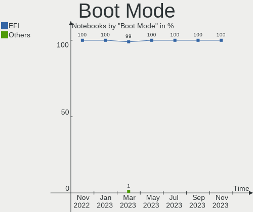
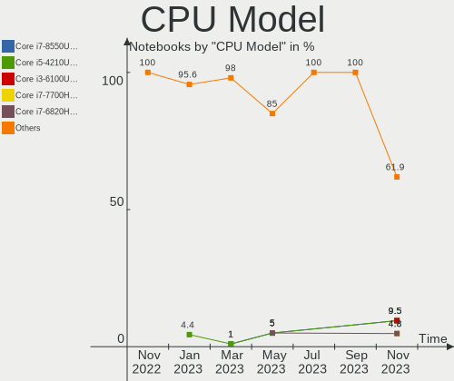
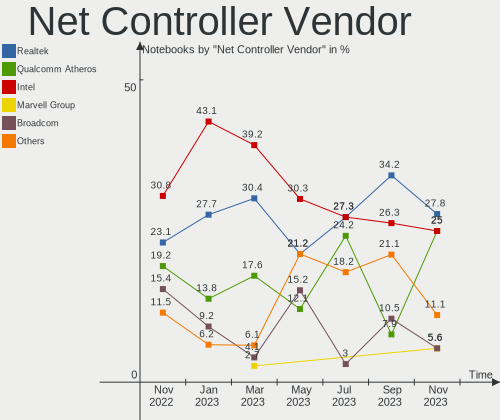
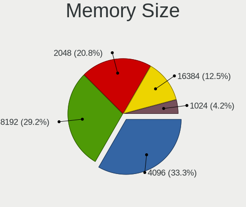
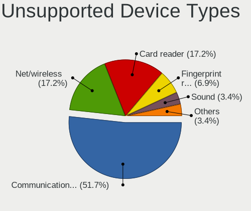

helloSystem Hardware Trends (Notebook)
--------------------------------------

A project to identify most popular hardware characteristics and track their change
over time based on data collected by helloSystem users at https://BSD-Hardware.info.

Anyone can contribute to the study by uploading probes of their computers by
the [hw-probe](https://github.com/linuxhw/hw-probe/blob/master/INSTALL.BSD.md) tool:

    hw-probe -all -upload

Full-feature report is available here: https://bsd-hardware.info/?view=trends&formfactor=notebook

Period: Jun, 2021.

Contents
--------

- [ OS                       ](#os)
- [ OS Family                ](#os-family)
- [ Arch                     ](#arch)
- [ DE                       ](#de)
- [ Display Server           ](#display-server)
- [ Display Manager          ](#display-manager)
- [ OS Lang                  ](#os-lang)
- [ Boot Mode                ](#boot-mode)
- [ Filesystem               ](#filesystem)
- [ Part. scheme             ](#part-scheme)
- [ Country                  ](#country)
- [ City                     ](#city)
- [ Vendor                   ](#vendor)
- [ Model                    ](#model)
- [ Model Family             ](#model-family)
- [ MFG Year                 ](#mfg-year)
- [ Form Factor              ](#form-factor)
- [ Coreboot                 ](#coreboot)
- [ RAM Size                 ](#ram-size)
- [ RAM Used                 ](#ram-used)
- [ Has CD-ROM               ](#has-cd-rom)
- [ Total Drives             ](#total-drives)
- [ Has Ethernet             ](#has-ethernet)
- [ Has WiFi                 ](#has-wifi)
- [ Has Bluetooth            ](#has-bluetooth)
- [ Drive Vendor             ](#drive-vendor)
- [ Drive Model              ](#drive-model)
- [ HDD Vendor               ](#hdd-vendor)
- [ SSD Vendor               ](#ssd-vendor)
- [ Drive Kind               ](#drive-kind)
- [ Drive Connector          ](#drive-connector)
- [ Drive Size               ](#drive-size)
- [ Space Total              ](#space-total)
- [ Space Used               ](#space-used)
- [ Malfunc. Drives          ](#malfunc-drives)
- [ Malfunc. Drive Vendor    ](#malfunc-drive-vendor)
- [ Malfunc. HDD Vendor      ](#malfunc-hdd-vendor)
- [ Malfunc. Drive Kind      ](#malfunc-drive-kind)
- [ Failed Drives            ](#failed-drives)
- [ Failed Drive Vendor      ](#failed-drive-vendor)
- [ Drive Status             ](#drive-status)
- [ Storage Vendor           ](#storage-vendor)
- [ Storage Model            ](#storage-model)
- [ Storage Kind             ](#storage-kind)
- [ CPU Vendor               ](#cpu-vendor)
- [ CPU Model                ](#cpu-model)
- [ CPU Model Family         ](#cpu-model-family)
- [ CPU Cores                ](#cpu-cores)
- [ CPU Sockets              ](#cpu-sockets)
- [ CPU Threads              ](#cpu-threads)
- [ CPU Microarch            ](#cpu-microarch)
- [ GPU Vendor               ](#gpu-vendor)
- [ GPU Model                ](#gpu-model)
- [ GPU Combo                ](#gpu-combo)
- [ GPU Driver               ](#gpu-driver)
- [ GPU Memory               ](#gpu-memory)
- [ Monitor Vendor           ](#monitor-vendor)
- [ Monitor Model            ](#monitor-model)
- [ Monitor Resolution       ](#monitor-resolution)
- [ Monitor Diagonal         ](#monitor-diagonal)
- [ Monitor Width            ](#monitor-width)
- [ Aspect Ratio             ](#aspect-ratio)
- [ Monitor Area             ](#monitor-area)
- [ Pixel Density            ](#pixel-density)
- [ Multiple Monitors        ](#multiple-monitors)
- [ Net Controller Vendor    ](#net-controller-vendor)
- [ Net Controller Model     ](#net-controller-model)
- [ Wireless Vendor          ](#wireless-vendor)
- [ Wireless Model           ](#wireless-model)
- [ Ethernet Vendor          ](#ethernet-vendor)
- [ Ethernet Model           ](#ethernet-model)
- [ Net Controller Kind      ](#net-controller-kind)
- [ Used Controller          ](#used-controller)
- [ NICs                     ](#nics)
- [ IPv6                     ](#ipv6)
- [ Memory Vendor            ](#memory-vendor)
- [ Memory Model             ](#memory-model)
- [ Memory Kind              ](#memory-kind)
- [ Memory Form Factor       ](#memory-form-factor)
- [ Memory Size              ](#memory-size)
- [ Memory Speed             ](#memory-speed)
- [ Sound Vendor             ](#sound-vendor)
- [ Sound Model              ](#sound-model)
- [ Camera Vendor            ](#camera-vendor)
- [ Camera Model             ](#camera-model)
- [ Fingerprint Vendor       ](#fingerprint-vendor)
- [ Fingerprint Model        ](#fingerprint-model)
- [ Chipcard Vendor          ](#chipcard-vendor)
- [ Chipcard Model           ](#chipcard-model)
- [ Printer Vendor           ](#printer-vendor)
- [ Printer Model            ](#printer-model)
- [ Scanner Vendor           ](#scanner-vendor)
- [ Scanner Model            ](#scanner-model)
- [ Bluetooth Vendor         ](#bluetooth-vendor)
- [ Bluetooth Model          ](#bluetooth-model)
- [ Unsupported Devices      ](#unsupported-devices)
- [ Unsupported Device Types ](#unsupported-device-types)

OS
--

Installed operating systems

| Name              | Notebooks | Percent |
|-------------------|-----------|---------|
| helloSystem 0.5.0 | 31        | 83.78%  |
| helloSystem 0.1.0 | 5         | 13.51%  |
| helloSystem 0.4.0 | 1         | 2.7%    |

OS Family
---------

OS without a version

| Name        | Notebooks | Percent |
|-------------|-----------|---------|
| helloSystem | 37        | 100%    |

Arch
----

OS architecture (x86_64, i586, etc.)

| Name  | Notebooks | Percent |
|-------|-----------|---------|
| amd64 | 37        | 100%    |

DE
--

Desktop Environment

| Name         | Notebooks | Percent |
|--------------|-----------|---------|
| helloDesktop | 37        | 100%    |

Display Server
--------------

X11 or Wayland

| Name | Notebooks | Percent |
|------|-----------|---------|
| X11  | 37        | 100%    |

Display Manager
---------------

SDDM, LightDM, etc.

| Name | Notebooks | Percent |
|------|-----------|---------|
| SLiM | 37        | 100%    |

OS Lang
-------

Language

| Lang  | Notebooks | Percent |
|-------|-----------|---------|
| en_US | 37        | 100%    |

Boot Mode
---------

EFI or BIOS

| Mode | Notebooks | Percent |
|------|-----------|---------|
| EFI  | 31        | 83.78%  |
| BIOS | 6         | 16.22%  |

Filesystem
----------

Type of filesystem

| Type | Notebooks | Percent |
|------|-----------|---------|
| Zfs  | 37        | 100%    |

Part. scheme
------------

Scheme of partitioning

| Type | Notebooks | Percent |
|------|-----------|---------|
| GPT  | 37        | 100%    |

Country
-------

Geographic location (country)

| Country            | Notebooks | Percent |
|--------------------|-----------|---------|
| USA                | 7         | 18.92%  |
| Brazil             | 4         | 10.81%  |
| Netherlands        | 3         | 8.11%   |
| UK                 | 2         | 5.41%   |
| Poland             | 2         | 5.41%   |
| Ukraine            | 1         | 2.7%    |
| Spain              | 1         | 2.7%    |
| South Africa       | 1         | 2.7%    |
| Russia             | 1         | 2.7%    |
| Oman               | 1         | 2.7%    |
| Morocco            | 1         | 2.7%    |
| Mexico             | 1         | 2.7%    |
| Iran               | 1         | 2.7%    |
| Indonesia          | 1         | 2.7%    |
| India              | 1         | 2.7%    |
| Hungary            | 1         | 2.7%    |
| Greece             | 1         | 2.7%    |
| Germany            | 1         | 2.7%    |
| France             | 1         | 2.7%    |
| Dominican Republic | 1         | 2.7%    |
| Croatia            | 1         | 2.7%    |
| Canada             | 1         | 2.7%    |
| Belarus            | 1         | 2.7%    |
| Australia          | 1         | 2.7%    |

City
----

Geographic location (city)

| City               | Notebooks | Percent |
|--------------------|-----------|---------|
| Zagreb             | 1         | 2.7%    |
| Wroclaw            | 1         | 2.7%    |
| Vancouver          | 1         | 2.7%    |
| Utrecht            | 1         | 2.7%    |
| Ufa                | 1         | 2.7%    |
| Thessaloniki       | 1         | 2.7%    |
| Tehran             | 1         | 2.7%    |
| Shasta             | 1         | 2.7%    |
| Santo Domingo Este | 1         | 2.7%    |
| Roosendaal         | 1         | 2.7%    |
| Rio de Janeiro     | 1         | 2.7%    |
| Osasco             | 1         | 2.7%    |
| Nizwa              | 1         | 2.7%    |
| Morden             | 1         | 2.7%    |
| Montreuil          | 1         | 2.7%    |
| Miskolc            | 1         | 2.7%    |
| Lusk               | 1         | 2.7%    |
| Leesville          | 1         | 2.7%    |
| Lake Forest        | 1         | 2.7%    |
| Lajeado            | 1         | 2.7%    |
| Krakow             | 1         | 2.7%    |
| Johannesburg       | 1         | 2.7%    |
| Jakarta            | 1         | 2.7%    |
| Jaipur             | 1         | 2.7%    |
| Horishni Plavni    | 1         | 2.7%    |
| Henderson          | 1         | 2.7%    |
| Guapimirim         | 1         | 2.7%    |
| Frisco             | 1         | 2.7%    |
| Eindhoven          | 1         | 2.7%    |
| Chicago            | 1         | 2.7%    |
| Brisbane           | 1         | 2.7%    |
| Brighton           | 1         | 2.7%    |
| Beneixama          | 1         | 2.7%    |
| Babruysk           | 1         | 2.7%    |
| Aschaffenburg      | 1         | 2.7%    |
| Apodaca            | 1         | 2.7%    |
| Agadir             | 1         | 2.7%    |

Vendor
------

Motherboard manufacturer

| Name             | Notebooks | Percent |
|------------------|-----------|---------|
| Lenovo           | 11        | 29.73%  |
| Dell             | 10        | 27.03%  |
| ASUSTek Computer | 4         | 10.81%  |
| Toshiba          | 3         | 8.11%   |
| Hewlett-Packard  | 3         | 8.11%   |
| Gateway          | 2         | 5.41%   |
| WYSE             | 1         | 2.7%    |
| Pegatron         | 1         | 2.7%    |
| eMachines        | 1         | 2.7%    |
| Acer             | 1         | 2.7%    |

Model
-----

Motherboard model

| Name                                    | Notebooks | Percent |
|-----------------------------------------|-----------|---------|
| Gateway NE56R                           | 2         | 5.41%   |
| Dell Inspiron 15-3567                   | 2         | 5.41%   |
| WYSE Z CLASS                            | 1         | 2.7%    |
| Toshiba Satellite C640                  | 1         | 2.7%    |
| Toshiba PORTEGE Z10t-A                  | 1         | 2.7%    |
| Toshiba PORTEGE R930                    | 1         | 2.7%    |
| Pegatron T12Ah                          | 1         | 2.7%    |
| Lenovo ThinkPad Yoga 11e 20DAS0AE00     | 1         | 2.7%    |
| Lenovo ThinkPad X240 20AMS39F0K         | 1         | 2.7%    |
| Lenovo ThinkPad X230 2325WWB            | 1         | 2.7%    |
| Lenovo ThinkPad X200 7458VP4            | 1         | 2.7%    |
| Lenovo ThinkPad T470p 20J6A012CD        | 1         | 2.7%    |
| Lenovo ThinkPad T440s 20ARS1B704        | 1         | 2.7%    |
| Lenovo ThinkPad T420 4236FJ1            | 1         | 2.7%    |
| Lenovo ThinkPad L450 20DTCTO1WW         | 1         | 2.7%    |
| Lenovo ThinkPad Edge E530 62724FU       | 1         | 2.7%    |
| Lenovo IdeaPad S145-15IWL 81MV          | 1         | 2.7%    |
| Lenovo G500 20236                       | 1         | 2.7%    |
| HP Pavilion 17                          | 1         | 2.7%    |
| HP OMEN by HP Laptop                    | 1         | 2.7%    |
| HP 255 G2                               | 1         | 2.7%    |
| eMachines eM350                         | 1         | 2.7%    |
| Dell Vostro 3560                        | 1         | 2.7%    |
| Dell Precision 7710                     | 1         | 2.7%    |
| Dell Latitude E6410                     | 1         | 2.7%    |
| Dell Latitude E5420                     | 1         | 2.7%    |
| Dell Latitude E4300                     | 1         | 2.7%    |
| Dell Latitude 7280                      | 1         | 2.7%    |
| Dell Latitude 5400                      | 1         | 2.7%    |
| Dell Inspiron 3542                      | 1         | 2.7%    |
| ASUS VivoBook_ASUSLaptop X712DAP_M712DA | 1         | 2.7%    |
| ASUS VivoBook_ASUSLaptop X403FA_X403FA  | 1         | 2.7%    |
| ASUS UX330UAK                           | 1         | 2.7%    |
| ASUS Strix 17 GL703GE                   | 1         | 2.7%    |
| Acer Aspire 5750                        | 1         | 2.7%    |

Model Family
------------

Motherboard model prefix

| Name              | Notebooks | Percent |
|-------------------|-----------|---------|
| Lenovo ThinkPad   | 9         | 24.32%  |
| Dell Latitude     | 5         | 13.51%  |
| Dell Inspiron     | 3         | 8.11%   |
| Toshiba PORTEGE   | 2         | 5.41%   |
| Gateway NE56R     | 2         | 5.41%   |
| ASUS VivoBook     | 2         | 5.41%   |
| WYSE Z            | 1         | 2.7%    |
| Toshiba Satellite | 1         | 2.7%    |
| Pegatron T12Ah    | 1         | 2.7%    |
| Lenovo IdeaPad    | 1         | 2.7%    |
| Lenovo G500       | 1         | 2.7%    |
| HP Pavilion       | 1         | 2.7%    |
| HP OMEN           | 1         | 2.7%    |
| HP 255            | 1         | 2.7%    |
| eMachines eM350   | 1         | 2.7%    |
| Dell Vostro       | 1         | 2.7%    |
| Dell Precision    | 1         | 2.7%    |
| ASUS UX330UAK     | 1         | 2.7%    |
| ASUS Strix        | 1         | 2.7%    |
| Acer Aspire       | 1         | 2.7%    |

MFG Year
--------

Motherboard manufacture year

| Year | Notebooks | Percent |
|------|-----------|---------|
| 2020 | 10        | 27.03%  |
| 2013 | 6         | 16.22%  |
| 2011 | 5         | 13.51%  |
| 2014 | 4         | 10.81%  |
| 2019 | 3         | 8.11%   |
| 2021 | 2         | 5.41%   |
| 2018 | 1         | 2.7%    |
| 2017 | 1         | 2.7%    |
| 2016 | 1         | 2.7%    |
| 2015 | 1         | 2.7%    |
| 2012 | 1         | 2.7%    |
| 2009 | 1         | 2.7%    |
| 2008 | 1         | 2.7%    |

Form Factor
-----------

Physical design of the computer

| Name     | Notebooks | Percent |
|----------|-----------|---------|
| Notebook | 37        | 100%    |

Coreboot
--------

Have coreboot on board

| Used | Notebooks | Percent |
|------|-----------|---------|
| No   | 37        | 100%    |

RAM Size
--------

Total RAM memory

| Size in GB | Notebooks | Percent |
|------------|-----------|---------|
| 4.01-8.0   | 17        | 45.95%  |
| 8.01-16.0  | 15        | 40.54%  |
| 16.01-24.0 | 3         | 8.11%   |
| 32.01-64.0 | 1         | 2.7%    |
| 2.01-3.0   | 1         | 2.7%    |

RAM Used
--------

Used RAM memory

| Used GB  | Notebooks | Percent |
|----------|-----------|---------|
| 0.01-0.5 | 25        | 67.57%  |
| 0.51-1.0 | 9         | 24.32%  |
| 1.01-2.0 | 2         | 5.41%   |
| 2.01-3.0 | 1         | 2.7%    |

Has CD-ROM
----------

Has CD-ROM on board

| Presented | Notebooks | Percent |
|-----------|-----------|---------|
| No        | 20        | 54.05%  |
| Yes       | 17        | 45.95%  |

Total Drives
------------

Number of drives on board

| Drives | Notebooks | Percent |
|--------|-----------|---------|
| 1      | 32        | 86.49%  |
| 2      | 3         | 8.11%   |
| 3      | 1         | 2.7%    |
| 0      | 1         | 2.7%    |

Has Ethernet
------------

Has Ethernet on board

| Presented | Notebooks | Percent |
|-----------|-----------|---------|
| Yes       | 31        | 83.78%  |
| No        | 6         | 16.22%  |

Has WiFi
--------

Has WiFi module

| Presented | Notebooks | Percent |
|-----------|-----------|---------|
| Yes       | 36        | 97.3%   |
| No        | 1         | 2.7%    |

Has Bluetooth
-------------

Has Bluetooth module

| Presented | Notebooks | Percent |
|-----------|-----------|---------|
| Yes       | 21        | 56.76%  |
| No        | 16        | 43.24%  |

Drive Vendor
------------

Hard drive vendors

| Vendor              | Notebooks | Drives | Percent |
|---------------------|-----------|--------|---------|
| Seagate             | 9         | 9      | 22.5%   |
| WDC                 | 7         | 7      | 17.5%   |
| Toshiba             | 6         | 6      | 15%     |
| Samsung Electronics | 4         | 6      | 10%     |
| Intel               | 3         | 3      | 7.5%    |
| Patriot             | 2         | 2      | 5%      |
| A-DATA Technology   | 2         | 2      | 5%      |
| Transcend           | 1         | 1      | 2.5%    |
| OCZ                 | 1         | 1      | 2.5%    |
| Micron Technology   | 1         | 1      | 2.5%    |
| Hitachi             | 1         | 1      | 2.5%    |
| HGST                | 1         | 1      | 2.5%    |
| Hewlett-Packard     | 1         | 1      | 2.5%    |
| Fujitsu             | 1         | 1      | 2.5%    |

Drive Model
-----------

Hard drive models

| Model                                | Notebooks | Percent |
|--------------------------------------|-----------|---------|
| Seagate ST1000LM035-1RK172 1TB       | 2         | 4.76%   |
| Patriot Burst 120GB                  | 2         | 4.76%   |
| WDC WDBNCE2500PNC 250GB              | 1         | 2.38%   |
| WDC WD800BEVS-00RST0 80GB            | 1         | 2.38%   |
| WDC WD7500BPVX-60JC3T0 752GB         | 1         | 2.38%   |
| WDC WD5000LPVX-60V0TT0 500GB         | 1         | 2.38%   |
| WDC WD3200BEKT-75PVMT1 320GB         | 1         | 2.38%   |
| WDC WD2500BEVT-75ZCT2 250GB          | 1         | 2.38%   |
| WDC PC SN530 SDBPNPZ-256G-1002 256GB | 1         | 2.38%   |
| Transcend TS512GMTS430S 512GB        | 1         | 2.38%   |
| Toshiba THNSNC128GMLJ 128GB          | 1         | 2.38%   |
| Toshiba MQ01ABD100 1TB               | 1         | 2.38%   |
| Toshiba MQ01ABD075 752GB             | 1         | 2.38%   |
| Toshiba MK3265GSXN 320GB             | 1         | 2.38%   |
| Toshiba KXG50PNV2T04 NVMe 2048GB     | 1         | 2.38%   |
| Toshiba KBG40ZNS256G NVMe 256GB      | 1         | 2.38%   |
| Seagate ST9500325AS 500GB            | 1         | 2.38%   |
| Seagate ST9320423AS 320GB            | 1         | 2.38%   |
| Seagate ST9160412ASG 160GB           | 1         | 2.38%   |
| Seagate ST500LT012-1DG142 500GB      | 1         | 2.38%   |
| Seagate ST500LM012 HN-M500MBB 500GB  | 1         | 2.38%   |
| Seagate ST320LT012-9WS14C 320GB      | 1         | 2.38%   |
| Seagate ST1000LM048-2E7172 1TB       | 1         | 2.38%   |
| Samsung SSD 970 EVO 250GB            | 1         | 2.38%   |
| Samsung SSD 870 QVO 1TB              | 1         | 2.38%   |
| Samsung SSD 850 EVO 250GB            | 1         | 2.38%   |
| Samsung SSD 840 EVO 250GB            | 1         | 2.38%   |
| Samsung MZNLN512HMJP-000H1 512GB     | 1         | 2.38%   |
| Samsung MZMTE128HMGR-00000 128GB     | 1         | 2.38%   |
| OCZ VERTEX PLUS 64GB                 | 1         | 2.38%   |
| Micron 1100_MTFDDAV256TBN 256GB      | 1         | 2.38%   |
| Intel SSDSC2KW256G8 256GB            | 1         | 2.38%   |
| Intel SSDSC2KB019T8 1.9TB            | 1         | 2.38%   |
| Intel SSDPEKNW512G8 512GB            | 1         | 2.38%   |
| Hitachi HTS545016B9SA02 160GB        | 1         | 2.38%   |
| HGST HTS725050A7E635 OPAL 500GB      | 1         | 2.38%   |
| HP SSD S700 1TB                      | 1         | 2.38%   |
| Fujitsu MJA2320BH G2 320GB           | 1         | 2.38%   |
| A-DATA SX6000PNP 1TB                 | 1         | 2.38%   |
| A-DATA SU655 240GB                   | 1         | 2.38%   |

HDD Vendor
----------

Hard disk drive vendors

| Vendor  | Notebooks | Drives | Percent |
|---------|-----------|--------|---------|
| Seagate | 9         | 9      | 45%     |
| WDC     | 5         | 5      | 25%     |
| Toshiba | 3         | 3      | 15%     |
| Hitachi | 1         | 1      | 5%      |
| HGST    | 1         | 1      | 5%      |
| Fujitsu | 1         | 1      | 5%      |

SSD Vendor
----------

Solid state drive vendors

| Vendor              | Notebooks | Drives | Percent |
|---------------------|-----------|--------|---------|
| Samsung Electronics | 4         | 5      | 26.67%  |
| Patriot             | 2         | 2      | 13.33%  |
| Intel               | 2         | 2      | 13.33%  |
| WDC                 | 1         | 1      | 6.67%   |
| Transcend           | 1         | 1      | 6.67%   |
| Toshiba             | 1         | 1      | 6.67%   |
| OCZ                 | 1         | 1      | 6.67%   |
| Micron Technology   | 1         | 1      | 6.67%   |
| Hewlett-Packard     | 1         | 1      | 6.67%   |
| A-DATA Technology   | 1         | 1      | 6.67%   |

Drive Kind
----------

HDD or SSD

| Kind | Notebooks | Drives | Percent |
|------|-----------|--------|---------|
| HDD  | 20        | 20     | 50%     |
| SSD  | 14        | 16     | 35%     |
| NVMe | 6         | 6      | 15%     |

Drive Connector
---------------

SATA, SAS, NVMe, etc.

| Type | Notebooks | Drives | Percent |
|------|-----------|--------|---------|
| SATA | 34        | 36     | 85%     |
| NVMe | 6         | 6      | 15%     |

Drive Size
----------

Size of hard drive

| Size in TB | Notebooks | Drives | Percent |
|------------|-----------|--------|---------|
| 0.01-0.5   | 25        | 25     | 71.43%  |
| 0.51-1.0   | 9         | 10     | 25.71%  |
| 1.01-2.0   | 1         | 1      | 2.86%   |

Space Total
-----------

Amount of disk space available on the file system

| Size in GB | Notebooks | Percent |
|------------|-----------|---------|
| 1-20       | 22        | 59.46%  |
| 251-500    | 6         | 16.22%  |
| 101-250    | 4         | 10.81%  |
| 501-1000   | 2         | 5.41%   |
| 51-100     | 2         | 5.41%   |
| 1001-2000  | 1         | 2.7%    |

Space Used
----------

Amount of used disk space

| Used GB | Notebooks | Percent |
|---------|-----------|---------|
| 1-20    | 37        | 100%    |

Malfunc. Drives
---------------

Drive models with a malfunction

| Model                               | Notebooks | Drives | Percent |
|-------------------------------------|-----------|--------|---------|
| WDC WD5000LPVX-60V0TT0 500GB        | 1         | 1      | 11.11%  |
| Toshiba MQ01ABD075 752GB            | 1         | 1      | 11.11%  |
| Toshiba MK3265GSXN 320GB            | 1         | 1      | 11.11%  |
| Seagate ST9500325AS 500GB           | 1         | 1      | 11.11%  |
| Seagate ST9320423AS 320GB           | 1         | 1      | 11.11%  |
| Seagate ST500LM012 HN-M500MBB 500GB | 1         | 1      | 11.11%  |
| Seagate ST320LT012-9WS14C 320GB     | 1         | 1      | 11.11%  |
| Seagate ST1000LM035-1RK172 1TB      | 1         | 1      | 11.11%  |
| Hewlett-Packard SSD S700 1TB        | 1         | 1      | 11.11%  |

Malfunc. Drive Vendor
---------------------

Vendors of faulty drives

| Vendor          | Notebooks | Drives | Percent |
|-----------------|-----------|--------|---------|
| Seagate         | 5         | 5      | 55.56%  |
| Toshiba         | 2         | 2      | 22.22%  |
| WDC             | 1         | 1      | 11.11%  |
| Hewlett-Packard | 1         | 1      | 11.11%  |

Malfunc. HDD Vendor
-------------------

Vendors of faulty HDD drives

| Vendor  | Notebooks | Drives | Percent |
|---------|-----------|--------|---------|
| Seagate | 5         | 5      | 62.5%   |
| Toshiba | 2         | 2      | 25%     |
| WDC     | 1         | 1      | 12.5%   |

Malfunc. Drive Kind
-------------------

Kinds of faulty drives

| Kind | Notebooks | Drives | Percent |
|------|-----------|--------|---------|
| HDD  | 8         | 8      | 88.89%  |
| SSD  | 1         | 1      | 11.11%  |

Failed Drives
-------------

Failed drive models

Zero info for selected period =(

Failed Drive Vendor
-------------------

Failed drive vendors

Zero info for selected period =(

Drive Status
------------

Number of failed and malfunc. drives

| Status  | Notebooks | Drives | Percent |
|---------|-----------|--------|---------|
| Works   | 28        | 33     | 75.68%  |
| Malfunc | 9         | 9      | 24.32%  |

Storage Vendor
--------------

Storage controller vendors

| Vendor                | Notebooks | Percent |
|-----------------------|-----------|---------|
| Intel                 | 33        | 78.57%  |
| AMD                   | 4         | 9.52%   |
| Toshiba               | 1         | 2.38%   |
| Sandisk               | 1         | 2.38%   |
| Samsung Electronics   | 1         | 2.38%   |
| Realtek Semiconductor | 1         | 2.38%   |
| KIOXIA                | 1         | 2.38%   |

Storage Model
-------------

Storage controller models

| Model                                                                         | Notebooks | Percent |
|-------------------------------------------------------------------------------|-----------|---------|
| Intel 7 Series Chipset Family 6-port SATA Controller [AHCI mode]              | 7         | 15.91%  |
| Intel Sunrise Point-LP SATA Controller [AHCI mode]                            | 4         | 9.09%   |
| Intel 8 Series SATA Controller 1 [AHCI mode]                                  | 4         | 9.09%   |
| Intel 6 Series/C200 Series Chipset Family 6 port Mobile SATA AHCI Controller  | 3         | 6.82%   |
| AMD FCH SATA Controller [AHCI mode]                                           | 3         | 6.82%   |
| Intel HM170/QM170 Chipset SATA Controller [AHCI Mode]                         | 2         | 4.55%   |
| Intel Cannon Point-LP SATA Controller [AHCI Mode]                             | 2         | 4.55%   |
| Intel 82801IBM/IEM (ICH9M/ICH9M-E) 4 port SATA Controller [AHCI mode]         | 2         | 4.55%   |
| Intel 82801 Mobile SATA Controller [RAID mode]                                | 2         | 4.55%   |
| Toshiba unknown                                                               | 1         | 2.27%   |
| Sandisk WD Blue SN550 NVMe SSD                                                | 1         | 2.27%   |
| Samsung NVMe SSD Controller SM981/PM981/PM983                                 | 1         | 2.27%   |
| KIOXIA unknown                                                                | 1         | 2.27%   |
| Intel Wildcat Point-LP SATA Controller [AHCI Mode]                            | 1         | 2.27%   |
| Intel SSD 660P Series                                                         | 1         | 2.27%   |
| Intel Q170/Q150/B150/H170/H110/Z170/CM236 Chipset SATA Controller [AHCI Mode] | 1         | 2.27%   |
| Intel NM10/ICH7 Family SATA Controller [AHCI mode]                            | 1         | 2.27%   |
| Intel Cannon Lake Mobile PCH SATA AHCI Controller                             | 1         | 2.27%   |
| Intel Atom Processor E3800 Series SATA AHCI Controller                        | 1         | 2.27%   |
| Intel 5 Series/3400 Series Chipset 6 port SATA AHCI Controller                | 1         | 2.27%   |
| Intel 5 Series/3400 Series Chipset 4 port SATA AHCI Controller                | 1         | 2.27%   |
| AMD SB7x0/SB8x0/SB9x0 SATA Controller [AHCI mode]                             | 1         | 2.27%   |
| AMD FCH IDE Controller                                                        | 1         | 2.27%   |
| Unknown                                                                       | 1         | 2.27%   |

Storage Kind
------------

Kind of storage controller (IDE, SATA, NVMe, SAS, ...)

| Kind | Notebooks | Percent |
|------|-----------|---------|
| SATA | 35        | 79.55%  |
| NVMe | 6         | 13.64%  |
| RAID | 2         | 4.55%   |
| IDE  | 1         | 2.27%   |

CPU Vendor
----------

Processor vendors

| Vendor | Notebooks | Percent |
|--------|-----------|---------|
| Intel  | 33        | 89.19%  |
| AMD    | 4         | 10.81%  |

CPU Model
---------

Processor models

| Model                                     | Notebooks | Percent |
|-------------------------------------------|-----------|---------|
| Intel Core i5-3230M CPU @ 2.60GHz         | 2         | 5.41%   |
| Intel Core 2 Duo CPU P8700 @ 2.53GHz      | 2         | 5.41%   |
| Intel Pentium CPU 5405U @ 2.30GHz         | 1         | 2.7%    |
| Intel Core i7-8750H CPU @ 2.20GHz         | 1         | 2.7%    |
| Intel Core i7-7500U CPU @ 2.70GHz         | 1         | 2.7%    |
| Intel Core i7-6820HQ CPU @ 2.70GHz        | 1         | 2.7%    |
| Intel Core i7-4600U CPU @ 2.10GHz         | 1         | 2.7%    |
| Intel Core i5-8365U CPU @ 1.60GHz         | 1         | 2.7%    |
| Intel Core i5-8265U CPU @ 1.60GHz         | 1         | 2.7%    |
| Intel Core i5-7300U CPU @ 2.60GHz         | 1         | 2.7%    |
| Intel Core i5-7300HQ CPU @ 2.50GHz        | 1         | 2.7%    |
| Intel Core i5-6300HQ CPU @ 2.30GHz        | 1         | 2.7%    |
| Intel Core i5-4300U CPU @ 1.90GHz         | 1         | 2.7%    |
| Intel Core i5-4210Y CPU @ 1.50GHz         | 1         | 2.7%    |
| Intel Core i5-3340M CPU @ 2.70GHz         | 1         | 2.7%    |
| Intel Core i5-2520M CPU @ 2.50GHz         | 1         | 2.7%    |
| Intel Core i5 CPU M 560 @ 2.67GH          | 1         | 2.7%    |
| Intel Core i3-7100U CPU @ 2.40GHz         | 1         | 2.7%    |
| Intel Core i3-6006U CPU @ 2.00GHz         | 1         | 2.7%    |
| Intel Core i3-5005U CPU @ 2.00GHz         | 1         | 2.7%    |
| Intel Core i3-4005U CPU @ 1.70GHz         | 1         | 2.7%    |
| Intel Core i3-3120M CPU @ 2.50GHz         | 1         | 2.7%    |
| Intel Core i3-2370M CPU @ 2.40GHz         | 1         | 2.7%    |
| Intel Core i3-2330M CPU @ 2.20GHz         | 1         | 2.7%    |
| Intel Core i3-2310M CPU @ 2.10GH          | 1         | 2.7%    |
| Intel Core i3 CPU M 390 @ 2.67GHz         | 1         | 2.7%    |
| Intel Core 2 Duo                          | 1         | 2.7%    |
| Intel Celeron CPU N2930 @ 1.83GHz         | 1         | 2.7%    |
| Intel Celeron CPU B830 @ 1.80GHz          | 1         | 2.7%    |
| Intel Celeron CPU 1005M @ 1.90GHz         | 1         | 2.7%    |
| Intel Atom CPU N450 @ 1.66GHz             | 1         | 2.7%    |
| AMD Ryzen 3 3250U with Radeon Graphics    | 1         | 2.7%    |
| AMD G-T56N Processor                      | 1         | 2.7%    |
| AMD E1-2100 APU with Radeon HD Graphics   | 1         | 2.7%    |
| AMD A10-5745M APU with Radeon HD Graphics | 1         | 2.7%    |

CPU Model Family
----------------

Processor model prefix

| Model            | Notebooks | Percent |
|------------------|-----------|---------|
| Intel Core i5    | 12        | 32.43%  |
| Intel Core i3    | 9         | 24.32%  |
| Intel Core i7    | 4         | 10.81%  |
| Intel Core 2 Duo | 3         | 8.11%   |
| Intel Celeron    | 3         | 8.11%   |
| Intel Pentium    | 1         | 2.7%    |
| Intel Atom       | 1         | 2.7%    |
| AMD Ryzen 3      | 1         | 2.7%    |
| AMD G            | 1         | 2.7%    |
| AMD E1           | 1         | 2.7%    |
| AMD A10          | 1         | 2.7%    |

CPU Cores
---------

Number of processor cores

| Number  | Notebooks | Percent |
|---------|-----------|---------|
| 2       | 25        | 67.57%  |
| 4       | 8         | 21.62%  |
| Unknown | 2         | 5.41%   |
| 6       | 1         | 2.7%    |
| 1       | 1         | 2.7%    |

CPU Sockets
-----------

Number of sockets

| Number | Notebooks | Percent |
|--------|-----------|---------|
| 1      | 37        | 100%    |

CPU Threads
-----------

Threads per core (Hyper-Threading)

| Number  | Notebooks | Percent |
|---------|-----------|---------|
| 2       | 25        | 67.57%  |
| 1       | 10        | 27.03%  |
| Unknown | 2         | 5.41%   |

CPU Microarch
-------------

Microarchitecture

| Name        | Notebooks | Percent |
|-------------|-----------|---------|
| KabyLake    | 8         | 21.62%  |
| SandyBridge | 5         | 13.51%  |
| IvyBridge   | 5         | 13.51%  |
| Haswell     | 4         | 10.81%  |
| Skylake     | 3         | 8.11%   |
| Penryn      | 3         | 8.11%   |
| Westmere    | 2         | 5.41%   |
| Zen+        | 1         | 2.7%    |
| Silvermont  | 1         | 2.7%    |
| Piledriver  | 1         | 2.7%    |
| Jaguar      | 1         | 2.7%    |
| Broadwell   | 1         | 2.7%    |
| Bonnell     | 1         | 2.7%    |
| Bobcat      | 1         | 2.7%    |

GPU Vendor
----------

Vendors of graphics cards

| Vendor | Notebooks | Percent |
|--------|-----------|---------|
| Intel  | 33        | 78.57%  |
| AMD    | 5         | 11.9%   |
| Nvidia | 4         | 9.52%   |

GPU Model
---------

Graphics card models

| Model                                                                     | Notebooks | Percent |
|---------------------------------------------------------------------------|-----------|---------|
| Intel 3rd Gen Core processor Graphics Controller                          | 5         | 11.9%   |
| Intel 2nd Generation Core Processor Family Integrated Graphics Controller | 5         | 11.9%   |
| Intel Mobile 4 Series Chipset Integrated Graphics Controller              | 3         | 7.14%   |
| Intel HD Graphics 620                                                     | 3         | 7.14%   |
| Intel Haswell-ULT Integrated Graphics Controller                          | 3         | 7.14%   |
| Intel WhiskeyLake-U GT2 [UHD Graphics 620]                                | 2         | 4.76%   |
| Intel HD Graphics 530                                                     | 2         | 4.76%   |
| Intel Core Processor Integrated Graphics Controller                       | 2         | 4.76%   |
| Nvidia GP107M [GeForce GTX 1050 Ti Mobile]                                | 1         | 2.38%   |
| Nvidia GM108M [GeForce 940MX]                                             | 1         | 2.38%   |
| Nvidia GM107M [GeForce GTX 950M]                                          | 1         | 2.38%   |
| Nvidia GF117M [GeForce 610M/710M/810M/820M / GT 620M/625M/630M/720M]      | 1         | 2.38%   |
| Intel Skylake GT2 [HD Graphics 520]                                       | 1         | 2.38%   |
| Intel HD Graphics 630                                                     | 1         | 2.38%   |
| Intel HD Graphics 5500                                                    | 1         | 2.38%   |
| Intel Haswell-ULT High Definition Audio Controller [HD Graphics]          | 1         | 2.38%   |
| Intel CoffeeLake-H GT2 [UHD Graphics 630]                                 | 1         | 2.38%   |
| Intel Coffee Lake UHD 610 Graphics Controller                             | 1         | 2.38%   |
| Intel Atom Processor Z36xxx/Z37xxx Series Graphics & Display              | 1         | 2.38%   |
| Intel Atom Processor D4xx/D5xx/N4xx/N5xx Integrated Graphics Controller   | 1         | 2.38%   |
| AMD Wrestler [Radeon HD 6310]                                             | 1         | 2.38%   |
| AMD Venus XTX [Radeon HD 8890M / R9 M275X/M375X]                          | 1         | 2.38%   |
| AMD Richland [Radeon HD 8610G]                                            | 1         | 2.38%   |
| AMD Picasso                                                               | 1         | 2.38%   |
| AMD Kabini [Radeon HD 8210]                                               | 1         | 2.38%   |

GPU Combo
---------

Combinations of graphics cards

| Name           | Notebooks | Percent |
|----------------|-----------|---------|
| 1 x Intel      | 24        | 64.86%  |
| 2 x Intel      | 4         | 10.81%  |
| Intel + Nvidia | 4         | 10.81%  |
| 1 x AMD        | 4         | 10.81%  |
| Intel + AMD    | 1         | 2.7%    |

GPU Driver
----------

Free vs proprietary

| Driver  | Notebooks | Percent |
|---------|-----------|---------|
| Free    | 36        | 97.3%   |
| Unknown | 1         | 2.7%    |

GPU Memory
----------

Total video memory

| Size in GB | Notebooks | Percent |
|------------|-----------|---------|
| Unknown    | 34        | 91.89%  |
| 0.01-0.5   | 2         | 5.41%   |
| 0.51-1.0   | 1         | 2.7%    |

Monitor Vendor
--------------

Monitor vendors

| Vendor                  | Notebooks | Percent |
|-------------------------|-----------|---------|
| LG Display              | 9         | 25%     |
| AU Optronics            | 8         | 22.22%  |
| BOE                     | 6         | 16.67%  |
| Chimei Innolux          | 4         | 11.11%  |
| InfoVision              | 2         | 5.56%   |
| Chi Mei Optoelectronics | 2         | 5.56%   |
| Sony                    | 1         | 2.78%   |
| Lenovo                  | 1         | 2.78%   |
| Goldstar                | 1         | 2.78%   |
| Dell                    | 1         | 2.78%   |
| AOC                     | 1         | 2.78%   |

Monitor Model
-------------

Monitor models

| Model                                                                    | Notebooks | Percent |
|--------------------------------------------------------------------------|-----------|---------|
| AU Optronics LCD Monitor AUO26EC 1366x768 340x190mm 15.3-inch            | 2         | 5.56%   |
| Sony SDM-HS95P SNY2500 1280x1024 380x300mm 19.1-inch                     | 1         | 2.78%   |
| LG Display LCD Monitor LGD11F9 1280x800 290x180mm 13.4-inch              | 1         | 2.78%   |
| LG Display LCD Monitor LGD0545 3200x1800 290x170mm 13.2-inch             | 1         | 2.78%   |
| LG Display LCD Monitor LGD0532 1920x1080 340x190mm 15.3-inch             | 1         | 2.78%   |
| LG Display LCD Monitor LGD0459 1920x1080 380x210mm 17.1-inch             | 1         | 2.78%   |
| LG Display LCD Monitor LGD0446 1920x1080 310x170mm 13.9-inch             | 1         | 2.78%   |
| LG Display LCD Monitor LGD0372 1600x900 380x210mm 17.1-inch              | 1         | 2.78%   |
| LG Display LCD Monitor LGD02E2 1600x900 310x170mm 13.9-inch              | 1         | 2.78%   |
| LG Display LCD Monitor LGD02D8 1366x768 280x160mm 12.7-inch              | 1         | 2.78%   |
| LG Display LCD Monitor LGD029B 1366x768 310x170mm 13.9-inch              | 1         | 2.78%   |
| Lenovo LCD Monitor LEN4011 1280x800 260x160mm 12.0-inch                  | 1         | 2.78%   |
| InfoVision LCD Monitor IVO04E3 1366x768 280x160mm 12.7-inch              | 1         | 2.78%   |
| InfoVision LCD Monitor IVO03F4 1024x600 220x130mm 10.1-inch              | 1         | 2.78%   |
| Goldstar LG FULL HD GSM5B55 1920x1080 480x270mm 21.7-inch                | 1         | 2.78%   |
| Dell E2013H DELD05C 1600x900 440x250mm 19.9-inch                         | 1         | 2.78%   |
| Chimei Innolux LCD Monitor CMN1747 1920x1080 380x210mm 17.1-inch         | 1         | 2.78%   |
| Chimei Innolux LCD Monitor CMN15A9 1366x768 340x190mm 15.3-inch          | 1         | 2.78%   |
| Chimei Innolux LCD Monitor CMN14D4 1920x1080 310x170mm 13.9-inch         | 1         | 2.78%   |
| Chimei Innolux LCD Monitor CMN1404 1920x1080 310x170mm 13.9-inch         | 1         | 2.78%   |
| Chi Mei Optoelectronics LCD Monitor CMO15A7 1366x768 350x190mm 15.7-inch | 1         | 2.78%   |
| Chi Mei Optoelectronics LCD Monitor CMO15A3 1366x768 350x190mm 15.7-inch | 1         | 2.78%   |
| BOE LCD Monitor BOE0757 1366x768 340x190mm 15.3-inch                     | 1         | 2.78%   |
| BOE LCD Monitor BOE06C8 1366x768 280x160mm 12.7-inch                     | 1         | 2.78%   |
| BOE LCD Monitor BOE06C2 1366x768 340x190mm 15.3-inch                     | 1         | 2.78%   |
| BOE LCD Monitor BOE0674 1366x768 340x190mm 15.3-inch                     | 1         | 2.78%   |
| BOE LCD Monitor BOE0615 1366x768 340x190mm 15.3-inch                     | 1         | 2.78%   |
| BOE LCD Monitor BOE05E9 1366x768 250x140mm 11.3-inch                     | 1         | 2.78%   |
| AU Optronics LCD Monitor AUO8174 1280x800 330x210mm 15.4-inch            | 1         | 2.78%   |
| AU Optronics LCD Monitor AUO463D 1920x1080 310x170mm 13.9-inch           | 1         | 2.78%   |
| AU Optronics LCD Monitor AUO315D 1920x1080 260x140mm 11.6-inch           | 1         | 2.78%   |
| AU Optronics LCD Monitor AUO243D 1920x1080 310x170mm 13.9-inch           | 1         | 2.78%   |
| AU Optronics LCD Monitor AUO22EC 1366x768 340x190mm 15.3-inch            | 1         | 2.78%   |
| AU Optronics LCD Monitor AUO193C 1366x768 310x170mm 13.9-inch            | 1         | 2.78%   |
| AOC U2868 AOC2868 3840x2160 620x340mm 27.8-inch                          | 1         | 2.78%   |

Monitor Resolution
------------------

Monitor screen resolution

| Resolution       | Notebooks | Percent |
|------------------|-----------|---------|
| 1366x768 (WXGA)  | 16        | 45.71%  |
| 1920x1080 (FHD)  | 9         | 25.71%  |
| 1600x900 (HD+)   | 3         | 8.57%   |
| 1280x800 (WXGA)  | 3         | 8.57%   |
| 3840x2160 (4K)   | 1         | 2.86%   |
| 3200x1800 (QHD+) | 1         | 2.86%   |
| 1280x1024 (SXGA) | 1         | 2.86%   |
| 1024x600         | 1         | 2.86%   |

Monitor Diagonal
----------------

Diagonal size in inches

| Inches | Notebooks | Percent |
|--------|-----------|---------|
| 15     | 12        | 33.33%  |
| 13     | 10        | 27.78%  |
| 12     | 4         | 11.11%  |
| 17     | 3         | 8.33%   |
| 19     | 2         | 5.56%   |
| 11     | 2         | 5.56%   |
| 27     | 1         | 2.78%   |
| 21     | 1         | 2.78%   |
| 10     | 1         | 2.78%   |

Monitor Width
-------------

Physical width

| Width in mm | Notebooks | Percent |
|-------------|-----------|---------|
| 301-350     | 20        | 55.56%  |
| 201-300     | 9         | 25%     |
| 351-400     | 4         | 11.11%  |
| 401-500     | 2         | 5.56%   |
| 601-700     | 1         | 2.78%   |

Aspect Ratio
------------

Proportional relationship between the width and the height

| Ratio | Notebooks | Percent |
|-------|-----------|---------|
| 16/9  | 30        | 88.24%  |
| 16/10 | 3         | 8.82%   |
| 5/4   | 1         | 2.94%   |

Monitor Area
------------

Area in inch²

| Area in inch² | Notebooks | Percent |
|----------------|-----------|---------|
| 81-90          | 9         | 25%     |
| 91-100         | 9         | 25%     |
| 61-70          | 4         | 11.11%  |
| 121-130        | 3         | 8.33%   |
| 101-110        | 3         | 8.33%   |
| 51-60          | 2         | 5.56%   |
| 151-200        | 2         | 5.56%   |
| 71-80          | 1         | 2.78%   |
| 41-50          | 1         | 2.78%   |
| 301-350        | 1         | 2.78%   |
| 201-250        | 1         | 2.78%   |

Pixel Density
-------------

Pixels per inch

| Density       | Notebooks | Percent |
|---------------|-----------|---------|
| 121-160       | 15        | 41.67%  |
| 101-120       | 14        | 38.89%  |
| 51-100        | 5         | 13.89%  |
| More than 240 | 1         | 2.78%   |
| 161-240       | 1         | 2.78%   |

Multiple Monitors
-----------------

Total monitors connected

| Total | Notebooks | Percent |
|-------|-----------|---------|
| 1     | 32        | 86.49%  |
| 2     | 3         | 8.11%   |
| 0     | 2         | 5.41%   |

Net Controller Vendor
---------------------

Controller vendors

| Vendor                | Notebooks | Percent |
|-----------------------|-----------|---------|
| Intel                 | 23        | 45.1%   |
| Realtek Semiconductor | 13        | 25.49%  |
| Qualcomm Atheros      | 10        | 19.61%  |
| Broadcom              | 4         | 7.84%   |
| Toshiba               | 1         | 1.96%   |

Net Controller Model
--------------------

Controller models

| Model                                                                 | Notebooks | Percent |
|-----------------------------------------------------------------------|-----------|---------|
| Realtek RTL8111/8168/8411 PCI Express Gigabit Ethernet Controller     | 6         | 8.7%    |
| Realtek RTL810xE PCI Express Fast Ethernet controller                 | 5         | 7.25%   |
| Intel Wireless 7260                                                   | 4         | 5.8%    |
| Qualcomm Atheros AR9485 Wireless Network Adapter                      | 3         | 4.35%   |
| Qualcomm Atheros AR9285 Wireless Network Adapter (PCI-Express)        | 3         | 4.35%   |
| Intel Wireless 8265 / 8275                                            | 3         | 4.35%   |
| Intel 82579LM Gigabit Network Connection (Lewisville)                 | 3         | 4.35%   |
| Qualcomm Atheros QCA9565 / AR9565 Wireless Network Adapter            | 2         | 2.9%    |
| Intel Wireless 8260                                                   | 2         | 2.9%    |
| Intel WiFi Link 5100                                                  | 2         | 2.9%    |
| Intel Ethernet Connection I218-LM                                     | 2         | 2.9%    |
| Intel Centrino Wireless-N 2230                                        | 2         | 2.9%    |
| Intel Cannon Point-LP CNVi [Wireless-AC]                              | 2         | 2.9%    |
| Broadcom NetLink BCM57785 Gigabit Ethernet PCIe                       | 2         | 2.9%    |
| Toshiba Ericsson H5321gw for TOSHIBA Mobile Broadband Network Adapter | 1         | 1.45%   |
| Realtek RTL8821CE 802.11ac PCIe Wireless Network Adapter              | 1         | 1.45%   |
| Realtek RTL8192EE PCIe Wireless Network Adapter                       | 1         | 1.45%   |
| Realtek RTL8188EUS 802.11n Wireless Network Adapter                   | 1         | 1.45%   |
| Realtek RTL8188EE Wireless Network Adapter                            | 1         | 1.45%   |
| Qualcomm Atheros QCA9377 802.11ac Wireless Network Adapter            | 1         | 1.45%   |
| Qualcomm Atheros QCA8172 Fast Ethernet                                | 1         | 1.45%   |
| Qualcomm Atheros AR9287 Wireless Network Adapter (PCI-Express)        | 1         | 1.45%   |
| Qualcomm Atheros AR8152 v1.1 Fast Ethernet                            | 1         | 1.45%   |
| Qualcomm Atheros AR8132 Fast Ethernet                                 | 1         | 1.45%   |
| Intel Wireless 7265                                                   | 1         | 1.45%   |
| Intel Ultimate N WiFi Link 5300                                       | 1         | 1.45%   |
| Intel Ethernet Connection I218-V                                      | 1         | 1.45%   |
| Intel Ethernet Connection (6) I219-LM                                 | 1         | 1.45%   |
| Intel Ethernet Connection (5) I219-V                                  | 1         | 1.45%   |
| Intel Ethernet Connection (4) I219-LM                                 | 1         | 1.45%   |
| Intel Ethernet Connection (3) I218-V                                  | 1         | 1.45%   |
| Intel Ethernet Connection (2) I219-LM                                 | 1         | 1.45%   |
| Intel Centrino Wireless-N 1000 [Condor Peak]                          | 1         | 1.45%   |
| Intel Centrino Advanced-N 6235                                        | 1         | 1.45%   |
| Intel Centrino Advanced-N 6205 [Taylor Peak]                          | 1         | 1.45%   |
| Intel Centrino Advanced-N 6200                                        | 1         | 1.45%   |
| Intel Cannon Lake PCH CNVi WiFi                                       | 1         | 1.45%   |
| Intel 82577LM Gigabit Network Connection                              | 1         | 1.45%   |
| Intel 82567LM Gigabit Network Connection                              | 1         | 1.45%   |
| Intel 82567LF Gigabit Network Connection                              | 1         | 1.45%   |
| Broadcom NetXtreme BCM5761 Gigabit Ethernet PCIe                      | 1         | 1.45%   |
| Broadcom BCM43142 802.11b/g/n                                         | 1         | 1.45%   |

Wireless Vendor
---------------

Wireless vendors

| Vendor                | Notebooks | Percent |
|-----------------------|-----------|---------|
| Intel                 | 22        | 61.11%  |
| Qualcomm Atheros      | 10        | 27.78%  |
| Realtek Semiconductor | 3         | 8.33%   |
| Broadcom              | 1         | 2.78%   |

Wireless Model
--------------

Wireless models

| Model                                                          | Notebooks | Percent |
|----------------------------------------------------------------|-----------|---------|
| Intel Wireless 7260                                            | 4         | 10.81%  |
| Qualcomm Atheros AR9485 Wireless Network Adapter               | 3         | 8.11%   |
| Qualcomm Atheros AR9285 Wireless Network Adapter (PCI-Express) | 3         | 8.11%   |
| Intel Wireless 8265 / 8275                                     | 3         | 8.11%   |
| Qualcomm Atheros QCA9565 / AR9565 Wireless Network Adapter     | 2         | 5.41%   |
| Intel Wireless 8260                                            | 2         | 5.41%   |
| Intel WiFi Link 5100                                           | 2         | 5.41%   |
| Intel Centrino Wireless-N 2230                                 | 2         | 5.41%   |
| Intel Cannon Point-LP CNVi [Wireless-AC]                       | 2         | 5.41%   |
| Realtek RTL8821CE 802.11ac PCIe Wireless Network Adapter       | 1         | 2.7%    |
| Realtek RTL8192EE PCIe Wireless Network Adapter                | 1         | 2.7%    |
| Realtek RTL8188EUS 802.11n Wireless Network Adapter            | 1         | 2.7%    |
| Realtek RTL8188EE Wireless Network Adapter                     | 1         | 2.7%    |
| Qualcomm Atheros QCA9377 802.11ac Wireless Network Adapter     | 1         | 2.7%    |
| Qualcomm Atheros AR9287 Wireless Network Adapter (PCI-Express) | 1         | 2.7%    |
| Intel Wireless 7265                                            | 1         | 2.7%    |
| Intel Ultimate N WiFi Link 5300                                | 1         | 2.7%    |
| Intel Centrino Wireless-N 1000 [Condor Peak]                   | 1         | 2.7%    |
| Intel Centrino Advanced-N 6235                                 | 1         | 2.7%    |
| Intel Centrino Advanced-N 6205 [Taylor Peak]                   | 1         | 2.7%    |
| Intel Centrino Advanced-N 6200                                 | 1         | 2.7%    |
| Intel Cannon Lake PCH CNVi WiFi                                | 1         | 2.7%    |
| Broadcom BCM43142 802.11b/g/n                                  | 1         | 2.7%    |

Ethernet Vendor
---------------

Ethernet vendors

| Vendor                | Notebooks | Percent |
|-----------------------|-----------|---------|
| Intel                 | 14        | 45.16%  |
| Realtek Semiconductor | 11        | 35.48%  |
| Qualcomm Atheros      | 3         | 9.68%   |
| Broadcom              | 3         | 9.68%   |

Ethernet Model
--------------

Ethernet models

| Model                                                             | Notebooks | Percent |
|-------------------------------------------------------------------|-----------|---------|
| Realtek RTL8111/8168/8411 PCI Express Gigabit Ethernet Controller | 6         | 19.35%  |
| Realtek RTL810xE PCI Express Fast Ethernet controller             | 5         | 16.13%  |
| Intel 82579LM Gigabit Network Connection (Lewisville)             | 3         | 9.68%   |
| Intel Ethernet Connection I218-LM                                 | 2         | 6.45%   |
| Broadcom NetLink BCM57785 Gigabit Ethernet PCIe                   | 2         | 6.45%   |
| Qualcomm Atheros QCA8172 Fast Ethernet                            | 1         | 3.23%   |
| Qualcomm Atheros AR8152 v1.1 Fast Ethernet                        | 1         | 3.23%   |
| Qualcomm Atheros AR8132 Fast Ethernet                             | 1         | 3.23%   |
| Intel Ethernet Connection I218-V                                  | 1         | 3.23%   |
| Intel Ethernet Connection (6) I219-LM                             | 1         | 3.23%   |
| Intel Ethernet Connection (5) I219-V                              | 1         | 3.23%   |
| Intel Ethernet Connection (4) I219-LM                             | 1         | 3.23%   |
| Intel Ethernet Connection (3) I218-V                              | 1         | 3.23%   |
| Intel Ethernet Connection (2) I219-LM                             | 1         | 3.23%   |
| Intel 82577LM Gigabit Network Connection                          | 1         | 3.23%   |
| Intel 82567LM Gigabit Network Connection                          | 1         | 3.23%   |
| Intel 82567LF Gigabit Network Connection                          | 1         | 3.23%   |
| Broadcom NetXtreme BCM5761 Gigabit Ethernet PCIe                  | 1         | 3.23%   |

Net Controller Kind
-------------------

Ethernet, WiFi or modem

| Kind     | Notebooks | Percent |
|----------|-----------|---------|
| WiFi     | 36        | 52.94%  |
| Ethernet | 31        | 45.59%  |
| Modem    | 1         | 1.47%   |

Used Controller
---------------

Currently used network controller

| Kind     | Notebooks | Percent |
|----------|-----------|---------|
| WiFi     | 33        | 50.77%  |
| Ethernet | 31        | 47.69%  |
| Modem    | 1         | 1.54%   |

NICs
----

Total network controllers on board

| Total | Notebooks | Percent |
|-------|-----------|---------|
| 2     | 30        | 81.08%  |
| 1     | 7         | 18.92%  |

IPv6
----

IPv6 vs IPv4

| Used | Notebooks | Percent |
|------|-----------|---------|
| No   | 34        | 91.89%  |
| Yes  | 3         | 8.11%   |

Memory Vendor
-------------

Memory module vendors

| Vendor              | Notebooks | Percent |
|---------------------|-----------|---------|
| Samsung Electronics | 13        | 26%     |
| Micron Technology   | 9         | 18%     |
| Unknown             | 5         | 10%     |
| SK Hynix            | 5         | 10%     |
| Kingston            | 4         | 8%      |
| Smart               | 3         | 6%      |
| Ramaxel Technology  | 2         | 4%      |
| A-DATA Technology   | 2         | 4%      |
| Smart Brazil        | 1         | 2%      |
| SHARETRONIC         | 1         | 2%      |
| Nanya Technology    | 1         | 2%      |
| High Bridge         | 1         | 2%      |
| ELPIDA              | 1         | 2%      |
| Crucial             | 1         | 2%      |
| Apacer              | 1         | 2%      |

Memory Model
------------

Memory module models

| Model                                                                   | Notebooks | Percent |
|-------------------------------------------------------------------------|-----------|---------|
| Unknown RAM Module 4GB SODIMM DDR3 1333MT/s                             | 2         | 3.85%   |
| Smart RAM SH564568FH8NZPHSCR 2GB SODIMM DDR3 1334MT/s                   | 2         | 3.85%   |
| Samsung RAM M471B5273CH0-CH9 4GB SODIMM DDR3 1333MT/s                   | 2         | 3.85%   |
| Unknown RAM Module 8GB SODIMM DDR3 1600MT/s                             | 1         | 1.92%   |
| Unknown RAM Module 8GB SODIMM DDR3 1333MT/s                             | 1         | 1.92%   |
| Unknown RAM Module 2048MB SODIMM DDR2 667MT/s                           | 1         | 1.92%   |
| Smart RAM SH564568FH8NWPHSFR 2GB SODIMM DDR3 1333MT/s                   | 1         | 1.92%   |
| Smart RAM SH564128FJ8NZRNSDR 4GB SODIMM DDR3 1600MT/s                   | 1         | 1.92%   |
| Smart Brazil RAM SF4641G8CK8IEHLSBG 8GB SODIMM DDR4 2133MT/s            | 1         | 1.92%   |
| SK Hynix RAM Module 2GB DDR3 1600MT/s                                   | 1         | 1.92%   |
| SK Hynix RAM HMT41GS6BFR8A-PB 8GB SODIMM DDR3 1600MT/s                  | 1         | 1.92%   |
| SK Hynix RAM HMT351S6CFR8A-PB 4GB SODIMM DDR3 1333MT/s                  | 1         | 1.92%   |
| SK Hynix RAM HMT351S6BFR8C-H9 4GB SODIMM DDR3 1333MT/s                  | 1         | 1.92%   |
| SK Hynix RAM HMA851S6JJR6N-VK 4GB SODIMM DDR4 2667MT/s                  | 1         | 1.92%   |
| SHARETRONIC RAM Module 2GB SODIMM DDR3 1600MT/s                         | 1         | 1.92%   |
| Samsung RAM M471B5773DH0-CK0 2GB SODIMM DDR3 1600MT/s                   | 1         | 1.92%   |
| Samsung RAM M471B5773DH0-CH9 2GB SODIMM DDR3 1333MT/s                   | 1         | 1.92%   |
| Samsung RAM M471B5773CHS-CH9 2GB SODIMM DDR3 1333MT/s                   | 1         | 1.92%   |
| Samsung RAM M471B5273DH0-CK0 4GB SODIMM DDR3 1600MT/s                   | 1         | 1.92%   |
| Samsung RAM M471B5273DH0-CH9 4GB SODIMM DDR3 1334MT/s                   | 1         | 1.92%   |
| Samsung RAM M471B5173QH0-YK0 4GB SODIMM DDR3 1600MT/s                   | 1         | 1.92%   |
| Samsung RAM M471B5173DB0-YK0 4GB SODIMM DDR3 1600MT/s                   | 1         | 1.92%   |
| Samsung RAM M471B1G73AH0-CH9 8GB SODIMM DDR3 1333MT/s                   | 1         | 1.92%   |
| Samsung RAM M471A4G43MB1-CTD 32GB SODIMM DDR4 2667MT/s                  | 1         | 1.92%   |
| Samsung RAM M471A1K43CB1-CRC 8GB SODIMM DDR4 2400MT/s                   | 1         | 1.92%   |
| Samsung RAM K4E6E304EC-EGCG 4GB Row Of Chips LPDDR3 2133MT/s            | 1         | 1.92%   |
| Ramaxel RAM RMT3170ME68F9F1600 4GB SODIMM DDR3 1600MT/s                 | 1         | 1.92%   |
| Ramaxel RAM RMT3160MP68FAF1600 8GB SODIMM DDR3 1600MT/s                 | 1         | 1.92%   |
| Nanya RAM NT2GC64B8HA1NS-BE 2GB SODIMM DDR3 1066MT/s                    | 1         | 1.92%   |
| Micron RAM MT52L1G32D4PG-107 8GB Row Of Chips LPDDR3 1867MT/s           | 1         | 1.92%   |
| Micron RAM MT41K512M16TNA-125 4GB Chip DDR3 1600MT/s                    | 1         | 1.92%   |
| Micron RAM 8KTF51264HZ-1G6N1 4GB SODIMM DDR3 1600MT/s                   | 1         | 1.92%   |
| Micron RAM 8ATF1G64HZ-2G3H1R 8GB SODIMM DDR4 2400MT/s                   | 1         | 1.92%   |
| Micron RAM 8ATF1G64HZ-2G3H1 8GB SODIMM DDR4 2400MT/s                    | 1         | 1.92%   |
| Micron RAM 4ATF51264HZ-2G3E1 4GB SODIMM DDR4 2400MT/s                   | 1         | 1.92%   |
| Micron RAM 4ATF51264HZ-2G3B1 4GB SODIMM DDR4 2400MT/s                   | 1         | 1.92%   |
| Micron RAM 16ATF2G64HZ-2G6E1 16GB SODIMM DDR4 2667MT/s                  | 1         | 1.92%   |
| Micron RAM 16ATF1G64HZ-2G1A2 8GB SODIMM DDR4 2133MT/s                   | 1         | 1.92%   |
| Kingston RAM TSB1333D3S9SR8/2G 2GB SODIMM DDR3 1333MT/s                 | 1         | 1.92%   |
| Kingston RAM TSB1066D3S7ELF/2G 2GB SODIMM DDR3 1067MT/s                 | 1         | 1.92%   |
| Kingston RAM 99U5594-001.A00LF 2GB SODIMM DDR3 1067MT/s                 | 1         | 1.92%   |
| Kingston RAM 99U5428-040.A01LF 4GB SODIMM DDR3 1333MT/s                 | 1         | 1.92%   |
| Kingston RAM 393930353437312D 4GB SODIMM DDR3 1333MT/s                  | 1         | 1.92%   |
| High Bridge RAM HB3SU002GFM8MMD33 2GB SODIMM DDR3 1333MT/s              | 1         | 1.92%   |
| ELPIDA RAM EBJ21UE8BFU0-DJ-F 2GB SODIMM DDR3 1066MT/s                   | 1         | 1.92%   |
| Crucial RAM CT51264BF160BJ.M8F 4GB SODIMM DDR3 1600MT/s                 | 1         | 1.92%   |
| Apacer RAM 37352E4138334331 2GB SODIMM DDR3 1333MT/s                    | 1         | 1.92%   |
| A-DATA RAM AO1P24HC4U1-BSHS 4GB SODIMM DDR4 2400MT/s                    | 1         | 1.92%   |
| A-DATA RAM 20444F564531423136334245202020202020 2GB SODIMM DDR2 667MT/s | 1         | 1.92%   |

Memory Kind
-----------

Memory module kinds

| Kind   | Notebooks | Percent |
|--------|-----------|---------|
| DDR3   | 23        | 62.16%  |
| DDR4   | 10        | 27.03%  |
| LPDDR3 | 2         | 5.41%   |
| DDR2   | 2         | 5.41%   |

Memory Form Factor
------------------

Physical design of the memory module

| Name         | Notebooks | Percent |
|--------------|-----------|---------|
| SODIMM       | 34        | 89.47%  |
| Row Of Chips | 2         | 5.26%   |
| Chip         | 1         | 2.63%   |
| Unknown      | 1         | 2.63%   |

Memory Size
-----------

Memory module size

| Size  | Notebooks | Percent |
|-------|-----------|---------|
| 4096  | 18        | 40.91%  |
| 2048  | 14        | 31.82%  |
| 8192  | 10        | 22.73%  |
| 32768 | 1         | 2.27%   |
| 16384 | 1         | 2.27%   |

Memory Speed
------------

Memory module speed

| Speed | Notebooks | Percent |
|-------|-----------|---------|
| 1600  | 13        | 27.66%  |
| 1333  | 13        | 27.66%  |
| 2400  | 6         | 12.77%  |
| 2667  | 3         | 6.38%   |
| 2133  | 3         | 6.38%   |
| 1334  | 3         | 6.38%   |
| 1066  | 2         | 4.26%   |
| 667   | 2         | 4.26%   |
| 1867  | 1         | 2.13%   |
| 1067  | 1         | 2.13%   |

Sound Vendor
------------

Sound card vendors

| Vendor | Notebooks | Percent |
|--------|-----------|---------|
| Intel  | 33        | 86.84%  |
| AMD    | 5         | 13.16%  |

Sound Model
-----------

Sound card models

| Model                                                                      | Notebooks | Percent |
|----------------------------------------------------------------------------|-----------|---------|
| Intel 7 Series/C216 Chipset Family High Definition Audio Controller        | 7         | 14.89%  |
| Intel Sunrise Point-LP HD Audio                                            | 4         | 8.51%   |
| Intel Haswell-ULT HD Audio Controller                                      | 4         | 8.51%   |
| Intel 8 Series HD Audio Controller                                         | 4         | 8.51%   |
| Intel Cannon Point-LP High Definition Audio Controller                     | 3         | 6.38%   |
| Intel 82801I (ICH9 Family) HD Audio Controller                             | 3         | 6.38%   |
| Intel 6 Series/C200 Series Chipset Family High Definition Audio Controller | 3         | 6.38%   |
| Intel 5 Series/3400 Series Chipset High Definition Audio                   | 2         | 4.26%   |
| Intel 100 Series/C230 Series Chipset Family HD Audio Controller            | 2         | 4.26%   |
| AMD FCH Azalia Controller                                                  | 2         | 4.26%   |
| Intel Wildcat Point-LP High Definition Audio Controller                    | 1         | 2.13%   |
| Intel NM10/ICH7 Family High Definition Audio Controller                    | 1         | 2.13%   |
| Intel CM238 HD Audio Controller                                            | 1         | 2.13%   |
| Intel Cannon Lake PCH cAVS                                                 | 1         | 2.13%   |
| Intel Broadwell-U Audio Controller                                         | 1         | 2.13%   |
| Intel Atom Processor Z36xxx/Z37xxx Series High Definition Audio Controller | 1         | 2.13%   |
| AMD Wrestler HDMI Audio                                                    | 1         | 2.13%   |
| AMD Trinity HDMI Audio Controller                                          | 1         | 2.13%   |
| AMD SBx00 Azalia (Intel HDA)                                               | 1         | 2.13%   |
| AMD Raven/Raven2/Fenghuang HDMI/DP Audio Controller                        | 1         | 2.13%   |
| AMD Oland/Hainan/Cape Verde/Pitcairn HDMI Audio [Radeon HD 7000 Series]    | 1         | 2.13%   |
| AMD Kabini HDMI/DP Audio                                                   | 1         | 2.13%   |
| AMD Family 17h (Models 10h-1fh) HD Audio Controller                        | 1         | 2.13%   |

Camera Vendor
-------------

Camera device vendors

| Vendor                        | Notebooks | Percent |
|-------------------------------|-----------|---------|
| Chicony Electronics           | 7         | 26.92%  |
| Realtek Semiconductor         | 5         | 19.23%  |
| Sunplus Innovation Technology | 3         | 11.54%  |
| IMC Networks                  | 2         | 7.69%   |
| Syntek                        | 1         | 3.85%   |
| Suyin                         | 1         | 3.85%   |
| Ricoh                         | 1         | 3.85%   |
| Microdia                      | 1         | 3.85%   |
| Importek                      | 1         | 3.85%   |
| Holitech                      | 1         | 3.85%   |
| ALi                           | 1         | 3.85%   |
| Alcor Micro                   | 1         | 3.85%   |
| Acer                          | 1         | 3.85%   |

Camera Model
------------

Camera device models

| Model                                | Notebooks | Percent |
|--------------------------------------|-----------|---------|
| Realtek Realtek USB2.0 PC Camera     | 3         | 11.11%  |
| Chicony Integrated Camera            | 3         | 11.11%  |
| IMC Networks USB2.0 HD UVC WebCam    | 2         | 7.41%   |
| Syntek EasyCamera                    | 1         | 3.7%    |
| Suyin Acer Crystal Eye webcam        | 1         | 3.7%    |
| Sunplus Integrated_Webcam_HD         | 1         | 3.7%    |
| Sunplus Integrated Camera            | 1         | 3.7%    |
| Sunplus Dell E5570 integrated webcam | 1         | 3.7%    |
| Ricoh Integrated Camera              | 1         | 3.7%    |
| Realtek Integrated_Webcam_HD         | 1         | 3.7%    |
| Realtek Integrated Webcam            | 1         | 3.7%    |
| Microdia Integrated Webcam           | 1         | 3.7%    |
| Importek TOSHIBA Web Camera          | 1         | 3.7%    |
| Holitech USB2.0 HD UVC WebCam        | 1         | 3.7%    |
| Chicony TOSHIBA Web Camera - HD      | 1         | 3.7%    |
| Chicony TOSHIBA Web Camera - 3M      | 1         | 3.7%    |
| Chicony Integrated Camera [ThinkPad] | 1         | 3.7%    |
| Chicony HP HD Webcam [Fixed]         | 1         | 3.7%    |
| Chicony HD WebCam                    | 1         | 3.7%    |
| ALi WebCam                           | 1         | 3.7%    |
| Alcor Micro Acer Integrated Webcam   | 1         | 3.7%    |
| Acer Integrated Camera               | 1         | 3.7%    |

Fingerprint Vendor
------------------

Fingerprint sensor vendors

| Vendor           | Notebooks | Percent |
|------------------|-----------|---------|
| Validity Sensors | 4         | 100%    |

Fingerprint Model
-----------------

Fingerprint sensor models

| Model                                        | Notebooks | Percent |
|----------------------------------------------|-----------|---------|
| Validity Sensors VFS5011 Fingerprint Reader  | 2         | 50%     |
| Validity Sensors VFS 5011 fingerprint sensor | 1         | 25%     |
| Validity Sensors Synaptics WBDI              | 1         | 25%     |

Chipcard Vendor
---------------

Chipcard module vendors

Zero info for selected period =(

Chipcard Model
--------------

Chipcard module models

Zero info for selected period =(

Printer Vendor
--------------

Printer device vendors

Zero info for selected period =(

Printer Model
-------------

Printer device models

Zero info for selected period =(

Scanner Vendor
--------------

Scanner device vendors

Zero info for selected period =(

Scanner Model
-------------

Scanner device models

Zero info for selected period =(

Bluetooth Vendor
----------------

Controller vendors

| Vendor                          | Notebooks | Percent |
|---------------------------------|-----------|---------|
| Intel                           | 14        | 66.67%  |
| Realtek Semiconductor           | 2         | 9.52%   |
| Qualcomm Atheros Communications | 2         | 9.52%   |
| Dell                            | 1         | 4.76%   |
| Broadcom                        | 1         | 4.76%   |
| ASUSTek Computer                | 1         | 4.76%   |

Bluetooth Model
---------------

Controller models

| Model                                                       | Notebooks | Percent |
|-------------------------------------------------------------|-----------|---------|
| Intel Bluetooth wireless interface                          | 9         | 42.86%  |
| Intel Bluetooth 9460/9560 Jefferson Peak (JfP)              | 3         | 14.29%  |
| Intel Centrino Bluetooth Wireless Transceiver               | 2         | 9.52%   |
| Realtek  Bluetooth Adapter                                  | 1         | 4.76%   |
| Realtek  Bluetooth 4.0 + High Speed Chip                    | 1         | 4.76%   |
| Qualcomm Atheros  QCA9565 Bluetooth 4.0 + HS Adapter        | 1         | 4.76%   |
| Qualcomm Atheros Dell Wireless 1707 Bluetooth 4.0 LE Device | 1         | 4.76%   |
| Dell DW375 Bluetooth Module                                 | 1         | 4.76%   |
| Broadcom BCM43142 Bluetooth 4.0                             | 1         | 4.76%   |
| ASUS BT-253 Bluetooth Adapter                               | 1         | 4.76%   |

Unsupported Devices
-------------------

Total unsupported devices on board

| Total | Notebooks | Percent |
|-------|-----------|---------|
| 1     | 11        | 29.73%  |
| 2     | 10        | 27.03%  |
| 3     | 9         | 24.32%  |
| 0     | 4         | 10.81%  |
| 4     | 3         | 8.11%   |

Unsupported Device Types
------------------------

Types of unsupported devices

| Type                     | Notebooks | Percent |
|--------------------------|-----------|---------|
| Communication controller | 29        | 42.65%  |
| Card reader              | 19        | 27.94%  |
| Net/wireless             | 5         | 7.35%   |
| Fingerprint reader       | 4         | 5.88%   |
| Bluetooth                | 4         | 5.88%   |
| Firewire controller      | 3         | 4.41%   |
| Sound                    | 2         | 2.94%   |
| Storage                  | 1         | 1.47%   |
| Dvb card                 | 1         | 1.47%   |

