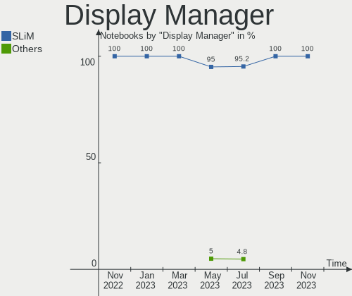
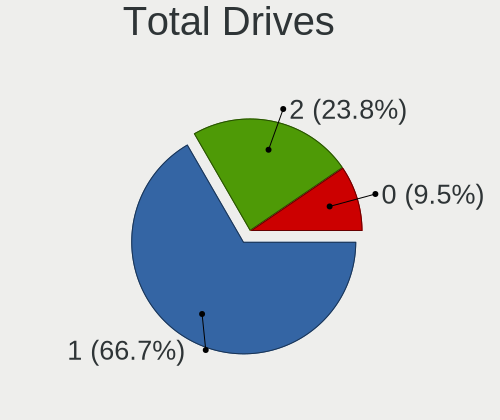
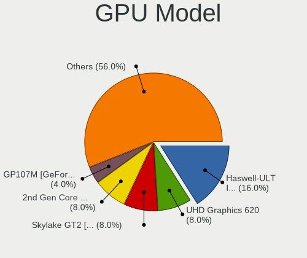

helloSystem - Hardware Trends (Notebooks)
-----------------------------------------

A project to identify most popular hardware characteristics and track their change
over time based on data collected by BSD users at https://BSD-Hardware.info.

Anyone can contribute to this report by the [hw-probe](https://github.com/linuxhw/hw-probe/blob/master/INSTALL.BSD.md) tool:

    hw-probe -all -upload

This report is for one last month. Overall report since the beginning of time: [TestCoverage](https://github.com/bsdhw/TestCoverage)

Period: Jul, 2022.

Contents
--------

* [ System ](#system)
  - [ OS                       ](#os)
  - [ OS Family                ](#os-family)
  - [ Arch                     ](#arch)
  - [ DE                       ](#de)
  - [ Display Server           ](#display-server)
  - [ Display Manager          ](#display-manager)
  - [ OS Lang                  ](#os-lang)
  - [ Boot Mode                ](#boot-mode)
  - [ Filesystem               ](#filesystem)
  - [ Part. scheme             ](#part-scheme)

* [ Board ](#board)
  - [ Vendor                   ](#vendor)
  - [ Model                    ](#model)
  - [ Model Family             ](#model-family)
  - [ MFG Year                 ](#mfg-year)
  - [ Form Factor              ](#form-factor)
  - [ Coreboot                 ](#coreboot)
  - [ RAM Size                 ](#ram-size)
  - [ RAM Used                 ](#ram-used)
  - [ Total Drives             ](#total-drives)
  - [ Has CD-ROM               ](#has-cd-rom)
  - [ Has Ethernet             ](#has-ethernet)
  - [ Has WiFi                 ](#has-wifi)
  - [ Has Bluetooth            ](#has-bluetooth)

* [ Location ](#location)
  - [ Country                  ](#country)
  - [ City                     ](#city)

* [ Drives ](#drives)
  - [ Drive Vendor             ](#drive-vendor)
  - [ Drive Model              ](#drive-model)
  - [ HDD Vendor               ](#hdd-vendor)
  - [ SSD Vendor               ](#ssd-vendor)
  - [ Drive Kind               ](#drive-kind)
  - [ Drive Connector          ](#drive-connector)
  - [ Drive Size               ](#drive-size)
  - [ Space Total              ](#space-total)
  - [ Space Used               ](#space-used)
  - [ Malfunc. Drives          ](#malfunc-drives)
  - [ Malfunc. Drive Vendor    ](#malfunc-drive-vendor)
  - [ Malfunc. HDD Vendor      ](#malfunc-hdd-vendor)
  - [ Malfunc. Drive Kind      ](#malfunc-drive-kind)
  - [ Failed Drives            ](#failed-drives)
  - [ Failed Drive Vendor      ](#failed-drive-vendor)
  - [ Drive Status             ](#drive-status)

* [ Storage controller ](#storage-controller)
  - [ Storage Vendor           ](#storage-vendor)
  - [ Storage Model            ](#storage-model)
  - [ Storage Kind             ](#storage-kind)

* [ Processor ](#processor)
  - [ CPU Vendor               ](#cpu-vendor)
  - [ CPU Model                ](#cpu-model)
  - [ CPU Model Family         ](#cpu-model-family)
  - [ CPU Cores                ](#cpu-cores)
  - [ CPU Sockets              ](#cpu-sockets)
  - [ CPU Threads              ](#cpu-threads)
  - [ CPU Microarch            ](#cpu-microarch)

* [ Graphics ](#graphics)
  - [ GPU Vendor               ](#gpu-vendor)
  - [ GPU Model                ](#gpu-model)
  - [ GPU Combo                ](#gpu-combo)
  - [ GPU Driver               ](#gpu-driver)
  - [ GPU Memory               ](#gpu-memory)

* [ Monitor ](#monitor)
  - [ Monitor Vendor           ](#monitor-vendor)
  - [ Monitor Model            ](#monitor-model)
  - [ Monitor Resolution       ](#monitor-resolution)
  - [ Monitor Diagonal         ](#monitor-diagonal)
  - [ Monitor Width            ](#monitor-width)
  - [ Aspect Ratio             ](#aspect-ratio)
  - [ Monitor Area             ](#monitor-area)
  - [ Pixel Density            ](#pixel-density)
  - [ Multiple Monitors        ](#multiple-monitors)

* [ Network ](#network)
  - [ Net Controller Vendor    ](#net-controller-vendor)
  - [ Net Controller Model     ](#net-controller-model)
  - [ Wireless Vendor          ](#wireless-vendor)
  - [ Wireless Model           ](#wireless-model)
  - [ Ethernet Vendor          ](#ethernet-vendor)
  - [ Ethernet Model           ](#ethernet-model)
  - [ Net Controller Kind      ](#net-controller-kind)
  - [ Used Controller          ](#used-controller)
  - [ NICs                     ](#nics)
  - [ IPv6                     ](#ipv6)

* [ Bluetooth ](#bluetooth)
  - [ Bluetooth Vendor         ](#bluetooth-vendor)
  - [ Bluetooth Model          ](#bluetooth-model)

* [ Sound ](#sound)
  - [ Sound Vendor             ](#sound-vendor)
  - [ Sound Model              ](#sound-model)

* [ Memory ](#memory)
  - [ Memory Vendor            ](#memory-vendor)
  - [ Memory Model             ](#memory-model)
  - [ Memory Kind              ](#memory-kind)
  - [ Memory Form Factor       ](#memory-form-factor)
  - [ Memory Size              ](#memory-size)
  - [ Memory Speed             ](#memory-speed)

* [ Printers & scanners ](#printers--scanners)
  - [ Printer Vendor           ](#printer-vendor)
  - [ Printer Model            ](#printer-model)
  - [ Scanner Vendor           ](#scanner-vendor)
  - [ Scanner Model            ](#scanner-model)

* [ Camera ](#camera)
  - [ Camera Vendor            ](#camera-vendor)
  - [ Camera Model             ](#camera-model)

* [ Security ](#security)
  - [ Fingerprint Vendor       ](#fingerprint-vendor)
  - [ Fingerprint Model        ](#fingerprint-model)
  - [ Chipcard Vendor          ](#chipcard-vendor)
  - [ Chipcard Model           ](#chipcard-model)

* [ Unsupported ](#unsupported)
  - [ Unsupported Devices      ](#unsupported-devices)
  - [ Unsupported Device Types ](#unsupported-device-types)

System
------

OS
--

Installed operating systems

| Name              | Notebooks | Percent |
|-------------------|-----------|---------|
| helloSystem 0.7.0 | 13        | 65%     |
| helloSystem 0.8.0 | 6         | 30%     |
| helloSystem 0.6.0 | 1         | 5%      |

OS Family
---------

OS without a version

| Name        | Notebooks | Percent |
|-------------|-----------|---------|
| helloSystem | 20        | 100%    |

Arch
----

OS architecture (x86_64, i586, etc.)

| Name  | Notebooks | Percent |
|-------|-----------|---------|
| amd64 | 20        | 100%    |

DE
--

Desktop Environment

| Name         | Notebooks | Percent |
|--------------|-----------|---------|
| helloDesktop | 19        | 95%     |
| GNOME        | 1         | 5%      |

Display Server
--------------

X11 or Wayland

| Name | Notebooks | Percent |
|------|-----------|---------|
| X11  | 20        | 100%    |

Display Manager
---------------

SDDM, LightDM, etc.

| Name | Notebooks | Percent |
|------|-----------|---------|
| SLiM | 20        | 100%    |

OS Lang
-------

Language

| Lang  | Notebooks | Percent |
|-------|-----------|---------|
| en_US | 17        | 85%     |
| es_ES | 2         | 10%     |
| C     | 1         | 5%      |

Boot Mode
---------

EFI or BIOS

| Mode | Notebooks | Percent |
|------|-----------|---------|
| EFI  | 20        | 100%    |

Filesystem
----------

Type of filesystem

| Type   | Notebooks | Percent |
|--------|-----------|---------|
| Cd9660 | 12        | 60%     |
| Zfs    | 8         | 40%     |

Part. scheme
------------

Scheme of partitioning

| Type | Notebooks | Percent |
|------|-----------|---------|
| GPT  | 20        | 100%    |

Board
-----

Vendor
------

Motherboard manufacturer

| Name            | Notebooks | Percent |
|-----------------|-----------|---------|
| Lenovo          | 5         | 25%     |
| Hewlett-Packard | 5         | 25%     |
| Dell            | 4         | 20%     |
| Apple           | 2         | 10%     |
| Acer            | 2         | 10%     |
| MSI             | 1         | 5%      |
| Fujitsu         | 1         | 5%      |

Model
-----

Motherboard model

| Name                            | Notebooks | Percent |
|---------------------------------|-----------|---------|
| HP 250 G6 Notebook PC           | 2         | 10%     |
| MSI GF63 Thin 10SC              | 1         | 5%      |
| Lenovo ThinkPad X61s 76693KG    | 1         | 5%      |
| Lenovo ThinkPad T61 7661GY9     | 1         | 5%      |
| Lenovo ThinkPad L450 20DSS1S402 | 1         | 5%      |
| Lenovo ThinkPad L412 0585AD9    | 1         | 5%      |
| Lenovo IdeaPad S145-15API 81V7  | 1         | 5%      |
| HP ProBook 4730s                | 1         | 5%      |
| HP ProBook 430 G4               | 1         | 5%      |
| HP OMEN by Laptop               | 1         | 5%      |
| Fujitsu LIFEBOOK A555           | 1         | 5%      |
| Dell Latitude E7440             | 1         | 5%      |
| Dell Latitude E5450             | 1         | 5%      |
| Dell Inspiron MP061             | 1         | 5%      |
| Dell Inspiron 15-3552           | 1         | 5%      |
| Apple MacBook6,1                | 1         | 5%      |
| Apple MacBook4,1                | 1         | 5%      |
| Acer Aspire E5-571G             | 1         | 5%      |
| Acer Aspire E1-522              | 1         | 5%      |

Model Family
------------

Motherboard model prefix

| Name             | Notebooks | Percent |
|------------------|-----------|---------|
| Lenovo ThinkPad  | 4         | 20%     |
| HP ProBook       | 2         | 10%     |
| HP 250           | 2         | 10%     |
| Dell Latitude    | 2         | 10%     |
| Dell Inspiron    | 2         | 10%     |
| Acer Aspire      | 2         | 10%     |
| MSI GF63         | 1         | 5%      |
| Lenovo IdeaPad   | 1         | 5%      |
| HP OMEN          | 1         | 5%      |
| Fujitsu LIFEBOOK | 1         | 5%      |
| Apple MacBook6   | 1         | 5%      |
| Apple MacBook4   | 1         | 5%      |

MFG Year
--------

Motherboard manufacture year

| Year | Notebooks | Percent |
|------|-----------|---------|
| 2015 | 3         | 15%     |
| 2021 | 2         | 10%     |
| 2020 | 2         | 10%     |
| 2016 | 2         | 10%     |
| 2007 | 2         | 10%     |
| 2022 | 1         | 5%      |
| 2019 | 1         | 5%      |
| 2018 | 1         | 5%      |
| 2017 | 1         | 5%      |
| 2013 | 1         | 5%      |
| 2011 | 1         | 5%      |
| 2010 | 1         | 5%      |
| 2009 | 1         | 5%      |
| 2008 | 1         | 5%      |

Form Factor
-----------

Physical design of the computer

| Name     | Notebooks | Percent |
|----------|-----------|---------|
| Notebook | 20        | 100%    |

Coreboot
--------

Have coreboot on board

| Used | Notebooks | Percent |
|------|-----------|---------|
| No   | 20        | 100%    |

RAM Size
--------

Total RAM memory

| Size in GB | Notebooks | Percent |
|------------|-----------|---------|
| 8.01-16.0  | 11        | 55%     |
| 4.01-8.0   | 6         | 30%     |
| 3.01-4.0   | 1         | 5%      |
| 2.01-3.0   | 1         | 5%      |
| 16.01-24.0 | 1         | 5%      |

RAM Used
--------

Used RAM memory

| Used GB  | Notebooks | Percent |
|----------|-----------|---------|
| 0.01-0.5 | 15        | 75%     |
| 0.51-1.0 | 4         | 20%     |
| 2.01-3.0 | 1         | 5%      |

Total Drives
------------

Number of drives on board

| Drives | Notebooks | Percent |
|--------|-----------|---------|
| 1      | 14        | 70%     |
| 2      | 5         | 25%     |
| 0      | 1         | 5%      |

Has CD-ROM
----------

Has CD-ROM on board

| Presented | Notebooks | Percent |
|-----------|-----------|---------|
| Yes       | 10        | 50%     |
| No        | 10        | 50%     |

Has Ethernet
------------

Has Ethernet on board

| Presented | Notebooks | Percent |
|-----------|-----------|---------|
| Yes       | 19        | 95%     |
| No        | 1         | 5%      |

Has WiFi
--------

Has WiFi module

| Presented | Notebooks | Percent |
|-----------|-----------|---------|
| Yes       | 20        | 100%    |

Has Bluetooth
-------------

Has Bluetooth module

| Presented | Notebooks | Percent |
|-----------|-----------|---------|
| Yes       | 17        | 85%     |
| No        | 3         | 15%     |

Location
--------

Country
-------

Geographic location (country)

| Country     | Notebooks | Percent |
|-------------|-----------|---------|
| Brazil      | 4         | 20%     |
| Spain       | 2         | 10%     |
| Netherlands | 2         | 10%     |
| USA         | 1         | 5%      |
| Taiwan      | 1         | 5%      |
| Sweden      | 1         | 5%      |
| Russia      | 1         | 5%      |
| Mexico      | 1         | 5%      |
| Italy       | 1         | 5%      |
| India       | 1         | 5%      |
| Hungary     | 1         | 5%      |
| Germany     | 1         | 5%      |
| Finland     | 1         | 5%      |
| China       | 1         | 5%      |
| Canada      | 1         | 5%      |

City
----

Geographic location (city)

| City                  | Notebooks | Percent |
|-----------------------|-----------|---------|
| Yichun                | 1         | 5%      |
| Vaudreuil-Dorion      | 1         | 5%      |
| Taipei                | 1         | 5%      |
| Szeged                | 1         | 5%      |
| Sao Paulo             | 1         | 5%      |
| Sao Bernardo do Campo | 1         | 5%      |
| Rho                   | 1         | 5%      |
| Redondela             | 1         | 5%      |
| Putkilahti            | 1         | 5%      |
| OEvertornea           | 1         | 5%      |
| Oegstgeest            | 1         | 5%      |
| Mazatlán             | 1         | 5%      |
| Maracanau             | 1         | 5%      |
| Kollam                | 1         | 5%      |
| Hampton               | 1         | 5%      |
| Groningen             | 1         | 5%      |
| Chita                 | 1         | 5%      |
| Bochum                | 1         | 5%      |
| Belo Horizonte        | 1         | 5%      |
| Almensilla            | 1         | 5%      |

Drives
------

Drive Vendor
------------

Hard drive vendors

| Vendor              | Notebooks | Drives | Percent |
|---------------------|-----------|--------|---------|
| Seagate             | 6         | 6      | 26.09%  |
| WDC                 | 5         | 5      | 21.74%  |
| Samsung Electronics | 3         | 4      | 13.04%  |
| Toshiba             | 2         | 2      | 8.7%    |
| Kingston            | 2         | 2      | 8.7%    |
| SSSTC               | 1         | 1      | 4.35%   |
| Hitachi             | 1         | 1      | 4.35%   |
| Fujitsu             | 1         | 1      | 4.35%   |
| China               | 1         | 1      | 4.35%   |
| ANACOMDA            | 1         | 1      | 4.35%   |

Drive Model
-----------

Hard drive models

| Model                           | Notebooks | Percent |
|---------------------------------|-----------|---------|
| WDC WDS240G2G0B-00EPW0 240GB    | 1         | 4.17%   |
| WDC WD6400BPVT-60HXZT1 640GB    | 1         | 4.17%   |
| WDC WD5000LPVX-22V0TT0 500GB    | 1         | 4.17%   |
| WDC WD10SPZX-24Z10T0 1TB        | 1         | 4.17%   |
| WDC WD10JPVX-22JC3T0 1TB        | 1         | 4.17%   |
| Toshiba MQ01ABD100 1TB          | 1         | 4.17%   |
| Toshiba MK6034GSX 64GB          | 1         | 4.17%   |
| SSSTC CL1-4D256 256GB           | 1         | 4.17%   |
| Seagate ST9120821AS 118GB       | 1         | 4.17%   |
| Seagate ST500LT032-1E9142 500GB | 1         | 4.17%   |
| Seagate ST500LT012-1DG142 500GB | 1         | 4.17%   |
| Seagate ST320LT020-9YG142 320GB | 1         | 4.17%   |
| Seagate ST1000LM049-2GH172 1TB  | 1         | 4.17%   |
| Seagate ST1000LM035-1RK172 1TB  | 1         | 4.17%   |
| Samsung SSD 970 EVO 250GB       | 1         | 4.17%   |
| Samsung SSD 860 PRO 512GB       | 1         | 4.17%   |
| Samsung SSD 860 EVO 500GB       | 1         | 4.17%   |
| Samsung SSD 850 EVO 120GB       | 1         | 4.17%   |
| Kingston SA400S37120G 120GB     | 1         | 4.17%   |
| Kingston OM8PDP3256B-AI1 256GB  | 1         | 4.17%   |
| Hitachi HTS545025B9SA02 250GB   | 1         | 4.17%   |
| Fujitsu MHZ2250BH G2 250GB      | 1         | 4.17%   |
| China SH00M128GB                | 1         | 4.17%   |
| ANACOMDA A1 120GB SSD           | 1         | 4.17%   |

HDD Vendor
----------

Hard disk drive vendors

| Vendor  | Notebooks | Drives | Percent |
|---------|-----------|--------|---------|
| Seagate | 6         | 6      | 42.86%  |
| WDC     | 4         | 4      | 28.57%  |
| Toshiba | 2         | 2      | 14.29%  |
| Hitachi | 1         | 1      | 7.14%   |
| Fujitsu | 1         | 1      | 7.14%   |

SSD Vendor
----------

Solid state drive vendors

| Vendor              | Notebooks | Drives | Percent |
|---------------------|-----------|--------|---------|
| Samsung Electronics | 3         | 3      | 42.86%  |
| WDC                 | 1         | 1      | 14.29%  |
| Kingston            | 1         | 1      | 14.29%  |
| China               | 1         | 1      | 14.29%  |
| ANACOMDA            | 1         | 1      | 14.29%  |

Drive Kind
----------

HDD or SSD

| Kind | Notebooks | Drives | Percent |
|------|-----------|--------|---------|
| HDD  | 12        | 14     | 54.55%  |
| SSD  | 7         | 7      | 31.82%  |
| NVMe | 3         | 3      | 13.64%  |

Drive Connector
---------------

SATA, SAS, NVMe, etc.

| Type | Notebooks | Drives | Percent |
|------|-----------|--------|---------|
| SATA | 17        | 21     | 85%     |
| NVMe | 3         | 3      | 15%     |

Drive Size
----------

Size of hard drive

| Size in TB | Notebooks | Drives | Percent |
|------------|-----------|--------|---------|
| 0.01-0.5   | 12        | 14     | 66.67%  |
| 0.51-1.0   | 6         | 7      | 33.33%  |

Space Total
-----------

Amount of disk space available on the file system

| Size in GB | Notebooks | Percent |
|------------|-----------|---------|
| 1-20       | 11        | 55%     |
| 101-250    | 4         | 20%     |
| 251-500    | 2         | 10%     |
| 501-1000   | 2         | 10%     |
| Unknown    | 1         | 5%      |

Space Used
----------

Amount of used disk space

| Used GB | Notebooks | Percent |
|---------|-----------|---------|
| 1-20    | 18        | 90%     |
| 21-50   | 1         | 5%      |
| Unknown | 1         | 5%      |

Malfunc. Drives
---------------

Drive models with a malfunction

| Model                           | Notebooks | Drives | Percent |
|---------------------------------|-----------|--------|---------|
| WDC WD10SPZX-24Z10T0 1TB        | 1         | 1      | 12.5%   |
| Toshiba MQ01ABD100 1TB          | 1         | 1      | 12.5%   |
| Toshiba MK6034GSX 64GB          | 1         | 1      | 12.5%   |
| Seagate ST9120821AS 118GB       | 1         | 1      | 12.5%   |
| Seagate ST320LT020-9YG142 320GB | 1         | 1      | 12.5%   |
| Hitachi HTS545025B9SA02 250GB   | 1         | 1      | 12.5%   |
| Fujitsu MHZ2250BH G2 250GB      | 1         | 1      | 12.5%   |
| China SH00M128GB                | 1         | 1      | 12.5%   |

Malfunc. Drive Vendor
---------------------

Vendors of faulty drives

| Vendor  | Notebooks | Drives | Percent |
|---------|-----------|--------|---------|
| Toshiba | 2         | 2      | 25%     |
| Seagate | 2         | 2      | 25%     |
| WDC     | 1         | 1      | 12.5%   |
| Hitachi | 1         | 1      | 12.5%   |
| Fujitsu | 1         | 1      | 12.5%   |
| China   | 1         | 1      | 12.5%   |

Malfunc. HDD Vendor
-------------------

Vendors of faulty HDD drives

| Vendor  | Notebooks | Drives | Percent |
|---------|-----------|--------|---------|
| Toshiba | 2         | 2      | 28.57%  |
| Seagate | 2         | 2      | 28.57%  |
| WDC     | 1         | 1      | 14.29%  |
| Hitachi | 1         | 1      | 14.29%  |
| Fujitsu | 1         | 1      | 14.29%  |

Malfunc. Drive Kind
-------------------

Kinds of faulty drives

| Kind | Notebooks | Drives | Percent |
|------|-----------|--------|---------|
| HDD  | 6         | 7      | 85.71%  |
| SSD  | 1         | 1      | 14.29%  |

Failed Drives
-------------

Failed drive models

Zero info for selected period =(

Failed Drive Vendor
-------------------

Failed drive vendors

Zero info for selected period =(

Drive Status
------------

Number of failed and malfunc. drives

| Status  | Notebooks | Drives | Percent |
|---------|-----------|--------|---------|
| Works   | 14        | 16     | 66.67%  |
| Malfunc | 7         | 8      | 33.33%  |

Storage controller
------------------

Storage Vendor
--------------

Storage controller vendors

| Vendor                         | Notebooks | Percent |
|--------------------------------|-----------|---------|
| Intel                          | 17        | 80.95%  |
| Solid State Storage Technology | 1         | 4.76%   |
| Samsung Electronics            | 1         | 4.76%   |
| Nvidia                         | 1         | 4.76%   |
| AMD                            | 1         | 4.76%   |

Storage Model
-------------

Storage controller models

| Model                                                                            | Notebooks | Percent |
|----------------------------------------------------------------------------------|-----------|---------|
| Intel Wildcat Point-LP SATA Controller [AHCI Mode]                               | 4         | 16.67%  |
| Intel Sunrise Point-LP SATA Controller [AHCI mode]                               | 3         | 12.5%   |
| Intel 82801HM/HEM (ICH8M/ICH8M-E) SATA Controller [AHCI mode]                    | 3         | 12.5%   |
| Intel 82801HM/HEM (ICH8M/ICH8M-E) IDE Controller                                 | 3         | 12.5%   |
| Samsung NVMe SSD Controller SM981/PM981/PM983                                    | 1         | 4.17%   |
| Nvidia MCP79 AHCI Controller                                                     | 1         | 4.17%   |
| Intel HM170/QM170 Chipset SATA Controller [AHCI Mode]                            | 1         | 4.17%   |
| Intel Atom/Celeron/Pentium Processor x5-E8000/J3xxx/N3xxx Series SATA Controller | 1         | 4.17%   |
| Intel 82801GBM/GHM (ICH7-M Family) SATA Controller [IDE mode]                    | 1         | 4.17%   |
| Intel 82801 Mobile SATA Controller [RAID mode]                                   | 1         | 4.17%   |
| Intel 8 Series SATA Controller 1 [AHCI mode]                                     | 1         | 4.17%   |
| Intel 6 Series/C200 Series Chipset Family 6 port Mobile SATA AHCI Controller     | 1         | 4.17%   |
| Intel 5 Series/3400 Series Chipset 4 port SATA AHCI Controller                   | 1         | 4.17%   |
| AMD FCH SATA Controller [AHCI mode]                                              | 1         | 4.17%   |
| Unknown                                                                          | 1         | 4.17%   |

Storage Kind
------------

Kind of storage controller (IDE, SATA, NVMe, SAS, ...)

| Kind | Notebooks | Percent |
|------|-----------|---------|
| SATA | 17        | 70.83%  |
| IDE  | 4         | 16.67%  |
| NVMe | 2         | 8.33%   |
| RAID | 1         | 4.17%   |

Processor
---------

CPU Vendor
----------

Processor vendors

| Vendor | Notebooks | Percent |
|--------|-----------|---------|
| Intel  | 18        | 90%     |
| AMD    | 2         | 10%     |

CPU Model
---------

Processor models

| Model                                         | Notebooks | Percent |
|-----------------------------------------------|-----------|---------|
| Intel Core i5-7200U CPU @ 2.50GHz             | 2         | 10%     |
| Intel Pentium M                               | 1         | 5%      |
| Intel Pentium CPU N3700 @ 1.60GHz             | 1         | 5%      |
| Intel Genuine CPU                             | 1         | 5%      |
| Intel Core i7-5500U CPU @ 2.40GHz             | 1         | 5%      |
| Intel Core i5-6300HQ CPU @ 2.30GHz            | 1         | 5%      |
| Intel Core i5-5300U CPU @ 2.30GHz             | 1         | 5%      |
| Intel Core i5-5200U CPU @ 2.20GHz             | 1         | 5%      |
| Intel Core i5-4310U CPU @ 2.00GHz             | 1         | 5%      |
| Intel Core i5-2410M CPU @ 2.30GHz             | 1         | 5%      |
| Intel Core i5-10500H CPU @ 2.50GHz            | 1         | 5%      |
| Intel Core i3-7020U CPU @ 2.30GHz             | 1         | 5%      |
| Intel Core i3-5005U CPU @ 2.00GHz             | 1         | 5%      |
| Intel Core 2 Duo CPU T9300 @ 2.50GHz          | 1         | 5%      |
| Intel Core 2 Duo CPU T8300 @ 2.40GHz          | 1         | 5%      |
| Intel Core 2 Duo CPU P7550 @ 2.26GHz          | 1         | 5%      |
| Intel Core 2 Duo CPU L7500 @ 1.60GHz          | 1         | 5%      |
| AMD Ryzen 5 3500U with Radeon Vega Mobile Gfx | 1         | 5%      |
| AMD E1-2500 APU with Radeon HD Graphics       | 1         | 5%      |

CPU Model Family
----------------

Processor model prefix

| Model            | Notebooks | Percent |
|------------------|-----------|---------|
| Intel Core i5    | 8         | 40%     |
| Intel Core 2 Duo | 4         | 20%     |
| Intel Core i3    | 2         | 10%     |
| Intel Pentium M  | 1         | 5%      |
| Intel Pentium    | 1         | 5%      |
| Intel Genuine    | 1         | 5%      |
| Intel Core i7    | 1         | 5%      |
| AMD Ryzen 5      | 1         | 5%      |
| AMD E1           | 1         | 5%      |

CPU Cores
---------

Number of processor cores

| Number  | Notebooks | Percent |
|---------|-----------|---------|
| 2       | 12        | 60%     |
| Unknown | 4         | 20%     |
| 4       | 2         | 10%     |
| 8       | 1         | 5%      |
| 6       | 1         | 5%      |

CPU Sockets
-----------

Number of sockets

| Number | Notebooks | Percent |
|--------|-----------|---------|
| 1      | 18        | 90%     |
| 2      | 2         | 10%     |

CPU Threads
-----------

Threads per core (Hyper-Threading)

| Number  | Notebooks | Percent |
|---------|-----------|---------|
| 2       | 11        | 55%     |
| 1       | 5         | 25%     |
| Unknown | 4         | 20%     |

CPU Microarch
-------------

Microarchitecture

| Name        | Notebooks | Percent |
|-------------|-----------|---------|
| Broadwell   | 4         | 20%     |
| Penryn      | 3         | 15%     |
| KabyLake    | 3         | 15%     |
| Core        | 2         | 10%     |
| Zen+        | 1         | 5%      |
| Westmere    | 1         | 5%      |
| Skylake     | 1         | 5%      |
| Silvermont  | 1         | 5%      |
| SandyBridge | 1         | 5%      |
| Jaguar      | 1         | 5%      |
| Haswell     | 1         | 5%      |
| CometLake   | 1         | 5%      |

Graphics
--------

GPU Vendor
----------

Vendors of graphics cards

| Vendor | Notebooks | Percent |
|--------|-----------|---------|
| Intel  | 16        | 64%     |
| AMD    | 5         | 20%     |
| Nvidia | 4         | 16%     |

GPU Model
---------

Graphics card models

| Model                                                                                    | Notebooks | Percent |
|------------------------------------------------------------------------------------------|-----------|---------|
| Intel HD Graphics 5500                                                                   | 4         | 14.29%  |
| Intel Mobile GM965/GL960 Integrated Graphics Controller (secondary)                      | 3         | 10.71%  |
| Intel Mobile GM965/GL960 Integrated Graphics Controller (primary)                        | 3         | 10.71%  |
| Intel HD Graphics 620                                                                    | 3         | 10.71%  |
| Nvidia TU117M [GeForce GTX 1650 Mobile / Max-Q]                                          | 1         | 3.57%   |
| Nvidia GM107M [GeForce GTX 950M]                                                         | 1         | 3.57%   |
| Nvidia GF117M [GeForce 610M/710M/810M/820M / GT 620M/625M/630M/720M]                     | 1         | 3.57%   |
| Nvidia C79 [GeForce 9400M]                                                               | 1         | 3.57%   |
| Intel HD Graphics 530                                                                    | 1         | 3.57%   |
| Intel Haswell-ULT Integrated Graphics Controller                                         | 1         | 3.57%   |
| Intel Core Processor Integrated Graphics Controller                                      | 1         | 3.57%   |
| Intel CometLake-H GT2 [UHD Graphics]                                                     | 1         | 3.57%   |
| Intel Atom/Celeron/Pentium Processor x5-E8000/J3xxx/N3xxx Integrated Graphics Controller | 1         | 3.57%   |
| Intel 2nd Generation Core Processor Family Integrated Graphics Controller                | 1         | 3.57%   |
| AMD Sun XT [Radeon HD 8670A/8670M/8690M / R5 M330 / M430 / Radeon 520 Mobile]            | 1         | 3.57%   |
| AMD Seymour [Radeon HD 6400M/7400M Series]                                               | 1         | 3.57%   |
| AMD RV515/M54 [Mobility Radeon X1400]                                                    | 1         | 3.57%   |
| AMD Picasso/Raven 2 [Radeon Vega Series / Radeon Vega Mobile Series]                     | 1         | 3.57%   |
| AMD Kabini [Radeon HD 8240 / R3 Series]                                                  | 1         | 3.57%   |

GPU Combo
---------

Combinations of graphics cards

| Name           | Notebooks | Percent |
|----------------|-----------|---------|
| 1 x Intel      | 8         | 40%     |
| 2 x Intel      | 3         | 15%     |
| Intel + Nvidia | 3         | 15%     |
| 1 x AMD        | 3         | 15%     |
| Intel + AMD    | 2         | 10%     |
| 1 x Nvidia     | 1         | 5%      |

GPU Driver
----------

Free vs proprietary

| Driver      | Notebooks | Percent |
|-------------|-----------|---------|
| Free        | 19        | 95%     |
| Proprietary | 1         | 5%      |

GPU Memory
----------

Total video memory

| Size in GB | Notebooks | Percent |
|------------|-----------|---------|
| Unknown    | 16        | 80%     |
| 0.01-0.5   | 3         | 15%     |
| 1.01-2.0   | 1         | 5%      |

Monitor
-------

Monitor Vendor
--------------

Monitor vendors

| Vendor              | Notebooks | Percent |
|---------------------|-----------|---------|
| Chimei Innolux      | 5         | 25%     |
| LG Display          | 4         | 20%     |
| Lenovo              | 3         | 15%     |
| BOE                 | 2         | 10%     |
| AU Optronics        | 2         | 10%     |
| Apple               | 2         | 10%     |
| Samsung Electronics | 1         | 5%      |
| Fujitsu Siemens     | 1         | 5%      |

Monitor Model
-------------

Monitor models

| Model                                                             | Notebooks | Percent |
|-------------------------------------------------------------------|-----------|---------|
| Samsung Electronics U28E590 SAM0C4E 3840x2160 610x350mm 27.7-inch | 1         | 5%      |
| LG Display LCD Monitor LGD0532 1920x1080 340x190mm 15.3-inch      | 1         | 5%      |
| LG Display LCD Monitor LGD0484 1366x768 340x190mm 15.3-inch       | 1         | 5%      |
| LG Display LCD Monitor LGD0353 1366x768 350x190mm 15.7-inch       | 1         | 5%      |
| LG Display LCD Monitor LGD027B 1600x900 380x210mm 17.1-inch       | 1         | 5%      |
| Lenovo LCD Monitor LEN40A0 1366x768 310x170mm 13.9-inch           | 1         | 5%      |
| Lenovo LCD Monitor LEN4031 1280x800 300x190mm 14.0-inch           | 1         | 5%      |
| Lenovo LCD Monitor LEN4000 1024x768 250x180mm 12.1-inch           | 1         | 5%      |
| Fujitsu Siemens XE17-4 FUS0674 1280x1024 340x270mm 17.1-inch      | 1         | 5%      |
| Chimei Innolux LCD Monitor CMN15E3 1920x1080 340x190mm 15.3-inch  | 1         | 5%      |
| Chimei Innolux LCD Monitor CMN15BF 1366x768 340x190mm 15.3-inch   | 1         | 5%      |
| Chimei Innolux LCD Monitor CMN1521 1920x1080 340x190mm 15.3-inch  | 1         | 5%      |
| Chimei Innolux LCD Monitor CMN1492 1366x768 310x170mm 13.9-inch   | 1         | 5%      |
| Chimei Innolux LCD Monitor CMN1368 1366x768 290x160mm 13.0-inch   | 1         | 5%      |
| BOE LCD Monitor BOE0757 1366x768 340x190mm 15.3-inch              | 1         | 5%      |
| BOE LCD Monitor BOE0600 1366x768 310x170mm 13.9-inch              | 1         | 5%      |
| AU Optronics LCD Monitor AUO40EC 1366x768 340x190mm 15.3-inch     | 1         | 5%      |
| AU Optronics LCD Monitor AUO2A3C 1366x768 310x170mm 13.9-inch     | 1         | 5%      |
| Apple LCD Monitor APP9CD1 1280x800 290x180mm 13.4-inch            | 1         | 5%      |
| Apple LCD Monitor APP9C5F 1280x800 290x180mm 13.4-inch            | 1         | 5%      |

Monitor Resolution
------------------

Monitor screen resolution

| Resolution       | Notebooks | Percent |
|------------------|-----------|---------|
| 1366x768 (WXGA)  | 10        | 50%     |
| 1920x1080 (FHD)  | 4         | 20%     |
| 1280x800 (WXGA)  | 3         | 15%     |
| 3840x2160 (4K)   | 1         | 5%      |
| 1600x900 (HD+)   | 1         | 5%      |
| 1280x1024 (SXGA) | 1         | 5%      |

Monitor Diagonal
----------------

Diagonal size in inches

| Inches | Notebooks | Percent |
|--------|-----------|---------|
| 15     | 8         | 40%     |
| 13     | 7         | 35%     |
| 17     | 2         | 10%     |
| 27     | 1         | 5%      |
| 23     | 1         | 5%      |
| 14     | 1         | 5%      |

Monitor Width
-------------

Physical width

| Width in mm | Notebooks | Percent |
|-------------|-----------|---------|
| 301-350     | 13        | 65%     |
| 201-300     | 4         | 20%     |
| 601-700     | 1         | 5%      |
| 501-600     | 1         | 5%      |
| 351-400     | 1         | 5%      |

Aspect Ratio
------------

Proportional relationship between the width and the height

| Ratio | Notebooks | Percent |
|-------|-----------|---------|
| 16/9  | 16        | 80%     |
| 16/10 | 3         | 15%     |
| 5/4   | 1         | 5%      |

Monitor Area
------------

Area in inch²

| Area in inch² | Notebooks | Percent |
|----------------|-----------|---------|
| 81-90          | 7         | 35%     |
| 91-100         | 7         | 35%     |
| 71-80          | 1         | 5%      |
| 301-350        | 1         | 5%      |
| 201-250        | 1         | 5%      |
| 141-150        | 1         | 5%      |
| 121-130        | 1         | 5%      |
| 101-110        | 1         | 5%      |

Pixel Density
-------------

Pixels per inch

| Density | Notebooks | Percent |
|---------|-----------|---------|
| 101-120 | 12        | 60%     |
| 121-160 | 5         | 25%     |
| 51-100  | 3         | 15%     |

Multiple Monitors
-----------------

Total monitors connected

| Total | Notebooks | Percent |
|-------|-----------|---------|
| 1     | 19        | 95%     |
| 2     | 1         | 5%      |

Network
-------

Net Controller Vendor
---------------------

Controller vendors

| Vendor                   | Notebooks | Percent |
|--------------------------|-----------|---------|
| Intel                    | 13        | 38.24%  |
| Realtek Semiconductor    | 9         | 26.47%  |
| Qualcomm Atheros         | 4         | 11.76%  |
| Broadcom                 | 3         | 8.82%   |
| Sierra Wireless          | 1         | 2.94%   |
| Samsung Electronics      | 1         | 2.94%   |
| Ralink                   | 1         | 2.94%   |
| Nvidia                   | 1         | 2.94%   |
| Marvell Technology Group | 1         | 2.94%   |

Net Controller Model
--------------------

Controller models

| Model                                                             | Notebooks | Percent |
|-------------------------------------------------------------------|-----------|---------|
| Realtek RTL8111/8168/8411 PCI Express Gigabit Ethernet Controller | 9         | 22.5%   |
| Intel Wireless 7265                                               | 4         | 10%     |
| Qualcomm Atheros QCA9565 / AR9565 Wireless Network Adapter        | 2         | 5%      |
| Intel Dual Band Wireless-AC 3168NGW [Stone Peak]                  | 2         | 5%      |
| Intel 82566MM Gigabit Network Connection                          | 2         | 5%      |
| Sierra Wireless Sierra Wireless EM7345 4G LTE                     | 1         | 2.5%    |
| Samsung GT-I9070 (network tethering, USB debugging enabled)       | 1         | 2.5%    |
| Realtek RTL8723BE PCIe Wireless Network Adapter                   | 1         | 2.5%    |
| Ralink RT3592 Wireless 802.11abgn 2T/2R PCIe                      | 1         | 2.5%    |
| Qualcomm Atheros QCA9377 802.11ac Wireless Network Adapter        | 1         | 2.5%    |
| Qualcomm Atheros QCA8171 Gigabit Ethernet                         | 1         | 2.5%    |
| Qualcomm Atheros AR9285 Wireless Network Adapter (PCI-Express)    | 1         | 2.5%    |
| Nvidia MCP79 Ethernet                                             | 1         | 2.5%    |
| Marvell Group 88E8058 PCI-E Gigabit Ethernet Controller           | 1         | 2.5%    |
| Intel Wireless 8265 / 8275                                        | 1         | 2.5%    |
| Intel Wireless 7260                                               | 1         | 2.5%    |
| Intel PRO/Wireless 4965 AG or AGN [Kedron] Network Connection     | 1         | 2.5%    |
| Intel PRO/Wireless 3945ABG [Golan] Network Connection             | 1         | 2.5%    |
| Intel Ethernet Connection I218-LM                                 | 1         | 2.5%    |
| Intel Ethernet Connection (3) I218-V                              | 1         | 2.5%    |
| Intel Ethernet Connection (3) I218-LM                             | 1         | 2.5%    |
| Intel Comet Lake PCH CNVi WiFi                                    | 1         | 2.5%    |
| Intel Centrino Advanced-N 6200                                    | 1         | 2.5%    |
| Broadcom BCM4401-B0 100Base-TX                                    | 1         | 2.5%    |
| Broadcom BCM43224 802.11a/b/g/n                                   | 1         | 2.5%    |
| Broadcom BCM4321 802.11a/b/g/n                                    | 1         | 2.5%    |

Wireless Vendor
---------------

Wireless vendors

| Vendor                | Notebooks | Percent |
|-----------------------|-----------|---------|
| Intel                 | 12        | 57.14%  |
| Qualcomm Atheros      | 4         | 19.05%  |
| Broadcom              | 2         | 9.52%   |
| Sierra Wireless       | 1         | 4.76%   |
| Realtek Semiconductor | 1         | 4.76%   |
| Ralink                | 1         | 4.76%   |

Wireless Model
--------------

Wireless models

| Model                                                          | Notebooks | Percent |
|----------------------------------------------------------------|-----------|---------|
| Intel Wireless 7265                                            | 4         | 19.05%  |
| Qualcomm Atheros QCA9565 / AR9565 Wireless Network Adapter     | 2         | 9.52%   |
| Intel Dual Band Wireless-AC 3168NGW [Stone Peak]               | 2         | 9.52%   |
| Sierra Wireless Sierra Wireless EM7345 4G LTE                  | 1         | 4.76%   |
| Realtek RTL8723BE PCIe Wireless Network Adapter                | 1         | 4.76%   |
| Ralink RT3592 Wireless 802.11abgn 2T/2R PCIe                   | 1         | 4.76%   |
| Qualcomm Atheros QCA9377 802.11ac Wireless Network Adapter     | 1         | 4.76%   |
| Qualcomm Atheros AR9285 Wireless Network Adapter (PCI-Express) | 1         | 4.76%   |
| Intel Wireless 8265 / 8275                                     | 1         | 4.76%   |
| Intel Wireless 7260                                            | 1         | 4.76%   |
| Intel PRO/Wireless 4965 AG or AGN [Kedron] Network Connection  | 1         | 4.76%   |
| Intel PRO/Wireless 3945ABG [Golan] Network Connection          | 1         | 4.76%   |
| Intel Comet Lake PCH CNVi WiFi                                 | 1         | 4.76%   |
| Intel Centrino Advanced-N 6200                                 | 1         | 4.76%   |
| Broadcom BCM43224 802.11a/b/g/n                                | 1         | 4.76%   |
| Broadcom BCM4321 802.11a/b/g/n                                 | 1         | 4.76%   |

Ethernet Vendor
---------------

Ethernet vendors

| Vendor                   | Notebooks | Percent |
|--------------------------|-----------|---------|
| Realtek Semiconductor    | 9         | 47.37%  |
| Intel                    | 5         | 26.32%  |
| Samsung Electronics      | 1         | 5.26%   |
| Qualcomm Atheros         | 1         | 5.26%   |
| Nvidia                   | 1         | 5.26%   |
| Marvell Technology Group | 1         | 5.26%   |
| Broadcom                 | 1         | 5.26%   |

Ethernet Model
--------------

Ethernet models

| Model                                                             | Notebooks | Percent |
|-------------------------------------------------------------------|-----------|---------|
| Realtek RTL8111/8168/8411 PCI Express Gigabit Ethernet Controller | 9         | 47.37%  |
| Intel 82566MM Gigabit Network Connection                          | 2         | 10.53%  |
| Samsung GT-I9070 (network tethering, USB debugging enabled)       | 1         | 5.26%   |
| Qualcomm Atheros QCA8171 Gigabit Ethernet                         | 1         | 5.26%   |
| Nvidia MCP79 Ethernet                                             | 1         | 5.26%   |
| Marvell Group 88E8058 PCI-E Gigabit Ethernet Controller           | 1         | 5.26%   |
| Intel Ethernet Connection I218-LM                                 | 1         | 5.26%   |
| Intel Ethernet Connection (3) I218-V                              | 1         | 5.26%   |
| Intel Ethernet Connection (3) I218-LM                             | 1         | 5.26%   |
| Broadcom BCM4401-B0 100Base-TX                                    | 1         | 5.26%   |

Net Controller Kind
-------------------

Ethernet, WiFi or modem

| Kind     | Notebooks | Percent |
|----------|-----------|---------|
| WiFi     | 20        | 51.28%  |
| Ethernet | 19        | 48.72%  |

Used Controller
---------------

Currently used network controller

| Kind     | Notebooks | Percent |
|----------|-----------|---------|
| Ethernet | 10        | 55.56%  |
| WiFi     | 8         | 44.44%  |

NICs
----

Total network controllers on board

| Total | Notebooks | Percent |
|-------|-----------|---------|
| 2     | 18        | 90%     |
| 1     | 2         | 10%     |

IPv6
----

IPv6 vs IPv4

| Used | Notebooks | Percent |
|------|-----------|---------|
| No   | 20        | 100%    |

Bluetooth
---------

Bluetooth Vendor
----------------

Controller vendors

| Vendor                          | Notebooks | Percent |
|---------------------------------|-----------|---------|
| Intel                           | 8         | 44.44%  |
| Lite-On Technology              | 2         | 11.11%  |
| Broadcom                        | 2         | 11.11%  |
| Realtek Semiconductor           | 1         | 5.56%   |
| Qualcomm Atheros Communications | 1         | 5.56%   |
| Hewlett-Packard                 | 1         | 5.56%   |
| Dell                            | 1         | 5.56%   |
| Cambridge Silicon Radio         | 1         | 5.56%   |
| Apple                           | 1         | 5.56%   |

Bluetooth Model
---------------

Controller models

| Model                                               | Notebooks | Percent |
|-----------------------------------------------------|-----------|---------|
| Intel Bluetooth wireless interface                  | 5         | 27.78%  |
| Lite-On Atheros AR3012 Bluetooth                    | 2         | 11.11%  |
| Intel Wireless-AC 3168 Bluetooth                    | 2         | 11.11%  |
| Realtek  Bluetooth 4.0 Adapter                      | 1         | 5.56%   |
| Qualcomm Atheros  QCA9377 Bluetooth 4.1             | 1         | 5.56%   |
| Intel AX201 Bluetooth                               | 1         | 5.56%   |
| HP Atheros AR9285 Malbec Bluetooth Adapter          | 1         | 5.56%   |
| Dell Wireless 355 Bluetooth                         | 1         | 5.56%   |
| Cambridge Silicon Radio Bluetooth Dongle (HCI mode) | 1         | 5.56%   |
| Broadcom BCM2045B (BDC-2.1)                         | 1         | 5.56%   |
| Broadcom BCM2045B (BDC-2) [Bluetooth Controller]    | 1         | 5.56%   |
| Apple Bluetooth Host Controller                     | 1         | 5.56%   |

Sound
-----

Sound Vendor
------------

Sound card vendors

| Vendor | Notebooks | Percent |
|--------|-----------|---------|
| Intel  | 17        | 85%     |
| AMD    | 2         | 10%     |
| Nvidia | 1         | 5%      |

Sound Model
-----------

Sound card models

| Model                                                                                             | Notebooks | Percent |
|---------------------------------------------------------------------------------------------------|-----------|---------|
| Intel Wildcat Point-LP High Definition Audio Controller                                           | 4         | 14.81%  |
| Intel Broadwell-U Audio Controller                                                                | 4         | 14.81%  |
| Intel Sunrise Point-LP HD Audio                                                                   | 3         | 11.11%  |
| Intel 82801H (ICH8 Family) HD Audio Controller                                                    | 3         | 11.11%  |
| Nvidia MCP79 High Definition Audio                                                                | 1         | 3.7%    |
| Intel NM10/ICH7 Family High Definition Audio Controller                                           | 1         | 3.7%    |
| Intel Haswell-ULT HD Audio Controller                                                             | 1         | 3.7%    |
| Intel Comet Lake PCH cAVS                                                                         | 1         | 3.7%    |
| Intel Atom/Celeron/Pentium Processor x5-E8000/J3xxx/N3xxx Series High Definition Audio Controller | 1         | 3.7%    |
| Intel 8 Series HD Audio Controller                                                                | 1         | 3.7%    |
| Intel 6 Series/C200 Series Chipset Family High Definition Audio Controller                        | 1         | 3.7%    |
| Intel 5 Series/3400 Series Chipset High Definition Audio                                          | 1         | 3.7%    |
| Intel 100 Series/C230 Series Chipset Family HD Audio Controller                                   | 1         | 3.7%    |
| AMD Raven/Raven2/Fenghuang HDMI/DP Audio Controller                                               | 1         | 3.7%    |
| AMD Kabini HDMI/DP Audio                                                                          | 1         | 3.7%    |
| AMD FCH Azalia Controller                                                                         | 1         | 3.7%    |
| AMD Family 17h/19h HD Audio Controller                                                            | 1         | 3.7%    |

Memory
------

Memory Vendor
-------------

Memory module vendors

| Vendor              | Notebooks | Percent |
|---------------------|-----------|---------|
| SK hynix            | 6         | 26.09%  |
| Samsung Electronics | 5         | 21.74%  |
| Unknown             | 3         | 13.04%  |
| Nanya Technology    | 2         | 8.7%    |
| Micron Technology   | 2         | 8.7%    |
| Kingston            | 2         | 8.7%    |
| Smart Brazil        | 1         | 4.35%   |
| Smart               | 1         | 4.35%   |
| Elpida              | 1         | 4.35%   |

Memory Model
------------

Memory module models

| Model                                                        | Notebooks | Percent |
|--------------------------------------------------------------|-----------|---------|
| Unknown RAM Module 2GB SODIMM DDR2 667MT/s                   | 2         | 8%      |
| SK hynix RAM HMT451S6BFR8A-PB 4GB SODIMM DDR3 1600MT/s       | 2         | 8%      |
| Samsung RAM M471B5173EB0-YK0 4GB SODIMM DDR3 1600MT/s        | 2         | 8%      |
| Unknown RAM Module 2GB SODIMM DDR3 1067MT/s                  | 1         | 4%      |
| Smart RAM SH564128FJ8NWRNSQR 4GB SODIMM DDR3 1600MT/s        | 1         | 4%      |
| Smart Brazil RAM SMS4TDC3C0K0446SCG 4GB SODIMM DDR4 2400MT/s | 1         | 4%      |
| SK hynix RAM HYMP512S64CP8-C4 1GB SODIMM DDR 533MT/s         | 1         | 4%      |
| SK hynix RAM HYMP125S64CP8-S6 2GB SODIMM DDR 975MT/s         | 1         | 4%      |
| SK hynix RAM HMT451S6MFR8A-PB 4GB SODIMM DDR3 800MT/s        | 1         | 4%      |
| SK hynix RAM HMT41GS6BFR8A-PB 8GB SODIMM DDR3 1600MT/s       | 1         | 4%      |
| SK hynix RAM HMA851S6AFR6N-UH 4GB SODIMM DDR4 2400MT/s       | 1         | 4%      |
| Samsung RAM Module 8GB SODIMM DDR4 2133MT/s                  | 1         | 4%      |
| Samsung RAM Module 4GB SODIMM DDR4 2133MT/s                  | 1         | 4%      |
| Samsung RAM M471B5173QH0-YK0 4GB SODIMM DDR3 1600MT/s        | 1         | 4%      |
| Samsung RAM M471A5244CB0-CTD 4GB SODIMM DDR4 2667MT/s        | 1         | 4%      |
| Nanya RAM Module 1GB SODIMM DDR2 667MT/s                     | 1         | 4%      |
| Nanya RAM M2S4G64CB8HG5N-CG 4GB SODIMM DDR3 667MT/s          | 1         | 4%      |
| Micron RAM 8ATF1G64HZ-3G2R1 8GB SODIMM DDR4 3200MT/s         | 1         | 4%      |
| Micron RAM 4ATF51264HZ-2G3B1 4GB SODIMM DDR4 2400MT/s        | 1         | 4%      |
| Kingston RAM 9905711-015.A00G 4GB SODIMM DDR4 2400MT/s       | 1         | 4%      |
| Kingston RAM 9905711-005.A00G 4GB SODIMM DDR4 2133MT/s       | 1         | 4%      |
| Elpida RAM EBJ41UF8BCS0-DJ-F 4GB SODIMM DDR3 1333MT/s        | 1         | 4%      |

Memory Kind
-----------

Memory module kinds

| Kind | Notebooks | Percent |
|------|-----------|---------|
| DDR3 | 10        | 47.62%  |
| DDR4 | 6         | 28.57%  |
| DDR2 | 4         | 19.05%  |
| DDR  | 1         | 4.76%   |

Memory Form Factor
------------------

Physical design of the memory module

| Name   | Notebooks | Percent |
|--------|-----------|---------|
| SODIMM | 20        | 100%    |

Memory Size
-----------

Memory module size

| Size | Notebooks | Percent |
|------|-----------|---------|
| 4096 | 13        | 59.09%  |
| 2048 | 4         | 18.18%  |
| 8192 | 3         | 13.64%  |
| 1024 | 2         | 9.09%   |

Memory Speed
------------

Memory module speed

| Speed | Notebooks | Percent |
|-------|-----------|---------|
| 1600  | 6         | 27.27%  |
| 667   | 4         | 18.18%  |
| 2400  | 3         | 13.64%  |
| 2133  | 2         | 9.09%   |
| 3200  | 1         | 4.55%   |
| 2667  | 1         | 4.55%   |
| 1333  | 1         | 4.55%   |
| 1067  | 1         | 4.55%   |
| 975   | 1         | 4.55%   |
| 800   | 1         | 4.55%   |
| 533   | 1         | 4.55%   |

Printers & scanners
-------------------

Printer Vendor
--------------

Printer device vendors

Zero info for selected period =(

Printer Model
-------------

Printer device models

Zero info for selected period =(

Scanner Vendor
--------------

Scanner device vendors

Zero info for selected period =(

Scanner Model
-------------

Scanner device models

Zero info for selected period =(

Camera
------

Camera Vendor
-------------

Camera device vendors

| Vendor                        | Notebooks | Percent |
|-------------------------------|-----------|---------|
| Chicony Electronics           | 4         | 36.36%  |
| Microdia                      | 2         | 18.18%  |
| Suyin                         | 1         | 9.09%   |
| Sunplus Innovation Technology | 1         | 9.09%   |
| Realtek Semiconductor         | 1         | 9.09%   |
| Lite-On Technology            | 1         | 9.09%   |
| Acer                          | 1         | 9.09%   |

Camera Model
------------

Camera device models

| Model                            | Notebooks | Percent |
|----------------------------------|-----------|---------|
| Suyin Integrated_Webcam_HD       | 1         | 9.09%   |
| Sunplus Integrated Camera        | 1         | 9.09%   |
| Realtek Realtek USB2.0 PC Camera | 1         | 9.09%   |
| Microdia Integrated_Webcam_HD    | 1         | 9.09%   |
| Microdia Integrated Webcam       | 1         | 9.09%   |
| Lite-On HP HD Camera             | 1         | 9.09%   |
| Chicony Integrated HP HD Webcam  | 1         | 9.09%   |
| Chicony HD WebCam (Acer)         | 1         | 9.09%   |
| Chicony HD WebCam                | 1         | 9.09%   |
| Chicony FJ Camera                | 1         | 9.09%   |
| Acer Integrated Camera           | 1         | 9.09%   |

Security
--------

Fingerprint Vendor
------------------

Fingerprint sensor vendors

| Vendor             | Notebooks | Percent |
|--------------------|-----------|---------|
| Validity Sensors   | 2         | 50%     |
| Upek               | 1         | 25%     |
| STMicroelectronics | 1         | 25%     |

Fingerprint Model
-----------------

Fingerprint sensor models

| Model                                      | Notebooks | Percent |
|--------------------------------------------|-----------|---------|
| Validity Sensors VFS495 Fingerprint Reader | 1         | 25%     |
| Validity Sensors VFS471 Fingerprint Reader | 1         | 25%     |
| Upek TCS5B Fingerprint sensor              | 1         | 25%     |
| STMicroelectronics Fingerprint Reader      | 1         | 25%     |

Chipcard Vendor
---------------

Chipcard module vendors

Zero info for selected period =(

Chipcard Model
--------------

Chipcard module models

Zero info for selected period =(

Unsupported
-----------

Unsupported Devices
-------------------

Total unsupported devices on board

| Total | Notebooks | Percent |
|-------|-----------|---------|
| 1     | 7         | 35%     |
| 2     | 6         | 30%     |
| 0     | 4         | 20%     |
| 3     | 3         | 15%     |

Unsupported Device Types
------------------------

Types of unsupported devices

| Type                     | Notebooks | Percent |
|--------------------------|-----------|---------|
| Communication controller | 12        | 42.86%  |
| Bluetooth                | 7         | 25%     |
| Fingerprint reader       | 4         | 14.29%  |
| Net/wireless             | 3         | 10.71%  |
| Card reader              | 2         | 7.14%   |

