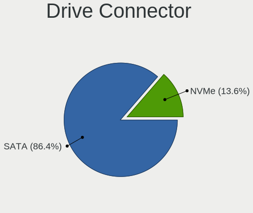
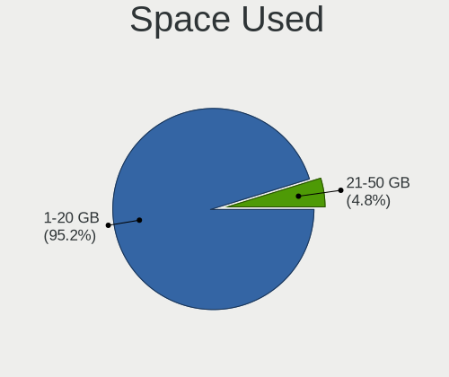

helloSystem - Hardware Trends (Notebooks)
-----------------------------------------

A project to identify most popular hardware characteristics and track their change
over time based on data collected by BSD users at https://BSD-Hardware.info.

Anyone can contribute to this report by the [hw-probe](https://github.com/linuxhw/hw-probe/blob/master/INSTALL.BSD.md) tool:

    hw-probe -all -upload

This report is for one last month. Overall report since the beginning of time: [TestDays](https://github.com/bsdhw/TestDays)

Period: Mar, 2023.

Contents
--------

* [ System ](#system)
  - [ OS                       ](#os)
  - [ OS Family                ](#os-family)
  - [ Arch                     ](#arch)
  - [ DE                       ](#de)
  - [ Display Server           ](#display-server)
  - [ Display Manager          ](#display-manager)
  - [ OS Lang                  ](#os-lang)
  - [ Boot Mode                ](#boot-mode)
  - [ Filesystem               ](#filesystem)
  - [ Part. scheme             ](#part-scheme)

* [ Board ](#board)
  - [ Vendor                   ](#vendor)
  - [ Model                    ](#model)
  - [ Model Family             ](#model-family)
  - [ MFG Year                 ](#mfg-year)
  - [ Form Factor              ](#form-factor)
  - [ Coreboot                 ](#coreboot)
  - [ RAM Size                 ](#ram-size)
  - [ RAM Used                 ](#ram-used)
  - [ Total Drives             ](#total-drives)
  - [ Has CD-ROM               ](#has-cd-rom)
  - [ Has Ethernet             ](#has-ethernet)
  - [ Has WiFi                 ](#has-wifi)
  - [ Has Bluetooth            ](#has-bluetooth)

* [ Location ](#location)
  - [ Country                  ](#country)
  - [ City                     ](#city)

* [ Drives ](#drives)
  - [ Drive Vendor             ](#drive-vendor)
  - [ Drive Model              ](#drive-model)
  - [ HDD Vendor               ](#hdd-vendor)
  - [ SSD Vendor               ](#ssd-vendor)
  - [ Drive Kind               ](#drive-kind)
  - [ Drive Connector          ](#drive-connector)
  - [ Drive Size               ](#drive-size)
  - [ Space Total              ](#space-total)
  - [ Space Used               ](#space-used)
  - [ Malfunc. Drives          ](#malfunc-drives)
  - [ Malfunc. Drive Vendor    ](#malfunc-drive-vendor)
  - [ Malfunc. HDD Vendor      ](#malfunc-hdd-vendor)
  - [ Malfunc. Drive Kind      ](#malfunc-drive-kind)
  - [ Failed Drives            ](#failed-drives)
  - [ Failed Drive Vendor      ](#failed-drive-vendor)
  - [ Drive Status             ](#drive-status)

* [ Storage controller ](#storage-controller)
  - [ Storage Vendor           ](#storage-vendor)
  - [ Storage Model            ](#storage-model)
  - [ Storage Kind             ](#storage-kind)

* [ Processor ](#processor)
  - [ CPU Vendor               ](#cpu-vendor)
  - [ CPU Model                ](#cpu-model)
  - [ CPU Model Family         ](#cpu-model-family)
  - [ CPU Cores                ](#cpu-cores)
  - [ CPU Sockets              ](#cpu-sockets)
  - [ CPU Threads              ](#cpu-threads)
  - [ CPU Microarch            ](#cpu-microarch)

* [ Graphics ](#graphics)
  - [ GPU Vendor               ](#gpu-vendor)
  - [ GPU Model                ](#gpu-model)
  - [ GPU Combo                ](#gpu-combo)
  - [ GPU Driver               ](#gpu-driver)
  - [ GPU Memory               ](#gpu-memory)

* [ Monitor ](#monitor)
  - [ Monitor Vendor           ](#monitor-vendor)
  - [ Monitor Model            ](#monitor-model)
  - [ Monitor Resolution       ](#monitor-resolution)
  - [ Monitor Diagonal         ](#monitor-diagonal)
  - [ Monitor Width            ](#monitor-width)
  - [ Aspect Ratio             ](#aspect-ratio)
  - [ Monitor Area             ](#monitor-area)
  - [ Pixel Density            ](#pixel-density)
  - [ Multiple Monitors        ](#multiple-monitors)

* [ Network ](#network)
  - [ Net Controller Vendor    ](#net-controller-vendor)
  - [ Net Controller Model     ](#net-controller-model)
  - [ Wireless Vendor          ](#wireless-vendor)
  - [ Wireless Model           ](#wireless-model)
  - [ Ethernet Vendor          ](#ethernet-vendor)
  - [ Ethernet Model           ](#ethernet-model)
  - [ Net Controller Kind      ](#net-controller-kind)
  - [ Used Controller          ](#used-controller)
  - [ NICs                     ](#nics)
  - [ IPv6                     ](#ipv6)

* [ Bluetooth ](#bluetooth)
  - [ Bluetooth Vendor         ](#bluetooth-vendor)
  - [ Bluetooth Model          ](#bluetooth-model)

* [ Sound ](#sound)
  - [ Sound Vendor             ](#sound-vendor)
  - [ Sound Model              ](#sound-model)

* [ Memory ](#memory)
  - [ Memory Vendor            ](#memory-vendor)
  - [ Memory Model             ](#memory-model)
  - [ Memory Kind              ](#memory-kind)
  - [ Memory Form Factor       ](#memory-form-factor)
  - [ Memory Size              ](#memory-size)
  - [ Memory Speed             ](#memory-speed)

* [ Printers & scanners ](#printers--scanners)
  - [ Printer Vendor           ](#printer-vendor)
  - [ Printer Model            ](#printer-model)
  - [ Scanner Vendor           ](#scanner-vendor)
  - [ Scanner Model            ](#scanner-model)

* [ Camera ](#camera)
  - [ Camera Vendor            ](#camera-vendor)
  - [ Camera Model             ](#camera-model)

* [ Security ](#security)
  - [ Fingerprint Vendor       ](#fingerprint-vendor)
  - [ Fingerprint Model        ](#fingerprint-model)
  - [ Chipcard Vendor          ](#chipcard-vendor)
  - [ Chipcard Model           ](#chipcard-model)

* [ Unsupported ](#unsupported)
  - [ Unsupported Devices      ](#unsupported-devices)
  - [ Unsupported Device Types ](#unsupported-device-types)

System
------

OS
--

Installed operating systems

| Name              | Notebooks | Percent |
|-------------------|-----------|---------|
| helloSystem 0.8.1 | 81        | 81%     |
| helloSystem 0.8.0 | 11        | 11%     |
| helloSystem 0.8.2 | 7         | 7%      |
| helloSystem 0.7.0 | 1         | 1%      |

OS Family
---------

OS without a version

| Name        | Notebooks | Percent |
|-------------|-----------|---------|
| helloSystem | 100       | 100%    |

Arch
----

OS architecture (x86_64, i586, etc.)

| Name  | Notebooks | Percent |
|-------|-----------|---------|
| amd64 | 100       | 100%    |

DE
--

Desktop Environment

| Name         | Notebooks | Percent |
|--------------|-----------|---------|
| helloDesktop | 99        | 99%     |
| GNOME        | 1         | 1%      |

Display Server
--------------

X11 or Wayland

| Name | Notebooks | Percent |
|------|-----------|---------|
| X11  | 100       | 100%    |

Display Manager
---------------

SDDM, LightDM, etc.

| Name | Notebooks | Percent |
|------|-----------|---------|
| SLiM | 100       | 100%    |

OS Lang
-------

Language

| Lang    | Notebooks | Percent |
|---------|-----------|---------|
| en_US   | 47        | 47%     |
| ru_RU   | 10        | 10%     |
| fr_FR   | 10        | 10%     |
| en      | 8         | 8%      |
| de_DE   | 7         | 7%      |
| pt_BR   | 3         | 3%      |
| pl_PL   | 3         | 3%      |
| es_ES   | 3         | 3%      |
| Unknown | 3         | 3%      |
| zh_CN   | 2         | 2%      |
| nl_NL   | 1         | 1%      |
| ko_KR   | 1         | 1%      |
| fi_FI   | 1         | 1%      |
| es      | 1         | 1%      |

Boot Mode
---------

EFI or BIOS

| Mode | Notebooks | Percent |
|------|-----------|---------|
| EFI  | 99        | 99%     |
| BIOS | 1         | 1%      |

Filesystem
----------

Type of filesystem

| Type   | Notebooks | Percent |
|--------|-----------|---------|
| Cd9660 | 52        | 52%     |
| Zfs    | 48        | 48%     |

Part. scheme
------------

Scheme of partitioning

| Type | Notebooks | Percent |
|------|-----------|---------|
| GPT  | 99        | 99%     |
| MBR  | 1         | 1%      |

Board
-----

Vendor
------

Motherboard manufacturer

| Name                | Notebooks | Percent |
|---------------------|-----------|---------|
| Lenovo              | 37        | 37%     |
| Hewlett-Packard     | 11        | 11%     |
| Dell                | 11        | 11%     |
| ASUSTek Computer    | 7         | 7%      |
| Acer                | 7         | 7%      |
| Toshiba             | 6         | 6%      |
| Samsung Electronics | 4         | 4%      |
| Fujitsu             | 3         | 3%      |
| Apple               | 3         | 3%      |
| Sony                | 2         | 2%      |
| LG Electronics      | 2         | 2%      |
| MECHREVO S1 Series  | 1         | 1%      |
| Irbis               | 1         | 1%      |
| Intel               | 1         | 1%      |
| IGEL Technology     | 1         | 1%      |
| Dynabook Europe     | 1         | 1%      |
| DNS                 | 1         | 1%      |
| Clevo               | 1         | 1%      |

Model
-----

Motherboard model

| Name                                  | Notebooks | Percent |
|---------------------------------------|-----------|---------|
| Toshiba Satellite P300                | 1         | 1%      |
| Toshiba Satellite L675D               | 1         | 1%      |
| Toshiba Satellite L50-B               | 1         | 1%      |
| Toshiba Satellite L40                 | 1         | 1%      |
| Toshiba Satellite C845                | 1         | 1%      |
| Toshiba Satellite A200                | 1         | 1%      |
| Sony VGN-FZ19VN                       | 1         | 1%      |
| Sony SVE1511C5E                       | 1         | 1%      |
| Samsung R520/R522/R620                | 1         | 1%      |
| Samsung R468/R418                     | 1         | 1%      |
| Samsung 305E4A/305E5A/305E7A          | 1         | 1%      |
| Samsung 275E4E/275E5E                 | 1         | 1%      |
| MECHREVO S1 Series S1 Series          | 1         | 1%      |
| LG E500-L.A2M4A2                      | 1         | 1%      |
| LG COLUMBIA                           | 1         | 1%      |
| Lenovo ZIUS6                          | 1         | 1%      |
| Lenovo Yoga Slim 7 Pro 14ACH5 82MS    | 1         | 1%      |
| Lenovo ThinkPad X61s 7667WQS          | 1         | 1%      |
| Lenovo ThinkPad X270 W10DG 20K5S0DB05 | 1         | 1%      |
| Lenovo ThinkPad X230 Tablet 34352TU   | 1         | 1%      |
| Lenovo ThinkPad X230 232578G          | 1         | 1%      |
| Lenovo ThinkPad X230 23252G8          | 1         | 1%      |
| Lenovo ThinkPad X220 4291AN9          | 1         | 1%      |
| Lenovo ThinkPad X220 4290DK6          | 1         | 1%      |
| Lenovo ThinkPad X220 4286CTO          | 1         | 1%      |
| Lenovo ThinkPad X201 36801T6          | 1         | 1%      |
| Lenovo ThinkPad X200 74591P0          | 1         | 1%      |
| Lenovo ThinkPad X200 2024AY7          | 1         | 1%      |
| Lenovo ThinkPad X1 Carbon 3448AWU     | 1         | 1%      |
| Lenovo ThinkPad X1 Carbon 3444FEU     | 1         | 1%      |
| Lenovo ThinkPad W541 20EF000NUS       | 1         | 1%      |
| Lenovo ThinkPad T61 7659CA1           | 1         | 1%      |
| Lenovo ThinkPad T61 7658CTO           | 1         | 1%      |
| Lenovo ThinkPad T540p 20BFS10W03      | 1         | 1%      |
| Lenovo ThinkPad T520 4242PN3          | 1         | 1%      |
| Lenovo ThinkPad T470 W10DG 20JNS02000 | 1         | 1%      |
| Lenovo ThinkPad T460s 20FAS2BR00      | 1         | 1%      |
| Lenovo ThinkPad T440p                 | 1         | 1%      |
| Lenovo ThinkPad T430s 2356CV6         | 1         | 1%      |
| Lenovo ThinkPad T430 2349G5P          | 1         | 1%      |

Model Family
------------

Motherboard model prefix

| Name                      | Notebooks | Percent |
|---------------------------|-----------|---------|
| Lenovo ThinkPad           | 28        | 28%     |
| Dell Latitude             | 7         | 7%      |
| Toshiba Satellite         | 6         | 6%      |
| Lenovo IdeaPad            | 5         | 5%      |
| Dell Inspiron             | 4         | 4%      |
| HP Pavilion               | 3         | 3%      |
| HP Laptop                 | 3         | 3%      |
| HP EliteBook              | 3         | 3%      |
| Acer Aspire               | 3         | 3%      |
| Fujitsu LIFEBOOK          | 2         | 2%      |
| Acer TravelMate           | 2         | 2%      |
| Sony VGN-FZ19VN           | 1         | 1%      |
| Sony SVE1511C5E           | 1         | 1%      |
| Samsung R520              | 1         | 1%      |
| Samsung R468              | 1         | 1%      |
| Samsung 305E4A            | 1         | 1%      |
| Samsung 275E4E            | 1         | 1%      |
| MECHREVO S1 Series S1     | 1         | 1%      |
| LG E500-L.A2M4A2          | 1         | 1%      |
| LG COLUMBIA               | 1         | 1%      |
| Lenovo ZIUS6              | 1         | 1%      |
| Lenovo Yoga               | 1         | 1%      |
| Lenovo G500               | 1         | 1%      |
| Lenovo G400s              | 1         | 1%      |
| Irbis NB78                | 1         | 1%      |
| Intel Intel               | 1         | 1%      |
| IGEL M350C                | 1         | 1%      |
| HP G62                    | 1         | 1%      |
| Fujitsu CELSIUS           | 1         | 1%      |
| Dynabook Europe Satellite | 1         | 1%      |
| DNS W9x0LU                | 1         | 1%      |
| Clevo W240EL              | 1         | 1%      |
| ASUS X71Vn                | 1         | 1%      |
| ASUS VivoBook             | 1         | 1%      |
| ASUS ROG                  | 1         | 1%      |
| ASUS K501UQ               | 1         | 1%      |
| ASUS G74Sx                | 1         | 1%      |
| ASUS 1201N                | 1         | 1%      |
| ASUS 1015PX               | 1         | 1%      |
| Apple MacBookPro5         | 1         | 1%      |

MFG Year
--------

Motherboard manufacture year

| Year | Notebooks | Percent |
|------|-----------|---------|
| 2012 | 10        | 10%     |
| 2011 | 9         | 9%      |
| 2013 | 8         | 8%      |
| 2020 | 7         | 7%      |
| 2019 | 7         | 7%      |
| 2018 | 7         | 7%      |
| 2009 | 7         | 7%      |
| 2022 | 6         | 6%      |
| 2016 | 6         | 6%      |
| 2017 | 5         | 5%      |
| 2010 | 5         | 5%      |
| 2008 | 5         | 5%      |
| 2007 | 5         | 5%      |
| 2021 | 4         | 4%      |
| 2015 | 4         | 4%      |
| 2014 | 4         | 4%      |
| 2023 | 1         | 1%      |

Form Factor
-----------

Physical design of the computer

| Name     | Notebooks | Percent |
|----------|-----------|---------|
| Notebook | 100       | 100%    |

Coreboot
--------

Have coreboot on board

| Used | Notebooks | Percent |
|------|-----------|---------|
| No   | 98        | 98%     |
| Yes  | 2         | 2%      |

RAM Size
--------

Total RAM memory

| Size in GB | Notebooks | Percent |
|------------|-----------|---------|
| 8.01-16.0  | 35        | 35%     |
| 4.01-8.0   | 32        | 32%     |
| 16.01-24.0 | 18        | 18%     |
| 2.01-3.0   | 10        | 10%     |
| 32.01-64.0 | 3         | 3%      |
| 3.01-4.0   | 2         | 2%      |

RAM Used
--------

Used RAM memory

| Used GB  | Notebooks | Percent |
|----------|-----------|---------|
| 0.01-0.5 | 67        | 67%     |
| 0.51-1.0 | 25        | 25%     |
| 1.01-2.0 | 6         | 6%      |
| 3.01-4.0 | 1         | 1%      |
| 2.01-3.0 | 1         | 1%      |

Total Drives
------------

Number of drives on board

| Drives | Notebooks | Percent |
|--------|-----------|---------|
| 1      | 76        | 76%     |
| 2      | 16        | 16%     |
| 0      | 6         | 6%      |
| 3      | 2         | 2%      |

Has CD-ROM
----------

Has CD-ROM on board

| Presented | Notebooks | Percent |
|-----------|-----------|---------|
| No        | 68        | 68%     |
| Yes       | 32        | 32%     |

Has Ethernet
------------

Has Ethernet on board

| Presented | Notebooks | Percent |
|-----------|-----------|---------|
| Yes       | 87        | 87%     |
| No        | 13        | 13%     |

Has WiFi
--------

Has WiFi module

| Presented | Notebooks | Percent |
|-----------|-----------|---------|
| Yes       | 97        | 97%     |
| No        | 3         | 3%      |

Has Bluetooth
-------------

Has Bluetooth module

| Presented | Notebooks | Percent |
|-----------|-----------|---------|
| Yes       | 68        | 68%     |
| No        | 32        | 32%     |

Location
--------

Country
-------

Geographic location (country)

| Country     | Notebooks | Percent |
|-------------|-----------|---------|
| USA         | 18        | 18%     |
| Russia      | 10        | 10%     |
| Poland      | 9         | 9%      |
| Germany     | 8         | 8%      |
| Indonesia   | 5         | 5%      |
| Brazil      | 5         | 5%      |
| Spain       | 4         | 4%      |
| Italy       | 3         | 3%      |
| India       | 3         | 3%      |
| China       | 3         | 3%      |
| UK          | 2         | 2%      |
| Turkey      | 2         | 2%      |
| Switzerland | 2         | 2%      |
| Romania     | 2         | 2%      |
| Portugal    | 2         | 2%      |
| Greece      | 2         | 2%      |
| France      | 2         | 2%      |
| Canada      | 2         | 2%      |
| Vietnam     | 1         | 1%      |
| South Korea | 1         | 1%      |
| Slovenia    | 1         | 1%      |
| Slovakia    | 1         | 1%      |
| Philippines | 1         | 1%      |
| Norway      | 1         | 1%      |
| Netherlands | 1         | 1%      |
| Lithuania   | 1         | 1%      |
| Israel      | 1         | 1%      |
| Ireland     | 1         | 1%      |
| Finland     | 1         | 1%      |
| Czechia     | 1         | 1%      |
| Colombia    | 1         | 1%      |
| Bulgaria    | 1         | 1%      |
| Bolivia     | 1         | 1%      |
| Australia   | 1         | 1%      |

City
----

Geographic location (city)

| City                  | Notebooks | Percent |
|-----------------------|-----------|---------|
| Berlin                | 3         | 3%      |
| Wroclaw               | 2         | 2%      |
| Valencia              | 2         | 2%      |
| Sao Paulo             | 2         | 2%      |
| Moscow                | 2         | 2%      |
| Montreal              | 2         | 2%      |
| Krakow                | 2         | 2%      |
| Bogor                 | 2         | 2%      |
| Zurich                | 1         | 1%      |
| Yuzhong Chengguanzhen | 1         | 1%      |
| Yeosu                 | 1         | 1%      |
| Yekaterinburg         | 1         | 1%      |
| Woodbridge            | 1         | 1%      |
| West Plains           | 1         | 1%      |
| Wausau                | 1         | 1%      |
| Warsaw                | 1         | 1%      |
| Vilnius               | 1         | 1%      |
| Villemomble           | 1         | 1%      |
| Vila Nova de Gaia     | 1         | 1%      |
| Twinsburg             | 1         | 1%      |
| Trindade              | 1         | 1%      |
| Tomasikovo            | 1         | 1%      |
| Tolyatti              | 1         | 1%      |
| Thessaloniki          | 1         | 1%      |
| Terrassa              | 1         | 1%      |
| Sydney                | 1         | 1%      |
| St Petersburg         | 1         | 1%      |
| South Goa             | 1         | 1%      |
| Sobral                | 1         | 1%      |
| Shenzhen              | 1         | 1%      |
| Sevlandsvik           | 1         | 1%      |
| Seville               | 1         | 1%      |
| Selma                 | 1         | 1%      |
| Schneverdingen        | 1         | 1%      |
| San Jose              | 1         | 1%      |
| Salonta               | 1         | 1%      |
| Rome                  | 1         | 1%      |
| Redmond               | 1         | 1%      |
| Raleigh               | 1         | 1%      |
| Queensbury            | 1         | 1%      |

Drives
------

Drive Vendor
------------

Hard drive vendors

| Vendor              | Notebooks | Drives | Percent |
|---------------------|-----------|--------|---------|
| Samsung Electronics | 18        | 18     | 15.93%  |
| WDC                 | 11        | 11     | 9.73%   |
| Toshiba             | 11        | 11     | 9.73%   |
| Seagate             | 8         | 8      | 7.08%   |
| SanDisk             | 8         | 8      | 7.08%   |
| Hitachi             | 8         | 8      | 7.08%   |
| HGST                | 7         | 7      | 6.19%   |
| Kingston            | 6         | 6      | 5.31%   |
| Crucial             | 5         | 6      | 4.42%   |
| Micron Technology   | 4         | 4      | 3.54%   |
| Intel               | 4         | 4      | 3.54%   |
| SK hynix            | 3         | 3      | 2.65%   |
| China               | 2         | 2      | 1.77%   |
| XrayDisk            | 1         | 1      | 0.88%   |
| Verbatim            | 1         | 1      | 0.88%   |
| Transcend           | 1         | 1      | 0.88%   |
| Team                | 1         | 1      | 0.88%   |
| SETHRISE            | 1         | 1      | 0.88%   |
| PNY                 | 1         | 1      | 0.88%   |
| Plextor             | 1         | 1      | 0.88%   |
| Patriot             | 1         | 1      | 0.88%   |
| OCZ                 | 1         | 1      | 0.88%   |
| Netac               | 1         | 1      | 0.88%   |
| KingSpec            | 1         | 1      | 0.88%   |
| Intenso             | 1         | 1      | 0.88%   |
| GOODRAM             | 1         | 1      | 0.88%   |
| Fujitsu             | 1         | 1      | 0.88%   |
| FORESEE             | 1         | 1      | 0.88%   |
| Dogfish             | 1         | 1      | 0.88%   |
| Colorful            | 1         | 1      | 0.88%   |
| BIWIN               | 1         | 1      | 0.88%   |

Drive Model
-----------

Hard drive models

| Model                                  | Notebooks | Percent |
|----------------------------------------|-----------|---------|
| HGST HTS545050A7E380 500GB             | 3         | 2.65%   |
| Toshiba MQ01ABD100 1TB                 | 2         | 1.77%   |
| Seagate ST9500325AS 500GB              | 2         | 1.77%   |
| Samsung SSD 860 EVO 500GB              | 2         | 1.77%   |
| Crucial CT480BX500SSD1 480GB           | 2         | 1.77%   |
| XrayDisk SSD 240GB                     | 1         | 0.88%   |
| WDC WDS500G2B0B-00YS70 500GB           | 1         | 0.88%   |
| WDC WDS240G1G0B-00RC30 240GB           | 1         | 0.88%   |
| WDC WD5000LPCX-24VHAT0 500GB           | 1         | 0.88%   |
| WDC WD5000LPCX-00VHAT0 500GB           | 1         | 0.88%   |
| WDC WD30PURZ-85AKKY0 3TB               | 1         | 0.88%   |
| WDC WD2500BEVT-22ZCT0 250GB            | 1         | 0.88%   |
| WDC WD1600BEVS-22VAT0 160GB            | 1         | 0.88%   |
| WDC WD10JPVX-80JC3T0 1TB               | 1         | 0.88%   |
| WDC WD10JPVX-60JC3T1 1TB               | 1         | 0.88%   |
| WDC PC SN530 SDBPMPZ-256G-1101 256GB   | 1         | 0.88%   |
| WDC PC SN530 NVMe 256GB                | 1         | 0.88%   |
| Verbatim Vi550 S3 SSD 512GB            | 1         | 0.88%   |
| Transcend TS120GMTS420S 120GB          | 1         | 0.88%   |
| Toshiba THNSNK128GVN8 128GB            | 1         | 0.88%   |
| Toshiba MQ01ABF050 500GB               | 1         | 0.88%   |
| Toshiba MQ01ABD032 320GB               | 1         | 0.88%   |
| Toshiba MK6461GSYN 640GB               | 1         | 0.88%   |
| Toshiba MK5065GSXF 500GB               | 1         | 0.88%   |
| Toshiba MK3263GSXN 320GB               | 1         | 0.88%   |
| Toshiba MK1655GSXF 160GB               | 1         | 0.88%   |
| Toshiba MK1646GSX 160GB                | 1         | 0.88%   |
| Toshiba MK1229GSG 120GB                | 1         | 0.88%   |
| Team L5 LITE SSD 120GB                 | 1         | 0.88%   |
| SK hynix SKHynix_HFS512GDE9X081N 512GB | 1         | 0.88%   |
| SK hynix SC210 mSATA 256GB             | 1         | 0.88%   |
| SK hynix PC601 NVMe 1TB                | 1         | 0.88%   |
| SETHRISE SSD 512G                      | 1         | 0.88%   |
| Seagate ST9320320AS 320GB              | 1         | 0.88%   |
| Seagate ST9250827AS 250GB              | 1         | 0.88%   |
| Seagate ST500LT012-9WS142 500GB        | 1         | 0.88%   |
| Seagate ST500LM000-1EJ162 500GB        | 1         | 0.88%   |
| Seagate ST320LT012-9WS14C 320GB        | 1         | 0.88%   |
| Seagate ST1000LM035-1RK172 1TB         | 1         | 0.88%   |
| SanDisk SSD PLUS 120GB                 | 1         | 0.88%   |

HDD Vendor
----------

Hard disk drive vendors

| Vendor              | Notebooks | Drives | Percent |
|---------------------|-----------|--------|---------|
| Toshiba             | 10        | 10     | 22.73%  |
| Seagate             | 8         | 8      | 18.18%  |
| Hitachi             | 8         | 8      | 18.18%  |
| WDC                 | 7         | 7      | 15.91%  |
| HGST                | 7         | 7      | 15.91%  |
| Samsung Electronics | 3         | 3      | 6.82%   |
| Fujitsu             | 1         | 1      | 2.27%   |

SSD Vendor
----------

Solid state drive vendors

| Vendor              | Notebooks | Drives | Percent |
|---------------------|-----------|--------|---------|
| SanDisk             | 8         | 8      | 15.38%  |
| Samsung Electronics | 7         | 7      | 13.46%  |
| Kingston            | 5         | 5      | 9.62%   |
| Crucial             | 5         | 6      | 9.62%   |
| Micron Technology   | 3         | 3      | 5.77%   |
| Intel               | 3         | 3      | 5.77%   |
| WDC                 | 2         | 2      | 3.85%   |
| China               | 2         | 2      | 3.85%   |
| XrayDisk            | 1         | 1      | 1.92%   |
| Verbatim            | 1         | 1      | 1.92%   |
| Transcend           | 1         | 1      | 1.92%   |
| Toshiba             | 1         | 1      | 1.92%   |
| Team                | 1         | 1      | 1.92%   |
| SK hynix            | 1         | 1      | 1.92%   |
| SETHRISE            | 1         | 1      | 1.92%   |
| PNY                 | 1         | 1      | 1.92%   |
| Plextor             | 1         | 1      | 1.92%   |
| Patriot             | 1         | 1      | 1.92%   |
| OCZ                 | 1         | 1      | 1.92%   |
| Netac               | 1         | 1      | 1.92%   |
| KingSpec            | 1         | 1      | 1.92%   |
| Intenso             | 1         | 1      | 1.92%   |
| GOODRAM             | 1         | 1      | 1.92%   |
| Dogfish             | 1         | 1      | 1.92%   |
| Colorful            | 1         | 1      | 1.92%   |

Drive Kind
----------

HDD or SSD

| Kind | Notebooks | Drives | Percent |
|------|-----------|--------|---------|
| SSD  | 48        | 53     | 44.44%  |
| HDD  | 44        | 44     | 40.74%  |
| NVMe | 16        | 17     | 14.81%  |

Drive Connector
---------------

SATA, SAS, NVMe, etc.

| Type | Notebooks | Drives | Percent |
|------|-----------|--------|---------|
| SATA | 82        | 97     | 83.67%  |
| NVMe | 16        | 17     | 16.33%  |

Drive Size
----------

Size of hard drive

| Size in TB | Notebooks | Drives | Percent |
|------------|-----------|--------|---------|
| 0.01-0.5   | 70        | 78     | 80.46%  |
| 0.51-1.0   | 16        | 18     | 18.39%  |
| 2.01-3.0   | 1         | 1      | 1.15%   |

Space Total
-----------

Amount of disk space available on the file system

| Size in GB | Notebooks | Percent |
|------------|-----------|---------|
| 1-20       | 52        | 52%     |
| 101-250    | 20        | 20%     |
| 251-500    | 15        | 15%     |
| 51-100     | 9         | 9%      |
| 501-1000   | 4         | 4%      |

Space Used
----------

Amount of used disk space

| Used GB | Notebooks | Percent |
|---------|-----------|---------|
| 1-20    | 100       | 100%    |

Malfunc. Drives
---------------

Drive models with a malfunction

| Model                            | Notebooks | Drives | Percent |
|----------------------------------|-----------|--------|---------|
| Toshiba MQ01ABD100 1TB           | 2         | 2      | 7.41%   |
| Seagate ST9500325AS 500GB        | 2         | 2      | 7.41%   |
| HGST HTS545050A7E380 500GB       | 2         | 2      | 7.41%   |
| WDC WD30PURZ-85AKKY0 3TB         | 1         | 1      | 3.7%    |
| WDC WD10JPVX-60JC3T1 1TB         | 1         | 1      | 3.7%    |
| Toshiba MQ01ABD032 320GB         | 1         | 1      | 3.7%    |
| Toshiba MK1646GSX 160GB          | 1         | 1      | 3.7%    |
| Toshiba MK1229GSG 120GB          | 1         | 1      | 3.7%    |
| SK hynix SC210 mSATA 256GB       | 1         | 1      | 3.7%    |
| Seagate ST500LM000-1EJ162 500GB  | 1         | 1      | 3.7%    |
| Seagate ST320LT012-9WS14C 320GB  | 1         | 1      | 3.7%    |
| Samsung Electronics HS08XJC 80GB | 1         | 1      | 3.7%    |
| Kingston SV300S37A60G 64GB       | 1         | 1      | 3.7%    |
| Kingston SUV400S37120G 120GB     | 1         | 1      | 3.7%    |
| Intel SSDSC2BF180A4L 180GB       | 1         | 1      | 3.7%    |
| Hitachi HTS727550A9E364 500GB    | 1         | 1      | 3.7%    |
| Hitachi HTS547575A9E384 752GB    | 1         | 1      | 3.7%    |
| Hitachi HTS545050B9A300 500GB    | 1         | 1      | 3.7%    |
| Hitachi HTS542525K9A300 250GB    | 1         | 1      | 3.7%    |
| Hitachi HTS541616J9SA00 160GB    | 1         | 1      | 3.7%    |
| HGST HTS725050A7E630 500GB       | 1         | 1      | 3.7%    |
| HGST HTS541075A7E630 752GB       | 1         | 1      | 3.7%    |
| Crucial M4-CT256M4SSD3 256GB     | 1         | 1      | 3.7%    |
| Crucial CT500MX500SSD1 500GB     | 1         | 1      | 3.7%    |

Malfunc. Drive Vendor
---------------------

Vendors of faulty drives

| Vendor              | Notebooks | Drives | Percent |
|---------------------|-----------|--------|---------|
| Toshiba             | 5         | 5      | 18.52%  |
| Hitachi             | 5         | 5      | 18.52%  |
| Seagate             | 4         | 4      | 14.81%  |
| HGST                | 4         | 4      | 14.81%  |
| WDC                 | 2         | 2      | 7.41%   |
| Kingston            | 2         | 2      | 7.41%   |
| Crucial             | 2         | 2      | 7.41%   |
| SK hynix            | 1         | 1      | 3.7%    |
| Samsung Electronics | 1         | 1      | 3.7%    |
| Intel               | 1         | 1      | 3.7%    |

Malfunc. HDD Vendor
-------------------

Vendors of faulty HDD drives

| Vendor              | Notebooks | Drives | Percent |
|---------------------|-----------|--------|---------|
| Toshiba             | 5         | 5      | 23.81%  |
| Hitachi             | 5         | 5      | 23.81%  |
| Seagate             | 4         | 4      | 19.05%  |
| HGST                | 4         | 4      | 19.05%  |
| WDC                 | 2         | 2      | 9.52%   |
| Samsung Electronics | 1         | 1      | 4.76%   |

Malfunc. Drive Kind
-------------------

Kinds of faulty drives

| Kind | Notebooks | Drives | Percent |
|------|-----------|--------|---------|
| HDD  | 21        | 21     | 77.78%  |
| SSD  | 6         | 6      | 22.22%  |

Failed Drives
-------------

Failed drive models

Zero info for selected period =(

Failed Drive Vendor
-------------------

Failed drive vendors

Zero info for selected period =(

Drive Status
------------

Number of failed and malfunc. drives

| Status  | Notebooks | Drives | Percent |
|---------|-----------|--------|---------|
| Works   | 71        | 87     | 72.45%  |
| Malfunc | 27        | 27     | 27.55%  |

Storage controller
------------------

Storage Vendor
--------------

Storage controller vendors

| Vendor                      | Notebooks | Percent |
|-----------------------------|-----------|---------|
| Intel                       | 82        | 75.23%  |
| AMD                         | 8         | 7.34%   |
| Samsung Electronics         | 7         | 6.42%   |
| SanDisk                     | 4         | 3.67%   |
| SK hynix                    | 2         | 1.83%   |
| Nvidia                      | 2         | 1.83%   |
| Micron Technology           | 1         | 0.92%   |
| Marvell Technology Group    | 1         | 0.92%   |
| Kingston Technology Company | 1         | 0.92%   |
| Biwin Storage Technology    | 1         | 0.92%   |

Storage Model
-------------

Storage controller models

| Model                                                                            | Notebooks | Percent |
|----------------------------------------------------------------------------------|-----------|---------|
| Intel 7 Series Chipset Family 6-port SATA Controller [AHCI mode]                 | 17        | 13.71%  |
| Intel Sunrise Point-LP SATA Controller [AHCI mode]                               | 13        | 10.48%  |
| Intel 82801HM/HEM (ICH8M/ICH8M-E) SATA Controller [AHCI mode]                    | 8         | 6.45%   |
| Intel 82801HM/HEM (ICH8M/ICH8M-E) IDE Controller                                 | 8         | 6.45%   |
| Intel 82801IBM/IEM (ICH9M/ICH9M-E) 4 port SATA Controller [AHCI mode]            | 7         | 5.65%   |
| Intel 6 Series/C200 Series Chipset Family 6 port Mobile SATA AHCI Controller     | 7         | 5.65%   |
| AMD FCH SATA Controller [AHCI mode]                                              | 6         | 4.84%   |
| Samsung NVMe SSD Controller SM981/PM981/PM983                                    | 4         | 3.23%   |
| Intel 82801 Mobile SATA Controller [RAID mode]                                   | 4         | 3.23%   |
| Intel 8 Series SATA Controller 1 [AHCI mode]                                     | 4         | 3.23%   |
| Intel 82801HM/HEM (ICH8M/ICH8M-E) SATA Controller [IDE mode]                     | 3         | 2.42%   |
| Intel 8 Series/C220 Series Chipset Family 6-port SATA Controller 1 [AHCI mode]   | 3         | 2.42%   |
| SanDisk WD Blue SN570 NVMe SSD 1TB                                               | 2         | 1.61%   |
| Samsung NVMe SSD Controller 980                                                  | 2         | 1.61%   |
| Intel Wildcat Point-LP SATA Controller [AHCI Mode]                               | 2         | 1.61%   |
| Intel NM10/ICH7 Family SATA Controller [AHCI mode]                               | 2         | 1.61%   |
| Intel Mobile 4 Series Chipset PT IDER Controller                                 | 2         | 1.61%   |
| Intel Atom/Celeron/Pentium Processor x5-E8000/J3xxx/N3xxx Series SATA Controller | 2         | 1.61%   |
| Intel 5 Series/3400 Series Chipset 4 port SATA IDE Controller                    | 2         | 1.61%   |
| Intel 5 Series/3400 Series Chipset 4 port SATA AHCI Controller                   | 2         | 1.61%   |
| Intel 5 Series/3400 Series Chipset 2 port SATA IDE Controller                    | 2         | 1.61%   |
| Unknown                                                                          | 2         | 1.61%   |
| SK hynix hynix unknown                                                           | 1         | 0.81%   |
| SK hynix Gold P31/PC711 NVMe Solid State Drive                                   | 1         | 0.81%   |
| SanDisk WD PC SN810 / Black SN850 NVMe SSD                                       | 1         | 0.81%   |
| SanDisk unknown                                                                  | 1         | 0.81%   |
| SanDisk NVMe Controller                                                          | 1         | 0.81%   |
| Samsung NVMe SSD Controller SM961/PM961/SM963                                    | 1         | 0.81%   |
| Nvidia MCP79 SATA Controller                                                     | 1         | 0.81%   |
| Nvidia MCP79 AHCI Controller                                                     | 1         | 0.81%   |
| Micron NVMe Storage Controller                                                   | 1         | 0.81%   |
| Kingston Company U-SNS8154P3 NVMe SSD                                            | 1         | 0.81%   |
| Intel Q170/Q150/B150/H170/H110/Z170/CM236 Chipset SATA Controller [AHCI Mode]    | 1         | 0.81%   |
| Intel Mobile PM965/GM965 PT IDER Controller                                      | 1         | 0.81%   |
| Intel Celeron/Pentium Silver Processor SATA Controller                           | 1         | 0.81%   |
| Intel Celeron N3350/Pentium N4200/Atom E3900 Series SATA AHCI Controller         | 1         | 0.81%   |
| Intel Cannon Lake Mobile PCH SATA AHCI Controller                                | 1         | 0.81%   |
| Intel 7 Series Chipset Family 4-port SATA Controller [IDE mode]                  | 1         | 0.81%   |
| Intel 7 Series Chipset Family 2-port SATA Controller [IDE mode]                  | 1         | 0.81%   |
| Intel 5 Series/3400 Series Chipset 6 port SATA AHCI Controller                   | 1         | 0.81%   |

Storage Kind
------------

Kind of storage controller (IDE, SATA, NVMe, SAS, ...)

| Kind | Notebooks | Percent |
|------|-----------|---------|
| SATA | 80        | 68.38%  |
| IDE  | 18        | 15.38%  |
| NVMe | 15        | 12.82%  |
| RAID | 4         | 3.42%   |

Processor
---------

CPU Vendor
----------

Processor vendors

| Vendor | Notebooks | Percent |
|--------|-----------|---------|
| Intel  | 89        | 89%     |
| AMD    | 11        | 11%     |

CPU Model
---------

Processor models

| Model                                  | Notebooks | Percent |
|----------------------------------------|-----------|---------|
| Intel Core i5-6300U CPU @ 2.40GHz      | 5         | 5%      |
| Intel CPU Version                      | 4         | 4%      |
| Intel Core i5-7200U CPU @ 2.50GHz      | 4         | 4%      |
| Intel Core i7-3667U CPU @ 2.00GHz      | 3         | 3%      |
| Intel Core i7-3520M CPU @ 2.90GHz      | 3         | 3%      |
| Intel Core i5-5200U CPU @ 2.20GHz      | 3         | 3%      |
| Intel Core i5-3320M CPU @ 2.60GHz      | 3         | 3%      |
| Intel Core i5-2520M CPU @ 2.50GHz      | 3         | 3%      |
| Intel Core i5-8250U CPU @ 1.60GHz      | 2         | 2%      |
| Intel Core 2 Duo CPU T8100 @ 2.10GHz   | 2         | 2%      |
| Intel Core 2 Duo CPU T7100 @ 1.80GHz   | 2         | 2%      |
| Intel Core 2 Duo CPU P8600 @ 2.40GHz   | 2         | 2%      |
| Intel Atom CPU N570 @ 1.66GHz          | 2         | 2%      |
| Intel Pentium Dual CPU T2390 @ 1.86GHz | 1         | 1%      |
| Intel Pentium CPU P6200 @ 2.13GHz      | 1         | 1%      |
| Intel Pentium CPU N3700 @ 1.60GHz      | 1         | 1%      |
| Intel Pentium CPU B970 @ 2.30GHz       | 1         | 1%      |
| Intel Core i7-8665U CPU @ 1.90GHz      | 1         | 1%      |
| Intel Core i7-8650U CPU @ 1.90GHz      | 1         | 1%      |
| Intel Core i7-8550U CPU @ 1.80GHz      | 1         | 1%      |
| Intel Core i7-7820HQ CPU @ 2.90GHz     | 1         | 1%      |
| Intel Core i7-6500U CPU @ 2.50GHz      | 1         | 1%      |
| Intel Core i7-5600U CPU @ 2.60GHz      | 1         | 1%      |
| Intel Core i7-4810MQ CPU @ 2.80GHz     | 1         | 1%      |
| Intel Core i7-4800MQ CPU @ 2.70GHz     | 1         | 1%      |
| Intel Core i7-4710MQ CPU @ 2.50GHz     | 1         | 1%      |
| Intel Core i7-4500U CPU @ 1.80GHz      | 1         | 1%      |
| Intel Core i7-3720QM CPU @ 2.60GHz     | 1         | 1%      |
| Intel Core i7-3632QM CPU @ 2.20GHz     | 1         | 1%      |
| Intel Core i7-2670QM CPU @ 2.20GHz     | 1         | 1%      |
| Intel Core i7-2620M CPU @ 2.70GHz      | 1         | 1%      |
| Intel Core i5-9300H CPU @ 2.40GHz      | 1         | 1%      |
| Intel Core i5-8265U CPU @ 1.60GHz      | 1         | 1%      |
| Intel Core i5-6200U CPU @ 2.30GHz      | 1         | 1%      |
| Intel Core i5-4210U CPU @ 1.70GHz      | 1         | 1%      |
| Intel Core i5-4200U CPU @ 1.60GHz      | 1         | 1%      |
| Intel Core i5-3230M CPU @ 2.60GHz      | 1         | 1%      |
| Intel Core i5-2540M CPU @ 2.60GHz      | 1         | 1%      |
| Intel Core i5-2410M CPU @ 2.30GHz      | 1         | 1%      |
| Intel Core i5 CPU M 560 @ 2.67GHz      | 1         | 1%      |

CPU Model Family
----------------

Processor model prefix

| Model              | Notebooks | Percent |
|--------------------|-----------|---------|
| Intel Core i5      | 31        | 31%     |
| Intel Core i7      | 20        | 20%     |
| Intel Core 2 Duo   | 12        | 12%     |
| Intel Celeron      | 9         | 9%      |
| Other              | 6         | 6%      |
| Intel Core i3      | 4         | 4%      |
| Intel Pentium      | 3         | 3%      |
| Intel Atom         | 3         | 3%      |
| AMD Ryzen 7        | 3         | 3%      |
| AMD Ryzen 5        | 2         | 2%      |
| Intel Pentium Dual | 1         | 1%      |
| Intel Core 2       | 1         | 1%      |
| AMD Ryzen Embedded | 1         | 1%      |
| AMD Ryzen 9        | 1         | 1%      |
| AMD Phenom II      | 1         | 1%      |
| AMD E1             | 1         | 1%      |
| AMD A8             | 1         | 1%      |

CPU Cores
---------

Number of processor cores

| Number  | Notebooks | Percent |
|---------|-----------|---------|
| 2       | 61        | 61%     |
| 4       | 19        | 19%     |
| Unknown | 13        | 13%     |
| 8       | 3         | 3%      |
| 16      | 2         | 2%      |
| 12      | 1         | 1%      |
| 1       | 1         | 1%      |

CPU Sockets
-----------

Number of sockets

| Number | Notebooks | Percent |
|--------|-----------|---------|
| 1      | 97        | 97%     |
| 2      | 3         | 3%      |

CPU Threads
-----------

Threads per core (Hyper-Threading)

| Number  | Notebooks | Percent |
|---------|-----------|---------|
| 2       | 58        | 58%     |
| 1       | 28        | 28%     |
| Unknown | 14        | 14%     |

CPU Microarch
-------------

Microarchitecture

| Name          | Notebooks | Percent |
|---------------|-----------|---------|
| IvyBridge     | 14        | 14%     |
| KabyLake      | 13        | 13%     |
| SandyBridge   | 11        | 11%     |
| Core          | 10        | 10%     |
| Penryn        | 9         | 9%      |
| Skylake       | 8         | 8%      |
| Haswell       | 7         | 7%      |
| Westmere      | 5         | 5%      |
| Broadwell     | 4         | 4%      |
| Bonnell       | 3         | 3%      |
| Zen+          | 2         | 2%      |
| Zen 3         | 2         | 2%      |
| Silvermont    | 2         | 2%      |
| Zen 2         | 1         | 1%      |
| Zen           | 1         | 1%      |
| TigerLake     | 1         | 1%      |
| K10 Llano     | 1         | 1%      |
| K10           | 1         | 1%      |
| Goldmont plus | 1         | 1%      |
| Goldmont      | 1         | 1%      |
| Excavator     | 1         | 1%      |
| Bobcat        | 1         | 1%      |
| Unknown       | 1         | 1%      |

Graphics
--------

GPU Vendor
----------

Vendors of graphics cards

| Vendor | Notebooks | Percent |
|--------|-----------|---------|
| Intel  | 80        | 67.23%  |
| Nvidia | 20        | 16.81%  |
| AMD    | 19        | 15.97%  |

GPU Model
---------

Graphics card models

| Model                                                                                    | Notebooks | Percent |
|------------------------------------------------------------------------------------------|-----------|---------|
| Intel 3rd Gen Core processor Graphics Controller                                         | 14        | 10.69%  |
| Intel 2nd Generation Core Processor Family Integrated Graphics Controller                | 10        | 7.63%   |
| Intel Mobile GM965/GL960 Integrated Graphics Controller (secondary)                      | 9         | 6.87%   |
| Intel Mobile GM965/GL960 Integrated Graphics Controller (primary)                        | 9         | 6.87%   |
| Intel Skylake GT2 [HD Graphics 520]                                                      | 7         | 5.34%   |
| Intel UHD Graphics 620                                                                   | 5         | 3.82%   |
| Intel Mobile 4 Series Chipset Integrated Graphics Controller                             | 4         | 3.05%   |
| Intel HD Graphics 620                                                                    | 4         | 3.05%   |
| Intel HD Graphics 5500                                                                   | 4         | 3.05%   |
| Intel Haswell-ULT Integrated Graphics Controller                                         | 4         | 3.05%   |
| Intel Core Processor Integrated Graphics Controller                                      | 4         | 3.05%   |
| Intel 4th Gen Core Processor Integrated Graphics Controller                              | 3         | 2.29%   |
| Nvidia GM108M [GeForce 840M]                                                             | 2         | 1.53%   |
| Nvidia GM107 [GeForce 940MX]                                                             | 2         | 1.53%   |
| Intel WhiskeyLake-U GT2 [UHD Graphics 620]                                               | 2         | 1.53%   |
| Intel Atom/Celeron/Pentium Processor x5-E8000/J3xxx/N3xxx Integrated Graphics Controller | 2         | 1.53%   |
| Intel Atom Processor D4xx/D5xx/N4xx/N5xx Integrated Graphics Controller                  | 2         | 1.53%   |
| AMD Seymour [Radeon HD 6400M/7400M Series]                                               | 2         | 1.53%   |
| AMD Picasso/Raven 2 [Radeon Vega Series / Radeon Vega Mobile Series]                     | 2         | 1.53%   |
| AMD Cezanne [Radeon Vega Series / Radeon Vega Mobile Series]                             | 2         | 1.53%   |
| Nvidia TU117M [GeForce GTX 1650 Mobile / Max-Q]                                          | 1         | 0.76%   |
| Nvidia TU106M [GeForce RTX 2060 Mobile]                                                  | 1         | 0.76%   |
| Nvidia GP108M [GeForce MX150]                                                            | 1         | 0.76%   |
| Nvidia GM206GLM [Quadro M2200 Mobile]                                                    | 1         | 0.76%   |
| Nvidia GM108M [GeForce 930M]                                                             | 1         | 0.76%   |
| Nvidia GM108M [GeForce 920MX]                                                            | 1         | 0.76%   |
| Nvidia GK107GLM [Quadro K1100M]                                                          | 1         | 0.76%   |
| Nvidia GK104GLM [Quadro K3000M]                                                          | 1         | 0.76%   |
| Nvidia GF119M [Quadro NVS 4200M]                                                         | 1         | 0.76%   |
| Nvidia GF117M [GeForce 610M/710M/810M/820M / GT 620M/625M/630M/720M]                     | 1         | 0.76%   |
| Nvidia GF116M [GeForce GT 560M]                                                          | 1         | 0.76%   |
| Nvidia GF108M [GeForce GT 425M]                                                          | 1         | 0.76%   |
| Nvidia G96CM [GeForce 9650M GT]                                                          | 1         | 0.76%   |
| Nvidia G96CM [GeForce 9600M GT]                                                          | 1         | 0.76%   |
| Nvidia G86M [GeForce 8600M GS]                                                           | 1         | 0.76%   |
| Nvidia C79 [GeForce 9400M]                                                               | 1         | 0.76%   |
| Nvidia C79 [GeForce 9400M / ION]                                                         | 1         | 0.76%   |
| Intel TigerLake-LP GT2 [Iris Xe Graphics]                                                | 1         | 0.76%   |
| Intel HD Graphics 630                                                                    | 1         | 0.76%   |
| Intel HD Graphics 520                                                                    | 1         | 0.76%   |

GPU Combo
---------

Combinations of graphics cards

| Name           | Notebooks | Percent |
|----------------|-----------|---------|
| 1 x Intel      | 47        | 47%     |
| 2 x Intel      | 15        | 15%     |
| Intel + Nvidia | 13        | 13%     |
| 1 x AMD        | 11        | 11%     |
| 1 x Nvidia     | 5         | 5%      |
| Intel + AMD    | 5         | 5%      |
| 2 x AMD        | 2         | 2%      |
| 2 x Nvidia     | 1         | 1%      |
| AMD + Nvidia   | 1         | 1%      |

GPU Driver
----------

Free vs proprietary

| Driver      | Notebooks | Percent |
|-------------|-----------|---------|
| Free        | 91        | 91%     |
| Proprietary | 6         | 6%      |
| Unknown     | 3         | 3%      |

GPU Memory
----------

Total video memory

| Size in GB | Notebooks | Percent |
|------------|-----------|---------|
| Unknown    | 88        | 88%     |
| 0.01-0.5   | 7         | 7%      |
| 0.51-1.0   | 3         | 3%      |
| 1.01-2.0   | 2         | 2%      |

Monitor
-------

Monitor Vendor
--------------

Monitor vendors

| Vendor | Notebooks | Percent |
|--------|-----------|---------|
| LPL    | 1         | 50%     |
| cPATH  | 1         | 50%     |

Monitor Model
-------------

Monitor models

| Model                      | Notebooks | Percent |
|----------------------------|-----------|---------|
| LPL LCD Monitor 1680x1050  | 1         | 50%     |
| cPATH LCD Monitor 1366x768 | 1         | 50%     |

Monitor Resolution
------------------

Monitor screen resolution

| Resolution         | Notebooks | Percent |
|--------------------|-----------|---------|
| 1680x1050 (WSXGA+) | 1         | 50%     |
| 1366x768 (WXGA)    | 1         | 50%     |

Monitor Diagonal
----------------

Diagonal size in inches

| Inches  | Notebooks | Percent |
|---------|-----------|---------|
| Unknown | 2         | 100%    |

Monitor Width
-------------

Physical width

| Width in mm | Notebooks | Percent |
|-------------|-----------|---------|
| Unknown     | 2         | 100%    |

Aspect Ratio
------------

Proportional relationship between the width and the height

| Ratio   | Notebooks | Percent |
|---------|-----------|---------|
| Unknown | 2         | 100%    |

Monitor Area
------------

Area in inch

| Area in inch | Notebooks | Percent |
|----------------|-----------|---------|
| Unknown        | 2         | 100%    |

Pixel Density
-------------

Pixels per inch

| Density | Notebooks | Percent |
|---------|-----------|---------|
| Unknown | 2         | 100%    |

Multiple Monitors
-----------------

Total monitors connected

| Total | Notebooks | Percent |
|-------|-----------|---------|
| 1     | 93        | 93%     |
| 0     | 5         | 5%      |
| 2     | 2         | 2%      |

Network
-------

Net Controller Vendor
---------------------

Controller vendors

| Vendor                            | Notebooks | Percent |
|-----------------------------------|-----------|---------|
| Intel                             | 58        | 39.19%  |
| Realtek Semiconductor             | 45        | 30.41%  |
| Qualcomm Atheros                  | 26        | 17.57%  |
| Broadcom                          | 6         | 4.05%   |
| Marvell Technology Group          | 4         | 2.7%    |
| Sierra Wireless                   | 3         | 2.03%   |
| MediaTek                          | 2         | 1.35%   |
| TP-Link                           | 1         | 0.68%   |
| Samsung Electronics               | 1         | 0.68%   |
| Nvidia                            | 1         | 0.68%   |
| Ericsson Business Mobile Networks | 1         | 0.68%   |

Net Controller Model
--------------------

Controller models

| Model                                                                   | Notebooks | Percent |
|-------------------------------------------------------------------------|-----------|---------|
| Realtek RTL8111/8168/8411 PCI Express Gigabit Ethernet Controller       | 26        | 13.33%  |
| Intel 82579LM Gigabit Network Connection (Lewisville)                   | 13        | 6.67%   |
| Realtek RTL810xE PCI Express Fast Ethernet controller                   | 11        | 5.64%   |
| Intel Centrino Advanced-N 6205 [Taylor Peak]                            | 9         | 4.62%   |
| Qualcomm Atheros AR9485 Wireless Network Adapter                        | 7         | 3.59%   |
| Intel Wireless 8260                                                     | 5         | 2.56%   |
| Intel Ethernet Connection I219-LM                                       | 5         | 2.56%   |
| Realtek RTL8188EUS 802.11n Wireless Network Adapter                     | 4         | 2.05%   |
| Qualcomm Atheros QCA9565 / AR9565 Wireless Network Adapter              | 4         | 2.05%   |
| Intel Wireless 7265                                                     | 4         | 2.05%   |
| Intel Dual Band Wireless-AC 3168NGW [Stone Peak]                        | 4         | 2.05%   |
| Qualcomm Atheros AR9285 Wireless Network Adapter (PCI-Express)          | 3         | 1.54%   |
| Qualcomm Atheros AR242x / AR542x Wireless Network Adapter (PCI-Express) | 3         | 1.54%   |
| Intel Wireless 8265 / 8275                                              | 3         | 1.54%   |
| Intel Wireless 7260                                                     | 3         | 1.54%   |
| Intel PRO/Wireless 4965 AG or AGN [Kedron] Network Connection           | 3         | 1.54%   |
| Intel Ethernet Connection I217-LM                                       | 3         | 1.54%   |
| Intel 82567LM Gigabit Network Connection                                | 3         | 1.54%   |
| Intel 82566MM Gigabit Network Connection                                | 3         | 1.54%   |
| Realtek RTL8822BE 802.11a/b/g/n/ac WiFi adapter                         | 2         | 1.03%   |
| Realtek RTL8821AE 802.11ac PCIe Wireless Network Adapter                | 2         | 1.03%   |
| Realtek RTL8723BE PCIe Wireless Network Adapter                         | 2         | 1.03%   |
| Qualcomm Atheros QCA8172 Fast Ethernet                                  | 2         | 1.03%   |
| Qualcomm Atheros AR928X Wireless Network Adapter (PCI-Express)          | 2         | 1.03%   |
| Qualcomm Atheros AR8152 v2.0 Fast Ethernet                              | 2         | 1.03%   |
| Intel Wireless 3165                                                     | 2         | 1.03%   |
| Intel Wi-Fi 6 AX200                                                     | 2         | 1.03%   |
| Intel PRO/Wireless 5100 AGN [Shiloh] Network Connection                 | 2         | 1.03%   |
| Intel PRO/Wireless 3945ABG [Golan] Network Connection                   | 2         | 1.03%   |
| Intel Ethernet Connection (3) I218-LM                                   | 2         | 1.03%   |
| Intel Centrino Wireless-N 1000 [Condor Peak]                            | 2         | 1.03%   |
| Broadcom BCM4322 802.11a/b/g/n Wireless LAN Controller                  | 2         | 1.03%   |
| Broadcom BCM4321 802.11a/b/g/n                                          | 2         | 1.03%   |
| Broadcom BCM4313 802.11bgn Wireless Network Adapter                     | 2         | 1.03%   |
| TP-Link AC600 wireless Realtek RTL8811AU [Archer T2U Nano]              | 1         | 0.51%   |
| Sierra Wireless EM7455                                                  | 1         | 0.51%   |
| Sierra Wireless EM7345 4G LTE                                           | 1         | 0.51%   |
| Sierra Wireless EM7305 Modem                                            | 1         | 0.51%   |
| Samsung Galaxy series, misc. (tethering mode)                           | 1         | 0.51%   |
| Realtek RTL8852AE 802.11ax PCIe Wireless Network Adapter                | 1         | 0.51%   |

Wireless Vendor
---------------

Wireless vendors

| Vendor                | Notebooks | Percent |
|-----------------------|-----------|---------|
| Intel                 | 54        | 52.43%  |
| Qualcomm Atheros      | 22        | 21.36%  |
| Realtek Semiconductor | 16        | 15.53%  |
| Broadcom              | 6         | 5.83%   |
| Sierra Wireless       | 2         | 1.94%   |
| MediaTek              | 2         | 1.94%   |
| TP-Link               | 1         | 0.97%   |

Wireless Model
--------------

Wireless models

| Model                                                                   | Notebooks | Percent |
|-------------------------------------------------------------------------|-----------|---------|
| Intel Centrino Advanced-N 6205 [Taylor Peak]                            | 9         | 8.65%   |
| Qualcomm Atheros AR9485 Wireless Network Adapter                        | 7         | 6.73%   |
| Intel Wireless 8260                                                     | 5         | 4.81%   |
| Realtek RTL8188EUS 802.11n Wireless Network Adapter                     | 4         | 3.85%   |
| Qualcomm Atheros QCA9565 / AR9565 Wireless Network Adapter              | 4         | 3.85%   |
| Intel Wireless 7265                                                     | 4         | 3.85%   |
| Intel Dual Band Wireless-AC 3168NGW [Stone Peak]                        | 4         | 3.85%   |
| Qualcomm Atheros AR9285 Wireless Network Adapter (PCI-Express)          | 3         | 2.88%   |
| Qualcomm Atheros AR242x / AR542x Wireless Network Adapter (PCI-Express) | 3         | 2.88%   |
| Intel Wireless 8265 / 8275                                              | 3         | 2.88%   |
| Intel Wireless 7260                                                     | 3         | 2.88%   |
| Intel PRO/Wireless 4965 AG or AGN [Kedron] Network Connection           | 3         | 2.88%   |
| Realtek RTL8822BE 802.11a/b/g/n/ac WiFi adapter                         | 2         | 1.92%   |
| Realtek RTL8821AE 802.11ac PCIe Wireless Network Adapter                | 2         | 1.92%   |
| Realtek RTL8723BE PCIe Wireless Network Adapter                         | 2         | 1.92%   |
| Qualcomm Atheros AR928X Wireless Network Adapter (PCI-Express)          | 2         | 1.92%   |
| Intel Wireless 3165                                                     | 2         | 1.92%   |
| Intel Wi-Fi 6 AX200                                                     | 2         | 1.92%   |
| Intel PRO/Wireless 5100 AGN [Shiloh] Network Connection                 | 2         | 1.92%   |
| Intel PRO/Wireless 3945ABG [Golan] Network Connection                   | 2         | 1.92%   |
| Intel Centrino Wireless-N 1000 [Condor Peak]                            | 2         | 1.92%   |
| Broadcom BCM4322 802.11a/b/g/n Wireless LAN Controller                  | 2         | 1.92%   |
| Broadcom BCM4321 802.11a/b/g/n                                          | 2         | 1.92%   |
| Broadcom BCM4313 802.11bgn Wireless Network Adapter                     | 2         | 1.92%   |
| TP-Link AC600 wireless Realtek RTL8811AU [Archer T2U Nano]              | 1         | 0.96%   |
| Sierra Wireless EM7455                                                  | 1         | 0.96%   |
| Sierra Wireless EM7345 4G LTE                                           | 1         | 0.96%   |
| Realtek RTL8852AE 802.11ax PCIe Wireless Network Adapter                | 1         | 0.96%   |
| Realtek RTL8723DE Wireless Network Adapter                              | 1         | 0.96%   |
| Realtek RTL8723AE PCIe Wireless Network Adapter                         | 1         | 0.96%   |
| Realtek RTL8191SEvB Wireless LAN Controller                             | 1         | 0.96%   |
| Realtek RTL8188CUS 802.11n WLAN Adapter                                 | 1         | 0.96%   |
| Realtek RTL8188CE 802.11b/g/n WiFi Adapter                              | 1         | 0.96%   |
| Realtek Bluetooth Adapter                                               | 1         | 0.96%   |
| Qualcomm Atheros QCA9377 802.11ac Wireless Network Adapter              | 1         | 0.96%   |
| Qualcomm Atheros QCA6174 802.11ac Wireless Network Adapter              | 1         | 0.96%   |
| Qualcomm Atheros AR9287 Wireless Network Adapter (PCI-Express)          | 1         | 0.96%   |
| MediaTek Wi-Fi 6E MT7922 160MHz Wireless Network Adapter                | 1         | 0.96%   |
| MediaTek MT7921 802.11ax PCI Express Wireless Network Adapter           | 1         | 0.96%   |
| Intel Wireless 3160                                                     | 1         | 0.96%   |

Ethernet Vendor
---------------

Ethernet vendors

| Vendor                   | Notebooks | Percent |
|--------------------------|-----------|---------|
| Realtek Semiconductor    | 38        | 43.18%  |
| Intel                    | 37        | 42.05%  |
| Qualcomm Atheros         | 7         | 7.95%   |
| Marvell Technology Group | 4         | 4.55%   |
| Samsung Electronics      | 1         | 1.14%   |
| Nvidia                   | 1         | 1.14%   |

Ethernet Model
--------------

Ethernet models

| Model                                                             | Notebooks | Percent |
|-------------------------------------------------------------------|-----------|---------|
| Realtek RTL8111/8168/8411 PCI Express Gigabit Ethernet Controller | 26        | 29.55%  |
| Intel 82579LM Gigabit Network Connection (Lewisville)             | 13        | 14.77%  |
| Realtek RTL810xE PCI Express Fast Ethernet controller             | 11        | 12.5%   |
| Intel Ethernet Connection I219-LM                                 | 5         | 5.68%   |
| Intel Ethernet Connection I217-LM                                 | 3         | 3.41%   |
| Intel 82567LM Gigabit Network Connection                          | 3         | 3.41%   |
| Intel 82566MM Gigabit Network Connection                          | 3         | 3.41%   |
| Qualcomm Atheros QCA8172 Fast Ethernet                            | 2         | 2.27%   |
| Qualcomm Atheros AR8152 v2.0 Fast Ethernet                        | 2         | 2.27%   |
| Intel Ethernet Connection (3) I218-LM                             | 2         | 2.27%   |
| Samsung Galaxy series, misc. (tethering mode)                     | 1         | 1.14%   |
| Realtek RTL-8100/8101L/8139 PCI Fast Ethernet Adapter             | 1         | 1.14%   |
| Qualcomm Atheros Killer E2500 Gigabit Ethernet Controller         | 1         | 1.14%   |
| Qualcomm Atheros AR8151 v1.0 Gigabit Ethernet                     | 1         | 1.14%   |
| Qualcomm Atheros AR8132 Fast Ethernet                             | 1         | 1.14%   |
| Nvidia MCP79 Ethernet                                             | 1         | 1.14%   |
| Marvell Group 88E8058 PCI-E Gigabit Ethernet Controller           | 1         | 1.14%   |
| Marvell Group 88E8057 PCI-E Gigabit Ethernet Controller           | 1         | 1.14%   |
| Marvell Group 88E8040T PCI-E Fast Ethernet Controller             | 1         | 1.14%   |
| Marvell Group 88E8036 PCI-E Fast Ethernet Controller              | 1         | 1.14%   |
| Intel Ethernet Connection (6) I219-V                              | 1         | 1.14%   |
| Intel Ethernet Connection (6) I219-LM                             | 1         | 1.14%   |
| Intel Ethernet Connection (5) I219-LM                             | 1         | 1.14%   |
| Intel Ethernet Connection (4) I219-LM                             | 1         | 1.14%   |
| Intel Ethernet Connection (3) I218-V                              | 1         | 1.14%   |
| Intel Ethernet Connection (13) I219-LM                            | 1         | 1.14%   |
| Intel 82577LM Gigabit Network Connection                          | 1         | 1.14%   |
| Intel 82566MC Gigabit Network Connection                          | 1         | 1.14%   |

Net Controller Kind
-------------------

Ethernet, WiFi or modem

| Kind     | Notebooks | Percent |
|----------|-----------|---------|
| WiFi     | 97        | 51.87%  |
| Ethernet | 87        | 46.52%  |
| Unknown  | 2         | 1.07%   |
| Modem    | 1         | 0.53%   |

Used Controller
---------------

Currently used network controller

| Kind     | Notebooks | Percent |
|----------|-----------|---------|
| WiFi     | 52        | 54.74%  |
| Ethernet | 43        | 45.26%  |

NICs
----

Total network controllers on board

| Total | Notebooks | Percent |
|-------|-----------|---------|
| 2     | 83        | 83%     |
| 1     | 15        | 15%     |
| 0     | 2         | 2%      |

IPv6
----

IPv6 vs IPv4

| Used | Notebooks | Percent |
|------|-----------|---------|
| No   | 93        | 93%     |
| Yes  | 7         | 7%      |

Bluetooth
---------

Bluetooth Vendor
----------------

Controller vendors

| Vendor                          | Notebooks | Percent |
|---------------------------------|-----------|---------|
| Intel                           | 29        | 42.65%  |
| Qualcomm Atheros Communications | 8         | 11.76%  |
| Realtek Semiconductor           | 7         | 10.29%  |
| Broadcom                        | 7         | 10.29%  |
| IMC Networks                    | 3         | 4.41%   |
| Foxconn / Hon Hai               | 3         | 4.41%   |
| Apple                           | 3         | 4.41%   |
| Cambridge Silicon Radio         | 2         | 2.94%   |
| ASUSTek Computer                | 2         | 2.94%   |
| Lite-On Technology              | 1         | 1.47%   |
| Hewlett-Packard                 | 1         | 1.47%   |
| Dell                            | 1         | 1.47%   |
| Askey Computer                  | 1         | 1.47%   |

Bluetooth Model
---------------

Controller models

| Model                                                       | Notebooks | Percent |
|-------------------------------------------------------------|-----------|---------|
| Intel Bluetooth wireless interface                          | 18        | 26.47%  |
| Qualcomm Atheros AR3012 Bluetooth 4.0                       | 4         | 5.88%   |
| Intel Wireless-AC 3168 Bluetooth                            | 4         | 5.88%   |
| Broadcom BCM20702 Bluetooth 4.0 [ThinkPad]                  | 4         | 5.88%   |
| Realtek RTL8822BE Bluetooth 4.2 Adapter                     | 2         | 2.94%   |
| Realtek RTL8821A Bluetooth                                  | 2         | 2.94%   |
| Intel AX200 Bluetooth                                       | 2         | 2.94%   |
| Cambridge Silicon Radio Bluetooth Dongle (HCI mode)         | 2         | 2.94%   |
| Realtek RTL8723A Bluetooth                                  | 1         | 1.47%   |
| Realtek Bluetooth Adapter                                   | 1         | 1.47%   |
| Realtek Bluetooth 4.0 + High Speed Chip                     | 1         | 1.47%   |
| Qualcomm Atheros QCA9377 Bluetooth 4.1                      | 1         | 1.47%   |
| Qualcomm Atheros Dell Wireless 1820 Bluetooth 4.1LE         | 1         | 1.47%   |
| Qualcomm Atheros AR9462 Bluetooth                           | 1         | 1.47%   |
| Qualcomm Atheros AR3011 Bluetooth (no firmware)             | 1         | 1.47%   |
| Lite-On Qualcomm Atheros Bluetooth                          | 1         | 1.47%   |
| Intel Centrino Bluetooth Wireless Transceiver               | 1         | 1.47%   |
| Intel Centrino Advanced-N 6230 Bluetooth adapter            | 1         | 1.47%   |
| Intel Bluetooth 9460/9560 Jefferson Peak (JfP)              | 1         | 1.47%   |
| Intel AX210 Bluetooth                                       | 1         | 1.47%   |
| Intel AX201 Bluetooth                                       | 1         | 1.47%   |
| IMC Networks MediaTek Bluetooth Adapter                     | 1         | 1.47%   |
| IMC Networks Bluetooth module                               | 1         | 1.47%   |
| IMC Networks Asus Integrated Bluetooth module [AR3011]      | 1         | 1.47%   |
| HP Bluetooth 2.0 Interface [Broadcom BCM2045]               | 1         | 1.47%   |
| Foxconn / Hon Hai Qualcomm Atheros AR3012 Bluetooth Adapter | 1         | 1.47%   |
| Foxconn / Hon Hai MediaTek Bluetooth Adapter                | 1         | 1.47%   |
| Foxconn / Hon Hai Broadcom BCM20702 Bluetooth USB Device    | 1         | 1.47%   |
| Dell Dell Wireless 380 Bluetooth 4.0 Module                 | 1         | 1.47%   |
| Broadcom BCM2045B (BDC-2.1) [Bluetooth Controller]          | 1         | 1.47%   |
| Broadcom BCM2045B (BDC-2.1)                                 | 1         | 1.47%   |
| Broadcom BCM2045B (BDC-2) [Bluetooth Controller]            | 1         | 1.47%   |
| ASUS BT-270 Bluetooth Adapter                               | 1         | 1.47%   |
| ASUS BT-253 Bluetooth Adapter                               | 1         | 1.47%   |
| Askey BlueSoleil Generic Bluetooth Device                   | 1         | 1.47%   |
| Apple Built-in iSight (no firmware loaded)                  | 1         | 1.47%   |
| Apple Broadcom Bluetooth 2.1 module                         | 1         | 1.47%   |
| Apple Bluetooth Host Controller                             | 1         | 1.47%   |

Sound
-----

Sound Vendor
------------

Sound card vendors

| Vendor                 | Notebooks | Percent |
|------------------------|-----------|---------|
| Intel                  | 87        | 79.82%  |
| AMD                    | 15        | 13.76%  |
| Nvidia                 | 5         | 4.59%   |
| Phison Electronics     | 1         | 0.92%   |
| Generalplus Technology | 1         | 0.92%   |

Sound Model
-----------

Sound card models

| Model                                                                                             | Notebooks | Percent |
|---------------------------------------------------------------------------------------------------|-----------|---------|
| Intel 7 Series/C216 Chipset Family High Definition Audio Controller                               | 18        | 13.64%  |
| Intel Sunrise Point-LP HD Audio                                                                   | 17        | 12.88%  |
| Intel 82801H (ICH8 Family) HD Audio Controller                                                    | 11        | 8.33%   |
| Intel 82801I (ICH9 Family) HD Audio Controller                                                    | 7         | 5.3%    |
| Intel 6 Series/C200 Series Chipset Family High Definition Audio Controller                        | 7         | 5.3%    |
| AMD Family 17h/19h HD Audio Controller                                                            | 7         | 5.3%    |
| Intel 5 Series/3400 Series Chipset High Definition Audio                                          | 5         | 3.79%   |
| Intel Wildcat Point-LP High Definition Audio Controller                                           | 4         | 3.03%   |
| Intel Haswell-ULT HD Audio Controller                                                             | 4         | 3.03%   |
| Intel Broadwell-U Audio Controller                                                                | 4         | 3.03%   |
| Intel 8 Series HD Audio Controller                                                                | 4         | 3.03%   |
| Intel Xeon E3-1200 v3/4th Gen Core Processor HD Audio Controller                                  | 3         | 2.27%   |
| Intel 8 Series/C220 Series Chipset High Definition Audio Controller                               | 3         | 2.27%   |
| AMD Renoir Radeon High Definition Audio Controller                                                | 3         | 2.27%   |
| AMD Raven/Raven2/Fenghuang HDMI/DP Audio Controller                                               | 3         | 2.27%   |
| Nvidia MCP79 High Definition Audio                                                                | 2         | 1.52%   |
| Intel NM10/ICH7 Family High Definition Audio Controller                                           | 2         | 1.52%   |
| Intel Cannon Point-LP High Definition Audio Controller                                            | 2         | 1.52%   |
| Intel Atom/Celeron/Pentium Processor x5-E8000/J3xxx/N3xxx Series High Definition Audio Controller | 2         | 1.52%   |
| AMD FCH Azalia Controller                                                                         | 2         | 1.52%   |
| Phison Electronics SoundYouSoundYouSoundYouSoundYouSoundYouSoundYouSoundYouSoun                   | 1         | 0.76%   |
| Nvidia TU106 High Definition Audio Controller                                                     | 1         | 0.76%   |
| Nvidia GF116 High Definition Audio Controller                                                     | 1         | 0.76%   |
| Nvidia GF108 High Definition Audio Controller                                                     | 1         | 0.76%   |
| Intel Tiger Lake-LP Smart Sound Technology Audio Controller                                       | 1         | 0.76%   |
| Intel CM238 HD Audio Controller                                                                   | 1         | 0.76%   |
| Intel Celeron/Pentium Silver Processor High Definition Audio                                      | 1         | 0.76%   |
| Intel Celeron N3350/Pentium N4200/Atom E3900 Series Audio Cluster                                 | 1         | 0.76%   |
| Intel Cannon Lake PCH cAVS                                                                        | 1         | 0.76%   |
| Generalplus Technology USB Audio Device                                                           | 1         | 0.76%   |
| AMD Wrestler HDMI Audio                                                                           | 1         | 0.76%   |
| AMD SBx00 Azalia (Intel HDA)                                                                      | 1         | 0.76%   |
| AMD RV710/730 HDMI Audio [Radeon HD 4000 series]                                                  | 1         | 0.76%   |
| AMD RV630 HDMI Audio [Radeon HD 2600 PRO/XT / HD 3610]                                            | 1         | 0.76%   |
| AMD RS880 HDMI Audio [Radeon HD 4200 Series]                                                      | 1         | 0.76%   |
| AMD Rembrandt Radeon High Definition Audio Controller                                             | 1         | 0.76%   |
| AMD R600 HDMI Audio [Radeon HD 2900 GT/PRO/XT]                                                    | 1         | 0.76%   |
| AMD Navi 21/23 HDMI/DP Audio Controller                                                           | 1         | 0.76%   |
| AMD Kabini HDMI/DP Audio                                                                          | 1         | 0.76%   |
| AMD Family 15h (Models 60h-6fh) Audio Controller                                                  | 1         | 0.76%   |

Memory
------

Memory Vendor
-------------

Memory module vendors

| Vendor              | Notebooks | Percent |
|---------------------|-----------|---------|
| Samsung Electronics | 32        | 26.45%  |
| SK hynix            | 20        | 16.53%  |
| Unknown             | 16        | 13.22%  |
| Micron Technology   | 9         | 7.44%   |
| Kingston            | 8         | 6.61%   |
| Crucial             | 5         | 4.13%   |
| Elpida              | 4         | 3.31%   |
| Unknown             | 4         | 3.31%   |
| Smart               | 3         | 2.48%   |
| Ramaxel Technology  | 3         | 2.48%   |
| Nanya Technology    | 3         | 2.48%   |
| A-DATA Technology   | 3         | 2.48%   |
| Unknown (ABCD)      | 2         | 1.65%   |
| G.Skill             | 2         | 1.65%   |
| Corsair             | 2         | 1.65%   |
| Swissbit            | 1         | 0.83%   |
| Silicon Power       | 1         | 0.83%   |
| SHARETRONIC         | 1         | 0.83%   |
| Multilaser          | 1         | 0.83%   |
| ASint Technology    | 1         | 0.83%   |

Memory Model
------------

Memory module models

| Model                                                            | Notebooks | Percent |
|------------------------------------------------------------------|-----------|---------|
| Unknown RAM Module 2GB SODIMM DDR2 667MT/s                       | 5         | 4.03%   |
| SK hynix RAM HMA81GS6AFR8N-UH 8GB SODIMM DDR4 2400MT/s           | 4         | 3.23%   |
| Unknown                                                          | 4         | 3.23%   |
| Unknown RAM Module 1GB SODIMM DDR2 667MT/s                       | 3         | 2.42%   |
| Unknown RAM Module 1GB SODIMM DDR2                               | 3         | 2.42%   |
| Unknown (ABCD) RAM 123456789012345678 4GB SODIMM LPDDR4 2133MT/s | 2         | 1.61%   |
| SK hynix RAM HMT41GS6AFR8A-PB 8GB SODIMM DDR3 1600MT/s           | 2         | 1.61%   |
| SK hynix RAM HMT351S6CFR8C-PB 4GB SODIMM DDR3 1600MT/s           | 2         | 1.61%   |
| Samsung RAM M471B5773CHS-CH9 2GB SODIMM 1333MT/s                 | 2         | 1.61%   |
| Samsung RAM M471B5273CH0-CH9 4GB SODIMM DDR3 1334MT/s            | 2         | 1.61%   |
| Samsung RAM M471B5173QH0-YK0 4GB SODIMM DDR3 1600MT/s            | 2         | 1.61%   |
| Samsung RAM M471A5244CB0-CRC 4GB SODIMM DDR4 2400MT/s            | 2         | 1.61%   |
| Samsung RAM M471A1K43BB1-CRC 8GB SODIMM DDR4 2400MT/s            | 2         | 1.61%   |
| Samsung RAM M4 70T5663QZ3-CF7 2GB SODIMM DDR 2048MT/s            | 2         | 1.61%   |
| Crucial RAM CT102464BF160B.M16 8GB SODIMM DDR3 1600MT/s          | 2         | 1.61%   |
| Crucial RAM CT102464BF160B.C16 8GB SODIMM DDR3 1600MT/s          | 2         | 1.61%   |
| Unknown RAM Module 8GB SODIMM DDR3 1600MT/s                      | 1         | 0.81%   |
| Unknown RAM Module 4GB SODIMM DDR3                               | 1         | 0.81%   |
| Unknown RAM Module 2GB SODIMM DDR3                               | 1         | 0.81%   |
| Unknown RAM Module 2GB SODIMM DDR2 800MT/s                       | 1         | 0.81%   |
| Unknown RAM Module 2GB SODIMM 667MT/s                            | 1         | 0.81%   |
| Unknown RAM Module 2GB DIMM 667MT/s                              | 1         | 0.81%   |
| Swissbit RAM Module 2GB SODIMM DDR2 667MT/s                      | 1         | 0.81%   |
| Smart RAM SH564128FJ8NWRNSQG 4GB SODIMM DDR3 1600MT/s            | 1         | 0.81%   |
| Smart RAM SH564128FH8NZQNSCG 4GB SODIMM DDR3 1600MT/s            | 1         | 0.81%   |
| Smart RAM SH564128FH8NZPHSCG 4GB SODIMM DDR3 667MT/s             | 1         | 0.81%   |
| Smart RAM SF564128CJ8NWMNSEG 4GB SODIMM DDR3 1600MT/s            | 1         | 0.81%   |
| SK hynix RAM HMT451S6MFR8C-PB 4GB SODIMM DDR3 1600MT/s           | 1         | 0.81%   |
| SK hynix RAM HMT451S6BFR8A-PB 4GB SODIMM DDR3 1600MT/s           | 1         | 0.81%   |
| SK hynix RAM HMT41GS6BFR8A-PB 8GB SODIMM DDR3 1600MT/s           | 1         | 0.81%   |
| SK hynix RAM HMT41GS6AFR8A-PB 8GB DDR3 1600MT/s                  | 1         | 0.81%   |
| SK hynix RAM HMT351S6CFR8C-H9 4GB SODIMM 1333MT/s                | 1         | 0.81%   |
| SK hynix RAM HMT351S6AFR8C-G7 4GB SODIMM DDR3 533MT/s            | 1         | 0.81%   |
| SK hynix RAM HMT325S6BFR8C-H9 2GB SODIMM DDR3 1333MT/s           | 1         | 0.81%   |
| SK hynix RAM HMAA2GS6AJR8N-XN 16GB SODIMM DDR4 3200MT/s          | 1         | 0.81%   |
| SK hynix RAM HMA851S6AFR6N-UH 4GB SODIMM DDR4 2400MT/s           | 1         | 0.81%   |
| SK hynix RAM HMA82GS6JJR8N-VK 16GB SODIMM DDR4 2667MT/s          | 1         | 0.81%   |
| SK hynix RAM HMA81GS6CJR8N-VK 8GB SODIMM DDR4 2667MT/s           | 1         | 0.81%   |
| SK hynix RAM HMA41GS6AFR8N-TF 8GB SODIMM DDR4 2133MT/s           | 1         | 0.81%   |
| SK hynix RAM H9HCNNNCPUMLHR-NME 4GB SODIMM LPDDR4 3733MT/s       | 1         | 0.81%   |

Memory Kind
-----------

Memory module kinds

| Kind    | Notebooks | Percent |
|---------|-----------|---------|
| DDR3    | 50        | 50%     |
| DDR4    | 27        | 27%     |
| DDR2    | 14        | 14%     |
| LPDDR4  | 3         | 3%      |
| Unknown | 3         | 3%      |
| SDRAM   | 2         | 2%      |
| DDR5    | 1         | 1%      |

Memory Form Factor
------------------

Physical design of the memory module

| Name         | Notebooks | Percent |
|--------------|-----------|---------|
| SODIMM       | 95        | 94.06%  |
| Chip         | 3         | 2.97%   |
| Row Of Chips | 1         | 0.99%   |
| DIMM         | 1         | 0.99%   |
| Unknown      | 1         | 0.99%   |

Memory Size
-----------

Memory module size

| Size  | Notebooks | Percent |
|-------|-----------|---------|
| 4096  | 37        | 33.64%  |
| 8192  | 33        | 30%     |
| 2048  | 26        | 23.64%  |
| 1024  | 8         | 7.27%   |
| 16384 | 6         | 5.45%   |

Memory Speed
------------

Memory module speed

| Speed   | Notebooks | Percent |
|---------|-----------|---------|
| 1600    | 27        | 25.23%  |
| 2400    | 15        | 14.02%  |
| 667     | 12        | 11.21%  |
| 1333    | 10        | 9.35%   |
| 2133    | 9         | 8.41%   |
| 1334    | 7         | 6.54%   |
| 3200    | 4         | 3.74%   |
| 2667    | 4         | 3.74%   |
| 1067    | 4         | 3.74%   |
| Unknown | 4         | 3.74%   |
| 800     | 3         | 2.8%    |
| 2048    | 2         | 1.87%   |
| 1867    | 2         | 1.87%   |
| 4800    | 1         | 0.93%   |
| 3733    | 1         | 0.93%   |
| 1066    | 1         | 0.93%   |
| 533     | 1         | 0.93%   |

Printers & scanners
-------------------

Printer Vendor
--------------

Printer device vendors

| Vendor          | Notebooks | Percent |
|-----------------|-----------|---------|
| Hewlett-Packard | 1         | 100%    |

Printer Model
-------------

Printer device models

| Model            | Notebooks | Percent |
|------------------|-----------|---------|
| HP LaserJet 1020 | 1         | 100%    |

Scanner Vendor
--------------

Scanner device vendors

Zero info for selected period =(

Scanner Model
-------------

Scanner device models

Zero info for selected period =(

Camera
------

Camera Vendor
-------------

Camera device vendors

| Vendor                                 | Notebooks | Percent |
|----------------------------------------|-----------|---------|
| Chicony Electronics                    | 20        | 29.41%  |
| Bison Electronics                      | 9         | 13.24%  |
| Microdia                               | 7         | 10.29%  |
| Realtek Semiconductor                  | 5         | 7.35%   |
| IMC Networks                           | 5         | 7.35%   |
| Sunplus Innovation Technology          | 4         | 5.88%   |
| Quanta                                 | 3         | 4.41%   |
| Cheng Uei Precision Industry (Foxlink) | 3         | 4.41%   |
| Syntek                                 | 2         | 2.94%   |
| Silicon Motion                         | 2         | 2.94%   |
| Lite-On Technology                     | 2         | 2.94%   |
| Lenovo                                 | 2         | 2.94%   |
| Z-Star Microelectronics                | 1         | 1.47%   |
| Y Media                                | 1         | 1.47%   |
| ALi                                    | 1         | 1.47%   |
| Alcor Micro                            | 1         | 1.47%   |

Camera Model
------------

Camera device models

| Model                                                   | Notebooks | Percent |
|---------------------------------------------------------|-----------|---------|
| Bison Integrated Camera                                 | 6         | 8.82%   |
| Chicony Integrated Camera                               | 5         | 7.35%   |
| Microdia Integrated_Webcam_HD                           | 4         | 5.88%   |
| Quanta Realtek PC Camera                                | 2         | 2.94%   |
| Lenovo Integrated Webcam                                | 2         | 2.94%   |
| IMC Networks Integrated Camera                          | 2         | 2.94%   |
| Chicony USB 2.0 Camera                                  | 2         | 2.94%   |
| Chicony Lenovo Integrated Camera (0.3MP)                | 2         | 2.94%   |
| Chicony HD WebCam                                       | 2         | 2.94%   |
| Cheng Uei Precision Industry (Foxlink) Realtek DMFT RGB | 2         | 2.94%   |
| Z-Star Namuga 1.3M Webcam                               | 1         | 1.47%   |
| Y Media USB Camera                                      | 1         | 1.47%   |
| Syntek HP Webcam                                        | 1         | 1.47%   |
| Syntek EasyCamera                                       | 1         | 1.47%   |
| Sunplus Integrated_Webcam_HD                            | 1         | 1.47%   |
| Sunplus Integrated Camera                               | 1         | 1.47%   |
| Sunplus HP TrueVision HD Camera                         | 1         | 1.47%   |
| Sunplus HP HD Webcam [Fixed]                            | 1         | 1.47%   |
| Silicon Motion WebCam SCX Series                        | 1         | 1.47%   |
| Silicon Motion Realtek USB 2.0 PC Camera                | 1         | 1.47%   |
| Realtek USB2.0 VGA UVC WebCam                           | 1         | 1.47%   |
| Realtek Integrated_Webcam_HD                            | 1         | 1.47%   |
| Realtek HD WebCam                                       | 1         | 1.47%   |
| Realtek EasyCamera                                      | 1         | 1.47%   |
| Realtek Dell EasyCamera                                 | 1         | 1.47%   |
| Quanta HD WebCam                                        | 1         | 1.47%   |
| Microdia USB 2.0 Camera                                 | 1         | 1.47%   |
| Microdia Sonix USB 2.0 Camera                           | 1         | 1.47%   |
| Microdia Integrated Webcam                              | 1         | 1.47%   |
| Lite-On TOSHIBA Web Camera - HD                         | 1         | 1.47%   |
| Lite-On Integrated Camera                               | 1         | 1.47%   |
| IMC Networks UVC VGA Webcam                             | 1         | 1.47%   |
| IMC Networks Integrated Webcam                          | 1         | 1.47%   |
| IMC Networks EasyCamera                                 | 1         | 1.47%   |
| Chicony USB Video Device                                | 1         | 1.47%   |
| Chicony thinkpad t430s camera                           | 1         | 1.47%   |
| Chicony Lenovo EasyCamera                               | 1         | 1.47%   |
| Chicony Integrated Camera [ThinkPad]                    | 1         | 1.47%   |
| Chicony Integrated Camera (1280x720@30)                 | 1         | 1.47%   |
| Chicony HP HD Webcam                                    | 1         | 1.47%   |

Security
--------

Fingerprint Vendor
------------------

Fingerprint sensor vendors

| Vendor                | Notebooks | Percent |
|-----------------------|-----------|---------|
| Validity Sensors      | 3         | 33.33%  |
| AuthenTec             | 3         | 33.33%  |
| Upek                  | 1         | 11.11%  |
| Synaptics             | 1         | 11.11%  |
| LighTuning Technology | 1         | 11.11%  |

Fingerprint Model
-----------------

Fingerprint sensor models

| Model                                                  | Notebooks | Percent |
|--------------------------------------------------------|-----------|---------|
| Validity Sensors VFS 5011 fingerprint sensor           | 1         | 11.11%  |
| Validity Sensors Synaptics WBDI                        | 1         | 11.11%  |
| Validity Sensors Fingerprint scanner                   | 1         | 11.11%  |
| Upek Biometric Touchchip/Touchstrip Fingerprint Sensor | 1         | 11.11%  |
| Synaptics WBDI Fingerprint Reader USB 086              | 1         | 11.11%  |
| LighTuning EgisTec Touch Fingerprint Sensor            | 1         | 11.11%  |
| AuthenTec AES2810                                      | 1         | 11.11%  |
| AuthenTec AES2660                                      | 1         | 11.11%  |
| AuthenTec AES1600                                      | 1         | 11.11%  |

Chipcard Vendor
---------------

Chipcard module vendors

Zero info for selected period =(

Chipcard Model
--------------

Chipcard module models

Zero info for selected period =(

Unsupported
-----------

Unsupported Devices
-------------------

Total unsupported devices on board

| Total | Notebooks | Percent |
|-------|-----------|---------|
| 1     | 53        | 53%     |
| 2     | 24        | 24%     |
| 0     | 14        | 14%     |
| 3     | 8         | 8%      |
| 4     | 1         | 1%      |

Unsupported Device Types
------------------------

Types of unsupported devices

| Type                     | Notebooks | Percent |
|--------------------------|-----------|---------|
| Communication controller | 69        | 57.5%   |
| Net/wireless             | 16        | 13.33%  |
| Card reader              | 12        | 10%     |
| Fingerprint reader       | 9         | 7.5%    |
| Bluetooth                | 8         | 6.67%   |
| Storage                  | 5         | 4.17%   |
| Network                  | 1         | 0.83%   |

