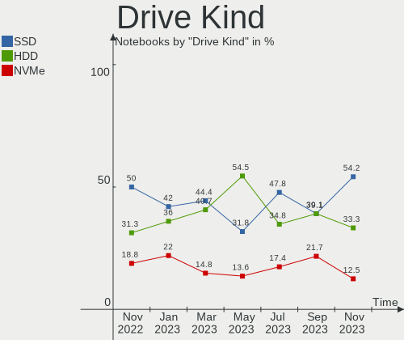
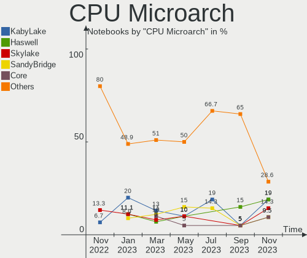

helloSystem Hardware Trends (Notebooks)
---------------------------------------

A project to identify most popular hardware characteristics and track their change
over time based on data collected by helloSystem users at https://BSD-Hardware.info.

Anyone can contribute to this report by the [hw-probe](https://github.com/linuxhw/hw-probe/blob/master/INSTALL.BSD.md) tool:

    hw-probe -all -upload

Full-feature report is available here: https://bsd-hardware.info/?view=trends&formfactor=notebook

Period: Sep, 2021.

Contents
--------

* [ System ](#system)
  - [ OS                       ](#os)
  - [ OS Family                ](#os-family)
  - [ Arch                     ](#arch)
  - [ DE                       ](#de)
  - [ Display Server           ](#display-server)
  - [ Display Manager          ](#display-manager)
  - [ OS Lang                  ](#os-lang)
  - [ Boot Mode                ](#boot-mode)
  - [ Filesystem               ](#filesystem)
  - [ Part. scheme             ](#part-scheme)

* [ Board ](#board)
  - [ Vendor                   ](#vendor)
  - [ Model                    ](#model)
  - [ Model Family             ](#model-family)
  - [ MFG Year                 ](#mfg-year)
  - [ Form Factor              ](#form-factor)
  - [ Coreboot                 ](#coreboot)
  - [ RAM Size                 ](#ram-size)
  - [ RAM Used                 ](#ram-used)
  - [ Total Drives             ](#total-drives)
  - [ Has CD-ROM               ](#has-cd-rom)
  - [ Has Ethernet             ](#has-ethernet)
  - [ Has WiFi                 ](#has-wifi)
  - [ Has Bluetooth            ](#has-bluetooth)

* [ Location ](#location)
  - [ Country                  ](#country)
  - [ City                     ](#city)

* [ Drives ](#drives)
  - [ Drive Vendor             ](#drive-vendor)
  - [ Drive Model              ](#drive-model)
  - [ HDD Vendor               ](#hdd-vendor)
  - [ SSD Vendor               ](#ssd-vendor)
  - [ Drive Kind               ](#drive-kind)
  - [ Drive Connector          ](#drive-connector)
  - [ Drive Size               ](#drive-size)
  - [ Space Total              ](#space-total)
  - [ Space Used               ](#space-used)
  - [ Malfunc. Drives          ](#malfunc-drives)
  - [ Malfunc. Drive Vendor    ](#malfunc-drive-vendor)
  - [ Malfunc. HDD Vendor      ](#malfunc-hdd-vendor)
  - [ Malfunc. Drive Kind      ](#malfunc-drive-kind)
  - [ Failed Drives            ](#failed-drives)
  - [ Failed Drive Vendor      ](#failed-drive-vendor)
  - [ Drive Status             ](#drive-status)

* [ Storage controller ](#storage-controller)
  - [ Storage Vendor           ](#storage-vendor)
  - [ Storage Model            ](#storage-model)
  - [ Storage Kind             ](#storage-kind)

* [ Processor ](#processor)
  - [ CPU Vendor               ](#cpu-vendor)
  - [ CPU Model                ](#cpu-model)
  - [ CPU Model Family         ](#cpu-model-family)
  - [ CPU Cores                ](#cpu-cores)
  - [ CPU Sockets              ](#cpu-sockets)
  - [ CPU Threads              ](#cpu-threads)
  - [ CPU Microarch            ](#cpu-microarch)

* [ Graphics ](#graphics)
  - [ GPU Vendor               ](#gpu-vendor)
  - [ GPU Model                ](#gpu-model)
  - [ GPU Combo                ](#gpu-combo)
  - [ GPU Driver               ](#gpu-driver)
  - [ GPU Memory               ](#gpu-memory)

* [ Monitor ](#monitor)
  - [ Monitor Vendor           ](#monitor-vendor)
  - [ Monitor Model            ](#monitor-model)
  - [ Monitor Resolution       ](#monitor-resolution)
  - [ Monitor Diagonal         ](#monitor-diagonal)
  - [ Monitor Width            ](#monitor-width)
  - [ Aspect Ratio             ](#aspect-ratio)
  - [ Monitor Area             ](#monitor-area)
  - [ Pixel Density            ](#pixel-density)
  - [ Multiple Monitors        ](#multiple-monitors)

* [ Network ](#network)
  - [ Net Controller Vendor    ](#net-controller-vendor)
  - [ Net Controller Model     ](#net-controller-model)
  - [ Wireless Vendor          ](#wireless-vendor)
  - [ Wireless Model           ](#wireless-model)
  - [ Ethernet Vendor          ](#ethernet-vendor)
  - [ Ethernet Model           ](#ethernet-model)
  - [ Net Controller Kind      ](#net-controller-kind)
  - [ Used Controller          ](#used-controller)
  - [ NICs                     ](#nics)
  - [ IPv6                     ](#ipv6)

* [ Bluetooth ](#bluetooth)
  - [ Bluetooth Vendor         ](#bluetooth-vendor)
  - [ Bluetooth Model          ](#bluetooth-model)

* [ Sound ](#sound)
  - [ Sound Vendor             ](#sound-vendor)
  - [ Sound Model              ](#sound-model)

* [ Memory ](#memory)
  - [ Memory Vendor            ](#memory-vendor)
  - [ Memory Model             ](#memory-model)
  - [ Memory Kind              ](#memory-kind)
  - [ Memory Form Factor       ](#memory-form-factor)
  - [ Memory Size              ](#memory-size)
  - [ Memory Speed             ](#memory-speed)

* [ Printers & scanners ](#printers--scanners)
  - [ Printer Vendor           ](#printer-vendor)
  - [ Printer Model            ](#printer-model)
  - [ Scanner Vendor           ](#scanner-vendor)
  - [ Scanner Model            ](#scanner-model)

* [ Camera ](#camera)
  - [ Camera Vendor            ](#camera-vendor)
  - [ Camera Model             ](#camera-model)

* [ Security ](#security)
  - [ Fingerprint Vendor       ](#fingerprint-vendor)
  - [ Fingerprint Model        ](#fingerprint-model)
  - [ Chipcard Vendor          ](#chipcard-vendor)
  - [ Chipcard Model           ](#chipcard-model)

* [ Unsupported ](#unsupported)
  - [ Unsupported Devices      ](#unsupported-devices)
  - [ Unsupported Device Types ](#unsupported-device-types)

System
------

OS
--

Installed operating systems

| Name              | Notebooks | Percent |
|-------------------|-----------|---------|
| helloSystem 0.5.0 | 8         | 72.73%  |
| helloSystem 0.6.0 | 3         | 27.27%  |

OS Family
---------

OS without a version

| Name        | Notebooks | Percent |
|-------------|-----------|---------|
| helloSystem | 11        | 100%    |

Arch
----

OS architecture (x86_64, i586, etc.)

| Name  | Notebooks | Percent |
|-------|-----------|---------|
| amd64 | 11        | 100%    |

DE
--

Desktop Environment

| Name         | Notebooks | Percent |
|--------------|-----------|---------|
| helloDesktop | 11        | 100%    |

Display Server
--------------

X11 or Wayland

| Name | Notebooks | Percent |
|------|-----------|---------|
| X11  | 11        | 100%    |

Display Manager
---------------

SDDM, LightDM, etc.

| Name | Notebooks | Percent |
|------|-----------|---------|
| SLiM | 11        | 100%    |

OS Lang
-------

Language

| Lang  | Notebooks | Percent |
|-------|-----------|---------|
| en_US | 10        | 90.91%  |
| ru_RU | 1         | 9.09%   |

Boot Mode
---------

EFI or BIOS

| Mode | Notebooks | Percent |
|------|-----------|---------|
| EFI  | 9         | 81.82%  |
| BIOS | 2         | 18.18%  |

Filesystem
----------

Type of filesystem

| Type | Notebooks | Percent |
|------|-----------|---------|
| Zfs  | 11        | 100%    |

Part. scheme
------------

Scheme of partitioning

| Type | Notebooks | Percent |
|------|-----------|---------|
| GPT  | 11        | 100%    |

Board
-----

Vendor
------

Motherboard manufacturer

| Name            | Notebooks | Percent |
|-----------------|-----------|---------|
| Lenovo          | 7         | 63.64%  |
| Hewlett-Packard | 2         | 18.18%  |
| Toshiba         | 1         | 9.09%   |
| Kraftway        | 1         | 9.09%   |

Model
-----

Motherboard model

| Name                               | Notebooks | Percent |
|------------------------------------|-----------|---------|
| Toshiba Satellite P300             | 1         | 9.09%   |
| Lenovo Yoga Slim 7 Pro 14ACH5 82MS | 1         | 9.09%   |
| Lenovo ThinkPad X230 2325O76       | 1         | 9.09%   |
| Lenovo ThinkPad T61 64607EU        | 1         | 9.09%   |
| Lenovo ThinkPad T410 2537E82       | 1         | 9.09%   |
| Lenovo ThinkPad L520 78594KM       | 1         | 9.09%   |
| Lenovo IdeaPad 110S-11IBR 80WG     | 1         | 9.09%   |
| Lenovo G500s 20245                 | 1         | 9.09%   |
| Kraftway KW10T                     | 1         | 9.09%   |
| HP Pavilion dm4                    | 1         | 9.09%   |
| HP G42                             | 1         | 9.09%   |

Model Family
------------

Motherboard model prefix

| Name              | Notebooks | Percent |
|-------------------|-----------|---------|
| Lenovo ThinkPad   | 4         | 36.36%  |
| Toshiba Satellite | 1         | 9.09%   |
| Lenovo Yoga       | 1         | 9.09%   |
| Lenovo IdeaPad    | 1         | 9.09%   |
| Lenovo G500s      | 1         | 9.09%   |
| Kraftway KW10T    | 1         | 9.09%   |
| HP Pavilion       | 1         | 9.09%   |
| HP G42            | 1         | 9.09%   |

MFG Year
--------

Motherboard manufacture year

| Year | Notebooks | Percent |
|------|-----------|---------|
| 2013 | 4         | 36.36%  |
| 2011 | 3         | 27.27%  |
| 2021 | 1         | 9.09%   |
| 2019 | 1         | 9.09%   |
| 2018 | 1         | 9.09%   |
| 2009 | 1         | 9.09%   |

Form Factor
-----------

Physical design of the computer

| Name     | Notebooks | Percent |
|----------|-----------|---------|
| Notebook | 11        | 100%    |

Coreboot
--------

Have coreboot on board

| Used | Notebooks | Percent |
|------|-----------|---------|
| No   | 11        | 100%    |

RAM Size
--------

Total RAM memory

| Size in GB | Notebooks | Percent |
|------------|-----------|---------|
| 8.01-16.0  | 6         | 54.55%  |
| 4.01-8.0   | 3         | 27.27%  |
| 2.01-3.0   | 1         | 9.09%   |
| 16.01-24.0 | 1         | 9.09%   |

RAM Used
--------

Used RAM memory

| Used GB  | Notebooks | Percent |
|----------|-----------|---------|
| 0.01-0.5 | 8         | 72.73%  |
| 0.51-1.0 | 2         | 18.18%  |
| 2.01-3.0 | 1         | 9.09%   |

Total Drives
------------

Number of drives on board

| Drives | Notebooks | Percent |
|--------|-----------|---------|
| 1      | 8         | 72.73%  |
| 0      | 2         | 18.18%  |
| 3      | 1         | 9.09%   |

Has CD-ROM
----------

Has CD-ROM on board

| Presented | Notebooks | Percent |
|-----------|-----------|---------|
| Yes       | 6         | 54.55%  |
| No        | 5         | 45.45%  |

Has Ethernet
------------

Has Ethernet on board

| Presented | Notebooks | Percent |
|-----------|-----------|---------|
| Yes       | 8         | 72.73%  |
| No        | 3         | 27.27%  |

Has WiFi
--------

Has WiFi module

| Presented | Notebooks | Percent |
|-----------|-----------|---------|
| Yes       | 11        | 100%    |

Has Bluetooth
-------------

Has Bluetooth module

| Presented | Notebooks | Percent |
|-----------|-----------|---------|
| Yes       | 6         | 54.55%  |
| No        | 5         | 45.45%  |

Location
--------

Country
-------

Geographic location (country)

| Country     | Notebooks | Percent |
|-------------|-----------|---------|
| USA         | 3         | 27.27%  |
| Switzerland | 1         | 9.09%   |
| Russia      | 1         | 9.09%   |
| Portugal    | 1         | 9.09%   |
| New Zealand | 1         | 9.09%   |
| Montenegro  | 1         | 9.09%   |
| Lithuania   | 1         | 9.09%   |
| Germany     | 1         | 9.09%   |
| Austria     | 1         | 9.09%   |

City
----

Geographic location (city)

| City          | Notebooks | Percent |
|---------------|-----------|---------|
| Zurich        | 1         | 9.09%   |
| Vienna        | 1         | 9.09%   |
| Traverse City | 1         | 9.09%   |
| Redmond       | 1         | 9.09%   |
| Plav          | 1         | 9.09%   |
| Obninsk       | 1         | 9.09%   |
| Lisbon        | 1         | 9.09%   |
| Kaunas        | 1         | 9.09%   |
| Chemnitz      | 1         | 9.09%   |
| Cambridge     | 1         | 9.09%   |
| Auburn        | 1         | 9.09%   |

Drives
------

Drive Vendor
------------

Hard drive vendors

| Vendor              | Notebooks | Drives | Percent |
|---------------------|-----------|--------|---------|
| WDC                 | 2         | 2      | 20%     |
| Toshiba             | 2         | 2      | 20%     |
| Seagate             | 2         | 2      | 20%     |
| Samsung Electronics | 1         | 1      | 10%     |
| Kingston            | 1         | 2      | 10%     |
| FORESEE             | 1         | 1      | 10%     |
| Crucial             | 1         | 1      | 10%     |

Drive Model
-----------

Hard drive models

| Model                              | Notebooks | Percent |
|------------------------------------|-----------|---------|
| WDC WD1600BEVT-75ZCT2 160GB        | 1         | 10%     |
| WDC PC SN730 SDBPNTY-1T00-1101 1TB | 1         | 10%     |
| Toshiba MK5061GSYN 500GB           | 1         | 10%     |
| Toshiba MK3261GSY 320GB            | 1         | 10%     |
| Seagate ST9500325AS 500GB          | 1         | 10%     |
| Seagate ST1000LM024 HN-M101MBB 1TB | 1         | 10%     |
| Samsung HM160HI 160GB              | 1         | 10%     |
| Kingston SA400S37240G 240GB        | 1         | 10%     |
| FORESEE 128GB SSD                  | 1         | 10%     |
| Crucial CT275MX300SSD4 275GB       | 1         | 10%     |

HDD Vendor
----------

Hard disk drive vendors

| Vendor              | Notebooks | Drives | Percent |
|---------------------|-----------|--------|---------|
| Toshiba             | 2         | 2      | 33.33%  |
| Seagate             | 2         | 2      | 33.33%  |
| WDC                 | 1         | 1      | 16.67%  |
| Samsung Electronics | 1         | 1      | 16.67%  |

SSD Vendor
----------

Solid state drive vendors

| Vendor   | Notebooks | Drives | Percent |
|----------|-----------|--------|---------|
| Kingston | 1         | 2      | 33.33%  |
| FORESEE  | 1         | 1      | 33.33%  |
| Crucial  | 1         | 1      | 33.33%  |

Drive Kind
----------

HDD or SSD

| Kind | Notebooks | Drives | Percent |
|------|-----------|--------|---------|
| HDD  | 6         | 6      | 60%     |
| SSD  | 3         | 4      | 30%     |
| NVMe | 1         | 1      | 10%     |

Drive Connector
---------------

SATA, SAS, NVMe, etc.

| Type | Notebooks | Drives | Percent |
|------|-----------|--------|---------|
| SATA | 8         | 10     | 88.89%  |
| NVMe | 1         | 1      | 11.11%  |

Drive Size
----------

Size of hard drive

| Size in TB | Notebooks | Drives | Percent |
|------------|-----------|--------|---------|
| 0.01-0.5   | 7         | 9      | 87.5%   |
| 0.51-1.0   | 1         | 1      | 12.5%   |

Space Total
-----------

Amount of disk space available on the file system

| Size in GB | Notebooks | Percent |
|------------|-----------|---------|
| 1-20       | 6         | 54.55%  |
| 101-250    | 3         | 27.27%  |
| 501-1000   | 1         | 9.09%   |
| 51-100     | 1         | 9.09%   |

Space Used
----------

Amount of used disk space

| Used GB | Notebooks | Percent |
|---------|-----------|---------|
| 1-20    | 11        | 100%    |

Malfunc. Drives
---------------

Drive models with a malfunction

| Model                              | Notebooks | Drives | Percent |
|------------------------------------|-----------|--------|---------|
| Toshiba MK5061GSYN 500GB           | 1         | 1      | 33.33%  |
| Seagate ST9500325AS 500GB          | 1         | 1      | 33.33%  |
| Seagate ST1000LM024 HN-M101MBB 1TB | 1         | 1      | 33.33%  |

Malfunc. Drive Vendor
---------------------

Vendors of faulty drives

| Vendor  | Notebooks | Drives | Percent |
|---------|-----------|--------|---------|
| Seagate | 2         | 2      | 66.67%  |
| Toshiba | 1         | 1      | 33.33%  |

Malfunc. HDD Vendor
-------------------

Vendors of faulty HDD drives

| Vendor  | Notebooks | Drives | Percent |
|---------|-----------|--------|---------|
| Seagate | 2         | 2      | 66.67%  |
| Toshiba | 1         | 1      | 33.33%  |

Malfunc. Drive Kind
-------------------

Kinds of faulty drives

| Kind | Notebooks | Drives | Percent |
|------|-----------|--------|---------|
| HDD  | 3         | 3      | 100%    |

Failed Drives
-------------

Failed drive models

Zero info for selected period =(

Failed Drive Vendor
-------------------

Failed drive vendors

Zero info for selected period =(

Drive Status
------------

Number of failed and malfunc. drives

| Status  | Notebooks | Drives | Percent |
|---------|-----------|--------|---------|
| Works   | 6         | 8      | 66.67%  |
| Malfunc | 3         | 3      | 33.33%  |

Storage controller
------------------

Storage Vendor
--------------

Storage controller vendors

| Vendor  | Notebooks | Percent |
|---------|-----------|---------|
| Intel   | 9         | 81.82%  |
| Sandisk | 1         | 9.09%   |
| AMD     | 1         | 9.09%   |

Storage Model
-------------

Storage controller models

| Model                                                                            | Notebooks | Percent |
|----------------------------------------------------------------------------------|-----------|---------|
| Intel 7 Series Chipset Family 6-port SATA Controller [AHCI mode]                 | 2         | 16.67%  |
| Sandisk WD Black SN750 / PC SN730 NVMe SSD                                       | 1         | 8.33%   |
| Intel Atom/Celeron/Pentium Processor x5-E8000/J3xxx/N3xxx Series SATA Controller | 1         | 8.33%   |
| Intel Atom Processor E3800 Series SATA AHCI Controller                           | 1         | 8.33%   |
| Intel 82801IBM/IEM (ICH9M/ICH9M-E) 4 port SATA Controller [AHCI mode]            | 1         | 8.33%   |
| Intel 82801HM/HEM (ICH8M/ICH8M-E) SATA Controller [AHCI mode]                    | 1         | 8.33%   |
| Intel 82801HM/HEM (ICH8M/ICH8M-E) IDE Controller                                 | 1         | 8.33%   |
| Intel 6 Series/C200 Series Chipset Family 6 port Mobile SATA AHCI Controller     | 1         | 8.33%   |
| Intel 5 Series/3400 Series Chipset 6 port SATA AHCI Controller                   | 1         | 8.33%   |
| Intel 5 Series/3400 Series Chipset 4 port SATA AHCI Controller                   | 1         | 8.33%   |
| AMD SB7x0/SB8x0/SB9x0 SATA Controller [AHCI mode]                                | 1         | 8.33%   |

Storage Kind
------------

Kind of storage controller (IDE, SATA, NVMe, SAS, ...)

| Kind | Notebooks | Percent |
|------|-----------|---------|
| SATA | 10        | 83.33%  |
| NVMe | 1         | 8.33%   |
| IDE  | 1         | 8.33%   |

Processor
---------

CPU Vendor
----------

Processor vendors

| Vendor | Notebooks | Percent |
|--------|-----------|---------|
| Intel  | 9         | 81.82%  |
| AMD    | 2         | 18.18%  |

CPU Model
---------

Processor models

| Model                                  | Notebooks | Percent |
|----------------------------------------|-----------|---------|
| Intel CPU Version                      | 1         | 9.09%   |
| Intel Core i5-3320M CPU @ 2.60GHz      | 1         | 9.09%   |
| Intel Core i5-2520M CPU @ 2.50GHz      | 1         | 9.09%   |
| Intel Core i5 CPU M 540 @ 2.53GHz      | 1         | 9.09%   |
| Intel Core i5 CPU M 450 @ 2.40GHz      | 1         | 9.09%   |
| Intel Core i3-3110M CPU @ 2.40GHz      | 1         | 9.09%   |
| Intel Core 2 Duo CPU T7300 @ 2.00GHz   | 1         | 9.09%   |
| Intel Celeron CPU N3060 @ 1.60GHz      | 1         | 9.09%   |
| Intel Atom CPU E3825 @ 1.33GHz         | 1         | 9.09%   |
| AMD Ryzen 7 5800H with Radeon Graphics | 1         | 9.09%   |
| AMD Phenom II N640 Dual-Core Processor | 1         | 9.09%   |

CPU Model Family
----------------

Processor model prefix

| Model            | Notebooks | Percent |
|------------------|-----------|---------|
| Intel Core i5    | 4         | 36.36%  |
| Other            | 1         | 9.09%   |
| Intel Core i3    | 1         | 9.09%   |
| Intel Core 2 Duo | 1         | 9.09%   |
| Intel Celeron    | 1         | 9.09%   |
| Intel Atom       | 1         | 9.09%   |
| AMD Ryzen 7      | 1         | 9.09%   |
| AMD Phenom II    | 1         | 9.09%   |

CPU Cores
---------

Number of processor cores

| Number  | Notebooks | Percent |
|---------|-----------|---------|
| 2       | 9         | 81.82%  |
| 16      | 1         | 9.09%   |
| Unknown | 1         | 9.09%   |

CPU Sockets
-----------

Number of sockets

| Number | Notebooks | Percent |
|--------|-----------|---------|
| 1      | 11        | 100%    |

CPU Threads
-----------

Threads per core (Hyper-Threading)

| Number  | Notebooks | Percent |
|---------|-----------|---------|
| 2       | 5         | 45.45%  |
| 1       | 5         | 45.45%  |
| Unknown | 1         | 9.09%   |

CPU Microarch
-------------

Microarchitecture

| Name        | Notebooks | Percent |
|-------------|-----------|---------|
| Westmere    | 2         | 18.18%  |
| Silvermont  | 2         | 18.18%  |
| IvyBridge   | 2         | 18.18%  |
| Zen 3       | 1         | 9.09%   |
| SandyBridge | 1         | 9.09%   |
| Penryn      | 1         | 9.09%   |
| K10         | 1         | 9.09%   |
| Core        | 1         | 9.09%   |

Graphics
--------

GPU Vendor
----------

Vendors of graphics cards

| Vendor | Notebooks | Percent |
|--------|-----------|---------|
| Intel  | 7         | 58.33%  |
| AMD    | 3         | 25%     |
| Nvidia | 2         | 16.67%  |

GPU Model
---------

Graphics card models

| Model                                                                                    | Notebooks | Percent |
|------------------------------------------------------------------------------------------|-----------|---------|
| Intel Core Processor Integrated Graphics Controller                                      | 2         | 16.67%  |
| Intel 3rd Gen Core processor Graphics Controller                                         | 2         | 16.67%  |
| Nvidia GF117M [GeForce 610M/710M/810M/820M / GT 620M/625M/630M/720M]                     | 1         | 8.33%   |
| Nvidia G86M [Quadro NVS 140M]                                                            | 1         | 8.33%   |
| Intel Atom/Celeron/Pentium Processor x5-E8000/J3xxx/N3xxx Integrated Graphics Controller | 1         | 8.33%   |
| Intel Atom Processor Z36xxx/Z37xxx Series Graphics & Display                             | 1         | 8.33%   |
| Intel 2nd Generation Core Processor Family Integrated Graphics Controller                | 1         | 8.33%   |
| AMD RV710/M92 [Mobility Radeon HD 4530/4570/545v]                                        | 1         | 8.33%   |
| AMD RS880M [Mobility Radeon HD 4225/4250]                                                | 1         | 8.33%   |
| AMD Cezanne                                                                              | 1         | 8.33%   |

GPU Combo
---------

Combinations of graphics cards

| Name           | Notebooks | Percent |
|----------------|-----------|---------|
| 1 x Intel      | 6         | 54.55%  |
| 1 x AMD        | 3         | 27.27%  |
| 1 x Nvidia     | 1         | 9.09%   |
| Intel + Nvidia | 1         | 9.09%   |

GPU Driver
----------

Free vs proprietary

| Driver  | Notebooks | Percent |
|---------|-----------|---------|
| Free    | 9         | 81.82%  |
| Unknown | 2         | 18.18%  |

GPU Memory
----------

Total video memory

| Size in GB | Notebooks | Percent |
|------------|-----------|---------|
| Unknown    | 9         | 81.82%  |
| 0.01-0.5   | 2         | 18.18%  |

Monitor
-------

Monitor Vendor
--------------

Monitor vendors

| Vendor              | Notebooks | Percent |
|---------------------|-----------|---------|
| AU Optronics        | 4         | 44.44%  |
| Samsung Electronics | 3         | 33.33%  |
| Lenovo              | 1         | 11.11%  |
| Chimei Innolux      | 1         | 11.11%  |

Monitor Model
-------------

Monitor models

| Model                                                                | Notebooks | Percent |
|----------------------------------------------------------------------|-----------|---------|
| Samsung Electronics LCD Monitor SEC3942 1366x768 310x170mm 13.9-inch | 1         | 11.11%  |
| Samsung Electronics LCD Monitor SEC3847 1440x900 370x230mm 17.2-inch | 1         | 11.11%  |
| Samsung Electronics LCD Monitor SEC3047 1366x768 280x160mm 12.7-inch | 1         | 11.11%  |
| Lenovo LCD Monitor LEN4035 1280x800 300x190mm 14.0-inch              | 1         | 11.11%  |
| Chimei Innolux LCD Monitor CMN1132 1366x768 260x140mm 11.6-inch      | 1         | 11.11%  |
| AU Optronics LCD Monitor AUO45EC 1366x768 340x190mm 15.3-inch        | 1         | 11.11%  |
| AU Optronics LCD Monitor AUO4100 1920x1200 220x140mm 10.3-inch       | 1         | 11.11%  |
| AU Optronics LCD Monitor AUO23EC 1366x768 340x190mm 15.3-inch        | 1         | 11.11%  |
| AU Optronics LCD Monitor AUO183C 1366x768 310x170mm 13.9-inch        | 1         | 11.11%  |

Monitor Resolution
------------------

Monitor screen resolution

| Resolution        | Notebooks | Percent |
|-------------------|-----------|---------|
| 1366x768 (WXGA)   | 6         | 66.67%  |
| 1920x1200 (WUXGA) | 1         | 11.11%  |
| 1440x900 (WXGA+)  | 1         | 11.11%  |
| 1280x800 (WXGA)   | 1         | 11.11%  |

Monitor Diagonal
----------------

Diagonal size in inches

| Inches | Notebooks | Percent |
|--------|-----------|---------|
| 15     | 2         | 22.22%  |
| 13     | 2         | 22.22%  |
| 17     | 1         | 11.11%  |
| 14     | 1         | 11.11%  |
| 12     | 1         | 11.11%  |
| 11     | 1         | 11.11%  |
| 10     | 1         | 11.11%  |

Monitor Width
-------------

Physical width

| Width in mm | Notebooks | Percent |
|-------------|-----------|---------|
| 301-350     | 4         | 44.44%  |
| 201-300     | 4         | 44.44%  |
| 351-400     | 1         | 11.11%  |

Aspect Ratio
------------

Proportional relationship between the width and the height

| Ratio | Notebooks | Percent |
|-------|-----------|---------|
| 16/9  | 6         | 66.67%  |
| 16/10 | 3         | 33.33%  |

Monitor Area
------------

Area in inch²

| Area in inch² | Notebooks | Percent |
|----------------|-----------|---------|
| 81-90          | 3         | 33.33%  |
| 91-100         | 2         | 22.22%  |
| 61-70          | 1         | 11.11%  |
| 51-60          | 1         | 11.11%  |
| 41-50          | 1         | 11.11%  |
| 131-140        | 1         | 11.11%  |

Pixel Density
-------------

Pixels per inch

| Density | Notebooks | Percent |
|---------|-----------|---------|
| 101-120 | 5         | 55.56%  |
| 121-160 | 2         | 22.22%  |
| 161-240 | 1         | 11.11%  |
| 51-100  | 1         | 11.11%  |

Multiple Monitors
-----------------

Total monitors connected

| Total | Notebooks | Percent |
|-------|-----------|---------|
| 1     | 9         | 81.82%  |
| 0     | 2         | 18.18%  |

Network
-------

Net Controller Vendor
---------------------

Controller vendors

| Vendor                   | Notebooks | Percent |
|--------------------------|-----------|---------|
| Intel                    | 9         | 50%     |
| Realtek Semiconductor    | 4         | 22.22%  |
| Ralink Technology        | 1         | 5.56%   |
| Qualcomm Atheros         | 1         | 5.56%   |
| Marvell Technology Group | 1         | 5.56%   |
| Huawei Technologies      | 1         | 5.56%   |
| Broadcom                 | 1         | 5.56%   |

Net Controller Model
--------------------

Controller models

| Model                                                             | Notebooks | Percent |
|-------------------------------------------------------------------|-----------|---------|
| Realtek RTL8111/8168/8411 PCI Express Gigabit Ethernet Controller | 2         | 9.52%   |
| Intel Centrino Advanced-N 6205 [Taylor Peak]                      | 2         | 9.52%   |
| Realtek RTL8852AE 802.11ax PCIe Wireless Network Adapter          | 1         | 4.76%   |
| Realtek RTL810xE PCI Express Fast Ethernet controller             | 1         | 4.76%   |
| Ralink RT2501/RT2573 Wireless Adapter                             | 1         | 4.76%   |
| Qualcomm Atheros QCA8172 Fast Ethernet                            | 1         | 4.76%   |
| Marvell Group 88E8040T PCI-E Fast Ethernet Controller             | 1         | 4.76%   |
| Intel Wireless 8265 / 8275                                        | 1         | 4.76%   |
| Intel Wireless 7265                                               | 1         | 4.76%   |
| Intel WiFi Link 5100                                              | 1         | 4.76%   |
| Intel PRO/Wireless 4965 AG or AGN [Kedron] Network Connection     | 1         | 4.76%   |
| Intel Centrino Wireless-N 135                                     | 1         | 4.76%   |
| Intel Centrino Wireless-N 1000 [Condor Peak]                      | 1         | 4.76%   |
| Intel Centrino Advanced-N 6200                                    | 1         | 4.76%   |
| Intel 82579LM Gigabit Network Connection (Lewisville)             | 1         | 4.76%   |
| Intel 82577LM Gigabit Network Connection                          | 1         | 4.76%   |
| Intel 82566MM Gigabit Network Connection                          | 1         | 4.76%   |
| Huawei ME936 LTE/HSDPA+ 4G modem                                  | 1         | 4.76%   |
| Broadcom BCM4313 802.11bgn Wireless Network Adapter               | 1         | 4.76%   |

Wireless Vendor
---------------

Wireless vendors

| Vendor                | Notebooks | Percent |
|-----------------------|-----------|---------|
| Intel                 | 9         | 75%     |
| Realtek Semiconductor | 1         | 8.33%   |
| Ralink Technology     | 1         | 8.33%   |
| Broadcom              | 1         | 8.33%   |

Wireless Model
--------------

Wireless models

| Model                                                         | Notebooks | Percent |
|---------------------------------------------------------------|-----------|---------|
| Intel Centrino Advanced-N 6205 [Taylor Peak]                  | 2         | 16.67%  |
| Realtek RTL8852AE 802.11ax PCIe Wireless Network Adapter      | 1         | 8.33%   |
| Ralink RT2501/RT2573 Wireless Adapter                         | 1         | 8.33%   |
| Intel Wireless 8265 / 8275                                    | 1         | 8.33%   |
| Intel Wireless 7265                                           | 1         | 8.33%   |
| Intel WiFi Link 5100                                          | 1         | 8.33%   |
| Intel PRO/Wireless 4965 AG or AGN [Kedron] Network Connection | 1         | 8.33%   |
| Intel Centrino Wireless-N 135                                 | 1         | 8.33%   |
| Intel Centrino Wireless-N 1000 [Condor Peak]                  | 1         | 8.33%   |
| Intel Centrino Advanced-N 6200                                | 1         | 8.33%   |
| Broadcom BCM4313 802.11bgn Wireless Network Adapter           | 1         | 8.33%   |

Ethernet Vendor
---------------

Ethernet vendors

| Vendor                   | Notebooks | Percent |
|--------------------------|-----------|---------|
| Realtek Semiconductor    | 3         | 37.5%   |
| Intel                    | 3         | 37.5%   |
| Qualcomm Atheros         | 1         | 12.5%   |
| Marvell Technology Group | 1         | 12.5%   |

Ethernet Model
--------------

Ethernet models

| Model                                                             | Notebooks | Percent |
|-------------------------------------------------------------------|-----------|---------|
| Realtek RTL8111/8168/8411 PCI Express Gigabit Ethernet Controller | 2         | 25%     |
| Realtek RTL810xE PCI Express Fast Ethernet controller             | 1         | 12.5%   |
| Qualcomm Atheros QCA8172 Fast Ethernet                            | 1         | 12.5%   |
| Marvell Group 88E8040T PCI-E Fast Ethernet Controller             | 1         | 12.5%   |
| Intel 82579LM Gigabit Network Connection (Lewisville)             | 1         | 12.5%   |
| Intel 82577LM Gigabit Network Connection                          | 1         | 12.5%   |
| Intel 82566MM Gigabit Network Connection                          | 1         | 12.5%   |

Net Controller Kind
-------------------

Ethernet, WiFi or modem

| Kind     | Notebooks | Percent |
|----------|-----------|---------|
| WiFi     | 11        | 55%     |
| Ethernet | 8         | 40%     |
| Modem    | 1         | 5%      |

Used Controller
---------------

Currently used network controller

| Kind     | Notebooks | Percent |
|----------|-----------|---------|
| WiFi     | 10        | 55.56%  |
| Ethernet | 8         | 44.44%  |

NICs
----

Total network controllers on board

| Total | Notebooks | Percent |
|-------|-----------|---------|
| 2     | 8         | 72.73%  |
| 1     | 3         | 27.27%  |

IPv6
----

IPv6 vs IPv4

| Used | Notebooks | Percent |
|------|-----------|---------|
| No   | 11        | 100%    |

Bluetooth
---------

Bluetooth Vendor
----------------

Controller vendors

| Vendor                  | Notebooks | Percent |
|-------------------------|-----------|---------|
| Broadcom                | 3         | 50%     |
| Realtek Semiconductor   | 1         | 16.67%  |
| Intel                   | 1         | 16.67%  |
| Cambridge Silicon Radio | 1         | 16.67%  |

Bluetooth Model
---------------

Controller models

| Model                                               | Notebooks | Percent |
|-----------------------------------------------------|-----------|---------|
| Realtek Bluetooth Radio                             | 1         | 16.67%  |
| Intel Bluetooth wireless interface                  | 1         | 16.67%  |
| Cambridge Silicon Radio Bluetooth Dongle (HCI mode) | 1         | 16.67%  |
| Broadcom BCM20702 Bluetooth 4.0 [ThinkPad]          | 1         | 16.67%  |
| Broadcom BCM2045B (BDC-2.1)                         | 1         | 16.67%  |
| Broadcom BCM2045B (BDC-2) [Bluetooth Controller]    | 1         | 16.67%  |

Sound
-----

Sound Vendor
------------

Sound card vendors

| Vendor | Notebooks | Percent |
|--------|-----------|---------|
| Intel  | 9         | 75%     |
| AMD    | 3         | 25%     |

Sound Model
-----------

Sound card models

| Model                                                                                             | Notebooks | Percent |
|---------------------------------------------------------------------------------------------------|-----------|---------|
| Intel 7 Series/C216 Chipset Family High Definition Audio Controller                               | 2         | 14.29%  |
| Intel 5 Series/3400 Series Chipset High Definition Audio                                          | 2         | 14.29%  |
| Intel Atom/Celeron/Pentium Processor x5-E8000/J3xxx/N3xxx Series High Definition Audio Controller | 1         | 7.14%   |
| Intel Atom Processor Z36xxx/Z37xxx Series High Definition Audio Controller                        | 1         | 7.14%   |
| Intel 82801I (ICH9 Family) HD Audio Controller                                                    | 1         | 7.14%   |
| Intel 82801H (ICH8 Family) HD Audio Controller                                                    | 1         | 7.14%   |
| Intel 6 Series/C200 Series Chipset Family High Definition Audio Controller                        | 1         | 7.14%   |
| AMD SBx00 Azalia (Intel HDA)                                                                      | 1         | 7.14%   |
| AMD RV710/730 HDMI Audio [Radeon HD 4000 series]                                                  | 1         | 7.14%   |
| AMD RS880 HDMI Audio [Radeon HD 4200 Series]                                                      | 1         | 7.14%   |
| AMD Renoir Radeon High Definition Audio Controller                                                | 1         | 7.14%   |
| AMD Family 17h (Models 10h-1fh) HD Audio Controller                                               | 1         | 7.14%   |

Memory
------

Memory Vendor
-------------

Memory module vendors

| Vendor              | Notebooks | Percent |
|---------------------|-----------|---------|
| Unknown             | 3         | 21.43%  |
| SK Hynix            | 3         | 21.43%  |
| Samsung Electronics | 3         | 21.43%  |
| PKI/Kingston        | 1         | 7.14%   |
| Kingston            | 1         | 7.14%   |
| G.Skill             | 1         | 7.14%   |
| Axiom               | 1         | 7.14%   |
| Unknown             | 1         | 7.14%   |

Memory Model
------------

Memory module models

| Model                                                       | Notebooks | Percent |
|-------------------------------------------------------------|-----------|---------|
| Unknown RAM Module 4GB SODIMM DDR3 1600MT/s                 | 1         | 6.67%   |
| Unknown RAM Module 4GB SODIMM DDR2 667MT/s                  | 1         | 6.67%   |
| Unknown RAM Module 4GB DIMM DDR3 1067MT/s                   | 1         | 6.67%   |
| Unknown RAM Module 2GB SODIMM DDR2 667MT/s                  | 1         | 6.67%   |
| SK Hynix RAM HMT351S6EFR8C-PB 4GB SODIMM DDR3 1600MT/s      | 1         | 6.67%   |
| SK Hynix RAM HMT351S6EFR8A-PB 4GB SODIMM DDR3 1600MT/s      | 1         | 6.67%   |
| SK Hynix RAM HMT351S6BFR8C-H9 4GB SODIMM DDR3 1334MT/s      | 1         | 6.67%   |
| Samsung RAM Module 2GB SODIMM DDR3 1600MT/s                 | 1         | 6.67%   |
| Samsung RAM M471B5273DH0-CH9 4GB SODIMM DDR3 1334MT/s       | 1         | 6.67%   |
| Samsung RAM M471A1G44AB0-CWE 8GB Row Of Chips DDR4 3200MT/s | 1         | 6.67%   |
| PKI/Kingston RAM 9905428-043.A00LF 4GB SODIMM DDR3 1067MT/s | 1         | 6.67%   |
| Kingston RAM SNY1333D3S9ELC/4G 4GB SODIMM DDR3 1333MT/s     | 1         | 6.67%   |
| G.Skill RAM F3-10666CL9-4GBSQ 4GB SODIMM DDR3 1334MT/s      | 1         | 6.67%   |
| Axiom RAM 51264Y133I 4GB SODIMM DDR3 1334MT/s               | 1         | 6.67%   |
| Unknown                                                     | 1         | 6.67%   |

Memory Kind
-----------

Memory module kinds

| Kind    | Notebooks | Percent |
|---------|-----------|---------|
| DDR3    | 8         | 72.73%  |
| DDR4    | 1         | 9.09%   |
| DDR2    | 1         | 9.09%   |
| Unknown | 1         | 9.09%   |

Memory Form Factor
------------------

Physical design of the memory module

| Name         | Notebooks | Percent |
|--------------|-----------|---------|
| SODIMM       | 9         | 81.82%  |
| Row Of Chips | 1         | 9.09%   |
| DIMM         | 1         | 9.09%   |

Memory Size
-----------

Memory module size

| Size | Notebooks | Percent |
|------|-----------|---------|
| 4096 | 8         | 66.67%  |
| 2048 | 3         | 25%     |
| 8192 | 1         | 8.33%   |

Memory Speed
------------

Memory module speed

| Speed | Notebooks | Percent |
|-------|-----------|---------|
| 1600  | 3         | 25%     |
| 1334  | 3         | 25%     |
| 1067  | 2         | 16.67%  |
| 3200  | 1         | 8.33%   |
| 1333  | 1         | 8.33%   |
| 800   | 1         | 8.33%   |
| 667   | 1         | 8.33%   |

Printers & scanners
-------------------

Printer Vendor
--------------

Printer device vendors

Zero info for selected period =(

Printer Model
-------------

Printer device models

Zero info for selected period =(

Scanner Vendor
--------------

Scanner device vendors

Zero info for selected period =(

Scanner Model
-------------

Scanner device models

Zero info for selected period =(

Camera
------

Camera Vendor
-------------

Camera device vendors

| Vendor                | Notebooks | Percent |
|-----------------------|-----------|---------|
| Realtek Semiconductor | 2         | 22.22%  |
| Chicony Electronics   | 2         | 22.22%  |
| Suyin                 | 1         | 11.11%  |
| Lenovo                | 1         | 11.11%  |
| Importek              | 1         | 11.11%  |
| IMC Networks          | 1         | 11.11%  |
| Acer                  | 1         | 11.11%  |

Camera Model
------------

Camera device models

| Model                             | Notebooks | Percent |
|-----------------------------------|-----------|---------|
| Realtek Realtek USB2.0 PC Camera  | 2         | 22.22%  |
| Suyin HP Webcam-101               | 1         | 11.11%  |
| Lenovo Integrated Webcam [R5U877] | 1         | 11.11%  |
| Importek HP Webcam                | 1         | 11.11%  |
| IMC Networks Integrated Camera    | 1         | 11.11%  |
| Chicony USB 2.0 Camera            | 1         | 11.11%  |
| Chicony Integrated Camera         | 1         | 11.11%  |
| Acer Integrated Camera            | 1         | 11.11%  |

Security
--------

Fingerprint Vendor
------------------

Fingerprint sensor vendors

| Vendor             | Notebooks | Percent |
|--------------------|-----------|---------|
| Validity Sensors   | 1         | 50%     |
| STMicroelectronics | 1         | 50%     |

Fingerprint Model
-----------------

Fingerprint sensor models

| Model                                      | Notebooks | Percent |
|--------------------------------------------|-----------|---------|
| Validity Sensors VFS301 Fingerprint Reader | 1         | 50%     |
| STMicroelectronics Fingerprint Reader      | 1         | 50%     |

Chipcard Vendor
---------------

Chipcard module vendors

Zero info for selected period =(

Chipcard Model
--------------

Chipcard module models

Zero info for selected period =(

Unsupported
-----------

Unsupported Devices
-------------------

Total unsupported devices on board

| Total | Notebooks | Percent |
|-------|-----------|---------|
| 1     | 6         | 54.55%  |
| 2     | 5         | 45.45%  |

Unsupported Device Types
------------------------

Types of unsupported devices

| Type                     | Notebooks | Percent |
|--------------------------|-----------|---------|
| Communication controller | 5         | 31.25%  |
| Card reader              | 3         | 18.75%  |
| Net/wireless             | 2         | 12.5%   |
| Fingerprint reader       | 2         | 12.5%   |
| Storage                  | 1         | 6.25%   |
| Network                  | 1         | 6.25%   |
| Firewire controller      | 1         | 6.25%   |
| Bluetooth                | 1         | 6.25%   |

