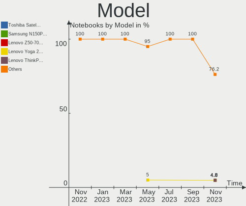
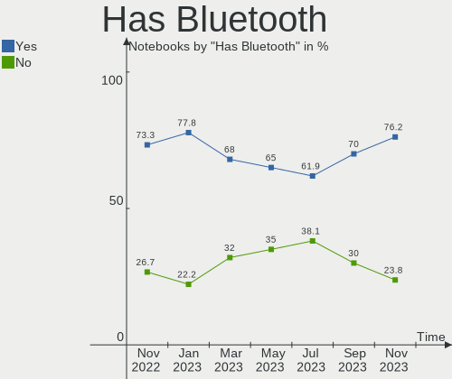
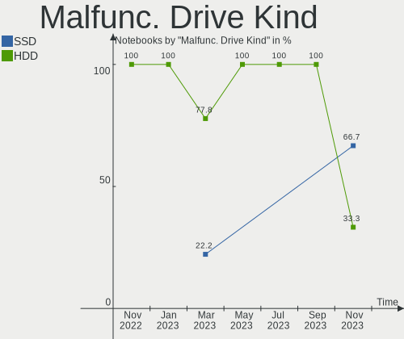
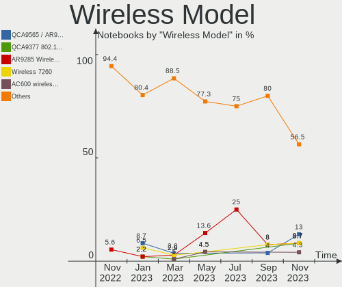
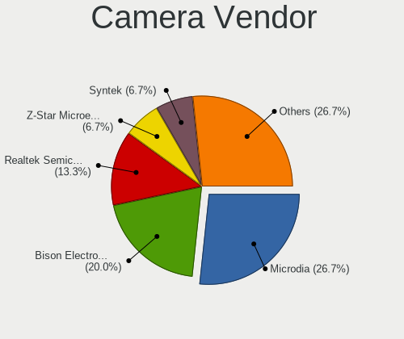

helloSystem Hardware Trends (Notebooks)
---------------------------------------

A project to identify most popular hardware characteristics and track their change
over time based on data collected by helloSystem users at https://BSD-Hardware.info.

Anyone can contribute to this report by the [hw-probe](https://github.com/linuxhw/hw-probe/blob/master/INSTALL.BSD.md) tool:

    hw-probe -all -upload

Full-feature report is available here: https://bsd-hardware.info/?view=trends

Period: Jan, 2022.

Contents
--------

* [ System ](#system)
  - [ OS                       ](#os)
  - [ OS Family                ](#os-family)
  - [ Arch                     ](#arch)
  - [ DE                       ](#de)
  - [ Display Server           ](#display-server)
  - [ Display Manager          ](#display-manager)
  - [ OS Lang                  ](#os-lang)
  - [ Boot Mode                ](#boot-mode)
  - [ Filesystem               ](#filesystem)
  - [ Part. scheme             ](#part-scheme)

* [ Board ](#board)
  - [ Vendor                   ](#vendor)
  - [ Model                    ](#model)
  - [ Model Family             ](#model-family)
  - [ MFG Year                 ](#mfg-year)
  - [ Form Factor              ](#form-factor)
  - [ Coreboot                 ](#coreboot)
  - [ RAM Size                 ](#ram-size)
  - [ RAM Used                 ](#ram-used)
  - [ Total Drives             ](#total-drives)
  - [ Has CD-ROM               ](#has-cd-rom)
  - [ Has Ethernet             ](#has-ethernet)
  - [ Has WiFi                 ](#has-wifi)
  - [ Has Bluetooth            ](#has-bluetooth)

* [ Location ](#location)
  - [ Country                  ](#country)
  - [ City                     ](#city)

* [ Drives ](#drives)
  - [ Drive Vendor             ](#drive-vendor)
  - [ Drive Model              ](#drive-model)
  - [ HDD Vendor               ](#hdd-vendor)
  - [ SSD Vendor               ](#ssd-vendor)
  - [ Drive Kind               ](#drive-kind)
  - [ Drive Connector          ](#drive-connector)
  - [ Drive Size               ](#drive-size)
  - [ Space Total              ](#space-total)
  - [ Space Used               ](#space-used)
  - [ Malfunc. Drives          ](#malfunc-drives)
  - [ Malfunc. Drive Vendor    ](#malfunc-drive-vendor)
  - [ Malfunc. HDD Vendor      ](#malfunc-hdd-vendor)
  - [ Malfunc. Drive Kind      ](#malfunc-drive-kind)
  - [ Failed Drives            ](#failed-drives)
  - [ Failed Drive Vendor      ](#failed-drive-vendor)
  - [ Drive Status             ](#drive-status)

* [ Storage controller ](#storage-controller)
  - [ Storage Vendor           ](#storage-vendor)
  - [ Storage Model            ](#storage-model)
  - [ Storage Kind             ](#storage-kind)

* [ Processor ](#processor)
  - [ CPU Vendor               ](#cpu-vendor)
  - [ CPU Model                ](#cpu-model)
  - [ CPU Model Family         ](#cpu-model-family)
  - [ CPU Cores                ](#cpu-cores)
  - [ CPU Sockets              ](#cpu-sockets)
  - [ CPU Threads              ](#cpu-threads)
  - [ CPU Microarch            ](#cpu-microarch)

* [ Graphics ](#graphics)
  - [ GPU Vendor               ](#gpu-vendor)
  - [ GPU Model                ](#gpu-model)
  - [ GPU Combo                ](#gpu-combo)
  - [ GPU Driver               ](#gpu-driver)
  - [ GPU Memory               ](#gpu-memory)

* [ Monitor ](#monitor)
  - [ Monitor Vendor           ](#monitor-vendor)
  - [ Monitor Model            ](#monitor-model)
  - [ Monitor Resolution       ](#monitor-resolution)
  - [ Monitor Diagonal         ](#monitor-diagonal)
  - [ Monitor Width            ](#monitor-width)
  - [ Aspect Ratio             ](#aspect-ratio)
  - [ Monitor Area             ](#monitor-area)
  - [ Pixel Density            ](#pixel-density)
  - [ Multiple Monitors        ](#multiple-monitors)

* [ Network ](#network)
  - [ Net Controller Vendor    ](#net-controller-vendor)
  - [ Net Controller Model     ](#net-controller-model)
  - [ Wireless Vendor          ](#wireless-vendor)
  - [ Wireless Model           ](#wireless-model)
  - [ Ethernet Vendor          ](#ethernet-vendor)
  - [ Ethernet Model           ](#ethernet-model)
  - [ Net Controller Kind      ](#net-controller-kind)
  - [ Used Controller          ](#used-controller)
  - [ NICs                     ](#nics)
  - [ IPv6                     ](#ipv6)

* [ Bluetooth ](#bluetooth)
  - [ Bluetooth Vendor         ](#bluetooth-vendor)
  - [ Bluetooth Model          ](#bluetooth-model)

* [ Sound ](#sound)
  - [ Sound Vendor             ](#sound-vendor)
  - [ Sound Model              ](#sound-model)

* [ Memory ](#memory)
  - [ Memory Vendor            ](#memory-vendor)
  - [ Memory Model             ](#memory-model)
  - [ Memory Kind              ](#memory-kind)
  - [ Memory Form Factor       ](#memory-form-factor)
  - [ Memory Size              ](#memory-size)
  - [ Memory Speed             ](#memory-speed)

* [ Printers & scanners ](#printers--scanners)
  - [ Printer Vendor           ](#printer-vendor)
  - [ Printer Model            ](#printer-model)
  - [ Scanner Vendor           ](#scanner-vendor)
  - [ Scanner Model            ](#scanner-model)

* [ Camera ](#camera)
  - [ Camera Vendor            ](#camera-vendor)
  - [ Camera Model             ](#camera-model)

* [ Security ](#security)
  - [ Fingerprint Vendor       ](#fingerprint-vendor)
  - [ Fingerprint Model        ](#fingerprint-model)
  - [ Chipcard Vendor          ](#chipcard-vendor)
  - [ Chipcard Model           ](#chipcard-model)

* [ Unsupported ](#unsupported)
  - [ Unsupported Devices      ](#unsupported-devices)
  - [ Unsupported Device Types ](#unsupported-device-types)

System
------

OS
--

Installed operating systems

| Name              | Notebooks | Percent |
|-------------------|-----------|---------|
| helloSystem 0.7.0 | 33        | 76.74%  |
| helloSystem 0.6.0 | 5         | 11.63%  |
| helloSystem 0.8.0 | 4         | 9.3%    |
| helloSystem 0.5.0 | 1         | 2.33%   |

OS Family
---------

OS without a version

| Name        | Notebooks | Percent |
|-------------|-----------|---------|
| helloSystem | 43        | 100%    |

Arch
----

OS architecture (x86_64, i586, etc.)

| Name  | Notebooks | Percent |
|-------|-----------|---------|
| amd64 | 43        | 100%    |

DE
--

Desktop Environment

| Name         | Notebooks | Percent |
|--------------|-----------|---------|
| helloDesktop | 43        | 100%    |

Display Server
--------------

X11 or Wayland

| Name | Notebooks | Percent |
|------|-----------|---------|
| X11  | 43        | 100%    |

Display Manager
---------------

SDDM, LightDM, etc.

| Name | Notebooks | Percent |
|------|-----------|---------|
| SLiM | 43        | 100%    |

OS Lang
-------

Language

| Lang  | Notebooks | Percent |
|-------|-----------|---------|
| en_US | 42        | 97.67%  |
| fr_FR | 1         | 2.33%   |

Boot Mode
---------

EFI or BIOS

| Mode | Notebooks | Percent |
|------|-----------|---------|
| EFI  | 41        | 95.35%  |
| BIOS | 2         | 4.65%   |

Filesystem
----------

Type of filesystem

| Type   | Notebooks | Percent |
|--------|-----------|---------|
| Zfs    | 23        | 53.49%  |
| Cd9660 | 20        | 46.51%  |

Part. scheme
------------

Scheme of partitioning

| Type | Notebooks | Percent |
|------|-----------|---------|
| GPT  | 43        | 100%    |

Board
-----

Vendor
------

Motherboard manufacturer

| Name                | Notebooks | Percent |
|---------------------|-----------|---------|
| Lenovo              | 15        | 34.88%  |
| Hewlett-Packard     | 6         | 13.95%  |
| Dell                | 6         | 13.95%  |
| Acer                | 5         | 11.63%  |
| Apple               | 3         | 6.98%   |
| Sony                | 2         | 4.65%   |
| Toshiba             | 1         | 2.33%   |
| Samsung Electronics | 1         | 2.33%   |
| Notebook            | 1         | 2.33%   |
| Gateway             | 1         | 2.33%   |
| Fujitsu Siemens     | 1         | 2.33%   |
| ASUSTek Computer    | 1         | 2.33%   |

Model
-----

Motherboard model

| Name                                     | Notebooks | Percent |
|------------------------------------------|-----------|---------|
| Toshiba Satellite L50-A                  | 1         | 2.33%   |
| Sony VPCYB45JB                           | 1         | 2.33%   |
| Sony VPCEB1J1E                           | 1         | 2.33%   |
| Samsung N150P/N210P/N220P                | 1         | 2.33%   |
| Notebook N15_17RD                        | 1         | 2.33%   |
| Lenovo ThinkPad X220 Tablet 42962WU      | 1         | 2.33%   |
| Lenovo ThinkPad X220 4293AF4             | 1         | 2.33%   |
| Lenovo ThinkPad X1 Carbon 5th 20HRS04C00 | 1         | 2.33%   |
| Lenovo ThinkPad T510 4384AJ6             | 1         | 2.33%   |
| Lenovo ThinkPad T440 20B7A0B7MS          | 1         | 2.33%   |
| Lenovo ThinkPad T440 20B7000PHV          | 1         | 2.33%   |
| Lenovo ThinkPad T410 2522E38             | 1         | 2.33%   |
| Lenovo ThinkPad R61 8935WCS              | 1         | 2.33%   |
| Lenovo ThinkPad L450 20DSS1S402          | 1         | 2.33%   |
| Lenovo ThinkPad E15 20RD0011MX           | 1         | 2.33%   |
| Lenovo Legion Y540-15IRH 81SX            | 1         | 2.33%   |
| Lenovo IdeaPad L340-17IRH Gaming 81LL    | 1         | 2.33%   |
| Lenovo IdeaPad L340-15IWL 81LG           | 1         | 2.33%   |
| Lenovo G550 2958                         | 1         | 2.33%   |
| Lenovo G480 20149                        | 1         | 2.33%   |
| HP Pavilion Gaming Laptop 15-ec2xxx      | 1         | 2.33%   |
| HP Laptop 15-rb0xx                       | 1         | 2.33%   |
| HP Laptop 15-bw0xx                       | 1         | 2.33%   |
| HP Laptop 14-dk0xxx                      | 1         | 2.33%   |
| HP EliteBook 820 G1                      | 1         | 2.33%   |
| HP EliteBook 2560p                       | 1         | 2.33%   |
| Gateway NE56R                            | 1         | 2.33%   |
| Fujitsu Siemens ESPRIMO Mobile V5535     | 1         | 2.33%   |
| Dell Latitude E6540                      | 1         | 2.33%   |
| Dell Latitude E6530                      | 1         | 2.33%   |
| Dell Latitude E5430 non-vPro             | 1         | 2.33%   |
| Dell Latitude 7380                       | 1         | 2.33%   |
| Dell Latitude 7280                       | 1         | 2.33%   |
| Dell Inspiron 3505                       | 1         | 2.33%   |
| ASUS ASUS TUF Gaming A15 FA506IH_FA506IH | 1         | 2.33%   |
| Apple MacBookPro5,5                      | 1         | 2.33%   |
| Apple MacBook5,2                         | 1         | 2.33%   |
| Apple MacBook4,1                         | 1         | 2.33%   |
| Acer V5-131                              | 1         | 2.33%   |
| Acer Aspire ES1-533                      | 1         | 2.33%   |
| Acer Aspire ES1-311                      | 1         | 2.33%   |
| Acer Aspire E5-476G                      | 1         | 2.33%   |
| Acer Aspire 5930                         | 1         | 2.33%   |

Model Family
------------

Motherboard model prefix

| Name                    | Notebooks | Percent |
|-------------------------|-----------|---------|
| Lenovo ThinkPad         | 10        | 23.26%  |
| Dell Latitude           | 5         | 11.63%  |
| Acer Aspire             | 4         | 9.3%    |
| HP Laptop               | 3         | 6.98%   |
| Lenovo IdeaPad          | 2         | 4.65%   |
| HP EliteBook            | 2         | 4.65%   |
| Toshiba Satellite       | 1         | 2.33%   |
| Sony VPCYB45JB          | 1         | 2.33%   |
| Sony VPCEB1J1E          | 1         | 2.33%   |
| Samsung N150P           | 1         | 2.33%   |
| Notebook N15            | 1         | 2.33%   |
| Lenovo Legion           | 1         | 2.33%   |
| Lenovo G550             | 1         | 2.33%   |
| Lenovo G480             | 1         | 2.33%   |
| HP Pavilion             | 1         | 2.33%   |
| Gateway NE56R           | 1         | 2.33%   |
| Fujitsu Siemens ESPRIMO | 1         | 2.33%   |
| Dell Inspiron           | 1         | 2.33%   |
| ASUS ASUS               | 1         | 2.33%   |
| Apple MacBookPro5       | 1         | 2.33%   |
| Apple MacBook5          | 1         | 2.33%   |
| Apple MacBook4          | 1         | 2.33%   |
| Acer V5-131             | 1         | 2.33%   |

MFG Year
--------

Motherboard manufacture year

| Year | Notebooks | Percent |
|------|-----------|---------|
| 2021 | 6         | 13.95%  |
| 2014 | 5         | 11.63%  |
| 2018 | 4         | 9.3%    |
| 2015 | 4         | 9.3%    |
| 2010 | 4         | 9.3%    |
| 2017 | 3         | 6.98%   |
| 2009 | 3         | 6.98%   |
| 2020 | 2         | 4.65%   |
| 2019 | 2         | 4.65%   |
| 2013 | 2         | 4.65%   |
| 2012 | 2         | 4.65%   |
| 2011 | 2         | 4.65%   |
| 2008 | 2         | 4.65%   |
| 2007 | 2         | 4.65%   |

Form Factor
-----------

Physical design of the computer

| Name     | Notebooks | Percent |
|----------|-----------|---------|
| Notebook | 43        | 100%    |

Coreboot
--------

Have coreboot on board

| Used | Notebooks | Percent |
|------|-----------|---------|
| No   | 43        | 100%    |

RAM Size
--------

Total RAM memory

| Size in GB | Notebooks | Percent |
|------------|-----------|---------|
| 4.01-8.0   | 17        | 39.53%  |
| 8.01-16.0  | 14        | 32.56%  |
| 16.01-24.0 | 9         | 20.93%  |
| 32.01-64.0 | 1         | 2.33%   |
| 3.01-4.0   | 1         | 2.33%   |
| 2.01-3.0   | 1         | 2.33%   |

RAM Used
--------

Used RAM memory

| Used GB  | Notebooks | Percent |
|----------|-----------|---------|
| 0.01-0.5 | 27        | 62.79%  |
| 0.51-1.0 | 10        | 23.26%  |
| 2.01-3.0 | 3         | 6.98%   |
| 1.01-2.0 | 3         | 6.98%   |

Total Drives
------------

Number of drives on board

| Drives | Notebooks | Percent |
|--------|-----------|---------|
| 1      | 29        | 67.44%  |
| 2      | 10        | 23.26%  |
| 0      | 3         | 6.98%   |
| 3      | 1         | 2.33%   |

Has CD-ROM
----------

Has CD-ROM on board

| Presented | Notebooks | Percent |
|-----------|-----------|---------|
| No        | 26        | 60.47%  |
| Yes       | 17        | 39.53%  |

Has Ethernet
------------

Has Ethernet on board

| Presented | Notebooks | Percent |
|-----------|-----------|---------|
| Yes       | 42        | 97.67%  |
| No        | 1         | 2.33%   |

Has WiFi
--------

Has WiFi module

| Presented | Notebooks | Percent |
|-----------|-----------|---------|
| Yes       | 41        | 95.35%  |
| No        | 2         | 4.65%   |

Has Bluetooth
-------------

Has Bluetooth module

| Presented | Notebooks | Percent |
|-----------|-----------|---------|
| Yes       | 27        | 62.79%  |
| No        | 16        | 37.21%  |

Location
--------

Country
-------

Geographic location (country)

| Country     | Notebooks | Percent |
|-------------|-----------|---------|
| USA         | 6         | 13.95%  |
| Brazil      | 4         | 9.3%    |
| Russia      | 3         | 6.98%   |
| UK          | 2         | 4.65%   |
| Romania     | 2         | 4.65%   |
| Mexico      | 2         | 4.65%   |
| Germany     | 2         | 4.65%   |
| France      | 2         | 4.65%   |
| Australia   | 2         | 4.65%   |
| Vietnam     | 1         | 2.33%   |
| Venezuela   | 1         | 2.33%   |
| Ukraine     | 1         | 2.33%   |
| Spain       | 1         | 2.33%   |
| Portugal    | 1         | 2.33%   |
| Netherlands | 1         | 2.33%   |
| Malaysia    | 1         | 2.33%   |
| Lithuania   | 1         | 2.33%   |
| India       | 1         | 2.33%   |
| Hungary     | 1         | 2.33%   |
| Georgia     | 1         | 2.33%   |
| Finland     | 1         | 2.33%   |
| Denmark     | 1         | 2.33%   |
| Cuba        | 1         | 2.33%   |
| China       | 1         | 2.33%   |
| Chile       | 1         | 2.33%   |
| Austria     | 1         | 2.33%   |
| Argentina   | 1         | 2.33%   |

City
----

Geographic location (city)

| City                  | Notebooks | Percent |
|-----------------------|-----------|---------|
| Leatherhead           | 2         | 4.65%   |
| Zapopan               | 1         | 2.33%   |
| Yaphank               | 1         | 2.33%   |
| Vilnius               | 1         | 2.33%   |
| Tiruchi               | 1         | 2.33%   |
| Shah Alam             | 1         | 2.33%   |
| San Luis Potos?­ City | 1         | 2.33%   |
| San Carlos del Zulia  | 1         | 2.33%   |
| Riverton              | 1         | 2.33%   |
| Rio de Janeiro        | 1         | 2.33%   |
| Potsdam               | 1         | 2.33%   |
| Pflugerville          | 1         | 2.33%   |
| Perth                 | 1         | 2.33%   |
| Mt. Pleasant          | 1         | 2.33%   |
| Moscow                | 1         | 2.33%   |
| Mendoza               | 1         | 2.33%   |
| Mage                  | 1         | 2.33%   |
| Lanzhou               | 1         | 2.33%   |
| Lalinde               | 1         | 2.33%   |
| Lahti                 | 1         | 2.33%   |
| Kstovo                | 1         | 2.33%   |
| Krasnoyarsk           | 1         | 2.33%   |
| Kassel                | 1         | 2.33%   |
| K'alak'i T'bilisi     | 1         | 2.33%   |
| Iquique               | 1         | 2.33%   |
| Hvidovre              | 1         | 2.33%   |
| Havana                | 1         | 2.33%   |
| Harrisburg            | 1         | 2.33%   |
| Hanoi                 | 1         | 2.33%   |
| Dijon                 | 1         | 2.33%   |
| Diadema               | 1         | 2.33%   |
| Curitiba              | 1         | 2.33%   |
| Craiova               | 1         | 2.33%   |
| Coria del R?­o        | 1         | 2.33%   |
| Budapest              | 1         | 2.33%   |
| Bruck an der Mur      | 1         | 2.33%   |
| Braila                | 1         | 2.33%   |
| Berehove              | 1         | 2.33%   |
| Antioch               | 1         | 2.33%   |
| Anadia                | 1         | 2.33%   |
| Amsterdam             | 1         | 2.33%   |
| Adelaide CBD          | 1         | 2.33%   |

Drives
------

Drive Vendor
------------

Hard drive vendors

| Vendor              | Notebooks | Drives | Percent |
|---------------------|-----------|--------|---------|
| WDC                 | 11        | 11     | 21.57%  |
| Toshiba             | 7         | 7      | 13.73%  |
| Seagate             | 6         | 6      | 11.76%  |
| Samsung Electronics | 5         | 6      | 9.8%    |
| Kingston            | 5         | 5      | 9.8%    |
| Intel               | 3         | 3      | 5.88%   |
| SanDisk             | 2         | 2      | 3.92%   |
| Patriot             | 2         | 2      | 3.92%   |
| SPCC                | 1         | 1      | 1.96%   |
| Micron Technology   | 1         | 1      | 1.96%   |
| HGST                | 1         | 1      | 1.96%   |
| GOODRAM             | 1         | 1      | 1.96%   |
| Fujitsu             | 1         | 1      | 1.96%   |
| Crucial             | 1         | 1      | 1.96%   |
| Corsair             | 1         | 1      | 1.96%   |
| Apacer              | 1         | 1      | 1.96%   |
| AGI                 | 1         | 1      | 1.96%   |
| A-DATA Technology   | 1         | 1      | 1.96%   |

Drive Model
-----------

Hard drive models

| Model                                | Notebooks | Percent |
|--------------------------------------|-----------|---------|
| WDC WD5000LPCX-60VHAT0 500GB         | 2         | 3.85%   |
| WDC WDS500G2B0C-00PXH0 500GB         | 1         | 1.92%   |
| WDC WDS120G2G0A-00JH30 120GB         | 1         | 1.92%   |
| WDC WD5000LPVX-22V0TT0 500GB         | 1         | 1.92%   |
| WDC WD3200BEVT-22ZCT0 320GB          | 1         | 1.92%   |
| WDC WD1600BEVT-80A23T0 160GB         | 1         | 1.92%   |
| WDC WD10SPZX-24Z10 1TB               | 1         | 1.92%   |
| WDC WD10SPZX-22Z10T1 1TB             | 1         | 1.92%   |
| WDC PC SN530 SDBPNPZ-512G-1002 512GB | 1         | 1.92%   |
| WDC PC SN530 NVMe 256GB              | 1         | 1.92%   |
| Toshiba THNSNX024GMNT 24GB           | 1         | 1.92%   |
| Toshiba MQ01ABF050 500GB             | 1         | 1.92%   |
| Toshiba MQ01ABD100 1TB               | 1         | 1.92%   |
| Toshiba MK8034GSX 80GB               | 1         | 1.92%   |
| Toshiba MK3261GSYN 320GB             | 1         | 1.92%   |
| Toshiba MK1252GSX 120GB              | 1         | 1.92%   |
| Toshiba KBG40ZNT512G MEMORY 512GB    | 1         | 1.92%   |
| SPCC Solid State Disk 256GB          | 1         | 1.92%   |
| Seagate ST980813AS 80GB              | 1         | 1.92%   |
| Seagate ST980811AS 80GB              | 1         | 1.92%   |
| Seagate ST9250315ASG 250GB           | 1         | 1.92%   |
| Seagate ST500LT012-9WS142 500GB      | 1         | 1.92%   |
| Seagate ST320LT007-9ZV142 320GB      | 1         | 1.92%   |
| Seagate ST2000LM007-1R8174 2TB       | 1         | 1.92%   |
| SanDisk SSD PLUS 480 GB              | 1         | 1.92%   |
| SanDisk SDSA5GK-016G-1006 16GB       | 1         | 1.92%   |
| Samsung SSD PM841 2.5-inch 7mm 256GB | 1         | 1.92%   |
| Samsung SSD 860 EVO 500GB            | 1         | 1.92%   |
| Samsung Portable SSD T5 500GB        | 1         | 1.92%   |
| Samsung MZVLW256HEHP-000L7 256GB     | 1         | 1.92%   |
| Samsung MZALQ512HALU-000L2 512GB     | 1         | 1.92%   |
| Samsung HM320II 320GB                | 1         | 1.92%   |
| Patriot Burst 960GB                  | 1         | 1.92%   |
| Patriot Burst 120GB                  | 1         | 1.92%   |
| Micron MTFDHBA512TCK 512GB           | 1         | 1.92%   |
| Kingston SQ500S37240G 240GB          | 1         | 1.92%   |
| Kingston SA400S37240G 240GB          | 1         | 1.92%   |
| Kingston SA400S37120G 120GB          | 1         | 1.92%   |
| Kingston SA400M8240G 240GB           | 1         | 1.92%   |
| Kingston OM8SBP3512K-AH 512GB        | 1         | 1.92%   |
| Intel SSDSC2BF240A4H 240GB           | 1         | 1.92%   |
| Intel SSDSC2BF180A4H 180GB           | 1         | 1.92%   |
| Intel SSDPEKKF256G8L 256GB           | 1         | 1.92%   |
| HGST HTS545050A7E680 500GB           | 1         | 1.92%   |
| GOODRAM SSDPR-CX400-256 256GB        | 1         | 1.92%   |
| Fujitsu MHY2250BH 250GB              | 1         | 1.92%   |
| Crucial CT500MX500SSD1 500GB         | 1         | 1.92%   |
| Corsair Force LS SSD 120GB           | 1         | 1.92%   |
| Apacer AS350 120GB                   | 1         | 1.92%   |
| AGI AGI512G16AI198 512GB             | 1         | 1.92%   |
| A-DATA SX8200PNP 1TB                 | 1         | 1.92%   |

HDD Vendor
----------

Hard disk drive vendors

| Vendor              | Notebooks | Drives | Percent |
|---------------------|-----------|--------|---------|
| WDC                 | 7         | 7      | 33.33%  |
| Seagate             | 6         | 6      | 28.57%  |
| Toshiba             | 5         | 5      | 23.81%  |
| Samsung Electronics | 1         | 1      | 4.76%   |
| HGST                | 1         | 1      | 4.76%   |
| Fujitsu             | 1         | 1      | 4.76%   |

SSD Vendor
----------

Solid state drive vendors

| Vendor              | Notebooks | Drives | Percent |
|---------------------|-----------|--------|---------|
| Kingston            | 4         | 4      | 20%     |
| Samsung Electronics | 3         | 3      | 15%     |
| SanDisk             | 2         | 2      | 10%     |
| Patriot             | 2         | 2      | 10%     |
| Intel               | 2         | 2      | 10%     |
| WDC                 | 1         | 1      | 5%      |
| Toshiba             | 1         | 1      | 5%      |
| SPCC                | 1         | 1      | 5%      |
| GOODRAM             | 1         | 1      | 5%      |
| Crucial             | 1         | 1      | 5%      |
| Corsair             | 1         | 1      | 5%      |
| Apacer              | 1         | 1      | 5%      |

Drive Kind
----------

HDD or SSD

| Kind | Notebooks | Drives | Percent |
|------|-----------|--------|---------|
| SSD  | 18        | 20     | 38.3%   |
| HDD  | 18        | 21     | 38.3%   |
| NVMe | 11        | 11     | 23.4%   |

Drive Connector
---------------

SATA, SAS, NVMe, etc.

| Type | Notebooks | Drives | Percent |
|------|-----------|--------|---------|
| SATA | 34        | 41     | 75.56%  |
| NVMe | 11        | 11     | 24.44%  |

Drive Size
----------

Size of hard drive

| Size in TB | Notebooks | Drives | Percent |
|------------|-----------|--------|---------|
| 0.01-0.5   | 31        | 36     | 86.11%  |
| 0.51-1.0   | 4         | 4      | 11.11%  |
| 1.01-2.0   | 1         | 1      | 2.78%   |

Space Total
-----------

Amount of disk space available on the file system

| Size in GB | Notebooks | Percent |
|------------|-----------|---------|
| 1-20       | 23        | 53.49%  |
| 251-500    | 9         | 20.93%  |
| 101-250    | 9         | 20.93%  |
| 501-1000   | 1         | 2.33%   |
| 51-100     | 1         | 2.33%   |

Space Used
----------

Amount of used disk space

| Used GB | Notebooks | Percent |
|---------|-----------|---------|
| 1-20    | 43        | 100%    |

Malfunc. Drives
---------------

Drive models with a malfunction

| Model                           | Notebooks | Drives | Percent |
|---------------------------------|-----------|--------|---------|
| WDC WD5000LPCX-60VHAT0 500GB    | 1         | 1      | 9.09%   |
| WDC WD3200BEVT-22ZCT0 320GB     | 1         | 1      | 9.09%   |
| WDC WD1600BEVT-80A23T0 160GB    | 1         | 1      | 9.09%   |
| Toshiba THNSNX024GMNT 24GB      | 1         | 1      | 9.09%   |
| Toshiba MQ01ABF050 500GB        | 1         | 1      | 9.09%   |
| Toshiba MK8034GSX 80GB          | 1         | 1      | 9.09%   |
| Toshiba MK3261GSYN 320GB        | 1         | 1      | 9.09%   |
| Toshiba MK1252GSX 120GB         | 1         | 1      | 9.09%   |
| Seagate ST500LT012-9WS142 500GB | 1         | 1      | 9.09%   |
| Seagate ST320LT007-9ZV142 320GB | 1         | 1      | 9.09%   |
| AGI AGI512G16AI198 512GB        | 1         | 1      | 9.09%   |

Malfunc. Drive Vendor
---------------------

Vendors of faulty drives

| Vendor  | Notebooks | Drives | Percent |
|---------|-----------|--------|---------|
| Toshiba | 5         | 5      | 45.45%  |
| WDC     | 3         | 3      | 27.27%  |
| Seagate | 2         | 2      | 18.18%  |
| AGI     | 1         | 1      | 9.09%   |

Malfunc. HDD Vendor
-------------------

Vendors of faulty HDD drives

| Vendor  | Notebooks | Drives | Percent |
|---------|-----------|--------|---------|
| Toshiba | 4         | 4      | 44.44%  |
| WDC     | 3         | 3      | 33.33%  |
| Seagate | 2         | 2      | 22.22%  |

Malfunc. Drive Kind
-------------------

Kinds of faulty drives

| Kind | Notebooks | Drives | Percent |
|------|-----------|--------|---------|
| HDD  | 8         | 9      | 80%     |
| NVMe | 1         | 1      | 10%     |
| SSD  | 1         | 1      | 10%     |

Failed Drives
-------------

Failed drive models

Zero info for selected period =(

Failed Drive Vendor
-------------------

Failed drive vendors

Zero info for selected period =(

Drive Status
------------

Number of failed and malfunc. drives

| Status  | Notebooks | Drives | Percent |
|---------|-----------|--------|---------|
| Works   | 33        | 41     | 76.74%  |
| Malfunc | 10        | 11     | 23.26%  |

Storage controller
------------------

Storage Vendor
--------------

Storage controller vendors

| Vendor                           | Notebooks | Percent |
|----------------------------------|-----------|---------|
| Intel                            | 32        | 64%     |
| AMD                              | 5         | 10%     |
| Sandisk                          | 3         | 6%      |
| Samsung Electronics              | 2         | 4%      |
| Nvidia                           | 2         | 4%      |
| Silicon Motion                   | 1         | 2%      |
| Silicon Integrated Systems [SiS] | 1         | 2%      |
| Micron Technology                | 1         | 2%      |
| KIOXIA                           | 1         | 2%      |
| Kingston Technology Company      | 1         | 2%      |
| ADATA Technology                 | 1         | 2%      |

Storage Model
-------------

Storage controller models

| Model                                                                          | Notebooks | Percent |
|--------------------------------------------------------------------------------|-----------|---------|
| Intel 7 Series Chipset Family 6-port SATA Controller [AHCI mode]               | 4         | 7.55%   |
| AMD FCH SATA Controller [AHCI mode]                                            | 4         | 7.55%   |
| Intel 8 Series SATA Controller 1 [AHCI mode]                                   | 3         | 5.66%   |
| Intel 6 Series/C200 Series Chipset Family 6 port Mobile SATA AHCI Controller   | 3         | 5.66%   |
| Sandisk WD Blue SN550 NVMe SSD                                                 | 2         | 3.77%   |
| Nvidia MCP79 AHCI Controller                                                   | 2         | 3.77%   |
| Intel Sunrise Point-LP SATA Controller [AHCI mode]                             | 2         | 3.77%   |
| Intel Cannon Lake Mobile PCH SATA AHCI Controller                              | 2         | 3.77%   |
| Intel 82801IBM/IEM (ICH9M/ICH9M-E) 4 port SATA Controller [AHCI mode]          | 2         | 3.77%   |
| Intel 82801HM/HEM (ICH8M/ICH8M-E) SATA Controller [AHCI mode]                  | 2         | 3.77%   |
| Intel 82801HM/HEM (ICH8M/ICH8M-E) IDE Controller                               | 2         | 3.77%   |
| Intel 8 Series/C220 Series Chipset Family 6-port SATA Controller 1 [AHCI mode] | 2         | 3.77%   |
| Intel 5 Series/3400 Series Chipset 6 port SATA AHCI Controller                 | 2         | 3.77%   |
| Unknown                                                                        | 2         | 3.77%   |
| Silicon Motion SM2263EN/SM2263XT SSD Controller                                | 1         | 1.89%   |
| Silicon Integrated Systems [SiS] SATA Controller / IDE mode                    | 1         | 1.89%   |
| Silicon Integrated Systems [SiS] 5513 IDE Controller                           | 1         | 1.89%   |
| Sandisk unknown                                                                | 1         | 1.89%   |
| Samsung NVMe SSD Controller SM961/PM961/SM963                                  | 1         | 1.89%   |
| Samsung NVMe SSD Controller 980                                                | 1         | 1.89%   |
| KIOXIA unknown                                                                 | 1         | 1.89%   |
| Intel Wildcat Point-LP SATA Controller [AHCI Mode]                             | 1         | 1.89%   |
| Intel SSD Pro 7600p/760p/E 6100p Series                                        | 1         | 1.89%   |
| Intel NM10/ICH7 Family SATA Controller [AHCI mode]                             | 1         | 1.89%   |
| Intel HM170/QM170 Chipset SATA Controller [AHCI Mode]                          | 1         | 1.89%   |
| Intel Comet Lake SATA AHCI Controller                                          | 1         | 1.89%   |
| Intel Celeron N3350/Pentium N4200/Atom E3900 Series SATA AHCI Controller       | 1         | 1.89%   |
| Intel Cannon Point-LP SATA Controller [AHCI Mode]                              | 1         | 1.89%   |
| Intel Atom Processor E3800 Series SATA AHCI Controller                         | 1         | 1.89%   |
| Intel 82801 Mobile SATA Controller [RAID mode]                                 | 1         | 1.89%   |
| Intel 5 Series/3400 Series Chipset 4 port SATA AHCI Controller                 | 1         | 1.89%   |
| AMD SB7x0/SB8x0/SB9x0 SATA Controller [AHCI mode]                              | 1         | 1.89%   |
| ADATA XPG SX8200 Pro PCIe Gen3x4 M.2 2280 Solid State Drive                    | 1         | 1.89%   |

Storage Kind
------------

Kind of storage controller (IDE, SATA, NVMe, SAS, ...)

| Kind | Notebooks | Percent |
|------|-----------|---------|
| SATA | 37        | 71.15%  |
| NVMe | 11        | 21.15%  |
| IDE  | 3         | 5.77%   |
| RAID | 1         | 1.92%   |

Processor
---------

CPU Vendor
----------

Processor vendors

| Vendor | Notebooks | Percent |
|--------|-----------|---------|
| Intel  | 36        | 83.72%  |
| AMD    | 7         | 16.28%  |

CPU Model
---------

Processor models

| Model                                         | Notebooks | Percent |
|-----------------------------------------------|-----------|---------|
| Intel Core i5-2520M CPU @ 2.50GHz             | 4         | 9.3%    |
| Intel CPU Version                             | 2         | 4.65%   |
| Intel Core i5-4300U CPU @ 1.90GHz             | 2         | 4.65%   |
| Intel Core i5-3210M CPU @ 2.50GHz             | 2         | 4.65%   |
| Intel Pentium CPU N3540 @ 2.16GHz             | 1         | 2.33%   |
| Intel Core i7-9750HF CPU @ 2.60GHz            | 1         | 2.33%   |
| Intel Core i7-7600U CPU @ 2.80GHz             | 1         | 2.33%   |
| Intel Core i7-6700HQ CPU @ 2.60GHz            | 1         | 2.33%   |
| Intel Core i7-4810MQ CPU @ 2.80GHz            | 1         | 2.33%   |
| Intel Core i7-4700MQ CPU @ 2.40GHz            | 1         | 2.33%   |
| Intel Core i7-10510U CPU @ 1.80GHz            | 1         | 2.33%   |
| Intel Core i5-9300H CPU @ 2.40GHz             | 1         | 2.33%   |
| Intel Core i5-8250U CPU @ 1.60GHz             | 1         | 2.33%   |
| Intel Core i5-7300U CPU @ 2.60GHz             | 1         | 2.33%   |
| Intel Core i5-7200U CPU @ 2.50GHz             | 1         | 2.33%   |
| Intel Core i5-5200U CPU @ 2.20GHz             | 1         | 2.33%   |
| Intel Core i5-4310U CPU @ 2.00GHz             | 1         | 2.33%   |
| Intel Core i5 CPU M 560 @ 2.67GHz             | 1         | 2.33%   |
| Intel Core i5 CPU M 520 @ 2.40GHz             | 1         | 2.33%   |
| Intel Core i3-8145U CPU @ 2.10GHz             | 1         | 2.33%   |
| Intel Core i3 CPU M 330 @ 2.13GHz             | 1         | 2.33%   |
| Intel Core 2 Duo CPU T8300 @ 2.40GHz          | 1         | 2.33%   |
| Intel Core 2 Duo CPU T8100 @ 2.10GHz          | 1         | 2.33%   |
| Intel Core 2 Duo CPU T7300 @ 2.00GHz          | 1         | 2.33%   |
| Intel Core 2 Duo CPU P8700 @ 2.53GHz          | 1         | 2.33%   |
| Intel Core 2 Duo CPU P7450 @ 2.13GHz          | 1         | 2.33%   |
| Intel Celeron CPU N3350 @ 1.10GHz             | 1         | 2.33%   |
| Intel Celeron CPU B830 @ 1.80GHz              | 1         | 2.33%   |
| Intel Celeron CPU 1007U @ 1.50GHz             | 1         | 2.33%   |
| Intel Atom CPU N450 @ 1.66GHz                 | 1         | 2.33%   |
| AMD Ryzen 5 5600H with Radeon Graphics        | 1         | 2.33%   |
| AMD Ryzen 5 4600H with Radeon Graphics        | 1         | 2.33%   |
| AMD Ryzen 5 3450U with Radeon Vega Mobile Gfx | 1         | 2.33%   |
| AMD Ryzen 3 3200U with Radeon Vega Mobile Gfx | 1         | 2.33%   |
| AMD E2-9000e RADEON R2, 4 COMPUTE CORES 2C+2G | 1         | 2.33%   |
| AMD E-450 APU with Radeon HD Graphics         | 1         | 2.33%   |
| AMD A6-9220 RADEON R4, 5 COMPUTE CORES 2C+3G  | 1         | 2.33%   |

CPU Model Family
----------------

Processor model prefix

| Model            | Notebooks | Percent |
|------------------|-----------|---------|
| Intel Core i5    | 16        | 37.21%  |
| Intel Core i7    | 6         | 13.95%  |
| Intel Core 2 Duo | 5         | 11.63%  |
| Intel Celeron    | 3         | 6.98%   |
| AMD Ryzen 5      | 3         | 6.98%   |
| Other            | 2         | 4.65%   |
| Intel Core i3    | 2         | 4.65%   |
| Intel Pentium    | 1         | 2.33%   |
| Intel Atom       | 1         | 2.33%   |
| AMD Ryzen 3      | 1         | 2.33%   |
| AMD E2           | 1         | 2.33%   |
| AMD E            | 1         | 2.33%   |
| AMD A6           | 1         | 2.33%   |

CPU Cores
---------

Number of processor cores

| Number  | Notebooks | Percent |
|---------|-----------|---------|
| 2       | 25        | 58.14%  |
| 4       | 8         | 18.6%   |
| Unknown | 6         | 13.95%  |
| 12      | 2         | 4.65%   |
| 8       | 1         | 2.33%   |
| 6       | 1         | 2.33%   |

CPU Sockets
-----------

Number of sockets

| Number  | Notebooks | Percent |
|---------|-----------|---------|
| 1       | 39        | 90.7%   |
| 2       | 3         | 6.98%   |
| Unknown | 1         | 2.33%   |

CPU Threads
-----------

Threads per core (Hyper-Threading)

| Number  | Notebooks | Percent |
|---------|-----------|---------|
| 2       | 24        | 55.81%  |
| 1       | 13        | 30.23%  |
| Unknown | 6         | 13.95%  |

CPU Microarch
-------------

Microarchitecture

| Name        | Notebooks | Percent |
|-------------|-----------|---------|
| KabyLake    | 8         | 18.6%   |
| Penryn      | 6         | 13.95%  |
| SandyBridge | 5         | 11.63%  |
| Haswell     | 5         | 11.63%  |
| Westmere    | 3         | 6.98%   |
| IvyBridge   | 3         | 6.98%   |
| Zen+        | 2         | 4.65%   |
| Excavator   | 2         | 4.65%   |
| Zen 3       | 1         | 2.33%   |
| Zen 2       | 1         | 2.33%   |
| Skylake     | 1         | 2.33%   |
| Silvermont  | 1         | 2.33%   |
| Goldmont    | 1         | 2.33%   |
| Core        | 1         | 2.33%   |
| Broadwell   | 1         | 2.33%   |
| Bonnell     | 1         | 2.33%   |
| Bobcat      | 1         | 2.33%   |

Graphics
--------

GPU Vendor
----------

Vendors of graphics cards

| Vendor                           | Notebooks | Percent |
|----------------------------------|-----------|---------|
| Intel                            | 30        | 57.69%  |
| Nvidia                           | 12        | 23.08%  |
| AMD                              | 9         | 17.31%  |
| Silicon Integrated Systems [SiS] | 1         | 1.92%   |

GPU Model
---------

Graphics card models

| Model                                                                     | Notebooks | Percent |
|---------------------------------------------------------------------------|-----------|---------|
| Intel 2nd Generation Core Processor Family Integrated Graphics Controller | 5         | 9.26%   |
| Intel HD Graphics 620                                                     | 3         | 5.56%   |
| Intel Haswell-ULT Integrated Graphics Controller                          | 3         | 5.56%   |
| Intel Core Processor Integrated Graphics Controller                       | 3         | 5.56%   |
| Intel 3rd Gen Core processor Graphics Controller                          | 3         | 5.56%   |
| Nvidia TU117M                                                             | 2         | 3.7%    |
| Intel Mobile GM965/GL960 Integrated Graphics Controller (secondary)       | 2         | 3.7%    |
| Intel Mobile GM965/GL960 Integrated Graphics Controller (primary)         | 2         | 3.7%    |
| Intel 4th Gen Core Processor Integrated Graphics Controller               | 2         | 3.7%    |
| AMD Stoney [Radeon R2/R3/R4/R5 Graphics]                                  | 2         | 3.7%    |
| AMD Picasso/Raven 2 [Radeon Vega Series / Radeon Vega Mobile Series]      | 2         | 3.7%    |
| Silicon Integrated Systems [SiS] 771/671 PCIE VGA Display Adapter         | 1         | 1.85%   |
| Nvidia TU117M [GeForce GTX 1650 Mobile / Max-Q]                           | 1         | 1.85%   |
| Nvidia TU116M [GeForce GTX 1660 Ti Mobile]                                | 1         | 1.85%   |
| Nvidia GP108M [GeForce MX150]                                             | 1         | 1.85%   |
| Nvidia GM107M [GeForce GTX 960M]                                          | 1         | 1.85%   |
| Nvidia GK208M [GeForce GT 740M]                                           | 1         | 1.85%   |
| Nvidia GF117M [GeForce 610M/710M/810M/820M / GT 620M/625M/630M/720M]      | 1         | 1.85%   |
| Nvidia GF108GLM [NVS 5200M]                                               | 1         | 1.85%   |
| Nvidia G96CM [GeForce 9600M GT]                                           | 1         | 1.85%   |
| Nvidia C79 [GeForce 9400M]                                                | 1         | 1.85%   |
| Nvidia C79 [GeForce 9400M G]                                              | 1         | 1.85%   |
| Intel WhiskeyLake-U GT2 [UHD Graphics 620]                                | 1         | 1.85%   |
| Intel UHD Graphics 620                                                    | 1         | 1.85%   |
| Intel Mobile 4 Series Chipset Integrated Graphics Controller              | 1         | 1.85%   |
| Intel HD Graphics 5500                                                    | 1         | 1.85%   |
| Intel HD Graphics 530                                                     | 1         | 1.85%   |
| Intel HD Graphics 500                                                     | 1         | 1.85%   |
| Intel CometLake-U GT2 [UHD Graphics]                                      | 1         | 1.85%   |
| Intel Atom Processor Z36xxx/Z37xxx Series Graphics & Display              | 1         | 1.85%   |
| Intel Atom Processor D4xx/D5xx/N4xx/N5xx Integrated Graphics Controller   | 1         | 1.85%   |
| AMD Wrestler [Radeon HD 6320]                                             | 1         | 1.85%   |
| AMD Renoir                                                                | 1         | 1.85%   |
| AMD Mars XTX [Radeon HD 8790M]                                            | 1         | 1.85%   |
| AMD Lexa [Radeon 540X/550X/630 / RX 640 / E9171 MCM]                      | 1         | 1.85%   |
| AMD Cezanne                                                               | 1         | 1.85%   |

GPU Combo
---------

Combinations of graphics cards

| Name           | Notebooks | Percent |
|----------------|-----------|---------|
| 1 x Intel      | 19        | 44.19%  |
| 1 x Nvidia     | 5         | 11.63%  |
| Intel + Nvidia | 5         | 11.63%  |
| 1 x AMD        | 5         | 11.63%  |
| 2 x Intel      | 4         | 9.3%    |
| Intel + AMD    | 2         | 4.65%   |
| AMD + Nvidia   | 2         | 4.65%   |
| 1 x SiS        | 1         | 2.33%   |

GPU Driver
----------

Free vs proprietary

| Driver      | Notebooks | Percent |
|-------------|-----------|---------|
| Free        | 39        | 90.7%   |
| Proprietary | 4         | 9.3%    |

GPU Memory
----------

Total video memory

| Size in GB | Notebooks | Percent |
|------------|-----------|---------|
| Unknown    | 34        | 79.07%  |
| 0.01-0.5   | 4         | 9.3%    |
| 1.01-2.0   | 2         | 4.65%   |
| 5.01-6.0   | 1         | 2.33%   |
| 3.01-4.0   | 1         | 2.33%   |
| 0.51-1.0   | 1         | 2.33%   |

Monitor
-------

Monitor Vendor
--------------

Monitor vendors

| Vendor              | Notebooks | Percent |
|---------------------|-----------|---------|
| AU Optronics        | 8         | 19.05%  |
| LG Display          | 7         | 16.67%  |
| BOE                 | 7         | 16.67%  |
| Samsung Electronics | 6         | 14.29%  |
| Chimei Innolux      | 5         | 11.9%   |
| Lenovo              | 4         | 9.52%   |
| Apple               | 2         | 4.76%   |
| Philips             | 1         | 2.38%   |
| LED                 | 1         | 2.38%   |
| Acer                | 1         | 2.38%   |

Monitor Model
-------------

Monitor models

| Model                                                                  | Notebooks | Percent |
|------------------------------------------------------------------------|-----------|---------|
| Samsung Electronics S27C350 SAM0A3E 1920x1080 600x340mm 27.2-inch      | 1         | 2.27%   |
| Samsung Electronics LCD Monitor SEC3052 1024x600 220x130mm 10.1-inch   | 1         | 2.27%   |
| Samsung Electronics LCD Monitor SEC3047 1366x768 280x160mm 12.7-inch   | 1         | 2.27%   |
| Samsung Electronics LCD Monitor SDC4C48 1920x1080 340x190mm 15.3-inch  | 1         | 2.27%   |
| Samsung Electronics LCD Monitor SDC4445 1366x768 340x190mm 15.3-inch   | 1         | 2.27%   |
| Samsung Electronics LCD Monitor SAM0DF7 3840x2160 1020x570mm 46.0-inch | 1         | 2.27%   |
| Samsung Electronics C24F390 SAM0D2C 1920x1080 520x290mm 23.4-inch      | 1         | 2.27%   |
| Philips PHL 193V5 PHLC0CD 1366x768 410x230mm 18.5-inch                 | 1         | 2.27%   |
| LG Display LCD Monitor LGD059B 1920x1080 290x170mm 13.2-inch           | 1         | 2.27%   |
| LG Display LCD Monitor LGD046C 1920x1080 380x210mm 17.1-inch           | 1         | 2.27%   |
| LG Display LCD Monitor LGD0435 1600x900 310x170mm 13.9-inch            | 1         | 2.27%   |
| LG Display LCD Monitor LGD03EE 1366x768 280x160mm 12.7-inch            | 1         | 2.27%   |
| LG Display LCD Monitor LGD032C 1920x1080 340x190mm 15.3-inch           | 1         | 2.27%   |
| LG Display LCD Monitor LGD02D8 1366x768 280x160mm 12.7-inch            | 1         | 2.27%   |
| LG Display LCD Monitor LGD0230 1366x768 340x190mm 15.3-inch            | 1         | 2.27%   |
| Lenovo LEN T24i-20 LEN61F7 1920x1080 530x300mm 24.0-inch               | 1         | 2.27%   |
| Lenovo LCD Monitor LEN40BA 1920x1080 340x190mm 15.3-inch               | 1         | 2.27%   |
| Lenovo LCD Monitor LEN40B0 1366x768 340x190mm 15.3-inch                | 1         | 2.27%   |
| Lenovo LCD Monitor LEN4050 1280x800 330x210mm 15.4-inch                | 1         | 2.27%   |
| Lenovo LCD Monitor LEN4036 1440x900 300x190mm 14.0-inch                | 1         | 2.27%   |
| LED LCD Monitor LED2345 1920x1080 890x500mm 40.2-inch                  | 1         | 2.27%   |
| Chimei Innolux LCD Monitor CMN15DB 1366x768 340x190mm 15.3-inch        | 1         | 2.27%   |
| Chimei Innolux LCD Monitor CMN14E3 1366x768 310x170mm 13.9-inch        | 1         | 2.27%   |
| Chimei Innolux LCD Monitor CMN1470 1366x768 300x170mm 13.6-inch        | 1         | 2.27%   |
| Chimei Innolux LCD Monitor CMN1362 1366x768 290x160mm 13.0-inch        | 1         | 2.27%   |
| Chimei Innolux LCD Monitor CMN1119 1366x768 260x140mm 11.6-inch        | 1         | 2.27%   |
| BOE LCD Monitor BOE083A 1920x1080 340x190mm 15.3-inch                  | 1         | 2.27%   |
| BOE LCD Monitor BOE0700 1920x1080 340x190mm 15.3-inch                  | 1         | 2.27%   |
| BOE LCD Monitor BOE06C8 1366x768 280x160mm 12.7-inch                   | 1         | 2.27%   |
| BOE LCD Monitor BOE06A5 1366x768 340x190mm 15.3-inch                   | 1         | 2.27%   |
| BOE LCD Monitor BOE0698 1366x768 310x170mm 13.9-inch                   | 1         | 2.27%   |
| BOE LCD Monitor BOE0685 1600x900 380x210mm 17.1-inch                   | 1         | 2.27%   |
| BOE LCD Monitor BOE0600 1366x768 310x170mm 13.9-inch                   | 1         | 2.27%   |
| AU Optronics LCD Monitor AUO8174 1280x800 330x210mm 15.4-inch          | 1         | 2.27%   |
| AU Optronics LCD Monitor AUO325C 1366x768 260x140mm 11.6-inch          | 1         | 2.27%   |
| AU Optronics LCD Monitor AUO313E 1600x900 310x170mm 13.9-inch          | 1         | 2.27%   |
| AU Optronics LCD Monitor AUO313D 1920x1080 310x170mm 13.9-inch         | 1         | 2.27%   |
| AU Optronics LCD Monitor AUO26EC 1366x768 340x190mm 15.3-inch          | 1         | 2.27%   |
| AU Optronics LCD Monitor AUO206C 1366x768 280x160mm 12.7-inch          | 1         | 2.27%   |
| AU Optronics LCD Monitor AUO179D 1920x1080 380x210mm 17.1-inch         | 1         | 2.27%   |
| AU Optronics LCD Monitor AUO133D 1920x1080 310x170mm 13.9-inch         | 1         | 2.27%   |
| Apple Color LCD APP9C5E 1280x800 290x190mm 13.6-inch                   | 1         | 2.27%   |
| Apple Color LCD APP9C5C 1280x800 290x180mm 13.4-inch                   | 1         | 2.27%   |
| Acer VG240YU ACR068F 2560x1440 530x300mm 24.0-inch                     | 1         | 2.27%   |

Monitor Resolution
------------------

Monitor screen resolution

| Resolution       | Notebooks | Percent |
|------------------|-----------|---------|
| 1366x768 (WXGA)  | 19        | 46.34%  |
| 1920x1080 (FHD)  | 11        | 26.83%  |
| 1280x800 (WXGA)  | 4         | 9.76%   |
| 1600x900 (HD+)   | 3         | 7.32%   |
| 3840x2160 (4K)   | 1         | 2.44%   |
| 2560x1440 (QHD)  | 1         | 2.44%   |
| 1440x900 (WXGA+) | 1         | 2.44%   |
| 1024x600         | 1         | 2.44%   |

Monitor Diagonal
----------------

Diagonal size in inches

| Inches | Notebooks | Percent |
|--------|-----------|---------|
| 15     | 13        | 29.55%  |
| 13     | 12        | 27.27%  |
| 12     | 5         | 11.36%  |
| 17     | 3         | 6.82%   |
| 24     | 2         | 4.55%   |
| 11     | 2         | 4.55%   |
| 54     | 1         | 2.27%   |
| 40     | 1         | 2.27%   |
| 27     | 1         | 2.27%   |
| 23     | 1         | 2.27%   |
| 18     | 1         | 2.27%   |
| 14     | 1         | 2.27%   |
| 10     | 1         | 2.27%   |

Monitor Width
-------------

Physical width

| Width in mm | Notebooks | Percent |
|-------------|-----------|---------|
| 301-350     | 20        | 45.45%  |
| 201-300     | 14        | 31.82%  |
| 501-600     | 4         | 9.09%   |
| 351-400     | 3         | 6.82%   |
| 801-900     | 1         | 2.27%   |
| 401-500     | 1         | 2.27%   |
| 1001-1500   | 1         | 2.27%   |

Aspect Ratio
------------

Proportional relationship between the width and the height

| Ratio | Notebooks | Percent |
|-------|-----------|---------|
| 16/9  | 33        | 86.84%  |
| 16/10 | 4         | 10.53%  |
| 3/2   | 1         | 2.63%   |

Monitor Area
------------

Area in inch²

| Area in inch² | Notebooks | Percent |
|----------------|-----------|---------|
| 91-100         | 11        | 25%     |
| 81-90          | 10        | 22.73%  |
| 61-70          | 5         | 11.36%  |
| 71-80          | 3         | 6.82%   |
| 201-250        | 3         | 6.82%   |
| 121-130        | 3         | 6.82%   |
| 51-60          | 2         | 4.55%   |
| 101-110        | 2         | 4.55%   |
| More than 1000 | 1         | 2.27%   |
| 41-50          | 1         | 2.27%   |
| 301-350        | 1         | 2.27%   |
| 141-150        | 1         | 2.27%   |
| 501-1000       | 1         | 2.27%   |

Pixel Density
-------------

Pixels per inch

| Density | Notebooks | Percent |
|---------|-----------|---------|
| 121-160 | 20        | 46.51%  |
| 101-120 | 14        | 32.56%  |
| 51-100  | 8         | 18.6%   |
| 161-240 | 1         | 2.33%   |

Multiple Monitors
-----------------

Total monitors connected

| Total | Notebooks | Percent |
|-------|-----------|---------|
| 1     | 33        | 76.74%  |
| 2     | 6         | 13.95%  |
| 0     | 4         | 9.3%    |

Network
-------

Net Controller Vendor
---------------------

Controller vendors

| Vendor                            | Notebooks | Percent |
|-----------------------------------|-----------|---------|
| Intel                             | 23        | 32.86%  |
| Realtek Semiconductor             | 14        | 20%     |
| Broadcom                          | 11        | 15.71%  |
| Qualcomm Atheros                  | 9         | 12.86%  |
| Marvell Technology Group          | 4         | 5.71%   |
| Nvidia                            | 2         | 2.86%   |
| TP-Link                           | 1         | 1.43%   |
| Silicon Integrated Systems [SiS]  | 1         | 1.43%   |
| Sierra Wireless                   | 1         | 1.43%   |
| Huawei Technologies               | 1         | 1.43%   |
| Ericsson Business Mobile Networks | 1         | 1.43%   |
| Dell                              | 1         | 1.43%   |
| D-Link System                     | 1         | 1.43%   |

Net Controller Model
--------------------

Controller models

| Model                                                                          | Notebooks | Percent |
|--------------------------------------------------------------------------------|-----------|---------|
| Realtek RTL8111/8168/8411 PCI Express Gigabit Ethernet Controller              | 13        | 14.44%  |
| Intel 82579LM Gigabit Network Connection (Lewisville)                          | 4         | 4.44%   |
| Qualcomm Atheros QCA9565 / AR9565 Wireless Network Adapter                     | 3         | 3.33%   |
| Intel Wireless 8265 / 8275                                                     | 3         | 3.33%   |
| Intel Ethernet Connection I218-LM                                              | 3         | 3.33%   |
| Intel Centrino Advanced-N 6205 [Taylor Peak]                                   | 3         | 3.33%   |
| Broadcom BCM4313 802.11bgn Wireless Network Adapter                            | 3         | 3.33%   |
| Realtek RTL8821CE 802.11ac PCIe Wireless Network Adapter                       | 2         | 2.22%   |
| Realtek RTL8723DE Wireless Network Adapter                                     | 2         | 2.22%   |
| Realtek Realtek Bluetooth 4.2 Adapter                                          | 2         | 2.22%   |
| Qualcomm Atheros AR9485 Wireless Network Adapter                               | 2         | 2.22%   |
| Nvidia MCP79 Ethernet                                                          | 2         | 2.22%   |
| Intel Wireless 7260                                                            | 2         | 2.22%   |
| Intel WiFi Link 5100                                                           | 2         | 2.22%   |
| Intel Centrino Ultimate-N 6300                                                 | 2         | 2.22%   |
| Intel Centrino Advanced-N 6200                                                 | 2         | 2.22%   |
| Intel 82577LM Gigabit Network Connection                                       | 2         | 2.22%   |
| Broadcom NetLink BCM57785 Gigabit Ethernet PCIe                                | 2         | 2.22%   |
| Broadcom BCM4322 802.11a/b/g/n Wireless LAN Controller                         | 2         | 2.22%   |
| TP-Link Archer T2U PLUS [RTL8821AU]                                            | 1         | 1.11%   |
| Silicon Integrated Systems [SiS] 191 Gigabit Ethernet Adapter                  | 1         | 1.11%   |
| Sierra Wireless Sierra Wireless EM7345 4G LTE                                  | 1         | 1.11%   |
| Realtek RTL8852AE 802.11ax PCIe Wireless Network Adapter                       | 1         | 1.11%   |
| Realtek RTL810xE PCI Express Fast Ethernet controller                          | 1         | 1.11%   |
| Qualcomm Atheros QCA9377 802.11ac Wireless Network Adapter                     | 1         | 1.11%   |
| Qualcomm Atheros AR9285 Wireless Network Adapter (PCI-Express)                 | 1         | 1.11%   |
| Qualcomm Atheros AR8162 Fast Ethernet                                          | 1         | 1.11%   |
| Qualcomm Atheros AR8161 Gigabit Ethernet                                       | 1         | 1.11%   |
| Qualcomm Atheros AR8131 Gigabit Ethernet                                       | 1         | 1.11%   |
| Qualcomm Atheros AR242x / AR542x Wireless Network Adapter (PCI-Express)        | 1         | 1.11%   |
| Marvell Group Yukon Optima 88E8059 [PCIe Gigabit Ethernet Controller with AVB] | 1         | 1.11%   |
| Marvell Group 88E8071 PCI-E Gigabit Ethernet Controller                        | 1         | 1.11%   |
| Marvell Group 88E8058 PCI-E Gigabit Ethernet Controller                        | 1         | 1.11%   |
| Marvell Group 88E8040 PCI-E Fast Ethernet Controller                           | 1         | 1.11%   |
| Intel Wireless 8260                                                            | 1         | 1.11%   |
| Intel Wireless 7265                                                            | 1         | 1.11%   |
| Intel PRO/Wireless 3945ABG [Golan] Network Connection                          | 1         | 1.11%   |
| Intel Ethernet Connection I217-LM                                              | 1         | 1.11%   |
| Intel Ethernet Connection (4) I219-V                                           | 1         | 1.11%   |
| Intel Ethernet Connection (4) I219-LM                                          | 1         | 1.11%   |
| Intel Ethernet Connection (3) I218-V                                           | 1         | 1.11%   |
| Intel Dual Band Wireless-AC 3168NGW [Stone Peak]                               | 1         | 1.11%   |
| Intel Comet Lake PCH-LP CNVi WiFi                                              | 1         | 1.11%   |
| Intel Cannon Point-LP CNVi [Wireless-AC]                                       | 1         | 1.11%   |
| Intel Cannon Lake PCH CNVi WiFi                                                | 1         | 1.11%   |
| Huawei USB Composite Device                                                    | 1         | 1.11%   |
| Ericsson Business Mobile Networks F5521 gw Mobile Broadband Serial Port III    | 1         | 1.11%   |
| Dell Hub of E-Port Replicator                                                  | 1         | 1.11%   |
| D-Link System DWA-140 RangeBooster N Adapter(rev.B2) [Ralink RT3072]           | 1         | 1.11%   |
| Broadcom NetXtreme BCM5761 Gigabit Ethernet PCIe                               | 1         | 1.11%   |
| Broadcom NetLink BCM5906M Fast Ethernet PCI Express                            | 1         | 1.11%   |
| Broadcom NetLink BCM5787M Gigabit Ethernet PCI Express                         | 1         | 1.11%   |
| Broadcom BCM4321 802.11a/b/g/n                                                 | 1         | 1.11%   |

Wireless Vendor
---------------

Wireless vendors

| Vendor                | Notebooks | Percent |
|-----------------------|-----------|---------|
| Intel                 | 21        | 48.84%  |
| Qualcomm Atheros      | 8         | 18.6%   |
| Broadcom              | 6         | 13.95%  |
| Realtek Semiconductor | 5         | 11.63%  |
| TP-Link               | 1         | 2.33%   |
| Sierra Wireless       | 1         | 2.33%   |
| Dell                  | 1         | 2.33%   |

Wireless Model
--------------

Wireless models

| Model                                                                   | Notebooks | Percent |
|-------------------------------------------------------------------------|-----------|---------|
| Qualcomm Atheros QCA9565 / AR9565 Wireless Network Adapter              | 3         | 6.67%   |
| Intel Wireless 8265 / 8275                                              | 3         | 6.67%   |
| Intel Centrino Advanced-N 6205 [Taylor Peak]                            | 3         | 6.67%   |
| Broadcom BCM4313 802.11bgn Wireless Network Adapter                     | 3         | 6.67%   |
| Realtek RTL8821CE 802.11ac PCIe Wireless Network Adapter                | 2         | 4.44%   |
| Realtek RTL8723DE Wireless Network Adapter                              | 2         | 4.44%   |
| Realtek Realtek Bluetooth 4.2 Adapter                                   | 2         | 4.44%   |
| Qualcomm Atheros AR9485 Wireless Network Adapter                        | 2         | 4.44%   |
| Intel Wireless 7260                                                     | 2         | 4.44%   |
| Intel WiFi Link 5100                                                    | 2         | 4.44%   |
| Intel Centrino Ultimate-N 6300                                          | 2         | 4.44%   |
| Intel Centrino Advanced-N 6200                                          | 2         | 4.44%   |
| Broadcom BCM4322 802.11a/b/g/n Wireless LAN Controller                  | 2         | 4.44%   |
| TP-Link Archer T2U PLUS [RTL8821AU]                                     | 1         | 2.22%   |
| Sierra Wireless Sierra Wireless EM7345 4G LTE                           | 1         | 2.22%   |
| Realtek RTL8852AE 802.11ax PCIe Wireless Network Adapter                | 1         | 2.22%   |
| Qualcomm Atheros QCA9377 802.11ac Wireless Network Adapter              | 1         | 2.22%   |
| Qualcomm Atheros AR9285 Wireless Network Adapter (PCI-Express)          | 1         | 2.22%   |
| Qualcomm Atheros AR242x / AR542x Wireless Network Adapter (PCI-Express) | 1         | 2.22%   |
| Intel Wireless 8260                                                     | 1         | 2.22%   |
| Intel Wireless 7265                                                     | 1         | 2.22%   |
| Intel PRO/Wireless 3945ABG [Golan] Network Connection                   | 1         | 2.22%   |
| Intel Dual Band Wireless-AC 3168NGW [Stone Peak]                        | 1         | 2.22%   |
| Intel Comet Lake PCH-LP CNVi WiFi                                       | 1         | 2.22%   |
| Intel Cannon Point-LP CNVi [Wireless-AC]                                | 1         | 2.22%   |
| Intel Cannon Lake PCH CNVi WiFi                                         | 1         | 2.22%   |
| Dell Hub of E-Port Replicator                                           | 1         | 2.22%   |
| Broadcom BCM4321 802.11a/b/g/n                                          | 1         | 2.22%   |

Ethernet Vendor
---------------

Ethernet vendors

| Vendor                           | Notebooks | Percent |
|----------------------------------|-----------|---------|
| Realtek Semiconductor            | 14        | 32.56%  |
| Intel                            | 13        | 30.23%  |
| Broadcom                         | 5         | 11.63%  |
| Marvell Technology Group         | 4         | 9.3%    |
| Qualcomm Atheros                 | 3         | 6.98%   |
| Nvidia                           | 2         | 4.65%   |
| Silicon Integrated Systems [SiS] | 1         | 2.33%   |
| Huawei Technologies              | 1         | 2.33%   |

Ethernet Model
--------------

Ethernet models

| Model                                                                          | Notebooks | Percent |
|--------------------------------------------------------------------------------|-----------|---------|
| Realtek RTL8111/8168/8411 PCI Express Gigabit Ethernet Controller              | 13        | 30.23%  |
| Intel 82579LM Gigabit Network Connection (Lewisville)                          | 4         | 9.3%    |
| Intel Ethernet Connection I218-LM                                              | 3         | 6.98%   |
| Nvidia MCP79 Ethernet                                                          | 2         | 4.65%   |
| Intel 82577LM Gigabit Network Connection                                       | 2         | 4.65%   |
| Broadcom NetLink BCM57785 Gigabit Ethernet PCIe                                | 2         | 4.65%   |
| Silicon Integrated Systems [SiS] 191 Gigabit Ethernet Adapter                  | 1         | 2.33%   |
| Realtek RTL810xE PCI Express Fast Ethernet controller                          | 1         | 2.33%   |
| Qualcomm Atheros AR8162 Fast Ethernet                                          | 1         | 2.33%   |
| Qualcomm Atheros AR8161 Gigabit Ethernet                                       | 1         | 2.33%   |
| Qualcomm Atheros AR8131 Gigabit Ethernet                                       | 1         | 2.33%   |
| Marvell Group Yukon Optima 88E8059 [PCIe Gigabit Ethernet Controller with AVB] | 1         | 2.33%   |
| Marvell Group 88E8071 PCI-E Gigabit Ethernet Controller                        | 1         | 2.33%   |
| Marvell Group 88E8058 PCI-E Gigabit Ethernet Controller                        | 1         | 2.33%   |
| Marvell Group 88E8040 PCI-E Fast Ethernet Controller                           | 1         | 2.33%   |
| Intel Ethernet Connection I217-LM                                              | 1         | 2.33%   |
| Intel Ethernet Connection (4) I219-V                                           | 1         | 2.33%   |
| Intel Ethernet Connection (4) I219-LM                                          | 1         | 2.33%   |
| Intel Ethernet Connection (3) I218-V                                           | 1         | 2.33%   |
| Huawei USB Composite Device                                                    | 1         | 2.33%   |
| Broadcom NetXtreme BCM5761 Gigabit Ethernet PCIe                               | 1         | 2.33%   |
| Broadcom NetLink BCM5906M Fast Ethernet PCI Express                            | 1         | 2.33%   |
| Broadcom NetLink BCM5787M Gigabit Ethernet PCI Express                         | 1         | 2.33%   |

Net Controller Kind
-------------------

Ethernet, WiFi or modem

| Kind     | Notebooks | Percent |
|----------|-----------|---------|
| Ethernet | 42        | 49.41%  |
| WiFi     | 41        | 48.24%  |
| Unknown  | 2         | 2.35%   |

Used Controller
---------------

Currently used network controller

| Kind     | Notebooks | Percent |
|----------|-----------|---------|
| Ethernet | 41        | 54.67%  |
| WiFi     | 32        | 42.67%  |
| Unknown  | 2         | 2.67%   |

NICs
----

Total network controllers on board

| Total | Notebooks | Percent |
|-------|-----------|---------|
| 2     | 39        | 90.7%   |
| 1     | 4         | 9.3%    |

IPv6
----

IPv6 vs IPv4

| Used | Notebooks | Percent |
|------|-----------|---------|
| No   | 40        | 93.02%  |
| Yes  | 3         | 6.98%   |

Bluetooth
---------

Bluetooth Vendor
----------------

Controller vendors

| Vendor                          | Notebooks | Percent |
|---------------------------------|-----------|---------|
| Intel                           | 10        | 37.04%  |
| Broadcom                        | 5         | 18.52%  |
| Realtek Semiconductor           | 3         | 11.11%  |
| Apple                           | 3         | 11.11%  |
| Lite-On Technology              | 2         | 7.41%   |
| Qualcomm Atheros Communications | 1         | 3.7%    |
| Hewlett-Packard                 | 1         | 3.7%    |
| Foxconn / Hon Hai               | 1         | 3.7%    |
| Dell                            | 1         | 3.7%    |

Bluetooth Model
---------------

Controller models

| Model                                                  | Notebooks | Percent |
|--------------------------------------------------------|-----------|---------|
| Intel Bluetooth wireless interface                     | 6         | 21.43%  |
| Broadcom BCM2045B (BDC-2.1)                            | 3         | 10.71%  |
| Realtek Bluetooth Radio                                | 2         | 7.14%   |
| Intel Bluetooth 9460/9560 Jefferson Peak (JfP)         | 2         | 7.14%   |
| Apple Built-in iSight (no firmware loaded)             | 2         | 7.14%   |
| Realtek  Bluetooth 4.2 Adapter                         | 1         | 3.57%   |
| Qualcomm Atheros  QCA9377 Bluetooth 4.1                | 1         | 3.57%   |
| Lite-On Realtek Bluetooth Adapter                      | 1         | 3.57%   |
| Lite-On Atheros AR3012 Bluetooth                       | 1         | 3.57%   |
| Intel Wireless-AC 3168 Bluetooth                       | 1         | 3.57%   |
| Intel AX201 Bluetooth                                  | 1         | 3.57%   |
| HP Broadcom 2070 Bluetooth Combo                       | 1         | 3.57%   |
| Foxconn / Hon Hai Qualcomm Atheros Bluetooth 4.0       | 1         | 3.57%   |
| Dell Dell Wireless 380 Bluetooth 4.0 Module            | 1         | 3.57%   |
| Broadcom Broadcom BCM2070 Bluetooth 2.1+EDR USB Device | 1         | 3.57%   |
| Broadcom BCM2046 Bluetooth Device                      | 1         | 3.57%   |
| Apple Built-in Bluetooth 2.0+EDR HCI                   | 1         | 3.57%   |
| Apple Bluetooth Host Controller                        | 1         | 3.57%   |

Sound
-----

Sound Vendor
------------

Sound card vendors

| Vendor                           | Notebooks | Percent |
|----------------------------------|-----------|---------|
| Intel                            | 33        | 70.21%  |
| AMD                              | 7         | 14.89%  |
| Nvidia                           | 6         | 12.77%  |
| Silicon Integrated Systems [SiS] | 1         | 2.13%   |

Sound Model
-----------

Sound card models

| Model                                                                      | Notebooks | Percent |
|----------------------------------------------------------------------------|-----------|---------|
| Intel 7 Series/C216 Chipset Family High Definition Audio Controller        | 5         | 8.47%   |
| Intel Sunrise Point-LP HD Audio                                            | 4         | 6.78%   |
| AMD Family 17h (Models 10h-1fh) HD Audio Controller                        | 4         | 6.78%   |
| Nvidia TU107 GeForce GTX 1650 High Definition Audio Controller             | 3         | 5.08%   |
| Intel Haswell-ULT HD Audio Controller                                      | 3         | 5.08%   |
| Intel 8 Series HD Audio Controller                                         | 3         | 5.08%   |
| Intel 6 Series/C200 Series Chipset Family High Definition Audio Controller | 3         | 5.08%   |
| Intel 5 Series/3400 Series Chipset High Definition Audio                   | 3         | 5.08%   |
| Nvidia MCP79 High Definition Audio                                         | 2         | 3.39%   |
| Intel Xeon E3-1200 v3/4th Gen Core Processor HD Audio Controller           | 2         | 3.39%   |
| Intel Cannon Lake PCH cAVS                                                 | 2         | 3.39%   |
| Intel 82801I (ICH9 Family) HD Audio Controller                             | 2         | 3.39%   |
| Intel 82801H (ICH8 Family) HD Audio Controller                             | 2         | 3.39%   |
| Intel 8 Series/C220 Series Chipset High Definition Audio Controller        | 2         | 3.39%   |
| AMD Raven/Raven2/Fenghuang HDMI/DP Audio Controller                        | 2         | 3.39%   |
| AMD High Definition Audio Controller                                       | 2         | 3.39%   |
| AMD Family 15h (Models 60h-6fh) Audio Controller                           | 2         | 3.39%   |
| Silicon Integrated Systems [SiS] Azalia Audio Controller                   | 1         | 1.69%   |
| Nvidia TU116 High Definition Audio Controller                              | 1         | 1.69%   |
| Intel Wildcat Point-LP High Definition Audio Controller                    | 1         | 1.69%   |
| Intel NM10/ICH7 Family High Definition Audio Controller                    | 1         | 1.69%   |
| Intel Comet Lake PCH-LP cAVS                                               | 1         | 1.69%   |
| Intel Celeron N3350/Pentium N4200/Atom E3900 Series Audio Cluster          | 1         | 1.69%   |
| Intel Cannon Point-LP High Definition Audio Controller                     | 1         | 1.69%   |
| Intel Broadwell-U Audio Controller                                         | 1         | 1.69%   |
| Intel Atom Processor Z36xxx/Z37xxx Series High Definition Audio Controller | 1         | 1.69%   |
| Intel 100 Series/C230 Series Chipset Family HD Audio Controller            | 1         | 1.69%   |
| AMD Wrestler HDMI Audio                                                    | 1         | 1.69%   |
| AMD SBx00 Azalia (Intel HDA)                                               | 1         | 1.69%   |
| AMD Renoir Radeon High Definition Audio Controller                         | 1         | 1.69%   |

Memory
------

Memory Vendor
-------------

Memory module vendors

| Vendor              | Notebooks | Percent |
|---------------------|-----------|---------|
| Samsung Electronics | 13        | 26%     |
| SK Hynix            | 11        | 22%     |
| Unknown             | 5         | 10%     |
| Micron Technology   | 5         | 10%     |
| Ramaxel Technology  | 4         | 8%      |
| Kingston            | 3         | 6%      |
| Unknown             | 2         | 4%      |
| Teikon              | 1         | 2%      |
| Smart               | 1         | 2%      |
| Silicon Power       | 1         | 2%      |
| Nanya Technology    | 1         | 2%      |
| Elpida              | 1         | 2%      |
| Apacer              | 1         | 2%      |
| 48spaces            | 1         | 2%      |

Memory Model
------------

Memory module models

| Model                                                                     | Notebooks | Percent |
|---------------------------------------------------------------------------|-----------|---------|
| Unknown RAM Module 2GB SODIMM DDR2 667MT/s                                | 3         | 5.88%   |
| SK Hynix RAM HMT451S6BFR8A-PB 4GB SODIMM DDR3 1600MT/s                    | 2         | 3.92%   |
| Samsung RAM M471B5273CH0-CH9 4GB SODIMM DDR3 1334MT/s                     | 2         | 3.92%   |
| Samsung RAM M471B5173EB0-YK0 4GB SODIMM DDR3 1600MT/s                     | 2         | 3.92%   |
| Samsung RAM M471A5244CB0-CTD 4GB SODIMM DDR4 2667MT/s                     | 2         | 3.92%   |
| Ramaxel RAM RMSA3300ME78HBF-2666 16GB SODIMM DDR4 2667MT/s                | 2         | 3.92%   |
| Unknown                                                                   | 2         | 3.92%   |
| Unknown RAM Module 4GB SODIMM DDR3 1333MT/s                               | 1         | 1.96%   |
| Unknown RAM Module 2GB SODIMM DDR3                                        | 1         | 1.96%   |
| Teikon RAM TMT225S6FR8C-H9HC 2GB SODIMM DDR3 1334MT/s                     | 1         | 1.96%   |
| Smart RAM SH564568FH8NZPHSCR 2GB SODIMM DDR3 1334MT/s                     | 1         | 1.96%   |
| Smart RAM SH564568FH8NWPHSFR 2GB SODIMM DDR3 1333MT/s                     | 1         | 1.96%   |
| SK Hynix RAM Module 4GB SODIMM DDR3 1067MT/s                              | 1         | 1.96%   |
| SK Hynix RAM HMT451S6AFR8A-PB 4GB SODIMM DDR3 1600MT/s                    | 1         | 1.96%   |
| SK Hynix RAM HMT41GS6BFR8A-PB 8GB SODIMM DDR3 1600MT/s                    | 1         | 1.96%   |
| SK Hynix RAM HMT351S6EFR8C-PB 4GB SODIMM DDR3 1600MT/s                    | 1         | 1.96%   |
| SK Hynix RAM HMT351S6CFR8C-PB 4GB SODIMM DDR3 1600MT/s                    | 1         | 1.96%   |
| SK Hynix RAM HMAA1GS6CJR6N-XN 8GB SODIMM DDR4 3200MT/s                    | 1         | 1.96%   |
| SK Hynix RAM HMA82GS6AFR8N-UH 16GB SODIMM DDR4 2400MT/s                   | 1         | 1.96%   |
| SK Hynix RAM HMA81GS6JJR8N-VK 8GB SODIMM DDR4 2667MT/s                    | 1         | 1.96%   |
| SK Hynix RAM H9CCNNNBJTALAR-NUD 4GB Row Of Chips LPDDR3 1867MT/s          | 1         | 1.96%   |
| Silicon Power RAM SP008GBSFU240B02 8GB SODIMM DDR4 2400MT/s               | 1         | 1.96%   |
| Samsung RAM Module 2GB SODIMM DDR3 1067MT/s                               | 1         | 1.96%   |
| Samsung RAM M471B5673EH1-CF8 2GB SODIMM 1067MT/s                          | 1         | 1.96%   |
| Samsung RAM M471B5273EB0-CK0 4GB SODIMM DDR3 1600MT/s                     | 1         | 1.96%   |
| Samsung RAM M471B5273DH0-CH9 4GB SODIMM DDR3 1334MT/s                     | 1         | 1.96%   |
| Samsung RAM M471B5173DB0-YK0 4GB SODIMM DDR3 1600MT/s                     | 1         | 1.96%   |
| Samsung RAM M471B1G73CB0-YK0 8GB SODIMM DDR3 1600MT/s                     | 1         | 1.96%   |
| Samsung RAM M471A1K43DB1-CTD 8GB SODIMM DDR4 2667MT/s                     | 1         | 1.96%   |
| Ramaxel RAM RMT3170MN68F9F1600 4GB SODIMM DDR3 1600MT/s                   | 1         | 1.96%   |
| Ramaxel RAM RMT3170EB68F9W1600 4GB SODIMM DDR3 1600MT/s                   | 1         | 1.96%   |
| Nanya RAM Module 2GB SODIMM DDR2 800MT/s                                  | 1         | 1.96%   |
| Micron RAM 8KTF51264HZ-1G6E1 4GB SODIMM DDR3 1600MT/s                     | 1         | 1.96%   |
| Micron RAM 8ATF1G64HZ-2G6E1 8GB SODIMM DDR4 2667MT/s                      | 1         | 1.96%   |
| Micron RAM 4ATF1G64HZ-3G2E2 8GB SODIMM DDR4 3200MT/s                      | 1         | 1.96%   |
| Micron RAM 4ATF1G64HZ-3G2E1 8GB SODIMM DDR4 3200MT/s                      | 1         | 1.96%   |
| Micron RAM 16KTF1G64HZ-1G6E1 8GB SODIMM DDR3 1600MT/s                     | 1         | 1.96%   |
| Kingston RAM KHX1866C11S3L/8G 8GB SODIMM DDR3 1867MT/s                    | 1         | 1.96%   |
| Kingston RAM KF2666C16S4/32G 32GB SODIMM DDR4 2667MT/s                    | 1         | 1.96%   |
| Kingston RAM ACR24D4S7S8MB-4 4GB SODIMM DDR4 2400MT/s                     | 1         | 1.96%   |
| Elpida RAM EBJ41UF8BCS0-DJ-F 4GB SODIMM DDR3 1333MT/s                     | 1         | 1.96%   |
| Apacer RAM 76.A346G.C270C 2GB SODIMM DDR3 1334MT/s                        | 1         | 1.96%   |
| 48spaces RAM 012345678901234567890123456789012345 2GB SODIMM DDR2 667MT/s | 1         | 1.96%   |

Memory Kind
-----------

Memory module kinds

| Kind   | Notebooks | Percent |
|--------|-----------|---------|
| DDR3   | 22        | 52.38%  |
| DDR4   | 13        | 30.95%  |
| DDR2   | 5         | 11.9%   |
| LPDDR3 | 1         | 2.38%   |
| DRAM   | 1         | 2.38%   |

Memory Form Factor
------------------

Physical design of the memory module

| Name         | Notebooks | Percent |
|--------------|-----------|---------|
| SODIMM       | 40        | 95.24%  |
| Row Of Chips | 1         | 2.38%   |
| DIMM         | 1         | 2.38%   |

Memory Size
-----------

Memory module size

| Size  | Notebooks | Percent |
|-------|-----------|---------|
| 4096  | 19        | 42.22%  |
| 2048  | 11        | 24.44%  |
| 8192  | 10        | 22.22%  |
| 16384 | 4         | 8.89%   |
| 32768 | 1         | 2.22%   |

Memory Speed
------------

Memory module speed

| Speed   | Notebooks | Percent |
|---------|-----------|---------|
| 1600    | 12        | 26.67%  |
| 2667    | 8         | 17.78%  |
| 1334    | 5         | 11.11%  |
| 667     | 4         | 8.89%   |
| 3200    | 3         | 6.67%   |
| 2400    | 3         | 6.67%   |
| 1333    | 3         | 6.67%   |
| 1867    | 2         | 4.44%   |
| 1067    | 2         | 4.44%   |
| Unknown | 2         | 4.44%   |
| 800     | 1         | 2.22%   |

Printers & scanners
-------------------

Printer Vendor
--------------

Printer device vendors

Zero info for selected period =(

Printer Model
-------------

Printer device models

Zero info for selected period =(

Scanner Vendor
--------------

Scanner device vendors

Zero info for selected period =(

Scanner Model
-------------

Scanner device models

Zero info for selected period =(

Camera
------

Camera Vendor
-------------

Camera device vendors

| Vendor                        | Notebooks | Percent |
|-------------------------------|-----------|---------|
| Chicony Electronics           | 9         | 29.03%  |
| Realtek Semiconductor         | 3         | 9.68%   |
| Quanta                        | 3         | 9.68%   |
| Microdia                      | 3         | 9.68%   |
| IMC Networks                  | 3         | 9.68%   |
| Sunplus Innovation Technology | 2         | 6.45%   |
| Lite-On Technology            | 2         | 6.45%   |
| Acer                          | 2         | 6.45%   |
| Z-Star Microelectronics       | 1         | 3.23%   |
| Suyin                         | 1         | 3.23%   |
| Luxvisions Innotech Limited   | 1         | 3.23%   |
| Alcor Micro                   | 1         | 3.23%   |

Camera Model
------------

Camera device models

| Model                                               | Notebooks | Percent |
|-----------------------------------------------------|-----------|---------|
| Chicony Integrated Camera                           | 3         | 9.68%   |
| Realtek Realtek USB2.0 PC Camera                    | 2         | 6.45%   |
| Chicony Lenovo Integrated Camera (0.3MP)            | 2         | 6.45%   |
| Z-Star Webcam                                       | 1         | 3.23%   |
| Suyin HD Video WebCam                               | 1         | 3.23%   |
| Sunplus Integrated Camera                           | 1         | 3.23%   |
| Sunplus HP Universal Camera                         | 1         | 3.23%   |
| Realtek HD WebCam                                   | 1         | 3.23%   |
| Quanta Realtek DMFT - RGB                           | 1         | 3.23%   |
| Quanta HP TrueVision HD Camera                      | 1         | 3.23%   |
| Quanta HD WebCam                                    | 1         | 3.23%   |
| Microdia Webcam                                     | 1         | 3.23%   |
| Microdia Integrated_Webcam_HD                       | 1         | 3.23%   |
| Microdia Integrated Webcam                          | 1         | 3.23%   |
| Luxvisions Innotech Limited HP TrueVision HD Camera | 1         | 3.23%   |
| Lite-On Integrated Camera                           | 1         | 3.23%   |
| Lite-On HP HD Webcam [Fixed]                        | 1         | 3.23%   |
| IMC Networks USB2.0 HD UVC WebCam                   | 1         | 3.23%   |
| IMC Networks SunplusIT Integrated Camera            | 1         | 3.23%   |
| IMC Networks Integrated Camera                      | 1         | 3.23%   |
| Chicony Sony Visual Communication Camera            | 1         | 3.23%   |
| Chicony Lenovo EasyCamera                           | 1         | 3.23%   |
| Chicony HP Webcam                                   | 1         | 3.23%   |
| Chicony HD WebCam                                   | 1         | 3.23%   |
| Alcor Micro HD WebCam                               | 1         | 3.23%   |
| Acer SunplusIT INC. Integrated Camera               | 1         | 3.23%   |
| Acer Lenovo EasyCamera                              | 1         | 3.23%   |

Security
--------

Fingerprint Vendor
------------------

Fingerprint sensor vendors

| Vendor                | Notebooks | Percent |
|-----------------------|-----------|---------|
| Validity Sensors      | 2         | 33.33%  |
| Upek                  | 2         | 33.33%  |
| LighTuning Technology | 1         | 16.67%  |
| AuthenTec             | 1         | 16.67%  |

Fingerprint Model
-----------------

Fingerprint sensor models

| Model                                                  | Notebooks | Percent |
|--------------------------------------------------------|-----------|---------|
| Upek Biometric Touchchip/Touchstrip Fingerprint Sensor | 2         | 33.33%  |
| Validity Sensors VFS495 Fingerprint Reader             | 1         | 16.67%  |
| Validity Sensors Synaptics WBDI                        | 1         | 16.67%  |
| LighTuning ES603 Swipe Fingerprint Sensor              | 1         | 16.67%  |
| AuthenTec AES1600                                      | 1         | 16.67%  |

Chipcard Vendor
---------------

Chipcard module vendors

Zero info for selected period =(

Chipcard Model
--------------

Chipcard module models

Zero info for selected period =(

Unsupported
-----------

Unsupported Devices
-------------------

Total unsupported devices on board

| Total | Notebooks | Percent |
|-------|-----------|---------|
| 1     | 18        | 41.86%  |
| 2     | 12        | 27.91%  |
| 3     | 7         | 16.28%  |
| 0     | 6         | 13.95%  |

Unsupported Device Types
------------------------

Types of unsupported devices

| Type                     | Notebooks | Percent |
|--------------------------|-----------|---------|
| Communication controller | 27        | 46.55%  |
| Net/wireless             | 11        | 18.97%  |
| Bluetooth                | 8         | 13.79%  |
| Fingerprint reader       | 6         | 10.34%  |
| Card reader              | 5         | 8.62%   |
| Firewire controller      | 1         | 1.72%   |

