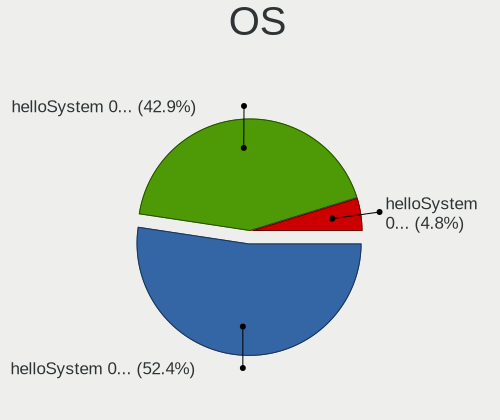
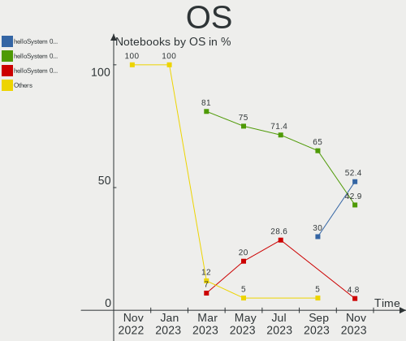
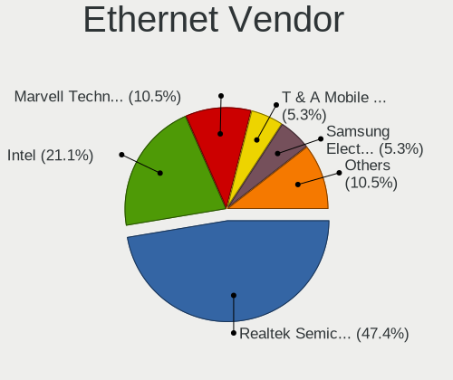
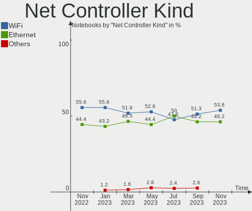
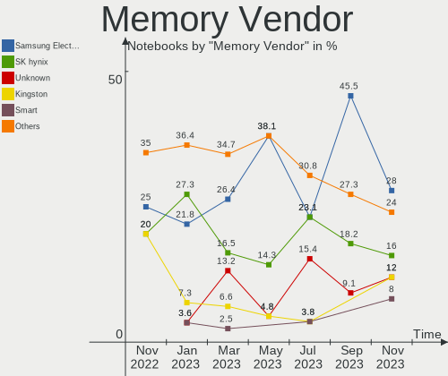
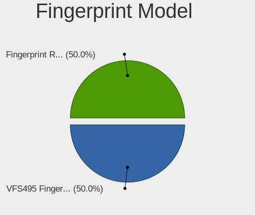

helloSystem - Hardware Trends (Notebooks)
-----------------------------------------

A project to identify most popular hardware characteristics and track their change
over time based on data collected by BSD users at https://BSD-Hardware.info.

Anyone can contribute to this report by the [hw-probe](https://github.com/linuxhw/hw-probe/blob/master/INSTALL.BSD.md) tool:

    hw-probe -all -upload

This report is for one last month. Overall report since the beginning of time: [TestDays](https://github.com/bsdhw/TestDays)

Period: Sep, 2023.

Contents
--------

* [ System ](#system)
  - [ OS                       ](#os)
  - [ OS Family                ](#os-family)
  - [ Arch                     ](#arch)
  - [ DE                       ](#de)
  - [ Display Server           ](#display-server)
  - [ Display Manager          ](#display-manager)
  - [ OS Lang                  ](#os-lang)
  - [ Boot Mode                ](#boot-mode)
  - [ Filesystem               ](#filesystem)
  - [ Part. scheme             ](#part-scheme)

* [ Board ](#board)
  - [ Vendor                   ](#vendor)
  - [ Model                    ](#model)
  - [ Model Family             ](#model-family)
  - [ MFG Year                 ](#mfg-year)
  - [ Form Factor              ](#form-factor)
  - [ Coreboot                 ](#coreboot)
  - [ RAM Size                 ](#ram-size)
  - [ RAM Used                 ](#ram-used)
  - [ Total Drives             ](#total-drives)
  - [ Has CD-ROM               ](#has-cd-rom)
  - [ Has Ethernet             ](#has-ethernet)
  - [ Has WiFi                 ](#has-wifi)
  - [ Has Bluetooth            ](#has-bluetooth)

* [ Location ](#location)
  - [ Country                  ](#country)
  - [ City                     ](#city)

* [ Drives ](#drives)
  - [ Drive Vendor             ](#drive-vendor)
  - [ Drive Model              ](#drive-model)
  - [ HDD Vendor               ](#hdd-vendor)
  - [ SSD Vendor               ](#ssd-vendor)
  - [ Drive Kind               ](#drive-kind)
  - [ Drive Connector          ](#drive-connector)
  - [ Drive Size               ](#drive-size)
  - [ Space Total              ](#space-total)
  - [ Space Used               ](#space-used)
  - [ Malfunc. Drives          ](#malfunc-drives)
  - [ Malfunc. Drive Vendor    ](#malfunc-drive-vendor)
  - [ Malfunc. HDD Vendor      ](#malfunc-hdd-vendor)
  - [ Malfunc. Drive Kind      ](#malfunc-drive-kind)
  - [ Failed Drives            ](#failed-drives)
  - [ Failed Drive Vendor      ](#failed-drive-vendor)
  - [ Drive Status             ](#drive-status)

* [ Storage controller ](#storage-controller)
  - [ Storage Vendor           ](#storage-vendor)
  - [ Storage Model            ](#storage-model)
  - [ Storage Kind             ](#storage-kind)

* [ Processor ](#processor)
  - [ CPU Vendor               ](#cpu-vendor)
  - [ CPU Model                ](#cpu-model)
  - [ CPU Model Family         ](#cpu-model-family)
  - [ CPU Cores                ](#cpu-cores)
  - [ CPU Sockets              ](#cpu-sockets)
  - [ CPU Threads              ](#cpu-threads)
  - [ CPU Microarch            ](#cpu-microarch)

* [ Graphics ](#graphics)
  - [ GPU Vendor               ](#gpu-vendor)
  - [ GPU Model                ](#gpu-model)
  - [ GPU Combo                ](#gpu-combo)
  - [ GPU Driver               ](#gpu-driver)
  - [ GPU Memory               ](#gpu-memory)

* [ Monitor ](#monitor)
  - [ Monitor Vendor           ](#monitor-vendor)
  - [ Monitor Model            ](#monitor-model)
  - [ Monitor Resolution       ](#monitor-resolution)
  - [ Monitor Diagonal         ](#monitor-diagonal)
  - [ Monitor Width            ](#monitor-width)
  - [ Aspect Ratio             ](#aspect-ratio)
  - [ Monitor Area             ](#monitor-area)
  - [ Pixel Density            ](#pixel-density)
  - [ Multiple Monitors        ](#multiple-monitors)

* [ Network ](#network)
  - [ Net Controller Vendor    ](#net-controller-vendor)
  - [ Net Controller Model     ](#net-controller-model)
  - [ Wireless Vendor          ](#wireless-vendor)
  - [ Wireless Model           ](#wireless-model)
  - [ Ethernet Vendor          ](#ethernet-vendor)
  - [ Ethernet Model           ](#ethernet-model)
  - [ Net Controller Kind      ](#net-controller-kind)
  - [ Used Controller          ](#used-controller)
  - [ NICs                     ](#nics)
  - [ IPv6                     ](#ipv6)

* [ Bluetooth ](#bluetooth)
  - [ Bluetooth Vendor         ](#bluetooth-vendor)
  - [ Bluetooth Model          ](#bluetooth-model)

* [ Sound ](#sound)
  - [ Sound Vendor             ](#sound-vendor)
  - [ Sound Model              ](#sound-model)

* [ Memory ](#memory)
  - [ Memory Vendor            ](#memory-vendor)
  - [ Memory Model             ](#memory-model)
  - [ Memory Kind              ](#memory-kind)
  - [ Memory Form Factor       ](#memory-form-factor)
  - [ Memory Size              ](#memory-size)
  - [ Memory Speed             ](#memory-speed)

* [ Printers & scanners ](#printers--scanners)
  - [ Printer Vendor           ](#printer-vendor)
  - [ Printer Model            ](#printer-model)
  - [ Scanner Vendor           ](#scanner-vendor)
  - [ Scanner Model            ](#scanner-model)

* [ Camera ](#camera)
  - [ Camera Vendor            ](#camera-vendor)
  - [ Camera Model             ](#camera-model)

* [ Security ](#security)
  - [ Fingerprint Vendor       ](#fingerprint-vendor)
  - [ Fingerprint Model        ](#fingerprint-model)
  - [ Chipcard Vendor          ](#chipcard-vendor)
  - [ Chipcard Model           ](#chipcard-model)

* [ Unsupported ](#unsupported)
  - [ Unsupported Devices      ](#unsupported-devices)
  - [ Unsupported Device Types ](#unsupported-device-types)

System
------

OS
--

Installed operating systems

| Name              | Notebooks | Percent |
|-------------------|-----------|---------|
| helloSystem 0.8.1 | 13        | 65%     |
| helloSystem 0.9.0 | 6         | 30%     |
| helloSystem 0.7.0 | 1         | 5%      |

OS Family
---------

OS without a version

| Name        | Notebooks | Percent |
|-------------|-----------|---------|
| helloSystem | 20        | 100%    |

Arch
----

OS architecture (x86_64, i586, etc.)

| Name  | Notebooks | Percent |
|-------|-----------|---------|
| amd64 | 20        | 100%    |

DE
--

Desktop Environment

| Name         | Notebooks | Percent |
|--------------|-----------|---------|
| helloDesktop | 20        | 100%    |

Display Server
--------------

X11 or Wayland

| Name | Notebooks | Percent |
|------|-----------|---------|
| X11  | 20        | 100%    |

Display Manager
---------------

SDDM, LightDM, etc.

| Name | Notebooks | Percent |
|------|-----------|---------|
| SLiM | 20        | 100%    |

OS Lang
-------

Language

| Lang    | Notebooks | Percent |
|---------|-----------|---------|
| en_US   | 10        | 50%     |
| Unknown | 5         | 25%     |
| tr_TR   | 1         | 5%      |
| ru_RU   | 1         | 5%      |
| fr_FR   | 1         | 5%      |
| es_ES   | 1         | 5%      |
| de_DE   | 1         | 5%      |

Boot Mode
---------

EFI or BIOS

| Mode | Notebooks | Percent |
|------|-----------|---------|
| EFI  | 20        | 100%    |

Filesystem
----------

Type of filesystem

| Type   | Notebooks | Percent |
|--------|-----------|---------|
| Zfs    | 10        | 50%     |
| Cd9660 | 10        | 50%     |

Part. scheme
------------

Scheme of partitioning

| Type | Notebooks | Percent |
|------|-----------|---------|
| GPT  | 20        | 100%    |

Board
-----

Vendor
------

Motherboard manufacturer

| Name                | Notebooks | Percent |
|---------------------|-----------|---------|
| Lenovo              | 8         | 40%     |
| Hewlett-Packard     | 3         | 15%     |
| Acer                | 2         | 10%     |
| Toshiba             | 1         | 5%      |
| Samsung Electronics | 1         | 5%      |
| OEGStone            | 1         | 5%      |
| LG Electronics      | 1         | 5%      |
| Fujitsu             | 1         | 5%      |
| Dell                | 1         | 5%      |
| ASUSTek Computer    | 1         | 5%      |

Model
-----

Motherboard model

| Name                                     | Notebooks | Percent |
|------------------------------------------|-----------|---------|
| Toshiba QOSMIO X775                      | 1         | 5%      |
| Samsung 270E5J/2570EJ                    | 1         | 5%      |
| OEGStone doceo 510                       | 1         | 5%      |
| LG 16U70Q-K.AAS7U1                       | 1         | 5%      |
| Lenovo ThinkPad X240 20AMA1Y3UK          | 1         | 5%      |
| Lenovo ThinkPad X1 Carbon 2nd 20A7002FUS | 1         | 5%      |
| Lenovo ThinkPad SL 2746N8G               | 1         | 5%      |
| Lenovo ThinkPad P50 20EN0012US           | 1         | 5%      |
| Lenovo ThinkPad Edge E531 68852BU        | 1         | 5%      |
| Lenovo ThinkPad E14 Gen 2 20T60036RT     | 1         | 5%      |
| Lenovo IdeaPad 100-14IBY 80MH            | 1         | 5%      |
| Lenovo IdeaPad 1 14IGL7 82V6             | 1         | 5%      |
| HP Pavilion g7                           | 1         | 5%      |
| HP OMEN by Laptop                        | 1         | 5%      |
| HP G62                                   | 1         | 5%      |
| Fujitsu LIFEBOOK S935                    | 1         | 5%      |
| Dell Latitude E6430                      | 1         | 5%      |
| ASUS VivoBook_ASUSLaptop M1502IA_M1502IA | 1         | 5%      |
| Acer TravelMate 7730                     | 1         | 5%      |
| Acer AOHAPPY2                            | 1         | 5%      |

Model Family
------------

Motherboard model prefix

| Name               | Notebooks | Percent |
|--------------------|-----------|---------|
| Lenovo ThinkPad    | 6         | 30%     |
| Lenovo IdeaPad     | 2         | 10%     |
| Toshiba QOSMIO     | 1         | 5%      |
| Samsung 270E5J     | 1         | 5%      |
| OEGStone doceo     | 1         | 5%      |
| LG 16U70Q-K.AAS7U1 | 1         | 5%      |
| HP Pavilion        | 1         | 5%      |
| HP OMEN            | 1         | 5%      |
| HP G62             | 1         | 5%      |
| Fujitsu LIFEBOOK   | 1         | 5%      |
| Dell Latitude      | 1         | 5%      |
| ASUS VivoBook      | 1         | 5%      |
| Acer TravelMate    | 1         | 5%      |
| Acer AOHAPPY2      | 1         | 5%      |

MFG Year
--------

Motherboard manufacture year

| Year | Notebooks | Percent |
|------|-----------|---------|
| 2013 | 4         | 20%     |
| 2022 | 3         | 15%     |
| 2016 | 2         | 10%     |
| 2015 | 2         | 10%     |
| 2010 | 2         | 10%     |
| 2009 | 2         | 10%     |
| 2023 | 1         | 5%      |
| 2020 | 1         | 5%      |
| 2014 | 1         | 5%      |
| 2012 | 1         | 5%      |
| 2011 | 1         | 5%      |

Form Factor
-----------

Physical design of the computer

| Name     | Notebooks | Percent |
|----------|-----------|---------|
| Notebook | 20        | 100%    |

Coreboot
--------

Have coreboot on board

| Used | Notebooks | Percent |
|------|-----------|---------|
| No   | 20        | 100%    |

RAM Size
--------

Total RAM memory

| Size in GB | Notebooks | Percent |
|------------|-----------|---------|
| 8.01-16.0  | 7         | 35%     |
| 4.01-8.0   | 6         | 30%     |
| 16.01-24.0 | 3         | 15%     |
| 3.01-4.0   | 2         | 10%     |
| 32.01-64.0 | 1         | 5%      |
| 2.01-3.0   | 1         | 5%      |

RAM Used
--------

Used RAM memory

| Used GB   | Notebooks | Percent |
|-----------|-----------|---------|
| 0.01-0.5  | 13        | 65%     |
| 1.01-2.0  | 3         | 15%     |
| 0.51-1.0  | 3         | 15%     |
| 8.01-16.0 | 1         | 5%      |

Total Drives
------------

Number of drives on board

| Drives | Notebooks | Percent |
|--------|-----------|---------|
| 1      | 11        | 55%     |
| 2      | 7         | 35%     |
| 0      | 2         | 10%     |

Has CD-ROM
----------

Has CD-ROM on board

| Presented | Notebooks | Percent |
|-----------|-----------|---------|
| No        | 12        | 60%     |
| Yes       | 8         | 40%     |

Has Ethernet
------------

Has Ethernet on board

| Presented | Notebooks | Percent |
|-----------|-----------|---------|
| Yes       | 16        | 80%     |
| No        | 4         | 20%     |

Has WiFi
--------

Has WiFi module

| Presented | Notebooks | Percent |
|-----------|-----------|---------|
| Yes       | 20        | 100%    |

Has Bluetooth
-------------

Has Bluetooth module

| Presented | Notebooks | Percent |
|-----------|-----------|---------|
| Yes       | 14        | 70%     |
| No        | 6         | 30%     |

Location
--------

Country
-------

Geographic location (country)

| Country     | Notebooks | Percent |
|-------------|-----------|---------|
| USA         | 5         | 25%     |
| Russia      | 2         | 10%     |
| Indonesia   | 2         | 10%     |
| Germany     | 2         | 10%     |
| Ukraine     | 1         | 5%      |
| UK          | 1         | 5%      |
| Turkey      | 1         | 5%      |
| Taiwan      | 1         | 5%      |
| South Korea | 1         | 5%      |
| Netherlands | 1         | 5%      |
| Greece      | 1         | 5%      |
| Colombia    | 1         | 5%      |
| Bulgaria    | 1         | 5%      |

City
----

Geographic location (city)

| City          | Notebooks | Percent |
|---------------|-----------|---------|
| Yuseong-gu    | 1         | 5%      |
| Yogyakarta    | 1         | 5%      |
| Yambol        | 1         | 5%      |
| Thessaloniki  | 1         | 5%      |
| Teaneck       | 1         | 5%      |
| Surabaya      | 1         | 5%      |
| St Albans     | 1         | 5%      |
| Sochi         | 1         | 5%      |
| Odesa         | 1         | 5%      |
| Novosibirsk   | 1         | 5%      |
| Nantou City   | 1         | 5%      |
| Martinsburg   | 1         | 5%      |
| Klamath Falls | 1         | 5%      |
| Istanbul      | 1         | 5%      |
| Hamburg       | 1         | 5%      |
| Gross-Zimmern | 1         | 5%      |
| Gouda         | 1         | 5%      |
| Glendale      | 1         | 5%      |
| Chicago       | 1         | 5%      |
| Bogotá       | 1         | 5%      |

Drives
------

Drive Vendor
------------

Hard drive vendors

| Vendor              | Notebooks | Drives | Percent |
|---------------------|-----------|--------|---------|
| Samsung Electronics | 4         | 5      | 16.67%  |
| Seagate             | 3         | 3      | 12.5%   |
| Kingston            | 3         | 3      | 12.5%   |
| Hitachi             | 3         | 3      | 12.5%   |
| WDC                 | 2         | 2      | 8.33%   |
| SanDisk             | 2         | 2      | 8.33%   |
| Intel               | 2         | 2      | 8.33%   |
| Toshiba             | 1         | 2      | 4.17%   |
| Team                | 1         | 1      | 4.17%   |
| MidasForce          | 1         | 1      | 4.17%   |
| Crucial             | 1         | 1      | 4.17%   |
| A-DATA Technology   | 1         | 1      | 4.17%   |

Drive Model
-----------

Hard drive models

| Model                                | Notebooks | Percent |
|--------------------------------------|-----------|---------|
| Kingston SV300S37A240G 240GB         | 2         | 8%      |
| Hitachi HTS541612J9SA00 120GB        | 2         | 8%      |
| WDC WD10JPCX-24UE4T0 1TB             | 1         | 4%      |
| WDC PC SN530 SDBPMPZ-256G-1001 256GB | 1         | 4%      |
| Toshiba MK5061GSYN 500GB             | 1         | 4%      |
| Team L5 LITE SSD 120GB               | 1         | 4%      |
| Seagate ST500LT012-1DG142 500GB      | 1         | 4%      |
| Seagate ST500LM000-1EJ162-SSHD-8GB   | 1         | 4%      |
| Seagate ST1000LM049-2GH172 1TB       | 1         | 4%      |
| SanDisk Ultra II 240GB               | 1         | 4%      |
| SanDisk SSD PLUS 120GB               | 1         | 4%      |
| Samsung SSD 970 EVO Plus 2TB         | 1         | 4%      |
| Samsung MZVLQ512HBLU-00B00 512GB     | 1         | 4%      |
| Samsung MZVLB256HAHQ-000H1 256GB     | 1         | 4%      |
| Samsung MZNLN256HCHP-000L7 256GB     | 1         | 4%      |
| Samsung HM160HI 160GB                | 1         | 4%      |
| MidasForce SSD 256GB                 | 1         | 4%      |
| Kingston SA400S37120G 120GB          | 1         | 4%      |
| Intel SSDPEKNW512G8H 512GB           | 1         | 4%      |
| Intel SSDPEKNU512GZ 512GB            | 1         | 4%      |
| Hitachi HTS545050B9A300 500GB        | 1         | 4%      |
| Crucial CT120BX500SSD1 120GB         | 1         | 4%      |
| A-DATA SU635 480GB                   | 1         | 4%      |

HDD Vendor
----------

Hard disk drive vendors

| Vendor              | Notebooks | Drives | Percent |
|---------------------|-----------|--------|---------|
| Seagate             | 3         | 3      | 33.33%  |
| Hitachi             | 3         | 3      | 33.33%  |
| WDC                 | 1         | 1      | 11.11%  |
| Toshiba             | 1         | 2      | 11.11%  |
| Samsung Electronics | 1         | 1      | 11.11%  |

SSD Vendor
----------

Solid state drive vendors

| Vendor              | Notebooks | Drives | Percent |
|---------------------|-----------|--------|---------|
| Kingston            | 3         | 3      | 30%     |
| SanDisk             | 2         | 2      | 20%     |
| Team                | 1         | 1      | 10%     |
| Samsung Electronics | 1         | 1      | 10%     |
| MidasForce          | 1         | 1      | 10%     |
| Crucial             | 1         | 1      | 10%     |
| A-DATA Technology   | 1         | 1      | 10%     |

Drive Kind
----------

HDD or SSD

| Kind | Notebooks | Drives | Percent |
|------|-----------|--------|---------|
| SSD  | 9         | 10     | 39.13%  |
| HDD  | 9         | 10     | 39.13%  |
| NVMe | 5         | 6      | 21.74%  |

Drive Connector
---------------

SATA, SAS, NVMe, etc.

| Type | Notebooks | Drives | Percent |
|------|-----------|--------|---------|
| SATA | 16        | 20     | 76.19%  |
| NVMe | 5         | 6      | 23.81%  |

Drive Size
----------

Size of hard drive

| Size in TB | Notebooks | Drives | Percent |
|------------|-----------|--------|---------|
| 0.01-0.5   | 15        | 18     | 88.24%  |
| 0.51-1.0   | 2         | 2      | 11.76%  |

Space Total
-----------

Amount of disk space available on the file system

| Size in GB | Notebooks | Percent |
|------------|-----------|---------|
| 101-250    | 7         | 35%     |
| 1-20       | 5         | 25%     |
| 251-500    | 4         | 20%     |
| 21-50      | 2         | 10%     |
| 1001-2000  | 1         | 5%      |
| 51-100     | 1         | 5%      |

Space Used
----------

Amount of used disk space

| Used GB | Notebooks | Percent |
|---------|-----------|---------|
| 1-20    | 19        | 95%     |
| 21-50   | 1         | 5%      |

Malfunc. Drives
---------------

Drive models with a malfunction

| Model                              | Notebooks | Drives | Percent |
|------------------------------------|-----------|--------|---------|
| WDC WD10JPCX-24UE4T0 1TB           | 1         | 1      | 20%     |
| Seagate ST500LM000-1EJ162-SSHD-8GB | 1         | 1      | 20%     |
| Samsung Electronics HM160HI 160GB  | 1         | 1      | 20%     |
| Hitachi HTS545050B9A300 500GB      | 1         | 1      | 20%     |
| Hitachi HTS541612J9SA00 120GB      | 1         | 1      | 20%     |

Malfunc. Drive Vendor
---------------------

Vendors of faulty drives

| Vendor              | Notebooks | Drives | Percent |
|---------------------|-----------|--------|---------|
| Hitachi             | 2         | 2      | 40%     |
| WDC                 | 1         | 1      | 20%     |
| Seagate             | 1         | 1      | 20%     |
| Samsung Electronics | 1         | 1      | 20%     |

Malfunc. HDD Vendor
-------------------

Vendors of faulty HDD drives

| Vendor              | Notebooks | Drives | Percent |
|---------------------|-----------|--------|---------|
| Hitachi             | 2         | 2      | 40%     |
| WDC                 | 1         | 1      | 20%     |
| Seagate             | 1         | 1      | 20%     |
| Samsung Electronics | 1         | 1      | 20%     |

Malfunc. Drive Kind
-------------------

Kinds of faulty drives

| Kind | Notebooks | Drives | Percent |
|------|-----------|--------|---------|
| HDD  | 5         | 5      | 100%    |

Failed Drives
-------------

Failed drive models

Zero info for selected period =(

Failed Drive Vendor
-------------------

Failed drive vendors

Zero info for selected period =(

Drive Status
------------

Number of failed and malfunc. drives

| Status   | Notebooks | Drives | Percent |
|----------|-----------|--------|---------|
| Works    | 15        | 20     | 71.43%  |
| Malfunc  | 5         | 5      | 23.81%  |
| Detected | 1         | 1      | 4.76%   |

Storage controller
------------------

Storage Vendor
--------------

Storage controller vendors

| Vendor              | Notebooks | Percent |
|---------------------|-----------|---------|
| Intel               | 18        | 78.26%  |
| Samsung Electronics | 3         | 13.04%  |
| SanDisk             | 1         | 4.35%   |
| Nvidia              | 1         | 4.35%   |

Storage Model
-------------

Storage controller models

| Model                                                                         | Notebooks | Percent |
|-------------------------------------------------------------------------------|-----------|---------|
| Intel 8 Series SATA Controller 1 [AHCI mode]                                  | 3         | 13.04%  |
| Samsung NVMe SSD Controller SM981/PM981/PM983                                 | 2         | 8.7%    |
| Intel 82801IBM/IEM (ICH9M/ICH9M-E) 4 port SATA Controller [AHCI mode]         | 2         | 8.7%    |
| Intel 7 Series Chipset Family 6-port SATA Controller [AHCI mode]              | 2         | 8.7%    |
| Intel 5 Series/3400 Series Chipset 4 port SATA AHCI Controller                | 2         | 8.7%    |
| SanDisk PC SN530 NVMe SSD (DRAM-less)                                         | 1         | 4.35%   |
| Samsung NVMe SSD Controller 980                                               | 1         | 4.35%   |
| Nvidia MCP79 AHCI Controller                                                  | 1         | 4.35%   |
| Intel Wildcat Point-LP SATA Controller [AHCI Mode]                            | 1         | 4.35%   |
| Intel SSD 670p Series [Keystone Harbor]                                       | 1         | 4.35%   |
| Intel SSD 660P Series                                                         | 1         | 4.35%   |
| Intel Q170/Q150/B150/H170/H110/Z170/CM236 Chipset SATA Controller [AHCI Mode] | 1         | 4.35%   |
| Intel NM10/ICH7 Family SATA Controller [AHCI mode]                            | 1         | 4.35%   |
| Intel Celeron/Pentium Silver Processor SATA Controller                        | 1         | 4.35%   |
| Intel Atom Processor E3800 Series SATA AHCI Controller                        | 1         | 4.35%   |
| Intel 82801 Mobile SATA Controller [RAID mode]                                | 1         | 4.35%   |
| Intel 6 Series/C200 Series Chipset Family 6 port Mobile SATA AHCI Controller  | 1         | 4.35%   |

Storage Kind
------------

Kind of storage controller (IDE, SATA, NVMe, SAS, ...)

| Kind | Notebooks | Percent |
|------|-----------|---------|
| SATA | 16        | 72.73%  |
| NVMe | 5         | 22.73%  |
| RAID | 1         | 4.55%   |

Processor
---------

CPU Vendor
----------

Processor vendors

| Vendor | Notebooks | Percent |
|--------|-----------|---------|
| Intel  | 17        | 85%     |
| AMD    | 3         | 15%     |

CPU Model
---------

Processor models

| Model                                    | Notebooks | Percent |
|------------------------------------------|-----------|---------|
| Intel Pentium CPU P6200 @ 2.13GHz        | 2         | 10%     |
| Intel Pentium Silver N5030 CPU @ 1.10GHz | 1         | 5%      |
| Intel Pentium Dual CPU T3200 @ 2.00GHz   | 1         | 5%      |
| Intel Pentium 3558U @ 1.70GHz            | 1         | 5%      |
| Intel CPU Version                        | 1         | 5%      |
| Intel Core i7-8750H CPU @ 2.20GHz        | 1         | 5%      |
| Intel Core i7-6700HQ CPU @ 2.60GHz       | 1         | 5%      |
| Intel Core i7-3540M CPU @ 3.00GHz        | 1         | 5%      |
| Intel Core i7-2670QM CPU @ 2.20GHz       | 1         | 5%      |
| Intel Core i5-5200U CPU @ 2.20GHz        | 1         | 5%      |
| Intel Core i5-4300U CPU @ 1.90GHz        | 1         | 5%      |
| Intel Core i5-4200U CPU @ 1.60GHz        | 1         | 5%      |
| Intel Core i5-3230M CPU @ 2.60GHz        | 1         | 5%      |
| Intel Core 2 Duo CPU T6570 @ 2.10GHz     | 1         | 5%      |
| Intel Celeron CPU N2840 @ 2.16GHz        | 1         | 5%      |
| Intel Atom CPU N570 @ 1.66GHz            | 1         | 5%      |
| AMD Ryzen 7 5825U with Radeon Graphics   | 1         | 5%      |
| AMD Ryzen 7 4800HS with Radeon Graphics  | 1         | 5%      |
| AMD Ryzen 3 4300U with Radeon Graphics   | 1         | 5%      |

CPU Model Family
----------------

Processor model prefix

| Model                | Notebooks | Percent |
|----------------------|-----------|---------|
| Intel Core i7        | 4         | 20%     |
| Intel Core i5        | 4         | 20%     |
| Intel Pentium        | 3         | 15%     |
| AMD Ryzen 7          | 2         | 10%     |
| Other                | 1         | 5%      |
| Intel Pentium Silver | 1         | 5%      |
| Intel Pentium Dual   | 1         | 5%      |
| Intel Core 2 Duo     | 1         | 5%      |
| Intel Celeron        | 1         | 5%      |
| Intel Atom           | 1         | 5%      |
| AMD Ryzen 3          | 1         | 5%      |

CPU Cores
---------

Number of processor cores

| Number  | Notebooks | Percent |
|---------|-----------|---------|
| 2       | 12        | 60%     |
| 4       | 4         | 20%     |
| 16      | 2         | 10%     |
| 6       | 1         | 5%      |
| Unknown | 1         | 5%      |

CPU Sockets
-----------

Number of sockets

| Number | Notebooks | Percent |
|--------|-----------|---------|
| 1      | 20        | 100%    |

CPU Threads
-----------

Threads per core (Hyper-Threading)

| Number  | Notebooks | Percent |
|---------|-----------|---------|
| 1       | 10        | 50%     |
| 2       | 9         | 45%     |
| Unknown | 1         | 5%      |

CPU Microarch
-------------

Microarchitecture

| Name          | Notebooks | Percent |
|---------------|-----------|---------|
| Haswell       | 3         | 15%     |
| Zen 2         | 2         | 10%     |
| Westmere      | 2         | 10%     |
| Penryn        | 2         | 10%     |
| IvyBridge     | 2         | 10%     |
| Zen 3         | 1         | 5%      |
| Skylake       | 1         | 5%      |
| Silvermont    | 1         | 5%      |
| SandyBridge   | 1         | 5%      |
| KabyLake      | 1         | 5%      |
| Goldmont plus | 1         | 5%      |
| Core          | 1         | 5%      |
| Broadwell     | 1         | 5%      |
| Bonnell       | 1         | 5%      |

Graphics
--------

GPU Vendor
----------

Vendors of graphics cards

| Vendor | Notebooks | Percent |
|--------|-----------|---------|
| Intel  | 16        | 66.67%  |
| Nvidia | 4         | 16.67%  |
| AMD    | 4         | 16.67%  |

GPU Model
---------

Graphics card models

| Model                                                                     | Notebooks | Percent |
|---------------------------------------------------------------------------|-----------|---------|
| Intel Haswell-ULT Integrated Graphics Controller                          | 3         | 12.5%   |
| Intel Mobile 4 Series Chipset Integrated Graphics Controller              | 2         | 8.33%   |
| Intel Core Processor Integrated Graphics Controller                       | 2         | 8.33%   |
| Intel 3rd Gen Core processor Graphics Controller                          | 2         | 8.33%   |
| AMD Renoir                                                                | 2         | 8.33%   |
| Nvidia MCP79 [GeForce 8200M G]                                            | 1         | 4.17%   |
| Nvidia GP107M [GeForce GTX 1050 Mobile]                                   | 1         | 4.17%   |
| Nvidia GM107GLM [Quadro M1000M]                                           | 1         | 4.17%   |
| Nvidia GF116M [GeForce GT 560M]                                           | 1         | 4.17%   |
| Intel HD Graphics 5500                                                    | 1         | 4.17%   |
| Intel HD Graphics 530                                                     | 1         | 4.17%   |
| Intel GeminiLake [UHD Graphics 605]                                       | 1         | 4.17%   |
| Intel CoffeeLake-H GT2 [UHD Graphics 630]                                 | 1         | 4.17%   |
| Intel Atom Processor Z36xxx/Z37xxx Series Graphics & Display              | 1         | 4.17%   |
| Intel Atom Processor D4xx/D5xx/N4xx/N5xx Integrated Graphics Controller   | 1         | 4.17%   |
| Intel 2nd Generation Core Processor Family Integrated Graphics Controller | 1         | 4.17%   |
| AMD Park [Mobility Radeon HD 5430/5450/5470]                              | 1         | 4.17%   |
| AMD Barcelo                                                               | 1         | 4.17%   |

GPU Combo
---------

Combinations of graphics cards

| Name           | Notebooks | Percent |
|----------------|-----------|---------|
| 1 x Intel      | 9         | 45%     |
| 2 x Intel      | 3         | 15%     |
| Intel + Nvidia | 3         | 15%     |
| 1 x AMD        | 3         | 15%     |
| 1 x Nvidia     | 1         | 5%      |
| Intel + AMD    | 1         | 5%      |

GPU Driver
----------

Free vs proprietary

| Driver      | Notebooks | Percent |
|-------------|-----------|---------|
| Free        | 16        | 80%     |
| Unknown     | 3         | 15%     |
| Proprietary | 1         | 5%      |

GPU Memory
----------

Total video memory

| Size in GB | Notebooks | Percent |
|------------|-----------|---------|
| Unknown    | 20        | 100%    |

Monitor
-------

Monitor Vendor
--------------

Monitor vendors

| Vendor                  | Notebooks | Percent |
|-------------------------|-----------|---------|
| AU Optronics            | 7         | 38.89%  |
| LG Display              | 3         | 16.67%  |
| Chimei Innolux          | 3         | 16.67%  |
| Sharp                   | 1         | 5.56%   |
| Samsung Electronics     | 1         | 5.56%   |
| Lenovo                  | 1         | 5.56%   |
| Chi Mei Optoelectronics | 1         | 5.56%   |
| BOE                     | 1         | 5.56%   |

Monitor Model
-------------

Monitor models

| Model                                                                    | Notebooks | Percent |
|--------------------------------------------------------------------------|-----------|---------|
| Sharp LQ133M1JW01 SHP141B 1920x1080 290x170mm 13.2-inch                  | 1         | 5.56%   |
| Samsung Electronics LCD Monitor SEC384A 1366x768 340x190mm 15.3-inch     | 1         | 5.56%   |
| LG Display LCD Monitor LGD072F 1920x1200 340x220mm 15.9-inch             | 1         | 5.56%   |
| LG Display LCD Monitor LGD03DB 1366x768 350x190mm 15.7-inch              | 1         | 5.56%   |
| LG Display LCD Monitor LGD027A 1600x900 380x210mm 17.1-inch              | 1         | 5.56%   |
| Lenovo LCD Monitor LEN4057 1280x800 330x210mm 15.4-inch                  | 1         | 5.56%   |
| Chimei Innolux LCD Monitor CMN175A 1920x1080 380x210mm 17.1-inch         | 1         | 5.56%   |
| Chimei Innolux LCD Monitor CMN15E7 1920x1080 340x190mm 15.3-inch         | 1         | 5.56%   |
| Chimei Innolux LCD Monitor CMN14D6 1366x768 310x170mm 13.9-inch          | 1         | 5.56%   |
| Chi Mei Optoelectronics LCD Monitor CMO1469 1366x768 310x170mm 13.9-inch | 1         | 5.56%   |
| BOE LCD Monitor BOE0630 1920x1080 340x190mm 15.3-inch                    | 1         | 5.56%   |
| AU Optronics LCD Monitor AUO6287 1440x900 370x230mm 17.2-inch            | 1         | 5.56%   |
| AU Optronics LCD Monitor AUO61D2 1024x600 220x130mm 10.1-inch            | 1         | 5.56%   |
| AU Optronics LCD Monitor AUO403D 1920x1080 310x170mm 13.9-inch           | 1         | 5.56%   |
| AU Optronics LCD Monitor AUO22EC 1366x768 340x190mm 15.3-inch            | 1         | 5.56%   |
| AU Optronics LCD Monitor AUO139E 1600x900 380x210mm 17.1-inch            | 1         | 5.56%   |
| AU Optronics LCD Monitor AUO123D 1920x1080 310x170mm 13.9-inch           | 1         | 5.56%   |
| AU Optronics LCD Monitor AUO106C 1366x768 280x160mm 12.7-inch            | 1         | 5.56%   |

Monitor Resolution
------------------

Monitor screen resolution

| Resolution        | Notebooks | Percent |
|-------------------|-----------|---------|
| 1920x1080 (FHD)   | 6         | 33.33%  |
| 1366x768 (WXGA)   | 6         | 33.33%  |
| 1600x900 (HD+)    | 2         | 11.11%  |
| 1920x1200 (WUXGA) | 1         | 5.56%   |
| 1440x900 (WXGA+)  | 1         | 5.56%   |
| 1280x800 (WXGA)   | 1         | 5.56%   |
| 1024x600          | 1         | 5.56%   |

Monitor Diagonal
----------------

Diagonal size in inches

| Inches | Notebooks | Percent |
|--------|-----------|---------|
| 15     | 7         | 38.89%  |
| 13     | 5         | 27.78%  |
| 17     | 4         | 22.22%  |
| 12     | 1         | 5.56%   |
| 10     | 1         | 5.56%   |

Monitor Width
-------------

Physical width

| Width in mm | Notebooks | Percent |
|-------------|-----------|---------|
| 301-350     | 11        | 61.11%  |
| 351-400     | 4         | 22.22%  |
| 201-300     | 3         | 16.67%  |

Aspect Ratio
------------

Proportional relationship between the width and the height

| Ratio | Notebooks | Percent |
|-------|-----------|---------|
| 16/9  | 15        | 83.33%  |
| 16/10 | 2         | 11.11%  |
| 3/2   | 1         | 5.56%   |

Monitor Area
------------

Area in inch²

| Area in inch² | Notebooks | Percent |
|----------------|-----------|---------|
| 81-90          | 4         | 22.22%  |
| 91-100         | 4         | 22.22%  |
| 121-130        | 3         | 16.67%  |
| 101-110        | 2         | 11.11%  |
| 71-80          | 1         | 5.56%   |
| 61-70          | 1         | 5.56%   |
| 41-50          | 1         | 5.56%   |
| 131-140        | 1         | 5.56%   |
| 111-120        | 1         | 5.56%   |

Pixel Density
-------------

Pixels per inch

| Density | Notebooks | Percent |
|---------|-----------|---------|
| 121-160 | 7         | 38.89%  |
| 101-120 | 7         | 38.89%  |
| 51-100  | 3         | 16.67%  |
| 161-240 | 1         | 5.56%   |

Multiple Monitors
-----------------

Total monitors connected

| Total | Notebooks | Percent |
|-------|-----------|---------|
| 1     | 18        | 90%     |
| 0     | 2         | 10%     |

Network
-------

Net Controller Vendor
---------------------

Controller vendors

| Vendor                | Notebooks | Percent |
|-----------------------|-----------|---------|
| Realtek Semiconductor | 13        | 34.21%  |
| Intel                 | 10        | 26.32%  |
| Broadcom              | 4         | 10.53%  |
| Qualcomm Atheros      | 3         | 7.89%   |
| TP-Link               | 2         | 5.26%   |
| Samsung Electronics   | 2         | 5.26%   |
| Sierra Wireless       | 1         | 2.63%   |
| Ralink                | 1         | 2.63%   |
| Nvidia                | 1         | 2.63%   |
| Dell                  | 1         | 2.63%   |

Net Controller Model
--------------------

Controller models

| Model                                                                                         | Notebooks | Percent |
|-----------------------------------------------------------------------------------------------|-----------|---------|
| Realtek RTL8111/8168/8411 PCI Express Gigabit Ethernet Controller                             | 5         | 11.36%  |
| Realtek RTL810xE PCI Express Fast Ethernet controller                                         | 5         | 11.36%  |
| Broadcom BCM4313 802.11bgn Wireless Network Adapter                                           | 3         | 6.82%   |
| TP-Link TL-WN722N v2/v3 [Realtek RTL8188EUS]                                                  | 2         | 4.55%   |
| Samsung Galaxy series, misc. (tethering mode)                                                 | 2         | 4.55%   |
| Realtek RTL8852BE PCIe 802.11ax Wireless Network Controller                                   | 2         | 4.55%   |
| Qualcomm Atheros AR9285 Wireless Network Adapter (PCI-Express)                                | 2         | 4.55%   |
| Intel Wireless 7260                                                                           | 2         | 4.55%   |
| Intel Wi-Fi 6 AX200                                                                           | 2         | 4.55%   |
| Sierra Wireless EM7305 Modem                                                                  | 1         | 2.27%   |
| Realtek RTL8188EE Wireless Network Adapter                                                    | 1         | 2.27%   |
| Realtek Realtek 8812AU/8821AU 802.11ac WLAN Adapter [USB Wireless Dual-Band Adapter 2.4/5Ghz] | 1         | 2.27%   |
| Ralink RT2790 Wireless 802.11n 1T/2R PCIe                                                     | 1         | 2.27%   |
| Qualcomm Atheros QCA9565 / AR9565 Wireless Network Adapter                                    | 1         | 2.27%   |
| Nvidia MCP79 Ethernet                                                                         | 1         | 2.27%   |
| Intel Wireless 8260                                                                           | 1         | 2.27%   |
| Intel Wireless 7265                                                                           | 1         | 2.27%   |
| Intel PRO/Wireless 5100 AGN [Shiloh] Network Connection                                       | 1         | 2.27%   |
| Intel Ethernet Connection I218-V                                                              | 1         | 2.27%   |
| Intel Ethernet Connection I218-LM                                                             | 1         | 2.27%   |
| Intel Ethernet Connection (3) I218-LM                                                         | 1         | 2.27%   |
| Intel Ethernet Connection (2) I219-V                                                          | 1         | 2.27%   |
| Intel Centrino Wireless-N 2230                                                                | 1         | 2.27%   |
| Intel Centrino Advanced-N 6205 [Taylor Peak]                                                  | 1         | 2.27%   |
| Intel Cannon Lake PCH CNVi WiFi                                                               | 1         | 2.27%   |
| Dell Wireless 5630 (EVDO-HSPA) Mobile Broadband Mini-Card Network Adapter                     | 1         | 2.27%   |
| Broadcom NetXtreme BCM5764M Gigabit Ethernet PCIe                                             | 1         | 2.27%   |
| Broadcom BCM4311 802.11b/g WLAN                                                               | 1         | 2.27%   |

Wireless Vendor
---------------

Wireless vendors

| Vendor                | Notebooks | Percent |
|-----------------------|-----------|---------|
| Intel                 | 10        | 40%     |
| Realtek Semiconductor | 4         | 16%     |
| Broadcom              | 4         | 16%     |
| Qualcomm Atheros      | 3         | 12%     |
| TP-Link               | 2         | 8%      |
| Ralink                | 1         | 4%      |
| Dell                  | 1         | 4%      |

Wireless Model
--------------

Wireless models

| Model                                                                                         | Notebooks | Percent |
|-----------------------------------------------------------------------------------------------|-----------|---------|
| Broadcom BCM4313 802.11bgn Wireless Network Adapter                                           | 3         | 12%     |
| TP-Link TL-WN722N v2/v3 [Realtek RTL8188EUS]                                                  | 2         | 8%      |
| Realtek RTL8852BE PCIe 802.11ax Wireless Network Controller                                   | 2         | 8%      |
| Qualcomm Atheros AR9285 Wireless Network Adapter (PCI-Express)                                | 2         | 8%      |
| Intel Wireless 7260                                                                           | 2         | 8%      |
| Intel Wi-Fi 6 AX200                                                                           | 2         | 8%      |
| Realtek RTL8188EE Wireless Network Adapter                                                    | 1         | 4%      |
| Realtek Realtek 8812AU/8821AU 802.11ac WLAN Adapter [USB Wireless Dual-Band Adapter 2.4/5Ghz] | 1         | 4%      |
| Ralink RT2790 Wireless 802.11n 1T/2R PCIe                                                     | 1         | 4%      |
| Qualcomm Atheros QCA9565 / AR9565 Wireless Network Adapter                                    | 1         | 4%      |
| Intel Wireless 8260                                                                           | 1         | 4%      |
| Intel Wireless 7265                                                                           | 1         | 4%      |
| Intel PRO/Wireless 5100 AGN [Shiloh] Network Connection                                       | 1         | 4%      |
| Intel Centrino Wireless-N 2230                                                                | 1         | 4%      |
| Intel Centrino Advanced-N 6205 [Taylor Peak]                                                  | 1         | 4%      |
| Intel Cannon Lake PCH CNVi WiFi                                                               | 1         | 4%      |
| Dell Wireless 5630 (EVDO-HSPA) Mobile Broadband Mini-Card Network Adapter                     | 1         | 4%      |
| Broadcom BCM4311 802.11b/g WLAN                                                               | 1         | 4%      |

Ethernet Vendor
---------------

Ethernet vendors

| Vendor                | Notebooks | Percent |
|-----------------------|-----------|---------|
| Realtek Semiconductor | 10        | 55.56%  |
| Intel                 | 4         | 22.22%  |
| Samsung Electronics   | 2         | 11.11%  |
| Nvidia                | 1         | 5.56%   |
| Broadcom              | 1         | 5.56%   |

Ethernet Model
--------------

Ethernet models

| Model                                                             | Notebooks | Percent |
|-------------------------------------------------------------------|-----------|---------|
| Realtek RTL8111/8168/8411 PCI Express Gigabit Ethernet Controller | 5         | 27.78%  |
| Realtek RTL810xE PCI Express Fast Ethernet controller             | 5         | 27.78%  |
| Samsung Galaxy series, misc. (tethering mode)                     | 2         | 11.11%  |
| Nvidia MCP79 Ethernet                                             | 1         | 5.56%   |
| Intel Ethernet Connection I218-V                                  | 1         | 5.56%   |
| Intel Ethernet Connection I218-LM                                 | 1         | 5.56%   |
| Intel Ethernet Connection (3) I218-LM                             | 1         | 5.56%   |
| Intel Ethernet Connection (2) I219-V                              | 1         | 5.56%   |
| Broadcom NetXtreme BCM5764M Gigabit Ethernet PCIe                 | 1         | 5.56%   |

Net Controller Kind
-------------------

Ethernet, WiFi or modem

| Kind     | Notebooks | Percent |
|----------|-----------|---------|
| WiFi     | 20        | 51.28%  |
| Ethernet | 18        | 46.15%  |
| Unknown  | 1         | 2.56%   |

Used Controller
---------------

Currently used network controller

| Kind     | Notebooks | Percent |
|----------|-----------|---------|
| WiFi     | 10        | 58.82%  |
| Ethernet | 7         | 41.18%  |

NICs
----

Total network controllers on board

| Total | Notebooks | Percent |
|-------|-----------|---------|
| 2     | 17        | 85%     |
| 1     | 3         | 15%     |

IPv6
----

IPv6 vs IPv4

| Used | Notebooks | Percent |
|------|-----------|---------|
| No   | 19        | 95%     |
| Yes  | 1         | 5%      |

Bluetooth
---------

Bluetooth Vendor
----------------

Controller vendors

| Vendor                          | Notebooks | Percent |
|---------------------------------|-----------|---------|
| Intel                           | 7         | 50%     |
| Qualcomm Atheros Communications | 2         | 14.29%  |
| Broadcom                        | 2         | 14.29%  |
| Realtek Semiconductor           | 1         | 7.14%   |
| IMC Networks                    | 1         | 7.14%   |
| Dell                            | 1         | 7.14%   |

Bluetooth Model
---------------

Controller models

| Model                                              | Notebooks | Percent |
|----------------------------------------------------|-----------|---------|
| Intel Bluetooth wireless interface                 | 3         | 21.43%  |
| Intel AX200 Bluetooth                              | 2         | 14.29%  |
| Realtek Bluetooth Adapter                          | 1         | 7.14%   |
| Qualcomm Atheros AR3012 Bluetooth 4.0              | 1         | 7.14%   |
| Qualcomm Atheros AR3011 Bluetooth                  | 1         | 7.14%   |
| Intel Centrino Bluetooth Wireless Transceiver      | 1         | 7.14%   |
| Intel Bluetooth 9460/9560 Jefferson Peak (JfP)     | 1         | 7.14%   |
| IMC Networks Realtek Bluetooth Adapter             | 1         | 7.14%   |
| Dell Dell Wireless 380 Bluetooth 4.0 Module        | 1         | 7.14%   |
| Broadcom BCM2070 Bluetooth 2.1 + EDR               | 1         | 7.14%   |
| Broadcom BCM2045B (BDC-2.1) [Bluetooth Controller] | 1         | 7.14%   |

Sound
-----

Sound Vendor
------------

Sound card vendors

| Vendor | Notebooks | Percent |
|--------|-----------|---------|
| Intel  | 16        | 76.19%  |
| AMD    | 4         | 19.05%  |
| Nvidia | 1         | 4.76%   |

Sound Model
-----------

Sound card models

| Model                                                                      | Notebooks | Percent |
|----------------------------------------------------------------------------|-----------|---------|
| Intel Haswell-ULT HD Audio Controller                                      | 3         | 10.71%  |
| Intel 8 Series HD Audio Controller                                         | 3         | 10.71%  |
| AMD Renoir Radeon High Definition Audio Controller                         | 3         | 10.71%  |
| AMD Family 17h/19h HD Audio Controller                                     | 3         | 10.71%  |
| Intel 82801I (ICH9 Family) HD Audio Controller                             | 2         | 7.14%   |
| Intel 7 Series/C216 Chipset Family High Definition Audio Controller        | 2         | 7.14%   |
| Intel 5 Series/3400 Series Chipset High Definition Audio                   | 2         | 7.14%   |
| Nvidia MCP79 High Definition Audio                                         | 1         | 3.57%   |
| Intel Wildcat Point-LP High Definition Audio Controller                    | 1         | 3.57%   |
| Intel NM10/ICH7 Family High Definition Audio Controller                    | 1         | 3.57%   |
| Intel Celeron/Pentium Silver Processor High Definition Audio               | 1         | 3.57%   |
| Intel Cannon Lake PCH cAVS                                                 | 1         | 3.57%   |
| Intel Broadwell-U Audio Controller                                         | 1         | 3.57%   |
| Intel Atom Processor Z36xxx/Z37xxx Series High Definition Audio Controller | 1         | 3.57%   |
| Intel 6 Series/C200 Series Chipset Family High Definition Audio Controller | 1         | 3.57%   |
| Intel 100 Series/C230 Series Chipset Family HD Audio Controller            | 1         | 3.57%   |
| AMD Cedar HDMI Audio [Radeon HD 5400/6300/7300 Series]                     | 1         | 3.57%   |

Memory
------

Memory Vendor
-------------

Memory module vendors

| Vendor              | Notebooks | Percent |
|---------------------|-----------|---------|
| Samsung Electronics | 10        | 45.45%  |
| SK hynix            | 4         | 18.18%  |
| Unknown             | 2         | 9.09%   |
| Micron Technology   | 2         | 9.09%   |
| Timetec             | 1         | 4.55%   |
| Team                | 1         | 4.55%   |
| Elpida              | 1         | 4.55%   |
| A-DATA Technology   | 1         | 4.55%   |

Memory Model
------------

Memory module models

| Model                                                   | Notebooks | Percent |
|---------------------------------------------------------|-----------|---------|
| Samsung RAM M471B5173QH0-YK0 4GB SODIMM DDR3 1600MT/s   | 2         | 9.09%   |
| Unknown RAM Module 2GB SODIMM DDR2 800MT/s              | 1         | 4.55%   |
| Unknown RAM Module 2GB SODIMM DDR2                      | 1         | 4.55%   |
| Timetec RAM SD4-2666 32GB SODIMM DDR4 2666MT/s          | 1         | 4.55%   |
| Team RAM TEAMGROUP-SD3-1600 8GB SODIMM DDR3 1600MT/s    | 1         | 4.55%   |
| SK hynix RAM HMT451S6AFR8A-PB 4GB SODIMM DDR3 1600MT/s  | 1         | 4.55%   |
| SK hynix RAM HMT451S6AFR6A-PB N0 2GB Chip DDR3 1600MT/s | 1         | 4.55%   |
| SK hynix RAM HMT351S6EFR8A-PB 4GB SODIMM DDR3 1600MT/s  | 1         | 4.55%   |
| SK hynix RAM HMT312S6BFR6C-H9 1GB SODIMM DDR3 1067MT/s  | 1         | 4.55%   |
| Samsung RAM Module 4GB Row Of Chips DDR4 2400MT/s       | 1         | 4.55%   |
| Samsung RAM M471B5773CHS-CH9 2GB SODIMM DDR3 1333MT/s   | 1         | 4.55%   |
| Samsung RAM M471B5273DH0-CH9 4GB SODIMM DDR3 1334MT/s   | 1         | 4.55%   |
| Samsung RAM M471A5244CB0-CWE 4GB SODIMM DDR4 3200MT/s   | 1         | 4.55%   |
| Samsung RAM M471A1K43EB1-CWE 8GB SODIMM DDR4 3200MT/s   | 1         | 4.55%   |
| Samsung RAM M471A1K43DB1-CTD 8GB SODIMM DDR4 2667MT/s   | 1         | 4.55%   |
| Samsung RAM M471A1G43DB0-CPB 8GB SODIMM DDR4 2133MT/s   | 1         | 4.55%   |
| Samsung RAM K4UBE3D4AA-MGCR 8GB DIMM LPDDR4 4266MT/s    | 1         | 4.55%   |
| Micron RAM Module 4GB SODIMM DDR3 1600MT/s              | 1         | 4.55%   |
| Micron RAM 4ATF1G64HZ-3G2F1 8GB SODIMM DDR4 3200MT/s    | 1         | 4.55%   |
| Elpida RAM EBJ10UE8BDS0-DJ-F 1GB SODIMM DDR3 1067MT/s   | 1         | 4.55%   |
| A-DATA RAM AD73I1B1674EU 2GB SODIMM DDR3 1067MT/s       | 1         | 4.55%   |

Memory Kind
-----------

Memory module kinds

| Kind   | Notebooks | Percent |
|--------|-----------|---------|
| DDR3   | 9         | 52.94%  |
| DDR4   | 5         | 29.41%  |
| DDR2   | 2         | 11.76%  |
| LPDDR4 | 1         | 5.88%   |

Memory Form Factor
------------------

Physical design of the memory module

| Name         | Notebooks | Percent |
|--------------|-----------|---------|
| SODIMM       | 14        | 82.35%  |
| Row Of Chips | 1         | 5.88%   |
| DIMM         | 1         | 5.88%   |
| Chip         | 1         | 5.88%   |

Memory Size
-----------

Memory module size

| Size  | Notebooks | Percent |
|-------|-----------|---------|
| 8192  | 6         | 30%     |
| 4096  | 6         | 30%     |
| 2048  | 5         | 25%     |
| 1024  | 2         | 10%     |
| 32768 | 1         | 5%      |

Memory Speed
------------

Memory module speed

| Speed   | Notebooks | Percent |
|---------|-----------|---------|
| 1600    | 6         | 31.58%  |
| 3200    | 2         | 10.53%  |
| 1067    | 2         | 10.53%  |
| 4266    | 1         | 5.26%   |
| 2667    | 1         | 5.26%   |
| 2666    | 1         | 5.26%   |
| 2400    | 1         | 5.26%   |
| 2133    | 1         | 5.26%   |
| 1334    | 1         | 5.26%   |
| 1333    | 1         | 5.26%   |
| 800     | 1         | 5.26%   |
| Unknown | 1         | 5.26%   |

Printers & scanners
-------------------

Printer Vendor
--------------

Printer device vendors

Zero info for selected period =(

Printer Model
-------------

Printer device models

Zero info for selected period =(

Scanner Vendor
--------------

Scanner device vendors

Zero info for selected period =(

Scanner Model
-------------

Scanner device models

Zero info for selected period =(

Camera
------

Camera Vendor
-------------

Camera device vendors

| Vendor                    | Notebooks | Percent |
|---------------------------|-----------|---------|
| Chicony Electronics       | 6         | 33.33%  |
| Bison Electronics         | 3         | 16.67%  |
| Microdia                  | 2         | 11.11%  |
| Syntek                    | 1         | 5.56%   |
| Suyin                     | 1         | 5.56%   |
| Realtek Semiconductor     | 1         | 5.56%   |
| Lenovo                    | 1         | 5.56%   |
| Jiangxi Shinetech Optical | 1         | 5.56%   |
| ALi                       | 1         | 5.56%   |
| Alcor Micro               | 1         | 5.56%   |

Camera Model
------------

Camera device models

| Model                                       | Notebooks | Percent |
|---------------------------------------------|-----------|---------|
| Chicony Integrated Camera                   | 4         | 22.22%  |
| Syntek Lenovo EasyCamera                    | 1         | 5.56%   |
| Suyin Acer/HP Integrated Webcam [CN0314]    | 1         | 5.56%   |
| Realtek LG Camera                           | 1         | 5.56%   |
| Microdia Webcam SC-10HDD12636P              | 1         | 5.56%   |
| Microdia Integrated Webcam                  | 1         | 5.56%   |
| Lenovo Integrated Camera                    | 1         | 5.56%   |
| Jiangxi Shinetech Optical Realtek PC Camera | 1         | 5.56%   |
| Chicony HP Wide Vision HD Camera            | 1         | 5.56%   |
| Chicony FJ Camera                           | 1         | 5.56%   |
| Bison ThinkPad P50 Integrated Camera        | 1         | 5.56%   |
| Bison Integrated Camera                     | 1         | 5.56%   |
| Bison HP Webcam-101                         | 1         | 5.56%   |
| ALi WebCam                                  | 1         | 5.56%   |
| Alcor Micro WebCam\S6000                    | 1         | 5.56%   |

Security
--------

Fingerprint Vendor
------------------

Fingerprint sensor vendors

| Vendor           | Notebooks | Percent |
|------------------|-----------|---------|
| Validity Sensors | 3         | 75%     |
| Upek             | 1         | 25%     |

Fingerprint Model
-----------------

Fingerprint sensor models

| Model                                                  | Notebooks | Percent |
|--------------------------------------------------------|-----------|---------|
| Validity Sensors VFS 5011 fingerprint sensor           | 2         | 50%     |
| Validity Sensors VFS5011 Fingerprint Reader            | 1         | 25%     |
| Upek Biometric Touchchip/Touchstrip Fingerprint Sensor | 1         | 25%     |

Chipcard Vendor
---------------

Chipcard module vendors

Zero info for selected period =(

Chipcard Model
--------------

Chipcard module models

Zero info for selected period =(

Unsupported
-----------

Unsupported Devices
-------------------

Total unsupported devices on board

| Total | Notebooks | Percent |
|-------|-----------|---------|
| 2     | 7         | 35%     |
| 1     | 7         | 35%     |
| 0     | 4         | 20%     |
| 3     | 2         | 10%     |

Unsupported Device Types
------------------------

Types of unsupported devices

| Type                     | Notebooks | Percent |
|--------------------------|-----------|---------|
| Communication controller | 12        | 46.15%  |
| Net/wireless             | 7         | 26.92%  |
| Fingerprint reader       | 4         | 15.38%  |
| Storage                  | 1         | 3.85%   |
| Card reader              | 1         | 3.85%   |
| Bluetooth                | 1         | 3.85%   |

