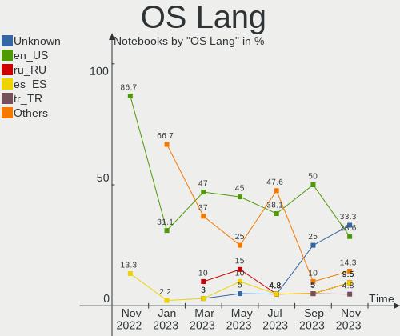
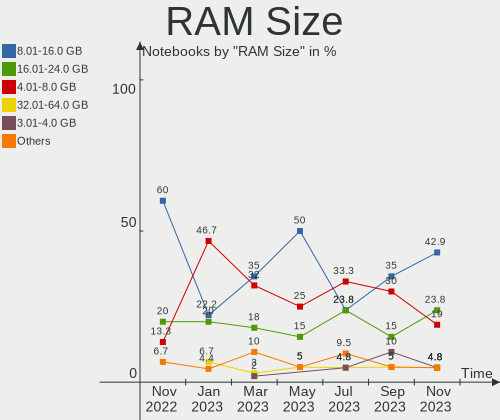
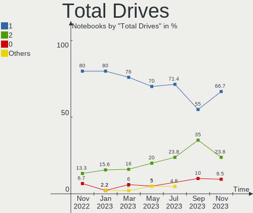
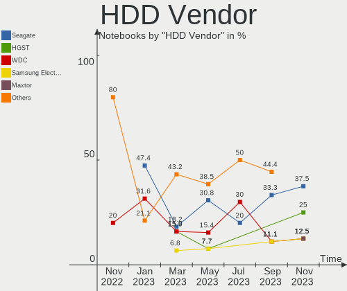
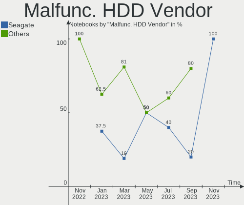
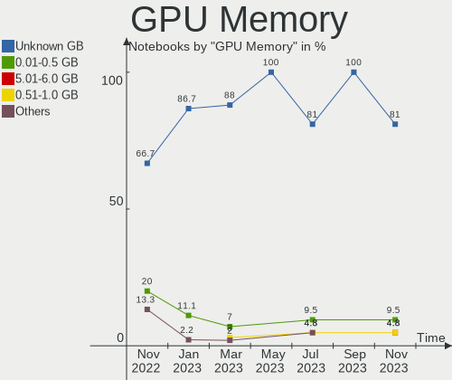

helloSystem Hardware Trends (Notebooks)
---------------------------------------

A project to identify most popular hardware characteristics and track their change
over time based on data collected by helloSystem users at https://BSD-Hardware.info.

Anyone can contribute to this report by the [hw-probe](https://github.com/linuxhw/hw-probe/blob/master/INSTALL.BSD.md) tool:

    hw-probe -all -upload

Full-feature report is available here: https://bsd-hardware.info/?view=trends&formfactor=notebook

Period: Oct, 2021.

Contents
--------

* [ System ](#system)
  - [ OS                       ](#os)
  - [ OS Family                ](#os-family)
  - [ Arch                     ](#arch)
  - [ DE                       ](#de)
  - [ Display Server           ](#display-server)
  - [ Display Manager          ](#display-manager)
  - [ OS Lang                  ](#os-lang)
  - [ Boot Mode                ](#boot-mode)
  - [ Filesystem               ](#filesystem)
  - [ Part. scheme             ](#part-scheme)

* [ Board ](#board)
  - [ Vendor                   ](#vendor)
  - [ Model                    ](#model)
  - [ Model Family             ](#model-family)
  - [ MFG Year                 ](#mfg-year)
  - [ Form Factor              ](#form-factor)
  - [ Coreboot                 ](#coreboot)
  - [ RAM Size                 ](#ram-size)
  - [ RAM Used                 ](#ram-used)
  - [ Total Drives             ](#total-drives)
  - [ Has CD-ROM               ](#has-cd-rom)
  - [ Has Ethernet             ](#has-ethernet)
  - [ Has WiFi                 ](#has-wifi)
  - [ Has Bluetooth            ](#has-bluetooth)

* [ Location ](#location)
  - [ Country                  ](#country)
  - [ City                     ](#city)

* [ Drives ](#drives)
  - [ Drive Vendor             ](#drive-vendor)
  - [ Drive Model              ](#drive-model)
  - [ HDD Vendor               ](#hdd-vendor)
  - [ SSD Vendor               ](#ssd-vendor)
  - [ Drive Kind               ](#drive-kind)
  - [ Drive Connector          ](#drive-connector)
  - [ Drive Size               ](#drive-size)
  - [ Space Total              ](#space-total)
  - [ Space Used               ](#space-used)
  - [ Malfunc. Drives          ](#malfunc-drives)
  - [ Malfunc. Drive Vendor    ](#malfunc-drive-vendor)
  - [ Malfunc. HDD Vendor      ](#malfunc-hdd-vendor)
  - [ Malfunc. Drive Kind      ](#malfunc-drive-kind)
  - [ Failed Drives            ](#failed-drives)
  - [ Failed Drive Vendor      ](#failed-drive-vendor)
  - [ Drive Status             ](#drive-status)

* [ Storage controller ](#storage-controller)
  - [ Storage Vendor           ](#storage-vendor)
  - [ Storage Model            ](#storage-model)
  - [ Storage Kind             ](#storage-kind)

* [ Processor ](#processor)
  - [ CPU Vendor               ](#cpu-vendor)
  - [ CPU Model                ](#cpu-model)
  - [ CPU Model Family         ](#cpu-model-family)
  - [ CPU Cores                ](#cpu-cores)
  - [ CPU Sockets              ](#cpu-sockets)
  - [ CPU Threads              ](#cpu-threads)
  - [ CPU Microarch            ](#cpu-microarch)

* [ Graphics ](#graphics)
  - [ GPU Vendor               ](#gpu-vendor)
  - [ GPU Model                ](#gpu-model)
  - [ GPU Combo                ](#gpu-combo)
  - [ GPU Driver               ](#gpu-driver)
  - [ GPU Memory               ](#gpu-memory)

* [ Monitor ](#monitor)
  - [ Monitor Vendor           ](#monitor-vendor)
  - [ Monitor Model            ](#monitor-model)
  - [ Monitor Resolution       ](#monitor-resolution)
  - [ Monitor Diagonal         ](#monitor-diagonal)
  - [ Monitor Width            ](#monitor-width)
  - [ Aspect Ratio             ](#aspect-ratio)
  - [ Monitor Area             ](#monitor-area)
  - [ Pixel Density            ](#pixel-density)
  - [ Multiple Monitors        ](#multiple-monitors)

* [ Network ](#network)
  - [ Net Controller Vendor    ](#net-controller-vendor)
  - [ Net Controller Model     ](#net-controller-model)
  - [ Wireless Vendor          ](#wireless-vendor)
  - [ Wireless Model           ](#wireless-model)
  - [ Ethernet Vendor          ](#ethernet-vendor)
  - [ Ethernet Model           ](#ethernet-model)
  - [ Net Controller Kind      ](#net-controller-kind)
  - [ Used Controller          ](#used-controller)
  - [ NICs                     ](#nics)
  - [ IPv6                     ](#ipv6)

* [ Bluetooth ](#bluetooth)
  - [ Bluetooth Vendor         ](#bluetooth-vendor)
  - [ Bluetooth Model          ](#bluetooth-model)

* [ Sound ](#sound)
  - [ Sound Vendor             ](#sound-vendor)
  - [ Sound Model              ](#sound-model)

* [ Memory ](#memory)
  - [ Memory Vendor            ](#memory-vendor)
  - [ Memory Model             ](#memory-model)
  - [ Memory Kind              ](#memory-kind)
  - [ Memory Form Factor       ](#memory-form-factor)
  - [ Memory Size              ](#memory-size)
  - [ Memory Speed             ](#memory-speed)

* [ Printers & scanners ](#printers--scanners)
  - [ Printer Vendor           ](#printer-vendor)
  - [ Printer Model            ](#printer-model)
  - [ Scanner Vendor           ](#scanner-vendor)
  - [ Scanner Model            ](#scanner-model)

* [ Camera ](#camera)
  - [ Camera Vendor            ](#camera-vendor)
  - [ Camera Model             ](#camera-model)

* [ Security ](#security)
  - [ Fingerprint Vendor       ](#fingerprint-vendor)
  - [ Fingerprint Model        ](#fingerprint-model)
  - [ Chipcard Vendor          ](#chipcard-vendor)
  - [ Chipcard Model           ](#chipcard-model)

* [ Unsupported ](#unsupported)
  - [ Unsupported Devices      ](#unsupported-devices)
  - [ Unsupported Device Types ](#unsupported-device-types)

System
------

OS
--

Installed operating systems

| Name              | Notebooks | Percent |
|-------------------|-----------|---------|
| helloSystem 0.6.0 | 25        | 71.43%  |
| helloSystem 0.5.0 | 9         | 25.71%  |
| helloSystem 0.7.0 | 1         | 2.86%   |

OS Family
---------

OS without a version

| Name        | Notebooks | Percent |
|-------------|-----------|---------|
| helloSystem | 35        | 100%    |

Arch
----

OS architecture (x86_64, i586, etc.)

| Name  | Notebooks | Percent |
|-------|-----------|---------|
| amd64 | 35        | 100%    |

DE
--

Desktop Environment

| Name         | Notebooks | Percent |
|--------------|-----------|---------|
| helloDesktop | 34        | 97.14%  |
| XFCE         | 1         | 2.86%   |

Display Server
--------------

X11 or Wayland

| Name | Notebooks | Percent |
|------|-----------|---------|
| X11  | 35        | 100%    |

Display Manager
---------------

SDDM, LightDM, etc.

| Name | Notebooks | Percent |
|------|-----------|---------|
| SLiM | 35        | 100%    |

OS Lang
-------

Language

| Lang    | Notebooks | Percent |
|---------|-----------|---------|
| en_US   | 34        | 97.14%  |
| Unknown | 1         | 2.86%   |

Boot Mode
---------

EFI or BIOS

| Mode | Notebooks | Percent |
|------|-----------|---------|
| EFI  | 27        | 77.14%  |
| BIOS | 8         | 22.86%  |

Filesystem
----------

Type of filesystem

| Type | Notebooks | Percent |
|------|-----------|---------|
| Zfs  | 35        | 100%    |

Part. scheme
------------

Scheme of partitioning

| Type | Notebooks | Percent |
|------|-----------|---------|
| GPT  | 35        | 100%    |

Board
-----

Vendor
------

Motherboard manufacturer

| Name             | Notebooks | Percent |
|------------------|-----------|---------|
| Lenovo           | 12        | 34.29%  |
| Hewlett-Packard  | 6         | 17.14%  |
| Dell             | 4         | 11.43%  |
| Toshiba          | 3         | 8.57%   |
| ASUSTek Computer | 3         | 8.57%   |
| Apple            | 2         | 5.71%   |
| Sony             | 1         | 2.86%   |
| MSI              | 1         | 2.86%   |
| Itautec          | 1         | 2.86%   |
| Chuwi            | 1         | 2.86%   |
| Acer             | 1         | 2.86%   |

Model
-----

Motherboard model

| Name                                       | Notebooks | Percent |
|--------------------------------------------|-----------|---------|
| Toshiba Satellite S55t-B                   | 1         | 2.86%   |
| Toshiba dynabook Satellite B453/L          | 1         | 2.86%   |
| Toshiba dynabook RX3 SM240E/3HD            | 1         | 2.86%   |
| Sony SVS1511AJB                            | 1         | 2.86%   |
| MSI MS-16F1                                | 1         | 2.86%   |
| Lenovo Yoga 3 Pro-1370 80HE                | 1         | 2.86%   |
| Lenovo ThinkPad X250 20CLS2A11K            | 1         | 2.86%   |
| Lenovo ThinkPad X230 Tablet 343522U        | 1         | 2.86%   |
| Lenovo ThinkPad X230 23254G7               | 1         | 2.86%   |
| Lenovo ThinkPad X1 Carbon Gen 9 20XWA003CD | 1         | 2.86%   |
| Lenovo ThinkPad X1 Carbon 2nd 20A70066UK   | 1         | 2.86%   |
| Lenovo ThinkPad T490s 20NYS3TU00           | 1         | 2.86%   |
| Lenovo ThinkPad T14s Gen 1 20T1S0Q200      | 1         | 2.86%   |
| Lenovo ThinkPad R500 2718W92               | 1         | 2.86%   |
| Lenovo ThinkPad L440 20ASS0FP00            | 1         | 2.86%   |
| Lenovo S20-30 Touch 20434                  | 1         | 2.86%   |
| Lenovo G500s 20245                         | 1         | 2.86%   |
| Itautec Infoway w7530                      | 1         | 2.86%   |
| HP ProBook 470 G4                          | 1         | 2.86%   |
| HP Presario CQ43                           | 1         | 2.86%   |
| HP Pavilion Gaming Laptop 15-ec2xxx        | 1         | 2.86%   |
| HP Pavilion dv3                            | 1         | 2.86%   |
| HP 15                                      | 1         | 2.86%   |
| Dell Studio 1747                           | 1         | 2.86%   |
| Dell Precision M4600                       | 1         | 2.86%   |
| Dell Latitude E4300                        | 1         | 2.86%   |
| Dell Inspiron 3521                         | 1         | 2.86%   |
| Chuwi MiniBook                             | 1         | 2.86%   |
| ASUS X441BA                                | 1         | 2.86%   |
| ASUS UX21A                                 | 1         | 2.86%   |
| ASUS U33Jc                                 | 1         | 2.86%   |
| Apple MacBookPro4,1                        | 1         | 2.86%   |
| Apple MacBookAir5,1                        | 1         | 2.86%   |
| Acer Aspire 5741                           | 1         | 2.86%   |
| Unknown                                    | 1         | 2.86%   |

Model Family
------------

Motherboard model prefix

| Name              | Notebooks | Percent |
|-------------------|-----------|---------|
| Lenovo ThinkPad   | 9         | 25.71%  |
| Toshiba dynabook  | 2         | 5.71%   |
| HP Pavilion       | 2         | 5.71%   |
| Toshiba Satellite | 1         | 2.86%   |
| Sony SVS1511AJB   | 1         | 2.86%   |
| MSI MS-16F1       | 1         | 2.86%   |
| Lenovo Yoga       | 1         | 2.86%   |
| Lenovo S20-30     | 1         | 2.86%   |
| Lenovo G500s      | 1         | 2.86%   |
| Itautec Infoway   | 1         | 2.86%   |
| HP ProBook        | 1         | 2.86%   |
| HP Presario       | 1         | 2.86%   |
| HP 15             | 1         | 2.86%   |
| Dell Studio       | 1         | 2.86%   |
| Dell Precision    | 1         | 2.86%   |
| Dell Latitude     | 1         | 2.86%   |
| Dell Inspiron     | 1         | 2.86%   |
| Chuwi MiniBook    | 1         | 2.86%   |
| ASUS X441BA       | 1         | 2.86%   |
| ASUS UX21A        | 1         | 2.86%   |
| ASUS U33Jc        | 1         | 2.86%   |
| Apple MacBookPro4 | 1         | 2.86%   |
| Apple MacBookAir5 | 1         | 2.86%   |
| Acer Aspire       | 1         | 2.86%   |
| Unknown           | 1         | 2.86%   |

MFG Year
--------

Motherboard manufacture year

| Year | Notebooks | Percent |
|------|-----------|---------|
| 2019 | 5         | 14.29%  |
| 2021 | 4         | 11.43%  |
| 2012 | 4         | 11.43%  |
| 2011 | 4         | 11.43%  |
| 2020 | 3         | 8.57%   |
| 2014 | 3         | 8.57%   |
| 2013 | 3         | 8.57%   |
| 2018 | 2         | 5.71%   |
| 2010 | 2         | 5.71%   |
| 2009 | 2         | 5.71%   |
| 2016 | 1         | 2.86%   |
| 2015 | 1         | 2.86%   |
| 2008 | 1         | 2.86%   |

Form Factor
-----------

Physical design of the computer

| Name     | Notebooks | Percent |
|----------|-----------|---------|
| Notebook | 35        | 100%    |

Coreboot
--------

Have coreboot on board

| Used | Notebooks | Percent |
|------|-----------|---------|
| No   | 35        | 100%    |

RAM Size
--------

Total RAM memory

| Size in GB | Notebooks | Percent |
|------------|-----------|---------|
| 4.01-8.0   | 16        | 45.71%  |
| 8.01-16.0  | 14        | 40%     |
| 16.01-24.0 | 5         | 14.29%  |

RAM Used
--------

Used RAM memory

| Used GB  | Notebooks | Percent |
|----------|-----------|---------|
| 0.01-0.5 | 25        | 71.43%  |
| 0.51-1.0 | 9         | 25.71%  |
| 1.01-2.0 | 1         | 2.86%   |

Total Drives
------------

Number of drives on board

| Drives | Notebooks | Percent |
|--------|-----------|---------|
| 1      | 30        | 85.71%  |
| 2      | 2         | 5.71%   |
| 0      | 2         | 5.71%   |
| 3      | 1         | 2.86%   |

Has CD-ROM
----------

Has CD-ROM on board

| Presented | Notebooks | Percent |
|-----------|-----------|---------|
| No        | 19        | 54.29%  |
| Yes       | 16        | 45.71%  |

Has Ethernet
------------

Has Ethernet on board

| Presented | Notebooks | Percent |
|-----------|-----------|---------|
| Yes       | 31        | 88.57%  |
| No        | 4         | 11.43%  |

Has WiFi
--------

Has WiFi module

| Presented | Notebooks | Percent |
|-----------|-----------|---------|
| Yes       | 33        | 94.29%  |
| No        | 2         | 5.71%   |

Has Bluetooth
-------------

Has Bluetooth module

| Presented | Notebooks | Percent |
|-----------|-----------|---------|
| Yes       | 19        | 54.29%  |
| No        | 16        | 45.71%  |

Location
--------

Country
-------

Geographic location (country)

| Country     | Notebooks | Percent |
|-------------|-----------|---------|
| USA         | 4         | 11.43%  |
| Ukraine     | 2         | 5.71%   |
| UK          | 2         | 5.71%   |
| Spain       | 2         | 5.71%   |
| Russia      | 2         | 5.71%   |
| New Zealand | 2         | 5.71%   |
| Japan       | 2         | 5.71%   |
| Germany     | 2         | 5.71%   |
| China       | 2         | 5.71%   |
| Brazil      | 2         | 5.71%   |
| Switzerland | 1         | 2.86%   |
| South Korea | 1         | 2.86%   |
| Poland      | 1         | 2.86%   |
| Peru        | 1         | 2.86%   |
| Mexico      | 1         | 2.86%   |
| Malta       | 1         | 2.86%   |
| Lithuania   | 1         | 2.86%   |
| Libya       | 1         | 2.86%   |
| Italy       | 1         | 2.86%   |
| Indonesia   | 1         | 2.86%   |
| Czechia     | 1         | 2.86%   |
| Chile       | 1         | 2.86%   |
| Canada      | 1         | 2.86%   |

City
----

Geographic location (city)

| City                    | Notebooks | Percent |
|-------------------------|-----------|---------|
| Barcelona               | 2         | 5.71%   |
| Yeongdong-gun           | 1         | 2.86%   |
| Wroclaw                 | 1         | 2.86%   |
| Wellington              | 1         | 2.86%   |
| Vilnius                 | 1         | 2.86%   |
| Tyumen                  | 1         | 2.86%   |
| Tripoli                 | 1         | 2.86%   |
| Taito                   | 1         | 2.86%   |
| Surabaya                | 1         | 2.86%   |
| St Petersburg           | 1         | 2.86%   |
| Seattle                 | 1         | 2.86%   |
| Santiago                | 1         | 2.86%   |
| Plattsburgh             | 1         | 2.86%   |
| Pilsen                  | 1         | 2.86%   |
| Odessa                  | 1         | 2.86%   |
| New Plymouth            | 1         | 2.86%   |
| Munich                  | 1         | 2.86%   |
| Monte Belo              | 1         | 2.86%   |
| Mission                 | 1         | 2.86%   |
| Macerata                | 1         | 2.86%   |
| Lima                    | 1         | 2.86%   |
| Langnau am Albis        | 1         | 2.86%   |
| La Paz                  | 1         | 2.86%   |
| Kyiv                    | 1         | 2.86%   |
| Hicksville              | 1         | 2.86%   |
| Guangzhou               | 1         | 2.86%   |
| Finchley                | 1         | 2.86%   |
| Dulles                  | 1         | 2.86%   |
| Detmold                 | 1         | 2.86%   |
| Chengdu                 | 1         | 2.86%   |
| Cabo de Santo Agostinho | 1         | 2.86%   |
| ??tsu                   | 1         | 2.86%   |
| Attard                  | 1         | 2.86%   |
| Ashton-under-Lyne       | 1         | 2.86%   |

Drives
------

Drive Vendor
------------

Hard drive vendors

| Vendor              | Notebooks | Drives | Percent |
|---------------------|-----------|--------|---------|
| Seagate             | 7         | 7      | 18.92%  |
| Crucial             | 5         | 5      | 13.51%  |
| WDC                 | 4         | 4      | 10.81%  |
| Samsung Electronics | 4         | 4      | 10.81%  |
| Kingston            | 4         | 5      | 10.81%  |
| Toshiba             | 2         | 2      | 5.41%   |
| Intel               | 2         | 2      | 5.41%   |
| SanDisk             | 1         | 1      | 2.7%    |
| PLEXTOR             | 1         | 1      | 2.7%    |
| Hitachi             | 1         | 1      | 2.7%    |
| HGST                | 1         | 1      | 2.7%    |
| Corsair             | 1         | 1      | 2.7%    |
| Apple               | 1         | 1      | 2.7%    |
| Apacer              | 1         | 1      | 2.7%    |
| AMD                 | 1         | 1      | 2.7%    |
| A-DATA Technology   | 1         | 1      | 2.7%    |

Drive Model
-----------

Hard drive models

| Model                               | Notebooks | Percent |
|-------------------------------------|-----------|---------|
| Toshiba MQ01ABF050 500GB            | 2         | 5.26%   |
| Seagate ST9500325AS 500GB           | 2         | 5.26%   |
| Crucial CT500MX500SSD1 500GB        | 2         | 5.26%   |
| WDC WDS120G1G0A-00SS50 120GB        | 1         | 2.63%   |
| WDC WD5000BEKT-60KA9T0 500GB        | 1         | 2.63%   |
| WDC WD3200BEVT-80A0RT0 320GB        | 1         | 2.63%   |
| WDC WD10SDZW-11UMGS0 1TB            | 1         | 2.63%   |
| Seagate ST9160412ASG 160GB          | 1         | 2.63%   |
| Seagate ST500LM021-1KJ152 500GB     | 1         | 2.63%   |
| Seagate ST500LM012 HN-M500MBB 500GB | 1         | 2.63%   |
| Seagate ST1000LM035-1RK172 1TB      | 1         | 2.63%   |
| Seagate ST1000LM024 HN-M101MBB 1TB  | 1         | 2.63%   |
| SanDisk SD5SE2256G1002E 256GB       | 1         | 2.63%   |
| Samsung SSD PM871b M.2 2280 128GB   | 1         | 2.63%   |
| Samsung MZVL21T0HCLR-00BL7 1TB      | 1         | 2.63%   |
| Samsung MZNTE256HMHP-000L2 256GB    | 1         | 2.63%   |
| Samsung MZ7TE128HMGR-000L1 128GB    | 1         | 2.63%   |
| PLEXTOR PX-128M5Pro 128GB           | 1         | 2.63%   |
| Kingston SVP200S37A60G 64GB         | 1         | 2.63%   |
| Kingston SMS200S360G 64GB           | 1         | 2.63%   |
| Kingston SKC300S37A240G 240GB       | 1         | 2.63%   |
| Kingston SA400S37120G 120GB         | 1         | 2.63%   |
| Kingston OM8SBP3512K-AH 512GB       | 1         | 2.63%   |
| Intel SSDSCKGF180A4L 180GB          | 1         | 2.63%   |
| Intel SSDPEKKF512G8L 512GB          | 1         | 2.63%   |
| Hitachi HTS541080G9SA00 80GB        | 1         | 2.63%   |
| HGST HTS541010A9E680 1TB            | 1         | 2.63%   |
| Crucial CT525MX300SSD1 528GB        | 1         | 2.63%   |
| Crucial CT480BX200SSD1 480GB        | 1         | 2.63%   |
| Crucial CT240BX500SSD1 240GB        | 1         | 2.63%   |
| Corsair Force 3 SSD 120GB           | 1         | 2.63%   |
| Apple SSD TS128E 121GB              | 1         | 2.63%   |
| Apacer AS681 240GB                  | 1         | 2.63%   |
| AMD R5SL120G 120GB                  | 1         | 2.63%   |
| A-DATA SU650 120GB                  | 1         | 2.63%   |

HDD Vendor
----------

Hard disk drive vendors

| Vendor  | Notebooks | Drives | Percent |
|---------|-----------|--------|---------|
| Seagate | 7         | 7      | 50%     |
| WDC     | 3         | 3      | 21.43%  |
| Toshiba | 2         | 2      | 14.29%  |
| Hitachi | 1         | 1      | 7.14%   |
| HGST    | 1         | 1      | 7.14%   |

SSD Vendor
----------

Solid state drive vendors

| Vendor              | Notebooks | Drives | Percent |
|---------------------|-----------|--------|---------|
| Crucial             | 5         | 5      | 25%     |
| Samsung Electronics | 3         | 3      | 15%     |
| Kingston            | 3         | 4      | 15%     |
| WDC                 | 1         | 1      | 5%      |
| SanDisk             | 1         | 1      | 5%      |
| PLEXTOR             | 1         | 1      | 5%      |
| Intel               | 1         | 1      | 5%      |
| Corsair             | 1         | 1      | 5%      |
| Apple               | 1         | 1      | 5%      |
| Apacer              | 1         | 1      | 5%      |
| AMD                 | 1         | 1      | 5%      |
| A-DATA Technology   | 1         | 1      | 5%      |

Drive Kind
----------

HDD or SSD

| Kind | Notebooks | Drives | Percent |
|------|-----------|--------|---------|
| SSD  | 19        | 21     | 52.78%  |
| HDD  | 14        | 14     | 38.89%  |
| NVMe | 3         | 3      | 8.33%   |

Drive Connector
---------------

SATA, SAS, NVMe, etc.

| Type | Notebooks | Drives | Percent |
|------|-----------|--------|---------|
| SATA | 31        | 35     | 91.18%  |
| NVMe | 3         | 3      | 8.82%   |

Drive Size
----------

Size of hard drive

| Size in TB | Notebooks | Drives | Percent |
|------------|-----------|--------|---------|
| 0.01-0.5   | 28        | 30     | 84.85%  |
| 0.51-1.0   | 5         | 5      | 15.15%  |

Space Total
-----------

Amount of disk space available on the file system

| Size in GB | Notebooks | Percent |
|------------|-----------|---------|
| 1-20       | 18        | 51.43%  |
| 251-500    | 7         | 20%     |
| 101-250    | 7         | 20%     |
| 501-1000   | 2         | 5.71%   |
| 51-100     | 1         | 2.86%   |

Space Used
----------

Amount of used disk space

| Used GB | Notebooks | Percent |
|---------|-----------|---------|
| 1-20    | 35        | 100%    |

Malfunc. Drives
---------------

Drive models with a malfunction

| Model                              | Notebooks | Drives | Percent |
|------------------------------------|-----------|--------|---------|
| WDC WD3200BEVT-80A0RT0 320GB       | 1         | 1      | 12.5%   |
| Toshiba MQ01ABF050 500GB           | 1         | 1      | 12.5%   |
| Seagate ST500LM021-1KJ152 500GB    | 1         | 1      | 12.5%   |
| Seagate ST1000LM035-1RK172 1TB     | 1         | 1      | 12.5%   |
| Seagate ST1000LM024 HN-M101MBB 1TB | 1         | 1      | 12.5%   |
| Hitachi HTS541080G9SA00 80GB       | 1         | 1      | 12.5%   |
| HGST HTS541010A9E680 1TB           | 1         | 1      | 12.5%   |
| Crucial CT525MX300SSD1 528GB       | 1         | 1      | 12.5%   |

Malfunc. Drive Vendor
---------------------

Vendors of faulty drives

| Vendor  | Notebooks | Drives | Percent |
|---------|-----------|--------|---------|
| Seagate | 3         | 3      | 37.5%   |
| WDC     | 1         | 1      | 12.5%   |
| Toshiba | 1         | 1      | 12.5%   |
| Hitachi | 1         | 1      | 12.5%   |
| HGST    | 1         | 1      | 12.5%   |
| Crucial | 1         | 1      | 12.5%   |

Malfunc. HDD Vendor
-------------------

Vendors of faulty HDD drives

| Vendor  | Notebooks | Drives | Percent |
|---------|-----------|--------|---------|
| Seagate | 3         | 3      | 42.86%  |
| WDC     | 1         | 1      | 14.29%  |
| Toshiba | 1         | 1      | 14.29%  |
| Hitachi | 1         | 1      | 14.29%  |
| HGST    | 1         | 1      | 14.29%  |

Malfunc. Drive Kind
-------------------

Kinds of faulty drives

| Kind | Notebooks | Drives | Percent |
|------|-----------|--------|---------|
| HDD  | 7         | 7      | 87.5%   |
| SSD  | 1         | 1      | 12.5%   |

Failed Drives
-------------

Failed drive models

Zero info for selected period =(

Failed Drive Vendor
-------------------

Failed drive vendors

Zero info for selected period =(

Drive Status
------------

Number of failed and malfunc. drives

| Status  | Notebooks | Drives | Percent |
|---------|-----------|--------|---------|
| Works   | 26        | 30     | 76.47%  |
| Malfunc | 8         | 8      | 23.53%  |

Storage controller
------------------

Storage Vendor
--------------

Storage controller vendors

| Vendor                      | Notebooks | Percent |
|-----------------------------|-----------|---------|
| Intel                       | 32        | 88.89%  |
| AMD                         | 2         | 5.56%   |
| Samsung Electronics         | 1         | 2.78%   |
| Kingston Technology Company | 1         | 2.78%   |

Storage Model
-------------

Storage controller models

| Model                                                                         | Notebooks | Percent |
|-------------------------------------------------------------------------------|-----------|---------|
| Intel 7 Series Chipset Family 6-port SATA Controller [AHCI mode]              | 9         | 23.68%  |
| Intel Wildcat Point-LP SATA Controller [AHCI Mode]                            | 3         | 7.89%   |
| Intel 82801 Mobile SATA Controller [RAID mode]                                | 3         | 7.89%   |
| Intel 5 Series/3400 Series Chipset 4 port SATA AHCI Controller                | 3         | 7.89%   |
| Intel Sunrise Point-LP SATA Controller [AHCI mode]                            | 2         | 5.26%   |
| Intel 82801IBM/IEM (ICH9M/ICH9M-E) 4 port SATA Controller [AHCI mode]         | 2         | 5.26%   |
| Intel 8 Series SATA Controller 1 [AHCI mode]                                  | 2         | 5.26%   |
| Intel 5 Series/3400 Series Chipset 6 port SATA AHCI Controller                | 2         | 5.26%   |
| AMD FCH SATA Controller [AHCI mode]                                           | 2         | 5.26%   |
| Samsung NVMe SSD Controller PM9A1/PM9A3/980PRO                                | 1         | 2.63%   |
| Intel SSD Pro 7600p/760p/E 6100p Series                                       | 1         | 2.63%   |
| Intel Comet Lake SATA AHCI Controller                                         | 1         | 2.63%   |
| Intel Atom Processor E3800 Series SATA AHCI Controller                        | 1         | 2.63%   |
| Intel 82801HM/HEM (ICH8M/ICH8M-E) SATA Controller [AHCI mode]                 | 1         | 2.63%   |
| Intel 82801HM/HEM (ICH8M/ICH8M-E) IDE Controller                              | 1         | 2.63%   |
| Intel 8 Series/C220 Series Chipset Family 2-port SATA Controller 2 [IDE mode] | 1         | 2.63%   |
| Intel 8 Series Chipset Family 4-port SATA Controller 1 [IDE mode] - Mobile    | 1         | 2.63%   |
| Intel 6 Series/C200 Series Chipset Family 6 port Mobile SATA AHCI Controller  | 1         | 2.63%   |
| Unknown                                                                       | 1         | 2.63%   |

Storage Kind
------------

Kind of storage controller (IDE, SATA, NVMe, SAS, ...)

| Kind | Notebooks | Percent |
|------|-----------|---------|
| SATA | 29        | 78.38%  |
| RAID | 3         | 8.11%   |
| NVMe | 3         | 8.11%   |
| IDE  | 2         | 5.41%   |

Processor
---------

CPU Vendor
----------

Processor vendors

| Vendor | Notebooks | Percent |
|--------|-----------|---------|
| Intel  | 33        | 94.29%  |
| AMD    | 2         | 5.71%   |

CPU Model
---------

Processor models

| Model                                        | Notebooks | Percent |
|----------------------------------------------|-----------|---------|
| Intel Core i5-3320M CPU @ 2.60GHz            | 2         | 5.71%   |
| Intel Processor 5Y70 CPU @ 1.10GHz           | 1         | 2.86%   |
| Intel Pentium CPU N3530 @ 2.16GHz            | 1         | 2.86%   |
| Intel CPU Version                            | 1         | 2.86%   |
| Intel Core m3-8100Y CPU @ 1.10GHz            | 1         | 2.86%   |
| Intel Core i7-8665U CPU @ 1.90GHz            | 1         | 2.86%   |
| Intel Core i7-7500U CPU @ 2.70GHz            | 1         | 2.86%   |
| Intel Core i7-3632QM CPU @ 2.20GHz           | 1         | 2.86%   |
| Intel Core i7-3520M CPU @ 2.90GHz            | 1         | 2.86%   |
| Intel Core i7-3517U CPU @ 1.90GHz            | 1         | 2.86%   |
| Intel Core i7-2640M CPU @ 2.80GH             | 1         | 2.86%   |
| Intel Core i7-10610U CPU @ 1.80GHz           | 1         | 2.86%   |
| Intel Core i5-5300U CPU @ 2.30GHz            | 1         | 2.86%   |
| Intel Core i5-5200U CPU @ 2.20GHz            | 1         | 2.86%   |
| Intel Core i5-4300U CPU @ 1.90GHz            | 1         | 2.86%   |
| Intel Core i5-4300M CPU @ 2.60GHz            | 1         | 2.86%   |
| Intel Core i5-4210U CPU @ 1.70GHz            | 1         | 2.86%   |
| Intel Core i5-3317U CPU @ 1.70GHz            | 1         | 2.86%   |
| Intel Core i5 CPU M 520 @ 2.40GHz            | 1         | 2.86%   |
| Intel Core i5 CPU M 460 @ 2.53GHz            | 1         | 2.86%   |
| Intel Core i3-3227U CPU @ 1.90GHz            | 1         | 2.86%   |
| Intel Core i3-3110M CPU @ 2.40GHz            | 1         | 2.86%   |
| Intel Core i3 CPU M 370 @ 2.40GH             | 1         | 2.86%   |
| Intel Core i3 CPU M 330 @ 2.13GHz            | 1         | 2.86%   |
| Intel Core 2 Duo CPU T8300 @ 2.40GHz         | 1         | 2.86%   |
| Intel Core 2 Duo CPU T6500 @ 2.10GHz         | 1         | 2.86%   |
| Intel Core 2 Duo CPU P8600 @ 2.40GHz         | 1         | 2.86%   |
| Intel Core 2 Duo                             | 1         | 2.86%   |
| Intel Celeron CPU B815 @ 1.60GHz             | 1         | 2.86%   |
| Intel Celeron CPU 847 @ 1.10GHz              | 1         | 2.86%   |
| Intel Celeron CPU 1005M @ 1.90GHz            | 1         | 2.86%   |
| Intel 11th Gen Core i7-1165G7 @ 2.80GHz      | 1         | 2.86%   |
| AMD Ryzen 5 5600H with Radeon Graphics       | 1         | 2.86%   |
| AMD A6-9220 RADEON R4, 5 COMPUTE CORES 2C+3G | 1         | 2.86%   |

CPU Model Family
----------------

Processor model prefix

| Model            | Notebooks | Percent |
|------------------|-----------|---------|
| Intel Core i5    | 10        | 28.57%  |
| Intel Core i7    | 7         | 20%     |
| Intel Core i3    | 4         | 11.43%  |
| Intel Core 2 Duo | 4         | 11.43%  |
| Other            | 3         | 8.57%   |
| Intel Celeron    | 3         | 8.57%   |
| Intel Pentium    | 1         | 2.86%   |
| Intel Core m3    | 1         | 2.86%   |
| AMD Ryzen 5      | 1         | 2.86%   |
| AMD A6           | 1         | 2.86%   |

CPU Cores
---------

Number of processor cores

| Number  | Notebooks | Percent |
|---------|-----------|---------|
| 2       | 25        | 71.43%  |
| 4       | 6         | 17.14%  |
| Unknown | 3         | 8.57%   |
| 12      | 1         | 2.86%   |

CPU Sockets
-----------

Number of sockets

| Number | Notebooks | Percent |
|--------|-----------|---------|
| 1      | 34        | 97.14%  |
| 2      | 1         | 2.86%   |

CPU Threads
-----------

Threads per core (Hyper-Threading)

| Number  | Notebooks | Percent |
|---------|-----------|---------|
| 2       | 25        | 71.43%  |
| 1       | 7         | 20%     |
| Unknown | 3         | 8.57%   |

CPU Microarch
-------------

Microarchitecture

| Name        | Notebooks | Percent |
|-------------|-----------|---------|
| IvyBridge   | 9         | 25.71%  |
| Westmere    | 4         | 11.43%  |
| Penryn      | 4         | 11.43%  |
| KabyLake    | 4         | 11.43%  |
| SandyBridge | 3         | 8.57%   |
| Haswell     | 3         | 8.57%   |
| Broadwell   | 3         | 8.57%   |
| Zen 3       | 1         | 2.86%   |
| TigerLake   | 1         | 2.86%   |
| Silvermont  | 1         | 2.86%   |
| Nehalem     | 1         | 2.86%   |
| Excavator   | 1         | 2.86%   |

Graphics
--------

GPU Vendor
----------

Vendors of graphics cards

| Vendor | Notebooks | Percent |
|--------|-----------|---------|
| Intel  | 28        | 71.79%  |
| Nvidia | 8         | 20.51%  |
| AMD    | 3         | 7.69%   |

GPU Model
---------

Graphics card models

| Model                                                                     | Notebooks | Percent |
|---------------------------------------------------------------------------|-----------|---------|
| Intel 3rd Gen Core processor Graphics Controller                          | 9         | 23.08%  |
| Intel Mobile 4 Series Chipset Integrated Graphics Controller              | 3         | 7.69%   |
| Intel HD Graphics 5500                                                    | 2         | 5.13%   |
| Intel Haswell-ULT Integrated Graphics Controller                          | 2         | 5.13%   |
| Intel Core Processor Integrated Graphics Controller                       | 2         | 5.13%   |
| Intel 2nd Generation Core Processor Family Integrated Graphics Controller | 2         | 5.13%   |
| Nvidia TU117M                                                             | 1         | 2.56%   |
| Nvidia GT218M [GeForce 310M]                                              | 1         | 2.56%   |
| Nvidia GM108M [GeForce 930MX]                                             | 1         | 2.56%   |
| Nvidia GK107M [GeForce GT 640M LE]                                        | 1         | 2.56%   |
| Nvidia GF117M [GeForce 610M/710M/810M/820M / GT 620M/625M/630M/720M]      | 1         | 2.56%   |
| Nvidia GF108GLM [Quadro 1000M]                                            | 1         | 2.56%   |
| Nvidia GF106M [GeForce GTX 460M]                                          | 1         | 2.56%   |
| Nvidia G84M [GeForce 8600M GT]                                            | 1         | 2.56%   |
| Intel WhiskeyLake-U GT2 [UHD Graphics 620]                                | 1         | 2.56%   |
| Intel UHD Graphics 615                                                    | 1         | 2.56%   |
| Intel TigerLake-LP GT2 [Iris Xe Graphics]                                 | 1         | 2.56%   |
| Intel HD Graphics 620                                                     | 1         | 2.56%   |
| Intel HD Graphics 5300                                                    | 1         | 2.56%   |
| Intel CometLake-U GT2 [UHD Graphics]                                      | 1         | 2.56%   |
| Intel Atom Processor Z36xxx/Z37xxx Series Graphics & Display              | 1         | 2.56%   |
| Intel 4th Gen Core Processor Integrated Graphics Controller               | 1         | 2.56%   |
| AMD Stoney [Radeon R2/R3/R4/R5 Graphics]                                  | 1         | 2.56%   |
| AMD RV730/M96 [Mobility Radeon HD 4650/5165]                              | 1         | 2.56%   |
| AMD Cezanne                                                               | 1         | 2.56%   |

GPU Combo
---------

Combinations of graphics cards

| Name           | Notebooks | Percent |
|----------------|-----------|---------|
| 1 x Intel      | 22        | 62.86%  |
| 1 x Nvidia     | 4         | 11.43%  |
| 2 x Intel      | 3         | 8.57%   |
| Intel + Nvidia | 3         | 8.57%   |
| 1 x AMD        | 2         | 5.71%   |
| AMD + Nvidia   | 1         | 2.86%   |

GPU Driver
----------

Free vs proprietary

| Driver      | Notebooks | Percent |
|-------------|-----------|---------|
| Free        | 27        | 77.14%  |
| Unknown     | 7         | 20%     |
| Proprietary | 1         | 2.86%   |

GPU Memory
----------

Total video memory

| Size in GB | Notebooks | Percent |
|------------|-----------|---------|
| Unknown    | 33        | 94.29%  |
| 0.51-1.0   | 1         | 2.86%   |
| 0.01-0.5   | 1         | 2.86%   |

Monitor
-------

Monitor Vendor
--------------

Monitor vendors

| Vendor                  | Notebooks | Percent |
|-------------------------|-----------|---------|
| LG Display              | 8         | 33.33%  |
| AU Optronics            | 6         | 25%     |
| Chimei Innolux          | 4         | 16.67%  |
| Samsung Electronics     | 3         | 12.5%   |
| Lenovo                  | 1         | 4.17%   |
| Chi Mei Optoelectronics | 1         | 4.17%   |
| Apple                   | 1         | 4.17%   |

Monitor Model
-------------

Monitor models

| Model                                                                    | Notebooks | Percent |
|--------------------------------------------------------------------------|-----------|---------|
| Samsung Electronics LCD Monitor SEC5742 1366x768 310x170mm 13.9-inch     | 1         | 4.17%   |
| Samsung Electronics LCD Monitor SEC414C 1366x768 310x170mm 13.9-inch     | 1         | 4.17%   |
| Samsung Electronics LCD Monitor SDC434A 3200x1800 290x170mm 13.2-inch    | 1         | 4.17%   |
| LG Display LCD Monitor LGD11F9 1280x800 290x180mm 13.4-inch              | 1         | 4.17%   |
| LG Display LCD Monitor LGD0470 1920x1080 350x190mm 15.7-inch             | 1         | 4.17%   |
| LG Display LCD Monitor LGD0419 2560x1440 310x170mm 13.9-inch             | 1         | 4.17%   |
| LG Display LCD Monitor LGD03ED 1366x768 280x160mm 12.7-inch              | 1         | 4.17%   |
| LG Display LCD Monitor LGD03AB 1366x768 340x190mm 15.3-inch              | 1         | 4.17%   |
| LG Display LCD Monitor LGD0323 1920x1080 350x190mm 15.7-inch             | 1         | 4.17%   |
| LG Display LCD Monitor LGD02D8 1366x768 280x160mm 12.7-inch              | 1         | 4.17%   |
| LG Display LCD Monitor LGD021D 1600x900 380x210mm 17.1-inch              | 1         | 4.17%   |
| Lenovo LCD Monitor LEN4050 1280x800 330x210mm 15.4-inch                  | 1         | 4.17%   |
| Chimei Innolux LCD Monitor CMN15AB 1366x768 340x190mm 15.3-inch          | 1         | 4.17%   |
| Chimei Innolux LCD Monitor CMN14F2 1920x1080 310x170mm 13.9-inch         | 1         | 4.17%   |
| Chimei Innolux LCD Monitor CMN1492 1366x768 310x170mm 13.9-inch          | 1         | 4.17%   |
| Chimei Innolux LCD Monitor CMN1124 1920x1080 260x140mm 11.6-inch         | 1         | 4.17%   |
| Chi Mei Optoelectronics LCD Monitor CMO1318 1366x768 290x160mm 13.0-inch | 1         | 4.17%   |
| AU Optronics LCD Monitor AUO46EC 1366x768 340x190mm 15.3-inch            | 1         | 4.17%   |
| AU Optronics LCD Monitor AUO45EC 1366x768 340x190mm 15.3-inch            | 1         | 4.17%   |
| AU Optronics LCD Monitor AUO315C 1366x768 260x140mm 11.6-inch            | 1         | 4.17%   |
| AU Optronics LCD Monitor AUO22EC 1366x768 340x190mm 15.3-inch            | 1         | 4.17%   |
| AU Optronics LCD Monitor AUO219E 1600x900 380x210mm 17.1-inch            | 1         | 4.17%   |
| AU Optronics LCD Monitor AUO106C 1366x768 280x160mm 12.7-inch            | 1         | 4.17%   |
| Apple Color LCD APP9CF3 1366x768 260x140mm 11.6-inch                     | 1         | 4.17%   |

Monitor Resolution
------------------

Monitor screen resolution

| Resolution       | Notebooks | Percent |
|------------------|-----------|---------|
| 1366x768 (WXGA)  | 14        | 58.33%  |
| 1920x1080 (FHD)  | 4         | 16.67%  |
| 1600x900 (HD+)   | 2         | 8.33%   |
| 1280x800 (WXGA)  | 2         | 8.33%   |
| 3200x1800 (QHD+) | 1         | 4.17%   |
| 2560x1440 (QHD)  | 1         | 4.17%   |

Monitor Diagonal
----------------

Diagonal size in inches

| Inches | Notebooks | Percent |
|--------|-----------|---------|
| 15     | 8         | 33.33%  |
| 13     | 8         | 33.33%  |
| 12     | 3         | 12.5%   |
| 11     | 3         | 12.5%   |
| 17     | 2         | 8.33%   |

Monitor Width
-------------

Physical width

| Width in mm | Notebooks | Percent |
|-------------|-----------|---------|
| 301-350     | 13        | 54.17%  |
| 201-300     | 9         | 37.5%   |
| 351-400     | 2         | 8.33%   |

Aspect Ratio
------------

Proportional relationship between the width and the height

| Ratio | Notebooks | Percent |
|-------|-----------|---------|
| 16/9  | 22        | 91.67%  |
| 16/10 | 2         | 8.33%   |

Monitor Area
------------

Area in inch²

| Area in inch² | Notebooks | Percent |
|----------------|-----------|---------|
| 81-90          | 6         | 25%     |
| 101-110        | 4         | 16.67%  |
| 91-100         | 4         | 16.67%  |
| 61-70          | 3         | 12.5%   |
| 51-60          | 3         | 12.5%   |
| 71-80          | 2         | 8.33%   |
| 121-130        | 2         | 8.33%   |

Pixel Density
-------------

Pixels per inch

| Density       | Notebooks | Percent |
|---------------|-----------|---------|
| 101-120       | 10        | 41.67%  |
| 121-160       | 9         | 37.5%   |
| 161-240       | 2         | 8.33%   |
| 51-100        | 2         | 8.33%   |
| More than 240 | 1         | 4.17%   |

Multiple Monitors
-----------------

Total monitors connected

| Total | Notebooks | Percent |
|-------|-----------|---------|
| 1     | 26        | 74.29%  |
| 0     | 9         | 25.71%  |

Network
-------

Net Controller Vendor
---------------------

Controller vendors

| Vendor                            | Notebooks | Percent |
|-----------------------------------|-----------|---------|
| Intel                             | 21        | 38.89%  |
| Realtek Semiconductor             | 15        | 27.78%  |
| Broadcom                          | 6         | 11.11%  |
| Qualcomm Atheros                  | 5         | 9.26%   |
| Sierra Wireless                   | 1         | 1.85%   |
| Ralink                            | 1         | 1.85%   |
| NetGear                           | 1         | 1.85%   |
| Marvell Technology Group          | 1         | 1.85%   |
| Huawei Technologies               | 1         | 1.85%   |
| Google                            | 1         | 1.85%   |
| Ericsson Business Mobile Networks | 1         | 1.85%   |

Net Controller Model
--------------------

Controller models

| Model                                                                       | Notebooks | Percent |
|-----------------------------------------------------------------------------|-----------|---------|
| Realtek RTL8111/8168/8411 PCI Express Gigabit Ethernet Controller           | 7         | 9.86%   |
| Realtek RTL810xE PCI Express Fast Ethernet controller                       | 7         | 9.86%   |
| Intel Wireless 7265                                                         | 4         | 5.63%   |
| Intel 82579LM Gigabit Network Connection (Lewisville)                       | 3         | 4.23%   |
| Realtek RTL8188CE 802.11b/g/n WiFi Adapter                                  | 2         | 2.82%   |
| Intel Wireless 7260                                                         | 2         | 2.82%   |
| Intel Centrino Advanced-N 6205 [Taylor Peak]                                | 2         | 2.82%   |
| Sierra Wireless Sierra Wireless EM7345 4G LTE                               | 1         | 1.41%   |
| Realtek RTL8852AE 802.11ax PCIe Wireless Network Adapter                    | 1         | 1.41%   |
| Realtek RTL8821CE 802.11ac PCIe Wireless Network Adapter                    | 1         | 1.41%   |
| Realtek RTL8723BE PCIe Wireless Network Adapter                             | 1         | 1.41%   |
| Realtek RTL8188EUS 802.11n Wireless Network Adapter                         | 1         | 1.41%   |
| Realtek RTL8188EE Wireless Network Adapter                                  | 1         | 1.41%   |
| Ralink RT3290 Wireless 802.11n 1T/1R PCIe                                   | 1         | 1.41%   |
| Qualcomm Atheros QCA9565 / AR9565 Wireless Network Adapter                  | 1         | 1.41%   |
| Qualcomm Atheros QCA8172 Fast Ethernet                                      | 1         | 1.41%   |
| Qualcomm Atheros AR9485 Wireless Network Adapter                            | 1         | 1.41%   |
| Qualcomm Atheros AR928X Wireless Network Adapter (PCI-Express)              | 1         | 1.41%   |
| Qualcomm Atheros AR8131 Gigabit Ethernet                                    | 1         | 1.41%   |
| NetGear A6100 AC600 DB Wireless Adapter [Realtek RTL8811AU]                 | 1         | 1.41%   |
| Marvell Group 88E8058 PCI-E Gigabit Ethernet Controller                     | 1         | 1.41%   |
| Intel Wireless 3160                                                         | 1         | 1.41%   |
| Intel WiFi Link 5100                                                        | 1         | 1.41%   |
| Intel Wi-Fi 6 AX201                                                         | 1         | 1.41%   |
| Intel PRO/Wireless 5100 AGN [Shiloh] Network Connection                     | 1         | 1.41%   |
| Intel Ethernet Connection I218-LM                                           | 1         | 1.41%   |
| Intel Ethernet Connection I217-LM                                           | 1         | 1.41%   |
| Intel Ethernet Connection (6) I219-LM                                       | 1         | 1.41%   |
| Intel Ethernet Connection (3) I218-LM                                       | 1         | 1.41%   |
| Intel Ethernet Connection (10) I219-LM                                      | 1         | 1.41%   |
| Intel Comet Lake PCH-LP CNVi WiFi                                           | 1         | 1.41%   |
| Intel Centrino Wireless-N 6150                                              | 1         | 1.41%   |
| Intel Centrino Wireless-N 135                                               | 1         | 1.41%   |
| Intel Centrino Wireless-N 1000 [Condor Peak]                                | 1         | 1.41%   |
| Intel Centrino WiMAX 6150                                                   | 1         | 1.41%   |
| Intel Centrino Ultimate-N 6300                                              | 1         | 1.41%   |
| Intel Centrino Advanced-N 6235                                              | 1         | 1.41%   |
| Intel Cannon Point-LP CNVi [Wireless-AC]                                    | 1         | 1.41%   |
| Intel 82579V Gigabit Network Connection                                     | 1         | 1.41%   |
| Intel 82577LC Gigabit Network Connection                                    | 1         | 1.41%   |
| Intel 82567LM Gigabit Network Connection                                    | 1         | 1.41%   |
| Huawei USB Composite Device                                                 | 1         | 1.41%   |
| Google Nexus/Pixel Device (tether)                                          | 1         | 1.41%   |
| Ericsson Business Mobile Networks N5321 gw Mobile Broadband Serial Port III | 1         | 1.41%   |
| Broadcom NetLink BCM5787M Gigabit Ethernet PCI Express                      | 1         | 1.41%   |
| Broadcom NetLink BCM57780 Gigabit Ethernet PCIe                             | 1         | 1.41%   |
| Broadcom BCM43225 802.11b/g/n                                               | 1         | 1.41%   |
| Broadcom BCM43224 802.11a/b/g/n                                             | 1         | 1.41%   |
| Broadcom BCM4322 802.11a/b/g/n Wireless LAN Controller                      | 1         | 1.41%   |
| Broadcom BCM4321 802.11a/b/g/n                                              | 1         | 1.41%   |
| Broadcom BCM43142 802.11b/g/n                                               | 1         | 1.41%   |

Wireless Vendor
---------------

Wireless vendors

| Vendor                | Notebooks | Percent |
|-----------------------|-----------|---------|
| Intel                 | 19        | 52.78%  |
| Realtek Semiconductor | 6         | 16.67%  |
| Broadcom              | 5         | 13.89%  |
| Qualcomm Atheros      | 3         | 8.33%   |
| Sierra Wireless       | 1         | 2.78%   |
| Ralink                | 1         | 2.78%   |
| NetGear               | 1         | 2.78%   |

Wireless Model
--------------

Wireless models

| Model                                                          | Notebooks | Percent |
|----------------------------------------------------------------|-----------|---------|
| Intel Wireless 7265                                            | 4         | 10.53%  |
| Realtek RTL8188CE 802.11b/g/n WiFi Adapter                     | 2         | 5.26%   |
| Intel Wireless 7260                                            | 2         | 5.26%   |
| Intel Centrino Advanced-N 6205 [Taylor Peak]                   | 2         | 5.26%   |
| Sierra Wireless Sierra Wireless EM7345 4G LTE                  | 1         | 2.63%   |
| Realtek RTL8852AE 802.11ax PCIe Wireless Network Adapter       | 1         | 2.63%   |
| Realtek RTL8821CE 802.11ac PCIe Wireless Network Adapter       | 1         | 2.63%   |
| Realtek RTL8723BE PCIe Wireless Network Adapter                | 1         | 2.63%   |
| Realtek RTL8188EUS 802.11n Wireless Network Adapter            | 1         | 2.63%   |
| Realtek RTL8188EE Wireless Network Adapter                     | 1         | 2.63%   |
| Ralink RT3290 Wireless 802.11n 1T/1R PCIe                      | 1         | 2.63%   |
| Qualcomm Atheros QCA9565 / AR9565 Wireless Network Adapter     | 1         | 2.63%   |
| Qualcomm Atheros AR9485 Wireless Network Adapter               | 1         | 2.63%   |
| Qualcomm Atheros AR928X Wireless Network Adapter (PCI-Express) | 1         | 2.63%   |
| NetGear A6100 AC600 DB Wireless Adapter [Realtek RTL8811AU]    | 1         | 2.63%   |
| Intel Wireless 3160                                            | 1         | 2.63%   |
| Intel WiFi Link 5100                                           | 1         | 2.63%   |
| Intel Wi-Fi 6 AX201                                            | 1         | 2.63%   |
| Intel PRO/Wireless 5100 AGN [Shiloh] Network Connection        | 1         | 2.63%   |
| Intel Comet Lake PCH-LP CNVi WiFi                              | 1         | 2.63%   |
| Intel Centrino Wireless-N 6150                                 | 1         | 2.63%   |
| Intel Centrino Wireless-N 135                                  | 1         | 2.63%   |
| Intel Centrino Wireless-N 1000 [Condor Peak]                   | 1         | 2.63%   |
| Intel Centrino WiMAX 6150                                      | 1         | 2.63%   |
| Intel Centrino Ultimate-N 6300                                 | 1         | 2.63%   |
| Intel Centrino Advanced-N 6235                                 | 1         | 2.63%   |
| Intel Cannon Point-LP CNVi [Wireless-AC]                       | 1         | 2.63%   |
| Broadcom BCM43225 802.11b/g/n                                  | 1         | 2.63%   |
| Broadcom BCM43224 802.11a/b/g/n                                | 1         | 2.63%   |
| Broadcom BCM4322 802.11a/b/g/n Wireless LAN Controller         | 1         | 2.63%   |
| Broadcom BCM4321 802.11a/b/g/n                                 | 1         | 2.63%   |
| Broadcom BCM43142 802.11b/g/n                                  | 1         | 2.63%   |

Ethernet Vendor
---------------

Ethernet vendors

| Vendor                   | Notebooks | Percent |
|--------------------------|-----------|---------|
| Realtek Semiconductor    | 14        | 43.75%  |
| Intel                    | 11        | 34.38%  |
| Qualcomm Atheros         | 2         | 6.25%   |
| Broadcom                 | 2         | 6.25%   |
| Marvell Technology Group | 1         | 3.13%   |
| Huawei Technologies      | 1         | 3.13%   |
| Google                   | 1         | 3.13%   |

Ethernet Model
--------------

Ethernet models

| Model                                                             | Notebooks | Percent |
|-------------------------------------------------------------------|-----------|---------|
| Realtek RTL8111/8168/8411 PCI Express Gigabit Ethernet Controller | 7         | 21.88%  |
| Realtek RTL810xE PCI Express Fast Ethernet controller             | 7         | 21.88%  |
| Intel 82579LM Gigabit Network Connection (Lewisville)             | 3         | 9.38%   |
| Qualcomm Atheros QCA8172 Fast Ethernet                            | 1         | 3.13%   |
| Qualcomm Atheros AR8131 Gigabit Ethernet                          | 1         | 3.13%   |
| Marvell Group 88E8058 PCI-E Gigabit Ethernet Controller           | 1         | 3.13%   |
| Intel Ethernet Connection I218-LM                                 | 1         | 3.13%   |
| Intel Ethernet Connection I217-LM                                 | 1         | 3.13%   |
| Intel Ethernet Connection (6) I219-LM                             | 1         | 3.13%   |
| Intel Ethernet Connection (3) I218-LM                             | 1         | 3.13%   |
| Intel Ethernet Connection (10) I219-LM                            | 1         | 3.13%   |
| Intel 82579V Gigabit Network Connection                           | 1         | 3.13%   |
| Intel 82577LC Gigabit Network Connection                          | 1         | 3.13%   |
| Intel 82567LM Gigabit Network Connection                          | 1         | 3.13%   |
| Huawei USB Composite Device                                       | 1         | 3.13%   |
| Google Nexus/Pixel Device (tether)                                | 1         | 3.13%   |
| Broadcom NetLink BCM5787M Gigabit Ethernet PCI Express            | 1         | 3.13%   |
| Broadcom NetLink BCM57780 Gigabit Ethernet PCIe                   | 1         | 3.13%   |

Net Controller Kind
-------------------

Ethernet, WiFi or modem

| Kind     | Notebooks | Percent |
|----------|-----------|---------|
| WiFi     | 33        | 50.77%  |
| Ethernet | 31        | 47.69%  |
| Modem    | 1         | 1.54%   |

Used Controller
---------------

Currently used network controller

| Kind     | Notebooks | Percent |
|----------|-----------|---------|
| Ethernet | 29        | 50.88%  |
| WiFi     | 27        | 47.37%  |
| Modem    | 1         | 1.75%   |

NICs
----

Total network controllers on board

| Total | Notebooks | Percent |
|-------|-----------|---------|
| 2     | 28        | 80%     |
| 1     | 7         | 20%     |

IPv6
----

IPv6 vs IPv4

| Used | Notebooks | Percent |
|------|-----------|---------|
| No   | 34        | 97.14%  |
| Yes  | 1         | 2.86%   |

Bluetooth
---------

Bluetooth Vendor
----------------

Controller vendors

| Vendor                  | Notebooks | Percent |
|-------------------------|-----------|---------|
| Intel                   | 9         | 47.37%  |
| Realtek Semiconductor   | 2         | 10.53%  |
| Broadcom                | 2         | 10.53%  |
| Apple                   | 2         | 10.53%  |
| Ralink                  | 1         | 5.26%   |
| Lite-On Technology      | 1         | 5.26%   |
| Foxconn / Hon Hai       | 1         | 5.26%   |
| Cambridge Silicon Radio | 1         | 5.26%   |

Bluetooth Model
---------------

Controller models

| Model                                               | Notebooks | Percent |
|-----------------------------------------------------|-----------|---------|
| Intel Bluetooth wireless interface                  | 6         | 30%     |
| Intel AX201 Bluetooth                               | 2         | 10%     |
| Realtek RTL8723B Bluetooth                          | 1         | 5%      |
| Realtek  Bluetooth 4.2 Adapter                      | 1         | 5%      |
| Realtek Bluetooth Radio                             | 1         | 5%      |
| Ralink RT3290 Bluetooth                             | 1         | 5%      |
| Lite-On Qualcomm Atheros Bluetooth 4.0 + HS         | 1         | 5%      |
| Intel Centrino Bluetooth Wireless Transceiver       | 1         | 5%      |
| Foxconn / Hon Hai Atheros AR3012 Bluetooth          | 1         | 5%      |
| Cambridge Silicon Radio Bluetooth Dongle (HCI mode) | 1         | 5%      |
| Broadcom BCM43142 Bluetooth 4.0                     | 1         | 5%      |
| Broadcom BCM20702 Bluetooth 4.0 [ThinkPad]          | 1         | 5%      |
| Apple Built-in Bluetooth 2.0+EDR HCI                | 1         | 5%      |
| Apple Bluetooth HCI                                 | 1         | 5%      |

Sound
-----

Sound Vendor
------------

Sound card vendors

| Vendor | Notebooks | Percent |
|--------|-----------|---------|
| Intel  | 33        | 80.49%  |
| Nvidia | 4         | 9.76%   |
| AMD    | 3         | 7.32%   |
| XMOS   | 1         | 2.44%   |

Sound Model
-----------

Sound card models

| Model                                                                      | Notebooks | Percent |
|----------------------------------------------------------------------------|-----------|---------|
| Intel 7 Series/C216 Chipset Family High Definition Audio Controller        | 10        | 20.83%  |
| Intel 5 Series/3400 Series Chipset High Definition Audio                   | 5         | 10.42%  |
| Intel Wildcat Point-LP High Definition Audio Controller                    | 3         | 6.25%   |
| Intel Broadwell-U Audio Controller                                         | 3         | 6.25%   |
| Intel 82801I (ICH9 Family) HD Audio Controller                             | 3         | 6.25%   |
| Intel Sunrise Point-LP HD Audio                                            | 2         | 4.17%   |
| Intel Haswell-ULT HD Audio Controller                                      | 2         | 4.17%   |
| Intel 8 Series HD Audio Controller                                         | 2         | 4.17%   |
| Intel 6 Series/C200 Series Chipset Family High Definition Audio Controller | 2         | 4.17%   |
| XMOS retrieving string failed                                              | 1         | 2.08%   |
| Nvidia TU107 GeForce GTX 1650 High Definition Audio Controller             | 1         | 2.08%   |
| Nvidia High Definition Audio Controller                                    | 1         | 2.08%   |
| Nvidia GF108 High Definition Audio Controller                              | 1         | 2.08%   |
| Nvidia GF106 High Definition Audio Controller                              | 1         | 2.08%   |
| Intel Xeon E3-1200 v3/4th Gen Core Processor HD Audio Controller           | 1         | 2.08%   |
| Intel Tiger Lake-LP Smart Sound Technology Audio Controller                | 1         | 2.08%   |
| Intel Comet Lake PCH-LP cAVS                                               | 1         | 2.08%   |
| Intel Cannon Point-LP High Definition Audio Controller                     | 1         | 2.08%   |
| Intel Atom Processor Z36xxx/Z37xxx Series High Definition Audio Controller | 1         | 2.08%   |
| Intel 82801H (ICH8 Family) HD Audio Controller                             | 1         | 2.08%   |
| Intel 8 Series/C220 Series Chipset High Definition Audio Controller        | 1         | 2.08%   |
| AMD RV710/730 HDMI Audio [Radeon HD 4000 series]                           | 1         | 2.08%   |
| AMD High Definition Audio Controller                                       | 1         | 2.08%   |
| AMD Family 17h (Models 10h-1fh) HD Audio Controller                        | 1         | 2.08%   |
| AMD Family 15h (Models 60h-6fh) Audio Controller                           | 1         | 2.08%   |

Memory
------

Memory Vendor
-------------

Memory module vendors

| Vendor              | Notebooks | Percent |
|---------------------|-----------|---------|
| SK Hynix            | 12        | 26.09%  |
| Samsung Electronics | 8         | 17.39%  |
| Micron Technology   | 7         | 15.22%  |
| Kingston            | 4         | 8.7%    |
| Unknown             | 3         | 6.52%   |
| Teikon              | 2         | 4.35%   |
| Team                | 2         | 4.35%   |
| Elpida              | 2         | 4.35%   |
| Unknown             | 2         | 4.35%   |
| Smart               | 1         | 2.17%   |
| Nanya Technology    | 1         | 2.17%   |
| ASint Technology    | 1         | 2.17%   |
| A-DATA Technology   | 1         | 2.17%   |

Memory Model
------------

Memory module models

| Model                                                       | Notebooks | Percent |
|-------------------------------------------------------------|-----------|---------|
| SK Hynix RAM HMT451S6BFR8A-PB 4GB SODIMM DDR3 1600MT/s      | 2         | 4.26%   |
| SK Hynix RAM HMT351S6EFR8A-PB 4GB SODIMM DDR3 1600MT/s      | 2         | 4.26%   |
| SK Hynix RAM HMT351S6CFR8C-PB 4GB SODIMM DDR3 1600MT/s      | 2         | 4.26%   |
| Unknown                                                     | 2         | 4.26%   |
| Unknown RAM Module 4GB SODIMM DDR3 1600MT/s                 | 1         | 2.13%   |
| Unknown RAM Module 4GB SODIMM DDR3                          | 1         | 2.13%   |
| Unknown RAM Module 2GB SODIMM DDR2 667MT/s                  | 1         | 2.13%   |
| Teikon RAM TMT451S6BFR8A-PBHC 4GB SODIMM DDR3 1333MT/s      | 1         | 2.13%   |
| Teikon RAM TMT41GS6BFR8A-PBSC 8GB SODIMM DDR3 1600MT/s      | 1         | 2.13%   |
| Team RAM TEAMGROUP-SD3-1066 4GB SODIMM DDR3 1067MT/s        | 1         | 2.13%   |
| Team RAM Elite-1333 4GB SODIMM DDR3 1333MT/s                | 1         | 2.13%   |
| Smart RAM SH564568FH8NZPHSCR 2GB SODIMM DDR3 1334MT/s       | 1         | 2.13%   |
| SK Hynix RAM Module 8GB Row Of Chips LPDDR3 1600MT/s        | 1         | 2.13%   |
| SK Hynix RAM Module 2GB SODIMM DDR3 1600MT/s                | 1         | 2.13%   |
| SK Hynix RAM HMT451S6AFR8A-PB 4GB SODIMM DDR3 1600MT/s      | 1         | 2.13%   |
| SK Hynix RAM HMT351S6CFR8C-H9 4GB SODIMM DDR3 1333MT/s      | 1         | 2.13%   |
| SK Hynix RAM HMT351S6CFR8A-PB 4GB SODIMM DDR3 1600MT/s      | 1         | 2.13%   |
| SK Hynix RAM HMT351S6CFR8A-PB 4GB SODIMM DDR3 1333MT/s      | 1         | 2.13%   |
| SK Hynix RAM HMA81GS6JJR8N-VK 8GB SODIMM DDR4 2667MT/s      | 1         | 2.13%   |
| Samsung RAM M471B5773CHS-CH9 2GB SODIMM DDR3 1333MT/s       | 1         | 2.13%   |
| Samsung RAM M471B5674QH0-YK0 2GB SODIMM DDR3 1600MT/s       | 1         | 2.13%   |
| Samsung RAM M471B5674-H0-YK0--- 4GB Chip DDR3 1600MT/s      | 1         | 2.13%   |
| Samsung RAM M471B5673FH0-CH9 2GB SODIMM DDR3 1333MT/s       | 1         | 2.13%   |
| Samsung RAM M471B5173QH0-YK0 4GB SODIMM DDR3 1600MT/s       | 1         | 2.13%   |
| Samsung RAM M471B5173DB0-YK0 4GB SODIMM DDR3 1600MT/s       | 1         | 2.13%   |
| Samsung RAM M471A5143EB0-CPB 4GB SODIMM DDR4 2133MT/s       | 1         | 2.13%   |
| Samsung RAM M471A1G44AB0-CWE 8GB SODIMM DDR4 3200MT/s       | 1         | 2.13%   |
| Nanya RAM NT2GC64B8HA1NS-BE 2GB SODIMM DDR3 1066MT/s        | 1         | 2.13%   |
| Micron RAM Module 2GB SODIMM DDR3 1333MT/s                  | 1         | 2.13%   |
| Micron RAM 8JSF25664HZ-1G4D1 2GB SODIMM DDR3 1333MT/s       | 1         | 2.13%   |
| Micron RAM 53E1G32D2NP-046 2GB Row Of Chips LPDDR4 4267MT/s | 1         | 2.13%   |
| Micron RAM 4ATS1G64HZ-2G6E1 8GB SODIMM DDR4 2667MT/s        | 1         | 2.13%   |
| Micron RAM 4ATF1G64HZ-3G2E2 8GB SODIMM DDR4 3200MT/s        | 1         | 2.13%   |
| Micron RAM 16JSF25664HY-1G1D1 2GB SODIMM DDR3 1066MT/s      | 1         | 2.13%   |
| Micron RAM 16HTF25664HY-800G1 2GB SODIMM DDR2 800MT/s       | 1         | 2.13%   |
| Kingston RAM TSB16D3LS1KFG/4G 4GB SODIMM DDR3 1600MT/s      | 1         | 2.13%   |
| Kingston RAM KX830D-ELC 4GB SODIMM DDR3 1333MT/s            | 1         | 2.13%   |
| Kingston RAM ACR16D3LS1KDG/2G 2GB SODIMM DDR3 1066MT/s      | 1         | 2.13%   |
| Kingston RAM 9905428-012.A00LF 4GB SODIMM DDR3 1333MT/s     | 1         | 2.13%   |
| Elpida RAM Module 2GB SODIMM DDR3 1600MT/s                  | 1         | 2.13%   |
| Elpida RAM EBJ20UF8BCS0-DJ-F 2GB SODIMM DDR3 1333MT/s       | 1         | 2.13%   |
| ASint RAM SSZ3128M8-EDJED 2GB SODIMM DDR3 1067MT/s          | 1         | 2.13%   |
| A-DATA RAM Module 8GB SODIMM DDR4 2133MT/s                  | 1         | 2.13%   |

Memory Kind
-----------

Memory module kinds

| Kind   | Notebooks | Percent |
|--------|-----------|---------|
| DDR3   | 25        | 71.43%  |
| DDR4   | 5         | 14.29%  |
| LPDDR3 | 2         | 5.71%   |
| DDR2   | 2         | 5.71%   |
| LPDDR4 | 1         | 2.86%   |

Memory Form Factor
------------------

Physical design of the memory module

| Name         | Notebooks | Percent |
|--------------|-----------|---------|
| SODIMM       | 32        | 91.43%  |
| Row Of Chips | 2         | 5.71%   |
| Chip         | 1         | 2.86%   |

Memory Size
-----------

Memory module size

| Size | Notebooks | Percent |
|------|-----------|---------|
| 4096 | 20        | 48.78%  |
| 2048 | 14        | 34.15%  |
| 8192 | 7         | 17.07%  |

Memory Speed
------------

Memory module speed

| Speed   | Notebooks | Percent |
|---------|-----------|---------|
| 1600    | 15        | 38.46%  |
| 1333    | 9         | 23.08%  |
| 3200    | 2         | 5.13%   |
| 2667    | 2         | 5.13%   |
| 2133    | 2         | 5.13%   |
| 1067    | 2         | 5.13%   |
| 1066    | 2         | 5.13%   |
| 4267    | 1         | 2.56%   |
| 1334    | 1         | 2.56%   |
| 800     | 1         | 2.56%   |
| 667     | 1         | 2.56%   |
| Unknown | 1         | 2.56%   |

Printers & scanners
-------------------

Printer Vendor
--------------

Printer device vendors

Zero info for selected period =(

Printer Model
-------------

Printer device models

Zero info for selected period =(

Scanner Vendor
--------------

Scanner device vendors

Zero info for selected period =(

Scanner Model
-------------

Scanner device models

Zero info for selected period =(

Camera
------

Camera Vendor
-------------

Camera device vendors

| Vendor                                 | Notebooks | Percent |
|----------------------------------------|-----------|---------|
| Chicony Electronics                    | 6         | 22.22%  |
| Suyin                                  | 3         | 11.11%  |
| IMC Networks                           | 3         | 11.11%  |
| Acer                                   | 3         | 11.11%  |
| Sunplus Innovation Technology          | 2         | 7.41%   |
| Cheng Uei Precision Industry (Foxlink) | 2         | 7.41%   |
| Tripath Technology                     | 1         | 3.7%    |
| Syntek                                 | 1         | 3.7%    |
| Microdia                               | 1         | 3.7%    |
| Luxvisions Innotech Limited            | 1         | 3.7%    |
| Lite-On Technology                     | 1         | 3.7%    |
| Lenovo                                 | 1         | 3.7%    |
| Foxconn / Hon Hai                      | 1         | 3.7%    |
| Apple                                  | 1         | 3.7%    |

Camera Model
------------

Camera device models

| Model                                                       | Notebooks | Percent |
|-------------------------------------------------------------|-----------|---------|
| Chicony Integrated Camera                                   | 3         | 11.11%  |
| Tripath 2M Front Camera                                     | 1         | 3.7%    |
| Syntek Lenovo EasyCamera                                    | 1         | 3.7%    |
| Suyin Integrated_Webcam_HD                                  | 1         | 3.7%    |
| Suyin Acer/Lenovo Webcam [CN0316]                           | 1         | 3.7%    |
| Suyin 1.3M WebCam (notebook emachines E730, Acer sub-brand) | 1         | 3.7%    |
| Sunplus Lenovo EasyCamera                                   | 1         | 3.7%    |
| Sunplus Laptop_Integrated_Webcam_FHD                        | 1         | 3.7%    |
| Microdia Laptop_Integrated_Webcam_2M                        | 1         | 3.7%    |
| Luxvisions Innotech Limited HP TrueVision HD Camera         | 1         | 3.7%    |
| Lite-On Integrated Camera                                   | 1         | 3.7%    |
| Lenovo Integrated Webcam                                    | 1         | 3.7%    |
| IMC Networks USB2.0 VGA UVC WebCam                          | 1         | 3.7%    |
| IMC Networks Integrated Camera                              | 1         | 3.7%    |
| IMC Networks 2M Integrated Webcam                           | 1         | 3.7%    |
| Foxconn / Hon Hai USB2.0 Camera                             | 1         | 3.7%    |
| Chicony TOSHIBA Web Camera - HD                             | 1         | 3.7%    |
| Chicony Integrated Camera [ThinkPad]                        | 1         | 3.7%    |
| Chicony Asus 720p CMOS webcam                               | 1         | 3.7%    |
| Cheng Uei Precision Industry (Foxlink) HP Webcam-101        | 1         | 3.7%    |
| Cheng Uei Precision Industry (Foxlink) HP Universal Camera  | 1         | 3.7%    |
| Apple FaceTime HD Camera (Built-in)                         | 1         | 3.7%    |
| Acer ThinkPad Integrated Camera                             | 1         | 3.7%    |
| Acer Lenovo EasyCamera                                      | 1         | 3.7%    |
| Acer Integrated Camera                                      | 1         | 3.7%    |

Security
--------

Fingerprint Vendor
------------------

Fingerprint sensor vendors

| Vendor           | Notebooks | Percent |
|------------------|-----------|---------|
| Validity Sensors | 3         | 50%     |
| AuthenTec        | 2         | 33.33%  |
| Synaptics        | 1         | 16.67%  |

Fingerprint Model
-----------------

Fingerprint sensor models

| Model                                             | Notebooks | Percent |
|---------------------------------------------------|-----------|---------|
| Validity Sensors VFS 5011 fingerprint sensor      | 2         | 33.33%  |
| Validity Sensors VFS495 Fingerprint Reader        | 1         | 16.67%  |
| Synaptics Prometheus MIS Touch Fingerprint Reader | 1         | 16.67%  |
| AuthenTec AuthenTec Inc. AES1660                  | 1         | 16.67%  |
| AuthenTec AES2810                                 | 1         | 16.67%  |

Chipcard Vendor
---------------

Chipcard module vendors

Zero info for selected period =(

Chipcard Model
--------------

Chipcard module models

Zero info for selected period =(

Unsupported
-----------

Unsupported Devices
-------------------

Total unsupported devices on board

| Total | Notebooks | Percent |
|-------|-----------|---------|
| 1     | 12        | 34.29%  |
| 2     | 10        | 28.57%  |
| 3     | 7         | 20%     |
| 0     | 4         | 11.43%  |
| 6     | 1         | 2.86%   |
| 4     | 1         | 2.86%   |

Unsupported Device Types
------------------------

Types of unsupported devices

| Type                     | Notebooks | Percent |
|--------------------------|-----------|---------|
| Communication controller | 27        | 45.76%  |
| Card reader              | 11        | 18.64%  |
| Net/wireless             | 7         | 11.86%  |
| Fingerprint reader       | 6         | 10.17%  |
| Firewire controller      | 3         | 5.08%   |
| Bluetooth                | 3         | 5.08%   |
| Storage                  | 2         | 3.39%   |

