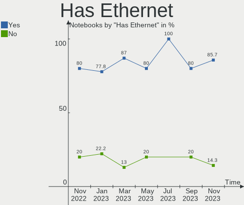
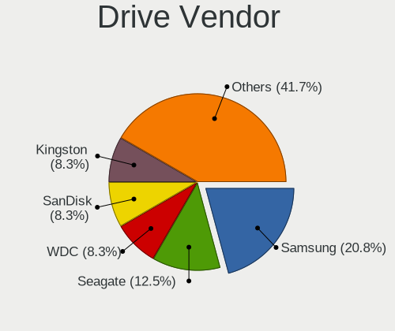
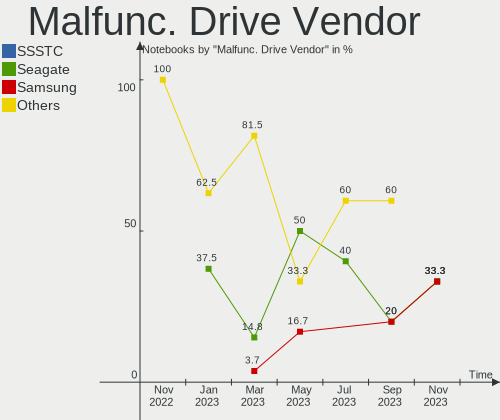
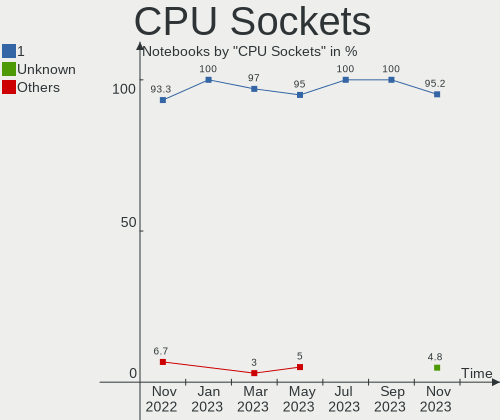
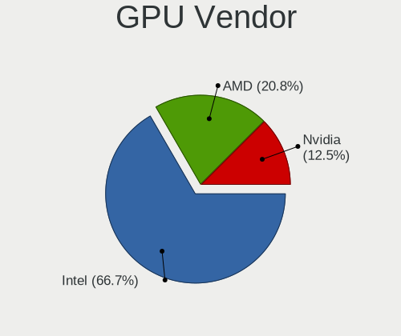
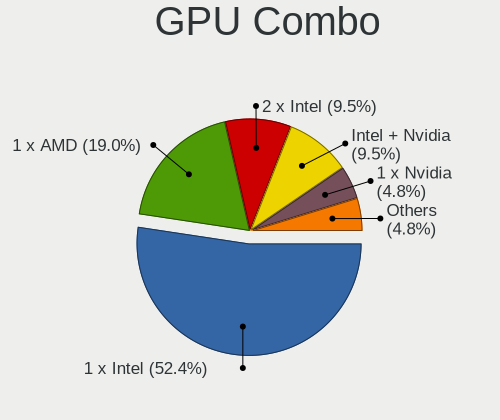

helloSystem - Hardware Trends (Notebooks)
-----------------------------------------

A project to identify most popular hardware characteristics and track their change
over time based on data collected by BSD users at https://BSD-Hardware.info.

Anyone can contribute to this report by the [hw-probe](https://github.com/linuxhw/hw-probe/blob/master/INSTALL.BSD.md) tool:

    hw-probe -all -upload

This report is for one last month. Overall report since the beginning of time: [TestCoverage](https://github.com/bsdhw/TestCoverage)

Period: Aug, 2022.

Contents
--------

* [ System ](#system)
  - [ OS                       ](#os)
  - [ OS Family                ](#os-family)
  - [ Arch                     ](#arch)
  - [ DE                       ](#de)
  - [ Display Server           ](#display-server)
  - [ Display Manager          ](#display-manager)
  - [ OS Lang                  ](#os-lang)
  - [ Boot Mode                ](#boot-mode)
  - [ Filesystem               ](#filesystem)
  - [ Part. scheme             ](#part-scheme)

* [ Board ](#board)
  - [ Vendor                   ](#vendor)
  - [ Model                    ](#model)
  - [ Model Family             ](#model-family)
  - [ MFG Year                 ](#mfg-year)
  - [ Form Factor              ](#form-factor)
  - [ Coreboot                 ](#coreboot)
  - [ RAM Size                 ](#ram-size)
  - [ RAM Used                 ](#ram-used)
  - [ Total Drives             ](#total-drives)
  - [ Has CD-ROM               ](#has-cd-rom)
  - [ Has Ethernet             ](#has-ethernet)
  - [ Has WiFi                 ](#has-wifi)
  - [ Has Bluetooth            ](#has-bluetooth)

* [ Location ](#location)
  - [ Country                  ](#country)
  - [ City                     ](#city)

* [ Drives ](#drives)
  - [ Drive Vendor             ](#drive-vendor)
  - [ Drive Model              ](#drive-model)
  - [ HDD Vendor               ](#hdd-vendor)
  - [ SSD Vendor               ](#ssd-vendor)
  - [ Drive Kind               ](#drive-kind)
  - [ Drive Connector          ](#drive-connector)
  - [ Drive Size               ](#drive-size)
  - [ Space Total              ](#space-total)
  - [ Space Used               ](#space-used)
  - [ Malfunc. Drives          ](#malfunc-drives)
  - [ Malfunc. Drive Vendor    ](#malfunc-drive-vendor)
  - [ Malfunc. HDD Vendor      ](#malfunc-hdd-vendor)
  - [ Malfunc. Drive Kind      ](#malfunc-drive-kind)
  - [ Failed Drives            ](#failed-drives)
  - [ Failed Drive Vendor      ](#failed-drive-vendor)
  - [ Drive Status             ](#drive-status)

* [ Storage controller ](#storage-controller)
  - [ Storage Vendor           ](#storage-vendor)
  - [ Storage Model            ](#storage-model)
  - [ Storage Kind             ](#storage-kind)

* [ Processor ](#processor)
  - [ CPU Vendor               ](#cpu-vendor)
  - [ CPU Model                ](#cpu-model)
  - [ CPU Model Family         ](#cpu-model-family)
  - [ CPU Cores                ](#cpu-cores)
  - [ CPU Sockets              ](#cpu-sockets)
  - [ CPU Threads              ](#cpu-threads)
  - [ CPU Microarch            ](#cpu-microarch)

* [ Graphics ](#graphics)
  - [ GPU Vendor               ](#gpu-vendor)
  - [ GPU Model                ](#gpu-model)
  - [ GPU Combo                ](#gpu-combo)
  - [ GPU Driver               ](#gpu-driver)
  - [ GPU Memory               ](#gpu-memory)

* [ Monitor ](#monitor)
  - [ Monitor Vendor           ](#monitor-vendor)
  - [ Monitor Model            ](#monitor-model)
  - [ Monitor Resolution       ](#monitor-resolution)
  - [ Monitor Diagonal         ](#monitor-diagonal)
  - [ Monitor Width            ](#monitor-width)
  - [ Aspect Ratio             ](#aspect-ratio)
  - [ Monitor Area             ](#monitor-area)
  - [ Pixel Density            ](#pixel-density)
  - [ Multiple Monitors        ](#multiple-monitors)

* [ Network ](#network)
  - [ Net Controller Vendor    ](#net-controller-vendor)
  - [ Net Controller Model     ](#net-controller-model)
  - [ Wireless Vendor          ](#wireless-vendor)
  - [ Wireless Model           ](#wireless-model)
  - [ Ethernet Vendor          ](#ethernet-vendor)
  - [ Ethernet Model           ](#ethernet-model)
  - [ Net Controller Kind      ](#net-controller-kind)
  - [ Used Controller          ](#used-controller)
  - [ NICs                     ](#nics)
  - [ IPv6                     ](#ipv6)

* [ Bluetooth ](#bluetooth)
  - [ Bluetooth Vendor         ](#bluetooth-vendor)
  - [ Bluetooth Model          ](#bluetooth-model)

* [ Sound ](#sound)
  - [ Sound Vendor             ](#sound-vendor)
  - [ Sound Model              ](#sound-model)

* [ Memory ](#memory)
  - [ Memory Vendor            ](#memory-vendor)
  - [ Memory Model             ](#memory-model)
  - [ Memory Kind              ](#memory-kind)
  - [ Memory Form Factor       ](#memory-form-factor)
  - [ Memory Size              ](#memory-size)
  - [ Memory Speed             ](#memory-speed)

* [ Printers & scanners ](#printers--scanners)
  - [ Printer Vendor           ](#printer-vendor)
  - [ Printer Model            ](#printer-model)
  - [ Scanner Vendor           ](#scanner-vendor)
  - [ Scanner Model            ](#scanner-model)

* [ Camera ](#camera)
  - [ Camera Vendor            ](#camera-vendor)
  - [ Camera Model             ](#camera-model)

* [ Security ](#security)
  - [ Fingerprint Vendor       ](#fingerprint-vendor)
  - [ Fingerprint Model        ](#fingerprint-model)
  - [ Chipcard Vendor          ](#chipcard-vendor)
  - [ Chipcard Model           ](#chipcard-model)

* [ Unsupported ](#unsupported)
  - [ Unsupported Devices      ](#unsupported-devices)
  - [ Unsupported Device Types ](#unsupported-device-types)

System
------

OS
--

Installed operating systems

| Name              | Notebooks | Percent |
|-------------------|-----------|---------|
| helloSystem 0.7.0 | 6         | 54.55%  |
| helloSystem 0.8.0 | 5         | 45.45%  |

OS Family
---------

OS without a version

| Name        | Notebooks | Percent |
|-------------|-----------|---------|
| helloSystem | 11        | 100%    |

Arch
----

OS architecture (x86_64, i586, etc.)

| Name  | Notebooks | Percent |
|-------|-----------|---------|
| amd64 | 11        | 100%    |

DE
--

Desktop Environment

| Name         | Notebooks | Percent |
|--------------|-----------|---------|
| helloDesktop | 11        | 100%    |

Display Server
--------------

X11 or Wayland

| Name | Notebooks | Percent |
|------|-----------|---------|
| X11  | 11        | 100%    |

Display Manager
---------------

SDDM, LightDM, etc.

| Name | Notebooks | Percent |
|------|-----------|---------|
| SLiM | 11        | 100%    |

OS Lang
-------

Language

| Lang  | Notebooks | Percent |
|-------|-----------|---------|
| en_US | 11        | 100%    |

Boot Mode
---------

EFI or BIOS

| Mode | Notebooks | Percent |
|------|-----------|---------|
| EFI  | 11        | 100%    |

Filesystem
----------

Type of filesystem

| Type   | Notebooks | Percent |
|--------|-----------|---------|
| Zfs    | 7         | 63.64%  |
| Cd9660 | 4         | 36.36%  |

Part. scheme
------------

Scheme of partitioning

| Type | Notebooks | Percent |
|------|-----------|---------|
| GPT  | 11        | 100%    |

Board
-----

Vendor
------

Motherboard manufacturer

| Name             | Notebooks | Percent |
|------------------|-----------|---------|
| ASUSTek Computer | 3         | 27.27%  |
| Dell             | 2         | 18.18%  |
| TUXEDO           | 1         | 9.09%   |
| Toshiba          | 1         | 9.09%   |
| Lenovo           | 1         | 9.09%   |
| Hewlett-Packard  | 1         | 9.09%   |
| eMachines        | 1         | 9.09%   |
| Acer             | 1         | 9.09%   |

Model
-----

Motherboard model

| Name                                 | Notebooks | Percent |
|--------------------------------------|-----------|---------|
| TUXEDO Pulse 14 Gen1                 | 1         | 9.09%   |
| Toshiba Satellite S55t-B             | 1         | 9.09%   |
| Lenovo ThinkPad T420 4178A72         | 1         | 9.09%   |
| HP ProBook 4540s                     | 1         | 9.09%   |
| eMachines eME728                     | 1         | 9.09%   |
| Dell Studio 1537                     | 1         | 9.09%   |
| Dell Precision 5540                  | 1         | 9.09%   |
| ASUS VivoBook 15_ASUS Laptop X540UBR | 1         | 9.09%   |
| ASUS TUF Gaming FX505DT_FX505DT      | 1         | 9.09%   |
| ASUS F6A                             | 1         | 9.09%   |
| Acer Aspire 5930                     | 1         | 9.09%   |

Model Family
------------

Motherboard model prefix

| Name              | Notebooks | Percent |
|-------------------|-----------|---------|
| TUXEDO Pulse      | 1         | 9.09%   |
| Toshiba Satellite | 1         | 9.09%   |
| Lenovo ThinkPad   | 1         | 9.09%   |
| HP ProBook        | 1         | 9.09%   |
| eMachines eME728  | 1         | 9.09%   |
| Dell Studio       | 1         | 9.09%   |
| Dell Precision    | 1         | 9.09%   |
| ASUS VivoBook     | 1         | 9.09%   |
| ASUS TUF          | 1         | 9.09%   |
| ASUS F6A          | 1         | 9.09%   |
| Acer Aspire       | 1         | 9.09%   |

MFG Year
--------

Motherboard manufacture year

| Year | Notebooks | Percent |
|------|-----------|---------|
| 2019 | 3         | 27.27%  |
| 2011 | 2         | 18.18%  |
| 2008 | 2         | 18.18%  |
| 2022 | 1         | 9.09%   |
| 2020 | 1         | 9.09%   |
| 2014 | 1         | 9.09%   |
| 2010 | 1         | 9.09%   |

Form Factor
-----------

Physical design of the computer

| Name     | Notebooks | Percent |
|----------|-----------|---------|
| Notebook | 11        | 100%    |

Coreboot
--------

Have coreboot on board

| Used | Notebooks | Percent |
|------|-----------|---------|
| No   | 11        | 100%    |

RAM Size
--------

Total RAM memory

| Size in GB | Notebooks | Percent |
|------------|-----------|---------|
| 4.01-8.0   | 3         | 27.27%  |
| 8.01-16.0  | 3         | 27.27%  |
| 3.01-4.0   | 2         | 18.18%  |
| 16.01-24.0 | 2         | 18.18%  |
| 32.01-64.0 | 1         | 9.09%   |

RAM Used
--------

Used RAM memory

| Used GB  | Notebooks | Percent |
|----------|-----------|---------|
| 0.01-0.5 | 8         | 72.73%  |
| 1.01-2.0 | 3         | 27.27%  |

Total Drives
------------

Number of drives on board

| Drives | Notebooks | Percent |
|--------|-----------|---------|
| 1      | 9         | 81.82%  |
| 2      | 1         | 9.09%   |
| 0      | 1         | 9.09%   |

Has CD-ROM
----------

Has CD-ROM on board

| Presented | Notebooks | Percent |
|-----------|-----------|---------|
| Yes       | 6         | 54.55%  |
| No        | 5         | 45.45%  |

Has Ethernet
------------

Has Ethernet on board

| Presented | Notebooks | Percent |
|-----------|-----------|---------|
| Yes       | 10        | 90.91%  |
| No        | 1         | 9.09%   |

Has WiFi
--------

Has WiFi module

| Presented | Notebooks | Percent |
|-----------|-----------|---------|
| Yes       | 11        | 100%    |

Has Bluetooth
-------------

Has Bluetooth module

| Presented | Notebooks | Percent |
|-----------|-----------|---------|
| Yes       | 8         | 72.73%  |
| No        | 3         | 27.27%  |

Location
--------

Country
-------

Geographic location (country)

| Country | Notebooks | Percent |
|---------|-----------|---------|
| Russia  | 3         | 27.27%  |
| Germany | 2         | 18.18%  |
| USA     | 1         | 9.09%   |
| Spain   | 1         | 9.09%   |
| Peru    | 1         | 9.09%   |
| Latvia  | 1         | 9.09%   |
| Italy   | 1         | 9.09%   |
| Iran    | 1         | 9.09%   |

City
----

Geographic location (city)

| City               | Notebooks | Percent |
|--------------------|-----------|---------|
| Vladivostok        | 1         | 9.09%   |
| Tehran             | 1         | 9.09%   |
| Tarragona          | 1         | 9.09%   |
| Smolensk           | 1         | 9.09%   |
| Sesto San Giovanni | 1         | 9.09%   |
| Riga               | 1         | 9.09%   |
| Perm               | 1         | 9.09%   |
| Munich             | 1         | 9.09%   |
| Lima               | 1         | 9.09%   |
| Fillmore           | 1         | 9.09%   |
| Berlin             | 1         | 9.09%   |

Drives
------

Drive Vendor
------------

Hard drive vendors

| Vendor              | Notebooks | Drives | Percent |
|---------------------|-----------|--------|---------|
| Seagate             | 3         | 3      | 27.27%  |
| SanDisk             | 2         | 2      | 18.18%  |
| Micron Technology   | 2         | 2      | 18.18%  |
| WDC                 | 1         | 1      | 9.09%   |
| Toshiba             | 1         | 1      | 9.09%   |
| Samsung Electronics | 1         | 1      | 9.09%   |
| Kingston            | 1         | 1      | 9.09%   |

Drive Model
-----------

Hard drive models

| Model                              | Notebooks | Percent |
|------------------------------------|-----------|---------|
| Seagate ST1000LM035-1RK172 1TB     | 2         | 18.18%  |
| WDC WD2500BEVT-00ZCT0 250GB        | 1         | 9.09%   |
| Toshiba MQ01ABF050 500GB           | 1         | 9.09%   |
| Seagate ST1000LM024 HN-M101MBB 1TB | 1         | 9.09%   |
| SanDisk SSD PLUS 120GB             | 1         | 9.09%   |
| SanDisk SSD P4 8GB                 | 1         | 9.09%   |
| Samsung SSD 970 EVO Plus 250GB     | 1         | 9.09%   |
| Micron 2200V_MTFDHBA512TCK 512GB   | 1         | 9.09%   |
| Micron 2200S NVMe 512GB            | 1         | 9.09%   |
| Kingston SA400S37240G 240GB        | 1         | 9.09%   |

HDD Vendor
----------

Hard disk drive vendors

| Vendor  | Notebooks | Drives | Percent |
|---------|-----------|--------|---------|
| Seagate | 3         | 3      | 60%     |
| WDC     | 1         | 1      | 20%     |
| Toshiba | 1         | 1      | 20%     |

SSD Vendor
----------

Solid state drive vendors

| Vendor   | Notebooks | Drives | Percent |
|----------|-----------|--------|---------|
| SanDisk  | 2         | 2      | 66.67%  |
| Kingston | 1         | 1      | 33.33%  |

Drive Kind
----------

HDD or SSD

| Kind | Notebooks | Drives | Percent |
|------|-----------|--------|---------|
| HDD  | 5         | 5      | 45.45%  |
| NVMe | 3         | 3      | 27.27%  |
| SSD  | 3         | 3      | 27.27%  |

Drive Connector
---------------

SATA, SAS, NVMe, etc.

| Type | Notebooks | Drives | Percent |
|------|-----------|--------|---------|
| SATA | 8         | 8      | 72.73%  |
| NVMe | 3         | 3      | 27.27%  |

Drive Size
----------

Size of hard drive

| Size in TB | Notebooks | Drives | Percent |
|------------|-----------|--------|---------|
| 0.01-0.5   | 5         | 5      | 62.5%   |
| 0.51-1.0   | 3         | 3      | 37.5%   |

Space Total
-----------

Amount of disk space available on the file system

| Size in GB | Notebooks | Percent |
|------------|-----------|---------|
| 101-250    | 4         | 36.36%  |
| 1-20       | 3         | 27.27%  |
| 501-1000   | 3         | 27.27%  |
| 251-500    | 1         | 9.09%   |

Space Used
----------

Amount of used disk space

| Used GB | Notebooks | Percent |
|---------|-----------|---------|
| 1-20    | 9         | 81.82%  |
| 101-250 | 1         | 9.09%   |
| 51-100  | 1         | 9.09%   |

Malfunc. Drives
---------------

Drive models with a malfunction

| Model                    | Notebooks | Drives | Percent |
|--------------------------|-----------|--------|---------|
| Toshiba MQ01ABF050 500GB | 1         | 1      | 100%    |

Malfunc. Drive Vendor
---------------------

Vendors of faulty drives

| Vendor  | Notebooks | Drives | Percent |
|---------|-----------|--------|---------|
| Toshiba | 1         | 1      | 100%    |

Malfunc. HDD Vendor
-------------------

Vendors of faulty HDD drives

| Vendor  | Notebooks | Drives | Percent |
|---------|-----------|--------|---------|
| Toshiba | 1         | 1      | 100%    |

Malfunc. Drive Kind
-------------------

Kinds of faulty drives

| Kind | Notebooks | Drives | Percent |
|------|-----------|--------|---------|
| HDD  | 1         | 1      | 100%    |

Failed Drives
-------------

Failed drive models

Zero info for selected period =(

Failed Drive Vendor
-------------------

Failed drive vendors

Zero info for selected period =(

Drive Status
------------

Number of failed and malfunc. drives

| Status  | Notebooks | Drives | Percent |
|---------|-----------|--------|---------|
| Works   | 9         | 10     | 90%     |
| Malfunc | 1         | 1      | 10%     |

Storage controller
------------------

Storage Vendor
--------------

Storage controller vendors

| Vendor              | Notebooks | Percent |
|---------------------|-----------|---------|
| Intel               | 9         | 64.29%  |
| Micron Technology   | 2         | 14.29%  |
| AMD                 | 2         | 14.29%  |
| Samsung Electronics | 1         | 7.14%   |

Storage Model
-------------

Storage controller models

| Model                                                                        | Notebooks | Percent |
|------------------------------------------------------------------------------|-----------|---------|
| Intel 82801IBM/IEM (ICH9M/ICH9M-E) 4 port SATA Controller [AHCI mode]        | 4         | 28.57%  |
| AMD FCH SATA Controller [AHCI mode]                                          | 2         | 14.29%  |
| Unknown                                                                      | 2         | 14.29%  |
| Samsung NVMe SSD Controller SM981/PM981/PM983                                | 1         | 7.14%   |
| Intel Wildcat Point-LP SATA Controller [AHCI Mode]                           | 1         | 7.14%   |
| Intel Sunrise Point-LP SATA Controller [AHCI mode]                           | 1         | 7.14%   |
| Intel Cannon Lake Mobile PCH SATA AHCI Controller                            | 1         | 7.14%   |
| Intel 7 Series Chipset Family 6-port SATA Controller [AHCI mode]             | 1         | 7.14%   |
| Intel 6 Series/C200 Series Chipset Family 6 port Mobile SATA AHCI Controller | 1         | 7.14%   |

Storage Kind
------------

Kind of storage controller (IDE, SATA, NVMe, SAS, ...)

| Kind | Notebooks | Percent |
|------|-----------|---------|
| SATA | 11        | 78.57%  |
| NVMe | 3         | 21.43%  |

Processor
---------

CPU Vendor
----------

Processor vendors

| Vendor | Notebooks | Percent |
|--------|-----------|---------|
| Intel  | 9         | 81.82%  |
| AMD    | 2         | 18.18%  |

CPU Model
---------

Processor models

| Model                                         | Notebooks | Percent |
|-----------------------------------------------|-----------|---------|
| Intel CPU Version                             | 2         | 18.18%  |
| Intel Xeon E-2276M CPU @ 2.80GHz              | 1         | 9.09%   |
| Intel Pentium Dual-Core CPU T4500 @ 2.30GHz   | 1         | 9.09%   |
| Intel Pentium CPU 4417U @ 2.30GHz             | 1         | 9.09%   |
| Intel Core i7-2620M CPU @ 2.70GHz             | 1         | 9.09%   |
| Intel Core i5-5200U CPU @ 2.20GHz             | 1         | 9.09%   |
| Intel Core i3-3110M CPU @ 2.40GHz             | 1         | 9.09%   |
| Intel Core 2 Duo CPU P8400 @ 2.26GHz          | 1         | 9.09%   |
| AMD Ryzen 7 4800H with Radeon Graphics        | 1         | 9.09%   |
| AMD Ryzen 7 3750H with Radeon Vega Mobile Gfx | 1         | 9.09%   |

CPU Model Family
----------------

Processor model prefix

| Model                   | Notebooks | Percent |
|-------------------------|-----------|---------|
| Other                   | 2         | 18.18%  |
| AMD Ryzen 7             | 2         | 18.18%  |
| Intel Xeon              | 1         | 9.09%   |
| Intel Pentium Dual-Core | 1         | 9.09%   |
| Intel Pentium           | 1         | 9.09%   |
| Intel Core i7           | 1         | 9.09%   |
| Intel Core i5           | 1         | 9.09%   |
| Intel Core i3           | 1         | 9.09%   |
| Intel Core 2 Duo        | 1         | 9.09%   |

CPU Cores
---------

Number of processor cores

| Number | Notebooks | Percent |
|--------|-----------|---------|
| 2      | 8         | 72.73%  |
| 16     | 1         | 9.09%   |
| 8      | 1         | 9.09%   |
| 6      | 1         | 9.09%   |

CPU Sockets
-----------

Number of sockets

| Number | Notebooks | Percent |
|--------|-----------|---------|
| 1      | 11        | 100%    |

CPU Threads
-----------

Threads per core (Hyper-Threading)

| Number | Notebooks | Percent |
|--------|-----------|---------|
| 1      | 6         | 54.55%  |
| 2      | 5         | 45.45%  |

CPU Microarch
-------------

Microarchitecture

| Name        | Notebooks | Percent |
|-------------|-----------|---------|
| Penryn      | 4         | 36.36%  |
| KabyLake    | 2         | 18.18%  |
| Zen+        | 1         | 9.09%   |
| Zen 2       | 1         | 9.09%   |
| SandyBridge | 1         | 9.09%   |
| IvyBridge   | 1         | 9.09%   |
| Broadwell   | 1         | 9.09%   |

Graphics
--------

GPU Vendor
----------

Vendors of graphics cards

| Vendor | Notebooks | Percent |
|--------|-----------|---------|
| Intel  | 7         | 46.67%  |
| Nvidia | 5         | 33.33%  |
| AMD    | 3         | 20%     |

GPU Model
---------

Graphics card models

| Model                                                                     | Notebooks | Percent |
|---------------------------------------------------------------------------|-----------|---------|
| Intel Mobile 4 Series Chipset Integrated Graphics Controller              | 2         | 13.33%  |
| Nvidia TU117M [GeForce GTX 1650 Mobile / Max-Q]                           | 1         | 6.67%   |
| Nvidia TU117GLM [Quadro T1000 Mobile]                                     | 1         | 6.67%   |
| Nvidia GM108M [GeForce MX110]                                             | 1         | 6.67%   |
| Nvidia GF119M [Quadro NVS 4200M]                                          | 1         | 6.67%   |
| Nvidia G96CM [GeForce 9600M GT]                                           | 1         | 6.67%   |
| Intel Kaby Lake-U GT1 Integrated Graphics Controller                      | 1         | 6.67%   |
| Intel HD Graphics 5500                                                    | 1         | 6.67%   |
| Intel CoffeeLake-H GT2 [UHD Graphics 630]                                 | 1         | 6.67%   |
| Intel 3rd Gen Core processor Graphics Controller                          | 1         | 6.67%   |
| Intel 2nd Generation Core Processor Family Integrated Graphics Controller | 1         | 6.67%   |
| AMD RV620/M82 [Mobility Radeon HD 3450/3470]                              | 1         | 6.67%   |
| AMD Renoir                                                                | 1         | 6.67%   |
| AMD Picasso/Raven 2 [Radeon Vega Series / Radeon Vega Mobile Series]      | 1         | 6.67%   |

GPU Combo
---------

Combinations of graphics cards

| Name           | Notebooks | Percent |
|----------------|-----------|---------|
| Intel + Nvidia | 3         | 27.27%  |
| 2 x Intel      | 2         | 18.18%  |
| 1 x Intel      | 2         | 18.18%  |
| 1 x AMD        | 2         | 18.18%  |
| 1 x Nvidia     | 1         | 9.09%   |
| AMD + Nvidia   | 1         | 9.09%   |

GPU Driver
----------

Free vs proprietary

| Driver      | Notebooks | Percent |
|-------------|-----------|---------|
| Free        | 9         | 81.82%  |
| Proprietary | 1         | 9.09%   |
| Unknown     | 1         | 9.09%   |

GPU Memory
----------

Total video memory

| Size in GB | Notebooks | Percent |
|------------|-----------|---------|
| Unknown    | 8         | 72.73%  |
| 0.01-0.5   | 3         | 27.27%  |

Monitor
-------

Monitor Vendor
--------------

Monitor vendors

| Vendor              | Notebooks | Percent |
|---------------------|-----------|---------|
| AU Optronics        | 3         | 25%     |
| LG Display          | 2         | 16.67%  |
| Sharp               | 1         | 8.33%   |
| Samsung Electronics | 1         | 8.33%   |
| PANDA               | 1         | 8.33%   |
| LG Philips          | 1         | 8.33%   |
| Goldstar            | 1         | 8.33%   |
| Chimei Innolux      | 1         | 8.33%   |
| Apple               | 1         | 8.33%   |

Monitor Model
-------------

Monitor models

| Model                                                                | Notebooks | Percent |
|----------------------------------------------------------------------|-----------|---------|
| Sharp LCD Monitor SHP14BA 1920x1080 340x190mm 15.3-inch              | 1         | 8.33%   |
| Samsung Electronics LCD Monitor SEC5441 1280x800 330x210mm 15.4-inch | 1         | 8.33%   |
| PANDA LCD Monitor NCP002D 1920x1080 340x190mm 15.3-inch              | 1         | 8.33%   |
| LG Philips LCD Monitor LPL3B01 1280x800 330x210mm 15.4-inch          | 1         | 8.33%   |
| LG Display LCD Monitor LGD0470 1920x1080 350x190mm 15.7-inch         | 1         | 8.33%   |
| LG Display LCD Monitor LGD0395 1366x768 340x190mm 15.3-inch          | 1         | 8.33%   |
| Goldstar LG ULTRAWIDE GSM59F1 2560x1080 800x340mm 34.2-inch          | 1         | 8.33%   |
| Chimei Innolux LCD Monitor CMN14D5 1920x1080 310x170mm 13.9-inch     | 1         | 8.33%   |
| AU Optronics LCD Monitor AUO71EC 1366x768 340x190mm 15.3-inch        | 1         | 8.33%   |
| AU Optronics LCD Monitor AUO26EC 1366x768 340x190mm 15.3-inch        | 1         | 8.33%   |
| AU Optronics LCD Monitor AUO213E 1600x900 310x170mm 13.9-inch        | 1         | 8.33%   |
| Apple Color LCD APP9C5C 1280x800 290x180mm 13.4-inch                 | 1         | 8.33%   |

Monitor Resolution
------------------

Monitor screen resolution

| Resolution      | Notebooks | Percent |
|-----------------|-----------|---------|
| 1920x1080 (FHD) | 4         | 33.33%  |
| 1366x768 (WXGA) | 4         | 33.33%  |
| 1280x800 (WXGA) | 2         | 16.67%  |
| 2560x1080       | 1         | 8.33%   |
| 1600x900 (HD+)  | 1         | 8.33%   |

Monitor Diagonal
----------------

Diagonal size in inches

| Inches | Notebooks | Percent |
|--------|-----------|---------|
| 15     | 8         | 66.67%  |
| 13     | 3         | 25%     |
| 34     | 1         | 8.33%   |

Monitor Width
-------------

Physical width

| Width in mm | Notebooks | Percent |
|-------------|-----------|---------|
| 301-350     | 10        | 83.33%  |
| 701-800     | 1         | 8.33%   |
| 201-300     | 1         | 8.33%   |

Aspect Ratio
------------

Proportional relationship between the width and the height

| Ratio | Notebooks | Percent |
|-------|-----------|---------|
| 16/9  | 8         | 66.67%  |
| 16/10 | 3         | 25%     |
| 21/9  | 1         | 8.33%   |

Monitor Area
------------

Area in inch²

| Area in inch² | Notebooks | Percent |
|----------------|-----------|---------|
| 91-100         | 5         | 41.67%  |
| 81-90          | 3         | 25%     |
| 101-110        | 3         | 25%     |
| 351-500        | 1         | 8.33%   |

Pixel Density
-------------

Pixels per inch

| Density | Notebooks | Percent |
|---------|-----------|---------|
| 121-160 | 5         | 41.67%  |
| 101-120 | 4         | 33.33%  |
| 51-100  | 3         | 25%     |

Multiple Monitors
-----------------

Total monitors connected

| Total | Notebooks | Percent |
|-------|-----------|---------|
| 1     | 10        | 90.91%  |
| 2     | 1         | 9.09%   |

Network
-------

Net Controller Vendor
---------------------

Controller vendors

| Vendor                   | Notebooks | Percent |
|--------------------------|-----------|---------|
| Realtek Semiconductor    | 7         | 33.33%  |
| Intel                    | 7         | 33.33%  |
| Xiaomi                   | 2         | 9.52%   |
| Qualcomm Atheros         | 2         | 9.52%   |
| Samsung Electronics      | 1         | 4.76%   |
| Marvell Technology Group | 1         | 4.76%   |
| Broadcom                 | 1         | 4.76%   |

Net Controller Model
--------------------

Controller models

| Model                                                             | Notebooks | Percent |
|-------------------------------------------------------------------|-----------|---------|
| Realtek RTL8111/8168/8411 PCI Express Gigabit Ethernet Controller | 5         | 21.74%  |
| Intel WiFi Link 5100                                              | 3         | 13.04%  |
| Realtek RTL8821CE 802.11ac PCIe Wireless Network Adapter          | 2         | 8.7%    |
| Xiaomi Mi/Redmi series (RNDIS)                                    | 1         | 4.35%   |
| Xiaomi Mi/Redmi series (RNDIS + ADB)                              | 1         | 4.35%   |
| Samsung GT-I9070 (network tethering, USB debugging enabled)       | 1         | 4.35%   |
| Realtek RTL8188CE 802.11b/g/n WiFi Adapter                        | 1         | 4.35%   |
| Qualcomm Atheros QCA9565 / AR9565 Wireless Network Adapter        | 1         | 4.35%   |
| Qualcomm Atheros AR9287 Wireless Network Adapter (PCI-Express)    | 1         | 4.35%   |
| Qualcomm Atheros AR8131 Gigabit Ethernet                          | 1         | 4.35%   |
| Marvell Group 88E8071 PCI-E Gigabit Ethernet Controller           | 1         | 4.35%   |
| Intel Wireless-AC 9260                                            | 1         | 4.35%   |
| Intel Wireless 3160                                               | 1         | 4.35%   |
| Intel Wi-Fi 6 AX200                                               | 1         | 4.35%   |
| Intel 82579LM Gigabit Network Connection (Lewisville)             | 1         | 4.35%   |
| Broadcom NetLink BCM5784M Gigabit Ethernet PCIe                   | 1         | 4.35%   |

Wireless Vendor
---------------

Wireless vendors

| Vendor                | Notebooks | Percent |
|-----------------------|-----------|---------|
| Intel                 | 6         | 54.55%  |
| Realtek Semiconductor | 3         | 27.27%  |
| Qualcomm Atheros      | 2         | 18.18%  |

Wireless Model
--------------

Wireless models

| Model                                                          | Notebooks | Percent |
|----------------------------------------------------------------|-----------|---------|
| Intel WiFi Link 5100                                           | 3         | 27.27%  |
| Realtek RTL8821CE 802.11ac PCIe Wireless Network Adapter       | 2         | 18.18%  |
| Realtek RTL8188CE 802.11b/g/n WiFi Adapter                     | 1         | 9.09%   |
| Qualcomm Atheros QCA9565 / AR9565 Wireless Network Adapter     | 1         | 9.09%   |
| Qualcomm Atheros AR9287 Wireless Network Adapter (PCI-Express) | 1         | 9.09%   |
| Intel Wireless-AC 9260                                         | 1         | 9.09%   |
| Intel Wireless 3160                                            | 1         | 9.09%   |
| Intel Wi-Fi 6 AX200                                            | 1         | 9.09%   |

Ethernet Vendor
---------------

Ethernet vendors

| Vendor                   | Notebooks | Percent |
|--------------------------|-----------|---------|
| Realtek Semiconductor    | 5         | 41.67%  |
| Xiaomi                   | 2         | 16.67%  |
| Samsung Electronics      | 1         | 8.33%   |
| Qualcomm Atheros         | 1         | 8.33%   |
| Marvell Technology Group | 1         | 8.33%   |
| Intel                    | 1         | 8.33%   |
| Broadcom                 | 1         | 8.33%   |

Ethernet Model
--------------

Ethernet models

| Model                                                             | Notebooks | Percent |
|-------------------------------------------------------------------|-----------|---------|
| Realtek RTL8111/8168/8411 PCI Express Gigabit Ethernet Controller | 5         | 41.67%  |
| Xiaomi Mi/Redmi series (RNDIS)                                    | 1         | 8.33%   |
| Xiaomi Mi/Redmi series (RNDIS + ADB)                              | 1         | 8.33%   |
| Samsung GT-I9070 (network tethering, USB debugging enabled)       | 1         | 8.33%   |
| Qualcomm Atheros AR8131 Gigabit Ethernet                          | 1         | 8.33%   |
| Marvell Group 88E8071 PCI-E Gigabit Ethernet Controller           | 1         | 8.33%   |
| Intel 82579LM Gigabit Network Connection (Lewisville)             | 1         | 8.33%   |
| Broadcom NetLink BCM5784M Gigabit Ethernet PCIe                   | 1         | 8.33%   |

Net Controller Kind
-------------------

Ethernet, WiFi or modem

| Kind     | Notebooks | Percent |
|----------|-----------|---------|
| WiFi     | 11        | 52.38%  |
| Ethernet | 10        | 47.62%  |

Used Controller
---------------

Currently used network controller

| Kind     | Notebooks | Percent |
|----------|-----------|---------|
| WiFi     | 7         | 77.78%  |
| Ethernet | 2         | 22.22%  |

NICs
----

Total network controllers on board

| Total | Notebooks | Percent |
|-------|-----------|---------|
| 2     | 9         | 81.82%  |
| 1     | 2         | 18.18%  |

IPv6
----

IPv6 vs IPv4

| Used | Notebooks | Percent |
|------|-----------|---------|
| No   | 10        | 90.91%  |
| Yes  | 1         | 9.09%   |

Bluetooth
---------

Bluetooth Vendor
----------------

Controller vendors

| Vendor                          | Notebooks | Percent |
|---------------------------------|-----------|---------|
| Intel                           | 3         | 37.5%   |
| IMC Networks                    | 2         | 25%     |
| Qualcomm Atheros Communications | 1         | 12.5%   |
| Broadcom                        | 1         | 12.5%   |
| ASUSTek Computer                | 1         | 12.5%   |

Bluetooth Model
---------------

Controller models

| Model                                    | Notebooks | Percent |
|------------------------------------------|-----------|---------|
| IMC Networks Realtek Bluetooth Adapter   | 2         | 25%     |
| Qualcomm Atheros AR3012 Bluetooth        | 1         | 12.5%   |
| Intel Wireless-AC 9260 Bluetooth Adapter | 1         | 12.5%   |
| Intel Bluetooth wireless interface       | 1         | 12.5%   |
| Intel AX200 Bluetooth                    | 1         | 12.5%   |
| Broadcom BCM2045B (BDC-2.1)              | 1         | 12.5%   |
| ASUS BT-253 Bluetooth Adapter            | 1         | 12.5%   |

Sound
-----

Sound Vendor
------------

Sound card vendors

| Vendor | Notebooks | Percent |
|--------|-----------|---------|
| Intel  | 9         | 69.23%  |
| AMD    | 3         | 23.08%  |
| Nvidia | 1         | 7.69%   |

Sound Model
-----------

Sound card models

| Model                                                                      | Notebooks | Percent |
|----------------------------------------------------------------------------|-----------|---------|
| Intel 82801I (ICH9 Family) HD Audio Controller                             | 4         | 26.67%  |
| AMD Family 17h/19h HD Audio Controller                                     | 2         | 13.33%  |
| Nvidia TU107 GeForce GTX 1650 High Definition Audio Controller             | 1         | 6.67%   |
| Intel Wildcat Point-LP High Definition Audio Controller                    | 1         | 6.67%   |
| Intel Sunrise Point-LP HD Audio                                            | 1         | 6.67%   |
| Intel Cannon Lake PCH cAVS                                                 | 1         | 6.67%   |
| Intel Broadwell-U Audio Controller                                         | 1         | 6.67%   |
| Intel 7 Series/C216 Chipset Family High Definition Audio Controller        | 1         | 6.67%   |
| Intel 6 Series/C200 Series Chipset Family High Definition Audio Controller | 1         | 6.67%   |
| AMD RV620 HDMI Audio [Radeon HD 3450/3470/3550/3570]                       | 1         | 6.67%   |
| AMD Renoir Radeon High Definition Audio Controller                         | 1         | 6.67%   |

Memory
------

Memory Vendor
-------------

Memory module vendors

| Vendor              | Notebooks | Percent |
|---------------------|-----------|---------|
| SK hynix            | 5         | 38.46%  |
| Unknown             | 2         | 15.38%  |
| Samsung Electronics | 1         | 7.69%   |
| Micron Technology   | 1         | 7.69%   |
| Kingston            | 1         | 7.69%   |
| GOODRAM             | 1         | 7.69%   |
| GeIL                | 1         | 7.69%   |
| Unknown             | 1         | 7.69%   |

Memory Model
------------

Memory module models

| Model                                                   | Notebooks | Percent |
|---------------------------------------------------------|-----------|---------|
| Unknown RAM Module 2GB SODIMM DDR2 800MT/s              | 1         | 6.25%   |
| Unknown RAM Module 2GB SODIMM DDR2 667MT/s              | 1         | 6.25%   |
| Unknown RAM Module 1GB SODIMM DDR2 800MT/s              | 1         | 6.25%   |
| Unknown RAM Module 1GB SODIMM DDR2 667MT/s              | 1         | 6.25%   |
| SK hynix RAM HYMP125S64CP8-S6 2GB SODIMM DDR2 975MT/s   | 1         | 6.25%   |
| SK hynix RAM HMT351S6EFR8A-PB 4GB SODIMM DDR3 1600MT/s  | 1         | 6.25%   |
| SK hynix RAM HMA851S6AFR6N-UH 4GB SODIMM DDR4 2400MT/s  | 1         | 6.25%   |
| SK hynix RAM HMA851S6AFR6N-TF 4GB SODIMM DDR4 2133MT/s  | 1         | 6.25%   |
| SK hynix RAM HMA82GS6DJR8N-VK 16GB SODIMM DDR4 2667MT/s | 1         | 6.25%   |
| SK hynix RAM HMA81GS6JJR8N-VK 8GB SODIMM DDR4 2667MT/s  | 1         | 6.25%   |
| Samsung RAM M471A2K43DB1-CWE 16GB SODIMM DDR4 3200MT/s  | 1         | 6.25%   |
| Micron RAM 16KTF51264HZ-1G6M1 4GB SODIMM DDR3 1600MT/s  | 1         | 6.25%   |
| Kingston RAM TSB16D3LS1KFG/4G 4GB SODIMM DDR3 1600MT/s  | 1         | 6.25%   |
| GOODRAM RAM GR1333S364L9S/4G 4GB SODIMM DDR3 1333MT/s   | 1         | 6.25%   |
| GeIL RAM CL11-11-11 D3-1600 4GB SODIMM DDR3 1333MT/s    | 1         | 6.25%   |
| Unknown                                                 | 1         | 6.25%   |

Memory Kind
-----------

Memory module kinds

| Kind    | Notebooks | Percent |
|---------|-----------|---------|
| DDR4    | 4         | 36.36%  |
| DDR3    | 3         | 27.27%  |
| DDR2    | 3         | 27.27%  |
| Unknown | 1         | 9.09%   |

Memory Form Factor
------------------

Physical design of the memory module

| Name   | Notebooks | Percent |
|--------|-----------|---------|
| SODIMM | 11        | 100%    |

Memory Size
-----------

Memory module size

| Size  | Notebooks | Percent |
|-------|-----------|---------|
| 4096  | 5         | 35.71%  |
| 2048  | 4         | 28.57%  |
| 16384 | 2         | 14.29%  |
| 1024  | 2         | 14.29%  |
| 8192  | 1         | 7.14%   |

Memory Speed
------------

Memory module speed

| Speed | Notebooks | Percent |
|-------|-----------|---------|
| 1600  | 3         | 21.43%  |
| 2667  | 2         | 14.29%  |
| 1333  | 2         | 14.29%  |
| 800   | 2         | 14.29%  |
| 3200  | 1         | 7.14%   |
| 2400  | 1         | 7.14%   |
| 2133  | 1         | 7.14%   |
| 975   | 1         | 7.14%   |
| 667   | 1         | 7.14%   |

Printers & scanners
-------------------

Printer Vendor
--------------

Printer device vendors

Zero info for selected period =(

Printer Model
-------------

Printer device models

Zero info for selected period =(

Scanner Vendor
--------------

Scanner device vendors

Zero info for selected period =(

Scanner Model
-------------

Scanner device models

Zero info for selected period =(

Camera
------

Camera Vendor
-------------

Camera device vendors

| Vendor              | Notebooks | Percent |
|---------------------|-----------|---------|
| Chicony Electronics | 5         | 50%     |
| IMC Networks        | 2         | 20%     |
| Suyin               | 1         | 10%     |
| Microdia            | 1         | 10%     |
| ALi                 | 1         | 10%     |

Camera Model
------------

Camera device models

| Model                              | Notebooks | Percent |
|------------------------------------|-----------|---------|
| Suyin HD Video WebCam              | 1         | 10%     |
| Microdia Integrated Webcam         | 1         | 10%     |
| IMC Networks USB2.0 VGA UVC WebCam | 1         | 10%     |
| IMC Networks USB2.0 HD UVC WebCam  | 1         | 10%     |
| Chicony TOSHIBA Web Camera - HD    | 1         | 10%     |
| Chicony integrated camera          | 1         | 10%     |
| Chicony HP HD Webcam [Fixed]       | 1         | 10%     |
| Chicony HD Webcam                  | 1         | 10%     |
| Chicony 1.3M UVC Webcam            | 1         | 10%     |
| ALi Gateway Webcam                 | 1         | 10%     |

Security
--------

Fingerprint Vendor
------------------

Fingerprint sensor vendors

| Vendor                     | Notebooks | Percent |
|----------------------------|-----------|---------|
| AuthenTec                  | 2         | 66.67%  |
| Shenzhen Goodix Technology | 1         | 33.33%  |

Fingerprint Model
-----------------

Fingerprint sensor models

| Model                              | Notebooks | Percent |
|------------------------------------|-----------|---------|
| AuthenTec AES1600                  | 2         | 66.67%  |
| Shenzhen Goodix Fingerprint Reader | 1         | 33.33%  |

Chipcard Vendor
---------------

Chipcard module vendors

Zero info for selected period =(

Chipcard Model
--------------

Chipcard module models

Zero info for selected period =(

Unsupported
-----------

Unsupported Devices
-------------------

Total unsupported devices on board

| Total | Notebooks | Percent |
|-------|-----------|---------|
| 1     | 6         | 54.55%  |
| 2     | 3         | 27.27%  |
| 0     | 2         | 18.18%  |

Unsupported Device Types
------------------------

Types of unsupported devices

| Type                     | Notebooks | Percent |
|--------------------------|-----------|---------|
| Communication controller | 5         | 45.45%  |
| Net/wireless             | 2         | 18.18%  |
| Fingerprint reader       | 2         | 18.18%  |
| Bluetooth                | 2         | 18.18%  |

