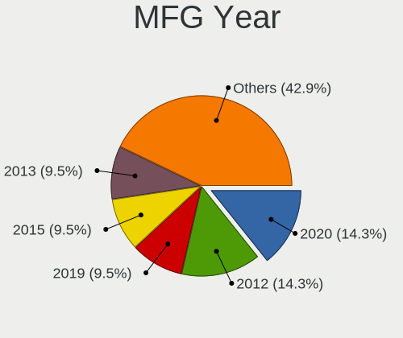
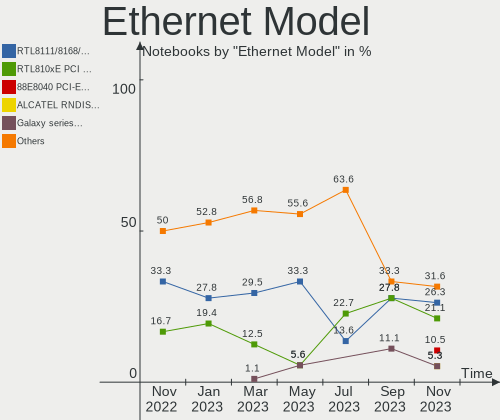

helloSystem - Hardware Trends (Notebooks)
-----------------------------------------

A project to identify most popular hardware characteristics and track their change
over time based on data collected by BSD users at https://BSD-Hardware.info.

Anyone can contribute to this report by the [hw-probe](https://github.com/linuxhw/hw-probe/blob/master/INSTALL.BSD.md) tool:

    hw-probe -all -upload

This report is for one last month. Overall report since the beginning of time: [TestDays](https://github.com/bsdhw/TestDays)

Period: Aug, 2023.

Contents
--------

* [ System ](#system)
  - [ OS                       ](#os)
  - [ OS Family                ](#os-family)
  - [ Arch                     ](#arch)
  - [ DE                       ](#de)
  - [ Display Server           ](#display-server)
  - [ Display Manager          ](#display-manager)
  - [ OS Lang                  ](#os-lang)
  - [ Boot Mode                ](#boot-mode)
  - [ Filesystem               ](#filesystem)
  - [ Part. scheme             ](#part-scheme)

* [ Board ](#board)
  - [ Vendor                   ](#vendor)
  - [ Model                    ](#model)
  - [ Model Family             ](#model-family)
  - [ MFG Year                 ](#mfg-year)
  - [ Form Factor              ](#form-factor)
  - [ Coreboot                 ](#coreboot)
  - [ RAM Size                 ](#ram-size)
  - [ RAM Used                 ](#ram-used)
  - [ Total Drives             ](#total-drives)
  - [ Has CD-ROM               ](#has-cd-rom)
  - [ Has Ethernet             ](#has-ethernet)
  - [ Has WiFi                 ](#has-wifi)
  - [ Has Bluetooth            ](#has-bluetooth)

* [ Location ](#location)
  - [ Country                  ](#country)
  - [ City                     ](#city)

* [ Drives ](#drives)
  - [ Drive Vendor             ](#drive-vendor)
  - [ Drive Model              ](#drive-model)
  - [ HDD Vendor               ](#hdd-vendor)
  - [ SSD Vendor               ](#ssd-vendor)
  - [ Drive Kind               ](#drive-kind)
  - [ Drive Connector          ](#drive-connector)
  - [ Drive Size               ](#drive-size)
  - [ Space Total              ](#space-total)
  - [ Space Used               ](#space-used)
  - [ Malfunc. Drives          ](#malfunc-drives)
  - [ Malfunc. Drive Vendor    ](#malfunc-drive-vendor)
  - [ Malfunc. HDD Vendor      ](#malfunc-hdd-vendor)
  - [ Malfunc. Drive Kind      ](#malfunc-drive-kind)
  - [ Failed Drives            ](#failed-drives)
  - [ Failed Drive Vendor      ](#failed-drive-vendor)
  - [ Drive Status             ](#drive-status)

* [ Storage controller ](#storage-controller)
  - [ Storage Vendor           ](#storage-vendor)
  - [ Storage Model            ](#storage-model)
  - [ Storage Kind             ](#storage-kind)

* [ Processor ](#processor)
  - [ CPU Vendor               ](#cpu-vendor)
  - [ CPU Model                ](#cpu-model)
  - [ CPU Model Family         ](#cpu-model-family)
  - [ CPU Cores                ](#cpu-cores)
  - [ CPU Sockets              ](#cpu-sockets)
  - [ CPU Threads              ](#cpu-threads)
  - [ CPU Microarch            ](#cpu-microarch)

* [ Graphics ](#graphics)
  - [ GPU Vendor               ](#gpu-vendor)
  - [ GPU Model                ](#gpu-model)
  - [ GPU Combo                ](#gpu-combo)
  - [ GPU Driver               ](#gpu-driver)
  - [ GPU Memory               ](#gpu-memory)

* [ Monitor ](#monitor)
  - [ Monitor Vendor           ](#monitor-vendor)
  - [ Monitor Model            ](#monitor-model)
  - [ Monitor Resolution       ](#monitor-resolution)
  - [ Monitor Diagonal         ](#monitor-diagonal)
  - [ Monitor Width            ](#monitor-width)
  - [ Aspect Ratio             ](#aspect-ratio)
  - [ Monitor Area             ](#monitor-area)
  - [ Pixel Density            ](#pixel-density)
  - [ Multiple Monitors        ](#multiple-monitors)

* [ Network ](#network)
  - [ Net Controller Vendor    ](#net-controller-vendor)
  - [ Net Controller Model     ](#net-controller-model)
  - [ Wireless Vendor          ](#wireless-vendor)
  - [ Wireless Model           ](#wireless-model)
  - [ Ethernet Vendor          ](#ethernet-vendor)
  - [ Ethernet Model           ](#ethernet-model)
  - [ Net Controller Kind      ](#net-controller-kind)
  - [ Used Controller          ](#used-controller)
  - [ NICs                     ](#nics)
  - [ IPv6                     ](#ipv6)

* [ Bluetooth ](#bluetooth)
  - [ Bluetooth Vendor         ](#bluetooth-vendor)
  - [ Bluetooth Model          ](#bluetooth-model)

* [ Sound ](#sound)
  - [ Sound Vendor             ](#sound-vendor)
  - [ Sound Model              ](#sound-model)

* [ Memory ](#memory)
  - [ Memory Vendor            ](#memory-vendor)
  - [ Memory Model             ](#memory-model)
  - [ Memory Kind              ](#memory-kind)
  - [ Memory Form Factor       ](#memory-form-factor)
  - [ Memory Size              ](#memory-size)
  - [ Memory Speed             ](#memory-speed)

* [ Printers & scanners ](#printers--scanners)
  - [ Printer Vendor           ](#printer-vendor)
  - [ Printer Model            ](#printer-model)
  - [ Scanner Vendor           ](#scanner-vendor)
  - [ Scanner Model            ](#scanner-model)

* [ Camera ](#camera)
  - [ Camera Vendor            ](#camera-vendor)
  - [ Camera Model             ](#camera-model)

* [ Security ](#security)
  - [ Fingerprint Vendor       ](#fingerprint-vendor)
  - [ Fingerprint Model        ](#fingerprint-model)
  - [ Chipcard Vendor          ](#chipcard-vendor)
  - [ Chipcard Model           ](#chipcard-model)

* [ Unsupported ](#unsupported)
  - [ Unsupported Devices      ](#unsupported-devices)
  - [ Unsupported Device Types ](#unsupported-device-types)

System
------

OS
--

Installed operating systems

| Name              | Notebooks | Percent |
|-------------------|-----------|---------|
| helloSystem 0.8.1 | 14        | 56%     |
| helloSystem 0.8.2 | 6         | 24%     |
| helloSystem 0.9.0 | 4         | 16%     |
| helloSystem 0.8.0 | 1         | 4%      |

OS Family
---------

OS without a version

| Name        | Notebooks | Percent |
|-------------|-----------|---------|
| helloSystem | 25        | 100%    |

Arch
----

OS architecture (x86_64, i586, etc.)

| Name  | Notebooks | Percent |
|-------|-----------|---------|
| amd64 | 25        | 100%    |

DE
--

Desktop Environment

| Name         | Notebooks | Percent |
|--------------|-----------|---------|
| helloDesktop | 23        | 92%     |
| XFCE         | 1         | 4%      |
| KDE5         | 1         | 4%      |

Display Server
--------------

X11 or Wayland

| Name | Notebooks | Percent |
|------|-----------|---------|
| X11  | 25        | 100%    |

Display Manager
---------------

SDDM, LightDM, etc.

| Name    | Notebooks | Percent |
|---------|-----------|---------|
| SLiM    | 24        | 96%     |
| LightDM | 1         | 4%      |

OS Lang
-------

Language

| Lang    | Notebooks | Percent |
|---------|-----------|---------|
| Unknown | 10        | 40%     |
| en_US   | 4         | 16%     |
| fr_FR   | 3         | 12%     |
| pt_BR   | 1         | 4%      |
| pl_PL   | 1         | 4%      |
| nl_NL   | 1         | 4%      |
| jp_JP   | 1         | 4%      |
| it_IT   | 1         | 4%      |
| es_ES   | 1         | 4%      |
| en_UK   | 1         | 4%      |
| en      | 1         | 4%      |

Boot Mode
---------

EFI or BIOS

| Mode | Notebooks | Percent |
|------|-----------|---------|
| EFI  | 25        | 100%    |

Filesystem
----------

Type of filesystem

| Type   | Notebooks | Percent |
|--------|-----------|---------|
| Cd9660 | 14        | 56%     |
| Zfs    | 11        | 44%     |

Part. scheme
------------

Scheme of partitioning

| Type | Notebooks | Percent |
|------|-----------|---------|
| GPT  | 25        | 100%    |

Board
-----

Vendor
------

Motherboard manufacturer

| Name             | Notebooks | Percent |
|------------------|-----------|---------|
| Lenovo           | 9         | 36%     |
| Hewlett-Packard  | 4         | 16%     |
| ASUSTek Computer | 3         | 12%     |
| Dell             | 2         | 8%      |
| Acer             | 2         | 8%      |
| Toshiba          | 1         | 4%      |
| Star Labs        | 1         | 4%      |
| NVN-ED01         | 1         | 4%      |
| Fujitsu          | 1         | 4%      |
| Compaq           | 1         | 4%      |

Model
-----

Motherboard model

| Name                                     | Notebooks | Percent |
|------------------------------------------|-----------|---------|
| Toshiba Satellite S55t-B                 | 1         | 4%      |
| Star Labs Lite                           | 1         | 4%      |
| Lenovo ThinkPad X220 4286CTO             | 1         | 4%      |
| Lenovo ThinkPad X200 7458WNZ             | 1         | 4%      |
| Lenovo ThinkPad X1 Carbon 2nd 20A7002FUS | 1         | 4%      |
| Lenovo ThinkPad T60 1951CZ1              | 1         | 4%      |
| Lenovo ThinkPad T490 20RYS06R00          | 1         | 4%      |
| Lenovo ThinkPad T450 20BUS0370P          | 1         | 4%      |
| Lenovo ThinkPad P50 20EN0009MS           | 1         | 4%      |
| Lenovo IdeaPad Gaming 3 15IHU6 82K1      | 1         | 4%      |
| Lenovo IdeaPad 110S-11IBR 80WG           | 1         | 4%      |
| HP Pavilion dv3500                       | 1         | 4%      |
| HP ENVY Notebook 13-ab0XX                | 1         | 4%      |
| HP EliteBook 840 G5                      | 1         | 4%      |
| HP 2000                                  | 1         | 4%      |
| Fujitsu FMVA0803D                        | 1         | 4%      |
| Dell Latitude E6420                      | 1         | 4%      |
| Dell Latitude E4310                      | 1         | 4%      |
| Compaq Presario CQ-17                    | 1         | 4%      |
| ASUS X553MA                              | 1         | 4%      |
| ASUS S500CA                              | 1         | 4%      |
| ASUS GL753VD                             | 1         | 4%      |
| Acer Aspire V3-371                       | 1         | 4%      |
| Acer Aspire A515-55                      | 1         | 4%      |
| Unknown                                  | 1         | 4%      |

Model Family
------------

Motherboard model prefix

| Name              | Notebooks | Percent |
|-------------------|-----------|---------|
| Lenovo ThinkPad   | 7         | 28%     |
| Lenovo IdeaPad    | 2         | 8%      |
| Dell Latitude     | 2         | 8%      |
| Acer Aspire       | 2         | 8%      |
| Toshiba Satellite | 1         | 4%      |
| Star Labs Lite    | 1         | 4%      |
| HP Pavilion       | 1         | 4%      |
| HP ENVY           | 1         | 4%      |
| HP EliteBook      | 1         | 4%      |
| HP 2000           | 1         | 4%      |
| Fujitsu FMVA0803D | 1         | 4%      |
| Compaq Presario   | 1         | 4%      |
| ASUS X553MA       | 1         | 4%      |
| ASUS S500CA       | 1         | 4%      |
| ASUS GL753VD      | 1         | 4%      |
| Unknown           | 1         | 4%      |

MFG Year
--------

Motherboard manufacture year

| Year | Notebooks | Percent |
|------|-----------|---------|
| 2016 | 5         | 20%     |
| 2019 | 3         | 12%     |
| 2011 | 3         | 12%     |
| 2021 | 2         | 8%      |
| 2020 | 2         | 8%      |
| 2015 | 2         | 8%      |
| 2014 | 2         | 8%      |
| 2009 | 2         | 8%      |
| 2017 | 1         | 4%      |
| 2012 | 1         | 4%      |
| 2010 | 1         | 4%      |
| 2006 | 1         | 4%      |

Form Factor
-----------

Physical design of the computer

| Name     | Notebooks | Percent |
|----------|-----------|---------|
| Notebook | 25        | 100%    |

Coreboot
--------

Have coreboot on board

| Used | Notebooks | Percent |
|------|-----------|---------|
| No   | 25        | 100%    |

RAM Size
--------

Total RAM memory

| Size in GB | Notebooks | Percent |
|------------|-----------|---------|
| 8.01-16.0  | 12        | 48%     |
| 16.01-24.0 | 6         | 24%     |
| 4.01-8.0   | 5         | 20%     |
| 3.01-4.0   | 1         | 4%      |
| 2.01-3.0   | 1         | 4%      |

RAM Used
--------

Used RAM memory

| Used GB  | Notebooks | Percent |
|----------|-----------|---------|
| 0.01-0.5 | 15        | 60%     |
| 0.51-1.0 | 10        | 40%     |

Total Drives
------------

Number of drives on board

| Drives | Notebooks | Percent |
|--------|-----------|---------|
| 1      | 19        | 76%     |
| 2      | 3         | 12%     |
| 0      | 3         | 12%     |

Has CD-ROM
----------

Has CD-ROM on board

| Presented | Notebooks | Percent |
|-----------|-----------|---------|
| No        | 17        | 68%     |
| Yes       | 8         | 32%     |

Has Ethernet
------------

Has Ethernet on board

| Presented | Notebooks | Percent |
|-----------|-----------|---------|
| Yes       | 20        | 80%     |
| No        | 5         | 20%     |

Has WiFi
--------

Has WiFi module

| Presented | Notebooks | Percent |
|-----------|-----------|---------|
| Yes       | 25        | 100%    |

Has Bluetooth
-------------

Has Bluetooth module

| Presented | Notebooks | Percent |
|-----------|-----------|---------|
| Yes       | 23        | 92%     |
| No        | 2         | 8%      |

Location
--------

Country
-------

Geographic location (country)

| Country     | Notebooks | Percent |
|-------------|-----------|---------|
| USA         | 6         | 24%     |
| UK          | 3         | 12%     |
| Poland      | 2         | 8%      |
| Indonesia   | 2         | 8%      |
| Ukraine     | 1         | 4%      |
| Spain       | 1         | 4%      |
| Romania     | 1         | 4%      |
| Peru        | 1         | 4%      |
| Netherlands | 1         | 4%      |
| Jamaica     | 1         | 4%      |
| Italy       | 1         | 4%      |
| France      | 1         | 4%      |
| Czechia     | 1         | 4%      |
| Canada      | 1         | 4%      |
| Brazil      | 1         | 4%      |
| Argentina   | 1         | 4%      |

City
----

Geographic location (city)

| City             | Notebooks | Percent |
|------------------|-----------|---------|
| Zarautz          | 1         | 4%      |
| Wroclaw          | 1         | 4%      |
| Toronto          | 1         | 4%      |
| Swindon          | 1         | 4%      |
| Samatan          | 1         | 4%      |
| Redmond          | 1         | 4%      |
| Pruhonice        | 1         | 4%      |
| Poltava          | 1         | 4%      |
| New York         | 1         | 4%      |
| New Braunfels    | 1         | 4%      |
| Mosina           | 1         | 4%      |
| Manchester       | 1         | 4%      |
| Lower Belle      | 1         | 4%      |
| Los Angeles      | 1         | 4%      |
| London           | 1         | 4%      |
| Lima             | 1         | 4%      |
| Largo            | 1         | 4%      |
| Kingston         | 1         | 4%      |
| Jakarta          | 1         | 4%      |
| Fiorano Modenese | 1         | 4%      |
| Buenos Aires     | 1         | 4%      |
| Bucharest        | 1         | 4%      |
| Beesel           | 1         | 4%      |
| Barretos         | 1         | 4%      |
| Banda Aceh       | 1         | 4%      |

Drives
------

Drive Vendor
------------

Hard drive vendors

| Vendor              | Notebooks | Drives | Percent |
|---------------------|-----------|--------|---------|
| Samsung Electronics | 5         | 5      | 19.23%  |
| Toshiba             | 3         | 3      | 11.54%  |
| Crucial             | 3         | 3      | 11.54%  |
| WDC                 | 2         | 2      | 7.69%   |
| SanDisk             | 2         | 2      | 7.69%   |
| Kingston            | 2         | 2      | 7.69%   |
| Star Drive          | 1         | 1      | 3.85%   |
| Pioneer             | 1         | 1      | 3.85%   |
| Micron Technology   | 1         | 1      | 3.85%   |
| Hitachi             | 1         | 1      | 3.85%   |
| HGST                | 1         | 1      | 3.85%   |
| GOODRAM             | 1         | 1      | 3.85%   |
| Fujitsu             | 1         | 1      | 3.85%   |
| Corsair             | 1         | 1      | 3.85%   |
| BHT                 | 1         | 1      | 3.85%   |

Drive Model
-----------

Hard drive models

| Model                            | Notebooks | Percent |
|----------------------------------|-----------|---------|
| WDC WD3200BPVT-80JJ5T0 320GB     | 1         | 3.85%   |
| WDC WD10SPZX-00Z10T0 1TB         | 1         | 3.85%   |
| Toshiba MQ01ABD100 1TB           | 1         | 3.85%   |
| Toshiba MQ01ABD050V 500GB        | 1         | 3.85%   |
| Toshiba MK8034GSX 80GB           | 1         | 3.85%   |
| Star Drive SATA SSD 240GB        | 1         | 3.85%   |
| SanDisk SD8SN8U128G1002 128GB    | 1         | 3.85%   |
| SanDisk pSSD 256GB               | 1         | 3.85%   |
| Samsung SSD 860 EVO 500GB        | 1         | 3.85%   |
| Samsung SSD 840 EVO 250GB        | 1         | 3.85%   |
| Samsung MZVLV256HCHP-000H1 256GB | 1         | 3.85%   |
| Samsung MZVLB1T0HALR-000H1 1TB   | 1         | 3.85%   |
| Samsung MZVKW512HMJP-000L7 512GB | 1         | 3.85%   |
| Pioneer APS-SL3N-512 512GB       | 1         | 3.85%   |
| Micron MTFDHBA512QFD 512GB       | 1         | 3.85%   |
| Kingston SA400S37-120GB          | 1         | 3.85%   |
| Kingston OM8PCP3512F-AA 512GB    | 1         | 3.85%   |
| Hitachi HTS545050A7E380 500GB    | 1         | 3.85%   |
| HGST HTS725050A7E635 OPAL 500GB  | 1         | 3.85%   |
| GOODRAM SSDPR-CX400-512-G2 512GB | 1         | 3.85%   |
| Fujitsu MHW2160BH PL 160GB       | 1         | 3.85%   |
| Crucial CT500P5SSD8 500GB        | 1         | 3.85%   |
| Crucial CT480BX500SSD1 480GB     | 1         | 3.85%   |
| Crucial CT480BX200SSD1 480GB     | 1         | 3.85%   |
| Corsair Voyager GTX 128GB        | 1         | 3.85%   |
| BHT WR202H0032G E70290F5 32GB    | 1         | 3.85%   |

HDD Vendor
----------

Hard disk drive vendors

| Vendor  | Notebooks | Drives | Percent |
|---------|-----------|--------|---------|
| Toshiba | 3         | 3      | 37.5%   |
| WDC     | 2         | 2      | 25%     |
| Hitachi | 1         | 1      | 12.5%   |
| HGST    | 1         | 1      | 12.5%   |
| Fujitsu | 1         | 1      | 12.5%   |

SSD Vendor
----------

Solid state drive vendors

| Vendor              | Notebooks | Drives | Percent |
|---------------------|-----------|--------|---------|
| SanDisk             | 2         | 2      | 16.67%  |
| Samsung Electronics | 2         | 2      | 16.67%  |
| Crucial             | 2         | 2      | 16.67%  |
| Star Drive          | 1         | 1      | 8.33%   |
| Pioneer             | 1         | 1      | 8.33%   |
| Kingston            | 1         | 1      | 8.33%   |
| GOODRAM             | 1         | 1      | 8.33%   |
| Corsair             | 1         | 1      | 8.33%   |
| BHT                 | 1         | 1      | 8.33%   |

Drive Kind
----------

HDD or SSD

| Kind | Notebooks | Drives | Percent |
|------|-----------|--------|---------|
| SSD  | 12        | 12     | 46.15%  |
| HDD  | 8         | 8      | 30.77%  |
| NVMe | 6         | 6      | 23.08%  |

Drive Connector
---------------

SATA, SAS, NVMe, etc.

| Type | Notebooks | Drives | Percent |
|------|-----------|--------|---------|
| SATA | 18        | 20     | 75%     |
| NVMe | 6         | 6      | 25%     |

Drive Size
----------

Size of hard drive

| Size in TB | Notebooks | Drives | Percent |
|------------|-----------|--------|---------|
| 0.01-0.5   | 15        | 16     | 78.95%  |
| 0.51-1.0   | 4         | 4      | 21.05%  |

Space Total
-----------

Amount of disk space available on the file system

| Size in GB | Notebooks | Percent |
|------------|-----------|---------|
| 1-20       | 12        | 48%     |
| 251-500    | 8         | 32%     |
| 21-50      | 3         | 12%     |
| 101-250    | 2         | 8%      |

Space Used
----------

Amount of used disk space

| Used GB | Notebooks | Percent |
|---------|-----------|---------|
| 1-20    | 24        | 96%     |
| 101-250 | 1         | 4%      |

Malfunc. Drives
---------------

Drive models with a malfunction

| Model                           | Notebooks | Drives | Percent |
|---------------------------------|-----------|--------|---------|
| Toshiba MK8034GSX 80GB          | 1         | 1      | 33.33%  |
| Hitachi HTS545050A7E380 500GB   | 1         | 1      | 33.33%  |
| HGST HTS725050A7E635 OPAL 500GB | 1         | 1      | 33.33%  |

Malfunc. Drive Vendor
---------------------

Vendors of faulty drives

| Vendor  | Notebooks | Drives | Percent |
|---------|-----------|--------|---------|
| Toshiba | 1         | 1      | 33.33%  |
| Hitachi | 1         | 1      | 33.33%  |
| HGST    | 1         | 1      | 33.33%  |

Malfunc. HDD Vendor
-------------------

Vendors of faulty HDD drives

| Vendor  | Notebooks | Drives | Percent |
|---------|-----------|--------|---------|
| Toshiba | 1         | 1      | 33.33%  |
| Hitachi | 1         | 1      | 33.33%  |
| HGST    | 1         | 1      | 33.33%  |

Malfunc. Drive Kind
-------------------

Kinds of faulty drives

| Kind | Notebooks | Drives | Percent |
|------|-----------|--------|---------|
| HDD  | 3         | 3      | 100%    |

Failed Drives
-------------

Failed drive models

| Model              | Notebooks | Drives | Percent |
|--------------------|-----------|--------|---------|
| SanDisk pSSD 256GB | 1         | 1      | 100%    |

Failed Drive Vendor
-------------------

Failed drive vendors

| Vendor  | Notebooks | Drives | Percent |
|---------|-----------|--------|---------|
| SanDisk | 1         | 1      | 100%    |

Drive Status
------------

Number of failed and malfunc. drives

| Status  | Notebooks | Drives | Percent |
|---------|-----------|--------|---------|
| Works   | 20        | 22     | 83.33%  |
| Malfunc | 3         | 3      | 12.5%   |
| Failed  | 1         | 1      | 4.17%   |

Storage controller
------------------

Storage Vendor
--------------

Storage controller vendors

| Vendor                      | Notebooks | Percent |
|-----------------------------|-----------|---------|
| Intel                       | 22        | 75.86%  |
| Samsung Electronics         | 3         | 10.34%  |
| Micron/Crucial Technology   | 1         | 3.45%   |
| Micron Technology           | 1         | 3.45%   |
| Kingston Technology Company | 1         | 3.45%   |
| AMD                         | 1         | 3.45%   |

Storage Model
-------------

Storage controller models

| Model                                                                            | Notebooks | Percent |
|----------------------------------------------------------------------------------|-----------|---------|
| Intel Wildcat Point-LP SATA Controller [AHCI Mode]                               | 2         | 6.45%   |
| Intel Celeron N3350/Pentium N4200/Atom E3900 Series SATA AHCI Controller         | 2         | 6.45%   |
| Intel 82801IBM/IEM (ICH9M/ICH9M-E) 4 port SATA Controller [AHCI mode]            | 2         | 6.45%   |
| Intel 8 Series SATA Controller 1 [AHCI mode]                                     | 2         | 6.45%   |
| Intel 6 Series/C200 Series Chipset Family 6 port Mobile SATA AHCI Controller     | 2         | 6.45%   |
| Samsung NVMe SSD Controller SM981/PM981/PM983                                    | 1         | 3.23%   |
| Samsung NVMe SSD Controller SM961/PM961/SM963                                    | 1         | 3.23%   |
| Samsung NVMe SSD Controller SM951/PM951                                          | 1         | 3.23%   |
| Micron/Crucial P5 NVMe PCIe SSD[SlashP5]                                         | 1         | 3.23%   |
| Micron 2210 NVMe SSD [Cobain]                                                    | 1         | 3.23%   |
| Kingston Company OM8PCP Design-In PCIe 3 NVMe SSD (DRAM-less)                    | 1         | 3.23%   |
| Intel Volume Management Device NVMe RAID Controller                              | 1         | 3.23%   |
| Intel Tiger Lake-LP SATA Controller                                              | 1         | 3.23%   |
| Intel Sunrise Point-LP SATA Controller [AHCI mode]                               | 1         | 3.23%   |
| Intel Q170/Q150/B150/H170/H110/Z170/CM236 Chipset SATA Controller [AHCI Mode]    | 1         | 3.23%   |
| Intel Ice Lake-LP SATA Controller [AHCI mode]                                    | 1         | 3.23%   |
| Intel HM170/QM170 Chipset SATA Controller [AHCI Mode]                            | 1         | 3.23%   |
| Intel Celeron/Pentium Silver Processor SATA Controller                           | 1         | 3.23%   |
| Intel Atom/Celeron/Pentium Processor x5-E8000/J3xxx/N3xxx Series SATA Controller | 1         | 3.23%   |
| Intel Atom Processor E3800 Series SATA AHCI Controller                           | 1         | 3.23%   |
| Intel 82801GBM/GHM (ICH7-M Family) SATA Controller [AHCI mode]                   | 1         | 3.23%   |
| Intel 82801G (ICH7 Family) IDE Controller                                        | 1         | 3.23%   |
| Intel 82801 Mobile SATA Controller [RAID mode]                                   | 1         | 3.23%   |
| Intel 8 Series/C220 Series Chipset Family 6-port SATA Controller 1 [AHCI mode]   | 1         | 3.23%   |
| Intel 7 Series Chipset Family 6-port SATA Controller [AHCI mode]                 | 1         | 3.23%   |
| AMD FCH SATA Controller [AHCI mode]                                              | 1         | 3.23%   |

Storage Kind
------------

Kind of storage controller (IDE, SATA, NVMe, SAS, ...)

| Kind | Notebooks | Percent |
|------|-----------|---------|
| SATA | 22        | 70.97%  |
| NVMe | 6         | 19.35%  |
| RAID | 2         | 6.45%   |
| IDE  | 1         | 3.23%   |

Processor
---------

CPU Vendor
----------

Processor vendors

| Vendor | Notebooks | Percent |
|--------|-----------|---------|
| Intel  | 24        | 96%     |
| AMD    | 1         | 4%      |

CPU Model
---------

Processor models

| Model                                   | Notebooks | Percent |
|-----------------------------------------|-----------|---------|
| Intel Xeon CPU E3-1535M v5 @ 2.90GHz    | 1         | 4%      |
| Intel Pentium CPU N4200 @ 1.10GHz       | 1         | 4%      |
| Intel Core i7-8550U CPU @ 1.80GHz       | 1         | 4%      |
| Intel Core i7-7700HQ CPU @ 2.80GHz      | 1         | 4%      |
| Intel Core i7-2620M CPU @ 2.70GHz       | 1         | 4%      |
| Intel Core i7-10510U CPU @ 1.80GHz      | 1         | 4%      |
| Intel Core i5-7200U CPU @ 2.50GHz       | 1         | 4%      |
| Intel Core i5-5300U CPU @ 2.30GHz       | 1         | 4%      |
| Intel Core i5-5200U CPU @ 2.20GHz       | 1         | 4%      |
| Intel Core i5-4210M CPU @ 2.60GHz       | 1         | 4%      |
| Intel Core i5-4200U CPU @ 1.60GHz       | 1         | 4%      |
| Intel Core i5-3317U CPU @ 1.70GHz       | 1         | 4%      |
| Intel Core i5-2540M CPU @ 2.60GH        | 1         | 4%      |
| Intel Core i5-1035G1 CPU @ 1.00GHz      | 1         | 4%      |
| Intel Core i5 CPU M 540 @ 2.53GH        | 1         | 4%      |
| Intel Core i3-4030U CPU @ 1.90GHz       | 1         | 4%      |
| Intel Core 2 Duo CPU P8600 @ 2.40GHz    | 1         | 4%      |
| Intel Core 2 Duo CPU P7350 @ 2.00GHz    | 1         | 4%      |
| Intel Core 2 CPU                        | 1         | 4%      |
| Intel Celeron N4000 CPU @ 1.10GHz       | 1         | 4%      |
| Intel Celeron CPU N3350 @ 1.10GHz       | 1         | 4%      |
| Intel Celeron CPU N3060 @ 1.60GHz       | 1         | 4%      |
| Intel Celeron CPU N2840 @ 2.16GHz       | 1         | 4%      |
| Intel 11th Gen Core i5-11300H @ 3.10GHz | 1         | 4%      |
| AMD E2-2000 APU with Radeon HD Graphics | 1         | 4%      |

CPU Model Family
----------------

Processor model prefix

| Model            | Notebooks | Percent |
|------------------|-----------|---------|
| Intel Core i5    | 9         | 36%     |
| Intel Core i7    | 4         | 16%     |
| Intel Celeron    | 4         | 16%     |
| Intel Core 2 Duo | 2         | 8%      |
| Other            | 1         | 4%      |
| Intel Xeon       | 1         | 4%      |
| Intel Pentium    | 1         | 4%      |
| Intel Core i3    | 1         | 4%      |
| Intel Core 2     | 1         | 4%      |
| AMD E2           | 1         | 4%      |

CPU Cores
---------

Number of processor cores

| Number  | Notebooks | Percent |
|---------|-----------|---------|
| 2       | 15        | 60%     |
| 4       | 7         | 28%     |
| Unknown | 3         | 12%     |

CPU Sockets
-----------

Number of sockets

| Number | Notebooks | Percent |
|--------|-----------|---------|
| 1      | 25        | 100%    |

CPU Threads
-----------

Threads per core (Hyper-Threading)

| Number  | Notebooks | Percent |
|---------|-----------|---------|
| 2       | 16        | 64%     |
| 1       | 6         | 24%     |
| Unknown | 3         | 12%     |

CPU Microarch
-------------

Microarchitecture

| Name          | Notebooks | Percent |
|---------------|-----------|---------|
| KabyLake      | 4         | 16%     |
| Haswell       | 3         | 12%     |
| Silvermont    | 2         | 8%      |
| SandyBridge   | 2         | 8%      |
| Penryn        | 2         | 8%      |
| Goldmont      | 2         | 8%      |
| Broadwell     | 2         | 8%      |
| Westmere      | 1         | 4%      |
| TigerLake     | 1         | 4%      |
| Skylake       | 1         | 4%      |
| IvyBridge     | 1         | 4%      |
| IceLake       | 1         | 4%      |
| Goldmont plus | 1         | 4%      |
| Core          | 1         | 4%      |
| Bobcat        | 1         | 4%      |

Graphics
--------

GPU Vendor
----------

Vendors of graphics cards

| Vendor | Notebooks | Percent |
|--------|-----------|---------|
| Intel  | 23        | 82.14%  |
| Nvidia | 4         | 14.29%  |
| AMD    | 1         | 3.57%   |

GPU Model
---------

Graphics card models

| Model                                                                                    | Notebooks | Percent |
|------------------------------------------------------------------------------------------|-----------|---------|
| Intel HD Graphics 5500                                                                   | 2         | 6.9%    |
| Intel Haswell-ULT Integrated Graphics Controller                                         | 2         | 6.9%    |
| Intel 2nd Generation Core Processor Family Integrated Graphics Controller                | 2         | 6.9%    |
| Nvidia TU117M [GeForce GTX 1650 Mobile / Max-Q]                                          | 1         | 3.45%   |
| Nvidia GP107M [GeForce GTX 1050 Mobile]                                                  | 1         | 3.45%   |
| Nvidia GM107GLM [Quadro M2000M]                                                          | 1         | 3.45%   |
| Nvidia G98M [GeForce 9300M GS]                                                           | 1         | 3.45%   |
| Intel UHD Graphics 620                                                                   | 1         | 3.45%   |
| Intel TigerLake-LP GT2 [Iris Xe Graphics]                                                | 1         | 3.45%   |
| Intel Mobile 945GM/GMS/GME, 943/940GML Express Integrated Graphics Controller            | 1         | 3.45%   |
| Intel Mobile 945GM/GMS, 943/940GML Express Integrated Graphics Controller                | 1         | 3.45%   |
| Intel Mobile 4 Series Chipset Integrated Graphics Controller                             | 1         | 3.45%   |
| Intel Iris Plus Graphics G1 (Ice Lake)                                                   | 1         | 3.45%   |
| Intel HD Graphics P530                                                                   | 1         | 3.45%   |
| Intel HD Graphics 630                                                                    | 1         | 3.45%   |
| Intel HD Graphics 620                                                                    | 1         | 3.45%   |
| Intel HD Graphics 500                                                                    | 1         | 3.45%   |
| Intel GeminiLake [UHD Graphics 600]                                                      | 1         | 3.45%   |
| Intel Core Processor Integrated Graphics Controller                                      | 1         | 3.45%   |
| Intel CometLake-U GT2 [UHD Graphics]                                                     | 1         | 3.45%   |
| Intel Atom/Celeron/Pentium Processor x5-E8000/J3xxx/N3xxx Integrated Graphics Controller | 1         | 3.45%   |
| Intel Atom Processor Z36xxx/Z37xxx Series Graphics & Display                             | 1         | 3.45%   |
| Intel Apollo Lake [HD Graphics 505]                                                      | 1         | 3.45%   |
| Intel 4th Gen Core Processor Integrated Graphics Controller                              | 1         | 3.45%   |
| Intel 3rd Gen Core processor Graphics Controller                                         | 1         | 3.45%   |
| AMD Wrestler [Radeon HD 7340]                                                            | 1         | 3.45%   |

GPU Combo
---------

Combinations of graphics cards

| Name           | Notebooks | Percent |
|----------------|-----------|---------|
| 1 x Intel      | 18        | 72%     |
| Intel + Nvidia | 3         | 12%     |
| 2 x Intel      | 2         | 8%      |
| 1 x Nvidia     | 1         | 4%      |
| 1 x AMD        | 1         | 4%      |

GPU Driver
----------

Free vs proprietary

| Driver      | Notebooks | Percent |
|-------------|-----------|---------|
| Free        | 24        | 96%     |
| Proprietary | 1         | 4%      |

GPU Memory
----------

Total video memory

| Size in GB | Notebooks | Percent |
|------------|-----------|---------|
| Unknown    | 24        | 96%     |
| 0.01-0.5   | 1         | 4%      |

Monitor
-------

Monitor Vendor
--------------

Monitor vendors

| Vendor                  | Notebooks | Percent |
|-------------------------|-----------|---------|
| AU Optronics            | 6         | 26.09%  |
| LG Display              | 5         | 21.74%  |
| Lenovo                  | 2         | 8.7%    |
| Chimei Innolux          | 2         | 8.7%    |
| Chi Mei Optoelectronics | 2         | 8.7%    |
| BOE                     | 2         | 8.7%    |
| Sharp                   | 1         | 4.35%   |
| Samsung Electronics     | 1         | 4.35%   |
| InfoVision              | 1         | 4.35%   |
| Goldstar                | 1         | 4.35%   |

Monitor Model
-------------

Monitor models

| Model                                                                    | Notebooks | Percent |
|--------------------------------------------------------------------------|-----------|---------|
| Sharp LCD Monitor SHP143B 3840x2160 350x190mm 15.7-inch                  | 1         | 4.35%   |
| Samsung Electronics LF27T370F SAM711E 1920x1080 600x340mm 27.2-inch      | 1         | 4.35%   |
| LG Display LCD Monitor LGD04E8 1920x1080 380x210mm 17.1-inch             | 1         | 4.35%   |
| LG Display LCD Monitor LGD04A7 1920x1080 340x190mm 15.3-inch             | 1         | 4.35%   |
| LG Display LCD Monitor LGD0470 1920x1080 350x190mm 15.7-inch             | 1         | 4.35%   |
| LG Display LCD Monitor LGD02D3 1366x768 280x160mm 12.7-inch              | 1         | 4.35%   |
| LG Display LCD Monitor LGD024D 1366x768 290x170mm 13.2-inch              | 1         | 4.35%   |
| Lenovo LCD Monitor LEN4022 1400x1050 290x210mm 14.1-inch                 | 1         | 4.35%   |
| Lenovo LCD Monitor LEN4010 1280x800 260x160mm 12.0-inch                  | 1         | 4.35%   |
| InfoVision LCD Monitor IVO048E 1366x768 260x140mm 11.6-inch              | 1         | 4.35%   |
| Goldstar LG IPS FULLHD GSM5AB8 1920x1080 480x270mm 21.7-inch             | 1         | 4.35%   |
| Chimei Innolux LCD Monitor CMN15E7 1920x1080 340x190mm 15.3-inch         | 1         | 4.35%   |
| Chimei Innolux LCD Monitor CMN1365 1920x1080 290x170mm 13.2-inch         | 1         | 4.35%   |
| Chi Mei Optoelectronics LCD Monitor CMO15A2 1366x768 340x190mm 15.3-inch | 1         | 4.35%   |
| Chi Mei Optoelectronics LCD Monitor CMO1464 1366x768 300x170mm 13.6-inch | 1         | 4.35%   |
| BOE LCD Monitor BOE0A81 1920x1080 340x190mm 15.3-inch                    | 1         | 4.35%   |
| BOE LCD Monitor BOE072C 1920x1080 310x170mm 13.9-inch                    | 1         | 4.35%   |
| AU Optronics LCD Monitor AUO45EC 1366x768 340x190mm 15.3-inch            | 1         | 4.35%   |
| AU Optronics LCD Monitor AUO323D 1920x1080 310x170mm 13.9-inch           | 1         | 4.35%   |
| AU Optronics LCD Monitor AUO2D3C 1366x768 310x170mm 13.9-inch            | 1         | 4.35%   |
| AU Optronics LCD Monitor AUO2A3C 1366x768 310x170mm 13.9-inch            | 1         | 4.35%   |
| AU Optronics LCD Monitor AUO132C 1366x768 290x160mm 13.0-inch            | 1         | 4.35%   |
| AU Optronics LCD Monitor AUO123D 1920x1080 310x170mm 13.9-inch           | 1         | 4.35%   |

Monitor Resolution
------------------

Monitor screen resolution

| Resolution      | Notebooks | Percent |
|-----------------|-----------|---------|
| 1920x1080 (FHD) | 10        | 45.45%  |
| 1366x768 (WXGA) | 9         | 40.91%  |
| 3840x2160 (4K)  | 1         | 4.55%   |
| 1400x1050       | 1         | 4.55%   |
| 1280x800 (WXGA) | 1         | 4.55%   |

Monitor Diagonal
----------------

Diagonal size in inches

| Inches | Notebooks | Percent |
|--------|-----------|---------|
| 13     | 9         | 39.13%  |
| 15     | 7         | 30.43%  |
| 12     | 2         | 8.7%    |
| 27     | 1         | 4.35%   |
| 21     | 1         | 4.35%   |
| 17     | 1         | 4.35%   |
| 14     | 1         | 4.35%   |
| 11     | 1         | 4.35%   |

Monitor Width
-------------

Physical width

| Width in mm | Notebooks | Percent |
|-------------|-----------|---------|
| 301-350     | 12        | 52.17%  |
| 201-300     | 8         | 34.78%  |
| 501-600     | 1         | 4.35%   |
| 401-500     | 1         | 4.35%   |
| 351-400     | 1         | 4.35%   |

Aspect Ratio
------------

Proportional relationship between the width and the height

| Ratio | Notebooks | Percent |
|-------|-----------|---------|
| 16/9  | 20        | 90.91%  |
| 4/3   | 1         | 4.55%   |
| 16/10 | 1         | 4.55%   |

Monitor Area
------------

Area in inch²

| Area in inch² | Notebooks | Percent |
|----------------|-----------|---------|
| 81-90          | 5         | 21.74%  |
| 91-100         | 5         | 21.74%  |
| 71-80          | 4         | 17.39%  |
| 101-110        | 3         | 13.04%  |
| 61-70          | 2         | 8.7%    |
| 51-60          | 1         | 4.35%   |
| 301-350        | 1         | 4.35%   |
| 201-250        | 1         | 4.35%   |
| 121-130        | 1         | 4.35%   |

Pixel Density
-------------

Pixels per inch

| Density       | Notebooks | Percent |
|---------------|-----------|---------|
| 121-160       | 13        | 56.52%  |
| 101-120       | 6         | 26.09%  |
| 51-100        | 2         | 8.7%    |
| More than 240 | 1         | 4.35%   |
| 161-240       | 1         | 4.35%   |

Multiple Monitors
-----------------

Total monitors connected

| Total | Notebooks | Percent |
|-------|-----------|---------|
| 1     | 20        | 80%     |
| 2     | 3         | 12%     |
| 0     | 2         | 8%      |

Network
-------

Net Controller Vendor
---------------------

Controller vendors

| Vendor                | Notebooks | Percent |
|-----------------------|-----------|---------|
| Intel                 | 19        | 51.35%  |
| Realtek Semiconductor | 9         | 24.32%  |
| Qualcomm Atheros      | 7         | 18.92%  |
| Dell                  | 1         | 2.7%    |
| Broadcom              | 1         | 2.7%    |

Net Controller Model
--------------------

Controller models

| Model                                                             | Notebooks | Percent |
|-------------------------------------------------------------------|-----------|---------|
| Realtek RTL8111/8168/8411 PCI Express Gigabit Ethernet Controller | 7         | 15.22%  |
| Intel Wireless 7265                                               | 3         | 6.52%   |
| Intel Wireless 3165                                               | 3         | 6.52%   |
| Realtek RTL810xE PCI Express Fast Ethernet controller             | 2         | 4.35%   |
| Qualcomm Atheros AR9485 Wireless Network Adapter                  | 2         | 4.35%   |
| Qualcomm Atheros AR9462 Wireless Network Adapter                  | 2         | 4.35%   |
| Intel Wireless 7260                                               | 2         | 4.35%   |
| Intel 82579LM Gigabit Network Connection (Lewisville)             | 2         | 4.35%   |
| Qualcomm Atheros QCA9565 / AR9565 Wireless Network Adapter        | 1         | 2.17%   |
| Qualcomm Atheros AR9285 Wireless Network Adapter (PCI-Express)    | 1         | 2.17%   |
| Qualcomm Atheros AR8161 Gigabit Ethernet                          | 1         | 2.17%   |
| Qualcomm Atheros AR5212 802.11abg NIC                             | 1         | 2.17%   |
| Intel Wireless 8265 / 8275                                        | 1         | 2.17%   |
| Intel Wireless 8260                                               | 1         | 2.17%   |
| Intel Wireless 3160                                               | 1         | 2.17%   |
| Intel Wi-Fi 6 AX201                                               | 1         | 2.17%   |
| Intel Ultimate N WiFi Link 5300                                   | 1         | 2.17%   |
| Intel Ice Lake-LP PCH CNVi WiFi                                   | 1         | 2.17%   |
| Intel Ethernet Connection I218-V                                  | 1         | 2.17%   |
| Intel Ethernet Connection (6) I219-V                              | 1         | 2.17%   |
| Intel Ethernet Connection (4) I219-V                              | 1         | 2.17%   |
| Intel Ethernet Connection (3) I218-LM                             | 1         | 2.17%   |
| Intel Ethernet Connection (2) I219-LM                             | 1         | 2.17%   |
| Intel Dual Band Wireless-AC 3165 Plus Bluetooth                   | 1         | 2.17%   |
| Intel Comet Lake PCH-LP CNVi WiFi                                 | 1         | 2.17%   |
| Intel Centrino Ultimate-N 6300                                    | 1         | 2.17%   |
| Intel 82577LM Gigabit Network Connection                          | 1         | 2.17%   |
| Intel 82573L Gigabit Ethernet Controller                          | 1         | 2.17%   |
| Intel 82567LM Gigabit Network Connection                          | 1         | 2.17%   |
| Dell Gobi 2000 Wireless Modem (QDL mode)                          | 1         | 2.17%   |
| Broadcom BCM43228 802.11a/b/g/n                                   | 1         | 2.17%   |

Wireless Vendor
---------------

Wireless vendors

| Vendor           | Notebooks | Percent |
|------------------|-----------|---------|
| Intel            | 17        | 65.38%  |
| Qualcomm Atheros | 7         | 26.92%  |
| Dell             | 1         | 3.85%   |
| Broadcom         | 1         | 3.85%   |

Wireless Model
--------------

Wireless models

| Model                                                          | Notebooks | Percent |
|----------------------------------------------------------------|-----------|---------|
| Intel Wireless 7265                                            | 3         | 11.54%  |
| Intel Wireless 3165                                            | 3         | 11.54%  |
| Qualcomm Atheros AR9485 Wireless Network Adapter               | 2         | 7.69%   |
| Qualcomm Atheros AR9462 Wireless Network Adapter               | 2         | 7.69%   |
| Intel Wireless 7260                                            | 2         | 7.69%   |
| Qualcomm Atheros QCA9565 / AR9565 Wireless Network Adapter     | 1         | 3.85%   |
| Qualcomm Atheros AR9285 Wireless Network Adapter (PCI-Express) | 1         | 3.85%   |
| Qualcomm Atheros AR5212 802.11abg NIC                          | 1         | 3.85%   |
| Intel Wireless 8265 / 8275                                     | 1         | 3.85%   |
| Intel Wireless 8260                                            | 1         | 3.85%   |
| Intel Wireless 3160                                            | 1         | 3.85%   |
| Intel Wi-Fi 6 AX201                                            | 1         | 3.85%   |
| Intel Ultimate N WiFi Link 5300                                | 1         | 3.85%   |
| Intel Ice Lake-LP PCH CNVi WiFi                                | 1         | 3.85%   |
| Intel Dual Band Wireless-AC 3165 Plus Bluetooth                | 1         | 3.85%   |
| Intel Comet Lake PCH-LP CNVi WiFi                              | 1         | 3.85%   |
| Intel Centrino Ultimate-N 6300                                 | 1         | 3.85%   |
| Dell Gobi 2000 Wireless Modem (QDL mode)                       | 1         | 3.85%   |
| Broadcom BCM43228 802.11a/b/g/n                                | 1         | 3.85%   |

Ethernet Vendor
---------------

Ethernet vendors

| Vendor                | Notebooks | Percent |
|-----------------------|-----------|---------|
| Intel                 | 10        | 50%     |
| Realtek Semiconductor | 9         | 45%     |
| Qualcomm Atheros      | 1         | 5%      |

Ethernet Model
--------------

Ethernet models

| Model                                                             | Notebooks | Percent |
|-------------------------------------------------------------------|-----------|---------|
| Realtek RTL8111/8168/8411 PCI Express Gigabit Ethernet Controller | 7         | 35%     |
| Realtek RTL810xE PCI Express Fast Ethernet controller             | 2         | 10%     |
| Intel 82579LM Gigabit Network Connection (Lewisville)             | 2         | 10%     |
| Qualcomm Atheros AR8161 Gigabit Ethernet                          | 1         | 5%      |
| Intel Ethernet Connection I218-V                                  | 1         | 5%      |
| Intel Ethernet Connection (6) I219-V                              | 1         | 5%      |
| Intel Ethernet Connection (4) I219-V                              | 1         | 5%      |
| Intel Ethernet Connection (3) I218-LM                             | 1         | 5%      |
| Intel Ethernet Connection (2) I219-LM                             | 1         | 5%      |
| Intel 82577LM Gigabit Network Connection                          | 1         | 5%      |
| Intel 82573L Gigabit Ethernet Controller                          | 1         | 5%      |
| Intel 82567LM Gigabit Network Connection                          | 1         | 5%      |

Net Controller Kind
-------------------

Ethernet, WiFi or modem

| Kind     | Notebooks | Percent |
|----------|-----------|---------|
| WiFi     | 25        | 55.56%  |
| Ethernet | 20        | 44.44%  |

Used Controller
---------------

Currently used network controller

| Kind     | Notebooks | Percent |
|----------|-----------|---------|
| WiFi     | 18        | 75%     |
| Ethernet | 6         | 25%     |

NICs
----

Total network controllers on board

| Total | Notebooks | Percent |
|-------|-----------|---------|
| 2     | 20        | 80%     |
| 1     | 5         | 20%     |

IPv6
----

IPv6 vs IPv4

| Used | Notebooks | Percent |
|------|-----------|---------|
| No   | 23        | 92%     |
| Yes  | 2         | 8%      |

Bluetooth
---------

Bluetooth Vendor
----------------

Controller vendors

| Vendor             | Notebooks | Percent |
|--------------------|-----------|---------|
| Intel              | 15        | 65.22%  |
| Lite-On Technology | 2         | 8.7%    |
| Broadcom           | 2         | 8.7%    |
| IMC Networks       | 1         | 4.35%   |
| Hewlett-Packard    | 1         | 4.35%   |
| Fujitsu            | 1         | 4.35%   |
| Dell               | 1         | 4.35%   |

Bluetooth Model
---------------

Controller models

| Model                                                      | Notebooks | Percent |
|------------------------------------------------------------|-----------|---------|
| Intel Bluetooth wireless interface                         | 12        | 52.17%  |
| Intel AX201 Bluetooth                                      | 3         | 13.04%  |
| Lite-On Qualcomm Atheros Bluetooth 4.0 + HS                | 1         | 4.35%   |
| Lite-On Atheros AR3012 Bluetooth                           | 1         | 4.35%   |
| IMC Networks Qualcomm Atheros AR3012 Bluetooth 4.0 + HS    | 1         | 4.35%   |
| HP Bluetooth 2.0 Interface [Broadcom BCM2045]              | 1         | 4.35%   |
| Fujitsu Qualcomm Atheros AR9462 Bluetooth 4.0 + HS Adapter | 1         | 4.35%   |
| Dell DW375 Bluetooth Module                                | 1         | 4.35%   |
| Broadcom BCM2045B (BDC-2.1) [Bluetooth Controller]         | 1         | 4.35%   |
| Broadcom BCM2045B (BDC-2) [Bluetooth Controller]           | 1         | 4.35%   |

Sound
-----

Sound Vendor
------------

Sound card vendors

| Vendor | Notebooks | Percent |
|--------|-----------|---------|
| Intel  | 24        | 96%     |
| AMD    | 1         | 4%      |

Sound Model
-----------

Sound card models

| Model                                                                                             | Notebooks | Percent |
|---------------------------------------------------------------------------------------------------|-----------|---------|
| Intel Wildcat Point-LP High Definition Audio Controller                                           | 2         | 6.25%   |
| Intel Sunrise Point-LP HD Audio                                                                   | 2         | 6.25%   |
| Intel Haswell-ULT HD Audio Controller                                                             | 2         | 6.25%   |
| Intel Celeron N3350/Pentium N4200/Atom E3900 Series Audio Cluster                                 | 2         | 6.25%   |
| Intel Broadwell-U Audio Controller                                                                | 2         | 6.25%   |
| Intel 82801I (ICH9 Family) HD Audio Controller                                                    | 2         | 6.25%   |
| Intel 8 Series HD Audio Controller                                                                | 2         | 6.25%   |
| Intel 6 Series/C200 Series Chipset Family High Definition Audio Controller                        | 2         | 6.25%   |
| Intel Xeon E3-1200 v3/4th Gen Core Processor HD Audio Controller                                  | 1         | 3.13%   |
| Intel USB2.0 Device                                                                               | 1         | 3.13%   |
| Intel Tiger Lake-LP Smart Sound Technology Audio Controller                                       | 1         | 3.13%   |
| Intel NM10/ICH7 Family High Definition Audio Controller                                           | 1         | 3.13%   |
| Intel Ice Lake-LP Smart Sound Technology Audio Controller                                         | 1         | 3.13%   |
| Intel Comet Lake PCH-LP cAVS                                                                      | 1         | 3.13%   |
| Intel CM238 HD Audio Controller                                                                   | 1         | 3.13%   |
| Intel Celeron/Pentium Silver Processor High Definition Audio                                      | 1         | 3.13%   |
| Intel Atom/Celeron/Pentium Processor x5-E8000/J3xxx/N3xxx Series High Definition Audio Controller | 1         | 3.13%   |
| Intel Atom Processor Z36xxx/Z37xxx Series High Definition Audio Controller                        | 1         | 3.13%   |
| Intel 8 Series/C220 Series Chipset High Definition Audio Controller                               | 1         | 3.13%   |
| Intel 7 Series/C216 Chipset Family High Definition Audio Controller                               | 1         | 3.13%   |
| Intel 5 Series/3400 Series Chipset High Definition Audio                                          | 1         | 3.13%   |
| Intel 100 Series/C230 Series Chipset Family HD Audio Controller                                   | 1         | 3.13%   |
| AMD Wrestler HDMI Audio                                                                           | 1         | 3.13%   |
| AMD FCH Azalia Controller                                                                         | 1         | 3.13%   |

Memory
------

Memory Vendor
-------------

Memory module vendors

| Vendor              | Notebooks | Percent |
|---------------------|-----------|---------|
| SK hynix            | 7         | 25%     |
| Samsung Electronics | 6         | 21.43%  |
| Micron Technology   | 5         | 17.86%  |
| Crucial             | 3         | 10.71%  |
| Unknown (ABCD)      | 2         | 7.14%   |
| Unknown             | 2         | 7.14%   |
| Multilaser          | 1         | 3.57%   |
| Kingston            | 1         | 3.57%   |
| A-DATA Technology   | 1         | 3.57%   |

Memory Model
------------

Memory module models

| Model                                                            | Notebooks | Percent |
|------------------------------------------------------------------|-----------|---------|
| SK hynix RAM HMT451S6BFR8A-PB 4GB SODIMM DDR3 1600MT/s           | 3         | 10%     |
| Unknown (ABCD) RAM 123456789012345678 4GB SODIMM LPDDR4 2400MT/s | 2         | 6.67%   |
| Unknown RAM Module 8GB SODIMM DDR3 1333MT/s                      | 1         | 3.33%   |
| Unknown RAM Module 2GB SODIMM DDR2                               | 1         | 3.33%   |
| Unknown RAM Module 1GB SODIMM DDR2                               | 1         | 3.33%   |
| SK hynix RAM Module 16GB SODIMM DDR4 2400MT/s                    | 1         | 3.33%   |
| SK hynix RAM HMT451S6AFR6A-PB N0 2GB Chip DDR3 1600MT/s          | 1         | 3.33%   |
| SK hynix RAM HMAB2GS6AMR6N-XN 16GB SODIMM DDR4 3200MT/s          | 1         | 3.33%   |
| SK hynix RAM HMA41GS7AFR8N-TF 8GB DIMM DDR4 2133MT/s             | 1         | 3.33%   |
| Samsung RAM Module 2GB SODIMM DDR3 1600MT/s                      | 1         | 3.33%   |
| Samsung RAM M471B5273DH0-YKO 8GB SODIMM DDR3 1600MT/s            | 1         | 3.33%   |
| Samsung RAM M471B5273DH0-CH9 4GB SODIMM DDR3 1334MT/s            | 1         | 3.33%   |
| Samsung RAM M471B5173DB0-YK0 4GB SODIMM DDR3 1600MT/s            | 1         | 3.33%   |
| Samsung RAM M471A1K43CB1-CRC 8GB SODIMM DDR4 2667MT/s            | 1         | 3.33%   |
| Samsung RAM M471A1G44AB0-CWE 8GB SODIMM DDR4 3200MT/s            | 1         | 3.33%   |
| Samsung RAM K4E6E304EB-EGCF 4GB Row Of Chips LPDDR3 1867MT/s     | 1         | 3.33%   |
| Multilaser RAM MS3512NSZ-CA3G1 4GB SODIMM DDR3 1600MT/s          | 1         | 3.33%   |
| Micron RAM ITC 4GB SODIMM DDR2 667MT/s                           | 1         | 3.33%   |
| Micron RAM 8KTF51264HZ-1G6E1 4GB SODIMM DDR3 1600MT/s            | 1         | 3.33%   |
| Micron RAM 8JTF5126 4HZ1G6D 1 4GB SODIMM DDR3 1600MT/s           | 1         | 3.33%   |
| Micron RAM 4ATF51264HZ-2G6E1 4GB SODIMM DDR4 2667MT/s            | 1         | 3.33%   |
| Micron RAM 16JTF51264HZ-1G6M1 4GB SODIMM DDR3 1066MT/s           | 1         | 3.33%   |
| Kingston RAM TSB16D3LS1KFG/4G 4GB SODIMM DDR3 1600MT/s           | 1         | 3.33%   |
| Crucial RAM CT8G3S1339M.M16FN 8GB SODIMM DDR3 1333MT/s           | 1         | 3.33%   |
| Crucial RAM CT51264BF160BJ.C8F 4GB SODIMM DDR3 1600MT/s          | 1         | 3.33%   |
| Crucial RAM CT16G4SFRA32A.C8FF 16GB SODIMM DDR4 3200MT/s         | 1         | 3.33%   |
| A-DATA RAM AM1L16BC4R1-B1GS 4GB SODIMM DDR3 1333MT/s             | 1         | 3.33%   |

Memory Kind
-----------

Memory module kinds

| Kind   | Notebooks | Percent |
|--------|-----------|---------|
| DDR3   | 14        | 56%     |
| DDR4   | 6         | 24%     |
| LPDDR4 | 2         | 8%      |
| DDR2   | 2         | 8%      |
| LPDDR3 | 1         | 4%      |

Memory Form Factor
------------------

Physical design of the memory module

| Name         | Notebooks | Percent |
|--------------|-----------|---------|
| SODIMM       | 22        | 88%     |
| Row Of Chips | 1         | 4%      |
| DIMM         | 1         | 4%      |
| Chip         | 1         | 4%      |

Memory Size
-----------

Memory module size

| Size  | Notebooks | Percent |
|-------|-----------|---------|
| 4096  | 14        | 50%     |
| 8192  | 7         | 25%     |
| 16384 | 3         | 10.71%  |
| 2048  | 3         | 10.71%  |
| 1024  | 1         | 3.57%   |

Memory Speed
------------

Memory module speed

| Speed   | Notebooks | Percent |
|---------|-----------|---------|
| 1600    | 10        | 37.04%  |
| 3200    | 3         | 11.11%  |
| 2400    | 3         | 11.11%  |
| 1333    | 3         | 11.11%  |
| 2667    | 2         | 7.41%   |
| 2133    | 1         | 3.7%    |
| 1867    | 1         | 3.7%    |
| 1334    | 1         | 3.7%    |
| 1066    | 1         | 3.7%    |
| 667     | 1         | 3.7%    |
| Unknown | 1         | 3.7%    |

Printers & scanners
-------------------

Printer Vendor
--------------

Printer device vendors

Zero info for selected period =(

Printer Model
-------------

Printer device models

Zero info for selected period =(

Scanner Vendor
--------------

Scanner device vendors

Zero info for selected period =(

Scanner Model
-------------

Scanner device models

Zero info for selected period =(

Camera
------

Camera Vendor
-------------

Camera device vendors

| Vendor                        | Notebooks | Percent |
|-------------------------------|-----------|---------|
| Chicony Electronics           | 6         | 35.29%  |
| Realtek Semiconductor         | 2         | 11.76%  |
| IMC Networks                  | 2         | 11.76%  |
| Alcor Micro                   | 2         | 11.76%  |
| Sunplus Innovation Technology | 1         | 5.88%   |
| Primax Electronics            | 1         | 5.88%   |
| Lite-On Technology            | 1         | 5.88%   |
| Importek                      | 1         | 5.88%   |
| Bison Electronics             | 1         | 5.88%   |

Camera Model
------------

Camera device models

| Model                                      | Notebooks | Percent |
|--------------------------------------------|-----------|---------|
| Realtek USB Camera                         | 2         | 11.76%  |
| Chicony Integrated Camera                  | 2         | 11.76%  |
| Sunplus Laptop Integrated WebCam HD        | 1         | 5.88%   |
| Primax Dell Laptop Integrated Webcam 2Mpix | 1         | 5.88%   |
| Lite-On Integrated Camera                  | 1         | 5.88%   |
| Importek HP Webcam                         | 1         | 5.88%   |
| IMC Networks USB2.0 HD UVC WebCam          | 1         | 5.88%   |
| IMC Networks Integrated Camera             | 1         | 5.88%   |
| Chicony USB Video Device                   | 1         | 5.88%   |
| Chicony Lenovo Integrated Camera (0.3MP)   | 1         | 5.88%   |
| Chicony HP HD Camera                       | 1         | 5.88%   |
| Chicony EasyCamera                         | 1         | 5.88%   |
| Bison VGA WebCam                           | 1         | 5.88%   |
| Alcor Micro USB2.0 Camera                  | 1         | 5.88%   |
| Alcor Micro USB 2.0 Camera                 | 1         | 5.88%   |

Security
--------

Fingerprint Vendor
------------------

Fingerprint sensor vendors

| Vendor           | Notebooks | Percent |
|------------------|-----------|---------|
| Validity Sensors | 2         | 50%     |
| Broadcom         | 2         | 50%     |

Fingerprint Model
-----------------

Fingerprint sensor models

| Model                                                                        | Notebooks | Percent |
|------------------------------------------------------------------------------|-----------|---------|
| Broadcom BCM5880 Secure Applications Processor with fingerprint swipe sensor | 2         | 50%     |
| Validity Sensors VFS7500 Touch Fingerprint Sensor                            | 1         | 25%     |
| Validity Sensors VFS101 Fingerprint Reader                                   | 1         | 25%     |

Chipcard Vendor
---------------

Chipcard module vendors

Zero info for selected period =(

Chipcard Model
--------------

Chipcard module models

Zero info for selected period =(

Unsupported
-----------

Unsupported Devices
-------------------

Total unsupported devices on board

| Total | Notebooks | Percent |
|-------|-----------|---------|
| 1     | 13        | 52%     |
| 2     | 5         | 20%     |
| 0     | 4         | 16%     |
| 3     | 2         | 8%      |
| 4     | 1         | 4%      |

Unsupported Device Types
------------------------

Types of unsupported devices

| Type                     | Notebooks | Percent |
|--------------------------|-----------|---------|
| Communication controller | 20        | 60.61%  |
| Card reader              | 6         | 18.18%  |
| Fingerprint reader       | 4         | 12.12%  |
| Net/wireless             | 2         | 6.06%   |
| Storage                  | 1         | 3.03%   |

