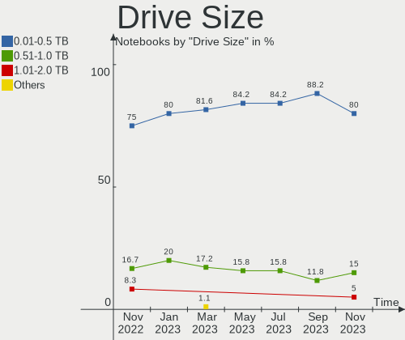
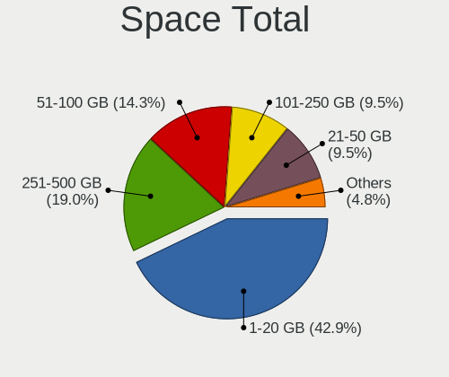
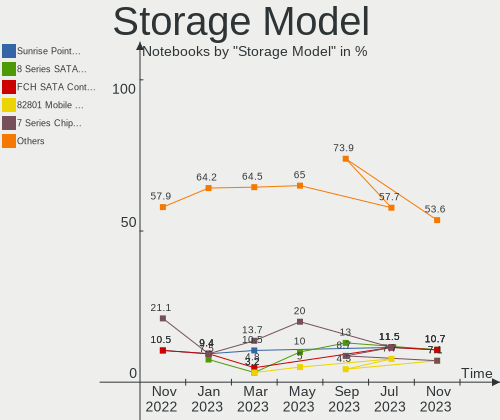
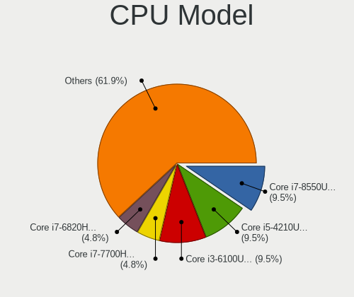
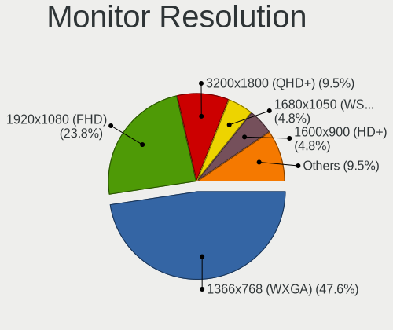
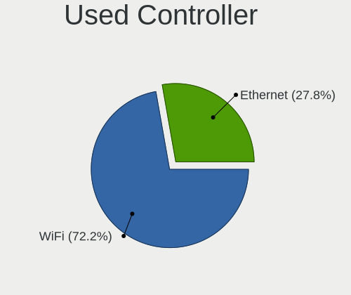
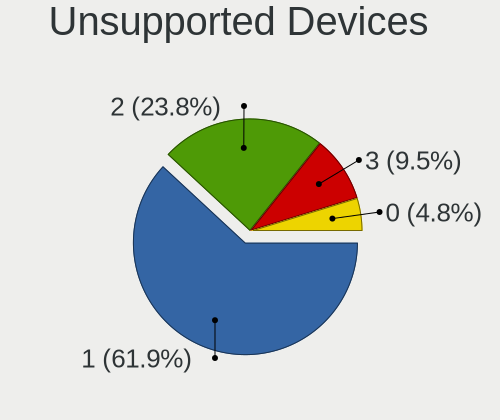

helloSystem Hardware Trends (Notebook)
--------------------------------------

A project to identify most popular hardware characteristics and track their change
over time based on data collected by helloSystem users at https://BSD-Hardware.info.

Anyone can contribute to the study by uploading probes of their computers by
the [hw-probe](https://github.com/linuxhw/hw-probe/blob/master/INSTALL.BSD.md) tool:

    hw-probe -all -upload

Full-feature report is available here: https://bsd-hardware.info/?view=trends&formfactor=notebook

Period: Mar, 2021.

Contents
--------

- [ OS                       ](#os)
- [ OS Family                ](#os-family)
- [ Arch                     ](#arch)
- [ DE                       ](#de)
- [ Display Server           ](#display-server)
- [ Display Manager          ](#display-manager)
- [ OS Lang                  ](#os-lang)
- [ Boot Mode                ](#boot-mode)
- [ Filesystem               ](#filesystem)
- [ Part. scheme             ](#part-scheme)
- [ Country                  ](#country)
- [ City                     ](#city)
- [ Vendor                   ](#vendor)
- [ Model                    ](#model)
- [ Model Family             ](#model-family)
- [ MFG Year                 ](#mfg-year)
- [ Form Factor              ](#form-factor)
- [ Coreboot                 ](#coreboot)
- [ RAM Size                 ](#ram-size)
- [ RAM Used                 ](#ram-used)
- [ Has CD-ROM               ](#has-cd-rom)
- [ Total Drives             ](#total-drives)
- [ Has Ethernet             ](#has-ethernet)
- [ Has WiFi                 ](#has-wifi)
- [ Has Bluetooth            ](#has-bluetooth)
- [ Drive Vendor             ](#drive-vendor)
- [ Drive Model              ](#drive-model)
- [ HDD Vendor               ](#hdd-vendor)
- [ SSD Vendor               ](#ssd-vendor)
- [ Drive Kind               ](#drive-kind)
- [ Drive Connector          ](#drive-connector)
- [ Drive Size               ](#drive-size)
- [ Space Total              ](#space-total)
- [ Space Used               ](#space-used)
- [ Malfunc. Drives          ](#malfunc-drives)
- [ Malfunc. Drive Vendor    ](#malfunc-drive-vendor)
- [ Malfunc. HDD Vendor      ](#malfunc-hdd-vendor)
- [ Malfunc. Drive Kind      ](#malfunc-drive-kind)
- [ Failed Drives            ](#failed-drives)
- [ Failed Drive Vendor      ](#failed-drive-vendor)
- [ Drive Status             ](#drive-status)
- [ Storage Vendor           ](#storage-vendor)
- [ Storage Model            ](#storage-model)
- [ Storage Kind             ](#storage-kind)
- [ CPU Vendor               ](#cpu-vendor)
- [ CPU Model                ](#cpu-model)
- [ CPU Model Family         ](#cpu-model-family)
- [ CPU Cores                ](#cpu-cores)
- [ CPU Sockets              ](#cpu-sockets)
- [ CPU Threads              ](#cpu-threads)
- [ CPU Microarch            ](#cpu-microarch)
- [ GPU Vendor               ](#gpu-vendor)
- [ GPU Model                ](#gpu-model)
- [ GPU Combo                ](#gpu-combo)
- [ GPU Driver               ](#gpu-driver)
- [ GPU Memory               ](#gpu-memory)
- [ Monitor Vendor           ](#monitor-vendor)
- [ Monitor Model            ](#monitor-model)
- [ Monitor Resolution       ](#monitor-resolution)
- [ Monitor Diagonal         ](#monitor-diagonal)
- [ Monitor Width            ](#monitor-width)
- [ Aspect Ratio             ](#aspect-ratio)
- [ Monitor Area             ](#monitor-area)
- [ Pixel Density            ](#pixel-density)
- [ Multiple Monitors        ](#multiple-monitors)
- [ Net Controller Vendor    ](#net-controller-vendor)
- [ Net Controller Model     ](#net-controller-model)
- [ Wireless Vendor          ](#wireless-vendor)
- [ Wireless Model           ](#wireless-model)
- [ Ethernet Vendor          ](#ethernet-vendor)
- [ Ethernet Model           ](#ethernet-model)
- [ Net Controller Kind      ](#net-controller-kind)
- [ Used Controller          ](#used-controller)
- [ NICs                     ](#nics)
- [ IPv6                     ](#ipv6)
- [ Memory Vendor            ](#memory-vendor)
- [ Memory Model             ](#memory-model)
- [ Memory Kind              ](#memory-kind)
- [ Memory Form Factor       ](#memory-form-factor)
- [ Memory Size              ](#memory-size)
- [ Memory Speed             ](#memory-speed)
- [ Sound Vendor             ](#sound-vendor)
- [ Sound Model              ](#sound-model)
- [ Camera Vendor            ](#camera-vendor)
- [ Camera Model             ](#camera-model)
- [ Fingerprint Vendor       ](#fingerprint-vendor)
- [ Fingerprint Model        ](#fingerprint-model)
- [ Chipcard Vendor          ](#chipcard-vendor)
- [ Chipcard Model           ](#chipcard-model)
- [ Printer Vendor           ](#printer-vendor)
- [ Printer Model            ](#printer-model)
- [ Scanner Vendor           ](#scanner-vendor)
- [ Scanner Model            ](#scanner-model)
- [ Bluetooth Vendor         ](#bluetooth-vendor)
- [ Bluetooth Model          ](#bluetooth-model)
- [ Unsupported Devices      ](#unsupported-devices)
- [ Unsupported Device Types ](#unsupported-device-types)

OS
--

Installed operating systems

| Name              | Notebooks | Percent |
|-------------------|-----------|---------|
| helloSystem 0.5.0 | 21        | 67.74%  |
| helloSystem 0.4.0 | 10        | 32.26%  |

OS Family
---------

OS without a version

| Name        | Notebooks | Percent |
|-------------|-----------|---------|
| helloSystem | 31        | 100%    |

Arch
----

OS architecture (x86_64, i586, etc.)

| Name  | Notebooks | Percent |
|-------|-----------|---------|
| amd64 | 31        | 100%    |

DE
--

Desktop Environment

| Name         | Notebooks | Percent |
|--------------|-----------|---------|
| helloDesktop | 30        | 96.77%  |
| KDE5         | 1         | 3.23%   |

Display Server
--------------

X11 or Wayland

| Name | Notebooks | Percent |
|------|-----------|---------|
| X11  | 31        | 100%    |

Display Manager
---------------

SDDM, LightDM, etc.

| Name | Notebooks | Percent |
|------|-----------|---------|
| SLiM | 31        | 100%    |

OS Lang
-------

Language

| Lang  | Notebooks | Percent |
|-------|-----------|---------|
| en_US | 30        | 96.77%  |
| fr_FR | 1         | 3.23%   |

Boot Mode
---------

EFI or BIOS

| Mode | Notebooks | Percent |
|------|-----------|---------|
| EFI  | 26        | 83.87%  |
| BIOS | 5         | 16.13%  |

Filesystem
----------

Type of filesystem

| Type | Notebooks | Percent |
|------|-----------|---------|
| Zfs  | 31        | 100%    |

Part. scheme
------------

Scheme of partitioning

| Type | Notebooks | Percent |
|------|-----------|---------|
| GPT  | 31        | 100%    |

Country
-------

Geographic location (country)

| Country     | Notebooks | Percent |
|-------------|-----------|---------|
| Germany     | 5         | 16.13%  |
| USA         | 3         | 9.68%   |
| UK          | 3         | 9.68%   |
| Netherlands | 3         | 9.68%   |
| China       | 3         | 9.68%   |
| Canada      | 3         | 9.68%   |
| Brazil      | 3         | 9.68%   |
| Ukraine     | 1         | 3.23%   |
| Spain       | 1         | 3.23%   |
| Italy       | 1         | 3.23%   |
| Indonesia   | 1         | 3.23%   |
| India       | 1         | 3.23%   |
| Greece      | 1         | 3.23%   |
| Cyprus      | 1         | 3.23%   |
| Argentina   | 1         | 3.23%   |

City
----

Geographic location (city)

| City                  | Notebooks | Percent |
|-----------------------|-----------|---------|
| Zhengzhou             | 1         | 3.23%   |
| Vigonovo              | 1         | 3.23%   |
| Victoria              | 1         | 3.23%   |
| The Bronx             | 1         | 3.23%   |
| Surabaya              | 1         | 3.23%   |
| Sao Jeronimo da Serra | 1         | 3.23%   |
| Sandhausen            | 1         | 3.23%   |
| Pleidelsheim          | 1         | 3.23%   |
| Oosterhout            | 1         | 3.23%   |
| Notting Hill Gate     | 1         | 3.23%   |
| Nanjing               | 1         | 3.23%   |
| Mar del Plata         | 1         | 3.23%   |
| Lucknow               | 1         | 3.23%   |
| Limassol              | 1         | 3.23%   |
| Leipzig               | 1         | 3.23%   |
| Kherson               | 1         | 3.23%   |
| Halle                 | 1         | 3.23%   |
| Guelph                | 1         | 3.23%   |
| Guangzhou             | 1         | 3.23%   |
| Gloucester            | 1         | 3.23%   |
| Gatineau              | 1         | 3.23%   |
| Franca                | 1         | 3.23%   |
| Fortaleza             | 1         | 3.23%   |
| Forest City           | 1         | 3.23%   |
| Esparragosa de Lares  | 1         | 3.23%   |
| Eisenach              | 1         | 3.23%   |
| Deventer              | 1         | 3.23%   |
| Cuijk                 | 1         | 3.23%   |
| Chattahoochee Hills   | 1         | 3.23%   |
| Athens                | 1         | 3.23%   |
| Aberdeen              | 1         | 3.23%   |

Vendor
------

Motherboard manufacturer

| Name                | Notebooks | Percent |
|---------------------|-----------|---------|
| Lenovo              | 8         | 25.81%  |
| Dell                | 8         | 25.81%  |
| ASUSTek Computer    | 4         | 12.9%   |
| Toshiba             | 2         | 6.45%   |
| Hewlett-Packard     | 2         | 6.45%   |
| Acer                | 2         | 6.45%   |
| TUXEDO              | 1         | 3.23%   |
| Samsung Electronics | 1         | 3.23%   |
| Packard Bell        | 1         | 3.23%   |
| Fujitsu             | 1         | 3.23%   |
| Apple               | 1         | 3.23%   |

Model
-----

Motherboard model

| Name                                | Notebooks | Percent |
|-------------------------------------|-----------|---------|
| Dell Inspiron 7520                  | 2         | 6.45%   |
| TUXEDO Aura 15 Gen1                 | 1         | 3.23%   |
| Toshiba Satellite Pro U400          | 1         | 3.23%   |
| Toshiba Satellite L500              | 1         | 3.23%   |
| Samsung 530U3C/530U4C/532U3C        | 1         | 3.23%   |
| Packard Bell EasyNote MH36          | 1         | 3.23%   |
| Lenovo ThinkPad X260 20F5S82N00     | 1         | 3.23%   |
| Lenovo ThinkPad X230 23255Y4        | 1         | 3.23%   |
| Lenovo ThinkPad T61 766416U         | 1         | 3.23%   |
| Lenovo ThinkPad T530 2392ASU        | 1         | 3.23%   |
| Lenovo ThinkPad T440s 20ARS1B704    | 1         | 3.23%   |
| Lenovo IdeaPad 700-15ISK 80RU       | 1         | 3.23%   |
| Lenovo B41-80 80LG                  | 1         | 3.23%   |
| Lenovo 3000 N200 0769AP2            | 1         | 3.23%   |
| HP Pavilion Notebook                | 1         | 3.23%   |
| HP Pavilion Gaming Laptop 15-ec1xxx | 1         | 3.23%   |
| Fujitsu LIFEBOOK A555               | 1         | 3.23%   |
| Dell Vostro 14-3468                 | 1         | 3.23%   |
| Dell Latitude E6500                 | 1         | 3.23%   |
| Dell Latitude E5570                 | 1         | 3.23%   |
| Dell Inspiron 7370                  | 1         | 3.23%   |
| Dell Inspiron 3543                  | 1         | 3.23%   |
| Dell Inspiron 3442                  | 1         | 3.23%   |
| ASUS X55CR                          | 1         | 3.23%   |
| ASUS X556UA                         | 1         | 3.23%   |
| ASUS X540UP                         | 1         | 3.23%   |
| ASUS G75VW                          | 1         | 3.23%   |
| Apple MacBookPro5,5                 | 1         | 3.23%   |
| Acer Aspire 8730                    | 1         | 3.23%   |
| Acer Aspire 4810T                   | 1         | 3.23%   |

Model Family
------------

Motherboard model prefix

| Name                  | Notebooks | Percent |
|-----------------------|-----------|---------|
| Lenovo ThinkPad       | 5         | 16.13%  |
| Dell Inspiron         | 5         | 16.13%  |
| Toshiba Satellite     | 2         | 6.45%   |
| HP Pavilion           | 2         | 6.45%   |
| Dell Latitude         | 2         | 6.45%   |
| Acer Aspire           | 2         | 6.45%   |
| TUXEDO Aura           | 1         | 3.23%   |
| Samsung 530U3C        | 1         | 3.23%   |
| Packard Bell EasyNote | 1         | 3.23%   |
| Lenovo IdeaPad        | 1         | 3.23%   |
| Lenovo B41-80         | 1         | 3.23%   |
| Lenovo 3000           | 1         | 3.23%   |
| Fujitsu LIFEBOOK      | 1         | 3.23%   |
| Dell Vostro           | 1         | 3.23%   |
| ASUS X55CR            | 1         | 3.23%   |
| ASUS X556UA           | 1         | 3.23%   |
| ASUS X540UP           | 1         | 3.23%   |
| ASUS G75VW            | 1         | 3.23%   |
| Apple MacBookPro5     | 1         | 3.23%   |

MFG Year
--------

Motherboard manufacture year

| Year | Notebooks | Percent |
|------|-----------|---------|
| 2019 | 6         | 19.35%  |
| 2020 | 5         | 16.13%  |
| 2009 | 5         | 16.13%  |
| 2013 | 4         | 12.9%   |
| 2018 | 3         | 9.68%   |
| 2017 | 2         | 6.45%   |
| 2008 | 2         | 6.45%   |
| 2016 | 1         | 3.23%   |
| 2015 | 1         | 3.23%   |
| 2012 | 1         | 3.23%   |
| 2007 | 1         | 3.23%   |

Form Factor
-----------

Physical design of the computer

| Name     | Notebooks | Percent |
|----------|-----------|---------|
| Notebook | 31        | 100%    |

Coreboot
--------

Have coreboot on board

| Used | Notebooks | Percent |
|------|-----------|---------|
| No   | 31        | 100%    |

RAM Size
--------

Total RAM memory

| Size in GB | Notebooks | Percent |
|------------|-----------|---------|
| 4.01-8.0   | 16        | 51.61%  |
| 8.01-16.0  | 11        | 35.48%  |
| 16.01-24.0 | 3         | 9.68%   |
| 32.01-64.0 | 1         | 3.23%   |

RAM Used
--------

Used RAM memory

| Used GB   | Notebooks | Percent |
|-----------|-----------|---------|
| 0.01-0.5  | 23        | 74.19%  |
| 0.51-1.0  | 6         | 19.35%  |
| 1.01-2.0  | 1         | 3.23%   |
| 8.01-16.0 | 1         | 3.23%   |

Has CD-ROM
----------

Has CD-ROM on board

| Presented | Notebooks | Percent |
|-----------|-----------|---------|
| Yes       | 17        | 54.84%  |
| No        | 14        | 45.16%  |

Total Drives
------------

Number of drives on board

| Drives | Notebooks | Percent |
|--------|-----------|---------|
| 1      | 23        | 74.19%  |
| 2      | 8         | 25.81%  |

Has Ethernet
------------

Has Ethernet on board

| Presented | Notebooks | Percent |
|-----------|-----------|---------|
| Yes       | 30        | 96.77%  |
| No        | 1         | 3.23%   |

Has WiFi
--------

Has WiFi module

| Presented | Notebooks | Percent |
|-----------|-----------|---------|
| Yes       | 31        | 100%    |

Has Bluetooth
-------------

Has Bluetooth module

| Presented | Notebooks | Percent |
|-----------|-----------|---------|
| Yes       | 20        | 64.52%  |
| No        | 11        | 35.48%  |

Drive Vendor
------------

Hard drive vendors

| Vendor              | Notebooks | Drives | Percent |
|---------------------|-----------|--------|---------|
| Samsung Electronics | 9         | 9      | 24.32%  |
| Hitachi             | 4         | 5      | 10.81%  |
| WDC                 | 3         | 4      | 8.11%   |
| Toshiba             | 3         | 3      | 8.11%   |
| Seagate             | 3         | 3      | 8.11%   |
| Crucial             | 3         | 3      | 8.11%   |
| SanDisk             | 2         | 2      | 5.41%   |
| Transcend           | 1         | 1      | 2.7%    |
| SMART               | 1         | 1      | 2.7%    |
| Micron Technology   | 1         | 1      | 2.7%    |
| Kingston            | 1         | 1      | 2.7%    |
| KingSpec            | 1         | 1      | 2.7%    |
| Intel               | 1         | 1      | 2.7%    |
| HPE                 | 1         | 1      | 2.7%    |
| HGST                | 1         | 1      | 2.7%    |
| Fujitsu             | 1         | 1      | 2.7%    |
| A-DATA Technology   | 1         | 2      | 2.7%    |

Drive Model
-----------

Hard drive models

| Model                            | Notebooks | Percent |
|----------------------------------|-----------|---------|
| WDC WDS200T2B0A 2TB              | 1         | 2.56%   |
| WDC WD3200BEVT-22ZCT0 320GB      | 1         | 2.56%   |
| WDC WD3200BEKT-60V5T1 320GB      | 1         | 2.56%   |
| WDC WD10JPVT-00A1YT0 1TB         | 1         | 2.56%   |
| Transcend TS512GMTS430S 512GB    | 1         | 2.56%   |
| Toshiba MQ02ABF050H-SSHD-8GB     | 1         | 2.56%   |
| Toshiba MQ01ABD032 320GB         | 1         | 2.56%   |
| Toshiba MK3261GSYN 320GB         | 1         | 2.56%   |
| SMART SSD XceedValue2 mSATA 32GB | 1         | 2.56%   |
| Seagate ST9320325AS 320GB        | 1         | 2.56%   |
| Seagate ST9160412AS 160GB        | 1         | 2.56%   |
| Seagate ST500LM000-SSHD-8GB      | 1         | 2.56%   |
| SanDisk SSD i100 24GB            | 1         | 2.56%   |
| SanDisk SD8SBAT256G1002 256GB    | 1         | 2.56%   |
| Samsung SSD 980 PRO 500GB        | 1         | 2.56%   |
| Samsung SSD 860 EVO 500GB        | 1         | 2.56%   |
| Samsung SSD 860 EVO 250GB        | 1         | 2.56%   |
| Samsung SSD 850 EVO 250GB        | 1         | 2.56%   |
| Samsung SSD 840 EVO 250GB        | 1         | 2.56%   |
| Samsung MZ7TD256HAFV-000L7 256GB | 1         | 2.56%   |
| Samsung MZ7LN256HCHP-000F0 256GB | 1         | 2.56%   |
| Samsung HN-M101MBB 1TB           | 1         | 2.56%   |
| Samsung HM321HI 320GB            | 1         | 2.56%   |
| Micron 1100 SATA 256GB           | 1         | 2.56%   |
| Kingston SA400M8240G 240GB       | 1         | 2.56%   |
| KingSpec P3-120 120GB            | 1         | 2.56%   |
| Intel SSDSCKGF256A5 SATA 256GB   | 1         | 2.56%   |
| HPE MK000480GWUGF 480GB          | 1         | 2.56%   |
| Hitachi HTS727550A9E364 500GB    | 1         | 2.56%   |
| Hitachi HTS545050B9A300 500GB    | 1         | 2.56%   |
| Hitachi HTS545050A7E380 500GB    | 1         | 2.56%   |
| Hitachi HTS545025B9SA02 250GB    | 1         | 2.56%   |
| HGST HTS721010A9E630 1TB         | 1         | 2.56%   |
| Fujitsu MHW2160BH 160GB          | 1         | 2.56%   |
| Crucial CT960BX500SSD1 960GB     | 1         | 2.56%   |
| Crucial CT250MX500SSD1 250GB     | 1         | 2.56%   |
| Crucial CT1000MX500SSD1 1TB      | 1         | 2.56%   |
| A-DATA SU650 240GB               | 1         | 2.56%   |
| A-DATA SU650 120GB               | 1         | 2.56%   |

HDD Vendor
----------

Hard disk drive vendors

| Vendor              | Notebooks | Drives | Percent |
|---------------------|-----------|--------|---------|
| Hitachi             | 4         | 5      | 23.53%  |
| WDC                 | 3         | 3      | 17.65%  |
| Toshiba             | 3         | 3      | 17.65%  |
| Seagate             | 3         | 3      | 17.65%  |
| Samsung Electronics | 2         | 2      | 11.76%  |
| HGST                | 1         | 1      | 5.88%   |
| Fujitsu             | 1         | 1      | 5.88%   |

SSD Vendor
----------

Solid state drive vendors

| Vendor              | Notebooks | Drives | Percent |
|---------------------|-----------|--------|---------|
| Samsung Electronics | 6         | 6      | 30%     |
| Crucial             | 3         | 3      | 15%     |
| SanDisk             | 2         | 2      | 10%     |
| WDC                 | 1         | 1      | 5%      |
| Transcend           | 1         | 1      | 5%      |
| SMART               | 1         | 1      | 5%      |
| Micron Technology   | 1         | 1      | 5%      |
| Kingston            | 1         | 1      | 5%      |
| KingSpec            | 1         | 1      | 5%      |
| Intel               | 1         | 1      | 5%      |
| HPE                 | 1         | 1      | 5%      |
| A-DATA Technology   | 1         | 2      | 5%      |

Drive Kind
----------

HDD or SSD

| Kind | Notebooks | Drives | Percent |
|------|-----------|--------|---------|
| SSD  | 18        | 21     | 50%     |
| HDD  | 17        | 18     | 47.22%  |
| NVMe | 1         | 1      | 2.78%   |

Drive Connector
---------------

SATA, SAS, NVMe, etc.

| Type | Notebooks | Drives | Percent |
|------|-----------|--------|---------|
| SATA | 30        | 39     | 96.77%  |
| NVMe | 1         | 1      | 3.23%   |

Drive Size
----------

Size of hard drive

| Size in TB | Notebooks | Drives | Percent |
|------------|-----------|--------|---------|
| 0.01-0.5   | 25        | 32     | 78.13%  |
| 0.51-1.0   | 6         | 6      | 18.75%  |
| 1.01-2.0   | 1         | 1      | 3.13%   |

Space Total
-----------

Amount of disk space available on the file system

| Size in GB | Notebooks | Percent |
|------------|-----------|---------|
| 1-20       | 19        | 61.29%  |
| 251-500    | 6         | 19.35%  |
| 101-250    | 5         | 16.13%  |
| 501-1000   | 1         | 3.23%   |

Space Used
----------

Amount of used disk space

| Used GB | Notebooks | Percent |
|---------|-----------|---------|
| 1-20    | 31        | 100%    |

Malfunc. Drives
---------------

Drive models with a malfunction

| Model                             | Notebooks | Drives | Percent |
|-----------------------------------|-----------|--------|---------|
| WDC WDS200T2B0A 2TB               | 1         | 1      | 7.14%   |
| WDC WD3200BEVT-22ZCT0 320GB       | 1         | 1      | 7.14%   |
| WDC WD3200BEKT-60V5T1 320GB       | 1         | 1      | 7.14%   |
| Toshiba MQ02ABF050H-SSHD-8GB      | 1         | 1      | 7.14%   |
| Toshiba MQ01ABD032 320GB          | 1         | 1      | 7.14%   |
| Toshiba MK3261GSYN 320GB          | 1         | 1      | 7.14%   |
| Seagate ST9320325AS 320GB         | 1         | 1      | 7.14%   |
| Seagate ST9160412AS 160GB         | 1         | 1      | 7.14%   |
| Samsung Electronics HM321HI 320GB | 1         | 1      | 7.14%   |
| Hitachi HTS545050B9A300 500GB     | 1         | 1      | 7.14%   |
| Hitachi HTS545050A7E380 500GB     | 1         | 1      | 7.14%   |
| Hitachi HTS545025B9SA02 250GB     | 1         | 1      | 7.14%   |
| HGST HTS721010A9E630 1TB          | 1         | 1      | 7.14%   |
| Fujitsu MHW2160BH 160GB           | 1         | 1      | 7.14%   |

Malfunc. Drive Vendor
---------------------

Vendors of faulty drives

| Vendor              | Notebooks | Drives | Percent |
|---------------------|-----------|--------|---------|
| WDC                 | 3         | 3      | 21.43%  |
| Toshiba             | 3         | 3      | 21.43%  |
| Hitachi             | 3         | 3      | 21.43%  |
| Seagate             | 2         | 2      | 14.29%  |
| Samsung Electronics | 1         | 1      | 7.14%   |
| HGST                | 1         | 1      | 7.14%   |
| Fujitsu             | 1         | 1      | 7.14%   |

Malfunc. HDD Vendor
-------------------

Vendors of faulty HDD drives

| Vendor              | Notebooks | Drives | Percent |
|---------------------|-----------|--------|---------|
| Toshiba             | 3         | 3      | 23.08%  |
| Hitachi             | 3         | 3      | 23.08%  |
| WDC                 | 2         | 2      | 15.38%  |
| Seagate             | 2         | 2      | 15.38%  |
| Samsung Electronics | 1         | 1      | 7.69%   |
| HGST                | 1         | 1      | 7.69%   |
| Fujitsu             | 1         | 1      | 7.69%   |

Malfunc. Drive Kind
-------------------

Kinds of faulty drives

| Kind | Notebooks | Drives | Percent |
|------|-----------|--------|---------|
| HDD  | 13        | 13     | 92.86%  |
| SSD  | 1         | 1      | 7.14%   |

Failed Drives
-------------

Failed drive models

| Model                   | Notebooks | Drives | Percent |
|-------------------------|-----------|--------|---------|
| HPE MK000480GWUGF 480GB | 1         | 1      | 100%    |

Failed Drive Vendor
-------------------

Failed drive vendors

| Vendor | Notebooks | Drives | Percent |
|--------|-----------|--------|---------|
| HPE    | 1         | 1      | 100%    |

Drive Status
------------

Number of failed and malfunc. drives

| Status  | Notebooks | Drives | Percent |
|---------|-----------|--------|---------|
| Works   | 21        | 25     | 58.33%  |
| Malfunc | 14        | 14     | 38.89%  |
| Failed  | 1         | 1      | 2.78%   |

Storage Vendor
--------------

Storage controller vendors

| Vendor              | Notebooks | Percent |
|---------------------|-----------|---------|
| Intel               | 28        | 90.32%  |
| Samsung Electronics | 1         | 3.23%   |
| Nvidia              | 1         | 3.23%   |
| AMD                 | 1         | 3.23%   |

Storage Model
-------------

Storage controller models

| Model                                                                 | Notebooks | Percent |
|-----------------------------------------------------------------------|-----------|---------|
| Intel Sunrise Point-LP SATA Controller [AHCI mode]                    | 7         | 20%     |
| Intel 7 Series Chipset Family 6-port SATA Controller [AHCI mode]      | 5         | 14.29%  |
| Intel 82801IBM/IEM (ICH9M/ICH9M-E) 4 port SATA Controller [AHCI mode] | 4         | 11.43%  |
| Intel Wildcat Point-LP SATA Controller [AHCI Mode]                    | 2         | 5.71%   |
| Intel HM170/QM170 Chipset SATA Controller [AHCI Mode]                 | 2         | 5.71%   |
| Intel 82801HM/HEM (ICH8M/ICH8M-E) SATA Controller [AHCI mode]         | 2         | 5.71%   |
| Intel 82801HM/HEM (ICH8M/ICH8M-E) IDE Controller                      | 2         | 5.71%   |
| Intel 82801 Mobile SATA Controller [RAID mode]                        | 2         | 5.71%   |
| Intel 8 Series SATA Controller 1 [AHCI mode]                          | 2         | 5.71%   |
| Samsung NVMe SSD Controller PM9A1/980PRO                              | 1         | 2.86%   |
| Nvidia MCP79 AHCI Controller                                          | 1         | 2.86%   |
| Intel Mobile 4 Series Chipset PT IDER Controller                      | 1         | 2.86%   |
| Intel 82801IBM/IEM (ICH9M/ICH9M-E) 2 port SATA Controller [IDE mode]  | 1         | 2.86%   |
| Intel 7 Series Chipset Family 4-port SATA Controller [IDE mode]       | 1         | 2.86%   |
| Intel 7 Series Chipset Family 2-port SATA Controller [IDE mode]       | 1         | 2.86%   |
| AMD FCH SATA Controller [AHCI mode]                                   | 1         | 2.86%   |

Storage Kind
------------

Kind of storage controller (IDE, SATA, NVMe, SAS, ...)

| Kind | Notebooks | Percent |
|------|-----------|---------|
| SATA | 26        | 76.47%  |
| IDE  | 5         | 14.71%  |
| RAID | 2         | 5.88%   |
| NVMe | 1         | 2.94%   |

CPU Vendor
----------

Processor vendors

| Vendor | Notebooks | Percent |
|--------|-----------|---------|
| Intel  | 29        | 93.55%  |
| AMD    | 2         | 6.45%   |

CPU Model
---------

Processor models

| Model                                  | Notebooks | Percent |
|----------------------------------------|-----------|---------|
| Intel CPU Version                      | 5         | 16.13%  |
| Intel Core i5-7200U CPU @ 2.50GHz      | 2         | 6.45%   |
| Intel Core i5-6300U CPU @ 2.40GHz      | 2         | 6.45%   |
| Intel Core i5-6200U CPU @ 2.30GHz      | 2         | 6.45%   |
| Intel Core i7-6700HQ CPU @ 2.60GHz     | 1         | 3.23%   |
| Intel Core i7-4600U CPU @ 2.10GHz      | 1         | 3.23%   |
| Intel Core i7-3632QM CPU @ 2.20GHz     | 1         | 3.23%   |
| Intel Core i7-3630QM CPU @ 2.40GHz     | 1         | 3.23%   |
| Intel Core i7-3520M CPU @ 2.90GHz      | 1         | 3.23%   |
| Intel Core i5-8250U CPU @ 1.60GHz      | 1         | 3.23%   |
| Intel Core i5-6300HQ CPU @ 2.30GHz     | 1         | 3.23%   |
| Intel Core i5-5200U CPU @ 2.20GHz      | 1         | 3.23%   |
| Intel Core i5-3320M CPU @ 2.60GHz      | 1         | 3.23%   |
| Intel Core i5-3210M CPU @ 2.50GHz      | 1         | 3.23%   |
| Intel Core i5-2537M CPU @ 1.40GHz      | 1         | 3.23%   |
| Intel Core i3-5005U CPU @ 2.00GHz      | 1         | 3.23%   |
| Intel Core i3-4005U CPU @ 1.70GHz      | 1         | 3.23%   |
| Intel Core i3-2370M CPU @ 2.40GHz      | 1         | 3.23%   |
| Intel Core 2 Solo CPU U3500 @ 1.40GHz  | 1         | 3.23%   |
| Intel Core 2 Duo CPU T7300 @ 2.00GHz   | 1         | 3.23%   |
| Intel Core 2 Duo CPU P8700 @ 2.53GHz   | 1         | 3.23%   |
| Intel Core 2 Duo                       | 1         | 3.23%   |
| AMD Ryzen 7 4700U with Radeon Graphics | 1         | 3.23%   |
| AMD Ryzen 5 4600H with Radeon Graphics | 1         | 3.23%   |

CPU Model Family
----------------

Processor model prefix

| Model             | Notebooks | Percent |
|-------------------|-----------|---------|
| Intel Core i5     | 12        | 38.71%  |
| Other             | 5         | 16.13%  |
| Intel Core i7     | 5         | 16.13%  |
| Intel Core i3     | 3         | 9.68%   |
| Intel Core 2 Duo  | 3         | 9.68%   |
| Intel Core 2 Solo | 1         | 3.23%   |
| AMD Ryzen 7       | 1         | 3.23%   |
| AMD Ryzen 5       | 1         | 3.23%   |

CPU Cores
---------

Number of processor cores

| Number  | Notebooks | Percent |
|---------|-----------|---------|
| 2       | 20        | 64.52%  |
| 4       | 5         | 16.13%  |
| Unknown | 3         | 9.68%   |
| 12      | 1         | 3.23%   |
| 8       | 1         | 3.23%   |
| 1       | 1         | 3.23%   |

CPU Sockets
-----------

Number of sockets

| Number | Notebooks | Percent |
|--------|-----------|---------|
| 1      | 30        | 96.77%  |
| 2      | 1         | 3.23%   |

CPU Threads
-----------

Threads per core (Hyper-Threading)

| Number  | Notebooks | Percent |
|---------|-----------|---------|
| 2       | 19        | 61.29%  |
| 1       | 8         | 25.81%  |
| Unknown | 4         | 12.9%   |

CPU Microarch
-------------

Microarchitecture

| Name        | Notebooks | Percent |
|-------------|-----------|---------|
| Skylake     | 6         | 19.35%  |
| Penryn      | 6         | 19.35%  |
| IvyBridge   | 5         | 16.13%  |
| KabyLake    | 3         | 9.68%   |
| Core        | 3         | 9.68%   |
| Zen 2       | 2         | 6.45%   |
| SandyBridge | 2         | 6.45%   |
| Haswell     | 2         | 6.45%   |
| Broadwell   | 2         | 6.45%   |

GPU Vendor
----------

Vendors of graphics cards

| Vendor | Notebooks | Percent |
|--------|-----------|---------|
| Intel  | 23        | 60.53%  |
| Nvidia | 9         | 23.68%  |
| AMD    | 6         | 15.79%  |

GPU Model
---------

Graphics card models

| Model                                                                         | Notebooks | Percent |
|-------------------------------------------------------------------------------|-----------|---------|
| Intel Skylake GT2 [HD Graphics 520]                                           | 4         | 10.53%  |
| Intel Mobile 4 Series Chipset Integrated Graphics Controller                  | 4         | 10.53%  |
| Intel 3rd Gen Core processor Graphics Controller                              | 4         | 10.53%  |
| Intel HD Graphics 620                                                         | 2         | 5.26%   |
| Intel HD Graphics 5500                                                        | 2         | 5.26%   |
| Intel HD Graphics 530                                                         | 2         | 5.26%   |
| Intel Haswell-ULT Integrated Graphics Controller                              | 2         | 5.26%   |
| Intel 2nd Generation Core Processor Family Integrated Graphics Controller     | 2         | 5.26%   |
| AMD Renoir                                                                    | 2         | 5.26%   |
| AMD Chelsea LP [Radeon HD 7730M]                                              | 2         | 5.26%   |
| Nvidia TU117M                                                                 | 1         | 2.63%   |
| Nvidia GM107M [GeForce GTX 960M]                                              | 1         | 2.63%   |
| Nvidia GM107M [GeForce GTX 950M]                                              | 1         | 2.63%   |
| Nvidia GK107M [GeForce GTX 660M]                                              | 1         | 2.63%   |
| Nvidia G98M [Quadro NVS 160M]                                                 | 1         | 2.63%   |
| Nvidia G96CM [GeForce 9600M GT]                                               | 1         | 2.63%   |
| Nvidia G86M [Quadro NVS 140M]                                                 | 1         | 2.63%   |
| Nvidia G72M [Quadro NVS 110M/GeForce Go 7300]                                 | 1         | 2.63%   |
| Nvidia C79 [GeForce 9400M]                                                    | 1         | 2.63%   |
| Intel UHD Graphics 620                                                        | 1         | 2.63%   |
| AMD Sun XT [Radeon HD 8670A/8670M/8690M / R5 M330 / M430 / Radeon 520 Mobile] | 1         | 2.63%   |
| AMD Sun LE [Radeon HD 8550M / R5 M230]                                        | 1         | 2.63%   |

GPU Combo
---------

Combinations of graphics cards

| Name           | Notebooks | Percent |
|----------------|-----------|---------|
| 1 x Intel      | 13        | 41.94%  |
| 1 x Nvidia     | 6         | 19.35%  |
| 2 x Intel      | 4         | 12.9%   |
| Intel + AMD    | 4         | 12.9%   |
| Intel + Nvidia | 2         | 6.45%   |
| AMD + Nvidia   | 1         | 3.23%   |
| 1 x AMD        | 1         | 3.23%   |

GPU Driver
----------

Free vs proprietary

| Driver      | Notebooks | Percent |
|-------------|-----------|---------|
| Free        | 23        | 74.19%  |
| Unknown     | 6         | 19.35%  |
| Proprietary | 2         | 6.45%   |

GPU Memory
----------

Total video memory

| Size in GB | Notebooks | Percent |
|------------|-----------|---------|
| Unknown    | 30        | 96.77%  |
| 1.01-2.0   | 1         | 3.23%   |

Monitor Vendor
--------------

Monitor vendors

| Vendor                  | Notebooks | Percent |
|-------------------------|-----------|---------|
| AU Optronics            | 5         | 20.83%  |
| Samsung Electronics     | 4         | 16.67%  |
| LG Display              | 4         | 16.67%  |
| Chimei Innolux          | 3         | 12.5%   |
| BOE                     | 3         | 12.5%   |
| Chi Mei Optoelectronics | 2         | 8.33%   |
| LG Philips              | 1         | 4.17%   |
| Lenovo                  | 1         | 4.17%   |
| AOC                     | 1         | 4.17%   |

Monitor Model
-------------

Monitor models

| Model                                                                     | Notebooks | Percent |
|---------------------------------------------------------------------------|-----------|---------|
| Samsung Electronics SyncMaster SAM03E4 1680x1050 470x300mm 22.0-inch      | 1         | 4.17%   |
| Samsung Electronics LCD Monitor SEC5441 1280x800 330x210mm 15.4-inch      | 1         | 4.17%   |
| Samsung Electronics LCD Monitor SEC3047 1366x768 280x160mm 12.7-inch      | 1         | 4.17%   |
| Samsung Electronics LCD Monitor SDC324D 1366x768 310x170mm 13.9-inch      | 1         | 4.17%   |
| LG Philips LCD Monitor LPL3B01 1280x800 330x210mm 15.4-inch               | 1         | 4.17%   |
| LG Display LCD Monitor LGD0532 1920x1080 340x190mm 15.3-inch              | 1         | 4.17%   |
| LG Display LCD Monitor LGD0527 1366x768 310x170mm 13.9-inch               | 1         | 4.17%   |
| LG Display LCD Monitor LGD02DC 1366x768 340x190mm 15.3-inch               | 1         | 4.17%   |
| LG Display LCD Monitor LGD0230 1366x768 340x190mm 15.3-inch               | 1         | 4.17%   |
| Lenovo LCD Monitor LEN40B1 1600x900 340x190mm 15.3-inch                   | 1         | 4.17%   |
| Chimei Innolux LCD Monitor CMN14A1 1366x768 310x170mm 13.9-inch           | 1         | 4.17%   |
| Chimei Innolux LCD Monitor CMN1404 1920x1080 310x170mm 13.9-inch          | 1         | 4.17%   |
| Chimei Innolux LCD Monitor CMN1367 1920x1080 290x170mm 13.2-inch          | 1         | 4.17%   |
| Chi Mei Optoelectronics LCD Monitor CMO1720 1920x1080 380x210mm 17.1-inch | 1         | 4.17%   |
| Chi Mei Optoelectronics LCD Monitor CMO1312 1280x800 290x180mm 13.4-inch  | 1         | 4.17%   |
| BOE LCD Monitor BOE0691 1920x1080 280x160mm 12.7-inch                     | 1         | 4.17%   |
| BOE LCD Monitor BOE065D 1920x1080 340x190mm 15.3-inch                     | 1         | 4.17%   |
| BOE LCD Monitor BOE062C 1366x768 340x190mm 15.3-inch                      | 1         | 4.17%   |
| AU Optronics LCD Monitor AUO70EC 1366x768 340x190mm 15.3-inch             | 1         | 4.17%   |
| AU Optronics LCD Monitor AUO40EC 1366x768 340x190mm 15.3-inch             | 1         | 4.17%   |
| AU Optronics LCD Monitor AUO38ED 1920x1080 340x190mm 15.3-inch            | 1         | 4.17%   |
| AU Optronics LCD Monitor AUO323C 1366x768 310x170mm 13.9-inch             | 1         | 4.17%   |
| AU Optronics LCD Monitor AUO21ED 1920x1080 340x190mm 15.3-inch            | 1         | 4.17%   |
| AOC T2242we AOC2242 1920x1080 480x270mm 21.7-inch                         | 1         | 4.17%   |

Monitor Resolution
------------------

Monitor screen resolution

| Resolution         | Notebooks | Percent |
|--------------------|-----------|---------|
| 1366x768 (WXGA)    | 11        | 45.83%  |
| 1920x1080 (FHD)    | 9         | 37.5%   |
| 1280x800 (WXGA)    | 2         | 8.33%   |
| 1680x1050 (WSXGA+) | 1         | 4.17%   |
| 1600x900 (HD+)     | 1         | 4.17%   |

Monitor Diagonal
----------------

Diagonal size in inches

| Inches | Notebooks | Percent |
|--------|-----------|---------|
| 15     | 12        | 50%     |
| 13     | 7         | 29.17%  |
| 12     | 2         | 8.33%   |
| 22     | 1         | 4.17%   |
| 21     | 1         | 4.17%   |
| 17     | 1         | 4.17%   |

Monitor Width
-------------

Physical width

| Width in mm | Notebooks | Percent |
|-------------|-----------|---------|
| 301-350     | 17        | 70.83%  |
| 201-300     | 4         | 16.67%  |
| 401-500     | 2         | 8.33%   |
| 351-400     | 1         | 4.17%   |

Aspect Ratio
------------

Proportional relationship between the width and the height

| Ratio | Notebooks | Percent |
|-------|-----------|---------|
| 16/9  | 19        | 82.61%  |
| 16/10 | 4         | 17.39%  |

Monitor Area
------------

Area in inch²

| Area in inch² | Notebooks | Percent |
|----------------|-----------|---------|
| 91-100         | 9         | 37.5%   |
| 81-90          | 6         | 25%     |
| 101-110        | 3         | 12.5%   |
| 61-70          | 2         | 8.33%   |
| 201-250        | 2         | 8.33%   |
| 71-80          | 1         | 4.17%   |
| 121-130        | 1         | 4.17%   |

Pixel Density
-------------

Pixels per inch

| Density | Notebooks | Percent |
|---------|-----------|---------|
| 101-120 | 11        | 47.83%  |
| 121-160 | 7         | 30.43%  |
| 51-100  | 3         | 13.04%  |
| 161-240 | 2         | 8.7%    |

Multiple Monitors
-----------------

Total monitors connected

| Total | Notebooks | Percent |
|-------|-----------|---------|
| 1     | 21        | 67.74%  |
| 0     | 8         | 25.81%  |
| 2     | 2         | 6.45%   |

Net Controller Vendor
---------------------

Controller vendors

| Vendor                            | Notebooks | Percent |
|-----------------------------------|-----------|---------|
| Intel                             | 19        | 35.85%  |
| Realtek Semiconductor             | 17        | 32.08%  |
| Qualcomm Atheros                  | 9         | 16.98%  |
| Broadcom Inc. and subsidiaries    | 3         | 5.66%   |
| Ralink                            | 1         | 1.89%   |
| Nvidia                            | 1         | 1.89%   |
| Marvell Technology Group          | 1         | 1.89%   |
| Ericsson Business Mobile Networks | 1         | 1.89%   |
| AboCom Systems                    | 1         | 1.89%   |

Net Controller Model
--------------------

Controller models

| Model                                                                        | Notebooks | Percent |
|------------------------------------------------------------------------------|-----------|---------|
| Realtek RTL8111/8168/8411 PCI Express Gigabit Ethernet Controller            | 11        | 16.92%  |
| Realtek RTL810xE PCI Express Fast Ethernet controller                        | 5         | 7.69%   |
| Qualcomm Atheros QCA9565 / AR9565 Wireless Network Adapter                   | 3         | 4.62%   |
| Qualcomm Atheros AR9485 Wireless Network Adapter                             | 3         | 4.62%   |
| Intel Wireless 7265                                                          | 3         | 4.62%   |
| Realtek RTL8188EUS 802.11n Wireless Network Adapter                          | 2         | 3.08%   |
| Intel Wireless 8260                                                          | 2         | 3.08%   |
| Intel WiFi Link 5100                                                         | 2         | 3.08%   |
| Intel Wi-Fi 6 AX200                                                          | 2         | 3.08%   |
| Intel Ethernet Connection I219-LM                                            | 2         | 3.08%   |
| Intel Dual Band Wireless-AC 3165 Plus Bluetooth                              | 2         | 3.08%   |
| Intel Centrino Advanced-N 6205 [Taylor Peak]                                 | 2         | 3.08%   |
| Intel 82579LM Gigabit Network Connection (Lewisville)                        | 2         | 3.08%   |
| Realtek RTL8191SEvB Wireless LAN Controller                                  | 1         | 1.54%   |
| Realtek RTL8188CE 802.11b/g/n WiFi Adapter                                   | 1         | 1.54%   |
| Ralink RT2790 Wireless 802.11n 1T/2R PCIe                                    | 1         | 1.54%   |
| Qualcomm Atheros QCA9377 802.11ac Wireless Network Adapter                   | 1         | 1.54%   |
| Qualcomm Atheros AR928X Wireless Network Adapter (PCI-Express)               | 1         | 1.54%   |
| Qualcomm Atheros AR8161 Gigabit Ethernet                                     | 1         | 1.54%   |
| Qualcomm Atheros AR8151 v2.0 Gigabit Ethernet                                | 1         | 1.54%   |
| Qualcomm Atheros AR8131 Gigabit Ethernet                                     | 1         | 1.54%   |
| Nvidia MCP79 Ethernet                                                        | 1         | 1.54%   |
| Marvell Group 88E8072 PCI-E Gigabit Ethernet Controller                      | 1         | 1.54%   |
| Intel Wireless 7260                                                          | 1         | 1.54%   |
| Intel Ultimate N WiFi Link 5300                                              | 1         | 1.54%   |
| Intel PRO/Wireless 4965 AG or AGN [Kedron] Network Connection                | 1         | 1.54%   |
| Intel PRO/Wireless 3945ABG [Golan] Network Connection                        | 1         | 1.54%   |
| Intel Ethernet Connection I218-LM                                            | 1         | 1.54%   |
| Intel Centrino Wireless-N 2230                                               | 1         | 1.54%   |
| Intel Centrino Advanced-N 6235                                               | 1         | 1.54%   |
| Intel 82567LM Gigabit Network Connection                                     | 1         | 1.54%   |
| Intel 82566MM Gigabit Network Connection                                     | 1         | 1.54%   |
| Ericsson Business Mobile Networks H5321 gw Mobile Broadband Module           | 1         | 1.54%   |
| Broadcom Inc. and subsidiaries NetXtreme BCM5764M Gigabit Ethernet PCIe      | 1         | 1.54%   |
| Broadcom Inc. and subsidiaries NetLink BCM5906M Fast Ethernet PCI Express    | 1         | 1.54%   |
| Broadcom Inc. and subsidiaries BCM4322 802.11a/b/g/n Wireless LAN Controller | 1         | 1.54%   |
| AboCom Systems 802.11n/b/g Mini Wireless LAN USB2.0 Adapter                  | 1         | 1.54%   |

Wireless Vendor
---------------

Wireless vendors

| Vendor                         | Notebooks | Percent |
|--------------------------------|-----------|---------|
| Intel                          | 19        | 55.88%  |
| Qualcomm Atheros               | 8         | 23.53%  |
| Realtek Semiconductor          | 4         | 11.76%  |
| Ralink                         | 1         | 2.94%   |
| Broadcom Inc. and subsidiaries | 1         | 2.94%   |
| AboCom Systems                 | 1         | 2.94%   |

Wireless Model
--------------

Wireless models

| Model                                                                        | Notebooks | Percent |
|------------------------------------------------------------------------------|-----------|---------|
| Qualcomm Atheros QCA9565 / AR9565 Wireless Network Adapter                   | 3         | 8.82%   |
| Qualcomm Atheros AR9485 Wireless Network Adapter                             | 3         | 8.82%   |
| Intel Wireless 7265                                                          | 3         | 8.82%   |
| Realtek RTL8188EUS 802.11n Wireless Network Adapter                          | 2         | 5.88%   |
| Intel Wireless 8260                                                          | 2         | 5.88%   |
| Intel WiFi Link 5100                                                         | 2         | 5.88%   |
| Intel Wi-Fi 6 AX200                                                          | 2         | 5.88%   |
| Intel Dual Band Wireless-AC 3165 Plus Bluetooth                              | 2         | 5.88%   |
| Intel Centrino Advanced-N 6205 [Taylor Peak]                                 | 2         | 5.88%   |
| Realtek RTL8191SEvB Wireless LAN Controller                                  | 1         | 2.94%   |
| Realtek RTL8188CE 802.11b/g/n WiFi Adapter                                   | 1         | 2.94%   |
| Ralink RT2790 Wireless 802.11n 1T/2R PCIe                                    | 1         | 2.94%   |
| Qualcomm Atheros QCA9377 802.11ac Wireless Network Adapter                   | 1         | 2.94%   |
| Qualcomm Atheros AR928X Wireless Network Adapter (PCI-Express)               | 1         | 2.94%   |
| Intel Wireless 7260                                                          | 1         | 2.94%   |
| Intel Ultimate N WiFi Link 5300                                              | 1         | 2.94%   |
| Intel PRO/Wireless 4965 AG or AGN [Kedron] Network Connection                | 1         | 2.94%   |
| Intel PRO/Wireless 3945ABG [Golan] Network Connection                        | 1         | 2.94%   |
| Intel Centrino Wireless-N 2230                                               | 1         | 2.94%   |
| Intel Centrino Advanced-N 6235                                               | 1         | 2.94%   |
| Broadcom Inc. and subsidiaries BCM4322 802.11a/b/g/n Wireless LAN Controller | 1         | 2.94%   |
| AboCom Systems 802.11n/b/g Mini Wireless LAN USB2.0 Adapter                  | 1         | 2.94%   |

Ethernet Vendor
---------------

Ethernet vendors

| Vendor                         | Notebooks | Percent |
|--------------------------------|-----------|---------|
| Realtek Semiconductor          | 16        | 53.33%  |
| Intel                          | 7         | 23.33%  |
| Qualcomm Atheros               | 3         | 10%     |
| Broadcom Inc. and subsidiaries | 2         | 6.67%   |
| Nvidia                         | 1         | 3.33%   |
| Marvell Technology Group       | 1         | 3.33%   |

Ethernet Model
--------------

Ethernet models

| Model                                                                     | Notebooks | Percent |
|---------------------------------------------------------------------------|-----------|---------|
| Realtek RTL8111/8168/8411 PCI Express Gigabit Ethernet Controller         | 11        | 36.67%  |
| Realtek RTL810xE PCI Express Fast Ethernet controller                     | 5         | 16.67%  |
| Intel Ethernet Connection I219-LM                                         | 2         | 6.67%   |
| Intel 82579LM Gigabit Network Connection (Lewisville)                     | 2         | 6.67%   |
| Qualcomm Atheros AR8161 Gigabit Ethernet                                  | 1         | 3.33%   |
| Qualcomm Atheros AR8151 v2.0 Gigabit Ethernet                             | 1         | 3.33%   |
| Qualcomm Atheros AR8131 Gigabit Ethernet                                  | 1         | 3.33%   |
| Nvidia MCP79 Ethernet                                                     | 1         | 3.33%   |
| Marvell Group 88E8072 PCI-E Gigabit Ethernet Controller                   | 1         | 3.33%   |
| Intel Ethernet Connection I218-LM                                         | 1         | 3.33%   |
| Intel 82567LM Gigabit Network Connection                                  | 1         | 3.33%   |
| Intel 82566MM Gigabit Network Connection                                  | 1         | 3.33%   |
| Broadcom Inc. and subsidiaries NetXtreme BCM5764M Gigabit Ethernet PCIe   | 1         | 3.33%   |
| Broadcom Inc. and subsidiaries NetLink BCM5906M Fast Ethernet PCI Express | 1         | 3.33%   |

Net Controller Kind
-------------------

Ethernet, WiFi or modem

| Kind     | Notebooks | Percent |
|----------|-----------|---------|
| WiFi     | 31        | 50%     |
| Ethernet | 30        | 48.39%  |
| Modem    | 1         | 1.61%   |

Used Controller
---------------

Currently used network controller

| Kind     | Notebooks | Percent |
|----------|-----------|---------|
| Ethernet | 29        | 50.88%  |
| WiFi     | 28        | 49.12%  |

NICs
----

Total network controllers on board

| Total | Notebooks | Percent |
|-------|-----------|---------|
| 2     | 30        | 96.77%  |
| 1     | 1         | 3.23%   |

IPv6
----

IPv6 vs IPv4

| Used | Notebooks | Percent |
|------|-----------|---------|
| No   | 29        | 93.55%  |
| Yes  | 2         | 6.45%   |

Memory Vendor
-------------

Memory module vendors

| Vendor              | Notebooks | Percent |
|---------------------|-----------|---------|
| SK Hynix            | 9         | 25.71%  |
| Samsung Electronics | 7         | 20%     |
| Elpida              | 5         | 14.29%  |
| Unknown             | 4         | 11.43%  |
| Micron Technology   | 3         | 8.57%   |
| Teikon              | 2         | 5.71%   |
| Kingston            | 2         | 5.71%   |
| Toshiba             | 1         | 2.86%   |
| Crucial             | 1         | 2.86%   |
| Corsair             | 1         | 2.86%   |

Memory Model
------------

Memory module models

| Model                                                           | Notebooks | Percent |
|-----------------------------------------------------------------|-----------|---------|
| SK Hynix RAM HMA451S6AFR8N-TF 4096MB SODIMM DDR4 2133MT/s       | 2         | 5.26%   |
| Samsung RAM M471B5173QH0-YK0 4096MB SODIMM DDR3 1600MT/s        | 2         | 5.26%   |
| Unknown SODIMM 2048MB SODIMM DDR2 533MT/s                       | 1         | 2.63%   |
| Unknown RAM Module 2048MB SODIMM DDR2 667MT/s                   | 1         | 2.63%   |
| Unknown RAM Module 2048MB SODIMM 800MT/s                        | 1         | 2.63%   |
| Unknown RAM Module 2048MB SODIMM 667MT/s                        | 1         | 2.63%   |
| Toshiba RAM 8HTF12864HDY-800G1 2048MB SODIMM 800MT/s            | 1         | 2.63%   |
| Toshiba RAM 64T128020EDL2.5C2 2048MB SODIMM 800MT/s             | 1         | 2.63%   |
| Teikon RAM TMT451S6BFR8A-PBSC 4096MB SODIMM DDR3 1600MT/s       | 1         | 2.63%   |
| Teikon RAM TML251S6EFR8A-PBHC 4096MB SODIMM DDR3 1600MT/s       | 1         | 2.63%   |
| SK Hynix RAM HYMP125S64CP8-S6 2048MB SODIMM DDR2 975MT/s        | 1         | 2.63%   |
| SK Hynix RAM HMT451S6BFR8A-PB 4GB SODIMM DDR3 1600MT/s          | 1         | 2.63%   |
| SK Hynix RAM HMT351S6CFR8C-PB 4GB SODIMM DDR3 1600MT/s          | 1         | 2.63%   |
| SK Hynix RAM HMT325S6CFR8C-PB 2048MB SODIMM DDR3 1600MT/s       | 1         | 2.63%   |
| SK Hynix RAM HMA851S6AFR6N-UH 4096MB SODIMM DDR4 2400MT/s       | 1         | 2.63%   |
| SK Hynix RAM HMA851S6AFR6N-UH 4096MB Row Of Chips DDR4 2400MT/s | 1         | 2.63%   |
| SK Hynix RAM HMA81GS6AFR8N-UH 8192MB Chip DDR4 2133MT/s         | 1         | 2.63%   |
| Samsung RAM M471B5273CH0-CH9 4GB SODIMM DDR3 1333MT/s           | 1         | 2.63%   |
| Samsung RAM M471B1G73QH0-YK0 8GB SODIMM DDR3 1600MT/s           | 1         | 2.63%   |
| Samsung RAM M471A5644EB0-CPB 2048MB SODIMM DDR4 2133MT/s        | 1         | 2.63%   |
| Samsung RAM M471A5143EB0-CPB 4096MB SODIMM DDR4 2133MT/s        | 1         | 2.63%   |
| Samsung RAM M471A2K43CB1-CTD 16384MB SODIMM DDR4 2667MT/s       | 1         | 2.63%   |
| Samsung RAM M471A1K43DB1-CWE 8GB SODIMM DDR4 3200MT/s           | 1         | 2.63%   |
| Samsung RAM M471A1G43DB0-CPB 8192MB SODIMM DDR4 2133MT/s        | 1         | 2.63%   |
| Micron RAM MT41K512M16TNA-125 4096MB Chip DDR3 1600MT/s         | 1         | 2.63%   |
| Micron RAM 8KTF51264HDZ-1G6E1 4096MB SODIMM DDR3 1600MT/s       | 1         | 2.63%   |
| Micron RAM 16KTF1G64HZ-1G9P1 8192MB SODIMM DDR3 1777MT/s        | 1         | 2.63%   |
| Kingston RAM ACR16D3LS1KFG/4G 4GB SODIMM DDR3 1600MT/s          | 1         | 2.63%   |
| Kingston RAM 8ATF51264HZ-2G1A1 4096MB SODIMM DDR4 2133MT/s      | 1         | 2.63%   |
| Elpida RAM EBJ41UF8BDU0-GN-F 4096MB SODIMM DDR3 1333MT/s        | 1         | 2.63%   |
| Elpida RAM EBJ40UG8BBU0-GN-F 4096MB SODIMM DDR3 1333MT/s        | 1         | 2.63%   |
| Elpida RAM EBJ21UE8BBS0-AE-F 2048MB SODIMM 800MT/s              | 1         | 2.63%   |
| Elpida RAM EBJ20UF8BDU0-GN-F 2048MB SODIMM DDR3 1600MT/s        | 1         | 2.63%   |
| Elpida RAM EBE21UE8AFSA-8G-F 2048MB SODIMM DDR2 800MT/s         | 1         | 2.63%   |
| Crucial RAM CB8GS2400.C8ET 8192MB SODIMM DDR4 2400MT/s          | 1         | 2.63%   |
| Corsair RAM Module 4096MB SODIMM DDR3 1067MT/s                  | 1         | 2.63%   |

Memory Kind
-----------

Memory module kinds

| Kind    | Notebooks | Percent |
|---------|-----------|---------|
| DDR3    | 13        | 43.33%  |
| DDR4    | 9         | 30%     |
| DDR2    | 4         | 13.33%  |
| Unknown | 4         | 13.33%  |

Memory Form Factor
------------------

Physical design of the memory module

| Name         | Notebooks | Percent |
|--------------|-----------|---------|
| SODIMM       | 28        | 90.32%  |
| Chip         | 2         | 6.45%   |
| Row Of Chips | 1         | 3.23%   |

Memory Size
-----------

Memory module size

| Size  | Notebooks | Percent |
|-------|-----------|---------|
| 4096  | 15        | 46.88%  |
| 2048  | 11        | 34.38%  |
| 8192  | 5         | 15.63%  |
| 16384 | 1         | 3.13%   |

Memory Speed
------------

Memory module speed

| Speed | Notebooks | Percent |
|-------|-----------|---------|
| 1600  | 11        | 32.35%  |
| 2133  | 5         | 14.71%  |
| 800   | 4         | 11.76%  |
| 2400  | 3         | 8.82%   |
| 1333  | 3         | 8.82%   |
| 667   | 2         | 5.88%   |
| 3200  | 1         | 2.94%   |
| 2667  | 1         | 2.94%   |
| 1777  | 1         | 2.94%   |
| 1067  | 1         | 2.94%   |
| 975   | 1         | 2.94%   |
| 533   | 1         | 2.94%   |

Sound Vendor
------------

Sound card vendors

| Vendor | Notebooks | Percent |
|--------|-----------|---------|
| Intel  | 28        | 84.85%  |
| Nvidia | 3         | 9.09%   |
| AMD    | 2         | 6.06%   |

Sound Model
-----------

Sound card models

| Model                                                               | Notebooks | Percent |
|---------------------------------------------------------------------|-----------|---------|
| Intel Sunrise Point-LP HD Audio                                     | 7         | 18.42%  |
| Intel 7 Series/C216 Chipset Family High Definition Audio Controller | 7         | 18.42%  |
| Intel 82801I (ICH9 Family) HD Audio Controller                      | 6         | 15.79%  |
| Intel Wildcat Point-LP High Definition Audio Controller             | 2         | 5.26%   |
| Intel Haswell-ULT HD Audio Controller                               | 2         | 5.26%   |
| Intel Broadwell-U Audio Controller                                  | 2         | 5.26%   |
| Intel 82801H (ICH8 Family) HD Audio Controller                      | 2         | 5.26%   |
| Intel 8 Series HD Audio Controller                                  | 2         | 5.26%   |
| Intel 100 Series/C230 Series Chipset Family HD Audio Controller     | 2         | 5.26%   |
| AMD Family 17h (Models 10h-1fh) HD Audio Controller                 | 2         | 5.26%   |
| Nvidia TU107 GeForce GTX 1650 High Definition Audio Controller      | 1         | 2.63%   |
| Nvidia MCP79 High Definition Audio                                  | 1         | 2.63%   |
| Nvidia GK107 HDMI Audio Controller                                  | 1         | 2.63%   |
| AMD Renoir Radeon High Definition Audio Controller                  | 1         | 2.63%   |

Camera Vendor
-------------

Camera device vendors

| Vendor                        | Notebooks | Percent |
|-------------------------------|-----------|---------|
| Realtek Semiconductor         | 4         | 22.22%  |
| Microdia                      | 3         | 16.67%  |
| Chicony Electronics           | 3         | 16.67%  |
| Acer                          | 3         | 16.67%  |
| Syntek                        | 1         | 5.56%   |
| Suyin                         | 1         | 5.56%   |
| Sunplus Innovation Technology | 1         | 5.56%   |
| Silicon Motion                | 1         | 5.56%   |
| IMC Networks                  | 1         | 5.56%   |

Camera Model
------------

Camera device models

| Model                                   | Notebooks | Percent |
|-----------------------------------------|-----------|---------|
| Realtek Integrated_Webcam_HD            | 3         | 16.67%  |
| Microdia Laptop_Integrated_Webcam_HD    | 2         | 11.11%  |
| Syntek Lenovo EasyCamera                | 1         | 5.56%   |
| Suyin USB 2.0 Camera                    | 1         | 5.56%   |
| Sunplus ASUS Webcam                     | 1         | 5.56%   |
| Silicon Motion Realtek USB2.0 PC Camera | 1         | 5.56%   |
| Realtek Realtek USB2.0 PC Camera        | 1         | 5.56%   |
| Microdia Integrated_Webcam_HD           | 1         | 5.56%   |
| IMC Networks HP TrueVision HD Camera    | 1         | 5.56%   |
| Chicony UVC 1.00 device HD UVC WebCam   | 1         | 5.56%   |
| Chicony USB2.0 VGA UVC WebCam           | 1         | 5.56%   |
| Chicony Integrated Camera               | 1         | 5.56%   |
| Acer ThinkPad Integrated Camera         | 1         | 5.56%   |
| Acer Lenovo EasyCamera                  | 1         | 5.56%   |
| Acer Integrated Camera                  | 1         | 5.56%   |

Fingerprint Vendor
------------------

Fingerprint sensor vendors

| Vendor             | Notebooks | Percent |
|--------------------|-----------|---------|
| Validity Sensors   | 1         | 33.33%  |
| STMicroelectronics | 1         | 33.33%  |
| AuthenTec          | 1         | 33.33%  |

Fingerprint Model
-----------------

Fingerprint sensor models

| Model                                       | Notebooks | Percent |
|---------------------------------------------|-----------|---------|
| Validity Sensors VFS5011 Fingerprint Reader | 1         | 33.33%  |
| STMicroelectronics Fingerprint Reader       | 1         | 33.33%  |
| AuthenTec AES2501 Fingerprint Sensor        | 1         | 33.33%  |

Chipcard Vendor
---------------

Chipcard module vendors

Zero info for selected period =(

Chipcard Model
--------------

Chipcard module models

Zero info for selected period =(

Printer Vendor
--------------

Printer device vendors

Zero info for selected period =(

Printer Model
-------------

Printer device models

Zero info for selected period =(

Scanner Vendor
--------------

Scanner device vendors

Zero info for selected period =(

Scanner Model
-------------

Scanner device models

Zero info for selected period =(

Bluetooth Vendor
----------------

Controller vendors

| Vendor                          | Notebooks | Percent |
|---------------------------------|-----------|---------|
| Intel                           | 10        | 50%     |
| IMC Networks                    | 3         | 15%     |
| Qualcomm Atheros Communications | 2         | 10%     |
| Realtek Semiconductor           | 1         | 5%      |
| Lite-On Technology              | 1         | 5%      |
| Cambridge Silicon Radio         | 1         | 5%      |
| Broadcom                        | 1         | 5%      |
| Apple                           | 1         | 5%      |

Bluetooth Model
---------------

Controller models

| Model                                               | Notebooks | Percent |
|-----------------------------------------------------|-----------|---------|
| Intel Bluetooth wireless interface                  | 6         | 30%     |
| Intel Centrino Bluetooth Wireless Transceiver       | 2         | 10%     |
| Intel AX200 Bluetooth                               | 2         | 10%     |
| IMC Networks Atheros AR3012 Bluetooth 4.0 Adapter   | 2         | 10%     |
| Realtek CSR Bluetooth Chip                          | 1         | 5%      |
| Qualcomm Atheros Dell Wireless 1703 Bluetooth       | 1         | 5%      |
| Qualcomm Atheros AR9462 Bluetooth                   | 1         | 5%      |
| Lite-On Qualcomm Atheros Bluetooth 4.0 + HS         | 1         | 5%      |
| IMC Networks Qualcomm Atheros Bluetooth 4.0         | 1         | 5%      |
| Cambridge Silicon Radio Bluetooth Dongle (HCI mode) | 1         | 5%      |
| Broadcom BCM20702 Bluetooth 4.0 [ThinkPad]          | 1         | 5%      |
| Apple Bluetooth Host Controller                     | 1         | 5%      |

Unsupported Devices
-------------------

Total unsupported devices on board

| Total | Notebooks | Percent |
|-------|-----------|---------|
| 2     | 12        | 38.71%  |
| 1     | 9         | 29.03%  |
| 3     | 4         | 12.9%   |
| 0     | 4         | 12.9%   |
| 4     | 2         | 6.45%   |

Unsupported Device Types
------------------------

Types of unsupported devices

| Type                     | Notebooks | Percent |
|--------------------------|-----------|---------|
| Communication controller | 21        | 41.18%  |
| Card reader              | 14        | 27.45%  |
| Bluetooth                | 7         | 13.73%  |
| Net/wireless             | 4         | 7.84%   |
| Fingerprint reader       | 3         | 5.88%   |
| Storage                  | 1         | 1.96%   |
| Firewire controller      | 1         | 1.96%   |

