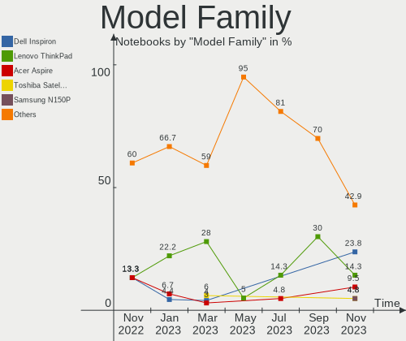
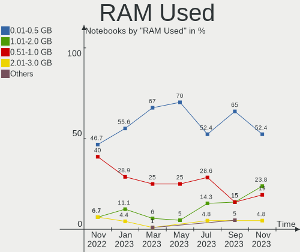
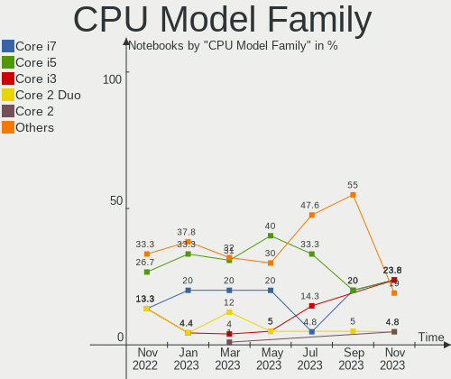
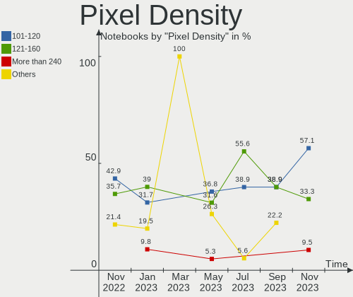
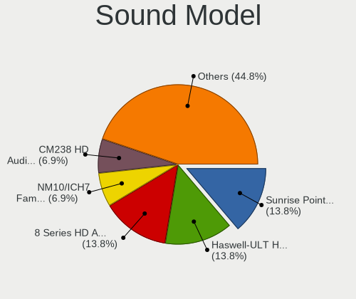

helloSystem Hardware Trends (Notebook)
--------------------------------------

A project to identify most popular hardware characteristics and track their change
over time based on data collected by helloSystem users at https://BSD-Hardware.info.

Anyone can contribute to the study by uploading probes of their computers by
the [hw-probe](https://github.com/linuxhw/hw-probe/blob/master/INSTALL.BSD.md) tool:

    hw-probe -all -upload

Full-feature report is available here: https://bsd-hardware.info/?view=trends&formfactor=notebook

Period: Feb, 2021.

Contents
--------

- [ OS                       ](#os)
- [ OS Family                ](#os-family)
- [ Arch                     ](#arch)
- [ DE                       ](#de)
- [ Display Server           ](#display-server)
- [ Display Manager          ](#display-manager)
- [ OS Lang                  ](#os-lang)
- [ Boot Mode                ](#boot-mode)
- [ Filesystem               ](#filesystem)
- [ Part. scheme             ](#part-scheme)
- [ Country                  ](#country)
- [ City                     ](#city)
- [ Vendor                   ](#vendor)
- [ Model                    ](#model)
- [ Model Family             ](#model-family)
- [ MFG Year                 ](#mfg-year)
- [ Form Factor              ](#form-factor)
- [ Coreboot                 ](#coreboot)
- [ RAM Size                 ](#ram-size)
- [ RAM Used                 ](#ram-used)
- [ Has CD-ROM               ](#has-cd-rom)
- [ Total Drives             ](#total-drives)
- [ Has Ethernet             ](#has-ethernet)
- [ Drive Vendor             ](#drive-vendor)
- [ Drive Model              ](#drive-model)
- [ HDD Vendor               ](#hdd-vendor)
- [ SSD Vendor               ](#ssd-vendor)
- [ Drive Kind               ](#drive-kind)
- [ Drive Connector          ](#drive-connector)
- [ Drive Size               ](#drive-size)
- [ Space Total              ](#space-total)
- [ Space Used               ](#space-used)
- [ Malfunc. Drives          ](#malfunc-drives)
- [ Malfunc. Drive Vendor    ](#malfunc-drive-vendor)
- [ Malfunc. HDD Vendor      ](#malfunc-hdd-vendor)
- [ Malfunc. Drive Kind      ](#malfunc-drive-kind)
- [ Failed Drives            ](#failed-drives)
- [ Failed Drive Vendor      ](#failed-drive-vendor)
- [ Drive Status             ](#drive-status)
- [ Storage Vendor           ](#storage-vendor)
- [ Storage Model            ](#storage-model)
- [ Storage Kind             ](#storage-kind)
- [ CPU Vendor               ](#cpu-vendor)
- [ CPU Model                ](#cpu-model)
- [ CPU Model Family         ](#cpu-model-family)
- [ CPU Cores                ](#cpu-cores)
- [ CPU Sockets              ](#cpu-sockets)
- [ CPU Threads              ](#cpu-threads)
- [ CPU Microarch            ](#cpu-microarch)
- [ GPU Vendor               ](#gpu-vendor)
- [ GPU Model                ](#gpu-model)
- [ GPU Combo                ](#gpu-combo)
- [ GPU Driver               ](#gpu-driver)
- [ GPU Memory               ](#gpu-memory)
- [ Monitor Vendor           ](#monitor-vendor)
- [ Monitor Model            ](#monitor-model)
- [ Monitor Resolution       ](#monitor-resolution)
- [ Monitor Diagonal         ](#monitor-diagonal)
- [ Monitor Width            ](#monitor-width)
- [ Aspect Ratio             ](#aspect-ratio)
- [ Monitor Area             ](#monitor-area)
- [ Pixel Density            ](#pixel-density)
- [ Multiple Monitors        ](#multiple-monitors)
- [ Net Controller Vendor    ](#net-controller-vendor)
- [ Net Controller Model     ](#net-controller-model)
- [ Wireless Vendor          ](#wireless-vendor)
- [ Wireless Model           ](#wireless-model)
- [ Ethernet Vendor          ](#ethernet-vendor)
- [ Ethernet Model           ](#ethernet-model)
- [ Net Controller Kind      ](#net-controller-kind)
- [ Used Controller          ](#used-controller)
- [ NICs                     ](#nics)
- [ Memory Vendor            ](#memory-vendor)
- [ Memory Model             ](#memory-model)
- [ Memory Kind              ](#memory-kind)
- [ Memory Form Factor       ](#memory-form-factor)
- [ Memory Size              ](#memory-size)
- [ Memory Speed             ](#memory-speed)
- [ Sound Vendor             ](#sound-vendor)
- [ Sound Model              ](#sound-model)
- [ Camera Vendor            ](#camera-vendor)
- [ Camera Model             ](#camera-model)
- [ Fingerprint Vendor       ](#fingerprint-vendor)
- [ Fingerprint Model        ](#fingerprint-model)
- [ Chipcard Vendor          ](#chipcard-vendor)
- [ Chipcard Model           ](#chipcard-model)
- [ Printer Vendor           ](#printer-vendor)
- [ Printer Model            ](#printer-model)
- [ Scanner Vendor           ](#scanner-vendor)
- [ Scanner Model            ](#scanner-model)
- [ Bluetooth Vendor         ](#bluetooth-vendor)
- [ Bluetooth Model          ](#bluetooth-model)
- [ Unsupported Devices      ](#unsupported-devices)
- [ Unsupported Device Types ](#unsupported-device-types)

OS
--

Installed operating systems

| Name              | Notebooks | Percent |
|-------------------|-----------|---------|
| helloSystem 0.4.0 | 63        | 72.41%  |
| helloSystem 0.5.0 | 20        | 22.99%  |
| helloSystem 0.3.0 | 4         | 4.6%    |

OS Family
---------

OS without a version

| Name        | Notebooks | Percent |
|-------------|-----------|---------|
| helloSystem | 87        | 100%    |

Arch
----

OS architecture (x86_64, i586, etc.)

| Name  | Notebooks | Percent |
|-------|-----------|---------|
| amd64 | 87        | 100%    |

DE
--

Desktop Environment

| Name         | Notebooks | Percent |
|--------------|-----------|---------|
| helloDesktop | 86        | 98.85%  |
| KDE5         | 1         | 1.15%   |

Display Server
--------------

X11 or Wayland

| Name | Notebooks | Percent |
|------|-----------|---------|
| X11  | 87        | 100%    |

Display Manager
---------------

SDDM, LightDM, etc.

| Name | Notebooks | Percent |
|------|-----------|---------|
| SLiM | 86        | 98.85%  |
| SDDM | 1         | 1.15%   |

OS Lang
-------

Language

| Lang  | Notebooks | Percent |
|-------|-----------|---------|
| en_US | 86        | 98.85%  |
| es_ES | 1         | 1.15%   |

Boot Mode
---------

EFI or BIOS

| Mode | Notebooks | Percent |
|------|-----------|---------|
| EFI  | 75        | 86.21%  |
| BIOS | 12        | 13.79%  |

Filesystem
----------

Type of filesystem

| Type | Notebooks | Percent |
|------|-----------|---------|
| Zfs  | 87        | 100%    |

Part. scheme
------------

Scheme of partitioning

| Type | Notebooks | Percent |
|------|-----------|---------|
| GPT  | 87        | 100%    |

Country
-------

Geographic location (country)

| Country            | Notebooks | Percent |
|--------------------|-----------|---------|
| Germany            | 13        | 14.94%  |
| Brazil             | 12        | 13.79%  |
| USA                | 11        | 12.64%  |
| France             | 7         | 8.05%   |
| Italy              | 6         | 6.9%    |
| Netherlands        | 5         | 5.75%   |
| Sweden             | 4         | 4.6%    |
| Spain              | 3         | 3.45%   |
| Portugal           | 3         | 3.45%   |
| Hungary            | 3         | 3.45%   |
| China              | 3         | 3.45%   |
| UK                 | 2         | 2.3%    |
| Canada             | 2         | 2.3%    |
| Ukraine            | 1         | 1.15%   |
| Switzerland        | 1         | 1.15%   |
| Slovakia           | 1         | 1.15%   |
| Philippines        | 1         | 1.15%   |
| Macau              | 1         | 1.15%   |
| Lithuania          | 1         | 1.15%   |
| Latvia             | 1         | 1.15%   |
| Korea, Republic of | 1         | 1.15%   |
| Greece             | 1         | 1.15%   |
| Finland            | 1         | 1.15%   |
| Croatia            | 1         | 1.15%   |
| Australia          | 1         | 1.15%   |
| Unknown            | 1         | 1.15%   |

City
----

Geographic location (city)

| City                   | Notebooks | Percent |
|------------------------|-----------|---------|
| Linschoten             | 4         | 4.6%    |
| Franconville           | 3         | 3.45%   |
| Xi'an                  | 1         | 1.15%   |
| Wuhan                  | 1         | 1.15%   |
| Visconde do Rio Branco | 1         | 1.15%   |
| Vilnius                | 1         | 1.15%   |
| Villejuif              | 1         | 1.15%   |
| Vigo                   | 1         | 1.15%   |
| Viamão                | 1         | 1.15%   |
| Velika Gorica          | 1         | 1.15%   |
| Union Grove            | 1         | 1.15%   |
| Trieste                | 1         | 1.15%   |
| Toronto                | 1         | 1.15%   |
| Terrassa               | 1         | 1.15%   |
| Tangara                | 1         | 1.15%   |
| Taipa                  | 1         | 1.15%   |
| São Paulo             | 1         | 1.15%   |
| São José dos Pinhais | 1         | 1.15%   |
| Sydney                 | 1         | 1.15%   |
| St Louis               | 1         | 1.15%   |
| Solarino               | 1         | 1.15%   |
| Slijk-Ewijk            | 1         | 1.15%   |
| Schorndorf             | 1         | 1.15%   |
| Sankt Augustin         | 1         | 1.15%   |
| San Benigno Canavese   | 1         | 1.15%   |
| Salzwedel              | 1         | 1.15%   |
| Riga                   | 1         | 1.15%   |
| Pfullingen             | 1         | 1.15%   |
| Pero Pinheiro          | 1         | 1.15%   |
| Oklahoma City          | 1         | 1.15%   |
| Nowon-gu               | 1         | 1.15%   |
| New Braunfels          | 1         | 1.15%   |
| Mutterstadt            | 1         | 1.15%   |
| Monheim am Rhein       | 1         | 1.15%   |
| Miskolc                | 1         | 1.15%   |
| Mesa                   | 1         | 1.15%   |
| Maua                   | 1         | 1.15%   |
| Marica                 | 1         | 1.15%   |
| Malmo                  | 1         | 1.15%   |
| Maia                   | 1         | 1.15%   |
| Londrina               | 1         | 1.15%   |
| Logroño               | 1         | 1.15%   |
| Lisbon                 | 1         | 1.15%   |
| Liptovský Mikuláš   | 1         | 1.15%   |
| Las Vegas              | 1         | 1.15%   |
| Hook                   | 1         | 1.15%   |
| Hindas                 | 1         | 1.15%   |
| Helsinki               | 1         | 1.15%   |
| Haßfurt               | 1         | 1.15%   |
| Hamburg                | 1         | 1.15%   |
| Gävle                 | 1         | 1.15%   |
| Granite City           | 1         | 1.15%   |
| Frisco                 | 1         | 1.15%   |
| Frankfurt am Main      | 1         | 1.15%   |
| Franca                 | 1         | 1.15%   |
| Everett                | 1         | 1.15%   |
| Eskilstuna             | 1         | 1.15%   |
| Ecuvillens             | 1         | 1.15%   |
| Drama                  | 1         | 1.15%   |
| Debrecen               | 1         | 1.15%   |

Vendor
------

Motherboard manufacturer

| Name                | Notebooks | Percent |
|---------------------|-----------|---------|
| Lenovo              | 28        | 32.18%  |
| Dell                | 17        | 19.54%  |
| ASUSTek Computer    | 13        | 14.94%  |
| Hewlett-Packard     | 8         | 9.2%    |
| Apple               | 6         | 6.9%    |
| Samsung Electronics | 4         | 4.6%    |
| Toshiba             | 2         | 2.3%    |
| Fujitsu             | 2         | 2.3%    |
| Packard Bell        | 1         | 1.15%   |
| Medion              | 1         | 1.15%   |
| LG Electronics      | 1         | 1.15%   |
| Hampoo              | 1         | 1.15%   |
| eMachines           | 1         | 1.15%   |
| Clevo               | 1         | 1.15%   |
| Acer                | 1         | 1.15%   |

Model
-----

Motherboard model

| Name                                        | Notebooks | Percent |
|---------------------------------------------|-----------|---------|
| Dell Latitude E4300                         | 2         | 2.3%    |
| Dell Inspiron 3521                          | 2         | 2.3%    |
| Toshiba TECRA M11                           | 1         | 1.15%   |
| Toshiba Satellite U500                      | 1         | 1.15%   |
| Samsung RV411/RV511/E3511/S3511/RV711/E3411 | 1         | 1.15%   |
| Samsung 910S3K/9310SK/910S3P/911S3K         | 1         | 1.15%   |
| Samsung 300V3Z/300V4Z/300V5Z                | 1         | 1.15%   |
| Samsung 300E5M/300E5L                       | 1         | 1.15%   |
| Packard Bell EasyNote TS11HR                | 1         | 1.15%   |
| Medion P6812                                | 1         | 1.15%   |
| LG 14Z980-G.BH51P1                          | 1         | 1.15%   |
| Lenovo ZIUS6                                | 1         | 1.15%   |
| Lenovo Z50-70 20354                         | 1         | 1.15%   |
| Lenovo U310                                 | 1         | 1.15%   |
| Lenovo ThinkPad X260 20F5S1H800             | 1         | 1.15%   |
| Lenovo ThinkPad X240 20AMS4V000             | 1         | 1.15%   |
| Lenovo ThinkPad X200 7459ZLW                | 1         | 1.15%   |
| Lenovo ThinkPad X1 Carbon 5th 20HQS02100    | 1         | 1.15%   |
| Lenovo ThinkPad X1 Carbon 4th 20FCS2K000    | 1         | 1.15%   |
| Lenovo ThinkPad T580 20LAS2TG00             | 1         | 1.15%   |
| Lenovo ThinkPad T490 20RYS06R00             | 1         | 1.15%   |
| Lenovo ThinkPad T470s 20HGS1VD00            | 1         | 1.15%   |
| Lenovo ThinkPad T470p 20J6A012CD            | 1         | 1.15%   |
| Lenovo ThinkPad T460s 20F90037LM            | 1         | 1.15%   |
| Lenovo ThinkPad T440s 20ARS10P05            | 1         | 1.15%   |
| Lenovo ThinkPad T440p 20AWS0U500            | 1         | 1.15%   |
| Lenovo ThinkPad T430 2349PMP                | 1         | 1.15%   |
| Lenovo ThinkPad T430 2349GCG                | 1         | 1.15%   |
| Lenovo ThinkPad T430 23427YU                | 1         | 1.15%   |
| Lenovo ThinkPad T410 253722U                | 1         | 1.15%   |
| Lenovo ThinkPad T400 2768WGC                | 1         | 1.15%   |
| Lenovo ThinkPad L512 25975XU                | 1         | 1.15%   |
| Lenovo ThinkPad L470 20J5S09500             | 1         | 1.15%   |
| Lenovo ThinkPad E490 20N8CTO1WW             | 1         | 1.15%   |
| Lenovo ThinkPad E420 1141A83                | 1         | 1.15%   |
| Lenovo Legion Y530-15ICH 81FV               | 1         | 1.15%   |
| Lenovo IdeaPad S145-15IWL 81S9              | 1         | 1.15%   |
| Lenovo G500 20236                           | 1         | 1.15%   |
| Lenovo G470 20078                           | 1         | 1.15%   |
| HP ProBook 470 G4                           | 1         | 1.15%   |
| HP ProBook 440 G2                           | 1         | 1.15%   |
| HP Pavilion Laptop 14-ce2xxx                | 1         | 1.15%   |
| HP OMEN Laptop 15-en0xxx                    | 1         | 1.15%   |
| HP OMEN by HP Laptop                        | 1         | 1.15%   |
| HP EliteBook 8540p                          | 1         | 1.15%   |
| HP EliteBook 8440p                          | 1         | 1.15%   |
| HP EliteBook 840 G3                         | 1         | 1.15%   |
| Hampoo NA123                                | 1         | 1.15%   |
| Fujitsu LIFEBOOK E753                       | 1         | 1.15%   |
| Fujitsu LIFEBOOK E744                       | 1         | 1.15%   |
| eMachines eME732ZG                          | 1         | 1.15%   |
| Dell XPS 15 9560                            | 1         | 1.15%   |
| Dell XPS 13 9333                            | 1         | 1.15%   |
| Dell Venue 11 Pro 7140                      | 1         | 1.15%   |
| Dell Latitude E7240                         | 1         | 1.15%   |
| Dell Latitude E6420                         | 1         | 1.15%   |
| Dell Latitude E6330                         | 1         | 1.15%   |
| Dell Latitude 7390                          | 1         | 1.15%   |
| Dell Latitude 7380                          | 1         | 1.15%   |
| Dell Latitude 7280                          | 1         | 1.15%   |

Model Family
------------

Motherboard model prefix

| Name                  | Notebooks | Percent |
|-----------------------|-----------|---------|
| Lenovo ThinkPad       | 21        | 24.14%  |
| Dell Latitude         | 10        | 11.49%  |
| Dell Inspiron         | 4         | 4.6%    |
| HP EliteBook          | 3         | 3.45%   |
| HP ProBook            | 2         | 2.3%    |
| HP OMEN               | 2         | 2.3%    |
| Fujitsu LIFEBOOK      | 2         | 2.3%    |
| Dell XPS              | 2         | 2.3%    |
| ASUS VivoBook         | 2         | 2.3%    |
| Toshiba TECRA         | 1         | 1.15%   |
| Toshiba Satellite     | 1         | 1.15%   |
| Samsung RV411         | 1         | 1.15%   |
| Samsung 910S3K        | 1         | 1.15%   |
| Samsung 300V3Z        | 1         | 1.15%   |
| Samsung 300E5M        | 1         | 1.15%   |
| Packard Bell EasyNote | 1         | 1.15%   |
| Medion P6812          | 1         | 1.15%   |
| LG 14Z980-G.BH51P1    | 1         | 1.15%   |
| Lenovo ZIUS6          | 1         | 1.15%   |
| Lenovo Z50-70         | 1         | 1.15%   |
| Lenovo U310           | 1         | 1.15%   |
| Lenovo Legion         | 1         | 1.15%   |
| Lenovo IdeaPad        | 1         | 1.15%   |
| Lenovo G500           | 1         | 1.15%   |
| Lenovo G470           | 1         | 1.15%   |
| HP Pavilion           | 1         | 1.15%   |
| Hampoo NA123          | 1         | 1.15%   |
| eMachines eME732ZG    | 1         | 1.15%   |
| Dell Venue            | 1         | 1.15%   |
| Clevo C41X0           | 1         | 1.15%   |
| ASUS X75VC            | 1         | 1.15%   |
| ASUS X556UA           | 1         | 1.15%   |
| ASUS X555LD           | 1         | 1.15%   |
| ASUS X555LAB          | 1         | 1.15%   |
| ASUS X550LC           | 1         | 1.15%   |
| ASUS X510UQ           | 1         | 1.15%   |
| ASUS X502CA           | 1         | 1.15%   |
| ASUS S551LN           | 1         | 1.15%   |
| ASUS K50IJ            | 1         | 1.15%   |
| ASUS K46CA            | 1         | 1.15%   |
| ASUS G1S              | 1         | 1.15%   |
| Apple MacBookPro9     | 1         | 1.15%   |
| Apple MacBookPro8     | 1         | 1.15%   |
| Apple MacBookPro6     | 1         | 1.15%   |
| Apple MacBookAir4     | 1         | 1.15%   |
| Apple MacBook6        | 1         | 1.15%   |
| Apple MacBook5        | 1         | 1.15%   |
| Acer Aspire           | 1         | 1.15%   |

MFG Year
--------

Motherboard manufacture year

| Year | Notebooks | Percent |
|------|-----------|---------|
| 2020 | 21        | 24.14%  |
| 2013 | 12        | 13.79%  |
| 2019 | 11        | 12.64%  |
| 2018 | 7         | 8.05%   |
| 2017 | 6         | 6.9%    |
| 2015 | 6         | 6.9%    |
| 2009 | 6         | 6.9%    |
| 2016 | 4         | 4.6%    |
| 2011 | 4         | 4.6%    |
| 2010 | 4         | 4.6%    |
| 2014 | 3         | 3.45%   |
| 2012 | 2         | 2.3%    |
| 2007 | 1         | 1.15%   |

Form Factor
-----------

Physical design of the computer

| Name     | Notebooks | Percent |
|----------|-----------|---------|
| Notebook | 87        | 100%    |

Coreboot
--------

Have coreboot on board

| Used | Notebooks | Percent |
|------|-----------|---------|
| No   | 87        | 100%    |

RAM Size
--------

Total RAM memory

| Size in GB | Notebooks | Percent |
|------------|-----------|---------|
| 4.01-8.0   | 35        | 40.23%  |
| 8.01-16.0  | 34        | 39.08%  |
| 16.01-24.0 | 15        | 17.24%  |
| 32.01-64.0 | 2         | 2.3%    |
| 24.01-32.0 | 1         | 1.15%   |

RAM Used
--------

Used RAM memory

| Used GB  | Notebooks | Percent |
|----------|-----------|---------|
| 0.01-0.5 | 58        | 66.67%  |
| 0.51-1.0 | 23        | 26.44%  |
| 2.01-3.0 | 3         | 3.45%   |
| 1.01-2.0 | 3         | 3.45%   |

Has CD-ROM
----------

Has CD-ROM on board

| Presented | Notebooks | Percent |
|-----------|-----------|---------|
| No        | 46        | 52.87%  |
| Yes       | 41        | 47.13%  |

Total Drives
------------

Number of drives on board

| Drives | Notebooks | Percent |
|--------|-----------|---------|
| 1      | 70        | 80.46%  |
| 2      | 12        | 13.79%  |
| 0      | 5         | 5.75%   |

Has Ethernet
------------

Has Ethernet on board

| Presented | Notebooks | Percent |
|-----------|-----------|---------|
| Yes       | 77        | 88.51%  |
| No        | 10        | 11.49%  |

Drive Vendor
------------

Hard drive vendors

| Vendor              | Notebooks | Drives | Percent |
|---------------------|-----------|--------|---------|
| Samsung Electronics | 16        | 18     | 17.2%   |
| WDC                 | 13        | 14     | 13.98%  |
| Seagate             | 9         | 9      | 9.68%   |
| Toshiba             | 8         | 8      | 8.6%    |
| Crucial             | 8         | 8      | 8.6%    |
| Kingston            | 7         | 7      | 7.53%   |
| SanDisk             | 4         | 4      | 4.3%    |
| LITEON              | 3         | 3      | 3.23%   |
| Hitachi             | 3         | 3      | 3.23%   |
| SPCC                | 2         | 2      | 2.15%   |
| PNY                 | 2         | 2      | 2.15%   |
| OCZ                 | 2         | 2      | 2.15%   |
| Micron Technology   | 2         | 2      | 2.15%   |
| Apple               | 2         | 2      | 2.15%   |
| Transcend           | 1         | 1      | 1.08%   |
| SK Hynix            | 1         | 1      | 1.08%   |
| Patriot             | 1         | 1      | 1.08%   |
| MyDigitalSSD        | 1         | 1      | 1.08%   |
| LITEONIT            | 1         | 1      | 1.08%   |
| Lexar               | 1         | 1      | 1.08%   |
| Intenso             | 1         | 1      | 1.08%   |
| Intel               | 1         | 1      | 1.08%   |
| Hikvision           | 1         | 1      | 1.08%   |
| Hewlett-Packard     | 1         | 1      | 1.08%   |
| China               | 1         | 1      | 1.08%   |
| A-DATA Technology   | 1         | 1      | 1.08%   |

Drive Model
-----------

Hard drive models

| Model                                | Notebooks | Percent |
|--------------------------------------|-----------|---------|
| WDC WDS240G2G0A-00JH30 240GB         | 2         | 2.08%   |
| WDC WD1600BEVS-08VAT2 160GB          | 2         | 2.08%   |
| Toshiba MQ01ABF050 500GB             | 2         | 2.08%   |
| Toshiba MQ01ABD100 1TB               | 2         | 2.08%   |
| Seagate ST750LM022 HN-M750MBB 752GB  | 2         | 2.08%   |
| Seagate ST1000LM049-2GH172 1TB       | 2         | 2.08%   |
| Samsung SSD 850 EVO 250GB            | 2         | 2.08%   |
| Micron 1100 SATA 256GB               | 2         | 2.08%   |
| Kingston SV300S37A120G 120GB         | 2         | 2.08%   |
| WDC WDS120G1G0A-00SS50 120GB         | 1         | 1.04%   |
| WDC WD5000LPCX-21VHAT0 500GB         | 1         | 1.04%   |
| WDC WD1600BEVS-60RST0 160GB          | 1         | 1.04%   |
| WDC WD10SPZX-24Z10 1TB               | 1         | 1.04%   |
| WDC WD10JPVX-35JC3T0 1TB             | 1         | 1.04%   |
| WDC WD10JPVX-00JC3T0 1TB             | 1         | 1.04%   |
| WDC WD10JMVW-11AJGS0 1TB             | 1         | 1.04%   |
| WDC PC SN730 SDBPNTY-1T00-1006 1TB   | 1         | 1.04%   |
| WDC PC SN530 SDBPNPZ-256G-1002 256GB | 1         | 1.04%   |
| WDC PC SN520 SDAPMUW-128G-1101 128GB | 1         | 1.04%   |
| Transcend TSA 240GB                  | 1         | 1.04%   |
| Toshiba THNSN5512GPUK NVMe 512GB     | 1         | 1.04%   |
| Toshiba MK5065GSXF 500GB             | 1         | 1.04%   |
| Toshiba MK2555GSXF 250GB             | 1         | 1.04%   |
| Toshiba KXG60ZNV512G NVMe 512GB      | 1         | 1.04%   |
| SPCC Solid State Disk 512GB          | 1         | 1.04%   |
| SPCC Solid State Disk 1TB            | 1         | 1.04%   |
| SK Hynix 120GB SSD                   | 1         | 1.04%   |
| Seagate ST9500420AS 500GB            | 1         | 1.04%   |
| Seagate ST9250315AS 250GB            | 1         | 1.04%   |
| Seagate ST9160412ASG 160GB           | 1         | 1.04%   |
| Seagate ST320LT012-9WS14C 320GB      | 1         | 1.04%   |
| Seagate ST1000LM035-1RK172 1TB       | 1         | 1.04%   |
| SanDisk SDSSDP256G 256GB             | 1         | 1.04%   |
| SanDisk SDSSDA120G 120GB             | 1         | 1.04%   |
| SanDisk SD8SB8U128G1001 128GB        | 1         | 1.04%   |
| SanDisk SD7SN6S-256G-1006 256GB      | 1         | 1.04%   |
| Samsung SSD PM851 mSATA 256GB        | 1         | 1.04%   |
| Samsung SSD 970 EVO 250GB            | 1         | 1.04%   |
| Samsung SSD 860 EVO 500GB            | 1         | 1.04%   |
| Samsung SSD 860 EVO 250GB            | 1         | 1.04%   |
| Samsung SSD 860 EVO 1TB              | 1         | 1.04%   |
| Samsung SSD 850 EVO 500GB            | 1         | 1.04%   |
| Samsung SSD 840 EVO 250GB            | 1         | 1.04%   |
| Samsung SSD 840 EVO 1TB              | 1         | 1.04%   |
| Samsung SSD 840 EVO 120GB            | 1         | 1.04%   |
| Samsung SG9MSM6D024GPM00 22GB        | 1         | 1.04%   |
| Samsung MZYTE256HMHP-000L2 256GB     | 1         | 1.04%   |
| Samsung MZVLW256HEHP-000L7 256GB     | 1         | 1.04%   |
| Samsung MZVLB256HBHQ-000L7 256GB     | 1         | 1.04%   |
| Samsung MZ7LN256HCHP-000L7 256GB     | 1         | 1.04%   |
| Samsung MZ7LF192HCGS-000L1 192GB     | 1         | 1.04%   |
| Samsung HM500JI 500GB                | 1         | 1.04%   |
| PNY CS900 240GB SSD                  | 1         | 1.04%   |
| PNY CS1311 240GB SSD                 | 1         | 1.04%   |
| Patriot Burst 240GB                  | 1         | 1.04%   |
| OCZ VERTEX3 120GB                    | 1         | 1.04%   |
| OCZ TRION150 480GB                   | 1         | 1.04%   |
| MyDigitalSSD SC2 M2 SSD 120GB        | 1         | 1.04%   |
| LITEONIT LMT-256L9M-11 MSATA 256GB   | 1         | 1.04%   |
| LITEON LJH-64V2G-11 M.2 2260 64GB    | 1         | 1.04%   |

HDD Vendor
----------

Hard disk drive vendors

| Vendor              | Notebooks | Drives | Percent |
|---------------------|-----------|--------|---------|
| Seagate             | 9         | 9      | 33.33%  |
| WDC                 | 8         | 8      | 29.63%  |
| Toshiba             | 6         | 6      | 22.22%  |
| Hitachi             | 3         | 3      | 11.11%  |
| Samsung Electronics | 1         | 1      | 3.7%    |

SSD Vendor
----------

Solid state drive vendors

| Vendor              | Notebooks | Drives | Percent |
|---------------------|-----------|--------|---------|
| Samsung Electronics | 14        | 14     | 25%     |
| Kingston            | 6         | 6      | 10.71%  |
| Crucial             | 6         | 6      | 10.71%  |
| SanDisk             | 4         | 4      | 7.14%   |
| WDC                 | 3         | 3      | 5.36%   |
| LITEON              | 3         | 3      | 5.36%   |
| SPCC                | 2         | 2      | 3.57%   |
| PNY                 | 2         | 2      | 3.57%   |
| OCZ                 | 2         | 2      | 3.57%   |
| Micron Technology   | 2         | 2      | 3.57%   |
| Apple               | 2         | 2      | 3.57%   |
| Transcend           | 1         | 1      | 1.79%   |
| SK Hynix            | 1         | 1      | 1.79%   |
| Patriot             | 1         | 1      | 1.79%   |
| MyDigitalSSD        | 1         | 1      | 1.79%   |
| LITEONIT            | 1         | 1      | 1.79%   |
| Lexar               | 1         | 1      | 1.79%   |
| Intenso             | 1         | 1      | 1.79%   |
| Hikvision           | 1         | 1      | 1.79%   |
| Hewlett-Packard     | 1         | 1      | 1.79%   |
| China               | 1         | 1      | 1.79%   |

Drive Kind
----------

HDD or SSD

| Kind | Notebooks | Drives | Percent |
|------|-----------|--------|---------|
| SSD  | 51        | 56     | 56.04%  |
| HDD  | 27        | 27     | 29.67%  |
| NVMe | 13        | 13     | 14.29%  |

Drive Connector
---------------

SATA, SAS, NVMe, etc.

| Type | Notebooks | Drives | Percent |
|------|-----------|--------|---------|
| SATA | 74        | 83     | 85.06%  |
| NVMe | 13        | 13     | 14.94%  |

Drive Size
----------

Size of hard drive

| Size in TB | Notebooks | Drives | Percent |
|------------|-----------|--------|---------|
| 0.01-0.5   | 60        | 65     | 76.92%  |
| 0.51-1.0   | 16        | 16     | 20.51%  |
| 1.01-2.0   | 2         | 2      | 2.56%   |

Space Total
-----------

Amount of disk space available on the file system

| Size in GB | Notebooks | Percent |
|------------|-----------|---------|
| 1-20       | 63        | 72.41%  |
| 101-250    | 16        | 18.39%  |
| 251-500    | 4         | 4.6%    |
| 501-1000   | 3         | 3.45%   |
| 51-100     | 1         | 1.15%   |

Space Used
----------

Amount of used disk space

| Used GB | Notebooks | Percent |
|---------|-----------|---------|
| 1-20    | 87        | 100%    |

Malfunc. Drives
---------------

Drive models with a malfunction

| Model                               | Notebooks | Drives | Percent |
|-------------------------------------|-----------|--------|---------|
| Toshiba MQ01ABD100 1TB              | 2         | 2      | 14.29%  |
| WDC WD1600BEVS-60RST0 160GB         | 1         | 1      | 7.14%   |
| WDC WD10JMVW-11AJGS0 1TB            | 1         | 1      | 7.14%   |
| Toshiba MK2555GSXF 250GB            | 1         | 1      | 7.14%   |
| Seagate ST9500420AS 500GB           | 1         | 1      | 7.14%   |
| Seagate ST750LM022 HN-M750MBB 752GB | 1         | 1      | 7.14%   |
| Seagate ST320LT012-9WS14C 320GB     | 1         | 1      | 7.14%   |
| Seagate ST1000LM049-2GH172 1TB      | 1         | 1      | 7.14%   |
| Micron Technology 1100 SATA 256GB   | 1         | 1      | 7.14%   |
| LITEON LJH-64V2G-11 M.2 2260 64GB   | 1         | 1      | 7.14%   |
| Kingston RBU-SNS8350DES3128GP 128GB | 1         | 1      | 7.14%   |
| Hitachi HTS541612J9SA00 120GB       | 1         | 1      | 7.14%   |
| Crucial CT525MX300SSD1 528GB        | 1         | 1      | 7.14%   |

Malfunc. Drive Vendor
---------------------

Vendors of faulty drives

| Vendor            | Notebooks | Drives | Percent |
|-------------------|-----------|--------|---------|
| Seagate           | 4         | 4      | 28.57%  |
| Toshiba           | 3         | 3      | 21.43%  |
| WDC               | 2         | 2      | 14.29%  |
| Micron Technology | 1         | 1      | 7.14%   |
| LITEON            | 1         | 1      | 7.14%   |
| Kingston          | 1         | 1      | 7.14%   |
| Hitachi           | 1         | 1      | 7.14%   |
| Crucial           | 1         | 1      | 7.14%   |

Malfunc. HDD Vendor
-------------------

Vendors of faulty HDD drives

| Vendor  | Notebooks | Drives | Percent |
|---------|-----------|--------|---------|
| Seagate | 4         | 4      | 40%     |
| Toshiba | 3         | 3      | 30%     |
| WDC     | 2         | 2      | 20%     |
| Hitachi | 1         | 1      | 10%     |

Malfunc. Drive Kind
-------------------

Kinds of faulty drives

| Kind | Notebooks | Drives | Percent |
|------|-----------|--------|---------|
| HDD  | 10        | 10     | 71.43%  |
| SSD  | 4         | 4      | 28.57%  |

Failed Drives
-------------

Failed drive models

Zero info for selected period =(

Failed Drive Vendor
-------------------

Failed drive vendors

Zero info for selected period =(

Drive Status
------------

Number of failed and malfunc. drives

| Status  | Notebooks | Drives | Percent |
|---------|-----------|--------|---------|
| Works   | 73        | 82     | 83.91%  |
| Malfunc | 14        | 14     | 16.09%  |

Storage Vendor
--------------

Storage controller vendors

| Vendor                      | Notebooks | Percent |
|-----------------------------|-----------|---------|
| Intel                       | 79        | 80.61%  |
| AMD                         | 4         | 4.08%   |
| Sandisk                     | 3         | 3.06%   |
| Samsung Electronics         | 3         | 3.06%   |
| Toshiba                     | 2         | 2.04%   |
| Nvidia                      | 2         | 2.04%   |
| Micron/Crucial Technology   | 2         | 2.04%   |
| Realtek Semiconductor       | 1         | 1.02%   |
| Kingston Technology Company | 1         | 1.02%   |
| JMicron Technology          | 1         | 1.02%   |

Storage Model
-------------

Storage controller models

| Model                                                                          | Notebooks | Percent |
|--------------------------------------------------------------------------------|-----------|---------|
| Intel Sunrise Point-LP SATA Controller [AHCI mode]                             | 12        | 11.43%  |
| Intel 7 Series Chipset Family 6-port SATA Controller [AHCI mode]               | 12        | 11.43%  |
| Intel 8 Series SATA Controller 1 [AHCI mode]                                   | 10        | 9.52%   |
| Intel 6 Series/C200 Series Chipset Family 6 port Mobile SATA AHCI Controller   | 8         | 7.62%   |
| Intel 82801IBM/IEM (ICH9M/ICH9M-E) 4 port SATA Controller [AHCI mode]          | 5         | 4.76%   |
| Intel 82801 Mobile SATA Controller [RAID mode]                                 | 5         | 4.76%   |
| AMD FCH SATA Controller [AHCI mode]                                            | 4         | 3.81%   |
| Intel Wildcat Point-LP SATA Controller [AHCI Mode]                             | 3         | 2.86%   |
| Intel HM170/QM170 Chipset SATA Controller [AHCI Mode]                          | 3         | 2.86%   |
| Intel 5 Series/3400 Series Chipset 4 port SATA IDE Controller                  | 3         | 2.86%   |
| Intel 5 Series/3400 Series Chipset 4 port SATA AHCI Controller                 | 3         | 2.86%   |
| Intel 5 Series/3400 Series Chipset 2 port SATA IDE Controller                  | 3         | 2.86%   |
| Unknown                                                                        | 3         | 2.86%   |
| Samsung NVMe SSD Controller SM981/PM981/PM983                                  | 2         | 1.9%    |
| Nvidia MCP79 AHCI Controller                                                   | 2         | 1.9%    |
| Intel Mobile 4 Series Chipset PT IDER Controller                               | 2         | 1.9%    |
| Intel Comet Lake PCH-LP SATA RAID Premium Controller                           | 2         | 1.9%    |
| Intel Celeron N3350/Pentium N4200/Atom E3900 Series SATA AHCI Controller       | 2         | 1.9%    |
| Intel Cannon Point-LP SATA Controller [AHCI Mode]                              | 2         | 1.9%    |
| Intel 8 Series/C220 Series Chipset Family 6-port SATA Controller 1 [AHCI mode] | 2         | 1.9%    |
| Intel 5 Series/3400 Series Chipset 6 port SATA AHCI Controller                 | 2         | 1.9%    |
| Toshiba XG6 NVMe SSD Controller                                                | 1         | 0.95%   |
| Toshiba XG4 NVMe SSD Controller                                                | 1         | 0.95%   |
| Sandisk WD Blue SN550 NVMe SSD                                                 | 1         | 0.95%   |
| Sandisk WD Black SN750 / PC SN730 NVMe SSD                                     | 1         | 0.95%   |
| Sandisk PC SN520 NVMe SSD                                                      | 1         | 0.95%   |
| Samsung NVMe SSD Controller SM961/PM961/SM963                                  | 1         | 0.95%   |
| Micron/Crucial P1 NVMe PCIe SSD                                                | 1         | 0.95%   |
| JMicron JMB360 AHCI Controller                                                 | 1         | 0.95%   |
| Intel SSD 660P Series                                                          | 1         | 0.95%   |
| Intel Cannon Lake Mobile PCH SATA AHCI Controller                              | 1         | 0.95%   |
| Intel 82801IBM/IEM (ICH9M/ICH9M-E) 2 port SATA Controller [IDE mode]           | 1         | 0.95%   |
| Intel 82801HM/HEM (ICH8M/ICH8M-E) SATA Controller [AHCI mode]                  | 1         | 0.95%   |
| Intel 82801HM/HEM (ICH8M/ICH8M-E) IDE Controller                               | 1         | 0.95%   |
| Intel 7 Series Chipset Family 4-port SATA Controller [IDE mode]                | 1         | 0.95%   |
| Intel 7 Series Chipset Family 2-port SATA Controller [IDE mode]                | 1         | 0.95%   |

Storage Kind
------------

Kind of storage controller (IDE, SATA, NVMe, SAS, ...)

| Kind | Notebooks | Percent |
|------|-----------|---------|
| SATA | 72        | 72%     |
| NVMe | 13        | 13%     |
| IDE  | 8         | 8%      |
| RAID | 7         | 7%      |

CPU Vendor
----------

Processor vendors

| Vendor | Notebooks | Percent |
|--------|-----------|---------|
| Intel  | 84        | 96.55%  |
| AMD    | 3         | 3.45%   |

CPU Model
---------

Processor models

| Model                                       | Notebooks | Percent |
|---------------------------------------------|-----------|---------|
| Intel Core i5-3320M CPU @ 2.60GHz           | 4         | 4.6%    |
| Intel Core i7-7600U CPU @ 2.80GHz           | 3         | 3.45%   |
| Intel Core i7-6600U CPU @ 2.60GHz           | 3         | 3.45%   |
| Intel Core i5-7200U CPU @ 2.50GHz           | 3         | 3.45%   |
| Intel Core i3-3227U CPU @ 1.90GHz           | 3         | 3.45%   |
| Intel Genuine CPU                           | 2         | 2.3%    |
| Intel Core i7-7500U CPU @ 2.70GHz           | 2         | 2.3%    |
| Intel Core i7-4702MQ CPU @ 2.20GHz          | 2         | 2.3%    |
| Intel Core i7-4510U CPU @ 2.00GHz           | 2         | 2.3%    |
| Intel Core i7 CPU M 620 @ 2.67GHz           | 2         | 2.3%    |
| Intel Core i5-6200U CPU @ 2.30GHz           | 2         | 2.3%    |
| Intel Core i5-5200U CPU @ 2.20GHz           | 2         | 2.3%    |
| Intel Core i5-4210U CPU @ 1.70GHz           | 2         | 2.3%    |
| Intel Core i5-4200U CPU @ 1.60GHz           | 2         | 2.3%    |
| Intel Core i5-3317U CPU @ 1.70GHz           | 2         | 2.3%    |
| Intel Core i5 CPU M 520 @ 2.40GHz           | 2         | 2.3%    |
| Intel Core i3-2350M CPU @ 2.30GHz           | 2         | 2.3%    |
| Intel Core 2 Duo CPU P8600 @ 2.40GHz        | 2         | 2.3%    |
| Intel Core 2 Duo                            | 2         | 2.3%    |
| Intel Pentium Dual-Core CPU T4400 @ 2.20GHz | 1         | 1.15%   |
| Intel Pentium CPU P6200 @ 2.13GHz           | 1         | 1.15%   |
| Intel Pentium CPU N4200 @ 1.10GHz           | 1         | 1.15%   |
| Intel Pentium 3558U @ 1.70GHz               | 1         | 1.15%   |
| Intel CPU Version                           | 1         | 1.15%   |
| Intel Core M-5Y10c CPU @ 0.80GHz            | 1         | 1.15%   |
| Intel Core i7-8750H CPU @ 2.20GHz           | 1         | 1.15%   |
| Intel Core i7-8565U CPU @ 1.80GHz           | 1         | 1.15%   |
| Intel Core i7-7700HQ CPU @ 2.80GHz          | 1         | 1.15%   |
| Intel Core i7-4600U CPU @ 2.10GHz           | 1         | 1.15%   |
| Intel Core i7-4500U CPU @ 1.80GHz           | 1         | 1.15%   |
| Intel Core i7-3632QM CPU @ 2.20GHz          | 1         | 1.15%   |
| Intel Core i7-2677M CPU @ 1.80GHz           | 1         | 1.15%   |
| Intel Core i7-2630QM CPU @ 2.00GHz          | 1         | 1.15%   |
| Intel Core i7-10510U CPU @ 1.80GHz          | 1         | 1.15%   |
| Intel Core i5-8265U CPU @ 1.60GHz           | 1         | 1.15%   |
| Intel Core i5-8250U CPU @ 1.60GHz           | 1         | 1.15%   |
| Intel Core i5-7300HQ CPU @ 2.50GHz          | 1         | 1.15%   |
| Intel Core i5-6300U CPU @ 2.40GHz           | 1         | 1.15%   |
| Intel Core i5-6300HQ CPU @ 2.30GHz          | 1         | 1.15%   |
| Intel Core i5-4300U CPU @ 1.90GHz           | 1         | 1.15%   |
| Intel Core i5-3210M CPU @ 2.50GHz           | 1         | 1.15%   |
| Intel Core i5-2435M CPU @ 2.40GHz           | 1         | 1.15%   |
| Intel Core i5-2410M CPU @ 2.30GH            | 1         | 1.15%   |
| Intel Core i5-10210U CPU @ 1.60GHz          | 1         | 1.15%   |
| Intel Core i5 CPU M 540 @ 2.53GHz           | 1         | 1.15%   |
| Intel Core i3-8145U CPU @ 2.10GHz           | 1         | 1.15%   |
| Intel Core i3-7100U CPU @ 2.40GHz           | 1         | 1.15%   |
| Intel Core i3-6006U CPU @ 2.00GHz           | 1         | 1.15%   |
| Intel Core i3-4005U CPU @ 1.70GHz           | 1         | 1.15%   |
| Intel Core i3-3110M CPU @ 2.40GHz           | 1         | 1.15%   |
| Intel Core i3-2330M CPU @ 2.20GHz           | 1         | 1.15%   |
| Intel Core 2 Duo CPU T7700 @ 2.40GHz        | 1         | 1.15%   |
| Intel Core 2 Duo CPU T5900 @ 2.20GHz        | 1         | 1.15%   |
| Intel Core 2 Duo CPU P7550 @ 2.26GHz        | 1         | 1.15%   |
| Intel Core 2 Duo CPU P7450 @ 2.13GHz        | 1         | 1.15%   |
| Intel Celeron CPU N3450 @ 1.10GHz           | 1         | 1.15%   |
| Intel Celeron CPU B815 @ 1.60GHz            | 1         | 1.15%   |
| Intel Celeron CPU 847 @ 1.10GHz             | 1         | 1.15%   |
| Intel Celeron CPU 1005M @ 1.90GHz           | 1         | 1.15%   |
| AMD Ryzen 7 4800H with Radeon Graphics      | 1         | 1.15%   |

CPU Model Family
----------------

Processor model prefix

| Model                   | Notebooks | Percent |
|-------------------------|-----------|---------|
| Intel Core i5           | 30        | 34.48%  |
| Intel Core i7           | 23        | 26.44%  |
| Intel Core i3           | 11        | 12.64%  |
| Intel Core 2 Duo        | 8         | 9.2%    |
| Intel Celeron           | 4         | 4.6%    |
| Intel Pentium           | 3         | 3.45%   |
| Intel Genuine           | 2         | 2.3%    |
| Other                   | 1         | 1.15%   |
| Intel Pentium Dual-Core | 1         | 1.15%   |
| Intel Core M            | 1         | 1.15%   |
| AMD Ryzen 7             | 1         | 1.15%   |
| AMD Ryzen 5             | 1         | 1.15%   |
| AMD Ryzen 3             | 1         | 1.15%   |

CPU Cores
---------

Number of processor cores

| Number  | Notebooks | Percent |
|---------|-----------|---------|
| 2       | 64        | 73.56%  |
| 4       | 15        | 17.24%  |
| Unknown | 5         | 5.75%   |
| 16      | 1         | 1.15%   |
| 8       | 1         | 1.15%   |
| 6       | 1         | 1.15%   |

CPU Sockets
-----------

Number of sockets

| Number | Notebooks | Percent |
|--------|-----------|---------|
| 1      | 85        | 97.7%   |
| 2      | 2         | 2.3%    |

CPU Threads
-----------

Threads per core (Hyper-Threading)

| Number  | Notebooks | Percent |
|---------|-----------|---------|
| 2       | 64        | 73.56%  |
| 1       | 18        | 20.69%  |
| Unknown | 5         | 5.75%   |

CPU Microarch
-------------

Microarchitecture

| Name        | Notebooks | Percent |
|-------------|-----------|---------|
| KabyLake    | 18        | 20.69%  |
| IvyBridge   | 13        | 14.94%  |
| Haswell     | 13        | 14.94%  |
| SandyBridge | 9         | 10.34%  |
| Westmere    | 8         | 9.2%    |
| Skylake     | 8         | 9.2%    |
| Penryn      | 8         | 9.2%    |
| Broadwell   | 3         | 3.45%   |
| Zen+        | 2         | 2.3%    |
| Goldmont    | 2         | 2.3%    |
| Core        | 2         | 2.3%    |
| Zen 2       | 1         | 1.15%   |

GPU Vendor
----------

Vendors of graphics cards

| Vendor | Notebooks | Percent |
|--------|-----------|---------|
| Intel  | 80        | 76.19%  |
| Nvidia | 18        | 17.14%  |
| AMD    | 7         | 6.67%   |

GPU Model
---------

Graphics card models

| Model                                                                              | Notebooks | Percent |
|------------------------------------------------------------------------------------|-----------|---------|
| Intel 3rd Gen Core processor Graphics Controller                                   | 13        | 12.38%  |
| Intel Haswell-ULT Integrated Graphics Controller                                   | 11        | 10.48%  |
| Intel HD Graphics 620                                                              | 9         | 8.57%   |
| Intel 2nd Generation Core Processor Family Integrated Graphics Controller          | 9         | 8.57%   |
| Intel Skylake GT2 [HD Graphics 520]                                                | 7         | 6.67%   |
| Intel Mobile 4 Series Chipset Integrated Graphics Controller                       | 7         | 6.67%   |
| Intel Core Processor Integrated Graphics Controller                                | 6         | 5.71%   |
| Nvidia GF117M [GeForce 610M/710M/810M/820M / GT 620M/625M/630M/720M]               | 3         | 2.86%   |
| Intel WhiskeyLake-U GT2 [UHD Graphics 620]                                         | 3         | 2.86%   |
| Intel CometLake-U GT2 [UHD Graphics]                                               | 3         | 2.86%   |
| AMD Picasso                                                                        | 3         | 2.86%   |
| Nvidia GM108M [GeForce 940MX]                                                      | 2         | 1.9%    |
| Intel HD Graphics 630                                                              | 2         | 1.9%    |
| Intel HD Graphics 5500                                                             | 2         | 1.9%    |
| Intel 4th Gen Core Processor Integrated Graphics Controller                        | 2         | 1.9%    |
| Nvidia TU116M [GeForce GTX 1660 Ti Mobile]                                         | 1         | 0.95%   |
| Nvidia GT216M [NVS 5100M]                                                          | 1         | 0.95%   |
| Nvidia GT216M [GeForce GT 330M]                                                    | 1         | 0.95%   |
| Nvidia GP107M [GeForce GTX 1050 Ti Mobile]                                         | 1         | 0.95%   |
| Nvidia GP107M [GeForce GTX 1050 Mobile]                                            | 1         | 0.95%   |
| Nvidia GM108M [GeForce 930MX]                                                      | 1         | 0.95%   |
| Nvidia GM108M [GeForce 840M]                                                       | 1         | 0.95%   |
| Nvidia GM107M [GeForce GTX 950M]                                                   | 1         | 0.95%   |
| Nvidia GF119M [GeForce GT 520MX]                                                   | 1         | 0.95%   |
| Nvidia GF116M [GeForce GT 555M/635M]                                               | 1         | 0.95%   |
| Nvidia G84M [GeForce 8600M GT]                                                     | 1         | 0.95%   |
| Nvidia C79 [GeForce 9400M]                                                         | 1         | 0.95%   |
| Nvidia C79 [GeForce 9400M G]                                                       | 1         | 0.95%   |
| Intel UHD Graphics 620                                                             | 1         | 0.95%   |
| Intel HD Graphics 5300                                                             | 1         | 0.95%   |
| Intel HD Graphics 530                                                              | 1         | 0.95%   |
| Intel HD Graphics 500                                                              | 1         | 0.95%   |
| Intel CoffeeLake-H GT2 [UHD Graphics 630]                                          | 1         | 0.95%   |
| Intel Celeron N3350/Pentium N4200/Atom E3900 Series Integrated Graphics Controller | 1         | 0.95%   |
| AMD Seymour [Radeon HD 6400M/7400M Series]                                         | 1         | 0.95%   |
| AMD Renoir                                                                         | 1         | 0.95%   |
| AMD Park [Mobility Radeon HD 5430/5450/5470]                                       | 1         | 0.95%   |
| AMD Lexa PRO [Radeon 540/540X/550/550X / RX 540X/550/550X]                         | 1         | 0.95%   |

GPU Combo
---------

Combinations of graphics cards

| Name           | Notebooks | Percent |
|----------------|-----------|---------|
| 1 x Intel      | 57        | 65.52%  |
| Intel + Nvidia | 13        | 14.94%  |
| 2 x Intel      | 7         | 8.05%   |
| 1 x Nvidia     | 4         | 4.6%    |
| 1 x AMD        | 3         | 3.45%   |
| Intel + AMD    | 2         | 2.3%    |
| AMD + Nvidia   | 1         | 1.15%   |

GPU Driver
----------

Free vs proprietary

| Driver      | Notebooks | Percent |
|-------------|-----------|---------|
| Free        | 72        | 82.76%  |
| Unknown     | 14        | 16.09%  |
| Proprietary | 1         | 1.15%   |

GPU Memory
----------

Total video memory

| Size in GB | Notebooks | Percent |
|------------|-----------|---------|
| Unknown    | 86        | 98.85%  |
| 0.01-0.5   | 1         | 1.15%   |

Monitor Vendor
--------------

Monitor vendors

| Vendor                  | Notebooks | Percent |
|-------------------------|-----------|---------|
| LG Display              | 20        | 28.99%  |
| AU Optronics            | 18        | 26.09%  |
| Chimei Innolux          | 8         | 11.59%  |
| Lenovo                  | 5         | 7.25%   |
| Samsung Electronics     | 4         | 5.8%    |
| BOE                     | 4         | 5.8%    |
| Chi Mei Optoelectronics | 3         | 4.35%   |
| InfoVision              | 2         | 2.9%    |
| Apple                   | 2         | 2.9%    |
| Sharp                   | 1         | 1.45%   |
| Philips                 | 1         | 1.45%   |
| Eizo                    | 1         | 1.45%   |

Monitor Model
-------------

Monitor models

| Model                                                                    | Notebooks | Percent |
|--------------------------------------------------------------------------|-----------|---------|
| LG Display LCD Monitor LGD11F9 1280x800 290x180mm 13.4-inch              | 2         | 2.9%    |
| LG Display LCD Monitor LGD03AB 1366x768 340x190mm 15.3-inch              | 2         | 2.9%    |
| Chimei Innolux LCD Monitor CMN14C0 1920x1080 310x170mm 13.9-inch         | 2         | 2.9%    |
| Chimei Innolux LCD Monitor CMN14B1 1920x1080 310x170mm 13.9-inch         | 2         | 2.9%    |
| Sharp LCD Monitor SHP1453 1920x1080 350x190mm 15.7-inch                  | 1         | 1.45%   |
| Samsung Electronics LCD Monitor SEC324A 1366x768 340x190mm 15.3-inch     | 1         | 1.45%   |
| Samsung Electronics LCD Monitor SDC5441 1366x768 340x190mm 15.3-inch     | 1         | 1.45%   |
| Samsung Electronics LCD Monitor SDC4C48 1920x1080 240x130mm 10.7-inch    | 1         | 1.45%   |
| Samsung Electronics LCD Monitor SDC324A 1366x768 290x170mm 13.2-inch     | 1         | 1.45%   |
| Philips PHL 328E1 PHLC204 3840x2160 700x390mm 31.5-inch                  | 1         | 1.45%   |
| LG Display LCD Monitor LGDCF01 1366x768 340x190mm 15.3-inch              | 1         | 1.45%   |
| LG Display LCD Monitor LGD05E5 1920x1080 340x190mm 15.3-inch             | 1         | 1.45%   |
| LG Display LCD Monitor LGD05B1 1920x1080 310x170mm 13.9-inch             | 1         | 1.45%   |
| LG Display LCD Monitor LGD059B 1920x1080 290x170mm 13.2-inch             | 1         | 1.45%   |
| LG Display LCD Monitor LGD0573 1920x1080 340x190mm 15.3-inch             | 1         | 1.45%   |
| LG Display LCD Monitor LGD055F 2560x1440 310x170mm 13.9-inch             | 1         | 1.45%   |
| LG Display LCD Monitor LGD0532 1920x1080 340x190mm 15.3-inch             | 1         | 1.45%   |
| LG Display LCD Monitor LGD04A3 1366x768 280x160mm 12.7-inch              | 1         | 1.45%   |
| LG Display LCD Monitor LGD045C 1366x768 350x190mm 15.7-inch              | 1         | 1.45%   |
| LG Display LCD Monitor LGD039F 1366x768 350x190mm 15.7-inch              | 1         | 1.45%   |
| LG Display LCD Monitor LGD0390 1600x900 380x210mm 17.1-inch              | 1         | 1.45%   |
| LG Display LCD Monitor LGD037E 1920x1080 350x190mm 15.7-inch             | 1         | 1.45%   |
| LG Display LCD Monitor LGD034C 1366x768 290x160mm 13.0-inch              | 1         | 1.45%   |
| LG Display LCD Monitor LGD02E9 1366x768 310x170mm 13.9-inch              | 1         | 1.45%   |
| LG Display LCD Monitor LGD02DF 1600x900 310x170mm 13.9-inch              | 1         | 1.45%   |
| LG Display LCD Monitor LGD0213 1600x900 310x170mm 13.9-inch              | 1         | 1.45%   |
| Lenovo LCD Monitor LEN40BA 1920x1080 340x190mm 15.3-inch                 | 1         | 1.45%   |
| Lenovo LCD Monitor LEN40B0 1366x768 340x190mm 15.3-inch                  | 1         | 1.45%   |
| Lenovo LCD Monitor LEN4035 1280x800 300x190mm 14.0-inch                  | 1         | 1.45%   |
| Lenovo LCD Monitor LEN4031 1280x800 300x190mm 14.0-inch                  | 1         | 1.45%   |
| Lenovo LCD Monitor LEN4010 1280x800 260x160mm 12.0-inch                  | 1         | 1.45%   |
| InfoVision LCD Monitor IVO0579 1366x768 310x170mm 13.9-inch              | 1         | 1.45%   |
| InfoVision LCD Monitor IVO0533 1366x768 290x160mm 13.0-inch              | 1         | 1.45%   |
| Eizo EV2436W ENC2385 1920x1200 520x330mm 24.2-inch                       | 1         | 1.45%   |
| Chimei Innolux LCD Monitor CMN15CB 1920x1080 340x190mm 15.3-inch         | 1         | 1.45%   |
| Chimei Innolux LCD Monitor CMN15C4 1920x1080 340x190mm 15.3-inch         | 1         | 1.45%   |
| Chimei Innolux LCD Monitor CMN15AB 1366x768 340x190mm 15.3-inch          | 1         | 1.45%   |
| Chimei Innolux LCD Monitor CMN14E0 1920x1080 310x170mm 13.9-inch         | 1         | 1.45%   |
| Chi Mei Optoelectronics LCD Monitor CMO15A7 1366x768 350x190mm 15.7-inch | 1         | 1.45%   |
| Chi Mei Optoelectronics LCD Monitor CMO1592 1366x768 350x190mm 15.7-inch | 1         | 1.45%   |
| Chi Mei Optoelectronics LCD Monitor CMO1312 1280x800 290x180mm 13.4-inch | 1         | 1.45%   |
| BOE LCD Monitor BOE06BF 1920x1080 280x160mm 12.7-inch                    | 1         | 1.45%   |
| BOE LCD Monitor BOE0690 1920x1080 340x190mm 15.3-inch                    | 1         | 1.45%   |
| BOE LCD Monitor BOE0600 1366x768 310x170mm 13.9-inch                     | 1         | 1.45%   |
| BOE LCD Monitor BOE05E0 1366x768 280x160mm 12.7-inch                     | 1         | 1.45%   |
| AU Optronics LCD Monitor AUO48EC 1366x768 340x190mm 15.3-inch            | 1         | 1.45%   |
| AU Optronics LCD Monitor AUO47EC 1366x768 340x190mm 15.3-inch            | 1         | 1.45%   |
| AU Optronics LCD Monitor AUO46EC 1366x768 340x190mm 15.3-inch            | 1         | 1.45%   |
| AU Optronics LCD Monitor AUO462D 1920x1080 290x170mm 13.2-inch           | 1         | 1.45%   |
| AU Optronics LCD Monitor AUO423D 1920x1080 310x170mm 13.9-inch           | 1         | 1.45%   |
| AU Optronics LCD Monitor AUO38ED 1920x1080 340x190mm 15.3-inch           | 1         | 1.45%   |
| AU Optronics LCD Monitor AUO323C 1366x768 310x170mm 13.9-inch            | 1         | 1.45%   |
| AU Optronics LCD Monitor AUO313D 1920x1080 310x170mm 13.9-inch           | 1         | 1.45%   |
| AU Optronics LCD Monitor AUO313C 1366x768 310x170mm 13.9-inch            | 1         | 1.45%   |
| AU Optronics LCD Monitor AUO303E 1600x900 310x170mm 13.9-inch            | 1         | 1.45%   |
| AU Optronics LCD Monitor AUO303C 1366x768 310x170mm 13.9-inch            | 1         | 1.45%   |
| AU Optronics LCD Monitor AUO26EC 1366x768 340x190mm 15.3-inch            | 1         | 1.45%   |
| AU Optronics LCD Monitor AUO243D 1920x1080 310x170mm 13.9-inch           | 1         | 1.45%   |
| AU Optronics LCD Monitor AUO219E 1600x900 380x210mm 17.1-inch            | 1         | 1.45%   |
| AU Optronics LCD Monitor AUO213E 1600x900 310x170mm 13.9-inch            | 1         | 1.45%   |

Monitor Resolution
------------------

Monitor screen resolution

| Resolution        | Notebooks | Percent |
|-------------------|-----------|---------|
| 1366x768 (WXGA)   | 27        | 39.13%  |
| 1920x1080 (FHD)   | 25        | 36.23%  |
| 1280x800 (WXGA)   | 7         | 10.14%  |
| 1600x900 (HD+)    | 6         | 8.7%    |
| 3840x2160 (4K)    | 1         | 1.45%   |
| 2560x1440 (QHD)   | 1         | 1.45%   |
| 1920x1200 (WUXGA) | 1         | 1.45%   |
| 1440x900 (WXGA+)  | 1         | 1.45%   |

Monitor Diagonal
----------------

Diagonal size in inches

| Inches | Notebooks | Percent |
|--------|-----------|---------|
| 13     | 32        | 46.38%  |
| 15     | 25        | 36.23%  |
| 12     | 5         | 7.25%   |
| 17     | 2         | 2.9%    |
| 14     | 2         | 2.9%    |
| 31     | 1         | 1.45%   |
| 24     | 1         | 1.45%   |
| 10     | 1         | 1.45%   |

Monitor Width
-------------

Physical width

| Width in mm | Notebooks | Percent |
|-------------|-----------|---------|
| 301-350     | 46        | 66.67%  |
| 201-300     | 19        | 27.54%  |
| 351-400     | 2         | 2.9%    |
| 601-700     | 1         | 1.45%   |
| 501-600     | 1         | 1.45%   |

Aspect Ratio
------------

Proportional relationship between the width and the height

| Ratio | Notebooks | Percent |
|-------|-----------|---------|
| 16/9  | 59        | 86.76%  |
| 16/10 | 9         | 13.24%  |

Monitor Area
------------

Area in inch²

| Area in inch² | Notebooks | Percent |
|----------------|-----------|---------|
| 81-90          | 28        | 40.58%  |
| 91-100         | 19        | 27.54%  |
| 71-80          | 6         | 8.7%    |
| 101-110        | 6         | 8.7%    |
| 61-70          | 5         | 7.25%   |
| 121-130        | 2         | 2.9%    |
| 351-500        | 1         | 1.45%   |
| 41-50          | 1         | 1.45%   |
| 251-300        | 1         | 1.45%   |

Pixel Density
-------------

Pixels per inch

| Density | Notebooks | Percent |
|---------|-----------|---------|
| 121-160 | 31        | 45.59%  |
| 101-120 | 26        | 38.24%  |
| 161-240 | 6         | 8.82%   |
| 51-100  | 5         | 7.35%   |

Multiple Monitors
-----------------

Total monitors connected

| Total | Notebooks | Percent |
|-------|-----------|---------|
| 1     | 66        | 75.86%  |
| 0     | 19        | 21.84%  |
| 2     | 2         | 2.3%    |

Net Controller Vendor
---------------------

Controller vendors

| Vendor                            | Notebooks | Percent |
|-----------------------------------|-----------|---------|
| Intel                             | 57        | 45.24%  |
| Realtek Semiconductor             | 31        | 24.6%   |
| Qualcomm Atheros                  | 21        | 16.67%  |
| Broadcom Inc. and subsidiaries    | 10        | 7.94%   |
| Nvidia                            | 2         | 1.59%   |
| Sierra Wireless                   | 1         | 0.79%   |
| JMicron Technology                | 1         | 0.79%   |
| Hewlett-Packard                   | 1         | 0.79%   |
| Ericsson Business Mobile Networks | 1         | 0.79%   |
| Edimax Technology                 | 1         | 0.79%   |

Net Controller Model
--------------------

Controller models

| Model                                                                       | Notebooks | Percent |
|-----------------------------------------------------------------------------|-----------|---------|
| Realtek RTL8111/8168/8411 PCI Express Gigabit Ethernet Controller           | 22        | 12.64%  |
| Intel Wireless 8265 / 8275                                                  | 13        | 7.47%   |
| Qualcomm Atheros AR9485 Wireless Network Adapter                            | 10        | 5.75%   |
| Realtek RTL810xE PCI Express Fast Ethernet controller                       | 8         | 4.6%    |
| Intel Wireless 7260                                                         | 8         | 4.6%    |
| Intel 82579LM Gigabit Network Connection (Lewisville)                       | 6         | 3.45%   |
| Intel Ethernet Connection (4) I219-LM                                       | 5         | 2.87%   |
| Intel Centrino Advanced-N 6205 [Taylor Peak]                                | 5         | 2.87%   |
| Intel Wireless 8260                                                         | 4         | 2.3%    |
| Intel Centrino Advanced-N 6200                                              | 4         | 2.3%    |
| Intel 82577LM Gigabit Network Connection                                    | 4         | 2.3%    |
| Intel 82567LM Gigabit Network Connection                                    | 4         | 2.3%    |
| Qualcomm Atheros QCA9565 / AR9565 Wireless Network Adapter                  | 3         | 1.72%   |
| Qualcomm Atheros QCA9377 802.11ac Wireless Network Adapter                  | 3         | 1.72%   |
| Intel Wireless 7265                                                         | 3         | 1.72%   |
| Intel Ethernet Connection I219-LM                                           | 3         | 1.72%   |
| Intel Ethernet Connection I218-LM                                           | 3         | 1.72%   |
| Intel Ethernet Connection (4) I219-V                                        | 3         | 1.72%   |
| Intel Comet Lake PCH-LP CNVi WiFi                                           | 3         | 1.72%   |
| Broadcom Inc. and subsidiaries BCM43224 802.11a/b/g/n                       | 3         | 1.72%   |
| Qualcomm Atheros AR9285 Wireless Network Adapter (PCI-Express)              | 2         | 1.15%   |
| Qualcomm Atheros AR8161 Gigabit Ethernet                                    | 2         | 1.15%   |
| Nvidia MCP79 Ethernet                                                       | 2         | 1.15%   |
| Intel Wireless-AC 9260                                                      | 2         | 1.15%   |
| Intel WiFi Link 5100                                                        | 2         | 1.15%   |
| Intel PRO/Wireless 5100 AGN [Shiloh] Network Connection                     | 2         | 1.15%   |
| Intel Ethernet Connection I217-LM                                           | 2         | 1.15%   |
| Intel Dual Band Wireless-AC 3165 Plus Bluetooth                             | 2         | 1.15%   |
| Broadcom Inc. and subsidiaries NetXtreme BCM57765 Gigabit Ethernet PCIe     | 2         | 1.15%   |
| Broadcom Inc. and subsidiaries BCM4331 802.11a/b/g/n                        | 2         | 1.15%   |
| Broadcom Inc. and subsidiaries BCM43225 802.11b/g/n                         | 2         | 1.15%   |
| Sierra Wireless EM7455                                                      | 1         | 0.57%   |
| Realtek RTL8822CE 802.11ac PCIe Wireless Network Adapter                    | 1         | 0.57%   |
| Realtek RTL8812AU 802.11a/b/g/n/ac 2T2R DB WLAN Adapter                     | 1         | 0.57%   |
| Realtek RTL8723BE PCIe Wireless Network Adapter                             | 1         | 0.57%   |
| Realtek RTL8192CU 802.11n WLAN Adapter                                      | 1         | 0.57%   |
| Realtek RTL8191SEvB Wireless LAN Controller                                 | 1         | 0.57%   |
| Realtek RTL8188CUS 802.11n WLAN Adapter                                     | 1         | 0.57%   |
| Qualcomm Atheros QCA8172 Fast Ethernet                                      | 1         | 0.57%   |
| Qualcomm Atheros QCA6174 802.11ac Wireless Network Adapter                  | 1         | 0.57%   |
| Qualcomm Atheros AR9287 Wireless Network Adapter (PCI-Express)              | 1         | 0.57%   |
| Qualcomm Atheros AR8152 v2.0 Fast Ethernet                                  | 1         | 0.57%   |
| Qualcomm Atheros AR8151 v2.0 Gigabit Ethernet                               | 1         | 0.57%   |
| Qualcomm Atheros AR8121/AR8113/AR8114 Gigabit or Fast Ethernet              | 1         | 0.57%   |
| JMicron JMC260 PCI Express Fast Ethernet Controller                         | 1         | 0.57%   |
| Intel Wireless 3165                                                         | 1         | 0.57%   |
| Intel PRO/Wireless 4965 AG or AGN [Kedron] Network Connection               | 1         | 0.57%   |
| Intel Ethernet Connection I219-V                                            | 1         | 0.57%   |
| Intel Ethernet Connection (6) I219-V                                        | 1         | 0.57%   |
| Intel Ethernet Connection (5) I219-V                                        | 1         | 0.57%   |
| Intel Ethernet Connection (10) I219-LM                                      | 1         | 0.57%   |
| Intel Dual Band Wireless-AC 3168NGW [Stone Peak]                            | 1         | 0.57%   |
| Intel Centrino Wireless-N 2230                                              | 1         | 0.57%   |
| Intel Centrino Wireless-N 130                                               | 1         | 0.57%   |
| Intel Centrino Wireless-N 1030 [Rainbow Peak]                               | 1         | 0.57%   |
| Intel Centrino Wireless-N 1000 [Condor Peak]                                | 1         | 0.57%   |
| Intel Centrino Advanced-N 6235                                              | 1         | 0.57%   |
| Intel Cannon Point-LP CNVi [Wireless-AC]                                    | 1         | 0.57%   |
| HP Gobi 2000 Wireless Modem (QDL mode)                                      | 1         | 0.57%   |
| Ericsson Business Mobile Networks N5321 gw Mobile Broadband Serial Port III | 1         | 0.57%   |

Wireless Vendor
---------------

Wireless vendors

| Vendor                         | Notebooks | Percent |
|--------------------------------|-----------|---------|
| Intel                          | 57        | 60.64%  |
| Qualcomm Atheros               | 20        | 21.28%  |
| Broadcom Inc. and subsidiaries | 9         | 9.57%   |
| Realtek Semiconductor          | 6         | 6.38%   |
| Sierra Wireless                | 1         | 1.06%   |
| Edimax Technology              | 1         | 1.06%   |

Wireless Model
--------------

Wireless models

| Model                                                                        | Notebooks | Percent |
|------------------------------------------------------------------------------|-----------|---------|
| Intel Wireless 8265 / 8275                                                   | 13        | 13.83%  |
| Qualcomm Atheros AR9485 Wireless Network Adapter                             | 10        | 10.64%  |
| Intel Wireless 7260                                                          | 8         | 8.51%   |
| Intel Centrino Advanced-N 6205 [Taylor Peak]                                 | 5         | 5.32%   |
| Intel Wireless 8260                                                          | 4         | 4.26%   |
| Intel Centrino Advanced-N 6200                                               | 4         | 4.26%   |
| Qualcomm Atheros QCA9565 / AR9565 Wireless Network Adapter                   | 3         | 3.19%   |
| Qualcomm Atheros QCA9377 802.11ac Wireless Network Adapter                   | 3         | 3.19%   |
| Intel Wireless 7265                                                          | 3         | 3.19%   |
| Intel Comet Lake PCH-LP CNVi WiFi                                            | 3         | 3.19%   |
| Broadcom Inc. and subsidiaries BCM43224 802.11a/b/g/n                        | 3         | 3.19%   |
| Qualcomm Atheros AR9285 Wireless Network Adapter (PCI-Express)               | 2         | 2.13%   |
| Intel Wireless-AC 9260                                                       | 2         | 2.13%   |
| Intel WiFi Link 5100                                                         | 2         | 2.13%   |
| Intel PRO/Wireless 5100 AGN [Shiloh] Network Connection                      | 2         | 2.13%   |
| Intel Dual Band Wireless-AC 3165 Plus Bluetooth                              | 2         | 2.13%   |
| Broadcom Inc. and subsidiaries BCM4331 802.11a/b/g/n                         | 2         | 2.13%   |
| Broadcom Inc. and subsidiaries BCM43225 802.11b/g/n                          | 2         | 2.13%   |
| Sierra Wireless EM7455                                                       | 1         | 1.06%   |
| Realtek RTL8822CE 802.11ac PCIe Wireless Network Adapter                     | 1         | 1.06%   |
| Realtek RTL8812AU 802.11a/b/g/n/ac 2T2R DB WLAN Adapter                      | 1         | 1.06%   |
| Realtek RTL8723BE PCIe Wireless Network Adapter                              | 1         | 1.06%   |
| Realtek RTL8192CU 802.11n WLAN Adapter                                       | 1         | 1.06%   |
| Realtek RTL8191SEvB Wireless LAN Controller                                  | 1         | 1.06%   |
| Realtek RTL8188CUS 802.11n WLAN Adapter                                      | 1         | 1.06%   |
| Qualcomm Atheros QCA6174 802.11ac Wireless Network Adapter                   | 1         | 1.06%   |
| Qualcomm Atheros AR9287 Wireless Network Adapter (PCI-Express)               | 1         | 1.06%   |
| Intel Wireless 3165                                                          | 1         | 1.06%   |
| Intel PRO/Wireless 4965 AG or AGN [Kedron] Network Connection                | 1         | 1.06%   |
| Intel Dual Band Wireless-AC 3168NGW [Stone Peak]                             | 1         | 1.06%   |
| Intel Centrino Wireless-N 2230                                               | 1         | 1.06%   |
| Intel Centrino Wireless-N 130                                                | 1         | 1.06%   |
| Intel Centrino Wireless-N 1030 [Rainbow Peak]                                | 1         | 1.06%   |
| Intel Centrino Wireless-N 1000 [Condor Peak]                                 | 1         | 1.06%   |
| Intel Centrino Advanced-N 6235                                               | 1         | 1.06%   |
| Intel Cannon Point-LP CNVi [Wireless-AC]                                     | 1         | 1.06%   |
| Edimax EW-7811Un 802.11n Wireless Adapter [Realtek RTL8188CUS]               | 1         | 1.06%   |
| Broadcom Inc. and subsidiaries BCM4322 802.11a/b/g/n Wireless LAN Controller | 1         | 1.06%   |
| Broadcom Inc. and subsidiaries BCM43142 802.11b/g/n                          | 1         | 1.06%   |

Ethernet Vendor
---------------

Ethernet vendors

| Vendor                         | Notebooks | Percent |
|--------------------------------|-----------|---------|
| Intel                          | 34        | 43.59%  |
| Realtek Semiconductor          | 30        | 38.46%  |
| Qualcomm Atheros               | 6         | 7.69%   |
| Broadcom Inc. and subsidiaries | 5         | 6.41%   |
| Nvidia                         | 2         | 2.56%   |
| JMicron Technology             | 1         | 1.28%   |

Ethernet Model
--------------

Ethernet models

| Model                                                                   | Notebooks | Percent |
|-------------------------------------------------------------------------|-----------|---------|
| Realtek RTL8111/8168/8411 PCI Express Gigabit Ethernet Controller       | 22        | 28.21%  |
| Realtek RTL810xE PCI Express Fast Ethernet controller                   | 8         | 10.26%  |
| Intel 82579LM Gigabit Network Connection (Lewisville)                   | 6         | 7.69%   |
| Intel Ethernet Connection (4) I219-LM                                   | 5         | 6.41%   |
| Intel 82577LM Gigabit Network Connection                                | 4         | 5.13%   |
| Intel 82567LM Gigabit Network Connection                                | 4         | 5.13%   |
| Intel Ethernet Connection I219-LM                                       | 3         | 3.85%   |
| Intel Ethernet Connection I218-LM                                       | 3         | 3.85%   |
| Intel Ethernet Connection (4) I219-V                                    | 3         | 3.85%   |
| Qualcomm Atheros AR8161 Gigabit Ethernet                                | 2         | 2.56%   |
| Nvidia MCP79 Ethernet                                                   | 2         | 2.56%   |
| Intel Ethernet Connection I217-LM                                       | 2         | 2.56%   |
| Broadcom Inc. and subsidiaries NetXtreme BCM57765 Gigabit Ethernet PCIe | 2         | 2.56%   |
| Qualcomm Atheros QCA8172 Fast Ethernet                                  | 1         | 1.28%   |
| Qualcomm Atheros AR8152 v2.0 Fast Ethernet                              | 1         | 1.28%   |
| Qualcomm Atheros AR8151 v2.0 Gigabit Ethernet                           | 1         | 1.28%   |
| Qualcomm Atheros AR8121/AR8113/AR8114 Gigabit or Fast Ethernet          | 1         | 1.28%   |
| JMicron JMC260 PCI Express Fast Ethernet Controller                     | 1         | 1.28%   |
| Intel Ethernet Connection I219-V                                        | 1         | 1.28%   |
| Intel Ethernet Connection (6) I219-V                                    | 1         | 1.28%   |
| Intel Ethernet Connection (5) I219-V                                    | 1         | 1.28%   |
| Intel Ethernet Connection (10) I219-LM                                  | 1         | 1.28%   |
| Broadcom Inc. and subsidiaries NetXtreme BCM5764M Gigabit Ethernet PCIe | 1         | 1.28%   |
| Broadcom Inc. and subsidiaries NetLink BCM57785 Gigabit Ethernet PCIe   | 1         | 1.28%   |
| Broadcom Inc. and subsidiaries NetLink BCM57780 Gigabit Ethernet PCIe   | 1         | 1.28%   |

Net Controller Kind
-------------------

Ethernet, WiFi or modem

| Kind     | Notebooks | Percent |
|----------|-----------|---------|
| WiFi     | 88        | 52.38%  |
| Ethernet | 78        | 46.43%  |
| Modem    | 2         | 1.19%   |

Used Controller
---------------

Currently used network controller

| Kind     | Notebooks | Percent |
|----------|-----------|---------|
| WiFi     | 77        | 49.36%  |
| Ethernet | 77        | 49.36%  |
| Modem    | 2         | 1.28%   |

NICs
----

Total network controllers on board

| Total | Notebooks | Percent |
|-------|-----------|---------|
| 2     | 77        | 88.51%  |
| 1     | 10        | 11.49%  |

Memory Vendor
-------------

Memory module vendors

| Vendor              | Notebooks | Percent |
|---------------------|-----------|---------|
| Samsung Electronics | 32        | 29.63%  |
| SK Hynix            | 22        | 20.37%  |
| Micron Technology   | 13        | 12.04%  |
| Unknown             | 7         | 6.48%   |
| Kingston            | 7         | 6.48%   |
| Crucial             | 6         | 5.56%   |
| Elpida              | 4         | 3.7%    |
| Ramaxel Technology  | 3         | 2.78%   |
| A-DATA Technology   | 3         | 2.78%   |
| Transcend           | 2         | 1.85%   |
| Corsair             | 2         | 1.85%   |
| Unknown (ABCD)      | 1         | 0.93%   |
| Smart Brazil        | 1         | 0.93%   |
| SHARETRONIC         | 1         | 0.93%   |
| PNY                 | 1         | 0.93%   |
| Nanya Technology    | 1         | 0.93%   |
| High Bridge         | 1         | 0.93%   |
| G.Skill             | 1         | 0.93%   |

Memory Model
------------

Memory module models

| Model                                                             | Notebooks | Percent |
|-------------------------------------------------------------------|-----------|---------|
| Samsung RAM M471A5244CB0-CTD 4096MB SODIMM DDR4 2667MT/s          | 3         | 2.68%   |
| Unknown RAM Module 2048MB SODIMM DDR2 667MT/s                     | 2         | 1.79%   |
| SK Hynix RAM HMT451S6AFR8A-PB 4096MB SODIMM DDR3 1600MT/s         | 2         | 1.79%   |
| SK Hynix RAM HMT351S6EFR8A-PB 4GB SODIMM DDR3 1600MT/s            | 2         | 1.79%   |
| SK Hynix RAM HMT325S6CFR8C-H9 2048MB SODIMM DDR3 1333MT/s         | 2         | 1.79%   |
| Samsung RAM M471B5773CHS-CH9 2048MB SODIMM DDR3 1333MT/s          | 2         | 1.79%   |
| Samsung RAM M471B5273CH0-CH9 4GB SODIMM 1333MT/s                  | 2         | 1.79%   |
| Samsung RAM M471B5173QH0-YK0 4GB SODIMM DDR3 1600MT/s             | 2         | 1.79%   |
| Samsung RAM M471B5173DB0-YK0 4096MB SODIMM DDR3 1600MT/s          | 2         | 1.79%   |
| Samsung RAM M471A5244CB0-CRC 4GB SODIMM DDR4 2400MT/s             | 2         | 1.79%   |
| Elpida RAM Module 4096MB SODIMM DDR3 1600MT/s                     | 2         | 1.79%   |
| Unknown SODIMM 2048MB SODIMM DDR2 667MT/s                         | 1         | 0.89%   |
| Unknown RAM Module 4096MB SODIMM DDR4 2133MT/s                    | 1         | 0.89%   |
| Unknown RAM Module 4096MB SODIMM DDR3 667MT/s                     | 1         | 0.89%   |
| Unknown RAM Module 4096MB SODIMM DDR2                             | 1         | 0.89%   |
| Unknown RAM Module 4096MB SODIMM 1066MT/s                         | 1         | 0.89%   |
| Unknown (ABCD) RAM 123456789012345678 1536MB DIMM LPDDR4 2400MT/s | 1         | 0.89%   |
| Transcend RAM TS512MSH64V6H 4096MB SODIMM DDR4 2667MT/s           | 1         | 0.89%   |
| Transcend RAM JM1600KSH-8G 8192MB SODIMM DDR3 1333MT/s            | 1         | 0.89%   |
| Smart Brazil RAM SMS4TDC3C0K0446SCG 4096MB SODIMM DDR4 2400MT/s   | 1         | 0.89%   |
| SK Hynix RAM Module 4096MB SODIMM DDR3 1333MT/s                   | 1         | 0.89%   |
| SK Hynix RAM Module 1024MB SODIMM DDR3 1067MT/s                   | 1         | 0.89%   |
| SK Hynix RAM HMT851S6AMR6A-PB 4096MB Chip DDR3 1600MT/s           | 1         | 0.89%   |
| SK Hynix RAM HMT451S6BFR8A-PB 4GB SODIMM DDR3 1600MT/s            | 1         | 0.89%   |
| SK Hynix RAM HMT425S6AFR6A-PB 2048MB SODIMM DDR3 1600MT/s         | 1         | 0.89%   |
| SK Hynix RAM HMT41GS6BFR8A-PB 8GB SODIMM DDR3 1600MT/s            | 1         | 0.89%   |
| SK Hynix RAM HMT351S6CFR8C-PB 4GB SODIMM DDR3 1600MT/s            | 1         | 0.89%   |
| SK Hynix RAM HMT351S6CFR8C-H9 4GB SODIMM DDR3 1333MT/s            | 1         | 0.89%   |
| SK Hynix RAM HMT351S6CFR8A-PB 4096MB SODIMM DDR3 1333MT/s         | 1         | 0.89%   |
| SK Hynix RAM HMT125S6BFR8C-H9 2048MB SODIMM DDR3 1333MT/s         | 1         | 0.89%   |
| SK Hynix RAM HMAB2GS6AMR6N-XN 16384MB SODIMM DDR4 3200MT/s        | 1         | 0.89%   |
| SK Hynix RAM HMA851S6JJR6N-VK 4096MB SODIMM DDR4 2667MT/s         | 1         | 0.89%   |
| SK Hynix RAM HMA851S6AFR6N-UH 4096MB SODIMM DDR4 2400MT/s         | 1         | 0.89%   |
| SK Hynix RAM HMA82GS6AFR8N-UH 16384MB SODIMM DDR4 2400MT/s        | 1         | 0.89%   |
| SK Hynix RAM HMA81GS6DJR8N-XN 8192MB SODIMM DDR4 3200MT/s         | 1         | 0.89%   |
| SK Hynix RAM HMA81GS6AFR8N-UH 8GB SODIMM DDR4 2400MT/s            | 1         | 0.89%   |
| SHARETRONIC RAM Module 2048MB SODIMM DDR3 1600MT/s                | 1         | 0.89%   |
| Samsung RAM Module 4096MB SODIMM DDR3 1067MT/s                    | 1         | 0.89%   |
| Samsung RAM Module 2048MB SODIMM LPDDR3 1600MT/s                  | 1         | 0.89%   |
| Samsung RAM Module 2048MB SODIMM DDR3 1333MT/s                    | 1         | 0.89%   |
| Samsung RAM M471B5674QH0-YK0 2GB SODIMM DDR3 1600MT/s             | 1         | 0.89%   |
| Samsung RAM M471B5673FH0-CH9 2048MB SODIMM DDR3 1333MT/s          | 1         | 0.89%   |
| Samsung RAM M471B5273EB0-YK0 4GB SODIMM DDR3 1600MT/s             | 1         | 0.89%   |
| Samsung RAM M471B5273BH1-CH9 4096MB SODIMM DDR3 1333MT/s          | 1         | 0.89%   |
| Samsung RAM M471B5173BH0-YK0 4096MB SODIMM DDR3 1600MT/s          | 1         | 0.89%   |
| Samsung RAM M471B5173BH0-CK0 4096MB SODIMM DDR3 1600MT/s          | 1         | 0.89%   |
| Samsung RAM M471B1G73DB0-YK0 8192MB SODIMM DDR3 1600MT/s          | 1         | 0.89%   |
| Samsung RAM M471A5244BB0-CRC 4096MB SODIMM DDR4 2400MT/s          | 1         | 0.89%   |
| Samsung RAM M471A5143DB0-CPB 4096MB SODIMM DDR4 2133MT/s          | 1         | 0.89%   |
| Samsung RAM M471A2K43CB1-CTD 16GB SODIMM DDR4 2667MT/s            | 1         | 0.89%   |
| Samsung RAM M471A2K43CB1-CRC 16384MB SODIMM DDR4 2400MT/s         | 1         | 0.89%   |
| Samsung RAM M471A1K43DB1-CTD 8GB SODIMM DDR4 2667MT/s             | 1         | 0.89%   |
| Samsung RAM M471A1K43CB1-CTD 8GB SODIMM DDR4 2667MT/s             | 1         | 0.89%   |
| Samsung RAM M471A1K43CB1-CRC 8192MB SODIMM DDR4 2400MT/s          | 1         | 0.89%   |
| Samsung RAM M471A1K43BB1-CRC 8192MB SODIMM DDR4 2400MT/s          | 1         | 0.89%   |
| Samsung RAM M471A1G43DB0-CPB 8GB SODIMM DDR4 2133MT/s             | 1         | 0.89%   |
| Samsung RAM K4EBE304EB-EGCF 8192MB Row Of Chips LPDDR3 1867MT/s   | 1         | 0.89%   |
| Samsung RAM K4E6E304EE-EGCF 4096MB SODIMM LPDDR3 1867MT/s         | 1         | 0.89%   |
| Samsung RAM K4E6E304EE-EGCF 4096MB Chip LPDDR3 1867MT/s           | 1         | 0.89%   |
| Ramaxel RAM RMT3170MN68F9F1600 4096MB SODIMM DDR3 1600MT/s        | 1         | 0.89%   |

Memory Kind
-----------

Memory module kinds

| Kind    | Notebooks | Percent |
|---------|-----------|---------|
| DDR3    | 49        | 56.98%  |
| DDR4    | 27        | 31.4%   |
| DDR2    | 5         | 5.81%   |
| LPDDR3  | 3         | 3.49%   |
| LPDDR4  | 1         | 1.16%   |
| Unknown | 1         | 1.16%   |

Memory Form Factor
------------------

Physical design of the memory module

| Name         | Notebooks | Percent |
|--------------|-----------|---------|
| SODIMM       | 84        | 95.45%  |
| Chip         | 2         | 2.27%   |
| Row Of Chips | 1         | 1.14%   |
| DIMM         | 1         | 1.14%   |

Memory Size
-----------

Memory module size

| Size  | Notebooks | Percent |
|-------|-----------|---------|
| 4096  | 44        | 46.32%  |
| 8192  | 20        | 21.05%  |
| 2048  | 20        | 21.05%  |
| 16384 | 10        | 10.53%  |
| 1024  | 1         | 1.05%   |

Memory Speed
------------

Memory module speed

| Speed   | Notebooks | Percent |
|---------|-----------|---------|
| 1600    | 28        | 30.11%  |
| 2400    | 18        | 19.35%  |
| 1333    | 17        | 18.28%  |
| 2667    | 7         | 7.53%   |
| 667     | 5         | 5.38%   |
| 3200    | 4         | 4.3%    |
| 2133    | 4         | 4.3%    |
| 1867    | 3         | 3.23%   |
| 1334    | 2         | 2.15%   |
| 1067    | 2         | 2.15%   |
| 1066    | 2         | 2.15%   |
| Unknown | 1         | 1.08%   |

Sound Vendor
------------

Sound card vendors

| Vendor | Notebooks | Percent |
|--------|-----------|---------|
| Intel  | 83        | 89.25%  |
| Nvidia | 5         | 5.38%   |
| AMD    | 5         | 5.38%   |

Sound Model
-----------

Sound card models

| Model                                                                      | Notebooks | Percent |
|----------------------------------------------------------------------------|-----------|---------|
| Intel Sunrise Point-LP HD Audio                                            | 17        | 15.32%  |
| Intel 7 Series/C216 Chipset Family High Definition Audio Controller        | 14        | 12.61%  |
| Intel Haswell-ULT HD Audio Controller                                      | 11        | 9.91%   |
| Intel 8 Series HD Audio Controller                                         | 11        | 9.91%   |
| Intel 6 Series/C200 Series Chipset Family High Definition Audio Controller | 8         | 7.21%   |
| Intel 5 Series/3400 Series Chipset High Definition Audio                   | 8         | 7.21%   |
| Intel 82801I (ICH9 Family) HD Audio Controller                             | 7         | 6.31%   |
| AMD Family 17h (Models 10h-1fh) HD Audio Controller                        | 4         | 3.6%    |
| Intel Comet Lake PCH-LP cAVS                                               | 3         | 2.7%    |
| Intel Cannon Point-LP High Definition Audio Controller                     | 3         | 2.7%    |
| Intel Broadwell-U Audio Controller                                         | 3         | 2.7%    |
| AMD Raven/Raven2/Fenghuang HDMI/DP Audio Controller                        | 3         | 2.7%    |
| Nvidia MCP79 High Definition Audio                                         | 2         | 1.8%    |
| Nvidia GT216 HDMI Audio Controller                                         | 2         | 1.8%    |
| Intel Xeon E3-1200 v3/4th Gen Core Processor HD Audio Controller           | 2         | 1.8%    |
| Intel Wildcat Point-LP High Definition Audio Controller                    | 2         | 1.8%    |
| Intel CM238 HD Audio Controller                                            | 2         | 1.8%    |
| Intel Celeron N3350/Pentium N4200/Atom E3900 Series Audio Cluster          | 2         | 1.8%    |
| Intel 8 Series/C220 Series Chipset High Definition Audio Controller        | 2         | 1.8%    |
| Nvidia TU116 High Definition Audio Controller                              | 1         | 0.9%    |
| Intel Cannon Lake PCH cAVS                                                 | 1         | 0.9%    |
| Intel 82801H (ICH8 Family) HD Audio Controller                             | 1         | 0.9%    |
| Intel 100 Series/C230 Series Chipset Family HD Audio Controller            | 1         | 0.9%    |
| AMD Cedar HDMI Audio [Radeon HD 5400/6300/7300 Series]                     | 1         | 0.9%    |

Camera Vendor
-------------

Camera device vendors

| Vendor                                 | Notebooks | Percent |
|----------------------------------------|-----------|---------|
| Chicony Electronics                    | 21        | 28.38%  |
| Realtek Semiconductor                  | 10        | 13.51%  |
| IMC Networks                           | 7         | 9.46%   |
| Acer                                   | 6         | 8.11%   |
| Microdia                               | 5         | 6.76%   |
| Lite-On Technology                     | 5         | 6.76%   |
| Sunplus Innovation Technology          | 4         | 5.41%   |
| Silicon Motion                         | 4         | 5.41%   |
| Suyin                                  | 3         | 4.05%   |
| Apple                                  | 3         | 4.05%   |
| Syntek                                 | 2         | 2.7%    |
| Luxvisions Innotech Limited            | 1         | 1.35%   |
| Lenovo                                 | 1         | 1.35%   |
| Cheng Uei Precision Industry (Foxlink) | 1         | 1.35%   |
| Alcor Micro                            | 1         | 1.35%   |

Camera Model
------------

Camera device models

| Model                                                      | Notebooks | Percent |
|------------------------------------------------------------|-----------|---------|
| Chicony Integrated Camera                                  | 5         | 6.67%   |
| Lite-On Integrated Camera                                  | 4         | 5.33%   |
| Sunplus Integrated_Webcam_HD                               | 3         | 4%      |
| Suyin Laptop_Integrated_Webcam_HD                          | 2         | 2.67%   |
| Realtek USB Camera                                         | 2         | 2.67%   |
| Realtek Realtek USB2.0 PC Camera                           | 2         | 2.67%   |
| Realtek Integrated_Webcam_HD                               | 2         | 2.67%   |
| Microdia Integrated_Webcam_HD                              | 2         | 2.67%   |
| IMC Networks USB2.0 HD UVC WebCam                          | 2         | 2.67%   |
| IMC Networks EasyCamera                                    | 2         | 2.67%   |
| Chicony USB2.0 HD UVC WebCam                               | 2         | 2.67%   |
| Chicony FJ Camera                                          | 2         | 2.67%   |
| Apple FaceTime HD Camera                                   | 2         | 2.67%   |
| Acer Lenovo Integrated Webcam                              | 2         | 2.67%   |
| Acer Integrated Camera                                     | 2         | 2.67%   |
| Syntek Lenovo EasyCamera                                   | 1         | 1.33%   |
| Syntek EasyCamera                                          | 1         | 1.33%   |
| Suyin 1.3M HD WebCam                                       | 1         | 1.33%   |
| Sunplus Laptop_Integrated_Webcam_FHD                       | 1         | 1.33%   |
| Silicon Motion WebCam SCX Series                           | 1         | 1.33%   |
| Silicon Motion WebCam SCB-1100N                            | 1         | 1.33%   |
| Silicon Motion Web Camera                                  | 1         | 1.33%   |
| Silicon Motion ATIV Real HD Camera                         | 1         | 1.33%   |
| Realtek LG Camera                                          | 1         | 1.33%   |
| Realtek Integrated_Webcam_FHD                              | 1         | 1.33%   |
| Realtek Integrated_Webcam_8M                               | 1         | 1.33%   |
| Realtek Integrated Webcam HD                               | 1         | 1.33%   |
| Realtek Acer 640 x 480 laptop camera                       | 1         | 1.33%   |
| Microdia Integrated Webcam                                 | 1         | 1.33%   |
| Microdia Dell Laptop Integrated Webcam HD                  | 1         | 1.33%   |
| Microdia Dell Integrated HD Webcam                         | 1         | 1.33%   |
| Luxvisions Innotech Limited HP Wide Vision HD Camera       | 1         | 1.33%   |
| Lite-On HP IR Camera                                       | 1         | 1.33%   |
| Lenovo Integrated Webcam [R5U877]                          | 1         | 1.33%   |
| IMC Networks VGA UVC WebCam                                | 1         | 1.33%   |
| IMC Networks USB2.0 UVC HD Webcam                          | 1         | 1.33%   |
| IMC Networks USB Camera                                    | 1         | 1.33%   |
| Chicony UVC 1.00 device HD UVC WebCam                      | 1         | 1.33%   |
| Chicony USB2.0 VGA UVC WebCam                              | 1         | 1.33%   |
| Chicony thinkpad t430s camera                              | 1         | 1.33%   |
| Chicony Sonix ST50220 USB Video Camera                     | 1         | 1.33%   |
| Chicony Lenovo EasyCamera                                  | 1         | 1.33%   |
| Chicony HP Webcam [2 MP Macro]                             | 1         | 1.33%   |
| Chicony HP HD Webcam [Fixed]                               | 1         | 1.33%   |
| Chicony HP HD Camera                                       | 1         | 1.33%   |
| Chicony Chicony USB 2.0 Camera                             | 1         | 1.33%   |
| Chicony 2.0M UVC Webcam / CNF7129                          | 1         | 1.33%   |
| Chicony 1.3M Webcam                                        | 1         | 1.33%   |
| Chicony 1.3 MPixel UVC Webcam                              | 1         | 1.33%   |
| Cheng Uei Precision Industry (Foxlink) HP Universal Camera | 1         | 1.33%   |
| Apple FaceTime Camera                                      | 1         | 1.33%   |
| Alcor Micro USB 2.0 Camera                                 | 1         | 1.33%   |
| Acer SunplusIT Integrated Camera                           | 1         | 1.33%   |
| Acer Lenovo EasyCamera                                     | 1         | 1.33%   |

Fingerprint Vendor
------------------

Fingerprint sensor vendors

| Vendor                | Notebooks | Percent |
|-----------------------|-----------|---------|
| Validity Sensors      | 9         | 56.25%  |
| Broadcom              | 2         | 12.5%   |
| AuthenTec             | 2         | 12.5%   |
| Upek                  | 1         | 6.25%   |
| Synaptics             | 1         | 6.25%   |
| Elan Microelectronics | 1         | 6.25%   |

Fingerprint Model
-----------------

Fingerprint sensor models

| Model                                                                        | Notebooks | Percent |
|------------------------------------------------------------------------------|-----------|---------|
| Validity Sensors VFS7500 Touch Fingerprint Sensor                            | 2         | 12.5%   |
| Validity Sensors VFS495 Fingerprint Reader                                   | 2         | 12.5%   |
| Validity Sensors VFS451 Fingerprint Reader                                   | 2         | 12.5%   |
| Validity Sensors Synaptics WBDI                                              | 2         | 12.5%   |
| Broadcom BCM5880 Secure Applications Processor with fingerprint swipe sensor | 2         | 12.5%   |
| Validity Sensors VFS 5011 fingerprint sensor                                 | 1         | 6.25%   |
| Upek Biometric Touchchip/Touchstrip Fingerprint Sensor                       | 1         | 6.25%   |
| Synaptics Metallica MOH Touch Fingerprint Reader                             | 1         | 6.25%   |
| Elan ELAN WBF Fingerprint Sensor                                             | 1         | 6.25%   |
| AuthenTec AuthenTec Inc. AES2660                                             | 1         | 6.25%   |
| AuthenTec AuthenTec Inc. AES1660                                             | 1         | 6.25%   |

Chipcard Vendor
---------------

Chipcard module vendors

Zero info for selected period =(

Chipcard Model
--------------

Chipcard module models

Zero info for selected period =(

Printer Vendor
--------------

Printer device vendors

Zero info for selected period =(

Printer Model
-------------

Printer device models

Zero info for selected period =(

Scanner Vendor
--------------

Scanner device vendors

Zero info for selected period =(

Scanner Model
-------------

Scanner device models

Zero info for selected period =(

Bluetooth Vendor
----------------

Controller vendors

| Vendor                          | Notebooks | Percent |
|---------------------------------|-----------|---------|
| Intel                           | 38        | 55.88%  |
| Qualcomm Atheros Communications | 7         | 10.29%  |
| Apple                           | 6         | 8.82%   |
| Broadcom                        | 5         | 7.35%   |
| IMC Networks                    | 3         | 4.41%   |
| Realtek Semiconductor           | 2         | 2.94%   |
| Lite-On Technology              | 2         | 2.94%   |
| Hewlett-Packard                 | 2         | 2.94%   |
| Dell                            | 1         | 1.47%   |
| Cambridge Silicon Radio         | 1         | 1.47%   |
| ASUSTek Computer                | 1         | 1.47%   |

Bluetooth Model
---------------

Controller models

| Model                                                   | Notebooks | Percent |
|---------------------------------------------------------|-----------|---------|
| Intel Bluetooth wireless interface                      | 28        | 41.18%  |
| Intel Intel Wireless Bluetooth                          | 3         | 4.41%   |
| Apple Bluetooth Host Controller                         | 3         | 4.41%   |
| Qualcomm Atheros  QCA9377 Bluetooth 4.1                 | 2         | 2.94%   |
| Qualcomm Atheros Dell Wireless 1703 Bluetooth           | 2         | 2.94%   |
| Intel Wireless-AC 9260 Bluetooth Adapter                | 2         | 2.94%   |
| Intel Centrino Bluetooth Wireless Transceiver           | 2         | 2.94%   |
| HP Broadcom 2070 Bluetooth Combo                        | 2         | 2.94%   |
| Broadcom BCM2045B (BDC-2.1) [Bluetooth Controller]      | 2         | 2.94%   |
| Apple Built-in Bluetooth 2.0+EDR HCI                    | 2         | 2.94%   |
| Realtek RTL8723B Bluetooth                              | 1         | 1.47%   |
| Realtek  Bluetooth 4.2 Adapter                          | 1         | 1.47%   |
| Qualcomm Atheros QCA61x4 Bluetooth 4.0                  | 1         | 1.47%   |
| Qualcomm Atheros AR9462 Bluetooth                       | 1         | 1.47%   |
| Qualcomm Atheros AR3012 Bluetooth 4.0                   | 1         | 1.47%   |
| Lite-On Qualcomm Atheros Bluetooth 4.0 + HS             | 1         | 1.47%   |
| Lite-On Atheros Bluetooth                               | 1         | 1.47%   |
| Intel Wireless-AC 3168 Bluetooth                        | 1         | 1.47%   |
| Intel Centrino Advanced-N 6230 Bluetooth adapter        | 1         | 1.47%   |
| Intel Bluetooth 9460/9560 Jefferson Peak (JfP)          | 1         | 1.47%   |
| IMC Networks Qualcomm Atheros Bluetooth 4.1             | 1         | 1.47%   |
| IMC Networks Qualcomm Atheros AR3012 Bluetooth 4.0 + HS | 1         | 1.47%   |
| IMC Networks Bluetooth Module                           | 1         | 1.47%   |
| Dell DW375 Bluetooth Module                             | 1         | 1.47%   |
| Cambridge Silicon Radio Bluetooth Dongle (HCI mode)     | 1         | 1.47%   |
| Broadcom BCM43142 Bluetooth 4.0                         | 1         | 1.47%   |
| Broadcom BCM20702 Bluetooth 4.0 [ThinkPad]              | 1         | 1.47%   |
| Broadcom BCM2045B (BDC-2.1)                             | 1         | 1.47%   |
| ASUS BT-183 Bluetooth 2.0+EDR adapter                   | 1         | 1.47%   |
| Apple Apple Broadcom Built-in Bluetooth                 | 1         | 1.47%   |

Unsupported Devices
-------------------

Total unsupported devices on board

| Total | Notebooks | Percent |
|-------|-----------|---------|
| 2     | 31        | 35.63%  |
| 1     | 20        | 22.99%  |
| 3     | 18        | 20.69%  |
| 0     | 8         | 9.2%    |
| 4     | 7         | 8.05%   |
| 5     | 2         | 2.3%    |
| 6     | 1         | 1.15%   |

Unsupported Device Types
------------------------

Types of unsupported devices

| Type                     | Notebooks | Percent |
|--------------------------|-----------|---------|
| Communication controller | 75        | 42.61%  |
| Card reader              | 44        | 25%     |
| Bluetooth                | 21        | 11.93%  |
| Fingerprint reader       | 16        | 9.09%   |
| Net/wireless             | 12        | 6.82%   |
| Storage/raid             | 2         | 1.14%   |
| Firewire controller      | 2         | 1.14%   |
| Storage                  | 1         | 0.57%   |
| Sound                    | 1         | 0.57%   |
| Network                  | 1         | 0.57%   |
| Net/ethernet             | 1         | 0.57%   |

