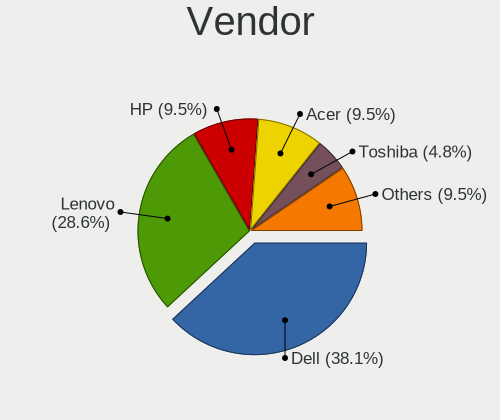
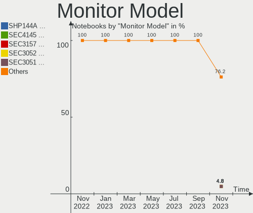
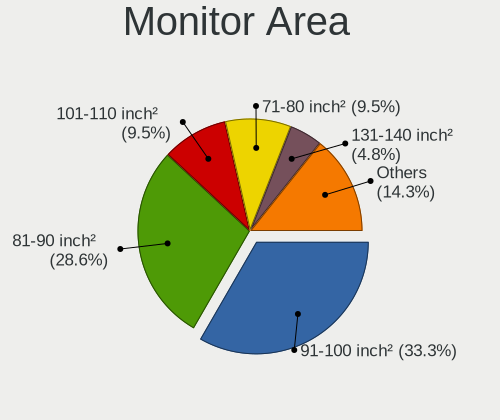
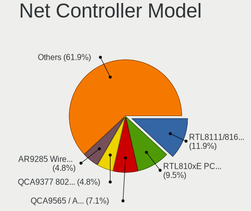
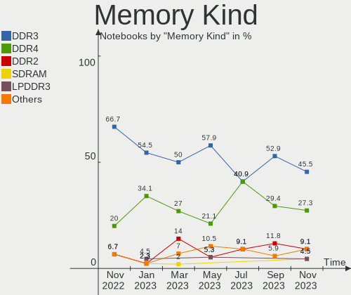

helloSystem Hardware Trends (Notebooks)
---------------------------------------

A project to identify most popular hardware characteristics and track their change
over time based on data collected by helloSystem users at https://BSD-Hardware.info.

Anyone can contribute to this report by the [hw-probe](https://github.com/linuxhw/hw-probe/blob/master/INSTALL.BSD.md) tool:

    hw-probe -all -upload

This report is for one last month. Overall report since the beginning of time: [TestCoverage](https://github.com/bsdhw/TestCoverage)

Period: Apr, 2022.

Contents
--------

* [ System ](#system)
  - [ OS                       ](#os)
  - [ OS Family                ](#os-family)
  - [ Arch                     ](#arch)
  - [ DE                       ](#de)
  - [ Display Server           ](#display-server)
  - [ Display Manager          ](#display-manager)
  - [ OS Lang                  ](#os-lang)
  - [ Boot Mode                ](#boot-mode)
  - [ Filesystem               ](#filesystem)
  - [ Part. scheme             ](#part-scheme)

* [ Board ](#board)
  - [ Vendor                   ](#vendor)
  - [ Model                    ](#model)
  - [ Model Family             ](#model-family)
  - [ MFG Year                 ](#mfg-year)
  - [ Form Factor              ](#form-factor)
  - [ Coreboot                 ](#coreboot)
  - [ RAM Size                 ](#ram-size)
  - [ RAM Used                 ](#ram-used)
  - [ Total Drives             ](#total-drives)
  - [ Has CD-ROM               ](#has-cd-rom)
  - [ Has Ethernet             ](#has-ethernet)
  - [ Has WiFi                 ](#has-wifi)
  - [ Has Bluetooth            ](#has-bluetooth)

* [ Location ](#location)
  - [ Country                  ](#country)
  - [ City                     ](#city)

* [ Drives ](#drives)
  - [ Drive Vendor             ](#drive-vendor)
  - [ Drive Model              ](#drive-model)
  - [ HDD Vendor               ](#hdd-vendor)
  - [ SSD Vendor               ](#ssd-vendor)
  - [ Drive Kind               ](#drive-kind)
  - [ Drive Connector          ](#drive-connector)
  - [ Drive Size               ](#drive-size)
  - [ Space Total              ](#space-total)
  - [ Space Used               ](#space-used)
  - [ Malfunc. Drives          ](#malfunc-drives)
  - [ Malfunc. Drive Vendor    ](#malfunc-drive-vendor)
  - [ Malfunc. HDD Vendor      ](#malfunc-hdd-vendor)
  - [ Malfunc. Drive Kind      ](#malfunc-drive-kind)
  - [ Failed Drives            ](#failed-drives)
  - [ Failed Drive Vendor      ](#failed-drive-vendor)
  - [ Drive Status             ](#drive-status)

* [ Storage controller ](#storage-controller)
  - [ Storage Vendor           ](#storage-vendor)
  - [ Storage Model            ](#storage-model)
  - [ Storage Kind             ](#storage-kind)

* [ Processor ](#processor)
  - [ CPU Vendor               ](#cpu-vendor)
  - [ CPU Model                ](#cpu-model)
  - [ CPU Model Family         ](#cpu-model-family)
  - [ CPU Cores                ](#cpu-cores)
  - [ CPU Sockets              ](#cpu-sockets)
  - [ CPU Threads              ](#cpu-threads)
  - [ CPU Microarch            ](#cpu-microarch)

* [ Graphics ](#graphics)
  - [ GPU Vendor               ](#gpu-vendor)
  - [ GPU Model                ](#gpu-model)
  - [ GPU Combo                ](#gpu-combo)
  - [ GPU Driver               ](#gpu-driver)
  - [ GPU Memory               ](#gpu-memory)

* [ Monitor ](#monitor)
  - [ Monitor Vendor           ](#monitor-vendor)
  - [ Monitor Model            ](#monitor-model)
  - [ Monitor Resolution       ](#monitor-resolution)
  - [ Monitor Diagonal         ](#monitor-diagonal)
  - [ Monitor Width            ](#monitor-width)
  - [ Aspect Ratio             ](#aspect-ratio)
  - [ Monitor Area             ](#monitor-area)
  - [ Pixel Density            ](#pixel-density)
  - [ Multiple Monitors        ](#multiple-monitors)

* [ Network ](#network)
  - [ Net Controller Vendor    ](#net-controller-vendor)
  - [ Net Controller Model     ](#net-controller-model)
  - [ Wireless Vendor          ](#wireless-vendor)
  - [ Wireless Model           ](#wireless-model)
  - [ Ethernet Vendor          ](#ethernet-vendor)
  - [ Ethernet Model           ](#ethernet-model)
  - [ Net Controller Kind      ](#net-controller-kind)
  - [ Used Controller          ](#used-controller)
  - [ NICs                     ](#nics)
  - [ IPv6                     ](#ipv6)

* [ Bluetooth ](#bluetooth)
  - [ Bluetooth Vendor         ](#bluetooth-vendor)
  - [ Bluetooth Model          ](#bluetooth-model)

* [ Sound ](#sound)
  - [ Sound Vendor             ](#sound-vendor)
  - [ Sound Model              ](#sound-model)

* [ Memory ](#memory)
  - [ Memory Vendor            ](#memory-vendor)
  - [ Memory Model             ](#memory-model)
  - [ Memory Kind              ](#memory-kind)
  - [ Memory Form Factor       ](#memory-form-factor)
  - [ Memory Size              ](#memory-size)
  - [ Memory Speed             ](#memory-speed)

* [ Printers & scanners ](#printers--scanners)
  - [ Printer Vendor           ](#printer-vendor)
  - [ Printer Model            ](#printer-model)
  - [ Scanner Vendor           ](#scanner-vendor)
  - [ Scanner Model            ](#scanner-model)

* [ Camera ](#camera)
  - [ Camera Vendor            ](#camera-vendor)
  - [ Camera Model             ](#camera-model)

* [ Security ](#security)
  - [ Fingerprint Vendor       ](#fingerprint-vendor)
  - [ Fingerprint Model        ](#fingerprint-model)
  - [ Chipcard Vendor          ](#chipcard-vendor)
  - [ Chipcard Model           ](#chipcard-model)

* [ Unsupported ](#unsupported)
  - [ Unsupported Devices      ](#unsupported-devices)
  - [ Unsupported Device Types ](#unsupported-device-types)

System
------

OS
--

Installed operating systems

| Name              | Notebooks | Percent |
|-------------------|-----------|---------|
| helloSystem 0.7.0 | 16        | 76.19%  |
| helloSystem 0.8.0 | 4         | 19.05%  |
| helloSystem 0.6.0 | 1         | 4.76%   |

OS Family
---------

OS without a version

| Name        | Notebooks | Percent |
|-------------|-----------|---------|
| helloSystem | 21        | 100%    |

Arch
----

OS architecture (x86_64, i586, etc.)

| Name  | Notebooks | Percent |
|-------|-----------|---------|
| amd64 | 21        | 100%    |

DE
--

Desktop Environment

| Name         | Notebooks | Percent |
|--------------|-----------|---------|
| helloDesktop | 21        | 100%    |

Display Server
--------------

X11 or Wayland

| Name | Notebooks | Percent |
|------|-----------|---------|
| X11  | 21        | 100%    |

Display Manager
---------------

SDDM, LightDM, etc.

| Name | Notebooks | Percent |
|------|-----------|---------|
| SLiM | 21        | 100%    |

OS Lang
-------

Language

| Lang  | Notebooks | Percent |
|-------|-----------|---------|
| en_US | 18        | 85.71%  |
| it_IT | 1         | 4.76%   |
| de_DE | 1         | 4.76%   |
| C     | 1         | 4.76%   |

Boot Mode
---------

EFI or BIOS

| Mode | Notebooks | Percent |
|------|-----------|---------|
| EFI  | 21        | 100%    |

Filesystem
----------

Type of filesystem

| Type   | Notebooks | Percent |
|--------|-----------|---------|
| Cd9660 | 11        | 52.38%  |
| Zfs    | 10        | 47.62%  |

Part. scheme
------------

Scheme of partitioning

| Type | Notebooks | Percent |
|------|-----------|---------|
| GPT  | 21        | 100%    |

Board
-----

Vendor
------

Motherboard manufacturer

| Name             | Notebooks | Percent |
|------------------|-----------|---------|
| Lenovo           | 4         | 19.05%  |
| Dell             | 3         | 14.29%  |
| TUXEDO           | 2         | 9.52%   |
| Sony             | 2         | 9.52%   |
| Hewlett-Packard  | 2         | 9.52%   |
| ASUSTek Computer | 2         | 9.52%   |
| Apple            | 2         | 9.52%   |
| Panasonic        | 1         | 4.76%   |
| MSI              | 1         | 4.76%   |
| LG Electronics   | 1         | 4.76%   |
| DNS              | 1         | 4.76%   |

Model
-----

Motherboard model

| Name                                  | Notebooks | Percent |
|---------------------------------------|-----------|---------|
| TUXEDO Aura 15 Gen1                   | 2         | 9.52%   |
| Sony VGN-AW21S_B                      | 1         | 4.76%   |
| Sony SVZ1311C5E                       | 1         | 4.76%   |
| Panasonic CF-B11JWCYS                 | 1         | 4.76%   |
| MSI GF65 Thin 10SER                   | 1         | 4.76%   |
| LG E300-A.CP20T                       | 1         | 4.76%   |
| Lenovo ThinkPad X61 7675K2U           | 1         | 4.76%   |
| Lenovo ThinkPad X270 W10DG 20K5S0BB00 | 1         | 4.76%   |
| Lenovo ThinkPad T420 4236BD5          | 1         | 4.76%   |
| Lenovo G51-35 80M8                    | 1         | 4.76%   |
| HP Pavilion 11                        | 1         | 4.76%   |
| HP 2000                               | 1         | 4.76%   |
| DNS W9x0LU                            | 1         | 4.76%   |
| Dell Latitude E6540                   | 1         | 4.76%   |
| Dell Latitude E5470                   | 1         | 4.76%   |
| Dell Inspiron 5437                    | 1         | 4.76%   |
| ASUS X556UJ                           | 1         | 4.76%   |
| ASUS 1001PX                           | 1         | 4.76%   |
| Apple MacBookPro5,5                   | 1         | 4.76%   |
| Apple MacBookPro3,1                   | 1         | 4.76%   |

Model Family
------------

Motherboard model prefix

| Name                  | Notebooks | Percent |
|-----------------------|-----------|---------|
| Lenovo ThinkPad       | 3         | 14.29%  |
| TUXEDO Aura           | 2         | 9.52%   |
| Dell Latitude         | 2         | 9.52%   |
| Sony VGN-AW21S        | 1         | 4.76%   |
| Sony SVZ1311C5E       | 1         | 4.76%   |
| Panasonic CF-B11JWCYS | 1         | 4.76%   |
| MSI GF65              | 1         | 4.76%   |
| LG E300-A.CP20T       | 1         | 4.76%   |
| Lenovo G51-35         | 1         | 4.76%   |
| HP Pavilion           | 1         | 4.76%   |
| HP 2000               | 1         | 4.76%   |
| DNS W9x0LU            | 1         | 4.76%   |
| Dell Inspiron         | 1         | 4.76%   |
| ASUS X556UJ           | 1         | 4.76%   |
| ASUS 1001PX           | 1         | 4.76%   |
| Apple MacBookPro5     | 1         | 4.76%   |
| Apple MacBookPro3     | 1         | 4.76%   |

MFG Year
--------

Motherboard manufacture year

| Year | Notebooks | Percent |
|------|-----------|---------|
| 2020 | 4         | 19.05%  |
| 2016 | 2         | 9.52%   |
| 2015 | 2         | 9.52%   |
| 2012 | 2         | 9.52%   |
| 2011 | 2         | 9.52%   |
| 2009 | 2         | 9.52%   |
| 2008 | 2         | 9.52%   |
| 2019 | 1         | 4.76%   |
| 2018 | 1         | 4.76%   |
| 2013 | 1         | 4.76%   |
| 2010 | 1         | 4.76%   |
| 2007 | 1         | 4.76%   |

Form Factor
-----------

Physical design of the computer

| Name     | Notebooks | Percent |
|----------|-----------|---------|
| Notebook | 21        | 100%    |

Coreboot
--------

Have coreboot on board

| Used | Notebooks | Percent |
|------|-----------|---------|
| No   | 21        | 100%    |

RAM Size
--------

Total RAM memory

| Size in GB  | Notebooks | Percent |
|-------------|-----------|---------|
| 4.01-8.0    | 8         | 38.1%   |
| 8.01-16.0   | 6         | 28.57%  |
| 16.01-24.0  | 3         | 14.29%  |
| 2.01-3.0    | 2         | 9.52%   |
| 32.01-64.0  | 1         | 4.76%   |
| 64.01-256.0 | 1         | 4.76%   |

RAM Used
--------

Used RAM memory

| Used GB  | Notebooks | Percent |
|----------|-----------|---------|
| 0.01-0.5 | 11        | 52.38%  |
| 0.51-1.0 | 6         | 28.57%  |
| 1.01-2.0 | 3         | 14.29%  |
| 2.01-3.0 | 1         | 4.76%   |

Total Drives
------------

Number of drives on board

| Drives | Notebooks | Percent |
|--------|-----------|---------|
| 1      | 17        | 80.95%  |
| 2      | 3         | 14.29%  |
| 0      | 1         | 4.76%   |

Has CD-ROM
----------

Has CD-ROM on board

| Presented | Notebooks | Percent |
|-----------|-----------|---------|
| Yes       | 12        | 57.14%  |
| No        | 9         | 42.86%  |

Has Ethernet
------------

Has Ethernet on board

| Presented | Notebooks | Percent |
|-----------|-----------|---------|
| Yes       | 21        | 100%    |

Has WiFi
--------

Has WiFi module

| Presented | Notebooks | Percent |
|-----------|-----------|---------|
| Yes       | 21        | 100%    |

Has Bluetooth
-------------

Has Bluetooth module

| Presented | Notebooks | Percent |
|-----------|-----------|---------|
| Yes       | 15        | 71.43%  |
| No        | 6         | 28.57%  |

Location
--------

Country
-------

Geographic location (country)

| Country             | Notebooks | Percent |
|---------------------|-----------|---------|
| Germany             | 3         | 14.29%  |
| USA                 | 2         | 9.52%   |
| Italy               | 2         | 9.52%   |
| UK                  | 1         | 4.76%   |
| Turkey              | 1         | 4.76%   |
| Trinidad and Tobago | 1         | 4.76%   |
| Taiwan              | 1         | 4.76%   |
| Spain               | 1         | 4.76%   |
| Russia              | 1         | 4.76%   |
| Netherlands         | 1         | 4.76%   |
| Mexico              | 1         | 4.76%   |
| Denmark             | 1         | 4.76%   |
| China               | 1         | 4.76%   |
| Chile               | 1         | 4.76%   |
| Brazil              | 1         | 4.76%   |
| Belarus             | 1         | 4.76%   |
| Albania             | 1         | 4.76%   |

City
----

Geographic location (city)

| City                | Notebooks | Percent |
|---------------------|-----------|---------|
| Frankfurt am Main   | 2         | 9.52%   |
| Zhaoqing            | 1         | 4.76%   |
| Yunlin              | 1         | 4.76%   |
| Washington          | 1         | 4.76%   |
| Tolyatti            | 1         | 4.76%   |
| Santiago            | 1         | 4.76%   |
| Port of Spain       | 1         | 4.76%   |
| Minsk               | 1         | 4.76%   |
| Massa Lombarda      | 1         | 4.76%   |
| Lakeville           | 1         | 4.76%   |
| La Pobla de Farnals | 1         | 4.76%   |
| Hvidovre            | 1         | 4.76%   |
| Glasgow             | 1         | 4.76%   |
| Farka e Madhe       | 1         | 4.76%   |
| Diamantino          | 1         | 4.76%   |
| Ciudad Satelite     | 1         | 4.76%   |
| Cardito             | 1         | 4.76%   |
| Bergambacht         | 1         | 4.76%   |
| Bad Honnef          | 1         | 4.76%   |
| Ankara              | 1         | 4.76%   |

Drives
------

Drive Vendor
------------

Hard drive vendors

| Vendor              | Notebooks | Drives | Percent |
|---------------------|-----------|--------|---------|
| Samsung Electronics | 5         | 7      | 23.81%  |
| Seagate             | 3         | 3      | 14.29%  |
| WDC                 | 2         | 2      | 9.52%   |
| Hitachi             | 2         | 2      | 9.52%   |
| HGST                | 2         | 2      | 9.52%   |
| OCZ                 | 1         | 1      | 4.76%   |
| Micron Technology   | 1         | 1      | 4.76%   |
| LITEON              | 1         | 1      | 4.76%   |
| Intenso             | 1         | 1      | 4.76%   |
| Intel               | 1         | 1      | 4.76%   |
| Fujitsu             | 1         | 1      | 4.76%   |
| Crucial             | 1         | 1      | 4.76%   |

Drive Model
-----------

Hard drive models

| Model                            | Notebooks | Percent |
|----------------------------------|-----------|---------|
| WDC WDS240G2G0A-00JH30 240GB     | 1         | 4.55%   |
| WDC WD10JPCX-24UE4T0 1TB         | 1         | 4.55%   |
| Seagate ST980813AS 80GB          | 1         | 4.55%   |
| Seagate ST500LT012-9WS142 500GB  | 1         | 4.55%   |
| Seagate ST320LT014-9YK142 320GB  | 1         | 4.55%   |
| Samsung SSD 980 PRO 500GB        | 1         | 4.55%   |
| Samsung SSD 970 EVO Plus 2TB     | 1         | 4.55%   |
| Samsung SSD 870 EVO 2TB          | 1         | 4.55%   |
| Samsung SSD 750 EVO 250GB        | 1         | 4.55%   |
| Samsung MZVLW256HEHP-000L7 256GB | 1         | 4.55%   |
| Samsung MZRPC256HADR-000SO 128GB | 1         | 4.55%   |
| OCZ PETROL 256GB                 | 1         | 4.55%   |
| Micron 2210_MTFDHBA512QFD 512GB  | 1         | 4.55%   |
| LITEON CV8-8E128-HP 128GB        | 1         | 4.55%   |
| Intenso SSD Sata III 256GB       | 1         | 4.55%   |
| Intel SSDSCKKF256H6 SATA 256GB   | 1         | 4.55%   |
| Hitachi HTS723216L9SA60 160GB    | 1         | 4.55%   |
| Hitachi HTS541612J9SA00 120GB    | 1         | 4.55%   |
| HGST HTS545050A7E680 500GB       | 1         | 4.55%   |
| HGST HTS541075A7E630 752GB       | 1         | 4.55%   |
| Fujitsu F500S 120G               | 1         | 4.55%   |
| Crucial CT240BX500SSD1 240GB     | 1         | 4.55%   |

HDD Vendor
----------

Hard disk drive vendors

| Vendor  | Notebooks | Drives | Percent |
|---------|-----------|--------|---------|
| Seagate | 3         | 3      | 37.5%   |
| Hitachi | 2         | 2      | 25%     |
| HGST    | 2         | 2      | 25%     |
| WDC     | 1         | 1      | 12.5%   |

SSD Vendor
----------

Solid state drive vendors

| Vendor              | Notebooks | Drives | Percent |
|---------------------|-----------|--------|---------|
| Samsung Electronics | 3         | 4      | 30%     |
| WDC                 | 1         | 1      | 10%     |
| OCZ                 | 1         | 1      | 10%     |
| LITEON              | 1         | 1      | 10%     |
| Intenso             | 1         | 1      | 10%     |
| Intel               | 1         | 1      | 10%     |
| Fujitsu             | 1         | 1      | 10%     |
| Crucial             | 1         | 1      | 10%     |

Drive Kind
----------

HDD or SSD

| Kind | Notebooks | Drives | Percent |
|------|-----------|--------|---------|
| SSD  | 9         | 11     | 42.86%  |
| HDD  | 8         | 8      | 38.1%   |
| NVMe | 4         | 4      | 19.05%  |

Drive Connector
---------------

SATA, SAS, NVMe, etc.

| Type | Notebooks | Drives | Percent |
|------|-----------|--------|---------|
| SATA | 17        | 19     | 80.95%  |
| NVMe | 4         | 4      | 19.05%  |

Drive Size
----------

Size of hard drive

| Size in TB | Notebooks | Drives | Percent |
|------------|-----------|--------|---------|
| 0.01-0.5   | 14        | 16     | 82.35%  |
| 0.51-1.0   | 2         | 2      | 11.76%  |
| 1.01-2.0   | 1         | 1      | 5.88%   |

Space Total
-----------

Amount of disk space available on the file system

| Size in GB | Notebooks | Percent |
|------------|-----------|---------|
| 1-20       | 11        | 52.38%  |
| 101-250    | 4         | 19.05%  |
| 251-500    | 2         | 9.52%   |
| 21-50      | 2         | 9.52%   |
| 51-100     | 2         | 9.52%   |

Space Used
----------

Amount of used disk space

| Used GB | Notebooks | Percent |
|---------|-----------|---------|
| 1-20    | 20        | 95.24%  |
| 21-50   | 1         | 4.76%   |

Malfunc. Drives
---------------

Drive models with a malfunction

| Model                           | Notebooks | Drives | Percent |
|---------------------------------|-----------|--------|---------|
| Seagate ST320LT014-9YK142 320GB | 1         | 1      | 20%     |
| LITEON CV8-8E128-HP 128GB       | 1         | 1      | 20%     |
| Hitachi HTS723216L9SA60 160GB   | 1         | 1      | 20%     |
| Hitachi HTS541612J9SA00 120GB   | 1         | 1      | 20%     |
| HGST HTS541075A7E630 752GB      | 1         | 1      | 20%     |

Malfunc. Drive Vendor
---------------------

Vendors of faulty drives

| Vendor  | Notebooks | Drives | Percent |
|---------|-----------|--------|---------|
| Hitachi | 2         | 2      | 40%     |
| Seagate | 1         | 1      | 20%     |
| LITEON  | 1         | 1      | 20%     |
| HGST    | 1         | 1      | 20%     |

Malfunc. HDD Vendor
-------------------

Vendors of faulty HDD drives

| Vendor  | Notebooks | Drives | Percent |
|---------|-----------|--------|---------|
| Hitachi | 2         | 2      | 50%     |
| Seagate | 1         | 1      | 25%     |
| HGST    | 1         | 1      | 25%     |

Malfunc. Drive Kind
-------------------

Kinds of faulty drives

| Kind | Notebooks | Drives | Percent |
|------|-----------|--------|---------|
| HDD  | 4         | 4      | 80%     |
| SSD  | 1         | 1      | 20%     |

Failed Drives
-------------

Failed drive models

Zero info for selected period =(

Failed Drive Vendor
-------------------

Failed drive vendors

Zero info for selected period =(

Drive Status
------------

Number of failed and malfunc. drives

| Status  | Notebooks | Drives | Percent |
|---------|-----------|--------|---------|
| Works   | 15        | 18     | 75%     |
| Malfunc | 5         | 5      | 25%     |

Storage controller
------------------

Storage Vendor
--------------

Storage controller vendors

| Vendor              | Notebooks | Percent |
|---------------------|-----------|---------|
| Intel               | 12        | 54.55%  |
| AMD                 | 4         | 18.18%  |
| Samsung Electronics | 3         | 13.64%  |
| Nvidia              | 1         | 4.55%   |
| Micron Technology   | 1         | 4.55%   |
| JMicron Technology  | 1         | 4.55%   |

Storage Model
-------------

Storage controller models

| Model                                                                            | Notebooks | Percent |
|----------------------------------------------------------------------------------|-----------|---------|
| AMD FCH SATA Controller [AHCI mode]                                              | 3         | 12.5%   |
| Samsung NVMe SSD Controller SM981/PM981/PM983                                    | 1         | 4.17%   |
| Samsung NVMe SSD Controller SM961/PM961/SM963                                    | 1         | 4.17%   |
| Samsung NVMe SSD Controller PM9A1/PM9A3/980PRO                                   | 1         | 4.17%   |
| Nvidia MCP79 AHCI Controller                                                     | 1         | 4.17%   |
| JMicron JMB368 IDE controller                                                    | 1         | 4.17%   |
| Intel Sunrise Point-LP SATA Controller [AHCI mode]                               | 1         | 4.17%   |
| Intel SATA Controller [RAID mode]                                                | 1         | 4.17%   |
| Intel NM10/ICH7 Family SATA Controller [AHCI mode]                               | 1         | 4.17%   |
| Intel Atom/Celeron/Pentium Processor x5-E8000/J3xxx/N3xxx Series SATA Controller | 1         | 4.17%   |
| Intel 82801IBM/IEM (ICH9M/ICH9M-E) 4 port SATA Controller [AHCI mode]            | 1         | 4.17%   |
| Intel 82801HM/HEM (ICH8M/ICH8M-E) SATA Controller [IDE mode]                     | 1         | 4.17%   |
| Intel 82801HM/HEM (ICH8M/ICH8M-E) SATA Controller [AHCI mode]                    | 1         | 4.17%   |
| Intel 82801HM/HEM (ICH8M/ICH8M-E) IDE Controller                                 | 1         | 4.17%   |
| Intel 82801 Mobile SATA Controller [RAID mode]                                   | 1         | 4.17%   |
| Intel 8 Series/C220 Series Chipset Family 6-port SATA Controller 1 [AHCI mode]   | 1         | 4.17%   |
| Intel 8 Series SATA Controller 1 [AHCI mode]                                     | 1         | 4.17%   |
| Intel 7 Series Chipset Family 6-port SATA Controller [AHCI mode]                 | 1         | 4.17%   |
| Intel 6 Series/C200 Series Chipset Family 6 port Mobile SATA AHCI Controller     | 1         | 4.17%   |
| AMD SB600 Non-Raid-5 SATA                                                        | 1         | 4.17%   |
| AMD SB600 IDE                                                                    | 1         | 4.17%   |
| Unknown                                                                          | 1         | 4.17%   |

Storage Kind
------------

Kind of storage controller (IDE, SATA, NVMe, SAS, ...)

| Kind | Notebooks | Percent |
|------|-----------|---------|
| SATA | 13        | 56.52%  |
| NVMe | 4         | 17.39%  |
| IDE  | 4         | 17.39%  |
| RAID | 2         | 8.7%    |

Processor
---------

CPU Vendor
----------

Processor vendors

| Vendor | Notebooks | Percent |
|--------|-----------|---------|
| Intel  | 16        | 76.19%  |
| AMD    | 5         | 23.81%  |

CPU Model
---------

Processor models

| Model                                       | Notebooks | Percent |
|---------------------------------------------|-----------|---------|
| AMD Ryzen 7 4700U with Radeon Graphics      | 2         | 9.52%   |
| Intel Pentium CPU N3700 @ 1.60GHz           | 1         | 4.76%   |
| Intel Core i7-6500U CPU @ 2.50GHz           | 1         | 4.76%   |
| Intel Core i7-4810MQ CPU @ 2.80GHz          | 1         | 4.76%   |
| Intel Core i7-3612QM CPU @ 2.10GHz          | 1         | 4.76%   |
| Intel Core i5-6440HQ CPU @ 2.60GHz          | 1         | 4.76%   |
| Intel Core i5-6300U CPU @ 2.40GHz           | 1         | 4.76%   |
| Intel Core i5-4200U CPU @ 1.60GHz           | 1         | 4.76%   |
| Intel Core i5-3320M CPU @ 2.60GHz           | 1         | 4.76%   |
| Intel Core i5-2520M CPU @ 2.50GHz           | 1         | 4.76%   |
| Intel Core i5-10300H CPU @ 2.50GHz          | 1         | 4.76%   |
| Intel Core 2 Duo CPU T8300 @ 2.40GHz        | 1         | 4.76%   |
| Intel Core 2 Duo CPU T7700 @ 2.40GHz        | 1         | 4.76%   |
| Intel Core 2 Duo CPU T7250 @ 2.00GHz        | 1         | 4.76%   |
| Intel Core 2 Duo CPU P8600 @ 2.40GHz        | 1         | 4.76%   |
| Intel Core 2 Duo CPU P7550 @ 2.26GHz        | 1         | 4.76%   |
| Intel Atom CPU N450 @ 1.66GHz               | 1         | 4.76%   |
| AMD E2-1800 APU with Radeon HD Graphics     | 1         | 4.76%   |
| AMD A8-7410 APU with AMD Radeon R5 Graphics | 1         | 4.76%   |
| AMD A6-1450 APU with Radeon HD Graphics     | 1         | 4.76%   |

CPU Model Family
----------------

Processor model prefix

| Model            | Notebooks | Percent |
|------------------|-----------|---------|
| Intel Core i5    | 6         | 28.57%  |
| Intel Core 2 Duo | 5         | 23.81%  |
| Intel Core i7    | 3         | 14.29%  |
| AMD Ryzen 7      | 2         | 9.52%   |
| Intel Pentium    | 1         | 4.76%   |
| Intel Atom       | 1         | 4.76%   |
| AMD E2           | 1         | 4.76%   |
| AMD A8           | 1         | 4.76%   |
| AMD A6           | 1         | 4.76%   |

CPU Cores
---------

Number of processor cores

| Number  | Notebooks | Percent |
|---------|-----------|---------|
| 4       | 7         | 33.33%  |
| 2       | 6         | 28.57%  |
| Unknown | 5         | 23.81%  |
| 8       | 2         | 9.52%   |
| 1       | 1         | 4.76%   |

CPU Sockets
-----------

Number of sockets

| Number | Notebooks | Percent |
|--------|-----------|---------|
| 1      | 19        | 90.48%  |
| 2      | 2         | 9.52%   |

CPU Threads
-----------

Threads per core (Hyper-Threading)

| Number  | Notebooks | Percent |
|---------|-----------|---------|
| 2       | 9         | 42.86%  |
| 1       | 7         | 33.33%  |
| Unknown | 5         | 23.81%  |

CPU Microarch
-------------

Microarchitecture

| Name        | Notebooks | Percent |
|-------------|-----------|---------|
| Skylake     | 3         | 14.29%  |
| Penryn      | 3         | 14.29%  |
| Zen 2       | 2         | 9.52%   |
| IvyBridge   | 2         | 9.52%   |
| Haswell     | 2         | 9.52%   |
| Core        | 2         | 9.52%   |
| Silvermont  | 1         | 4.76%   |
| SandyBridge | 1         | 4.76%   |
| Puma        | 1         | 4.76%   |
| Jaguar      | 1         | 4.76%   |
| CometLake   | 1         | 4.76%   |
| Bonnell     | 1         | 4.76%   |
| Bobcat      | 1         | 4.76%   |

Graphics
--------

GPU Vendor
----------

Vendors of graphics cards

| Vendor | Notebooks | Percent |
|--------|-----------|---------|
| Intel  | 12        | 48%     |
| AMD    | 7         | 28%     |
| Nvidia | 6         | 24%     |

GPU Model
---------

Graphics card models

| Model                                                                                    | Notebooks | Percent |
|------------------------------------------------------------------------------------------|-----------|---------|
| Intel Skylake GT2 [HD Graphics 520]                                                      | 2         | 7.69%   |
| Intel 3rd Gen Core processor Graphics Controller                                         | 2         | 7.69%   |
| AMD Renoir                                                                               | 2         | 7.69%   |
| Nvidia TU106M [GeForce RTX 2060 Mobile]                                                  | 1         | 3.85%   |
| Nvidia GK208M [GeForce GT 740M]                                                          | 1         | 3.85%   |
| Nvidia GK208BM [GeForce 920M]                                                            | 1         | 3.85%   |
| Nvidia G96CM [GeForce 9600M GT]                                                          | 1         | 3.85%   |
| Nvidia G84M [GeForce 8600M GT]                                                           | 1         | 3.85%   |
| Nvidia C79 [GeForce 9400M]                                                               | 1         | 3.85%   |
| Intel Mobile GM965/GL960 Integrated Graphics Controller (secondary)                      | 1         | 3.85%   |
| Intel Mobile GM965/GL960 Integrated Graphics Controller (primary)                        | 1         | 3.85%   |
| Intel HD Graphics 530                                                                    | 1         | 3.85%   |
| Intel Haswell-ULT Integrated Graphics Controller                                         | 1         | 3.85%   |
| Intel CometLake-H GT2 [UHD Graphics]                                                     | 1         | 3.85%   |
| Intel Atom/Celeron/Pentium Processor x5-E8000/J3xxx/N3xxx Integrated Graphics Controller | 1         | 3.85%   |
| Intel Atom Processor D4xx/D5xx/N4xx/N5xx Integrated Graphics Controller                  | 1         | 3.85%   |
| Intel 4th Gen Core Processor Integrated Graphics Controller                              | 1         | 3.85%   |
| Intel 2nd Generation Core Processor Family Integrated Graphics Controller                | 1         | 3.85%   |
| AMD Wrestler [Radeon HD 7340]                                                            | 1         | 3.85%   |
| AMD Temash [Radeon HD 8250/8280G]                                                        | 1         | 3.85%   |
| AMD RS600M [Radeon Xpress 1250]                                                          | 1         | 3.85%   |
| AMD Mullins [Radeon R4/R5 Graphics]                                                      | 1         | 3.85%   |
| AMD Mars XTX [Radeon HD 8790M]                                                           | 1         | 3.85%   |

GPU Combo
---------

Combinations of graphics cards

| Name           | Notebooks | Percent |
|----------------|-----------|---------|
| 1 x Intel      | 6         | 28.57%  |
| 1 x AMD        | 6         | 28.57%  |
| 1 x Nvidia     | 3         | 14.29%  |
| Intel + Nvidia | 3         | 14.29%  |
| 2 x Intel      | 2         | 9.52%   |
| Intel + AMD    | 1         | 4.76%   |

GPU Driver
----------

Free vs proprietary

| Driver      | Notebooks | Percent |
|-------------|-----------|---------|
| Free        | 15        | 71.43%  |
| Unknown     | 4         | 19.05%  |
| Proprietary | 2         | 9.52%   |

GPU Memory
----------

Total video memory

| Size in GB | Notebooks | Percent |
|------------|-----------|---------|
| Unknown    | 15        | 71.43%  |
| 0.01-0.5   | 5         | 23.81%  |
| 0.51-1.0   | 1         | 4.76%   |

Monitor
-------

Monitor Vendor
--------------

Monitor vendors

| Vendor                  | Notebooks | Percent |
|-------------------------|-----------|---------|
| AU Optronics            | 4         | 25%     |
| Lenovo                  | 2         | 12.5%   |
| Chimei Innolux          | 2         | 12.5%   |
| Sony                    | 1         | 6.25%   |
| Samsung Electronics     | 1         | 6.25%   |
| Nvidia                  | 1         | 6.25%   |
| LG Display              | 1         | 6.25%   |
| HannStar                | 1         | 6.25%   |
| Chi Mei Optoelectronics | 1         | 6.25%   |
| BOE                     | 1         | 6.25%   |
| Apple                   | 1         | 6.25%   |

Monitor Model
-------------

Monitor models

| Model                                                                    | Notebooks | Percent |
|--------------------------------------------------------------------------|-----------|---------|
| Sony LCD SNY06FA 1600x900 290x160mm 13.0-inch                            | 1         | 5.56%   |
| Samsung Electronics S27C350 SAM0A3E 1920x1080 600x340mm 27.2-inch        | 1         | 5.56%   |
| Samsung Electronics LCD Monitor SDC4C48 1920x1080 340x190mm 15.3-inch    | 1         | 5.56%   |
| Nvidia LCD Monitor NVD0200 1920x1080 320x180mm 14.5-inch                 | 1         | 5.56%   |
| LG Display LCD Monitor LGD04E2 1366x768 340x190mm 15.3-inch              | 1         | 5.56%   |
| Lenovo LEN L193pC LEN114F 1280x1024 400x320mm 20.2-inch                  | 1         | 5.56%   |
| Lenovo LCD Monitor LEN4031 1280x800 290x180mm 13.4-inch                  | 1         | 5.56%   |
| Lenovo LCD Monitor LEN4000 1024x768 250x180mm 12.1-inch                  | 1         | 5.56%   |
| HannStar LCD Monitor HSD03E9 1024x600 220x130mm 10.1-inch                | 1         | 5.56%   |
| Chimei Innolux LCD Monitor CMN1731 1600x900 390x220mm 17.6-inch          | 1         | 5.56%   |
| Chimei Innolux LCD Monitor CMN1118 1366x768 260x140mm 11.6-inch          | 1         | 5.56%   |
| Chi Mei Optoelectronics LCD Monitor CMO15A2 1366x768 340x190mm 15.3-inch | 1         | 5.56%   |
| BOE LCD Monitor BOE0960 1366x768 340x190mm 15.3-inch                     | 1         | 5.56%   |
| AU Optronics LCD Monitor AUOAF90 1920x1080 340x190mm 15.3-inch           | 1         | 5.56%   |
| AU Optronics LCD Monitor AUO313C 1366x768 310x170mm 13.9-inch            | 1         | 5.56%   |
| AU Optronics LCD Monitor AUO303C 1366x768 310x170mm 13.9-inch            | 1         | 5.56%   |
| AU Optronics LCD Monitor AUO226D 1920x1080 280x160mm 12.7-inch           | 1         | 5.56%   |
| Apple Color LCD APP9CA0 1280x800 290x190mm 13.6-inch                     | 1         | 5.56%   |

Monitor Resolution
------------------

Monitor screen resolution

| Resolution       | Notebooks | Percent |
|------------------|-----------|---------|
| 1366x768 (WXGA)  | 6         | 35.29%  |
| 1920x1080 (FHD)  | 5         | 29.41%  |
| 1600x900 (HD+)   | 2         | 11.76%  |
| 1280x800 (WXGA)  | 2         | 11.76%  |
| 1280x1024 (SXGA) | 1         | 5.88%   |
| 1024x600         | 1         | 5.88%   |

Monitor Diagonal
----------------

Diagonal size in inches

| Inches | Notebooks | Percent |
|--------|-----------|---------|
| 15     | 5         | 27.78%  |
| 13     | 4         | 22.22%  |
| 14     | 2         | 11.11%  |
| 27     | 1         | 5.56%   |
| 23     | 1         | 5.56%   |
| 20     | 1         | 5.56%   |
| 17     | 1         | 5.56%   |
| 12     | 1         | 5.56%   |
| 11     | 1         | 5.56%   |
| 10     | 1         | 5.56%   |

Monitor Width
-------------

Physical width

| Width in mm | Notebooks | Percent |
|-------------|-----------|---------|
| 301-350     | 8         | 44.44%  |
| 201-300     | 6         | 33.33%  |
| 501-600     | 2         | 11.11%  |
| 351-400     | 2         | 11.11%  |

Aspect Ratio
------------

Proportional relationship between the width and the height

| Ratio | Notebooks | Percent |
|-------|-----------|---------|
| 16/9  | 14        | 82.35%  |
| 5/4   | 1         | 5.88%   |
| 3/2   | 1         | 5.88%   |
| 16/10 | 1         | 5.88%   |

Monitor Area
------------

Area in inch²

| Area in inch² | Notebooks | Percent |
|----------------|-----------|---------|
| 81-90          | 5         | 27.78%  |
| 91-100         | 4         | 22.22%  |
| 71-80          | 1         | 5.56%   |
| 61-70          | 1         | 5.56%   |
| 51-60          | 1         | 5.56%   |
| 41-50          | 1         | 5.56%   |
| 301-350        | 1         | 5.56%   |
| 201-250        | 1         | 5.56%   |
| 151-200        | 1         | 5.56%   |
| 131-140        | 1         | 5.56%   |
| 101-110        | 1         | 5.56%   |

Pixel Density
-------------

Pixels per inch

| Density | Notebooks | Percent |
|---------|-----------|---------|
| 101-120 | 8         | 47.06%  |
| 121-160 | 5         | 29.41%  |
| 51-100  | 3         | 17.65%  |
| 161-240 | 1         | 5.88%   |

Multiple Monitors
-----------------

Total monitors connected

| Total | Notebooks | Percent |
|-------|-----------|---------|
| 1     | 15        | 71.43%  |
| 0     | 4         | 19.05%  |
| 2     | 2         | 9.52%   |

Network
-------

Net Controller Vendor
---------------------

Controller vendors

| Vendor                   | Notebooks | Percent |
|--------------------------|-----------|---------|
| Intel                    | 11        | 28.95%  |
| Realtek Semiconductor    | 10        | 26.32%  |
| Qualcomm Atheros         | 4         | 10.53%  |
| Marvell Technology Group | 3         | 7.89%   |
| Broadcom                 | 2         | 5.26%   |
| Sierra Wireless          | 1         | 2.63%   |
| Ralink Technology        | 1         | 2.63%   |
| Ralink                   | 1         | 2.63%   |
| OPPO Electronics         | 1         | 2.63%   |
| Nvidia                   | 1         | 2.63%   |
| Huawei Technologies      | 1         | 2.63%   |
| Edimax Technology        | 1         | 2.63%   |
| Dell                     | 1         | 2.63%   |

Net Controller Model
--------------------

Controller models

| Model                                                                   | Notebooks | Percent |
|-------------------------------------------------------------------------|-----------|---------|
| Realtek RTL8111/8168/8411 PCI Express Gigabit Ethernet Controller       | 7         | 14.29%  |
| Realtek RTL810xE PCI Express Fast Ethernet controller                   | 3         | 6.12%   |
| Realtek RTL8723BE PCIe Wireless Network Adapter                         | 2         | 4.08%   |
| Intel Wireless 8260                                                     | 2         | 4.08%   |
| Intel Wi-Fi 6 AX200                                                     | 2         | 4.08%   |
| Intel Centrino Advanced-N 6205 [Taylor Peak]                            | 2         | 4.08%   |
| Intel 82579LM Gigabit Network Connection (Lewisville)                   | 2         | 4.08%   |
| Sierra Wireless EM7455                                                  | 1         | 2.04%   |
| Realtek RTL8821AE 802.11ac PCIe Wireless Network Adapter                | 1         | 2.04%   |
| Realtek 802.11n WLAN Adapter                                            | 1         | 2.04%   |
| Ralink RT2870/RT3070 Wireless Adapter                                   | 1         | 2.04%   |
| Ralink RT3290 Wireless 802.11n 1T/1R PCIe                               | 1         | 2.04%   |
| Qualcomm Atheros QCA9565 / AR9565 Wireless Network Adapter              | 1         | 2.04%   |
| Qualcomm Atheros AR9485 Wireless Network Adapter                        | 1         | 2.04%   |
| Qualcomm Atheros AR9285 Wireless Network Adapter (PCI-Express)          | 1         | 2.04%   |
| Qualcomm Atheros AR8132 Fast Ethernet                                   | 1         | 2.04%   |
| Qualcomm Atheros AR242x / AR542x Wireless Network Adapter (PCI-Express) | 1         | 2.04%   |
| OPPO SDM720G-IDP _SN:AB3CB1F6 RNDIS Control RNDIS Ethernet Data         | 1         | 2.04%   |
| Nvidia MCP79 Ethernet                                                   | 1         | 2.04%   |
| Marvell Group 88E8058 PCI-E Gigabit Ethernet Controller                 | 1         | 2.04%   |
| Marvell Group 88E8055 PCI-E Gigabit Ethernet Controller                 | 1         | 2.04%   |
| Marvell Group 88E8039 PCI-E Fast Ethernet Controller                    | 1         | 2.04%   |
| Intel WiFi Link 5100                                                    | 1         | 2.04%   |
| Intel PRO/Wireless 4965 AG or AGN [Kedron] Network Connection           | 1         | 2.04%   |
| Intel Ethernet Connection I219-LM                                       | 1         | 2.04%   |
| Intel Ethernet Connection I217-LM                                       | 1         | 2.04%   |
| Intel Ethernet Connection (2) I219-LM                                   | 1         | 2.04%   |
| Intel Comet Lake PCH CNVi WiFi                                          | 1         | 2.04%   |
| Intel Centrino Ultimate-N 6300                                          | 1         | 2.04%   |
| Intel Centrino Advanced-N 6235                                          | 1         | 2.04%   |
| Intel 82566MM Gigabit Network Connection                                | 1         | 2.04%   |
| Huawei ME936 LTE/HSDPA+ 4G modem                                        | 1         | 2.04%   |
| Edimax EW-7811Un 802.11n Wireless Adapter [Realtek RTL8188CUS]          | 1         | 2.04%   |
| Dell Hub of E-Port Replicator                                           | 1         | 2.04%   |
| Broadcom BCM4322 802.11a/b/g/n Wireless LAN Controller                  | 1         | 2.04%   |
| Broadcom BCM4321 802.11a/b/g/n                                          | 1         | 2.04%   |

Wireless Vendor
---------------

Wireless vendors

| Vendor                | Notebooks | Percent |
|-----------------------|-----------|---------|
| Intel                 | 11        | 42.31%  |
| Realtek Semiconductor | 4         | 15.38%  |
| Qualcomm Atheros      | 4         | 15.38%  |
| Broadcom              | 2         | 7.69%   |
| Sierra Wireless       | 1         | 3.85%   |
| Ralink Technology     | 1         | 3.85%   |
| Ralink                | 1         | 3.85%   |
| Edimax Technology     | 1         | 3.85%   |
| Dell                  | 1         | 3.85%   |

Wireless Model
--------------

Wireless models

| Model                                                                   | Notebooks | Percent |
|-------------------------------------------------------------------------|-----------|---------|
| Realtek RTL8723BE PCIe Wireless Network Adapter                         | 2         | 7.69%   |
| Intel Wireless 8260                                                     | 2         | 7.69%   |
| Intel Wi-Fi 6 AX200                                                     | 2         | 7.69%   |
| Intel Centrino Advanced-N 6205 [Taylor Peak]                            | 2         | 7.69%   |
| Sierra Wireless EM7455                                                  | 1         | 3.85%   |
| Realtek RTL8821AE 802.11ac PCIe Wireless Network Adapter                | 1         | 3.85%   |
| Realtek 802.11n WLAN Adapter                                            | 1         | 3.85%   |
| Ralink RT2870/RT3070 Wireless Adapter                                   | 1         | 3.85%   |
| Ralink RT3290 Wireless 802.11n 1T/1R PCIe                               | 1         | 3.85%   |
| Qualcomm Atheros QCA9565 / AR9565 Wireless Network Adapter              | 1         | 3.85%   |
| Qualcomm Atheros AR9485 Wireless Network Adapter                        | 1         | 3.85%   |
| Qualcomm Atheros AR9285 Wireless Network Adapter (PCI-Express)          | 1         | 3.85%   |
| Qualcomm Atheros AR242x / AR542x Wireless Network Adapter (PCI-Express) | 1         | 3.85%   |
| Intel WiFi Link 5100                                                    | 1         | 3.85%   |
| Intel PRO/Wireless 4965 AG or AGN [Kedron] Network Connection           | 1         | 3.85%   |
| Intel Comet Lake PCH CNVi WiFi                                          | 1         | 3.85%   |
| Intel Centrino Ultimate-N 6300                                          | 1         | 3.85%   |
| Intel Centrino Advanced-N 6235                                          | 1         | 3.85%   |
| Edimax EW-7811Un 802.11n Wireless Adapter [Realtek RTL8188CUS]          | 1         | 3.85%   |
| Dell Hub of E-Port Replicator                                           | 1         | 3.85%   |
| Broadcom BCM4322 802.11a/b/g/n Wireless LAN Controller                  | 1         | 3.85%   |
| Broadcom BCM4321 802.11a/b/g/n                                          | 1         | 3.85%   |

Ethernet Vendor
---------------

Ethernet vendors

| Vendor                   | Notebooks | Percent |
|--------------------------|-----------|---------|
| Realtek Semiconductor    | 10        | 45.45%  |
| Intel                    | 6         | 27.27%  |
| Marvell Technology Group | 3         | 13.64%  |
| Qualcomm Atheros         | 1         | 4.55%   |
| OPPO Electronics         | 1         | 4.55%   |
| Nvidia                   | 1         | 4.55%   |

Ethernet Model
--------------

Ethernet models

| Model                                                             | Notebooks | Percent |
|-------------------------------------------------------------------|-----------|---------|
| Realtek RTL8111/8168/8411 PCI Express Gigabit Ethernet Controller | 7         | 31.82%  |
| Realtek RTL810xE PCI Express Fast Ethernet controller             | 3         | 13.64%  |
| Intel 82579LM Gigabit Network Connection (Lewisville)             | 2         | 9.09%   |
| Qualcomm Atheros AR8132 Fast Ethernet                             | 1         | 4.55%   |
| OPPO SDM720G-IDP _SN:AB3CB1F6 RNDIS Control RNDIS Ethernet Data   | 1         | 4.55%   |
| Nvidia MCP79 Ethernet                                             | 1         | 4.55%   |
| Marvell Group 88E8058 PCI-E Gigabit Ethernet Controller           | 1         | 4.55%   |
| Marvell Group 88E8055 PCI-E Gigabit Ethernet Controller           | 1         | 4.55%   |
| Marvell Group 88E8039 PCI-E Fast Ethernet Controller              | 1         | 4.55%   |
| Intel Ethernet Connection I219-LM                                 | 1         | 4.55%   |
| Intel Ethernet Connection I217-LM                                 | 1         | 4.55%   |
| Intel Ethernet Connection (2) I219-LM                             | 1         | 4.55%   |
| Intel 82566MM Gigabit Network Connection                          | 1         | 4.55%   |

Net Controller Kind
-------------------

Ethernet, WiFi or modem

| Kind     | Notebooks | Percent |
|----------|-----------|---------|
| WiFi     | 21        | 48.84%  |
| Ethernet | 21        | 48.84%  |
| Modem    | 1         | 2.33%   |

Used Controller
---------------

Currently used network controller

| Kind     | Notebooks | Percent |
|----------|-----------|---------|
| WiFi     | 9         | 50%     |
| Ethernet | 9         | 50%     |

NICs
----

Total network controllers on board

| Total | Notebooks | Percent |
|-------|-----------|---------|
| 2     | 21        | 100%    |

IPv6
----

IPv6 vs IPv4

| Used | Notebooks | Percent |
|------|-----------|---------|
| No   | 20        | 95.24%  |
| Yes  | 1         | 4.76%   |

Bluetooth
---------

Bluetooth Vendor
----------------

Controller vendors

| Vendor                          | Notebooks | Percent |
|---------------------------------|-----------|---------|
| Intel                           | 6         | 40%     |
| Realtek Semiconductor           | 3         | 20%     |
| Ralink                          | 1         | 6.67%   |
| Qualcomm Atheros Communications | 1         | 6.67%   |
| Cambridge Silicon Radio         | 1         | 6.67%   |
| Broadcom                        | 1         | 6.67%   |
| Apple                           | 1         | 6.67%   |
| Alps Electric                   | 1         | 6.67%   |

Bluetooth Model
---------------

Controller models

| Model                                               | Notebooks | Percent |
|-----------------------------------------------------|-----------|---------|
| Intel Bluetooth wireless interface                  | 2         | 13.33%  |
| Intel AX200 Bluetooth                               | 2         | 13.33%  |
| Realtek RTL8821A Bluetooth                          | 1         | 6.67%   |
| Realtek  Bluetooth 4.0 Adapter                      | 1         | 6.67%   |
| Realtek  Bluetooth 4.0 + High Speed Chip            | 1         | 6.67%   |
| Ralink RT3290 Bluetooth                             | 1         | 6.67%   |
| Qualcomm Atheros AR9462 Bluetooth                   | 1         | 6.67%   |
| Intel Centrino Bluetooth Wireless Transceiver       | 1         | 6.67%   |
| Intel AX201 Bluetooth                               | 1         | 6.67%   |
| Cambridge Silicon Radio Bluetooth Dongle (HCI mode) | 1         | 6.67%   |
| Broadcom BCM2045B (BDC-2) [Bluetooth Controller]    | 1         | 6.67%   |
| Apple Bluetooth Host Controller                     | 1         | 6.67%   |
| Alps Electric BCM2046 Bluetooth Device              | 1         | 6.67%   |

Sound
-----

Sound Vendor
------------

Sound card vendors

| Vendor | Notebooks | Percent |
|--------|-----------|---------|
| Intel  | 14        | 63.64%  |
| AMD    | 6         | 27.27%  |
| Nvidia | 2         | 9.09%   |

Sound Model
-----------

Sound card models

| Model                                                                                             | Notebooks | Percent |
|---------------------------------------------------------------------------------------------------|-----------|---------|
| AMD FCH Azalia Controller                                                                         | 3         | 10%     |
| Intel Sunrise Point-LP HD Audio                                                                   | 2         | 6.67%   |
| Intel 82801H (ICH8 Family) HD Audio Controller                                                    | 2         | 6.67%   |
| Intel 7 Series/C216 Chipset Family High Definition Audio Controller                               | 2         | 6.67%   |
| AMD Renoir Radeon High Definition Audio Controller                                                | 2         | 6.67%   |
| AMD Kabini HDMI/DP Audio                                                                          | 2         | 6.67%   |
| AMD Family 17h/19h HD Audio Controller                                                            | 2         | 6.67%   |
| Nvidia TU106 High Definition Audio Controller                                                     | 1         | 3.33%   |
| Nvidia MCP79 High Definition Audio                                                                | 1         | 3.33%   |
| Intel Xeon E3-1200 v3/4th Gen Core Processor HD Audio Controller                                  | 1         | 3.33%   |
| Intel NM10/ICH7 Family High Definition Audio Controller                                           | 1         | 3.33%   |
| Intel Haswell-ULT HD Audio Controller                                                             | 1         | 3.33%   |
| Intel Comet Lake PCH cAVS                                                                         | 1         | 3.33%   |
| Intel Atom/Celeron/Pentium Processor x5-E8000/J3xxx/N3xxx Series High Definition Audio Controller | 1         | 3.33%   |
| Intel 82801I (ICH9 Family) HD Audio Controller                                                    | 1         | 3.33%   |
| Intel 8 Series/C220 Series Chipset High Definition Audio Controller                               | 1         | 3.33%   |
| Intel 8 Series HD Audio Controller                                                                | 1         | 3.33%   |
| Intel 6 Series/C200 Series Chipset Family High Definition Audio Controller                        | 1         | 3.33%   |
| Intel 100 Series/C230 Series Chipset Family HD Audio Controller                                   | 1         | 3.33%   |
| AMD Wrestler HDMI Audio                                                                           | 1         | 3.33%   |
| AMD SBx00 Azalia (Intel HDA)                                                                      | 1         | 3.33%   |
| AMD RS600 HDMI Audio [Radeon Xpress 1250]                                                         | 1         | 3.33%   |

Memory
------

Memory Vendor
-------------

Memory module vendors

| Vendor                       | Notebooks | Percent |
|------------------------------|-----------|---------|
| Unknown                      | 5         | 19.23%  |
| Samsung Electronics          | 5         | 19.23%  |
| Micron Technology            | 4         | 15.38%  |
| SK Hynix                     | 2         | 7.69%   |
| Unknown (0x7F7F7F94FFFFFFFF) | 1         | 3.85%   |
| Transcend                    | 1         | 3.85%   |
| Smart                        | 1         | 3.85%   |
| Silicon Power                | 1         | 3.85%   |
| Ramaxel Technology           | 1         | 3.85%   |
| Nanya Technology             | 1         | 3.85%   |
| Kingston                     | 1         | 3.85%   |
| Elpida                       | 1         | 3.85%   |
| A-DATA Technology            | 1         | 3.85%   |
| Unknown                      | 1         | 3.85%   |

Memory Model
------------

Memory module models

| Model                                                           | Notebooks | Percent |
|-----------------------------------------------------------------|-----------|---------|
| Unknown RAM Module 2GB SODIMM DDR2 667MT/s                      | 2         | 7.69%   |
| Unknown RAM Module 8GB SODIMM DDR3 1600MT/s                     | 1         | 3.85%   |
| Unknown RAM Module 4GB SODIMM DDR3                              | 1         | 3.85%   |
| Unknown RAM Module 2GB SODIMM DDR2                              | 1         | 3.85%   |
| Unknown (0x7F7F7F94FFFFFFFF) RAM Module 2GB SODIMM DDR2 667MT/s | 1         | 3.85%   |
| Transcend RAM TS512MSK64W6H 4GB SODIMM DDR3 1600MT/s            | 1         | 3.85%   |
| Smart RAM SH564128FJ8NZRNSDG 4GB SODIMM DDR3 1600MT/s           | 1         | 3.85%   |
| SK Hynix RAM Module 2GB SODIMM DDR3 1333MT/s                    | 1         | 3.85%   |
| SK Hynix RAM HMT41GS6BFR8A-PB 8GB SODIMM DDR3 1600MT/s          | 1         | 3.85%   |
| Silicon Power RAM SP004GLSTU160N02 4GB SODIMM DDR3 1600MT/s     | 1         | 3.85%   |
| Samsung RAM M471B5273DH0-YH9 4GB SODIMM DDR3 1333MT/s           | 1         | 3.85%   |
| Samsung RAM M471B5273BH1-CF8 4GB SODIMM DDR3 1067MT/s           | 1         | 3.85%   |
| Samsung RAM M471A4G43AB1-CWE 32GB SODIMM DDR4 3200MT/s          | 1         | 3.85%   |
| Samsung RAM M471A2K43CB1-CTD 16GB SODIMM DDR4 2667MT/s          | 1         | 3.85%   |
| Samsung RAM M471A2K43CB1-CRC 16GB SODIMM DDR4 2400MT/s          | 1         | 3.85%   |
| Ramaxel RAM RMT3160ME68FAF1600 8GB SODIMM DDR3 1600MT/s         | 1         | 3.85%   |
| Nanya RAM NT8GA64D88CX3S-JR 8GB SODIMM DDR4 3200MT/s            | 1         | 3.85%   |
| Micron RAM 8KTF51264HZ-1G6E1 4GB SODIMM DDR3 1600MT/s           | 1         | 3.85%   |
| Micron RAM 8KTF51264HDZ-1G6E1 4GB SODIMM DDR3 1600MT/s          | 1         | 3.85%   |
| Micron RAM 8JTF25664HZ-1G4H1 2GB SODIMM DDR3 1067MT/s           | 1         | 3.85%   |
| Micron RAM 4ATF51264HZ-2G6E1 4GB SODIMM DDR4 2667MT/s           | 1         | 3.85%   |
| Kingston RAM ACR16D3LS1KNG/8G 8GB SODIMM DDR3 1600MT/s          | 1         | 3.85%   |
| Elpida RAM Module 2GB SODIMM DDR3 1333MT/s                      | 1         | 3.85%   |
| A-DATA RAM AM1L16BC4R1-B1GS 4GB SODIMM DDR3 800MT/s             | 1         | 3.85%   |
| Unknown                                                         | 1         | 3.85%   |

Memory Kind
-----------

Memory module kinds

| Kind | Notebooks | Percent |
|------|-----------|---------|
| DDR3 | 11        | 52.38%  |
| DDR4 | 5         | 23.81%  |
| DDR2 | 4         | 19.05%  |
| DRAM | 1         | 4.76%   |

Memory Form Factor
------------------

Physical design of the memory module

| Name   | Notebooks | Percent |
|--------|-----------|---------|
| SODIMM | 20        | 95.24%  |
| DIMM   | 1         | 4.76%   |

Memory Size
-----------

Memory module size

| Size  | Notebooks | Percent |
|-------|-----------|---------|
| 4096  | 8         | 33.33%  |
| 2048  | 7         | 29.17%  |
| 8192  | 6         | 25%     |
| 16384 | 2         | 8.33%   |
| 32768 | 1         | 4.17%   |

Memory Speed
------------

Memory module speed

| Speed   | Notebooks | Percent |
|---------|-----------|---------|
| 1600    | 7         | 31.82%  |
| 667     | 3         | 13.64%  |
| Unknown | 3         | 13.64%  |
| 3200    | 2         | 9.09%   |
| 2667    | 2         | 9.09%   |
| 1333    | 2         | 9.09%   |
| 2400    | 1         | 4.55%   |
| 1067    | 1         | 4.55%   |
| 800     | 1         | 4.55%   |

Printers & scanners
-------------------

Printer Vendor
--------------

Printer device vendors

Zero info for selected period =(

Printer Model
-------------

Printer device models

Zero info for selected period =(

Scanner Vendor
--------------

Scanner device vendors

Zero info for selected period =(

Scanner Model
-------------

Scanner device models

Zero info for selected period =(

Camera
------

Camera Vendor
-------------

Camera device vendors

| Vendor                | Notebooks | Percent |
|-----------------------|-----------|---------|
| Microdia              | 3         | 27.27%  |
| Realtek Semiconductor | 2         | 18.18%  |
| Acer                  | 2         | 18.18%  |
| Syntek                | 1         | 9.09%   |
| Ricoh                 | 1         | 9.09%   |
| IMC Networks          | 1         | 9.09%   |
| Chicony Electronics   | 1         | 9.09%   |

Camera Model
------------

Camera device models

| Model                                     | Notebooks | Percent |
|-------------------------------------------|-----------|---------|
| Syntek Lenovo EasyCamera                  | 1         | 9.09%   |
| Ricoh USB2.0 Camera                       | 1         | 9.09%   |
| Realtek USB Camera                        | 1         | 9.09%   |
| Realtek Integrated_Webcam_HD              | 1         | 9.09%   |
| Microdia Sonix USB 2.0 Camera             | 1         | 9.09%   |
| Microdia Integrated Webcam                | 1         | 9.09%   |
| Microdia Dell Laptop Integrated Webcam HD | 1         | 9.09%   |
| IMC Networks USB2.0 UVC VGA WebCam        | 1         | 9.09%   |
| Chicony Chicony USB 2.0 Camera            | 1         | 9.09%   |
| Acer Integrated Camera                    | 1         | 9.09%   |
| Acer HD Webcam                            | 1         | 9.09%   |

Security
--------

Fingerprint Vendor
------------------

Fingerprint sensor vendors

| Vendor             | Notebooks | Percent |
|--------------------|-----------|---------|
| Validity Sensors   | 1         | 33.33%  |
| STMicroelectronics | 1         | 33.33%  |
| AuthenTec          | 1         | 33.33%  |

Fingerprint Model
-----------------

Fingerprint sensor models

| Model                                 | Notebooks | Percent |
|---------------------------------------|-----------|---------|
| Validity Sensors Synaptics WBDI       | 1         | 33.33%  |
| STMicroelectronics Fingerprint Reader | 1         | 33.33%  |
| AuthenTec AES1660 Fingerprint Sensor  | 1         | 33.33%  |

Chipcard Vendor
---------------

Chipcard module vendors

Zero info for selected period =(

Chipcard Model
--------------

Chipcard module models

Zero info for selected period =(

Unsupported
-----------

Unsupported Devices
-------------------

Total unsupported devices on board

| Total | Notebooks | Percent |
|-------|-----------|---------|
| 2     | 7         | 33.33%  |
| 0     | 6         | 28.57%  |
| 1     | 5         | 23.81%  |
| 3     | 2         | 9.52%   |
| 5     | 1         | 4.76%   |

Unsupported Device Types
------------------------

Types of unsupported devices

| Type                     | Notebooks | Percent |
|--------------------------|-----------|---------|
| Net/wireless             | 9         | 29.03%  |
| Communication controller | 9         | 29.03%  |
| Bluetooth                | 5         | 16.13%  |
| Fingerprint reader       | 3         | 9.68%   |
| Card reader              | 3         | 9.68%   |
| Network                  | 2         | 6.45%   |

