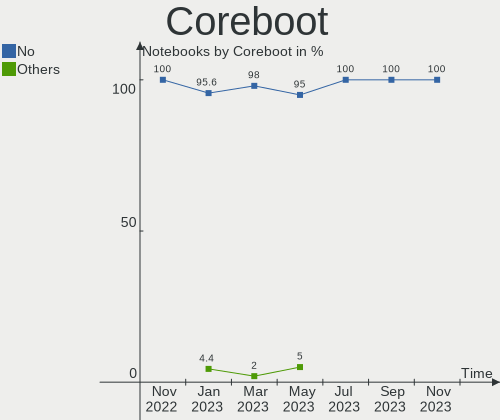
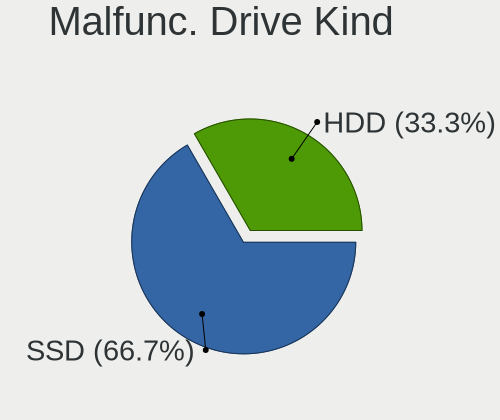
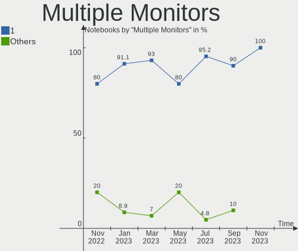
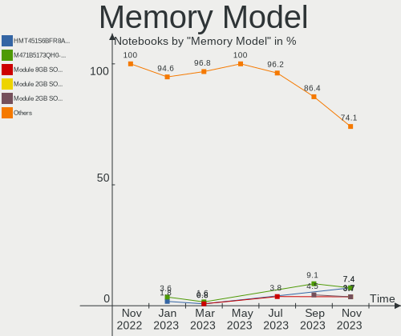

helloSystem - Hardware Trends (Notebooks)
-----------------------------------------

A project to identify most popular hardware characteristics and track their change
over time based on data collected by BSD users at https://BSD-Hardware.info.

Anyone can contribute to this report by the [hw-probe](https://github.com/linuxhw/hw-probe/blob/master/INSTALL.BSD.md) tool:

    hw-probe -all -upload

This report is for one last month. Overall report since the beginning of time: [TestCoverage](https://github.com/bsdhw/TestCoverage)

Period: Jan, 2023.

Contents
--------

* [ System ](#system)
  - [ OS                       ](#os)
  - [ OS Family                ](#os-family)
  - [ Arch                     ](#arch)
  - [ DE                       ](#de)
  - [ Display Server           ](#display-server)
  - [ Display Manager          ](#display-manager)
  - [ OS Lang                  ](#os-lang)
  - [ Boot Mode                ](#boot-mode)
  - [ Filesystem               ](#filesystem)
  - [ Part. scheme             ](#part-scheme)

* [ Board ](#board)
  - [ Vendor                   ](#vendor)
  - [ Model                    ](#model)
  - [ Model Family             ](#model-family)
  - [ MFG Year                 ](#mfg-year)
  - [ Form Factor              ](#form-factor)
  - [ Coreboot                 ](#coreboot)
  - [ RAM Size                 ](#ram-size)
  - [ RAM Used                 ](#ram-used)
  - [ Total Drives             ](#total-drives)
  - [ Has CD-ROM               ](#has-cd-rom)
  - [ Has Ethernet             ](#has-ethernet)
  - [ Has WiFi                 ](#has-wifi)
  - [ Has Bluetooth            ](#has-bluetooth)

* [ Location ](#location)
  - [ Country                  ](#country)
  - [ City                     ](#city)

* [ Drives ](#drives)
  - [ Drive Vendor             ](#drive-vendor)
  - [ Drive Model              ](#drive-model)
  - [ HDD Vendor               ](#hdd-vendor)
  - [ SSD Vendor               ](#ssd-vendor)
  - [ Drive Kind               ](#drive-kind)
  - [ Drive Connector          ](#drive-connector)
  - [ Drive Size               ](#drive-size)
  - [ Space Total              ](#space-total)
  - [ Space Used               ](#space-used)
  - [ Malfunc. Drives          ](#malfunc-drives)
  - [ Malfunc. Drive Vendor    ](#malfunc-drive-vendor)
  - [ Malfunc. HDD Vendor      ](#malfunc-hdd-vendor)
  - [ Malfunc. Drive Kind      ](#malfunc-drive-kind)
  - [ Failed Drives            ](#failed-drives)
  - [ Failed Drive Vendor      ](#failed-drive-vendor)
  - [ Drive Status             ](#drive-status)

* [ Storage controller ](#storage-controller)
  - [ Storage Vendor           ](#storage-vendor)
  - [ Storage Model            ](#storage-model)
  - [ Storage Kind             ](#storage-kind)

* [ Processor ](#processor)
  - [ CPU Vendor               ](#cpu-vendor)
  - [ CPU Model                ](#cpu-model)
  - [ CPU Model Family         ](#cpu-model-family)
  - [ CPU Cores                ](#cpu-cores)
  - [ CPU Sockets              ](#cpu-sockets)
  - [ CPU Threads              ](#cpu-threads)
  - [ CPU Microarch            ](#cpu-microarch)

* [ Graphics ](#graphics)
  - [ GPU Vendor               ](#gpu-vendor)
  - [ GPU Model                ](#gpu-model)
  - [ GPU Combo                ](#gpu-combo)
  - [ GPU Driver               ](#gpu-driver)
  - [ GPU Memory               ](#gpu-memory)

* [ Monitor ](#monitor)
  - [ Monitor Vendor           ](#monitor-vendor)
  - [ Monitor Model            ](#monitor-model)
  - [ Monitor Resolution       ](#monitor-resolution)
  - [ Monitor Diagonal         ](#monitor-diagonal)
  - [ Monitor Width            ](#monitor-width)
  - [ Aspect Ratio             ](#aspect-ratio)
  - [ Monitor Area             ](#monitor-area)
  - [ Pixel Density            ](#pixel-density)
  - [ Multiple Monitors        ](#multiple-monitors)

* [ Network ](#network)
  - [ Net Controller Vendor    ](#net-controller-vendor)
  - [ Net Controller Model     ](#net-controller-model)
  - [ Wireless Vendor          ](#wireless-vendor)
  - [ Wireless Model           ](#wireless-model)
  - [ Ethernet Vendor          ](#ethernet-vendor)
  - [ Ethernet Model           ](#ethernet-model)
  - [ Net Controller Kind      ](#net-controller-kind)
  - [ Used Controller          ](#used-controller)
  - [ NICs                     ](#nics)
  - [ IPv6                     ](#ipv6)

* [ Bluetooth ](#bluetooth)
  - [ Bluetooth Vendor         ](#bluetooth-vendor)
  - [ Bluetooth Model          ](#bluetooth-model)

* [ Sound ](#sound)
  - [ Sound Vendor             ](#sound-vendor)
  - [ Sound Model              ](#sound-model)

* [ Memory ](#memory)
  - [ Memory Vendor            ](#memory-vendor)
  - [ Memory Model             ](#memory-model)
  - [ Memory Kind              ](#memory-kind)
  - [ Memory Form Factor       ](#memory-form-factor)
  - [ Memory Size              ](#memory-size)
  - [ Memory Speed             ](#memory-speed)

* [ Printers & scanners ](#printers--scanners)
  - [ Printer Vendor           ](#printer-vendor)
  - [ Printer Model            ](#printer-model)
  - [ Scanner Vendor           ](#scanner-vendor)
  - [ Scanner Model            ](#scanner-model)

* [ Camera ](#camera)
  - [ Camera Vendor            ](#camera-vendor)
  - [ Camera Model             ](#camera-model)

* [ Security ](#security)
  - [ Fingerprint Vendor       ](#fingerprint-vendor)
  - [ Fingerprint Model        ](#fingerprint-model)
  - [ Chipcard Vendor          ](#chipcard-vendor)
  - [ Chipcard Model           ](#chipcard-model)

* [ Unsupported ](#unsupported)
  - [ Unsupported Devices      ](#unsupported-devices)
  - [ Unsupported Device Types ](#unsupported-device-types)

System
------

OS
--

Installed operating systems

| Name              | Notebooks | Percent |
|-------------------|-----------|---------|
| helloSystem 0.8.0 | 31        | 68.89%  |
| helloSystem 0.7.0 | 14        | 31.11%  |

OS Family
---------

OS without a version

| Name        | Notebooks | Percent |
|-------------|-----------|---------|
| helloSystem | 45        | 100%    |

Arch
----

OS architecture (x86_64, i586, etc.)

| Name  | Notebooks | Percent |
|-------|-----------|---------|
| amd64 | 45        | 100%    |

DE
--

Desktop Environment

| Name         | Notebooks | Percent |
|--------------|-----------|---------|
| helloDesktop | 44        | 97.78%  |
| IceWM        | 1         | 2.22%   |

Display Server
--------------

X11 or Wayland

| Name | Notebooks | Percent |
|------|-----------|---------|
| X11  | 45        | 100%    |

Display Manager
---------------

SDDM, LightDM, etc.

| Name | Notebooks | Percent |
|------|-----------|---------|
| SLiM | 45        | 100%    |

OS Lang
-------

Language

| Lang  | Notebooks | Percent |
|-------|-----------|---------|
| en    | 16        | 35.56%  |
| en_US | 14        | 31.11%  |
| ru    | 6         | 13.33%  |
| de    | 3         | 6.67%   |
| es    | 2         | 4.44%   |
| zh_CN | 1         | 2.22%   |
| pt    | 1         | 2.22%   |
| fr    | 1         | 2.22%   |
| es_ES | 1         | 2.22%   |

Boot Mode
---------

EFI or BIOS

| Mode | Notebooks | Percent |
|------|-----------|---------|
| EFI  | 45        | 100%    |

Filesystem
----------

Type of filesystem

| Type   | Notebooks | Percent |
|--------|-----------|---------|
| Cd9660 | 25        | 55.56%  |
| Zfs    | 19        | 42.22%  |
| Ufs    | 1         | 2.22%   |

Part. scheme
------------

Scheme of partitioning

| Type | Notebooks | Percent |
|------|-----------|---------|
| GPT  | 45        | 100%    |

Board
-----

Vendor
------

Motherboard manufacturer

| Name                | Notebooks | Percent |
|---------------------|-----------|---------|
| Lenovo              | 14        | 31.11%  |
| Hewlett-Packard     | 7         | 15.56%  |
| Dell                | 6         | 13.33%  |
| Acer                | 4         | 8.89%   |
| MSI                 | 2         | 4.44%   |
| Apple               | 2         | 4.44%   |
| Toshiba             | 1         | 2.22%   |
| Timi                | 1         | 2.22%   |
| Star Labs           | 1         | 2.22%   |
| Samsung Electronics | 1         | 2.22%   |
| Razer               | 1         | 2.22%   |
| Panasonic           | 1         | 2.22%   |
| Packard Bell        | 1         | 2.22%   |
| Google              | 1         | 2.22%   |
| Fujitsu             | 1         | 2.22%   |
| ASUSTek Computer    | 1         | 2.22%   |

Model
-----

Motherboard model

| Name                                   | Notebooks | Percent |
|----------------------------------------|-----------|---------|
| Lenovo IdeaPad 110-14AST 80TQ          | 2         | 4.44%   |
| Toshiba PORTEGE Z930                   | 1         | 2.22%   |
| Timi TM1607                            | 1         | 2.22%   |
| Star Labs StarBook                     | 1         | 2.22%   |
| Samsung 340XAA/350XAA/550XAA           | 1         | 2.22%   |
| Razer Blade Stealth                    | 1         | 2.22%   |
| Panasonic CF-C1BWFAZ1M                 | 1         | 2.22%   |
| Packard Bell DOT S                     | 1         | 2.22%   |
| MSI PS63 Modern 8M                     | 1         | 2.22%   |
| MSI Modern 15 A5M                      | 1         | 2.22%   |
| Lenovo ThinkPad X1 Carbon 3448AWU      | 1         | 2.22%   |
| Lenovo ThinkPad W541 20EF000NUS        | 1         | 2.22%   |
| Lenovo ThinkPad T61 64644YG            | 1         | 2.22%   |
| Lenovo ThinkPad T460 20FMS06V00        | 1         | 2.22%   |
| Lenovo ThinkPad T400 2764CTO           | 1         | 2.22%   |
| Lenovo ThinkPad S1 Yoga 20CD0038MB     | 1         | 2.22%   |
| Lenovo ThinkPad P51 20HH001RMX         | 1         | 2.22%   |
| Lenovo ThinkPad P50 20EN0041MX         | 1         | 2.22%   |
| Lenovo ThinkPad P15v Gen 2i 21AAS28T00 | 1         | 2.22%   |
| Lenovo ThinkPad E585 20KV0010US        | 1         | 2.22%   |
| Lenovo G500 20236                      | 1         | 2.22%   |
| Lenovo B40-70 80F30005BR               | 1         | 2.22%   |
| HP ZBook 15 G4                         | 1         | 2.22%   |
| HP Pavilion g6                         | 1         | 2.22%   |
| HP Pavilion dv6                        | 1         | 2.22%   |
| HP Laptop 15-bs0xx                     | 1         | 2.22%   |
| HP EliteBook 8440p                     | 1         | 2.22%   |
| HP EliteBook 2560p                     | 1         | 2.22%   |
| HP 2000                                | 1         | 2.22%   |
| Google Cave                            | 1         | 2.22%   |
| Fujitsu LIFEBOOK S935                  | 1         | 2.22%   |
| Dell Precision 5540                    | 1         | 2.22%   |
| Dell Latitude 5580                     | 1         | 2.22%   |
| Dell Latitude 5400                     | 1         | 2.22%   |
| Dell Latitude 3540                     | 1         | 2.22%   |
| Dell Inspiron 3442                     | 1         | 2.22%   |
| Dell Inspiron 15-7568                  | 1         | 2.22%   |
| ASUS K50IN                             | 1         | 2.22%   |
| Apple MacBookPro9,2                    | 1         | 2.22%   |
| Apple MacBookAir5,1                    | 1         | 2.22%   |

Model Family
------------

Motherboard model prefix

| Name                   | Notebooks | Percent |
|------------------------|-----------|---------|
| Lenovo ThinkPad        | 10        | 22.22%  |
| Dell Latitude          | 3         | 6.67%   |
| Acer Aspire            | 3         | 6.67%   |
| Lenovo IdeaPad         | 2         | 4.44%   |
| HP Pavilion            | 2         | 4.44%   |
| HP EliteBook           | 2         | 4.44%   |
| Dell Inspiron          | 2         | 4.44%   |
| Toshiba PORTEGE        | 1         | 2.22%   |
| Timi TM1607            | 1         | 2.22%   |
| Star Labs StarBook     | 1         | 2.22%   |
| Samsung 340XAA         | 1         | 2.22%   |
| Razer Blade            | 1         | 2.22%   |
| Panasonic CF-C1BWFAZ1M | 1         | 2.22%   |
| Packard Bell DOT       | 1         | 2.22%   |
| MSI PS63               | 1         | 2.22%   |
| MSI Modern             | 1         | 2.22%   |
| Lenovo G500            | 1         | 2.22%   |
| Lenovo B40-70          | 1         | 2.22%   |
| HP ZBook               | 1         | 2.22%   |
| HP Laptop              | 1         | 2.22%   |
| HP 2000                | 1         | 2.22%   |
| Google Cave            | 1         | 2.22%   |
| Fujitsu LIFEBOOK       | 1         | 2.22%   |
| Dell Precision         | 1         | 2.22%   |
| ASUS K50IN             | 1         | 2.22%   |
| Apple MacBookPro9      | 1         | 2.22%   |
| Apple MacBookAir5      | 1         | 2.22%   |
| Acer ES1-131-C2BM      | 1         | 2.22%   |

MFG Year
--------

Motherboard manufacture year

| Year | Notebooks | Percent |
|------|-----------|---------|
| 2014 | 6         | 13.33%  |
| 2019 | 5         | 11.11%  |
| 2017 | 4         | 8.89%   |
| 2016 | 4         | 8.89%   |
| 2015 | 4         | 8.89%   |
| 2020 | 3         | 6.67%   |
| 2018 | 3         | 6.67%   |
| 2012 | 3         | 6.67%   |
| 2011 | 3         | 6.67%   |
| 2022 | 2         | 4.44%   |
| 2021 | 2         | 4.44%   |
| 2013 | 2         | 4.44%   |
| 2009 | 2         | 4.44%   |
| 2023 | 1         | 2.22%   |
| 2007 | 1         | 2.22%   |

Form Factor
-----------

Physical design of the computer

| Name     | Notebooks | Percent |
|----------|-----------|---------|
| Notebook | 45        | 100%    |

Coreboot
--------

Have coreboot on board

| Used | Notebooks | Percent |
|------|-----------|---------|
| No   | 43        | 95.56%  |
| Yes  | 2         | 4.44%   |

RAM Size
--------

Total RAM memory

| Size in GB  | Notebooks | Percent |
|-------------|-----------|---------|
| 4.01-8.0    | 21        | 46.67%  |
| 8.01-16.0   | 10        | 22.22%  |
| 16.01-24.0  | 9         | 20%     |
| 32.01-64.0  | 3         | 6.67%   |
| 24.01-32.0  | 1         | 2.22%   |
| 64.01-256.0 | 1         | 2.22%   |

RAM Used
--------

Used RAM memory

| Used GB  | Notebooks | Percent |
|----------|-----------|---------|
| 0.01-0.5 | 25        | 55.56%  |
| 0.51-1.0 | 13        | 28.89%  |
| 1.01-2.0 | 5         | 11.11%  |
| 2.01-3.0 | 2         | 4.44%   |

Total Drives
------------

Number of drives on board

| Drives | Notebooks | Percent |
|--------|-----------|---------|
| 1      | 36        | 80%     |
| 2      | 7         | 15.56%  |
| 3      | 1         | 2.22%   |
| 0      | 1         | 2.22%   |

Has CD-ROM
----------

Has CD-ROM on board

| Presented | Notebooks | Percent |
|-----------|-----------|---------|
| No        | 34        | 75.56%  |
| Yes       | 11        | 24.44%  |

Has Ethernet
------------

Has Ethernet on board

| Presented | Notebooks | Percent |
|-----------|-----------|---------|
| Yes       | 35        | 77.78%  |
| No        | 10        | 22.22%  |

Has WiFi
--------

Has WiFi module

| Presented | Notebooks | Percent |
|-----------|-----------|---------|
| Yes       | 45        | 100%    |

Has Bluetooth
-------------

Has Bluetooth module

| Presented | Notebooks | Percent |
|-----------|-----------|---------|
| Yes       | 35        | 77.78%  |
| No        | 10        | 22.22%  |

Location
--------

Country
-------

Geographic location (country)

| Country                | Notebooks | Percent |
|------------------------|-----------|---------|
| USA                    | 7         | 15.56%  |
| Russia                 | 5         | 11.11%  |
| Indonesia              | 4         | 8.89%   |
| Spain                  | 3         | 6.67%   |
| Netherlands            | 3         | 6.67%   |
| Germany                | 3         | 6.67%   |
| Ireland                | 2         | 4.44%   |
| France                 | 2         | 4.44%   |
| Canada                 | 2         | 4.44%   |
| Uruguay                | 1         | 2.22%   |
| Sweden                 | 1         | 2.22%   |
| Portugal               | 1         | 2.22%   |
| Poland                 | 1         | 2.22%   |
| Kenya                  | 1         | 2.22%   |
| Hungary                | 1         | 2.22%   |
| Egypt                  | 1         | 2.22%   |
| Czechia                | 1         | 2.22%   |
| Costa Rica             | 1         | 2.22%   |
| China                  | 1         | 2.22%   |
| Bulgaria               | 1         | 2.22%   |
| Brazil                 | 1         | 2.22%   |
| Bosnia and Herzegovina | 1         | 2.22%   |
| Argentina              | 1         | 2.22%   |

City
----

Geographic location (city)

| City               | Notebooks | Percent |
|--------------------|-----------|---------|
| Moscow             | 3         | 6.67%   |
| Dublin             | 2         | 4.44%   |
| Yambol             | 1         | 2.22%   |
| Villemomble        | 1         | 2.22%   |
| Vidnoye            | 1         | 2.22%   |
| Valencia           | 1         | 2.22%   |
| Utrecht            | 1         | 2.22%   |
| Toronto            | 1         | 2.22%   |
| Shenzhen           | 1         | 2.22%   |
| Semarang           | 1         | 2.22%   |
| Sayago             | 1         | 2.22%   |
| Sarajevo           | 1         | 2.22%   |
| San José          | 1         | 2.22%   |
| Saint-Zotique      | 1         | 2.22%   |
| Roscommon          | 1         | 2.22%   |
| Queensbury         | 1         | 2.22%   |
| Porto              | 1         | 2.22%   |
| Pilsen             | 1         | 2.22%   |
| Perm               | 1         | 2.22%   |
| Pemalang           | 1         | 2.22%   |
| Papendrecht        | 1         | 2.22%   |
| Padang             | 1         | 2.22%   |
| Ostrołęka        | 1         | 2.22%   |
| Nairobi            | 1         | 2.22%   |
| Muskego            | 1         | 2.22%   |
| Marcq-en-Baroeul   | 1         | 2.22%   |
| Malang             | 1         | 2.22%   |
| Madrid             | 1         | 2.22%   |
| Leeuwarden         | 1         | 2.22%   |
| Laguna de Duero    | 1         | 2.22%   |
| Hidden Valley Lake | 1         | 2.22%   |
| Henan              | 1         | 2.22%   |
| Goiânia           | 1         | 2.22%   |
| El Calafate        | 1         | 2.22%   |
| Dover              | 1         | 2.22%   |
| Dortmund           | 1         | 2.22%   |
| Centreville        | 1         | 2.22%   |
| Cairo              | 1         | 2.22%   |
| Budapest           | 1         | 2.22%   |
| Blomberg           | 1         | 2.22%   |

Drives
------

Drive Vendor
------------

Hard drive vendors

| Vendor              | Notebooks | Drives | Percent |
|---------------------|-----------|--------|---------|
| Seagate             | 9         | 9      | 16.36%  |
| Samsung Electronics | 8         | 8      | 14.55%  |
| WDC                 | 6         | 6      | 10.91%  |
| Kingston            | 6         | 6      | 10.91%  |
| Toshiba             | 4         | 4      | 7.27%   |
| SK hynix            | 2         | 2      | 3.64%   |
| SanDisk             | 2         | 2      | 3.64%   |
| Intel               | 2         | 2      | 3.64%   |
| Hitachi             | 2         | 2      | 3.64%   |
| Crucial             | 2         | 2      | 3.64%   |
| Verbatim            | 1         | 1      | 1.82%   |
| V-GeN               | 1         | 1      | 1.82%   |
| Star Drive          | 1         | 1      | 1.82%   |
| PNY                 | 1         | 1      | 1.82%   |
| Patriot             | 1         | 1      | 1.82%   |
| OWC                 | 1         | 1      | 1.82%   |
| Lenovo              | 1         | 1      | 1.82%   |
| KIOXIA              | 1         | 1      | 1.82%   |
| KingSpec            | 1         | 1      | 1.82%   |
| Dogfish             | 1         | 1      | 1.82%   |
| Apple               | 1         | 1      | 1.82%   |
| A-DATA Technology   | 1         | 1      | 1.82%   |

Drive Model
-----------

Hard drive models

| Model                                | Notebooks | Percent |
|--------------------------------------|-----------|---------|
| Seagate ST1000LM035-1RK172 1TB       | 2         | 3.64%   |
| Kingston SA400S37240G 240GB          | 2         | 3.64%   |
| WDC WD5000LPVX-22V0TT0 500GB         | 1         | 1.82%   |
| WDC WD5000BPVT-22A1YT0 500GB         | 1         | 1.82%   |
| WDC WD3200LPVX-60V0TT0 320GB         | 1         | 1.82%   |
| WDC WD2500BEVT-35A23T0 250GB         | 1         | 1.82%   |
| WDC WD10SPZX-35Z10T0 1TB             | 1         | 1.82%   |
| WDC WD10JMVW-11AJGS2 1TB             | 1         | 1.82%   |
| Verbatim Vi550 S3 SSD 512GB          | 1         | 1.82%   |
| V-GeN V-GEN10AS20AR128SDK 128GB      | 1         | 1.82%   |
| Toshiba THNSNF128GMCS 128GB          | 1         | 1.82%   |
| Toshiba MK3261GSYN 320GB             | 1         | 1.82%   |
| Toshiba MK1059GSM 1TB                | 1         | 1.82%   |
| Toshiba KXG60ZNV256G NVMe 256GB      | 1         | 1.82%   |
| Star Drive PCIe SSD 1TB              | 1         | 1.82%   |
| SK hynix SC311 SATA 256GB            | 1         | 1.82%   |
| SK hynix PC601 NVMe 512GB            | 1         | 1.82%   |
| Seagate ST750LM022 HN-M750MBB 752GB  | 1         | 1.82%   |
| Seagate ST500VT000-1DK142 500GB      | 1         | 1.82%   |
| Seagate ST500LM034-2GH17A 500GB      | 1         | 1.82%   |
| Seagate ST500LM000-1EJ162 500GB      | 1         | 1.82%   |
| Seagate ST320LT020-9YG142 320GB      | 1         | 1.82%   |
| Seagate ST320LT012-9WS14C 320GB      | 1         | 1.82%   |
| Seagate ST1000LM024 HN-M101MBB 1TB   | 1         | 1.82%   |
| SanDisk X400 M.2 2280 128GB          | 1         | 1.82%   |
| SanDisk SD9TN8W256G1001 256GB        | 1         | 1.82%   |
| Samsung SSD 960 EVO 500GB            | 1         | 1.82%   |
| Samsung SSD 860 EVO 250GB            | 1         | 1.82%   |
| Samsung MZVLW512HMJP-00000 512GB     | 1         | 1.82%   |
| Samsung MZVLB512HAJQ-000L7 512GB     | 1         | 1.82%   |
| Samsung MZNTY128HDHP-00000 128GB     | 1         | 1.82%   |
| Samsung MZ7TY128HDHP-000L1 128GB     | 1         | 1.82%   |
| Samsung MZ7TD256HAFV-000L9 256GB     | 1         | 1.82%   |
| Samsung MZ7LN128HCHP-00000 128GB     | 1         | 1.82%   |
| PNY CS900 240GB SSD                  | 1         | 1.82%   |
| Patriot Burst 120GB                  | 1         | 1.82%   |
| OWC Mercury Electra 3G SSD           | 1         | 1.82%   |
| Lenovo LENSE20256GMSP34MEAT2TA 256GB | 1         | 1.82%   |
| KIOXIA KBG5AZNV1T02 LA 1TB           | 1         | 1.82%   |
| Kingston SV300S37A120G 120GB         | 1         | 1.82%   |

HDD Vendor
----------

Hard disk drive vendors

| Vendor  | Notebooks | Drives | Percent |
|---------|-----------|--------|---------|
| Seagate | 9         | 9      | 47.37%  |
| WDC     | 6         | 6      | 31.58%  |
| Toshiba | 2         | 2      | 10.53%  |
| Hitachi | 2         | 2      | 10.53%  |

SSD Vendor
----------

Solid state drive vendors

| Vendor              | Notebooks | Drives | Percent |
|---------------------|-----------|--------|---------|
| Samsung Electronics | 5         | 5      | 20%     |
| Kingston            | 5         | 5      | 20%     |
| SanDisk             | 2         | 2      | 8%      |
| Crucial             | 2         | 2      | 8%      |
| Verbatim            | 1         | 1      | 4%      |
| V-GeN               | 1         | 1      | 4%      |
| Toshiba             | 1         | 1      | 4%      |
| SK hynix            | 1         | 1      | 4%      |
| PNY                 | 1         | 1      | 4%      |
| Patriot             | 1         | 1      | 4%      |
| OWC                 | 1         | 1      | 4%      |
| KingSpec            | 1         | 1      | 4%      |
| Intel               | 1         | 1      | 4%      |
| Dogfish             | 1         | 1      | 4%      |
| Apple               | 1         | 1      | 4%      |

Drive Kind
----------

HDD or SSD

| Kind | Notebooks | Drives | Percent |
|------|-----------|--------|---------|
| SSD  | 21        | 25     | 42%     |
| HDD  | 18        | 19     | 36%     |
| NVMe | 11        | 11     | 22%     |

Drive Connector
---------------

SATA, SAS, NVMe, etc.

| Type | Notebooks | Drives | Percent |
|------|-----------|--------|---------|
| SATA | 37        | 44     | 77.08%  |
| NVMe | 11        | 11     | 22.92%  |

Drive Size
----------

Size of hard drive

| Size in TB | Notebooks | Drives | Percent |
|------------|-----------|--------|---------|
| 0.01-0.5   | 31        | 35     | 79.49%  |
| 0.51-1.0   | 8         | 9      | 20.51%  |

Space Total
-----------

Amount of disk space available on the file system

| Size in GB | Notebooks | Percent |
|------------|-----------|---------|
| 1-20       | 22        | 48.89%  |
| 101-250    | 10        | 22.22%  |
| 251-500    | 7         | 15.56%  |
| 501-1000   | 3         | 6.67%   |
| 21-50      | 2         | 4.44%   |
| 51-100     | 1         | 2.22%   |

Space Used
----------

Amount of used disk space

| Used GB | Notebooks | Percent |
|---------|-----------|---------|
| 1-20    | 44        | 97.78%  |
| 21-50   | 1         | 2.22%   |

Malfunc. Drives
---------------

Drive models with a malfunction

| Model                           | Notebooks | Drives | Percent |
|---------------------------------|-----------|--------|---------|
| WDC WD2500BEVT-35A23T0 250GB    | 1         | 1      | 12.5%   |
| WDC WD10JMVW-11AJGS2 1TB        | 1         | 1      | 12.5%   |
| Toshiba MK3261GSYN 320GB        | 1         | 1      | 12.5%   |
| Toshiba MK1059GSM 1TB           | 1         | 1      | 12.5%   |
| Seagate ST500LM000-1EJ162 500GB | 1         | 1      | 12.5%   |
| Seagate ST320LT020-9YG142 320GB | 1         | 1      | 12.5%   |
| Seagate ST320LT012-9WS14C 320GB | 1         | 1      | 12.5%   |
| Hitachi HTS545050B9A300 500GB   | 1         | 1      | 12.5%   |

Malfunc. Drive Vendor
---------------------

Vendors of faulty drives

| Vendor  | Notebooks | Drives | Percent |
|---------|-----------|--------|---------|
| Seagate | 3         | 3      | 37.5%   |
| WDC     | 2         | 2      | 25%     |
| Toshiba | 2         | 2      | 25%     |
| Hitachi | 1         | 1      | 12.5%   |

Malfunc. HDD Vendor
-------------------

Vendors of faulty HDD drives

| Vendor  | Notebooks | Drives | Percent |
|---------|-----------|--------|---------|
| Seagate | 3         | 3      | 37.5%   |
| WDC     | 2         | 2      | 25%     |
| Toshiba | 2         | 2      | 25%     |
| Hitachi | 1         | 1      | 12.5%   |

Malfunc. Drive Kind
-------------------

Kinds of faulty drives

| Kind | Notebooks | Drives | Percent |
|------|-----------|--------|---------|
| HDD  | 7         | 8      | 100%    |

Failed Drives
-------------

Failed drive models

Zero info for selected period =(

Failed Drive Vendor
-------------------

Failed drive vendors

Zero info for selected period =(

Drive Status
------------

Number of failed and malfunc. drives

| Status  | Notebooks | Drives | Percent |
|---------|-----------|--------|---------|
| Works   | 38        | 47     | 84.44%  |
| Malfunc | 7         | 8      | 15.56%  |

Storage controller
------------------

Storage Vendor
--------------

Storage controller vendors

| Vendor                      | Notebooks | Percent |
|-----------------------------|-----------|---------|
| Intel                       | 34        | 66.67%  |
| AMD                         | 5         | 9.8%    |
| Samsung Electronics         | 3         | 5.88%   |
| Toshiba                     | 1         | 1.96%   |
| SK hynix                    | 1         | 1.96%   |
| SanDisk                     | 1         | 1.96%   |
| Realtek Semiconductor       | 1         | 1.96%   |
| Phison Electronics          | 1         | 1.96%   |
| Nvidia                      | 1         | 1.96%   |
| Lenovo                      | 1         | 1.96%   |
| KIOXIA                      | 1         | 1.96%   |
| Kingston Technology Company | 1         | 1.96%   |

Storage Model
-------------

Storage controller models

| Model                                                                            | Notebooks | Percent |
|----------------------------------------------------------------------------------|-----------|---------|
| Intel Sunrise Point-LP SATA Controller [AHCI mode]                               | 5         | 9.43%   |
| Intel 7 Series Chipset Family 6-port SATA Controller [AHCI mode]                 | 5         | 9.43%   |
| AMD FCH SATA Controller [AHCI mode]                                              | 5         | 9.43%   |
| Intel 8 Series SATA Controller 1 [AHCI mode]                                     | 4         | 7.55%   |
| Intel 6 Series/C200 Series Chipset Family 6 port Mobile SATA AHCI Controller     | 4         | 7.55%   |
| Intel Q170/Q150/B150/H170/H110/Z170/CM236 Chipset SATA Controller [AHCI Mode]    | 3         | 5.66%   |
| Samsung NVMe SSD Controller SM961/PM961/SM963                                    | 2         | 3.77%   |
| Intel Cannon Point-LP SATA Controller [AHCI Mode]                                | 2         | 3.77%   |
| Unknown                                                                          | 2         | 3.77%   |
| Toshiba XG6 NVMe SSD Controller                                                  | 1         | 1.89%   |
| SK hynix hynix unknown                                                           | 1         | 1.89%   |
| SanDisk WD PC SN810 / Black SN850 NVMe SSD                                       | 1         | 1.89%   |
| Samsung NVMe SSD Controller SM981/PM981/PM983                                    | 1         | 1.89%   |
| Phison E18 PCIe4 NVMe Controller                                                 | 1         | 1.89%   |
| Nvidia MCP79 AHCI Controller                                                     | 1         | 1.89%   |
| Lenovo unknown                                                                   | 1         | 1.89%   |
| Kingston Company OM3PDP3 NVMe SSD                                                | 1         | 1.89%   |
| Intel Wildcat Point-LP SATA Controller [AHCI Mode]                               | 1         | 1.89%   |
| Intel SSD 660P Series                                                            | 1         | 1.89%   |
| Intel SATA Controller [RAID mode]                                                | 1         | 1.89%   |
| Intel NM10/ICH7 Family SATA Controller [AHCI mode]                               | 1         | 1.89%   |
| Intel Celeron N3350/Pentium N4200/Atom E3900 Series SATA AHCI Controller         | 1         | 1.89%   |
| Intel Cannon Lake Mobile PCH SATA AHCI Controller                                | 1         | 1.89%   |
| Intel Atom/Celeron/Pentium Processor x5-E8000/J3xxx/N3xxx Series SATA Controller | 1         | 1.89%   |
| Intel Atom Processor E3800 Series SATA AHCI Controller                           | 1         | 1.89%   |
| Intel 82801IBM/IEM (ICH9M/ICH9M-E) 4 port SATA Controller [AHCI mode]            | 1         | 1.89%   |
| Intel 82801HM/HEM (ICH8M/ICH8M-E) SATA Controller [AHCI mode]                    | 1         | 1.89%   |
| Intel 82801HM/HEM (ICH8M/ICH8M-E) IDE Controller                                 | 1         | 1.89%   |
| Intel 8 Series/C220 Series Chipset Family 6-port SATA Controller 1 [AHCI mode]   | 1         | 1.89%   |
| Intel 5 Series/3400 Series Chipset 6 port SATA AHCI Controller                   | 1         | 1.89%   |

Storage Kind
------------

Kind of storage controller (IDE, SATA, NVMe, SAS, ...)

| Kind | Notebooks | Percent |
|------|-----------|---------|
| SATA | 39        | 75%     |
| NVMe | 11        | 21.15%  |
| RAID | 1         | 1.92%   |
| IDE  | 1         | 1.92%   |

Processor
---------

CPU Vendor
----------

Processor vendors

| Vendor | Notebooks | Percent |
|--------|-----------|---------|
| Intel  | 39        | 86.67%  |
| AMD    | 6         | 13.33%  |

CPU Model
---------

Processor models

| Model                                         | Notebooks | Percent |
|-----------------------------------------------|-----------|---------|
| Intel Core i7-7820HQ CPU @ 2.90GHz            | 2         | 4.44%   |
| Intel Core i5-4210U CPU @ 1.70GHz             | 2         | 4.44%   |
| Intel Core i5-2520M CPU @ 2.50GHz             | 2         | 4.44%   |
| AMD E1-2500 APU with Radeon HD Graphics       | 2         | 4.44%   |
| AMD A9-9400 RADEON R5, 5 COMPUTE CORES 2C+3G  | 2         | 4.44%   |
| Intel Xeon CPU E3-1505M v5 @ 2.80GHz          | 1         | 2.22%   |
| Intel Pentium Dual-Core CPU T4200 @ 2.00GHz   | 1         | 2.22%   |
| Intel Pentium CPU N4200 @ 1.10GHz             | 1         | 2.22%   |
| Intel Core m3-7Y30 CPU @ 1.00GHz              | 1         | 2.22%   |
| Intel Core m3-6Y30 CPU @ 0.90GHz              | 1         | 2.22%   |
| Intel Core i7-9850H CPU @ 2.60GHz             | 1         | 2.22%   |
| Intel Core i7-8565U CPU @ 1.80GHz             | 1         | 2.22%   |
| Intel Core i7-7500U CPU @ 2.70GHz             | 1         | 2.22%   |
| Intel Core i7-6500U CPU @ 2.50GHz             | 1         | 2.22%   |
| Intel Core i7-4810MQ CPU @ 2.80GHz            | 1         | 2.22%   |
| Intel Core i7-4500U CPU @ 1.80GHz             | 1         | 2.22%   |
| Intel Core i7-3667U CPU @ 2.00GHz             | 1         | 2.22%   |
| Intel Core i5-8365U CPU @ 1.60GHz             | 1         | 2.22%   |
| Intel Core i5-8250U CPU @ 1.60GHz             | 1         | 2.22%   |
| Intel Core i5-7200U CPU @ 2.50GHz             | 1         | 2.22%   |
| Intel Core i5-6440HQ CPU @ 2.60GHz            | 1         | 2.22%   |
| Intel Core i5-6300U CPU @ 2.40GHz             | 1         | 2.22%   |
| Intel Core i5-5300U CPU @ 2.30GHz             | 1         | 2.22%   |
| Intel Core i5-3437U CPU @ 1.90GHz             | 1         | 2.22%   |
| Intel Core i5-3317U CPU @ 1.70GHz             | 1         | 2.22%   |
| Intel Core i5-3210M CPU @ 2.50GHz             | 1         | 2.22%   |
| Intel Core i5-2430M CPU @ 2.40GHz             | 1         | 2.22%   |
| Intel Core i5 CPU M 560 @ 2.67GHz             | 1         | 2.22%   |
| Intel Core i3-4005U CPU @ 1.70GHz             | 1         | 2.22%   |
| Intel Core i3-2330M CPU @ 2.20GHz             | 1         | 2.22%   |
| Intel Core 2 Duo CPU T9400 @ 2.53GHz          | 1         | 2.22%   |
| Intel Core 2 Duo CPU T8100 @ 2.10GHz          | 1         | 2.22%   |
| Intel Celeron CPU N3050 @ 1.60GHz             | 1         | 2.22%   |
| Intel Celeron CPU N2840 @ 2.16GHz             | 1         | 2.22%   |
| Intel Celeron CPU 1005M @ 1.90GHz             | 1         | 2.22%   |
| Intel Atom CPU N2600 @ 1.60GHz                | 1         | 2.22%   |
| Intel 12th Gen Core i7-1260P                  | 1         | 2.22%   |
| Intel 11th Gen Core i9-11950H @ 2.60GHz       | 1         | 2.22%   |
| AMD Ryzen 5 5500U with Radeon Graphics        | 1         | 2.22%   |
| AMD Ryzen 3 2200U with Radeon Vega Mobile Gfx | 1         | 2.22%   |

CPU Model Family
----------------

Processor model prefix

| Model                   | Notebooks | Percent |
|-------------------------|-----------|---------|
| Intel Core i5           | 15        | 33.33%  |
| Intel Core i7           | 9         | 20%     |
| Other                   | 4         | 8.89%   |
| Intel Celeron           | 3         | 6.67%   |
| Intel Core m3           | 2         | 4.44%   |
| Intel Core i3           | 2         | 4.44%   |
| Intel Core 2 Duo        | 2         | 4.44%   |
| AMD E1                  | 2         | 4.44%   |
| Intel Xeon              | 1         | 2.22%   |
| Intel Pentium Dual-Core | 1         | 2.22%   |
| Intel Pentium           | 1         | 2.22%   |
| Intel Atom              | 1         | 2.22%   |
| AMD Ryzen 5             | 1         | 2.22%   |
| AMD Ryzen 3             | 1         | 2.22%   |

CPU Cores
---------

Number of processor cores

| Number  | Notebooks | Percent |
|---------|-----------|---------|
| 2       | 29        | 64.44%  |
| 4       | 10        | 22.22%  |
| Unknown | 2         | 4.44%   |
| 16      | 1         | 2.22%   |
| 12      | 1         | 2.22%   |
| 8       | 1         | 2.22%   |
| 6       | 1         | 2.22%   |

CPU Sockets
-----------

Number of sockets

| Number | Notebooks | Percent |
|--------|-----------|---------|
| 1      | 45        | 100%    |

CPU Threads
-----------

Threads per core (Hyper-Threading)

| Number  | Notebooks | Percent |
|---------|-----------|---------|
| 2       | 30        | 66.67%  |
| 1       | 13        | 28.89%  |
| Unknown | 2         | 4.44%   |

CPU Microarch
-------------

Microarchitecture

| Name        | Notebooks | Percent |
|-------------|-----------|---------|
| KabyLake    | 9         | 20%     |
| Skylake     | 5         | 11.11%  |
| IvyBridge   | 5         | 11.11%  |
| Haswell     | 5         | 11.11%  |
| SandyBridge | 4         | 8.89%   |
| Penryn      | 3         | 6.67%   |
| Unknown     | 3         | 6.67%   |
| Silvermont  | 2         | 4.44%   |
| Jaguar      | 2         | 4.44%   |
| Excavator   | 2         | 4.44%   |
| Zen         | 1         | 2.22%   |
| Westmere    | 1         | 2.22%   |
| Goldmont    | 1         | 2.22%   |
| Broadwell   | 1         | 2.22%   |
| Bonnell     | 1         | 2.22%   |

Graphics
--------

GPU Vendor
----------

Vendors of graphics cards

| Vendor | Notebooks | Percent |
|--------|-----------|---------|
| Intel  | 37        | 68.52%  |
| AMD    | 9         | 16.67%  |
| Nvidia | 8         | 14.81%  |

GPU Model
---------

Graphics card models

| Model                                                                                    | Notebooks | Percent |
|------------------------------------------------------------------------------------------|-----------|---------|
| Intel 3rd Gen Core processor Graphics Controller                                         | 5         | 9.09%   |
| Intel Haswell-ULT Integrated Graphics Controller                                         | 4         | 7.27%   |
| Intel 2nd Generation Core Processor Family Integrated Graphics Controller                | 4         | 7.27%   |
| Nvidia GM206GLM [Quadro M2200 Mobile]                                                    | 2         | 3.64%   |
| Intel WhiskeyLake-U GT2 [UHD Graphics 620]                                               | 2         | 3.64%   |
| Intel Skylake GT2 [HD Graphics 520]                                                      | 2         | 3.64%   |
| Intel HD Graphics 630                                                                    | 2         | 3.64%   |
| Intel HD Graphics 620                                                                    | 2         | 3.64%   |
| AMD Stoney [Radeon R2/R3/R4/R5 Graphics]                                                 | 2         | 3.64%   |
| AMD Kabini [Radeon HD 8240 / R3 Series]                                                  | 2         | 3.64%   |
| Nvidia TU117GLM [Quadro T1000 Mobile]                                                    | 1         | 1.82%   |
| Nvidia GT218M [NVS 3100M]                                                                | 1         | 1.82%   |
| Nvidia GM107GLM [Quadro M2000M]                                                          | 1         | 1.82%   |
| Nvidia GK107GLM [Quadro K1100M]                                                          | 1         | 1.82%   |
| Nvidia GA107GLM [RTX A2000 Mobile]                                                       | 1         | 1.82%   |
| Nvidia C79 [GeForce G102M]                                                               | 1         | 1.82%   |
| Intel UHD Graphics 620                                                                   | 1         | 1.82%   |
| Intel TigerLake-H GT1 [UHD Graphics]                                                     | 1         | 1.82%   |
| Intel Mobile GM965/GL960 Integrated Graphics Controller (secondary)                      | 1         | 1.82%   |
| Intel Mobile GM965/GL960 Integrated Graphics Controller (primary)                        | 1         | 1.82%   |
| Intel Mobile 4 Series Chipset Integrated Graphics Controller                             | 1         | 1.82%   |
| Intel HD Graphics P530                                                                   | 1         | 1.82%   |
| Intel HD Graphics 615                                                                    | 1         | 1.82%   |
| Intel HD Graphics 5500                                                                   | 1         | 1.82%   |
| Intel HD Graphics 530                                                                    | 1         | 1.82%   |
| Intel HD Graphics 515                                                                    | 1         | 1.82%   |
| Intel CoffeeLake-H GT2 [UHD Graphics 630]                                                | 1         | 1.82%   |
| Intel Atom/Celeron/Pentium Processor x5-E8000/J3xxx/N3xxx Integrated Graphics Controller | 1         | 1.82%   |
| Intel Atom Processor Z36xxx/Z37xxx Series Graphics & Display                             | 1         | 1.82%   |
| Intel Atom Processor D2xxx/N2xxx Integrated Graphics Controller                          | 1         | 1.82%   |
| Intel Apollo Lake [HD Graphics 505]                                                      | 1         | 1.82%   |
| Intel Alder Lake-P Integrated Graphics Controller                                        | 1         | 1.82%   |
| Intel 4th Gen Core Processor Integrated Graphics Controller                              | 1         | 1.82%   |
| AMD Whistler [Radeon HD 6730M/6770M/7690M XT]                                            | 1         | 1.82%   |
| AMD Venus PRO [Radeon HD 8850M / R9 M265X]                                               | 1         | 1.82%   |
| AMD Sun XT [Radeon HD 8670A/8670M/8690M / R5 M330 / M430 / Radeon 520 Mobile]            | 1         | 1.82%   |
| AMD Raven Ridge [Radeon Vega Series / Radeon Vega Mobile Series]                         | 1         | 1.82%   |
| AMD Lucienne                                                                             | 1         | 1.82%   |

GPU Combo
---------

Combinations of graphics cards

| Name           | Notebooks | Percent |
|----------------|-----------|---------|
| 1 x Intel      | 26        | 57.78%  |
| Intel + Nvidia | 6         | 13.33%  |
| 1 x AMD        | 6         | 13.33%  |
| Intel + AMD    | 3         | 6.67%   |
| 2 x Intel      | 2         | 4.44%   |
| 1 x Nvidia     | 2         | 4.44%   |

GPU Driver
----------

Free vs proprietary

| Driver      | Notebooks | Percent |
|-------------|-----------|---------|
| Free        | 42        | 93.33%  |
| Unknown     | 2         | 4.44%   |
| Proprietary | 1         | 2.22%   |

GPU Memory
----------

Total video memory

| Size in GB | Notebooks | Percent |
|------------|-----------|---------|
| Unknown    | 39        | 86.67%  |
| 0.01-0.5   | 5         | 11.11%  |
| 1.01-2.0   | 1         | 2.22%   |

Monitor
-------

Monitor Vendor
--------------

Monitor vendors

| Vendor                  | Notebooks | Percent |
|-------------------------|-----------|---------|
| BOE                     | 8         | 19.51%  |
| LG Display              | 6         | 14.63%  |
| Chimei Innolux          | 6         | 14.63%  |
| AU Optronics            | 6         | 14.63%  |
| Sharp                   | 4         | 9.76%   |
| Samsung Electronics     | 4         | 9.76%   |
| Lenovo                  | 2         | 4.88%   |
| Chi Mei Optoelectronics | 2         | 4.88%   |
| Apple                   | 2         | 4.88%   |
| NCS                     | 1         | 2.44%   |

Monitor Model
-------------

Monitor models

| Model                                                                    | Notebooks | Percent |
|--------------------------------------------------------------------------|-----------|---------|
| BOE LCD Monitor BOE0698 1366x768 310x170mm 13.9-inch                     | 2         | 4.88%   |
| Sharp LQ133M1JW01 SHP141B 1920x1080 290x170mm 13.2-inch                  | 1         | 2.44%   |
| Sharp LCD Monitor SHP14B9 3840x2160 340x190mm 15.3-inch                  | 1         | 2.44%   |
| Sharp LCD Monitor SHP144D 3840x2160 280x160mm 12.7-inch                  | 1         | 2.44%   |
| Sharp LCD Monitor SHP143A 3840x2160 350x190mm 15.7-inch                  | 1         | 2.44%   |
| Samsung Electronics LCD Monitor SEC5441 1366x768 340x190mm 15.3-inch     | 1         | 2.44%   |
| Samsung Electronics LCD Monitor SEC4251 1366x768 340x190mm 15.3-inch     | 1         | 2.44%   |
| Samsung Electronics LCD Monitor SEC4149 1366x768 280x170mm 12.9-inch     | 1         | 2.44%   |
| Samsung Electronics LCD Monitor SDC4C46 3840x2160 340x190mm 15.3-inch    | 1         | 2.44%   |
| NCS LCD Monitor NCS2275 1920x1080 300x230mm 14.9-inch                    | 1         | 2.44%   |
| LG Display LCD Monitor LGD057E 1920x1080 340x190mm 15.3-inch             | 1         | 2.44%   |
| LG Display LCD Monitor LGD0546 1920x1080 340x190mm 15.3-inch             | 1         | 2.44%   |
| LG Display LCD Monitor LGD0458 1366x768 310x170mm 13.9-inch              | 1         | 2.44%   |
| LG Display LCD Monitor LGD0414 1920x1080 280x160mm 12.7-inch             | 1         | 2.44%   |
| LG Display LCD Monitor LGD0382 1600x900 310x170mm 13.9-inch              | 1         | 2.44%   |
| LG Display LCD Monitor LGD02F2 1366x768 340x190mm 15.3-inch              | 1         | 2.44%   |
| Lenovo LCD Monitor LEN4050 1280x800 330x210mm 15.4-inch                  | 1         | 2.44%   |
| Lenovo LCD Monitor LEN4031 1280x800 300x190mm 14.0-inch                  | 1         | 2.44%   |
| Chimei Innolux LCD Monitor CMN15E8 1920x1080 340x190mm 15.3-inch         | 1         | 2.44%   |
| Chimei Innolux LCD Monitor CMN15E6 1366x768 340x190mm 15.3-inch          | 1         | 2.44%   |
| Chimei Innolux LCD Monitor CMN15C9 1366x768 340x190mm 15.3-inch          | 1         | 2.44%   |
| Chimei Innolux LCD Monitor CMN152A 2560x1440 340x190mm 15.3-inch         | 1         | 2.44%   |
| Chimei Innolux LCD Monitor CMN14E9 1920x1080 310x170mm 13.9-inch         | 1         | 2.44%   |
| Chimei Innolux LCD Monitor CMN14B1 1920x1080 310x170mm 13.9-inch         | 1         | 2.44%   |
| Chi Mei Optoelectronics LCD Monitor CMO15A7 1366x768 350x190mm 15.7-inch | 1         | 2.44%   |
| Chi Mei Optoelectronics LCD Monitor CMO1018 1024x600 220x120mm 9.9-inch  | 1         | 2.44%   |
| BOE LCD Monitor BOE08E2 1920x1080 340x190mm 15.3-inch                    | 1         | 2.44%   |
| BOE LCD Monitor BOE06A4 1366x768 340x190mm 15.3-inch                     | 1         | 2.44%   |
| BOE LCD Monitor BOE0691 1920x1080 280x160mm 12.7-inch                    | 1         | 2.44%   |
| BOE LCD Monitor BOE0672 1366x768 340x190mm 15.3-inch                     | 1         | 2.44%   |
| BOE LCD Monitor BOE0630 1920x1080 340x190mm 15.3-inch                    | 1         | 2.44%   |
| BOE LCD Monitor BOE05EF 1366x768 310x170mm 13.9-inch                     | 1         | 2.44%   |
| AU Optronics LCD Monitor AUO71EC 1366x768 340x190mm 15.3-inch            | 1         | 2.44%   |
| AU Optronics LCD Monitor AUO2E8D 1920x1080 340x190mm 15.3-inch           | 1         | 2.44%   |
| AU Optronics LCD Monitor AUO235C 1366x768 260x140mm 11.6-inch            | 1         | 2.44%   |
| AU Optronics LCD Monitor AUO226D 1920x1080 280x160mm 12.7-inch           | 1         | 2.44%   |
| AU Optronics LCD Monitor AUO21ED 1920x1080 340x190mm 15.3-inch           | 1         | 2.44%   |
| AU Optronics LCD Monitor AUO215C 1366x768 260x140mm 11.6-inch            | 1         | 2.44%   |
| Apple LCD Monitor APP9CC3 1280x800 290x180mm 13.4-inch                   | 1         | 2.44%   |
| Apple Color LCD APP9CF3 1366x768 260x140mm 11.6-inch                     | 1         | 2.44%   |

Monitor Resolution
------------------

Monitor screen resolution

| Resolution      | Notebooks | Percent |
|-----------------|-----------|---------|
| 1366x768 (WXGA) | 17        | 41.46%  |
| 1920x1080 (FHD) | 14        | 34.15%  |
| 3840x2160 (4K)  | 4         | 9.76%   |
| 1280x800 (WXGA) | 3         | 7.32%   |
| 2560x1440 (QHD) | 1         | 2.44%   |
| 1600x900 (HD+)  | 1         | 2.44%   |
| 1024x600        | 1         | 2.44%   |

Monitor Diagonal
----------------

Diagonal size in inches

| Inches | Notebooks | Percent |
|--------|-----------|---------|
| 15     | 21        | 51.22%  |
| 13     | 9         | 21.95%  |
| 12     | 5         | 12.2%   |
| 11     | 3         | 7.32%   |
| 14     | 2         | 4.88%   |
| 9      | 1         | 2.44%   |

Monitor Width
-------------

Physical width

| Width in mm | Notebooks | Percent |
|-------------|-----------|---------|
| 301-350     | 28        | 68.29%  |
| 201-300     | 13        | 31.71%  |

Aspect Ratio
------------

Proportional relationship between the width and the height

| Ratio | Notebooks | Percent |
|-------|-----------|---------|
| 16/9  | 35        | 85.37%  |
| 16/10 | 5         | 12.2%   |
| 4/3   | 1         | 2.44%   |

Monitor Area
------------

Area in inch²

| Area in inch² | Notebooks | Percent |
|----------------|-----------|---------|
| 91-100         | 17        | 41.46%  |
| 81-90          | 9         | 21.95%  |
| 101-110        | 5         | 12.2%   |
| 61-70          | 4         | 9.76%   |
| 51-60          | 3         | 7.32%   |
| 71-80          | 2         | 4.88%   |
| 41-50          | 1         | 2.44%   |

Pixel Density
-------------

Pixels per inch

| Density       | Notebooks | Percent |
|---------------|-----------|---------|
| 121-160       | 16        | 39.02%  |
| 101-120       | 13        | 31.71%  |
| 161-240       | 5         | 12.2%   |
| More than 240 | 4         | 9.76%   |
| 51-100        | 3         | 7.32%   |

Multiple Monitors
-----------------

Total monitors connected

| Total | Notebooks | Percent |
|-------|-----------|---------|
| 1     | 41        | 91.11%  |
| 0     | 3         | 6.67%   |
| 2     | 1         | 2.22%   |

Network
-------

Net Controller Vendor
---------------------

Controller vendors

| Vendor                                 | Notebooks | Percent |
|----------------------------------------|-----------|---------|
| Intel                                  | 28        | 43.08%  |
| Realtek Semiconductor                  | 18        | 27.69%  |
| Qualcomm Atheros                       | 9         | 13.85%  |
| Broadcom                               | 6         | 9.23%   |
| Google                                 | 2         | 3.08%   |
| Sony Ericsson Mobile Communications AB | 1         | 1.54%   |
| Samsung Electronics                    | 1         | 1.54%   |

Net Controller Model
--------------------

Controller models

| Model                                                                                | Notebooks | Percent |
|--------------------------------------------------------------------------------------|-----------|---------|
| Realtek RTL8111/8168/8411 PCI Express Gigabit Ethernet Controller                    | 10        | 12.05%  |
| Realtek RTL810xE PCI Express Fast Ethernet controller                                | 7         | 8.43%   |
| Qualcomm Atheros QCA9565 / AR9565 Wireless Network Adapter                           | 4         | 4.82%   |
| Intel Wireless 8265 / 8275                                                           | 4         | 4.82%   |
| Qualcomm Atheros AR9485 Wireless Network Adapter                                     | 3         | 3.61%   |
| Intel Wireless 7260                                                                  | 3         | 3.61%   |
| Intel Wireless 3165                                                                  | 3         | 3.61%   |
| Intel Centrino Advanced-N 6205 [Taylor Peak]                                         | 3         | 3.61%   |
| Intel 82579LM Gigabit Network Connection (Lewisville)                                | 3         | 3.61%   |
| Realtek RTL8821AE 802.11ac PCIe Wireless Network Adapter                             | 2         | 2.41%   |
| Intel Wireless 8260                                                                  | 2         | 2.41%   |
| Intel Wireless 7265                                                                  | 2         | 2.41%   |
| Intel Ethernet Connection (5) I219-LM                                                | 2         | 2.41%   |
| Intel Ethernet Connection (2) I219-LM                                                | 2         | 2.41%   |
| Intel Cannon Point-LP CNVi [Wireless-AC]                                             | 2         | 2.41%   |
| Broadcom BCM43142 802.11b/g/n                                                        | 2         | 2.41%   |
| Broadcom BCM4313 802.11bgn Wireless Network Adapter                                  | 2         | 2.41%   |
| Sony Ericsson Mobile AB SOV41 RNDIS Control RNDIS Ethernet Data                      | 1         | 1.2%    |
| Samsung GT-I9070 (network tethering, USB debugging enabled)                          | 1         | 1.2%    |
| Realtek RTL8188EUS 802.11n Wireless Network Adapter                                  | 1         | 1.2%    |
| Qualcomm Atheros QCA9377 802.11ac Wireless Network Adapter                           | 1         | 1.2%    |
| Qualcomm Atheros QCA8172 Fast Ethernet                                               | 1         | 1.2%    |
| Qualcomm Atheros AR9285 Wireless Network Adapter (PCI-Express)                       | 1         | 1.2%    |
| Intel Wireless-AC 9260                                                               | 1         | 1.2%    |
| Intel Wi-Fi 6 AX210/AX211/AX411 160MHz                                               | 1         | 1.2%    |
| Intel Wi-Fi 6 AX200                                                                  | 1         | 1.2%    |
| Intel Tiger Lake PCH CNVi WiFi                                                       | 1         | 1.2%    |
| Intel PRO/Wireless 5100 AGN [Shiloh] Network Connection                              | 1         | 1.2%    |
| Intel PRO/Wireless 4965 AG or AGN [Kedron] Network Connection                        | 1         | 1.2%    |
| Intel Ethernet Connection I219-LM                                                    | 1         | 1.2%    |
| Intel Ethernet Connection I217-LM                                                    | 1         | 1.2%    |
| Intel Ethernet Connection (6) I219-LM                                                | 1         | 1.2%    |
| Intel Ethernet Connection (3) I218-LM                                                | 1         | 1.2%    |
| Intel Ethernet Connection (14) I219-LM                                               | 1         | 1.2%    |
| Intel Dual Band Wireless-AC 3168NGW [Stone Peak]                                     | 1         | 1.2%    |
| Intel Centrino Advanced-N 6235                                                       | 1         | 1.2%    |
| Intel Centrino Advanced-N 6200                                                       | 1         | 1.2%    |
| Intel 82577LM Gigabit Network Connection                                             | 1         | 1.2%    |
| Intel 82567LM Gigabit Network Connection                                             | 1         | 1.2%    |
| Google Pixel 6 Pro CDC Network Control Model (NCM) CDC Network Data CDC Network Data | 1         | 1.2%    |

Wireless Vendor
---------------

Wireless vendors

| Vendor                | Notebooks | Percent |
|-----------------------|-----------|---------|
| Intel                 | 28        | 60.87%  |
| Qualcomm Atheros      | 9         | 19.57%  |
| Broadcom              | 6         | 13.04%  |
| Realtek Semiconductor | 3         | 6.52%   |

Wireless Model
--------------

Wireless models

| Model                                                          | Notebooks | Percent |
|----------------------------------------------------------------|-----------|---------|
| Qualcomm Atheros QCA9565 / AR9565 Wireless Network Adapter     | 4         | 8.7%    |
| Intel Wireless 8265 / 8275                                     | 4         | 8.7%    |
| Qualcomm Atheros AR9485 Wireless Network Adapter               | 3         | 6.52%   |
| Intel Wireless 7260                                            | 3         | 6.52%   |
| Intel Wireless 3165                                            | 3         | 6.52%   |
| Intel Centrino Advanced-N 6205 [Taylor Peak]                   | 3         | 6.52%   |
| Realtek RTL8821AE 802.11ac PCIe Wireless Network Adapter       | 2         | 4.35%   |
| Intel Wireless 8260                                            | 2         | 4.35%   |
| Intel Wireless 7265                                            | 2         | 4.35%   |
| Intel Cannon Point-LP CNVi [Wireless-AC]                       | 2         | 4.35%   |
| Broadcom BCM43142 802.11b/g/n                                  | 2         | 4.35%   |
| Broadcom BCM4313 802.11bgn Wireless Network Adapter            | 2         | 4.35%   |
| Realtek RTL8188EUS 802.11n Wireless Network Adapter            | 1         | 2.17%   |
| Qualcomm Atheros QCA9377 802.11ac Wireless Network Adapter     | 1         | 2.17%   |
| Qualcomm Atheros AR9285 Wireless Network Adapter (PCI-Express) | 1         | 2.17%   |
| Intel Wireless-AC 9260                                         | 1         | 2.17%   |
| Intel Wi-Fi 6 AX210/AX211/AX411 160MHz                         | 1         | 2.17%   |
| Intel Wi-Fi 6 AX200                                            | 1         | 2.17%   |
| Intel Tiger Lake PCH CNVi WiFi                                 | 1         | 2.17%   |
| Intel PRO/Wireless 5100 AGN [Shiloh] Network Connection        | 1         | 2.17%   |
| Intel PRO/Wireless 4965 AG or AGN [Kedron] Network Connection  | 1         | 2.17%   |
| Intel Dual Band Wireless-AC 3168NGW [Stone Peak]               | 1         | 2.17%   |
| Intel Centrino Advanced-N 6235                                 | 1         | 2.17%   |
| Intel Centrino Advanced-N 6200                                 | 1         | 2.17%   |
| Broadcom BCM4331 802.11a/b/g/n                                 | 1         | 2.17%   |
| Broadcom BCM43224 802.11a/b/g/n                                | 1         | 2.17%   |

Ethernet Vendor
---------------

Ethernet vendors

| Vendor                                 | Notebooks | Percent |
|----------------------------------------|-----------|---------|
| Realtek Semiconductor                  | 17        | 47.22%  |
| Intel                                  | 14        | 38.89%  |
| Sony Ericsson Mobile Communications AB | 1         | 2.78%   |
| Samsung Electronics                    | 1         | 2.78%   |
| Qualcomm Atheros                       | 1         | 2.78%   |
| Google                                 | 1         | 2.78%   |
| Broadcom                               | 1         | 2.78%   |

Ethernet Model
--------------

Ethernet models

| Model                                                             | Notebooks | Percent |
|-------------------------------------------------------------------|-----------|---------|
| Realtek RTL8111/8168/8411 PCI Express Gigabit Ethernet Controller | 10        | 27.78%  |
| Realtek RTL810xE PCI Express Fast Ethernet controller             | 7         | 19.44%  |
| Intel 82579LM Gigabit Network Connection (Lewisville)             | 3         | 8.33%   |
| Intel Ethernet Connection (5) I219-LM                             | 2         | 5.56%   |
| Intel Ethernet Connection (2) I219-LM                             | 2         | 5.56%   |
| Sony Ericsson Mobile AB SOV41 RNDIS Control RNDIS Ethernet Data   | 1         | 2.78%   |
| Samsung GT-I9070 (network tethering, USB debugging enabled)       | 1         | 2.78%   |
| Qualcomm Atheros QCA8172 Fast Ethernet                            | 1         | 2.78%   |
| Intel Ethernet Connection I219-LM                                 | 1         | 2.78%   |
| Intel Ethernet Connection I217-LM                                 | 1         | 2.78%   |
| Intel Ethernet Connection (6) I219-LM                             | 1         | 2.78%   |
| Intel Ethernet Connection (3) I218-LM                             | 1         | 2.78%   |
| Intel Ethernet Connection (14) I219-LM                            | 1         | 2.78%   |
| Intel 82577LM Gigabit Network Connection                          | 1         | 2.78%   |
| Intel 82567LM Gigabit Network Connection                          | 1         | 2.78%   |
| Google Nexus/Pixel Device (tether)                                | 1         | 2.78%   |
| Broadcom NetXtreme BCM57765 Gigabit Ethernet PCIe                 | 1         | 2.78%   |

Net Controller Kind
-------------------

Ethernet, WiFi or modem

| Kind     | Notebooks | Percent |
|----------|-----------|---------|
| WiFi     | 45        | 55.56%  |
| Ethernet | 35        | 43.21%  |
| Unknown  | 1         | 1.23%   |

Used Controller
---------------

Currently used network controller

| Kind     | Notebooks | Percent |
|----------|-----------|---------|
| WiFi     | 27        | 65.85%  |
| Ethernet | 14        | 34.15%  |

NICs
----

Total network controllers on board

| Total | Notebooks | Percent |
|-------|-----------|---------|
| 2     | 33        | 73.33%  |
| 1     | 12        | 26.67%  |

IPv6
----

IPv6 vs IPv4

| Used | Notebooks | Percent |
|------|-----------|---------|
| No   | 42        | 93.33%  |
| Yes  | 3         | 6.67%   |

Bluetooth
---------

Bluetooth Vendor
----------------

Controller vendors

| Vendor                          | Notebooks | Percent |
|---------------------------------|-----------|---------|
| Intel                           | 19        | 54.29%  |
| Qualcomm Atheros Communications | 3         | 8.57%   |
| Foxconn / Hon Hai               | 3         | 8.57%   |
| Broadcom                        | 3         | 8.57%   |
| Realtek Semiconductor           | 2         | 5.71%   |
| Apple                           | 2         | 5.71%   |
| Hewlett-Packard                 | 1         | 2.86%   |
| Cambridge Silicon Radio         | 1         | 2.86%   |
| Alps Electric                   | 1         | 2.86%   |

Bluetooth Model
---------------

Controller models

| Model                                               | Notebooks | Percent |
|-----------------------------------------------------|-----------|---------|
| Intel Bluetooth wireless interface                  | 12        | 34.29%  |
| Realtek RTL8821A Bluetooth                          | 2         | 5.71%   |
| Intel Bluetooth 9460/9560 Jefferson Peak (JfP)      | 2         | 5.71%   |
| Qualcomm Atheros  QCA9377 Bluetooth 4.1             | 1         | 2.86%   |
| Qualcomm Atheros AR9462 Bluetooth                   | 1         | 2.86%   |
| Qualcomm Atheros AR3012 Bluetooth 4.0               | 1         | 2.86%   |
| Intel Wireless-AC 9260 Bluetooth Adapter            | 1         | 2.86%   |
| Intel Wireless-AC 3168 Bluetooth                    | 1         | 2.86%   |
| Intel AX210 Bluetooth                               | 1         | 2.86%   |
| Intel AX201 Bluetooth                               | 1         | 2.86%   |
| Intel AX200 Bluetooth                               | 1         | 2.86%   |
| HP Broadcom 2070 Bluetooth Combo                    | 1         | 2.86%   |
| Foxconn / Hon Hai Qualcomm Atheros Bluetooth 4.0    | 1         | 2.86%   |
| Foxconn / Hon Hai Bluetooth USB Module              | 1         | 2.86%   |
| Foxconn / Hon Hai BCM43142A0 broadcom bluetooth     | 1         | 2.86%   |
| Cambridge Silicon Radio Bluetooth Dongle (HCI mode) | 1         | 2.86%   |
| Broadcom BCM43142 Bluetooth 4.0                     | 1         | 2.86%   |
| Broadcom BCM20702 Bluetooth 4.0 [ThinkPad]          | 1         | 2.86%   |
| Broadcom BCM2045B (BDC-2) [Bluetooth Controller]    | 1         | 2.86%   |
| Apple Built-in Bluetooth 2.0+EDR HCI                | 1         | 2.86%   |
| Apple Apple Broadcom Built-in Bluetooth             | 1         | 2.86%   |
| Alps Electric UGTZ4 Bluetooth                       | 1         | 2.86%   |

Sound
-----

Sound Vendor
------------

Sound card vendors

| Vendor              | Notebooks | Percent |
|---------------------|-----------|---------|
| Intel               | 38        | 80.85%  |
| AMD                 | 6         | 12.77%  |
| Nvidia              | 2         | 4.26%   |
| Kingston Technology | 1         | 2.13%   |

Sound Model
-----------

Sound card models

| Model                                                                                             | Notebooks | Percent |
|---------------------------------------------------------------------------------------------------|-----------|---------|
| Intel Sunrise Point-LP HD Audio                                                                   | 7         | 12.07%  |
| Intel 7 Series/C216 Chipset Family High Definition Audio Controller                               | 5         | 8.62%   |
| Intel 8 Series HD Audio Controller                                                                | 4         | 6.9%    |
| Intel 6 Series/C200 Series Chipset Family High Definition Audio Controller                        | 4         | 6.9%    |
| Intel Haswell-ULT HD Audio Controller                                                             | 3         | 5.17%   |
| Intel CM238 HD Audio Controller                                                                   | 3         | 5.17%   |
| Intel Cannon Point-LP High Definition Audio Controller                                            | 2         | 3.45%   |
| AMD Kabini HDMI/DP Audio                                                                          | 2         | 3.45%   |
| AMD High Definition Audio Controller                                                              | 2         | 3.45%   |
| AMD FCH Azalia Controller                                                                         | 2         | 3.45%   |
| AMD Family 17h/19h HD Audio Controller                                                            | 2         | 3.45%   |
| AMD Family 15h (Models 60h-6fh) Audio Controller                                                  | 2         | 3.45%   |
| Nvidia MCP79 High Definition Audio                                                                | 1         | 1.72%   |
| Nvidia High Definition Audio Controller                                                           | 1         | 1.72%   |
| Kingston Technology HyperX 7.1 Audio                                                              | 1         | 1.72%   |
| Intel Xeon E3-1200 v3/4th Gen Core Processor HD Audio Controller                                  | 1         | 1.72%   |
| Intel Wildcat Point-LP High Definition Audio Controller                                           | 1         | 1.72%   |
| Intel Tiger Lake-H HD Audio Controller                                                            | 1         | 1.72%   |
| Intel NM10/ICH7 Family High Definition Audio Controller                                           | 1         | 1.72%   |
| Intel Celeron N3350/Pentium N4200/Atom E3900 Series Audio Cluster                                 | 1         | 1.72%   |
| Intel Cannon Lake PCH cAVS                                                                        | 1         | 1.72%   |
| Intel Broadwell-U Audio Controller                                                                | 1         | 1.72%   |
| Intel Atom/Celeron/Pentium Processor x5-E8000/J3xxx/N3xxx Series High Definition Audio Controller | 1         | 1.72%   |
| Intel Atom Processor Z36xxx/Z37xxx Series High Definition Audio Controller                        | 1         | 1.72%   |
| Intel Alder Lake PCH-P High Definition Audio Controller                                           | 1         | 1.72%   |
| Intel 82801I (ICH9 Family) HD Audio Controller                                                    | 1         | 1.72%   |
| Intel 82801H (ICH8 Family) HD Audio Controller                                                    | 1         | 1.72%   |
| Intel 8 Series/C220 Series Chipset High Definition Audio Controller                               | 1         | 1.72%   |
| Intel 5 Series/3400 Series Chipset High Definition Audio                                          | 1         | 1.72%   |
| Intel 100 Series/C230 Series Chipset Family HD Audio Controller                                   | 1         | 1.72%   |
| AMD Renoir Radeon High Definition Audio Controller                                                | 1         | 1.72%   |
| AMD Raven/Raven2/Fenghuang HDMI/DP Audio Controller                                               | 1         | 1.72%   |

Memory
------

Memory Vendor
-------------

Memory module vendors

| Vendor              | Notebooks | Percent |
|---------------------|-----------|---------|
| SK hynix            | 15        | 27.27%  |
| Samsung Electronics | 12        | 21.82%  |
| Micron Technology   | 8         | 14.55%  |
| Kingston            | 4         | 7.27%   |
| Unknown             | 2         | 3.64%   |
| Smart               | 2         | 3.64%   |
| Ramaxel Technology  | 2         | 3.64%   |
| G.Skill             | 2         | 3.64%   |
| Elpida              | 2         | 3.64%   |
| A-DATA Technology   | 2         | 3.64%   |
| SHARETRONIC         | 1         | 1.82%   |
| Sesame              | 1         | 1.82%   |
| GSkill              | 1         | 1.82%   |
| Crucial             | 1         | 1.82%   |

Memory Model
------------

Memory module models

| Model                                                           | Notebooks | Percent |
|-----------------------------------------------------------------|-----------|---------|
| Micron RAM 16ATF2G64HZ-2G6E1 16GB SODIMM DDR4 2667MT/s          | 3         | 5.36%   |
| SK hynix RAM Module 2GB SODIMM DDR3 1600MT/s                    | 2         | 3.57%   |
| SK hynix RAM HMT351S6CFR8C-PB 4GB SODIMM DDR3 1600MT/s          | 2         | 3.57%   |
| SK hynix RAM HMA851S6AFR6N-UH 4GB SODIMM DDR4 2133MT/s          | 2         | 3.57%   |
| SK hynix RAM HMA81GS6AFR8N-UH 8GB SODIMM DDR4 2400MT/s          | 2         | 3.57%   |
| Samsung RAM M471B5273CH0-CH9 4GB SODIMM DDR3 1334MT/s           | 2         | 3.57%   |
| Samsung RAM M471B5173QH0-YK0 4GB SODIMM DDR3 1600MT/s           | 2         | 3.57%   |
| Samsung RAM M471A1K43CB1-CRC 8GB SODIMM DDR4 2400MT/s           | 2         | 3.57%   |
| Unknown RAM Module 2GB SODIMM DDR3 1333MT/s                     | 1         | 1.79%   |
| Unknown RAM Module 2GB SODIMM DDR2 667MT/s                      | 1         | 1.79%   |
| Smart RAM SH564128FJ8NWRNSQR 4GB SODIMM DDR3 1600MT/s           | 1         | 1.79%   |
| Smart RAM SF4641G8CK8IEGKSBG 8GB SODIMM DDR4 2400MT/s           | 1         | 1.79%   |
| SK hynix RAM Module 16GB SODIMM DDR4 2133MT/s                   | 1         | 1.79%   |
| SK hynix RAM HYMP125S64CP8-S6 2GB SODIMM SDRAM 2048MT/s         | 1         | 1.79%   |
| SK hynix RAM HMT451S6BFR8A-PB 4GB SODIMM DDR3 1600MT/s          | 1         | 1.79%   |
| SK hynix RAM HMT451S6AFR8A-PB 4GB SODIMM DDR3 1600MT/s          | 1         | 1.79%   |
| SK hynix RAM HMT325S6CFR8C-H9 2GB SODIMM DDR3 1333MT/s          | 1         | 1.79%   |
| SK hynix RAM HMA81GS6CJR8N-VK 8GB SODIMM DDR4 2667MT/s          | 1         | 1.79%   |
| SK hynix RAM 9CCNNNBKTMLBR-NUD 2GB Row Of Chips LPDDR3 1867MT/s | 1         | 1.79%   |
| SHARETRONIC RAM Module 2GB SODIMM DDR3 1600MT/s                 | 1         | 1.79%   |
| Sesame RAM Module 8GB SODIMM DDR3 1600MT/s                      | 1         | 1.79%   |
| Samsung RAM M474A1G43EB1-CPB 8GB DIMM DDR4 2133MT/s             | 1         | 1.79%   |
| Samsung RAM M471B5773CHS-CK0 2GB DDR3 1600MT/s                  | 1         | 1.79%   |
| Samsung RAM M471B5773CHS-CH9 2GB SODIMM DDR3 1333MT/s           | 1         | 1.79%   |
| Samsung RAM M471A2G43AB2-CWE 16GB SODIMM DDR4 3200MT/s          | 1         | 1.79%   |
| Samsung RAM M471A1K43EB1-CWE 8GB SODIMM DDR4 3200MT/s           | 1         | 1.79%   |
| Samsung RAM M471A1K43BB1-CRC 8GB SODIMM DDR4 2400MT/s           | 1         | 1.79%   |
| Samsung RAM K4E6E304EB-EGCF 4GB 1867MT/s                        | 1         | 1.79%   |
| Ramaxel RAM RMT3160MP68FAF1600 8GB SODIMM DDR3 1600MT/s         | 1         | 1.79%   |
| Ramaxel RAM RMT3020EC58E9F1333 4GB SODIMM DDR3 1333MT/s         | 1         | 1.79%   |
| Micron RAM MT52L1G32D4PG-107 8GB Row Of Chips LPDDR3 1867MT/s   | 1         | 1.79%   |
| Micron RAM Module 4GB SODIMM DDR3 1600MT/s                      | 1         | 1.79%   |
| Micron RAM 8KTS51264HDZ-1G6E1 4GB Chip DDR3 1600MT/s            | 1         | 1.79%   |
| Micron RAM 8JSF25664HZ-1G4D1 2GB SODIMM DDR3 1333MT/s           | 1         | 1.79%   |
| Micron RAM 16JSF25664HZ-1G1F1 2GB SODIMM DDR3 1067MT/s          | 1         | 1.79%   |
| Kingston RAM M471B5273DH0-CK0 4GB SODIMM DDR3 1600MT/s          | 1         | 1.79%   |
| Kingston RAM 99U5469-045.A00LF 4GB SODIMM DDR3 1600MT/s         | 1         | 1.79%   |
| Kingston RAM 99U5428-082.A00LF 8GB SODIMM DDR3 1600MT/s         | 1         | 1.79%   |
| Kingston RAM 9905428-045.A00LF 4GB SODIMM DDR3 1333MT/s         | 1         | 1.79%   |
| GSkill RAM F4-3200C22-16GRS 16GB SODIMM DDR4 3200MT/s           | 1         | 1.79%   |

Memory Kind
-----------

Memory module kinds

| Kind    | Notebooks | Percent |
|---------|-----------|---------|
| DDR3    | 24        | 54.55%  |
| DDR4    | 15        | 34.09%  |
| LPDDR3  | 2         | 4.55%   |
| SDRAM   | 1         | 2.27%   |
| DDR2    | 1         | 2.27%   |
| Unknown | 1         | 2.27%   |

Memory Form Factor
------------------

Physical design of the memory module

| Name         | Notebooks | Percent |
|--------------|-----------|---------|
| SODIMM       | 38        | 84.44%  |
| Row Of Chips | 2         | 4.44%   |
| Chip         | 2         | 4.44%   |
| Unknown      | 2         | 4.44%   |
| DIMM         | 1         | 2.22%   |

Memory Size
-----------

Memory module size

| Size  | Notebooks | Percent |
|-------|-----------|---------|
| 4096  | 19        | 38%     |
| 8192  | 13        | 26%     |
| 2048  | 11        | 22%     |
| 16384 | 7         | 14%     |

Memory Speed
------------

Memory module speed

| Speed | Notebooks | Percent |
|-------|-----------|---------|
| 1600  | 16        | 32%     |
| 1333  | 8         | 16%     |
| 2400  | 5         | 10%     |
| 2133  | 5         | 10%     |
| 2667  | 4         | 8%      |
| 1867  | 4         | 8%      |
| 3200  | 3         | 6%      |
| 1334  | 2         | 4%      |
| 2048  | 1         | 2%      |
| 1067  | 1         | 2%      |
| 667   | 1         | 2%      |

Printers & scanners
-------------------

Printer Vendor
--------------

Printer device vendors

Zero info for selected period =(

Printer Model
-------------

Printer device models

Zero info for selected period =(

Scanner Vendor
--------------

Scanner device vendors

Zero info for selected period =(

Scanner Model
-------------

Scanner device models

Zero info for selected period =(

Camera
------

Camera Vendor
-------------

Camera device vendors

| Vendor                                 | Notebooks | Percent |
|----------------------------------------|-----------|---------|
| Chicony Electronics                    | 14        | 36.84%  |
| IMC Networks                           | 5         | 13.16%  |
| Acer                                   | 5         | 13.16%  |
| Microdia                               | 4         | 10.53%  |
| Realtek Semiconductor                  | 3         | 7.89%   |
| Cheng Uei Precision Industry (Foxlink) | 2         | 5.26%   |
| Apple                                  | 2         | 5.26%   |
| Z-Star Microelectronics                | 1         | 2.63%   |
| Sunplus Innovation Technology          | 1         | 2.63%   |
| Silicon Motion                         | 1         | 2.63%   |

Camera Model
------------

Camera device models

| Model                                                      | Notebooks | Percent |
|------------------------------------------------------------|-----------|---------|
| Chicony Integrated Camera                                  | 4         | 10.53%  |
| IMC Networks EasyCamera                                    | 2         | 5.26%   |
| Chicony VGA Webcam                                         | 2         | 5.26%   |
| Acer Integrated Camera                                     | 2         | 5.26%   |
| Z-Star DataMax USB2.0 Camera                               | 1         | 2.63%   |
| Sunplus Integrated_Webcam_HD                               | 1         | 2.63%   |
| Silicon Motion Web Camera                                  | 1         | 2.63%   |
| Realtek USB Camera                                         | 1         | 2.63%   |
| Realtek HP HD Webcam [Fixed]                               | 1         | 2.63%   |
| Realtek Acer 640 x 480 laptop camera                       | 1         | 2.63%   |
| Microdia USB 2.0 Camera                                    | 1         | 2.63%   |
| Microdia Integrated_Webcam_HD                              | 1         | 2.63%   |
| Microdia Integrated Webcam                                 | 1         | 2.63%   |
| Microdia Dell Laptop Integrated Webcam HD                  | 1         | 2.63%   |
| IMC Networks USB2.0 HD UVC WebCam                          | 1         | 2.63%   |
| IMC Networks Integrated Webcam                             | 1         | 2.63%   |
| IMC Networks Integrated Camera                             | 1         | 2.63%   |
| Chicony XiaoMi USB 2.0 Webcam                              | 1         | 2.63%   |
| Chicony WebCam                                             | 1         | 2.63%   |
| Chicony TOSHIBA Web Camera - HD                            | 1         | 2.63%   |
| Chicony Realtek DMFT - RGB                                 | 1         | 2.63%   |
| Chicony HP HD Webcam [Fixed]                               | 1         | 2.63%   |
| Chicony HD WebCam                                          | 1         | 2.63%   |
| Chicony FJ Camera                                          | 1         | 2.63%   |
| Chicony 2.0M UVC Webcam / CNF7129                          | 1         | 2.63%   |
| Cheng Uei Precision Industry (Foxlink) HP Webcam-101       | 1         | 2.63%   |
| Cheng Uei Precision Industry (Foxlink) HP Universal Camera | 1         | 2.63%   |
| Apple FaceTime HD Camera (Built-in)                        | 1         | 2.63%   |
| Apple FaceTime HD Camera                                   | 1         | 2.63%   |
| Acer SunplusIT Integrated Camera                           | 1         | 2.63%   |
| Acer Lenovo EasyCamera                                     | 1         | 2.63%   |
| Acer HD Webcam                                             | 1         | 2.63%   |

Security
--------

Fingerprint Vendor
------------------

Fingerprint sensor vendors

| Vendor                     | Notebooks | Percent |
|----------------------------|-----------|---------|
| Validity Sensors           | 8         | 66.67%  |
| Synaptics                  | 2         | 16.67%  |
| Shenzhen Goodix Technology | 1         | 8.33%   |
| AuthenTec                  | 1         | 8.33%   |

Fingerprint Model
-----------------

Fingerprint sensor models

| Model                                             | Notebooks | Percent |
|---------------------------------------------------|-----------|---------|
| Validity Sensors VFS 5011 fingerprint sensor      | 2         | 16.67%  |
| Validity Sensors VFS7500 Touch Fingerprint Sensor | 1         | 8.33%   |
| Validity Sensors VFS5011 Fingerprint Reader       | 1         | 8.33%   |
| Validity Sensors VFS495 Fingerprint Reader        | 1         | 8.33%   |
| Validity Sensors VFS471 Fingerprint Reader        | 1         | 8.33%   |
| Validity Sensors Synaptics WBDI                   | 1         | 8.33%   |
| Validity Sensors Fingerprint scanner              | 1         | 8.33%   |
| Synaptics Prometheus MIS Touch Fingerprint Reader | 1         | 8.33%   |
| Shenzhen Goodix Fingerprint Reader                | 1         | 8.33%   |
| AuthenTec AuthenTec Inc. AES1660                  | 1         | 8.33%   |
| Unknown                                           | 1         | 8.33%   |

Chipcard Vendor
---------------

Chipcard module vendors

Zero info for selected period =(

Chipcard Model
--------------

Chipcard module models

Zero info for selected period =(

Unsupported
-----------

Unsupported Devices
-------------------

Total unsupported devices on board

| Total | Notebooks | Percent |
|-------|-----------|---------|
| 1     | 18        | 40%     |
| 2     | 11        | 24.44%  |
| 0     | 8         | 17.78%  |
| 3     | 7         | 15.56%  |
| 4     | 1         | 2.22%   |

Unsupported Device Types
------------------------

Types of unsupported devices

| Type                     | Notebooks | Percent |
|--------------------------|-----------|---------|
| Communication controller | 32        | 51.61%  |
| Fingerprint reader       | 11        | 17.74%  |
| Card reader              | 9         | 14.52%  |
| Net/wireless             | 7         | 11.29%  |
| Bluetooth                | 2         | 3.23%   |
| Sound                    | 1         | 1.61%   |

