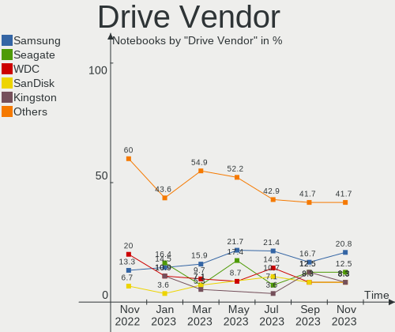
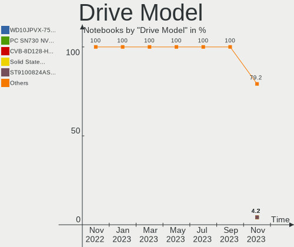
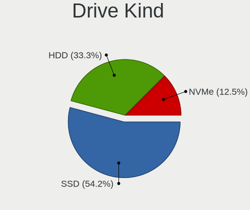
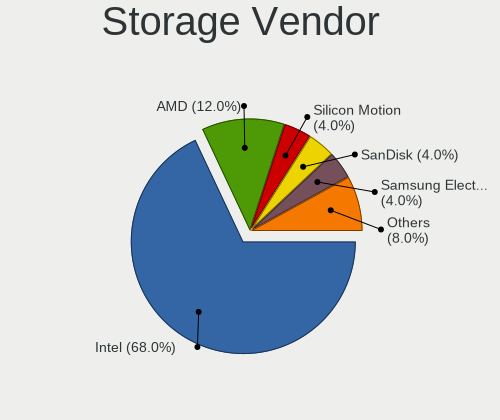
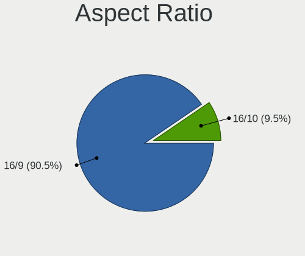

helloSystem Hardware Trends (Notebooks)
---------------------------------------

A project to identify most popular hardware characteristics and track their change
over time based on data collected by helloSystem users at https://BSD-Hardware.info.

Anyone can contribute to this report by the [hw-probe](https://github.com/linuxhw/hw-probe/blob/master/INSTALL.BSD.md) tool:

    hw-probe -all -upload

Full-feature report is available here: https://bsd-hardware.info/?view=trends

Period: Dec, 2021.

Contents
--------

* [ System ](#system)
  - [ OS                       ](#os)
  - [ OS Family                ](#os-family)
  - [ Arch                     ](#arch)
  - [ DE                       ](#de)
  - [ Display Server           ](#display-server)
  - [ Display Manager          ](#display-manager)
  - [ OS Lang                  ](#os-lang)
  - [ Boot Mode                ](#boot-mode)
  - [ Filesystem               ](#filesystem)
  - [ Part. scheme             ](#part-scheme)

* [ Board ](#board)
  - [ Vendor                   ](#vendor)
  - [ Model                    ](#model)
  - [ Model Family             ](#model-family)
  - [ MFG Year                 ](#mfg-year)
  - [ Form Factor              ](#form-factor)
  - [ Coreboot                 ](#coreboot)
  - [ RAM Size                 ](#ram-size)
  - [ RAM Used                 ](#ram-used)
  - [ Total Drives             ](#total-drives)
  - [ Has CD-ROM               ](#has-cd-rom)
  - [ Has Ethernet             ](#has-ethernet)
  - [ Has WiFi                 ](#has-wifi)
  - [ Has Bluetooth            ](#has-bluetooth)

* [ Location ](#location)
  - [ Country                  ](#country)
  - [ City                     ](#city)

* [ Drives ](#drives)
  - [ Drive Vendor             ](#drive-vendor)
  - [ Drive Model              ](#drive-model)
  - [ HDD Vendor               ](#hdd-vendor)
  - [ SSD Vendor               ](#ssd-vendor)
  - [ Drive Kind               ](#drive-kind)
  - [ Drive Connector          ](#drive-connector)
  - [ Drive Size               ](#drive-size)
  - [ Space Total              ](#space-total)
  - [ Space Used               ](#space-used)
  - [ Malfunc. Drives          ](#malfunc-drives)
  - [ Malfunc. Drive Vendor    ](#malfunc-drive-vendor)
  - [ Malfunc. HDD Vendor      ](#malfunc-hdd-vendor)
  - [ Malfunc. Drive Kind      ](#malfunc-drive-kind)
  - [ Failed Drives            ](#failed-drives)
  - [ Failed Drive Vendor      ](#failed-drive-vendor)
  - [ Drive Status             ](#drive-status)

* [ Storage controller ](#storage-controller)
  - [ Storage Vendor           ](#storage-vendor)
  - [ Storage Model            ](#storage-model)
  - [ Storage Kind             ](#storage-kind)

* [ Processor ](#processor)
  - [ CPU Vendor               ](#cpu-vendor)
  - [ CPU Model                ](#cpu-model)
  - [ CPU Model Family         ](#cpu-model-family)
  - [ CPU Cores                ](#cpu-cores)
  - [ CPU Sockets              ](#cpu-sockets)
  - [ CPU Threads              ](#cpu-threads)
  - [ CPU Microarch            ](#cpu-microarch)

* [ Graphics ](#graphics)
  - [ GPU Vendor               ](#gpu-vendor)
  - [ GPU Model                ](#gpu-model)
  - [ GPU Combo                ](#gpu-combo)
  - [ GPU Driver               ](#gpu-driver)
  - [ GPU Memory               ](#gpu-memory)

* [ Monitor ](#monitor)
  - [ Monitor Vendor           ](#monitor-vendor)
  - [ Monitor Model            ](#monitor-model)
  - [ Monitor Resolution       ](#monitor-resolution)
  - [ Monitor Diagonal         ](#monitor-diagonal)
  - [ Monitor Width            ](#monitor-width)
  - [ Aspect Ratio             ](#aspect-ratio)
  - [ Monitor Area             ](#monitor-area)
  - [ Pixel Density            ](#pixel-density)
  - [ Multiple Monitors        ](#multiple-monitors)

* [ Network ](#network)
  - [ Net Controller Vendor    ](#net-controller-vendor)
  - [ Net Controller Model     ](#net-controller-model)
  - [ Wireless Vendor          ](#wireless-vendor)
  - [ Wireless Model           ](#wireless-model)
  - [ Ethernet Vendor          ](#ethernet-vendor)
  - [ Ethernet Model           ](#ethernet-model)
  - [ Net Controller Kind      ](#net-controller-kind)
  - [ Used Controller          ](#used-controller)
  - [ NICs                     ](#nics)
  - [ IPv6                     ](#ipv6)

* [ Bluetooth ](#bluetooth)
  - [ Bluetooth Vendor         ](#bluetooth-vendor)
  - [ Bluetooth Model          ](#bluetooth-model)

* [ Sound ](#sound)
  - [ Sound Vendor             ](#sound-vendor)
  - [ Sound Model              ](#sound-model)

* [ Memory ](#memory)
  - [ Memory Vendor            ](#memory-vendor)
  - [ Memory Model             ](#memory-model)
  - [ Memory Kind              ](#memory-kind)
  - [ Memory Form Factor       ](#memory-form-factor)
  - [ Memory Size              ](#memory-size)
  - [ Memory Speed             ](#memory-speed)

* [ Printers & scanners ](#printers--scanners)
  - [ Printer Vendor           ](#printer-vendor)
  - [ Printer Model            ](#printer-model)
  - [ Scanner Vendor           ](#scanner-vendor)
  - [ Scanner Model            ](#scanner-model)

* [ Camera ](#camera)
  - [ Camera Vendor            ](#camera-vendor)
  - [ Camera Model             ](#camera-model)

* [ Security ](#security)
  - [ Fingerprint Vendor       ](#fingerprint-vendor)
  - [ Fingerprint Model        ](#fingerprint-model)
  - [ Chipcard Vendor          ](#chipcard-vendor)
  - [ Chipcard Model           ](#chipcard-model)

* [ Unsupported ](#unsupported)
  - [ Unsupported Devices      ](#unsupported-devices)
  - [ Unsupported Device Types ](#unsupported-device-types)

System
------

OS
--

Installed operating systems

| Name              | Notebooks | Percent |
|-------------------|-----------|---------|
| helloSystem 0.7.0 | 24        | 66.67%  |
| helloSystem 0.6.0 | 10        | 27.78%  |
| helloSystem 0.5.0 | 2         | 5.56%   |

OS Family
---------

OS without a version

| Name        | Notebooks | Percent |
|-------------|-----------|---------|
| helloSystem | 36        | 100%    |

Arch
----

OS architecture (x86_64, i586, etc.)

| Name  | Notebooks | Percent |
|-------|-----------|---------|
| amd64 | 36        | 100%    |

DE
--

Desktop Environment

| Name         | Notebooks | Percent |
|--------------|-----------|---------|
| helloDesktop | 36        | 100%    |

Display Server
--------------

X11 or Wayland

| Name | Notebooks | Percent |
|------|-----------|---------|
| X11  | 36        | 100%    |

Display Manager
---------------

SDDM, LightDM, etc.

| Name | Notebooks | Percent |
|------|-----------|---------|
| SLiM | 36        | 100%    |

OS Lang
-------

Language

| Lang  | Notebooks | Percent |
|-------|-----------|---------|
| en_US | 36        | 100%    |

Boot Mode
---------

EFI or BIOS

| Mode | Notebooks | Percent |
|------|-----------|---------|
| EFI  | 35        | 97.22%  |
| BIOS | 1         | 2.78%   |

Filesystem
----------

Type of filesystem

| Type   | Notebooks | Percent |
|--------|-----------|---------|
| Zfs    | 20        | 55.56%  |
| Cd9660 | 16        | 44.44%  |

Part. scheme
------------

Scheme of partitioning

| Type | Notebooks | Percent |
|------|-----------|---------|
| GPT  | 36        | 100%    |

Board
-----

Vendor
------

Motherboard manufacturer

| Name                | Notebooks | Percent |
|---------------------|-----------|---------|
| Lenovo              | 10        | 27.78%  |
| Hewlett-Packard     | 6         | 16.67%  |
| ASUSTek Computer    | 5         | 13.89%  |
| Acer                | 5         | 13.89%  |
| Dell                | 3         | 8.33%   |
| Toshiba             | 2         | 5.56%   |
| Samsung Electronics | 1         | 2.78%   |
| Positivo            | 1         | 2.78%   |
| Philco              | 1         | 2.78%   |
| Packard Bell        | 1         | 2.78%   |
| Apple               | 1         | 2.78%   |

Model
-----

Motherboard model

| Name                                  | Notebooks | Percent |
|---------------------------------------|-----------|---------|
| Toshiba Satellite L550                | 1         | 2.78%   |
| Toshiba Satellite C50-B               | 1         | 2.78%   |
| Samsung 305E4A/305E5A/305E7A          | 1         | 2.78%   |
| Positivo C14CR01                      | 1         | 2.78%   |
| Philco 10B                            | 1         | 2.78%   |
| Packard Bell EasyNote_MX61-B-038      | 1         | 2.78%   |
| Lenovo ThinkPad X270 W10DG 20K5S0BM01 | 1         | 2.78%   |
| Lenovo ThinkPad X250 20CLS1WP01       | 1         | 2.78%   |
| Lenovo ThinkPad T460 20FMS75800       | 1         | 2.78%   |
| Lenovo ThinkPad T440p 20AW007QMS      | 1         | 2.78%   |
| Lenovo ThinkPad T410 2537EA8          | 1         | 2.78%   |
| Lenovo ThinkPad SL510 2847R96         | 1         | 2.78%   |
| Lenovo ThinkPad E580 20KS005BRI       | 1         | 2.78%   |
| Lenovo ThinkPad 13 20GJCTO1WW         | 1         | 2.78%   |
| Lenovo IdeaPad 510-15IKB 80SV         | 1         | 2.78%   |
| Lenovo G500 20236                     | 1         | 2.78%   |
| HP ZBook Studio G4                    | 1         | 2.78%   |
| HP ProBook 655 G1                     | 1         | 2.78%   |
| HP Pavilion Gaming Laptop 16-a0xxx    | 1         | 2.78%   |
| HP Laptop 15-dw0xxx                   | 1         | 2.78%   |
| HP EliteBook 2560p                    | 1         | 2.78%   |
| HP 15 Notebook PC                     | 1         | 2.78%   |
| Dell Latitude E6540                   | 1         | 2.78%   |
| Dell Latitude E5470                   | 1         | 2.78%   |
| Dell Inspiron 3521                    | 1         | 2.78%   |
| ASUS X540LA                           | 1         | 2.78%   |
| ASUS X502CA                           | 1         | 2.78%   |
| ASUS UX31A                            | 1         | 2.78%   |
| ASUS S550CA                           | 1         | 2.78%   |
| ASUS N56VB                            | 1         | 2.78%   |
| Apple MacBookAir1,1                   | 1         | 2.78%   |
| Acer TravelMate 5760G                 | 1         | 2.78%   |
| Acer Swift SF314-52                   | 1         | 2.78%   |
| Acer Aspire E1-421                    | 1         | 2.78%   |
| Acer Aspire 5749Z                     | 1         | 2.78%   |
| Acer Aspire 5742G                     | 1         | 2.78%   |

Model Family
------------

Motherboard model prefix

| Name                  | Notebooks | Percent |
|-----------------------|-----------|---------|
| Lenovo ThinkPad       | 8         | 22.22%  |
| Acer Aspire           | 3         | 8.33%   |
| Toshiba Satellite     | 2         | 5.56%   |
| Dell Latitude         | 2         | 5.56%   |
| Samsung 305E4A        | 1         | 2.78%   |
| Positivo C14CR01      | 1         | 2.78%   |
| Philco 10B            | 1         | 2.78%   |
| Packard Bell EasyNote | 1         | 2.78%   |
| Lenovo IdeaPad        | 1         | 2.78%   |
| Lenovo G500           | 1         | 2.78%   |
| HP ZBook              | 1         | 2.78%   |
| HP ProBook            | 1         | 2.78%   |
| HP Pavilion           | 1         | 2.78%   |
| HP Laptop             | 1         | 2.78%   |
| HP EliteBook          | 1         | 2.78%   |
| HP 15                 | 1         | 2.78%   |
| Dell Inspiron         | 1         | 2.78%   |
| ASUS X540LA           | 1         | 2.78%   |
| ASUS X502CA           | 1         | 2.78%   |
| ASUS UX31A            | 1         | 2.78%   |
| ASUS S550CA           | 1         | 2.78%   |
| ASUS N56VB            | 1         | 2.78%   |
| Apple MacBookAir1     | 1         | 2.78%   |
| Acer TravelMate       | 1         | 2.78%   |
| Acer Swift            | 1         | 2.78%   |

MFG Year
--------

Motherboard manufacture year

| Year | Notebooks | Percent |
|------|-----------|---------|
| 2021 | 7         | 19.44%  |
| 2013 | 7         | 19.44%  |
| 2015 | 5         | 13.89%  |
| 2012 | 4         | 11.11%  |
| 2011 | 3         | 8.33%   |
| 2020 | 2         | 5.56%   |
| 2018 | 2         | 5.56%   |
| 2010 | 2         | 5.56%   |
| 2017 | 1         | 2.78%   |
| 2016 | 1         | 2.78%   |
| 2008 | 1         | 2.78%   |
| 2007 | 1         | 2.78%   |

Form Factor
-----------

Physical design of the computer

| Name     | Notebooks | Percent |
|----------|-----------|---------|
| Notebook | 36        | 100%    |

Coreboot
--------

Have coreboot on board

| Used | Notebooks | Percent |
|------|-----------|---------|
| No   | 36        | 100%    |

RAM Size
--------

Total RAM memory

| Size in GB | Notebooks | Percent |
|------------|-----------|---------|
| 4.01-8.0   | 17        | 47.22%  |
| 8.01-16.0  | 9         | 25%     |
| 16.01-24.0 | 8         | 22.22%  |
| 3.01-4.0   | 1         | 2.78%   |
| 2.01-3.0   | 1         | 2.78%   |

RAM Used
--------

Used RAM memory

| Used GB  | Notebooks | Percent |
|----------|-----------|---------|
| 0.01-0.5 | 23        | 63.89%  |
| 0.51-1.0 | 13        | 36.11%  |

Total Drives
------------

Number of drives on board

| Drives | Notebooks | Percent |
|--------|-----------|---------|
| 1      | 28        | 77.78%  |
| 2      | 7         | 19.44%  |
| 3      | 1         | 2.78%   |

Has CD-ROM
----------

Has CD-ROM on board

| Presented | Notebooks | Percent |
|-----------|-----------|---------|
| No        | 21        | 58.33%  |
| Yes       | 15        | 41.67%  |

Has Ethernet
------------

Has Ethernet on board

| Presented | Notebooks | Percent |
|-----------|-----------|---------|
| Yes       | 32        | 88.89%  |
| No        | 4         | 11.11%  |

Has WiFi
--------

Has WiFi module

| Presented | Notebooks | Percent |
|-----------|-----------|---------|
| Yes       | 36        | 100%    |

Has Bluetooth
-------------

Has Bluetooth module

| Presented | Notebooks | Percent |
|-----------|-----------|---------|
| Yes       | 20        | 55.56%  |
| No        | 16        | 44.44%  |

Location
--------

Country
-------

Geographic location (country)

| Country     | Notebooks | Percent |
|-------------|-----------|---------|
| USA         | 7         | 19.44%  |
| Romania     | 3         | 8.33%   |
| Ukraine     | 2         | 5.56%   |
| Poland      | 2         | 5.56%   |
| Netherlands | 2         | 5.56%   |
| Italy       | 2         | 5.56%   |
| France      | 2         | 5.56%   |
| Bulgaria    | 2         | 5.56%   |
| Brazil      | 2         | 5.56%   |
| Vietnam     | 1         | 2.78%   |
| UK          | 1         | 2.78%   |
| Spain       | 1         | 2.78%   |
| Slovakia    | 1         | 2.78%   |
| Russia      | 1         | 2.78%   |
| Peru        | 1         | 2.78%   |
| Norway      | 1         | 2.78%   |
| Mexico      | 1         | 2.78%   |
| Hungary     | 1         | 2.78%   |
| Germany     | 1         | 2.78%   |
| Denmark     | 1         | 2.78%   |
| Cuba        | 1         | 2.78%   |

City
----

Geographic location (city)

| City                 | Notebooks | Percent |
|----------------------|-----------|---------|
| Warsaw               | 2         | 5.56%   |
| Maraba               | 2         | 5.56%   |
| Zaporizhzhya         | 1         | 2.78%   |
| Ugarchin             | 1         | 2.78%   |
| Tula de Allende      | 1         | 2.78%   |
| Torokszentmiklos     | 1         | 2.78%   |
| Suceava              | 1         | 2.78%   |
| Stara Zagora         | 1         | 2.78%   |
| Sevastopol           | 1         | 2.78%   |
| Seattle              | 1         | 2.78%   |
| San Antonio          | 1         | 2.78%   |
| Rome                 | 1         | 2.78%   |
| Pruszcz Gdanski      | 1         | 2.78%   |
| Patterson            | 1         | 2.78%   |
| Padova               | 1         | 2.78%   |
| Nogent-sur-Marne     | 1         | 2.78%   |
| Nesttun              | 1         | 2.78%   |
| Moscow               | 1         | 2.78%   |
| Memphis              | 1         | 2.78%   |
| Longfield            | 1         | 2.78%   |
| Liptovsk?? Mikul???? | 1         | 2.78%   |
| Lima                 | 1         | 2.78%   |
| Hvidovre             | 1         | 2.78%   |
| Hoogeveen            | 1         | 2.78%   |
| Havana               | 1         | 2.78%   |
| Hanoi                | 1         | 2.78%   |
| Hackettstown         | 1         | 2.78%   |
| Elche                | 1         | 2.78%   |
| Donauw?¶rth          | 1         | 2.78%   |
| Dijon                | 1         | 2.78%   |
| Cluj-Napoca          | 1         | 2.78%   |
| Carpentersville      | 1         | 2.78%   |
| Bucharest            | 1         | 2.78%   |
| Amsterdam            | 1         | 2.78%   |

Drives
------

Drive Vendor
------------

Hard drive vendors

| Vendor              | Notebooks | Drives | Percent |
|---------------------|-----------|--------|---------|
| Samsung Electronics | 6         | 6      | 13.33%  |
| Kingston            | 6         | 6      | 13.33%  |
| WDC                 | 5         | 5      | 11.11%  |
| Toshiba             | 5         | 5      | 11.11%  |
| Seagate             | 5         | 5      | 11.11%  |
| SanDisk             | 4         | 4      | 8.89%   |
| HGST                | 3         | 3      | 6.67%   |
| Intel               | 2         | 3      | 4.44%   |
| Crucial             | 2         | 2      | 4.44%   |
| Transcend           | 1         | 1      | 2.22%   |
| SSSTC               | 1         | 1      | 2.22%   |
| SK Hynix            | 1         | 1      | 2.22%   |
| KingSpec            | 1         | 1      | 2.22%   |
| Integral            | 1         | 1      | 2.22%   |
| Hewlett-Packard     | 1         | 1      | 2.22%   |
| A-DATA Technology   | 1         | 1      | 2.22%   |

Drive Model
-----------

Hard drive models

| Model                             | Notebooks | Percent |
|-----------------------------------|-----------|---------|
| Kingston SA400S37960G 960GB       | 2         | 4.35%   |
| Kingston SA400S37120G 120GB       | 2         | 4.35%   |
| HGST HTS545050A7E680 500GB        | 2         | 4.35%   |
| Crucial CT500MX500SSD1 500GB      | 2         | 4.35%   |
| WDC WDS120G2G0A-00JH30 120GB      | 1         | 2.17%   |
| WDC WDBNCE5000PNC 500GB           | 1         | 2.17%   |
| WDC WD5000LPLX-60ZNTT1 500GB      | 1         | 2.17%   |
| WDC WD5000BPVT-22HXZT3 500GB      | 1         | 2.17%   |
| WDC WD1200BEVS-07RST0 120GB       | 1         | 2.17%   |
| Transcend TS120GMTS420S 120GB     | 1         | 2.17%   |
| Toshiba MQ01ABF050 500GB          | 1         | 2.17%   |
| Toshiba MQ01ABD100 1TB            | 1         | 2.17%   |
| Toshiba MQ01ABD075 752GB          | 1         | 2.17%   |
| Toshiba MQ01ABD050 500GB          | 1         | 2.17%   |
| Toshiba MK3261GSYN 320GB          | 1         | 2.17%   |
| SSSTC CVB-8D128-HP 128GB          | 1         | 2.17%   |
| SK Hynix HFS256G39TND-N210A 256GB | 1         | 2.17%   |
| Seagate ST980813AS 80GB           | 1         | 2.17%   |
| Seagate ST9500420AS 500GB         | 1         | 2.17%   |
| Seagate ST9320423AS 320GB         | 1         | 2.17%   |
| Seagate ST9160821AS 160GB         | 1         | 2.17%   |
| Seagate ST320LT012-9WS14C 320GB   | 1         | 2.17%   |
| SanDisk SDSSDH3 512G              | 1         | 2.17%   |
| SanDisk SD8TB8U512G1001 512GB     | 1         | 2.17%   |
| SanDisk SD6SB1M064G 64GB          | 1         | 2.17%   |
| SanDisk SD5SE2256G1002E 256GB     | 1         | 2.17%   |
| Samsung SSD 980 PRO 1TB           | 1         | 2.17%   |
| Samsung MZVLW256HEHP-000L7 256GB  | 1         | 2.17%   |
| Samsung MZNLN512HMJP-000L7 512GB  | 1         | 2.17%   |
| Samsung MZNLN256HMHQ-000H7 256GB  | 1         | 2.17%   |
| Samsung MZ7TE128HMGR-000L1 128GB  | 1         | 2.17%   |
| Samsung HS082HB 80GB              | 1         | 2.17%   |
| Kingston SA400S37240G 240GB       | 1         | 2.17%   |
| Kingston RBUSNS8154P3256GJ1 256GB | 1         | 2.17%   |
| KingSpec NT-256 256GB             | 1         | 2.17%   |
| Intel SSDSC2KF180H6L 180GB        | 1         | 2.17%   |
| Intel HBRPEKNX0202AHO 32GB        | 1         | 2.17%   |
| Intel HBRPEKNX0202AH 512GB        | 1         | 2.17%   |
| Integral V Series SATA SSD 120GB  | 1         | 2.17%   |
| HGST HTS545032A7E680 320GB        | 1         | 2.17%   |
| HP SSD S700 Pro 512GB             | 1         | 2.17%   |
| A-DATA SP550 240GB                | 1         | 2.17%   |

HDD Vendor
----------

Hard disk drive vendors

| Vendor              | Notebooks | Drives | Percent |
|---------------------|-----------|--------|---------|
| Toshiba             | 5         | 5      | 29.41%  |
| Seagate             | 5         | 5      | 29.41%  |
| WDC                 | 3         | 3      | 17.65%  |
| HGST                | 3         | 3      | 17.65%  |
| Samsung Electronics | 1         | 1      | 5.88%   |

SSD Vendor
----------

Solid state drive vendors

| Vendor              | Notebooks | Drives | Percent |
|---------------------|-----------|--------|---------|
| Kingston            | 5         | 5      | 20.83%  |
| SanDisk             | 4         | 4      | 16.67%  |
| Samsung Electronics | 3         | 3      | 12.5%   |
| WDC                 | 2         | 2      | 8.33%   |
| Crucial             | 2         | 2      | 8.33%   |
| Transcend           | 1         | 1      | 4.17%   |
| SSSTC               | 1         | 1      | 4.17%   |
| SK Hynix            | 1         | 1      | 4.17%   |
| KingSpec            | 1         | 1      | 4.17%   |
| Intel               | 1         | 1      | 4.17%   |
| Integral            | 1         | 1      | 4.17%   |
| Hewlett-Packard     | 1         | 1      | 4.17%   |
| A-DATA Technology   | 1         | 1      | 4.17%   |

Drive Kind
----------

HDD or SSD

| Kind | Notebooks | Drives | Percent |
|------|-----------|--------|---------|
| SSD  | 20        | 24     | 50%     |
| HDD  | 16        | 17     | 40%     |
| NVMe | 4         | 5      | 10%     |

Drive Connector
---------------

SATA, SAS, NVMe, etc.

| Type | Notebooks | Drives | Percent |
|------|-----------|--------|---------|
| SATA | 34        | 41     | 89.47%  |
| NVMe | 4         | 5      | 10.53%  |

Drive Size
----------

Size of hard drive

| Size in TB | Notebooks | Drives | Percent |
|------------|-----------|--------|---------|
| 0.01-0.5   | 28        | 33     | 77.78%  |
| 0.51-1.0   | 8         | 8      | 22.22%  |

Space Total
-----------

Amount of disk space available on the file system

| Size in GB | Notebooks | Percent |
|------------|-----------|---------|
| 1-20       | 20        | 55.56%  |
| 251-500    | 8         | 22.22%  |
| 101-250    | 3         | 8.33%   |
| 501-1000   | 3         | 8.33%   |
| 21-50      | 2         | 5.56%   |

Space Used
----------

Amount of used disk space

| Used GB | Notebooks | Percent |
|---------|-----------|---------|
| 1-20    | 36        | 100%    |

Malfunc. Drives
---------------

Drive models with a malfunction

| Model                            | Notebooks | Drives | Percent |
|----------------------------------|-----------|--------|---------|
| WDC WD5000LPLX-60ZNTT1 500GB     | 1         | 1      | 7.14%   |
| WDC WD5000BPVT-22HXZT3 500GB     | 1         | 1      | 7.14%   |
| Toshiba MQ01ABD100 1TB           | 1         | 1      | 7.14%   |
| Toshiba MQ01ABD075 752GB         | 1         | 1      | 7.14%   |
| Toshiba MQ01ABD050 500GB         | 1         | 1      | 7.14%   |
| Toshiba MK3261GSYN 320GB         | 1         | 1      | 7.14%   |
| SSSTC CVB-8D128-HP 128GB         | 1         | 1      | 7.14%   |
| Seagate ST9500420AS 500GB        | 1         | 1      | 7.14%   |
| Seagate ST9320423AS 320GB        | 1         | 1      | 7.14%   |
| Seagate ST9160821AS 160GB        | 1         | 1      | 7.14%   |
| Seagate ST320LT012-9WS14C 320GB  | 1         | 1      | 7.14%   |
| SanDisk SD5SE2256G1002E 256GB    | 1         | 1      | 7.14%   |
| Samsung Electronics HS082HB 80GB | 1         | 1      | 7.14%   |
| HGST HTS545050A7E680 500GB       | 1         | 1      | 7.14%   |

Malfunc. Drive Vendor
---------------------

Vendors of faulty drives

| Vendor              | Notebooks | Drives | Percent |
|---------------------|-----------|--------|---------|
| Toshiba             | 4         | 4      | 28.57%  |
| Seagate             | 4         | 4      | 28.57%  |
| WDC                 | 2         | 2      | 14.29%  |
| SSSTC               | 1         | 1      | 7.14%   |
| SanDisk             | 1         | 1      | 7.14%   |
| Samsung Electronics | 1         | 1      | 7.14%   |
| HGST                | 1         | 1      | 7.14%   |

Malfunc. HDD Vendor
-------------------

Vendors of faulty HDD drives

| Vendor              | Notebooks | Drives | Percent |
|---------------------|-----------|--------|---------|
| Toshiba             | 4         | 4      | 33.33%  |
| Seagate             | 4         | 4      | 33.33%  |
| WDC                 | 2         | 2      | 16.67%  |
| Samsung Electronics | 1         | 1      | 8.33%   |
| HGST                | 1         | 1      | 8.33%   |

Malfunc. Drive Kind
-------------------

Kinds of faulty drives

| Kind | Notebooks | Drives | Percent |
|------|-----------|--------|---------|
| HDD  | 12        | 12     | 85.71%  |
| SSD  | 2         | 2      | 14.29%  |

Failed Drives
-------------

Failed drive models

Zero info for selected period =(

Failed Drive Vendor
-------------------

Failed drive vendors

Zero info for selected period =(

Drive Status
------------

Number of failed and malfunc. drives

| Status  | Notebooks | Drives | Percent |
|---------|-----------|--------|---------|
| Works   | 24        | 32     | 63.16%  |
| Malfunc | 14        | 14     | 36.84%  |

Storage controller
------------------

Storage Vendor
--------------

Storage controller vendors

| Vendor                      | Notebooks | Percent |
|-----------------------------|-----------|---------|
| Intel                       | 31        | 81.58%  |
| AMD                         | 4         | 10.53%  |
| Samsung Electronics         | 2         | 5.26%   |
| Kingston Technology Company | 1         | 2.63%   |

Storage Model
-------------

Storage controller models

| Model                                                                            | Notebooks | Percent |
|----------------------------------------------------------------------------------|-----------|---------|
| Intel 7 Series Chipset Family 6-port SATA Controller [AHCI mode]                 | 7         | 17.07%  |
| Intel Sunrise Point-LP SATA Controller [AHCI mode]                               | 6         | 14.63%  |
| Intel 6 Series/C200 Series Chipset Family 6 port Mobile SATA AHCI Controller     | 3         | 7.32%   |
| AMD FCH SATA Controller [AHCI mode]                                              | 3         | 7.32%   |
| Intel 8 Series/C220 Series Chipset Family 6-port SATA Controller 1 [AHCI mode]   | 2         | 4.88%   |
| Intel 5 Series/3400 Series Chipset 4 port SATA AHCI Controller                   | 2         | 4.88%   |
| Samsung NVMe SSD Controller SM961/PM961/SM963                                    | 1         | 2.44%   |
| Samsung NVMe SSD Controller PM9A1/PM9A3/980PRO                                   | 1         | 2.44%   |
| Kingston Company U-SNS8154P3 NVMe SSD                                            | 1         | 2.44%   |
| Intel Wildcat Point-LP SATA Controller [AHCI Mode]                               | 1         | 2.44%   |
| Intel Q170/Q150/B150/H170/H110/Z170/CM236 Chipset SATA Controller [AHCI Mode]    | 1         | 2.44%   |
| Intel NM10/ICH7 Family SATA Controller [AHCI mode]                               | 1         | 2.44%   |
| Intel Celeron/Pentium Silver Processor SATA Controller                           | 1         | 2.44%   |
| Intel Atom/Celeron/Pentium Processor x5-E8000/J3xxx/N3xxx Series SATA Controller | 1         | 2.44%   |
| Intel Atom Processor E3800 Series SATA AHCI Controller                           | 1         | 2.44%   |
| Intel 82801IBM/IEM (ICH9M/ICH9M-E) 4 port SATA Controller [AHCI mode]            | 1         | 2.44%   |
| Intel 82801HM/HEM (ICH8M/ICH8M-E) SATA Controller [AHCI mode]                    | 1         | 2.44%   |
| Intel 82801HM/HEM (ICH8M/ICH8M-E) IDE Controller                                 | 1         | 2.44%   |
| Intel 82801 Mobile SATA Controller [RAID mode]                                   | 1         | 2.44%   |
| Intel 8 Series SATA Controller 1 [AHCI mode]                                     | 1         | 2.44%   |
| Intel 5 Series/3400 Series Chipset 6 port SATA AHCI Controller                   | 1         | 2.44%   |
| AMD SB600 Non-Raid-5 SATA                                                        | 1         | 2.44%   |
| AMD SB600 IDE                                                                    | 1         | 2.44%   |
| Unknown                                                                          | 1         | 2.44%   |

Storage Kind
------------

Kind of storage controller (IDE, SATA, NVMe, SAS, ...)

| Kind | Notebooks | Percent |
|------|-----------|---------|
| SATA | 33        | 82.5%   |
| NVMe | 4         | 10%     |
| IDE  | 2         | 5%      |
| RAID | 1         | 2.5%    |

Processor
---------

CPU Vendor
----------

Processor vendors

| Vendor | Notebooks | Percent |
|--------|-----------|---------|
| Intel  | 32        | 88.89%  |
| AMD    | 4         | 11.11%  |

CPU Model
---------

Processor models

| Model                                     | Notebooks | Percent |
|-------------------------------------------|-----------|---------|
| Intel Core i5-6300U CPU @ 2.40GHz         | 2         | 5.56%   |
| Intel Pentium Silver N5030 CPU @ 1.10GHz  | 1         | 2.78%   |
| Intel Pentium CPU N3530 @ 2.16GHz         | 1         | 2.78%   |
| Intel Pentium CPU B960 @ 2.20GHz          | 1         | 2.78%   |
| Intel CPU Version                         | 1         | 2.78%   |
| Intel Core i7-8550U CPU @ 1.80GHz         | 1         | 2.78%   |
| Intel Core i7-6600U CPU @ 2.60GHz         | 1         | 2.78%   |
| Intel Core i7-4810MQ CPU @ 2.80GHz        | 1         | 2.78%   |
| Intel Core i7-4712MQ CPU @ 2.30GHz        | 1         | 2.78%   |
| Intel Core i7-3630QM CPU @ 2.40GHz        | 1         | 2.78%   |
| Intel Core i5-8250U CPU @ 1.60GHz         | 1         | 2.78%   |
| Intel Core i5-7300HQ CPU @ 2.50GHz        | 1         | 2.78%   |
| Intel Core i5-7200U CPU @ 2.50GHz         | 1         | 2.78%   |
| Intel Core i5-5200U CPU @ 2.20GHz         | 1         | 2.78%   |
| Intel Core i5-3317U CPU @ 1.70GHz         | 1         | 2.78%   |
| Intel Core i5-2520M CPU @ 2.50GHz         | 1         | 2.78%   |
| Intel Core i5-2410M CPU @ 2.30GHz         | 1         | 2.78%   |
| Intel Core i5-10300H CPU @ 2.50GHz        | 1         | 2.78%   |
| Intel Core i5 CPU M 520 @ 2.40GHz         | 1         | 2.78%   |
| Intel Core i3-6100U CPU @ 2.30GHz         | 1         | 2.78%   |
| Intel Core i3-4005U CPU @ 1.70GHz         | 1         | 2.78%   |
| Intel Core i3-3227U CPU @ 1.90GHz         | 1         | 2.78%   |
| Intel Core i3-3217U CPU @ 1.80GHz         | 1         | 2.78%   |
| Intel Core i3-2330M CPU @ 2.20GHz         | 1         | 2.78%   |
| Intel Core i3 CPU M 370 @ 2.40GHz         | 1         | 2.78%   |
| Intel Core i3 CPU M 330 @ 2.13GHz         | 1         | 2.78%   |
| Intel Core 2 Duo CPU P7500 @ 1.60GHz      | 1         | 2.78%   |
| Intel Celeron CPU N3050 @ 1.60GHz         | 1         | 2.78%   |
| Intel Celeron CPU 1007U @ 1.50GHz         | 1         | 2.78%   |
| Intel Celeron CPU 1005M @ 1.90GHz         | 1         | 2.78%   |
| Intel Atom CPU D425 @ 1.80GHz             | 1         | 2.78%   |
| AMD Turion 64 X2 Mobile Technology TL-60  | 1         | 2.78%   |
| AMD E-300 APU with Radeon HD Graphics     | 1         | 2.78%   |
| AMD A6-3420M APU with Radeon HD Graphics  | 1         | 2.78%   |
| AMD A10-5750M APU with Radeon HD Graphics | 1         | 2.78%   |

CPU Model Family
----------------

Processor model prefix

| Model                   | Notebooks | Percent |
|-------------------------|-----------|---------|
| Intel Core i5           | 11        | 30.56%  |
| Intel Core i3           | 7         | 19.44%  |
| Intel Core i7           | 5         | 13.89%  |
| Intel Celeron           | 3         | 8.33%   |
| Intel Pentium           | 2         | 5.56%   |
| Other                   | 1         | 2.78%   |
| Intel Pentium Silver    | 1         | 2.78%   |
| Intel Core 2 Duo        | 1         | 2.78%   |
| Intel Atom              | 1         | 2.78%   |
| AMD Turion 64 X2 Mobile | 1         | 2.78%   |
| AMD E                   | 1         | 2.78%   |
| AMD A6                  | 1         | 2.78%   |
| AMD A10                 | 1         | 2.78%   |

CPU Cores
---------

Number of processor cores

| Number  | Notebooks | Percent |
|---------|-----------|---------|
| 2       | 23        | 63.89%  |
| 4       | 11        | 30.56%  |
| 1       | 1         | 2.78%   |
| Unknown | 1         | 2.78%   |

CPU Sockets
-----------

Number of sockets

| Number | Notebooks | Percent |
|--------|-----------|---------|
| 1      | 35        | 97.22%  |
| 2      | 1         | 2.78%   |

CPU Threads
-----------

Threads per core (Hyper-Threading)

| Number  | Notebooks | Percent |
|---------|-----------|---------|
| 2       | 23        | 63.89%  |
| 1       | 12        | 33.33%  |
| Unknown | 1         | 2.78%   |

CPU Microarch
-------------

Microarchitecture

| Name          | Notebooks | Percent |
|---------------|-----------|---------|
| IvyBridge     | 6         | 16.67%  |
| Skylake       | 4         | 11.11%  |
| SandyBridge   | 4         | 11.11%  |
| KabyLake      | 4         | 11.11%  |
| Westmere      | 3         | 8.33%   |
| Haswell       | 3         | 8.33%   |
| Silvermont    | 2         | 5.56%   |
| Piledriver    | 1         | 2.78%   |
| Penryn        | 1         | 2.78%   |
| K8 Hammer     | 1         | 2.78%   |
| K10 Llano     | 1         | 2.78%   |
| Goldmont plus | 1         | 2.78%   |
| Core          | 1         | 2.78%   |
| CometLake     | 1         | 2.78%   |
| Broadwell     | 1         | 2.78%   |
| Bonnell       | 1         | 2.78%   |
| Bobcat        | 1         | 2.78%   |

Graphics
--------

GPU Vendor
----------

Vendors of graphics cards

| Vendor | Notebooks | Percent |
|--------|-----------|---------|
| Intel  | 30        | 69.77%  |
| AMD    | 8         | 18.6%   |
| Nvidia | 5         | 11.63%  |

GPU Model
---------

Graphics card models

| Model                                                                                    | Notebooks | Percent |
|------------------------------------------------------------------------------------------|-----------|---------|
| Intel 3rd Gen Core processor Graphics Controller                                         | 6         | 13.64%  |
| Intel Skylake GT2 [HD Graphics 520]                                                      | 4         | 9.09%   |
| Intel 2nd Generation Core Processor Family Integrated Graphics Controller                | 4         | 9.09%   |
| Intel UHD Graphics 620                                                                   | 2         | 4.55%   |
| Intel 4th Gen Core Processor Integrated Graphics Controller                              | 2         | 4.55%   |
| Nvidia TU116M [GeForce GTX 1660 Ti Mobile]                                               | 1         | 2.27%   |
| Nvidia GM108M [GeForce 940MX]                                                            | 1         | 2.27%   |
| Nvidia GK107M [GeForce GT 740M]                                                          | 1         | 2.27%   |
| Nvidia GF119M [GeForce GT 520M]                                                          | 1         | 2.27%   |
| Nvidia GF108M [GeForce GT 420M]                                                          | 1         | 2.27%   |
| Intel Mobile GM965/GL960 Integrated Graphics Controller (secondary)                      | 1         | 2.27%   |
| Intel Mobile GM965/GL960 Integrated Graphics Controller (primary)                        | 1         | 2.27%   |
| Intel Mobile 4 Series Chipset Integrated Graphics Controller                             | 1         | 2.27%   |
| Intel HD Graphics 630                                                                    | 1         | 2.27%   |
| Intel HD Graphics 620                                                                    | 1         | 2.27%   |
| Intel HD Graphics 5500                                                                   | 1         | 2.27%   |
| Intel Haswell-ULT Integrated Graphics Controller                                         | 1         | 2.27%   |
| Intel GeminiLake [UHD Graphics 605]                                                      | 1         | 2.27%   |
| Intel Core Processor Integrated Graphics Controller                                      | 1         | 2.27%   |
| Intel CometLake-H GT2 [UHD Graphics]                                                     | 1         | 2.27%   |
| Intel Atom/Celeron/Pentium Processor x5-E8000/J3xxx/N3xxx Integrated Graphics Controller | 1         | 2.27%   |
| Intel Atom Processor Z36xxx/Z37xxx Series Graphics & Display                             | 1         | 2.27%   |
| Intel Atom Processor D4xx/D5xx/N4xx/N5xx Integrated Graphics Controller                  | 1         | 2.27%   |
| AMD Wrestler [Radeon HD 6310]                                                            | 1         | 2.27%   |
| AMD Topaz XT [Radeon R7 M260/M265 / M340/M360 / M440/M445 / 530/535 / 620/625 Mobile]    | 1         | 2.27%   |
| AMD Sumo [Radeon HD 6520G]                                                               | 1         | 2.27%   |
| AMD RV730/M96 [Mobility Radeon HD 4650/5165]                                             | 1         | 2.27%   |
| AMD RV610/M72-S [Mobility Radeon HD 2400]                                                | 1         | 2.27%   |
| AMD Richland [Radeon HD 8650G]                                                           | 1         | 2.27%   |
| AMD Mars XTX [Radeon HD 8790M]                                                           | 1         | 2.27%   |
| AMD Lexa PRO [Radeon 540/540X/550/550X / RX 540X/550/550X]                               | 1         | 2.27%   |

GPU Combo
---------

Combinations of graphics cards

| Name           | Notebooks | Percent |
|----------------|-----------|---------|
| 1 x Intel      | 20        | 55.56%  |
| 1 x AMD        | 5         | 13.89%  |
| Intel + Nvidia | 4         | 11.11%  |
| 2 x Intel      | 3         | 8.33%   |
| Intel + AMD    | 3         | 8.33%   |
| 1 x Nvidia     | 1         | 2.78%   |

GPU Driver
----------

Free vs proprietary

| Driver      | Notebooks | Percent |
|-------------|-----------|---------|
| Free        | 35        | 97.22%  |
| Proprietary | 1         | 2.78%   |

GPU Memory
----------

Total video memory

| Size in GB | Notebooks | Percent |
|------------|-----------|---------|
| Unknown    | 30        | 83.33%  |
| 0.51-1.0   | 3         | 8.33%   |
| 0.01-0.5   | 3         | 8.33%   |

Monitor
-------

Monitor Vendor
--------------

Monitor vendors

| Vendor                  | Notebooks | Percent |
|-------------------------|-----------|---------|
| LG Display              | 8         | 20.51%  |
| Samsung Electronics     | 6         | 15.38%  |
| Chimei Innolux          | 6         | 15.38%  |
| BOE                     | 5         | 12.82%  |
| AU Optronics            | 4         | 10.26%  |
| Lenovo                  | 3         | 7.69%   |
| LG Philips              | 1         | 2.56%   |
| InfoVision              | 1         | 2.56%   |
| Hewlett-Packard         | 1         | 2.56%   |
| Fujitsu Siemens         | 1         | 2.56%   |
| Chi Mei Optoelectronics | 1         | 2.56%   |
| BenQ                    | 1         | 2.56%   |
| Apple                   | 1         | 2.56%   |

Monitor Model
-------------

Monitor models

| Model                                                                    | Notebooks | Percent |
|--------------------------------------------------------------------------|-----------|---------|
| Samsung Electronics LCD Monitor SEC334A 1366x768 340x190mm 15.3-inch     | 2         | 5.13%   |
| Samsung Electronics LCD Monitor SEC384A 1366x768 340x190mm 15.3-inch     | 1         | 2.56%   |
| Samsung Electronics LCD Monitor SEC314C 1920x1080 340x190mm 15.3-inch    | 1         | 2.56%   |
| Samsung Electronics LCD Monitor SDC4C48 1920x1080 240x130mm 10.7-inch    | 1         | 2.56%   |
| Samsung Electronics LCD Monitor SDC4347 1366x768 340x190mm 15.3-inch     | 1         | 2.56%   |
| LG Philips LCD Monitor LPLE300 1280x800 330x210mm 15.4-inch              | 1         | 2.56%   |
| LG Display LCD Monitor LGD0521 1920x1080 310x170mm 13.9-inch             | 1         | 2.56%   |
| LG Display LCD Monitor LGD048C 1920x1080 290x170mm 13.2-inch             | 1         | 2.56%   |
| LG Display LCD Monitor LGD0465 1366x768 340x190mm 15.3-inch              | 1         | 2.56%   |
| LG Display LCD Monitor LGD03AB 1366x768 340x190mm 15.3-inch              | 1         | 2.56%   |
| LG Display LCD Monitor LGD0385 1366x768 310x170mm 13.9-inch              | 1         | 2.56%   |
| LG Display LCD Monitor LGD02DC 1366x768 340x190mm 15.3-inch              | 1         | 2.56%   |
| LG Display LCD Monitor LGD0250 1366x768 350x190mm 15.7-inch              | 1         | 2.56%   |
| LG Display LCD Monitor LGD01CA 1600x900 380x210mm 17.1-inch              | 1         | 2.56%   |
| Lenovo LEN P27q-10 LEN61A8 2560x1440 600x340mm 27.2-inch                 | 1         | 2.56%   |
| Lenovo LCD Monitor LEN40B0 1366x768 340x190mm 15.3-inch                  | 1         | 2.56%   |
| Lenovo LCD Monitor LEN4035 1280x800 300x190mm 14.0-inch                  | 1         | 2.56%   |
| InfoVision LCD Monitor IVO03F4 1024x600 220x130mm 10.1-inch              | 1         | 2.56%   |
| Hewlett-Packard 2009 HWP2827 1600x900 440x250mm 19.9-inch                | 1         | 2.56%   |
| Fujitsu Siemens E19-5 FUS07CD 1280x1024 380x300mm 19.1-inch              | 1         | 2.56%   |
| Chimei Innolux LCD Monitor CMN1602 1920x1080 360x200mm 16.2-inch         | 1         | 2.56%   |
| Chimei Innolux LCD Monitor CMN15CA 1366x768 340x190mm 15.3-inch          | 1         | 2.56%   |
| Chimei Innolux LCD Monitor CMN15C0 1920x1080 340x190mm 15.3-inch         | 1         | 2.56%   |
| Chimei Innolux LCD Monitor CMN14C9 1920x1080 310x170mm 13.9-inch         | 1         | 2.56%   |
| Chimei Innolux LCD Monitor CMN1482 1600x900 310x170mm 13.9-inch          | 1         | 2.56%   |
| Chimei Innolux LCD Monitor CMN1348 1920x1080 280x160mm 12.7-inch         | 1         | 2.56%   |
| Chi Mei Optoelectronics LCD Monitor CMO15A7 1366x768 350x190mm 15.7-inch | 1         | 2.56%   |
| BOE LCD Monitor BOE06FF 1920x1080 340x190mm 15.3-inch                    | 1         | 2.56%   |
| BOE LCD Monitor BOE06CE 1366x768 280x160mm 12.7-inch                     | 1         | 2.56%   |
| BOE LCD Monitor BOE0662 1366x768 340x190mm 15.3-inch                     | 1         | 2.56%   |
| BOE LCD Monitor BOE065E 1920x1080 340x190mm 15.3-inch                    | 1         | 2.56%   |
| BOE LCD Monitor BOE0653 1920x1080 310x170mm 13.9-inch                    | 1         | 2.56%   |
| BenQ GW2780 BNQ78E6 1920x1080 600x340mm 27.2-inch                        | 1         | 2.56%   |
| AU Optronics LCD Monitor AUO3191 1366x768 340x190mm 15.3-inch            | 1         | 2.56%   |
| AU Optronics LCD Monitor AUO23EC 1366x768 340x190mm 15.3-inch            | 1         | 2.56%   |
| AU Optronics LCD Monitor AUO226D 1920x1080 280x160mm 12.7-inch           | 1         | 2.56%   |
| AU Optronics LCD Monitor AUO206C 1366x768 280x160mm 12.7-inch            | 1         | 2.56%   |
| Apple Color LCD APP9C6F 1280x800 290x190mm 13.6-inch                     | 1         | 2.56%   |

Monitor Resolution
------------------

Monitor screen resolution

| Resolution       | Notebooks | Percent |
|------------------|-----------|---------|
| 1366x768 (WXGA)  | 17        | 44.74%  |
| 1920x1080 (FHD)  | 12        | 31.58%  |
| 1600x900 (HD+)   | 3         | 7.89%   |
| 1280x800 (WXGA)  | 3         | 7.89%   |
| 2560x1440 (QHD)  | 1         | 2.63%   |
| 1280x1024 (SXGA) | 1         | 2.63%   |
| 1024x600         | 1         | 2.63%   |

Monitor Diagonal
----------------

Diagonal size in inches

| Inches | Notebooks | Percent |
|--------|-----------|---------|
| 15     | 20        | 51.28%  |
| 13     | 7         | 17.95%  |
| 12     | 4         | 10.26%  |
| 27     | 2         | 5.13%   |
| 19     | 2         | 5.13%   |
| 17     | 1         | 2.56%   |
| 16     | 1         | 2.56%   |
| 14     | 1         | 2.56%   |
| 10     | 1         | 2.56%   |

Monitor Width
-------------

Physical width

| Width in mm | Notebooks | Percent |
|-------------|-----------|---------|
| 301-350     | 25        | 64.1%   |
| 201-300     | 8         | 20.51%  |
| 351-400     | 3         | 7.69%   |
| 501-600     | 2         | 5.13%   |
| 401-500     | 1         | 2.56%   |

Aspect Ratio
------------

Proportional relationship between the width and the height

| Ratio | Notebooks | Percent |
|-------|-----------|---------|
| 16/9  | 33        | 89.19%  |
| 16/10 | 2         | 5.41%   |
| 5/4   | 1         | 2.7%    |
| 3/2   | 1         | 2.7%    |

Monitor Area
------------

Area in inch²

| Area in inch² | Notebooks | Percent |
|----------------|-----------|---------|
| 91-100         | 17        | 43.59%  |
| 81-90          | 7         | 17.95%  |
| 61-70          | 4         | 10.26%  |
| 101-110        | 3         | 7.69%   |
| 301-350        | 2         | 5.13%   |
| 151-200        | 2         | 5.13%   |
| 71-80          | 1         | 2.56%   |
| 41-50          | 1         | 2.56%   |
| 121-130        | 1         | 2.56%   |
| 111-120        | 1         | 2.56%   |

Pixel Density
-------------

Pixels per inch

| Density | Notebooks | Percent |
|---------|-----------|---------|
| 101-120 | 18        | 46.15%  |
| 121-160 | 12        | 30.77%  |
| 51-100  | 6         | 15.38%  |
| 161-240 | 3         | 7.69%   |

Multiple Monitors
-----------------

Total monitors connected

| Total | Notebooks | Percent |
|-------|-----------|---------|
| 1     | 33        | 91.67%  |
| 2     | 3         | 8.33%   |

Network
-------

Net Controller Vendor
---------------------

Controller vendors

| Vendor                | Notebooks | Percent |
|-----------------------|-----------|---------|
| Realtek Semiconductor | 16        | 30.19%  |
| Intel                 | 16        | 30.19%  |
| Qualcomm Atheros      | 13        | 24.53%  |
| Broadcom              | 5         | 9.43%   |
| JMicron Technology    | 2         | 3.77%   |
| Dell                  | 1         | 1.89%   |

Net Controller Model
--------------------

Controller models

| Model                                                                   | Notebooks | Percent |
|-------------------------------------------------------------------------|-----------|---------|
| Realtek RTL8111/8168/8411 PCI Express Gigabit Ethernet Controller       | 7         | 10%     |
| Qualcomm Atheros AR9485 Wireless Network Adapter                        | 7         | 10%     |
| Realtek RTL810xE PCI Express Fast Ethernet controller                   | 5         | 7.14%   |
| Intel Wireless 8260                                                     | 4         | 5.71%   |
| Realtek RTL8188EE Wireless Network Adapter                              | 3         | 4.29%   |
| Intel Ethernet Connection I219-LM                                       | 3         | 4.29%   |
| Qualcomm Atheros QCA9565 / AR9565 Wireless Network Adapter              | 2         | 2.86%   |
| Qualcomm Atheros AR8161 Gigabit Ethernet                                | 2         | 2.86%   |
| Qualcomm Atheros AR8151 v2.0 Gigabit Ethernet                           | 2         | 2.86%   |
| Intel Wireless 7265                                                     | 2         | 2.86%   |
| Intel Wi-Fi 6 AX200                                                     | 2         | 2.86%   |
| Intel Ethernet Connection I217-LM                                       | 2         | 2.86%   |
| Intel Dual Band Wireless-AC 3165 Plus Bluetooth                         | 2         | 2.86%   |
| Realtek RTL8821CE 802.11ac PCIe Wireless Network Adapter                | 1         | 1.43%   |
| Realtek RTL8188EUS 802.11n Wireless Network Adapter                     | 1         | 1.43%   |
| Realtek RTL-8100/8101L/8139 PCI Fast Ethernet Adapter                   | 1         | 1.43%   |
| Qualcomm Atheros QCA8172 Fast Ethernet                                  | 1         | 1.43%   |
| Qualcomm Atheros AR9287 Wireless Network Adapter (PCI-Express)          | 1         | 1.43%   |
| Qualcomm Atheros AR9285 Wireless Network Adapter (PCI-Express)          | 1         | 1.43%   |
| Qualcomm Atheros AR8152 v2.0 Fast Ethernet                              | 1         | 1.43%   |
| Qualcomm Atheros AR242x / AR542x Wireless Network Adapter (PCI-Express) | 1         | 1.43%   |
| JMicron JMC260 PCI Express Fast Ethernet Controller                     | 1         | 1.43%   |
| JMicron JMC250 PCI Express Gigabit Ethernet Controller                  | 1         | 1.43%   |
| Intel Wireless 7260                                                     | 1         | 1.43%   |
| Intel Ethernet Connection I219-V                                        | 1         | 1.43%   |
| Intel Ethernet Connection (3) I218-LM                                   | 1         | 1.43%   |
| Intel Ethernet Connection (2) I219-LM                                   | 1         | 1.43%   |
| Intel Centrino Wireless-N 1000 [Condor Peak]                            | 1         | 1.43%   |
| Intel Centrino Ultimate-N 6300                                          | 1         | 1.43%   |
| Intel Centrino Advanced-N 6235                                          | 1         | 1.43%   |
| Intel Centrino Advanced-N 6205 [Taylor Peak]                            | 1         | 1.43%   |
| Intel Centrino Advanced-N 6200                                          | 1         | 1.43%   |
| Intel 82579LM Gigabit Network Connection (Lewisville)                   | 1         | 1.43%   |
| Intel 82577LM Gigabit Network Connection                                | 1         | 1.43%   |
| Dell Hub of E-Port Replicator                                           | 1         | 1.43%   |
| Broadcom NetLink BCM57780 Gigabit Ethernet PCIe                         | 1         | 1.43%   |
| Broadcom BCM43228 802.11a/b/g/n                                         | 1         | 1.43%   |
| Broadcom BCM43227 802.11b/g/n                                           | 1         | 1.43%   |
| Broadcom BCM4321 802.11a/b/g/n                                          | 1         | 1.43%   |
| Broadcom BCM43142 802.11b/g/n                                           | 1         | 1.43%   |

Wireless Vendor
---------------

Wireless vendors

| Vendor                | Notebooks | Percent |
|-----------------------|-----------|---------|
| Intel                 | 16        | 42.11%  |
| Qualcomm Atheros      | 12        | 31.58%  |
| Realtek Semiconductor | 5         | 13.16%  |
| Broadcom              | 4         | 10.53%  |
| Dell                  | 1         | 2.63%   |

Wireless Model
--------------

Wireless models

| Model                                                                   | Notebooks | Percent |
|-------------------------------------------------------------------------|-----------|---------|
| Qualcomm Atheros AR9485 Wireless Network Adapter                        | 7         | 18.42%  |
| Intel Wireless 8260                                                     | 4         | 10.53%  |
| Realtek RTL8188EE Wireless Network Adapter                              | 3         | 7.89%   |
| Qualcomm Atheros QCA9565 / AR9565 Wireless Network Adapter              | 2         | 5.26%   |
| Intel Wireless 7265                                                     | 2         | 5.26%   |
| Intel Wi-Fi 6 AX200                                                     | 2         | 5.26%   |
| Intel Dual Band Wireless-AC 3165 Plus Bluetooth                         | 2         | 5.26%   |
| Realtek RTL8821CE 802.11ac PCIe Wireless Network Adapter                | 1         | 2.63%   |
| Realtek RTL8188EUS 802.11n Wireless Network Adapter                     | 1         | 2.63%   |
| Qualcomm Atheros AR9287 Wireless Network Adapter (PCI-Express)          | 1         | 2.63%   |
| Qualcomm Atheros AR9285 Wireless Network Adapter (PCI-Express)          | 1         | 2.63%   |
| Qualcomm Atheros AR242x / AR542x Wireless Network Adapter (PCI-Express) | 1         | 2.63%   |
| Intel Wireless 7260                                                     | 1         | 2.63%   |
| Intel Centrino Wireless-N 1000 [Condor Peak]                            | 1         | 2.63%   |
| Intel Centrino Ultimate-N 6300                                          | 1         | 2.63%   |
| Intel Centrino Advanced-N 6235                                          | 1         | 2.63%   |
| Intel Centrino Advanced-N 6205 [Taylor Peak]                            | 1         | 2.63%   |
| Intel Centrino Advanced-N 6200                                          | 1         | 2.63%   |
| Dell Hub of E-Port Replicator                                           | 1         | 2.63%   |
| Broadcom BCM43228 802.11a/b/g/n                                         | 1         | 2.63%   |
| Broadcom BCM43227 802.11b/g/n                                           | 1         | 2.63%   |
| Broadcom BCM4321 802.11a/b/g/n                                          | 1         | 2.63%   |
| Broadcom BCM43142 802.11b/g/n                                           | 1         | 2.63%   |

Ethernet Vendor
---------------

Ethernet vendors

| Vendor                | Notebooks | Percent |
|-----------------------|-----------|---------|
| Realtek Semiconductor | 13        | 40.63%  |
| Intel                 | 10        | 31.25%  |
| Qualcomm Atheros      | 6         | 18.75%  |
| JMicron Technology    | 2         | 6.25%   |
| Broadcom              | 1         | 3.13%   |

Ethernet Model
--------------

Ethernet models

| Model                                                             | Notebooks | Percent |
|-------------------------------------------------------------------|-----------|---------|
| Realtek RTL8111/8168/8411 PCI Express Gigabit Ethernet Controller | 7         | 21.88%  |
| Realtek RTL810xE PCI Express Fast Ethernet controller             | 5         | 15.63%  |
| Intel Ethernet Connection I219-LM                                 | 3         | 9.38%   |
| Qualcomm Atheros AR8161 Gigabit Ethernet                          | 2         | 6.25%   |
| Qualcomm Atheros AR8151 v2.0 Gigabit Ethernet                     | 2         | 6.25%   |
| Intel Ethernet Connection I217-LM                                 | 2         | 6.25%   |
| Realtek RTL-8100/8101L/8139 PCI Fast Ethernet Adapter             | 1         | 3.13%   |
| Qualcomm Atheros QCA8172 Fast Ethernet                            | 1         | 3.13%   |
| Qualcomm Atheros AR8152 v2.0 Fast Ethernet                        | 1         | 3.13%   |
| JMicron JMC260 PCI Express Fast Ethernet Controller               | 1         | 3.13%   |
| JMicron JMC250 PCI Express Gigabit Ethernet Controller            | 1         | 3.13%   |
| Intel Ethernet Connection I219-V                                  | 1         | 3.13%   |
| Intel Ethernet Connection (3) I218-LM                             | 1         | 3.13%   |
| Intel Ethernet Connection (2) I219-LM                             | 1         | 3.13%   |
| Intel 82579LM Gigabit Network Connection (Lewisville)             | 1         | 3.13%   |
| Intel 82577LM Gigabit Network Connection                          | 1         | 3.13%   |
| Broadcom NetLink BCM57780 Gigabit Ethernet PCIe                   | 1         | 3.13%   |

Net Controller Kind
-------------------

Ethernet, WiFi or modem

| Kind     | Notebooks | Percent |
|----------|-----------|---------|
| WiFi     | 36        | 52.94%  |
| Ethernet | 32        | 47.06%  |

Used Controller
---------------

Currently used network controller

| Kind     | Notebooks | Percent |
|----------|-----------|---------|
| Ethernet | 32        | 52.46%  |
| WiFi     | 29        | 47.54%  |

NICs
----

Total network controllers on board

| Total | Notebooks | Percent |
|-------|-----------|---------|
| 2     | 32        | 88.89%  |
| 1     | 4         | 11.11%  |

IPv6
----

IPv6 vs IPv4

| Used | Notebooks | Percent |
|------|-----------|---------|
| No   | 32        | 88.89%  |
| Yes  | 4         | 11.11%  |

Bluetooth
---------

Bluetooth Vendor
----------------

Controller vendors

| Vendor                          | Notebooks | Percent |
|---------------------------------|-----------|---------|
| Intel                           | 11        | 55%     |
| Qualcomm Atheros Communications | 2         | 10%     |
| IMC Networks                    | 2         | 10%     |
| Broadcom                        | 2         | 10%     |
| Realtek Semiconductor           | 1         | 5%      |
| Hewlett-Packard                 | 1         | 5%      |
| Apple                           | 1         | 5%      |

Bluetooth Model
---------------

Controller models

| Model                                             | Notebooks | Percent |
|---------------------------------------------------|-----------|---------|
| Intel Bluetooth wireless interface                | 8         | 40%     |
| Intel AX200 Bluetooth                             | 2         | 10%     |
| Realtek  Bluetooth 4.2 Adapter                    | 1         | 5%      |
| Qualcomm Atheros AR3012 Bluetooth 4.0             | 1         | 5%      |
| Qualcomm Atheros AR3011 Bluetooth (no firmware)   | 1         | 5%      |
| Intel Centrino Bluetooth Wireless Transceiver     | 1         | 5%      |
| IMC Networks Qualcomm Atheros Bluetooth 4.0 + HS  | 1         | 5%      |
| IMC Networks Atheros AR3012 Bluetooth 4.0 Adapter | 1         | 5%      |
| HP Broadcom 2070 Bluetooth Combo                  | 1         | 5%      |
| Broadcom BCM43142 Bluetooth 4.0                   | 1         | 5%      |
| Broadcom BCM2045B (BDC-2.1)                       | 1         | 5%      |
| Apple Broadcom Bluetooth 2.1 module               | 1         | 5%      |

Sound
-----

Sound Vendor
------------

Sound card vendors

| Vendor    | Notebooks | Percent |
|-----------|-----------|---------|
| Intel     | 32        | 80%     |
| AMD       | 5         | 12.5%   |
| Nvidia    | 2         | 5%      |
| GN Netcom | 1         | 2.5%    |

Sound Model
-----------

Sound card models

| Model                                                                                             | Notebooks | Percent |
|---------------------------------------------------------------------------------------------------|-----------|---------|
| Intel Sunrise Point-LP HD Audio                                                                   | 7         | 14.58%  |
| Intel 7 Series/C216 Chipset Family High Definition Audio Controller                               | 7         | 14.58%  |
| Intel 6 Series/C200 Series Chipset Family High Definition Audio Controller                        | 3         | 6.25%   |
| Intel 5 Series/3400 Series Chipset High Definition Audio                                          | 3         | 6.25%   |
| AMD FCH Azalia Controller                                                                         | 3         | 6.25%   |
| Intel Xeon E3-1200 v3/4th Gen Core Processor HD Audio Controller                                  | 2         | 4.17%   |
| Intel 8 Series/C220 Series Chipset High Definition Audio Controller                               | 2         | 4.17%   |
| Nvidia TU116 High Definition Audio Controller                                                     | 1         | 2.08%   |
| Nvidia GF108 High Definition Audio Controller                                                     | 1         | 2.08%   |
| Intel Wildcat Point-LP High Definition Audio Controller                                           | 1         | 2.08%   |
| Intel NM10/ICH7 Family High Definition Audio Controller                                           | 1         | 2.08%   |
| Intel Haswell-ULT HD Audio Controller                                                             | 1         | 2.08%   |
| Intel Comet Lake PCH cAVS                                                                         | 1         | 2.08%   |
| Intel CM238 HD Audio Controller                                                                   | 1         | 2.08%   |
| Intel Celeron/Pentium Silver Processor High Definition Audio                                      | 1         | 2.08%   |
| Intel Broadwell-U Audio Controller                                                                | 1         | 2.08%   |
| Intel Atom/Celeron/Pentium Processor x5-E8000/J3xxx/N3xxx Series High Definition Audio Controller | 1         | 2.08%   |
| Intel Atom Processor Z36xxx/Z37xxx Series High Definition Audio Controller                        | 1         | 2.08%   |
| Intel 82801I (ICH9 Family) HD Audio Controller                                                    | 1         | 2.08%   |
| Intel 82801H (ICH8 Family) HD Audio Controller                                                    | 1         | 2.08%   |
| Intel 8 Series HD Audio Controller                                                                | 1         | 2.08%   |
| GN Netcom Jabra UC VOICE 150a MS                                                                  | 1         | 2.08%   |
| AMD Wrestler HDMI Audio                                                                           | 1         | 2.08%   |
| AMD Trinity HDMI Audio Controller                                                                 | 1         | 2.08%   |
| AMD SBx00 Azalia (Intel HDA)                                                                      | 1         | 2.08%   |
| AMD RV710/730 HDMI Audio [Radeon HD 4000 series]                                                  | 1         | 2.08%   |
| AMD RV610 HDMI Audio [Radeon HD 2350 PRO / 2400 PRO/XT / HD 3410]                                 | 1         | 2.08%   |
| AMD BeaverCreek HDMI Audio [Radeon HD 6500D and 6400G-6600G series]                               | 1         | 2.08%   |

Memory
------

Memory Vendor
-------------

Memory module vendors

| Vendor              | Notebooks | Percent |
|---------------------|-----------|---------|
| Samsung Electronics | 17        | 36.96%  |
| SK Hynix            | 5         | 10.87%  |
| Kingston            | 5         | 10.87%  |
| Ramaxel Technology  | 3         | 6.52%   |
| Nanya Technology    | 3         | 6.52%   |
| Unknown             | 2         | 4.35%   |
| Micron Technology   | 2         | 4.35%   |
| Elpida              | 2         | 4.35%   |
| Smart               | 1         | 2.17%   |
| SHARETRONIC         | 1         | 2.17%   |
| Kingmax             | 1         | 2.17%   |
| Crucial             | 1         | 2.17%   |
| Apacer              | 1         | 2.17%   |
| A-DATA Technology   | 1         | 2.17%   |
| Unknown             | 1         | 2.17%   |

Memory Model
------------

Memory module models

| Model                                                    | Notebooks | Percent |
|----------------------------------------------------------|-----------|---------|
| Samsung RAM M471B5773DH0-CH9 2GB SODIMM 1334MT/s         | 2         | 4%      |
| Samsung RAM M471B5773CHS-CH9 2GB SODIMM 1333MT/s         | 2         | 4%      |
| Samsung RAM M471B5173EB0-YK0 4GB SODIMM DDR3 1600MT/s    | 2         | 4%      |
| Samsung RAM M471B1G73DB0-YK0 8GB SODIMM DDR3 1600MT/s    | 2         | 4%      |
| Unknown RAM Module 4GB SODIMM DDR2 800MT/s               | 1         | 2%      |
| Unknown RAM Module 1GB SODIMM DDR2 667MT/s               | 1         | 2%      |
| Smart RAM SH564128FH8NZPHSCR 4GB SODIMM DDR3 1333MT/s    | 1         | 2%      |
| SK Hynix RAM HMT41GS6BFR8A-PB 8GB SODIMM DDR3 1600MT/s   | 1         | 2%      |
| SK Hynix RAM HMT351S6EFR8A-PB 4GB SODIMM DDR3 1600MT/s   | 1         | 2%      |
| SK Hynix RAM HMT351S6CFR8C-PB 4GB SODIMM DDR3 1600MT/s   | 1         | 2%      |
| SK Hynix RAM HMA851S6DJR6N-XN 4GB SODIMM DDR4 2400MT/s   | 1         | 2%      |
| SK Hynix RAM HMA81GS6CJR8N-VK 8GB SODIMM DDR4 2667MT/s   | 1         | 2%      |
| SHARETRONIC RAM Module 2GB SODIMM DDR3 1600MT/s          | 1         | 2%      |
| Samsung RAM Module 8GB SODIMM DDR4 2400MT/s              | 1         | 2%      |
| Samsung RAM M471B5674QH0-YK0 2GB SODIMM DDR3 1600MT/s    | 1         | 2%      |
| Samsung RAM M471B5273CM0-CH9 4GB SODIMM DDR3 1333MT/s    | 1         | 2%      |
| Samsung RAM M471B5273CH0-YK0 4GB SODIMM DDR3 1600MT/s    | 1         | 2%      |
| Samsung RAM M471B5273CH0-CH9 4GB SODIMM DDR3 1333MT/s    | 1         | 2%      |
| Samsung RAM M471B5173QH0-YK0 4GB SODIMM DDR3 1600MT/s    | 1         | 2%      |
| Samsung RAM M471B5173BH0-CK0 4GB SODIMM DDR3 1600MT/s    | 1         | 2%      |
| Samsung RAM M471B1G73QH0-YK0 8GB SODIMM DDR3 1600MT/s    | 1         | 2%      |
| Samsung RAM M471B1G73EB0-YK0 8GB SODIMM DDR3 1600MT/s    | 1         | 2%      |
| Samsung RAM M471A5644EB0-CRC 2GB SODIMM DDR4 2400MT/s    | 1         | 2%      |
| Samsung RAM M471A5244BB0-CPB 4GB SODIMM DDR4 2133MT/s    | 1         | 2%      |
| Samsung RAM M471A2K43CB1-CTD 16GB SODIMM DDR4 2667MT/s   | 1         | 2%      |
| Samsung RAM M471A1K43CB1-CRC 8GB SODIMM DDR4 2400MT/s    | 1         | 2%      |
| Ramaxel RAM RMT3190ME76F8F1600 2GB SODIMM DDR3 1067MT/s  | 1         | 2%      |
| Ramaxel RAM RMT1970ED48E8F1066 2GB SODIMM DDR3 1066MT/s  | 1         | 2%      |
| Ramaxel RAM RMSA3230KB78HAF2133 8GB SODIMM DDR4 2133MT/s | 1         | 2%      |
| Nanya RAM NT4GC64B8HB0NS-CG 4GB SODIMM DDR3 1067MT/s     | 1         | 2%      |
| Nanya RAM NT2GC64B8HA1NS-BE 2GB SODIMM DDR3 1067MT/s     | 1         | 2%      |
| Nanya RAM NT2GC64B88B0NS-CG 2GB SODIMM DDR3 1334MT/s     | 1         | 2%      |
| Micron RAM 8KTF5126 4HZ-1G6D1 4GB SODIMM DDR3 1600MT/s   | 1         | 2%      |
| Micron RAM 16KTF1G64HZ-1G6P1 8GB SODIMM DDR3 1600MT/s    | 1         | 2%      |
| Kingston RAM ACR256X64D3S1066C7 2GB SODIMM DDR3 1067MT/s | 1         | 2%      |
| Kingston RAM ACR128X64D3S1333C9 1GB SODIMM DDR3 1333MT/s | 1         | 2%      |
| Kingston RAM 9905630-033.A00G 16GB SODIMM DDR4 2133MT/s  | 1         | 2%      |
| Kingston RAM 9905603-020.A00G 4GB SODIMM DDR3 1600MT/s   | 1         | 2%      |
| Kingston RAM 9905469-144.A00LF 4GB SODIMM DDR3 1333MT/s  | 1         | 2%      |
| Kingmax RAM FSFE85F-C8HS9 2GB SODIMM DDR3 1067MT/s       | 1         | 2%      |
| Elpida RAM Module 4GB SODIMM DDR3 1600MT/s               | 1         | 2%      |
| Elpida RAM EBJ40UG8BBU0-GN-F 4GB SODIMM DDR3 1600MT/s    | 1         | 2%      |
| Crucial RAM CT8G4SFRA32A.C4FE 8GB SODIMM DDR4 3200MT/s   | 1         | 2%      |
| Apacer RAM 76.B346G.C280C 4GB SODIMM DDR3 1333MT/s       | 1         | 2%      |
| A-DATA RAM AM1L16BC8R2-B1QS 8GB SODIMM DDR3 1600MT/s     | 1         | 2%      |
| Unknown                                                  | 1         | 2%      |

Memory Kind
-----------

Memory module kinds

| Kind | Notebooks | Percent |
|------|-----------|---------|
| DDR3 | 24        | 66.67%  |
| DDR4 | 9         | 25%     |
| DDR2 | 3         | 8.33%   |

Memory Form Factor
------------------

Physical design of the memory module

| Name   | Notebooks | Percent |
|--------|-----------|---------|
| SODIMM | 36        | 100%    |

Memory Size
-----------

Memory module size

| Size  | Notebooks | Percent |
|-------|-----------|---------|
| 4096  | 17        | 39.53%  |
| 8192  | 11        | 25.58%  |
| 2048  | 11        | 25.58%  |
| 16384 | 2         | 4.65%   |
| 1024  | 2         | 4.65%   |

Memory Speed
------------

Memory module speed

| Speed | Notebooks | Percent |
|-------|-----------|---------|
| 1600  | 16        | 37.21%  |
| 1333  | 6         | 13.95%  |
| 2400  | 4         | 9.3%    |
| 1067  | 4         | 9.3%    |
| 2133  | 3         | 6.98%   |
| 1334  | 3         | 6.98%   |
| 2667  | 2         | 4.65%   |
| 3200  | 1         | 2.33%   |
| 1066  | 1         | 2.33%   |
| 800   | 1         | 2.33%   |
| 667   | 1         | 2.33%   |
| 333   | 1         | 2.33%   |

Printers & scanners
-------------------

Printer Vendor
--------------

Printer device vendors

Zero info for selected period =(

Printer Model
-------------

Printer device models

Zero info for selected period =(

Scanner Vendor
--------------

Scanner device vendors

Zero info for selected period =(

Scanner Model
-------------

Scanner device models

Zero info for selected period =(

Camera
------

Camera Vendor
-------------

Camera device vendors

| Vendor                                 | Notebooks | Percent |
|----------------------------------------|-----------|---------|
| Chicony Electronics                    | 10        | 33.33%  |
| Lite-On Technology                     | 3         | 10%     |
| Sunplus Innovation Technology          | 2         | 6.67%   |
| Quanta                                 | 2         | 6.67%   |
| Lenovo                                 | 2         | 6.67%   |
| IMC Networks                           | 2         | 6.67%   |
| Z-Star Microelectronics                | 1         | 3.33%   |
| Suyin                                  | 1         | 3.33%   |
| Realtek Semiconductor                  | 1         | 3.33%   |
| Microdia                               | 1         | 3.33%   |
| Luxvisions Innotech Limited            | 1         | 3.33%   |
| Cheng Uei Precision Industry (Foxlink) | 1         | 3.33%   |
| ALi                                    | 1         | 3.33%   |
| Alcor Micro                            | 1         | 3.33%   |
| Acer                                   | 1         | 3.33%   |

Camera Model
------------

Camera device models

| Model                                               | Notebooks | Percent |
|-----------------------------------------------------|-----------|---------|
| Chicony Integrated Camera                           | 2         | 6.67%   |
| Z-Star WebCam SC-03FFL11739P                        | 1         | 3.33%   |
| Suyin Integrated_Webcam_HD                          | 1         | 3.33%   |
| Sunplus Integrated_Webcam_HD                        | 1         | 3.33%   |
| Sunplus HP Universal Camera                         | 1         | 3.33%   |
| Realtek USB Camera                                  | 1         | 3.33%   |
| Quanta HP Webcam                                    | 1         | 3.33%   |
| Quanta HP TrueVision HD Camera                      | 1         | 3.33%   |
| Microdia Integrated Webcam                          | 1         | 3.33%   |
| Luxvisions Innotech Limited HP TrueVision HD Camera | 1         | 3.33%   |
| Lite-On TOSHIBA Web Camera - HD                     | 1         | 3.33%   |
| Lite-On Integrated Camera                           | 1         | 3.33%   |
| Lite-On HP HD Camera                                | 1         | 3.33%   |
| Lenovo Integrated Webcam [R5U877]                   | 1         | 3.33%   |
| Lenovo Integrated Webcam                            | 1         | 3.33%   |
| IMC Networks USB2.0 UVC HD Webcam                   | 1         | 3.33%   |
| IMC Networks EasyCamera                             | 1         | 3.33%   |
| Chicony WebCam                                      | 1         | 3.33%   |
| Chicony UVC 1.00 device HD UVC WebCam               | 1         | 3.33%   |
| Chicony USB2.0 VGA UVC WebCam                       | 1         | 3.33%   |
| Chicony USB2.0 HD UVC WebCam                        | 1         | 3.33%   |
| Chicony HD WebCam                                   | 1         | 3.33%   |
| Chicony EasyCamera                                  | 1         | 3.33%   |
| Chicony Chicony USB 2.0 Camera                      | 1         | 3.33%   |
| Chicony 1.3M Webcam                                 | 1         | 3.33%   |
| Cheng Uei Precision Industry (Foxlink) HP HD Webcam | 1         | 3.33%   |
| ALi M5602 Video Camera Controller                   | 1         | 3.33%   |
| Alcor Micro Acer Integrated Webcam                  | 1         | 3.33%   |
| Acer ThinkPad P50 Integrated Camera                 | 1         | 3.33%   |

Security
--------

Fingerprint Vendor
------------------

Fingerprint sensor vendors

| Vendor                | Notebooks | Percent |
|-----------------------|-----------|---------|
| Validity Sensors      | 4         | 57.14%  |
| Upek                  | 1         | 14.29%  |
| Synaptics             | 1         | 14.29%  |
| LighTuning Technology | 1         | 14.29%  |

Fingerprint Model
-----------------

Fingerprint sensor models

| Model                                                  | Notebooks | Percent |
|--------------------------------------------------------|-----------|---------|
| Validity Sensors VFS 5011 fingerprint sensor           | 2         | 28.57%  |
| Validity Sensors VFS495 Fingerprint Reader             | 1         | 14.29%  |
| Validity Sensors Synaptics WBDI                        | 1         | 14.29%  |
| Upek Biometric Touchchip/Touchstrip Fingerprint Sensor | 1         | 14.29%  |
| Synaptics Metallica MOH Touch Fingerprint Reader       | 1         | 14.29%  |
| LighTuning EgisTec Touch Fingerprint Sensor            | 1         | 14.29%  |

Chipcard Vendor
---------------

Chipcard module vendors

Zero info for selected period =(

Chipcard Model
--------------

Chipcard module models

Zero info for selected period =(

Unsupported
-----------

Unsupported Devices
-------------------

Total unsupported devices on board

| Total | Notebooks | Percent |
|-------|-----------|---------|
| 2     | 13        | 36.11%  |
| 0     | 8         | 22.22%  |
| 1     | 7         | 19.44%  |
| 4     | 4         | 11.11%  |
| 3     | 4         | 11.11%  |

Unsupported Device Types
------------------------

Types of unsupported devices

| Type                     | Notebooks | Percent |
|--------------------------|-----------|---------|
| Communication controller | 26        | 46.43%  |
| Card reader              | 8         | 14.29%  |
| Net/wireless             | 7         | 12.5%   |
| Fingerprint reader       | 7         | 12.5%   |
| Bluetooth                | 7         | 12.5%   |
| Sound                    | 1         | 1.79%   |

