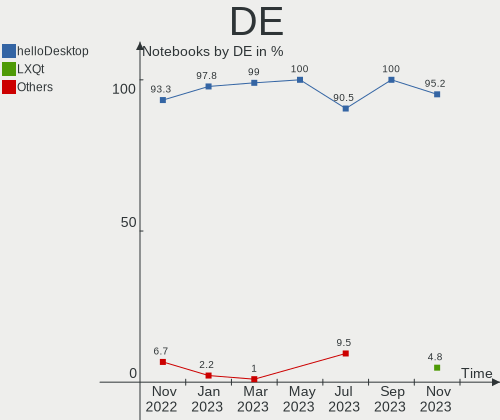
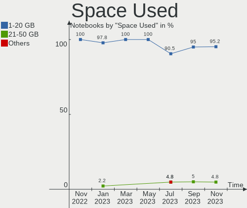
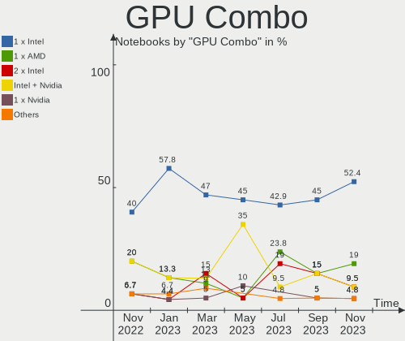
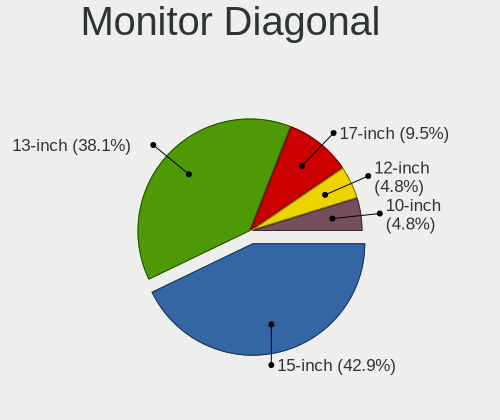
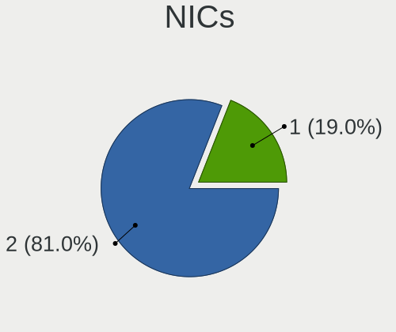
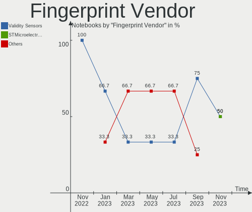

helloSystem - Hardware Trends (Notebooks)
-----------------------------------------

A project to identify most popular hardware characteristics and track their change
over time based on data collected by BSD users at https://BSD-Hardware.info.

Anyone can contribute to this report by the [hw-probe](https://github.com/linuxhw/hw-probe/blob/master/INSTALL.BSD.md) tool:

    hw-probe -all -upload

This report is for one last month. Overall report since the beginning of time: [TestCoverage](https://github.com/bsdhw/TestCoverage)

Period: May, 2022.

Contents
--------

* [ System ](#system)
  - [ OS                       ](#os)
  - [ OS Family                ](#os-family)
  - [ Arch                     ](#arch)
  - [ DE                       ](#de)
  - [ Display Server           ](#display-server)
  - [ Display Manager          ](#display-manager)
  - [ OS Lang                  ](#os-lang)
  - [ Boot Mode                ](#boot-mode)
  - [ Filesystem               ](#filesystem)
  - [ Part. scheme             ](#part-scheme)

* [ Board ](#board)
  - [ Vendor                   ](#vendor)
  - [ Model                    ](#model)
  - [ Model Family             ](#model-family)
  - [ MFG Year                 ](#mfg-year)
  - [ Form Factor              ](#form-factor)
  - [ Coreboot                 ](#coreboot)
  - [ RAM Size                 ](#ram-size)
  - [ RAM Used                 ](#ram-used)
  - [ Total Drives             ](#total-drives)
  - [ Has CD-ROM               ](#has-cd-rom)
  - [ Has Ethernet             ](#has-ethernet)
  - [ Has WiFi                 ](#has-wifi)
  - [ Has Bluetooth            ](#has-bluetooth)

* [ Location ](#location)
  - [ Country                  ](#country)
  - [ City                     ](#city)

* [ Drives ](#drives)
  - [ Drive Vendor             ](#drive-vendor)
  - [ Drive Model              ](#drive-model)
  - [ HDD Vendor               ](#hdd-vendor)
  - [ SSD Vendor               ](#ssd-vendor)
  - [ Drive Kind               ](#drive-kind)
  - [ Drive Connector          ](#drive-connector)
  - [ Drive Size               ](#drive-size)
  - [ Space Total              ](#space-total)
  - [ Space Used               ](#space-used)
  - [ Malfunc. Drives          ](#malfunc-drives)
  - [ Malfunc. Drive Vendor    ](#malfunc-drive-vendor)
  - [ Malfunc. HDD Vendor      ](#malfunc-hdd-vendor)
  - [ Malfunc. Drive Kind      ](#malfunc-drive-kind)
  - [ Failed Drives            ](#failed-drives)
  - [ Failed Drive Vendor      ](#failed-drive-vendor)
  - [ Drive Status             ](#drive-status)

* [ Storage controller ](#storage-controller)
  - [ Storage Vendor           ](#storage-vendor)
  - [ Storage Model            ](#storage-model)
  - [ Storage Kind             ](#storage-kind)

* [ Processor ](#processor)
  - [ CPU Vendor               ](#cpu-vendor)
  - [ CPU Model                ](#cpu-model)
  - [ CPU Model Family         ](#cpu-model-family)
  - [ CPU Cores                ](#cpu-cores)
  - [ CPU Sockets              ](#cpu-sockets)
  - [ CPU Threads              ](#cpu-threads)
  - [ CPU Microarch            ](#cpu-microarch)

* [ Graphics ](#graphics)
  - [ GPU Vendor               ](#gpu-vendor)
  - [ GPU Model                ](#gpu-model)
  - [ GPU Combo                ](#gpu-combo)
  - [ GPU Driver               ](#gpu-driver)
  - [ GPU Memory               ](#gpu-memory)

* [ Monitor ](#monitor)
  - [ Monitor Vendor           ](#monitor-vendor)
  - [ Monitor Model            ](#monitor-model)
  - [ Monitor Resolution       ](#monitor-resolution)
  - [ Monitor Diagonal         ](#monitor-diagonal)
  - [ Monitor Width            ](#monitor-width)
  - [ Aspect Ratio             ](#aspect-ratio)
  - [ Monitor Area             ](#monitor-area)
  - [ Pixel Density            ](#pixel-density)
  - [ Multiple Monitors        ](#multiple-monitors)

* [ Network ](#network)
  - [ Net Controller Vendor    ](#net-controller-vendor)
  - [ Net Controller Model     ](#net-controller-model)
  - [ Wireless Vendor          ](#wireless-vendor)
  - [ Wireless Model           ](#wireless-model)
  - [ Ethernet Vendor          ](#ethernet-vendor)
  - [ Ethernet Model           ](#ethernet-model)
  - [ Net Controller Kind      ](#net-controller-kind)
  - [ Used Controller          ](#used-controller)
  - [ NICs                     ](#nics)
  - [ IPv6                     ](#ipv6)

* [ Bluetooth ](#bluetooth)
  - [ Bluetooth Vendor         ](#bluetooth-vendor)
  - [ Bluetooth Model          ](#bluetooth-model)

* [ Sound ](#sound)
  - [ Sound Vendor             ](#sound-vendor)
  - [ Sound Model              ](#sound-model)

* [ Memory ](#memory)
  - [ Memory Vendor            ](#memory-vendor)
  - [ Memory Model             ](#memory-model)
  - [ Memory Kind              ](#memory-kind)
  - [ Memory Form Factor       ](#memory-form-factor)
  - [ Memory Size              ](#memory-size)
  - [ Memory Speed             ](#memory-speed)

* [ Printers & scanners ](#printers--scanners)
  - [ Printer Vendor           ](#printer-vendor)
  - [ Printer Model            ](#printer-model)
  - [ Scanner Vendor           ](#scanner-vendor)
  - [ Scanner Model            ](#scanner-model)

* [ Camera ](#camera)
  - [ Camera Vendor            ](#camera-vendor)
  - [ Camera Model             ](#camera-model)

* [ Security ](#security)
  - [ Fingerprint Vendor       ](#fingerprint-vendor)
  - [ Fingerprint Model        ](#fingerprint-model)
  - [ Chipcard Vendor          ](#chipcard-vendor)
  - [ Chipcard Model           ](#chipcard-model)

* [ Unsupported ](#unsupported)
  - [ Unsupported Devices      ](#unsupported-devices)
  - [ Unsupported Device Types ](#unsupported-device-types)

System
------

OS
--

Installed operating systems

| Name              | Notebooks | Percent |
|-------------------|-----------|---------|
| helloSystem 0.7.0 | 16        | 76.19%  |
| helloSystem 0.8.0 | 5         | 23.81%  |

OS Family
---------

OS without a version

| Name        | Notebooks | Percent |
|-------------|-----------|---------|
| helloSystem | 21        | 100%    |

Arch
----

OS architecture (x86_64, i586, etc.)

| Name  | Notebooks | Percent |
|-------|-----------|---------|
| amd64 | 21        | 100%    |

DE
--

Desktop Environment

| Name         | Notebooks | Percent |
|--------------|-----------|---------|
| helloDesktop | 20        | 95.24%  |
| Cinnamon     | 1         | 4.76%   |

Display Server
--------------

X11 or Wayland

| Name | Notebooks | Percent |
|------|-----------|---------|
| X11  | 21        | 100%    |

Display Manager
---------------

SDDM, LightDM, etc.

| Name | Notebooks | Percent |
|------|-----------|---------|
| SLiM | 20        | 95.24%  |
| GDM  | 1         | 4.76%   |

OS Lang
-------

Language

| Lang  | Notebooks | Percent |
|-------|-----------|---------|
| en_US | 21        | 100%    |

Boot Mode
---------

EFI or BIOS

| Mode | Notebooks | Percent |
|------|-----------|---------|
| EFI  | 20        | 95.24%  |
| BIOS | 1         | 4.76%   |

Filesystem
----------

Type of filesystem

| Type   | Notebooks | Percent |
|--------|-----------|---------|
| Cd9660 | 11        | 52.38%  |
| Zfs    | 10        | 47.62%  |

Part. scheme
------------

Scheme of partitioning

| Type | Notebooks | Percent |
|------|-----------|---------|
| GPT  | 21        | 100%    |

Board
-----

Vendor
------

Motherboard manufacturer

| Name             | Notebooks | Percent |
|------------------|-----------|---------|
| Lenovo           | 4         | 19.05%  |
| Hewlett-Packard  | 4         | 19.05%  |
| Dell             | 3         | 14.29%  |
| ASUSTek Computer | 2         | 9.52%   |
| Acer             | 2         | 9.52%   |
| Toshiba          | 1         | 4.76%   |
| Timi             | 1         | 4.76%   |
| Sony             | 1         | 4.76%   |
| Razer            | 1         | 4.76%   |
| Packard Bell     | 1         | 4.76%   |
| Unknown          | 1         | 4.76%   |

Model
-----

Motherboard model

| Name                                               | Notebooks | Percent |
|----------------------------------------------------|-----------|---------|
| Toshiba Satellite P300                             | 1         | 4.76%   |
| Timi TM1701                                        | 1         | 4.76%   |
| Sony VGN-NW25GF_S                                  | 1         | 4.76%   |
| Razer Blade 15 Base Model (Early 2020) - RZ09-0328 | 1         | 4.76%   |
| Packard Bell EasyNote_MX52-B-071                   | 1         | 4.76%   |
| Lenovo IdeaPad Y700-17ISK 80Q0                     | 1         | 4.76%   |
| Lenovo IdeaPad 310-15ISK 80SM                      | 1         | 4.76%   |
| Lenovo IdeaPad 3 15IGL05 82BU                      | 1         | 4.76%   |
| Lenovo B470 HuronRiver Platform                    | 1         | 4.76%   |
| HP ProBook 4340s                                   | 1         | 4.76%   |
| HP Pavilion m6                                     | 1         | 4.76%   |
| HP Pavilion g6                                     | 1         | 4.76%   |
| HP Pavilion dv6                                    | 1         | 4.76%   |
| Dell Studio 1747                                   | 1         | 4.76%   |
| Dell Inspiron 5559                                 | 1         | 4.76%   |
| Dell Inspiron 15-3552                              | 1         | 4.76%   |
| ASUS K52F                                          | 1         | 4.76%   |
| ASUS F50SL                                         | 1         | 4.76%   |
| Acer Aspire E1-522                                 | 1         | 4.76%   |
| Acer Aspire A315-41                                | 1         | 4.76%   |
| Unknown                                            | 1         | 4.76%   |

Model Family
------------

Motherboard model prefix

| Name                  | Notebooks | Percent |
|-----------------------|-----------|---------|
| Lenovo IdeaPad        | 3         | 14.29%  |
| HP Pavilion           | 3         | 14.29%  |
| Dell Inspiron         | 2         | 9.52%   |
| Acer Aspire           | 2         | 9.52%   |
| Toshiba Satellite     | 1         | 4.76%   |
| Timi TM1701           | 1         | 4.76%   |
| Sony VGN-NW25GF       | 1         | 4.76%   |
| Razer Blade           | 1         | 4.76%   |
| Packard Bell EasyNote | 1         | 4.76%   |
| Lenovo B470           | 1         | 4.76%   |
| HP ProBook            | 1         | 4.76%   |
| Dell Studio           | 1         | 4.76%   |
| ASUS K52F             | 1         | 4.76%   |
| ASUS F50SL            | 1         | 4.76%   |
| Unknown               | 1         | 4.76%   |

MFG Year
--------

Motherboard manufacture year

| Year | Notebooks | Percent |
|------|-----------|---------|
| 2009 | 4         | 19.05%  |
| 2017 | 3         | 14.29%  |
| 2011 | 3         | 14.29%  |
| 2020 | 2         | 9.52%   |
| 2016 | 2         | 9.52%   |
| 2012 | 2         | 9.52%   |
| 2022 | 1         | 4.76%   |
| 2021 | 1         | 4.76%   |
| 2018 | 1         | 4.76%   |
| 2013 | 1         | 4.76%   |
| 2007 | 1         | 4.76%   |

Form Factor
-----------

Physical design of the computer

| Name     | Notebooks | Percent |
|----------|-----------|---------|
| Notebook | 21        | 100%    |

Coreboot
--------

Have coreboot on board

| Used | Notebooks | Percent |
|------|-----------|---------|
| No   | 21        | 100%    |

RAM Size
--------

Total RAM memory

| Size in GB | Notebooks | Percent |
|------------|-----------|---------|
| 4.01-8.0   | 9         | 42.86%  |
| 8.01-16.0  | 7         | 33.33%  |
| 16.01-24.0 | 4         | 19.05%  |
| 3.01-4.0   | 1         | 4.76%   |

RAM Used
--------

Used RAM memory

| Used GB  | Notebooks | Percent |
|----------|-----------|---------|
| 0.01-0.5 | 14        | 66.67%  |
| 0.51-1.0 | 6         | 28.57%  |
| 1.01-2.0 | 1         | 4.76%   |

Total Drives
------------

Number of drives on board

| Drives | Notebooks | Percent |
|--------|-----------|---------|
| 1      | 15        | 71.43%  |
| 2      | 4         | 19.05%  |
| 0      | 2         | 9.52%   |

Has CD-ROM
----------

Has CD-ROM on board

| Presented | Notebooks | Percent |
|-----------|-----------|---------|
| Yes       | 14        | 66.67%  |
| No        | 7         | 33.33%  |

Has Ethernet
------------

Has Ethernet on board

| Presented | Notebooks | Percent |
|-----------|-----------|---------|
| Yes       | 17        | 80.95%  |
| No        | 4         | 19.05%  |

Has WiFi
--------

Has WiFi module

| Presented | Notebooks | Percent |
|-----------|-----------|---------|
| Yes       | 21        | 100%    |

Has Bluetooth
-------------

Has Bluetooth module

| Presented | Notebooks | Percent |
|-----------|-----------|---------|
| Yes       | 12        | 57.14%  |
| No        | 9         | 42.86%  |

Location
--------

Country
-------

Geographic location (country)

| Country     | Notebooks | Percent |
|-------------|-----------|---------|
| Italy       | 4         | 19.05%  |
| USA         | 2         | 9.52%   |
| UK          | 2         | 9.52%   |
| Russia      | 2         | 9.52%   |
| Canada      | 2         | 9.52%   |
| Spain       | 1         | 4.76%   |
| Portugal    | 1         | 4.76%   |
| Norway      | 1         | 4.76%   |
| New Zealand | 1         | 4.76%   |
| Mexico      | 1         | 4.76%   |
| Indonesia   | 1         | 4.76%   |
| Czechia     | 1         | 4.76%   |
| China       | 1         | 4.76%   |
| Brazil      | 1         | 4.76%   |

City
----

Geographic location (city)

| City                     | Notebooks | Percent |
|--------------------------|-----------|---------|
| Vandalia                 | 1         | 4.76%   |
| Vancouver                | 1         | 4.76%   |
| Tromsø                  | 1         | 4.76%   |
| Pudong                   | 1         | 4.76%   |
| Passignano sul Trasimeno | 1         | 4.76%   |
| Ottawa                   | 1         | 4.76%   |
| Novosibirsk              | 1         | 4.76%   |
| Nanticoke                | 1         | 4.76%   |
| Monterrey                | 1         | 4.76%   |
| Milan                    | 1         | 4.76%   |
| Lissone                  | 1         | 4.76%   |
| Lisbon                   | 1         | 4.76%   |
| Kurintji                 | 1         | 4.76%   |
| Izhevsk                  | 1         | 4.76%   |
| Ipojuca                  | 1         | 4.76%   |
| Fuenterrabia             | 1         | 4.76%   |
| Feltham                  | 1         | 4.76%   |
| Brno                     | 1         | 4.76%   |
| Auckland                 | 1         | 4.76%   |
| Ashington                | 1         | 4.76%   |
| Adelfia                  | 1         | 4.76%   |

Drives
------

Drive Vendor
------------

Hard drive vendors

| Vendor              | Notebooks | Drives | Percent |
|---------------------|-----------|--------|---------|
| WDC                 | 5         | 6      | 23.81%  |
| Seagate             | 4         | 5      | 19.05%  |
| Toshiba             | 2         | 2      | 9.52%   |
| Samsung Electronics | 2         | 2      | 9.52%   |
| SSSTC               | 1         | 1      | 4.76%   |
| SK Hynix            | 1         | 1      | 4.76%   |
| Netac               | 1         | 1      | 4.76%   |
| Micron Technology   | 1         | 1      | 4.76%   |
| Kingston            | 1         | 1      | 4.76%   |
| Intel               | 1         | 1      | 4.76%   |
| Hitachi             | 1         | 1      | 4.76%   |
| Crucial             | 1         | 1      | 4.76%   |

Drive Model
-----------

Hard drive models

| Model                             | Notebooks | Percent |
|-----------------------------------|-----------|---------|
| WDC WDS240G1G0A-00SS50 240GB      | 1         | 4.35%   |
| WDC WDS120G2G0A-00JH30 120GB      | 1         | 4.35%   |
| WDC WD3200BEKX-60B7WT0 320GB      | 1         | 4.35%   |
| WDC WD2500BEVS-22UST0 250GB       | 1         | 4.35%   |
| WDC WD1200BEVS-75UST0 120GB       | 1         | 4.35%   |
| WDC WD10JPVX-75JC3T0 1TB          | 1         | 4.35%   |
| Toshiba MQ01ABF050 500GB          | 1         | 4.35%   |
| Toshiba MK2561GSYN 250GB          | 1         | 4.35%   |
| SSSTC CL1-4D128 128GB             | 1         | 4.35%   |
| SK Hynix HFS256G39TND-N210A 256GB | 1         | 4.35%   |
| Seagate ST9500325AS 500GB         | 1         | 4.35%   |
| Seagate ST9320325AS 320GB         | 1         | 4.35%   |
| Seagate ST9320320AS 320GB         | 1         | 4.35%   |
| Seagate ST9160821AS 160GB         | 1         | 4.35%   |
| Seagate ST500LM030-1RK17D 500GB   | 1         | 4.35%   |
| Samsung SSD 850 EVO 500GB         | 1         | 4.35%   |
| Samsung MZVLB512HBJQ-00A00 512GB  | 1         | 4.35%   |
| Netac SSD 120GB                   | 1         | 4.35%   |
| Micron 1100 SATA 256GB            | 1         | 4.35%   |
| Kingston SV300S37A120G 120GB      | 1         | 4.35%   |
| Intel SSDSC2BW240A4 240GB         | 1         | 4.35%   |
| Hitachi HTS547564A9E384 640GB     | 1         | 4.35%   |
| Crucial CT480BX500SSD1 480GB      | 1         | 4.35%   |

HDD Vendor
----------

Hard disk drive vendors

| Vendor  | Notebooks | Drives | Percent |
|---------|-----------|--------|---------|
| Seagate | 4         | 5      | 40%     |
| WDC     | 3         | 4      | 30%     |
| Toshiba | 2         | 2      | 20%     |
| Hitachi | 1         | 1      | 10%     |

SSD Vendor
----------

Solid state drive vendors

| Vendor              | Notebooks | Drives | Percent |
|---------------------|-----------|--------|---------|
| WDC                 | 2         | 2      | 22.22%  |
| SK Hynix            | 1         | 1      | 11.11%  |
| Samsung Electronics | 1         | 1      | 11.11%  |
| Netac               | 1         | 1      | 11.11%  |
| Micron Technology   | 1         | 1      | 11.11%  |
| Kingston            | 1         | 1      | 11.11%  |
| Intel               | 1         | 1      | 11.11%  |
| Crucial             | 1         | 1      | 11.11%  |

Drive Kind
----------

HDD or SSD

| Kind | Notebooks | Drives | Percent |
|------|-----------|--------|---------|
| HDD  | 10        | 12     | 47.62%  |
| SSD  | 9         | 9      | 42.86%  |
| NVMe | 2         | 2      | 9.52%   |

Drive Connector
---------------

SATA, SAS, NVMe, etc.

| Type | Notebooks | Drives | Percent |
|------|-----------|--------|---------|
| SATA | 18        | 21     | 90%     |
| NVMe | 2         | 2      | 10%     |

Drive Size
----------

Size of hard drive

| Size in TB | Notebooks | Drives | Percent |
|------------|-----------|--------|---------|
| 0.01-0.5   | 16        | 19     | 88.89%  |
| 0.51-1.0   | 2         | 2      | 11.11%  |

Space Total
-----------

Amount of disk space available on the file system

| Size in GB | Notebooks | Percent |
|------------|-----------|---------|
| 1-20       | 11        | 52.38%  |
| 251-500    | 5         | 23.81%  |
| 101-250    | 3         | 14.29%  |
| 501-1000   | 2         | 9.52%   |

Space Used
----------

Amount of used disk space

| Used GB | Notebooks | Percent |
|---------|-----------|---------|
| 1-20    | 21        | 100%    |

Malfunc. Drives
---------------

Drive models with a malfunction

| Model                         | Notebooks | Drives | Percent |
|-------------------------------|-----------|--------|---------|
| Seagate ST9500325AS 500GB     | 1         | 1      | 25%     |
| Seagate ST9160821AS 160GB     | 1         | 1      | 25%     |
| Kingston SV300S37A120G 120GB  | 1         | 1      | 25%     |
| Hitachi HTS547564A9E384 640GB | 1         | 1      | 25%     |

Malfunc. Drive Vendor
---------------------

Vendors of faulty drives

| Vendor   | Notebooks | Drives | Percent |
|----------|-----------|--------|---------|
| Seagate  | 2         | 2      | 50%     |
| Kingston | 1         | 1      | 25%     |
| Hitachi  | 1         | 1      | 25%     |

Malfunc. HDD Vendor
-------------------

Vendors of faulty HDD drives

| Vendor  | Notebooks | Drives | Percent |
|---------|-----------|--------|---------|
| Seagate | 2         | 2      | 66.67%  |
| Hitachi | 1         | 1      | 33.33%  |

Malfunc. Drive Kind
-------------------

Kinds of faulty drives

| Kind | Notebooks | Drives | Percent |
|------|-----------|--------|---------|
| HDD  | 3         | 3      | 75%     |
| SSD  | 1         | 1      | 25%     |

Failed Drives
-------------

Failed drive models

Zero info for selected period =(

Failed Drive Vendor
-------------------

Failed drive vendors

Zero info for selected period =(

Drive Status
------------

Number of failed and malfunc. drives

| Status  | Notebooks | Drives | Percent |
|---------|-----------|--------|---------|
| Works   | 16        | 19     | 80%     |
| Malfunc | 4         | 4      | 20%     |

Storage controller
------------------

Storage Vendor
--------------

Storage controller vendors

| Vendor                           | Notebooks | Percent |
|----------------------------------|-----------|---------|
| Intel                            | 16        | 72.73%  |
| AMD                              | 3         | 13.64%  |
| Solid State Storage Technology   | 1         | 4.55%   |
| Silicon Integrated Systems [SiS] | 1         | 4.55%   |
| Samsung Electronics              | 1         | 4.55%   |

Storage Model
-------------

Storage controller models

| Model                                                                            | Notebooks | Percent |
|----------------------------------------------------------------------------------|-----------|---------|
| Intel 82801IBM/IEM (ICH9M/ICH9M-E) 4 port SATA Controller [AHCI mode]            | 3         | 12.5%   |
| Intel Sunrise Point-LP SATA Controller [AHCI mode]                               | 2         | 8.33%   |
| Intel 7 Series Chipset Family 6-port SATA Controller [AHCI mode]                 | 2         | 8.33%   |
| AMD FCH SATA Controller [AHCI mode]                                              | 2         | 8.33%   |
| Silicon Integrated Systems [SiS] SATA Controller / IDE mode                      | 1         | 4.17%   |
| Silicon Integrated Systems [SiS] 5513 IDE Controller                             | 1         | 4.17%   |
| Samsung NVMe SSD Controller SM981/PM981/PM983                                    | 1         | 4.17%   |
| Intel HM170/QM170 Chipset SATA Controller [AHCI Mode]                            | 1         | 4.17%   |
| Intel Celeron/Pentium Silver Processor SATA Controller                           | 1         | 4.17%   |
| Intel Celeron N3350/Pentium N4200/Atom E3900 Series SATA AHCI Controller         | 1         | 4.17%   |
| Intel Atom/Celeron/Pentium Processor x5-E8000/J3xxx/N3xxx Series SATA Controller | 1         | 4.17%   |
| Intel 82801 Mobile SATA Controller [RAID mode]                                   | 1         | 4.17%   |
| Intel 6 Series/C200 Series Chipset Family 6 port Mobile SATA AHCI Controller     | 1         | 4.17%   |
| Intel 5 Series/3400 Series Chipset 6 port SATA AHCI Controller                   | 1         | 4.17%   |
| Intel 5 Series/3400 Series Chipset 4 port SATA AHCI Controller                   | 1         | 4.17%   |
| Intel 400 Series Chipset Family SATA AHCI Controller                             | 1         | 4.17%   |
| AMD SB600 Non-Raid-5 SATA                                                        | 1         | 4.17%   |
| AMD SB600 IDE                                                                    | 1         | 4.17%   |
| Unknown                                                                          | 1         | 4.17%   |

Storage Kind
------------

Kind of storage controller (IDE, SATA, NVMe, SAS, ...)

| Kind | Notebooks | Percent |
|------|-----------|---------|
| SATA | 17        | 77.27%  |
| NVMe | 2         | 9.09%   |
| IDE  | 2         | 9.09%   |
| RAID | 1         | 4.55%   |

Processor
---------

CPU Vendor
----------

Processor vendors

| Vendor | Notebooks | Percent |
|--------|-----------|---------|
| Intel  | 18        | 85.71%  |
| AMD    | 3         | 14.29%  |

CPU Model
---------

Processor models

| Model                                         | Notebooks | Percent |
|-----------------------------------------------|-----------|---------|
| Intel CPU Version                             | 2         | 9.52%   |
| Intel Core 2 Duo CPU T6600 @ 2.20GHz          | 2         | 9.52%   |
| Intel Pentium Dual-Core CPU T4200 @ 2.00GHz   | 1         | 4.76%   |
| Intel Pentium CPU P6200 @ 2.13GH              | 1         | 4.76%   |
| Intel Pentium CPU B950 @ 2.10GHz              | 1         | 4.76%   |
| Intel Core i7-8550U CPU @ 1.80GHz             | 1         | 4.76%   |
| Intel Core i7-6700HQ CPU @ 2.60GHz            | 1         | 4.76%   |
| Intel Core i7-3612QM CPU @ 2.10GHz            | 1         | 4.76%   |
| Intel Core i7-10750H CPU @ 2.60GHz            | 1         | 4.76%   |
| Intel Core i5-6200U CPU @ 2.30GHz             | 1         | 4.76%   |
| Intel Core i5-3230M CPU @ 2.60GHz             | 1         | 4.76%   |
| Intel Core i5-3210M CPU @ 2.50GHz             | 1         | 4.76%   |
| Intel Core i3-6006U CPU @ 2.00GHz             | 1         | 4.76%   |
| Intel Celeron N4020 CPU @ 1.10GHz             | 1         | 4.76%   |
| Intel Celeron CPU N3350 @ 1.10GHz             | 1         | 4.76%   |
| Intel Celeron CPU N3060 @ 1.60GHz             | 1         | 4.76%   |
| AMD Ryzen 5 2500U with Radeon Vega Mobile Gfx | 1         | 4.76%   |
| AMD Athlon 64 X2 Dual-Core Processor TK-57    | 1         | 4.76%   |
| AMD A6-5200 APU with Radeon HD Graphics       | 1         | 4.76%   |

CPU Model Family
----------------

Processor model prefix

| Model                   | Notebooks | Percent |
|-------------------------|-----------|---------|
| Intel Core i7           | 4         | 19.05%  |
| Intel Core i5           | 3         | 14.29%  |
| Intel Celeron           | 3         | 14.29%  |
| Other                   | 2         | 9.52%   |
| Intel Pentium           | 2         | 9.52%   |
| Intel Core 2 Duo        | 2         | 9.52%   |
| Intel Pentium Dual-Core | 1         | 4.76%   |
| Intel Core i3           | 1         | 4.76%   |
| AMD Ryzen 5             | 1         | 4.76%   |
| AMD Athlon 64 X2        | 1         | 4.76%   |
| AMD A6                  | 1         | 4.76%   |

CPU Cores
---------

Number of processor cores

| Number  | Notebooks | Percent |
|---------|-----------|---------|
| 2       | 11        | 52.38%  |
| 4       | 5         | 23.81%  |
| Unknown | 3         | 14.29%  |
| 8       | 1         | 4.76%   |
| 6       | 1         | 4.76%   |

CPU Sockets
-----------

Number of sockets

| Number | Notebooks | Percent |
|--------|-----------|---------|
| 1      | 21        | 100%    |

CPU Threads
-----------

Threads per core (Hyper-Threading)

| Number  | Notebooks | Percent |
|---------|-----------|---------|
| 2       | 9         | 42.86%  |
| 1       | 9         | 42.86%  |
| Unknown | 3         | 14.29%  |

CPU Microarch
-------------

Microarchitecture

| Name          | Notebooks | Percent |
|---------------|-----------|---------|
| Penryn        | 4         | 19.05%  |
| Skylake       | 3         | 14.29%  |
| IvyBridge     | 3         | 14.29%  |
| Zen           | 1         | 4.76%   |
| Westmere      | 1         | 4.76%   |
| Silvermont    | 1         | 4.76%   |
| SandyBridge   | 1         | 4.76%   |
| Nehalem       | 1         | 4.76%   |
| KabyLake      | 1         | 4.76%   |
| K8 Hammer     | 1         | 4.76%   |
| Jaguar        | 1         | 4.76%   |
| Goldmont plus | 1         | 4.76%   |
| Goldmont      | 1         | 4.76%   |
| CometLake     | 1         | 4.76%   |

Graphics
--------

GPU Vendor
----------

Vendors of graphics cards

| Vendor | Notebooks | Percent |
|--------|-----------|---------|
| Intel  | 14        | 51.85%  |
| AMD    | 9         | 33.33%  |
| Nvidia | 4         | 14.81%  |

GPU Model
---------

Graphics card models

| Model                                                                                    | Notebooks | Percent |
|------------------------------------------------------------------------------------------|-----------|---------|
| Intel 3rd Gen Core processor Graphics Controller                                         | 3         | 11.11%  |
| AMD RV710/M92 [Mobility Radeon HD 4530/4570/545v]                                        | 3         | 11.11%  |
| Intel Skylake GT2 [HD Graphics 520]                                                      | 2         | 7.41%   |
| AMD Thames [Radeon HD 7500M/7600M Series]                                                | 2         | 7.41%   |
| Nvidia TU106M [GeForce RTX 2060 Mobile]                                                  | 1         | 3.7%    |
| Nvidia GP108M [GeForce MX150]                                                            | 1         | 3.7%    |
| Nvidia GM107M [GeForce GTX 960M]                                                         | 1         | 3.7%    |
| Nvidia GK208BM [GeForce 920M]                                                            | 1         | 3.7%    |
| Intel UHD Graphics 620                                                                   | 1         | 3.7%    |
| Intel Mobile 4 Series Chipset Integrated Graphics Controller                             | 1         | 3.7%    |
| Intel HD Graphics 530                                                                    | 1         | 3.7%    |
| Intel HD Graphics 500                                                                    | 1         | 3.7%    |
| Intel GeminiLake [UHD Graphics 600]                                                      | 1         | 3.7%    |
| Intel Core Processor Integrated Graphics Controller                                      | 1         | 3.7%    |
| Intel CometLake-H GT2 [UHD Graphics]                                                     | 1         | 3.7%    |
| Intel Atom/Celeron/Pentium Processor x5-E8000/J3xxx/N3xxx Integrated Graphics Controller | 1         | 3.7%    |
| Intel 2nd Generation Core Processor Family Integrated Graphics Controller                | 1         | 3.7%    |
| AMD RV730/M96 [Mobility Radeon HD 4650/5165]                                             | 1         | 3.7%    |
| AMD RS690M [Radeon Xpress 1200/1250/1270]                                                | 1         | 3.7%    |
| AMD Raven Ridge [Radeon Vega Series / Radeon Vega Mobile Series]                         | 1         | 3.7%    |
| AMD Kabini [Radeon HD 8400 / R3 Series]                                                  | 1         | 3.7%    |

GPU Combo
---------

Combinations of graphics cards

| Name           | Notebooks | Percent |
|----------------|-----------|---------|
| 1 x Intel      | 7         | 33.33%  |
| 1 x AMD        | 7         | 33.33%  |
| Intel + Nvidia | 4         | 19.05%  |
| Intel + AMD    | 2         | 9.52%   |
| 2 x Intel      | 1         | 4.76%   |

GPU Driver
----------

Free vs proprietary

| Driver | Notebooks | Percent |
|--------|-----------|---------|
| Free   | 21        | 100%    |

GPU Memory
----------

Total video memory

| Size in GB | Notebooks | Percent |
|------------|-----------|---------|
| Unknown    | 16        | 76.19%  |
| 0.01-0.5   | 4         | 19.05%  |
| 0.51-1.0   | 1         | 4.76%   |

Monitor
-------

Monitor Vendor
--------------

Monitor vendors

| Vendor              | Notebooks | Percent |
|---------------------|-----------|---------|
| LG Display          | 6         | 28.57%  |
| Samsung Electronics | 3         | 14.29%  |
| Chimei Innolux      | 3         | 14.29%  |
| BOE                 | 3         | 14.29%  |
| AU Optronics        | 3         | 14.29%  |
| SLD                 | 1         | 4.76%   |
| LG Philips          | 1         | 4.76%   |
| Lenovo              | 1         | 4.76%   |

Monitor Model
-------------

Monitor models

| Model                                                                  | Notebooks | Percent |
|------------------------------------------------------------------------|-----------|---------|
| SLD LCD Monitor SLD003C 1366x768 310x170mm 13.9-inch                   | 1         | 4.76%   |
| Samsung Electronics LCD Monitor SEC3847 1440x900 370x230mm 17.2-inch   | 1         | 4.76%   |
| Samsung Electronics LCD Monitor SEC304C 1366x768 350x200mm 15.9-inch   | 1         | 4.76%   |
| Samsung Electronics LCD Monitor SAM7016 3840x2160 1420x800mm 64.2-inch | 1         | 4.76%   |
| LG Philips LCD Monitor LPLE300 1280x800 330x210mm 15.4-inch            | 1         | 4.76%   |
| LG Display LCD Monitor LGD0484 1366x768 340x190mm 15.3-inch            | 1         | 4.76%   |
| LG Display LCD Monitor LGD0469 1920x1080 380x210mm 17.1-inch           | 1         | 4.76%   |
| LG Display LCD Monitor LGD034D 1366x768 340x190mm 15.3-inch            | 1         | 4.76%   |
| LG Display LCD Monitor LGD0250 1366x768 350x190mm 15.7-inch            | 1         | 4.76%   |
| LG Display LCD Monitor LGD0222 1366x768 340x190mm 15.3-inch            | 1         | 4.76%   |
| LG Display LCD Monitor LGD021D 1600x900 380x210mm 17.1-inch            | 1         | 4.76%   |
| Lenovo LCD Monitor LEN40A0 1366x768 310x170mm 13.9-inch                | 1         | 4.76%   |
| Chimei Innolux LCD Monitor CMN15E6 1366x768 340x190mm 15.3-inch        | 1         | 4.76%   |
| Chimei Innolux LCD Monitor CMN15D9 1920x1080 340x190mm 15.3-inch       | 1         | 4.76%   |
| Chimei Innolux LCD Monitor CMN15BF 1366x768 340x190mm 15.3-inch        | 1         | 4.76%   |
| BOE LCD Monitor BOE0804 1920x1080 340x190mm 15.3-inch                  | 1         | 4.76%   |
| BOE LCD Monitor BOE0747 1920x1080 340x190mm 15.3-inch                  | 1         | 4.76%   |
| BOE LCD Monitor BOE0671 1366x768 340x190mm 15.3-inch                   | 1         | 4.76%   |
| AU Optronics LCD Monitor AUO38ED 1920x1080 340x190mm 15.3-inch         | 1         | 4.76%   |
| AU Optronics LCD Monitor AUO32EC 1366x768 340x190mm 15.3-inch          | 1         | 4.76%   |
| AU Optronics LCD Monitor AUO312C 1366x768 290x160mm 13.0-inch          | 1         | 4.76%   |

Monitor Resolution
------------------

Monitor screen resolution

| Resolution       | Notebooks | Percent |
|------------------|-----------|---------|
| 1366x768 (WXGA)  | 12        | 57.14%  |
| 1920x1080 (FHD)  | 5         | 23.81%  |
| 3840x2160 (4K)   | 1         | 4.76%   |
| 1600x900 (HD+)   | 1         | 4.76%   |
| 1440x900 (WXGA+) | 1         | 4.76%   |
| 1280x800 (WXGA)  | 1         | 4.76%   |

Monitor Diagonal
----------------

Diagonal size in inches

| Inches | Notebooks | Percent |
|--------|-----------|---------|
| 15     | 14        | 66.67%  |
| 17     | 3         | 14.29%  |
| 13     | 3         | 14.29%  |
| 64     | 1         | 4.76%   |

Monitor Width
-------------

Physical width

| Width in mm | Notebooks | Percent |
|-------------|-----------|---------|
| 301-350     | 16        | 76.19%  |
| 351-400     | 3         | 14.29%  |
| 201-300     | 1         | 4.76%   |
| 1001-1500   | 1         | 4.76%   |

Aspect Ratio
------------

Proportional relationship between the width and the height

| Ratio | Notebooks | Percent |
|-------|-----------|---------|
| 16/9  | 18        | 90%     |
| 16/10 | 2         | 10%     |

Monitor Area
------------

Area in inch²

| Area in inch² | Notebooks | Percent |
|----------------|-----------|---------|
| 91-100         | 11        | 52.38%  |
| 101-110        | 3         | 14.29%  |
| 81-90          | 2         | 9.52%   |
| 121-130        | 2         | 9.52%   |
| More than 1000 | 1         | 4.76%   |
| 71-80          | 1         | 4.76%   |
| 131-140        | 1         | 4.76%   |

Pixel Density
-------------

Pixels per inch

| Density | Notebooks | Percent |
|---------|-----------|---------|
| 101-120 | 10        | 47.62%  |
| 121-160 | 6         | 28.57%  |
| 51-100  | 5         | 23.81%  |

Multiple Monitors
-----------------

Total monitors connected

| Total | Notebooks | Percent |
|-------|-----------|---------|
| 1     | 20        | 95.24%  |
| 2     | 1         | 4.76%   |

Network
-------

Net Controller Vendor
---------------------

Controller vendors

| Vendor                           | Notebooks | Percent |
|----------------------------------|-----------|---------|
| Realtek Semiconductor            | 14        | 36.84%  |
| Qualcomm Atheros                 | 10        | 26.32%  |
| Intel                            | 7         | 18.42%  |
| Ralink                           | 2         | 5.26%   |
| Marvell Technology Group         | 2         | 5.26%   |
| Silicon Integrated Systems [SiS] | 1         | 2.63%   |
| JMicron Technology               | 1         | 2.63%   |
| Broadcom                         | 1         | 2.63%   |

Net Controller Model
--------------------

Controller models

| Model                                                                   | Notebooks | Percent |
|-------------------------------------------------------------------------|-----------|---------|
| Realtek RTL8111/8168/8411 PCI Express Gigabit Ethernet Controller       | 8         | 20%     |
| Realtek RTL810xE PCI Express Fast Ethernet controller                   | 3         | 7.5%    |
| Qualcomm Atheros QCA9377 802.11ac Wireless Network Adapter              | 3         | 7.5%    |
| Ralink RT3290 Wireless 802.11n 1T/1R PCIe                               | 2         | 5%      |
| Qualcomm Atheros QCA9565 / AR9565 Wireless Network Adapter              | 2         | 5%      |
| Qualcomm Atheros AR242x / AR542x Wireless Network Adapter (PCI-Express) | 2         | 5%      |
| Silicon Integrated Systems [SiS] 191 Gigabit Ethernet Adapter           | 1         | 2.5%    |
| Realtek RTL8723BU 802.11b/g/n WLAN Adapter                              | 1         | 2.5%    |
| Realtek RTL8188EUS 802.11n Wireless Network Adapter                     | 1         | 2.5%    |
| Realtek RTL8188CUS 802.11n WLAN Adapter                                 | 1         | 2.5%    |
| Realtek RTL-8100/8101L/8139 PCI Fast Ethernet Adapter                   | 1         | 2.5%    |
| Qualcomm Atheros QCA8171 Gigabit Ethernet                               | 1         | 2.5%    |
| Qualcomm Atheros AR928X Wireless Network Adapter (PCI-Express)          | 1         | 2.5%    |
| Qualcomm Atheros AR9285 Wireless Network Adapter (PCI-Express)          | 1         | 2.5%    |
| Qualcomm Atheros AR5212 802.11abg NIC                                   | 1         | 2.5%    |
| Marvell Group 88E8057 PCI-E Gigabit Ethernet Controller                 | 1         | 2.5%    |
| Marvell Group 88E8040T PCI-E Fast Ethernet Controller                   | 1         | 2.5%    |
| JMicron JMC250 PCI Express Gigabit Ethernet Controller                  | 1         | 2.5%    |
| Intel Wireless 8265 / 8275                                              | 1         | 2.5%    |
| Intel Wireless 3160                                                     | 1         | 2.5%    |
| Intel WiFi Link 5100                                                    | 1         | 2.5%    |
| Intel Gemini Lake PCH CNVi WiFi                                         | 1         | 2.5%    |
| Intel Comet Lake PCH CNVi WiFi                                          | 1         | 2.5%    |
| Intel Centrino Wireless-N 1000 [Condor Peak]                            | 1         | 2.5%    |
| Intel Centrino Advanced-N 6205 [Taylor Peak]                            | 1         | 2.5%    |
| Broadcom BCM4313 802.11bgn Wireless Network Adapter                     | 1         | 2.5%    |

Wireless Vendor
---------------

Wireless vendors

| Vendor                | Notebooks | Percent |
|-----------------------|-----------|---------|
| Qualcomm Atheros      | 10        | 45.45%  |
| Intel                 | 7         | 31.82%  |
| Realtek Semiconductor | 2         | 9.09%   |
| Ralink                | 2         | 9.09%   |
| Broadcom              | 1         | 4.55%   |

Wireless Model
--------------

Wireless models

| Model                                                                   | Notebooks | Percent |
|-------------------------------------------------------------------------|-----------|---------|
| Qualcomm Atheros QCA9377 802.11ac Wireless Network Adapter              | 3         | 13.04%  |
| Ralink RT3290 Wireless 802.11n 1T/1R PCIe                               | 2         | 8.7%    |
| Qualcomm Atheros QCA9565 / AR9565 Wireless Network Adapter              | 2         | 8.7%    |
| Qualcomm Atheros AR242x / AR542x Wireless Network Adapter (PCI-Express) | 2         | 8.7%    |
| Realtek RTL8723BU 802.11b/g/n WLAN Adapter                              | 1         | 4.35%   |
| Realtek RTL8188EUS 802.11n Wireless Network Adapter                     | 1         | 4.35%   |
| Realtek RTL8188CUS 802.11n WLAN Adapter                                 | 1         | 4.35%   |
| Qualcomm Atheros AR928X Wireless Network Adapter (PCI-Express)          | 1         | 4.35%   |
| Qualcomm Atheros AR9285 Wireless Network Adapter (PCI-Express)          | 1         | 4.35%   |
| Qualcomm Atheros AR5212 802.11abg NIC                                   | 1         | 4.35%   |
| Intel Wireless 8265 / 8275                                              | 1         | 4.35%   |
| Intel Wireless 3160                                                     | 1         | 4.35%   |
| Intel WiFi Link 5100                                                    | 1         | 4.35%   |
| Intel Gemini Lake PCH CNVi WiFi                                         | 1         | 4.35%   |
| Intel Comet Lake PCH CNVi WiFi                                          | 1         | 4.35%   |
| Intel Centrino Wireless-N 1000 [Condor Peak]                            | 1         | 4.35%   |
| Intel Centrino Advanced-N 6205 [Taylor Peak]                            | 1         | 4.35%   |
| Broadcom BCM4313 802.11bgn Wireless Network Adapter                     | 1         | 4.35%   |

Ethernet Vendor
---------------

Ethernet vendors

| Vendor                           | Notebooks | Percent |
|----------------------------------|-----------|---------|
| Realtek Semiconductor            | 12        | 70.59%  |
| Marvell Technology Group         | 2         | 11.76%  |
| Silicon Integrated Systems [SiS] | 1         | 5.88%   |
| Qualcomm Atheros                 | 1         | 5.88%   |
| JMicron Technology               | 1         | 5.88%   |

Ethernet Model
--------------

Ethernet models

| Model                                                             | Notebooks | Percent |
|-------------------------------------------------------------------|-----------|---------|
| Realtek RTL8111/8168/8411 PCI Express Gigabit Ethernet Controller | 8         | 47.06%  |
| Realtek RTL810xE PCI Express Fast Ethernet controller             | 3         | 17.65%  |
| Silicon Integrated Systems [SiS] 191 Gigabit Ethernet Adapter     | 1         | 5.88%   |
| Realtek RTL-8100/8101L/8139 PCI Fast Ethernet Adapter             | 1         | 5.88%   |
| Qualcomm Atheros QCA8171 Gigabit Ethernet                         | 1         | 5.88%   |
| Marvell Group 88E8057 PCI-E Gigabit Ethernet Controller           | 1         | 5.88%   |
| Marvell Group 88E8040T PCI-E Fast Ethernet Controller             | 1         | 5.88%   |
| JMicron JMC250 PCI Express Gigabit Ethernet Controller            | 1         | 5.88%   |

Net Controller Kind
-------------------

Ethernet, WiFi or modem

| Kind     | Notebooks | Percent |
|----------|-----------|---------|
| WiFi     | 21        | 55.26%  |
| Ethernet | 17        | 44.74%  |

Used Controller
---------------

Currently used network controller

| Kind     | Notebooks | Percent |
|----------|-----------|---------|
| WiFi     | 9         | 52.94%  |
| Ethernet | 8         | 47.06%  |

NICs
----

Total network controllers on board

| Total | Notebooks | Percent |
|-------|-----------|---------|
| 2     | 17        | 80.95%  |
| 1     | 3         | 14.29%  |
| 0     | 1         | 4.76%   |

IPv6
----

IPv6 vs IPv4

| Used | Notebooks | Percent |
|------|-----------|---------|
| No   | 18        | 85.71%  |
| Yes  | 3         | 14.29%  |

Bluetooth
---------

Bluetooth Vendor
----------------

Controller vendors

| Vendor                          | Notebooks | Percent |
|---------------------------------|-----------|---------|
| Intel                           | 4         | 33.33%  |
| Qualcomm Atheros Communications | 3         | 25%     |
| Ralink                          | 2         | 16.67%  |
| Lite-On Technology              | 2         | 16.67%  |
| Foxconn / Hon Hai               | 1         | 8.33%   |

Bluetooth Model
---------------

Controller models

| Model                                                       | Notebooks | Percent |
|-------------------------------------------------------------|-----------|---------|
| Ralink RT3290 Bluetooth                                     | 2         | 16.67%  |
| Qualcomm Atheros  QCA9377 Bluetooth 4.1                     | 2         | 16.67%  |
| Intel Bluetooth wireless interface                          | 2         | 16.67%  |
| Qualcomm Atheros Dell Wireless 1707 Bluetooth 4.0 LE Device | 1         | 8.33%   |
| Lite-On Qualcomm Atheros QCA9377 Bluetooth                  | 1         | 8.33%   |
| Lite-On Atheros AR3012 Bluetooth                            | 1         | 8.33%   |
| Intel Bluetooth 9460/9560 Jefferson Peak (JfP)              | 1         | 8.33%   |
| Intel AX201 Bluetooth                                       | 1         | 8.33%   |
| Foxconn / Hon Hai Broadcom Bluetooth 2.1 Device             | 1         | 8.33%   |

Sound
-----

Sound Vendor
------------

Sound card vendors

| Vendor                           | Notebooks | Percent |
|----------------------------------|-----------|---------|
| Intel                            | 17        | 60.71%  |
| AMD                              | 7         | 25%     |
| XMOS                             | 1         | 3.57%   |
| Silicon Integrated Systems [SiS] | 1         | 3.57%   |
| Nvidia                           | 1         | 3.57%   |
| GN Netcom                        | 1         | 3.57%   |

Sound Model
-----------

Sound card models

| Model                                                                                             | Notebooks | Percent |
|---------------------------------------------------------------------------------------------------|-----------|---------|
| AMD RV710/730 HDMI Audio [Radeon HD 4000 series]                                                  | 4         | 13.33%  |
| Intel Sunrise Point-LP HD Audio                                                                   | 3         | 10%     |
| Intel 82801I (ICH9 Family) HD Audio Controller                                                    | 3         | 10%     |
| Intel 7 Series/C216 Chipset Family High Definition Audio Controller                               | 3         | 10%     |
| Intel 5 Series/3400 Series Chipset High Definition Audio                                          | 2         | 6.67%   |
| XMOS iFi (by AMR) HD USB Audio                                                                    | 1         | 3.33%   |
| Silicon Integrated Systems [SiS] Azalia Audio Controller                                          | 1         | 3.33%   |
| Nvidia TU106 High Definition Audio Controller                                                     | 1         | 3.33%   |
| Intel Comet Lake PCH cAVS                                                                         | 1         | 3.33%   |
| Intel Celeron/Pentium Silver Processor High Definition Audio                                      | 1         | 3.33%   |
| Intel Celeron N3350/Pentium N4200/Atom E3900 Series Audio Cluster                                 | 1         | 3.33%   |
| Intel Atom/Celeron/Pentium Processor x5-E8000/J3xxx/N3xxx Series High Definition Audio Controller | 1         | 3.33%   |
| Intel 6 Series/C200 Series Chipset Family High Definition Audio Controller                        | 1         | 3.33%   |
| Intel 100 Series/C230 Series Chipset Family HD Audio Controller                                   | 1         | 3.33%   |
| GN Netcom Jabra Evolve 65                                                                         | 1         | 3.33%   |
| AMD SBx00 Azalia (Intel HDA)                                                                      | 1         | 3.33%   |
| AMD Raven/Raven2/Fenghuang HDMI/DP Audio Controller                                               | 1         | 3.33%   |
| AMD Kabini HDMI/DP Audio                                                                          | 1         | 3.33%   |
| AMD FCH Azalia Controller                                                                         | 1         | 3.33%   |
| AMD Family 17h/19h HD Audio Controller                                                            | 1         | 3.33%   |

Memory
------

Memory Vendor
-------------

Memory module vendors

| Vendor              | Notebooks | Percent |
|---------------------|-----------|---------|
| Kingston            | 7         | 29.17%  |
| Samsung Electronics | 5         | 20.83%  |
| Unknown             | 3         | 12.5%   |
| Crucial             | 2         | 8.33%   |
| Unknown (ABCD)      | 1         | 4.17%   |
| Unknown             | 1         | 4.17%   |
| Smart Brazil        | 1         | 4.17%   |
| SK Hynix            | 1         | 4.17%   |
| Nanya Technology    | 1         | 4.17%   |
| Micron Technology   | 1         | 4.17%   |
| ASint Technology    | 1         | 4.17%   |

Memory Model
------------

Memory module models

| Model                                                            | Notebooks | Percent |
|------------------------------------------------------------------|-----------|---------|
| Unknown                                                          | 3         | 12%     |
| Kingston RAM KNWMX1-ETB 4GB SODIMM DDR3 1600MT/s                 | 2         | 8%      |
| Crucial RAM CT102464BF160B.M16 8GB SODIMM DDR3 1600MT/s          | 2         | 8%      |
| Unknown RAM Module 2GB SODIMM DDR2                               | 1         | 4%      |
| Unknown (ABCD) RAM 123456789012345678 4GB SODIMM LPDDR4 2133MT/s | 1         | 4%      |
| Smart Brazil RAM Module 4GB Row Of Chips DDR4 2400MT/s           | 1         | 4%      |
| SK Hynix RAM HMT351S6CFR8C-H9 4GB SODIMM 1333MT/s                | 1         | 4%      |
| Samsung RAM M471B5773DH0-CH9 2GB SODIMM DDR3 1334MT/s            | 1         | 4%      |
| Samsung RAM M471B5273DH0-YK0 4GB SODIMM DDR3 1600MT/s            | 1         | 4%      |
| Samsung RAM M471A1K43DB1-CWE 8GB SODIMM DDR4 3200MT/s            | 1         | 4%      |
| Samsung RAM M471A1K43BB1-CRC 8GB SODIMM DDR4 2400MT/s            | 1         | 4%      |
| Samsung RAM M471A1G43DB0-CPB 8GB SODIMM DDR4 2133MT/s            | 1         | 4%      |
| Nanya RAM NT4GC64B8HG0NS-CG 4GB SODIMM 1334MT/s                  | 1         | 4%      |
| Micron RAM 4ATF51264HZ-2G3AZ 4GB SODIMM DDR4 2133MT/s            | 1         | 4%      |
| Kingston RAM KX830D-ELC 4GB SODIMM DDR3 1333MT/s                 | 1         | 4%      |
| Kingston RAM ACR26D4S9S8ME-8 8GB SODIMM DDR4 2667MT/s            | 1         | 4%      |
| Kingston RAM ACR16D3LS1NBG/4G 4GB SODIMM DDR3 800MT/s            | 1         | 4%      |
| Kingston RAM 99U5469-015.A00LF 2GB SODIMM DDR3 1333MT/s          | 1         | 4%      |
| Kingston RAM 9905428-012.A00LF 4GB SODIMM DDR3 1333MT/s          | 1         | 4%      |
| ASint RAM SSZ3128M8-EDJEF 2GB SODIMM DDR3 1067MT/s               | 1         | 4%      |
| ASint RAM SSY3128M8-EDJEF 1GB SODIMM DDR3 1067MT/s               | 1         | 4%      |

Memory Kind
-----------

Memory module kinds

| Kind    | Notebooks | Percent |
|---------|-----------|---------|
| DDR3    | 10        | 47.62%  |
| DDR4    | 6         | 28.57%  |
| DDR2    | 2         | 9.52%   |
| SDRAM   | 1         | 4.76%   |
| LPDDR4  | 1         | 4.76%   |
| Unknown | 1         | 4.76%   |

Memory Form Factor
------------------

Physical design of the memory module

| Name         | Notebooks | Percent |
|--------------|-----------|---------|
| SODIMM       | 20        | 95.24%  |
| Row Of Chips | 1         | 4.76%   |

Memory Size
-----------

Memory module size

| Size  | Notebooks | Percent |
|-------|-----------|---------|
| 4096  | 9         | 40.91%  |
| 2048  | 6         | 27.27%  |
| 8192  | 5         | 22.73%  |
| 16384 | 1         | 4.55%   |
| 1024  | 1         | 4.55%   |

Memory Speed
------------

Memory module speed

| Speed   | Notebooks | Percent |
|---------|-----------|---------|
| 1600    | 5         | 20.83%  |
| 1333    | 4         | 16.67%  |
| 2133    | 3         | 12.5%   |
| 2400    | 2         | 8.33%   |
| 1334    | 2         | 8.33%   |
| 800     | 2         | 8.33%   |
| Unknown | 2         | 8.33%   |
| 3200    | 1         | 4.17%   |
| 2667    | 1         | 4.17%   |
| 1067    | 1         | 4.17%   |
| 333     | 1         | 4.17%   |

Printers & scanners
-------------------

Printer Vendor
--------------

Printer device vendors

Zero info for selected period =(

Printer Model
-------------

Printer device models

Zero info for selected period =(

Scanner Vendor
--------------

Scanner device vendors

Zero info for selected period =(

Scanner Model
-------------

Scanner device models

Zero info for selected period =(

Camera
------

Camera Vendor
-------------

Camera device vendors

| Vendor                      | Notebooks | Percent |
|-----------------------------|-----------|---------|
| Chicony Electronics         | 6         | 33.33%  |
| Syntek                      | 2         | 11.11%  |
| Quanta                      | 2         | 11.11%  |
| Microdia                    | 2         | 11.11%  |
| IMC Networks                | 2         | 11.11%  |
| Realtek Semiconductor       | 1         | 5.56%   |
| Luxvisions Innotech Limited | 1         | 5.56%   |
| Alcor Micro                 | 1         | 5.56%   |
| Acer                        | 1         | 5.56%   |

Camera Model
------------

Camera device models

| Model                                         | Notebooks | Percent |
|-----------------------------------------------|-----------|---------|
| Syntek Syntek 0.3MPixel USB 2.0 UVC PC Camera | 1         | 5.56%   |
| Syntek EasyCamera                             | 1         | 5.56%   |
| Realtek Integrated_Webcam_HD                  | 1         | 5.56%   |
| Quanta VGA WebCam                             | 1         | 5.56%   |
| Quanta HP Webcam                              | 1         | 5.56%   |
| Microdia Laptop_Integrated_Webcam_2M          | 1         | 5.56%   |
| Microdia Integrated Webcam HD                 | 1         | 5.56%   |
| Luxvisions Innotech Limited Integrated Camera | 1         | 5.56%   |
| IMC Networks USB Camera                       | 1         | 5.56%   |
| IMC Networks Integrated Webcam                | 1         | 5.56%   |
| Chicony XiaoMi USB 2.0 Webcam                 | 1         | 5.56%   |
| Chicony USB 2.0 Camera                        | 1         | 5.56%   |
| Chicony Lenovo EasyCamera                     | 1         | 5.56%   |
| Chicony HP HD Webcam [Fixed]                  | 1         | 5.56%   |
| Chicony HD WebCam (Acer)                      | 1         | 5.56%   |
| Chicony 2.0M UVC Webcam / CNF7129             | 1         | 5.56%   |
| Alcor Micro USB 2.0 Web Camera                | 1         | 5.56%   |
| Acer Lenovo EasyCamera                        | 1         | 5.56%   |

Security
--------

Fingerprint Vendor
------------------

Fingerprint sensor vendors

| Vendor           | Notebooks | Percent |
|------------------|-----------|---------|
| Validity Sensors | 2         | 100%    |

Fingerprint Model
-----------------

Fingerprint sensor models

| Model                                | Notebooks | Percent |
|--------------------------------------|-----------|---------|
| Validity Sensors VFS491              | 1         | 50%     |
| Validity Sensors Fingerprint scanner | 1         | 50%     |

Chipcard Vendor
---------------

Chipcard module vendors

Zero info for selected period =(

Chipcard Model
--------------

Chipcard module models

Zero info for selected period =(

Unsupported
-----------

Unsupported Devices
-------------------

Total unsupported devices on board

| Total | Notebooks | Percent |
|-------|-----------|---------|
| 2     | 6         | 28.57%  |
| 0     | 5         | 23.81%  |
| 3     | 4         | 19.05%  |
| 1     | 4         | 19.05%  |
| 4     | 2         | 9.52%   |

Unsupported Device Types
------------------------

Types of unsupported devices

| Type                     | Notebooks | Percent |
|--------------------------|-----------|---------|
| Communication controller | 12        | 34.29%  |
| Net/wireless             | 7         | 20%     |
| Card reader              | 6         | 17.14%  |
| Bluetooth                | 6         | 17.14%  |
| Storage                  | 2         | 5.71%   |
| Fingerprint reader       | 2         | 5.71%   |

