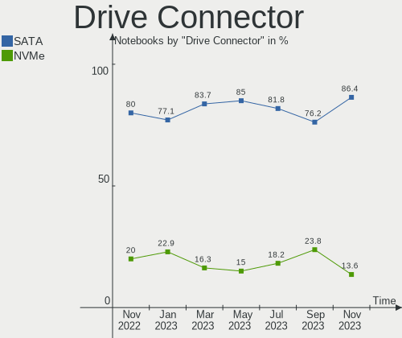
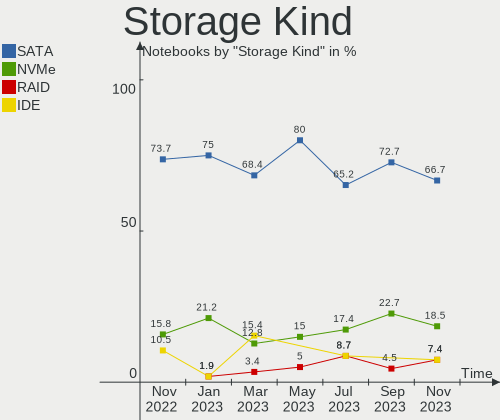
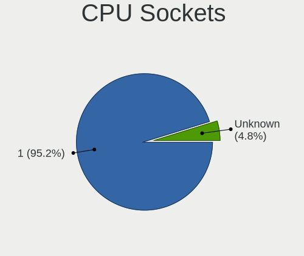
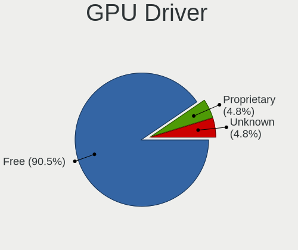
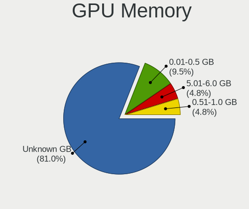
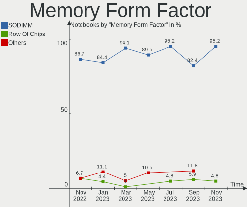

helloSystem Hardware Trends (Notebooks)
---------------------------------------

A project to identify most popular hardware characteristics and track their change
over time based on data collected by helloSystem users at https://BSD-Hardware.info.

Anyone can contribute to this report by the [hw-probe](https://github.com/linuxhw/hw-probe/blob/master/INSTALL.BSD.md) tool:

    hw-probe -all -upload

Full-feature report is available here: https://bsd-hardware.info/?view=trends

Period: Nov, 2021.

Contents
--------

* [ System ](#system)
  - [ OS                       ](#os)
  - [ OS Family                ](#os-family)
  - [ Arch                     ](#arch)
  - [ DE                       ](#de)
  - [ Display Server           ](#display-server)
  - [ Display Manager          ](#display-manager)
  - [ OS Lang                  ](#os-lang)
  - [ Boot Mode                ](#boot-mode)
  - [ Filesystem               ](#filesystem)
  - [ Part. scheme             ](#part-scheme)

* [ Board ](#board)
  - [ Vendor                   ](#vendor)
  - [ Model                    ](#model)
  - [ Model Family             ](#model-family)
  - [ MFG Year                 ](#mfg-year)
  - [ Form Factor              ](#form-factor)
  - [ Coreboot                 ](#coreboot)
  - [ RAM Size                 ](#ram-size)
  - [ RAM Used                 ](#ram-used)
  - [ Total Drives             ](#total-drives)
  - [ Has CD-ROM               ](#has-cd-rom)
  - [ Has Ethernet             ](#has-ethernet)
  - [ Has WiFi                 ](#has-wifi)
  - [ Has Bluetooth            ](#has-bluetooth)

* [ Location ](#location)
  - [ Country                  ](#country)
  - [ City                     ](#city)

* [ Drives ](#drives)
  - [ Drive Vendor             ](#drive-vendor)
  - [ Drive Model              ](#drive-model)
  - [ HDD Vendor               ](#hdd-vendor)
  - [ SSD Vendor               ](#ssd-vendor)
  - [ Drive Kind               ](#drive-kind)
  - [ Drive Connector          ](#drive-connector)
  - [ Drive Size               ](#drive-size)
  - [ Space Total              ](#space-total)
  - [ Space Used               ](#space-used)
  - [ Malfunc. Drives          ](#malfunc-drives)
  - [ Malfunc. Drive Vendor    ](#malfunc-drive-vendor)
  - [ Malfunc. HDD Vendor      ](#malfunc-hdd-vendor)
  - [ Malfunc. Drive Kind      ](#malfunc-drive-kind)
  - [ Failed Drives            ](#failed-drives)
  - [ Failed Drive Vendor      ](#failed-drive-vendor)
  - [ Drive Status             ](#drive-status)

* [ Storage controller ](#storage-controller)
  - [ Storage Vendor           ](#storage-vendor)
  - [ Storage Model            ](#storage-model)
  - [ Storage Kind             ](#storage-kind)

* [ Processor ](#processor)
  - [ CPU Vendor               ](#cpu-vendor)
  - [ CPU Model                ](#cpu-model)
  - [ CPU Model Family         ](#cpu-model-family)
  - [ CPU Cores                ](#cpu-cores)
  - [ CPU Sockets              ](#cpu-sockets)
  - [ CPU Threads              ](#cpu-threads)
  - [ CPU Microarch            ](#cpu-microarch)

* [ Graphics ](#graphics)
  - [ GPU Vendor               ](#gpu-vendor)
  - [ GPU Model                ](#gpu-model)
  - [ GPU Combo                ](#gpu-combo)
  - [ GPU Driver               ](#gpu-driver)
  - [ GPU Memory               ](#gpu-memory)

* [ Monitor ](#monitor)
  - [ Monitor Vendor           ](#monitor-vendor)
  - [ Monitor Model            ](#monitor-model)
  - [ Monitor Resolution       ](#monitor-resolution)
  - [ Monitor Diagonal         ](#monitor-diagonal)
  - [ Monitor Width            ](#monitor-width)
  - [ Aspect Ratio             ](#aspect-ratio)
  - [ Monitor Area             ](#monitor-area)
  - [ Pixel Density            ](#pixel-density)
  - [ Multiple Monitors        ](#multiple-monitors)

* [ Network ](#network)
  - [ Net Controller Vendor    ](#net-controller-vendor)
  - [ Net Controller Model     ](#net-controller-model)
  - [ Wireless Vendor          ](#wireless-vendor)
  - [ Wireless Model           ](#wireless-model)
  - [ Ethernet Vendor          ](#ethernet-vendor)
  - [ Ethernet Model           ](#ethernet-model)
  - [ Net Controller Kind      ](#net-controller-kind)
  - [ Used Controller          ](#used-controller)
  - [ NICs                     ](#nics)
  - [ IPv6                     ](#ipv6)

* [ Bluetooth ](#bluetooth)
  - [ Bluetooth Vendor         ](#bluetooth-vendor)
  - [ Bluetooth Model          ](#bluetooth-model)

* [ Sound ](#sound)
  - [ Sound Vendor             ](#sound-vendor)
  - [ Sound Model              ](#sound-model)

* [ Memory ](#memory)
  - [ Memory Vendor            ](#memory-vendor)
  - [ Memory Model             ](#memory-model)
  - [ Memory Kind              ](#memory-kind)
  - [ Memory Form Factor       ](#memory-form-factor)
  - [ Memory Size              ](#memory-size)
  - [ Memory Speed             ](#memory-speed)

* [ Printers & scanners ](#printers--scanners)
  - [ Printer Vendor           ](#printer-vendor)
  - [ Printer Model            ](#printer-model)
  - [ Scanner Vendor           ](#scanner-vendor)
  - [ Scanner Model            ](#scanner-model)

* [ Camera ](#camera)
  - [ Camera Vendor            ](#camera-vendor)
  - [ Camera Model             ](#camera-model)

* [ Security ](#security)
  - [ Fingerprint Vendor       ](#fingerprint-vendor)
  - [ Fingerprint Model        ](#fingerprint-model)
  - [ Chipcard Vendor          ](#chipcard-vendor)
  - [ Chipcard Model           ](#chipcard-model)

* [ Unsupported ](#unsupported)
  - [ Unsupported Devices      ](#unsupported-devices)
  - [ Unsupported Device Types ](#unsupported-device-types)

System
------

OS
--

Installed operating systems

| Name              | Notebooks | Percent |
|-------------------|-----------|---------|
| helloSystem 0.6.0 | 15        | 65.22%  |
| helloSystem 0.7.0 | 7         | 30.43%  |
| helloSystem 0.5.0 | 1         | 4.35%   |

OS Family
---------

OS without a version

| Name        | Notebooks | Percent |
|-------------|-----------|---------|
| helloSystem | 23        | 100%    |

Arch
----

OS architecture (x86_64, i586, etc.)

| Name  | Notebooks | Percent |
|-------|-----------|---------|
| amd64 | 23        | 100%    |

DE
--

Desktop Environment

| Name         | Notebooks | Percent |
|--------------|-----------|---------|
| helloDesktop | 23        | 100%    |

Display Server
--------------

X11 or Wayland

| Name | Notebooks | Percent |
|------|-----------|---------|
| X11  | 23        | 100%    |

Display Manager
---------------

SDDM, LightDM, etc.

| Name | Notebooks | Percent |
|------|-----------|---------|
| SLiM | 23        | 100%    |

OS Lang
-------

Language

| Lang  | Notebooks | Percent |
|-------|-----------|---------|
| en_US | 22        | 95.65%  |
| de_DE | 1         | 4.35%   |

Boot Mode
---------

EFI or BIOS

| Mode | Notebooks | Percent |
|------|-----------|---------|
| EFI  | 20        | 86.96%  |
| BIOS | 3         | 13.04%  |

Filesystem
----------

Type of filesystem

| Type   | Notebooks | Percent |
|--------|-----------|---------|
| Zfs    | 20        | 86.96%  |
| Cd9660 | 3         | 13.04%  |

Part. scheme
------------

Scheme of partitioning

| Type | Notebooks | Percent |
|------|-----------|---------|
| GPT  | 23        | 100%    |

Board
-----

Vendor
------

Motherboard manufacturer

| Name             | Notebooks | Percent |
|------------------|-----------|---------|
| Lenovo           | 8         | 34.78%  |
| Hewlett-Packard  | 5         | 21.74%  |
| Toshiba          | 3         | 13.04%  |
| Dell             | 2         | 8.7%    |
| Apple            | 2         | 8.7%    |
| Semp Toshiba     | 1         | 4.35%   |
| ASUSTek Computer | 1         | 4.35%   |
| Acer             | 1         | 4.35%   |

Model
-----

Motherboard model

| Name                             | Notebooks | Percent |
|----------------------------------|-----------|---------|
| Toshiba Satellite S55t-B         | 1         | 4.35%   |
| Toshiba Satellite C640           | 1         | 4.35%   |
| Toshiba PORTEGE M780             | 1         | 4.35%   |
| Semp Toshiba STI NA 1401         | 1         | 4.35%   |
| Lenovo V310-14IKB 80T2           | 1         | 4.35%   |
| Lenovo ThinkPad X240 20AMS2QDOC  | 1         | 4.35%   |
| Lenovo ThinkPad W520 4276CTO     | 1         | 4.35%   |
| Lenovo ThinkPad T60 1951FEG      | 1         | 4.35%   |
| Lenovo ThinkPad T450s 20BX001PUS | 1         | 4.35%   |
| Lenovo ThinkPad T430u 3352AA5    | 1         | 4.35%   |
| Lenovo ThinkPad T420 4180EE8     | 1         | 4.35%   |
| Lenovo IdeaPad Z360              | 1         | 4.35%   |
| HP Laptop 15-db0xxx              | 1         | 4.35%   |
| HP EliteBook 840 G5              | 1         | 4.35%   |
| HP EliteBook 840 G3              | 1         | 4.35%   |
| HP EliteBook 2560p               | 1         | 4.35%   |
| HP 14                            | 1         | 4.35%   |
| Dell Studio 1747                 | 1         | 4.35%   |
| Dell Inspiron 5566               | 1         | 4.35%   |
| ASUS K52Jc                       | 1         | 4.35%   |
| Apple MacBookPro9,2              | 1         | 4.35%   |
| Apple MacBookAir5,1              | 1         | 4.35%   |
| Acer Aspire 5742G                | 1         | 4.35%   |

Model Family
------------

Motherboard model prefix

| Name              | Notebooks | Percent |
|-------------------|-----------|---------|
| Lenovo ThinkPad   | 6         | 26.09%  |
| HP EliteBook      | 3         | 13.04%  |
| Toshiba Satellite | 2         | 8.7%    |
| Toshiba PORTEGE   | 1         | 4.35%   |
| Semp Toshiba STI  | 1         | 4.35%   |
| Lenovo V310-14IKB | 1         | 4.35%   |
| Lenovo IdeaPad    | 1         | 4.35%   |
| HP Laptop         | 1         | 4.35%   |
| HP 14             | 1         | 4.35%   |
| Dell Studio       | 1         | 4.35%   |
| Dell Inspiron     | 1         | 4.35%   |
| ASUS K52Jc        | 1         | 4.35%   |
| Apple MacBookPro9 | 1         | 4.35%   |
| Apple MacBookAir5 | 1         | 4.35%   |
| Acer Aspire       | 1         | 4.35%   |

MFG Year
--------

Motherboard manufacture year

| Year | Notebooks | Percent |
|------|-----------|---------|
| 2020 | 3         | 13.04%  |
| 2019 | 3         | 13.04%  |
| 2010 | 3         | 13.04%  |
| 2018 | 2         | 8.7%    |
| 2016 | 2         | 8.7%    |
| 2013 | 2         | 8.7%    |
| 2011 | 2         | 8.7%    |
| 2021 | 1         | 4.35%   |
| 2017 | 1         | 4.35%   |
| 2015 | 1         | 4.35%   |
| 2014 | 1         | 4.35%   |
| 2012 | 1         | 4.35%   |
| 2006 | 1         | 4.35%   |

Form Factor
-----------

Physical design of the computer

| Name     | Notebooks | Percent |
|----------|-----------|---------|
| Notebook | 23        | 100%    |

Coreboot
--------

Have coreboot on board

| Used | Notebooks | Percent |
|------|-----------|---------|
| No   | 23        | 100%    |

RAM Size
--------

Total RAM memory

| Size in GB | Notebooks | Percent |
|------------|-----------|---------|
| 4.01-8.0   | 11        | 47.83%  |
| 8.01-16.0  | 10        | 43.48%  |
| 2.01-3.0   | 1         | 4.35%   |
| 16.01-24.0 | 1         | 4.35%   |

RAM Used
--------

Used RAM memory

| Used GB  | Notebooks | Percent |
|----------|-----------|---------|
| 0.01-0.5 | 20        | 86.96%  |
| 0.51-1.0 | 3         | 13.04%  |

Total Drives
------------

Number of drives on board

| Drives | Notebooks | Percent |
|--------|-----------|---------|
| 1      | 17        | 73.91%  |
| 2      | 6         | 26.09%  |

Has CD-ROM
----------

Has CD-ROM on board

| Presented | Notebooks | Percent |
|-----------|-----------|---------|
| Yes       | 12        | 52.17%  |
| No        | 11        | 47.83%  |

Has Ethernet
------------

Has Ethernet on board

| Presented | Notebooks | Percent |
|-----------|-----------|---------|
| Yes       | 23        | 100%    |

Has WiFi
--------

Has WiFi module

| Presented | Notebooks | Percent |
|-----------|-----------|---------|
| Yes       | 23        | 100%    |

Has Bluetooth
-------------

Has Bluetooth module

| Presented | Notebooks | Percent |
|-----------|-----------|---------|
| Yes       | 13        | 56.52%  |
| No        | 10        | 43.48%  |

Location
--------

Country
-------

Geographic location (country)

| Country     | Notebooks | Percent |
|-------------|-----------|---------|
| Germany     | 5         | 21.74%  |
| Brazil      | 4         | 17.39%  |
| Indonesia   | 2         | 8.7%    |
| Ukraine     | 1         | 4.35%   |
| UK          | 1         | 4.35%   |
| Sweden      | 1         | 4.35%   |
| Singapore   | 1         | 4.35%   |
| Poland      | 1         | 4.35%   |
| Peru        | 1         | 4.35%   |
| Netherlands | 1         | 4.35%   |
| Italy       | 1         | 4.35%   |
| Denmark     | 1         | 4.35%   |
| Cuba        | 1         | 4.35%   |
| Colombia    | 1         | 4.35%   |
| Canada      | 1         | 4.35%   |

City
----

Geographic location (city)

| City              | Notebooks | Percent |
|-------------------|-----------|---------|
| S??o Paulo        | 2         | 8.7%    |
| Jakarta           | 2         | 8.7%    |
| V?¤ster??s        | 1         | 4.35%   |
| Stade             | 1         | 4.35%   |
| Singapore         | 1         | 4.35%   |
| Pruszcz Gdanski   | 1         | 4.35%   |
| Oldenburg         | 1         | 4.35%   |
| Oegstgeest        | 1         | 4.35%   |
| Odense            | 1         | 4.35%   |
| Mykolayiv         | 1         | 4.35%   |
| Mission           | 1         | 4.35%   |
| Medell?­n         | 1         | 4.35%   |
| Lima              | 1         | 4.35%   |
| Leatherhead       | 1         | 4.35%   |
| Jag??ey Grande    | 1         | 4.35%   |
| Ibiuna            | 1         | 4.35%   |
| Frankfurt am Main | 1         | 4.35%   |
| Farneto           | 1         | 4.35%   |
| Detmold           | 1         | 4.35%   |
| Chapec??          | 1         | 4.35%   |
| Buttelborn        | 1         | 4.35%   |

Drives
------

Drive Vendor
------------

Hard drive vendors

| Vendor              | Notebooks | Drives | Percent |
|---------------------|-----------|--------|---------|
| WDC                 | 6         | 6      | 20.69%  |
| Toshiba             | 5         | 5      | 17.24%  |
| Samsung Electronics | 5         | 5      | 17.24%  |
| Seagate             | 3         | 3      | 10.34%  |
| Transcend           | 1         | 1      | 3.45%   |
| SanDisk             | 1         | 1      | 3.45%   |
| Micron Technology   | 1         | 1      | 3.45%   |
| Kingston            | 1         | 1      | 3.45%   |
| KingSpec            | 1         | 1      | 3.45%   |
| Intel               | 1         | 1      | 3.45%   |
| Hitachi             | 1         | 1      | 3.45%   |
| Crucial             | 1         | 1      | 3.45%   |
| Corsair             | 1         | 1      | 3.45%   |
| Apple               | 1         | 1      | 3.45%   |

Drive Model
-----------

Hard drive models

| Model                                | Notebooks | Percent |
|--------------------------------------|-----------|---------|
| Samsung SSD 860 EVO 1TB              | 2         | 6.9%    |
| WDC WDS240G2G0A-00JH30 240GB         | 1         | 3.45%   |
| WDC WD5000BPKX-22HPJT0 500GB         | 1         | 3.45%   |
| WDC WD5000BPKT-00PK4T0 500GB         | 1         | 3.45%   |
| WDC WD1600BPVT-11JJ5T0 160GB         | 1         | 3.45%   |
| WDC WD1200BEVS-07RST0 120GB          | 1         | 3.45%   |
| WDC WD10JPCX-24UE4T0 1TB             | 1         | 3.45%   |
| Transcend TS240GMTS420S 240GB        | 1         | 3.45%   |
| Toshiba MQ01ABF050 500GB             | 1         | 3.45%   |
| Toshiba MQ01ABD100 1TB               | 1         | 3.45%   |
| Toshiba MK3265GSXN 320GB             | 1         | 3.45%   |
| Toshiba MK3261GSYN 320GB             | 1         | 3.45%   |
| Toshiba KBG30ZMV256G 256GB           | 1         | 3.45%   |
| Seagate ST9640320AS 640GB            | 1         | 3.45%   |
| Seagate ST9500420AS 500GB            | 1         | 3.45%   |
| Seagate ST1000LM048-2E7172 1TB       | 1         | 3.45%   |
| SanDisk SSD U110 16GB                | 1         | 3.45%   |
| Samsung SSD 850 EVO 500GB            | 1         | 3.45%   |
| Samsung SSD 840 EVO 250GB            | 1         | 3.45%   |
| Samsung MZ7TE128HMGR-000L1 128GB     | 1         | 3.45%   |
| Micron MTFDDAV256TBN-1AR15ABHA 256GB | 1         | 3.45%   |
| Kingston SUV300S37A120G 120GB        | 1         | 3.45%   |
| KingSpec MT-256 256GB                | 1         | 3.45%   |
| Intel SSDSC2BF180A4L 180GB           | 1         | 3.45%   |
| Hitachi HTS541680J9SA00 80GB         | 1         | 3.45%   |
| Crucial CT250MX500SSD1 250GB         | 1         | 3.45%   |
| Corsair Force GT 120GB               | 1         | 3.45%   |
| Apple SSD TS128E 121GB               | 1         | 3.45%   |

HDD Vendor
----------

Hard disk drive vendors

| Vendor  | Notebooks | Drives | Percent |
|---------|-----------|--------|---------|
| WDC     | 5         | 5      | 38.46%  |
| Toshiba | 4         | 4      | 30.77%  |
| Seagate | 3         | 3      | 23.08%  |
| Hitachi | 1         | 1      | 7.69%   |

SSD Vendor
----------

Solid state drive vendors

| Vendor              | Notebooks | Drives | Percent |
|---------------------|-----------|--------|---------|
| Samsung Electronics | 5         | 5      | 33.33%  |
| WDC                 | 1         | 1      | 6.67%   |
| Transcend           | 1         | 1      | 6.67%   |
| SanDisk             | 1         | 1      | 6.67%   |
| Micron Technology   | 1         | 1      | 6.67%   |
| Kingston            | 1         | 1      | 6.67%   |
| KingSpec            | 1         | 1      | 6.67%   |
| Intel               | 1         | 1      | 6.67%   |
| Crucial             | 1         | 1      | 6.67%   |
| Corsair             | 1         | 1      | 6.67%   |
| Apple               | 1         | 1      | 6.67%   |

Drive Kind
----------

HDD or SSD

| Kind | Notebooks | Drives | Percent |
|------|-----------|--------|---------|
| SSD  | 13        | 15     | 50%     |
| HDD  | 12        | 13     | 46.15%  |
| NVMe | 1         | 1      | 3.85%   |

Drive Connector
---------------

SATA, SAS, NVMe, etc.

| Type | Notebooks | Drives | Percent |
|------|-----------|--------|---------|
| SATA | 22        | 28     | 95.65%  |
| NVMe | 1         | 1      | 4.35%   |

Drive Size
----------

Size of hard drive

| Size in TB | Notebooks | Drives | Percent |
|------------|-----------|--------|---------|
| 0.01-0.5   | 18        | 22     | 75%     |
| 0.51-1.0   | 6         | 6      | 25%     |

Space Total
-----------

Amount of disk space available on the file system

| Size in GB | Notebooks | Percent |
|------------|-----------|---------|
| 1-20       | 15        | 65.22%  |
| 101-250    | 5         | 21.74%  |
| 251-500    | 1         | 4.35%   |
| 501-1000   | 1         | 4.35%   |
| 51-100     | 1         | 4.35%   |

Space Used
----------

Amount of used disk space

| Used GB | Notebooks | Percent |
|---------|-----------|---------|
| 1-20    | 23        | 100%    |

Malfunc. Drives
---------------

Drive models with a malfunction

| Model                                           | Notebooks | Drives | Percent |
|-------------------------------------------------|-----------|--------|---------|
| Toshiba MQ01ABF050 500GB                        | 1         | 1      | 11.11%  |
| Toshiba MK3265GSXN 320GB                        | 1         | 1      | 11.11%  |
| Toshiba MK3261GSYN 320GB                        | 1         | 1      | 11.11%  |
| Seagate ST9640320AS 640GB                       | 1         | 1      | 11.11%  |
| Seagate ST9500420AS 500GB                       | 1         | 1      | 11.11%  |
| Seagate ST1000LM048-2E7172 1TB                  | 1         | 1      | 11.11%  |
| Micron Technology MTFDDAV256TBN-1AR15ABHA 256GB | 1         | 1      | 11.11%  |
| Hitachi HTS541680J9SA00 80GB                    | 1         | 1      | 11.11%  |
| Corsair Force GT 120GB                          | 1         | 1      | 11.11%  |

Malfunc. Drive Vendor
---------------------

Vendors of faulty drives

| Vendor            | Notebooks | Drives | Percent |
|-------------------|-----------|--------|---------|
| Toshiba           | 3         | 3      | 33.33%  |
| Seagate           | 3         | 3      | 33.33%  |
| Micron Technology | 1         | 1      | 11.11%  |
| Hitachi           | 1         | 1      | 11.11%  |
| Corsair           | 1         | 1      | 11.11%  |

Malfunc. HDD Vendor
-------------------

Vendors of faulty HDD drives

| Vendor  | Notebooks | Drives | Percent |
|---------|-----------|--------|---------|
| Toshiba | 3         | 3      | 42.86%  |
| Seagate | 3         | 3      | 42.86%  |
| Hitachi | 1         | 1      | 14.29%  |

Malfunc. Drive Kind
-------------------

Kinds of faulty drives

| Kind | Notebooks | Drives | Percent |
|------|-----------|--------|---------|
| HDD  | 6         | 7      | 75%     |
| SSD  | 2         | 2      | 25%     |

Failed Drives
-------------

Failed drive models

Zero info for selected period =(

Failed Drive Vendor
-------------------

Failed drive vendors

Zero info for selected period =(

Drive Status
------------

Number of failed and malfunc. drives

| Status   | Notebooks | Drives | Percent |
|----------|-----------|--------|---------|
| Works    | 15        | 19     | 62.5%   |
| Malfunc  | 8         | 9      | 33.33%  |
| Detected | 1         | 1      | 4.17%   |

Storage controller
------------------

Storage Vendor
--------------

Storage controller vendors

| Vendor  | Notebooks | Percent |
|---------|-----------|---------|
| Intel   | 21        | 87.5%   |
| AMD     | 2         | 8.33%   |
| Toshiba | 1         | 4.17%   |

Storage Model
-------------

Storage controller models

| Model                                                                                  | Notebooks | Percent |
|----------------------------------------------------------------------------------------|-----------|---------|
| Intel Sunrise Point-LP SATA Controller [AHCI mode]                                     | 4         | 14.29%  |
| Intel 7 Series Chipset Family 6-port SATA Controller [AHCI mode]                       | 4         | 14.29%  |
| Intel 5 Series/3400 Series Chipset 4 port SATA AHCI Controller                         | 4         | 14.29%  |
| Intel 6 Series/C200 Series Chipset Family 6 port Mobile SATA AHCI Controller           | 3         | 10.71%  |
| Intel Wildcat Point-LP SATA Controller [AHCI Mode]                                     | 2         | 7.14%   |
| Toshiba BG3 NVMe SSD Controller                                                        | 1         | 3.57%   |
| Intel 82801GBM/GHM (ICH7-M Family) SATA Controller [AHCI mode]                         | 1         | 3.57%   |
| Intel 82801G (ICH7 Family) IDE Controller                                              | 1         | 3.57%   |
| Intel 8 Series SATA Controller 1 [AHCI mode]                                           | 1         | 3.57%   |
| Intel 6 Series/C200 Series Chipset Family Mobile SATA Controller (IDE mode, ports 4-5) | 1         | 3.57%   |
| Intel 6 Series/C200 Series Chipset Family Mobile SATA Controller (IDE mode, ports 0-3) | 1         | 3.57%   |
| Intel 5 Series/3400 Series Chipset 6 port SATA AHCI Controller                         | 1         | 3.57%   |
| Intel 5 Series/3400 Series Chipset 4 port SATA IDE Controller                          | 1         | 3.57%   |
| Intel 5 Series/3400 Series Chipset 2 port SATA IDE Controller                          | 1         | 3.57%   |
| AMD SB7x0/SB8x0/SB9x0 SATA Controller [AHCI mode]                                      | 1         | 3.57%   |
| AMD FCH SATA Controller [AHCI mode]                                                    | 1         | 3.57%   |

Storage Kind
------------

Kind of storage controller (IDE, SATA, NVMe, SAS, ...)

| Kind | Notebooks | Percent |
|------|-----------|---------|
| SATA | 22        | 84.62%  |
| IDE  | 3         | 11.54%  |
| NVMe | 1         | 3.85%   |

Processor
---------

CPU Vendor
----------

Processor vendors

| Vendor | Notebooks | Percent |
|--------|-----------|---------|
| Intel  | 21        | 91.3%   |
| AMD    | 2         | 8.7%    |

CPU Model
---------

Processor models

| Model                                        | Notebooks | Percent |
|----------------------------------------------|-----------|---------|
| Intel Core i5-5200U CPU @ 2.20GHz            | 2         | 8.7%    |
| Intel Core i5-3317U CPU @ 1.70GHz            | 2         | 8.7%    |
| Intel Core i5-2520M CPU @ 2.50GHz            | 2         | 8.7%    |
| Intel Core i3 CPU M 370 @ 2.40GHz            | 2         | 8.7%    |
| Intel Genuine CPU                            | 1         | 4.35%   |
| Intel CPU Version                            | 1         | 4.35%   |
| Intel Core i7-7500U CPU @ 2.70GHz            | 1         | 4.35%   |
| Intel Core i7-4600U CPU @ 2.10GHz            | 1         | 4.35%   |
| Intel Core i7-3520M CPU @ 2.90GHz            | 1         | 4.35%   |
| Intel Core i7-2860QM CPU @ 2.50GHz           | 1         | 4.35%   |
| Intel Core i5-8350U CPU @ 1.70GHz            | 1         | 4.35%   |
| Intel Core i5-7200U CPU @ 2.50GHz            | 1         | 4.35%   |
| Intel Core i5-6300U CPU @ 2.40GHz            | 1         | 4.35%   |
| Intel Core i5-3320M CPU @ 2.60GHz            | 1         | 4.35%   |
| Intel Core i3 CPU M 390 @ 2.67GHz            | 1         | 4.35%   |
| Intel Core i3 CPU M 350 @ 2.27GH             | 1         | 4.35%   |
| Intel Core 2 CPU                             | 1         | 4.35%   |
| AMD C-60 APU with Radeon HD Graphics         | 1         | 4.35%   |
| AMD A6-9225 RADEON R4, 5 COMPUTE CORES 2C+3G | 1         | 4.35%   |

CPU Model Family
----------------

Processor model prefix

| Model         | Notebooks | Percent |
|---------------|-----------|---------|
| Intel Core i5 | 10        | 43.48%  |
| Intel Core i7 | 4         | 17.39%  |
| Intel Core i3 | 4         | 17.39%  |
| Other         | 1         | 4.35%   |
| Intel Genuine | 1         | 4.35%   |
| Intel Core 2  | 1         | 4.35%   |
| AMD C-60      | 1         | 4.35%   |
| AMD A6        | 1         | 4.35%   |

CPU Cores
---------

Number of processor cores

| Number  | Notebooks | Percent |
|---------|-----------|---------|
| 2       | 19        | 82.61%  |
| 4       | 3         | 13.04%  |
| Unknown | 1         | 4.35%   |

CPU Sockets
-----------

Number of sockets

| Number | Notebooks | Percent |
|--------|-----------|---------|
| 1      | 23        | 100%    |

CPU Threads
-----------

Threads per core (Hyper-Threading)

| Number  | Notebooks | Percent |
|---------|-----------|---------|
| 2       | 20        | 86.96%  |
| 1       | 2         | 8.7%    |
| Unknown | 1         | 4.35%   |

CPU Microarch
-------------

Microarchitecture

| Name        | Notebooks | Percent |
|-------------|-----------|---------|
| Westmere    | 5         | 21.74%  |
| IvyBridge   | 4         | 17.39%  |
| SandyBridge | 3         | 13.04%  |
| KabyLake    | 3         | 13.04%  |
| Broadwell   | 2         | 8.7%    |
| Skylake     | 1         | 4.35%   |
| Nehalem     | 1         | 4.35%   |
| Haswell     | 1         | 4.35%   |
| Excavator   | 1         | 4.35%   |
| Core        | 1         | 4.35%   |
| Bobcat      | 1         | 4.35%   |

Graphics
--------

GPU Vendor
----------

Vendors of graphics cards

| Vendor | Notebooks | Percent |
|--------|-----------|---------|
| Intel  | 19        | 79.17%  |
| AMD    | 3         | 12.5%   |
| Nvidia | 2         | 8.33%   |

GPU Model
---------

Graphics card models

| Model                                                                         | Notebooks | Percent |
|-------------------------------------------------------------------------------|-----------|---------|
| Intel Core Processor Integrated Graphics Controller                           | 4         | 16%     |
| Intel 3rd Gen Core processor Graphics Controller                              | 4         | 16%     |
| Intel 2nd Generation Core Processor Family Integrated Graphics Controller     | 3         | 12%     |
| Intel HD Graphics 620                                                         | 2         | 8%      |
| Intel HD Graphics 5500                                                        | 2         | 8%      |
| Nvidia GF108M [GeForce GT 420M]                                               | 1         | 4%      |
| Nvidia GF106GLM [Quadro 2000M]                                                | 1         | 4%      |
| Intel UHD Graphics 620                                                        | 1         | 4%      |
| Intel Skylake GT2 [HD Graphics 520]                                           | 1         | 4%      |
| Intel Mobile 945GM/GMS/GME, 943/940GML Express Integrated Graphics Controller | 1         | 4%      |
| Intel Mobile 945GM/GMS, 943/940GML Express Integrated Graphics Controller     | 1         | 4%      |
| Intel Haswell-ULT Integrated Graphics Controller                              | 1         | 4%      |
| AMD Wrestler [Radeon HD 6290]                                                 | 1         | 4%      |
| AMD Stoney [Radeon R2/R3/R4/R5 Graphics]                                      | 1         | 4%      |
| AMD RV730/M96 [Mobility Radeon HD 4650/5165]                                  | 1         | 4%      |

GPU Combo
---------

Combinations of graphics cards

| Name           | Notebooks | Percent |
|----------------|-----------|---------|
| 1 x Intel      | 17        | 73.91%  |
| 1 x AMD        | 3         | 13.04%  |
| 2 x Intel      | 1         | 4.35%   |
| 1 x Nvidia     | 1         | 4.35%   |
| Intel + Nvidia | 1         | 4.35%   |

GPU Driver
----------

Free vs proprietary

| Driver      | Notebooks | Percent |
|-------------|-----------|---------|
| Free        | 21        | 91.3%   |
| Proprietary | 1         | 4.35%   |
| Unknown     | 1         | 4.35%   |

GPU Memory
----------

Total video memory

| Size in GB | Notebooks | Percent |
|------------|-----------|---------|
| Unknown    | 20        | 86.96%  |
| 0.01-0.5   | 2         | 8.7%    |
| 0.51-1.0   | 1         | 4.35%   |

Monitor
-------

Monitor Vendor
--------------

Monitor vendors

| Vendor                  | Notebooks | Percent |
|-------------------------|-----------|---------|
| LG Display              | 5         | 21.74%  |
| AU Optronics            | 4         | 17.39%  |
| Lenovo                  | 3         | 13.04%  |
| Chimei Innolux          | 3         | 13.04%  |
| Samsung Electronics     | 2         | 8.7%    |
| Apple                   | 2         | 8.7%    |
| InfoVision              | 1         | 4.35%   |
| Chi Mei Optoelectronics | 1         | 4.35%   |
| BOE                     | 1         | 4.35%   |
| Ancor Communications    | 1         | 4.35%   |

Monitor Model
-------------

Monitor models

| Model                                                                    | Notebooks | Percent |
|--------------------------------------------------------------------------|-----------|---------|
| Samsung Electronics S24F350 SAM0D20 1920x1080 520x290mm 23.4-inch        | 1         | 4.35%   |
| Samsung Electronics LCD Monitor SEC3143 1366x768 310x180mm 14.1-inch     | 1         | 4.35%   |
| LG Display LCD Monitor LGD0470 1920x1080 350x190mm 15.7-inch             | 1         | 4.35%   |
| LG Display LCD Monitor LGD03CD 1366x768 280x160mm 12.7-inch              | 1         | 4.35%   |
| LG Display LCD Monitor LGD0385 1366x768 310x170mm 13.9-inch              | 1         | 4.35%   |
| LG Display LCD Monitor LGD029B 1366x768 310x170mm 13.9-inch              | 1         | 4.35%   |
| LG Display LCD Monitor LGD021D 1600x900 380x210mm 17.1-inch              | 1         | 4.35%   |
| Lenovo LEN X24A LEN60CF 1920x1080 530x300mm 24.0-inch                    | 1         | 4.35%   |
| Lenovo LCD Monitor LEN40B2 1920x1080 340x190mm 15.3-inch                 | 1         | 4.35%   |
| Lenovo LCD Monitor LEN4040 1024x768 300x230mm 14.9-inch                  | 1         | 4.35%   |
| InfoVision LCD Monitor IVO057F 1920x1080 310x170mm 13.9-inch             | 1         | 4.35%   |
| Chimei Innolux LCD Monitor CMN15C6 1366x768 340x190mm 15.3-inch          | 1         | 4.35%   |
| Chimei Innolux LCD Monitor CMN14A7 1920x1080 310x170mm 13.9-inch         | 1         | 4.35%   |
| Chimei Innolux LCD Monitor CMN1490 1366x768 310x170mm 13.9-inch          | 1         | 4.35%   |
| Chi Mei Optoelectronics LCD Monitor CMO1593 1366x768 340x190mm 15.3-inch | 1         | 4.35%   |
| BOE LCD Monitor BOE05B1 1366x768 310x170mm 13.9-inch                     | 1         | 4.35%   |
| AU Optronics LCD Monitor AUO313C 1366x768 310x170mm 13.9-inch            | 1         | 4.35%   |
| AU Optronics LCD Monitor AUO303E 1600x900 310x170mm 13.9-inch            | 1         | 4.35%   |
| AU Optronics LCD Monitor AUO253C 1366x768 310x170mm 13.9-inch            | 1         | 4.35%   |
| AU Optronics LCD Monitor AUO206C 1366x768 280x160mm 12.7-inch            | 1         | 4.35%   |
| Apple LCD Monitor APP9CC3 1280x800 290x180mm 13.4-inch                   | 1         | 4.35%   |
| Apple Color LCD APP9CF3 1366x768 260x140mm 11.6-inch                     | 1         | 4.35%   |
| Ancor Communications PB248 ACI24A3 1920x1200 520x320mm 24.0-inch         | 1         | 4.35%   |

Monitor Resolution
------------------

Monitor screen resolution

| Resolution        | Notebooks | Percent |
|-------------------|-----------|---------|
| 1366x768 (WXGA)   | 12        | 54.55%  |
| 1920x1080 (FHD)   | 5         | 22.73%  |
| 1600x900 (HD+)    | 2         | 9.09%   |
| 1920x1200 (WUXGA) | 1         | 4.55%   |
| 1280x800 (WXGA)   | 1         | 4.55%   |
| 1024x768 (XGA)    | 1         | 4.55%   |

Monitor Diagonal
----------------

Diagonal size in inches

| Inches | Notebooks | Percent |
|--------|-----------|---------|
| 13     | 10        | 43.48%  |
| 15     | 4         | 17.39%  |
| 24     | 2         | 8.7%    |
| 14     | 2         | 8.7%    |
| 12     | 2         | 8.7%    |
| 23     | 1         | 4.35%   |
| 17     | 1         | 4.35%   |
| 11     | 1         | 4.35%   |

Monitor Width
-------------

Physical width

| Width in mm | Notebooks | Percent |
|-------------|-----------|---------|
| 301-350     | 14        | 60.87%  |
| 201-300     | 5         | 21.74%  |
| 501-600     | 3         | 13.04%  |
| 351-400     | 1         | 4.35%   |

Aspect Ratio
------------

Proportional relationship between the width and the height

| Ratio | Notebooks | Percent |
|-------|-----------|---------|
| 16/9  | 18        | 85.71%  |
| 16/10 | 2         | 9.52%   |
| 4/3   | 1         | 4.76%   |

Monitor Area
------------

Area in inch²

| Area in inch² | Notebooks | Percent |
|----------------|-----------|---------|
| 81-90          | 11        | 47.83%  |
| 91-100         | 3         | 13.04%  |
| 61-70          | 2         | 8.7%    |
| 201-250        | 2         | 8.7%    |
| 101-110        | 2         | 8.7%    |
| 51-60          | 1         | 4.35%   |
| 251-300        | 1         | 4.35%   |
| 121-130        | 1         | 4.35%   |

Pixel Density
-------------

Pixels per inch

| Density | Notebooks | Percent |
|---------|-----------|---------|
| 101-120 | 11        | 47.83%  |
| 121-160 | 8         | 34.78%  |
| 51-100  | 4         | 17.39%  |

Multiple Monitors
-----------------

Total monitors connected

| Total | Notebooks | Percent |
|-------|-----------|---------|
| 1     | 18        | 78.26%  |
| 2     | 3         | 13.04%  |
| 0     | 2         | 8.7%    |

Network
-------

Net Controller Vendor
---------------------

Controller vendors

| Vendor                            | Notebooks | Percent |
|-----------------------------------|-----------|---------|
| Intel                             | 10        | 27.03%  |
| Realtek Semiconductor             | 8         | 21.62%  |
| Qualcomm Atheros                  | 8         | 21.62%  |
| Broadcom                          | 5         | 13.51%  |
| JMicron Technology                | 2         | 5.41%   |
| Ericsson Business Mobile Networks | 2         | 5.41%   |
| Xiaomi                            | 1         | 2.7%    |
| Google                            | 1         | 2.7%    |

Net Controller Model
--------------------

Controller models

| Model                                                                       | Notebooks | Percent |
|-----------------------------------------------------------------------------|-----------|---------|
| Realtek RTL8111/8168/8411 PCI Express Gigabit Ethernet Controller           | 5         | 10%     |
| Qualcomm Atheros AR9285 Wireless Network Adapter (PCI-Express)              | 4         | 8%      |
| Intel 82579LM Gigabit Network Connection (Lewisville)                       | 3         | 6%      |
| Realtek RTL810xE PCI Express Fast Ethernet controller                       | 2         | 4%      |
| Qualcomm Atheros AR9485 Wireless Network Adapter                            | 2         | 4%      |
| Qualcomm Atheros AR8152 v1.1 Fast Ethernet                                  | 2         | 4%      |
| JMicron JMC250 PCI Express Gigabit Ethernet Controller                      | 2         | 4%      |
| Intel Centrino Advanced-N 6205 [Taylor Peak]                                | 2         | 4%      |
| Ericsson Business Mobile Networks F5521 gw Mobile Broadband Serial Port III | 2         | 4%      |
| Xiaomi Mi/Redmi series (RNDIS)                                              | 1         | 2%      |
| Realtek RTL8723DE Wireless Network Adapter                                  | 1         | 2%      |
| Realtek RTL8188CE 802.11b/g/n WiFi Adapter                                  | 1         | 2%      |
| Realtek Realtek Bluetooth 4.2 Adapter                                       | 1         | 2%      |
| Qualcomm Atheros QCA9377 802.11ac Wireless Network Adapter                  | 1         | 2%      |
| Qualcomm Atheros AR9287 Wireless Network Adapter (PCI-Express)              | 1         | 2%      |
| Intel Wireless 8265 / 8275                                                  | 1         | 2%      |
| Intel Wireless 8260                                                         | 1         | 2%      |
| Intel Wireless 7265                                                         | 1         | 2%      |
| Intel Wireless 7260                                                         | 1         | 2%      |
| Intel Wireless 3160                                                         | 1         | 2%      |
| Intel PRO/Wireless 3945ABG [Golan] Network Connection                       | 1         | 2%      |
| Intel Ethernet Connection I219-LM                                           | 1         | 2%      |
| Intel Ethernet Connection I218-LM                                           | 1         | 2%      |
| Intel Ethernet Connection (4) I219-LM                                       | 1         | 2%      |
| Intel Ethernet Connection (3) I218-V                                        | 1         | 2%      |
| Intel Centrino Ultimate-N 6300                                              | 1         | 2%      |
| Intel 82577LC Gigabit Network Connection                                    | 1         | 2%      |
| Intel 82573L Gigabit Ethernet Controller                                    | 1         | 2%      |
| Google Nexus/Pixel Device (tether)                                          | 1         | 2%      |
| Broadcom NetXtreme BCM57765 Gigabit Ethernet PCIe                           | 1         | 2%      |
| Broadcom NetLink BCM57780 Gigabit Ethernet PCIe                             | 1         | 2%      |
| Broadcom BCM4360 802.11ac Wireless Network Adapter                          | 1         | 2%      |
| Broadcom BCM4331 802.11a/b/g/n                                              | 1         | 2%      |
| Broadcom BCM43224 802.11a/b/g/n                                             | 1         | 2%      |
| Broadcom BCM4313 802.11bgn Wireless Network Adapter                         | 1         | 2%      |

Wireless Vendor
---------------

Wireless vendors

| Vendor                | Notebooks | Percent |
|-----------------------|-----------|---------|
| Intel                 | 9         | 39.13%  |
| Qualcomm Atheros      | 8         | 34.78%  |
| Broadcom              | 4         | 17.39%  |
| Realtek Semiconductor | 2         | 8.7%    |

Wireless Model
--------------

Wireless models

| Model                                                          | Notebooks | Percent |
|----------------------------------------------------------------|-----------|---------|
| Qualcomm Atheros AR9285 Wireless Network Adapter (PCI-Express) | 4         | 16.67%  |
| Qualcomm Atheros AR9485 Wireless Network Adapter               | 2         | 8.33%   |
| Intel Centrino Advanced-N 6205 [Taylor Peak]                   | 2         | 8.33%   |
| Realtek RTL8723DE Wireless Network Adapter                     | 1         | 4.17%   |
| Realtek RTL8188CE 802.11b/g/n WiFi Adapter                     | 1         | 4.17%   |
| Realtek Realtek Bluetooth 4.2 Adapter                          | 1         | 4.17%   |
| Qualcomm Atheros QCA9377 802.11ac Wireless Network Adapter     | 1         | 4.17%   |
| Qualcomm Atheros AR9287 Wireless Network Adapter (PCI-Express) | 1         | 4.17%   |
| Intel Wireless 8265 / 8275                                     | 1         | 4.17%   |
| Intel Wireless 8260                                            | 1         | 4.17%   |
| Intel Wireless 7265                                            | 1         | 4.17%   |
| Intel Wireless 7260                                            | 1         | 4.17%   |
| Intel Wireless 3160                                            | 1         | 4.17%   |
| Intel PRO/Wireless 3945ABG [Golan] Network Connection          | 1         | 4.17%   |
| Intel Centrino Ultimate-N 6300                                 | 1         | 4.17%   |
| Broadcom BCM4360 802.11ac Wireless Network Adapter             | 1         | 4.17%   |
| Broadcom BCM4331 802.11a/b/g/n                                 | 1         | 4.17%   |
| Broadcom BCM43224 802.11a/b/g/n                                | 1         | 4.17%   |
| Broadcom BCM4313 802.11bgn Wireless Network Adapter            | 1         | 4.17%   |

Ethernet Vendor
---------------

Ethernet vendors

| Vendor                | Notebooks | Percent |
|-----------------------|-----------|---------|
| Intel                 | 9         | 37.5%   |
| Realtek Semiconductor | 7         | 29.17%  |
| Qualcomm Atheros      | 2         | 8.33%   |
| JMicron Technology    | 2         | 8.33%   |
| Broadcom              | 2         | 8.33%   |
| Xiaomi                | 1         | 4.17%   |
| Google                | 1         | 4.17%   |

Ethernet Model
--------------

Ethernet models

| Model                                                             | Notebooks | Percent |
|-------------------------------------------------------------------|-----------|---------|
| Realtek RTL8111/8168/8411 PCI Express Gigabit Ethernet Controller | 5         | 20.83%  |
| Intel 82579LM Gigabit Network Connection (Lewisville)             | 3         | 12.5%   |
| Realtek RTL810xE PCI Express Fast Ethernet controller             | 2         | 8.33%   |
| Qualcomm Atheros AR8152 v1.1 Fast Ethernet                        | 2         | 8.33%   |
| JMicron JMC250 PCI Express Gigabit Ethernet Controller            | 2         | 8.33%   |
| Xiaomi Mi/Redmi series (RNDIS)                                    | 1         | 4.17%   |
| Intel Ethernet Connection I219-LM                                 | 1         | 4.17%   |
| Intel Ethernet Connection I218-LM                                 | 1         | 4.17%   |
| Intel Ethernet Connection (4) I219-LM                             | 1         | 4.17%   |
| Intel Ethernet Connection (3) I218-V                              | 1         | 4.17%   |
| Intel 82577LC Gigabit Network Connection                          | 1         | 4.17%   |
| Intel 82573L Gigabit Ethernet Controller                          | 1         | 4.17%   |
| Google Nexus/Pixel Device (tether)                                | 1         | 4.17%   |
| Broadcom NetXtreme BCM57765 Gigabit Ethernet PCIe                 | 1         | 4.17%   |
| Broadcom NetLink BCM57780 Gigabit Ethernet PCIe                   | 1         | 4.17%   |

Net Controller Kind
-------------------

Ethernet, WiFi or modem

| Kind     | Notebooks | Percent |
|----------|-----------|---------|
| WiFi     | 23        | 47.92%  |
| Ethernet | 23        | 47.92%  |
| Unknown  | 2         | 4.17%   |

Used Controller
---------------

Currently used network controller

| Kind     | Notebooks | Percent |
|----------|-----------|---------|
| Ethernet | 21        | 50%     |
| WiFi     | 19        | 45.24%  |
| Unknown  | 2         | 4.76%   |

NICs
----

Total network controllers on board

| Total | Notebooks | Percent |
|-------|-----------|---------|
| 2     | 22        | 95.65%  |
| 1     | 1         | 4.35%   |

IPv6
----

IPv6 vs IPv4

| Used | Notebooks | Percent |
|------|-----------|---------|
| No   | 23        | 100%    |

Bluetooth
---------

Bluetooth Vendor
----------------

Controller vendors

| Vendor                          | Notebooks | Percent |
|---------------------------------|-----------|---------|
| Intel                           | 5         | 38.46%  |
| Broadcom                        | 3         | 23.08%  |
| Apple                           | 3         | 23.08%  |
| Qualcomm Atheros Communications | 1         | 7.69%   |
| Hewlett-Packard                 | 1         | 7.69%   |

Bluetooth Model
---------------

Controller models

| Model                                            | Notebooks | Percent |
|--------------------------------------------------|-----------|---------|
| Intel Bluetooth wireless interface               | 5         | 38.46%  |
| Apple Apple Broadcom Built-in Bluetooth          | 2         | 15.38%  |
| Qualcomm Atheros  QCA9377 Bluetooth 4.1          | 1         | 7.69%   |
| HP Broadcom 2070 Bluetooth Combo                 | 1         | 7.69%   |
| Broadcom Broadcom Bluetooth 4.0                  | 1         | 7.69%   |
| Broadcom BCM2045B (BDC-2.1)                      | 1         | 7.69%   |
| Broadcom BCM2045B (BDC-2) [Bluetooth Controller] | 1         | 7.69%   |
| Apple Built-in Bluetooth 2.0+EDR HCI             | 1         | 7.69%   |

Sound
-----

Sound Vendor
------------

Sound card vendors

| Vendor            | Notebooks | Percent |
|-------------------|-----------|---------|
| Intel             | 21        | 77.78%  |
| AMD               | 3         | 11.11%  |
| XMOS              | 1         | 3.7%    |
| Texas Instruments | 1         | 3.7%    |
| Nvidia            | 1         | 3.7%    |

Sound Model
-----------

Sound card models

| Model                                                                      | Notebooks | Percent |
|----------------------------------------------------------------------------|-----------|---------|
| Intel 5 Series/3400 Series Chipset High Definition Audio                   | 6         | 18.75%  |
| Intel Sunrise Point-LP HD Audio                                            | 4         | 12.5%   |
| Intel 7 Series/C216 Chipset Family High Definition Audio Controller        | 4         | 12.5%   |
| Intel 6 Series/C200 Series Chipset Family High Definition Audio Controller | 3         | 9.38%   |
| Intel Wildcat Point-LP High Definition Audio Controller                    | 2         | 6.25%   |
| Intel Broadwell-U Audio Controller                                         | 2         | 6.25%   |
| XMOS retrieving string failed                                              | 1         | 3.13%   |
| Texas Instruments PCM2900 Audio Codec                                      | 1         | 3.13%   |
| Nvidia GF108 High Definition Audio Controller                              | 1         | 3.13%   |
| Intel NM10/ICH7 Family High Definition Audio Controller                    | 1         | 3.13%   |
| Intel Haswell-ULT HD Audio Controller                                      | 1         | 3.13%   |
| Intel 8 Series HD Audio Controller                                         | 1         | 3.13%   |
| AMD Wrestler HDMI Audio                                                    | 1         | 3.13%   |
| AMD SBx00 Azalia (Intel HDA)                                               | 1         | 3.13%   |
| AMD RV710/730 HDMI Audio [Radeon HD 4000 series]                           | 1         | 3.13%   |
| AMD High Definition Audio Controller                                       | 1         | 3.13%   |
| AMD Family 15h (Models 60h-6fh) Audio Controller                           | 1         | 3.13%   |

Memory
------

Memory Vendor
-------------

Memory module vendors

| Vendor              | Notebooks | Percent |
|---------------------|-----------|---------|
| Samsung Electronics | 7         | 28%     |
| SK Hynix            | 6         | 24%     |
| Kingston            | 6         | 24%     |
| Unknown             | 1         | 4%      |
| Smart               | 1         | 4%      |
| Ramaxel Technology  | 1         | 4%      |
| Nanya Technology    | 1         | 4%      |
| Crucial             | 1         | 4%      |
| Corsair             | 1         | 4%      |

Memory Model
------------

Memory module models

| Model                                                    | Notebooks | Percent |
|----------------------------------------------------------|-----------|---------|
| Unknown RAM Module 2GB SODIMM DDR2                       | 1         | 3.7%    |
| Smart RAM SH564128FJ8NWRNSQG 4GB SODIMM DDR3 1600MT/s    | 1         | 3.7%    |
| SK Hynix RAM Module 8GB SODIMM DDR4 2400MT/s             | 1         | 3.7%    |
| SK Hynix RAM Module 2GB SODIMM DDR3 1600MT/s             | 1         | 3.7%    |
| SK Hynix RAM HMT351S6EFR8C-PB 4GB SODIMM DDR3 1600MT/s   | 1         | 3.7%    |
| SK Hynix RAM HMT351S6CFR8C-PB 4GB SODIMM DDR3 1600MT/s   | 1         | 3.7%    |
| SK Hynix RAM HMT351S6BFR8C-H9 4GB SODIMM DDR3 1333MT/s   | 1         | 3.7%    |
| SK Hynix RAM HMT325S6BFR8C-H9 2GB SODIMM DDR3 1333MT/s   | 1         | 3.7%    |
| Samsung RAM M471B5673FH0-CH9 2GB SODIMM DDR3 1333MT/s    | 1         | 3.7%    |
| Samsung RAM M471B5673FH0-CF8 2GB SODIMM DDR3 1067MT/s    | 1         | 3.7%    |
| Samsung RAM M471B5273DH0-CK0 4GB SODIMM DDR3 1600MT/s    | 1         | 3.7%    |
| Samsung RAM M471B5273DH0-CH9 4GB SODIMM DDR3 1334MT/s    | 1         | 3.7%    |
| Samsung RAM M471B5273CH0-CF8 4GB SODIMM DDR3 1067MT/s    | 1         | 3.7%    |
| Samsung RAM M471A5244CB0-CTD 4GB SODIMM DDR4 2667MT/s    | 1         | 3.7%    |
| Samsung RAM M471A1K43BB0-CPB 8GB SODIMM DDR4 2133MT/s    | 1         | 3.7%    |
| Samsung RAM K4B8G1646B-MYK0 4GB SODIMM DDR3 1600MT/s     | 1         | 3.7%    |
| Ramaxel RAM RMT3190ME76F8F1600 2GB SODIMM DDR3 1067MT/s  | 1         | 3.7%    |
| Nanya RAM NT2GC64B8HA1NS-BE 2GB SODIMM DDR3 1067MT/s     | 1         | 3.7%    |
| Kingston RAM TSB16D3LS1KFG/4G 4GB SODIMM DDR3 1600MT/s   | 1         | 3.7%    |
| Kingston RAM TSB1066D3S7ELF/2G 2GB SODIMM DDR3 1067MT/s  | 1         | 3.7%    |
| Kingston RAM KFYHV1-HYC 4GB SODIMM DDR3 1600MT/s         | 1         | 3.7%    |
| Kingston RAM ASU1333D3S9DR8/2G 2GB SODIMM DDR3 1333MT/s  | 1         | 3.7%    |
| Kingston RAM ACR256X64D3S1066C7 2GB SODIMM DDR3 1067MT/s | 1         | 3.7%    |
| Kingston RAM 99U5594-001.A00LF 2GB SODIMM DDR3 1067MT/s  | 1         | 3.7%    |
| Kingston RAM 9905428-012.A00LF 4GB SODIMM DDR3 1333MT/s  | 1         | 3.7%    |
| Crucial RAM Module 8GB SODIMM DDR3 1600MT/s              | 1         | 3.7%    |
| Corsair RAM CMSA8GX3M1A1600C11 8GB SODIMM DDR3 1600MT/s  | 1         | 3.7%    |

Memory Kind
-----------

Memory module kinds

| Kind | Notebooks | Percent |
|------|-----------|---------|
| DDR3 | 16        | 80%     |
| DDR4 | 3         | 15%     |
| DDR2 | 1         | 5%      |

Memory Form Factor
------------------

Physical design of the memory module

| Name   | Notebooks | Percent |
|--------|-----------|---------|
| SODIMM | 20        | 100%    |

Memory Size
-----------

Memory module size

| Size | Notebooks | Percent |
|------|-----------|---------|
| 4096 | 10        | 43.48%  |
| 2048 | 9         | 39.13%  |
| 8192 | 4         | 17.39%  |

Memory Speed
------------

Memory module speed

| Speed   | Notebooks | Percent |
|---------|-----------|---------|
| 1600    | 9         | 37.5%   |
| 1333    | 5         | 20.83%  |
| 1067    | 5         | 20.83%  |
| 2667    | 1         | 4.17%   |
| 2400    | 1         | 4.17%   |
| 2133    | 1         | 4.17%   |
| 1334    | 1         | 4.17%   |
| Unknown | 1         | 4.17%   |

Printers & scanners
-------------------

Printer Vendor
--------------

Printer device vendors

Zero info for selected period =(

Printer Model
-------------

Printer device models

Zero info for selected period =(

Scanner Vendor
--------------

Scanner device vendors

Zero info for selected period =(

Scanner Model
-------------

Scanner device models

Zero info for selected period =(

Camera
------

Camera Vendor
-------------

Camera device vendors

| Vendor                                 | Notebooks | Percent |
|----------------------------------------|-----------|---------|
| Chicony Electronics                    | 8         | 42.11%  |
| Acer                                   | 3         | 15.79%  |
| Microdia                               | 2         | 10.53%  |
| Cheng Uei Precision Industry (Foxlink) | 2         | 10.53%  |
| Apple                                  | 2         | 10.53%  |
| Sunplus Innovation Technology          | 1         | 5.26%   |
| Importek                               | 1         | 5.26%   |

Camera Model
------------

Camera device models

| Model                                                          | Notebooks | Percent |
|----------------------------------------------------------------|-----------|---------|
| Acer Integrated Camera                                         | 2         | 10.53%  |
| Sunplus HP Universal Camera                                    | 1         | 5.26%   |
| Microdia Laptop_Integrated_Webcam_2M                           | 1         | 5.26%   |
| Microdia Integrated Webcam HD                                  | 1         | 5.26%   |
| Importek TOSHIBA Web Camera                                    | 1         | 5.26%   |
| Chicony USB 2.0 VGA UVC WebCam                                 | 1         | 5.26%   |
| Chicony TOSHIBA Web Camera - HD                                | 1         | 5.26%   |
| Chicony Lenovo Integrated Camera (0.3MP)                       | 1         | 5.26%   |
| Chicony Lenovo EasyCamera                                      | 1         | 5.26%   |
| Chicony integrated camera                                      | 1         | 5.26%   |
| Chicony HP HD Camera                                           | 1         | 5.26%   |
| Chicony EasyCamera                                             | 1         | 5.26%   |
| Chicony 1.3M Webcam                                            | 1         | 5.26%   |
| Cheng Uei Precision Industry (Foxlink) HP Universal Camera     | 1         | 5.26%   |
| Cheng Uei Precision Industry (Foxlink) HP TrueVision HD Camera | 1         | 5.26%   |
| Apple FaceTime HD Camera (Built-in)                            | 1         | 5.26%   |
| Apple FaceTime HD Camera                                       | 1         | 5.26%   |
| Acer HD Webcam                                                 | 1         | 5.26%   |

Security
--------

Fingerprint Vendor
------------------

Fingerprint sensor vendors

| Vendor             | Notebooks | Percent |
|--------------------|-----------|---------|
| Validity Sensors   | 4         | 44.44%  |
| Upek               | 3         | 33.33%  |
| STMicroelectronics | 1         | 11.11%  |
| AuthenTec          | 1         | 11.11%  |

Fingerprint Model
-----------------

Fingerprint sensor models

| Model                                                                      | Notebooks | Percent |
|----------------------------------------------------------------------------|-----------|---------|
| Upek Biometric Touchchip/Touchstrip Fingerprint Sensor                     | 3         | 33.33%  |
| Validity Sensors VFS5011 Fingerprint Reader                                | 1         | 11.11%  |
| Validity Sensors VFS495 Fingerprint Reader                                 | 1         | 11.11%  |
| Validity Sensors VFS 5011 fingerprint sensor                               | 1         | 11.11%  |
| Validity Sensors Synaptics VFS7552 Touch Fingerprint Sensor with PurePrint | 1         | 11.11%  |
| STMicroelectronics Fingerprint Reader                                      | 1         | 11.11%  |
| AuthenTec AES1600                                                          | 1         | 11.11%  |

Chipcard Vendor
---------------

Chipcard module vendors

Zero info for selected period =(

Chipcard Model
--------------

Chipcard module models

Zero info for selected period =(

Unsupported
-----------

Unsupported Devices
-------------------

Total unsupported devices on board

| Total | Notebooks | Percent |
|-------|-----------|---------|
| 1     | 10        | 43.48%  |
| 4     | 4         | 17.39%  |
| 2     | 4         | 17.39%  |
| 3     | 2         | 8.7%    |
| 0     | 2         | 8.7%    |
| 5     | 1         | 4.35%   |

Unsupported Device Types
------------------------

Types of unsupported devices

| Type                     | Notebooks | Percent |
|--------------------------|-----------|---------|
| Communication controller | 18        | 41.86%  |
| Fingerprint reader       | 9         | 20.93%  |
| Card reader              | 7         | 16.28%  |
| Net/wireless             | 4         | 9.3%    |
| Firewire controller      | 2         | 4.65%   |
| Bluetooth                | 2         | 4.65%   |
| Storage                  | 1         | 2.33%   |

