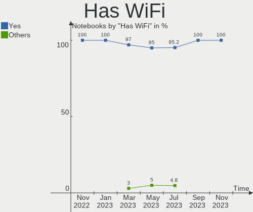
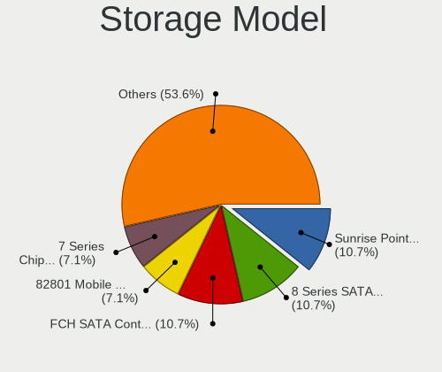
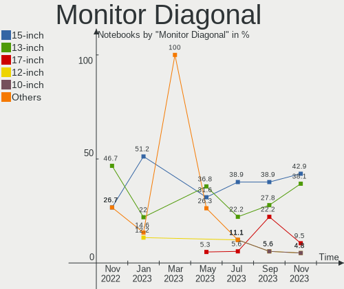
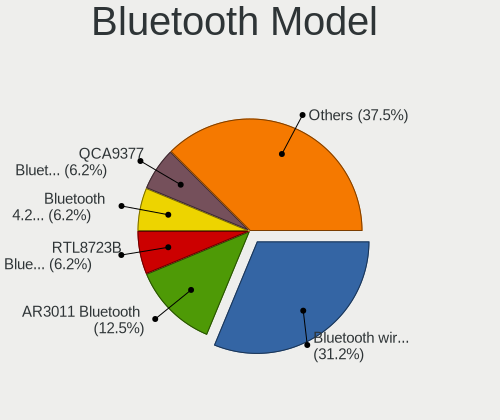
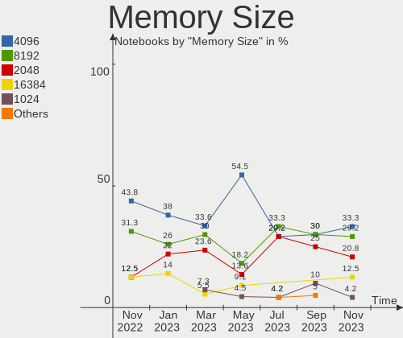

helloSystem - Hardware Trends (Notebooks)
-----------------------------------------

A project to identify most popular hardware characteristics and track their change
over time based on data collected by BSD users at https://BSD-Hardware.info.

Anyone can contribute to this report by the [hw-probe](https://github.com/linuxhw/hw-probe/blob/master/INSTALL.BSD.md) tool:

    hw-probe -all -upload

This report is for one last month. Overall report since the beginning of time: [TestDays](https://github.com/bsdhw/TestDays)

Period: Feb, 2023.

Contents
--------

* [ System ](#system)
  - [ OS                       ](#os)
  - [ OS Family                ](#os-family)
  - [ Arch                     ](#arch)
  - [ DE                       ](#de)
  - [ Display Server           ](#display-server)
  - [ Display Manager          ](#display-manager)
  - [ OS Lang                  ](#os-lang)
  - [ Boot Mode                ](#boot-mode)
  - [ Filesystem               ](#filesystem)
  - [ Part. scheme             ](#part-scheme)

* [ Board ](#board)
  - [ Vendor                   ](#vendor)
  - [ Model                    ](#model)
  - [ Model Family             ](#model-family)
  - [ MFG Year                 ](#mfg-year)
  - [ Form Factor              ](#form-factor)
  - [ Coreboot                 ](#coreboot)
  - [ RAM Size                 ](#ram-size)
  - [ RAM Used                 ](#ram-used)
  - [ Total Drives             ](#total-drives)
  - [ Has CD-ROM               ](#has-cd-rom)
  - [ Has Ethernet             ](#has-ethernet)
  - [ Has WiFi                 ](#has-wifi)
  - [ Has Bluetooth            ](#has-bluetooth)

* [ Location ](#location)
  - [ Country                  ](#country)
  - [ City                     ](#city)

* [ Drives ](#drives)
  - [ Drive Vendor             ](#drive-vendor)
  - [ Drive Model              ](#drive-model)
  - [ HDD Vendor               ](#hdd-vendor)
  - [ SSD Vendor               ](#ssd-vendor)
  - [ Drive Kind               ](#drive-kind)
  - [ Drive Connector          ](#drive-connector)
  - [ Drive Size               ](#drive-size)
  - [ Space Total              ](#space-total)
  - [ Space Used               ](#space-used)
  - [ Malfunc. Drives          ](#malfunc-drives)
  - [ Malfunc. Drive Vendor    ](#malfunc-drive-vendor)
  - [ Malfunc. HDD Vendor      ](#malfunc-hdd-vendor)
  - [ Malfunc. Drive Kind      ](#malfunc-drive-kind)
  - [ Failed Drives            ](#failed-drives)
  - [ Failed Drive Vendor      ](#failed-drive-vendor)
  - [ Drive Status             ](#drive-status)

* [ Storage controller ](#storage-controller)
  - [ Storage Vendor           ](#storage-vendor)
  - [ Storage Model            ](#storage-model)
  - [ Storage Kind             ](#storage-kind)

* [ Processor ](#processor)
  - [ CPU Vendor               ](#cpu-vendor)
  - [ CPU Model                ](#cpu-model)
  - [ CPU Model Family         ](#cpu-model-family)
  - [ CPU Cores                ](#cpu-cores)
  - [ CPU Sockets              ](#cpu-sockets)
  - [ CPU Threads              ](#cpu-threads)
  - [ CPU Microarch            ](#cpu-microarch)

* [ Graphics ](#graphics)
  - [ GPU Vendor               ](#gpu-vendor)
  - [ GPU Model                ](#gpu-model)
  - [ GPU Combo                ](#gpu-combo)
  - [ GPU Driver               ](#gpu-driver)
  - [ GPU Memory               ](#gpu-memory)

* [ Monitor ](#monitor)
  - [ Monitor Vendor           ](#monitor-vendor)
  - [ Monitor Model            ](#monitor-model)
  - [ Monitor Resolution       ](#monitor-resolution)
  - [ Monitor Diagonal         ](#monitor-diagonal)
  - [ Monitor Width            ](#monitor-width)
  - [ Aspect Ratio             ](#aspect-ratio)
  - [ Monitor Area             ](#monitor-area)
  - [ Pixel Density            ](#pixel-density)
  - [ Multiple Monitors        ](#multiple-monitors)

* [ Network ](#network)
  - [ Net Controller Vendor    ](#net-controller-vendor)
  - [ Net Controller Model     ](#net-controller-model)
  - [ Wireless Vendor          ](#wireless-vendor)
  - [ Wireless Model           ](#wireless-model)
  - [ Ethernet Vendor          ](#ethernet-vendor)
  - [ Ethernet Model           ](#ethernet-model)
  - [ Net Controller Kind      ](#net-controller-kind)
  - [ Used Controller          ](#used-controller)
  - [ NICs                     ](#nics)
  - [ IPv6                     ](#ipv6)

* [ Bluetooth ](#bluetooth)
  - [ Bluetooth Vendor         ](#bluetooth-vendor)
  - [ Bluetooth Model          ](#bluetooth-model)

* [ Sound ](#sound)
  - [ Sound Vendor             ](#sound-vendor)
  - [ Sound Model              ](#sound-model)

* [ Memory ](#memory)
  - [ Memory Vendor            ](#memory-vendor)
  - [ Memory Model             ](#memory-model)
  - [ Memory Kind              ](#memory-kind)
  - [ Memory Form Factor       ](#memory-form-factor)
  - [ Memory Size              ](#memory-size)
  - [ Memory Speed             ](#memory-speed)

* [ Printers & scanners ](#printers--scanners)
  - [ Printer Vendor           ](#printer-vendor)
  - [ Printer Model            ](#printer-model)
  - [ Scanner Vendor           ](#scanner-vendor)
  - [ Scanner Model            ](#scanner-model)

* [ Camera ](#camera)
  - [ Camera Vendor            ](#camera-vendor)
  - [ Camera Model             ](#camera-model)

* [ Security ](#security)
  - [ Fingerprint Vendor       ](#fingerprint-vendor)
  - [ Fingerprint Model        ](#fingerprint-model)
  - [ Chipcard Vendor          ](#chipcard-vendor)
  - [ Chipcard Model           ](#chipcard-model)

* [ Unsupported ](#unsupported)
  - [ Unsupported Devices      ](#unsupported-devices)
  - [ Unsupported Device Types ](#unsupported-device-types)

System
------

OS
--

Installed operating systems

| Name              | Notebooks | Percent |
|-------------------|-----------|---------|
| helloSystem 0.8.0 | 40        | 85.11%  |
| helloSystem 0.8.1 | 5         | 10.64%  |
| helloSystem 0.7.0 | 2         | 4.26%   |

OS Family
---------

OS without a version

| Name        | Notebooks | Percent |
|-------------|-----------|---------|
| helloSystem | 47        | 100%    |

Arch
----

OS architecture (x86_64, i586, etc.)

| Name  | Notebooks | Percent |
|-------|-----------|---------|
| amd64 | 47        | 100%    |

DE
--

Desktop Environment

| Name         | Notebooks | Percent |
|--------------|-----------|---------|
| helloDesktop | 46        | 97.87%  |
| GNOME        | 1         | 2.13%   |

Display Server
--------------

X11 or Wayland

| Name | Notebooks | Percent |
|------|-----------|---------|
| X11  | 47        | 100%    |

Display Manager
---------------

SDDM, LightDM, etc.

| Name | Notebooks | Percent |
|------|-----------|---------|
| SLiM | 47        | 100%    |

OS Lang
-------

Language

| Lang  | Notebooks | Percent |
|-------|-----------|---------|
| en    | 25        | 53.19%  |
| pt    | 5         | 10.64%  |
| en_US | 4         | 8.51%   |
| de    | 3         | 6.38%   |
| it    | 2         | 4.26%   |
| tr_TR | 1         | 2.13%   |
| sv    | 1         | 2.13%   |
| pt_BR | 1         | 2.13%   |
| pl    | 1         | 2.13%   |
| nl    | 1         | 2.13%   |
| fr    | 1         | 2.13%   |
| es_ES | 1         | 2.13%   |
| es    | 1         | 2.13%   |

Boot Mode
---------

EFI or BIOS

| Mode | Notebooks | Percent |
|------|-----------|---------|
| EFI  | 47        | 100%    |

Filesystem
----------

Type of filesystem

| Type   | Notebooks | Percent |
|--------|-----------|---------|
| Zfs    | 24        | 51.06%  |
| Cd9660 | 23        | 48.94%  |

Part. scheme
------------

Scheme of partitioning

| Type | Notebooks | Percent |
|------|-----------|---------|
| GPT  | 47        | 100%    |

Board
-----

Vendor
------

Motherboard manufacturer

| Name                | Notebooks | Percent |
|---------------------|-----------|---------|
| Lenovo              | 15        | 31.91%  |
| Hewlett-Packard     | 8         | 17.02%  |
| ASUSTek Computer    | 5         | 10.64%  |
| Dell                | 3         | 6.38%   |
| Notebook            | 2         | 4.26%   |
| Acer                | 2         | 4.26%   |
| Toshiba             | 1         | 2.13%   |
| Sony                | 1         | 2.13%   |
| SLIMBOOK            | 1         | 2.13%   |
| Samsung Electronics | 1         | 2.13%   |
| Plaisio             | 1         | 2.13%   |
| MSI                 | 1         | 2.13%   |
| Monster             | 1         | 2.13%   |
| MECHREVO S1 Series  | 1         | 2.13%   |
| Google              | 1         | 2.13%   |
| Gigabyte Technology | 1         | 2.13%   |
| Fujitsu Siemens     | 1         | 2.13%   |
| Unknown             | 1         | 2.13%   |

Model
-----

Motherboard model

| Name                                     | Notebooks | Percent |
|------------------------------------------|-----------|---------|
| HP Notebook                              | 2         | 4.26%   |
| Toshiba dynabook R63/P                   | 1         | 2.13%   |
| Sony SVF1421E4E                          | 1         | 2.13%   |
| SLIMBOOK PROX-AMD5                       | 1         | 2.13%   |
| Samsung 270E5K/270E5Q/271E5K/2570EK      | 1         | 2.13%   |
| Plaisio Turbo X                          | 1         | 2.13%   |
| Notebook NV4XMB,ME,MZ                    | 1         | 2.13%   |
| Notebook N2x0WU                          | 1         | 2.13%   |
| MSI GF76 12UE                            | 1         | 2.13%   |
| Monster ABRA A7 V11.2                    | 1         | 2.13%   |
| MECHREVO S1 Series S1 Series             | 1         | 2.13%   |
| Lenovo ThinkPad X1 Carbon 3448AWU        | 1         | 2.13%   |
| Lenovo ThinkPad X1 Carbon 2nd 20A7002FUS | 1         | 2.13%   |
| Lenovo ThinkPad T61p 6457UN2             | 1         | 2.13%   |
| Lenovo ThinkPad T520 4243F39             | 1         | 2.13%   |
| Lenovo ThinkPad T430u 33522D5            | 1         | 2.13%   |
| Lenovo ThinkPad T410 2537B94             | 1         | 2.13%   |
| Lenovo ThinkPad P51 20HH001RMX           | 1         | 2.13%   |
| Lenovo ThinkPad P15 Gen 2i 20YQ0014FR    | 1         | 2.13%   |
| Lenovo ThinkPad L450 20DSS1S402          | 1         | 2.13%   |
| Lenovo IdeaPad 3 15ITL6 82H8             | 1         | 2.13%   |
| Lenovo IdeaPad 3 15IML05 82BS            | 1         | 2.13%   |
| Lenovo IdeaPad 3 14IML05 81WA            | 1         | 2.13%   |
| Lenovo G70-70 80HW006AGE                 | 1         | 2.13%   |
| Lenovo G400s 20244                       | 1         | 2.13%   |
| Lenovo B50-80 80EW                       | 1         | 2.13%   |
| HP OMEN by Gaming Laptop 16-k0xxx        | 1         | 2.13%   |
| HP Mini 210-1000                         | 1         | 2.13%   |
| HP Laptop 14-df0xxx                      | 1         | 2.13%   |
| HP ENVY TS m6 Sleekbook                  | 1         | 2.13%   |
| HP EliteBook 840 G1                      | 1         | 2.13%   |
| HP 2000                                  | 1         | 2.13%   |
| Google Lulu                              | 1         | 2.13%   |
| Gigabyte GB-BSi3A-6100                   | 1         | 2.13%   |
| Fujitsu Siemens ESPRIMO Mobile V5535     | 1         | 2.13%   |
| Dell Latitude 5591                       | 1         | 2.13%   |
| Dell Inspiron 5767                       | 1         | 2.13%   |
| Dell Inspiron 15 3515                    | 1         | 2.13%   |
| ASUS VivoBook_ASUSLaptop X509JA_X509JA   | 1         | 2.13%   |
| ASUS VivoBook_ASUSLaptop E410MAB_E410MA  | 1         | 2.13%   |

Model Family
------------

Motherboard model prefix

| Name                    | Notebooks | Percent |
|-------------------------|-----------|---------|
| Lenovo ThinkPad         | 9         | 19.15%  |
| Lenovo IdeaPad          | 3         | 6.38%   |
| HP Notebook             | 2         | 4.26%   |
| Dell Inspiron           | 2         | 4.26%   |
| ASUS VivoBook           | 2         | 4.26%   |
| Acer Aspire             | 2         | 4.26%   |
| Toshiba dynabook        | 1         | 2.13%   |
| Sony SVF1421E4E         | 1         | 2.13%   |
| SLIMBOOK PROX-AMD5      | 1         | 2.13%   |
| Samsung 270E5K          | 1         | 2.13%   |
| Plaisio Turbo           | 1         | 2.13%   |
| Notebook NV4XMB         | 1         | 2.13%   |
| Notebook N2x0WU         | 1         | 2.13%   |
| MSI GF76                | 1         | 2.13%   |
| Monster ABRA            | 1         | 2.13%   |
| MECHREVO S1 Series S1   | 1         | 2.13%   |
| Lenovo G70-70           | 1         | 2.13%   |
| Lenovo G400s            | 1         | 2.13%   |
| Lenovo B50-80           | 1         | 2.13%   |
| HP OMEN                 | 1         | 2.13%   |
| HP Mini                 | 1         | 2.13%   |
| HP Laptop               | 1         | 2.13%   |
| HP ENVY                 | 1         | 2.13%   |
| HP EliteBook            | 1         | 2.13%   |
| HP 2000                 | 1         | 2.13%   |
| Google Lulu             | 1         | 2.13%   |
| Gigabyte GB-BSi3A-6100  | 1         | 2.13%   |
| Fujitsu Siemens ESPRIMO | 1         | 2.13%   |
| Dell Latitude           | 1         | 2.13%   |
| ASUS N76VZ              | 1         | 2.13%   |
| ASUS K84L               | 1         | 2.13%   |
| ASUS 1201N              | 1         | 2.13%   |
| Unknown                 | 1         | 2.13%   |

MFG Year
--------

Motherboard manufacture year

| Year    | Notebooks | Percent |
|---------|-----------|---------|
| 2022    | 7         | 14.89%  |
| 2013    | 7         | 14.89%  |
| 2018    | 5         | 10.64%  |
| 2011    | 4         | 8.51%   |
| 2021    | 3         | 6.38%   |
| 2020    | 3         | 6.38%   |
| 2017    | 3         | 6.38%   |
| 2016    | 3         | 6.38%   |
| 2012    | 3         | 6.38%   |
| 2015    | 2         | 4.26%   |
| 2014    | 2         | 4.26%   |
| 2010    | 2         | 4.26%   |
| 2023    | 1         | 2.13%   |
| 2007    | 1         | 2.13%   |
| Unknown | 1         | 2.13%   |

Form Factor
-----------

Physical design of the computer

| Name     | Notebooks | Percent |
|----------|-----------|---------|
| Notebook | 47        | 100%    |

Coreboot
--------

Have coreboot on board

| Used | Notebooks | Percent |
|------|-----------|---------|
| No   | 46        | 97.87%  |
| Yes  | 1         | 2.13%   |

RAM Size
--------

Total RAM memory

| Size in GB  | Notebooks | Percent |
|-------------|-----------|---------|
| 8.01-16.0   | 25        | 53.19%  |
| 4.01-8.0    | 11        | 23.4%   |
| 16.01-24.0  | 5         | 10.64%  |
| 32.01-64.0  | 2         | 4.26%   |
| 2.01-3.0    | 2         | 4.26%   |
| 3.01-4.0    | 1         | 2.13%   |
| 64.01-256.0 | 1         | 2.13%   |

RAM Used
--------

Used RAM memory

| Used GB  | Notebooks | Percent |
|----------|-----------|---------|
| 0.01-0.5 | 29        | 61.7%   |
| 0.51-1.0 | 11        | 23.4%   |
| 1.01-2.0 | 5         | 10.64%  |
| 2.01-3.0 | 2         | 4.26%   |

Total Drives
------------

Number of drives on board

| Drives | Notebooks | Percent |
|--------|-----------|---------|
| 1      | 32        | 68.09%  |
| 2      | 10        | 21.28%  |
| 0      | 4         | 8.51%   |
| 3      | 1         | 2.13%   |

Has CD-ROM
----------

Has CD-ROM on board

| Presented | Notebooks | Percent |
|-----------|-----------|---------|
| No        | 34        | 72.34%  |
| Yes       | 13        | 27.66%  |

Has Ethernet
------------

Has Ethernet on board

| Presented | Notebooks | Percent |
|-----------|-----------|---------|
| Yes       | 39        | 82.98%  |
| No        | 8         | 17.02%  |

Has WiFi
--------

Has WiFi module

| Presented | Notebooks | Percent |
|-----------|-----------|---------|
| Yes       | 47        | 100%    |

Has Bluetooth
-------------

Has Bluetooth module

| Presented | Notebooks | Percent |
|-----------|-----------|---------|
| Yes       | 36        | 76.6%   |
| No        | 11        | 23.4%   |

Location
--------

Country
-------

Geographic location (country)

| Country     | Notebooks | Percent |
|-------------|-----------|---------|
| USA         | 8         | 17.02%  |
| Brazil      | 6         | 12.77%  |
| Germany     | 5         | 10.64%  |
| Indonesia   | 4         | 8.51%   |
| Netherlands | 3         | 6.38%   |
| China       | 3         | 6.38%   |
| Spain       | 2         | 4.26%   |
| Italy       | 2         | 4.26%   |
| Hungary     | 2         | 4.26%   |
| Turkey      | 1         | 2.13%   |
| Sweden      | 1         | 2.13%   |
| Romania     | 1         | 2.13%   |
| Poland      | 1         | 2.13%   |
| Malaysia    | 1         | 2.13%   |
| Ireland     | 1         | 2.13%   |
| India       | 1         | 2.13%   |
| France      | 1         | 2.13%   |
| Czechia     | 1         | 2.13%   |
| Canada      | 1         | 2.13%   |
| Bulgaria    | 1         | 2.13%   |
| Belgium     | 1         | 2.13%   |

City
----

Geographic location (city)

| City          | Notebooks | Percent |
|---------------|-----------|---------|
| Jakarta       | 2         | 4.26%   |
| Hangzhou      | 2         | 4.26%   |
| Zwolle        | 1         | 2.13%   |
| Wroclaw       | 1         | 2.13%   |
| Vigonza       | 1         | 2.13%   |
| Valencia      | 1         | 2.13%   |
| Szentistvan   | 1         | 2.13%   |
| Sofia         | 1         | 2.13%   |
| Shenzhen      | 1         | 2.13%   |
| Seville       | 1         | 2.13%   |
| Semarang      | 1         | 2.13%   |
| Saskatoon     | 1         | 2.13%   |
| Rockville     | 1         | 2.13%   |
| Rathmore      | 1         | 2.13%   |
| Prague        | 1         | 2.13%   |
| Pflugerville  | 1         | 2.13%   |
| Petaling Jaya | 1         | 2.13%   |
| Pelotas       | 1         | 2.13%   |
| New York      | 1         | 2.13%   |
| New Castle    | 1         | 2.13%   |
| Munich        | 1         | 2.13%   |
| Martinez      | 1         | 2.13%   |
| Marcolandia   | 1         | 2.13%   |
| Manaus        | 1         | 2.13%   |
| Malmo         | 1         | 2.13%   |
| Maceió       | 1         | 2.13%   |
| Lehi          | 1         | 2.13%   |
| Kinwood       | 1         | 2.13%   |
| Hyderabad     | 1         | 2.13%   |
| Hilversum     | 1         | 2.13%   |
| Herentals     | 1         | 2.13%   |
| Guaratingueta | 1         | 2.13%   |
| Glendale      | 1         | 2.13%   |
| Giessen       | 1         | 2.13%   |
| Dordrecht     | 1         | 2.13%   |
| Cologne       | 1         | 2.13%   |
| Colmar        | 1         | 2.13%   |
| Campinas      | 1         | 2.13%   |
| Budapest      | 1         | 2.13%   |
| Bucharest     | 1         | 2.13%   |

Drives
------

Drive Vendor
------------

Hard drive vendors

| Vendor              | Notebooks | Drives | Percent |
|---------------------|-----------|--------|---------|
| Samsung Electronics | 9         | 10     | 16.98%  |
| Kingston            | 7         | 8      | 13.21%  |
| Toshiba             | 5         | 5      | 9.43%   |
| WDC                 | 4         | 4      | 7.55%   |
| Seagate             | 4         | 4      | 7.55%   |
| Crucial             | 4         | 4      | 7.55%   |
| Intel               | 2         | 2      | 3.77%   |
| Hitachi             | 2         | 2      | 3.77%   |
| HGST                | 2         | 2      | 3.77%   |
| Gigabyte Technology | 2         | 2      | 3.77%   |
| A-DATA Technology   | 2         | 2      | 3.77%   |
| Verbatim            | 1         | 1      | 1.89%   |
| Transcend           | 1         | 1      | 1.89%   |
| SSSTC               | 1         | 1      | 1.89%   |
| Silicon Motion      | 1         | 1      | 1.89%   |
| SanDisk             | 1         | 1      | 1.89%   |
| OCZ                 | 1         | 1      | 1.89%   |
| MyDigitalSSD        | 1         | 1      | 1.89%   |
| Micron Technology   | 1         | 1      | 1.89%   |
| GOODRAM             | 1         | 1      | 1.89%   |
| FORESEE             | 1         | 1      | 1.89%   |

Drive Model
-----------

Hard drive models

| Model                                  | Notebooks | Percent |
|----------------------------------------|-----------|---------|
| Kingston SNV2S500G 500GB               | 2         | 3.64%   |
| WDC WDS500G2B0A 500GB                  | 1         | 1.82%   |
| WDC WDS250G2B0A-00SM50 250GB           | 1         | 1.82%   |
| WDC WD10SPZX-35Z10T0 1TB               | 1         | 1.82%   |
| WDC WD10SPZX-24Z10 1TB                 | 1         | 1.82%   |
| Verbatim Vi550 S3 SSD 512GB            | 1         | 1.82%   |
| Transcend TS128GMTS400S 128GB          | 1         | 1.82%   |
| Toshiba THNSNJ256GMCY 256GB            | 1         | 1.82%   |
| Toshiba MQ04ABF100 1TB                 | 1         | 1.82%   |
| Toshiba MQ01ABF050 500GB               | 1         | 1.82%   |
| Toshiba MK5065GSXF 500GB               | 1         | 1.82%   |
| Toshiba KXG50ZNV512G NVMe 512GB        | 1         | 1.82%   |
| SSSTC CL1-4D256 256GB                  | 1         | 1.82%   |
| Silicon Motion AAR240GS112620030 240GB | 1         | 1.82%   |
| Seagate ST9500325AS 500GB              | 1         | 1.82%   |
| Seagate ST9320325AS 320GB              | 1         | 1.82%   |
| Seagate ST9250410AS 250GB              | 1         | 1.82%   |
| Seagate ST9160412AS 160GB              | 1         | 1.82%   |
| SanDisk SSD PLUS 240GB                 | 1         | 1.82%   |
| Samsung SSD 980 PRO 1TB                | 1         | 1.82%   |
| Samsung SSD 980 1TB                    | 1         | 1.82%   |
| Samsung SSD 970 EVO Plus 250GB         | 1         | 1.82%   |
| Samsung SSD 870 EVO 500GB              | 1         | 1.82%   |
| Samsung SSD 860 EVO 500GB              | 1         | 1.82%   |
| Samsung SSD 850 EVO 250GB              | 1         | 1.82%   |
| Samsung MZVLQ256HAJD-00000 256GB       | 1         | 1.82%   |
| Samsung MZVLB512HAJQ-000L7 512GB       | 1         | 1.82%   |
| Samsung MZVLB256HBHQ-00000 256GB       | 1         | 1.82%   |
| Samsung MZMPC032HBCD-000L1 32GB        | 1         | 1.82%   |
| OCZ AGILITY3 120GB                     | 1         | 1.82%   |
| MyDigitalSSD SB2 256GB                 | 1         | 1.82%   |
| Micron 2450_MTFDKBA512TFK 512GB        | 1         | 1.82%   |
| Kingston SV300S37A60G 64GB             | 1         | 1.82%   |
| Kingston SV300S37A120G 120GB           | 1         | 1.82%   |
| Kingston SUV400S37240G 240GB           | 1         | 1.82%   |
| Kingston SA400S37240G 240GB            | 1         | 1.82%   |
| Kingston SA400S37120G 120GB            | 1         | 1.82%   |
| Kingston SA2000M8250G 250GB            | 1         | 1.82%   |
| Intel SSDSCMMW240A3L 240GB             | 1         | 1.82%   |
| Intel SSDSCKKW128G8 128GB              | 1         | 1.82%   |

HDD Vendor
----------

Hard disk drive vendors

| Vendor  | Notebooks | Drives | Percent |
|---------|-----------|--------|---------|
| Seagate | 4         | 4      | 30.77%  |
| Toshiba | 3         | 3      | 23.08%  |
| WDC     | 2         | 2      | 15.38%  |
| Hitachi | 2         | 2      | 15.38%  |
| HGST    | 2         | 2      | 15.38%  |

SSD Vendor
----------

Solid state drive vendors

| Vendor              | Notebooks | Drives | Percent |
|---------------------|-----------|--------|---------|
| Kingston            | 5         | 5      | 20%     |
| Samsung Electronics | 4         | 4      | 16%     |
| WDC                 | 2         | 2      | 8%      |
| Intel               | 2         | 2      | 8%      |
| Crucial             | 2         | 2      | 8%      |
| Verbatim            | 1         | 1      | 4%      |
| Transcend           | 1         | 1      | 4%      |
| Toshiba             | 1         | 1      | 4%      |
| Silicon Motion      | 1         | 1      | 4%      |
| SanDisk             | 1         | 1      | 4%      |
| OCZ                 | 1         | 1      | 4%      |
| MyDigitalSSD        | 1         | 1      | 4%      |
| GOODRAM             | 1         | 1      | 4%      |
| Gigabyte Technology | 1         | 1      | 4%      |
| A-DATA Technology   | 1         | 1      | 4%      |

Drive Kind
----------

HDD or SSD

| Kind | Notebooks | Drives | Percent |
|------|-----------|--------|---------|
| SSD  | 23        | 25     | 46.94%  |
| NVMe | 13        | 17     | 26.53%  |
| HDD  | 13        | 13     | 26.53%  |

Drive Connector
---------------

SATA, SAS, NVMe, etc.

| Type | Notebooks | Drives | Percent |
|------|-----------|--------|---------|
| SATA | 33        | 38     | 71.74%  |
| NVMe | 13        | 17     | 28.26%  |

Drive Size
----------

Size of hard drive

| Size in TB | Notebooks | Drives | Percent |
|------------|-----------|--------|---------|
| 0.01-0.5   | 28        | 32     | 82.35%  |
| 0.51-1.0   | 6         | 6      | 17.65%  |

Space Total
-----------

Amount of disk space available on the file system

| Size in GB | Notebooks | Percent |
|------------|-----------|---------|
| 1-20       | 19        | 40.43%  |
| 101-250    | 15        | 31.91%  |
| 251-500    | 6         | 12.77%  |
| 501-1000   | 3         | 6.38%   |
| 51-100     | 3         | 6.38%   |
| 21-50      | 1         | 2.13%   |

Space Used
----------

Amount of used disk space

| Used GB | Notebooks | Percent |
|---------|-----------|---------|
| 1-20    | 45        | 95.74%  |
| 21-50   | 1         | 2.13%   |
| 101-250 | 1         | 2.13%   |

Malfunc. Drives
---------------

Drive models with a malfunction

| Model                                 | Notebooks | Drives | Percent |
|---------------------------------------|-----------|--------|---------|
| Toshiba MQ04ABF100 1TB                | 1         | 1      | 11.11%  |
| Seagate ST9500325AS 500GB             | 1         | 1      | 11.11%  |
| Seagate ST9250410AS 250GB             | 1         | 1      | 11.11%  |
| Seagate ST9160412AS 160GB             | 1         | 1      | 11.11%  |
| SanDisk SSD PLUS 240GB                | 1         | 1      | 11.11%  |
| Samsung Electronics SSD 870 EVO 500GB | 1         | 1      | 11.11%  |
| Kingston SUV400S37240G 240GB          | 1         | 1      | 11.11%  |
| Hitachi HTS545050A7E380 500GB         | 1         | 1      | 11.11%  |
| HGST HTS725050A7E630 500GB            | 1         | 1      | 11.11%  |

Malfunc. Drive Vendor
---------------------

Vendors of faulty drives

| Vendor              | Notebooks | Drives | Percent |
|---------------------|-----------|--------|---------|
| Seagate             | 3         | 3      | 33.33%  |
| Toshiba             | 1         | 1      | 11.11%  |
| SanDisk             | 1         | 1      | 11.11%  |
| Samsung Electronics | 1         | 1      | 11.11%  |
| Kingston            | 1         | 1      | 11.11%  |
| Hitachi             | 1         | 1      | 11.11%  |
| HGST                | 1         | 1      | 11.11%  |

Malfunc. HDD Vendor
-------------------

Vendors of faulty HDD drives

| Vendor  | Notebooks | Drives | Percent |
|---------|-----------|--------|---------|
| Seagate | 3         | 3      | 50%     |
| Toshiba | 1         | 1      | 16.67%  |
| Hitachi | 1         | 1      | 16.67%  |
| HGST    | 1         | 1      | 16.67%  |

Malfunc. Drive Kind
-------------------

Kinds of faulty drives

| Kind | Notebooks | Drives | Percent |
|------|-----------|--------|---------|
| HDD  | 6         | 6      | 66.67%  |
| SSD  | 3         | 3      | 33.33%  |

Failed Drives
-------------

Failed drive models

Zero info for selected period =(

Failed Drive Vendor
-------------------

Failed drive vendors

Zero info for selected period =(

Drive Status
------------

Number of failed and malfunc. drives

| Status  | Notebooks | Drives | Percent |
|---------|-----------|--------|---------|
| Works   | 37        | 46     | 80.43%  |
| Malfunc | 9         | 9      | 19.57%  |

Storage controller
------------------

Storage Vendor
--------------

Storage controller vendors

| Vendor                           | Notebooks | Percent |
|----------------------------------|-----------|---------|
| Intel                            | 36        | 63.16%  |
| Samsung Electronics              | 5         | 8.77%   |
| Kingston Technology Company      | 3         | 5.26%   |
| SanDisk                          | 2         | 3.51%   |
| Micron/Crucial Technology        | 2         | 3.51%   |
| AMD                              | 2         | 3.51%   |
| Solid State Storage Technology   | 1         | 1.75%   |
| Silicon Integrated Systems [SiS] | 1         | 1.75%   |
| Phison Electronics               | 1         | 1.75%   |
| Nvidia                           | 1         | 1.75%   |
| Micron Technology                | 1         | 1.75%   |
| Marvell Technology Group         | 1         | 1.75%   |
| ADATA Technology                 | 1         | 1.75%   |

Storage Model
-------------

Storage controller models

| Model                                                                                  | Notebooks | Percent |
|----------------------------------------------------------------------------------------|-----------|---------|
| Intel 7 Series Chipset Family 6-port SATA Controller [AHCI mode]                       | 6         | 9.84%   |
| Intel Wildcat Point-LP SATA Controller [AHCI Mode]                                     | 5         | 8.2%    |
| Unknown                                                                                | 5         | 8.2%    |
| Intel 8 Series SATA Controller 1 [AHCI mode]                                           | 4         | 6.56%   |
| Samsung NVMe SSD Controller SM981/PM981/PM983                                          | 3         | 4.92%   |
| Intel Sunrise Point-LP SATA Controller [AHCI mode]                                     | 3         | 4.92%   |
| SanDisk WD PC SN810 / Black SN850 NVMe SSD                                             | 2         | 3.28%   |
| Samsung NVMe SSD Controller 980                                                        | 2         | 3.28%   |
| Micron/Crucial P2 NVMe PCIe SSD                                                        | 2         | 3.28%   |
| Intel Comet Lake SATA AHCI Controller                                                  | 2         | 3.28%   |
| Intel 82801 Mobile SATA Controller [RAID mode]                                         | 2         | 3.28%   |
| Intel 6 Series/C200 Series Chipset Family 6 port Mobile SATA AHCI Controller           | 2         | 3.28%   |
| AMD FCH SATA Controller [AHCI mode]                                                    | 2         | 3.28%   |
| Silicon Integrated Systems [SiS] SATA Controller / IDE mode                            | 1         | 1.64%   |
| Silicon Integrated Systems [SiS] 5513 IDE Controller                                   | 1         | 1.64%   |
| Samsung NVMe SSD Controller PM9A1/PM9A3/980PRO                                         | 1         | 1.64%   |
| Phison PS5013 E13 NVMe Controller                                                      | 1         | 1.64%   |
| Nvidia MCP79 SATA Controller                                                           | 1         | 1.64%   |
| Kingston Company A2000 NVMe SSD                                                        | 1         | 1.64%   |
| Intel Volume Management Device NVMe RAID Controller                                    | 1         | 1.64%   |
| Intel Tiger Lake-LP SATA Controller                                                    | 1         | 1.64%   |
| Intel Q170/Q150/B150/H170/H110/Z170/CM236 Chipset SATA Controller [AHCI Mode]          | 1         | 1.64%   |
| Intel NM10/ICH7 Family SATA Controller [AHCI mode]                                     | 1         | 1.64%   |
| Intel Ice Lake-LP SATA Controller [AHCI mode]                                          | 1         | 1.64%   |
| Intel Celeron/Pentium Silver Processor SATA Controller                                 | 1         | 1.64%   |
| Intel Atom Processor E3800 Series SATA AHCI Controller                                 | 1         | 1.64%   |
| Intel Alder Lake-P SATA AHCI Controller                                                | 1         | 1.64%   |
| Intel 82801HM/HEM (ICH8M/ICH8M-E) SATA Controller [AHCI mode]                          | 1         | 1.64%   |
| Intel 82801HM/HEM (ICH8M/ICH8M-E) IDE Controller                                       | 1         | 1.64%   |
| Intel 6 Series/C200 Series Chipset Family Mobile SATA Controller (IDE mode, ports 4-5) | 1         | 1.64%   |
| Intel 6 Series/C200 Series Chipset Family Mobile SATA Controller (IDE mode, ports 0-3) | 1         | 1.64%   |
| Intel 5 Series/3400 Series Chipset 6 port SATA AHCI Controller                         | 1         | 1.64%   |
| Intel 5 Series/3400 Series Chipset 4 port SATA AHCI Controller                         | 1         | 1.64%   |
| Intel 400 Series Chipset Family SATA AHCI Controller                                   | 1         | 1.64%   |

Storage Kind
------------

Kind of storage controller (IDE, SATA, NVMe, SAS, ...)

| Kind | Notebooks | Percent |
|------|-----------|---------|
| SATA | 35        | 63.64%  |
| NVMe | 13        | 23.64%  |
| IDE  | 4         | 7.27%   |
| RAID | 3         | 5.45%   |

Processor
---------

CPU Vendor
----------

Processor vendors

| Vendor | Notebooks | Percent |
|--------|-----------|---------|
| Intel  | 43        | 91.49%  |
| AMD    | 4         | 8.51%   |

CPU Model
---------

Processor models

| Model                                         | Notebooks | Percent |
|-----------------------------------------------|-----------|---------|
| Intel Core i5-5200U CPU @ 2.20GHz             | 3         | 6.38%   |
| Intel Core i5-4200U CPU @ 1.60GHz             | 2         | 4.26%   |
| Intel Core i3-4005U CPU @ 1.70GHz             | 2         | 4.26%   |
| Intel 12th Gen Core i7-12700H                 | 2         | 4.26%   |
| Intel Unknown                                 | 1         | 2.13%   |
| Intel Pentium CPU P6200 @ 2.13GHz             | 1         | 2.13%   |
| Intel Pentium CPU 987 @ 1.50GHz               | 1         | 2.13%   |
| Intel Pentium CPU 6405U @ 2.40GHz             | 1         | 2.13%   |
| Intel Core i7-8850H CPU @ 2.60GHz             | 1         | 2.13%   |
| Intel Core i7-7820HQ CPU @ 2.90GHz            | 1         | 2.13%   |
| Intel Core i7-7500U CPU @ 2.70GHz             | 1         | 2.13%   |
| Intel Core i7-3667U CPU @ 2.00GHz             | 1         | 2.13%   |
| Intel Core i7-3610QM CPU @ 2.30GHz            | 1         | 2.13%   |
| Intel Core i7-2630QM CPU @ 2.00GHz            | 1         | 2.13%   |
| Intel Core i7-10750H CPU @ 2.60GHz            | 1         | 2.13%   |
| Intel Core i5-8250U CPU @ 1.60GHz             | 1         | 2.13%   |
| Intel Core i5-5300U CPU @ 2.30GHz             | 1         | 2.13%   |
| Intel Core i5-3337U CPU @ 1.80GHz             | 1         | 2.13%   |
| Intel Core i5-3230M CPU @ 2.60GHz             | 1         | 2.13%   |
| Intel Core i5-2520M CPU @ 2.50GHz             | 1         | 2.13%   |
| Intel Core i5-10210U CPU @ 1.60GHz            | 1         | 2.13%   |
| Intel Core i5 CPU M 520 @ 2.40GHz             | 1         | 2.13%   |
| Intel Core i3-7100U CPU @ 2.40GHz             | 1         | 2.13%   |
| Intel Core i3-6100U CPU @ 2.30GHz             | 1         | 2.13%   |
| Intel Core i3-6006U CPU @ 2.00GHz             | 1         | 2.13%   |
| Intel Core i3-5005U CPU @ 2.00GHz             | 1         | 2.13%   |
| Intel Core i3-2330M CPU @ 2.20GHz             | 1         | 2.13%   |
| Intel Core i3-2328M CPU @ 2.20GHz             | 1         | 2.13%   |
| Intel Core i3-1005G1 CPU @ 1.20GHz            | 1         | 2.13%   |
| Intel Core 2 Duo CPU T8300 @ 2.40GHz          | 1         | 2.13%   |
| Intel Celeron N4020 CPU @ 1.10GHz             | 1         | 2.13%   |
| Intel Celeron N4000 CPU @ 1.10GHz             | 1         | 2.13%   |
| Intel Celeron CPU N2840 @ 2.16GHz             | 1         | 2.13%   |
| Intel Atom CPU N450 @ 1.66GHz                 | 1         | 2.13%   |
| Intel Atom CPU 330 @ 1.60GHz                  | 1         | 2.13%   |
| Intel 11th Gen Core i7-11800H @ 2.30GHz       | 1         | 2.13%   |
| Intel 11th Gen Core i5-1135G7 @ 2.40GHz       | 1         | 2.13%   |
| Intel 11th Gen Core i3-1115G4 @ 3.00GHz       | 1         | 2.13%   |
| AMD Ryzen 7 5700U with Radeon Graphics        | 1         | 2.13%   |
| AMD Ryzen 7 3700U with Radeon Vega Mobile Gfx | 1         | 2.13%   |

CPU Model Family
----------------

Processor model prefix

| Model            | Notebooks | Percent |
|------------------|-----------|---------|
| Intel Core i5    | 12        | 25.53%  |
| Intel Core i3    | 9         | 19.15%  |
| Intel Core i7    | 7         | 14.89%  |
| Other            | 6         | 12.77%  |
| Intel Pentium    | 3         | 6.38%   |
| Intel Celeron    | 3         | 6.38%   |
| Intel Atom       | 2         | 4.26%   |
| AMD Ryzen 7      | 2         | 4.26%   |
| Intel Core 2 Duo | 1         | 2.13%   |
| AMD E1           | 1         | 2.13%   |
| AMD A10          | 1         | 2.13%   |

CPU Cores
---------

Number of processor cores

| Number  | Notebooks | Percent |
|---------|-----------|---------|
| 2       | 30        | 63.83%  |
| 4       | 7         | 14.89%  |
| 10      | 2         | 4.26%   |
| 8       | 2         | 4.26%   |
| 6       | 2         | 4.26%   |
| 1       | 2         | 4.26%   |
| 16      | 1         | 2.13%   |
| Unknown | 1         | 2.13%   |

CPU Sockets
-----------

Number of sockets

| Number | Notebooks | Percent |
|--------|-----------|---------|
| 1      | 47        | 100%    |

CPU Threads
-----------

Threads per core (Hyper-Threading)

| Number  | Notebooks | Percent |
|---------|-----------|---------|
| 2       | 36        | 76.6%   |
| 1       | 9         | 19.15%  |
| Unknown | 2         | 4.26%   |

CPU Microarch
-------------

Microarchitecture

| Name          | Notebooks | Percent |
|---------------|-----------|---------|
| KabyLake      | 7         | 14.89%  |
| SandyBridge   | 5         | 10.64%  |
| Broadwell     | 5         | 10.64%  |
| IvyBridge     | 4         | 8.51%   |
| Haswell       | 4         | 8.51%   |
| Unknown       | 4         | 8.51%   |
| Westmere      | 2         | 4.26%   |
| TigerLake     | 2         | 4.26%   |
| Skylake       | 2         | 4.26%   |
| Goldmont plus | 2         | 4.26%   |
| Bonnell       | 2         | 4.26%   |
| Zen+          | 1         | 2.13%   |
| Silvermont    | 1         | 2.13%   |
| Piledriver    | 1         | 2.13%   |
| Penryn        | 1         | 2.13%   |
| IceLake       | 1         | 2.13%   |
| Core          | 1         | 2.13%   |
| CometLake     | 1         | 2.13%   |
| Bobcat        | 1         | 2.13%   |

Graphics
--------

GPU Vendor
----------

Vendors of graphics cards

| Vendor                           | Notebooks | Percent |
|----------------------------------|-----------|---------|
| Intel                            | 40        | 65.57%  |
| Nvidia                           | 13        | 21.31%  |
| AMD                              | 7         | 11.48%  |
| Silicon Integrated Systems [SiS] | 1         | 1.64%   |

GPU Model
---------

Graphics card models

| Model                                                                                 | Notebooks | Percent |
|---------------------------------------------------------------------------------------|-----------|---------|
| Intel HD Graphics 5500                                                                | 5         | 8.2%    |
| Intel 2nd Generation Core Processor Family Integrated Graphics Controller             | 5         | 8.2%    |
| Intel Haswell-ULT Integrated Graphics Controller                                      | 4         | 6.56%   |
| Intel 3rd Gen Core processor Graphics Controller                                      | 4         | 6.56%   |
| Nvidia TU117M                                                                         | 2         | 3.28%   |
| Nvidia GF117M [GeForce 610M/710M/810M/820M / GT 620M/625M/630M/720M]                  | 2         | 3.28%   |
| Nvidia GA106M [GeForce RTX 3060 Mobile / Max-Q]                                       | 2         | 3.28%   |
| Intel Skylake GT2 [HD Graphics 520]                                                   | 2         | 3.28%   |
| Intel HD Graphics 620                                                                 | 2         | 3.28%   |
| Intel GeminiLake [UHD Graphics 600]                                                   | 2         | 3.28%   |
| Intel Core Processor Integrated Graphics Controller                                   | 2         | 3.28%   |
| Intel Alder Lake-P Integrated Graphics Controller                                     | 2         | 3.28%   |
| AMD Sun XT [Radeon HD 8670A/8670M/8690M / R5 M330 / M430 / Radeon 520 Mobile]         | 2         | 3.28%   |
| Silicon Integrated Systems [SiS] 771/671 PCIE VGA Display Adapter                     | 1         | 1.64%   |
| Nvidia TU117GLM [T1200 Laptop GPU]                                                    | 1         | 1.64%   |
| Nvidia GP108M [GeForce MX150]                                                         | 1         | 1.64%   |
| Nvidia GM206GLM [Quadro M2200 Mobile]                                                 | 1         | 1.64%   |
| Nvidia GK107M [GeForce GT 650M]                                                       | 1         | 1.64%   |
| Nvidia GF108M [GeForce GT 540M]                                                       | 1         | 1.64%   |
| Nvidia G84GLM [Quadro FX 570M]                                                        | 1         | 1.64%   |
| Nvidia C79 [GeForce 9400M / ION]                                                      | 1         | 1.64%   |
| Intel UHD Graphics 620                                                                | 1         | 1.64%   |
| Intel TigerLake-LP GT2 [Iris Xe Graphics]                                             | 1         | 1.64%   |
| Intel TigerLake-H GT1 [UHD Graphics]                                                  | 1         | 1.64%   |
| Intel Tiger Lake-LP GT2 [UHD Graphics G4]                                             | 1         | 1.64%   |
| Intel Iris Plus Graphics G1 (Ice Lake)                                                | 1         | 1.64%   |
| Intel HD Graphics 630                                                                 | 1         | 1.64%   |
| Intel CometLake-U GT2 [UHD Graphics]                                                  | 1         | 1.64%   |
| Intel CometLake-H GT2 [UHD Graphics]                                                  | 1         | 1.64%   |
| Intel Comet Lake-U GT2 [UHD Graphics 620]                                             | 1         | 1.64%   |
| Intel CoffeeLake-H GT2 [UHD Graphics 630]                                             | 1         | 1.64%   |
| Intel Atom Processor Z36xxx/Z37xxx Series Graphics & Display                          | 1         | 1.64%   |
| Intel Atom Processor D4xx/D5xx/N4xx/N5xx Integrated Graphics Controller               | 1         | 1.64%   |
| AMD Wrestler [Radeon HD 7310]                                                         | 1         | 1.64%   |
| AMD Topaz XT [Radeon R7 M260/M265 / M340/M360 / M440/M445 / 530/535 / 620/625 Mobile] | 1         | 1.64%   |
| AMD Richland [Radeon HD 8610G]                                                        | 1         | 1.64%   |
| AMD Picasso/Raven 2 [Radeon Vega Series / Radeon Vega Mobile Series]                  | 1         | 1.64%   |
| AMD Lucienne                                                                          | 1         | 1.64%   |

GPU Combo
---------

Combinations of graphics cards

| Name           | Notebooks | Percent |
|----------------|-----------|---------|
| 1 x Intel      | 25        | 53.19%  |
| Intel + Nvidia | 11        | 23.4%   |
| 1 x AMD        | 4         | 8.51%   |
| Intel + AMD    | 3         | 6.38%   |
| 1 x Nvidia     | 2         | 4.26%   |
| 2 x Intel      | 1         | 2.13%   |
| 1 x SiS        | 1         | 2.13%   |

GPU Driver
----------

Free vs proprietary

| Driver      | Notebooks | Percent |
|-------------|-----------|---------|
| Free        | 42        | 89.36%  |
| Unknown     | 4         | 8.51%   |
| Proprietary | 1         | 2.13%   |

GPU Memory
----------

Total video memory

| Size in GB | Notebooks | Percent |
|------------|-----------|---------|
| Unknown    | 46        | 97.87%  |
| 0.51-1.0   | 1         | 2.13%   |

Monitor
-------

Monitor Vendor
--------------

Monitor vendors

| Vendor       | Notebooks | Percent |
|--------------|-----------|---------|
| AU Optronics | 1         | 50%     |
| AOC          | 1         | 50%     |

Monitor Model
-------------

Monitor models

| Model                                                         | Notebooks | Percent |
|---------------------------------------------------------------|-----------|---------|
| AU Optronics LCD Monitor AUO32EC 1366x768 340x190mm 15.3-inch | 1         | 50%     |
| AOC 2752 AOC2752 1920x1080 580x340mm 26.5-inch                | 1         | 50%     |

Monitor Resolution
------------------

Monitor screen resolution

| Resolution      | Notebooks | Percent |
|-----------------|-----------|---------|
| 1920x1080 (FHD) | 1         | 50%     |
| 1366x768 (WXGA) | 1         | 50%     |

Monitor Diagonal
----------------

Diagonal size in inches

| Inches | Notebooks | Percent |
|--------|-----------|---------|
| 26     | 1         | 50%     |
| 15     | 1         | 50%     |

Monitor Width
-------------

Physical width

| Width in mm | Notebooks | Percent |
|-------------|-----------|---------|
| 501-600     | 1         | 50%     |
| 301-350     | 1         | 50%     |

Aspect Ratio
------------

Proportional relationship between the width and the height

| Ratio | Notebooks | Percent |
|-------|-----------|---------|
| 16/9  | 1         | 100%    |

Monitor Area
------------

Area in inch²

| Area in inch² | Notebooks | Percent |
|----------------|-----------|---------|
| 301-350        | 1         | 50%     |
| 91-100         | 1         | 50%     |

Pixel Density
-------------

Pixels per inch

| Density | Notebooks | Percent |
|---------|-----------|---------|
| 101-120 | 1         | 50%     |
| 51-100  | 1         | 50%     |

Multiple Monitors
-----------------

Total monitors connected

| Total | Notebooks | Percent |
|-------|-----------|---------|
| 1     | 38        | 80.85%  |
| 0     | 6         | 12.77%  |
| 2     | 3         | 6.38%   |

Network
-------

Net Controller Vendor
---------------------

Controller vendors

| Vendor                            | Notebooks | Percent |
|-----------------------------------|-----------|---------|
| Intel                             | 28        | 35.44%  |
| Realtek Semiconductor             | 27        | 34.18%  |
| Qualcomm Atheros                  | 10        | 12.66%  |
| Broadcom                          | 5         | 6.33%   |
| Ralink                            | 2         | 2.53%   |
| Xiaomi                            | 1         | 1.27%   |
| Silicon Integrated Systems [SiS]  | 1         | 1.27%   |
| Sierra Wireless                   | 1         | 1.27%   |
| NetGear                           | 1         | 1.27%   |
| Ericsson Business Mobile Networks | 1         | 1.27%   |
| Edimax Technology                 | 1         | 1.27%   |
| BUFFALO                           | 1         | 1.27%   |

Net Controller Model
--------------------

Controller models

| Model                                                                                         | Notebooks | Percent |
|-----------------------------------------------------------------------------------------------|-----------|---------|
| Realtek RTL8111/8168/8411 PCI Express Gigabit Ethernet Controller                             | 15        | 15.46%  |
| Realtek RTL810xE PCI Express Fast Ethernet controller                                         | 6         | 6.19%   |
| Realtek RTL8821CE 802.11ac PCIe Wireless Network Adapter                                      | 3         | 3.09%   |
| Realtek RTL8188EUS 802.11n Wireless Network Adapter                                           | 3         | 3.09%   |
| Qualcomm Atheros AR9485 Wireless Network Adapter                                              | 3         | 3.09%   |
| Realtek RTL8723BE PCIe Wireless Network Adapter                                               | 2         | 2.06%   |
| Qualcomm Atheros QCA9565 / AR9565 Wireless Network Adapter                                    | 2         | 2.06%   |
| Qualcomm Atheros AR9285 Wireless Network Adapter (PCI-Express)                                | 2         | 2.06%   |
| Intel Wireless 8265 / 8275                                                                    | 2         | 2.06%   |
| Intel Wireless 7265                                                                           | 2         | 2.06%   |
| Intel Wireless 7260                                                                           | 2         | 2.06%   |
| Intel Wi-Fi 6 AX210/AX211/AX411 160MHz                                                        | 2         | 2.06%   |
| Intel Wi-Fi 6 AX201                                                                           | 2         | 2.06%   |
| Intel Ethernet Connection (3) I218-V                                                          | 2         | 2.06%   |
| Intel Comet Lake PCH-LP CNVi WiFi                                                             | 2         | 2.06%   |
| Intel Centrino Wireless-N 2230                                                                | 2         | 2.06%   |
| Intel Centrino Advanced-N 6205 [Taylor Peak]                                                  | 2         | 2.06%   |
| Intel Alder Lake-P PCH CNVi WiFi                                                              | 2         | 2.06%   |
| Broadcom BCM43142 802.11b/g/n                                                                 | 2         | 2.06%   |
| Xiaomi Mi/Redmi series (RNDIS)                                                                | 1         | 1.03%   |
| Silicon Integrated Systems [SiS] 191 Gigabit Ethernet Adapter                                 | 1         | 1.03%   |
| Sierra Wireless Sierra Wireless EM7345 4G LTE                                                 | 1         | 1.03%   |
| Realtek RTL8191SEvA Wireless LAN Controller                                                   | 1         | 1.03%   |
| Realtek RTL8188SU 802.11n WLAN Adapter                                                        | 1         | 1.03%   |
| Realtek RTL8188CUS 802.11n WLAN Adapter                                                       | 1         | 1.03%   |
| Realtek Realtek 8812AU/8821AU 802.11ac WLAN Adapter [USB Wireless Dual-Band Adapter 2.4/5Ghz] | 1         | 1.03%   |
| Ralink RT5390R 802.11bgn PCIe Wireless Network Adapter                                        | 1         | 1.03%   |
| Ralink RT3290 Wireless 802.11n 1T/1R PCIe                                                     | 1         | 1.03%   |
| Qualcomm Atheros QCA8172 Fast Ethernet                                                        | 1         | 1.03%   |
| Qualcomm Atheros AR8161 Gigabit Ethernet                                                      | 1         | 1.03%   |
| Qualcomm Atheros AR8152 v2.0 Fast Ethernet                                                    | 1         | 1.03%   |
| Qualcomm Atheros AR8151 v2.0 Gigabit Ethernet                                                 | 1         | 1.03%   |
| Qualcomm Atheros AR8132 Fast Ethernet                                                         | 1         | 1.03%   |
| Qualcomm Atheros AR5418 Wireless Network Adapter [AR5008E 802.11(a)bgn] (PCI-Express)         | 1         | 1.03%   |
| NetGear A6100 AC600 DB Wireless Adapter [Realtek RTL8811AU]                                   | 1         | 1.03%   |
| Intel Wireless 3165                                                                           | 1         | 1.03%   |
| Intel Wi-Fi 6 AX200                                                                           | 1         | 1.03%   |
| Intel PRO/Wireless 5100 AGN [Shiloh] Network Connection                                       | 1         | 1.03%   |
| Intel Ice Lake-LP PCH CNVi WiFi                                                               | 1         | 1.03%   |
| Intel Ethernet Controller I225-V                                                              | 1         | 1.03%   |

Wireless Vendor
---------------

Wireless vendors

| Vendor                | Notebooks | Percent |
|-----------------------|-----------|---------|
| Intel                 | 26        | 46.43%  |
| Realtek Semiconductor | 11        | 19.64%  |
| Qualcomm Atheros      | 8         | 14.29%  |
| Broadcom              | 5         | 8.93%   |
| Ralink                | 2         | 3.57%   |
| Sierra Wireless       | 1         | 1.79%   |
| NetGear               | 1         | 1.79%   |
| Edimax Technology     | 1         | 1.79%   |
| BUFFALO               | 1         | 1.79%   |

Wireless Model
--------------

Wireless models

| Model                                                                                         | Notebooks | Percent |
|-----------------------------------------------------------------------------------------------|-----------|---------|
| Realtek RTL8821CE 802.11ac PCIe Wireless Network Adapter                                      | 3         | 5.26%   |
| Realtek RTL8188EUS 802.11n Wireless Network Adapter                                           | 3         | 5.26%   |
| Qualcomm Atheros AR9485 Wireless Network Adapter                                              | 3         | 5.26%   |
| Realtek RTL8723BE PCIe Wireless Network Adapter                                               | 2         | 3.51%   |
| Qualcomm Atheros QCA9565 / AR9565 Wireless Network Adapter                                    | 2         | 3.51%   |
| Qualcomm Atheros AR9285 Wireless Network Adapter (PCI-Express)                                | 2         | 3.51%   |
| Intel Wireless 8265 / 8275                                                                    | 2         | 3.51%   |
| Intel Wireless 7265                                                                           | 2         | 3.51%   |
| Intel Wireless 7260                                                                           | 2         | 3.51%   |
| Intel Wi-Fi 6 AX210/AX211/AX411 160MHz                                                        | 2         | 3.51%   |
| Intel Wi-Fi 6 AX201                                                                           | 2         | 3.51%   |
| Intel Comet Lake PCH-LP CNVi WiFi                                                             | 2         | 3.51%   |
| Intel Centrino Wireless-N 2230                                                                | 2         | 3.51%   |
| Intel Centrino Advanced-N 6205 [Taylor Peak]                                                  | 2         | 3.51%   |
| Intel Alder Lake-P PCH CNVi WiFi                                                              | 2         | 3.51%   |
| Broadcom BCM43142 802.11b/g/n                                                                 | 2         | 3.51%   |
| Sierra Wireless Sierra Wireless EM7345 4G LTE                                                 | 1         | 1.75%   |
| Realtek RTL8191SEvA Wireless LAN Controller                                                   | 1         | 1.75%   |
| Realtek RTL8188SU 802.11n WLAN Adapter                                                        | 1         | 1.75%   |
| Realtek RTL8188CUS 802.11n WLAN Adapter                                                       | 1         | 1.75%   |
| Realtek Realtek 8812AU/8821AU 802.11ac WLAN Adapter [USB Wireless Dual-Band Adapter 2.4/5Ghz] | 1         | 1.75%   |
| Ralink RT5390R 802.11bgn PCIe Wireless Network Adapter                                        | 1         | 1.75%   |
| Ralink RT3290 Wireless 802.11n 1T/1R PCIe                                                     | 1         | 1.75%   |
| Qualcomm Atheros AR5418 Wireless Network Adapter [AR5008E 802.11(a)bgn] (PCI-Express)         | 1         | 1.75%   |
| NetGear A6100 AC600 DB Wireless Adapter [Realtek RTL8811AU]                                   | 1         | 1.75%   |
| Intel Wireless 3165                                                                           | 1         | 1.75%   |
| Intel Wi-Fi 6 AX200                                                                           | 1         | 1.75%   |
| Intel PRO/Wireless 5100 AGN [Shiloh] Network Connection                                       | 1         | 1.75%   |
| Intel Ice Lake-LP PCH CNVi WiFi                                                               | 1         | 1.75%   |
| Intel Dual Band Wireless-AC 3168NGW [Stone Peak]                                              | 1         | 1.75%   |
| Intel Comet Lake PCH CNVi WiFi                                                                | 1         | 1.75%   |
| Intel Centrino Wireless-N 1000 [Condor Peak]                                                  | 1         | 1.75%   |
| Intel Cannon Lake PCH CNVi WiFi                                                               | 1         | 1.75%   |
| Edimax EW-7811Un 802.11n Wireless Adapter [Realtek RTL8188CUS]                                | 1         | 1.75%   |
| BUFFALO WLI-UC-GNM Wireless LAN Adapter [Ralink RT8070]                                       | 1         | 1.75%   |
| Broadcom BCM43228 802.11a/b/g/n                                                               | 1         | 1.75%   |
| Broadcom BCM43225 802.11b/g/n                                                                 | 1         | 1.75%   |
| Broadcom BCM4322 802.11a/b/g/n Wireless LAN Controller                                        | 1         | 1.75%   |

Ethernet Vendor
---------------

Ethernet vendors

| Vendor                           | Notebooks | Percent |
|----------------------------------|-----------|---------|
| Realtek Semiconductor            | 21        | 53.85%  |
| Intel                            | 11        | 28.21%  |
| Qualcomm Atheros                 | 5         | 12.82%  |
| Xiaomi                           | 1         | 2.56%   |
| Silicon Integrated Systems [SiS] | 1         | 2.56%   |

Ethernet Model
--------------

Ethernet models

| Model                                                             | Notebooks | Percent |
|-------------------------------------------------------------------|-----------|---------|
| Realtek RTL8111/8168/8411 PCI Express Gigabit Ethernet Controller | 15        | 38.46%  |
| Realtek RTL810xE PCI Express Fast Ethernet controller             | 6         | 15.38%  |
| Intel Ethernet Connection (3) I218-V                              | 2         | 5.13%   |
| Xiaomi Mi/Redmi series (RNDIS)                                    | 1         | 2.56%   |
| Silicon Integrated Systems [SiS] 191 Gigabit Ethernet Adapter     | 1         | 2.56%   |
| Qualcomm Atheros QCA8172 Fast Ethernet                            | 1         | 2.56%   |
| Qualcomm Atheros AR8161 Gigabit Ethernet                          | 1         | 2.56%   |
| Qualcomm Atheros AR8152 v2.0 Fast Ethernet                        | 1         | 2.56%   |
| Qualcomm Atheros AR8151 v2.0 Gigabit Ethernet                     | 1         | 2.56%   |
| Qualcomm Atheros AR8132 Fast Ethernet                             | 1         | 2.56%   |
| Intel Ethernet Controller I225-V                                  | 1         | 2.56%   |
| Intel Ethernet Connection I219-LM                                 | 1         | 2.56%   |
| Intel Ethernet Connection I218-V                                  | 1         | 2.56%   |
| Intel Ethernet Connection I218-LM                                 | 1         | 2.56%   |
| Intel Ethernet Connection (7) I219-LM                             | 1         | 2.56%   |
| Intel Ethernet Connection (5) I219-LM                             | 1         | 2.56%   |
| Intel 82579LM Gigabit Network Connection (Lewisville)             | 1         | 2.56%   |
| Intel 82577LM Gigabit Network Connection                          | 1         | 2.56%   |
| Intel 82566MM Gigabit Network Connection                          | 1         | 2.56%   |

Net Controller Kind
-------------------

Ethernet, WiFi or modem

| Kind     | Notebooks | Percent |
|----------|-----------|---------|
| WiFi     | 47        | 54.02%  |
| Ethernet | 39        | 44.83%  |
| Unknown  | 1         | 1.15%   |

Used Controller
---------------

Currently used network controller

| Kind     | Notebooks | Percent |
|----------|-----------|---------|
| Ethernet | 22        | 53.66%  |
| WiFi     | 19        | 46.34%  |

NICs
----

Total network controllers on board

| Total | Notebooks | Percent |
|-------|-----------|---------|
| 2     | 38        | 80.85%  |
| 1     | 9         | 19.15%  |

IPv6
----

IPv6 vs IPv4

| Used | Notebooks | Percent |
|------|-----------|---------|
| No   | 42        | 89.36%  |
| Yes  | 5         | 10.64%  |

Bluetooth
---------

Bluetooth Vendor
----------------

Controller vendors

| Vendor                          | Notebooks | Percent |
|---------------------------------|-----------|---------|
| Intel                           | 21        | 58.33%  |
| Realtek Semiconductor           | 4         | 11.11%  |
| Broadcom                        | 4         | 11.11%  |
| Qualcomm Atheros Communications | 2         | 5.56%   |
| IMC Networks                    | 2         | 5.56%   |
| Ralink                          | 1         | 2.78%   |
| Foxconn / Hon Hai               | 1         | 2.78%   |
| ASUSTek Computer                | 1         | 2.78%   |

Bluetooth Model
---------------

Controller models

| Model                                                  | Notebooks | Percent |
|--------------------------------------------------------|-----------|---------|
| Intel Bluetooth wireless interface                     | 6         | 16.67%  |
| Intel Bluetooth 9460/9560 Jefferson Peak (JfP)         | 4         | 11.11%  |
| Intel AX201 Bluetooth                                  | 4         | 11.11%  |
| Qualcomm Atheros AR3012 Bluetooth 4.0                  | 2         | 5.56%   |
| Intel Centrino Bluetooth Wireless Transceiver          | 2         | 5.56%   |
| Intel AX210 Bluetooth                                  | 2         | 5.56%   |
| Realtek RTL8723B Bluetooth                             | 1         | 2.78%   |
| Realtek  Bluetooth 4.2 Adapter                         | 1         | 2.78%   |
| Realtek  Bluetooth 4.0 Adapter                         | 1         | 2.78%   |
| Realtek Bluetooth Radio                                | 1         | 2.78%   |
| Ralink RT3290 Bluetooth                                | 1         | 2.78%   |
| Intel Wireless-AC 3168 Bluetooth                       | 1         | 2.78%   |
| Intel Intel Wireless Bluetooth                         | 1         | 2.78%   |
| Intel AX200 Bluetooth                                  | 1         | 2.78%   |
| IMC Networks Realtek Bluetooth Adapter                 | 1         | 2.78%   |
| IMC Networks Asus Integrated Bluetooth module [AR3011] | 1         | 2.78%   |
| Foxconn / Hon Hai BCM43142 Bluetooth Adapter           | 1         | 2.78%   |
| Broadcom BCM43142A0 Bluetooth 4.0                      | 1         | 2.78%   |
| Broadcom BCM20702 Bluetooth 4.0 [ThinkPad]             | 1         | 2.78%   |
| Broadcom BCM2045B (BDC-2.1)                            | 1         | 2.78%   |
| Broadcom BCM2045B (BDC-2) [Bluetooth Controller]       | 1         | 2.78%   |
| ASUS BT-270 Bluetooth Adapter                          | 1         | 2.78%   |

Sound
-----

Sound Vendor
------------

Sound card vendors

| Vendor                           | Notebooks | Percent |
|----------------------------------|-----------|---------|
| Intel                            | 41        | 80.39%  |
| Nvidia                           | 5         | 9.8%    |
| AMD                              | 4         | 7.84%   |
| Silicon Integrated Systems [SiS] | 1         | 1.96%   |

Sound Model
-----------

Sound card models

| Model                                                                      | Notebooks | Percent |
|----------------------------------------------------------------------------|-----------|---------|
| Intel 7 Series/C216 Chipset Family High Definition Audio Controller        | 6         | 9.23%   |
| Intel Wildcat Point-LP High Definition Audio Controller                    | 5         | 7.69%   |
| Intel Sunrise Point-LP HD Audio                                            | 5         | 7.69%   |
| Intel Broadwell-U Audio Controller                                         | 5         | 7.69%   |
| Intel Haswell-ULT HD Audio Controller                                      | 4         | 6.15%   |
| Intel 8 Series HD Audio Controller                                         | 4         | 6.15%   |
| Intel 6 Series/C200 Series Chipset Family High Definition Audio Controller | 3         | 4.62%   |
| Nvidia TU107 GeForce GTX 1650 High Definition Audio Controller             | 2         | 3.08%   |
| Nvidia GA106 High Definition Audio Controller                              | 2         | 3.08%   |
| Intel Tiger Lake-LP Smart Sound Technology Audio Controller                | 2         | 3.08%   |
| Intel Comet Lake PCH-LP cAVS                                               | 2         | 3.08%   |
| Intel Celeron/Pentium Silver Processor High Definition Audio               | 2         | 3.08%   |
| Intel Alder Lake PCH-P High Definition Audio Controller                    | 2         | 3.08%   |
| Intel 5 Series/3400 Series Chipset High Definition Audio                   | 2         | 3.08%   |
| AMD FCH Azalia Controller                                                  | 2         | 3.08%   |
| AMD Family 17h/19h HD Audio Controller                                     | 2         | 3.08%   |
| Silicon Integrated Systems [SiS] Azalia Audio Controller                   | 1         | 1.54%   |
| Nvidia MCP79 High Definition Audio                                         | 1         | 1.54%   |
| Intel USB2.0 Device                                                        | 1         | 1.54%   |
| Intel Tiger Lake-H HD Audio Controller                                     | 1         | 1.54%   |
| Intel NM10/ICH7 Family High Definition Audio Controller                    | 1         | 1.54%   |
| Intel Ice Lake-LP Smart Sound Technology Audio Controller                  | 1         | 1.54%   |
| Intel Comet Lake PCH cAVS                                                  | 1         | 1.54%   |
| Intel CM238 HD Audio Controller                                            | 1         | 1.54%   |
| Intel Cannon Lake PCH cAVS                                                 | 1         | 1.54%   |
| Intel Atom Processor Z36xxx/Z37xxx Series High Definition Audio Controller | 1         | 1.54%   |
| Intel 82801H (ICH8 Family) HD Audio Controller                             | 1         | 1.54%   |
| AMD Wrestler HDMI Audio                                                    | 1         | 1.54%   |
| AMD Trinity HDMI Audio Controller                                          | 1         | 1.54%   |
| AMD Renoir Radeon High Definition Audio Controller                         | 1         | 1.54%   |
| AMD Raven/Raven2/Fenghuang HDMI/DP Audio Controller                        | 1         | 1.54%   |

Memory
------

Memory Vendor
-------------

Memory module vendors

| Vendor              | Notebooks | Percent |
|---------------------|-----------|---------|
| Samsung Electronics | 19        | 35.85%  |
| SK hynix            | 7         | 13.21%  |
| Micron Technology   | 7         | 13.21%  |
| Unknown             | 3         | 5.66%   |
| A-DATA Technology   | 3         | 5.66%   |
| Smart               | 2         | 3.77%   |
| Kingston            | 2         | 3.77%   |
| Unknown             | 2         | 3.77%   |
| Team                | 1         | 1.89%   |
| Smart Brazil        | 1         | 1.89%   |
| Ramaxel Technology  | 1         | 1.89%   |
| Nayna               | 1         | 1.89%   |
| High Bridge         | 1         | 1.89%   |
| Essencore           | 1         | 1.89%   |
| Elpida              | 1         | 1.89%   |
| Crucial             | 1         | 1.89%   |

Memory Model
------------

Memory module models

| Model                                                              | Notebooks | Percent |
|--------------------------------------------------------------------|-----------|---------|
| Samsung RAM M471B5173QH0-YK0 4GB SODIMM DDR3 1600MT/s              | 4         | 6.67%   |
| SK hynix RAM HMA81GS6AFR8N-UH 8GB SODIMM DDR4 2400MT/s             | 2         | 3.33%   |
| Micron RAM 8KTF51264HZ-1G6E1 4GB SODIMM DDR3 1600MT/s              | 2         | 3.33%   |
| Unknown                                                            | 2         | 3.33%   |
| Unknown RAM Module 4GB SODIMM DDR3 1333MT/s                        | 1         | 1.67%   |
| Unknown RAM Module 4GB SODIMM DDR3                                 | 1         | 1.67%   |
| Unknown RAM Module 2GB SODIMM DDR3                                 | 1         | 1.67%   |
| Unknown RAM Module 2GB SODIMM DDR2 667MT/s                         | 1         | 1.67%   |
| Unknown RAM Module 1GB SODIMM DDR2 667MT/s                         | 1         | 1.67%   |
| Team RAM TEAMGROUP-SD4-2400 8GB SODIMM DDR4 2400MT/s               | 1         | 1.67%   |
| Smart RAM SH564128FJ8NWRNSQR 4GB SODIMM DDR3 1600MT/s              | 1         | 1.67%   |
| Smart RAM SH564128FH8NZPHSCR 4GB SODIMM DDR3 1333MT/s              | 1         | 1.67%   |
| Smart Brazil RAM SMS4WEC3C0K0446SCG 4GB SODIMM DDR4 2667MT/s       | 1         | 1.67%   |
| Smart Brazil RAM SDQC8G8W16XCWE9N1T 4GB Row Of Chips DDR4 2667MT/s | 1         | 1.67%   |
| SK hynix RAM HMT451S6MFR8A-PB 4GB SODIMM DDR3 800MT/s              | 1         | 1.67%   |
| SK hynix RAM HMT451S6AFR6A-PB N0 2GB Chip DDR3 1600MT/s            | 1         | 1.67%   |
| SK hynix RAM HMT41GS6BFR8A-PB 8GB SODIMM DDR3 1600MT/s             | 1         | 1.67%   |
| SK hynix RAM HMCG66MEBSA092N 8GB SODIMM DDR5 4800MT/s              | 1         | 1.67%   |
| SK hynix RAM HMA851S6JJR6N-VK 4GB SODIMM DDR4 2667MT/s             | 1         | 1.67%   |
| Samsung RAM Module 4GB SODIMM DDR3 1600MT/s                        | 1         | 1.67%   |
| Samsung RAM M471B5773DH0-CH9 2GB SODIMM DDR3 1334MT/s              | 1         | 1.67%   |
| Samsung RAM M471B5273DH0-CK0 4GB SODIMM DDR3 1600MT/s              | 1         | 1.67%   |
| Samsung RAM M471B5273CH0-YK0 4GB SODIMM DDR3 1600MT/s              | 1         | 1.67%   |
| Samsung RAM M471B5174QM0-YK0 4GB SODIMM DDR3 1600MT/s              | 1         | 1.67%   |
| Samsung RAM M471B5173EB0-YK0 4GB SODIMM DDR3 1600MT/s              | 1         | 1.67%   |
| Samsung RAM M471B5173DB0-YK0 4GB SODIMM DDR3 1600MT/s              | 1         | 1.67%   |
| Samsung RAM M471A5244CB0-CWE 4GB SODIMM DDR4 3200MT/s              | 1         | 1.67%   |
| Samsung RAM M471A5244CB0-CWE 4GB Row Of Chips DDR4 3200MT/s        | 1         | 1.67%   |
| Samsung RAM M471A5244CB0-CTD 4GB SODIMM DDR4 2667MT/s              | 1         | 1.67%   |
| Samsung RAM M471A5244CB0-CTD 4GB Row Of Chips DDR4 2667MT/s        | 1         | 1.67%   |
| Samsung RAM M471A5244BB0-CRC 4GB SODIMM DDR4 2400MT/s              | 1         | 1.67%   |
| Samsung RAM M471A2K43DB1-CWE 16GB SODIMM DDR4 3200MT/s             | 1         | 1.67%   |
| Samsung RAM M471A1K43EB1-CWE 8GB SODIMM DDR4 3200MT/s              | 1         | 1.67%   |
| Samsung RAM M471A1K43CB1-CRC 8GB SODIMM DDR4 2400MT/s              | 1         | 1.67%   |
| Samsung RAM M471A1K43BB1-CRC 8GB SODIMM DDR4 2400MT/s              | 1         | 1.67%   |
| Samsung RAM M471A1G44AB0-CWE 8GB SODIMM DDR4 3200MT/s              | 1         | 1.67%   |
| Samsung RAM M4 70T5663QZ3-CF7 2GB SODIMM SDRAM 2048MT/s            | 1         | 1.67%   |
| Ramaxel RAM RMT3170EB68F9W1600 4GB SODIMM DDR3 1600MT/s            | 1         | 1.67%   |
| Nayna RAM NT4GC64C88B1NS-DI 4GB SODIMM DDR3 1600MT/s               | 1         | 1.67%   |
| Micron RAM 4ATF51264HZ-3G2J1 4GB SODIMM DDR4 3200MT/s              | 1         | 1.67%   |

Memory Kind
-----------

Memory module kinds

| Kind  | Notebooks | Percent |
|-------|-----------|---------|
| DDR3  | 21        | 46.67%  |
| DDR4  | 19        | 42.22%  |
| DDR2  | 2         | 4.44%   |
| SDRAM | 1         | 2.22%   |
| DRAM  | 1         | 2.22%   |
| DDR5  | 1         | 2.22%   |

Memory Form Factor
------------------

Physical design of the memory module

| Name         | Notebooks | Percent |
|--------------|-----------|---------|
| SODIMM       | 42        | 87.5%   |
| Row Of Chips | 3         | 6.25%   |
| Chip         | 2         | 4.17%   |
| DIMM         | 1         | 2.08%   |

Memory Size
-----------

Memory module size

| Size  | Notebooks | Percent |
|-------|-----------|---------|
| 4096  | 25        | 49.02%  |
| 8192  | 12        | 23.53%  |
| 2048  | 7         | 13.73%  |
| 16384 | 5         | 9.8%    |
| 1024  | 2         | 3.92%   |

Memory Speed
------------

Memory module speed

| Speed   | Notebooks | Percent |
|---------|-----------|---------|
| 1600    | 15        | 30%     |
| 3200    | 8         | 16%     |
| 2667    | 6         | 12%     |
| 2400    | 6         | 12%     |
| 1333    | 3         | 6%      |
| 2133    | 2         | 4%      |
| 1334    | 2         | 4%      |
| 667     | 2         | 4%      |
| Unknown | 2         | 4%      |
| 4800    | 1         | 2%      |
| 2048    | 1         | 2%      |
| 1066    | 1         | 2%      |
| 800     | 1         | 2%      |

Printers & scanners
-------------------

Printer Vendor
--------------

Printer device vendors

Zero info for selected period =(

Printer Model
-------------

Printer device models

Zero info for selected period =(

Scanner Vendor
--------------

Scanner device vendors

Zero info for selected period =(

Scanner Model
-------------

Scanner device models

Zero info for selected period =(

Camera
------

Camera Vendor
-------------

Camera device vendors

| Vendor                        | Notebooks | Percent |
|-------------------------------|-----------|---------|
| Chicony Electronics           | 10        | 27.03%  |
| Bison Electronics             | 8         | 21.62%  |
| Sunplus Innovation Technology | 4         | 10.81%  |
| IMC Networks                  | 3         | 8.11%   |
| Suyin                         | 2         | 5.41%   |
| Realtek Semiconductor         | 2         | 5.41%   |
| Luxvisions Innotech Limited   | 2         | 5.41%   |
| Unknown                       | 1         | 2.7%    |
| Sonix Technology              | 1         | 2.7%    |
| Silicon Motion                | 1         | 2.7%    |
| Microdia                      | 1         | 2.7%    |
| Lenovo                        | 1         | 2.7%    |
| Alcor Micro                   | 1         | 2.7%    |

Camera Model
------------

Camera device models

| Model                                                | Notebooks | Percent |
|------------------------------------------------------|-----------|---------|
| Bison Integrated Camera                              | 4         | 10.81%  |
| Chicony Integrated Camera                            | 2         | 5.41%   |
| Chicony Chicony USB2.0 Camera                        | 2         | 5.41%   |
| Bison Lenovo EasyCamera                              | 2         | 5.41%   |
| Unknown Realtek PC Camera                            | 1         | 2.7%    |
| Suyin WebCam                                         | 1         | 2.7%    |
| Suyin Integrated_Webcam_HD                           | 1         | 2.7%    |
| Sunplus Integrated_Webcam_HD                         | 1         | 2.7%    |
| Sunplus Integrated Camera                            | 1         | 2.7%    |
| Sunplus HD WebCam                                    | 1         | 2.7%    |
| Sunplus Asus Webcam                                  | 1         | 2.7%    |
| Sonix USB2.0 VGAUVC WebCam                           | 1         | 2.7%    |
| Silicon Motion HP Webcam-50                          | 1         | 2.7%    |
| Realtek Realtek PC Camera                            | 1         | 2.7%    |
| Realtek Integrated Webcam HD                         | 1         | 2.7%    |
| Microdia Integrated_Webcam_HD                        | 1         | 2.7%    |
| Luxvisions Innotech Limited Integrated Camera        | 1         | 2.7%    |
| Luxvisions Innotech Limited HP Wide Vision HD Camera | 1         | 2.7%    |
| Lenovo Integrated Webcam [R5U877]                    | 1         | 2.7%    |
| IMC Networks UVC VGA Webcam                          | 1         | 2.7%    |
| IMC Networks USB2.0 VGA UVC WebCam                   | 1         | 2.7%    |
| IMC Networks Integrated Camera                       | 1         | 2.7%    |
| Chicony Lenovo Integrated Camera (0.3MP)             | 1         | 2.7%    |
| Chicony Lenovo EasyCamera                            | 1         | 2.7%    |
| Chicony Integrated IR Camera                         | 1         | 2.7%    |
| Chicony HP TrueVision HD Camera                      | 1         | 2.7%    |
| Chicony HP HD Webcam [Fixed]                         | 1         | 2.7%    |
| Chicony HD Webcam                                    | 1         | 2.7%    |
| Bison HD Webcam                                      | 1         | 2.7%    |
| Bison Front Camera                                   | 1         | 2.7%    |
| Alcor Micro Asus Integrated Webcam                   | 1         | 2.7%    |

Security
--------

Fingerprint Vendor
------------------

Fingerprint sensor vendors

| Vendor             | Notebooks | Percent |
|--------------------|-----------|---------|
| Validity Sensors   | 3         | 42.86%  |
| Synaptics          | 2         | 28.57%  |
| Upek               | 1         | 14.29%  |
| STMicroelectronics | 1         | 14.29%  |

Fingerprint Model
-----------------

Fingerprint sensor models

| Model                                                  | Notebooks | Percent |
|--------------------------------------------------------|-----------|---------|
| Validity Sensors VFS5011 Fingerprint Reader            | 1         | 14.29%  |
| Validity Sensors VFS 5011 fingerprint sensor           | 1         | 14.29%  |
| Validity Sensors Synaptics WBDI                        | 1         | 14.29%  |
| Upek Biometric Touchchip/Touchstrip Fingerprint Sensor | 1         | 14.29%  |
| Synaptics Prometheus MIS Touch Fingerprint Reader      | 1         | 14.29%  |
| STMicroelectronics Fingerprint Reader                  | 1         | 14.29%  |
| Unknown                                                | 1         | 14.29%  |

Chipcard Vendor
---------------

Chipcard module vendors

Zero info for selected period =(

Chipcard Model
--------------

Chipcard module models

Zero info for selected period =(

Unsupported
-----------

Unsupported Devices
-------------------

Total unsupported devices on board

| Total | Notebooks | Percent |
|-------|-----------|---------|
| 2     | 17        | 36.17%  |
| 1     | 12        | 25.53%  |
| 3     | 10        | 21.28%  |
| 0     | 5         | 10.64%  |
| 5     | 2         | 4.26%   |
| 4     | 1         | 2.13%   |

Unsupported Device Types
------------------------

Types of unsupported devices

| Type                     | Notebooks | Percent |
|--------------------------|-----------|---------|
| Communication controller | 38        | 46.34%  |
| Card reader              | 13        | 15.85%  |
| Net/wireless             | 11        | 13.41%  |
| Bluetooth                | 9         | 10.98%  |
| Fingerprint reader       | 7         | 8.54%   |
| Sound                    | 4         | 4.88%   |

