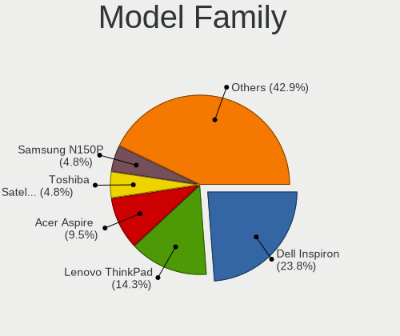
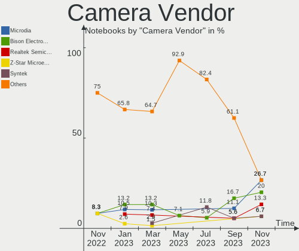

helloSystem - Hardware Trends (Notebooks)
-----------------------------------------

A project to identify most popular hardware characteristics and track their change
over time based on data collected by BSD users at https://BSD-Hardware.info.

Anyone can contribute to this report by the [hw-probe](https://github.com/linuxhw/hw-probe/blob/master/INSTALL.BSD.md) tool:

    hw-probe -all -upload

This report is for one last month. Overall report since the beginning of time: [TestCoverage](https://github.com/bsdhw/TestCoverage)

Period: Oct, 2022.

Contents
--------

* [ System ](#system)
  - [ OS                       ](#os)
  - [ OS Family                ](#os-family)
  - [ Arch                     ](#arch)
  - [ DE                       ](#de)
  - [ Display Server           ](#display-server)
  - [ Display Manager          ](#display-manager)
  - [ OS Lang                  ](#os-lang)
  - [ Boot Mode                ](#boot-mode)
  - [ Filesystem               ](#filesystem)
  - [ Part. scheme             ](#part-scheme)

* [ Board ](#board)
  - [ Vendor                   ](#vendor)
  - [ Model                    ](#model)
  - [ Model Family             ](#model-family)
  - [ MFG Year                 ](#mfg-year)
  - [ Form Factor              ](#form-factor)
  - [ Coreboot                 ](#coreboot)
  - [ RAM Size                 ](#ram-size)
  - [ RAM Used                 ](#ram-used)
  - [ Total Drives             ](#total-drives)
  - [ Has CD-ROM               ](#has-cd-rom)
  - [ Has Ethernet             ](#has-ethernet)
  - [ Has WiFi                 ](#has-wifi)
  - [ Has Bluetooth            ](#has-bluetooth)

* [ Location ](#location)
  - [ Country                  ](#country)
  - [ City                     ](#city)

* [ Drives ](#drives)
  - [ Drive Vendor             ](#drive-vendor)
  - [ Drive Model              ](#drive-model)
  - [ HDD Vendor               ](#hdd-vendor)
  - [ SSD Vendor               ](#ssd-vendor)
  - [ Drive Kind               ](#drive-kind)
  - [ Drive Connector          ](#drive-connector)
  - [ Drive Size               ](#drive-size)
  - [ Space Total              ](#space-total)
  - [ Space Used               ](#space-used)
  - [ Malfunc. Drives          ](#malfunc-drives)
  - [ Malfunc. Drive Vendor    ](#malfunc-drive-vendor)
  - [ Malfunc. HDD Vendor      ](#malfunc-hdd-vendor)
  - [ Malfunc. Drive Kind      ](#malfunc-drive-kind)
  - [ Failed Drives            ](#failed-drives)
  - [ Failed Drive Vendor      ](#failed-drive-vendor)
  - [ Drive Status             ](#drive-status)

* [ Storage controller ](#storage-controller)
  - [ Storage Vendor           ](#storage-vendor)
  - [ Storage Model            ](#storage-model)
  - [ Storage Kind             ](#storage-kind)

* [ Processor ](#processor)
  - [ CPU Vendor               ](#cpu-vendor)
  - [ CPU Model                ](#cpu-model)
  - [ CPU Model Family         ](#cpu-model-family)
  - [ CPU Cores                ](#cpu-cores)
  - [ CPU Sockets              ](#cpu-sockets)
  - [ CPU Threads              ](#cpu-threads)
  - [ CPU Microarch            ](#cpu-microarch)

* [ Graphics ](#graphics)
  - [ GPU Vendor               ](#gpu-vendor)
  - [ GPU Model                ](#gpu-model)
  - [ GPU Combo                ](#gpu-combo)
  - [ GPU Driver               ](#gpu-driver)
  - [ GPU Memory               ](#gpu-memory)

* [ Monitor ](#monitor)
  - [ Monitor Vendor           ](#monitor-vendor)
  - [ Monitor Model            ](#monitor-model)
  - [ Monitor Resolution       ](#monitor-resolution)
  - [ Monitor Diagonal         ](#monitor-diagonal)
  - [ Monitor Width            ](#monitor-width)
  - [ Aspect Ratio             ](#aspect-ratio)
  - [ Monitor Area             ](#monitor-area)
  - [ Pixel Density            ](#pixel-density)
  - [ Multiple Monitors        ](#multiple-monitors)

* [ Network ](#network)
  - [ Net Controller Vendor    ](#net-controller-vendor)
  - [ Net Controller Model     ](#net-controller-model)
  - [ Wireless Vendor          ](#wireless-vendor)
  - [ Wireless Model           ](#wireless-model)
  - [ Ethernet Vendor          ](#ethernet-vendor)
  - [ Ethernet Model           ](#ethernet-model)
  - [ Net Controller Kind      ](#net-controller-kind)
  - [ Used Controller          ](#used-controller)
  - [ NICs                     ](#nics)
  - [ IPv6                     ](#ipv6)

* [ Bluetooth ](#bluetooth)
  - [ Bluetooth Vendor         ](#bluetooth-vendor)
  - [ Bluetooth Model          ](#bluetooth-model)

* [ Sound ](#sound)
  - [ Sound Vendor             ](#sound-vendor)
  - [ Sound Model              ](#sound-model)

* [ Memory ](#memory)
  - [ Memory Vendor            ](#memory-vendor)
  - [ Memory Model             ](#memory-model)
  - [ Memory Kind              ](#memory-kind)
  - [ Memory Form Factor       ](#memory-form-factor)
  - [ Memory Size              ](#memory-size)
  - [ Memory Speed             ](#memory-speed)

* [ Printers & scanners ](#printers--scanners)
  - [ Printer Vendor           ](#printer-vendor)
  - [ Printer Model            ](#printer-model)
  - [ Scanner Vendor           ](#scanner-vendor)
  - [ Scanner Model            ](#scanner-model)

* [ Camera ](#camera)
  - [ Camera Vendor            ](#camera-vendor)
  - [ Camera Model             ](#camera-model)

* [ Security ](#security)
  - [ Fingerprint Vendor       ](#fingerprint-vendor)
  - [ Fingerprint Model        ](#fingerprint-model)
  - [ Chipcard Vendor          ](#chipcard-vendor)
  - [ Chipcard Model           ](#chipcard-model)

* [ Unsupported ](#unsupported)
  - [ Unsupported Devices      ](#unsupported-devices)
  - [ Unsupported Device Types ](#unsupported-device-types)

System
------

OS
--

Installed operating systems

| Name              | Notebooks | Percent |
|-------------------|-----------|---------|
| helloSystem 0.7.0 | 15        | 78.95%  |
| helloSystem 0.8.0 | 4         | 21.05%  |

OS Family
---------

OS without a version

| Name        | Notebooks | Percent |
|-------------|-----------|---------|
| helloSystem | 19        | 100%    |

Arch
----

OS architecture (x86_64, i586, etc.)

| Name  | Notebooks | Percent |
|-------|-----------|---------|
| amd64 | 19        | 100%    |

DE
--

Desktop Environment

| Name         | Notebooks | Percent |
|--------------|-----------|---------|
| helloDesktop | 19        | 100%    |

Display Server
--------------

X11 or Wayland

| Name | Notebooks | Percent |
|------|-----------|---------|
| X11  | 19        | 100%    |

Display Manager
---------------

SDDM, LightDM, etc.

| Name | Notebooks | Percent |
|------|-----------|---------|
| SLiM | 19        | 100%    |

OS Lang
-------

Language

| Lang  | Notebooks | Percent |
|-------|-----------|---------|
| en_US | 19        | 100%    |

Boot Mode
---------

EFI or BIOS

| Mode | Notebooks | Percent |
|------|-----------|---------|
| EFI  | 19        | 100%    |

Filesystem
----------

Type of filesystem

| Type   | Notebooks | Percent |
|--------|-----------|---------|
| Zfs    | 12        | 63.16%  |
| Cd9660 | 7         | 36.84%  |

Part. scheme
------------

Scheme of partitioning

| Type | Notebooks | Percent |
|------|-----------|---------|
| GPT  | 19        | 100%    |

Board
-----

Vendor
------

Motherboard manufacturer

| Name                | Notebooks | Percent |
|---------------------|-----------|---------|
| Lenovo              | 5         | 26.32%  |
| Hewlett-Packard     | 4         | 21.05%  |
| Acer                | 3         | 15.79%  |
| TUXEDO              | 1         | 5.26%   |
| Samsung Electronics | 1         | 5.26%   |
| MSI                 | 1         | 5.26%   |
| Google              | 1         | 5.26%   |
| Fujitsu             | 1         | 5.26%   |
| Dell                | 1         | 5.26%   |
| Apple               | 1         | 5.26%   |

Model
-----

Motherboard model

| Name                           | Notebooks | Percent |
|--------------------------------|-----------|---------|
| TUXEDO Aura 15 Gen1            | 1         | 5.26%   |
| Samsung Q430/Q530              | 1         | 5.26%   |
| MSI PS63 Modern 8M             | 1         | 5.26%   |
| Lenovo ThinkPad W530 24491A0   | 1         | 5.26%   |
| Lenovo ThinkPad T61 765912G    | 1         | 5.26%   |
| Lenovo ThinkPad E15 2ORES4XJ00 | 1         | 5.26%   |
| Lenovo IdeaPad 3 15ADA05 81W1  | 1         | 5.26%   |
| Lenovo G500 20236              | 1         | 5.26%   |
| HP SpectreXT Pro 13-b000 PC    | 1         | 5.26%   |
| HP ProBook 4540s               | 1         | 5.26%   |
| HP Pavilion g6                 | 1         | 5.26%   |
| HP Laptop 15q-bu0xx            | 1         | 5.26%   |
| Google Edgar                   | 1         | 5.26%   |
| Fujitsu LIFEBOOK U904          | 1         | 5.26%   |
| Dell Latitude E6420            | 1         | 5.26%   |
| Apple MacBook4,1               | 1         | 5.26%   |
| Acer Aspire F5-573             | 1         | 5.26%   |
| Acer Aspire E5-722G            | 1         | 5.26%   |
| Acer Aspire 5336               | 1         | 5.26%   |

Model Family
------------

Motherboard model prefix

| Name             | Notebooks | Percent |
|------------------|-----------|---------|
| Lenovo ThinkPad  | 3         | 15.79%  |
| Acer Aspire      | 3         | 15.79%  |
| TUXEDO Aura      | 1         | 5.26%   |
| Samsung Q430     | 1         | 5.26%   |
| MSI PS63         | 1         | 5.26%   |
| Lenovo IdeaPad   | 1         | 5.26%   |
| Lenovo G500      | 1         | 5.26%   |
| HP SpectreXT     | 1         | 5.26%   |
| HP ProBook       | 1         | 5.26%   |
| HP Pavilion      | 1         | 5.26%   |
| HP Laptop        | 1         | 5.26%   |
| Google Edgar     | 1         | 5.26%   |
| Fujitsu LIFEBOOK | 1         | 5.26%   |
| Dell Latitude    | 1         | 5.26%   |
| Apple MacBook4   | 1         | 5.26%   |

MFG Year
--------

Motherboard manufacture year

| Year | Notebooks | Percent |
|------|-----------|---------|
| 2013 | 3         | 15.79%  |
| 2020 | 2         | 10.53%  |
| 2019 | 2         | 10.53%  |
| 2012 | 2         | 10.53%  |
| 2010 | 2         | 10.53%  |
| 2022 | 1         | 5.26%   |
| 2021 | 1         | 5.26%   |
| 2017 | 1         | 5.26%   |
| 2016 | 1         | 5.26%   |
| 2014 | 1         | 5.26%   |
| 2011 | 1         | 5.26%   |
| 2008 | 1         | 5.26%   |
| 2007 | 1         | 5.26%   |

Form Factor
-----------

Physical design of the computer

| Name     | Notebooks | Percent |
|----------|-----------|---------|
| Notebook | 19        | 100%    |

Coreboot
--------

Have coreboot on board

| Used | Notebooks | Percent |
|------|-----------|---------|
| No   | 18        | 94.74%  |
| Yes  | 1         | 5.26%   |

RAM Size
--------

Total RAM memory

| Size in GB | Notebooks | Percent |
|------------|-----------|---------|
| 4.01-8.0   | 7         | 36.84%  |
| 8.01-16.0  | 6         | 31.58%  |
| 16.01-24.0 | 3         | 15.79%  |
| 32.01-64.0 | 1         | 5.26%   |
| 3.01-4.0   | 1         | 5.26%   |
| 2.01-3.0   | 1         | 5.26%   |

RAM Used
--------

Used RAM memory

| Used GB  | Notebooks | Percent |
|----------|-----------|---------|
| 0.01-0.5 | 12        | 63.16%  |
| 0.51-1.0 | 4         | 21.05%  |
| 1.01-2.0 | 2         | 10.53%  |
| 2.01-3.0 | 1         | 5.26%   |

Total Drives
------------

Number of drives on board

| Drives | Notebooks | Percent |
|--------|-----------|---------|
| 1      | 14        | 73.68%  |
| 2      | 4         | 21.05%  |
| 0      | 1         | 5.26%   |

Has CD-ROM
----------

Has CD-ROM on board

| Presented | Notebooks | Percent |
|-----------|-----------|---------|
| No        | 14        | 73.68%  |
| Yes       | 5         | 26.32%  |

Has Ethernet
------------

Has Ethernet on board

| Presented | Notebooks | Percent |
|-----------|-----------|---------|
| Yes       | 15        | 78.95%  |
| No        | 4         | 21.05%  |

Has WiFi
--------

Has WiFi module

| Presented | Notebooks | Percent |
|-----------|-----------|---------|
| Yes       | 19        | 100%    |

Has Bluetooth
-------------

Has Bluetooth module

| Presented | Notebooks | Percent |
|-----------|-----------|---------|
| Yes       | 14        | 73.68%  |
| No        | 5         | 26.32%  |

Location
--------

Country
-------

Geographic location (country)

| Country    | Notebooks | Percent |
|------------|-----------|---------|
| Russia     | 4         | 21.05%  |
| USA        | 3         | 15.79%  |
| UK         | 2         | 10.53%  |
| Spain      | 2         | 10.53%  |
| Poland     | 1         | 5.26%   |
| Mexico     | 1         | 5.26%   |
| Italy      | 1         | 5.26%   |
| India      | 1         | 5.26%   |
| Croatia    | 1         | 5.26%   |
| Costa Rica | 1         | 5.26%   |
| China      | 1         | 5.26%   |
| Brazil     | 1         | 5.26%   |

City
----

Geographic location (city)

| City                | Notebooks | Percent |
|---------------------|-----------|---------|
| Weifang             | 1         | 5.26%   |
| Tudela de Duero     | 1         | 5.26%   |
| Tsarskoye Selo      | 1         | 5.26%   |
| San José           | 1         | 5.26%   |
| Rome                | 1         | 5.26%   |
| Radom               | 1         | 5.26%   |
| Presidente Prudente | 1         | 5.26%   |
| Poreč              | 1         | 5.26%   |
| Orizaba             | 1         | 5.26%   |
| New York            | 1         | 5.26%   |
| Moscow              | 1         | 5.26%   |
| Minusinsk           | 1         | 5.26%   |
| Madrid              | 1         | 5.26%   |
| Los Angeles         | 1         | 5.26%   |
| Kogalym             | 1         | 5.26%   |
| Hillsborough        | 1         | 5.26%   |
| Dumfries            | 1         | 5.26%   |
| Camborne            | 1         | 5.26%   |
| Bengaluru           | 1         | 5.26%   |

Drives
------

Drive Vendor
------------

Hard drive vendors

| Vendor              | Notebooks | Drives | Percent |
|---------------------|-----------|--------|---------|
| Samsung Electronics | 6         | 6      | 27.27%  |
| Seagate             | 5         | 5      | 22.73%  |
| WDC                 | 2         | 2      | 9.09%   |
| Crucial             | 2         | 2      | 9.09%   |
| SPCC                | 1         | 1      | 4.55%   |
| Smartbuy            | 1         | 1      | 4.55%   |
| Kingston            | 1         | 1      | 4.55%   |
| Intenso             | 1         | 1      | 4.55%   |
| Fujitsu             | 1         | 1      | 4.55%   |
| Corsair             | 1         | 1      | 4.55%   |
| A-DATA Technology   | 1         | 1      | 4.55%   |

Drive Model
-----------

Hard drive models

| Model                              | Notebooks | Percent |
|------------------------------------|-----------|---------|
| WDC WDS120G2G0A-00JH30 120GB       | 1         | 4.55%   |
| WDC WD3200BPVT-80ZEST0 320GB       | 1         | 4.55%   |
| SPCC Solid State Disk 120GB        | 1         | 4.55%   |
| Smartbuy SSD 256GB                 | 1         | 4.55%   |
| Seagate ST9320423AS 320GB          | 1         | 4.55%   |
| Seagate ST9320325AS 320GB          | 1         | 4.55%   |
| Seagate ST1000LM035-1RK172 1TB     | 1         | 4.55%   |
| Seagate ST1000LM024 HN-M101MBB 1TB | 1         | 4.55%   |
| Seagate ST1000LM014-1EJ164 1TB     | 1         | 4.55%   |
| Samsung SSD 980 1TB                | 1         | 4.55%   |
| Samsung SSD 860 EVO 250GB          | 1         | 4.55%   |
| Samsung MZNTY128HDHP-00000 128GB   | 1         | 4.55%   |
| Samsung MZMPC128HBFU-000H1 128GB   | 1         | 4.55%   |
| Samsung MZMPA128HMFU-000H1 128GB   | 1         | 4.55%   |
| Samsung MZ7LN128HCHP-00000 128GB   | 1         | 4.55%   |
| Kingston SUV400S37480G 480GB       | 1         | 4.55%   |
| Intenso JAJMS600M1TB               | 1         | 4.55%   |
| Fujitsu MHY2200BH 200GB            | 1         | 4.55%   |
| Crucial CT525MX300SSD1 528GB       | 1         | 4.55%   |
| Crucial CT480BX500SSD1 480GB       | 1         | 4.55%   |
| Corsair Force LS SSD 240GB         | 1         | 4.55%   |
| A-DATA SX6000LNP 512GB             | 1         | 4.55%   |

HDD Vendor
----------

Hard disk drive vendors

| Vendor  | Notebooks | Drives | Percent |
|---------|-----------|--------|---------|
| Seagate | 5         | 5      | 71.43%  |
| WDC     | 1         | 1      | 14.29%  |
| Fujitsu | 1         | 1      | 14.29%  |

SSD Vendor
----------

Solid state drive vendors

| Vendor              | Notebooks | Drives | Percent |
|---------------------|-----------|--------|---------|
| Samsung Electronics | 5         | 5      | 38.46%  |
| Crucial             | 2         | 2      | 15.38%  |
| WDC                 | 1         | 1      | 7.69%   |
| SPCC                | 1         | 1      | 7.69%   |
| Smartbuy            | 1         | 1      | 7.69%   |
| Kingston            | 1         | 1      | 7.69%   |
| Intenso             | 1         | 1      | 7.69%   |
| Corsair             | 1         | 1      | 7.69%   |

Drive Kind
----------

HDD or SSD

| Kind | Notebooks | Drives | Percent |
|------|-----------|--------|---------|
| SSD  | 12        | 13     | 57.14%  |
| HDD  | 7         | 7      | 33.33%  |
| NVMe | 2         | 2      | 9.52%   |

Drive Connector
---------------

SATA, SAS, NVMe, etc.

| Type | Notebooks | Drives | Percent |
|------|-----------|--------|---------|
| SATA | 17        | 20     | 89.47%  |
| NVMe | 2         | 2      | 10.53%  |

Drive Size
----------

Size of hard drive

| Size in TB | Notebooks | Drives | Percent |
|------------|-----------|--------|---------|
| 0.01-0.5   | 14        | 15     | 73.68%  |
| 0.51-1.0   | 4         | 4      | 21.05%  |
| 1.01-2.0   | 1         | 1      | 5.26%   |

Space Total
-----------

Amount of disk space available on the file system

| Size in GB | Notebooks | Percent |
|------------|-----------|---------|
| 101-250    | 7         | 36.84%  |
| 1-20       | 5         | 26.32%  |
| 251-500    | 4         | 21.05%  |
| 501-1000   | 2         | 10.53%  |
| Unknown    | 1         | 5.26%   |

Space Used
----------

Amount of used disk space

| Used GB | Notebooks | Percent |
|---------|-----------|---------|
| 1-20    | 18        | 94.74%  |
| Unknown | 1         | 5.26%   |

Malfunc. Drives
---------------

Drive models with a malfunction

| Model                                        | Notebooks | Drives | Percent |
|----------------------------------------------|-----------|--------|---------|
| WDC WD3200BPVT-80ZEST0 320GB                 | 1         | 1      | 16.67%  |
| Seagate ST9320325AS 320GB                    | 1         | 1      | 16.67%  |
| Seagate ST1000LM024 HN-M101MBB 1TB           | 1         | 1      | 16.67%  |
| Seagate ST1000LM014-1EJ164 1TB               | 1         | 1      | 16.67%  |
| Samsung Electronics MZMPA128HMFU-000H1 128GB | 1         | 1      | 16.67%  |
| Corsair Force LS SSD 240GB                   | 1         | 1      | 16.67%  |

Malfunc. Drive Vendor
---------------------

Vendors of faulty drives

| Vendor              | Notebooks | Drives | Percent |
|---------------------|-----------|--------|---------|
| Seagate             | 3         | 3      | 50%     |
| WDC                 | 1         | 1      | 16.67%  |
| Samsung Electronics | 1         | 1      | 16.67%  |
| Corsair             | 1         | 1      | 16.67%  |

Malfunc. HDD Vendor
-------------------

Vendors of faulty HDD drives

| Vendor  | Notebooks | Drives | Percent |
|---------|-----------|--------|---------|
| Seagate | 3         | 3      | 75%     |
| WDC     | 1         | 1      | 25%     |

Malfunc. Drive Kind
-------------------

Kinds of faulty drives

| Kind | Notebooks | Drives | Percent |
|------|-----------|--------|---------|
| HDD  | 4         | 4      | 66.67%  |
| SSD  | 2         | 2      | 33.33%  |

Failed Drives
-------------

Failed drive models

Zero info for selected period =(

Failed Drive Vendor
-------------------

Failed drive vendors

Zero info for selected period =(

Drive Status
------------

Number of failed and malfunc. drives

| Status  | Notebooks | Drives | Percent |
|---------|-----------|--------|---------|
| Works   | 14        | 16     | 73.68%  |
| Malfunc | 5         | 6      | 26.32%  |

Storage controller
------------------

Storage Vendor
--------------

Storage controller vendors

| Vendor                | Notebooks | Percent |
|-----------------------|-----------|---------|
| Intel                 | 14        | 73.68%  |
| AMD                   | 3         | 15.79%  |
| Samsung Electronics   | 1         | 5.26%   |
| Realtek Semiconductor | 1         | 5.26%   |

Storage Model
-------------

Storage controller models

| Model                                                                        | Notebooks | Percent |
|------------------------------------------------------------------------------|-----------|---------|
| Intel 7 Series Chipset Family 6-port SATA Controller [AHCI mode]             | 3         | 13.64%  |
| AMD FCH SATA Controller [AHCI mode]                                          | 3         | 13.64%  |
| Intel Sunrise Point-LP SATA Controller [AHCI mode]                           | 2         | 9.09%   |
| Intel 82801HM/HEM (ICH8M/ICH8M-E) SATA Controller [AHCI mode]                | 2         | 9.09%   |
| Intel 82801HM/HEM (ICH8M/ICH8M-E) IDE Controller                             | 2         | 9.09%   |
| Samsung NVMe SSD Controller 980                                              | 1         | 4.55%   |
| Intel Comet Lake SATA AHCI Controller                                        | 1         | 4.55%   |
| Intel Cannon Point-LP SATA Controller [AHCI Mode]                            | 1         | 4.55%   |
| Intel 82801IBM/IEM (ICH9M/ICH9M-E) 4 port SATA Controller [AHCI mode]        | 1         | 4.55%   |
| Intel 8 Series SATA Controller 1 [AHCI mode]                                 | 1         | 4.55%   |
| Intel 7 Series Chipset Family 4-port SATA Controller [IDE mode]              | 1         | 4.55%   |
| Intel 7 Series Chipset Family 2-port SATA Controller [IDE mode]              | 1         | 4.55%   |
| Intel 6 Series/C200 Series Chipset Family 6 port Mobile SATA AHCI Controller | 1         | 4.55%   |
| Intel 5 Series/3400 Series Chipset 4 port SATA AHCI Controller               | 1         | 4.55%   |
| Unknown                                                                      | 1         | 4.55%   |

Storage Kind
------------

Kind of storage controller (IDE, SATA, NVMe, SAS, ...)

| Kind | Notebooks | Percent |
|------|-----------|---------|
| SATA | 16        | 76.19%  |
| IDE  | 3         | 14.29%  |
| NVMe | 2         | 9.52%   |

Processor
---------

CPU Vendor
----------

Processor vendors

| Vendor | Notebooks | Percent |
|--------|-----------|---------|
| Intel  | 15        | 78.95%  |
| AMD    | 4         | 21.05%  |

CPU Model
---------

Processor models

| Model                                       | Notebooks | Percent |
|---------------------------------------------|-----------|---------|
| Intel Genuine CPU                           | 1         | 5.26%   |
| Intel Core i7-8565U CPU @ 1.80GHz           | 1         | 5.26%   |
| Intel Core i7-4600U CPU @ 2.10GHz           | 1         | 5.26%   |
| Intel Core i7-3740QM CPU @ 2.70GHz          | 1         | 5.26%   |
| Intel Core i7-3612QM CPU @ 2.10GHz          | 1         | 5.26%   |
| Intel Core i7-2620M CPU @ 2.70GH            | 1         | 5.26%   |
| Intel Core i7-10510U CPU @ 1.80GHz          | 1         | 5.26%   |
| Intel Core i5-7200U CPU @ 2.50GHz           | 1         | 5.26%   |
| Intel Core i5-3317U CPU @ 1.70GHz           | 1         | 5.26%   |
| Intel Core i3-6006U CPU @ 2.00GHz           | 1         | 5.26%   |
| Intel Core i3-3110M CPU @ 2.40GHz           | 1         | 5.26%   |
| Intel Core 2 Duo CPU T8100 @ 2.10GHz        | 1         | 5.26%   |
| Intel Core 2 Duo CPU T7300 @ 2.00GHz        | 1         | 5.26%   |
| Intel Celeron Dual-Core CPU T3500 @ 2.10GHz | 1         | 5.26%   |
| Intel Celeron CPU N3160 @ 1.60GHz           | 1         | 5.26%   |
| AMD Ryzen 7 4700U with Radeon Graphics      | 1         | 5.26%   |
| AMD A8-4500M APU with Radeon HD Graphics    | 1         | 5.26%   |
| AMD A6-7310 APU with AMD Radeon R4 Graphics | 1         | 5.26%   |
| AMD 3020e with Radeon Graphics              | 1         | 5.26%   |

CPU Model Family
----------------

Processor model prefix

| Model                   | Notebooks | Percent |
|-------------------------|-----------|---------|
| Intel Core i7           | 6         | 31.58%  |
| Intel Core i5           | 2         | 10.53%  |
| Intel Core i3           | 2         | 10.53%  |
| Intel Core 2 Duo        | 2         | 10.53%  |
| Other                   | 1         | 5.26%   |
| Intel Genuine           | 1         | 5.26%   |
| Intel Celeron Dual-Core | 1         | 5.26%   |
| Intel Celeron           | 1         | 5.26%   |
| AMD Ryzen 7             | 1         | 5.26%   |
| AMD A8                  | 1         | 5.26%   |
| AMD A6                  | 1         | 5.26%   |

CPU Cores
---------

Number of processor cores

| Number  | Notebooks | Percent |
|---------|-----------|---------|
| 2       | 8         | 42.11%  |
| 4       | 7         | 36.84%  |
| Unknown | 3         | 15.79%  |
| 8       | 1         | 5.26%   |

CPU Sockets
-----------

Number of sockets

| Number | Notebooks | Percent |
|--------|-----------|---------|
| 1      | 18        | 94.74%  |
| 2      | 1         | 5.26%   |

CPU Threads
-----------

Threads per core (Hyper-Threading)

| Number  | Notebooks | Percent |
|---------|-----------|---------|
| 2       | 11        | 57.89%  |
| 1       | 5         | 26.32%  |
| Unknown | 3         | 15.79%  |

CPU Microarch
-------------

Microarchitecture

| Name        | Notebooks | Percent |
|-------------|-----------|---------|
| IvyBridge   | 4         | 21.05%  |
| KabyLake    | 3         | 15.79%  |
| Penryn      | 2         | 10.53%  |
| Zen 2       | 1         | 5.26%   |
| Zen         | 1         | 5.26%   |
| Westmere    | 1         | 5.26%   |
| Skylake     | 1         | 5.26%   |
| Silvermont  | 1         | 5.26%   |
| SandyBridge | 1         | 5.26%   |
| Puma        | 1         | 5.26%   |
| Piledriver  | 1         | 5.26%   |
| Haswell     | 1         | 5.26%   |
| Core        | 1         | 5.26%   |

Graphics
--------

GPU Vendor
----------

Vendors of graphics cards

| Vendor | Notebooks | Percent |
|--------|-----------|---------|
| Intel  | 14        | 70%     |
| AMD    | 4         | 20%     |
| Nvidia | 2         | 10%     |

GPU Model
---------

Graphics card models

| Model                                                                                    | Notebooks | Percent |
|------------------------------------------------------------------------------------------|-----------|---------|
| Intel 3rd Gen Core processor Graphics Controller                                         | 4         | 17.39%  |
| Intel Mobile GM965/GL960 Integrated Graphics Controller (secondary)                      | 2         | 8.7%    |
| Intel Mobile GM965/GL960 Integrated Graphics Controller (primary)                        | 2         | 8.7%    |
| Nvidia GT218M [GeForce 310M]                                                             | 1         | 4.35%   |
| Nvidia GK107GLM [Quadro K1000M]                                                          | 1         | 4.35%   |
| Intel WhiskeyLake-U GT2 [UHD Graphics 620]                                               | 1         | 4.35%   |
| Intel Skylake GT2 [HD Graphics 520]                                                      | 1         | 4.35%   |
| Intel Mobile 4 Series Chipset Integrated Graphics Controller                             | 1         | 4.35%   |
| Intel HD Graphics 620                                                                    | 1         | 4.35%   |
| Intel Haswell-ULT Integrated Graphics Controller                                         | 1         | 4.35%   |
| Intel CometLake-U GT2 [UHD Graphics]                                                     | 1         | 4.35%   |
| Intel Atom/Celeron/Pentium Processor x5-E8000/J3xxx/N3xxx Integrated Graphics Controller | 1         | 4.35%   |
| Intel 2nd Generation Core Processor Family Integrated Graphics Controller                | 1         | 4.35%   |
| AMD Trinity [Radeon HD 7640G]                                                            | 1         | 4.35%   |
| AMD Sun XT [Radeon HD 8670A/8670M/8690M / R5 M330 / M430 / Radeon 520 Mobile]            | 1         | 4.35%   |
| AMD Renoir                                                                               | 1         | 4.35%   |
| AMD Picasso/Raven 2 [Radeon Vega Series / Radeon Vega Mobile Series]                     | 1         | 4.35%   |
| AMD Mullins [Radeon R4/R5 Graphics]                                                      | 1         | 4.35%   |

GPU Combo
---------

Combinations of graphics cards

| Name           | Notebooks | Percent |
|----------------|-----------|---------|
| 1 x Intel      | 10        | 52.63%  |
| 2 x Intel      | 3         | 15.79%  |
| 1 x AMD        | 3         | 15.79%  |
| 2 x AMD        | 1         | 5.26%   |
| 1 x Nvidia     | 1         | 5.26%   |
| Intel + Nvidia | 1         | 5.26%   |

GPU Driver
----------

Free vs proprietary

| Driver      | Notebooks | Percent |
|-------------|-----------|---------|
| Free        | 18        | 94.74%  |
| Proprietary | 1         | 5.26%   |

GPU Memory
----------

Total video memory

| Size in GB | Notebooks | Percent |
|------------|-----------|---------|
| Unknown    | 14        | 73.68%  |
| 0.01-0.5   | 3         | 15.79%  |
| 1.01-2.0   | 1         | 5.26%   |
| 0.51-1.0   | 1         | 5.26%   |

Monitor
-------

Monitor Vendor
--------------

Monitor vendors

| Vendor                  | Notebooks | Percent |
|-------------------------|-----------|---------|
| AU Optronics            | 5         | 26.32%  |
| Chimei Innolux          | 4         | 21.05%  |
| Samsung Electronics     | 3         | 15.79%  |
| LG Display              | 2         | 10.53%  |
| Sharp                   | 1         | 5.26%   |
| Lenovo                  | 1         | 5.26%   |
| Chi Mei Optoelectronics | 1         | 5.26%   |
| BOE                     | 1         | 5.26%   |
| Apple                   | 1         | 5.26%   |

Monitor Model
-------------

Monitor models

| Model                                                                    | Notebooks | Percent |
|--------------------------------------------------------------------------|-----------|---------|
| Sharp LQ140Z1JW01 SHP1401 3200x1800 310x170mm 13.9-inch                  | 1         | 5.26%   |
| Samsung Electronics LCD Monitor SEC5441 1366x768 300x170mm 13.6-inch     | 1         | 5.26%   |
| Samsung Electronics LCD Monitor SEC3245 1366x768 340x190mm 15.3-inch     | 1         | 5.26%   |
| Samsung Electronics LCD Monitor SDC4752 1366x768 340x190mm 15.3-inch     | 1         | 5.26%   |
| LG Display LCD Monitor LGD0384 1366x768 340x190mm 15.3-inch              | 1         | 5.26%   |
| LG Display LCD Monitor LGD0368 1366x768 310x170mm 13.9-inch              | 1         | 5.26%   |
| Lenovo LCD Monitor LEN4031 1280x800 300x190mm 14.0-inch                  | 1         | 5.26%   |
| Chimei Innolux LCD Monitor CMN1734 1600x900 380x210mm 17.1-inch          | 1         | 5.26%   |
| Chimei Innolux LCD Monitor CMN15E8 1920x1080 340x190mm 15.3-inch         | 1         | 5.26%   |
| Chimei Innolux LCD Monitor CMN15E6 1366x768 340x190mm 15.3-inch          | 1         | 5.26%   |
| Chimei Innolux LCD Monitor CMN15D7 1920x1080 340x190mm 15.3-inch         | 1         | 5.26%   |
| Chi Mei Optoelectronics LCD Monitor CMO15A1 1366x768 340x190mm 15.3-inch | 1         | 5.26%   |
| BOE LCD Monitor BOE0864 1920x1080 340x190mm 15.3-inch                    | 1         | 5.26%   |
| AU Optronics LCD Monitor AUO70EC 1366x768 340x190mm 15.3-inch            | 1         | 5.26%   |
| AU Optronics LCD Monitor AUO48EC 1366x768 340x190mm 15.3-inch            | 1         | 5.26%   |
| AU Optronics LCD Monitor AUO213D 1920x1080 310x170mm 13.9-inch           | 1         | 5.26%   |
| AU Optronics LCD Monitor AUO12EC 1366x768 340x190mm 15.3-inch            | 1         | 5.26%   |
| AU Optronics LCD Monitor AUO11ED 1920x1080 340x190mm 15.3-inch           | 1         | 5.26%   |
| Apple Color LCD APP9C5E 1280x800 290x190mm 13.6-inch                     | 1         | 5.26%   |

Monitor Resolution
------------------

Monitor screen resolution

| Resolution       | Notebooks | Percent |
|------------------|-----------|---------|
| 1366x768 (WXGA)  | 10        | 52.63%  |
| 1920x1080 (FHD)  | 5         | 26.32%  |
| 1280x800 (WXGA)  | 2         | 10.53%  |
| 3200x1800 (QHD+) | 1         | 5.26%   |
| 1600x900 (HD+)   | 1         | 5.26%   |

Monitor Diagonal
----------------

Diagonal size in inches

| Inches | Notebooks | Percent |
|--------|-----------|---------|
| 15     | 13        | 68.42%  |
| 13     | 4         | 21.05%  |
| 17     | 1         | 5.26%   |
| 14     | 1         | 5.26%   |

Monitor Width
-------------

Physical width

| Width in mm | Notebooks | Percent |
|-------------|-----------|---------|
| 301-350     | 16        | 84.21%  |
| 201-300     | 2         | 10.53%  |
| 351-400     | 1         | 5.26%   |

Aspect Ratio
------------

Proportional relationship between the width and the height

| Ratio | Notebooks | Percent |
|-------|-----------|---------|
| 16/9  | 16        | 84.21%  |
| 16/10 | 2         | 10.53%  |
| 3/2   | 1         | 5.26%   |

Monitor Area
------------

Area in inch²

| Area in inch² | Notebooks | Percent |
|----------------|-----------|---------|
| 91-100         | 12        | 63.16%  |
| 81-90          | 5         | 26.32%  |
| 121-130        | 1         | 5.26%   |
| 101-110        | 1         | 5.26%   |

Pixel Density
-------------

Pixels per inch

| Density       | Notebooks | Percent |
|---------------|-----------|---------|
| 101-120       | 12        | 63.16%  |
| 121-160       | 5         | 26.32%  |
| More than 240 | 1         | 5.26%   |
| 51-100        | 1         | 5.26%   |

Multiple Monitors
-----------------

Total monitors connected

| Total | Notebooks | Percent |
|-------|-----------|---------|
| 1     | 18        | 94.74%  |
| 2     | 1         | 5.26%   |

Network
-------

Net Controller Vendor
---------------------

Controller vendors

| Vendor                   | Notebooks | Percent |
|--------------------------|-----------|---------|
| Intel                    | 10        | 33.33%  |
| Realtek Semiconductor    | 7         | 23.33%  |
| Qualcomm Atheros         | 6         | 20%     |
| Marvell Technology Group | 2         | 6.67%   |
| Broadcom                 | 2         | 6.67%   |
| Sierra Wireless          | 1         | 3.33%   |
| Ralink Technology        | 1         | 3.33%   |
| Ralink                   | 1         | 3.33%   |

Net Controller Model
--------------------

Controller models

| Model                                                             | Notebooks | Percent |
|-------------------------------------------------------------------|-----------|---------|
| Realtek RTL8111/8168/8411 PCI Express Gigabit Ethernet Controller | 6         | 16.22%  |
| Qualcomm Atheros QCA9565 / AR9565 Wireless Network Adapter        | 2         | 5.41%   |
| Intel Wireless 7260                                               | 2         | 5.41%   |
| Intel 82579LM Gigabit Network Connection (Lewisville)             | 2         | 5.41%   |
| Sierra Wireless EM7305 Modem                                      | 1         | 2.7%    |
| Realtek RTL8822CE 802.11ac PCIe Wireless Network Adapter          | 1         | 2.7%    |
| Realtek RTL8723DE Wireless Network Adapter                        | 1         | 2.7%    |
| Realtek RTL810xE PCI Express Fast Ethernet controller             | 1         | 2.7%    |
| Realtek Realtek Bluetooth 4.2 Adapter                             | 1         | 2.7%    |
| Ralink RT5370 Wireless Adapter                                    | 1         | 2.7%    |
| Ralink RT3290 Wireless 802.11n 1T/1R PCIe                         | 1         | 2.7%    |
| Qualcomm Atheros QCA8172 Fast Ethernet                            | 1         | 2.7%    |
| Qualcomm Atheros QCA6174 802.11ac Wireless Network Adapter        | 1         | 2.7%    |
| Qualcomm Atheros AR9485 Wireless Network Adapter                  | 1         | 2.7%    |
| Qualcomm Atheros AR9285 Wireless Network Adapter (PCI-Express)    | 1         | 2.7%    |
| Marvell Group 88E8058 PCI-E Gigabit Ethernet Controller           | 1         | 2.7%    |
| Marvell Group 88E8040 PCI-E Fast Ethernet Controller              | 1         | 2.7%    |
| Intel Wireless 7265                                               | 1         | 2.7%    |
| Intel Wi-Fi 6 AX200                                               | 1         | 2.7%    |
| Intel Ultimate N WiFi Link 5300                                   | 1         | 2.7%    |
| Intel PRO/Wireless 4965 AG or AGN [Kedron] Network Connection     | 1         | 2.7%    |
| Intel Ethernet Connection I218-LM                                 | 1         | 2.7%    |
| Intel Centrino Wireless-N 135                                     | 1         | 2.7%    |
| Intel Centrino Advanced-N 6235                                    | 1         | 2.7%    |
| Intel Centrino Advanced-N 6205 [Taylor Peak]                      | 1         | 2.7%    |
| Intel Cannon Point-LP CNVi [Wireless-AC]                          | 1         | 2.7%    |
| Intel 82566MM Gigabit Network Connection                          | 1         | 2.7%    |
| Broadcom NetLink BCM57780 Gigabit Ethernet PCIe                   | 1         | 2.7%    |
| Broadcom BCM4321 802.11a/b/g/n                                    | 1         | 2.7%    |

Wireless Vendor
---------------

Wireless vendors

| Vendor                | Notebooks | Percent |
|-----------------------|-----------|---------|
| Intel                 | 10        | 50%     |
| Qualcomm Atheros      | 5         | 25%     |
| Realtek Semiconductor | 2         | 10%     |
| Ralink Technology     | 1         | 5%      |
| Ralink                | 1         | 5%      |
| Broadcom              | 1         | 5%      |

Wireless Model
--------------

Wireless models

| Model                                                          | Notebooks | Percent |
|----------------------------------------------------------------|-----------|---------|
| Qualcomm Atheros QCA9565 / AR9565 Wireless Network Adapter     | 2         | 9.52%   |
| Intel Wireless 7260                                            | 2         | 9.52%   |
| Realtek RTL8822CE 802.11ac PCIe Wireless Network Adapter       | 1         | 4.76%   |
| Realtek RTL8723DE Wireless Network Adapter                     | 1         | 4.76%   |
| Realtek Realtek Bluetooth 4.2 Adapter                          | 1         | 4.76%   |
| Ralink RT5370 Wireless Adapter                                 | 1         | 4.76%   |
| Ralink RT3290 Wireless 802.11n 1T/1R PCIe                      | 1         | 4.76%   |
| Qualcomm Atheros QCA6174 802.11ac Wireless Network Adapter     | 1         | 4.76%   |
| Qualcomm Atheros AR9485 Wireless Network Adapter               | 1         | 4.76%   |
| Qualcomm Atheros AR9285 Wireless Network Adapter (PCI-Express) | 1         | 4.76%   |
| Intel Wireless 7265                                            | 1         | 4.76%   |
| Intel Wi-Fi 6 AX200                                            | 1         | 4.76%   |
| Intel Ultimate N WiFi Link 5300                                | 1         | 4.76%   |
| Intel PRO/Wireless 4965 AG or AGN [Kedron] Network Connection  | 1         | 4.76%   |
| Intel Centrino Wireless-N 135                                  | 1         | 4.76%   |
| Intel Centrino Advanced-N 6235                                 | 1         | 4.76%   |
| Intel Centrino Advanced-N 6205 [Taylor Peak]                   | 1         | 4.76%   |
| Intel Cannon Point-LP CNVi [Wireless-AC]                       | 1         | 4.76%   |
| Broadcom BCM4321 802.11a/b/g/n                                 | 1         | 4.76%   |

Ethernet Vendor
---------------

Ethernet vendors

| Vendor                   | Notebooks | Percent |
|--------------------------|-----------|---------|
| Realtek Semiconductor    | 7         | 46.67%  |
| Intel                    | 4         | 26.67%  |
| Marvell Technology Group | 2         | 13.33%  |
| Qualcomm Atheros         | 1         | 6.67%   |
| Broadcom                 | 1         | 6.67%   |

Ethernet Model
--------------

Ethernet models

| Model                                                             | Notebooks | Percent |
|-------------------------------------------------------------------|-----------|---------|
| Realtek RTL8111/8168/8411 PCI Express Gigabit Ethernet Controller | 6         | 40%     |
| Intel 82579LM Gigabit Network Connection (Lewisville)             | 2         | 13.33%  |
| Realtek RTL810xE PCI Express Fast Ethernet controller             | 1         | 6.67%   |
| Qualcomm Atheros QCA8172 Fast Ethernet                            | 1         | 6.67%   |
| Marvell Group 88E8058 PCI-E Gigabit Ethernet Controller           | 1         | 6.67%   |
| Marvell Group 88E8040 PCI-E Fast Ethernet Controller              | 1         | 6.67%   |
| Intel Ethernet Connection I218-LM                                 | 1         | 6.67%   |
| Intel 82566MM Gigabit Network Connection                          | 1         | 6.67%   |
| Broadcom NetLink BCM57780 Gigabit Ethernet PCIe                   | 1         | 6.67%   |

Net Controller Kind
-------------------

Ethernet, WiFi or modem

| Kind     | Notebooks | Percent |
|----------|-----------|---------|
| WiFi     | 19        | 54.29%  |
| Ethernet | 15        | 42.86%  |
| Unknown  | 1         | 2.86%   |

Used Controller
---------------

Currently used network controller

| Kind     | Notebooks | Percent |
|----------|-----------|---------|
| WiFi     | 11        | 64.71%  |
| Ethernet | 6         | 35.29%  |

NICs
----

Total network controllers on board

| Total | Notebooks | Percent |
|-------|-----------|---------|
| 2     | 15        | 78.95%  |
| 1     | 4         | 21.05%  |

IPv6
----

IPv6 vs IPv4

| Used | Notebooks | Percent |
|------|-----------|---------|
| No   | 18        | 94.74%  |
| Yes  | 1         | 5.26%   |

Bluetooth
---------

Bluetooth Vendor
----------------

Controller vendors

| Vendor                          | Notebooks | Percent |
|---------------------------------|-----------|---------|
| Intel                           | 6         | 42.86%  |
| Broadcom                        | 2         | 14.29%  |
| Realtek Semiconductor           | 1         | 7.14%   |
| Ralink                          | 1         | 7.14%   |
| Qualcomm Atheros Communications | 1         | 7.14%   |
| Lite-On Technology              | 1         | 7.14%   |
| Foxconn / Hon Hai               | 1         | 7.14%   |
| Apple                           | 1         | 7.14%   |

Bluetooth Model
---------------

Controller models

| Model                                            | Notebooks | Percent |
|--------------------------------------------------|-----------|---------|
| Intel Bluetooth wireless interface               | 3         | 21.43%  |
| Intel Centrino Bluetooth Wireless Transceiver    | 2         | 14.29%  |
| Realtek  Bluetooth Adapter                       | 1         | 7.14%   |
| Ralink RT3290 Bluetooth                          | 1         | 7.14%   |
| Qualcomm Atheros QCA61x4 Bluetooth 4.0           | 1         | 7.14%   |
| Lite-On Qualcomm Atheros Bluetooth               | 1         | 7.14%   |
| Intel Bluetooth 9460/9560 Jefferson Peak (JfP)   | 1         | 7.14%   |
| Foxconn / Hon Hai Qualcomm Atheros Bluetooth 4.0 | 1         | 7.14%   |
| Broadcom BCM20702 Bluetooth 4.0 [ThinkPad]       | 1         | 7.14%   |
| Broadcom BCM2045B (BDC-2) [Bluetooth Controller] | 1         | 7.14%   |
| Apple Built-in iSight (no firmware loaded)       | 1         | 7.14%   |

Sound
-----

Sound Vendor
------------

Sound card vendors

| Vendor | Notebooks | Percent |
|--------|-----------|---------|
| Intel  | 15        | 75%     |
| AMD    | 4         | 20%     |
| Nvidia | 1         | 5%      |

Sound Model
-----------

Sound card models

| Model                                                                                             | Notebooks | Percent |
|---------------------------------------------------------------------------------------------------|-----------|---------|
| Intel 7 Series/C216 Chipset Family High Definition Audio Controller                               | 4         | 16%     |
| Intel Sunrise Point-LP HD Audio                                                                   | 2         | 8%      |
| Intel 82801H (ICH8 Family) HD Audio Controller                                                    | 2         | 8%      |
| AMD FCH Azalia Controller                                                                         | 2         | 8%      |
| AMD Family 17h/19h HD Audio Controller                                                            | 2         | 8%      |
| Nvidia High Definition Audio Controller                                                           | 1         | 4%      |
| Intel Haswell-ULT HD Audio Controller                                                             | 1         | 4%      |
| Intel Comet Lake PCH-LP cAVS                                                                      | 1         | 4%      |
| Intel Cannon Point-LP High Definition Audio Controller                                            | 1         | 4%      |
| Intel Atom/Celeron/Pentium Processor x5-E8000/J3xxx/N3xxx Series High Definition Audio Controller | 1         | 4%      |
| Intel 82801I (ICH9 Family) HD Audio Controller                                                    | 1         | 4%      |
| Intel 8 Series HD Audio Controller                                                                | 1         | 4%      |
| Intel 6 Series/C200 Series Chipset Family High Definition Audio Controller                        | 1         | 4%      |
| Intel 5 Series/3400 Series Chipset High Definition Audio                                          | 1         | 4%      |
| AMD Trinity HDMI Audio Controller                                                                 | 1         | 4%      |
| AMD Renoir Radeon High Definition Audio Controller                                                | 1         | 4%      |
| AMD Raven/Raven2/Fenghuang HDMI/DP Audio Controller                                               | 1         | 4%      |
| AMD Kabini HDMI/DP Audio                                                                          | 1         | 4%      |

Memory
------

Memory Vendor
-------------

Memory module vendors

| Vendor              | Notebooks | Percent |
|---------------------|-----------|---------|
| Samsung Electronics | 5         | 25%     |
| SK hynix            | 4         | 20%     |
| Micron Technology   | 2         | 10%     |
| Kingston            | 2         | 10%     |
| Unknown (0x0809)    | 1         | 5%      |
| Unknown             | 1         | 5%      |
| Smart               | 1         | 5%      |
| Ramaxel Technology  | 1         | 5%      |
| Crucial             | 1         | 5%      |
| A-DATA Technology   | 1         | 5%      |
| Unknown             | 1         | 5%      |

Memory Model
------------

Memory module models

| Model                                                        | Notebooks | Percent |
|--------------------------------------------------------------|-----------|---------|
| Unknown RAM Module 1GB SODIMM DDR2 667MT/s                   | 1         | 4.55%   |
| Unknown (0x0809) RAM Module 8GB SODIMM DDR3 800MT/s          | 1         | 4.55%   |
| Smart RAM SMS4TDC3C0K0446SCG 4GB SODIMM DDR4 2133MT/s        | 1         | 4.55%   |
| SK hynix RAM HMT425S6MFR6A-PB 2GB SODIMM DDR3 1600MT/s       | 1         | 4.55%   |
| SK hynix RAM HMA851S6AFR6N-UH 4GB SODIMM DDR4 2400MT/s       | 1         | 4.55%   |
| SK hynix RAM HMA81GS6CJR8N-VK 8GB SODIMM DDR4 2667MT/s       | 1         | 4.55%   |
| SK hynix RAM H9CCNNN8JTBLAR-NUD 2GB LPDDR3 1600MT/s          | 1         | 4.55%   |
| Samsung RAM Module 2GB SODIMM DDR2 667MT/s                   | 1         | 4.55%   |
| Samsung RAM Module 1GB SODIMM DDR2 667MT/s                   | 1         | 4.55%   |
| Samsung RAM M471B5773DH0-CH9 2GB SODIMM DDR3 1334MT/s        | 1         | 4.55%   |
| Samsung RAM M471B1G73QH0-YK0 8GB SODIMM DDR3 1867MT/s        | 1         | 4.55%   |
| Samsung RAM M471B1G73EB0-YK0 8GB SODIMM DDR3 1600MT/s        | 1         | 4.55%   |
| Samsung RAM M471A2K43CB1-CTD 16GB SODIMM DDR4 2667MT/s       | 1         | 4.55%   |
| Ramaxel RAM RMT3170ED58F8W1600 2GB SODIMM DDR3 1600MT/s      | 1         | 4.55%   |
| Ramaxel RAM RMT3170EB68F9W1600 4GB SODIMM DDR3 1600MT/s      | 1         | 4.55%   |
| Micron RAM Module 2GB SODIMM DDR3 1600MT/s                   | 1         | 4.55%   |
| Micron RAM 16KTF51264HZ-1G6M1 4GB SODIMM DDR3 1600MT/s       | 1         | 4.55%   |
| Kingston RAM HP16D3LS1KBGH/4G 4GB SODIMM DDR3 1333MT/s       | 1         | 4.55%   |
| Kingston RAM 9905700-047.A00G 16GB SODIMM DDR4 2667MT/s      | 1         | 4.55%   |
| Crucial RAM CT8G4SFS824A.C8FP 8GB Row Of Chips DDR4 2400MT/s | 1         | 4.55%   |
| A-DATA RAM AM1U16BC4P2-B19H 4GB SODIMM DDR3 1600MT/s         | 1         | 4.55%   |
| Unknown                                                      | 1         | 4.55%   |

Memory Kind
-----------

Memory module kinds

| Kind    | Notebooks | Percent |
|---------|-----------|---------|
| DDR3    | 8         | 44.44%  |
| DDR4    | 6         | 33.33%  |
| DDR2    | 2         | 11.11%  |
| LPDDR3  | 1         | 5.56%   |
| Unknown | 1         | 5.56%   |

Memory Form Factor
------------------

Physical design of the memory module

| Name         | Notebooks | Percent |
|--------------|-----------|---------|
| SODIMM       | 16        | 88.89%  |
| Row Of Chips | 1         | 5.56%   |
| Unknown      | 1         | 5.56%   |

Memory Size
-----------

Memory module size

| Size  | Notebooks | Percent |
|-------|-----------|---------|
| 2048  | 7         | 31.82%  |
| 4096  | 6         | 27.27%  |
| 8192  | 5         | 22.73%  |
| 16384 | 2         | 9.09%   |
| 1024  | 2         | 9.09%   |

Memory Speed
------------

Memory module speed

| Speed | Notebooks | Percent |
|-------|-----------|---------|
| 1600  | 7         | 35%     |
| 2667  | 3         | 15%     |
| 2400  | 2         | 10%     |
| 800   | 2         | 10%     |
| 667   | 2         | 10%     |
| 2133  | 1         | 5%      |
| 1867  | 1         | 5%      |
| 1334  | 1         | 5%      |
| 1333  | 1         | 5%      |

Printers & scanners
-------------------

Printer Vendor
--------------

Printer device vendors

Zero info for selected period =(

Printer Model
-------------

Printer device models

Zero info for selected period =(

Scanner Vendor
--------------

Scanner device vendors

Zero info for selected period =(

Scanner Model
-------------

Scanner device models

Zero info for selected period =(

Camera
------

Camera Vendor
-------------

Camera device vendors

| Vendor                        | Notebooks | Percent |
|-------------------------------|-----------|---------|
| Sunplus Innovation Technology | 3         | 25%     |
| Syntek                        | 2         | 16.67%  |
| Chicony Electronics           | 2         | 16.67%  |
| Realtek Semiconductor         | 1         | 8.33%   |
| IMC Networks                  | 1         | 8.33%   |
| DigiTech                      | 1         | 8.33%   |
| ALi                           | 1         | 8.33%   |
| Acer                          | 1         | 8.33%   |

Camera Model
------------

Camera device models

| Model                                | Notebooks | Percent |
|--------------------------------------|-----------|---------|
| Syntek Lenovo EasyCamera             | 1         | 8.33%   |
| Syntek EasyCamera                    | 1         | 8.33%   |
| Sunplus Laptop_Integrated_Webcam_FHD | 1         | 8.33%   |
| Sunplus HP HD Webcam [Fixed]         | 1         | 8.33%   |
| Sunplus HD WebCam                    | 1         | 8.33%   |
| Realtek HD WebCam                    | 1         | 8.33%   |
| IMC Networks Integrated Camera       | 1         | 8.33%   |
| DigiTech WebCam SCB-0350M            | 1         | 8.33%   |
| Chicony Realtek DMFT - RGB           | 1         | 8.33%   |
| Chicony HD WebCam                    | 1         | 8.33%   |
| ALi Gateway Webcam                   | 1         | 8.33%   |
| Acer ThinkPad Integrated Camera      | 1         | 8.33%   |

Security
--------

Fingerprint Vendor
------------------

Fingerprint sensor vendors

| Vendor             | Notebooks | Percent |
|--------------------|-----------|---------|
| Validity Sensors   | 2         | 50%     |
| Synaptics          | 1         | 25%     |
| STMicroelectronics | 1         | 25%     |

Fingerprint Model
-----------------

Fingerprint sensor models

| Model                                     | Notebooks | Percent |
|-------------------------------------------|-----------|---------|
| Validity Sensors VFS491                   | 1         | 25%     |
| Validity Sensors Swipe Fingerprint Sensor | 1         | 25%     |
| STMicroelectronics Fingerprint Reader     | 1         | 25%     |
| Unknown                                   | 1         | 25%     |

Chipcard Vendor
---------------

Chipcard module vendors

Zero info for selected period =(

Chipcard Model
--------------

Chipcard module models

Zero info for selected period =(

Unsupported
-----------

Unsupported Devices
-------------------

Total unsupported devices on board

| Total | Notebooks | Percent |
|-------|-----------|---------|
| 2     | 7         | 36.84%  |
| 1     | 6         | 31.58%  |
| 0     | 4         | 21.05%  |
| 4     | 2         | 10.53%  |

Unsupported Device Types
------------------------

Types of unsupported devices

| Type                     | Notebooks | Percent |
|--------------------------|-----------|---------|
| Communication controller | 10        | 35.71%  |
| Net/wireless             | 4         | 14.29%  |
| Fingerprint reader       | 4         | 14.29%  |
| Card reader              | 4         | 14.29%  |
| Bluetooth                | 4         | 14.29%  |
| Storage                  | 1         | 3.57%   |
| Sound                    | 1         | 3.57%   |

